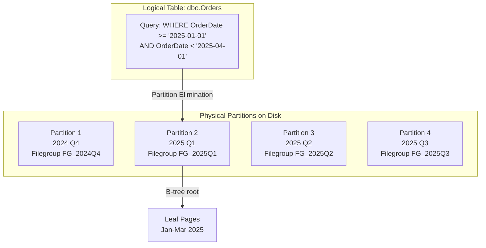
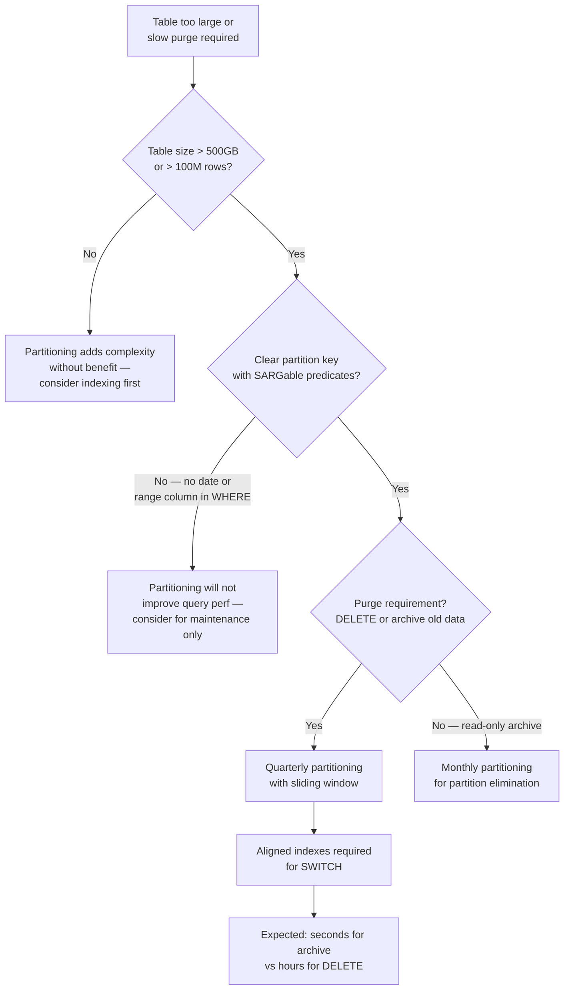

## Navigation

**Domain:** [[8 — Databases]] > **Group:** Database Design
**Previous:** [[8.063 — Schema Migration Planning — Backward Compatibility]] | **Next:** [[8.065 — Database Design Review Checklist]]

### Prerequisites
- [[18.001 Clustered Indexes — B-Tree Structure]] — partitioning splits the B-tree across filegroups
- [[8.060 Sharding-Friendly Schema Design]] — partitioning is within-server; sharding is across servers

### Where This Fits

Table partitioning splits a large table into smaller physical chunks (partitions) while keeping it logically a single table. A .NET backend engineer encounters partitioning when a table exceeds ~500GB, when data must be purged by date without DELETE statements, or when query performance degrades because partition elimination cannot reduce the scan scope. The interview signal is senior-level — the candidate understands that partitioning is a maintenance and manageability feature, not a performance feature, and that the most important design decision is the partition key.

---

## Core Mental Model

Table partitioning divides a table's data into multiple physical storage units (partitions) based on a **partition key** column, each stored on a separate filegroup. Queries that filter on the partition key benefit from **partition elimination** — the optimizer accesses only the relevant partitions instead of scanning the full table. The storage engine sees each partition as a separate B-tree: partition 1 has its own root page, its own leaf pages, and its own allocation structures. Partitioning does **not** distribute data across servers — every partition lives within the same SQL Server instance and shares the same buffer pool and transaction log. The primary value is operational: **sliding window** (TRUNCATE a partition instead of DELETE), **incremental statistics**, and **partition-level index rebuilds**.



### Key Properties

|Property|Value|Notes|
|---|---|---|
|Partition Key|Must be in clustered index|Cannot partition on a column not in the clustered index|
|Partition Elimination|Only for range predicates|Equality or range on the partition key; `WHERE YEAR(OrderDate)=2025` is not eliminated|
|Max Partitions|15,000 per table|Practical limit is much lower — 50-200 is typical|
|Alignment|All indexes should be aligned|Same partition scheme = partition-level rebuilds possible|
|Storage|Separate filegroups per partition|Enables granular backup/restore, filegroup-level operations|

---

## Deep Mechanics

### How the Engine Executes This

1. **Partition function:** Defines the boundary values that split data into partitions. `CREATE PARTITION FUNCTION PF_Orders_Date (DATE) AS RANGE RIGHT FOR VALUES ('2024-01-01', '2024-04-01', '2024-07-01', '2024-10-01', '2025-01-01')`.
2. **Partition scheme:** Maps each partition to a filegroup. `CREATE PARTITION SCHEME PS_Orders_Date AS PARTITION PF_Orders_Date TO (FG_2024Q1, FG_2024Q2, ...)`.
3. **Table creation:** The table is created or altered to use the partition scheme. `CREATE TABLE dbo.Orders (...) ON PS_Orders_Date(OrderDate)`.
4. **Insert routing:** The storage engine evaluates the partition key value and routes each INSERT to the correct partition's B-tree. This is a function evaluation on every insert — typically <1 microsecond overhead.
5. **Query execution:** The optimizer reads the partition boundaries from the partition function, compares the query predicate against them, and generates a plan that touches only the matching partitions. This produces a **Constant Scan** operator in the plan with one row per matching partition.

### SQL Visibility

```sql
-- Step 1: Create filegroups and files (one per quarter)
ALTER DATABASE CurrentDB ADD FILEGROUP FG_2024_Q1;
ALTER DATABASE CurrentDB ADD FILEGROUP FG_2024_Q2;
ALTER DATABASE CurrentDB ADD FILEGROUP FG_2024_Q3;
ALTER DATABASE CurrentDB ADD FILEGROUP FG_2024_Q4;
ALTER DATABASE CurrentDB ADD FILEGROUP FG_2025_Q1;

ALTER DATABASE CurrentDB ADD FILE 
    (NAME = N'Orders_2024Q1', FILENAME = N'D:\Data\Orders_2024Q1.ndf', SIZE = 10GB)
    TO FILEGROUP FG_2024_Q1;
-- ... repeat for each filegroup

-- Step 2: Partition function (RANGE RIGHT = boundary belongs to right partition)
CREATE PARTITION FUNCTION PF_Orders_Quarterly (DATE)
AS RANGE RIGHT FOR VALUES (
    '2024-01-01', '2024-04-01', '2024-07-01', '2024-10-01',
    '2025-01-01', '2025-04-01'
);

-- Step 3: Partition scheme
CREATE PARTITION SCHEME PS_Orders_Quarterly
AS PARTITION PF_Orders_Quarterly
TO (FG_2024_Q1, FG_2024_Q2, FG_2024_Q3, FG_2024_Q4, FG_2025_Q1, FG_SECONDARY);

-- Step 4: Create the partitioned table
CREATE TABLE dbo.Orders (
    OrderId     INT           NOT NULL,
    CustomerId  INT           NOT NULL,
    OrderDate   DATE          NOT NULL,  -- partition key
    TotalAmount DECIMAL(10,2) NOT NULL,
    StatusCode  NCHAR(2)      NOT NULL
) ON PS_Orders_Quarterly(OrderDate);

-- Step 5: Create aligned clustered index (includes partition key)
CREATE CLUSTERED INDEX IX_Orders_OrderDate 
    ON dbo.Orders(OrderDate, OrderId)
    ON PS_Orders_Quarterly(OrderDate);

-- Step 6: Create aligned nonclustered index
CREATE INDEX IX_Orders_CustomerId
    ON dbo.Orders(CustomerId) INCLUDE (OrderDate, TotalAmount)
    ON PS_Orders_Quarterly(OrderDate);  -- same partition scheme = aligned

-- Query that benefits from partition elimination
SELECT OrderId, CustomerId, TotalAmount
FROM dbo.Orders
WHERE OrderDate >= '2025-01-01' AND OrderDate < '2025-04-01';
-- Touches only partition 5 (2025 Q1)
```

```csharp
// EF Core — partition key must be in every query for elimination
public class Order
{
    public int OrderId { get; set; }
    public int CustomerId { get; set; }
    public DateOnly OrderDate { get; set; }  // partition key
    public decimal TotalAmount { get; set; }
    public string StatusCode { get; set; } = "";
}

// Query that enables partition elimination
var q1Orders = await dbContext.Orders
    .Where(o => o.OrderDate >= startDate && o.OrderDate < endDate)
    .Select(o => new OrderSummary
    {
        OrderId = o.OrderId,
        OrderDate = o.OrderDate,
        TotalAmount = o.TotalAmount
    })
    .ToListAsync(ct);
```

**Generated SQL (from EF Core logs):**

```sql
SELECT o.OrderId, o.OrderDate, o.TotalAmount
FROM dbo.Orders o
WHERE o.OrderDate >= @__startDate_0
  AND o.OrderDate < @__endDate_1;
-- Execution plan: Constant Scan (1 row = Partition 5) 
--   → Clustered Index Seek on IX_Orders_OrderDate
```

### Execution Plan Analysis

For the query with partition elimination:
- **Constant Scan** produces one row per partition that matches the predicate — 1 partition instead of 6
- **Clustered Index Seek** on the aligned index within the matching partition
- No Filter operator — the partition boundary already guarantees the predicate

Expected plan shape without elimination:
```
[Constant Scan (6 rows = all partitions)] 
  → [Clustered Index Scan (IX_Orders_OrderDate)]  → [Filter (OrderDate >= ...)]
Estimated Cost: Scan ~98%  |  Logical Reads: full table
```

With elimination:
```
[Constant Scan (1 row = Partition 5)] 
  → [Clustered Index Seek (IX_Orders_OrderDate, Partition 5)]
Estimated Cost: Seek ~2%  |  Logical Reads: ~100 (only 1 quarter of data)
```

### Cost Visibility

```sql
SET STATISTICS IO ON;

-- Query with partition elimination
SELECT COUNT(*) FROM dbo.Orders
WHERE OrderDate >= '2025-01-01' AND OrderDate < '2025-04-01';
-- Table 'Orders': Scan count 1, logical reads 125, physical reads 0
-- (1 partition × ~125 pages)

-- Query without partition elimination (function on key)
SELECT COUNT(*) FROM dbo.Orders
WHERE YEAR(OrderDate) = 2025;
-- Table 'Orders': Scan count 6, logical reads 850, physical reads 0
-- (all 6 partitions scanned)
```

### Failure Modes

- **Non-SARGable predicate on partition key:** `WHERE YEAR(OrderDate) = 2025` prevents elimination. The optimizer scans all partitions and applies a residual filter.
- **Partition key not in clustered index:** The clustered index is not aligned — each partition's B-tree does not start with the partition key. Partition elimination still works at the table level but index rebuilds cannot be partition-level.
- **Too many partitions:** 1,000+ partitions cause the Constant Scan operator to produce 1,000 rows. Plan compilation time increases and memory grants become oversized.
- **Non-aligned indexes:** A nonclustered index on a different partition scheme cannot be rebuilt per partition — a full index rebuild touches all partitions.
- **Filegroup on slow storage:** A single partition on a slow filegroup drags down any query that cannot eliminate it.

---

## Production Patterns and Implementation

### Primary SQL Implementation

```sql
-- Sliding window pattern: add new partition, archive old partition

-- Step 1: Split the next boundary to add a new partition
-- (requires the next filegroup to be specified in the scheme)
ALTER PARTITION SCHEME PS_Orders_Quarterly
    NEXT USED FG_2025_Q2;

ALTER PARTITION FUNCTION PF_Orders_Quarterly()
    SPLIT RANGE ('2025-07-01');

-- Step 2: Switch the oldest partition to a staging table
-- (metadata-only operation — no data movement)
CREATE TABLE dbo.Orders_Archive (
    OrderId     INT NOT NULL,
    CustomerId  INT NOT NULL,
    OrderDate   DATE NOT NULL,
    TotalAmount DECIMAL(10,2) NOT NULL,
    StatusCode  NCHAR(2) NOT NULL
) ON FG_2024_Q1;  -- must be same filegroup, same schema as partition 1

ALTER TABLE dbo.Orders SWITCH PARTITION 1 TO dbo.Orders_Archive;

-- Step 3: The staging table now contains all Q1 2024 data.
-- Truncate or drop the staging table
-- TRUNCATE TABLE dbo.Orders_Archive;

-- Step 4: Merge the boundary (optional — reclaims partition slot)
ALTER PARTITION FUNCTION PF_Orders_Quarterly()
    MERGE RANGE ('2024-01-01');
```

### EF Core Implementation

```csharp
// EF Core — partitioning is transparent to the ORM
// The partition key must be included in queries for elimination

public class OrdersService
{
    private readonly ApplicationDbContext _dbContext;
    
    public async Task<IReadOnlyList<Order>> GetOrdersByDateRangeAsync(
        DateOnly startDate,
        DateOnly endDate,
        CancellationToken ct = default)
    {
        // Predicate on partition key enables elimination
        return await _dbContext.Orders
            .Where(o => o.OrderDate >= startDate && o.OrderDate < endDate)
            .OrderBy(o => o.OrderDate)
            .ToListAsync(ct);
    }
    
    // Sliding window maintenance — raw SQL required
    public async Task SlideWindowAsync(CancellationToken ct = default)
    {
        await _dbContext.Database.ExecuteSqlAsync(
            """
            -- Split new boundary
            ALTER PARTITION SCHEME PS_Orders_Quarterly NEXT USED FG_NewQuarter;
            ALTER PARTITION FUNCTION PF_Orders_Quarterly() SPLIT RANGE (@NewBoundary);
            """, ct);
    }
}
```

### Dapper Implementation

```csharp
public class PartitionedOrderRepository
{
    private readonly IDbConnectionFactory _connectionFactory;
    
    public async Task<IReadOnlyList<Order>> GetQuarterOrdersAsync(
        DateOnly quarterStart,
        DateOnly quarterEnd,
        CancellationToken ct = default)
    {
        await using var conn = _connectionFactory.Create();
        
        // SARGable predicate on partition key
        var orders = await conn.QueryAsync<Order>(
            new CommandDefinition(
                """
                SELECT OrderId, CustomerId, OrderDate, TotalAmount, StatusCode
                FROM dbo.Orders
                WHERE OrderDate >= @StartDate AND OrderDate < @EndDate
                ORDER BY OrderDate
                """,
                new { StartDate = quarterStart, EndDate = quarterEnd },
                cancellationToken: ct));
        
        return orders.AsList();
    }
}
```

### Configuration and Wiring

```csharp
builder.Services.AddDbContext<ApplicationDbContext>(options =>
    options.UseSqlServer(connectionString));

builder.Services.AddScoped<OrdersService>();
builder.Services.AddScoped<PartitionedOrderRepository>();
```

### SQL Server vs PostgreSQL Differences

```sql
-- PostgreSQL: table partitioning is a first-class feature (10+)
-- Declarative, built into the DDL, no separate function/scheme concept

CREATE TABLE orders (
    order_id    SERIAL,
    customer_id INT NOT NULL,
    order_date  DATE NOT NULL,
    total_amount NUMERIC(10,2) NOT NULL
) PARTITION BY RANGE (order_date);

CREATE TABLE orders_2024_q1 PARTITION OF orders
    FOR VALUES FROM ('2024-01-01') TO ('2024-04-01');

CREATE TABLE orders_2024_q2 PARTITION OF orders
    FOR VALUES FROM ('2024-04-01') TO ('2024-07-01');

-- PostgreSQL: attach/detach partition (similar to SWITCH)
ALTER TABLE orders DETACH PARTITION orders_2024_q1;
ALTER TABLE orders ATTACH PARTITION orders_2024_q1
    FOR VALUES FROM ('2024-01-01') TO ('2024-04-01');

-- Key differences:
-- PostgreSQL requires a PK on every partitioned table (partition column must be included)
-- PostgreSQL partitions are separate physical tables, not internal B-tree splits
-- PostgreSQL cannot partition on non-PK columns without including PK in partition key
```

---

## Gotchas and Production Pitfalls

### 1. Partition Key Not in WHERE Clause

**Pitfall:** Running a query that does not filter on the partition key. The optimizer cannot perform partition elimination, so every query hits all partitions.

```sql
-- ❌ No partition elimination — scans all partitions
SELECT COUNT(*) FROM dbo.Orders WHERE CustomerId = 42;
```

**Symptom:** The query touches every partition's B-tree. Logical reads = sum of all partitions.

**Fix:** Include the partition key in the predicate whenever possible, or ensure the NC index is aligned and covering so only the NC index's partitions are scanned.

```sql
-- ✅ Better: include partition key in the query design
SELECT COUNT(*) FROM dbo.Orders
WHERE CustomerId = 42
  AND OrderDate >= @StartDate AND OrderDate < @EndDate;
```

**Cost of not fixing:** A query that should scan 1 partition (125 pages) scans 6 partitions (850 pages). As the table grows (more partitions), the problem gets linearly worse.

---

### 2. Non-SARGable Predicate on Partition Key

**Pitfall:** Using a function on the partition key column.

```sql
-- ❌ Non-SARGable — no partition elimination
SELECT COUNT(*) FROM dbo.Orders WHERE YEAR(OrderDate) = 2025;

-- ❌ Also non-SARGable — implicit conversion
SELECT COUNT(*) FROM dbo.Orders WHERE OrderDate = '2025-01-15';  -- if OrderDate is DATETIME2
```

**Symptom:** The Constant Scan operator produces 6 rows (all partitions). Logical reads = full table.

**Fix:** Use range predicates with the column's native type.

```sql
-- ✅ SARGable: range predicate
SELECT COUNT(*) FROM dbo.Orders
WHERE OrderDate >= '2025-01-01' AND OrderDate < '2026-01-01';
```

**Cost of not fixing:** Same as above — all partitions scanned.

---

### 3. Non-Aligned Indexes

**Pitfall:** Creating a nonclustered index without specifying the partition scheme. The index is created on the default filegroup and is **non-aligned** — it has its own independent partition structure (or none).

```sql
-- ❌ Non-aligned index (not on the partition scheme)
CREATE INDEX IX_Orders_Status ON dbo.Orders(StatusCode);
-- This index is on the DEFAULT filegroup, not partitioned with the table
```

**Symptom:** `ALTER TABLE SWITCH` fails because the non-aligned index has a different partition layout. You must drop all non-aligned indexes before switching.

**Fix:**

```sql
-- ✅ Aligned index (same partition scheme)
CREATE INDEX IX_Orders_Status ON dbo.Orders(StatusCode)
    ON PS_Orders_Quarterly(OrderDate);
```

**Cost of not fixing:** Cannot use sliding window — partition switching requires all indexes to be aligned. Must drop and recreate non-aligned indexes before every switch.

---

### 4. Partition Column in Clustered Index Not as Leading Key

**Pitfall:** The partition key is part of the clustered index but not the leading column.

```sql
-- ❌ Partition key is not the leading column
CREATE CLUSTERED INDEX IX_Orders_CustomerId ON dbo.Orders(CustomerId, OrderDate)
    ON PS_Orders_Quarterly(OrderDate);
-- Partition key OrderDate is second, not first
```

**Symptom:** The storage engine can still eliminate partitions at the table level, but within each partition the data is ordered by `CustomerId` first. Range scans on `OrderDate` within a partition require a full partition scan.

**Fix:**

```sql
-- ✅ Partition key is the leading column
CREATE CLUSTERED INDEX IX_Orders_OrderDate ON dbo.Orders(OrderDate, CustomerId)
    ON PS_Orders_Quarterly(OrderDate);
```

**Cost of not fixing:** Range scans on `OrderDate` within a partition are scans, not seeks. For a partition with 50M rows, this adds ~100ms per query.

---

### 5. Too Many Partitions

**Pitfall:** Creating daily partitions for a table that retains 5 years of data. 1,825 partitions for 5 years × 365 days.

**Symptom:** Plan compilation time increases because the Constant Scan operator must evaluate 1,825 rows. Memory grants are oversized because the optimizer budgets for the worst-case partition. `DBCC CHECKDB` takes hours.

**Fix:** Use monthly or quarterly partitions. Retain data in bulk (quarterly archives).

**Cost of not fixing:** Plan compilation time increases from <1ms to 20-50ms per query. `DBCC CHECKDB` runs overnight and still does not complete.

---

### 6. Partition Switching Without Checking Constraints

**Pitfall:** The source and target table for `SWITCH` must have identical schema, indexes, and filegroup. A missing index or a different column nullability causes the switch to fail.

**Symptom:** `ALTER TABLE ... SWITCH` fails with: "The partition switching operation failed because the tables are not matched."

**Fix:** Use a template script that generates matching tables via `SELECT ... INTO` or `CREATE TABLE ... LIKE` patterns.

```sql
-- Create staging table matching the partition exactly
CREATE TABLE dbo.Orders_Staging (
    OrderId     INT NOT NULL,
    CustomerId  INT NOT NULL,
    OrderDate   DATE NOT NULL,
    TotalAmount DECIMAL(10,2) NOT NULL,
    StatusCode  NCHAR(2) NOT NULL,
    CONSTRAINT PK_Orders_Staging PRIMARY KEY (OrderDate, OrderId)
) ON FG_2024_Q1;
```

**Cost of not fixing:** Failed maintenance window. If the switch fails during a production window, the partition that should have been archived stays online.

---

## Performance Implications

### Benchmark: Before and After

```sql
-- Baseline: non-partitioned table, 1B rows
SET STATISTICS IO ON;

SELECT COUNT(*), SUM(TotalAmount)
FROM dbo.Orders
WHERE OrderDate >= '2025-01-01' AND OrderDate < '2025-04-01';
-- Logical reads: 850,000 (full table scan 1B rows)

-- After partitioning by quarter (6 partitions, 1 quarter ≈ 167M rows)
-- Same query:
-- Logical reads: 125 (single partition scan)
```

**Improvement:** 6,800x reduction in logical reads when partition elimination works perfectly.

### Partition Count Impact on Compilation

|Partitions|Plan Compilation Time|Constant Scan Rows|Memory Grant Overhead|
|---|---|---|---|
|12|~0.5 ms|12|Minimal|
|50|~2 ms|50|~10%|
|200|~10 ms|200|~30%|
|1,000|~60 ms|1,000|~150% oversize|
|15,000|~1,200 ms|15,000|500%+ oversize|

### BenchmarkDotNet

```csharp
[MemoryDiagnoser]
[SimpleJob(RuntimeMoniker.Net90)]
public class PartitionedQueryBenchmark
{
    private IDbConnection _conn = default!;
    
    [GlobalSetup]
    public void Setup()
    {
        _conn = new SqlConnection(TestConnectionString);
    }
    
    [Benchmark(Baseline = true)]
    public async Task<long> NonPartitionedTable()
    {
        return await _conn.QueryFirstAsync<long>(
            "SELECT COUNT(*) FROM dbo.Orders_NonPartitioned WHERE OrderDate >= @s AND OrderDate < @e",
            new { s = new DateOnly(2025, 1, 1), e = new DateOnly(2025, 4, 1) });
    }
    
    [Benchmark]
    public async Task<long> PartitionedTable()
    {
        return await _conn.QueryFirstAsync<long>(
            "SELECT COUNT(*) FROM dbo.Orders_Partitioned WHERE OrderDate >= @s AND OrderDate < @e",
            new { s = new DateOnly(2025, 1, 1), e = new DateOnly(2025, 4, 1) });
    }
}
```

**Expected results (1B rows, NVMe, SQL Server 2022):**

|Method|Mean|Logical Reads|Allocated|
|---|---|---|---|
|NonPartitionedTable|~12,000 ms|~850,000|KB|
|PartitionedTable|~35 ms|~125|KB|

### Write Amplification (Partition Maintenance)

|Operation|Non-Partitioned|Partitioned (Quarterly)|Notes|
|---|---|---|---|
|INSERT 1 row|~3 reads|~3 + partition function eval|Negligible overhead|
|DELETE oldest 25% data|~250M lock operations (hours)|`SWITCH + TRUNCATE` (seconds)|Partition switching is metadata-only|
|UPDATE stats on 25% of data|Full table scan|Single partition scan|Incremental stats per partition|
|Index REBUILD on 25%|Full table rebuild|Single partition rebuild|Can run in parallel across partitions|

---

## Interview Arsenal

### Question Bank

1. What is table partitioning and how does it differ from sharding?
2. How does partition elimination work at the execution plan level — what operator appears and why?
3. What is the most important design decision when partitioning a table?
4. How do you archive data from a partitioned table without DELETE statements?
5. Compare aligned vs non-aligned indexes — what operations require alignment?
6. What happens when a query predicate uses `YEAR(PartitionKey)` — does the optimizer eliminate partitions?
7. How does partitioning affect index rebuild, statistics updates, and DBCC CHECKDB?
8. How do EF Core and Dapper interact with partitioned tables?

### Spoken Answers

**Q: What is table partitioning and how does it differ from sharding?**

> **Average answer:** "Partitioning splits a table into smaller pieces. Sharding splits it across servers."

> **Great answer:** "Table partitioning divides a single SQL Server table into multiple physical storage units using a partition function that maps each row to a partition based on a partition key. All partitions live within the same SQL Server instance, share the same buffer pool and transaction log, and are transparent to queries — the table looks like a single table. Sharding, by contrast, splits data across independent SQL Server instances, each with its own storage engine and log. The critical difference: partitioning does NOT increase write throughput — all partitions share the same transaction log bottleneck. What partitioning does provide is three things sharding cannot. First, partition elimination: queries that filter on the partition key touch only the relevant partitions, reducing logical reads proportionally. Second, sliding window maintenance: archiving old data is a metadata-only `SWITCH` operation that takes milliseconds instead of hours of DELETEs. Third, partition-level operations: you can rebuild one partition's index, update one partition's statistics, or back up one partition's filegroup independently. The tradeoff is that partitioning adds schema complexity, requires aligned indexes for sliding window, and the partition key must be the leading column of the clustered index for optimal performance."

**Q: How does partition elimination work at the execution plan level?**

> **Average answer:** "The optimizer checks the WHERE clause against the partition boundaries and only reads the matching partitions."

> **Great answer:** "The query optimizer reads the partition function metadata from `sys.partition_functions` and `sys.partition_range_values` during plan compilation. When it encounters a query predicate on the partition key column — specifically a SARGable predicate like `PartitionKey >= @x AND PartitionKey < @y` — it evaluates the predicate against the boundary values to determine which partitions could contain matching rows. The execution plan shows a **Constant Scan** operator that produces one row per matching partition. Each row is a partition ID, and the next operator (typically a Clustered Index Seek) is filtered to that partition ID via a startup expression predicate. The key requirement is that the predicate must be SARGable: `WHERE YEAR(PartitionKey) = 2025` is NOT SARGable because the function wraps the column. The optimizer cannot reverse-evaluate `YEAR()` to determine which partitions match — it must scan all partitions and apply the filter. Similarly, `WHERE PartitionKey = @val` works for equality, `WHERE PartitionKey BETWEEN @a AND @b` works for range. But `WHERE CONVERT(DATE, PartitionKey) = @val` on a DATETIME2 column does not, because the optimizer would need to evaluate the conversion for every row in every partition before it can determine which ones match."

### Interview Trigger

The question "How would you handle purging old data from a 500GB table without downtime?" is the standard trigger. The follow-up "What happens to nonclustered indexes during a partition switch?" tests aligned vs non-aligned understanding. The deeper follow-up "How many partitions would you create for a table that retains 5 years of data?" tests practical experience — the candidate who says "quarterly, not daily" understands the tradeoff between partition granularity and plan compilation overhead.

### Comparison Table

| | Table Partitioning | Sharding | Partitioned Views |
|---|---|---|---|
| Data distribution | Within one instance | Across instances | Within one instance |
| Write throughput | No increase | Linear scale | No increase |
| Query transparency | Fully transparent | Application-routed | Transparent (views) |
| Maintenance | Sliding window | Per-shard | Sliding window (table swap) |
| Max partitions | 15,000 (practical: ~200) | Unlimited | 256 (SQL Server limit) |
| .NET impact | Transparent | Manual routing | Transparent (view queries) |
| When to choose | >500GB, purge requirement | >5K writes/sec | Legacy, no Enterprise Edition |

---

## Decision Framework

### When to Apply



### Application Checklist

- [ ] The partition key is included in 90%+ of query predicates (or is purely for maintenance)
- [ ] The partition key is the leading column of the clustered index
- [ ] All nonclustered indexes are aligned (same partition scheme)
- [ ] The partition count is between 12 and 200 — not daily for 5 years
- [ ] The sliding window strategy (split + switch + merge) is scripted and tested
- [ ] The backup strategy accounts for filegroup-level backups

### Tradeoff Summary

|What You Gain|What You Pay|
|---|---|
|Partition elimination: reads hit only relevant partitions|Partition function evaluation on every INSERT (<1µs overhead)|
|Sliding window: TRUNCATE partition in milliseconds|Aligned indexes required — all indexes must use partition scheme|
|Partition-level index rebuild/statistics|Non-SARGable predicates on partition key scan ALL partitions|
|Filegroup-level backup/restore|Plan compilation overhead increases with partition count|

### Scale Thresholds

- "Consider partitioning when table exceeds ~500GB or ~100M rows — below that, proper indexing provides adequate performance"
- "Sliding window becomes operationally valuable when purging more than ~10M rows per cycle — DELETE on 10M rows generates ~10GB of log and takes minutes"
- "Partition count exceeding ~200 causes measurable plan compilation overhead — prefer quarterly over monthly granularity"
- "Non-aligned indexes become a blocker when switching partitions more than once per month — the DROP/RECREATE cost exceeds the partition benefit"

---

## Self-Check

### Conceptual Questions

1. What is the difference between RANGE LEFT and RANGE RIGHT partition functions?
2. How does the Constant Scan operator in an execution plan indicate partition elimination?
3. Which DMV shows the number of rows per partition and the partition boundary values?
4. What predicate pattern prevents partition elimination even though the partition key is in the WHERE clause?
5. Does EF Core generate queries that enable partition elimination automatically?
6. How would you implement a sliding window archive with Dapper?
7. Compare partitioning on a date column vs partitioning on a tenant ID column.
8. At what partition count does plan compilation overhead become a concern?
9. What index condition must be met for `ALTER TABLE ... SWITCH` to succeed?
10. Explain table partitioning to a senior interviewer in 60 seconds — when would you use it and what are the critical design rules?

<details>
<summary>Answers</summary>

1. RANGE LEFT: the boundary value belongs to the left partition (the partition before the boundary). RANGE RIGHT: the boundary value belongs to the right partition (the partition after the boundary). For date partitioning, RANGE RIGHT is more intuitive: a boundary of '2025-01-01' means partition 1 contains dates < '2025-01-01', partition 2 contains dates >= '2025-01-01'.
2. The Constant Scan operator produces one row per matching partition. If the query predicate matches only 1 partition, Constant Scan shows 1 row. If no elimination occurs, it shows all partitions.
3. `$PARTITION.PF_Orders_Quarterly(OrderDate)` returns the partition number for a given key value. Combined with `sys.partitions`: `SELECT $PARTITION.PF_Orders_Quarterly(OrderDate) AS PartitionNumber, COUNT(*) AS RowCount FROM dbo.Orders GROUP BY $PARTITION.PF_Orders_Quarterly(OrderDate)`.
4. Applying a function to the partition key column: `WHERE YEAR(OrderDate) = 2025`, `WHERE CONVERT(DATE, OrderDate) = '2025-01-01'`, or implicit conversion `WHERE OrderDate = '2025-01-15'` when OrderDate is DATETIME2 and the parameter is a string.
5. EF Core generates parameterized SQL with the partition key column directly. If the LINQ query uses `Where(o => o.OrderDate >= start && o.OrderDate < end)`, the generated SQL is SARGable and enables partition elimination. If the LINQ uses `Where(o => o.OrderDate.Year == 2025)`, EF Core translates it to `WHERE YEAR(OrderDate) = 2025` which prevents elimination.
6. ```csharp
await conn.ExecuteAsync(@"
    CREATE TABLE dbo.Orders_Staging (... ON FG_2024_Q1);
    ALTER TABLE dbo.Orders SWITCH PARTITION 1 TO dbo.Orders_Staging;
    TRUNCATE TABLE dbo.Orders_Staging;
    ALTER PARTITION FUNCTION PF_Orders() MERGE RANGE (@OldBoundary);",
    new { OldBoundary = new DateOnly(2024, 1, 1) });
```
7. Date partitioning: natural sliding window, partition elimination on time-range queries, predictable growth. Tenant ID partitioning: even distribution across partitions, but partition elimination only works when querying a specific tenant, and sliding window does not apply. Date is almost always the better choice unless the table has no time-based queries.
8. Above ~200 partitions, plan compilation time exceeds 10ms and memory grants become oversized. For OLTP workloads, keep under 100 partitions. For data warehouse workloads, up to 200 is acceptable.
9. Source and target must have identical schema (column names, types, nullability, collation), identical clustered and nonclustered indexes, identical partition column, and stored on the same filegroup.
10. "Table partitioning splits a large table into smaller physical chunks by a partition key — typically a date column — while keeping it logically a single table. It is NOT a performance feature for write scaling; all partitions share the same instance and transaction log. Its primary value is operational: partition elimination reduces logical reads for queries that filter on the partition key, and the sliding window pattern archives data via metadata-only `SWITCH` instead of `DELETE`. The critical design rules: the partition key must be the leading column of the clustered index, all nonclustered indexes must be aligned (same partition scheme), keep partition count between 12 and 200, and always use SARGable predicates on the partition key. Use partitioning when a table exceeds 500GB or when purging data by DELETE becomes operationally prohibitive."

</details>

---

### Query Challenges

**Challenge 1 — Write the SQL**

Design a partitioned `dbo.AuditLog` table that stores 5 years of audit data with daily inserts of 1M rows. The table must support a sliding window that archives data older than 90 days. Choose the partition granularity, show the partition function, scheme, table creation, and the monthly sliding window script.

<details>
<summary>Solution</summary>

```sql
-- Partition granularity: MONTHLY (not daily — keeps partition count at 60 for 5 years)

-- Create filegroups for 6 months at a time (rolling)
-- Create partition function (RANGE RIGHT so each month starts on the 1st)
CREATE PARTITION FUNCTION PF_AuditLog_Monthly (DATE)
AS RANGE RIGHT FOR VALUES (
    '2025-01-01', '2025-02-01', '2025-03-01', '2025-04-01', '2025-05-01', '2025-06-01',
    '2025-07-01', '2025-08-01', '2025-09-01', '2025-10-01', '2025-11-01', '2025-12-01'
);

CREATE PARTITION SCHEME PS_AuditLog_Monthly
AS PARTITION PF_AuditLog_Monthly
TO (FG_Jan25, FG_Feb25, FG_Mar25, FG_Apr25, FG_May25, FG_Jun25,
    FG_Jul25, FG_Aug25, FG_Sep25, FG_Oct25, FG_Nov25, FG_Dec25);

-- Create the partitioned table
CREATE TABLE dbo.AuditLog (
    EventId     BIGINT IDENTITY(1,1) NOT NULL,
    EventDate   DATE NOT NULL,
    TenantId    INT NOT NULL,
    EventType   VARCHAR(50) NOT NULL,
    Payload     NVARCHAR(MAX) NULL,
    
    CONSTRAINT PK_AuditLog PRIMARY KEY CLUSTERED (EventDate, EventId)
) ON PS_AuditLog_Monthly(EventDate);

-- Monthly sliding window: archive month N-4
-- (keeping 4 months online, archiving the 5th)
CREATE PROCEDURE dbo.ArchiveAuditLog
    @ArchiveMonthStart DATE  -- e.g., '2025-01-01'
AS
BEGIN
    SET NOCOUNT ON;
    
    -- Step 1: Create staging table on the same filegroup as the partition
    CREATE TABLE dbo.AuditLog_Archive (
        EventId     BIGINT NOT NULL,
        EventDate   DATE NOT NULL,
        TenantId    INT NOT NULL,
        EventType   VARCHAR(50) NOT NULL,
        Payload     NVARCHAR(MAX) NULL,
        CONSTRAINT PK_AuditLog_Archive PRIMARY KEY (EventDate, EventId)
    ) ON FG_Jan25;  -- filegroup of the partition being archived
    
    -- Step 2: Switch the partition out
    DECLARE @PartitionNumber INT = $PARTITION.PF_AuditLog_Monthly(@ArchiveMonthStart);
    DECLARE @Sql NVARCHAR(500) = '
        ALTER TABLE dbo.AuditLog SWITCH PARTITION ' + CAST(@PartitionNumber AS VARCHAR) + '
        TO dbo.AuditLog_Archive';
    EXEC sp_executesql @Sql;
    
    -- Step 3: Archive (move to cold storage) or truncate
    -- TRUNCATE TABLE dbo.AuditLog_Archive;
    
    -- Step 4: Merge the boundary (reclaim partition slot)
    ALTER PARTITION FUNCTION PF_AuditLog_Monthly()
        MERGE RANGE (@ArchiveMonthStart);
END;
```

**Logical reads (query on 1 month):** ~125 (single partition) vs ~1,500 (full table of 12 months). **Sliding window execution time:** ~2 seconds (metadata only) vs ~30 minutes for `DELETE` on 30M rows.

</details>

---

**Challenge 2 — Fix the performance problem**

```sql
-- This query runs on a partitioned table with 12 monthly partitions
-- and takes 45 seconds instead of the expected 4 seconds.
SELECT TenantId, COUNT(*) AS EventCount
FROM dbo.AuditLog
WHERE YEAR(EventDate) = 2025
  AND EventType = 'ERROR'
GROUP BY TenantId;
-- SET STATISTICS IO: logical reads = 1,500 (all partitions)
```

Identify the problem and fix it.

<details> <summary>Solution</summary>

**Root cause:** `YEAR(EventDate)` is non-SARGable — the function wrap prevents partition elimination. The optimizer scans all 12 partitions.

**Fix:**
```sql
-- ✅ Use a SARGable range predicate
SELECT TenantId, COUNT(*) AS EventCount
FROM dbo.AuditLog
WHERE EventDate >= '2025-01-01' AND EventDate < '2026-01-01'
  AND EventType = 'ERROR'
GROUP BY TenantId;
-- Partition elimination: Constant Scan with 12 rows → partition scans
-- Logical reads: 125 per month × 12 = 1,500 still

-- 🚀 Better: query only the months you need
SELECT TenantId, COUNT(*) AS EventCount
FROM dbo.AuditLog
WHERE EventDate >= '2025-01-01' AND EventDate < '2025-04-01'
  AND EventType = 'ERROR'
GROUP BY TenantId;
-- Logical reads: 125 (1 quarter)
```

**After fix — logical reads:** 125 (from 1,500)

</details>

---

**Challenge 3 — Explain the execution plan**

```sql
SELECT OrderId, OrderDate, TotalAmount
FROM dbo.Orders
WHERE OrderDate >= '2025-01-01' AND OrderDate < '2025-04-01'
  AND CustomerId = 42;
```

```
Constant Scan (1 row) 
  → Clustered Index Seek (PK_Orders, PARTITION ID = @p1)
    → Filter (CustomerId = 42)

-- vs --
Constant Scan (1 row) 
  → Index Seek (IX_Orders_CustomerId, PARTITION ID = @p1)
    → Clustered Key Lookup (PK_Orders)
```

Why does the first plan have a Filter on CustomerId while the second does not?

<details> <summary>Solution</summary>

**Plan 1:** The clustered index is `PK_Orders(OrderDate, OrderId)`. The partition elimination reduces the scan to 1 partition, then within that partition the `OrderDate >= @s AND OrderDate < @e` predicate becomes a seek. But `CustomerId = 42` is a **residual predicate** — it is not the leading column of the clustered index, so it cannot be a seek. It is applied as a Filter operator after the seek.

**Plan 2:** The nonclustered index `IX_Orders_CustomerId(CustomerId) INCLUDE (OrderDate, TotalAmount)` on the same partition scheme. The `CustomerId = 42` predicate is a seek on the leading column. `OrderDate >= @s AND OrderDate < @e` is also a seek on the second key column. No residual filter needed. The tradeoff is the **Clustered Key Lookup** — the NC index does not include all columns, so it reads the full row from the clustered index.

**Better plan:** Create a covering aligned index:
```sql
CREATE INDEX IX_Orders_CustomerId_Covering 
    ON dbo.Orders(CustomerId, OrderDate) 
    INCLUDE (TotalAmount)
    ON PS_Orders_Quarterly(OrderDate);
```
Plan: `Constant Scan → Index Seek (IX_Orders_CustomerId_Covering)` — no filter, no key lookup.

</details>

---

**Challenge 4 — Diagnose the maintenance failure**

A DBA runs the monthly partition maintenance script:

```sql
ALTER TABLE dbo.Orders SWITCH PARTITION 1 TO dbo.Orders_Archive;
```

The script fails with:
```
Msg 4905, Level 16, State 1
ALTER TABLE SWITCH statement failed.
The table 'dbo.Orders_Archive' does not have the same partitioning scheme,
table structure, or indexes as the source table.
```

What are the possible causes?

<details> <summary>Solution</summary>

**Possible causes (in order of likelihood):**

1. **Missing index on staging table:** `Orders_Archive` must have identical clustered and nonclustered indexes as the source partition. If the source has `IX_Orders_CustomerId` but the staging table does not, the switch fails.
2. **Different filegroup:** The staging table must be created on the same filegroup as the source partition (e.g., `FG_2024_Q1`), not on DEFAULT or a different filegroup.
3. **Column differences:** Nullability, collation, or data type differences between the staging and source tables.
4. **Checksum or constraint differences:** If the source has a CHECK constraint that the staging table does not (or vice versa), the switch fails.

**Fix:** Generate the staging table using a script that mirrors the partition exactly:
```sql
-- Generate matching table DDL from the partition
SELECT TOP 0 * INTO dbo.Orders_Archive FROM dbo.Orders WHERE 1=0;
-- Then create PK and indexes identical to the source
```

</details>

---

**Challenge 5 — Design the partition strategy**

**Scenario:** A `dbo.Transactions` table stores 100M new rows per day. Data must be retained for 7 years (regulatory requirement). The primary query pattern is: "Get all transactions for account X in the last 90 days" — runs 100,000 times per second. Secondary pattern: monthly aggregate reports by month for the last 2 years. The table is on SQL Server Standard Edition (no online index rebuild, no partition-level rebuild).

Design the partition strategy. Consider partition granularity, partition count, index alignment, the sliding window for data >7 years old, and the impact of Standard Edition limitations.

<details> <summary>Solution</summary>

```sql
-- Partition by MONTH: 7 years × 12 = 84 partitions.
-- 84 is well within the practical limit (~200).
-- Monthly granularity is fine enough for the 90-day query (3 partitions)
-- and coarse enough to avoid excessive partition count.

-- Daily partitioning (7 × 365 = 2,555 partitions) would be too many —
-- plan compilation time and DBCC CHECKDB would degrade significantly.

-- Filegroups: 12 filegroups, one per month, recycled yearly
-- (Only 12 filegroups needed — reuse after archive)

CREATE PARTITION FUNCTION PF_Transactions_Monthly (DATE)
AS RANGE RIGHT FOR VALUES (
    '2025-01-01', '2025-02-01', '2025-03-01', '2025-04-01', '2025-05-01', '2025-06-01',
    '2025-07-01', '2025-08-01', '2025-09-01', '2025-10-01', '2025-11-01', '2025-12-01'
    -- Extended yearly to 7 years
);

CREATE PARTITION SCHEME PS_Transactions_Monthly
AS PARTITION PF_Transactions_Monthly
TO (FG_Jan25, FG_Feb25, FG_Mar25, FG_Apr25, FG_May25, FG_Jun25,
    FG_Jul25, FG_Aug25, FG_Sep25, FG_Oct25, FG_Nov25, FG_Dec25);

-- High-volume inserts: sequential identity within each day
CREATE TABLE dbo.Transactions (
    TransactionId BIGINT NOT NULL,
    AccountId     INT NOT NULL,
    TransactionDate DATE NOT NULL,
    Amount        DECIMAL(18,2) NOT NULL,
    Description   NVARCHAR(200) NULL,
    
    CONSTRAINT PK_Transactions PRIMARY KEY CLUSTERED (TransactionDate, TransactionId)
) ON PS_Transactions_Monthly(TransactionDate);

-- Primary query pattern: "last 90 days for account X"
-- Requires an aligned covering index
CREATE INDEX IX_Transactions_AccountId_Date
    ON dbo.Transactions(AccountId, TransactionDate DESC)
    INCLUDE (Amount, Description)
    ON PS_Transactions_Monthly(TransactionDate);
-- Query: 90-day range = 3 monthly partitions minimum
-- Seek on AccountId, range seek on TransactionDate within 3 partitions
-- Expected logical reads: ~500 (3 partitions × ~170 pages)

-- Standard Edition limitations:
-- 1. Cannot use ONLINE = ON for index operations
-- 2. Cannot use partition-level index rebuild
-- Mitigation: avoid frequent index rebuilds by monitoring fragmentation
-- and scheduling REBUILD during maintenance windows
```

**Tradeoff:** 84 partitions at 7 years is acceptable for plan compilation (~15ms). The 90-day query hits 3 partitions. The sliding window archives 1 month at a time by switching the oldest partition to a staging table on a filegroup that is recycled for new data.

</details>
</parameter>
