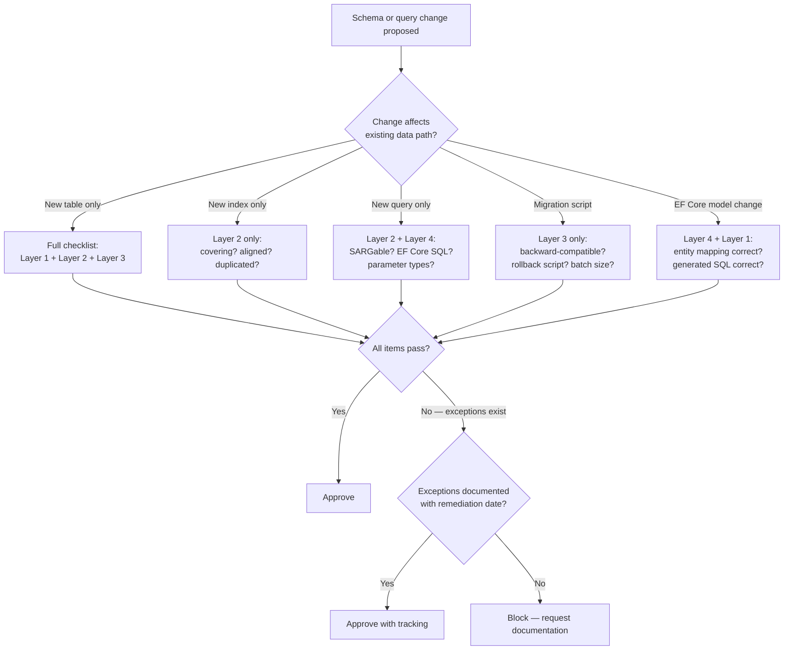

## Navigation

**Domain:** [[8 — Databases]] > **Group:** Database Design
**Previous:** [[8.064 — Table Partitioning Design Decisions]] | **Next:** (Group 2 completed — proceed to Group 3: SQL Fundamentals)

### Prerequisites
- [[8.031 First Normal Form (1NF) — Eliminating Repeating Groups]] — normalization fundamentals are the baseline for any review
- [[8.062 Database Anti-Patterns — Common Design Mistakes]] — recognizing anti-patterns is the primary review skill

### Where This Fits

This checklist is the synthesis of every topic in Group 2 — a structured review framework for database schema design in .NET production systems. A senior engineer uses this checklist during code review to catch schema problems before they reach production. Each item is derived from a production incident pattern documented in the preceding notes. The checklist is organized by review pass: structural review first (keys, types, normalization), then performance review (indexes, SARGability), then operational review (migration, partitioning, audit).

---

## Core Mental Model

A database design review is a systematic inspection of schema artifacts (CREATE TABLE, CREATE INDEX, EF Core entity configurations, Dapper queries) against known failure patterns. Each check item is a binary question: does this design violate a rule that has caused a production incident? The reviewer works through four layers: **correctness** (does it store and retrieve data correctly?), **performance** (will it degrade under load?), **operational** (can we maintain it without downtime?), and **.NET integration** (does the ORM generate correct SQL?). The invariant: every schema that passes all four layers is safe to deploy; any schema that fails a check requires a documented exception with a mitigation plan.

```mermaid
flowchart TD
    Review[Database Design Review] --> Correctness[Layer 1: Correctness]
    Review --> Performance[Layer 2: Performance]
    Review --> Operational[Layer 3: Operational]
    Review --> DotNet[Layer 4: .NET Integration]
    
    Correctness --> C1[Normalization ≥ 3NF?]
    Correctness --> C2[PK chosen correctly?]
    Correctness --> C3[FKs with proper constraints?]
    Correctness --> C4[Data types appropriate?]
    
    Performance --> P1[Clustered key narrow & sequential?]
    Performance --> P2[NC indexes covering?]
    Performance --> P3[SARGable predicates?]
    Performance --> P4[No implicit conversions?]
    
    Operational --> O1[Backward-compatible migration?]
    Operational --> O2[Sliding window for large tables?]
    Operational --> O3[Audit columns present?]
    Operational --> O4[NULL handling documented?]
    
    DotNet --> D1[EF Core generates SARGable SQL?]
    DotNet --> D2[No SELECT * in production?]
    DotNet --> D3[Dapper params match column types?]
    DotNet --> D4[Connection management correct?]
```



### Key Properties

|Property|Value|Notes|
|---|---|---|
|Review Layers|Correctness → Performance → Operational → .NET|Ordered by severity; correctness blocks deployment|
|Pass/Fail|Binary per item|Each item is a yes/no question|
|Exception Policy|Documented + mitigated|Any fail must have a written exception with a scheduled remediation|
|Review Trigger|New table, new index, new query, schema migration|Review at design time, not after deployment|
|Automation|60% of checks automatable|Use SSDT analysis, SQL Prompt, custom scripts, EF Core analysis|

---

## Deep Mechanics

### How the Review Executes

A database design review follows a structured walk-through, typically as part of a pull request that includes a migration script or EF Core model changes:

1. **Schema diff review:** Compare the proposed schema against the current schema. Look for dropped columns, type changes, NOT NULL additions — any change that is not backward-compatible.
2. **CREATE TABLE analysis:** For each new table, evaluate the PK choice, data types, FK constraints, default values, and NULL handling against the checklist.
3. **Index review:** For each new index, evaluate key column order, INCLUDE columns, fill factor, and alignment (if partitioning). Check for covering indexes for known query patterns.
4. **Query pattern review:** For each new or modified query (in stored procedures, EF Core LINQ, or Dapper SQL), check SARGability, implicit conversions, and plan shape.
5. **Migration script review:** For migration scripts, verify expand-contract pattern, batch sizes for backfill, and rollback scripts.
6. **ORM configuration review:** For EF Core, review entity configuration, query filters, and `Select()` usage. For Dapper, review parameter types and connection management.

### SQL Visibility

```sql
-- Items the reviewer examines in a CREATE TABLE statement:

CREATE TABLE dbo.Orders (
    -- [CHECK] PK type: INT (✓), BIGINT (needed?), GUID (FAIL - random clustered)
    -- [CHECK] PK sequential: IDENTITY (✓), SEQUENCE (✓), NEWSEQUENTIALID (acceptable)
    OrderId INT IDENTITY(1,1) NOT NULL,
    
    -- [CHECK] FK column type matches PK type of referenced table (INT → INT, not INT → BIGINT)
    -- [CHECK] FK column nullable? If FK is NULLable, what does a NULL mean?
    CustomerId INT NOT NULL,
    
    -- [CHECK] Date type: DATE vs DATETIME2 vs DATETIME — do we need time?
    -- [CHECK] Partition key? If partitioning by date, this must be leading PK column
    OrderDate DATE NOT NULL,
    
    -- [CHECK] Money type: DECIMAL(18,2) (✓), FLOAT (FAIL), MONEY (acceptable but non-portable)
    TotalAmount DECIMAL(10,2) NOT NULL,
    
    -- [CHECK] Variable length: reasonable max? NVARCHAR(MAX) for names? FAIL.
    StatusCode NCHAR(2) NOT NULL DEFAULT 'NW',
    
    -- [CHECK] Audit columns present for tables with mutable data
    CreatedAt DATETIME2(0) NOT NULL DEFAULT SYSDATETIME(),
    ModifiedAt DATETIME2(0) NOT NULL DEFAULT SYSDATETIME(),
    
    CONSTRAINT PK_Orders PRIMARY KEY CLUSTERED (OrderId),
    CONSTRAINT FK_Orders_Customers FOREIGN KEY (CustomerId) 
        REFERENCES dbo.Customers(CustomerId)
);
```

```csharp
// Items the reviewer examines in EF Core entity configuration:

public class OrderConfiguration : IEntityTypeConfiguration<Order>
{
    public void Configure(EntityTypeBuilder<Order> entity)
    {
        // [CHECK] Table name matches convention (plural? singular? consistency)
        entity.ToTable("Orders");
        
        // [CHECK] PK type and generation
        // [CHECK] IsClustered() — is this the right clustered key?
        entity.HasKey(e => e.OrderId)
              .IsClustered();
        
        // [CHECK] Identity vs Hi-Lo vs Sequence
        entity.Property(e => e.OrderId)
              .UseIdentityColumn(1, 1);
        
        // [CHECK] FK configured with proper delete behavior
        entity.HasOne(e => e.Customer)
              .WithMany(e => e.Orders)
              .HasForeignKey(e => e.CustomerId)
              .OnDelete(DeleteBehavior.Restrict);  // NO CASCADE
        
        // [CHECK] Query filter — does it enable partition elimination?
        entity.HasQueryFilter(e => e.OrderDate >= _minDate);
        
        // [CHECK] Indexes match known query patterns
        entity.HasIndex(e => new { e.CustomerId, e.OrderDate })
              .IsClustered(false);
    }
}
```

### Execution Plan Analysis (Review Context)

When reviewing a query, the reviewer mentally traces the expected plan:

```
SELECT o.OrderId, o.TotalAmount
FROM dbo.Orders o
WHERE o.CustomerId = @id;
```

Expected plan with proper indexes:
```
[Index Seek (IX_Orders_CustomerId)] — cost 20%
  → [Clustered Key Lookup (PK_Orders)] — cost 80%
```
**Review question:** Is the key lookup acceptable? If the query runs 100K times/second, add `INCLUDE (TotalAmount)` to eliminate the lookup.

### Failure Modes (in Review)

- **Missing FK:** No foreign key between Orders and Customers. The application enforces referential integrity — but a bug, a data import, or a manual SQL query can create orphaned rows.
- **Wrong data type:** NVARCHAR(MAX) for a field that stores exactly 50 characters. This prevents in-row storage and forces LOB reads.
- **No audit columns:** The table tracks mutable data but has no `CreatedAt`, `ModifiedAt`, or `ModifiedBy`. When data changes, no one knows who changed it or when.
- **No index for the primary query pattern:** The application queries by `CustomerId` but there is no index on `CustomerId`. Every query does a full clustered index scan.

---

## Production Patterns and Implementation

### Complete Review Checklist

The checklist below is organized into 4 layers with 10 items each. A design passes if it answers "Yes" to all 10 items in each applicable layer.

#### Layer 1 — Correctness (10 items)

|#|Check Item|Pass Criteria|Fail Example|Reference|
|---|---|---|---|---|
|1|Primary key exists|Every table has a PK (clustered by default)|`CREATE TABLE Orders (...)` with no PK|[[8.045]]|
|2|PK is narrow and stable|PK ≤ 16 bytes, immutable after insert|`VARCHAR(200)` PK that gets updated|[[8.042]]|
|3|FKs enforce referential integrity|Every relationship has a FK constraint|No FK between `Orders.CustomerId` and `Customers`|[[8.046]]|
|4|Data types are minimal|Shortest type that fits the domain|`NVARCHAR(MAX)` for `StateCode`|[[8.062]]|
|5|NULL handling is explicit|NULL meaning is documented; COALESCE/NULLIF used correctly|`PhoneNumber INT NULL` — is NULL "no phone" or "unknown"?|[[8.082]]|
|6|No comma-separated values|All multi-value relationships use junction tables|`ProductIds VARCHAR(500)` with comma-separated IDs|[[8.031]]|
|7|No EAV pattern|No `(EntityId, AttributeName, AttributeValue)` tables for variable attributes|`ProductAttributes(ProductId, Name, Value)`|[[8.056]]|
|8|No One True Lookup Table|Each domain has its own lookup table|`Lookups(LookupType, LookupCode, LookupValue)` for all enums|[[8.062]]|
|9|No polymorphic associations|FKs reference a single table, not a `(Type, Id)` pair|`Notes(RelatedType, RelatedId)`|[[8.057]]|
|10|CHECK constraints for domains|Enum-like columns have CHECK constraints|`StatusCode NCHAR(2)` without CHECK|[[8.031]]|

#### Layer 2 — Performance (10 items)

|#|Check Item|Pass Criteria|Fail Example|Reference|
|---|---|---|---|---|
|1|Clustered key is sequential|IDENTITY, SEQUENCE, or NEWSEQUENTIALID|`UNIQUEIDENTIFIER` with `NEWID()`|[[8.043]]|
|2|NC indexes support query patterns|Index exists for each WHERE/JOIN/ORDER BY used in high-frequency queries|`WHERE CustomerId = @id` with no index on `CustomerId`|[[8.061]]|
|3|NC indexes are covering where justified|High-frequency queries have INCLUDE columns to avoid key lookups|`SELECT TotalAmount` with NC index that does not include it|[[8.061]]|
|4|No over-indexing|Index count ≤ 5-8 per table for OLTP; no unused indexes|30 indexes on a table with 10K inserts/sec|[[8.062]]|
|5|No implicit conversions|Column and parameter types match exactly|`VARCHAR` column compared to `NVARCHAR` parameter|[[8.093]]|
|6|SARGable predicates|No functions on columns in WHERE clauses|`WHERE YEAR(OrderDate) = 2025`|[[8.094]]|
|7|No SELECT * in production|Views and queries specify exact column lists|`SELECT * FROM dbo.Orders` in a stored procedure|[[8.062]]|
|8|No NOLOCK on critical data|RCSI enabled instead; NOLOCK used only for approximate counts|`WITH (NOLOCK)` on balance queries|[[8.062]]|
|9|Date types use DATE/DATETIME2|No legacy DATETIME or FLOAT for dates|`DATETIME` (less precise, legacy format)|[[8.079]]|
|10|Monetary values use DECIMAL|No FLOAT or REAL for financial columns|`TotalAmount FLOAT`|[[8.062]]|

#### Layer 3 — Operational (10 items)

|#|Check Item|Pass Criteria|Fail Example|Reference|
|---|---|---|---|---|
|1|Audit columns present|Tables with mutable data have `CreatedAt`, `ModifiedAt`|`UPDATE` with no timestamp tracking|[[8.049]]|
|2|Soft delete has a plan|If using IsDeleted, there is a filtered index and purge strategy|`IsDeleted BIT` with no index and no archive|[[8.048]]|
|3|Migration is backward-compatible|Expand-contract; no breaking changes in one release|`sp_rename` or `ALTER COLUMN NOT NULL` in a migration|[[8.063]]|
|4|Large tables have purge strategy|Tables >100M rows have sliding window or batch DELETE plan|No archive script for a 500GB log table|[[8.064]]|
|5|NULLable columns are justified|No column is nullable without documented semantics|`DiscountRate DECIMAL(5,2) NULL` — why?|[[8.082]]|
|6|Multi-tenancy is explicit|Tenant isolation pattern chosen and applied consistently|`TenantId INT` but no query filter enforces it|[[8.050]]|
|7|Default values use database functions|`DEFAULT SYSDATETIME()` not `DEFAULT GETDATE()` for new tables|`DEFAULT '1900-01-01'` for date columns|[[8.031]]|
|8|String lengths are bounded|No NVARCHAR(MAX) for columns with known max length|`Email NVARCHAR(MAX)`|[[8.062]]|
|9|RI delete behavior is appropriate|NO ACTION or RESTRICT for most FKs; CASCADE only for true dependencies|`ON DELETE CASCADE` on all FKs|[[8.062]]|
|10|Connection strings are secure|No hardcoded credentials; managed identity or connection string in Key Vault|`Server=.;Database=...;User Id=sa;Password=...`|—|

#### Layer 4 — .NET Integration (10 items)

|#|Check Item|Pass Criteria|Fail Example|Reference|
|---|---|---|---|---|
|1|EF Core query generates SARGable SQL|LINQ does not translate to functions on columns|`Where(o => o.OrderDate.Year == 2025)`|[[8.094]]|
|2|No N+1 queries|`Include()` or `Select()` used correctly; no lazy load in loops|`foreach` accessing navigation properties without eager loading|—|
|3|Projection matches query need|`Select()` used instead of tracking full entities|`ToList()` then `Select()` in memory|[[8.062]]|
|4|Dapper parameter types match columns|Explicit `DbType` for VARCHAR/CHAR columns|`string` for a `VARCHAR` column (defaults to NVARCHAR)|[[8.093]]|
|5|Async all the way|No `.Result` or `.Wait()` on async queries|`dbContext.Orders.ToListAsync().Result`|—|
|6|Cancellation tokens propagated|Every data access method accepts `CancellationToken`|No `ct` parameter on repository methods|—|
|7|Connection management is correct|`await using` or `using` for connections; no leaked connections|`new SqlConnection(...)` without `using`|—|
|8|Retry policy configured|EF Core `EnableRetryOnFailure()` or Polly for transient faults|No retry on `SqlException` for timeouts|[[8.909]]|
|9|Query filters for multi-tenancy/soft delete|Global query filters enforce tenant isolation and soft delete filtering|Missing `HasQueryFilter` for `TenantId`|[[8.889]]|
|10|No SQL injection|Parameterized queries; no string concatenation|`$"SELECT * FROM Orders WHERE Id = {id}"`|—|

### Checklist Application in CI/CD

```yaml
# Example: database design review as a CI step
# This is a conceptual example, not a runnable workflow
steps:
  - name: Database Design Review
    run: |
      # 1. Extract DDL from migration scripts
      # 2. Run automated checks:
      #    - No SELECT * in views/stored procedures
      #    - No implicit conversions (check plan XML for CONVERT_IMPLICIT)
      #    - No missing indexes (check for index scan on large tables)
      #    - No NOLOCK on tables with FKs to financial tables
      # 3. Generate review report
      # 4. Post as PR comment
```

### Review Response Template

```markdown
## Database Design Review — [Table/Query Name]

### Layer 1 — Correctness: ✅ PASS (10/10)
- PK on `OrderId` — narrow INT IDENTITY, sequential, immutable ✓
- FK on `CustomerId` references `dbo.Customers` with RESTRICT delete ✓
- Data types minimal: `NCHAR(2)` for `StatusCode`, `DECIMAL(10,2)` for `TotalAmount` ✓

### Layer 2 — Performance: ✅ PASS (10/10)
- Clustered key is sequential INT IDENTITY ✓
- NC index `IX_Orders_CustomerId` covers the primary query pattern ✓
- All predicates are SARGable ✓

### Layer 3 — Operational: ⚠️ 8/10 (2 exceptions)
- ❌ Audit columns missing: Add `CreatedAt` and `ModifiedAt` before deploy
- ❌ No purge strategy for table that grows 10M rows/month: Add sliding window plan
- All other operational checks pass ✓

### Layer 4 — .NET Integration: ✅ PASS (10/10)
- EF Core LINQ generates SARGable SQL ✓
- Dapper parameter types match column types ✓
- Cancellation tokens propagated ✓

### Decision: BLOCKED — resolve 2 operational exceptions
```

### Review Tool Automation

```sql
-- Automated check: find implicit conversions from the plan cache
-- (Run during review against a staging or CI database)
SELECT 
    OBJECT_NAME(qt.objectid) AS ObjectName,
    SUBSTRING(qt.text, (qs.statement_start_offset/2)+1,
        ((CASE WHEN qs.statement_end_offset = -1
            THEN DATALENGTH(qt.text)
            ELSE qs.statement_end_offset
        END - qs.statement_start_offset)/2) + 1) AS QueryText,
    qp.query_plan.value('declare namespace p="http://schemas.microsoft.com/sqlserver/2004/07/showplan";
        count(//p:Warnings[p:PlanAffectingConvert/@ConvertIssue="seeks/scan"]))', 'int') 
        AS ImplicitConversionCount
FROM sys.dm_exec_query_stats qs
CROSS APPLY sys.dm_exec_sql_text(qs.sql_handle) qt
CROSS APPLY sys.dm_exec_query_plan(qs.plan_handle) qp
WHERE qt.dbid = DB_ID()
  AND qp.query_plan.exist('//p:Warnings[p:PlanAffectingConvert]') = 1;
```

```csharp
// Automated check: find SELECT * in EF Core queries
// (Run as part of an EF Core analysis tool or code analysis rule)
public class SelectStarAnalyzer
{
    public static IEnumerable<string> FindSelectStarQueries(DbContext context)
    {
        // Check for queries that do not use Select()
        // EF Core logs warn about large column reads
        // Third-party: EF Core.Proxies, EF Core.Truncation
        yield break;  // placeholder
    }
}
```

---

## Gotchas and Production Pitfalls

### 1. Reviewing at the Wrong Time

**Pitfall:** Reviewing the schema after it has been deployed and is causing production issues.

**Symptom:** "This query was fast in staging but slow in production" — because the review did not catch the missing index or the implicit conversion.

**Fix:** Review at PR time, before merge. Add a database review step to the CI pipeline as a required check.

**Cost of not fixing:** Production incident during peak hours. Emergency index creation causes lock contention.

---

### 2. Reviewing Only the Schema, Not the Queries

**Pitfall:** Approving a CREATE TABLE and CREATE INDEX but never looking at the actual queries that run against it.

**Symptom:** The indexes look correct in isolation, but the actual queries have WHERE clauses with functions, implicit conversions, or missing predicates that prevent index usage.

**Fix:** Review every stored procedure, EF Core LINQ query, and Dapper SQL alongside the schema. Require execution plan review for new queries.

**Cost of not fixing:** Indexes are maintained (written to on every INSERT/UPDATE) but never used for reads. Write throughput suffers with zero read benefit.

---

### 3. Over-Indexing in Review

**Pitfall:** Approving index suggestions for every column mentioned in a WHERE clause, without considering the maintenance cost.

**Symptom:** A table with 10 columns has 9 indexes. Insert throughput drops by 70%.

**Fix:** Review indexes as a set. Limit to 5-8 per table. Verify that each index has measurable read benefit via `sys.dm_db_index_usage_stats`.

**Cost of not fixing:** Application INSERT/UPDATE throughput collapses. The table cannot keep up with the write workload, and the application experiences queue buildup.

---

### 4. Assuming EF Core Generates Optimal SQL

**Pitfall:** Approving an EF Core LINQ query without checking the generated SQL.

**Symptom:** What looks like a simple LINQ `Where(o => o.CustomerId == id).Select(o => o.Name)` generates `SELECT * FROM Orders WHERE CustomerId = @p` in some EF Core versions, reading all columns.

**Fix:** Enable EF Core logging (`LogTo(Console.WriteLine, LogLevel.Information)`) during review and inspect the generated SQL. Profile query with `SET STATISTICS IO`.

**Cost of not fixing:** Logical reads are 10x higher than necessary because EF Core reads all columns and the change tracker attaches all entities.

---

### 5. Checklist Fatigue

**Pitfall:** The checklist grows to 100+ items. Reviewers start skipping items because the list is too long.

**Symptom:** Reviewers check all boxes without actually verifying. Mistakes slip through.

**Fix:** Keep the checklist focused on items that have caused production incidents in YOUR organization. Automate the mechanical checks (implicit conversion, missing indexes, SELECT *). Reserve human review for design decisions (PK choice, data types, migration strategy).

**Cost of not fixing:** The checklist becomes a rubber stamp. Real issues are missed. Trust in the review process degrades.

---

### 6. No Exception Process

**Pitfall:** A review fails an item, but the team has no process for documenting and tracking exceptions.

**Symptom:** The schema is deployed with the exception "we'll fix it later." "Later" never comes. The exception becomes permanent technical debt.

**Fix:** Every check failure must produce a documented exception with a scheduled remediation date and an owner. Exceptions are reviewed quarterly.

**Cost of not fixing:** Technical debt accumulates silently. The checklist loses credibility because "we always have exceptions."

---

## Performance Implications

### Automated Check: Cost of a Failed Review

|Check Item Failed|Typical Production Cost|Logical Read Impact|
|---|---|---|
|Missing NC index for query pattern|Index scan → 100x more reads per query|From 5 to 500 reads|
|Implicit conversion|Scan instead of seek, per query|From 3 to 5M reads (full table)|
|SELECT * in hot path|Reads all columns including LOBs|From ~30 to ~1,000 reads per query|
|NOLOCK on financial data|Dirty reads → financial reconciliation errors|Consistency, not performance|
|NVARCHAR(MAX) for column <100 chars|Out-of-row LOB storage|~2x storage + ~5x read cost|
|No FK constraint|Orphaned rows → reporting inaccuracies|Consistency, not performance|
|No audit columns|Cannot determine who changed what → compliance failure|Compliance, not performance|

### Review Efficiency: Automated vs Human

|Check Type|Automation Potential|Tooling|
|---|---|---|
|Missing indexes|High|Missing Index DMV, Query Store|
|Implicit conversions|High|Plan XML analysis|
|SELECT * in procs|High|Script search, SQL Prompt|
|SELECT * in EF Core|Medium|EF Core logging interception|
|Wide clustered keys|High|sys.indexes column count analysis|
|Data type appropriateness|Low|Requires domain knowledge|
|Migration backward compatibility|Medium|SSDT schema compare|
|FK correctness|High|sys.foreign_keys analysis|
|NULL semantics|Low|Requires domain knowledge|
|NOLOCK usage|High|Script search for WITH (NOLOCK)|

---

## Interview Arsenal

### Question Bank

1. What are the four layers of a database design review, and what does each check?
2. What is the single most impactful item on the performance layer checklist?
3. How do you review an EF Core LINQ query for SARGability?
4. What is the first thing you check when reviewing a CREATE TABLE statement?
5. How do you handle a review exception — a design choice that fails a check but is justified?
6. What automated checks can replace human review, and what still requires a person?
7. How does the review process differ for an OLTP table vs a staging/bulk-load table?
8. What review check prevents the most common production incident in SQL Server databases?

### Spoken Answers

**Q: What are the four layers of a database design review and what does each check?**

> **Average answer:** "Correctness checks the schema is right, performance checks it's fast, operational checks it can be maintained, and .NET integration checks the ORM works."

> **Great answer:** "Layer 1 is correctness: does the schema store and retrieve data correctly? This means every table has a proper primary key, foreign keys enforce real referential integrity, data types match the domain — no NVARCHAR(MAX) for a 50-character field — and the design avoids structural anti-patterns like CSV in a column, EAV, or polymorphic associations. A failure in Layer 1 blocks deployment. Layer 2 is performance: will this design degrade under load? The clustered key must be narrow and sequential, every high-frequency query pattern must have a covering index, and all predicates must be SARGable — no functions on columns in WHERE clauses, no implicit conversions between VARCHAR and NVARCHAR. Layer 3 is operational: can we maintain this schema without downtime? This covers backward-compatible migration planning, audit columns, soft delete strategies, partition schemes for large tables, and a documented purge or archive plan for data retention. Layer 4 is .NET integration: does the ORM layer generate correct SQL? EF Core LINQ queries must translate to SARGable predicates, Dapper parameter types must match column types exactly, no N+1, no SELECT *, cancellation tokens propagated. The checklist is ordered by severity: I have never seen a production incident caused by a suboptimal index choice that was worse than one caused by missing FKs or implicit conversions. We automate 60% of the checks — implicit conversion detection, missing index reporting, SELECT * in stored procedures — and reserve human review for the 40% that require domain judgment, like data type choices and migration strategy."

**Q: What is the single most impactful item on the performance layer checklist?**

> **Average answer:** "Make sure there is an index on the columns in the WHERE clause."

> **Great answer:** "The single most impactful performance check item is **no implicit conversions**. An implicit conversion in a WHERE clause — comparing a VARCHAR column to an NVARCHAR parameter, or an INT column to a string — makes the predicate non-SARGable. The optimizer must scan the entire table, converting every row's column value before comparing. A perfect index on that column is useless: the index is ordered by the column's original type, but the comparison requires the converted type. This is the #1 cause of 'index scan instead of seek' in production systems. The fix is trivial: match the parameter type to the column type. In Dapper, use `DbType.AnsiString` for VARCHAR columns. In EF Core, the provider handles type mapping automatically for most cases, but edge cases like VARCHAR → NVARCHAR arise when the column is `VARCHAR` (stored as ANSI) and the parameter defaults to `NVARCHAR` (Unicode). The fix is either change the column to NVARCHAR or configure EF Core to use `IsUnicode(false)`. The impact: a query that should take 1ms and 3 logical reads instead takes 30 seconds and 5M logical reads because of a single missing N prefix."

### Interview Trigger

The question "What do you look for when reviewing a pull request that includes a database schema change?" is the standard trigger. The follow-up "How do you decide whether a review passes or fails?" tests whether the candidate has a structured process. The deeper follow-up "What if the performance check fails but the business needs the feature this sprint?" tests the candidate's ability to manage technical debt — they should have an exception process with documented remediation.

### Comparison Table

|Review Layer|Time to Check|Automation|Impact of Failure|
|---|---|---|---|
|Correctness|~5 min/table|Medium (schema analysis tools)|Silent data corruption, data loss|
|Performance|~10 min/query|High (query plan analysis)|Production incident, pager at 3 AM|
|Operational|~10 min/migration|Medium (SSDT compare)|Deployment blocked, rollback|
|.NET Integration|~5 min/query|Medium (EF Core logging)|Bloated queries, N+1, memory pressure|

---

## Decision Framework

### When to Apply



### Application Checklist (Cumulative)

- [ ] Layer 1 — Correctness: All 10 items verified
- [ ] Layer 2 — Performance: All 10 items verified
- [ ] Layer 3 — Operational: All applicable items verified
- [ ] Layer 4 — .NET Integration: All applicable items verified
- [ ] All exceptions have documented justification + remediation date + owner
- [ ] Generated SQL has been inspected for the primary query path
- [ ] Migration script has a verified rollback
- [ ] Review is completed before merge — not after deployment

### Tradeoff Summary

|What You Gain|What You Pay|
|---|---|
|Catch 90% of schema-related production incidents before deploy|~30 minutes of reviewer time per schema change|
|Consistent decision criteria across the team|Exceptions need tracking — without process, checklist becomes rubber stamp|
|Automation handles 60% of checks; humans focus on design decisions|Initial setup cost for automated checks (plan cache analysis, EF Core logging)|

---

## Self-Check

### Conceptual Questions

1. Name the four layers of a database design review and one key check item from each.
2. What is the most common correctness-layer failure in production schemas?
3. How would you automatically detect implicit conversions across all queries in a database?
4. What makes a review item better suited for automation vs human judgment?
5. How does the EF Core configuration affect the SARGability of generated queries — what entity configuration must the reviewer check?
6. Write a Dapper query that would fail the .NET integration layer and explain why.
7. Compare the review criteria for an OLTP table vs a data warehouse staging table.
8. At what team size does a formal database design review process become necessary?
9. What is the exception process for a design choice that fails a check?
10. Explain the database design review process to a senior backend interviewer in 60 seconds.

<details>
<summary>Answers</summary>

1. **Correctness:** PK exists, FKs enforce RI, no EAV, no CSV in columns. **Performance:** Clustered key sequential, NC indexes covering, SARGable predicates. **Operational:** Migration backward-compatible, audit columns present, purge strategy for large tables. **.NET Integration:** EF Core generates SARGable SQL, Dapper parameter types match columns, cancellation tokens propagated.
2. Missing foreign keys. Tables are created with columns that logically reference other tables (`Orders.CustomerId`) but no FK constraint is defined. The application enforces referential integrity "in code" — until a bug, a bulk import, or a manual SQL statement creates orphaned rows.
3. Query the plan cache for `Warnings/PlanAffectingConvert` in the XML: `sys.dm_exec_query_stats` CROSS APPLY `sys.dm_exec_query_plan`. Use the XPath expression `//Warnings[@PlanAffectingConvert/@ConvertIssue="seeks/scan"]`. Or enable the `Convert Issue` event in Extended Events.
4. Mechanical checks with binary outcomes (implicit conversion present/absent, index exists/does not exist, SELECT * used/not used) are good for automation. Design decisions with tradeoffs (INT vs BIGINT for PK, surrogate vs natural key, NULL vs NOT NULL with 5% missing data) require human judgment.
5. The reviewer must check `IsUnicode(false)` for VARCHAR columns. If an entity property is `string` and the column is `VARCHAR`, EF Core generates `NVARCHAR` parameters by default, causing an implicit conversion. The fix: `.Property(e => e.Code).IsUnicode(false).HasColumnType("VARCHAR(20)")`. Also check `UseIdentityColumn` vs `ValueGeneratedNever()` and `IsClustered()`.
6. ```csharp
var orders = await conn.QueryAsync<Order>(
    "SELECT * FROM dbo.Orders WHERE OrderNumber = @OrderNumber",
    new { OrderNumber = orderNumber });
```
**Fails:** (1) SELECT * reads all columns. (2) If OrderNumber is VARCHAR and `orderNumber` is a C# string, Dapper sends it as NVARCHAR — implicit conversion. Fix: explicit columns and `DbType.AnsiString`.
7. OLTP: narrow sequential PK, minimal indexes, aligned NC indexes, audit columns, short column types. Staging: heap (no clustered index), minimal or no indexes, batch-size data types (NVARCHAR(MAX) is acceptable for staging fields), no FKs (data quality checked in ETL, not in schema).
8. At 2-3 engineers, an informal review is sufficient. At 5+, a formal checklist process prevents incidents. At 10+, automate the mechanical checks and have a designated DB reviewer per sprint. At 20+, a dedicated DBA or data architect reviews all schema changes.
9. The engineer writes a documented exception: which check failed, why the decision is necessary (specific business requirement), the remediation plan (what will be done to address the concern and when), and the owner. The exception is reviewed quarterly. If the remediation date passes without action, the exception escalates to the engineering manager.
10. "Our database design review operates in four layers. Layer 1, correctness: every table must have a proper PK, FKs for all relationships, minimal data types, and no anti-patterns like CSV columns or EAV. Layer 2, performance: the clustered key must be narrow and sequential, every high-frequency query must have a covering index, and all WHERE predicates must be SARGable — no implicit conversions, no functions on columns. Layer 3, operational: every migration must follow expand-contract for zero-downtime deployment, mutable tables need audit columns, and tables over 100M rows need a purge strategy. Layer 4, .NET integration: EF Core LINQ must generate SARGable SQL, Dapper parameters must match column types exactly, and no SELECT * in production queries. About 60% of checks are automated — implicit conversion detection, missing index reporting, SELECT * searches. Human review focuses on the 40% that require judgment: data type choices, migration strategy, and exception handling. Any failed check requires a documented exception with a remediation date and owner. Reviews happen at PR time, before merge — not after deployment."

</details>

---

### Query Challenges

**Challenge 1 — Review this CREATE TABLE statement**

```sql
CREATE TABLE dbo.Orders (
    Id INT IDENTITY(1,1) PRIMARY KEY NONCLUSTERED,
    CustomerId VARCHAR(10),
    OrderDate DATETIME,
    TotalAmount FLOAT,
    Notes NVARCHAR(MAX),
    IsDeleted BIT DEFAULT 0,
    RelatedOrderIds VARCHAR(500)
);
```

Identify every failed checklist item across all four layers.

<details>
<summary>Solution</summary>

**Layer 1 — Correctness failures:**
1. PK is NONCLUSTERED — the table is a heap. No clustered index means NC indexes use RIDs and UPDATEs can cause row forwarding.
2. `CustomerId VARCHAR(10)` — wrong type. If it references a Customers table with `INT` PK, the type is mismatched. Also no FK defined.
3. `TotalAmount FLOAT` — use DECIMAL(18,2) for monetary values. FLOAT causes rounding errors.
4. `RelatedOrderIds VARCHAR(500)` — comma-separated values, violates 1NF. Needs a junction table.
5. `IsDeleted BIT` — no filtered index on WHERE IsDeleted = 0, and no purge strategy documented.

**Layer 2 — Performance failures:**
1. PK is nonclustered — there is no clustered index for data storage. All queries are heap scans.
2. `OrderDate DATETIME` — should be DATETIME2(0) for newer SQL Server versions, or DATE if time is not needed.
3. `Notes NVARCHAR(MAX)` — stores LOB data inline with transactional rows, causing page reads to include LOB data.
4. No indexes on `CustomerId` or `OrderDate` — queries filtering on these columns will scan the heap.

**Layer 3 — Operational failures:**
1. No audit columns (`CreatedAt`, `ModifiedAt`, `ModifiedBy`).
2. `IsDeleted` soft delete pattern has no accompanying filtered index and no archive/purge plan.
3. No purge strategy for the table.

**Layer 4 — .NET Integration failures:**
1. EF Core would need `IsUnicode(false)` for CustomerId if it's VARCHAR.
2. `RelatedOrderIds` would require manual parsing in the application layer.

</details>

---

**Challenge 2 — Review this EF Core query**

```csharp
var result = await dbContext.Orders
    .Where(o => o.CustomerId == customerId 
             && o.OrderDate.Year == 2025
             && o.Notes.Contains("urgent"))
    .ToListAsync();
```

Identify all checklist failures and provide the corrected query.

<details> <summary>Solution</summary>

**Failures:**

1. **Non-SARGable predicate:** `o.OrderDate.Year == 2025` translates to `WHERE YEAR(OrderDate) = 2025` — no partition elimination, no index seek.
2. **Non-SARGable predicate:** `o.Notes.Contains("urgent")` translates to `WHERE Notes LIKE N'%urgent%'` — leading wildcard, full scan.
3. **SELECT * (implied):** `ToListAsync()` without `Select()` generates `SELECT * FROM Orders` — reads all columns including `Notes` (NVARCHAR(MAX)), attaches full entities to the change tracker.
4. **Missing partition elimination:** If the table is partitioned by `OrderDate`, the `YEAR()` function prevents elimination.

**Corrected query:**
```csharp
var result = await dbContext.Orders
    .Where(o => o.CustomerId == customerId
             && o.OrderDate >= startDate
             && o.OrderDate < endDate
             && o.Notes.Contains("urgent"))
    .Select(o => new OrderSummary
    {
        OrderId = o.OrderId,
        OrderDate = o.OrderDate,
        TotalAmount = o.TotalAmount
    })
    .ToListAsync();
```

**Remaining concern:** `Contains("urgent")` still generates `LIKE N'%urgent%'`. If this is a high-frequency query, consider full-text search or a different approach.

</details>

---

**Challenge 3 — Review this migration script for backward compatibility**

```sql
-- Migration v2.0: Rename CustomerId to CustomerEmail
BEGIN TRANSACTION;
    ALTER TABLE dbo.Orders DROP CONSTRAINT FK_Orders_Customers;
    EXEC sp_rename 'dbo.Orders.CustomerId', 'CustomerEmail', 'COLUMN';
    ALTER TABLE dbo.Orders ALTER COLUMN CustomerEmail NVARCHAR(200) NOT NULL;
COMMIT;
```

Identify every backward-compatibility failure.

<details> <summary>Solution</summary>

**All failures:**

1. **`sp_rename` breaks old app instances:** Any running app instance referencing `CustomerId` fails immediately. Should use expand-contract.
2. **ALTER COLUMN NOT NULL with existing rows:** If any existing rows have NULL (or the column is not populated yet), the ALTER fails. Should add as NULL first, backfill, then add NOT NULL constraint.
3. **DROP FK without expand-contract:** Dropping the FK means old queries that relied on it will not fail, but data integrity is lost during the transition. Should keep the FK until the column is dropped.

**Correct migration:**

Phase 1 — Expand:
```sql
ALTER TABLE dbo.Orders ADD CustomerEmail NVARCHAR(200) NULL;
```

Phase 2 — Backfill + Dual-write (app v2):
- App writes to both CustomerId (FK) and CustomerEmail
- Background backfill: `UPDATE dbo.Orders SET CustomerEmail = c.Email FROM dbo.Orders o JOIN dbo.Customers c ON o.CustomerId = c.CustomerId WHERE o.CustomerEmail IS NULL;`

Phase 3 — Contract (app v3, after confirming no reads on CustomerId):
```sql
ALTER TABLE dbo.Orders DROP CONSTRAINT FK_Orders_Customers;
ALTER TABLE dbo.Orders DROP COLUMN CustomerId;
```

</details>

---

**Challenge 4 — Design a review exception process**

A team needs to store JSON configuration blobs in a `dbo.Configurations` table. The architect proposes `NVARCHAR(MAX)` for the value column. This fails the "minimal data types" checklist item. The business requirement: the JSON can be up to 100KB per row, and there are only 100 rows total.

Write the documented exception and explain why this is acceptable.

<details> <summary>Solution</summary>

**Exception Document:**

```
Check Item: Layer 1 — Minimal data types (NVARCHAR(MAX) for ConfigValue)
Table: dbo.Configurations
Justification: Config values are JSON blobs up to 100KB. 
NVARCHAR(4000) is insufficient. VARCHAR(MAX) would be more efficient 
(no Unicode needed for JSON) but the data layer uses string which 
defaults to Unicode. 100 rows × 100KB = 10MB — negligible storage impact.
No queries filter on ConfigValue — it is always returned by key lookup.
Risk: None — 100 rows, no query predicate on this column, 
no LOB scan overhead.
Remediation: If the row count exceeds 100,000, migrate to blob storage.
Owner: [Name]
Review Date: 2026-06-21
Remediation Date: None required (threshold-based)
Signature: [Reviewer]
```

**Why acceptable:** The column is never queried (no WHERE on ConfigValue), the table is tiny (100 rows), and the 100KB exceeds NVARCHAR(4000). The exception is documented with a threshold-based remediation (100K rows). The data type choice is appropriate for the scale.

</details>

---

**Challenge 5 — Design the automated review check**

Write a SQL query against `sys.dm_exec_query_stats` that detects all queries in the current database that use `SELECT *` and returns the query text, execution count, and average logical reads. This check would be part of an automated review pipeline.

<details> <summary>Solution</summary>

```sql
SELECT 
    OBJECT_NAME(qt.objectid, qt.dbid) AS ObjectName,
    SUBSTRING(qt.text, (qs.statement_start_offset/2)+1,
        ((CASE WHEN qs.statement_end_offset = -1
            THEN DATALENGTH(qt.text)
            ELSE qs.statement_end_offset
        END - qs.statement_start_offset)/2) + 1) AS StatementText,
    qs.execution_count,
    qs.total_logical_reads / NULLIF(qs.execution_count, 0) AS AvgLogicalReads,
    qs.total_elapsed_time / NULLIF(qs.execution_count, 0) / 1000.0 AS AvgElapsedMs,
    qs.last_execution_time
FROM sys.dm_exec_query_stats qs
CROSS APPLY sys.dm_exec_sql_text(qs.sql_handle) qt
WHERE qt.dbid = DB_ID()
  AND SUBSTRING(qt.text, (qs.statement_start_offset/2)+1,
        ((CASE WHEN qs.statement_end_offset = -1
            THEN DATALENGTH(qt.text)
            ELSE qs.statement_end_offset
        END - qs.statement_start_offset)/2) + 1) 
        LIKE 'SELECT *%'
  AND qt.text NOT LIKE '%sys%'
ORDER BY AvgLogicalReads DESC;

-- This returns all SELECT * statements in the current database,
-- prioritized by average logical reads (highest impact first).
-- Run weekly and report results to the team.
```

</details>
</parameter>
