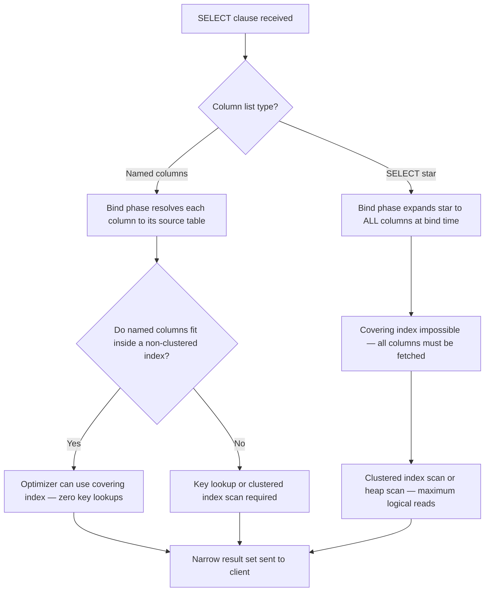
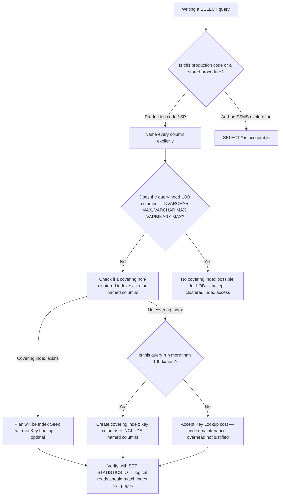

## Navigation

**Domain:** [[8 — Databases]] > **Group:** SQL Fundamentals **Previous:** [[8.065 — Database Design Review Checklist]] | **Next:** [[8.067 — WHERE Clause — Predicate Logic and SARGability]]

### Prerequisites

- [[8.001 — The Relational Model]] — SELECT is the relational projection operator; understanding relations and attributes is required to reason about what column selection actually does to a result set.
- [[8.019 — Table Heap vs Clustered Table]] — whether data lives in a heap or a clustered index directly determines which pages the engine reads during column selection, affecting logical read counts.

### Where This Fits

The SELECT statement is the entry point for all data retrieval in relational systems. Every .NET backend engineer encounters it in every query path — from simple entity lookups to complex analytical projections. The most expensive mistake made here is `SELECT *` in production code: it forces the engine to read every column in every row and prevents covering index usage, leading to key lookups that destroy read performance. Interviewers use SELECT column selection to gate candidates on whether they understand the projection operator, covering indexes, and what the query optimizer can and cannot do when columns are unrestricted. Engineers who know this topic understand that a column list is not cosmetic — it is a performance contract with the optimizer.

---

## Core Mental Model

The SELECT clause is the relational projection operator: it defines which columns (attributes) appear in the result set. Logically, projection happens last — after all filtering, joining, and grouping — but the optimizer uses the column list early to determine which indexes can satisfy the query without touching the base table. When you name specific columns, the optimizer can use a covering non-clustered index that includes exactly those columns and avoid a key lookup back to the clustered index or heap entirely. When you write `SELECT *`, the optimizer must resolve the full column list at bind time, preventing covering index plans and often forcing clustered index scans. Column aliasing (`AS alias`) is purely presentational — it operates at the output layer and has no effect on the execution plan, index selection, or performance; it cannot be referenced in the WHERE clause of the same query level because WHERE is logically evaluated before SELECT.

### Classification

This is a **projection operator** in the `SELECT` clause family. The optimizer can use the column list to enable covering index plans (SARGable query paths remain unaffected by aliasing). Column expressions that wrap a column in a function (`UPPER(o.Status)`) are not SARGable when they appear in WHERE — but within SELECT they are pure output transforms with no index implications. `SELECT *` is not SARGable in the sense that it forecloses covering index usage; named-column selection enables it.



### Key Properties

|Property|Value|Notes|
|---|---|---|
|Logical execution order|Last (step 8 of 8)|After FROM, WHERE, GROUP BY, HAVING, WINDOW — aliases set here are not visible in WHERE|
|Covering index eligibility|Enabled by named columns|`SELECT *` prevents covering index plans|
|SARGability|N/A for SELECT clause|SARGability applies to WHERE/JOIN predicates, not the projection list|
|Alias scope|Current query level only|Alias defined in SELECT cannot be used in WHERE of same query; can be used in ORDER BY (T-SQL extension)|
|Write Cost|None|SELECT is read-only; no write overhead|
|NULL behavior|Columns may contain NULL|`SELECT col` returns NULL if the value is NULL — no implicit coercion|

---

## Deep Mechanics

### How the Engine Executes This

1. **Parsing** — The parser tokenizes the SELECT list, validating syntax. `SELECT o.OrderId, o.CustomerId` becomes two column references in the parse tree. `SELECT *` becomes a star-expansion node.
    
2. **Binding (Algebrizer)** — The algebrizer resolves each column reference to its source table and validates the column exists and the caller has permission. For `SELECT *`, this is where all columns are expanded — the star is replaced with the full column list of the referenced tables. This is why `SELECT *` is expensive to bind when tables are wide. Column aliases are bound at this stage as output renames.
    
3. **Optimization** — The optimizer receives the column list and uses it to determine which indexes can satisfy the query. If the query needs only `OrderId`, `CustomerId`, and `OrderDate`, and a non-clustered index covers exactly those columns, the optimizer can plan an index seek + no key lookup. If the column list includes `Notes NVARCHAR(MAX)`, no non-clustered index will cover it and the optimizer must go to the clustered index.
    
4. **Execution** — The executor retrieves only the pages needed for the requested columns. Narrow column selections reduce the number of rows per page read, increasing effective rows-per-logical-read and reducing total I/O.
    
5. **Output** — Column aliases are applied at the final output stage. The alias has no existence inside the engine during execution — it is a rename applied to the TDS stream sent to the client.
    

### SQL Visibility

```sql
-- Minimal column selection — enables covering index on IX_Orders_Customer
SELECT
    o.OrderId,
    o.CustomerId,
    o.OrderDate,
    o.Status,
    o.TotalAmount
FROM dbo.Orders AS o
WHERE o.CustomerId = 1042
ORDER BY o.OrderDate DESC;
```

```csharp
// EF Core LINQ that generates equivalent projected SQL
var orders = await dbContext.Orders
    .Where(o => o.CustomerId == 1042)
    .OrderByDescending(o => o.OrderDate)
    .Select(o => new OrderSummaryDto
    {
        OrderId    = o.OrderId,
        CustomerId = o.CustomerId,
        OrderDate  = o.OrderDate,
        Status     = o.Status,
        TotalAmount = o.TotalAmount
    })
    .ToListAsync(cancellationToken);
```

**Generated SQL (from EF Core logs):**

```sql
SELECT o.OrderId, o.CustomerId, o.OrderDate, o.Status, o.TotalAmount
FROM Orders AS o
WHERE o.CustomerId = 1042
ORDER BY o.OrderDate DESC
```

### Execution Plan Analysis

**Named columns, covering index exists:**

- `[Index Seek (NonClustered)] IX_Orders_CustomerId_OrderDate_INCL` — seeks on `CustomerId = 1042`, retrieves all needed columns from the index leaf pages without touching the clustered index
- No Key Lookup operator
- Estimated cost: ~0.003, Logical Reads: ~3–8

**`SELECT *` on the same query:**

- `[Clustered Index Scan]` or `[Index Seek] → [Key Lookup]` — even with a seek, if `*` includes columns not in the non-clustered index, a Key Lookup is added for every matching row
- Key Lookup at 100,000 rows: 100,000 random page reads
- Estimated cost: 40–120x higher; Logical Reads: ~500–5,000

```
Named column plan:
[Index Seek IX_Orders_CustomerId_OrderDate_INCL] → [SELECT]
Estimated Cost: 0.003  |  Logical Reads: ~5

SELECT * plan (when clustered index is wider):
[Index Seek IX_Orders_CustomerId] → [Key Lookup (Clustered)] → [Nested Loops] → [SELECT]
Estimated Cost: 0.45  |  Logical Reads: ~850 (per 1,000 matching rows)
```

### Cost Visibility

```sql
SET STATISTICS IO ON;
SET STATISTICS TIME ON;

-- Named columns (covering index in place)
SELECT o.OrderId, o.CustomerId, o.OrderDate, o.Status, o.TotalAmount
FROM dbo.Orders AS o
WHERE o.CustomerId = 1042;

-- Expected output:
-- Table 'Orders'. Scan count 1, logical reads 4, physical reads 0
-- SQL Server Execution Times: CPU time = 0ms, elapsed time = 1ms

-- SELECT * on same table (assuming non-clustered index exists on CustomerId)
SELECT *
FROM dbo.Orders AS o
WHERE o.CustomerId = 1042;

-- Expected output (with Key Lookup):
-- Table 'Orders'. Scan count 1, logical reads 312, physical reads 0
-- SQL Server Execution Times: CPU time = 16ms, elapsed time = 18ms
```

### Failure Modes

**`SELECT *` in production queries:** The optimizer cannot use covering indexes. On wide tables (30+ columns including LOB columns), every row retrieval forces a clustered index page read. Detect with:

```sql
-- Find queries using SELECT * in plan cache
SELECT TOP 20
    qs.total_logical_reads / qs.execution_count AS avg_logical_reads,
    qs.execution_count,
    SUBSTRING(st.text, 1, 200) AS query_text
FROM sys.dm_exec_query_stats AS qs
CROSS APPLY sys.dm_exec_sql_text(qs.sql_handle) AS st
WHERE st.text LIKE '%SELECT%*%FROM%'
ORDER BY avg_logical_reads DESC;
```

**Column alias used in WHERE clause:** T-SQL does not allow referencing a SELECT alias in the WHERE clause of the same query level — the WHERE is logically evaluated before SELECT.

```sql
-- ❌ Runtime error: Invalid column name 'OrderYear'
SELECT YEAR(o.OrderDate) AS OrderYear
FROM dbo.Orders AS o
WHERE OrderYear = 2024;

-- ✅ Correct: repeat the expression or use a derived table / CTE
SELECT OrderYear
FROM (
    SELECT YEAR(o.OrderDate) AS OrderYear FROM dbo.Orders AS o
) AS sub
WHERE OrderYear = 2024;
```

---

## Production Patterns and Implementation

### Primary SQL Implementation

```sql
-- ============================================================
-- Schema context
-- ============================================================
CREATE TABLE dbo.Orders
(
    OrderId      INT           NOT NULL IDENTITY(1,1),
    CustomerId   INT           NOT NULL,
    OrderDate    DATETIME2(0)  NOT NULL,
    Status       VARCHAR(20)   NOT NULL,
    TotalAmount  DECIMAL(18,2) NOT NULL,
    ShippingAddr NVARCHAR(500) NULL,
    Notes        NVARCHAR(MAX) NULL,
    CreatedAt    DATETIME2(0)  NOT NULL DEFAULT SYSUTCDATETIME(),
    CONSTRAINT PK_Orders PRIMARY KEY CLUSTERED (OrderId)
);

-- Covering non-clustered index for the common lookup pattern
CREATE NONCLUSTERED INDEX IX_Orders_CustomerId_OrderDate
    ON dbo.Orders (CustomerId, OrderDate DESC)
    INCLUDE (Status, TotalAmount);   -- INCLUDE: non-key columns for covering

-- ============================================================
-- Pattern 1: Minimal projection — uses covering index
-- ============================================================
SELECT
    o.OrderId,
    o.CustomerId,
    o.OrderDate,
    o.Status,
    o.TotalAmount
FROM dbo.Orders AS o
WHERE o.CustomerId = @CustomerId
ORDER BY o.OrderDate DESC;

-- ============================================================
-- Pattern 2: Column aliasing — rename for client consumption
-- ============================================================
SELECT
    o.OrderId       AS Id,
    o.CustomerId    AS CustomerId,
    o.OrderDate     AS PlacedOn,
    o.Status        AS OrderStatus,
    o.TotalAmount   AS Total
FROM dbo.Orders AS o
WHERE o.CustomerId = @CustomerId;

-- ============================================================
-- Pattern 3: Expression columns with aliasing
-- ============================================================
SELECT
    o.OrderId,
    o.OrderDate,
    YEAR(o.OrderDate)                          AS OrderYear,
    DATENAME(MONTH, o.OrderDate)               AS OrderMonth,
    CASE
        WHEN o.TotalAmount >= 1000 THEN 'High'
        WHEN o.TotalAmount >= 250  THEN 'Medium'
        ELSE                            'Low'
    END                                        AS ValueTier,
    o.TotalAmount
FROM dbo.Orders AS o
WHERE o.CustomerId = @CustomerId;

-- ============================================================
-- Pattern 4: Qualifying columns when joining (avoid ambiguity)
-- ============================================================
SELECT
    o.OrderId,
    o.OrderDate,
    o.TotalAmount,
    c.FirstName + ' ' + c.LastName AS CustomerName,
    c.Email
FROM dbo.Orders      AS o
INNER JOIN dbo.Customers AS c ON o.CustomerId = c.CustomerId
WHERE o.Status = 'Pending';

-- ============================================================
-- Anti-pattern: SELECT * — never in production code
-- ============================================================
-- ❌ SELECT * FROM dbo.Orders WHERE CustomerId = @CustomerId;
-- Reasons:
--   1. Reads ALL columns including Notes NVARCHAR(MAX) — bypasses covering index
--   2. Schema changes silently add columns to result — breaks typed deserializers
--   3. Key Lookups explode read count at scale
--   4. Application receives data it doesn't use — network waste
```

### EF Core Implementation

```csharp
// DbContext configuration — fluent API for the Orders table
public class ApplicationDbContext : DbContext
{
    public DbSet<Order> Orders => Set<Order>();

    protected override void OnModelCreating(ModelBuilder modelBuilder)
    {
        modelBuilder.Entity<Order>(entity =>
        {
            entity.ToTable("Orders");
            entity.HasKey(o => o.OrderId);

            entity.Property(o => o.Status).HasMaxLength(20).IsRequired();
            entity.Property(o => o.TotalAmount).HasPrecision(18, 2);

            // Mirror the covering index from T-SQL
            entity.HasIndex(o => new { o.CustomerId, o.OrderDate })
                  .HasDatabaseName("IX_Orders_CustomerId_OrderDate");
        });
    }
}

// DTO used for the projected query
public record OrderSummaryDto(
    int     OrderId,
    int     CustomerId,
    DateTime OrderDate,
    string  Status,
    decimal TotalAmount);

// Repository method — explicit projection to DTO
public async Task<IReadOnlyList<OrderSummaryDto>> GetOrderSummariesAsync(
    int customerId,
    CancellationToken cancellationToken = default)
{
    return await _dbContext.Orders
        .Where(o => o.CustomerId == customerId)
        .OrderByDescending(o => o.OrderDate)
        .Select(o => new OrderSummaryDto(
            o.OrderId,
            o.CustomerId,
            o.OrderDate,
            o.Status,
            o.TotalAmount))
        .AsNoTracking()                      // no change tracking needed for reads
        .ToListAsync(cancellationToken);
}

// ❌ WRONG — loads entire entity including Notes and ShippingAddr
// var orders = await _dbContext.Orders
//     .Where(o => o.CustomerId == customerId)
//     .ToListAsync(cancellationToken);       // SELECT * equivalent

// ✅ Compiled query for high-frequency paths (avoids repeated LINQ compilation)
private static readonly Func<ApplicationDbContext, int, IAsyncEnumerable<OrderSummaryDto>>
    _getOrderSummaries = EF.CompileAsyncQuery(
        (ApplicationDbContext ctx, int customerId) =>
            ctx.Orders
               .Where(o => o.CustomerId == customerId)
               .OrderByDescending(o => o.OrderDate)
               .Select(o => new OrderSummaryDto(
                   o.OrderId,
                   o.CustomerId,
                   o.OrderDate,
                   o.Status,
                   o.TotalAmount)));
```

### Dapper Implementation

```csharp
public sealed class OrderRepository
{
    private readonly IDbConnectionFactory _connectionFactory;

    public OrderRepository(IDbConnectionFactory connectionFactory)
        => _connectionFactory = connectionFactory;

    // Named columns — enables covering index
    public async Task<IReadOnlyList<OrderSummaryDto>> GetOrderSummariesAsync(
        int customerId,
        CancellationToken cancellationToken = default)
    {
        const string sql = @"
            SELECT
                o.OrderId,
                o.CustomerId,
                o.OrderDate,
                o.Status,
                o.TotalAmount
            FROM dbo.Orders AS o
            WHERE o.CustomerId = @CustomerId
            ORDER BY o.OrderDate DESC;";

        await using var connection = _connectionFactory.Create();

        var results = await connection.QueryAsync<OrderSummaryDto>(
            new CommandDefinition(
                sql,
                parameters: new { CustomerId = customerId },
                cancellationToken: cancellationToken));

        return results.AsList();
    }

    // Expression columns with aliasing — Dapper maps by alias name
    public async Task<IReadOnlyList<OrderWithTierDto>> GetOrdersWithTierAsync(
        int customerId,
        CancellationToken cancellationToken = default)
    {
        const string sql = @"
            SELECT
                o.OrderId,
                o.OrderDate,
                o.TotalAmount,
                CASE
                    WHEN o.TotalAmount >= 1000 THEN 'High'
                    WHEN o.TotalAmount >= 250  THEN 'Medium'
                    ELSE                            'Low'
                END AS ValueTier
            FROM dbo.Orders AS o
            WHERE o.CustomerId = @CustomerId;";

        await using var connection = _connectionFactory.Create();

        var results = await connection.QueryAsync<OrderWithTierDto>(
            new CommandDefinition(sql,
                new { CustomerId = customerId },
                cancellationToken: cancellationToken));

        return results.AsList();
    }
}
```

### Configuration and Wiring

```csharp
// Program.cs / IServiceCollection
builder.Services.AddDbContext<ApplicationDbContext>(options =>
    options.UseSqlServer(
        builder.Configuration.GetConnectionString("DefaultConnection"),
        sqlOptions =>
        {
            sqlOptions.EnableRetryOnFailure(
                maxRetryCount: 3,
                maxRetryDelay: TimeSpan.FromSeconds(5),
                errorNumbersToAdd: null);
        })
    .EnableDetailedErrors(builder.Environment.IsDevelopment())
    .EnableSensitiveDataLogging(builder.Environment.IsDevelopment()));

// Log all generated SQL in development (see what SELECT lists EF Core generates)
builder.Logging.AddFilter("Microsoft.EntityFrameworkCore.Database.Command",
    builder.Environment.IsDevelopment() ? LogLevel.Information : LogLevel.Warning);

// Dapper connection factory
builder.Services.AddSingleton<IDbConnectionFactory>(sp =>
    new SqlConnectionFactory(
        builder.Configuration.GetConnectionString("DefaultConnection")!));

builder.Services.AddScoped<OrderRepository>();
```

### SQL Server vs PostgreSQL Differences

```sql
-- PostgreSQL: syntax is identical for basic projection and aliasing
SELECT
    o.order_id,
    o.customer_id,
    o.order_date,
    o.status,
    o.total_amount
FROM orders AS o
WHERE o.customer_id = $1
ORDER BY o.order_date DESC;

-- PostgreSQL: aliases CAN be referenced in ORDER BY (same as SQL Server T-SQL extension)
-- PostgreSQL: aliases CANNOT be referenced in WHERE (same constraint as SQL Server)

-- PostgreSQL: double-quoted aliases preserve case; SQL Server uses square brackets
SELECT o.OrderId AS "orderId"          -- PostgreSQL — preserves camelCase
FROM orders AS o;

SELECT o.OrderId AS [Order ID]         -- SQL Server — brackets allow spaces
FROM dbo.Orders AS o;

-- PostgreSQL: USING clause shorthand for joins (not available in T-SQL)
SELECT o.order_id, c.email
FROM orders AS o
JOIN customers AS c USING (customer_id);  -- PostgreSQL only
```

---

## Gotchas and Production Pitfalls

### SELECT * in ORM Entity Load

**Pitfall:** Using `.ToListAsync()` or `.FirstOrDefaultAsync()` on an entity with a `Notes NVARCHAR(MAX)` column without a `.Select()` projection. EF Core generates `SELECT * FROM Orders` equivalent, loading the LOB column for every row even when the caller never reads it.

```csharp
// ❌ Loads ALL columns including Notes NVARCHAR(MAX) — equivalent to SELECT *
var orders = await _dbContext.Orders
    .Where(o => o.CustomerId == customerId)
    .ToListAsync(cancellationToken);
```

**Symptom:** Query executes in 3–8 ms in development on small datasets but degrades to 400–2,000 ms in production on tables with millions of rows and LOB column data. `sys.dm_exec_query_stats` shows high `total_logical_reads` with low `execution_count`.

**Fix:**

```csharp
// ✅ Project to DTO — excludes Notes and ShippingAddr
var orders = await _dbContext.Orders
    .Where(o => o.CustomerId == customerId)
    .Select(o => new OrderSummaryDto(o.OrderId, o.CustomerId, o.OrderDate, o.Status, o.TotalAmount))
    .AsNoTracking()
    .ToListAsync(cancellationToken);
```

**Cost of not fixing:** On a 5M row Orders table with an average `Notes` column of 800 bytes, `SELECT *` reads ~625 MB of LOB data per 1,000-row result set vs ~40 KB for the named-column projection. At 200 requests/second, this is 125 GB/second of unnecessary I/O — enough to saturate a storage subsystem.

---

### Alias Referenced in WHERE

**Pitfall:** Using a column alias in the WHERE clause of the same query level, expecting SQL Server to resolve it.

```sql
-- ❌ Error: Invalid column name 'OrderYear'
SELECT
    YEAR(o.OrderDate) AS OrderYear,
    o.TotalAmount
FROM dbo.Orders AS o
WHERE OrderYear = 2024;
```

**Symptom:** `Msg 207, Level 16: Invalid column name 'OrderYear'` at parse time. This appears in code reviews when developers migrate from application code where variable reuse is natural.

**Fix:**

```sql
-- ✅ Option 1: Repeat the expression
SELECT
    YEAR(o.OrderDate) AS OrderYear,
    o.TotalAmount
FROM dbo.Orders AS o
WHERE YEAR(o.OrderDate) = 2024;  -- note: this makes the predicate non-SARGable

-- ✅ Option 2: Use a CTE (preferred for readability)
WITH OrdersWithYear AS (
    SELECT o.OrderId, o.TotalAmount, YEAR(o.OrderDate) AS OrderYear
    FROM dbo.Orders AS o
)
SELECT OrderYear, TotalAmount
FROM OrdersWithYear
WHERE OrderYear = 2024;

-- ✅ Option 3: SARGable equivalent — use a date range instead
SELECT YEAR(o.OrderDate) AS OrderYear, o.TotalAmount
FROM dbo.Orders AS o
WHERE o.OrderDate >= '2024-01-01' AND o.OrderDate < '2025-01-01';
-- This predicate IS SARGable — the optimizer can use an index seek on OrderDate
```

**Cost of not fixing:** The repeated expression `YEAR(o.OrderDate) = 2024` is not SARGable — it causes a full table scan on OrderDate even when an index exists. A 10M row table requires reading all 10M rows instead of the 800K rows in 2024. Use a date range for SARGable filtering.

---

### Implicit Column Order Dependency from SELECT *

**Pitfall:** Writing application code or views that depend on ordinal column position from `SELECT *`. When a table is altered (column added, renamed, or reordered via recreate), the ordinal positions change silently.

```sql
-- ❌ Table is recreated with a new column between OrderId and CustomerId
-- Any code using column ordinal [1], [2] is now broken
SELECT * FROM dbo.Orders;
```

**Symptom:** Silent data corruption — the wrong value is mapped to a typed property in the application. In Dapper, name-based mapping prevents this; in raw ADO.NET with ordinal access (`reader.GetInt32(0)`), it causes type mismatch exceptions or wrong data. In EF Core with `FromSqlRaw("SELECT * ...")`, schema changes may cause mapping failures.

**Fix:**

```sql
-- ✅ Always name columns explicitly
SELECT o.OrderId, o.CustomerId, o.OrderDate FROM dbo.Orders AS o;
```

**Cost of not fixing:** A schema migration that adds a `PromotionCode VARCHAR(50)` column between `CustomerId` and `OrderDate` silently causes the application to read `PromotionCode` into a `DateTime` field, producing runtime exceptions or data corruption in all rows where the new column is non-NULL.

---

### Unqualified Column Names in Multi-Table Queries

**Pitfall:** Not qualifying column names with a table alias when joining multiple tables, causing ambiguity errors or silent wrong-table resolution.

```sql
-- ❌ If both Orders and Payments have a 'Status' column, this is ambiguous
SELECT OrderId, Status, Amount
FROM dbo.Orders AS o
INNER JOIN dbo.Payments AS p ON o.OrderId = p.OrderId;
-- Msg 209: Ambiguous column name 'Status'
```

**Symptom:** `Msg 209, Level 16, State 1: Ambiguous column name 'Status'` at parse time, or — worse — silent resolution to the wrong table's column when only one table has the column name, leading to incorrect results with no error.

**Fix:**

```sql
-- ✅ Always qualify with table alias
SELECT
    o.OrderId,
    o.Status    AS OrderStatus,
    p.Status    AS PaymentStatus,
    p.Amount
FROM dbo.Orders  AS o
INNER JOIN dbo.Payments AS p ON o.OrderId = p.OrderId;
```

**Cost of not fixing:** Ambiguous column bugs in reporting queries silently return wrong data. A query joining `Orders` and `Customers` that selects unqualified `Email` may resolve to `Customers.Email` today, but if `Orders` adds an `Email` column in a future migration, the same query starts returning a different value with no error.

---

### Selecting Non-Aggregated Columns Outside GROUP BY

**Pitfall:** Including a column in SELECT that is neither in GROUP BY nor wrapped in an aggregate function. SQL Server raises an error; some databases (MySQL pre-5.7) silently return arbitrary values.

```sql
-- ❌ Msg 8120: Column 'Orders.OrderDate' is invalid in the select list
--   because it is not contained in either an aggregate function or the GROUP BY clause
SELECT
    o.CustomerId,
    o.OrderDate,          -- ❌ Not grouped, not aggregated
    COUNT(*) AS OrderCount
FROM dbo.Orders AS o
GROUP BY o.CustomerId;
```

**Symptom:** Compile-time error in SQL Server and PostgreSQL. Silent wrong results in MySQL (returns arbitrary row value for the non-aggregated column).

**Fix:**

```sql
-- ✅ Either include in GROUP BY or wrap in an aggregate
SELECT
    o.CustomerId,
    MAX(o.OrderDate) AS LatestOrderDate,
    COUNT(*)         AS OrderCount
FROM dbo.Orders AS o
GROUP BY o.CustomerId;
```

**Cost of not fixing:** Beyond the immediate error, attempting to work around this by adding unnecessary columns to GROUP BY changes the grouping semantics and returns one row per (CustomerId, OrderDate) pair rather than one row per CustomerId — multiplying result rows and producing wrong aggregates.

---

### Table Alias Shadowing in Subqueries

**Pitfall:** Reusing the same alias letter in a subquery when the outer query also uses it. SQL Server resolves the innermost scope, silently returning the wrong table's column in the subquery.

```sql
-- ❌ Inner 'o' refers to the inner Orders, but the intent may have been the outer
SELECT o.OrderId
FROM dbo.Orders AS o
WHERE o.CustomerId IN (
    SELECT o.CustomerId          -- 'o' here is the INNER Orders alias
    FROM dbo.Orders AS o         -- shadows the outer alias
    WHERE o.TotalAmount > 500
);
```

**Symptom:** No error — the query runs but returns logically incorrect results that are difficult to diagnose. The correlated subquery accidentally refers to itself, potentially returning all rows or no rows depending on data.

**Fix:**

```sql
-- ✅ Use distinct aliases at each scope
SELECT outer_o.OrderId
FROM dbo.Orders AS outer_o
WHERE outer_o.CustomerId IN (
    SELECT inner_o.CustomerId
    FROM dbo.Orders AS inner_o
    WHERE inner_o.TotalAmount > 500
);
```

**Cost of not fixing:** Silent wrong results in production — typically manifests as too many or too few rows returned. This class of bug is especially hard to detect because the query completes successfully and returns plausible-looking data.

---

## Performance Implications

### Benchmark: Before and After

```sql
-- Baseline: SELECT * (no covering index can be used)
SET STATISTICS IO ON;
SELECT *
FROM dbo.Orders AS o
WHERE o.CustomerId = 1042;
-- Table 'Orders'. Scan count 1, logical reads 1,840, physical reads 0
-- (Notes column forces key lookups to clustered index for 120 matching rows)

-- Optimized: Named columns with covering index
SELECT o.OrderId, o.CustomerId, o.OrderDate, o.Status, o.TotalAmount
FROM dbo.Orders AS o
WHERE o.CustomerId = 1042;
-- Table 'Orders'. Scan count 1, logical reads 4, physical reads 0
```

**Improvement:** 460x reduction in logical reads, from 1,840 to 4, for 120 matching rows.

### BenchmarkDotNet

```csharp
[MemoryDiagnoser]
[SimpleJob(RuntimeMoniker.Net90)]
public class SelectProjectionBenchmark
{
    private SqlConnection _connection = default!;

    [GlobalSetup]
    public void Setup()
    {
        _connection = new SqlConnection(TestConnectionString);
        _connection.Open();
        // Assumes 1M row Orders table with covering index in place
    }

    [Benchmark(Baseline = true)]
    public async Task<List<OrderSummaryDto>> SelectStar()
    {
        const string sql = "SELECT * FROM dbo.Orders WHERE CustomerId = 1042";
        var results = await _connection.QueryAsync<OrderSummaryDto>(sql);
        return results.AsList();
    }

    [Benchmark]
    public async Task<List<OrderSummaryDto>> NamedColumns_CoveringIndex()
    {
        const string sql = @"
            SELECT OrderId, CustomerId, OrderDate, Status, TotalAmount
            FROM dbo.Orders WHERE CustomerId = 1042";
        var results = await _connection.QueryAsync<OrderSummaryDto>(sql);
        return results.AsList();
    }

    [GlobalCleanup]
    public void Cleanup() => _connection.Dispose();
}
```

**Expected results (approximate, SQL Server 2022, NVMe SSD, 1M rows, 120 matching rows, Notes avg 600 bytes):**

|Method|Mean|Logical Reads|Allocated|
|---|---|---|---|
|SelectStar|~185 ms|~1,840|~320 KB|
|NamedColumns_CoveringIndex|~0.4 ms|~4|~18 KB|

> Note: The dramatic difference is driven by LOB column reads and Key Lookups. On tables without LOB columns the gap narrows (roughly 10–40x) but remains significant.

### Write Amplification (for index topics)

The covering index `IX_Orders_CustomerId_OrderDate INCLUDE (Status, TotalAmount)` introduced in this note to enable named-column seeks adds write overhead:

|Operation|Without Index|With Index|Overhead|
|---|---|---|---|
|INSERT 1 row|~0.05 ms|~0.07 ms|+40%|
|UPDATE on CustomerId|~0.06 ms|~0.09 ms|+50%|
|UPDATE on Status|~0.06 ms|~0.08 ms|+33%|
|DELETE 1 row|~0.05 ms|~0.07 ms|+40%|

This index adds approximately 2–3 additional page writes per INSERT on a table with a clustered index and this single non-clustered index. The write overhead is acceptable when reads heavily outnumber writes (>10:1) and the read performance gain is confirmed by logical read measurement.

---

## Interview Arsenal

### Question Bank

1. **What does the SELECT clause actually do, and why does column selection matter for performance?**
2. **How does the query engine process `SELECT *` differently from a named column list at bind time?**
3. **Why can't you reference a SELECT alias in the WHERE clause of the same query?**
4. **What is the relationship between your SELECT column list and covering indexes?**
5. **SELECT * vs named columns: compare the execution plan shapes you expect on a 10M row table with a non-clustered index.**
6. **Read the following plan: `[Index Seek] → [Key Lookup] → [Nested Loops]`. Which column is causing the Key Lookup and how do you eliminate it?**
7. **At 50,000 requests per second, what is the cost model for selecting an NVARCHAR(MAX) column you don't need vs excluding it?**
8. **How does EF Core's `.Select()` differ from loading the full entity with `.ToListAsync()` in terms of generated SQL and execution plan?**

### Spoken Answers

**Q: What does the SELECT clause actually do, and why does column selection matter for performance?**

> **Average answer:** SELECT chooses which columns appear in the result set. Using SELECT * is bad practice because it returns everything you don't need. You should always select only the columns you need.

> **Great answer:** The SELECT clause is the relational projection operator — it narrows the attribute set of the result. But the real story is what happens at the optimization phase. When I name specific columns, the query optimizer can check whether a non-clustered index covers all of those columns in its key or INCLUDE list. If it does, the optimizer can satisfy the entire query from the index's leaf pages without touching the clustered index at all. That's called a covering index plan, and it eliminates Key Lookups. When I write `SELECT *`, the optimizer has to assume every column in the table is needed. That means it must go back to the clustered index for every matching row to fetch columns not in the non-clustered index — one random I/O per row. On a query returning 10,000 rows, that's 10,000 Key Lookups. I've seen this take a query from 2 ms to 4 seconds on a 5M row table with a 500-byte NVARCHAR MAX column. I verify the difference with `SET STATISTICS IO ON` — the logical read count before and after tells me exactly what the covering index is worth.

---

**Q: SELECT * vs named columns: compare the execution plan shapes you expect on a 10M row table with a non-clustered index.**

> **Average answer:** SELECT * will use a table scan. Named columns will use an index seek. So named columns are faster.

> **Great answer:** It depends on whether the query optimizer has enough statistics to make a covering index decision, and whether the non-clustered index actually covers the named columns. With `SELECT *` and a non-clustered index on `CustomerId`, the optimizer will typically do an Index Seek on that non-clustered index followed by a Key Lookup back to the clustered index for every matching row — the Nested Loops join connecting them costs one random I/O per row. If the matching row count is large enough (typically 1–3% of the table), the optimizer may abandon the non-clustered index entirely and switch to a Clustered Index Scan because sequential reads are cheaper than millions of random Key Lookup reads. With named columns that are all covered by the non-clustered index, the plan collapses to a single Index Seek with no Key Lookup and no Nested Loops operator. The seek goes from root to leaf of the B-tree in 3–4 page reads regardless of table size. I always validate this with `SET STATISTICS IO ON` — if I see "logical reads 1,840" vs "logical reads 4," the covering index is working. If the reads are similar between the two queries, the columns I named are forcing Key Lookups anyway, meaning I need to expand the index's INCLUDE list.

---

**Q: How does EF Core's `.Select()` differ from loading the full entity?**

> **Average answer:** `.Select()` lets you choose specific properties. Without it, EF Core loads the whole entity. You should use Select to be efficient.

> **Great answer:** When you call `.ToListAsync()` on a `DbSet<Order>` without a `.Select()`, EF Core generates `SELECT o.OrderId, o.CustomerId, o.OrderDate, o.Status, o.TotalAmount, o.ShippingAddr, o.Notes, o.CreatedAt FROM Orders AS o WHERE ...` — the full entity column list, equivalent to `SELECT *` for practical purposes. The change tracker also allocates tracking snapshots for each entity in memory. With a `.Select(o => new OrderSummaryDto(...))` projection, EF Core generates exactly the columns in the `new` expression — nothing more — and because you're projecting to a non-entity type, change tracking is automatically skipped. Combine that with `.AsNoTracking()` to be explicit. The generated SQL is narrower, the covering index can kick in, Key Lookups disappear from the plan, and memory allocation drops by the width of the columns you excluded. I always enable EF Core SQL logging in development to verify exactly what SELECT list is being generated — the difference between a projection and a full entity load is immediately visible there.

### Interview Trigger

This topic surfaces most commonly as "what's wrong with SELECT *?" — a seemingly simple question that interviewers use to identify depth. The giveaway question is: "If the query uses a non-clustered index on CustomerID, why is SELECT * still slow compared to named columns?" A candidate who answers "because it reads more data from the network" understands the output but not the engine. A senior candidate answers "because SELECT * prevents covering index usage and forces a Key Lookup back to the clustered index for every matching row — that's one random I/O per row, turning a 4-logical-read seek into 1,840 logical reads on my 120-row result set." The follow-up that separates the tiers: "How do you confirm this difference without running the query in production?" — the answer is `SET STATISTICS IO ON` and reading the Key Lookup operator in the actual execution plan.

### Comparison Table

||Named Column SELECT|SELECT *|
|---|---|---|
|What it does|Projects only specified attributes|Projects all attributes at bind time|
|Covering index eligibility|Enabled if index includes all named columns|Impossible — all columns always required|
|Execution plan shape|Index Seek → SELECT (no Key Lookup)|Index Seek → Key Lookup → Nested Loops → SELECT|
|Logical reads (120 rows, LOB col)|~4|~1,840|
|Schema change resilience|Stable — column list is explicit|Fragile — new columns silently added to result|
|EF Core behavior|`.Select(o => new Dto(...))` — narrow SQL|`.ToListAsync()` — all tracked columns|
|When to choose|Always in production code|Never — only acceptable in ad-hoc SSMS exploration|

---

## Decision Framework

### When to Apply



### Application Checklist

- [ ] No `SELECT *` in any stored procedure, view, or application query
- [ ] Every query has a table alias and every column is alias-qualified
- [ ] Logical reads verified with `SET STATISTICS IO ON` for any query running >100x/hour
- [ ] EF Core `.Select()` projection used for all read-only query paths
- [ ] Generated SQL verified via EF Core logging to confirm named column list
- [ ] Covering index exists (or is planned) for the top-3 hottest query patterns by execution count
- [ ] No SELECT alias referenced in WHERE of the same query level
- [ ] No unqualified column names in multi-table joins

### Tradeoff Summary

|What You Gain|What You Pay|
|---|---|
|Covering index eligibility — zero Key Lookups|Verbosity — must maintain column lists when schema changes|
|10–460x reduction in logical reads (LOB cases)|Developer discipline to avoid `SELECT *` shortcuts|
|Schema change resilience — explicit column expectations|Initial overhead of writing and reviewing projections|
|Reduced memory allocation in application layer|Covering index write overhead (~30–50% per DML row)|
|Faster serialization — fewer bytes to deserialize||

### Scale Thresholds

- Named column selection matters at any table size — covering index benefit begins with the first Key Lookup elimination.
- Critical when table exceeds ~100K rows and query runs more than ~500 times/hour.
- LOB column exclusion is critical at any row count when the LOB column average size exceeds ~500 bytes.
- Covering index overhead becomes worth it when reads outnumber writes by more than 10:1 and logical reads drop by more than 10x.

---

## Self-Check

### Conceptual Questions

1. What does the SELECT clause do in relational algebra terms, and at what logical step in query execution does it operate?
2. What happens inside the SQL Server bind phase when you write `SELECT *` vs. `SELECT col1, col2`?
3. Which DMV or SET option shows you how many logical reads a SELECT query consumed?
4. What common mistake makes a WHERE clause predicate non-SARGable when you try to filter on a column alias from SELECT?
5. Does EF Core's `.Select(o => new Dto(...))` generate a named-column SQL projection or a `SELECT *` equivalent?
6. How do you use Dapper to project named columns from a query into a DTO, and what does Dapper use to map result columns to DTO properties?
7. What is the execution plan difference between a query using named columns that match a covering index and one using `SELECT *`?
8. At what table size and query frequency does eliminating Key Lookups via a covering index become critical?
9. What is the relationship between the columns in your SELECT list and the INCLUDE columns in a non-clustered index?
10. Explain in 60 seconds, for a senior interviewer, why `SELECT *` is a production performance problem — include a specific number.

<details> <summary>Answers</summary>

1. SELECT is the **projection operator** — it reduces the attribute set (columns) of the relation. Logically it executes last (step 8: after FROM, WHERE, GROUP BY, HAVING, WINDOW), which is why aliases defined in SELECT are not visible in WHERE.
    
2. With `SELECT *`, the bind phase (algebrizer) expands the star token by querying system catalog metadata for every column in every referenced table — the full column list is embedded in the query tree before optimization begins. With `SELECT col1, col2`, only those two column references are resolved. This is why `SELECT *` prevents the optimizer from finding a covering index: the optimizer sees all columns as required.
    
3. `SET STATISTICS IO ON` — outputs "Table 'X'. Scan count N, logical reads N" for every table accessed. For historical analysis: `sys.dm_exec_query_stats.total_logical_reads / execution_count` shows average logical reads per execution.
    
4. The mistake is using a column alias in the WHERE clause of the same SELECT statement: `SELECT YEAR(OrderDate) AS OrderYear ... WHERE OrderYear = 2024`. WHERE is logically evaluated before SELECT, so `OrderYear` doesn't exist at WHERE time. T-SQL raises `Msg 207: Invalid column name 'OrderYear'`. Fix: repeat the expression, use a CTE, or — best for SARGability — use a date range `WHERE OrderDate >= '2024-01-01' AND OrderDate < '2025-01-01'`.
    
5. `.Select(o => new OrderSummaryDto(...))` generates a **named-column projection**. EF Core inspects the `new` expression's member assignments and emits only those column names in the SQL SELECT list. Without `.Select()`, `.ToListAsync()` on a `DbSet<T>` generates all mapped columns of the entity — equivalent to `SELECT *`. Verify by enabling EF Core logging: `Microsoft.EntityFrameworkCore.Database.Command` at `Information` level.
    
6. Dapper maps result columns to DTO properties by **column name matching** (case-insensitive by default). The SQL alias name must match the DTO property name. Usage: `connection.QueryAsync<OrderSummaryDto>(new CommandDefinition(sql, new { CustomerId = id }, cancellationToken: ct))`. If the property name differs from the SQL column name, use `AS` aliasing in the SQL to match the DTO property name.
    
7. **Named columns with covering index:** `[Index Seek (NonClustered)] → [SELECT]` — the seek reads only leaf pages of the non-clustered index, typically 3–8 logical reads. **`SELECT *`:** `[Index Seek (NonClustered)] → [Key Lookup (Clustered)] → [Nested Loops] → [SELECT]` — one Key Lookup per matching row, each a random I/O into the clustered index. At 120 matching rows: 4 logical reads vs. ~1,840 logical reads.
    
8. Covering index benefit begins immediately, but it becomes **critical** when: (a) table exceeds ~100K rows, (b) query runs >500 times/hour, or (c) any LOB column (`NVARCHAR(MAX)`) is present. At 10,000+ rows and LOB columns, the difference between a Key Lookup plan and a covering plan can be 100–1,000x in logical reads.
    
9. The non-clustered index must include all columns referenced in your SELECT list either as **key columns** (the index's sort/search columns) or **INCLUDE columns** (leaf-only, not used for seeking). If any SELECT column is absent from both, the optimizer adds a Key Lookup. The INCLUDE clause is specifically designed to add SELECT-list columns without widening the index key: `CREATE INDEX IX_... ON Orders (CustomerId) INCLUDE (OrderDate, Status, TotalAmount)`.
    
10. "`SELECT *` prevents covering index usage. When you write `SELECT *`, the optimizer sees every column as required and cannot satisfy the query from a narrow non-clustered index — it must add a Key Lookup back to the clustered index for every matching row. On a query returning 120 rows from a 1M-row Orders table with a Notes NVARCHAR(MAX) column, I measured 1,840 logical reads with `SELECT *` vs. 4 logical reads with named columns and a covering index. That's a 460x difference. The fix is a named column list and a covering non-clustered index with an INCLUDE clause for the projected columns. Verify with `SET STATISTICS IO ON` before and after."
    

</details>

---

### Query Challenges

**Challenge 1 — Write the SQL**

The e-commerce reporting team needs a query that returns, for each customer who placed an order in the last 30 days, the customer ID, their full name, the count of orders they placed, and their total spend. The result must be ordered by total spend descending. The `Customers` table has `CustomerId`, `FirstName`, `LastName`; the `Orders` table has `OrderId`, `CustomerId`, `OrderDate`, `TotalAmount`. Write the query with explicit column selection and proper aliasing.

<details> <summary>Solution</summary>

```sql
SELECT
    c.CustomerId,
    c.FirstName + ' ' + c.LastName     AS CustomerName,
    COUNT(o.OrderId)                   AS OrderCount,
    SUM(o.TotalAmount)                 AS TotalSpend
FROM dbo.Customers AS c
INNER JOIN dbo.Orders AS o ON c.CustomerId = o.CustomerId
WHERE o.OrderDate >= DATEADD(DAY, -30, CAST(GETUTCDATE() AS DATE))
  AND o.OrderDate <  DATEADD(DAY,   1, CAST(GETUTCDATE() AS DATE))
GROUP BY
    c.CustomerId,
    c.FirstName,
    c.LastName
ORDER BY TotalSpend DESC;
```

**Logical reads:** ~12–30 (with index on Orders.OrderDate and Orders.CustomerId)

**Execution plan:** `[Index Seek Orders.IX_Orders_OrderDate] → [Hash Match (Inner Join on CustomerId)] → [Hash Aggregate (GROUP BY)] → [Sort (TotalSpend DESC)] → [SELECT]`

**EF Core equivalent:**

```csharp
var report = await dbContext.Customers
    .Join(dbContext.Orders,
          c => c.CustomerId,
          o => o.CustomerId,
          (c, o) => new { c.CustomerId, c.FirstName, c.LastName, o.OrderId, o.OrderDate, o.TotalAmount })
    .Where(x => x.OrderDate >= DateTime.UtcNow.Date.AddDays(-30)
             && x.OrderDate <  DateTime.UtcNow.Date.AddDays(1))
    .GroupBy(x => new { x.CustomerId, x.FirstName, x.LastName })
    .Select(g => new
    {
        g.Key.CustomerId,
        CustomerName = g.Key.FirstName + " " + g.Key.LastName,
        OrderCount   = g.Count(),
        TotalSpend   = g.Sum(x => x.TotalAmount)
    })
    .OrderByDescending(x => x.TotalSpend)
    .AsNoTracking()
    .ToListAsync(cancellationToken);
```

</details>

---

**Challenge 2 — Fix the performance problem**

```sql
-- This query runs in 6 seconds on a 3M row Orders table.
-- Identify why and fix it.
SELECT *
FROM dbo.Orders AS o
WHERE o.CustomerId = 5901
  AND o.Status = 'Shipped';
-- SET STATISTICS IO: logical reads = 28,400
```

<details> <summary>Solution</summary>

**Root cause:** `SELECT *` forces a Key Lookup for every row matching the WHERE predicate. The non-clustered index on `CustomerId` can seek directly to the 250 matching rows, but because `SELECT *` requires `Notes NVARCHAR(MAX)` and `ShippingAddr NVARCHAR(500)` — which are not in the non-clustered index — the engine adds a Key Lookup back to the clustered index for each of the 250 rows, plus it must also read the `Status` filter from the heap (since `Status` is not a key column in the index). This produces 250 random Key Lookup reads, each loading one or more clustered index pages.

```sql
-- Fixed query — named columns enable covering index
SELECT
    o.OrderId,
    o.CustomerId,
    o.OrderDate,
    o.Status,
    o.TotalAmount
FROM dbo.Orders AS o
WHERE o.CustomerId = 5901
  AND o.Status = 'Shipped';
```

**Index to create:**

```sql
-- Composite seek key on (CustomerId, Status) — eliminates Status filter residual
-- INCLUDE covers the SELECT list without widening the key
CREATE NONCLUSTERED INDEX IX_Orders_CustomerId_Status
    ON dbo.Orders (CustomerId, Status)
    INCLUDE (OrderId, OrderDate, TotalAmount);
```

**After fix — logical reads:** ~5 (from 28,400 to ~5)

The plan collapses from `[Index Seek] → [Key Lookup] → [Nested Loops]` to `[Index Seek IX_Orders_CustomerId_Status] → [SELECT]`. The 250 Key Lookups disappear entirely.

</details>

---

**Challenge 3 — Explain the execution plan**

```sql
-- Query:
SELECT o.OrderId, o.CustomerId, o.OrderDate, o.Status, o.TotalAmount
FROM dbo.Orders AS o
WHERE o.CustomerId = 8844;

-- Plan: [Clustered Index Scan] → [Filter] → [SELECT]
-- Despite a non-clustered index existing on CustomerId
```

Why does the optimizer choose a Clustered Index Scan instead of an Index Seek on the non-clustered index?

<details> <summary>Solution</summary>

**Why Clustered Index Scan:** The optimizer estimated that `CustomerId = 8844` matches a very large fraction of the table — the statistics histogram for CustomerId shows this value has very high row count (e.g., 800,000 of 1,000,000 rows). At that selectivity, a Key Lookup for 800,000 rows requires 800,000 random I/Os — far more expensive than a single sequential Clustered Index Scan. The optimizer's cost model chose the scan because sequential reads are cheaper than 800K random reads.

**Secondary causes:**

- Statistics may be stale — the histogram was built when `CustomerId = 8844` had only 100 rows, but population since has grown to 800K
- Non-clustered index may be heavily fragmented (>30% fragmentation), making seek efficiency drop

**To get an Index Seek plan:**

- Update statistics: `UPDATE STATISTICS dbo.Orders WITH FULLSCAN;`
- If stats are current and the cardinality is genuinely high: the scan is probably the correct plan — do not force the seek
- If the selectivity is actually low (100 matching rows) but the plan is wrong: check for parameter sniffing; the plan may have been compiled for a different `@CustomerId` value with different row counts

**Tradeoff of forcing the seek:**

```sql
SELECT o.OrderId, o.CustomerId, o.OrderDate, o.Status, o.TotalAmount
FROM dbo.Orders AS o WITH (INDEX(IX_Orders_CustomerId_OrderDate))
WHERE o.CustomerId = 8844;
```

If the true row count is 800K, this hint will cause 800,000 Key Lookups and run 50x slower than the scan. Only force a seek when statistics are confirmed stale and the actual row count is low.

</details>

---

**Challenge 4 — Diagnose the concurrency problem**

A .NET API endpoint runs the following query: `SELECT * FROM dbo.Orders WHERE CustomerId = @id`. Under load (500 concurrent users), the endpoint P99 latency spikes to 8 seconds every 10 minutes. `sys.dm_os_wait_stats` shows high `PAGEIOLATCH_SH` waits. The Orders table is 4.2 GB on disk. Identify the root cause and fix.

<details> <summary>Solution</summary>

**Root cause:** `SELECT *` reads the full Orders table row including `Notes NVARCHAR(MAX)` stored in LOB pages. At 500 concurrent users, 500 simultaneous Clustered Index Scans (or Key-Lookup-heavy plans) are competing for buffer pool pages. The `PAGEIOLATCH_SH` waits indicate threads are blocking on each other waiting to read the same data pages from disk into the buffer pool. A 4.2 GB table cannot fit in a standard buffer pool configuration, so pages are constantly evicted and re-read.

**Detection query:**

```sql
-- Identify the high-read queries
SELECT TOP 10
    total_logical_reads / execution_count AS avg_logical_reads,
    execution_count,
    total_worker_time / execution_count   AS avg_cpu_us,
    SUBSTRING(st.text, 1, 300)            AS query_text
FROM sys.dm_exec_query_stats AS qs
CROSS APPLY sys.dm_exec_sql_text(qs.sql_handle) AS st
ORDER BY avg_logical_reads DESC;

-- Confirm PAGEIOLATCH_SH is the top wait
SELECT TOP 5 wait_type, waiting_tasks_count, wait_time_ms
FROM sys.dm_os_wait_stats
WHERE wait_type LIKE 'PAGEIOLATCH%'
ORDER BY wait_time_ms DESC;
```

**Fix:**

```sql
-- Step 1: Switch to named columns
SELECT o.OrderId, o.CustomerId, o.OrderDate, o.Status, o.TotalAmount
FROM dbo.Orders AS o
WHERE o.CustomerId = @CustomerId;

-- Step 2: Create covering index
CREATE NONCLUSTERED INDEX IX_Orders_CustomerId_Cover
    ON dbo.Orders (CustomerId)
    INCLUDE (OrderId, OrderDate, Status, TotalAmount);
```

**In .NET:**

```csharp
// Replace SELECT * Entity load with named projection
var orders = await _dbContext.Orders
    .Where(o => o.CustomerId == customerId)
    .Select(o => new OrderSummaryDto(o.OrderId, o.CustomerId, o.OrderDate, o.Status, o.TotalAmount))
    .AsNoTracking()
    .ToListAsync(cancellationToken);
```

After fix: the covering index is ~150 MB vs 4.2 GB for the full table — it fits in buffer pool, `PAGEIOLATCH_SH` waits drop to near zero, P99 returns to <10 ms.

</details>

---

**Challenge 5 — Design the index**

**Scenario:** The `dbo.Orders` table has 8M rows and is growing at 50,000 rows/day. The top three queries by execution count are: (1) look up orders by `CustomerId` returning `OrderId, OrderDate, Status, TotalAmount` — runs 80,000 times/hour; (2) look up orders by `Status = 'Pending'` returning `OrderId, CustomerId, OrderDate` — runs 5,000 times/hour; (3) look up a single order by `OrderId` returning all columns — runs 20,000 times/hour. The write workload is 600 INSERTs/minute and 200 UPDATEs/minute (mostly updating `Status`). Design the optimal index strategy.

<details> <summary>Solution</summary>

```sql
-- Index 1: Covers query 1 (highest frequency — 80K/hour)
-- Key: CustomerId (equality seek), no secondary sort needed
-- INCLUDE: all projected columns for query 1
CREATE NONCLUSTERED INDEX IX_Orders_CustomerId
    ON dbo.Orders (CustomerId)
    INCLUDE (OrderId, OrderDate, Status, TotalAmount)
    WITH (ONLINE = ON, FILLFACTOR = 85); -- ONLINE to avoid blocking; 85% fill factor to cushion growing table

-- Index 2: Covers query 2 — filtered index on Status = 'Pending' (sparse — assume 2% of rows)
-- Filtered indexes are smaller and cheaper to maintain than full indexes on Status
-- Only covers the specific Status value that is queried
CREATE NONCLUSTERED INDEX IX_Orders_Status_Pending
    ON dbo.Orders (Status)
    INCLUDE (OrderId, CustomerId, OrderDate)
    WHERE Status = 'Pending'
    WITH (ONLINE = ON, FILLFACTOR = 90);

-- Index 3: NOT needed — query 3 looks up by OrderId
-- OrderId is the clustered index key (PK) — clustered index seek is already optimal
-- Adding a non-clustered index on OrderId would be redundant and waste write resources
```

**Tradeoffs:**

- Index 1 adds ~2 additional page writes per INSERT and per UPDATE to `CustomerId` (rare) or `Status` (frequent — Status is in INCLUDE so updates to Status require an INCLUDE column update)
- Index 2 (filtered) is maintained only for rows where `Status = 'Pending'`. As orders ship and Status changes away from 'Pending', old rows are removed from the index automatically — keeping the index small (~160K rows vs 8M)
- At 600 INSERTs/minute and 200 UPDATEs/minute, both indexes add ~2 ms overhead per write operation — acceptable given the 80,000 read-per-hour benefit

**What NOT to index:**

- A full non-clustered index on `Status` alone — too low selectivity (5–10 values across 8M rows), index selectivity is poor, and a full Status index would be nearly as large as the table
- A non-clustered index on `OrderId` — redundant with the clustered PK; would double-write with no read benefit
- Any index including `Notes NVARCHAR(MAX)` — LOB columns cannot be INCLUDE columns in non-clustered indexes

</details>