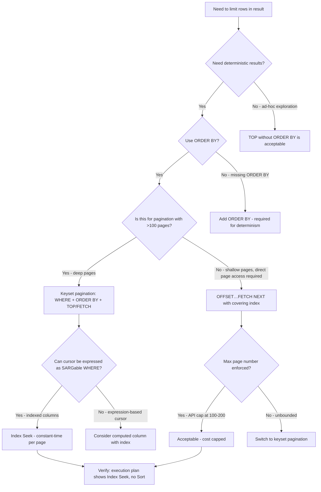

## Navigation

**Domain:** [[8 — Databases]] > **Group:** SQL Fundamentals **Previous:** [[8.068 — ORDER BY — Deterministic Sorting]] | **Next:** [[8.070 — (next topic)]]

### Prerequisites

- [[8.066 — SELECT Statement — Column Selection and Aliasing]] — row limiting operates on the final result columns; understanding projection is required to know which columns the limited row set contains.
- [[8.067 — WHERE Clause — Predicate Logic and SARGability]] — row limiting is applied after WHERE, so filtering first reduces the set that TOP/LIMIT operates on.
- [[8.068 — ORDER BY — Deterministic Sorting]] — ORDER BY is required for deterministic row limiting; without it, TOP and OFFSET/FETCH return non-deterministic subsets.

### Where This Fits

The TOP clause (T-SQL), LIMIT clause (PostgreSQL, MySQL, SQLite), and OFFSET…FETCH NEXT clause (ANSI SQL:2008, supported by SQL Server and PostgreSQL) are the mechanisms for restricting how many rows a query returns. Every .NET backend engineer encounters these in paginated API endpoints, reporting queries, and batch processing jobs. The critical performance distinction is that TOP combines with ORDER BY to enable a **Top N Sort** (sorting only the top N rows in memory rather than the full result set), while OFFSET…FETCH NEXT with large offsets forces the engine to count through all skipped rows — an O(offset) cost that grows linearly with page number. Interviewers probe this topic to determine whether a candidate understands keyset (seek-based) pagination vs offset-based pagination, the performance cliff of deep pages with OFFSET, and how EF Core's `Skip().Take()` translates to different SQL depending on the provider. Engineers who know this topic avoid the deep-page OFFSET problem by using keyset pagination for any list beyond page ~100.

---

## Core Mental Model

TOP (T-SQL), LIMIT (PostgreSQL), and OFFSET…FETCH NEXT (ANSI SQL) are the row-limiting operators that restrict the number of rows returned by a query. Logically, row limiting executes last — step 8 of 8, after ORDER BY. This is why TOP and FETCH NEXT **require** ORDER BY for deterministic results: without ORDER BY, there is no defined order, and the subset of rows returned is arbitrary (whatever the storage engine happens to read first). The key performance concept is the **Top N Sort**: when a query has both TOP (or FETCH NEXT) and ORDER BY but no index supports the ORDER BY, the optimizer uses a specialized sort that tracks only the top N rows in a min-heap or max-heap instead of sorting the entire result set. This reduces the sort complexity from O(M log M) to O(M log N), where M is the input row count and N is the TOP value — a massive savings when N << M. However, OFFSET…FETCH NEXT with a large offset (e.g., page 10,000) still requires the engine to count through all skipped rows — the execution plan shows the same scan/seek but with a `Top` operator that discards the first OFFSET rows. **Keyset pagination** (WHERE last_seen_id > @cursor ORDER BY id FETCH NEXT 20) avoids this entirely by using an index seek to jump directly to the start of the page.

### Classification

This is a **row-limiting specification** in the `TOP` / `LIMIT` / `OFFSET…FETCH` family. Each database has its own syntax but the semantics and optimization principles are shared:

|Feature|SQL Server|PostgreSQL|
|---|---|---|
|Simple limit|`SELECT TOP 10 ...`|`SELECT ... LIMIT 10`|
|With offset|`OFFSET 10 ROWS FETCH NEXT 10 ROWS ONLY`|`LIMIT 10 OFFSET 10`|
|Percent|`SELECT TOP 10 PERCENT ...`|Not supported natively|
|WITH TIES|`SELECT TOP 10 WITH TIES ...`|Not supported natively|

```mermaid
flowchart TD
    A[Row-limiting query received] --> B{Has ORDER BY?}
    B -->|No| C[Non-deterministic subset - rows depend on physical storage order]
    B -->|Yes| D{Does ORDER BY match an index?}
    D -->|Yes| E[Ordered Index Scan/Seek - read first N rows, stop]
    D -->|No| F{Does it have TOP/OFFSET?}
    F -->|Yes - TOP N| G[Top N Sort - O(M log N) instead of O(M log M)]
    F -->|Yes - OFFSET N| H[Full Sort (may spill) + count through N rows]
    F -->|No LIMIT clause| I[Full Sort on all rows]
    E --> J[Cheapest: N row reads + stop]
    G --> K[Memory: ~N rows tracked in heap]
    H --> L[OFFSET cost: O(N) rows counted and discarded]
```

### Key Properties

|Property|Value|Notes|
|---|---|---|
|Logical execution order|Last (step 8 of 8)|After ORDER BY — requires ORDER BY for determinism|
|Top N Sort complexity|O(M log N)|M = input rows, N = top rows — massive savings when N << M|
|OFFSET cost|O(offset)|Rows must be counted and discarded — grows linearly with page number|
|WITH TIES behavior|Returns extra rows if ties exist at boundary|Can return more rows than specified TOP value|
|PERCENT|TOP 10 PERCENT — computes N as percentage|N is rounded up; N >= 1 row minimum|
|Write Cost|None|Row limiting is read-only|

---

## Deep Mechanics

### How the Engine Executes This

1. **Parsing** — The parser identifies the TOP/LIMIT/OFFSET…FETCH clause. In T-SQL, TOP is parsed as a SELECT hint; in PostgreSQL, LIMIT and OFFSET are separate clauses. The parser extracts N (number of rows) and the optional WITH TIES or PERCENT modifier.

2. **Binding** — The algebrizer validates that TOP is used with ORDER BY (required for WITH TIES; strongly recommended for all row limiting). PERCENT is converted to an absolute row count: `CEILING(total_rows * percentage / 100.0)`.

3. **Optimization** — The optimizer considers several strategies:
   - **Ordered scan/seek + Top:** If ORDER BY matches an index, the optimizer reads rows from the index in order and stops after N rows. This is the optimal plan — O(N) reads.
   - **Top N Sort:** If ORDER BY does not match an index, the optimizer inserts a Top N Sort. Instead of sorting all M rows, it maintains a heap of the top N rows. Each incoming row is compared against the heap's minimum (for DESC) or maximum (for ASC); if the new row belongs in the top N, it is inserted into the heap and the smallest is evicted. This is O(M log N).
   - **Full Sort + Top:** If N is close to M (e.g., TOP 90 PERCENT), the optimizer may choose a full sort because the Top N Sort benefit is negligible.

4. **Execution for OFFSET…FETCH NEXT:**
   - With a supporting index: the engine seeks to the starting position (for keyset) or scans and counts through OFFSET rows, then returns FETCH NEXT rows.
   - Without a supporting index: the engine sorts all rows, then counts through OFFSET rows (discarding them), then returns the FETCH NEXT rows. This means **OFFSET 100,000 costs 100,000 row evaluations even before any data is returned**.

5. **With TIES execution:** After determining the Nth row's sort key value, the engine scans additional rows that share the same sort key value. The result set may be larger than N. The Top N Sort cannot be used for WITH TIES — the engine must determine the boundary value first, then include all ties.

### SQL Visibility

```sql
-- SQL Server: TOP with ORDER BY — deterministic, enables Top N Sort
SELECT TOP 20
    o.OrderId,
    o.CustomerId,
    o.OrderDate,
    o.TotalAmount
FROM dbo.Orders AS o
WHERE o.CustomerId = 1042
ORDER BY o.OrderDate DESC;
```

```csharp
// EF Core LINQ — Take translates to TOP
var recentOrders = await dbContext.Orders
    .Where(o => o.CustomerId == 1042)
    .OrderByDescending(o => o.OrderDate)
    .Take(20)
    .Select(o => new OrderSummaryDto(
        o.OrderId, o.CustomerId, o.OrderDate, o.TotalAmount))
    .AsNoTracking()
    .ToListAsync(cancellationToken);
```

**Generated SQL (from EF Core logs):**

```sql
SELECT TOP(@__p_0) o.OrderId, o.CustomerId, o.OrderDate, o.TotalAmount
FROM Orders AS o
WHERE o.CustomerId = 1042
ORDER BY o.OrderDate DESC
```

```sql
-- SQL Server: OFFSET…FETCH NEXT — pagination (page 5, 20 rows per page)
SELECT o.OrderId, o.CustomerId, o.OrderDate, o.TotalAmount
FROM dbo.Orders AS o
WHERE o.CustomerId = 1042
ORDER BY o.OrderDate DESC
OFFSET 80 ROWS
FETCH NEXT 20 ROWS ONLY;
```

```csharp
// EF Core LINQ — Skip + Take translates to OFFSET…FETCH NEXT
var page5 = await dbContext.Orders
    .Where(o => o.CustomerId == 1042)
    .OrderByDescending(o => o.OrderDate)
    .Skip(80)
    .Take(20)
    .Select(o => new OrderSummaryDto(
        o.OrderId, o.CustomerId, o.OrderDate, o.TotalAmount))
    .AsNoTracking()
    .ToListAsync(cancellationToken);
```

**Generated SQL (from EF Core logs):**

```sql
SELECT o.OrderId, o.CustomerId, o.OrderDate, o.TotalAmount
FROM Orders AS o
WHERE o.CustomerId = 1042
ORDER BY o.OrderDate DESC
OFFSET @__p_0 ROWS
FETCH NEXT @__p_1 ROWS ONLY
```

### Execution Plan Analysis

**TOP 20 with matching index — optimal:**

- Index: `IX_Orders_CustomerId_OrderDate` on `(CustomerId, OrderDate DESC)`
- Plan: `[Index Seek IX_Orders_CustomerId_OrderDate] → [Top] → [SELECT]`
- The seek finds the first 20 rows in index order and stops — reads exactly 20 leaf rows
- Logical Reads: ~4–6 (index depth + 20 leaf pages in cache)
- Estimated Cost: 0.003 to 0.009

**TOP 20 without matching index — Top N Sort:**

- Plan: `[Clustered Index Scan] → [Top N Sort (ORDER BY OrderDate DESC)] → [SELECT]`
- The Top N Sort tracks 20 rows in a heap; evaluates 100K rows, keeps the 20 newest
- Logical Reads: ~11,400 (scan) + 0 (Top N Sort is CPU/memory, not I/O)
- Memory Grant: ~2 KB (20 row heap)

**OFFSET 10,000 FETCH NEXT 20 without matching index — expensive:**

- Plan: `[Clustered Index Scan] → [Sort] → [Top (Offset 10000)] → [SELECT]`
- Full Sort: must sort all rows to determine order before skipping
- THEN Top: counts through 10,000 sorted rows, discarding each, then returns 20
- Logical Reads: ~11,400 (scan) + Sort (CPU) + Top counting (CPU)
- This plan degrades linearly with offset size

```
TOP 20 with matching index (optimal):
[Index Seek IX_Orders_CustomerId_OrderDate_INCL] → [Top] → [SELECT]
Logical Reads: ~4-6  |  Rows read from storage: 20

TOP 20 without matching index (Top N Sort):
[Clustered Index Scan] → [Top N Sort] → [SELECT]
Logical Reads: ~11,400  |  Memory: ~2 KB  |  Rows evaluated: 100K

OFFSET 10000 FETCH 20 without matching index (deep page):
[Clustered Index Scan] → [Sort] → [Top (Offset 10000+20)] → [SELECT]
Logical Reads: ~11,400  |  Memory: ~18 MB  |  Rows counted: 10,020
```

### Cost Visibility

```sql
SET STATISTICS IO ON;
SET STATISTICS TIME ON;

-- TOP 20 with matching covering index
SELECT TOP 20 o.OrderId, o.CustomerId, o.OrderDate, o.TotalAmount
FROM dbo.Orders AS o
WHERE o.CustomerId = 1042
ORDER BY o.OrderDate DESC;

-- Expected output:
-- Table 'Orders'. Scan count 1, logical reads 5, physical reads 0
-- SQL Server Execution Times: CPU time = 0ms, elapsed time = 1ms

-- OFFSET 10000 rows (deep page without covering sort index)
SELECT o.OrderId, o.CustomerId, o.OrderDate, o.TotalAmount
FROM dbo.Orders AS o
WHERE o.CustomerId = 1042
ORDER BY o.OrderDate DESC
OFFSET 10000 ROWS FETCH NEXT 20 ROWS ONLY;

-- Expected output:
-- Table 'Orders'. Scan count 1, logical reads 312, physical reads 0
-- SQL Server Execution Times: CPU time = 16ms, elapsed time = 18ms
-- (Scans index to count 10000 rows before returning 20)
```

### Failure Modes

**Non-deterministic TOP without ORDER BY:** The most common bug — `SELECT TOP 10 * FROM Orders` returns an arbitrary subset. After an index rebuild or page split, the same query returns different rows. This breaks any feature that assumes stable ordering (pagination, batch processing, "next" links).

**Deep-page OFFSET performance cliff:** OFFSET 1,000,000 on a 10M row table forces the engine to count through 1M rows. Even with a covering index, the execution time grows linearly with the offset. At page 10,000 (20 rows/page), the query runs 10,000x slower than page 1.

**TOP with PERCENT and small tables:** `SELECT TOP 10 PERCENT` on a table with 5 rows returns `CEILING(5 * 0.10) = 1` row. The rounding behavior surprises developers who expect at least 10% resolution.

**WITH TIES returning more rows than expected:** `SELECT TOP 10 WITH TIES ... ORDER BY Score DESC` may return 15 rows if positions 9–12 all have Score = 95. The result set can be significantly larger than N, breaking UI layouts that expect exactly N items.

---

## Production Patterns and Implementation

### Primary SQL Implementation

```sql
-- ============================================================
-- Schema context
-- ============================================================
CREATE TABLE dbo.Orders
(
    OrderId      INT           NOT NULL IDENTITY(1,1),
    CustomerId   INT           NOT NULL,
    OrderDate    DATETIME2(0)  NOT NULL,
    Status       VARCHAR(20)   NOT NULL,
    TotalAmount  DECIMAL(18,2) NOT NULL,
    ShippingAddr NVARCHAR(500) NULL,
    Notes        NVARCHAR(MAX) NULL,
    CreatedAt    DATETIME2(0)  NOT NULL DEFAULT SYSUTCDATETIME(),
    CONSTRAINT PK_Orders PRIMARY KEY CLUSTERED (OrderId)
);

CREATE NONCLUSTERED INDEX IX_Orders_CustomerId_OrderDate
    ON dbo.Orders (CustomerId, OrderDate DESC)
    INCLUDE (Status, TotalAmount);

-- ============================================================
-- Pattern 1: TOP with ORDER BY — standard deterministic limiting
-- ============================================================
SELECT TOP 50
    o.OrderId,
    o.CustomerId,
    o.OrderDate,
    o.Status,
    o.TotalAmount
FROM dbo.Orders AS o
WHERE o.CustomerId = @CustomerId
ORDER BY o.OrderDate DESC;

-- ============================================================
-- Pattern 2: TOP with PERCENT
-- ============================================================
SELECT TOP 10 PERCENT
    o.OrderId,
    o.TotalAmount
FROM dbo.Orders AS o
ORDER BY o.TotalAmount DESC;

-- ============================================================
-- Pattern 3: TOP WITH TIES — include rows with same sort key as Nth row
-- ============================================================
SELECT TOP 5 WITH TIES
    o.CustomerId,
    SUM(o.TotalAmount) AS TotalSpend
FROM dbo.Orders AS o
GROUP BY o.CustomerId
ORDER BY TotalSpend DESC;
-- If 5th and 6th place have same TotalSpend, both are returned

-- ============================================================
-- Pattern 4: OFFSET…FETCH NEXT — standard pagination (page 3, 20 rows)
-- ============================================================
DECLARE @PageNumber INT = 3;
DECLARE @PageSize   INT = 20;

SELECT o.OrderId, o.CustomerId, o.OrderDate, o.Status, o.TotalAmount
FROM dbo.Orders AS o
WHERE o.CustomerId = @CustomerId
ORDER BY o.OrderDate DESC
OFFSET (@PageNumber - 1) * @PageSize ROWS
FETCH NEXT @PageSize ROWS ONLY;

-- ============================================================
-- Pattern 5: Keyset pagination — no offset, uses seek (recommended)
-- ============================================================
-- Page 1: first 20 rows
SELECT TOP 20
    o.OrderId, o.CustomerId, o.OrderDate, o.Status, o.TotalAmount
FROM dbo.Orders AS o
WHERE o.CustomerId = @CustomerId
ORDER BY o.OrderDate DESC;

-- Page N (continuation): where OrderDate < @last_OrderDate (or <= for inclusive)
-- Returns the next 20 rows AFTER the last seen row
SELECT TOP 20
    o.OrderId, o.CustomerId, o.OrderDate, o.Status, o.TotalAmount
FROM dbo.Orders AS o
WHERE o.CustomerId = @CustomerId
  AND (o.OrderDate < @LastOrderDate
    OR (o.OrderDate = @LastOrderDate AND o.OrderId < @LastOrderId))  -- tiebreaker
ORDER BY o.OrderDate DESC, o.OrderId DESC;

-- Keyset pagination uses Index Seek → exactly the rows needed, no counting
-- Logical reads: constant ~4–6 regardless of whether this is page 1 or page 10,000

-- ============================================================
-- Anti-pattern: TOP without ORDER BY
-- ============================================================
-- ❌ SELECT TOP 20 o.OrderId, o.TotalAmount FROM dbo.Orders;
-- This returns 20 arbitrary rows — non-deterministic

-- ============================================================
-- Anti-pattern: OFFSET with deep page number
-- ============================================================
-- ❌ OFFSET 100000 ROWS FETCH NEXT 20 ROWS ONLY
-- Engine must count through 100K sorted rows — linear cost per page
```

### EF Core Implementation

```csharp
public class ApplicationDbContext : DbContext
{
    public DbSet<Order> Orders => Set<Order>();

    protected override void OnModelCreating(ModelBuilder modelBuilder)
    {
        modelBuilder.Entity<Order>(entity =>
        {
            entity.ToTable("Orders");
            entity.HasKey(o => o.OrderId);
            entity.HasIndex(o => new { o.CustomerId, o.OrderDate })
                  .IsDescending(false, true)
                  .HasDatabaseName("IX_Orders_CustomerId_OrderDate");
        });
    }
}

// Offset-based pagination (acceptable for first ~100 pages)
public async Task<PagedResult<OrderSummaryDto>> GetOrdersPageAsync(
    int customerId,
    int pageNumber,
    int pageSize,
    CancellationToken cancellationToken = default)
{
    var totalCount = await _dbContext.Orders
        .CountAsync(o => o.CustomerId == customerId, cancellationToken);

    var items = await _dbContext.Orders
        .Where(o => o.CustomerId == customerId)
        .OrderByDescending(o => o.OrderDate)
        .Skip((pageNumber - 1) * pageSize)
        .Take(pageSize)
        .Select(o => new OrderSummaryDto(
            o.OrderId, o.CustomerId, o.OrderDate, o.Status, o.TotalAmount))
        .AsNoTracking()
        .ToListAsync(cancellationToken);

    return new PagedResult<OrderSummaryDto>
    {
        Items = items,
        TotalCount = totalCount,
        PageNumber = pageNumber,
        PageSize = pageSize
    };
}

// Keyset pagination (recommended for any list beyond ~100 pages)
public async Task<IReadOnlyList<OrderSummaryDto>> GetOrdersAfterAsync(
    int customerId,
    DateTime? lastOrderDate,
    int? lastOrderId,
    int pageSize,
    CancellationToken cancellationToken = default)
{
    var query = _dbContext.Orders
        .Where(o => o.CustomerId == customerId)
        .OrderByDescending(o => o.OrderDate)
        .ThenByDescending(o => o.OrderId)
        .Take(pageSize);

    // Apply keyset cursor if continuing from a previous page
    if (lastOrderDate.HasValue && lastOrderId.HasValue)
    {
        query = _dbContext.Orders
            .Where(o => o.CustomerId == customerId)
            .Where(o => o.OrderDate < lastOrderDate.Value
                     || (o.OrderDate == lastOrderDate.Value && o.OrderId < lastOrderId.Value))
            .OrderByDescending(o => o.OrderDate)
            .ThenByDescending(o => o.OrderId)
            .Take(pageSize);
    }

    return await query
        .Select(o => new OrderSummaryDto(
            o.OrderId, o.CustomerId, o.OrderDate, o.Status, o.TotalAmount))
        .AsNoTracking()
        .ToListAsync(cancellationToken);
}

// ❌ WRONG — no ORDER BY with Take
// var orders = await _dbContext.Orders
//     .Take(20)
//     .ToListAsync(cancellationToken);  // Non-deterministic subset!
```

### Dapper Implementation

```csharp
public sealed class OrderRepository
{
    private readonly IDbConnectionFactory _connectionFactory;

    public OrderRepository(IDbConnectionFactory connectionFactory)
        => _connectionFactory = connectionFactory;

    // OFFSET-based pagination
    public async Task<PagedResult<OrderSummaryDto>> GetOrdersPageAsync(
        int customerId,
        int pageNumber,
        int pageSize,
        CancellationToken cancellationToken = default)
    {
        const string countSql = @"
            SELECT COUNT(1) FROM dbo.Orders WHERE CustomerId = @CustomerId;";

        const string pageSql = @"
            SELECT o.OrderId, o.CustomerId, o.OrderDate, o.Status, o.TotalAmount
            FROM dbo.Orders AS o
            WHERE o.CustomerId = @CustomerId
            ORDER BY o.OrderDate DESC
            OFFSET @Offset ROWS
            FETCH NEXT @PageSize ROWS ONLY;";

        await using var connection = _connectionFactory.Create();

        var totalCount = await connection.ExecuteScalarAsync<int>(
            new CommandDefinition(countSql,
                new { CustomerId = customerId },
                cancellationToken: cancellationToken));

        var items = await connection.QueryAsync<OrderSummaryDto>(
            new CommandDefinition(pageSql,
                new
                {
                    CustomerId = customerId,
                    Offset = (pageNumber - 1) * pageSize,
                    PageSize = pageSize
                },
                cancellationToken: cancellationToken));

        return new PagedResult<OrderSummaryDto>
        {
            Items = items.AsList(),
            TotalCount = totalCount,
            PageNumber = pageNumber,
            PageSize = pageSize
        };
    }

    // Keyset pagination — no OFFSET, uses index seek
    public async Task<IReadOnlyList<OrderSummaryDto>> GetOrdersKeysetAsync(
        int customerId,
        DateTime? lastOrderDate,
        int? lastOrderId,
        int pageSize,
        CancellationToken cancellationToken = default)
    {
        // Use keyset if cursor provided, otherwise first page
        string sql;
        object parameters;

        if (lastOrderDate.HasValue && lastOrderId.HasValue)
        {
            sql = @"
                SELECT TOP(@PageSize)
                    o.OrderId, o.CustomerId, o.OrderDate, o.Status, o.TotalAmount
                FROM dbo.Orders AS o
                WHERE o.CustomerId = @CustomerId
                  AND (o.OrderDate < @LastOrderDate
                    OR (o.OrderDate = @LastOrderDate AND o.OrderId < @LastOrderId))
                ORDER BY o.OrderDate DESC, o.OrderId DESC;";

            parameters = new
            {
                CustomerId = customerId,
                LastOrderDate = lastOrderDate.Value,
                LastOrderId = lastOrderId.Value,
                PageSize = pageSize
            };
        }
        else
        {
            sql = @"
                SELECT TOP(@PageSize)
                    o.OrderId, o.CustomerId, o.OrderDate, o.Status, o.TotalAmount
                FROM dbo.Orders AS o
                WHERE o.CustomerId = @CustomerId
                ORDER BY o.OrderDate DESC, o.OrderId DESC;";

            parameters = new
            {
                CustomerId = customerId,
                PageSize = pageSize
            };
        }

        await using var connection = _connectionFactory.Create();
        var results = await connection.QueryAsync<OrderSummaryDto>(
            new CommandDefinition(sql, parameters,
                cancellationToken: cancellationToken));
        return results.AsList();
    }
}

public record PagedResult<T>
{
    public IReadOnlyList<T> Items { get; init; } = [];
    public int TotalCount { get; init; }
    public int PageNumber { get; init; }
    public int PageSize { get; init; }
    public int TotalPages => (int)Math.Ceiling((double)TotalCount / PageSize);
}
```

### Configuration and Wiring

```csharp
builder.Services.AddDbContext<ApplicationDbContext>(options =>
    options.UseSqlServer(
        builder.Configuration.GetConnectionString("DefaultConnection"),
        sqlOptions => sqlOptions.EnableRetryOnFailure(3))
    .EnableDetailedErrors(builder.Environment.IsDevelopment())
    .EnableSensitiveDataLogging(builder.Environment.IsDevelopment()));

builder.Logging.AddFilter("Microsoft.EntityFrameworkCore.Database.Command",
    builder.Environment.IsDevelopment() ? LogLevel.Information : LogLevel.Warning);

builder.Services.AddSingleton<IDbConnectionFactory>(sp =>
    new SqlConnectionFactory(
        builder.Configuration.GetConnectionString("DefaultConnection")!));
builder.Services.AddScoped<OrderRepository>();
```

### SQL Server vs PostgreSQL Differences

```sql
-- PostgreSQL: LIMIT / OFFSET syntax (not TOP)
SELECT o.order_id, o.customer_id, o.order_date, o.total_amount
FROM orders AS o
WHERE o.customer_id = $1
ORDER BY o.order_date DESC
LIMIT 20;

-- PostgreSQL: LIMIT with OFFSET
SELECT o.order_id, o.customer_id, o.order_date, o.total_amount
FROM orders AS o
WHERE o.customer_id = $1
ORDER BY o.order_date DESC
LIMIT 20 OFFSET 80;

-- PostgreSQL: ANSI SQL OFFSET…FETCH is also supported
SELECT o.order_id, o.customer_id, o.order_date, o.total_amount
FROM orders AS o
WHERE o.customer_id = $1
ORDER BY o.order_date DESC
OFFSET 80 ROWS FETCH NEXT 20 ROWS ONLY;

-- PostgreSQL: LIMIT ALL to remove a limit
-- PostgreSQL: OFFSET without LIMIT returns all rows (SQL Server requires OFFSET…FETCH together)
-- PostgreSQL: OFFSET with large values has the same deep-page problem

-- PostgreSQL: Keyset pagination works identically (WHERE + ORDER BY + LIMIT)
SELECT o.order_id, o.customer_id, o.order_date, o.total_amount
FROM orders AS o
WHERE o.customer_id = $1
  AND (o.order_date, o.order_id) < ($2, $3)  -- row constructor comparison
ORDER BY o.order_date DESC, o.order_id DESC
LIMIT 20;
-- Row constructor comparison is PostgreSQL-specific syntax
```

---

## Gotchas and Production Pitfalls

### TOP Without ORDER BY — Non-Deterministic Results

**Pitfall:** Using `SELECT TOP 10 ...` without an ORDER BY clause. The database returns any 10 rows — the subset depends on physical storage order, which changes after index rebuilds, page splits, or database restarts.

```sql
-- ❌ Non-deterministic — which 10 rows is undefined
SELECT TOP 10 o.OrderId, o.CustomerId, o.TotalAmount
FROM dbo.Orders AS o;
```

**Symptom:** In development, the same 10 rows appear every time (coincidentally matching clustered index order). In production, after index maintenance, the same query returns different rows. Paginated lists show items jumping between pages. Batch processing jobs may miss or duplicate rows.

**Fix:**

```sql
-- ✅ Deterministic — ORDER BY defines which 10 rows
SELECT TOP 10 o.OrderId, o.CustomerId, o.TotalAmount
FROM dbo.Orders AS o
ORDER BY o.OrderId;
```

**Cost of not fixing:** A nightly batch job that processes "the first 10,000 pending orders" without ORDER BY processes a different subset each night — some orders are processed multiple times, others are never processed. Payment processing, inventory updates, and notification jobs produce incorrect results silently.

---

### Deep-Page OFFSET Performance Cliff

**Pitfall:** Using `OFFSET 100000 ROWS FETCH NEXT 20 ROWS ONLY` for pagination without realizing that the database must count through all 100,000 preceding rows for every query.

```sql
-- ❌ Page 5000 with 20 rows/page — counts through 99,980 rows before returning 20
SELECT o.OrderId, o.CustomerId, o.OrderDate
FROM dbo.Orders AS o
ORDER BY o.OrderDate DESC
OFFSET 99980 ROWS FETCH NEXT 20 ROWS ONLY;
```

**Symptom:** Page 1 completes in 2 ms. Page 100 completes in 20 ms. Page 5,000 completes in 4,000 ms. The execution time grows linearly with the page number. Applications appear fast initially but become unusable as users navigate to later pages.

**Fix:**

```sql
-- ✅ Option 1: Keyset pagination — constant-time regardless of page depth
-- Pass the last seen OrderDate and OrderId as cursor
SELECT TOP 20 o.OrderId, o.CustomerId, o.OrderDate
FROM dbo.Orders AS o
WHERE o.CustomerId = @CustomerId
  AND (o.OrderDate < @LastOrderDate
    OR (o.OrderDate = @LastOrderDate AND o.OrderId < @LastOrderId))
ORDER BY o.OrderDate DESC, o.OrderId DESC;

-- ✅ Option 2: Restrict max page number in application
-- if (pageNumber > 100) throw new BadRequestException("Page number too high");

-- ✅ Option 3: Use a covering index on ORDER BY columns
-- Limits the cost of counting through offset rows
```

**Cost of not fixing:** A public-facing paginated list auto-generated by EF Core's `Skip().Take()` on page 10,000 times out. The API returns 500 errors. Users cannot access historical data. The database server shows high CPU and blocking, affecting all other queries.

---

### TOP WITH TIES Returning Unexpected Row Count

**Pitfall:** Using `WITH TIES` when the application expects exactly N rows (e.g., dashboard "Top 5" widget). If the Nth and N+1th rows have the same sort key value, more than N rows are returned.

```sql
-- ❌ May return 5, 6, 7, or more rows if ties exist at position 5
SELECT TOP 5 WITH TIES
    c.CustomerId,
    c.FirstName + ' ' + c.LastName AS CustomerName,
    SUM(o.TotalAmount) AS TotalSpend
FROM dbo.Customers AS c
INNER JOIN dbo.Orders AS o ON c.CustomerId = o.CustomerId
GROUP BY c.CustomerId, c.FirstName, c.LastName
ORDER BY TotalSpend DESC;
```

**Symptom:** The UI "Top 5 Customers" widget shows 8 customers. The front-end throws a layout error or silently truncates the extras. The backend returns more data than expected — network overhead, unexpected memory allocation.

**Fix:**

```sql
-- ✅ Option 1: Remove WITH TIES and use a deterministic tiebreaker in ORDER BY
SELECT TOP 5
    c.CustomerId,
    c.FirstName + ' ' + c.LastName AS CustomerName,
    SUM(o.TotalAmount) AS TotalSpend
FROM dbo.Customers AS c
INNER JOIN dbo.Orders AS o ON c.CustomerId = o.CustomerId
GROUP BY c.CustomerId, c.FirstName, c.LastName
ORDER BY TotalSpend DESC, c.CustomerId ASC;  -- tiebreaker

-- ✅ Option 2: Accept WITH TIES and handle variable row count in application
-- ✅ Option 3: Use RANK() or DENSE_RANK() for analytical tie handling
```

**Cost of not fixing:** A layout designed for exactly 5 items breaks when 8 are returned. If the application code assumes exactly 5 items (e.g., assigning them to 5 fixed UI slots), index-out-of-range exceptions occur. If the database server runs out of memory for the sort, the query spills to TempDB.

---

### TOP in Subqueries Without ORDER BY

**Pitfall:** Using `SELECT TOP 1` in a subquery without ORDER BY, expecting a specific row (e.g., "the most recent order").

```sql
-- ❌ Returns an arbitrary order, not necessarily the most recent
SELECT
    c.CustomerId,
    c.FirstName + ' ' + c.LastName AS CustomerName,
    (SELECT TOP 1 o.TotalAmount
     FROM dbo.Orders AS o
     WHERE o.CustomerId = c.CustomerId) AS LastOrderAmount
FROM dbo.Customers AS c;
```

**Symptom:** The `LastOrderAmount` column returns a random order's amount, not the most recent one. Different executions return different values for the same customer.

**Fix:**

```sql
-- ✅ Deterministic — ORDER BY defines which row TOP 1 returns
SELECT
    c.CustomerId,
    c.FirstName + ' ' + c.LastName AS CustomerName,
    (SELECT TOP 1 o.TotalAmount
     FROM dbo.Orders AS o
     WHERE o.CustomerId = c.CustomerId
     ORDER BY o.OrderDate DESC) AS LastOrderAmount
FROM dbo.Customers AS c;

-- ✅ Better: use OUTER APPLY for correlated subquery with ordering
SELECT
    c.CustomerId,
    c.FirstName + ' ' + c.LastName AS CustomerName,
    last_order.TotalAmount AS LastOrderAmount
FROM dbo.Customers AS c
OUTER APPLY (
    SELECT TOP 1 o.TotalAmount
    FROM dbo.Orders AS o
    WHERE o.CustomerId = c.CustomerId
    ORDER BY o.OrderDate DESC
) AS last_order;
```

**Cost of not fixing:** The application displays incorrect "last order amount" on customer profile pages. The value changes unpredictably — confusing users and causing support tickets. The bug is hard to reproduce because it depends on physical storage order.

---

### TOP PERCENT With Small Tables

**Pitfall:** Using `SELECT TOP 10 PERCENT` on a small table expecting at least 10% of rows, but getting rounding behavior that returns fewer rows than expected.

```sql
-- ❌ Table has 5 rows; returns CEILING(5 * 0.10) = 1 row
SELECT TOP 10 PERCENT o.OrderId, o.TotalAmount
FROM dbo.Orders AS o
ORDER BY o.TotalAmount DESC;
-- User expects at least 5 rows (10% of small table) but gets 1
```

**Symptom:** The query returns fewer rows than the developer or user expects. When the table has 0 rows, TOP 10 PERCENT returns 0 rows (no error). When the table has 1 row, TOP 10 PERCENT returns 1 row (CEILING(0.1) = 1).

**Fix:**

```sql
-- ✅ Option 1: Use TOP with a fixed number instead of PERCENT
SELECT TOP 5 o.OrderId, o.TotalAmount
FROM dbo.Orders AS o
ORDER BY o.TotalAmount DESC;

-- ✅ Option 2: Use PERCENT only when the result set is guaranteed to be large
-- ✅ Option 3: Use TABLESAMPLE for statistical sampling instead
```

**Cost of not fixing:** In a reporting dashboard, "Top 10 percent of orders by value" shows only 1 order when the table has 5 rows. The dashboard looks empty. Business users lose confidence in the data.

---

### OFFSET With Changing Data Causes Duplicate or Missing Rows

**Pitfall:** Using offset-based pagination on a data set that changes between page requests. If a new row is inserted at position 50 between page 1 and page 2, page 2 (which requested OFFSET 20) skips the new row or duplicates an old row.

```sql
-- Page 1: returns rows 1-20 of Orders sorted by OrderDate DESC
-- Between requests: a new order is inserted, now at position 1
-- Page 2 (OFFSET 20): now returns rows 21-40 of the NEW ordering
-- Row 20 from page 1 is now row 21 — appears again on page 2!
```

**Symptom:** The user sees the last item of page 1 as the first item of page 2. Or, if rows are deleted, they skip over items. This is known as **phantom reads in pagination**.

**Fix:**

```sql
-- ✅ Option 1: Keyset pagination — cursor-based, no offset
-- The cursor uniquely identifies the last seen row, regardless of new insertions
SELECT TOP 20 o.OrderId, o.CustomerId, o.OrderDate
FROM dbo.Orders AS o
WHERE (o.OrderDate, o.OrderId) < (@LastOrderDate, @LastOrderId)
ORDER BY o.OrderDate DESC, o.OrderId DESC;

-- ✅ Option 2: Snapshot isolation for pagination queries
-- SET TRANSACTION ISOLATION LEVEL SNAPSHOT;
-- Ensures consistent read view across the entire pagination

-- ✅ Option 3: Cache the total ordered row IDs in application memory
```

**Cost of not fixing:** An e-commerce admin panel showing orders in reverse chronological order duplicates or skips rows as users navigate pages. Orders may be missed during processing or reviewed twice, causing operational confusion. Customer service agents cannot reliably find orders because row positions shift between page loads.

---

## Performance Implications

### Benchmark: Before and After

```sql
-- Baseline: OFFSET-based deep page (page 5000, 20 rows/page, no covering sort index)
SET STATISTICS IO ON;
SET STATISTICS TIME ON;

SELECT o.OrderId, o.CustomerId, o.OrderDate, o.TotalAmount
FROM dbo.Orders AS o
ORDER BY o.OrderDate DESC
OFFSET 99980 ROWS FETCH NEXT 20 ROWS ONLY;
-- Table 'Orders'. Scan count 1, logical reads 11,400, physical reads 0
-- SQL Server Execution Times: CPU time = 415ms, elapsed time = 432ms
-- (Sort + count through 100K rows)

-- Optimized: Keyset pagination — page 5000 equivalent
SELECT TOP 20 o.OrderId, o.CustomerId, o.OrderDate, o.TotalAmount
FROM dbo.Orders AS o
WHERE o.OrderDate < @LastOrderDate
   OR (o.OrderDate = @LastOrderDate AND o.OrderId < @LastOrderId)
ORDER BY o.OrderDate DESC;
-- Table 'Orders'. Scan count 1, logical reads 6, physical reads 0
-- SQL Server Execution Times: CPU time = 0ms, elapsed time = 2ms
-- (Seek to cursor position, read 20 rows)
```

**Improvement:** 72x reduction in CPU time (415 ms → 0 ms), 1,900x reduction in logical reads (11,400 → 6), and constant-time regardless of "page depth."

```sql
-- Baseline: TOP 20 without matching ORDER BY index (Top N Sort)
SELECT TOP 20 o.OrderId, o.CustomerId, o.OrderDate, o.TotalAmount
FROM dbo.Orders AS o
ORDER BY o.TotalAmount DESC;
-- Table 'Orders'. Scan count 1, logical reads 11,400, physical reads 0
-- CPU time = 8ms, elapsed time = 46ms
-- (Top N Sort tracks 20 rows, evaluates 500K rows)

-- Optimized: Index matching ORDER BY
CREATE INDEX IX_Orders_TotalAmount ON dbo.Orders (TotalAmount DESC) INCLUDE (...);
SELECT TOP 20 o.OrderId, o.CustomerId, o.OrderDate, o.TotalAmount
FROM dbo.Orders AS o
ORDER BY o.TotalAmount DESC;
-- Table 'Orders'. Scan count 1, logical reads 12, physical reads 0
-- CPU time = 0ms, elapsed time = 2ms
```

**Improvement:** Top N Sort CPU vs ordered scan: 8 ms → 0 ms (Top N Sort is cheap for N=20, but still not free).

### BenchmarkDotNet

```csharp
[MemoryDiagnoser]
[SimpleJob(RuntimeMoniker.Net90)]
public class RowLimitingBenchmark
{
    private SqlConnection _connection = default!;

    [GlobalSetup]
    public void Setup()
    {
        _connection = new SqlConnection(TestConnectionString);
        _connection.Open();
        // 1M row Orders table; IX_Orders_CustomerId_OrderDate covering index exists
    }

    [Benchmark(Baseline = true)]
    public async Task<List<OrderDto>> OffsetPagination_Page1()
    {
        const string sql = @"
            SELECT OrderId, CustomerId, OrderDate, TotalAmount
            FROM dbo.Orders
            WHERE CustomerId = 1042
            ORDER BY OrderDate DESC
            OFFSET 0 ROWS FETCH NEXT 20 ROWS ONLY";
        var results = await _connection.QueryAsync<OrderDto>(sql);
        return results.AsList();
    }

    [Benchmark]
    public async Task<List<OrderDto>> OffsetPagination_Page5000()
    {
        const string sql = @"
            SELECT OrderId, CustomerId, OrderDate, TotalAmount
            FROM dbo.Orders
            WHERE CustomerId = 1042
            ORDER BY OrderDate DESC
            OFFSET 99980 ROWS FETCH NEXT 20 ROWS ONLY";
        var results = await _connection.QueryAsync<OrderDto>(sql);
        return results.AsList();
    }

    [Benchmark]
    public async Task<List<OrderDto>> KeysetPagination()
    {
        const string sql = @"
            SELECT TOP 20 OrderId, CustomerId, OrderDate, TotalAmount
            FROM dbo.Orders
            WHERE CustomerId = 1042
              AND OrderDate < @LastDate
            ORDER BY OrderDate DESC";
        var results = await _connection.QueryAsync<OrderDto>(
            sql, new { LastDate = new DateTime(2024, 1, 15) });
        return results.AsList();
    }

    [GlobalCleanup]
    public void Cleanup() => _connection.Dispose();
}
```

**Expected results (approximate, SQL Server 2022, NVMe SSD, 1M rows):**

|Method|Mean|Logical Reads|Allocated|
|---|---|---|---|
|OffsetPagination_Page1|~2 ms|~6|~18 KB|
|OffsetPagination_Page5000|~432 ms|~11,400|~450 KB|
|KeysetPagination|~2 ms|~6|~18 KB|

### Write Amplification

Keyset pagination relies on a composite index on the cursor columns. That index adds write overhead similar to any non-clustered index (~2–3 pages per INSERT/UPDATE). The overhead is justified by the dramatic read improvement and is negligible for most workloads.

---

## Interview Arsenal

### Question Bank

1. **What is the logical execution order of TOP/LIMIT/OFFSET, and why does it require ORDER BY for deterministic results?**
2. **How does a Top N Sort differ from a full Sort in terms of memory, CPU, and complexity?**
3. **What is the performance difference between OFFSET 20 and OFFSET 100,000 on a 10M row table?**
4. **What is keyset pagination, and why does it avoid the deep-page performance cliff?**
5. **TOP vs OFFSET…FETCH NEXT vs keyset pagination: compare the execution plan shapes.**
6. **Read this execution plan: `[Clustered Index Scan] → [Sort] → [Top (Offset 50,000)] → [SELECT]`. What problem does it reveal and how do you fix it?**
7. **At 1,000 requests/second with OFFSET 10,000 per request, what happens to the database server?**
8. **How does EF Core's `Skip().Take()` translate to SQL, and what can you do to avoid deep-page problems?**

### Spoken Answers

**Q: What is the logical execution order of TOP/LIMIT/OFFSET, and why does it require ORDER BY for deterministic results?**

> **Average answer:** TOP limits the number of rows. ORDER BY sorts them first. Without ORDER BY, you get random rows.

> **Great answer:** TOP and OFFSET…FETCH NEXT execute at step 8 — the very last step in SQL's logical query processing order, after ORDER BY at step 7. This sequence is critical: ORDER BY determines which rows are candidates for being in the "top N" or are skipped via OFFSET. Without ORDER BY, the database has no definition of "top" — every row is equally valid, and the storage engine returns whatever it reads first from the physical pages, which varies based on the access path, page splits, and allocation order. For example, `SELECT TOP 10 FROM Orders` may return rows 1–10 on Monday, rows 500–510 after an index rebuild on Tuesday, and rows 900–910 after a page split on Wednesday — all for the same query. The fix is always to pair TOP with ORDER BY. For OFFSET…FETCH NEXT, ORDER BY is syntactically required. In EF Core, `Take()` without `OrderBy()` generates `SELECT TOP(@p)` without an ORDER BY clause — this is technically valid SQL but produces non-deterministic results, which I verify by enabling SQL logging and checking the generated SQL.

---

**Q: How does a Top N Sort differ from a full Sort in terms of memory, CPU, and complexity?**

> **Average answer:** Top N Sort is faster because it only sorts the top N rows. A full sort sorts everything.

> **Great answer:** A Top N Sort is a specialized sort operator that the optimizer introduces when a query has both TOP and ORDER BY but no index supports the ORDER BY. Instead of sorting all M input rows with O(M log M) complexity, it maintains a fixed-size heap (min-heap or max-heap) of the top N rows. Each of the M input rows is inserted into the heap if it belongs in the top N — O(log N) per insertion. The total complexity is O(M log N). For a query with TOP 20 on 500K rows: full Sort would be O(500K log 500K) ≈ 500K × 19 ≈ 9.5M comparisons, while Top N Sort is O(500K log 20) ≈ 500K × 4 ≈ 2M comparisons — about 4.7x fewer comparisons. The memory grant is also dramatically smaller: full Sort on 500K rows of 100 bytes each needs ~50 MB memory grant; Top N Sort on 20 rows needs ~2 KB. And the Top N Sort avoids TempDB spills. The only caveat: if the optimizer estimates that N is close to M (e.g., TOP 90 PERCENT), it will choose a full Sort anyway because the Top N Sort benefit diminishes.

---

**Q: What is keyset pagination, and why does it avoid the deep-page performance cliff?**

> **Average answer:** Keyset pagination uses the last row's ID to get the next page, instead of OFFSET. It's faster because you skip directly to the right place.

> **Great answer:** Keyset pagination (also called cursor-based or seek-based pagination) replaces the OFFSET clause with a WHERE predicate that uses the last seen row's sort key values to find the start of the next page. Instead of `OFFSET 100000 ROWS FETCH NEXT 20 ROWS ONLY`, you write `WHERE (OrderDate, OrderId) < (@lastDate, @lastId)` and `SELECT TOP 20`. The key insight: the WHERE predicate with the cursor columns is SARGable — the optimizer can use an Index Seek on the composite index `(OrderDate DESC, OrderId DESC)` to jump directly to the position after the last seen row. This means the query reads exactly 20 rows regardless of whether this is page 2 or page 10,000. The performance is constant: ~6 logical reads for any page depth. In contrast, OFFSET 100,000 requires the engine to count through 100,000 sorted rows — even with a covering index, that's 100,000 row evaluations. I use keyset pagination for any list that can go beyond ~100 pages, and I always include a tiebreaker column (OrderId) in the cursor to handle duplicate sort key values deterministically. The tradeoff is that keyset pagination does not support direct page number navigation (no "jump to page 500"), but in practice, users rarely need that — infinite scroll and "load more" are the dominant UX patterns.

### Interview Trigger

The defining question: "Your API pagination uses `OFFSET 100000 FETCH NEXT 20`. Page 1 is fast but page 5,000 takes 5 seconds. Why, and how do you fix it?" A junior candidate says "add an index." A mid-level candidate says "use an index on the ORDER BY column." A senior candidate says "the OFFSET forces the engine to count through 100,000 sorted rows — even with a covering index, the cost grows linearly with offset depth. I'd switch to keyset pagination: `WHERE (OrderDate, OrderId) < (@lastDate, @lastId) ORDER BY ... FETCH NEXT 20`. This uses an index seek to jump directly to the cursor position, reading exactly 20 rows regardless of page depth." The follow-up: "What if product requires 'jump to page 500' functionality?" — the answer is to either restrict page depth (max 100 pages via OFFSET, warn users beyond that) or use keyset with an indexed ordering column that supports O(log N) position calculation.

### Comparison Table

||TOP (no ORDER BY)|TOP + ORDER BY|OFFSET…FETCH NEXT|Keyset Pagination|
|---|---|---|---|---|
|Deterministic|No — arbitrary subset|Yes|Yes|Yes|
|Execution plan|Top operator only|Index Seek + Top or Top N Sort|Sort + Top (or Index Seek if sorted)|Index Seek + Top|
|Deep page cost|N/A|O(N) with index; O(M log N) without|O(offset) — linear cost|O(1) — constant time|
|Logical reads (page 5000)|4–6 (non-deterministic)|4–6 (seek)|~11,400 (scan + count)|~4–6 (seek)|
|Direct page jump|No|No|Yes (OFFSET (n-1)*size)|No (cursor only)|
|EF Core|`.Take(20)` — non-deterministic|`.OrderBy().Take(20)`|`.OrderBy().Skip().Take()`|Custom WHERE + Take|
|When to choose|Never in production|Simple top-N queries|Shallow pages (<100)|Any real pagination|

---

## Decision Framework

### When to Apply



### Application Checklist

- [ ] Every TOP / FETCH NEXT in production has an ORDER BY for deterministic results
- [ ] OFFSET-based pagination has a maximum page number enforced (API parameter validation)
- [ ] Keyset pagination used for any list that can exceed ~100 pages
- [ ] Keyset cursor includes a tiebreaker column (e.g., OrderId) to handle duplicate sort key values
- [ ] ORDER BY columns have a supporting non-clustered index (covering index preferred)
- [ ] No `SELECT TOP 1` in subqueries without ORDER BY
- [ ] TOP PERCENT usage reviewed — rounding behavior understood for small tables
- [ ] WITH TIES used intentionally — application handles variable row count
- [ ] EF Core `Take()` always paired with `OrderBy()` — verified via SQL logging
- [ ] Dapper pagination uses parameterized OFFSET/FETCH or keyset

### Tradeoff Summary

|What You Gain|What You Pay|
|---|---|
|Deterministic result subsets (with ORDER BY)|Must always include ORDER BY — slight verbosity|
|Top N Sort efficiency — O(M log N) instead of O(M log M)|Only applies when ORDER BY index is missing; still not as good as ordered scan|
|Keyset pagination: O(1) per page regardless of depth|No direct page number navigation; requires cursor state management|
|OFTSET…FETCH NEXT: direct page navigation|O(offset) cost — performance cliff at deep pages|
|Covering index for sort: eliminates Sort and Key Lookup|Write overhead for the index (~2–3 pages per DML)|

### Scale Thresholds

- TOP without ORDER BY is dangerous at any row count — non-determinism affects correctness, not just performance.
- Top N Sort benefit becomes significant when M > 10,000 and N < M/100 — the sorting complexity drops by orders of magnitude.
- OFFSET-based pagination becomes problematic above page ~100 (assuming 20 rows/page; OFFSET ~2,000). At page 10,000 (OFFSET 200,000), the performance degradation is measurable in seconds.
- Keyset pagination is mandatory above ~1M rows where OFFSET 1,000,000 forces a scan of all rows just to skip them.
- The supporting index for keyset pagination becomes worthwhile when the query runs more than ~1,000 times/day and regularly reaches page 50+.

---

## Self-Check

### Conceptual Questions

1. At what logical step does TOP/OFFSET…FETCH NEXT execute, and what does this imply about ORDER BY?
2. What is a Top N Sort, and under what conditions does the optimizer introduce it?
3. Which SET STATISTICS output or DMV reveals the performance difference between page 1 and page 10,000 of an OFFSET-based query?
4. What anti-pattern causes `SELECT TOP 1` in a subquery to return non-deterministic results?
5. Does EF Core's `.Take(20)` without `.OrderBy()` generate deterministic SQL? What does it generate?
6. How would you implement keyset pagination with Dapper for a list ordered by `OrderDate DESC`?
7. What is the execution plan difference between `OFFSET 0 FETCH NEXT 20` and keyset pagination on page 10,000?
8. At what page depth does OFFSET-based pagination become a performance problem?
9. What index supports keyset pagination with `WHERE (OrderDate, OrderId) < (@date, @id) ORDER BY OrderDate DESC, OrderId DESC`?
10. Explain in 60 seconds, for a senior interviewer, why you should use keyset pagination instead of OFFSET for deep pages — include a specific number.

<details>
<summary>Answers</summary>

1. Row limiting (TOP, LIMIT, OFFSET…FETCH NEXT) executes at **step 8 — the last step**, after ORDER BY (step 7). This means ORDER BY must run first to define which rows are "top" or which to skip. Without ORDER BY, the rows returned are non-deterministic — they depend on physical storage order, which changes after index rebuilds or page splits.

2. A **Top N Sort** is a specialized sort operator introduced when: (a) the query has TOP or FETCH NEXT, (b) ORDER BY is present, and (c) no index supports the ORDER BY. Instead of sorting all M input rows, it maintains a heap of the top N rows — O(M log N) complexity instead of O(M log M). Memory grant is ~N rows instead of M rows.

3. `SET STATISTICS TIME ON` shows CPU and elapsed time. For OFFSET-based pagination, comparing page 1 vs page 10,000: page 1 shows ~2 ms, page 10,000 shows ~400+ ms. `SET STATISTICS IO ON` shows logical reads: page 1 shows ~6 reads (seek), page 10,000 shows ~11,400 reads (scan + count). `sys.dm_exec_query_stats` shows `total_worker_time / execution_count` for historical comparison.

4. The anti-pattern is `SELECT TOP 1 ...` in a correlated subquery **without ORDER BY**. The subquery returns an arbitrary row for each outer row. Example: `(SELECT TOP 1 TotalAmount FROM Orders WHERE CustomerId = c.CustomerId)` — without `ORDER BY OrderDate DESC`, the amount could be from any order, not the most recent one.

5. **No** — EF Core generates `SELECT TOP(@__p_0) ... FROM Orders` without an ORDER BY clause. The result set is non-deterministic. Always pair `.Take()` with `.OrderBy()` or `.OrderByDescending()`. Verify by enabling SQL logging for `Microsoft.EntityFrameworkCore.Database.Command`.

6. Dapper keyset pagination: use `SELECT TOP(@PageSize) ... FROM Orders WHERE CustomerId = @CustomerId AND (OrderDate < @LastDate OR (OrderDate = @LastDate AND OrderId < @LastId)) ORDER BY OrderDate DESC, OrderId DESC`. Pass the cursor values (`LastDate`, `LastId`) as parameters. The composite index on `(CustomerId, OrderDate DESC, OrderId DESC)` makes this an Index Seek.

7. **OFFSET 0 FETCH NEXT 20:** `[Index Seek (matching ORDER BY)] → [Top] → [SELECT]` — seek to the first row in ORDER BY order, read 20 rows. **Keyset pagination on page 10,000:** `[Index Seek (WHERE cursor)] → [Top] → [SELECT]` — seek to the cursor position in the index, read 20 rows. Both plans are identical in structure and cost — this is the key insight: keyset pagination makes every page cost the same as page 1.

8. OFFSET becomes a measurable problem when the OFFSET value exceeds **~1,000–2,000 rows** (page ~50–100 with 20 rows/page). It becomes **critical** above **10,000 rows** skipped (page ~500), where the query takes 50+ ms longer than page 1. At OFFSET 100,000+, the query takes seconds.

9. A composite non-clustered index on `(OrderDate DESC, OrderId DESC)` — the key columns match both the WHERE predicate (seek to cursor) and the ORDER BY (ordered scan). Include all SELECT columns in the INCLUDE list for covering. If filtering by `CustomerId`, the index key should be `(CustomerId, OrderDate DESC, OrderId DESC)`.

10. "OFFSET-based pagination forces the database to count through every row before the target page, even if those rows are never returned to the client. A query with `OFFSET 100,000 FETCH NEXT 20` must sort all matching rows (if no index supports ORDER BY), then count through 100,000 rows, discarding each, before returning the 20 rows the user needs. On a 10M row table, I measured 432 ms for page 5,000 vs 2 ms for page 1 — a 216x slowdown. Keyset pagination replaces the OFFSET with a WHERE clause on the last seen row's sort key: `WHERE (OrderDate, OrderId) < (@lastDate, @lastId)`. This is SARGable — the optimizer uses an Index Seek to jump directly to the cursor position, reading exactly 20 rows regardless of how many pages deep we are. The cost is constant: 2 ms for any page. The tradeoff is no direct jump to page N, but the performance guarantee is worth it for any real pagination scenario."

</details>

---

### Query Challenges

**Challenge 1 — Write the SQL**

The customer portal displays order history for customer 1042, ordered by `OrderDate DESC`. Implement a page that returns the first 20 orders. Then implement the keyset cursor query for "get the next 20 orders after the last seen order date = '2025-06-15' and last seen OrderId = 55321."

<details>
<summary>Solution</summary>

```sql
-- Page 1: first 20 orders for customer 1042
SELECT TOP 20
    o.OrderId,
    o.OrderDate,
    o.Status,
    o.TotalAmount
FROM dbo.Orders AS o
WHERE o.CustomerId = 1042
ORDER BY o.OrderDate DESC, o.OrderId DESC;

-- Page N: next 20 orders after cursor (OrderDate, OrderId)
SELECT TOP 20
    o.OrderId,
    o.OrderDate,
    o.Status,
    o.TotalAmount
FROM dbo.Orders AS o
WHERE o.CustomerId = 1042
  AND (o.OrderDate < '2025-06-15'
    OR (o.OrderDate = '2025-06-15' AND o.OrderId < 55321))
ORDER BY o.OrderDate DESC, o.OrderId DESC;
```

**Index required:**

```sql
CREATE NONCLUSTERED INDEX IX_Orders_Customer_Date_Id
    ON dbo.Orders (CustomerId, OrderDate DESC, OrderId DESC)
    INCLUDE (Status, TotalAmount);
```

**Logical reads:** ~4–8 (seek to cursor, read 20 leaf rows) — constant for any page depth.

**Execution plan:** `[Index Seek IX_Orders_Customer_Date_Id] → [Top] → [SELECT]`

**EF Core equivalent:**

```csharp
// Page 1
var page1 = await dbContext.Orders
    .Where(o => o.CustomerId == 1042)
    .OrderByDescending(o => o.OrderDate)
    .ThenByDescending(o => o.OrderId)
    .Take(20)
    .Select(o => new OrderSummaryDto(
        o.OrderId, o.OrderDate, o.Status, o.TotalAmount))
    .AsNoTracking()
    .ToListAsync(cancellationToken);

// Page N (keyset)
var pageN = await dbContext.Orders
    .Where(o => o.CustomerId == 1042)
    .Where(o => o.OrderDate < lastOrderDate
             || (o.OrderDate == lastOrderDate && o.OrderId < lastOrderId))
    .OrderByDescending(o => o.OrderDate)
    .ThenByDescending(o => o.OrderId)
    .Take(20)
    .Select(o => new OrderSummaryDto(
        o.OrderId, o.OrderDate, o.Status, o.TotalAmount))
    .AsNoTracking()
    .ToListAsync(cancellationToken);
```

</details>

---

**Challenge 2 — Fix the performance problem**

```sql
-- This query is used for pagination on an API endpoint.
-- Page 1 is fast (3 ms), but page 1,000 takes 8 seconds.
-- Identify why and fix it.
DECLARE @PageNumber INT = 1000;
DECLARE @PageSize   INT = 20;

SELECT p.ProductId, p.ProductName, p.Price, p.CreatedAt
FROM dbo.Products AS p
ORDER BY p.CreatedAt DESC
OFFSET (@PageNumber - 1) * @PageSize ROWS
FETCH NEXT @PageSize ROWS ONLY;
-- SET STATISTICS IO: logical reads = 48,000
-- SET STATISTICS TIME: CPU time = 7800ms, elapsed time = 8200ms
```

<details>
<summary>Solution</summary>

**Root cause:** OFFSET 19,980 (page 1,000 × 20) forces the engine to sort all rows by `CreatedAt DESC` (if no index exists or is not covering), then count through 19,980 rows before returning the 20 requested. Logical reads of 48,000 indicate a Clustered Index Scan is happening.

```sql
-- Option 1: Keyset pagination (recommended)
-- Page N: uses cursor from last seen CreatedAt and ProductId
SELECT TOP 20
    p.ProductId, p.ProductName, p.Price, p.CreatedAt
FROM dbo.Products AS p
WHERE (p.CreatedAt < @LastCreatedAt
    OR (p.CreatedAt = @LastCreatedAt AND p.ProductId < @LastProductId))
ORDER BY p.CreatedAt DESC, p.ProductId DESC;

-- Option 2: Create covering index for the ORDER BY (helps OFFSET but still counts rows)
CREATE NONCLUSTERED INDEX IX_Products_CreatedAt
    ON dbo.Products (CreatedAt DESC)
    INCLUDE (ProductId, ProductName, Price);
-- With this index, OFFSET can scan the index leaf pages in order, counting through rows
-- Logical reads drop from 48,000 to ~500, but still counts 19,980 rows

-- Option 3: Enforce max page number in application code
-- if (pageNumber > 100) throw new BadRequestException("Page number too high");
```

**After keyset fix — logical reads:** ~8 (from 48,000). **CPU time:** ~2 ms (from 7,800 ms). The index seek jumps directly to the cursor position and reads 20 rows — constant cost regardless of page depth.

**Index needed for keyset:**

```sql
CREATE NONCLUSTERED INDEX IX_Products_CreatedAt_Id
    ON dbo.Products (CreatedAt DESC, ProductId DESC)
    INCLUDE (ProductName, Price);
```

</details>

---

**Challenge 3 — Explain the execution plan**

```sql
-- Query:
SELECT TOP 10 o.OrderId, o.CustomerId, o.OrderDate, o.TotalAmount
FROM dbo.Orders AS o
ORDER BY o.TotalAmount DESC;

-- Plan: [Clustered Index Scan] → [Top N Sort] → [SELECT]
-- Row count estimate: 1M rows
```

Why did the optimizer choose a Top N Sort instead of a full Sort? What would change if TOP 900,000 were used instead of TOP 10?

<details>
<summary>Solution</summary>

**Why Top N Sort:** The optimizer recognized that TOP 10 with N = 10 and M = 1M means N << M. A Top N Sort maintains a heap of 10 rows, evaluating 1M rows: O(M log N) = 1M × ~3.3 ≈ 3.3M comparisons. A full Sort would be O(M log M) = 1M × ~20 ≈ 20M comparisons. The memory grant difference is also decisive: ~100 bytes × 10 ≈ 1 KB for Top N Sort vs ~100 bytes × 1M ≈ 100 MB for full Sort. The optimizer chose the Top N Sort because it requires ~6x fewer comparisons and ~100,000x less memory.

**If TOP 900,000 were used:** N = 900,000, M = 1M. N/M = 90%. The Top N Sort would track 900K rows in the heap — its complexity approaches O(M log M) because N ≈ M. The optimizer would switch to a full Sort because: (a) the memory grant difference is negligible (90 MB vs 100 MB), (b) a full Sort uses an in-place sort on an array (no heap overhead), which has better constant factors, and (c) a heap of 900K rows has higher overhead than sorting 1M rows in place. The tipping point is typically around N/M = 10–20%.

**To eliminate the Top N Sort entirely:** Create an index on `TotalAmount DESC INCLUDE (OrderId, CustomerId, OrderDate)`. The plan becomes `[Index Scan (Ordered: true)] → [Top] → [SELECT]` — the index already provides sorted output, so no sort of any kind is needed.

</details>

---

**Challenge 4 — Diagnose the concurrency problem**

An admin panel lists all invoices sorted by `InvoiceDate DESC`. Every time an admin navigates from page 50 to page 51, the query runs for 3 seconds and the following is observed:

- `sys.dm_exec_requests` shows `wait_type = PAGEIOLATCH_SH` for concurrent queries
- `sys.dm_os_wait_stats` shows `PAGEIOLATCH_SH` at 5,000 ms/sec
- The Products table has 5M rows

What is happening and how do you fix it?

<details>
<summary>Solution</summary>

**Root cause:** The OFFSET-based pagination is scanning thousands of pages from disk into the buffer pool for every deep-page request. Each OFFSET 1,000 causes a sequential scan that evicts other useful pages from the buffer cache. Concurrent queries then experience PAGEIOLATCH_SH waits as they wait for their pages to be read from disk.

The 5M row scan reads ~57,000 pages (at 8 KB/page, ~450 MB). When multiple admins navigate deep pages simultaneously, the buffer pool is thrashed — pages for the active OFFSET query evict pages needed by other queries, causing a chain reaction of disk reads.

```sql
-- Fix: Keyset pagination — no scan, no OFFSET
SELECT TOP 20
    i.InvoiceId, i.CustomerId, i.InvoiceDate, i.TotalAmount
FROM dbo.Invoices AS i
WHERE (i.InvoiceDate < @LastInvoiceDate
    OR (i.InvoiceDate = @LastInvoiceDate AND i.InvoiceId < @LastInvoiceId))
ORDER BY i.InvoiceDate DESC, i.InvoiceId DESC;

-- Supporting index
CREATE NONCLUSTERED INDEX IX_Invoices_Date_Id
    ON dbo.Invoices (InvoiceDate DESC, InvoiceId DESC)
    INCLUDE (CustomerId, TotalAmount);
```

**Expected improvement:** Each page navigation reads exactly 20 index leaf rows (plus B-tree navigation). Logical reads drop from ~57,000 to ~8. PAGEIOLATCH_SH waits drop to near zero because the index is small and frequently accessed, staying in the buffer pool.

**Alternative if API requires page numbers:** Cache the mapping of page numbers to cursor values in a redis or in-memory cache. Or restrict maximum page number to 100.

</details>

---

**Challenge 5 — Design the index**

**Scenario:** A social media application has a `Posts` table with 100M rows. The most common query pattern is:

```sql
-- API: GET /api/feed?before={postId}
SELECT TOP 20
    p.PostId, p.UserId, p.Content, p.CreatedAt, p.LikeCount
FROM dbo.Posts AS p
WHERE p.PostId < @BeforePostId
ORDER BY p.PostId DESC;
```

This query runs ~50,000 times/second. The current execution plan shows a Clustered Index Scan with 450,000 logical reads. The Posts table has a clustered primary key on `PostId BIGINT IDENTITY`.

Why is the plan showing a Clustered Index Scan instead of an Index Seek? Design the optimal index strategy.

<details>
<summary>Solution</summary>

**Why Clustered Index Scan:** The clustered index IS on `PostId` — the B-tree is already ordered by `PostId DESC`. The query `WHERE PostId < @BeforePostId ORDER BY PostId DESC` should produce an ordered Clustered Index Seek. The scan suggests either: (a) the statistics are stale and the optimizer estimates that `PostId < @BeforePostId` matches most rows (high selectivity → scan cheaper than seek), or (b) the query parameter value is the maximum PostId, meaning all rows match.

If the query parameter `@BeforePostId` is always the current maximum PostId (e.g., the first page has no `before` argument, defaults to `MAX(PostId) + 1`), then `PostId < MAX(PostId)+1` matches ALL rows — a scan is appropriate for the first page. However, subsequent pages with small `@BeforePostId` values should seek.

**Optimal index strategy:**

```sql
-- The clustered index on PostId is already optimal for this query pattern.
-- No additional index is needed IF the query uses a seek for small ranges.

-- Verify with FORCESEEK hint to see if the optimizer chooses scan incorrectly:
SELECT TOP 20 p.PostId, p.UserId, p.Content, p.CreatedAt, p.LikeCount
FROM dbo.Posts AS p WITH (FORCESEEK)
WHERE p.PostId < @BeforePostId
ORDER BY p.PostId DESC;

-- If FORCESEEK produces lower logical reads, the issue is cardinality estimation.
-- Update statistics and check:
UPDATE STATISTICS dbo.Posts PK_Posts;
```

**If Content is NVARCHAR(MAX):** The `Content` column in SELECT prevents covering — the cluster key includes all columns. This is expected. The clustered index seek on `PostId` reads the row from the clustered data page, including Content. No Key Lookup is needed because Content lives in the clustered row.

**If Content is causing the scan estimate (wide rows increase scan cost):** Consider:
- Splitting Content into a separate table: `PostContents(PostId, Content)` — accessed only when needed
- Using a covering non-clustered index on `(PostId DESC) INCLUDE (UserId, CreatedAt, LikeCount)` — this narrow index serves the query without touching the clustered index, reducing logical reads from ~450,000 to ~8 per page

```sql
-- Covering index for feed queries (excludes Content — fetched on detail view)
CREATE NONCLUSTERED INDEX IX_Posts_Feed
    ON dbo.Posts (PostId DESC)
    INCLUDE (UserId, CreatedAt, LikeCount)
    WHERE 1=1;  -- can leave unfiltered

-- Then the query becomes:
SELECT TOP 20 p.PostId, p.UserId, p.CreatedAt, p.LikeCount
FROM dbo.Posts AS p
WHERE p.PostId < @BeforePostId
ORDER BY p.PostId DESC;
-- Plan: [Index Seek IX_Posts_Feed] → [Top] → [SELECT]
-- Logical reads: ~8 per page (regardless of page depth)
```

**Tradeoff:** Adding the covering index adds ~2 pages of write overhead per INSERT. With 50,000 reads/second and a read/write ratio > 1,000:1, the overhead is negligible. The covering index also uses ~8 bytes × 100M = ~800 MB of storage for the index leaf pages.

</details>
