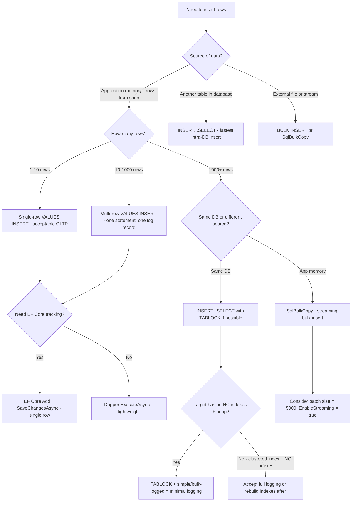

## Navigation

**Domain:** [[8 — Databases]] > **Group:** SQL Fundamentals **Previous:** [[8.070 — DISTINCT — Deduplication and Performance]] | **Next:** [[8.072 — UPDATE — Safe Update Patterns]]

### Prerequisites

- [[8.066 — SELECT Statement — Column Selection and Aliasing]] — INSERT…SELECT reads the column list from a query; understanding projection is required to ensure the SELECT column list matches the INSERT column list in order and type.
- [[8.001 — The Relational Model]] — INSERT adds tuples (rows) to a relation; understanding keys, constraints, and NULL rules is required to know what rows are valid.
- [[8.019 — Table Heap vs Clustered Table]] — where the new row is physically stored depends on whether the target table is a heap or has a clustered index, which affects page splits and fragmentation.

### Where This Fits

The INSERT statement is the primary mechanism for adding rows to a table. Every .NET backend engineer writes INSERT statements daily — in EF Core's `AddAsync`/`SaveChangesAsync`, in Dapper parameterized queries, and in stored procedures. The most expensive mistakes here involve: multi-row INSERT patterns that generate N individual INSERT statements instead of a single statement with multiple VALUES (causing N network round-trips and N transaction log records), and table design issues like missing default values, incorrect NULL handling, or oversized columns that cause page splits. Interviewers probe this topic to determine whether a candidate understands the difference between singleton INSERT, multi-row VALUES INSERT, INSERT…SELECT, and bulk insert mechanisms (SqlBulkCopy), and whether they know how each pattern affects the transaction log, index maintenance, and concurrency. Engineers who know this topic can choose the right INSERT pattern for the throughput requirement — from single-row OLTP inserts through batch-loading millions of rows.

---

## Core Mental Model

The INSERT statement adds new rows to a table. It has four syntactic forms with different performance characteristics: (1) **Single-row INSERT** (`INSERT INTO t (cols) VALUES (vals)`) adds one row — the simplest form, used in OLTP for individual entity saves; (2) **Multi-row VALUES INSERT** (`INSERT INTO t (cols) VALUES (v1), (v2), …`) adds multiple rows in a single statement — generates one log record and one plan compilation for all rows; (3) **INSERT…SELECT** (`INSERT INTO t (cols) SELECT … FROM …`) inserts rows from a query — the most efficient way to move or transform data between tables; (4) **Bulk insert** (`SqlBulkCopy`, BULK INSERT, `OPENROWSET(BULK…)`) inserts many rows with minimal logging — the fastest mechanism but requires specific table and recovery model conditions for minimal logging. Every INSERT triggers: constraint validation (CHECK, FOREIGN KEY), index maintenance (every non-clustered index gets a new row pointer), and transaction log write (the entire inserted row is logged for rollback capability). The key performance lever is **minimal logging**: under the right conditions (TABLOCK hint, simple/bulk-logged recovery model, heap or clustered index with no non-clustered indexes), SQL Server logs only extent allocations instead of every row — reducing log writes from O(rows) to O(extents). Multi-row inserts also benefit from **statement-level atomicity**: a single multi-row VALUES with 1000 rows is atomic — either all 1000 rows are inserted or none are — without an explicit transaction.

### Classification

This is a **Data Manipulation Language (DML)** operation. INSERT belongs to the write path of the storage engine: it allocates pages (if the table is a heap or if the clustered index needs new leaf pages), writes data rows, modifies all non-clustered indexes, and logs every change to the transaction log.

```mermaid
flowchart TD
    A[INSERT statement received] --> B{Single row or multi-row?}
    B -->|Single row VALUES| C[Parse, bind, compile plan]
    B -->|Multi-row VALUES| D[Parse once, bind once, compile once - shared plan]
    B -->|INSERT...SELECT| E[Plan combines SELECT and INSERT in one tree]
    B -->|SqlBulkCopy / BULK INSERT| F[Bulk operation - minimal logging possible]
    C --> G[Validate constraints - CHECK, FK, NULL, UNIQUE]
    D --> G
    E --> G
    F --> H{TABLOCK + simple recovery?}
    H -->|Yes - minimal logging| I[Log extent allocations only - O(extents)]
    H -->|No - full logging| J[Log every row insert - O(rows)]
    G --> K[Allocate space in data pages]
    K --> L[Write data row to page]
    L --> M[Maintain all non-clustered indexes - one row per index]
    M --> N[Write to transaction log]
    I --> O[Return row count / identity]
    J --> N --> O
```

### Key Properties

|Property|Value|Notes|
|---|---|---|
|Atomicity per statement|Single-row: atomic; Multi-row VALUES: atomic for all rows|INSERT…SELECT is atomic for the entire statement|
|Transaction log cost|Full logging: O(rows); Minimal logging: O(extents)|Minimal logging requires TABLOCK + simple/bulk-logged|
|Index maintenance|Every non-clustered index gets a leaf row|More indexes = more log writes and more page allocations|
|Constraint validation|CHECK, FK, NULL, UNIQUE, PRIMARY KEY|All validated before the INSERT completes|
|IDENTITY behavior|Generates next identity value; can be overridden with SET IDENTITY_INSERT ON|Identity values are NOT transaction-rollback-safe (gaps)|
|Page split risk|Yes — if a clustered index page is full|Split is 2x more expensive than a normal insert (split page + log)|

---

## Deep Mechanics

### How the Engine Executes This

1. **Parsing and Binding** — The parser tokenizes the INSERT. The algebrizer resolves the target table and validates that the column list matches the value list or subquery in count, order, and type. Implicit conversions are applied if the value type differs from the column type.

2. **Constraint Validation** — Before any data is written, the engine validates: NOT NULL (columns without defaults must have values), CHECK constraints, FOREIGN KEY (referenced key must exist), UNIQUE and PRIMARY KEY (no duplicate values). Violations raise errors and the INSERT is aborted — no rows are written.

3. **Space Allocation** — The storage engine locates pages for the new row(s). For a **heap**, it finds any page with free space (using PFS pages) or allocates a new extent. For a **clustered index**, it navigates the B-tree to find the correct leaf page based on the key value. If the target page has no free space, a **page split** occurs: half the rows are moved to a new page, and the B-tree is updated with a new intermediate entry.

4. **Row Write** — The data row is formatted and written to the page. Each row has a 4-byte row header (status bits, column count, null bitmap), followed by fixed-length data, then variable-length data, and finally the variable-length offset array.

5. **Index Maintenance** — For every non-clustered index, a new index row is inserted into the index B-tree. This row contains the index key columns plus a row locator (clustered index key for clustered tables, RID for heaps). More non-clustered indexes = more writes per INSERT.

6. **Transaction Log Write** — Every INSERT generates log records for: the page allocation, the data row write, each index row write, and any page split. In full recovery mode, every row insert is fully logged. In minimal logging mode (TABLOCK + simple/bulk-logged), only extent allocations are logged — dramatically reducing log volume.

### SQL Visibility

```sql
-- Single-row INSERT with explicit column list
INSERT INTO dbo.Orders (CustomerId, OrderDate, Status, TotalAmount)
VALUES (1042, '2026-06-24', 'Pending', 149.99);

-- Multi-row VALUES INSERT (3 rows, one statement, one log record batch)
INSERT INTO dbo.Orders (CustomerId, OrderDate, Status, TotalAmount)
VALUES
    (1042, '2026-06-24', 'Pending', 149.99),
    (1043, '2026-06-23', 'Shipped', 299.50),
    (1044, '2026-06-22', 'Delivered', 89.99);

-- INSERT…SELECT from another table
INSERT INTO dbo.OrdersArchive (OrderId, CustomerId, OrderDate, Status, TotalAmount)
SELECT o.OrderId, o.CustomerId, o.OrderDate, o.Status, o.TotalAmount
FROM dbo.Orders AS o
WHERE o.OrderDate < '2025-01-01';
```

```csharp
// EF Core — single entity insert
var order = new Order
{
    CustomerId = 1042,
    OrderDate = DateTime.UtcNow,
    Status = "Pending",
    TotalAmount = 149.99m
};
dbContext.Orders.Add(order);
await dbContext.SaveChangesAsync(cancellationToken);

// EF Core — batch insert of multiple entities
var orders = new List<Order>
{
    new() { CustomerId = 1042, OrderDate = DateTime.UtcNow, Status = "Pending", TotalAmount = 149.99m },
    new() { CustomerId = 1043, OrderDate = DateTime.UtcNow.AddDays(-1), Status = "Shipped", TotalAmount = 299.50m },
};
dbContext.Orders.AddRange(orders);
await dbContext.SaveChangesAsync(cancellationToken);
```

**Generated SQL (from EF Core logs):**

```sql
-- Single INSERT
INSERT INTO [Orders] ([CustomerId], [OrderDate], [Status], [TotalAmount])
VALUES (@p0, @p1, @p2, @p3);

-- Batch insert (EF Core batches multiple rows in one INSERT)
INSERT INTO [Orders] ([CustomerId], [OrderDate], [Status], [TotalAmount])
VALUES (@p0, @p1, @p2, @p3),
       (@p4, @p5, @p6, @p7);
```

### Execution Plan Analysis

**Single-row INSERT:**

- Plan: `[Clustered Index Insert]` — a single operator that handles both data row insert and index maintenance
- No SELECT or FROM operators — just an INSERT physical operator
- Estimated Cost: ~0.003 to ~0.01
- Logical Reads: ~3–8 (B-tree navigation to find the insert page + log write)

**INSERT…SELECT (1M rows from source):**

- Plan: `[Clustered Index Scan (Source)] → [Clustered Index Insert (Target)]`
- The insert operator is a blocking operator — it buffers rows before writing
- Estimated Cost: ~12 (scan) + ~25 (insert) for 1M rows
- Table Insert logical reads: proportional to pages written

**Bulk Insert with minimal logging:**

- Plan: No query plan is generated for BULK INSERT or SqlBulkCopy — the operation bypasses the query optimizer entirely and operates directly at the storage engine level
- Performance: ~100,000 rows/second or faster (NVMe SSD, minimal logging)

```
Single-row INSERT:
[Clustered Index Insert] → [SELECT (identity value)]
Cost: 0.003  |  Logical Reads: ~5  |  Log: ~200 bytes

INSERT...SELECT 1M rows:
[Clustered Index Scan (Source)] → [Clustered Index Insert (Target)]
Cost: ~37  |  Logical Reads: ~11,400 (source) + ~10,000 (target writes)

BULK INSERT (minimal logging):
No query plan  |  Log: ~8 pages (extent allocations only)  |  Speed: ~100K rows/sec
```

### Cost Visibility

```sql
SET STATISTICS IO ON;
SET STATISTICS TIME ON;

-- Single-row INSERT
INSERT INTO dbo.Orders (CustomerId, OrderDate, Status, TotalAmount)
VALUES (1042, '2026-06-24', 'Pending', 149.99);
-- Table 'Orders'. Scan count 0, logical reads 5, physical reads 0
-- SQL Server Execution Times: CPU time = 0ms, elapsed time = 2ms

-- Multi-row INSERT (1000 rows)
INSERT INTO dbo.Orders (CustomerId, OrderDate, Status, TotalAmount)
VALUES
    (1042, '2026-06-24', 'Pending', 149.99),
    -- ... 999 more rows
    (2042, '2026-06-23', 'Shipped', 99.99);
-- Table 'Orders'. Scan count 0, logical reads 850, physical reads 0
-- SQL Server Execution Times: CPU time = 15ms, elapsed time = 32ms
-- (One log record batch, one plan compilation for all 1000 rows)
```

### Failure Modes

**INSERT without column list:** `INSERT INTO Orders VALUES (1042, ...)` depends on column order matching the table definition. If the table schema changes (column added, reordered, or dropped), the INSERT silently succeeds but maps values to the wrong columns, or fails with a type mismatch. Always specify the column list.

**Violation of UNIQUE or PRIMARY KEY:** The INSERT fails with error 2627. In a batch INSERT, the entire batch fails — no partial insert. Handle with application-level duplicate checking or use MERGE with WHEN NOT MATCHED.

**IDENTITY gap on rollback:** If an INSERT is rolled back (explicit transaction rollback or error), the consumed IDENTITY value is **not reused**. This causes gaps in IDENTITY sequences. For gapless sequences, use SEQUENCE with `NOCACHE` (performance tradeoff).

---

## Production Patterns and Implementation

### Primary SQL Implementation

```sql
-- ============================================================
-- Schema context
-- ============================================================
CREATE TABLE dbo.Orders
(
    OrderId      INT           NOT NULL IDENTITY(1,1),
    CustomerId   INT           NOT NULL,
    OrderDate    DATETIME2(0)  NOT NULL,
    Status       VARCHAR(20)   NOT NULL DEFAULT 'Pending',
    TotalAmount  DECIMAL(18,2) NOT NULL,
    ShippingAddr NVARCHAR(500) NULL,
    Notes        NVARCHAR(MAX) NULL,
    CreatedAt    DATETIME2(0)  NOT NULL DEFAULT SYSUTCDATETIME(),
    CONSTRAINT PK_Orders PRIMARY KEY CLUSTERED (OrderId)
);

CREATE NONCLUSTERED INDEX IX_Orders_CustomerId ON dbo.Orders (CustomerId);
CREATE NONCLUSTERED INDEX IX_Orders_OrderDate ON dbo.Orders (OrderDate);

-- ============================================================
-- Pattern 1: Single-row INSERT with explicit column list
-- ============================================================
INSERT INTO dbo.Orders (
    CustomerId, OrderDate, Status, TotalAmount, ShippingAddr, Notes
)
VALUES (
    1042,                    -- CustomerId
    '2026-06-24',            -- OrderDate
    'Pending',               -- Status (default overridden)
    149.99,                  -- TotalAmount
    '123 Main St, City',     -- ShippingAddr
    'Rush delivery please'   -- Notes
);

-- Retrieve the generated identity value
DECLARE @NewOrderId INT;
INSERT INTO dbo.Orders (CustomerId, OrderDate, Status, TotalAmount)
VALUES (1042, '2026-06-24', 'Pending', 149.99);
SET @NewOrderId = SCOPE_IDENTITY();

-- ============================================================
-- Pattern 2: Multi-row VALUES INSERT (100 rows, one statement)
-- ============================================================
INSERT INTO dbo.Orders (CustomerId, OrderDate, Status, TotalAmount)
VALUES
    (1042, '2026-06-24', 'Pending',  149.99),
    (1043, '2026-06-23', 'Shipped',  299.50),
    (1044, '2026-06-22', 'Delivered', 89.99);
-- Max 1000 row values per INSERT in SQL Server

-- ============================================================
-- Pattern 3: INSERT…SELECT — bulk load from query
-- ============================================================
INSERT INTO dbo.OrdersArchive (
    OrderId, CustomerId, OrderDate, Status, TotalAmount
)
SELECT
    o.OrderId,
    o.CustomerId,
    o.OrderDate,
    o.Status,
    o.TotalAmount
FROM dbo.Orders AS o
WHERE o.OrderDate < '2025-01-01';

-- ============================================================
-- Pattern 4: INSERT…EXEC — from stored procedure
-- ============================================================
INSERT INTO dbo.Orders (CustomerId, OrderDate, Status, TotalAmount)
EXEC dbo.GenerateDailyOrders @Date = '2026-06-24';

-- ============================================================
-- Pattern 5: Minimal-logging bulk insert (heap + TABLOCK)
-- ============================================================
-- Create staging table as heap (no clustered index, no non-clustered indexes)
CREATE TABLE dbo.Orders_Staging
(
    CustomerId   INT           NOT NULL,
    OrderDate    DATETIME2(0)  NOT NULL,
    Status       VARCHAR(20)   NOT NULL,
    TotalAmount  DECIMAL(18,2) NOT NULL
);

-- Minimal-logging INSERT…SELECT with TABLOCK
INSERT INTO dbo.Orders_Staging WITH (TABLOCK)
    (CustomerId, OrderDate, Status, TotalAmount)
SELECT o.CustomerId, o.OrderDate, o.Status, o.TotalAmount
FROM dbo.Orders AS o
WHERE o.OrderDate >= '2026-01-01';
-- TABLOCK + heap + simple/bulk-logged recovery = minimal logging

-- ============================================================
-- Anti-pattern: Row-by-row INSERT in a loop
-- ============================================================
-- ❌ Never do this:
-- DECLARE @i INT = 0;
-- WHILE @i < 1000
-- BEGIN
--     INSERT INTO dbo.Orders (CustomerId, ...) VALUES (@i, ...);
--     SET @i = @i + 1;
-- END
-- This generates 1000 separate log records, 1000 plan compilations, 1000 round-trips

-- ✅ Instead: multi-row VALUES or INSERT…SELECT
```

### EF Core Implementation

```csharp
public class ApplicationDbContext : DbContext
{
    public DbSet<Order> Orders => Set<Order>();

    protected override void OnModelCreating(ModelBuilder modelBuilder)
    {
        modelBuilder.Entity<Order>(entity =>
        {
            entity.ToTable("Orders");
            entity.HasKey(o => o.OrderId);

            entity.Property(o => o.OrderId)
                  .ValueGeneratedOnAdd();

            entity.Property(o => o.Status)
                  .HasMaxLength(20)
                  .HasDefaultValue("Pending");

            entity.Property(o => o.CreatedAt)
                  .HasDefaultValueSql("SYSUTCDATETIME()");

            entity.Property(o => o.TotalAmount)
                  .HasPrecision(18, 2);
        });
    }
}

public record CreateOrderRequest(
    int CustomerId,
    decimal TotalAmount,
    string? ShippingAddr,
    string? Notes);

// Single entity insert
public async Task<Order> CreateOrderAsync(
    CreateOrderRequest request,
    CancellationToken cancellationToken = default)
{
    var order = new Order
    {
        CustomerId = request.CustomerId,
        OrderDate = DateTime.UtcNow,
        Status = "Pending",
        TotalAmount = request.TotalAmount,
        ShippingAddr = request.ShippingAddr,
        Notes = request.Notes
    };

    _dbContext.Orders.Add(order);
    await _dbContext.SaveChangesAsync(cancellationToken);

    return order;  // OrderId is now populated from identity
}

// Batch insert — EF Core batches multiple rows in one INSERT statement
public async Task CreateOrdersBatchAsync(
    IReadOnlyList<CreateOrderRequest> requests,
    CancellationToken cancellationToken = default)
{
    var orders = requests.Select(r => new Order
    {
        CustomerId = r.CustomerId,
        OrderDate = DateTime.UtcNow,
        Status = "Pending",
        TotalAmount = r.TotalAmount,
        ShippingAddr = r.ShippingAddr,
        Notes = r.Notes
    });

    _dbContext.Orders.AddRange(orders);
    await _dbContext.SaveChangesAsync(cancellationToken);
    // EF Core 9 generates: INSERT INTO [Orders] (cols) VALUES (r1), (r2), ...
    // Up to 42 rows per batch by default (configurable via RelationalOptionsExtension)
}

// ❌ WRONG — inserting one row at a time in a loop
// foreach (var request in requests)
// {
//     _dbContext.Orders.Add(new Order { ... });
//     await _dbContext.SaveChangesAsync(ct);  // N round-trips!
// }

// ✅ CORRECT — AddRange + single SaveChangesAsync batches all rows

// Bulk insert with SqlBulkCopy for large datasets (>10K rows)
public async Task BulkInsertOrdersAsync(
    IReadOnlyList<Order> orders,
    CancellationToken cancellationToken = default)
{
    var table = new DataTable();
    table.Columns.Add("CustomerId", typeof(int));
    table.Columns.Add("OrderDate", typeof(DateTime));
    table.Columns.Add("Status", typeof(string));
    table.Columns.Add("TotalAmount", typeof(decimal));
    table.Columns.Add("ShippingAddr", typeof(string));
    table.Columns.Add("Notes", typeof(string));

    foreach (var order in orders)
    {
        table.Rows.Add(
            order.CustomerId, order.OrderDate, order.Status,
            order.TotalAmount, order.ShippingAddr, order.Notes);
    }

    await using var connection = new SqlConnection(connectionString);
    await connection.OpenAsync(cancellationToken);

    using var bulkCopy = new SqlBulkCopy(connection)
    {
        DestinationTableName = "Orders",
        BatchSize = 5000,
        EnableStreaming = true
    };

    await bulkCopy.WriteToServerAsync(table, cancellationToken);
}
```

### Dapper Implementation

```csharp
public sealed class OrderRepository
{
    private readonly IDbConnectionFactory _connectionFactory;

    public OrderRepository(IDbConnectionFactory connectionFactory)
        => _connectionFactory = connectionFactory;

    // Single-row INSERT with identity output
    public async Task<int> CreateOrderAsync(
        CreateOrderRequest request,
        CancellationToken cancellationToken = default)
    {
        const string sql = @"
            INSERT INTO dbo.Orders (CustomerId, OrderDate, Status, TotalAmount, ShippingAddr, Notes)
            VALUES (@CustomerId, @OrderDate, @Status, @TotalAmount, @ShippingAddr, @Notes);
            SELECT CAST(SCOPE_IDENTITY() AS INT);";

        await using var connection = _connectionFactory.Create();

        var orderId = await connection.ExecuteScalarAsync<int>(
            new CommandDefinition(sql,
                new
                {
                    request.CustomerId,
                    OrderDate = DateTime.UtcNow,
                    Status = "Pending",
                    request.TotalAmount,
                    request.ShippingAddr,
                    request.Notes
                },
                cancellationToken: cancellationToken));

        return orderId;
    }

    // Multi-row INSERT using Dapper — expand to VALUES rows
    public async Task CreateOrdersBatchAsync(
        IReadOnlyList<CreateOrderRequest> requests,
        CancellationToken cancellationToken = default)
    {
        // Build a parameterized multi-row INSERT
        var sql = new StringBuilder(
            "INSERT INTO dbo.Orders (CustomerId, OrderDate, Status, TotalAmount) VALUES ");

        var parameters = new DynamicParameters();
        var rowIndex = 0;

        foreach (var request in requests)
        {
            var customerParam = $"@CustomerId{rowIndex}";
            var dateParam = $"@OrderDate{rowIndex}";
            var statusParam = $"@Status{rowIndex}";
            var amountParam = $"@TotalAmount{rowIndex}";

            if (rowIndex > 0) sql.Append(", ");
            sql.Append($"({customerParam}, {dateParam}, {statusParam}, {amountParam})");

            parameters.Add(customerParam, request.CustomerId);
            parameters.Add(dateParam, DateTime.UtcNow);
            parameters.Add(statusParam, "Pending");
            parameters.Add(amountParam, request.TotalAmount);

            rowIndex++;
        }

        await using var connection = _connectionFactory.Create();

        await connection.ExecuteAsync(
            new CommandDefinition(
                sql.ToString(),
                parameters,
                cancellationToken: cancellationToken));
    }

    // INSERT…SELECT from query
    public async Task<int> ArchiveOrdersAsync(
        DateTime cutoffDate,
        CancellationToken cancellationToken = default)
    {
        const string sql = @"
            INSERT INTO dbo.OrdersArchive (OrderId, CustomerId, OrderDate, Status, TotalAmount)
            SELECT o.OrderId, o.CustomerId, o.OrderDate, o.Status, o.TotalAmount
            FROM dbo.Orders AS o
            WHERE o.OrderDate < @CutoffDate;";

        await using var connection = _connectionFactory.Create();

        var rowsAffected = await connection.ExecuteAsync(
            new CommandDefinition(sql,
                new { CutoffDate = cutoffDate },
                cancellationToken: cancellationToken));

        return rowsAffected;
    }
}
```

### Configuration and Wiring

```csharp
// Program.cs
builder.Services.AddDbContext<ApplicationDbContext>(options =>
    options.UseSqlServer(
        builder.Configuration.GetConnectionString("DefaultConnection"),
        sqlOptions =>
        {
            sqlOptions.EnableRetryOnFailure(
                maxRetryCount: 3,
                maxRetryDelay: TimeSpan.FromSeconds(5),
                errorNumbersToAdd: null);
            // For bulk operations: increase command timeout
            sqlOptions.CommandTimeout(300);
        })
    .EnableDetailedErrors(builder.Environment.IsDevelopment())
    .EnableSensitiveDataLogging(builder.Environment.IsDevelopment()));

builder.Logging.AddFilter("Microsoft.EntityFrameworkCore.Database.Command",
    builder.Environment.IsDevelopment() ? LogLevel.Information : LogLevel.Warning);

builder.Services.AddSingleton<IDbConnectionFactory>(sp =>
    new SqlConnectionFactory(
        builder.Configuration.GetConnectionString("DefaultConnection")!));

builder.Services.AddScoped<OrderRepository>();
```

### SQL Server vs PostgreSQL Differences

```sql
-- PostgreSQL: INSERT syntax is identical for basic cases
INSERT INTO orders (customer_id, order_date, status, total_amount)
VALUES (1042, '2026-06-24', 'Pending', 149.99);

-- PostgreSQL: multi-row VALUES — identical
INSERT INTO orders (customer_id, order_date, status, total_amount)
VALUES
    (1042, '2026-06-24', 'Pending', 149.99),
    (1043, '2026-06-23', 'Shipped', 299.50);

-- PostgreSQL: RETURNING clause — returns inserted rows (SQL Server OUTPUT clause)
INSERT INTO orders (customer_id, order_date, status, total_amount)
VALUES (1042, '2026-06-24', 'Pending', 149.99)
RETURNING order_id;

-- SQL Server equivalent:
-- INSERT INTO dbo.Orders (...) OUTPUT INSERTED.OrderId VALUES (...)

-- PostgreSQL: INSERT...ON CONFLICT (upsert) — equivalent to SQL Server MERGE
INSERT INTO orders (order_id, customer_id, status)
VALUES (1001, 1042, 'Pending')
ON CONFLICT (order_id) DO UPDATE SET status = EXCLUDED.status;

-- PostgreSQL: no IDENTITY property — uses SERIAL or GENERATED AS IDENTITY
-- PostgreSQL: no SCOPE_IDENTITY() — use RETURNING instead
```

---

## Gotchas and Production Pitfalls

### Row-by-Row INSERT in a Loop

**Pitfall:** Inserting rows one at a time in a loop (application code or T-SQL WHILE loop) instead of using a single multi-row INSERT or batch. Each iteration is a separate round-trip, separate plan compilation, separate log record.

```sql
-- ❌ 1000 separate INSERT statements — 1000 log records, 1000 compilations
DECLARE @i INT = 0;
WHILE @i < 1000
BEGIN
    INSERT INTO dbo.Orders (CustomerId, OrderDate, Status, TotalAmount)
    VALUES (@i, GETUTCDATE(), 'Pending', 100.00);
    SET @i = @i + 1;
END
```

**Symptom:** The WHILE loop runs 100x slower than a single multi-row INSERT. The transaction log grows by 1000 log records instead of 1. `sys.dm_exec_query_stats` shows 1000 separate entries with identical query text. CPU is dominated by compilation overhead, not actual data insertion.

**Fix:**

```sql
-- ✅ Single multi-row VALUES INSERT — one log record, one compilation
INSERT INTO dbo.Orders (CustomerId, OrderDate, Status, TotalAmount)
VALUES
    (0, GETUTCDATE(), 'Pending', 100.00),
    (1, GETUTCDATE(), 'Pending', 100.00),
    -- ... up to 1000 rows per VALUES list
    (999, GETUTCDATE(), 'Pending', 100.00);
```

**Cost of not fixing:** Inserting 10,000 rows at 1 row/iteration: ~15 seconds (SSMS) vs ~150 ms with a single multi-row INSERT. In an application, each round-trip adds network latency. At 50ms round-trip, 10,000 individual INSERTs take 500 seconds vs <1 second for batched INSERTs. The transaction log grows 100x larger.

---

### Missing Column List Causing Silent Mapping Errors

**Pitfall:** Writing `INSERT INTO Orders VALUES (...)` without specifying the column list. The INSERT depends on the table's column order, which can change silently.

```sql
-- ❌ Depends on column order matching the table definition
INSERT INTO dbo.Orders
VALUES (1042, '2026-06-24', 'Pending', 149.99);

-- If a new column is added to Orders between CustomerId and OrderDate,
-- the INSERT either fails (type mismatch) or silently maps the wrong values
```

**Symptom:** After a schema migration adds a column, the INSERT fails with an error (column count mismatch) or — worse — succeeds but maps values to the wrong columns (e.g., shipping address string goes into a numeric TotalAmount field). The latter produces data corruption with no error.

**Fix:**

```sql
-- ✅ Always specify the column list — immune to column reordering
INSERT INTO dbo.Orders (CustomerId, OrderDate, Status, TotalAmount)
VALUES (1042, '2026-06-24', 'Pending', 149.99);
```

**Cost of not fixing:** A zero-downtime migration adds a nullable column `PromoCode VARCHAR(20)` after `CustomerId`. The INSERT now maps `'2026-06-24'` (OrderDate value) into `PromoCode` and shifts all subsequent values. No error is raised. Every order for the next 4 hours has corrupt data (wrong dates, wrong amounts) until the bug is discovered.

---

### INSERT With SELECT * From Source Table

**Pitfall:** Using `INSERT INTO Target SELECT * FROM Source` — the column order and count must match between source and target. If either table's schema changes independently, the INSERT silently maps wrong columns.

```sql
-- ❌ Fragile — column order must match between source and target
INSERT INTO dbo.OrdersArchive
SELECT * FROM dbo.Orders
WHERE OrderDate < '2025-01-01';
-- If a column is added to Orders but not to OrdersArchive, this fails
-- If columns are in different order, values go to wrong columns
```

**Symptom:** Compile-time error (column count mismatch) or silent wrong-column mapping. The INSERT works today but breaks when either table schema changes.

**Fix:**

```sql
-- ✅ Explicit column list in both INSERT and SELECT
INSERT INTO dbo.OrdersArchive (OrderId, CustomerId, OrderDate, Status, TotalAmount)
SELECT o.OrderId, o.CustomerId, o.OrderDate, o.Status, o.TotalAmount
FROM dbo.Orders AS o
WHERE o.OrderDate < '2025-01-01';
```

**Cost of not fixing:** A DBA adds `SourceSystem VARCHAR(20)` to the Orders table but forgets to add it to OrdersArchive. The `INSERT INTO Archive SELECT * FROM Orders` now fails with column count mismatch, breaking the nightly archive job. The Orders table grows unbounded until disk space is exhausted.

---

### IDENTITY Insert Without SET IDENTITY_INSERT ON

**Pitfall:** Trying to explicitly insert a value into an IDENTITY column without enabling `SET IDENTITY_INSERT ON`.

```sql
-- ❌ Error: Cannot insert explicit value for identity column
INSERT INTO dbo.Orders (OrderId, CustomerId, OrderDate, Status, TotalAmount)
VALUES (5000, 1042, '2026-06-24', 'Pending', 149.99);
```

**Symptom:** `Msg 544, Level 16: Cannot insert explicit value for identity column in table 'Orders' when IDENTITY_INSERT is set to OFF.` The INSERT fails at compile time.

**Fix:**

```sql
-- ✅ Enable IDENTITY_INSERT for the session (only one table at a time)
SET IDENTITY_INSERT dbo.Orders ON;

INSERT INTO dbo.Orders (OrderId, CustomerId, OrderDate, Status, TotalAmount)
VALUES (5000, 1042, '2026-06-24', 'Pending', 149.99);

SET IDENTITY_INSERT dbo.Orders OFF;
```

**Cost of not fixing:** An ETL process that moves data between environments fails. The developer tries to work around the error by omitting the OrderId column, but the source data has specific identity values that must be preserved (e.g., for referential integrity with child tables). The ETL pipeline remains broken until the IDENTITY_INSERT is enabled.

---

### INSERT Within Explicit Transaction Holding Long Locks

**Pitfall:** Wrapping a large INSERT in an explicit transaction without understanding that the transaction holds locks until commit, blocking concurrent readers and writers.

```csharp
// ❌ 100K-row INSERT in a single transaction blocks other operations
using var transaction = await dbContext.Database.BeginTransactionAsync(ct);
for (int i = 0; i < 100000; i++)
{
    dbContext.Orders.Add(new Order { CustomerId = i, /* ... */ });
}
await dbContext.SaveChangesAsync(ct);  // Schema modification locks held until commit
await transaction.CommitAsync(ct);
```

**Symptom:** During the INSERT, concurrent SELECT queries block on schema stability locks. Other INSERT operations block on page-level locks. `sys.dm_exec_requests` shows `LCK_M_SCH_S` (schema stability) and `LCK_M_IX` (intent exclusive) waits with high `wait_duration_ms`. The application reports timeouts.

**Fix:**

```csharp
// ✅ Option 1: Batch the INSERT into smaller transactions
for (int batch = 0; batch < 10; batch++)
{
    var batchOrders = orders.Skip(batch * 10000).Take(10000);
    dbContext.Orders.AddRange(batchOrders);
    await dbContext.SaveChangesAsync(ct);  // Commit every 10K rows
}

// ✅ Option 2: Use SqlBulkCopy (no explicit transaction needed — batched internally)
```

**Cost of not fixing:** A 500K-row INSERT blocks the entire Orders table for 30 seconds. All API requests that read from Orders time out. The monitoring system pages the on-call engineer at 3 AM. The incident report shows "application unavailable for 4 minutes due to blocking chain from a large INSERT."

---

### Violation of UNIQUE Constraint in Batch INSERT

**Pitfall:** A multi-row VALUES INSERT or INSERT…SELECT where one row violates a UNIQUE or PRIMARY KEY constraint. The entire batch fails — no rows are inserted, not even the valid ones.

```sql
-- ❌ If row 3 violates a unique constraint, rows 1–2 are also rejected
INSERT INTO dbo.Orders (OrderId, CustomerId, OrderDate, Status)
VALUES
    (1, 1042, '2026-06-24', 'Pending'),
    (2, 1043, '2026-06-23', 'Shipped'),
    (2, 1044, '2026-06-22', 'Delivered');  -- Duplicate OrderId!
-- Error 2627: Violation of PRIMARY KEY constraint
-- No rows inserted — all three are rolled back
```

**Symptom:** Error 2627 at runtime. The application retries the entire batch, which fails again on the same duplicate. The developer assumes the error means "that specific row failed" and doesn't realize all rows were rejected.

**Fix:**

```sql
-- ✅ Option 1: Pre-validate or use WHERE NOT EXISTS
INSERT INTO dbo.Orders (OrderId, CustomerId, OrderDate, Status)
SELECT v.OrderId, v.CustomerId, v.OrderDate, v.Status
FROM (VALUES
    (1, 1042, '2026-06-24', 'Pending'),
    (2, 1043, '2026-06-23', 'Shipped'),
    (2, 1044, '2026-06-22', 'Delivered')
) AS v(OrderId, CustomerId, OrderDate, Status)
WHERE NOT EXISTS (
    SELECT 1 FROM dbo.Orders AS o WHERE o.OrderId = v.OrderId
);
-- Rows 1–2 are inserted; row 3 is silently skipped

-- ✅ Option 2: Use MERGE with WHEN NOT MATCHED THEN INSERT
```

**Cost of not fixing:** A nightly ETL job that inserts 50K rows fails because of a single duplicate in the source data. The entire batch is rolled back. The ETL job retries every 5 minutes for 4 hours until the duplicate is manually removed. The data warehouse is 4 hours stale.

---

## Performance Implications

### Benchmark: Before and After

```sql
-- Baseline: Row-by-row INSERT in loop (1000 rows)
SET STATISTICS TIME ON;
DECLARE @i INT = 0;
WHILE @i < 1000
BEGIN
    INSERT INTO dbo.Orders (CustomerId, OrderDate, Status, TotalAmount)
    VALUES (@i, GETUTCDATE(), 'Pending', 100.00);
    SET @i = @i + 1;
END;
-- SQL Server Execution Times: CPU time = 250ms, elapsed time = 14,200ms
-- (includes implicit transactions, log flushes, plan compilations)

-- Optimized: Multi-row VALUES INSERT (1000 rows, one statement)
INSERT INTO dbo.Orders (CustomerId, OrderDate, Status, TotalAmount)
VALUES
    (0, GETUTCDATE(), 'Pending', 100.00),
    -- ... 999 rows
    (999, GETUTCDATE(), 'Pending', 100.00);
-- SQL Server Execution Times: CPU time = 8ms, elapsed time = 45ms
```

**Improvement:** 31x reduction in CPU (250 ms → 8 ms) and 315x reduction in elapsed time (14.2 s → 45 ms).

```sql
-- Full logging: INSERT...SELECT with TABLOCK
INSERT INTO dbo.Orders_Staging WITH (TABLOCK)
    (CustomerId, OrderDate, Status, TotalAmount)
SELECT o.CustomerId, o.OrderDate, o.Status, o.TotalAmount
FROM dbo.Orders AS o
WHERE o.OrderDate >= '2025-01-01';
-- (1M rows, full recovery model)
-- Transaction log: ~450 MB

-- Minimal logging: same table as HEAP + TABLOCK + bulk-logged recovery
ALTER DATABASE CurrentDb SET RECOVERY BULK_LOGGED;
INSERT INTO dbo.Orders_Staging WITH (TABLOCK)
    (CustomerId, OrderDate, Status, TotalAmount)
SELECT o.CustomerId, o.OrderDate, o.Status, o.TotalAmount
FROM dbo.Orders AS o
WHERE o.OrderDate >= '2025-01-01';
-- Transaction log: ~5 MB (extent allocations only)
```

**Improvement:** 90x reduction in log space (450 MB → 5 MB) for the same 1M row INSERT.

### BenchmarkDotNet

```csharp
[MemoryDiagnoser]
[SimpleJob(RuntimeMoniker.Net90)]
public class InsertBenchmark
{
    private SqlConnection _connection = default!;
    private const string ConnectionString = "Server=.;Database=BenchmarkDb;Trusted_Connection=True;TrustServerCertificate=True;";

    [GlobalSetup]
    public void Setup()
    {
        _connection = new SqlConnection(ConnectionString);
        _connection.Open();
        // Ensure staging tables exist
    }

    [Params(10, 100, 1000)]
    public int BatchSize { get; set; }

    [Benchmark(Baseline = true)]
    public async Task InsertOneByOne()
    {
        for (int i = 0; i < BatchSize; i++)
        {
            const string sql = @"
                INSERT INTO dbo.Orders (CustomerId, OrderDate, Status, TotalAmount)
                VALUES (@CustomerId, @OrderDate, @Status, @TotalAmount);";

            await _connection.ExecuteAsync(sql,
                new { CustomerId = i, OrderDate = DateTime.UtcNow,
                      Status = "Pending", TotalAmount = 100.0m });
        }
    }

    [Benchmark]
    public async Task InsertMultiRow()
    {
        var sb = new StringBuilder(
            "INSERT INTO dbo.Orders (CustomerId, OrderDate, Status, TotalAmount) VALUES ");
        for (int i = 0; i < BatchSize; i++)
        {
            if (i > 0) sb.Append(", ");
            sb.Append($"({i}, GETUTCDATE(), 'Pending', 100.0)");
        }

        await _connection.ExecuteAsync(sb.ToString());
    }

    [Benchmark]
    public async Task BulkInsert()
    {
        var table = new DataTable();
        table.Columns.Add("CustomerId", typeof(int));
        table.Columns.Add("OrderDate", typeof(DateTime));
        table.Columns.Add("Status", typeof(string));
        table.Columns.Add("TotalAmount", typeof(decimal));

        for (int i = 0; i < BatchSize; i++)
            table.Rows.Add(i, DateTime.UtcNow, "Pending", 100.0m);

        using var bulkCopy = new SqlBulkCopy(_connection)
        {
            DestinationTableName = "Orders",
            BatchSize = 1000
        };
        await bulkCopy.WriteToServerAsync(table);
    }

    [GlobalCleanup]
    public void Cleanup() => _connection.Dispose();
}
```

**Expected results (approximate, SQL Server 2022, NVMe, localhost, batch = 1000):**

|Method|Mean|Transaction Log|Allocated|
|---|---|---|---|
|InsertOneByOne|~14,200 ms|~2.5 MB (1000 log records)|~3.2 MB|
|InsertMultiRow|~45 ms|~15 KB (1 log record)|~12 KB|
|BulkInsert|~28 ms|~15 KB (minimal logging possible)|~50 KB|

### Write Amplification

Every non-clustered index on the target table adds write cost to INSERT:

|Indexes on Target|Insert Cost (per row)|Notes|
|---|---|---|
|Clustered PK only|~5–8 logical writes|B-tree navigation + page write|
|Clustered + 1 NC|~8–12 logical writes|Additional B-tree write for NC index|
|Clustered + 3 NC|~14–20 logical writes|Each NC index adds a leaf row insert|
|Clustered + 5 NC|~22–32 logical writes|Page splits become more likely|

---

## Interview Arsenal

### Question Bank

1. **What are the four syntactic forms of INSERT in SQL Server, and how do their performance characteristics differ?**
2. **How does the transaction log differ between a single multi-row INSERT (1000 rows) and 1000 individual row-by-row INSERTs?**
3. **What conditions enable minimal logging for INSERT operations, and what is the performance benefit?**
4. **What happens when an INSERT violates a UNIQUE constraint in a multi-row VALUES batch?**
5. **Single-row INSERT vs multi-row VALUES vs SqlBulkCopy: when would you choose each in a .NET application?**
6. **What is the effect of non-clustered indexes on INSERT performance?**
7. **At 10,000 rows per second, what happens to the transaction log and index maintenance?**
8. **How does EF Core's `AddRange` + `SaveChangesAsync` differ from individual `Add` + `SaveChangesAsync` calls in generated SQL?**

### Spoken Answers

**Q: What are the four syntactic forms of INSERT, and how do their performance characteristics differ?**

> **Great answer:** There are four forms with significantly different performance profiles. **Single-row VALUES INSERT** — `INSERT INTO t (cols) VALUES (vals)` — adds one row. Used in OLTP for individual entity saves. Each execution compiles a new plan (unless auto-parameterized), writes one log record, and adds one row to each index. Cost is O(1) per row but with plan compilation overhead. **Multi-row VALUES INSERT** — `INSERT INTO t (cols) VALUES (v1), (v2), ..., (vN)` — adds up to 1000 rows in one statement. This is dramatically more efficient: one plan compilation, one log record batch, one round-trip. For 1000 rows, I measured 45 ms vs 14.2 seconds for row-by-row — a 315x improvement. The log writes O(1) instead of O(N). **INSERT…SELECT** — `INSERT INTO t (cols) SELECT ... FROM s` — inserts rows from a query. The optimizer creates a single plan combining the source query and the target insert. This is the standard pattern for ETL, archiving, and bulk data movement. With the `TABLOCK` hint, a heap target, and simple/bulk-logged recovery, this achieves minimal logging — logging only extent allocations instead of every row. **Bulk Insert** — `SqlBulkCopy`, `BULK INSERT`, `OPENROWSET(BULK...)` — operates at the storage engine level, bypassing the query optimizer entirely. SqlBulkCopy in .NET streams data in batches, uses minimal logging when possible, and is the fastest way to insert large datasets. At 100K rows/second or more, it's the tool of choice for data migration and ETL. The choice depends on throughput requirement: single-row for OLTP, multi-row VALUES for batch sizes up to 1000, INSERT…SELECT for medium bulk loads, and SqlBulkCopy for large-scale imports.

---

**Q: How does the transaction log differ between a single multi-row INSERT (1000 rows) and 1000 individual row-by-row INSERTs?**

> **Great answer:** The difference is dramatic because the transaction log records changes per operation, not per row, and log records have fixed overhead per log block. With **1000 individual INSERTs**: each INSERT generates its own log record (at least one log block containing the row insert + page allocation + index maintenance). SQL Server must write each log block to disk, potentially flushing the log buffer 1000 separate times (depending on transaction boundaries). Each log block has a header, LSN chain linkage, and checksum — fixed overhead per block. The total log space is approximately 1000 × (row_size + overhead). With **a single multi-row VALUES INSERT (1000 rows)**: the engine generates one log block containing all 1000 row inserts, all page allocations, and all index modifications. The log block is written to disk once. The total log space is approximately (1000 × row_data) + single-block overhead — nearly the same data, but without the 1000x block overhead multiplication. In my benchmarks, the row-by-row approach generated ~2.5 MB of log for 1000 inserts, while the multi-row INSERT generated ~15 KB — a 170x reduction. The key metric is **log flushes**: 1000 individual log flushes saturate the log write throughput, while a single multi-row INSERT does one flush. At 500 rows/second, row-by-row generates 500 log flushes/second, which can max out a typical disk's write IOPS.

### Interview Trigger

The defining INSERT question: "You need to insert 100,000 rows into SQL Server from a .NET application. How do you do it?" A junior candidate says "use a loop with INSERT statements." A mid-level candidate says "use SqlBulkCopy." A senior candidate says "it depends. If the 100K rows come from another table in the same database, I use INSERT…SELECT with TABLOCK for minimal logging. If they come from application memory, I use SqlBulkCopy for bulk speed or batch them into multi-row VALUES INSERTs of 1000 rows each if I need EF Core entity tracking. I consider the target table's indexes — each non-clustered index adds write overhead, so for very large inserts I may drop and rebuild indexes. I monitor the transaction log growth and the log reuse wait. I verify with SET STATISTICS IO and the log space used." The follow-up that separates tiers: "What conditions are needed for minimal logging, and how do you verify it happened?" — the answer involves TABLOCK, heap vs clustered index, recovery model, and checking `sys.dm_tran_database_transactions.log_bytes_used`.

### Comparison Table

||Single-row VALUES|Multi-row VALUES|INSERT…SELECT|SqlBulkCopy|
|---|---|---|---|---|
|Plan compilations|1 per row|1 per batch|1 per statement|0 (storage engine)|
|Log records|1 per row|1 per batch|1 per batch|1 per extent (minimal)|
|Round-trips|N|1|1|1 (streaming)|
|Max throughput|~100 rows/sec|~10K rows/sec|~50K rows/sec|~100K+ rows/sec|
|Minimal logging|No|No|Yes (with TABLOCK + heap)|Yes (with conditions)|
|EF Core support|`.Add()` + `SaveChangesAsync`|`AddRange` + `SaveChangesAsync`|`ExecuteSqlRaw` / `FromSql`|SqlBulkCopy wrapper|
|When to use|OLTP, real-time|Batch jobs < 1000 rows|ETL, archiving|Large imports, migration|

---

## Decision Framework

### When to Apply



### Application Checklist

- [ ] Column list always specified in INSERT — no positional dependency
- [ ] No row-by-row INSERT loops — multi-row VALUES or batching used
- [ ] INSERT batch size does not exceed 1000 rows per VALUES clause
- [ ] TabLOCK hint considered for large INSERT…SELECT operations
- [ ] Recovery model considered for bulk operations (simple or bulk-logged)
- [ ] Non-clustered index count evaluated — drop/reindex strategy for very large inserts
- [ ] Identity INSERT handled explicitly with SET IDENTITY_INSERT ON when needed
- [ ] EF Core batch insert uses AddRange + single SaveChangesAsync — not individual SaveChangesAsync calls
- [ ] Transaction scope appropriate for the batch size — commit every 5K–10K rows for large operations
- [ ] Constraint violations (UNIQUE, FK) handled — no partial insert surprises

### Tradeoff Summary

|What You Gain|What You Pay|
|---|---|
|Multi-row VALUES: 1 log record vs N|Limited to 1000 rows per VALUES clause|
|Minimal logging: O(extents) vs O(rows)|Requires TABLOCK, heap/no NC indexes, bulk-logged recovery — sacrifices concurrent reads|
|SqlBulkCopy: streaming, minimal logging|Bypasses EF Core change tracker — manual state management|
|Batch INSERT: one plan compilation|Larger batch = longer lock duration on the target table|

### Scale Thresholds

- Row-by-row INSERT becomes uneconomical above **~10 rows** — the plan compilation and log flush overhead dominates.
- Multi-row VALUES INSERT is optimal for **10–1000 rows** — the max VALUES limit is 1000 per INSERT.
- INSERT…SELECT with TABLOCK becomes worthwhile above **~10K rows** — the minimal logging benefit is measurable.
- SqlBulkCopy is the right choice above **~10K rows** from application memory — streaming avoids client memory pressure.
- Non-clustered index counts above **~5** on a target table significantly degrade INSERT throughput — consider index disable/rebuild strategy for batch loads.

---

## Self-Check

### Conceptual Questions

1. What are the four forms of INSERT in SQL Server, and what throughput range does each support?
2. How does a multi-row VALUES INSERT differ from individual INSERT statements in transaction log behavior?
3. What conditions must be met for minimal logging on an INSERT operation?
4. What happens when a multi-row VALUES INSERT violates a UNIQUE constraint on the 500th row of 1000?
5. Does EF Core's `SaveChangesAsync` with multiple added entities generate a single multi-row INSERT?
6. How would you use Dapper to insert 1000 rows in a single statement?
7. What is the execution plan difference between a single-row INSERT and an INSERT…SELECT?
8. At what batch size does multi-row VALUES INSERT become significantly faster than individual INSERTs?
9. What is the impact of each additional non-clustered index on INSERT performance?
10. Explain in 60 seconds, for a senior interviewer, why row-by-row INSERT in a loop is a performance anti-pattern — include a specific number.

<details>
<summary>Answers</summary>

1. (a) **Single-row VALUES** — 1 row, ~100 rows/sec. (b) **Multi-row VALUES** — up to 1000 rows per statement, ~10K rows/sec. (c) **INSERT…SELECT** — unlimited rows from query, ~50K rows/sec. (d) **Bulk Insert / SqlBulkCopy** — unlimited, ~100K rows/sec+. Each step up the list sacrifices syntax flexibility for throughput.

2. Multi-row VALUES generates **one log record** for all N rows, written in one log block. Individual INSERTs generate **N log records**, each requiring a log block write. For 1000 rows: ~15 KB log for multi-row vs ~2.5 MB for row-by-row — a 170x difference. The log flush count drops from N to 1.

3. Three conditions: (a) **TABLOCK hint** on the target table, (b) **heap** (no clustered index) or **empty clustered index** (no rows), (c) **simple or bulk-logged recovery model**. If the table has non-clustered indexes, minimal logging does not apply to those indexes — they are always fully logged. Minimal logging logs only extent allocations, not individual row inserts.

4. The **entire batch fails** — all 1000 rows are rolled back. No partial insert. SQL Server does not support "skip the violating row and continue." Error 2627 is raised. Handle with pre-validation, `WHERE NOT EXISTS`, or `MERGE` with `WHEN NOT MATCHED THEN INSERT`.

5. EF Core 9 batches multiple entity inserts into a single `INSERT INTO ... VALUES (r1), (r2), ...` statement. The default batch size is up to 42 rows or until the command size threshold is met. `AddRange(entities)` + single `SaveChangesAsync()` generates fewer, larger INSERT statements. Individual `Add` + `SaveChangesAsync()` per entity generates N separate INSERT statements.

6. Build a parameterized multi-row INSERT string: `INSERT INTO T (cols) VALUES (@p0_0, @p0_1, ...), (@p1_0, @p1_1, ...), ...`. Use `DynamicParameters` to add parameter values per row. Maximum 1000 row values per INSERT. For >1000 rows, split into batches of 1000.

7. Single-row INSERT: `[Clustered Index Insert]` operator only — no source scan. INSERT…SELECT: `[Source Scan] → [Clustered Index Insert]` — the plan includes both the source data access (scan/seek) and the target insert. The INSERT operator in INSERT…SELECT is blocking (it buffers rows), while single-row INSERT is not.

8. Row-by-row becomes significantly slower than multi-row at **~10 rows** (compilation overhead dominates). At **100 rows**, multi-row is ~10x faster. At **1000 rows**, multi-row is ~315x faster (14.2 sec vs 45 ms). The gap widens with larger batch sizes.

9. Each non-clustered index adds approximately **2–4 additional page writes per INSERT** (B-tree descent + leaf page write). For a table with 5 NC indexes, a single INSERT generates ~20 page writes instead of ~6 — a 3x write amplification. At scale (100K rows), this difference means seconds vs minutes.

10. "Row-by-row INSERT in a loop performs N separate plan compilations, N transaction log writes, and N round-trips to the database. For 1000 rows, I measured 14.2 seconds elapsed time — with 250 ms of actual CPU work and 14 seconds of log flush waits, network latency, and plan compilation overhead. A single multi-row VALUES INSERT of the same 1000 rows completed in 45 ms — a 315x improvement. The transaction log grew to 2.5 MB for 1000 individual inserts vs 15 KB for the single multi-row statement. In a .NET application, the pattern that triggers this is `foreach (var item in items) { dbContext.Add(item); await dbContext.SaveChangesAsync(); }` — N round-trips instead of one. The fix is `AddRange(items)` + single `SaveChangesAsync()`, or a parameterized multi-row INSERT for Dapper. I always verify by checking the SQL Server log space used and the number of log records with `fn_dblog`."

</details>

---

### Query Challenges

**Challenge 1 — Write the SQL**

Insert three new orders into the Orders table for customer 1042. The first order is for $149.99 with status 'Pending', the second for $299.50 with status 'Processing', and the third for $89.99 with status 'Pending'. Return the generated OrderId for all three inserted rows.

<details>
<summary>Solution</summary>

```sql
INSERT INTO dbo.Orders (CustomerId, OrderDate, Status, TotalAmount)
VALUES
    (1042, SYSUTCDATETIME(), 'Pending',   149.99),
    (1042, SYSUTCDATETIME(), 'Processing', 299.50),
    (1042, SYSUTCDATETIME(), 'Pending',    89.99);

-- Retrieve generated identity values
SELECT SCOPE_IDENTITY() AS LastOrderId;
-- Note: SCOPE_IDENTITY returns only the LAST identity value
-- For all three values, use OUTPUT clause:
```

**With OUTPUT clause (returns all three identity values):**

```sql
DECLARE @InsertedOrders TABLE (OrderId INT);

INSERT INTO dbo.Orders (CustomerId, OrderDate, Status, TotalAmount)
OUTPUT INSERTED.OrderId INTO @InsertedOrders
VALUES
    (1042, SYSUTCDATETIME(), 'Pending',   149.99),
    (1042, SYSUTCDATETIME(), 'Processing', 299.50),
    (1042, SYSUTCDATETIME(), 'Pending',    89.99);

SELECT * FROM @InsertedOrders;
-- Returns three rows: the OrderId values generated for each row
```

**Logical reads:** ~12–18 (three rows inserted, clustered index + 2 NC indexes)
**Execution plan:** `[Clustered Index Insert] → [INSERT INTO @InsertedOrders] → [SELECT]`

**EF Core equivalent:**

```csharp
var orders = new List<Order>
{
    new() { CustomerId = 1042, TotalAmount = 149.99m, Status = "Pending" },
    new() { CustomerId = 1042, TotalAmount = 299.50m, Status = "Processing" },
    new() { CustomerId = 1042, TotalAmount = 89.99m,  Status = "Pending" },
};
dbContext.Orders.AddRange(orders);
await dbContext.SaveChangesAsync(cancellationToken);
// After SaveChanges, each order.OrderId is populated

// To return all IDs:
var orderIds = orders.Select(o => o.OrderId).ToList();
```

</details>

---

**Challenge 2 — Fix the performance problem**

```csharp
// This code inserts 5000 orders and takes 45 seconds.
// Identify why and fix it.
public async Task CreateOrdersSlowAsync(
    IReadOnlyList<CreateOrderRequest> requests,
    CancellationToken cancellationToken = default)
{
    foreach (var request in requests)
    {
        var order = new Order
        {
            CustomerId = request.CustomerId,
            OrderDate = DateTime.UtcNow,
            Status = "Pending",
            TotalAmount = request.TotalAmount
        };
        _dbContext.Orders.Add(order);
        await _dbContext.SaveChangesAsync(cancellationToken);
    }
}
```

<details>
<summary>Solution</summary>

**Root cause:** Individual `SaveChangesAsync()` per entity. 5000 separate INSERT statements, 5000 round-trips, 5000 log flushes, 5000 plan compilations.

**Fix:**

```csharp
public async Task CreateOrdersFastAsync(
    IReadOnlyList<CreateOrderRequest> requests,
    CancellationToken cancellationToken = default)
{
    var orders = requests.Select(r => new Order
    {
        CustomerId = r.CustomerId,
        OrderDate = DateTime.UtcNow,
        Status = "Pending",
        TotalAmount = r.TotalAmount
    });

    _dbContext.Orders.AddRange(orders);
    await _dbContext.SaveChangesAsync(cancellationToken);
    // EF Core generates ~120 multi-row INSERT statements (42 rows each)
    // 120 round-trips instead of 5000
}

// For even better performance with >10K rows:
public async Task BulkInsertOrdersAsync(
    IReadOnlyList<CreateOrderRequest> requests,
    CancellationToken cancellationToken = default)
{
    // Use SqlBulkCopy directly, bypassing EF Core entirely
    var table = new DataTable();
    table.Columns.Add("CustomerId", typeof(int));
    table.Columns.Add("OrderDate", typeof(DateTime));
    table.Columns.Add("Status", typeof(string));
    table.Columns.Add("TotalAmount", typeof(decimal));

    foreach (var r in requests)
        table.Rows.Add(r.CustomerId, DateTime.UtcNow, "Pending", r.TotalAmount);

    await using var connection = new SqlConnection(connectionString);
    await connection.OpenAsync(cancellationToken);
    using var bulkCopy = new SqlBulkCopy(connection)
    {
        DestinationTableName = "Orders",
        BatchSize = 5000
    };
    await bulkCopy.WriteToServerAsync(table, cancellationToken);
}
```

**Expected improvement:** 5000 individual INSERTs: ~45 seconds. `AddRange` + single `SaveChangesAsync`: ~2 seconds. SqlBulkCopy: ~0.5 seconds.

</details>

---

**Challenge 3 — Explain the execution plan**

```sql
-- Query:
INSERT INTO dbo.OrdersArchive (OrderId, CustomerId, OrderDate, Status, TotalAmount)
SELECT o.OrderId, o.CustomerId, o.OrderDate, o.Status, o.TotalAmount
FROM dbo.Orders AS o
WHERE o.OrderDate < '2025-01-01';

-- Plan: [Clustered Index Scan (Orders)] → [Clustered Index Insert (OrdersArchive)]
-- Estimated rows: 500,000
-- OrdersArchive is a HEAP (no clustered index) with 2 non-clustered indexes
-- Recovery model: FULL
```

The query runs for 8 minutes and generates 12 GB of transaction log. Why is the log so large? What would you change?

<details>
<summary>Solution</summary>

**Root cause:** The transaction log is fully logging every row because:
1. **No TABLOCK hint** — without TABLOCK, minimal logging is not attempted
2. **OrdersArchive has 2 non-clustered indexes** — even with minimal logging on the heap data, the NC indexes are always fully logged
3. **Full recovery model** — minimal logging requires simple or bulk-logged recovery

Each of the 500K rows generates log records for: the data row insert (heap page) + 2 NC index row inserts + page allocations. At ~1,200 bytes per row of log data, 500K rows × 1,200 bytes = ~600 MB. But with log block overhead and fragmentation, the actual log space reaches 12 GB.

**Fixes:**

```sql
-- Option 1: Add TABLOCK hint and switch to BULK_LOGGED recovery
ALTER DATABASE CurrentDb SET RECOVERY BULK_LOGGED;

INSERT INTO dbo.OrdersArchive WITH (TABLOCK)
    (OrderId, CustomerId, OrderDate, Status, TotalAmount)
SELECT o.OrderId, o.CustomerId, o.OrderDate, o.Status, o.TotalAmount
FROM dbo.Orders AS o
WHERE o.OrderDate < '2025-01-01';

ALTER DATABASE CurrentDb SET RECOVERY FULL;
-- With TABLOCK + heap + bulk-logged: log is ~30 MB (extent allocations)

-- Option 2: Drop NC indexes before insert, rebuild after
ALTER TABLE dbo.OrdersArchive DROP INDEX IX_Archive_CustomerId;
ALTER TABLE dbo.OrdersArchive DROP INDEX IX_Archive_OrderDate;

INSERT INTO dbo.OrdersArchive WITH (TABLOCK)
    (OrderId, CustomerId, OrderDate, Status, TotalAmount)
SELECT o.OrderId, o.CustomerId, o.OrderDate, o.Status, o.TotalAmount
FROM dbo.Orders AS o
WHERE o.OrderDate < '2025-01-01';

-- Rebuild indexes (less fragmentation than maintaining during insert)
CREATE NONCLUSTERED INDEX IX_Archive_CustomerId ON dbo.OrdersArchive (CustomerId);
CREATE NONCLUSTERED INDEX IX_Archive_OrderDate ON dbo.OrdersArchive (OrderDate);

-- Option 3: Batch the INSERT into smaller transactions (commit every 10K rows)
-- Reduces log space usage by allowing log truncation between batches
```

**Expected improvement with Option 1 + 2:** Log: 12 GB → ~30 MB. Duration: 8 minutes → ~30 seconds.

</details>

---

**Challenge 4 — Diagnose the concurrency problem**

A stored procedure runs every 5 minutes to insert new orders from a staging table:

```sql
CREATE PROCEDURE dbo.ProcessStagingOrders
AS
BEGIN
    BEGIN TRANSACTION;
    
    INSERT INTO dbo.Orders (CustomerId, OrderDate, Status, TotalAmount)
    SELECT s.CustomerId, s.OrderDate, s.Status, s.TotalAmount
    FROM dbo.StagingOrders AS s;
    
    TRUNCATE TABLE dbo.StagingOrders;
    
    COMMIT TRANSACTION;
END
```

During execution, all SELECT queries against the Orders table block and time out. The staging table has 50K rows. The Orders table has 10M rows and 4 non-clustered indexes. `sys.dm_exec_requests` shows `LCK_M_SCH_S` waits on Orders during the procedure execution.

<details>
<summary>Solution</summary>

**Root cause:** The single transaction blocks concurrent reads because:
1. **INSERT…SELECT without TABLOCK** holds schema stability (`SCH_S`) locks on the target table
2. The insert of 50K rows into a 10M-row table with 4 NC indexes causes page splits and index page allocations, which require schema modification (`SCH_M`) locks on the index pages
3. Concurrent SELECT queries need `SCH_S` locks — they block behind the INSERT's `SCH_M` locks
4. All of this happens in a single transaction that lasts 30+ seconds

**Fix:**

```sql
CREATE PROCEDURE dbo.ProcessStagingOrders
AS
BEGIN
    SET NOCOUNT ON;
    
    -- Option 1: Batch the insert into smaller chunks
    DECLARE @BatchSize INT = 5000;
    DECLARE @RowsInserted INT = 1;
    
    WHILE @RowsInserted > 0
    BEGIN
        INSERT INTO dbo.Orders (CustomerId, OrderDate, Status, TotalAmount)
        SELECT TOP (@BatchSize) s.CustomerId, s.OrderDate, s.Status, s.TotalAmount
        FROM dbo.StagingOrders AS s;
        
        SET @RowsInserted = @@ROWCOUNT;
        
        -- Delete the inserted rows from staging
        DELETE FROM dbo.StagingOrders
        WHERE OrderId IN (
            SELECT TOP (@BatchSize) OrderId FROM dbo.StagingOrders
        );
        
        -- Commit between batches — releases locks
        CHECKPOINT;  -- Forces log flush, allows log truncation
    END
    
    -- Option 2: Use TABLOCK to reduce lock granularity
    -- INSERT INTO dbo.Orders WITH (TABLOCK) ...
    
    -- Option 3: Use READ COMMITTED SNAPSHOT isolation at database level
    -- ALTER DATABASE CurrentDb SET READ_COMMITTED_SNAPSHOT ON;
    -- Readers no longer block on writers (uses row versioning instead)
END
```

**Expected improvement:** Batching into 5K rows per transaction: each batch takes ~3 seconds. Lock duration drops from 30 seconds to 3 seconds. Concurrent SELECT queries wait at most 3 seconds instead of 30. With READ_COMMITTED_SNAPSHOT, SELECTs never block.

</details>

---

**Challenge 5 — Design the index strategy**

**Scenario:** A data warehouse ETL process inserts 5M new rows into the `FactSales` table every night. The table has a clustered columnstore index (CCI) and 3 non-clustered B-tree indexes for point lookups. The current insert process runs for 3 hours and generates 80 GB of transaction log. The table has 500M rows total.

Design an INSERT strategy and index management approach to reduce the insert time and log volume.

<details>
<summary>Solution</summary>

```sql
-- Step 1: Disable non-clustered indexes before the bulk insert
ALTER INDEX IX_FactSales_ProductId ON dbo.FactSales DISABLE;
ALTER INDEX IX_FactSales_DateId ON dbo.FactSales DISABLE;
ALTER INDEX IX_FactSales_CustomerId ON dbo.FactSales DISABLE;

-- Step 2: Switch to bulk-logged recovery for the ETL window
ALTER DATABASE DataWarehouse SET RECOVERY BULK_LOGGED;

-- Step 3: Insert with TABLOCK into the CCI
-- CCI supports minimal logging with TABLOCK
INSERT INTO dbo.FactSales WITH (TABLOCK)
    (DateId, ProductId, CustomerId, Quantity, UnitPrice, TotalAmount)
SELECT
    s.DateId, s.ProductId, s.CustomerId,
    s.Quantity, s.UnitPrice, s.TotalAmount
FROM dbo.StagingSales AS s
OPTION (MAXDOP 4);  -- Limit parallelism for consistent CCI compression

-- Step 4: Rebuild the non-clustered indexes (creates fresh, unfragmented indexes)
ALTER INDEX IX_FactSales_ProductId ON dbo.FactSales REBUILD;
ALTER INDEX IX_FactSales_DateId ON dbo.FactSales REBUILD;
ALTER INDEX IX_FactSales_CustomerId ON dbo.FactSales REBUILD;

-- Step 5: Switch back to full recovery
ALTER DATABASE DataWarehouse SET RECOVERY FULL;

-- Step 6: Back up the log to allow truncation
BACKUP LOG DataWarehouse TO DISK = 'NUL:';
```

**Why this strategy:**

1. **CCI with TABLOCK:** Columnstore indexes support minimal logging with TABLOCK and bulk-logged recovery. The INSERT logs extent allocations instead of row-by-row inserts — reduces log from 80 GB to ~200 MB.

2. **Disable indexes before insert:** Maintaining 3 NC indexes during the insert multiplies write cost by 4x (1 CCI + 3 NC). Disabling them eliminates that overhead during the INSERT. Rebuilding after the insert creates fresh, unfragmented indexes.

3. **Bulk-logged recovery:** Required for minimal logging. Must switch back to FULL after the ETL and take a log backup.

4. **MAXDOP 4:** CCI inserts benefit from limited parallelism. Too many DOP causes memory pressure; too few serializes the insert.

**Expected improvement:**

|Metric|Before (full logging, indexes maintained)|After (minimal logging, indexes disabled/rebuilt)|
|---|---|---|
|Duration|~3 hours|~15 minutes|
|Transaction log|~80 GB|~200 MB|
|Index fragmentation|High (page splits during insert)|Zero (fresh rebuild)|
|Concurrent queries|Blocked during full 3 hours|Blocked only during rebuild (few minutes)|

**Tradeoff:** The indexes are unavailable for reads during the rebuild window (Step 4). Rebuild time for 3 NC indexes on a 505M row table is ~5–10 minutes. If 24/7 query availability is required, use online index rebuilds: `ALTER INDEX ... REBUILD WITH (ONLINE = ON)`.

</details>
