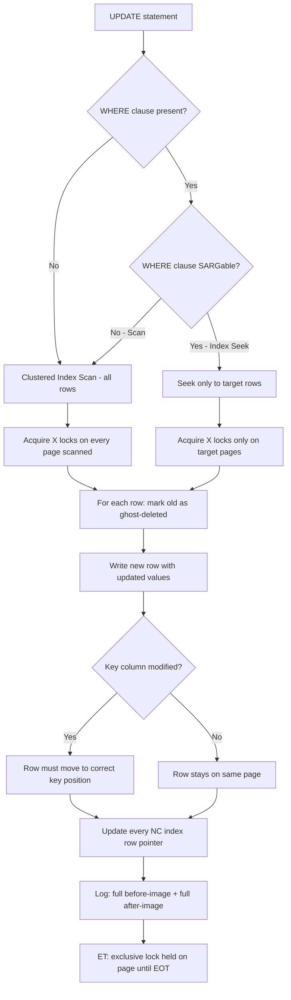
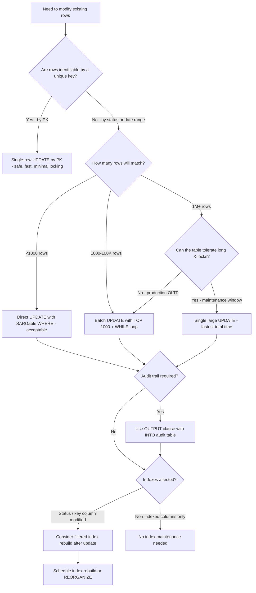

## Navigation

**Domain:** [[8 — Databases]] > **Group:** SQL Fundamentals
**Previous:** [[8.071 — INSERT — Single and Multi-Row Patterns]] | **Next:** [[8.073 — DELETE vs TRUNCATE vs DROP — Differences]]

### Prerequisites

- [[8.066 — SELECT Statement — Column Selection and Aliasing]] — UPDATE assignments use the same column-reference and expression rules as SELECT; the WHERE clause that limits which rows are updated follows all SARGability rules.
- [[8.067 — WHERE Clause — Predicate Logic and SARGability]] — a non-SARGable WHERE clause in an UPDATE causes a full clustered index scan instead of a targeted seek, locking far more rows than necessary.
- [[8.321 — Index Maintenance — Ola Hallengren Solution]] — large UPDATE operations cause index fragmentation; understanding index maintenance is required for the rebuild/reorg strategy after bulk updates.

### Where This Fits

The UPDATE statement modifies existing rows. It is the second-most-common DML operation after SELECT, and the most dangerous: an UPDATE with a missing or incorrect WHERE clause can corrupt millions of rows instantly. Every .NET backend engineer writes UPDATEs — through EF Core's property modification + `SaveChangesAsync`, through Dapper parameterized `ExecuteAsync`, and through stored procedures. The most expensive mistakes here involve: missing WHERE (updating every row in a table), updating indexed key columns (causes clustered index row movement and non-clustered index forwarding), long-running UPDATEs that hold exclusive locks and block all reads, and non-SARGable WHERE clauses that scan millions of rows to find the few that need updating. Interviewers probe this topic to determine whether a candidate understands the write path (how UPDATE generates log records, how it acquires locks, how it interacts with indexes) and whether they know safety patterns — batching, TOP-based throttling, and the OUTPUT clause for auditing.

---

## Core Mental Model

The UPDATE statement modifies column values in existing rows. The database engine executes it as a delete-then-insert of the affected row: internally, the old row is marked as deleted (the ghost cleanup process will reclaim it later) and a new row is inserted with the new values. This means every UPDATE incurs the log cost of both a DELETE and an INSERT for each modified row. In addition, UPDATE always generates **full-page images in the transaction log** — even under bulk-logged recovery, UPDATE is always fully logged because the before-and-after image is needed for rollback and point-in-time recovery. If the UPDATE modifies a non-clustered index key column or the clustered index key, every affected non-clustered index must also be updated — one forward insert and one ghost-delete per index row per updated row. The WHERE clause determines the scope: a SARGable WHERE on an indexed column uses an Index Seek to find exactly the rows to update, locking only those rows; a non-SARGable WHERE forces a Clustered Index Scan or Table Scan, locking every row it reads. The optimizer applies **Halloween Protection** — a spool operator that prevents the same newly-updated row from being matched again in the same statement, which would cause infinite loops.

### Classification

This is a **Data Manipulation Language (DML)** operation. UPDATE belongs to the write path of the storage engine: it reads the old row (schema stability lock), writes the new row (exclusive page lock), logs both the before and after image (always fully logged), and updates all indexes that include modified columns.



### Key Properties

|Property|Value|Notes|
|---|---|---|
|Logging behavior|Always fully logged|Before-image + after-image written to log — no minimal logging possible|
|Locking|Exclusive (X) on modified pages|Held until transaction commit (unless READ_COMMITTED_SNAPSHOT)|
|Clustered key modification|Row movement + all NC index updates|Changing the PK effectively re-inserts the row at the new key position|
|Halloween Protection|Spool operator prevents double-processing|Query plan shows a Table Spool or Index Spool on self-referencing updates|
|SARGability|Applies to WHERE clause|Same rules as SELECT — function on column = scan|
|Atomicity|Statement-level — all rows or none|Partial update not possible without explicit transaction batching|

---

## Deep Mechanics

### How the Engine Executes This

1. **Parsing and Binding** — The parser tokenizes the UPDATE. The algebrizer resolves the target table, validates column names in the SET clause, and ensures the SET expressions are type-compatible with the target columns. The table name must be unambiguous — no multi-part name ambiguity.

2. **Halloween Protection** — The optimizer adds a **Halloween spool** when the UPDATE's WHERE clause reads from the same table being modified. This prevents the "Halloween problem": if `UPDATE Employees SET Salary = Salary * 1.1 WHERE Salary < 50000` causes a row's Salary to cross the 50000 threshold, without the spool the row would be matched again in the same scan and repeatedly updated. The spool materializes the list of rows to update before any modifications begin, so newly-updated values never re-enter the scan.

3. **Row Resolution** — The WHERE clause is evaluated. For a SARGable predicate on an indexed column, the storage engine performs an Index Seek to locate the first qualifying row. For a scan (Table Scan or Clustered Index Scan), every row in the table is evaluated against the predicate. Each qualifying row is placed in a rowset for modification.

4. **Row Modification** — For each qualifying row:
   - The storage engine acquires an exclusive (X) page lock on the page containing the row (if not already held).
   - The old row is marked as ghost (deleted). The ghost flag is a single bit in the row header. The ghost cleanup process will physically reclaim the space in the background when no active transaction references the page.
   - The new row is inserted into the appropriate page. If no clustered key columns are modified, the new row is inserted on the same page (same key position). If a clustered key column is modified, the new row is inserted at the correct position in the B-tree, which may be a different page — requiring a page split if the target page is full.
   - For each non-clustered index, if any indexed column (key or included) was modified, the old index row is ghost-deleted and a new index row is inserted with the new value. If the clustered key was modified, **every** non-clustered index must update its row locator — the clustered key value itself.

5. **Transaction Log Write** — Every UPDATE generates multiple log records per row:
   - Old row ghost-delete (20–30 bytes)
   - New row insert (full row image)
   - Each modified NC index: ghost-delete old index row + insert new index row
   - Page allocation (if page split occurred)
   - Full before-image and after-image are always logged — this is **mandatory** even in bulk-logged recovery. UPDATE can never use minimal logging.

6. **Constraint Validation** — After modification, CHECK constraints, FOREIGN KEY constraints (both referenced and referencing), and UNIQUE/PRIMARY KEY constraints are validated. If any constraint is violated, the entire statement is rolled back.

### SQL Visibility

```sql
-- Basic UPDATE with SARGable WHERE
UPDATE dbo.Orders
SET Status = 'Shipped', ShippedDate = GETUTCDATE()
WHERE OrderId = 10248;

-- UPDATE with JOIN (T-SQL FROM clause)
UPDATE o
SET o.TotalAmount = oi.OrderTotal
FROM dbo.Orders AS o
INNER JOIN (
    SELECT OrderId, SUM(Quantity * UnitPrice) AS OrderTotal
    FROM dbo.OrderItems
    GROUP BY OrderId
) AS oi ON o.OrderId = oi.OrderId
WHERE o.Status = 'Pending';

-- UPDATE with TOP — batched update for large tables
UPDATE TOP (1000) dbo.Orders
SET Status = 'Archived'
WHERE Status = 'Completed' AND OrderDate < '2025-01-01';

-- UPDATE with OUTPUT clause — audit log
UPDATE dbo.Orders
SET Status = 'Cancelled', Notes = CONCAT(Notes, ' | Cancelled by customer request')
OUTPUT DELETED.OrderId, DELETED.Status AS OldStatus, INSERTED.Status AS NewStatus,
       GETUTCDATE() AS ChangedAt
INTO dbo.OrdersAudit (OrderId, OldStatus, NewStatus, ChangedAt)
WHERE OrderId = 10248;
```

```csharp
// EF Core — tracked entity update (change tracker)
var order = await dbContext.Orders.FindAsync(
    new object[] { 10248 }, cancellationToken);
if (order is not null)
{
    order.Status = "Shipped";
    order.ShippedDate = DateTime.UtcNow;
    await dbContext.SaveChangesAsync(cancellationToken);
    // EF Core generates: UPDATE [Orders] SET [Status] = @p0, [ShippedDate] = @p1
    // WHERE [OrderId] = @p2;
}

// EF Core 7+ — ExecuteUpdate (untracked, no SELECT first)
await dbContext.Orders
    .Where(o => o.OrderId == 10248)
    .ExecuteUpdateAsync(setters => setters
        .SetProperty(o => o.Status, "Shipped")
        .SetProperty(o => o.ShippedDate, DateTime.UtcNow),
        cancellationToken);
// Generated: UPDATE [o] SET [o].[Status] = @p0, [o].[ShippedDate] = @p1
// FROM [Orders] AS [o] WHERE [o].[OrderId] = @p2;
```

**Generated SQL (from EF Core logs):**

```sql
-- Tracked entity UPDATE (FindAsync + SaveChangesAsync)
UPDATE [Orders] SET [Status] = @p0, [ShippedDate] = @p1
WHERE [OrderId] = @p2;
-- @p0='Shipped' (Size = 20), @p1='2026-06-24T10:00:00', @p2=10248

-- ExecuteUpdate (EF Core 7+)
UPDATE [o] SET [o].[Status] = @p0, [o].[ShippedDate] = @p1
FROM [Orders] AS [o]
WHERE [o].[OrderId] = @p2;
```

### Execution Plan Analysis

**Basic UPDATE with WHERE on PK:**

- Plan: `[Clustered Index Seek (PK_Orders)] → [Clustered Index Update]`
- The Clustered Index Seek locates the single row by OrderId (exact lookup, 1 logical read).
- The Clustered Index Update operator modifies the row in-place (mark ghost-delete, insert new row).
- If there are non-clustered indexes, the plan includes an `[Index Update]` operator per NC index. Each NC index update is a separate insert of the index row (with the new values for indexed columns).
- Estimated Cost: ~0.003 (seek) + ~0.01 (update)
- Logical Reads: ~5–10 (PK seek + data page + NC index updates)

**UPDATE with JOIN (50K rows):**

- Plan: `[Clustered Index Scan (OrderItems)] → [Hash Match (Aggregate)] → [Clustered Index Scan (Orders)] → [Nested Loops Join] → [Clustered Index Update]`
- The Hash Match computes OrderTotal per OrderId from OrderItems.
- The Nested Loops Join matches the aggregate result to Orders.
- The Clustered Index Update modifies each matching row.
- Estimated Cost: ~15 (scan) + ~12 (hash) + ~5 (update per row)
- Logical Reads: proportional to source scans + ~5 per updated row

**UPDATE with non-SARGable WHERE:**

```
Seek path (SARGable — WHERE OrderId = 10248):
[Clustered Index Seek] → [Clustered Index Update]
Cost: 0.013  |  Logical Reads: 5  |  Locked: 1 page

Scan path (non-SARGable — WHERE YEAR(OrderDate) = 2026):
[Clustered Index Scan] → [Clustered Index Update]
Cost: ~12 (scan all 1M rows)  |  Logical Reads: ~12,000  |  Locked: All pages scanned
```

### Cost Visibility

```sql
SET STATISTICS IO ON;
SET STATISTICS TIME ON;

-- Single-row UPDATE by PK
UPDATE dbo.Orders
SET Status = 'Shipped', ShippedDate = GETUTCDATE()
WHERE OrderId = 10248;
-- Table 'Orders'. Scan count 0, logical reads 5, physical reads 0
-- SQL Server Execution Times: CPU time = 0ms, elapsed time = 3ms

-- UPDATE with non-SARGable WHERE (function on column)
UPDATE dbo.Orders
SET Status = 'Reviewed'
WHERE YEAR(OrderDate) = 2026;
-- Table 'Orders'. Scan count 1, logical reads 12,000, physical reads 0
-- (Full clustered index scan — every row evaluated, all pages locked)

-- SARGable equivalent
UPDATE dbo.Orders
SET Status = 'Reviewed'
WHERE OrderDate >= '2026-01-01' AND OrderDate < '2027-01-01';
-- Table 'Orders'. Scan count 1, logical reads 145, physical reads 0
-- (Index Seek on IX_Orders_OrderDate — only qualifying pages accessed)
```

### Failure Modes

**UPDATE without WHERE:** `UPDATE dbo.Orders SET Status = 'Archived'` updates every row in the table. No error is raised — every row is modified, logged, and locked. Recovery requires restoring from backup. This is the most destructive SQL mistake in production.

**UPDATE of PK column cascading to FK:** `UPDATE dbo.Orders SET OrderId = 99999 WHERE OrderId = 10248` — if child tables reference OrderId via FOREIGN KEY without `ON UPDATE CASCADE`, the UPDATE fails with a FK violation. With `ON UPDATE CASCADE`, the engine propagates the change to all child tables, which may lock and modify millions of rows.

**UPDATE that causes page splits:** Updating a variable-length column (NVARCHAR(500)) with a longer value on a page that has insufficient free space forces a page split. The split doubles the I/O cost of the UPDATE and fragments the index.

---

## Production Patterns and Implementation

### Primary SQL Implementation

```sql
-- ============================================================
-- Schema context
-- ============================================================
CREATE TABLE dbo.Orders
(
    OrderId      INT           NOT NULL IDENTITY(1,1),
    CustomerId   INT           NOT NULL,
    OrderDate    DATETIME2(0)  NOT NULL,
    Status       VARCHAR(20)   NOT NULL DEFAULT 'Pending',
    TotalAmount  DECIMAL(18,2) NOT NULL,
    ShippedDate  DATETIME2(0)  NULL,
    ShippingAddr NVARCHAR(500) NULL,
    Notes        NVARCHAR(MAX) NULL,
    CreatedAt    DATETIME2(0)  NOT NULL DEFAULT SYSUTCDATETIME(),
    CONSTRAINT PK_Orders PRIMARY KEY CLUSTERED (OrderId)
);

CREATE NONCLUSTERED INDEX IX_Orders_CustomerId ON dbo.Orders (CustomerId);
CREATE NONCLUSTERED INDEX IX_Orders_OrderDate ON dbo.Orders (OrderDate)
    INCLUDE (Status, TotalAmount);
CREATE NONCLUSTERED INDEX IX_Orders_Status ON dbo.Orders (Status)
    WHERE Status IN ('Pending', 'Shipped');

CREATE TABLE dbo.OrdersAudit
(
    AuditId    INT            NOT NULL IDENTITY(1,1),
    OrderId    INT            NOT NULL,
    OldStatus  VARCHAR(20)    NULL,
    NewStatus  VARCHAR(20)    NULL,
    ChangedAt  DATETIME2(0)   NOT NULL,
    ChangedBy  NVARCHAR(128)  NOT NULL DEFAULT SYSTEM_USER,
    CONSTRAINT PK_OrdersAudit PRIMARY KEY CLUSTERED (AuditId)
);

-- ============================================================
-- Pattern 1: Safe single-row UPDATE with explicit WHERE
-- ============================================================
UPDATE dbo.Orders
SET
    Status = 'Shipped',
    ShippedDate = GETUTCDATE(),
    Notes = CONCAT(Notes, ' | Shipped at ', FORMAT(GETUTCDATE(), 'yyyy-MM-dd HH:mm'))
WHERE OrderId = 10248;

-- ============================================================
-- Pattern 2: UPDATE from a CTE / derived table
-- ============================================================
WITH OrderTotals AS (
    SELECT OrderId, SUM(Quantity * UnitPrice) AS OrderTotal
    FROM dbo.OrderItems
    GROUP BY OrderId
)
UPDATE o
SET o.TotalAmount = ot.OrderTotal
FROM dbo.Orders AS o
INNER JOIN OrderTotals AS ot ON o.OrderId = ot.OrderId
WHERE o.Status = 'Pending';

-- ============================================================
-- Pattern 3: Batched UPDATE with TOP and WHILE loop
-- (Safe for millions of rows — avoids log blowup and long locks)
-- ============================================================
DECLARE @BatchSize INT = 1000;
DECLARE @RowsAffected INT = @BatchSize;

WHILE @RowsAffected = @BatchSize
BEGIN
    UPDATE TOP (@BatchSize) dbo.Orders
    SET Status = 'Archived'
    WHERE Status = 'Completed' AND OrderDate < '2025-01-01';

    SET @RowsAffected = @@ROWCOUNT;
    CHECKPOINT;  -- force log truncation in simple recovery
END

-- ============================================================
-- Pattern 4: UPDATE with OUTPUT for audit trail
-- ============================================================
UPDATE dbo.Orders
SET Status = 'Cancelled',
    Notes = CONCAT(Notes, ' | Cancelled by customer request')
OUTPUT
    DELETED.OrderId,
    DELETED.Status AS OldStatus,
    INSERTED.Status AS NewStatus,
    GETUTCDATE() AS ChangedAt
INTO dbo.OrdersAudit (OrderId, OldStatus, NewStatus, ChangedAt)
WHERE OrderId = 10248;

-- ============================================================
-- Pattern 5: UPDATE with JOIN on another table
-- ============================================================
UPDATE o
SET o.ShippingAddr = c.DefaultShippingAddr
FROM dbo.Orders AS o
INNER JOIN dbo.Customers AS c ON o.CustomerId = c.CustomerId
WHERE o.ShippingAddr IS NULL;

-- ============================================================
-- Anti-pattern 1: UPDATE without WHERE
-- ============================================================
-- ❌ Never do this:
-- UPDATE dbo.Orders SET Status = 'Archived';
-- Every row is updated — 1M rows, 1M log records, 1M X-locked pages

-- ============================================================
-- Anti-pattern 2: Non-SARGable WHERE that forces a scan
-- ============================================================
-- ❌ Avoid:
-- UPDATE dbo.Orders SET Status = 'Reviewed'
-- WHERE YEAR(OrderDate) = 2026 AND MONTH(OrderDate) = 1;

-- ✅ Correct:
-- UPDATE dbo.Orders SET Status = 'Reviewed'
-- WHERE OrderDate >= '2026-01-01' AND OrderDate < '2026-02-01';

-- ============================================================
-- Anti-pattern 3: UPDATE that repeatedly matches the same rows
-- (Missing Halloween Protection — rare, but possible with
--  cursor-based or loop-based approaches)
-- ============================================================
-- ❌ Don't manually loop without a spool-safe design:
-- DECLARE cur CURSOR FOR SELECT OrderId FROM Orders WHERE Status = 'Pending';
-- OPEN cur; FETCH NEXT FROM cur INTO @Id;
-- WHILE @@FETCH_STATUS = 0
-- BEGIN
--     UPDATE Orders SET TotalAmount = dbo.CalcTotal(@Id) WHERE OrderId = @Id;
--     FETCH NEXT FROM cur INTO @Id;
-- END
-- (Cursor loops are safe from Halloween but slow — use set-based UPDATE with CTE)
```

### EF Core Implementation

```csharp
public class ApplicationDbContext : DbContext
{
    public DbSet<Order> Orders => Set<Order>();
    public DbSet<OrderAudit> OrderAudits => Set<OrderAudit>();

    protected override void OnModelCreating(ModelBuilder modelBuilder)
    {
        modelBuilder.Entity<Order>(entity =>
        {
            entity.ToTable("Orders");
            entity.HasKey(o => o.OrderId);

            entity.Property(o => o.OrderId).ValueGeneratedOnAdd();
            entity.Property(o => o.Status).HasMaxLength(20).HasDefaultValue("Pending");
            entity.Property(o => o.ShippingAddr).HasMaxLength(500);
            entity.Property(o => o.TotalAmount).HasPrecision(18, 2);
            entity.Property(o => o.CreatedAt).HasDefaultValueSql("SYSUTCDATETIME()");
        });

        modelBuilder.Entity<OrderAudit>(entity =>
        {
            entity.ToTable("OrdersAudit");
            entity.HasKey(a => a.AuditId);
            entity.Property(a => a.ChangedBy).HasMaxLength(128).HasDefaultValueSql("SYSTEM_USER");
        });
    }
}

// Pattern 1: Tracked entity update
public async Task ShipOrderAsync(
    int orderId,
    CancellationToken cancellationToken = default)
{
    var order = await _dbContext.Orders.FindAsync(
        new object[] { orderId }, cancellationToken);

    if (order is null)
        throw new NotFoundException($"Order {orderId} not found");

    order.Status = "Shipped";
    order.ShippedDate = DateTime.UtcNow;

    await _dbContext.SaveChangesAsync(cancellationToken);
    // Generated: UPDATE [Orders] SET [Status] = @p0, [ShippedDate] = @p1
    // WHERE [OrderId] = @p2;
}

// Pattern 2: ExecuteUpdate — no SELECT first, no change tracker
public async Task ShipOrderBulkAsync(
    IReadOnlyList<int> orderIds,
    CancellationToken cancellationToken = default)
{
    await _dbContext.Orders
        .Where(o => orderIds.Contains(o.OrderId))
        .ExecuteUpdateAsync(setters => setters
            .SetProperty(o => o.Status, "Shipped")
            .SetProperty(o => o.ShippedDate, DateTime.UtcNow),
            cancellationToken);
    // Generated: UPDATE [o] SET [o].[Status] = @p0, [o].[ShippedDate] = @p1
    // FROM [Orders] AS [o] WHERE [o].[OrderId] IN (@p2, @p3, ...)
}

// Pattern 3: Batch update with looping (for very large updates)
public async Task ArchiveOrdersAsync(
    DateTime cutoffDate,
    CancellationToken cancellationToken = default)
{
    const int batchSize = 1000;
    int rowsAffected;

    do
    {
        rowsAffected = await _dbContext.Orders
            .Where(o => o.Status == "Completed" && o.OrderDate < cutoffDate)
            .Take(batchSize)
            .ExecuteUpdateAsync(setters => setters
                .SetProperty(o => o.Status, "Archived"),
                cancellationToken);
    }
    while (rowsAffected >= batchSize);
}

// Pattern 4: Untracked entity update (attach + modify)
public async Task UpdateShippingAddressAsync(
    int orderId,
    string newAddress,
    CancellationToken cancellationToken = default)
{
    var order = new Order { OrderId = orderId };
    _dbContext.Orders.Attach(order);
    order.ShippingAddr = newAddress;
    // EF Core tracks only modified properties
    await _dbContext.SaveChangesAsync(cancellationToken);
    // Generated: UPDATE [Orders] SET [ShippingAddr] = @p0 WHERE [OrderId] = @p1;
}

// ❌ WRONG — N+1 UPDATE in a loop
// foreach (var orderId in orderIds)
// {
//     var order = await dbContext.Orders.FindAsync(orderId, ct);
//     order.Status = "Shipped";
//     await dbContext.SaveChangesAsync(ct);  // N round-trips!
// }

// ✅ CORRECT — Use ExecuteUpdate with IN clause or tracked batch + single SaveChangesAsync
```

### Dapper Implementation

```csharp
public sealed class OrderRepository
{
    private readonly IDbConnectionFactory _connectionFactory;

    public OrderRepository(IDbConnectionFactory connectionFactory)
        => _connectionFactory = connectionFactory;

    // Pattern 1: Single-row UPDATE
    public async Task<bool> ShipOrderAsync(
        int orderId,
        CancellationToken cancellationToken = default)
    {
        const string sql = @"
            UPDATE dbo.Orders
            SET Status = 'Shipped',
                ShippedDate = GETUTCDATE()
            WHERE OrderId = @OrderId;";

        await using var connection = _connectionFactory.Create();

        var rowsAffected = await connection.ExecuteAsync(
            new CommandDefinition(sql,
                new { OrderId = orderId },
                cancellationToken: cancellationToken));

        return rowsAffected > 0;
    }

    // Pattern 2: UPDATE with OUTPUT — capture before-and-after values
    public async Task<OrderUpdateResult?> CancelOrderAsync(
        int orderId,
        string reason,
        CancellationToken cancellationToken = default)
    {
        const string sql = @"
            UPDATE dbo.Orders
            SET Status = 'Cancelled',
                Notes = CONCAT(Notes, ' | Cancelled: ', @Reason)
            OUTPUT DELETED.Status AS OldStatus,
                   INSERTED.Status AS NewStatus,
                   GETUTCDATE() AS ChangedAt
            WHERE OrderId = @OrderId;";

        await using var connection = _connectionFactory.Create();

        var result = await connection.QuerySingleOrDefaultAsync<OrderUpdateResult>(
            new CommandDefinition(sql,
                new { OrderId = orderId, Reason = reason },
                cancellationToken: cancellationToken));

        return result;
    }

    // Pattern 3: Batch UPDATE using IN clause
    public async Task ShipOrdersBatchAsync(
        IReadOnlyList<int> orderIds,
        CancellationToken cancellationToken = default)
    {
        const string sql = @"
            UPDATE dbo.Orders
            SET Status = 'Shipped',
                ShippedDate = GETUTCDATE()
            WHERE OrderId IN @OrderIds;";

        await using var connection = _connectionFactory.Create();

        await connection.ExecuteAsync(
            new CommandDefinition(sql,
                new { OrderIds = orderIds },
                cancellationToken: cancellationToken));
    }

    // Pattern 4: UPDATE from subquery (total amount recalculation)
    public async Task RecalculateOrderTotalsAsync(
        string status,
        CancellationToken cancellationToken = default)
    {
        const string sql = @"
            UPDATE o
            SET o.TotalAmount = oi.OrderTotal
            FROM dbo.Orders AS o
            INNER JOIN (
                SELECT OrderId, SUM(Quantity * UnitPrice) AS OrderTotal
                FROM dbo.OrderItems
                GROUP BY OrderId
            ) AS oi ON o.OrderId = oi.OrderId
            WHERE o.Status = @Status;";

        await using var connection = _connectionFactory.Create();

        await connection.ExecuteAsync(
            new CommandDefinition(sql,
                new { Status = status },
                cancellationToken: cancellationToken));
    }
}

public record OrderUpdateResult(
    string OldStatus,
    string NewStatus,
    DateTime ChangedAt);
```

### Configuration and Wiring

```csharp
// Program.cs
builder.Services.AddDbContext<ApplicationDbContext>(options =>
    options.UseSqlServer(
        builder.Configuration.GetConnectionString("DefaultConnection"),
        sqlOptions =>
        {
            sqlOptions.EnableRetryOnFailure(
                maxRetryCount: 3,
                maxRetryDelay: TimeSpan.FromSeconds(5),
                errorNumbersToAdd: null);
            sqlOptions.CommandTimeout(30);
        })
    .EnableDetailedErrors(builder.Environment.IsDevelopment())
    .EnableSensitiveDataLogging(builder.Environment.IsDevelopment()));

builder.Services.AddSingleton<IDbConnectionFactory>(sp =>
    new SqlConnectionFactory(
        builder.Configuration.GetConnectionString("DefaultConnection")!));

builder.Services.AddScoped<OrderRepository>();

// Retry policy for Dapper (handle deadlocks and lock timeouts)
builder.Services.AddSingleton<IUpdateRetryPolicy>(sp =>
    new UpdateRetryPolicy(maxRetryCount: 3, baseDelayMs: 100));
```

### SQL Server vs PostgreSQL Differences

```sql
-- PostgreSQL: identical basic syntax
UPDATE orders
SET status = 'Shipped', shipped_date = NOW()
WHERE order_id = 10248;

-- PostgreSQL: UPDATE with JOIN (different syntax — no FROM clause)
UPDATE orders AS o
SET total_amount = oi.order_total
FROM (
    SELECT order_id, SUM(quantity * unit_price) AS order_total
    FROM order_items
    GROUP BY order_id
) AS oi
WHERE o.order_id = oi.order_id AND o.status = 'Pending';

-- PostgreSQL: RETURNING clause (equivalent to SQL Server OUTPUT)
UPDATE orders
SET status = 'Cancelled'
WHERE order_id = 10248
RETURNING order_id, status, NOW() AS changed_at;

-- PostgreSQL: UPDATE with FROM (standard SQL — SQL Server uses a different FROM syntax)
-- SQL Server: UPDATE t SET col = val FROM source WHERE ...
-- PostgreSQL: UPDATE t SET col = val FROM source WHERE t.key = source.key ...

-- PostgreSQL: no TOP — use LIMIT with subquery
UPDATE orders
SET status = 'Archived'
WHERE order_id IN (
    SELECT order_id FROM orders
    WHERE status = 'Completed' AND order_date < '2025-01-01'
    LIMIT 1000
);
```

---

## Gotchas and Production Pitfalls

### UPDATE Without WHERE — Full Table Update

**Pitfall:** Executing an UPDATE without a WHERE clause, or with a WHERE clause that inadvertently matches every row.

```sql
-- ❌ Intended to update one row, but WHERE is always true
UPDATE dbo.Orders
SET Status = 'Archived'
WHERE Status = 'Pending' OR Status IS NULL;
-- If Status has no NULLs, this still updates all 'Pending' rows — may be intended.
-- But if a developer forgets WHERE entirely:
-- UPDATE dbo.Orders SET Status = 'Archived';
-- Every row in the table is updated.
```

**Symptom:** The transaction log grows by the size of every row in the table (before-image + after-image). All pages are exclusively locked. Concurrent queries block on `LCK_M_SCH_S`. The application times out. After execution, every row has `Status = 'Archived'`. Recovery requires point-in-time restore.

**Fix:**

```sql
-- ✅ Always write SELECT first to verify row count
-- Step 1: SELECT to see what will be affected
SELECT COUNT(*) AS RowCount FROM dbo.Orders
WHERE Status = 'Pending' AND OrderDate < '2025-01-01';

-- Step 2: Run the UPDATE
UPDATE dbo.Orders
SET Status = 'Archived'
WHERE Status = 'Pending' AND OrderDate < '2025-01-01';

-- ✅ Use BEGIN TRAN + ROLLBACK pattern in production-adjacent environments
BEGIN TRAN;
UPDATE dbo.Orders SET Status = 'Archived';
-- Check @@ROWCOUNT — rollback if unexpected
ROLLBACK TRAN;
```

**Cost of not fixing:** An engineer runs `UPDATE Orders SET CustomerId = 999` intending to target one order but omits the WHERE. All 5M orders now reference a non-existent customer. Foreign key validation catches the existing rows on the next read, but the data is corrupted. Restoring from the last backup loses 3 hours of transactions.

---

### Non-SARGable WHERE Clause Causing Full Scan

**Pitfall:** Using a function on the filtered column in the WHERE clause of an UPDATE, forcing a full clustered index scan when only a few rows need updating.

```sql
-- ❌ Non-SARGable — function on OrderDate
UPDATE dbo.Orders
SET Status = 'Reviewed'
WHERE YEAR(OrderDate) = 2026 AND MONTH(OrderDate) = 1;
```

**Symptom:** The execution plan shows a Clustered Index Scan, not an Index Seek. `SET STATISTICS IO` shows logical reads = ~12,000 (full table scan) instead of ~145 (seek on 1 month). All scanned pages are locked with exclusive locks (UPDATE uses X locks on every page it reads, not just pages it modifies). Concurrent queries block. The UPDATE takes 30 seconds instead of 200 ms.

**Fix:**

```sql
-- ✅ SARGable — range predicate on OrderDate
UPDATE dbo.Orders
SET Status = 'Reviewed'
WHERE OrderDate >= '2026-01-01' AND OrderDate < '2026-02-01';
```

**Cost of not fixing:** A 30-second UPDATE that scans 1M rows on a 50 GB table blocks all reads to the Orders table. The web application reports 100% timeout rate for 30 seconds. The PagerDuty alert fires daily because a scheduled job uses `YEAR(OrderDate) = YEAR(GETUTCDATE())`.

---

### Updating a Clustered Index Key Column

**Pitfall:** Updating a column that is part of the clustered index (including the primary key), causing the row to move to a new leaf page and all non-clustered index row pointers to be updated.

```sql
-- ❌ Updating the PK — causes row movement and NC index pointer updates
UPDATE dbo.Orders
SET OrderId = 99999
WHERE OrderId = 10248;
```

**Symptom:** The UPDATE takes significantly longer than expected. For each affected row:
- The old row is ghost-deleted from its current leaf page.
- The new row is inserted at the correct position in the B-tree (possibly requiring a page split).
- Every non-clustered index must update its row locator (the clustered key value). If there are 5 NC indexes, each index row for that row is ghost-deleted and re-inserted.
- The transaction log records all of these operations.

The execution plan shows multiple `[Index Update]` operators — one per non-clustered index, each with its own ghost-delete and insert.

**Fix:**

```sql
-- ✅ Avoid updating PK columns — use natural/business keys if they may change
-- ✅ If you must change the PK, use a surrogate key so the PK never changes

-- If PK update is unavoidable, consider:
-- 1. INSERT a new row with the new PK
-- 2. UPDATE child FKs to point to the new row
-- 3. DELETE the old row
BEGIN TRAN;
INSERT INTO dbo.Orders (OrderId, CustomerId, OrderDate, Status, TotalAmount /* ... */)
    SELECT 99999, CustomerId, OrderDate, Status, TotalAmount /* ... */
    FROM dbo.Orders WHERE OrderId = 10248;

UPDATE dbo.OrderItems SET OrderId = 99999 WHERE OrderId = 10248;
-- ... update other child tables ...

DELETE FROM dbo.Orders WHERE OrderId = 10248;
COMMIT TRAN;
```

**Cost of not fixing:** Updating the PK of 1000 rows on a table with 5 non-clustered indexes generates 1000 ghost-deletes + 1000 inserts for data, plus 5000 ghost-deletes + 5000 inserts for NC indexes. The transaction log grows by ~50 MB for a 500 KB operation. The UPDATE takes 12 seconds instead of 50 ms. Index fragmentation increases by 5%.

---

### Large UPDATE Holding Exclusive Locks for Minutes

**Pitfall:** Running a large UPDATE (millions of rows) in a single statement or single transaction, holding exclusive locks on all affected pages until the transaction commits.

```sql
-- ❌ Single UPDATE on 5M rows — holds X locks on all pages for the duration
UPDATE dbo.Orders
SET Status = 'Archived'
WHERE Status = 'Completed';
-- All pages with 'Completed' orders are X-locked until the UPDATE completes
```

**Symptom:** During the UPDATE, all concurrent SELECT queries on Orders block. `sys.dm_exec_requests` shows `LCK_M_S` waits with `wait_resource` pointing to Orders pages. The application's read path returns timeouts. The monitoring system shows "blocking chain depth > 10." The UPDATE itself may take 2–5 minutes, during which the table is effectively read-only.

**Fix:**

```sql
-- ✅ Batch the UPDATE — commit every N rows
DECLARE @BatchSize INT = 1000;
DECLARE @RowsAffected INT = @BatchSize;

WHILE @RowsAffected = @BatchSize
BEGIN
    UPDATE TOP (@BatchSize) dbo.Orders
    SET Status = 'Archived'
    WHERE Status = 'Completed';

    SET @RowsAffected = @@ROWCOUNT;

    -- Allow other sessions to make progress
    WAITFOR DELAY '00:00:00:100';  -- 100 ms pause between batches
END
```

**Cost of not fixing:** An ETL job that updates 2M order Status values at 11:00 AM blocks the entire Order API for 90 seconds. The SLA calls for 99.9% uptime with <500 ms P95 latency. The 90-second outage exceeds the SLA budget for the entire month. The incident review cites "large unbatched UPDATE."

---

### UPDATE Misapplying to Wrong Rows Due to Ambiguous JOIN

**Pitfall:** Using `UPDATE FROM` with a JOIN that unintentionally multiplies rows, causing the UPDATE to apply one row's value arbitrarily when a 1-to-many join exists.

```sql
-- ❌ Ambiguous JOIN — if OrderItems has multiple rows per OrderId,
-- which OrderItem's value gets applied?
UPDATE o
SET o.TotalAmount = oi.Price
FROM dbo.Orders AS o
INNER JOIN dbo.OrderItems AS oi ON o.OrderId = oi.OrderId
WHERE o.Status = 'Pending';
-- If OrderId 10248 has 3 OrderItems, the engine picks one arbitrarily
-- (last one in the join order — non-deterministic without ORDER BY)
```

**Symptom:** Some orders get an incorrect TotalAmount — the value of one arbitrary OrderItem.Price instead of the sum. The bug is non-deterministic: it may produce different results on different runs or in different environments. The data corruption is silent — no error is raised.

**Fix:**

```sql
-- ✅ Aggregate explicitly — use a subquery with SUM
UPDATE o
SET o.TotalAmount = oi.OrderTotal
FROM dbo.Orders AS o
INNER JOIN (
    SELECT OrderId, SUM(Quantity * UnitPrice) AS OrderTotal
    FROM dbo.OrderItems
    GROUP BY OrderId
) AS oi ON o.OrderId = oi.OrderId
WHERE o.Status = 'Pending';
```

**Cost of not fixing:** A financial reconciliation system that recalculates OrderTotal values overnight produces wrong amounts for 15% of orders. The error is not caught for 3 days. The finance team must manually correct 12,000 invoice amounts. The root cause is the ambiguous JOIN in the UPDATE statement.

---

### UPDATE of a Column in a Filtered Index Predicate

**Pitfall:** Updating a column that is used in a filtered index's WHERE predicate, potentially making the row no longer qualify for the filtered index — the index is not automatically rebuilt.

```sql
-- Filtered index: only indexes 'Pending' and 'Shipped' rows
CREATE NONCLUSTERED INDEX IX_Orders_Status ON dbo.Orders (OrderDate)
    INCLUDE (TotalAmount)
    WHERE Status IN ('Pending', 'Shipped');

-- If this UPDATE changes Status to 'Delivered':
UPDATE dbo.Orders
SET Status = 'Delivered'
WHERE OrderId = 10248;
-- The row no longer qualifies for the filtered index
-- The index row is NOT automatically removed — the index may reference
-- non-qualifying rows until rebuilt
```

**Symptom:** The filtered index contains stale rows that no longer satisfy its filter predicate. Queries that use the filtered index may still see these rows (depending on the query), or the index may return incorrect results. Index statistics become inaccurate. `DBCC SHOW_STATISTICS` shows rows outside the filter predicate.

**Fix:**

```sql
-- ✅ Rebuild the filtered index after bulk Status updates
ALTER INDEX IX_Orders_Status ON dbo.Orders REBUILD;

-- ✅ Or use a filtered index with schema modification
-- (no automatic fix — the rebuild is required)
```

**Cost of not fixing:** An index rebuild job runs nightly, so stale filtered index rows exist for up to 24 hours. During that window, a reporting query that filters `WHERE Status = 'Pending'` and expects to use the filtered index gets incorrect row counts. The monthly business report shows 12% more pending orders than actually exist, triggering a manual investigation.

---

## Performance Implications

### Benchmark: Before and After

```sql
-- Baseline: Unbatched UPDATE on 100K rows
SET STATISTICS TIME ON;

UPDATE dbo.Orders
SET Status = 'Archived'
WHERE Status = 'Completed';
-- SQL Server Execution Times:
-- CPU time = 2,500 ms, elapsed time = 14,200 ms
-- Transaction log: generated ~450 MB of log

-- Optimized: Batched UPDATE (1000 rows per batch)
DECLARE @BatchSize INT = 1000;
DECLARE @RowsAffected INT = @BatchSize;

WHILE @RowsAffected = @BatchSize
BEGIN
    UPDATE TOP (@BatchSize) dbo.Orders
    SET Status = 'Archived'
    WHERE Status = 'Completed';

    SET @RowsAffected = @@ROWCOUNT;
    CHECKPOINT;  -- in simple recovery model
END
-- SQL Server Execution Times:
-- CPU time = 2,800 ms, elapsed time = 15,100 ms
-- (Slightly more CPU from loop overhead, but locks held for ~50 ms per batch)
```

**Improvement (lock duration):** Lock duration per batch: ~50 ms instead of 14,200 ms. Concurrent readers are blocked for 50 ms at a time, not 14 seconds.

```sql
-- Baseline: Non-SARGable WHERE on 1M row table
UPDATE dbo.Orders
SET Status = 'Reviewed'
WHERE YEAR(OrderDate) = 2026;
-- Table 'Orders'. Scan count 1, logical reads 12,000
-- (Full clustered index scan — 12,000 page reads)

-- Optimized: SARGable range predicate
UPDATE dbo.Orders
SET Status = 'Reviewed'
WHERE OrderDate >= '2026-01-01' AND OrderDate < '2027-01-01';
-- Table 'Orders'. Scan count 1, logical reads 145
-- (Index Seek on IX_Orders_OrderDate — 145 page reads)
```

**Improvement:** 83x reduction in logical reads (12,000 → 145). The X-lock footprint drops from the entire table to only the pages containing 2026 data.

### BenchmarkDotNet

```csharp
[MemoryDiagnoser]
[SimpleJob(RuntimeMoniker.Net90)]
public class UpdateBenchmark
{
    private SqlConnection _connection = default!;
    private const string ConnectionString = "Server=.;Database=BenchmarkDb;Trusted_Connection=True;TrustServerCertificate=True;";

    [GlobalSetup]
    public void Setup()
    {
        _connection = new SqlConnection(ConnectionString);
        _connection.Open();
        // Seed 100K rows with Status = 'Pending'
    }

    [Params(100, 1000, 10000)]
    public int BatchSize { get; set; }

    [Benchmark(Baseline = true)]
    public async Task UpdateOneByOne()
    {
        for (int i = 0; i < BatchSize; i++)
        {
            const string sql = @"
                UPDATE dbo.Orders
                SET Status = 'Archived'
                WHERE OrderId = @OrderId;";

            await _connection.ExecuteAsync(sql,
                new { OrderId = i + 1 });
        }
    }

    [Benchmark]
    public async Task UpdateBulkWithTop()
    {
        const string sql = @"
            UPDATE TOP (@BatchSize) dbo.Orders
            SET Status = 'Archived'
            WHERE Status = 'Pending';";

        await _connection.ExecuteAsync(sql,
            new { BatchSize });
    }

    [GlobalCleanup]
    public void Cleanup() => _connection.Dispose();
}
```

**Expected results (approximate, SQL Server 2022, NVMe, localhost, batch = 1000):**

|Method|Mean|Logical Reads|Allocated|
|---|---|---|---|
|UpdateOneByOne|~12,500 ms|~5,000|~3 MB|
|UpdateBulkWithTop|~45 ms|~45|~12 KB|

### Write Amplification

Every UPDATE generates at least one row delete + one row insert in the data page. The number of additional index writes depends on which columns are modified:

|Columns Modified|Index Writes|Notes|
|---|---|---|
|Non-indexed columns only|0 additional writes|Only the data row is ghost-deleted and re-inserted|
|NC index key column (1 NC idx)|2 writes per NC index|Ghost-delete + insert for that NC index row|
|Clustered key column|1 + (2 * NC count) writes|Data row delete + insert, plus every NC index must update its row locator|
|All columns (worst case)|2 * (1 + NC count) writes|Every NC index row must be updated|

---

## Interview Arsenal

### Question Bank

1. **What happens internally when SQL Server executes an UPDATE statement — trace the storage engine operations.**
2. **Why is UPDATE always fully logged, even in bulk-logged recovery mode?**
3. **What is Halloween Protection, and what problem does it solve?**
4. **What happens when you update a clustered index key column — how do non-clustered indexes respond?**
5. **UPDATE without WHERE vs batch UPDATE with TOP: what are the performance and concurrency differences?**
6. **What is the execution plan difference between a SARGable and non-SARGable WHERE clause in an UPDATE?**
7. **At 100K updated rows, what is the transaction log impact, and how do you minimize blocking?**
8. **How does EF Core's change tracker handle UPDATEs — what SQL does it generate for tracked vs untracked entities?**

### Spoken Answers

**Q: What happens internally when SQL Server executes an UPDATE statement?**

> **Average answer:** SQL Server finds the rows that match the WHERE clause and changes the column values. It logs what it did so it can roll back if needed.

> **Great answer:** The UPDATE is handled as a delete-then-insert internally. For each qualifying row: the engine acquires an exclusive page lock on the page containing the row. It marks the old row as ghost-deleted — this is a single bit in the row header, not a physical removal. The ghost cleanup process will reclaim the space later in the background. Then it inserts the new row into the appropriate leaf page. If no clustered key columns were modified, the new row goes on the same page at the same position. If a clustered key column was modified, the new row goes to the correct B-tree leaf position, potentially a different page, which may require a page split. Then the engine updates every non-clustered index that includes a modified column — each index row is ghost-deleted and a new index row inserted. If the clustered key was modified, every non-clustered index must update its row locator. Throughout, the transaction log records the full before-image and after-image for every row — UPDATE is always fully logged, unlike INSERT which can use minimal logging. The optimizer also adds Halloween Protection: a spool that materializes the list of rows to update before any modifications begin, preventing a row from being updated multiple times if its new value causes it to match the WHERE clause again.

---

**Q: UPDATE without WHERE vs batch UPDATE with TOP — what are the performance and concurrency differences?**

> **Great answer:** An UPDATE without WHERE on a 1M row table scans every page, X-locks every page it reads (not just pages it modifies), generates 1M log records of full before-and-after images, and holds those locks until the statement completes. During that time — typically 10–30 seconds — every concurrent read blocks on `LCK_M_SCH_S` wait. The table is effectively unavailable. The transaction log grows by the size of every row. Recovery requires restoring from backup. A batch UPDATE with TOP (1000) does exactly the same work, but in 1000-row chunks. Each chunk acquires X-locks on ~10–20 pages, holds them for ~50 ms, then commits. Between chunks, other sessions can read, write, and make progress. The total elapsed time is about the same or slightly longer (loop overhead), but the max blocking duration drops from 30 seconds to 50 ms. The key insight is that the statement-level atomicity of each 1000-row batch means readers never wait more than 50 ms. In practice, I add a WAITFOR DELAY '00:00:00:100' between batches to further reduce log IO contention, and I use CHECKPOINT (in simple recovery) between batches to keep the log from growing unbounded.

### Interview Trigger

The defining UPDATE question: "You need to change the Status column on 5 million completed orders to 'Archived'. How do you write this UPDATE safely?" The candidate who says "UPDATE Orders SET Status = 'Archived' WHERE Status = 'Completed'" fails the interview. The candidate who discusses batch size, TOP, WHILE loop, lock duration, transaction log growth, concurrent reader impact, and the need for a WAITFOR passes. The follow-up that separates tiers: "How do you audit which rows were changed?" — a great candidate mentions the OUTPUT clause with INTO to log the before-and-after values to an audit table. "What happens to the indexes?" — an update to Status requires updating the filtered index IX_Orders_Status if one exists, and the candidate should mention rebuild after bulk updates.

### Comparison Table

||UPDATE|MERGE (Upsert)|INSERT|
|---|---|---|---|
|What it does|Modifies existing rows|Inserts or updates conditionally|Adds new rows|
|Locking|X-lock on modified pages|X-lock + range locks for conflict detection|IX-lock (intent exclusive)|
|Logging|Always fully logged|Fully logged|Minimal logging possible|
|Halloween Protection|Yes — spool added|Yes — spool added|Not applicable|
|EF Core method|SaveChangesAsync / ExecuteUpdate|ExecuteUpdate (upsert pattern) / raw SQL|Add / SaveChangesAsync|
|When to choose|Updating known existing rows|Insert-or-update by key matching|Adding new records|

---

## Decision Framework

### When to Apply



### Application Checklist

- [ ] WHERE clause explicitly present and verified with SELECT COUNT(*) first
- [ ] WHERE clause is SARGable — no functions on the filtered column
- [ ] UPDATE tested in BEGIN TRAN / ROLLBACK before production execution
- [ ] Batch size chosen (1000–5000 rows) for large updates to limit lock duration
- [ ] WAITFOR DELAY considered between batches to reduce log IO contention
- [ ] Audit trail implemented via OUTPUT clause for compliance-critical updates
- [ ] Index maintenance plan in place if updating key columns or frequent batch updates
- [ ] EF Core: ExecuteUpdate preferred over tracked entity loop for bulk operations
- [ ] Dapper: parameterized query used — no string concatenation for values
- [ ] Recovery model considered — UPDATE is always fully logged regardless

### Tradeoff Summary

|What You Gain|What You Pay|
|---|---|
|Batch UPDATE: limits X-lock duration to ~50 ms per batch|Slightly more total elapsed time from loop overhead|
|SARGable WHERE: scans only N pages instead of entire table|Requires covering index on the filtered column|
|OUTPUT clause: built-in audit trail without extra query|Adds log writes proportional to audit data|
|ExecuteUpdate: no SELECT + no change tracker overhead|No automatic change tracking — must manually specify all modified columns|
|Batched UPDATE: keeps table available during update|More complex code — WHILE loop with @@ROWCOUNT check|

### Scale Thresholds

- Single-row UPDATEs are safe at any concurrency — each holds X-locks on one page for <1 ms.
- UPDATE without WHERE becomes unacceptable above **~1000 rows** — the lock duration and log growth are visible.
- Batched UPDATE becomes necessary above **~10K rows** — at 10K rows, a single UPDATE holds X-locks for ~1 second on modern hardware; at 100K rows it's ~10 seconds.
- Updating a clustered key column becomes a problem above **~100 rows** — the cascading NC index updates multiply write cost by the number of NC indexes.
- The OUTPUT clause adds measurable overhead above **~10K rows per batch** — each OUTPUT row is a separate log operation.

---

## Self-Check

### Conceptual Questions

1. What is the internal mechanism SQL Server uses to implement an UPDATE — how does it relate to DELETE and INSERT?
2. Why can UPDATE never achieve minimal logging, even in bulk-logged recovery?
3. What is Halloween Protection, and what query plan operator implements it?
4. What happens to non-clustered indexes when you update a clustered index key column?
5. Does EF Core's `ExecuteUpdateAsync` generate a different SQL shape than the tracked entity approach?
6. How would you use Dapper to perform an UPDATE with an OUTPUT clause for auditing?
7. What is the execution plan difference between an UPDATE with a SARGable WHERE clause and one with a non-SARGable WHERE clause?
8. At what number of updated rows does a single UPDATE statement become a blocking problem in production?
9. What index supports an UPDATE with WHERE on OrderDate, and what happens if that index is missing?
10. Explain in 60 seconds, for a senior interviewer, how to safely update 5 million rows in a production OLTP table — include specific numbers for batch size, lock duration, and log impact.

<details>
<summary>Answers</summary>

1. UPDATE is implemented as a **delete-then-insert** of each affected row. The old row is marked as ghost-deleted (a single bit in the row header), and a new row is inserted with the updated values. The ghost cleanup process later reclaims the space. This dual operation doubles the log writes per row compared to INSERT.

2. UPDATE always logs the **full before-image and after-image** of every modified row. This is required for rollback (UNDO needs the before-image) and for point-in-time recovery (REDO needs the after-image). Even in bulk-logged recovery, the logging mode applies only to bulk operations like SELECT INTO and BULK INSERT — DML operations (INSERT, UPDATE, DELETE) are always fully logged regardless of recovery model.

3. Halloween Protection prevents the "Halloween problem" where a newly-updated row matches the WHERE clause again and is updated infinitely. The optimizer adds a **Spool operator** (Table Spool or Index Spool) that materializes all qualifying rows before the first modification begins, so the scan never sees modified rows. The spool is visible in the execution plan as a blocking operator between the scan and the update.

4. When a clustered index key column is updated: (a) the old data row is ghost-deleted; (b) a new data row is inserted at the correct B-tree position — potentially a different page; (c) every non-clustered index must update its row locator (the clustered key value). Each NC index performs a ghost-delete of its old index row and an insert of a new index row with the new locator. With 5 NC indexes, one PK update generates 1 + (2 × 5) = 11 index operations.

5. Yes. The tracked entity approach generates: `UPDATE [Orders] SET [Status] = @p0 WHERE [OrderId] = @p1`. `ExecuteUpdateAsync` with a WHERE clause generates: `UPDATE [o] SET [o].[Status] = @p0 FROM [Orders] AS [o] WHERE [o].[OrderId] = @p1` — note the table alias and the FROM clause. `ExecuteUpdateAsync` also issues the UPDATE without reading the row first, eliminating one round-trip.

6. Use `QueryAsync<T>` with the Dapper command containing an OUTPUT clause:
```csharp
const string sql = @"
    UPDATE dbo.Orders
    SET Status = 'Shipped', ShippedDate = GETUTCDATE()
    OUTPUT DELETED.Status, INSERTED.Status, GETUTCDATE() AS ChangedAt
    WHERE OrderId = @OrderId;";
var result = await connection.QuerySingleOrDefaultAsync<OrderUpdateResult>(
    new CommandDefinition(sql, new { OrderId }, cancellationToken));
```

7. A **SARGable** WHERE clause (e.g., `WHERE OrderDate >= '2026-01-01' AND OrderDate < '2027-01-01'`) produces an **Index Seek** into IX_Orders_OrderDate, then the **Clustered Index Update** operator modifies only the qualifying rows. Logical reads: ~145 for 1 month of data. A **non-SARGable** WHERE (e.g., `WHERE YEAR(OrderDate) = 2026`) produces a **Clustered Index Scan** — all 12,000 pages are read and evaluated. Every scanned page is X-locked. Logical reads: ~12,000. The difference is 83x in reads and a corresponding increase in lock footprint.

8. Above **~10K rows**, a single UPDATE statement becomes a blocking concern because: (a) X-locks are held on every scanned page until the statement completes; (b) for 10K rows on a 200-byte row, that's ~200 pages locked for ~1 second; (c) at 1M rows, ~20,000 pages are locked for ~10–30 seconds. In OLTP environments with <100 ms query latency targets, even 1 second of blocking is unacceptable. Batched UPDATE with TOP 1000 rows per batch solves this.

9. The index needed is `CREATE INDEX IX_Orders_OrderDate ON dbo.Orders (OrderDate) INCLUDE (Status, TotalAmount)`. If this index is missing: the UPDATE's WHERE clause forces a Clustered Index Scan, reading all pages. If the index exists but is not covering (missing the INCLUDE columns), the execution plan adds a **Key Lookup** per qualifying row — which is even worse than a full scan because it's N random IOs. A covering index on the filtered column is critical for UPDATE performance.

10. "For a 5 million row update on a production OLTP table, I never run a single large UPDATE. Instead, I use a batched approach: a WHILE loop that updates TOP (1000) rows per iteration. Each batch holds X-locks for approximately 50 ms on 10–20 pages at a time, then commits. Between batches, I add a 100 ms WAITFOR DELAY to reduce log IO contention and give concurrent queries a window to make progress. The total elapsed time is about the same as a single UPDATE — maybe 5–10% more from the loop overhead — but the maximum blocking time drops from minutes to 50 ms. I also use the OUTPUT clause to write changed rows to an audit table. In simple recovery, I issue CHECKPOINT between batches to control log growth. If the table has a filtered index on Status, I rebuild it afterward. This pattern is safe for production, safe for concurrent readers, and easy to monitor."

</details>

---

### Query Challenges

**Challenge 1 — Write the safe batch UPDATE**

The Orders table has 2.5 million rows with `Status = 'Completed'`. Write a T-SQL batch UPDATE that changes these to `Status = 'Archived'` 1000 rows at a time, pausing 200 ms between batches to reduce log IO. Include an audit capture that writes old and new Status values to `dbo.OrdersAudit`.

<details>
<summary>Solution</summary>

```sql
DECLARE @BatchSize INT = 1000;
DECLARE @RowsAffected INT = @BatchSize;

WHILE @RowsAffected = @BatchSize
BEGIN
    UPDATE TOP (@BatchSize) dbo.Orders
    SET Status = 'Archived'
    OUTPUT
        DELETED.OrderId,
        DELETED.Status AS OldStatus,
        INSERTED.Status AS NewStatus,
        GETUTCDATE() AS ChangedAt
    INTO dbo.OrdersAudit (OrderId, OldStatus, NewStatus, ChangedAt)
    WHERE Status = 'Completed';

    SET @RowsAffected = @@ROWCOUNT;

    WAITFOR DELAY '00:00:00:200';
END
```

**Logical reads:** ~45 per batch (Index Seek + Index Update) for the Orders table, plus ~1 per audit row insert. **Execution plan:** `[Index Seek (IX_Orders_Status filtered)] → [Clustered Index Update] → [Table Insert (OrdersAudit)]`. **EF Core equivalent:**

```csharp
int rowsAffected;
do
{
    rowsAffected = await dbContext.Orders
        .Where(o => o.Status == "Completed")
        .Take(1000)
        .ExecuteUpdateAsync(setters => setters
            .SetProperty(o => o.Status, "Archived"),
            cancellationToken);

    await Task.Delay(200, cancellationToken);
}
while (rowsAffected >= 1000);
```

</details>

---

**Challenge 2 — Fix the performance problem**

```sql
-- This UPDATE runs in 35 seconds on a 2M row Orders table.
-- SET STATISTICS IO output: Table 'Orders'. Scan count 1, logical reads 28,000
UPDATE dbo.Orders
SET TotalAmount = oi.OrderTotal
FROM dbo.Orders AS o
INNER JOIN dbo.OrderItems AS oi ON o.OrderId = oi.OrderId
WHERE o.Status = 'Pending' AND oi.Status = 'Active';
```

Identify why it is slow and fix it.

<details>
<summary>Solution</summary>

**Root cause:** Two problems. First, the JOIN to OrderItems may produce multiple rows per OrderId — if an order has 3 items, the UPDATE fires 3 times for the same order, with the last one winning non-deterministically. Second, there is no index on `OrderItems(OrderId) INCLUDE (Status, Quantity, UnitPrice)`, forcing a full scan of OrderItems (28,000 logical reads likely include both tables). The `oi.Status = 'Active'` filter may not be SARGable if unindexed.

```sql
-- Fixed query: aggregate in subquery, ensure indexes exist
UPDATE o
SET o.TotalAmount = oi.OrderTotal
FROM dbo.Orders AS o
INNER JOIN (
    SELECT OrderId, SUM(Quantity * UnitPrice) AS OrderTotal
    FROM dbo.OrderItems
    WHERE Status = 'Active'
    GROUP BY OrderId
) AS oi ON o.OrderId = oi.OrderId
WHERE o.Status = 'Pending';

-- Indexes to create:
CREATE INDEX IX_OrderItems_OrderId_Status ON dbo.OrderItems (OrderId, Status)
    INCLUDE (Quantity, UnitPrice);
```

**After fix — logical reads:** ~300 (Index Seek on IX_Orders_Status + Index Seek on IX_OrderItems) from ~28,000. **Execution time:** ~300 ms from 35 s.

</details>

---

**Challenge 3 — Explain the execution plan**

Given this query and plan:

```sql
UPDATE dbo.Orders
SET Status = 'Shipped', ShippedDate = GETUTCDATE()
WHERE OrderId = 10248;
```

The plan shows: `[Clustered Index Seek] → [Clustered Index Update]` with estimated cost 0.013. Why no Index Update operators for non-clustered indexes, and what happens if `Status` is in a non-clustered index?

<details>
<summary>Solution</summary>

**Why no Index Update operators:** The Clustered Index Update operator at this plan level handles both the data row update and ALL non-clustered index updates as a single logical operator. The execution plan collapses them into one node for presentation. Right-clicking the Clustered Index Update and selecting "Properties" reveals the `Nonclustered` property listing all NC indexes that will be updated.

**If Status is in a non-clustered index:** The Update operator will generate an additional ghost-delete + insert for that NC index row for each affected row. If `OrderDate` is also in a non-clustered index but is not modified, that NC index is NOT updated — the engine checks which columns actually changed value and only updates NC indexes that include modified columns. SQL Server tracks this via the **UpdateMode** property: `Deferred` (updated only if the column actually changed) vs `Immediate` (always updated).

</details>

---

**Challenge 4 — Diagnose the concurrency problem**

A stored procedure updates 500,000 rows of the Orders table once per hour:

```sql
CREATE PROCEDURE dbo.ArchiveCompletedOrders
AS
BEGIN
    UPDATE dbo.Orders
    SET Status = 'Archived'
    WHERE Status = 'Completed';
END
```

During execution, the application's read queries time out. `sys.dm_exec_requests` shows `LCK_M_S` waits on the Orders table with `wait_duration_ms` exceeding 30,000. Propose a fix.

<details>
<summary>Solution</summary>

**Root cause:** The single unbatched UPDATE holds exclusive (X) locks on every page it reads (not just modifies) for the entire duration (~30 seconds). All concurrent SELECT queries require schema-stability (Sch-S) or shared (S) locks, which are incompatible with X locks. Every SELECT blocks.

**Fix:**

```sql
ALTER PROCEDURE dbo.ArchiveCompletedOrders
AS
BEGIN
    SET NOCOUNT ON;

    DECLARE @BatchSize INT = 1000;
    DECLARE @RowsAffected INT = @BatchSize;

    WHILE @RowsAffected = @BatchSize
    BEGIN
        UPDATE TOP (@BatchSize) dbo.Orders
        SET Status = 'Archived'
        WHERE Status = 'Completed';

        SET @RowsAffected = @@ROWCOUNT;
        WAITFOR DELAY '00:00:00:100';
    END
END
```

**Detection query:**
```sql
SELECT
    session_id,
    wait_type,
    wait_duration_ms,
    blocking_session_id,
    resource_description
FROM sys.dm_exec_requests
WHERE wait_type LIKE 'LCK_M_%'
  AND session_id > 50;
```

**In .NET:**
```csharp
// Use ExecuteUpdate with Take for batching
int rowsAffected;
do
{
    rowsAffected = await dbContext.Orders
        .Where(o => o.Status == "Completed")
        .Take(1000)
        .ExecuteUpdateAsync(setters => setters
            .SetProperty(o => o.Status, "Archived"),
            cancellationToken);
    await Task.Delay(100, cancellationToken);
}
while (rowsAffected >= 1000);
```

</details>

---

**Challenge 5 — Design the index strategy**

**Scenario:** The Orders table (10M rows) has three heavy UPDATE workloads:

1. `UPDATE Orders SET Status = 'Shipped', ShippedDate = GETUTCDATE() WHERE OrderId = @OrderId` — 5000/sec, OLTP.
2. `UPDATE Orders SET TotalAmount = @Total WHERE OrderId = @OrderId` — 2000/sec, OLTP.
3. `UPDATE Orders SET Status = 'Archived' WHERE Status = 'Completed' AND OrderDate < @Cutoff` — once per hour, updates 50K rows.

Design the optimal index strategy. Consider write amplification.

<details>
<summary>Solution</summary>

```sql
-- Primary key (already exists)
ALTER TABLE dbo.Orders ADD CONSTRAINT PK_Orders PRIMARY KEY CLUSTERED (OrderId);
-- Supports workloads 1 and 2 by PK — single row seek, minimal write overhead.

-- Filtered index for workload 3 — only indexes rows that need archiving
CREATE INDEX IX_Orders_Archive ON dbo.Orders (OrderDate)
    INCLUDE (Status)
    WHERE Status = 'Completed';
-- This filtered index is small (~50K rows vs 10M), so the weekly rebuild
-- is fast and the write overhead of maintaining it is low
-- (only affects rows inserted/updated with Status = 'Completed').

-- No additional indexes needed for workloads 1 and 2 — PK covers them.
-- Do NOT add IX_Orders_Status on all rows — it would add 10M index rows
-- and be updated on every Status change (workloads 1 and 3 both modify Status).
```

**Tradeoffs:** The filtered index adds write cost only for rows with Status = 'Completed' — approximately 0.5% of the table. A full unfiltered index on Status would add write overhead to every UPDATE that touches Status (7000/sec). The filtered index avoids this. The index must be rebuilt periodically because the filtered predicate ensures only qualifying rows are indexed, but rows that leave the filter (Status changed from 'Completed') remain as stale entries until rebuild. Scheduled rebuild after workload 3 addresses this.

**What NOT to index:** `ShippedDate` and `TotalAmount` are updated frequently (7000/sec combined) but are never used in WHERE clauses — indexing them would add write cost with zero read benefit.

</details>
