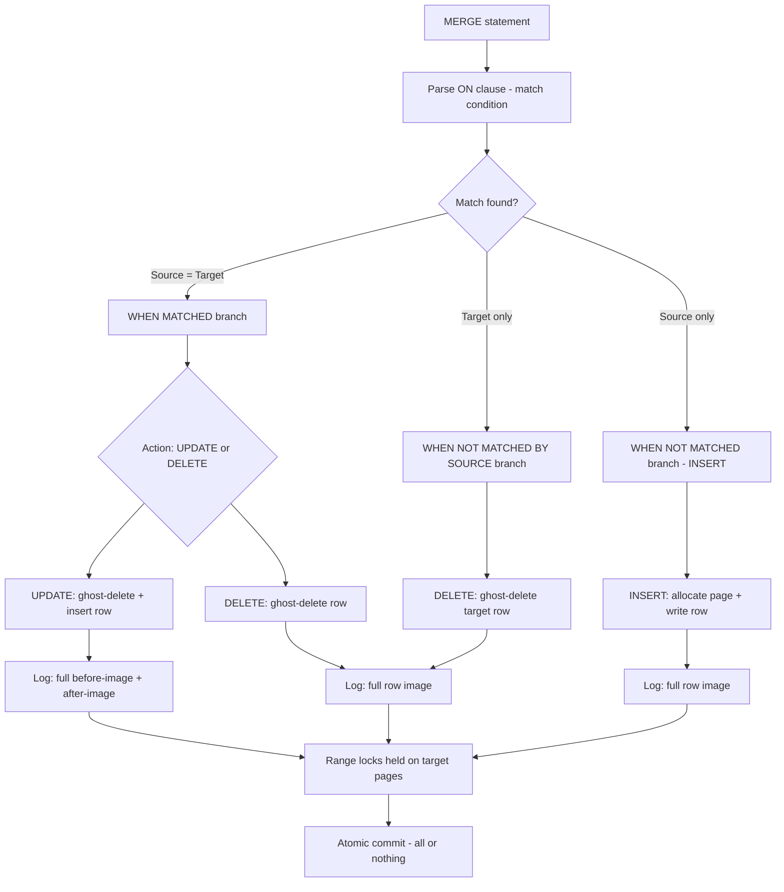
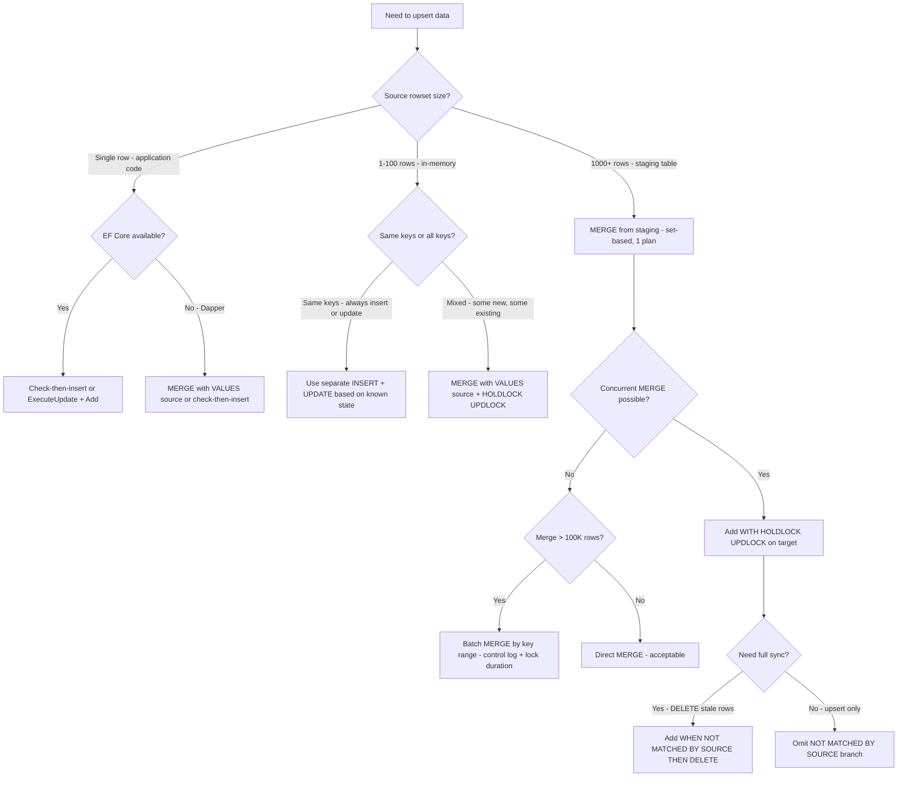

## Navigation

**Domain:** [[8 — Databases]] > **Group:** SQL Fundamentals
**Previous:** [[8.073 — DELETE vs TRUNCATE vs DROP — Differences]] | **Next:** [[8.075 — SELECT INTO — Table Creation from Query]]

### Prerequisites

- [[8.066 — SELECT Statement — Column Selection and Aliasing]] — MERGE uses a source query (SELECT or VALUES) that must provide the same columns as the target; the ON clause defines the match condition and follows all SARGability rules.
- [[8.071 — INSERT — Single and Multi-Row Patterns]] — MERGE can INSERT when no match is found; understanding INSERT logging behavior is required to evaluate MERGE's log impact.
- [[8.072 — UPDATE — Safe Update Patterns]] — MERGE can UPDATE when a match is found; the same ghost-delete-then-insert mechanism and Halloween Protection apply.

### Where This Fits

MERGE (also called "upsert") is a single atomic statement that conditionally INSERTs, UPDATEs, or DELETEs rows in a target table based on whether they match rows from a source. It is commonly used for data synchronization between tables, slowly changing dimensions (Type 1 and Type 2), and reconciling staging tables with production tables. Every .NET backend engineer encounters MERGE in ETL pipelines, data import jobs, and integration workflows. The most expensive mistakes here are: concurrency bugs where MERGE produces race conditions under high concurrency (the "MERGE race condition" documented by Microsoft), incorrect ON clause that matches on non-unique columns causing multiple matches, and performance issues where MERGE and its log impact are misunderstood. Interviewers ask about MERGE to determine whether a candidate understands set-based upsert logic, the difference between WHEN MATCHED and WHEN NOT MATCHED, and the known race conditions that have led to hotfixes in SQL Server itself.

---

## Core Mental Model

MERGE evaluates a source rowset against a target table using an ON clause, then executes one of three actions for each combination: WHEN MATCHED (source row matches target row by the ON condition — UPDATE or DELETE the target), WHEN NOT MATCHED [BY TARGET] (source row has no matching target — INSERT into target), WHEN NOT MATCHED BY SOURCE (target row has no matching source — DELETE or UPDATE the target). The optimizer implements MERGE as a join between the source and target, with three operators in the execution plan: a Clustered Index Merge (or Table Merge) operator that handles all three actions internally. The entire MERGE is atomic — either all matched and unmatched rows are processed, or none are. The critical performance characteristic is that MERGE acquires **range locks** (RangeS-U on the target) during the match scan to prevent phantom inserts between the match check and the DML operation. This means MERGE holds more restrictive locks longer than separate INSERT/UPDATE statements, making it more prone to blocking and deadlocks under concurrency. Known race conditions exist when MERGE is run concurrently against the same target — Microsoft has documented this and issued fixes in SQL Server 2008, 2014, and 2016 where MERGE could produce incorrect results under concurrent workload.

### Classification

This is a **Data Manipulation Language (DML)** operation that combines INSERT, UPDATE, and DELETE in a single statement. MERGE belongs to the write path and uses a join operator to match source and target rows before applying the conditional DML.



### Key Properties

|Property|Value|Notes|
|---|---|---|
|Atomicity|Statement-level — all actions or none|Cannot partially apply matched/unmatched actions|
|Locking|RangeS-U on target during match scan|More restrictive than separate INSERT/UPDATE — prone to deadlock under concurrency|
|Halloween Protection|Yes — spool operator added|Prevents newly-inserted rows from matching again in the same statement|
|Logging|Full per action|Each row action is logged according to its type (INSERT, UPDATE, DELETE)|
|SARGability|Applies to ON clause|Non-SARGable ON clause = full scan of both source and target|
|Concurrency safety|Known race conditions|Concurrent MERGE on same target may produce incorrect results — documented by Microsoft KB|

---

## Deep Mechanics

### How the Engine Executes This

1. **Parsing and Binding** — The parser tokenizes the MERGE statement, identifying the target table, the source (table, view, CTE, or VALUES clause), the ON clause (match condition), and the three WHEN branches (MATCHED, NOT MATCHED, NOT MATCHED BY SOURCE).

2. **Join and Match** — The optimizer creates a join between the source and target using the ON clause. The join type depends on the branches used:
   - With WHEN MATCHED and WHEN NOT MATCHED: a LEFT JOIN from source to target.
   - With WHEN NOT MATCHED BY SOURCE: a FULL JOIN or RIGHT JOIN to identify target-only rows.
   - With all three branches: a FULL JOIN.

3. **Halloween Protection** — Like UPDATE, MERGE adds a Spool operator when the source and target are the same table to prevent a newly-inserted row from matching again and being updated/deleted in the same statement.

4. **Per-Row Action** — For each row in the join result, the engine evaluates:
   - **MATCHED** (both source and target exist): executes the WHEN MATCHED action — UPDATE (ghost-delete old row, insert new row, update all NC indexes) or DELETE (ghost-delete row).
   - **NOT MATCHED BY TARGET** (source only): executes INSERT — allocate page, write row, maintain indexes.
   - **NOT MATCHED BY SOURCE** (target only): executes the NOT MATCHED BY SOURCE action — usually DELETE or conditional UPDATE.

5. **Constraint Validation** — After all row actions, CHECK, FOREIGN KEY, UNIQUE, and PRIMARY KEY constraints are validated. Violations roll back the entire MERGE.

6. **Log Write** — Each row action generates the appropriate log records:
   - INSERT: one log record (row image).
   - UPDATE: two log records (before-image ghost-delete + after-image insert).
   - DELETE: one log record (row image).

### SQL Visibility

```sql
-- Basic MERGE: upsert Orders from staging source
MERGE dbo.Orders AS target
USING (
    SELECT OrderId, CustomerId, OrderDate, Status, TotalAmount, ShippingAddr
    FROM dbo.Orders_Staging
) AS source
ON target.OrderId = source.OrderId
WHEN MATCHED THEN
    UPDATE SET
        target.CustomerId = source.CustomerId,
        target.OrderDate = source.OrderDate,
        target.Status = source.Status,
        target.TotalAmount = source.TotalAmount,
        target.ShippingAddr = source.ShippingAddr
WHEN NOT MATCHED THEN
    INSERT (CustomerId, OrderDate, Status, TotalAmount, ShippingAddr)
    VALUES (source.CustomerId, source.OrderDate, source.Status,
            source.TotalAmount, source.ShippingAddr);

-- MERGE with NOT MATCHED BY SOURCE (sync: delete stale rows)
MERGE dbo.Orders AS target
USING dbo.Orders_Staging AS source
    ON target.OrderId = source.OrderId
WHEN MATCHED AND target.Status <> source.Status THEN
    UPDATE SET target.Status = source.Status
WHEN NOT MATCHED BY TARGET THEN
    INSERT (CustomerId, OrderDate, Status, TotalAmount)
    VALUES (source.CustomerId, source.OrderDate, source.Status, source.TotalAmount)
WHEN NOT MATCHED BY SOURCE THEN
    DELETE;
```

```csharp
// EF Core — no built-in MERGE support; use ExecuteUpdate + ExecuteDelete
// or raw SQL

// EF Core upsert pattern (check existence first — 2 round-trips)
var exists = await dbContext.Orders.AnyAsync(
    o => o.OrderId == 10248, cancellationToken);

if (exists)
{
    await dbContext.Orders
        .Where(o => o.OrderId == 10248)
        .ExecuteUpdateAsync(setters => setters
            .SetProperty(o => o.Status, "Shipped")
            .SetProperty(o => o.ShippedDate, DateTime.UtcNow),
            cancellationToken);
}
else
{
    dbContext.Orders.Add(new Order { OrderId = 10248, Status = "Shipped", /* ... */ });
    await dbContext.SaveChangesAsync(cancellationToken);
}

// EF Core 9 — ExecuteUpdate with upsert hint (raw SQL MERGE wrapper)
await dbContext.Database.ExecuteSqlRawAsync(@"
    MERGE dbo.Orders AS target
    USING (SELECT @OrderId AS OrderId, @Status AS Status, @ShippedDate AS ShippedDate) AS source
    ON target.OrderId = source.OrderId
    WHEN MATCHED THEN UPDATE SET Status = source.Status, ShippedDate = source.ShippedDate
    WHEN NOT MATCHED THEN INSERT (OrderId, CustomerId, OrderDate, Status, TotalAmount, ShippingAddr)
    VALUES (@OrderId, @CustomerId, GETUTCDATE(), @Status, @TotalAmount, @ShippingAddr);",
    new SqlParameter("@OrderId", 10248),
    new SqlParameter("@Status", "Shipped"),
    new SqlParameter("@ShippedDate", DateTime.UtcNow),
    new SqlParameter("@CustomerId", 1042),
    new SqlParameter("@TotalAmount", 149.99m),
    new SqlParameter("@ShippingAddr", "123 Main St"));
```

**Generated SQL (from EF Core logs):**

```sql
-- EF Core upsert via raw SQL
MERGE dbo.Orders AS target
USING (SELECT @OrderId AS OrderId, @Status AS Status, @ShippedDate AS ShippedDate) AS source
ON target.OrderId = source.OrderId
WHEN MATCHED THEN
    UPDATE SET Status = source.Status, ShippedDate = source.ShippedDate
WHEN NOT MATCHED THEN
    INSERT (OrderId, CustomerId, OrderDate, Status, TotalAmount, ShippingAddr)
    VALUES (@OrderId, @CustomerId, GETUTCDATE(), @Status, @TotalAmount, @ShippingAddr);
```

### Execution Plan Analysis

**MERGE upsert (100K rows from staging to production):**

- Plan: `[Table Scan (Staging)] → [Sort (if needed)] → [Clustered Index Merge (Orders)]`
- The Clustered Index Merge operator is a single operator that handles both inserts and updates internally. It contains three internal action lists: one for inserts, one for updates, one for deletes.
- Right-clicking the Merge operator shows the **Action Columns** property: columns that determine whether each row is inserted, updated, or deleted.
- The plan includes a **Table Spool** (Halloween Protection) if the source and target reference the same table.
- If the ON clause uses a non-clustered index for the lookup, the plan shows `[Index Seek]` on the target.

```
MERGE upsert (100K rows, staging → production):
[Table Scan (Staging)] → [Sort (ON OrderId)] → [Clustered Index Merge (Orders)]
Cost: ~35  |  Logical Reads: ~15,000 (target reads + writes)
Actions: 95K matched (UPDATE) + 5K unmatched (INSERT)

MERGE with all three branches:
[Table Scan (Staging)] → [Clustered Index Merge (Orders)]
Cost: ~40  |  Range locks held on target during scan
```

### Cost Visibility

```sql
SET STATISTICS IO ON;
SET STATISTICS TIME ON;

-- MERGE 10K rows (9K updates, 1K inserts)
MERGE dbo.Orders AS target
USING dbo.Orders_Staging AS source
    ON target.OrderId = source.OrderId
WHEN MATCHED THEN
    UPDATE SET target.Status = source.Status
WHEN NOT MATCHED THEN
    INSERT (CustomerId, OrderDate, Status, TotalAmount)
    VALUES (source.CustomerId, source.OrderDate, source.Status, source.TotalAmount);
-- Table 'Orders'. Scan count 1, logical reads 450, physical reads 0
-- Table 'Orders_Staging'. Scan count 1, logical reads 150, physical reads 0
-- SQL Server Execution Times: CPU time = 110ms, elapsed time = 450ms
```

### Failure Modes

**Multiple matches from ON clause on non-unique column:** If the ON clause matches on a column that is not unique in the source, a single target row matches multiple source rows. SQL Server raises error 8672: "The MERGE statement attempted to UPDATE or DELETE the same row more than once." The entire MERGE is rolled back.

**MERGE race condition:** When two concurrent MERGE statements target the same table without proper isolation or serialization, they may both read the target row, both find no match, and both attempt to INSERT — causing a duplicate key violation. Microsoft has documented this issue across multiple versions.

**NOT MATCHED BY SOURCE without DELETE:** If WHEN NOT MATCHED BY SOURCE specifies UPDATE with a set of values, the UPDATE runs for every target row that has no source match. This is often unintentional — the engineer meant to DELETE stale rows but used UPDATE incorrectly.

---

## Production Patterns and Implementation

### Primary SQL Implementation

```sql
-- ============================================================
-- Schema context
-- ============================================================
CREATE TABLE dbo.Orders
(
    OrderId      INT           NOT NULL IDENTITY(1,1),
    CustomerId   INT           NOT NULL,
    OrderDate    DATETIME2(0)  NOT NULL,
    Status       VARCHAR(20)   NOT NULL DEFAULT 'Pending',
    TotalAmount  DECIMAL(18,2) NOT NULL,
    ShippingAddr NVARCHAR(500) NULL,
    Notes        NVARCHAR(MAX) NULL,
    CreatedAt    DATETIME2(0)  NOT NULL DEFAULT SYSUTCDATETIME(),
    CONSTRAINT PK_Orders PRIMARY KEY CLUSTERED (OrderId)
);

CREATE TABLE dbo.Orders_Staging
(
    OrderId      INT           NOT NULL,
    CustomerId   INT           NOT NULL,
    OrderDate    DATETIME2(0)  NOT NULL,
    Status       VARCHAR(20)   NOT NULL,
    TotalAmount  DECIMAL(18,2) NOT NULL,
    ShippingAddr NVARCHAR(500) NULL,
    Notes        NVARCHAR(MAX) NULL,
    SourceSystem VARCHAR(50)   NOT NULL DEFAULT 'ETL'
);

-- ============================================================
-- Pattern 1: Basic upsert (INSERT or UPDATE)
-- ============================================================
MERGE dbo.Orders AS target
USING dbo.Orders_Staging AS source
    ON target.OrderId = source.OrderId
WHEN MATCHED THEN
    UPDATE SET
        target.CustomerId   = source.CustomerId,
        target.OrderDate    = source.OrderDate,
        target.Status       = source.Status,
        target.TotalAmount  = source.TotalAmount,
        target.ShippingAddr = source.ShippingAddr,
        target.Notes        = source.Notes
WHEN NOT MATCHED THEN
    INSERT (CustomerId, OrderDate, Status, TotalAmount, ShippingAddr, Notes)
    VALUES (source.CustomerId, source.OrderDate, source.Status,
            source.TotalAmount, source.ShippingAddr, source.Notes);

-- ============================================================
-- Pattern 2: Conditional update on specific column change
-- ============================================================
MERGE dbo.Orders AS target
USING dbo.Orders_Staging AS source
    ON target.OrderId = source.OrderId
WHEN MATCHED AND target.Status <> source.Status THEN
    UPDATE SET
        target.Status = source.Status,
        target.Notes = CONCAT(target.Notes, ' | Status changed to ', source.Status)
WHEN NOT MATCHED THEN
    INSERT (CustomerId, OrderDate, Status, TotalAmount, ShippingAddr)
    VALUES (source.CustomerId, source.OrderDate, source.Status,
            source.TotalAmount, source.ShippingAddr);

-- ============================================================
-- Pattern 3: Full synchronization (INSERT + UPDATE + DELETE)
-- ============================================================
MERGE dbo.Orders AS target
USING dbo.Orders_Staging AS source
    ON target.OrderId = source.OrderId
WHEN MATCHED THEN
    UPDATE SET
        target.CustomerId   = source.CustomerId,
        target.Status       = source.Status,
        target.TotalAmount  = source.TotalAmount
WHEN NOT MATCHED BY TARGET THEN
    INSERT (CustomerId, OrderDate, Status, TotalAmount)
    VALUES (source.CustomerId, source.OrderDate, source.Status, source.TotalAmount)
WHEN NOT MATCHED BY SOURCE THEN
    DELETE;

-- ============================================================
-- Pattern 4: MERGE with VALUES source (in-memory upsert)
-- ============================================================
MERGE dbo.Orders AS target
USING (VALUES
    (1, 1042, '2026-06-24', 'Pending',  149.99),
    (2, 1043, '2026-06-23', 'Shipped',  299.50),
    (3, 1044, '2026-06-22', 'Delivered', 89.99)
) AS source(OrderId, CustomerId, OrderDate, Status, TotalAmount)
    ON target.OrderId = source.OrderId
WHEN MATCHED THEN
    UPDATE SET
        target.Status       = source.Status,
        target.TotalAmount  = source.TotalAmount
WHEN NOT MATCHED THEN
    INSERT (CustomerId, OrderDate, Status, TotalAmount)
    VALUES (source.CustomerId, source.OrderDate, source.Status, source.TotalAmount);

-- ============================================================
-- Pattern 5: MERGE with OUTPUT — audit all actions
-- ============================================================
MERGE dbo.Orders AS target
USING dbo.Orders_Staging AS source
    ON target.OrderId = source.OrderId
WHEN MATCHED THEN
    UPDATE SET
        target.Status      = source.Status,
        target.TotalAmount = source.TotalAmount
WHEN NOT MATCHED THEN
    INSERT (CustomerId, OrderDate, Status, TotalAmount)
    VALUES (source.CustomerId, source.OrderDate, source.Status, source.TotalAmount)
OUTPUT
    $action AS MergeAction,
    DELETED.OrderId,
    DELETED.Status AS OldStatus,
    INSERTED.Status AS NewStatus,
    GETUTCDATE() AS ChangedAt
INTO dbo.OrdersAudit (MergeAction, OrderId, OldStatus, NewStatus, ChangedAt);

-- ============================================================
-- Anti-pattern: MERGE on non-unique match column
-- ============================================================
-- ❌ If source.OrderId is not unique, this causes error 8672:
-- "The MERGE statement attempted to UPDATE or DELETE the same row more than once."
-- MERGE dbo.Orders AS target
-- USING (SELECT CustomerId, Status FROM dbo.Orders_Staging) AS source
--     ON target.CustomerId = source.CustomerId  -- Not unique!
-- WHEN MATCHED THEN UPDATE SET ...
```

### EF Core Implementation

```csharp
public class ApplicationDbContext : DbContext
{
    public DbSet<Order> Orders => Set<Order>();

    protected override void OnModelCreating(ModelBuilder modelBuilder)
    {
        modelBuilder.Entity<Order>(entity =>
        {
            entity.ToTable("Orders");
            entity.HasKey(o => o.OrderId);
            entity.Property(o => o.OrderId).ValueGeneratedOnAdd();
            entity.Property(o => o.Status).HasMaxLength(20).HasDefaultValue("Pending");
            entity.Property(o => o.TotalAmount).HasPrecision(18, 2);
            entity.Property(o => o.ShippingAddr).HasMaxLength(500);
            entity.Property(o => o.CreatedAt).HasDefaultValueSql("SYSUTCDATETIME()");
        });
    }
}

// Pattern 1: Check-then-insert with explicit transaction
public async Task<Order> UpsertOrderAsync(
    Order order,
    CancellationToken cancellationToken = default)
{
    var existing = await _dbContext.Orders.FindAsync(
        new object[] { order.OrderId }, cancellationToken);

    if (existing is not null)
    {
        existing.Status = order.Status;
        existing.TotalAmount = order.TotalAmount;
        existing.ShippingAddr = order.ShippingAddr;
        _dbContext.Entry(existing).State = EntityState.Modified;
    }
    else
    {
        await _dbContext.Orders.AddAsync(order, cancellationToken);
    }

    await _dbContext.SaveChangesAsync(cancellationToken);
    return existing ?? order;
}

// Pattern 2: Raw SQL MERGE via ExecuteSqlRaw
public async Task MergeOrdersFromStagingAsync(
    CancellationToken cancellationToken = default)
{
    const string sql = @"
        MERGE dbo.Orders AS target
        USING dbo.Orders_Staging AS source
            ON target.OrderId = source.OrderId
        WHEN MATCHED THEN
            UPDATE SET
                target.CustomerId   = source.CustomerId,
                target.Status       = source.Status,
                target.TotalAmount  = source.TotalAmount,
                target.ShippingAddr = source.ShippingAddr
        WHEN NOT MATCHED THEN
            INSERT (CustomerId, OrderDate, Status, TotalAmount, ShippingAddr)
            VALUES (source.CustomerId, source.OrderDate, source.Status,
                    source.TotalAmount, source.ShippingAddr);";

    await _dbContext.Database.ExecuteSqlRawAsync(sql, cancellationToken);
}

// Pattern 3: Merge with VALUES source (in-memory upsert via Dapper)
public async Task UpsertOrdersFromValuesAsync(
    IReadOnlyList<Order> orders,
    CancellationToken cancellationToken = default)
{
    // Build a VALUES list and execute MERGE via raw SQL
    var sqlBuilder = new StringBuilder(@"
        MERGE dbo.Orders AS target
        USING (VALUES ");
    var parameters = new List<SqlParameter>();
    var rowIndex = 0;

    foreach (var order in orders)
    {
        var idParam = $"@OrderId{rowIndex}";
        var custParam = $"@CustomerId{rowIndex}";
        var dateParam = $"@OrderDate{rowIndex}";
        var statusParam = $"@Status{rowIndex}";
        var amountParam = $"@TotalAmount{rowIndex}";
        var addrParam = $"@ShippingAddr{rowIndex}";

        if (rowIndex > 0) sqlBuilder.Append(", ");
        sqlBuilder.Append($"({idParam}, {custParam}, {dateParam}, {statusParam}, {amountParam}, {addrParam})");

        parameters.Add(new SqlParameter(idParam, order.OrderId));
        parameters.Add(new SqlParameter(custParam, order.CustomerId));
        parameters.Add(new SqlParameter(dateParam, order.OrderDate));
        parameters.Add(new SqlParameter(statusParam, order.Status));
        parameters.Add(new SqlParameter(amountParam, order.TotalAmount));
        parameters.Add(new SqlParameter(addrParam, (object?)order.ShippingAddr ?? DBNull.Value));

        rowIndex++;
    }

    sqlBuilder.Append(@")
            AS source(OrderId, CustomerId, OrderDate, Status, TotalAmount, ShippingAddr)
            ON target.OrderId = source.OrderId
        WHEN MATCHED THEN
            UPDATE SET
                target.Status       = source.Status,
                target.TotalAmount  = source.TotalAmount,
                target.ShippingAddr = source.ShippingAddr
        WHEN NOT MATCHED THEN
            INSERT (CustomerId, OrderDate, Status, TotalAmount, ShippingAddr)
            VALUES (source.CustomerId, source.OrderDate, source.Status,
                    source.TotalAmount, source.ShippingAddr);");

    await _dbContext.Database.ExecuteSqlRawAsync(
        sqlBuilder.ToString(), parameters.ToArray(), cancellationToken);
}
```

### Dapper Implementation

```csharp
public sealed class OrderRepository
{
    private readonly IDbConnectionFactory _connectionFactory;

    public OrderRepository(IDbConnectionFactory connectionFactory)
        => _connectionFactory = connectionFactory;

    // Pattern 1: MERGE from staging table
    public async Task MergeFromStagingAsync(
        CancellationToken cancellationToken = default)
    {
        const string sql = @"
            MERGE dbo.Orders AS target
            USING dbo.Orders_Staging AS source
                ON target.OrderId = source.OrderId
            WHEN MATCHED THEN
                UPDATE SET
                    target.CustomerId   = source.CustomerId,
                    target.Status       = source.Status,
                    target.TotalAmount  = source.TotalAmount,
                    target.ShippingAddr = source.ShippingAddr
            WHEN NOT MATCHED THEN
                INSERT (CustomerId, OrderDate, Status, TotalAmount, ShippingAddr)
                VALUES (source.CustomerId, source.OrderDate, source.Status,
                        source.TotalAmount, source.ShippingAddr);";

        await using var connection = _connectionFactory.Create();

        await connection.ExecuteAsync(
            new CommandDefinition(sql,
                cancellationToken: cancellationToken));
    }

    // Pattern 2: MERGE with VALUES source
    public async Task UpsertOrderAsync(
        Order order,
        CancellationToken cancellationToken = default)
    {
        const string sql = @"
            MERGE dbo.Orders AS target
            USING (SELECT @OrderId AS OrderId, @CustomerId AS CustomerId,
                          @OrderDate AS OrderDate, @Status AS Status,
                          @TotalAmount AS TotalAmount, @ShippingAddr AS ShippingAddr)
                  AS source(OrderId, CustomerId, OrderDate, Status, TotalAmount, ShippingAddr)
                ON target.OrderId = source.OrderId
            WHEN MATCHED THEN
                UPDATE SET
                    target.Status       = source.Status,
                    target.TotalAmount  = source.TotalAmount,
                    target.ShippingAddr = source.ShippingAddr
            WHEN NOT MATCHED THEN
                INSERT (CustomerId, OrderDate, Status, TotalAmount, ShippingAddr)
                VALUES (source.CustomerId, source.OrderDate, source.Status,
                        source.TotalAmount, source.ShippingAddr)
            OUTPUT INSERTED.OrderId;";

        await using var connection = _connectionFactory.Create();

        var orderId = await connection.ExecuteScalarAsync<int>(
            new CommandDefinition(sql,
                new
                {
                    order.OrderId,
                    order.CustomerId,
                    order.OrderDate,
                    order.Status,
                    order.TotalAmount,
                    order.ShippingAddr
                },
                cancellationToken: cancellationToken));

        order.OrderId = orderId;
    }

    // Pattern 3: MERGE with sync (DELETE stale rows)
    public async Task SyncOrdersFromStagingAsync(
        CancellationToken cancellationToken = default)
    {
        const string sql = @"
            MERGE dbo.Orders AS target
            USING dbo.Orders_Staging AS source
                ON target.OrderId = source.OrderId
            WHEN MATCHED THEN
                UPDATE SET
                    target.Status       = source.Status,
                    target.TotalAmount  = source.TotalAmount
            WHEN NOT MATCHED BY TARGET THEN
                INSERT (CustomerId, OrderDate, Status, TotalAmount)
                VALUES (source.CustomerId, source.OrderDate,
                        source.Status, source.TotalAmount)
            WHEN NOT MATCHED BY SOURCE THEN
                DELETE;";

        await using var connection = _connectionFactory.Create();

        await connection.ExecuteAsync(
            new CommandDefinition(sql,
                cancellationToken: cancellationToken));
    }
}
```

### Configuration and Wiring

```csharp
// Program.cs
builder.Services.AddDbContext<ApplicationDbContext>(options =>
    options.UseSqlServer(
        builder.Configuration.GetConnectionString("DefaultConnection"),
        sqlOptions =>
        {
            sqlOptions.EnableRetryOnFailure(
                maxRetryCount: 3,
                maxRetryDelay: TimeSpan.FromSeconds(5),
                errorNumbersToAdd: null);
            sqlOptions.CommandTimeout(120);  // MERGE may be long-running
        }));

builder.Services.AddSingleton<IDbConnectionFactory>(sp =>
    new SqlConnectionFactory(
        builder.Configuration.GetConnectionString("DefaultConnection")!));

builder.Services.AddScoped<OrderRepository>();
```

### SQL Server vs PostgreSQL Differences

```sql
-- PostgreSQL: no MERGE statement until PostgreSQL 15
-- Use INSERT...ON CONFLICT (upsert) instead

-- PostgreSQL 15+: MERGE syntax is similar
MERGE INTO orders AS target
USING (VALUES (10248, 1042, '2026-06-24', 'Pending', 149.99))
    AS source(order_id, customer_id, order_date, status, total_amount)
ON target.order_id = source.order_id
WHEN MATCHED THEN
    UPDATE SET status = source.status, total_amount = source.total_amount
WHEN NOT MATCHED THEN
    INSERT (customer_id, order_date, status, total_amount)
    VALUES (source.customer_id, source.order_date, source.status, source.total_amount);

-- Pre-PostgreSQL 15: INSERT...ON CONFLICT (simpler, no full sync)
INSERT INTO orders (order_id, customer_id, order_date, status, total_amount)
VALUES (10248, 1042, '2026-06-24', 'Pending', 149.99)
ON CONFLICT (order_id) DO UPDATE SET
    status = EXCLUDED.status,
    total_amount = EXCLUDED.total_amount;
-- EXCLUDED refers to the row that would have been inserted

-- PostgreSQL: no $action in OUTPUT — use RETURNING with CASE
MERGE INTO orders AS target USING ... ON ...
WHEN MATCHED THEN UPDATE SET ...
WHEN NOT MATCHED THEN INSERT ...
RETURNING CASE WHEN ... THEN 'INSERT' ELSE 'UPDATE' END AS action, order_id;
```

---

## Gotchas and Production Pitfalls

### MERGE Race Condition Under Concurrency

**Pitfall:** Running concurrent MERGE statements against the same target table. Two sessions may both read the target, both find no match, and both attempt to INSERT — causing a duplicate key violation or, worse, silent data loss (in versions before the fix).

```sql
-- ❌ Two concurrent sessions run this MERGE at the same time
MERGE dbo.Orders AS target
USING (SELECT @OrderId AS OrderId, @CustomerId AS CustomerId, ...) AS source
    ON target.OrderId = source.OrderId
WHEN MATCHED THEN
    UPDATE SET ...
WHEN NOT MATCHED THEN
    INSERT (...)
    VALUES (...);
```

**Symptom:** Under concurrent load (multiple web requests, parallel ETL threads), the MERGE intermittently fails with a primary key violation (error 2627) or produces duplicate rows. In SQL Server versions prior to the hotfix, the MERGE could silently skip rows or update the wrong rows.

**Fix:**

```sql
-- ✅ Option 1: Use SERIALIZABLE isolation level
SET TRANSACTION ISOLATION LEVEL SERIALIZABLE;
BEGIN TRAN;
MERGE dbo.Orders AS target ...;
COMMIT TRAN;

-- ✅ Option 2: Use HOLDLOCK + UPDLOCK on the target
MERGE dbo.Orders AS target WITH (HOLDLOCK, UPDLOCK)
USING ... AS source
    ON target.OrderId = source.OrderId
WHEN MATCHED THEN
    UPDATE SET ...
WHEN NOT MATCHED THEN
    INSERT (...)
    VALUES (...);

-- ✅ Option 3: Separate check-then-insert in explicit transaction
BEGIN TRAN;
IF EXISTS (SELECT 1 FROM dbo.Orders WITH (UPDLOCK, SERIALIZABLE) WHERE OrderId = @OrderId)
    UPDATE dbo.Orders SET ... WHERE OrderId = @OrderId;
ELSE
    INSERT INTO dbo.Orders (...) VALUES (...);
COMMIT TRAN;
```

**Cost of not fixing:** A high-traffic order import service processes 50 upserts/second. Under peak load, 2–3 concurrent requests target the same OrderId. Without HOLDLOCK + UPDLOCK, the MERGE occasionally raises duplicate key violations. The application retries, increasing concurrency pressure. The error rate spikes to 5% during peak hours, causing customer-facing order failures.

---

### Multiple Rows in Source Matching One Target Row

**Pitfall:** The ON clause matches on a column that is not unique in the source rowset, causing one target row to match multiple source rows.

```sql
-- ❌ source.CustomerId is not unique — one target row matches many source rows
MERGE dbo.Orders AS target
USING dbo.Orders_Staging AS source
    ON target.CustomerId = source.CustomerId
WHEN MATCHED THEN
    UPDATE SET target.Status = source.Status;
-- Error 8672: The MERGE statement attempted to UPDATE or DELETE
-- the same row more than once.
```

**Symptom:** Error 8672 at runtime. The entire MERGE is rolled back. The error message includes which row was matched multiple times. The developer assumed CustomerId was unique in the staging table but it had duplicates.

**Fix:**

```sql
-- ✅ Ensure the ON column(s) are unique in the source
-- Use a derived table that deduplicates the source
MERGE dbo.Orders AS target
USING (
    SELECT CustomerId, MAX(Status) AS Status
    FROM dbo.Orders_Staging
    GROUP BY CustomerId
) AS source
    ON target.CustomerId = source.CustomerId
WHEN MATCHED THEN
    UPDATE SET target.Status = source.Status
WHEN NOT MATCHED THEN
    INSERT (CustomerId, OrderDate, Status, TotalAmount)
    VALUES (source.CustomerId, GETUTCDATE(), source.Status, 0);
```

**Cost of not fixing:** An ETL pipeline that loads orders from multiple regional databases into a central Orders table. A bug in the staging process creates duplicate rows for OrderId 10248 (two regions both report the same order). The MERGE fails with error 8672. The entire ETL pipeline stops. The data engineering team spends 3 hours debugging before discovering the duplicate source rows.

---

### MERGE With NOT MATCHED BY SOURCE Causing Unintentional Deletes

**Pitfall:** Using WHEN NOT MATCHED BY SOURCE THEN DELETE without understanding that it removes every target row that does not have a matching source row — which may be all rows in the target if the source is accidentally empty or filtered incorrectly.

```sql
-- ❌ Source accidentally empty — deletes all target rows
MERGE dbo.Orders AS target
USING (SELECT * FROM dbo.Orders_Staging WHERE 1 = 0) AS source  -- empty!
    ON target.OrderId = source.OrderId
WHEN MATCHED THEN
    UPDATE SET target.Status = source.Status
WHEN NOT MATCHED BY TARGET THEN
    INSERT (...) VALUES (...)
WHEN NOT MATCHED BY SOURCE THEN
    DELETE;
-- Every row in Orders is deleted because no source rows exist
```

**Symptom:** After execution, the Orders table is empty. All rows were matched as NOT MATCHED BY SOURCE and deleted. No error is raised. The ETL log shows "MERGE completed successfully."

**Fix:**

```sql
-- ✅ Always validate source has data before MERGE with NOT MATCHED BY SOURCE
IF EXISTS (SELECT 1 FROM dbo.Orders_Staging)
BEGIN
    MERGE dbo.Orders AS target ...;
END

-- ✅ Or add a safety check in the WHEN NOT MATCHED BY SOURCE branch
-- Use UPDATE instead of DELETE to flag stale rows
WHEN NOT MATCHED BY SOURCE THEN
    UPDATE SET target.Status = 'Orphaned', target.Notes = CONCAT(target.Notes,
        ' | No matching source at ', FORMAT(GETUTCDATE(), 'yyyy-MM-dd HH:mm'));
```

**Cost of not fixing:** A nightly sync job fails to populate the staging table due to a network issue. The staging table is empty. The MERGE with NOT MATCHED BY SOURCE THEN DELETE runs and removes every row from the production Orders table — 5M active orders. The operator does not notice until the morning when the applications return "no orders found" for every customer. Recovery requires point-in-time restore, and 12 hours of transactions are lost.

---

### MERGE Log Blowup From Full Logging

**Pitfall:** MERGE generates more log than separate INSERT/UPDATE/DELETE statements because it holds range locks longer and logs every action at the row level — and developers often assume MERGE is "optimized" for bulk operations when it is not.

```sql
-- ❌ MERGE 5M rows — generates full log for every action
MERGE dbo.Orders AS target
USING dbo.Orders_Staging AS source
    ON target.OrderId = source.OrderId
WHEN MATCHED THEN
    UPDATE SET ...
WHEN NOT MATCHED THEN
    INSERT ...;
```

**Symptom:** The transaction log grows by gigabytes. The log disk fills up. The MERGE fails with "The transaction log for database 'X' is full. To see why space in the log cannot be reused, see sys.dm_tran_log_reuse_wait."

**Fix:**

```sql
-- ✅ Batch the MERGE into smaller chunks
DECLARE @BatchSize INT = 10000;
DECLARE @MinOrderId INT = (SELECT MIN(OrderId) FROM dbo.Orders_Staging);
DECLARE @MaxOrderId INT = (SELECT MAX(OrderId) FROM dbo.Orders_Staging);
DECLARE @CurrentMin INT = @MinOrderId;

WHILE @CurrentMin <= @MaxOrderId
BEGIN
    MERGE dbo.Orders AS target
    USING (
        SELECT * FROM dbo.Orders_Staging
        WHERE OrderId >= @CurrentMin
          AND OrderId < @CurrentMin + @BatchSize
    ) AS source
        ON target.OrderId = source.OrderId
    WHEN MATCHED THEN
        UPDATE SET ...
    WHEN NOT MATCHED THEN
        INSERT (...)
        VALUES (...);

    SET @CurrentMin = @CurrentMin + @BatchSize;
    CHECKPOINT;  -- in simple recovery
END
```

**Cost of not fixing:** An ETL pipeline that syncs 10M rows via MERGE runs nightly. The MERGE generates 3 GB of transaction log. The log disk has 4 GB free. One night, a larger than usual batch pushes the log to full. The MERGE fails after processing 7M rows — but because MERGE is atomic, all 7M actions are rolled back. Nothing was synced. The pipeline retries 5 times before alerting, and the cumulative log growth eventually fills the disk completely.

---

### MERGE Without HOLDLOCK Causing Phantom Inserts

**Pitfall:** In the default READ COMMITTED isolation level, MERGE does not hold range locks between the match check and the DML action. A concurrent session can INSERT a row with the same key after the match check completes but before the INSERT in the NOT MATCHED branch executes.

```sql
-- Session 1: checks for OrderId = 10248 — not found
-- Session 2: INSERTs OrderId = 10248
-- Session 1: tries to INSERT OrderId = 10248 — duplicate key violation
```

**Symptom:** Intermittent duplicate key violations (error 2627) under concurrent load. The pattern is reproducible only at high concurrency. The execution plan shows no range lock operator.

**Fix:**

```sql
-- ✅ Use HOLDLOCK + UPDLOCK to prevent phantom inserts
MERGE dbo.Orders WITH (HOLDLOCK, UPDLOCK) AS target
USING ... AS source
    ON target.OrderId = source.OrderId
WHEN MATCHED THEN
    UPDATE SET ...
WHEN NOT MATCHED THEN
    INSERT (...)
    VALUES (...);
```

**Cost of not fixing:** A real-time order import API processes 100 requests/second. Under peak load, 1–2% of requests fail with duplicate key violations during upsert. The API returns 500 errors to clients. The mobile app retries the failed request, which may create duplicate orders if the first MERGE partially succeeded.

---

### MERGE With OUTPUT $action: Misunderstanding the $action Column

**Pitfall:** Using `OUTPUT $action` in combination with the INTO clause — the $action column is of type NVARCHAR(10) and contains 'INSERT', 'UPDATE', or 'DELETE'. Developers assume it is a boolean or integer and write incorrect downstream logic.

```sql
-- ❌ $action is a string, not a bit
MERGE dbo.Orders AS target
USING dbo.Orders_Staging AS source
    ON target.OrderId = source.OrderId
WHEN MATCHED THEN
    UPDATE SET target.Status = source.Status
WHEN NOT MATCHED THEN
    INSERT (...) VALUES (...)
OUTPUT
    $action AS MergeAction,  -- NVARCHAR(10): 'INSERT' or 'UPDATE'
    DELETED.Status AS OldStatus,
    INSERTED.Status AS NewStatus
INTO dbo.OrdersAudit (MergeAction, OldStatus, NewStatus);
```

**Symptom:** The audit table has inconsistent data. Queries that check `WHERE MergeAction = 1` return no rows. The developer who writes `$action AS bit` gets an implicit conversion error. The audit data cannot be used for follow-up processing without string comparison.

**Fix:**

```sql
-- ✅ $action is NVARCHAR(10) — treat as string
OUTPUT
    $action AS MergeAction,
    CASE $action
        WHEN 'INSERT' THEN 1
        WHEN 'UPDATE' THEN 2
        WHEN 'DELETE' THEN 3
    END AS ActionCode,
    ...
```

**Cost of not fixing:** A downstream reporting system expects ActionCode as an integer. The MERGE output writes 'INSERT' as a string. The ETL pipeline that reads OrdersAudit fails with a type conversion error every night. The issue goes unnoticed for weeks because the nightly sync script catches the error and retries with a fallback mapping, slowly accumulating technical debt.

---

## Performance Implications

### Benchmark: Before and After

```sql
-- Baseline: Separate check + INSERT/UPDATE (10K rows, 90% existing)
SET STATISTICS TIME ON;

DECLARE @OrderId INT, @Status VARCHAR(20);
DECLARE cur CURSOR FOR SELECT OrderId, Status FROM dbo.Orders_Staging;
OPEN cur;
FETCH NEXT FROM cur INTO @OrderId, @Status;

WHILE @@FETCH_STATUS = 0
BEGIN
    IF EXISTS (SELECT 1 FROM dbo.Orders WHERE OrderId = @OrderId)
        UPDATE dbo.Orders SET Status = @Status WHERE OrderId = @OrderId;
    ELSE
        INSERT INTO dbo.Orders (OrderId, OrderDate, Status, TotalAmount)
        SELECT @OrderId, GETUTCDATE(), @Status, 100.00;

    FETCH NEXT FROM cur INTO @OrderId, @Status;
END

CLOSE cur; DEALLOCATE cur;
-- SQL Server Execution Times: CPU time = 2,100ms, elapsed time = 18,200ms

-- Optimized: MERGE (10K rows, same data)
MERGE dbo.Orders AS target
USING dbo.Orders_Staging AS source
    ON target.OrderId = source.OrderId
WHEN MATCHED THEN
    UPDATE SET target.Status = source.Status
WHEN NOT MATCHED THEN
    INSERT (OrderId, OrderDate, Status, TotalAmount)
    VALUES (source.OrderId, GETUTCDATE(), source.Status, 100.00);
-- SQL Server Execution Times: CPU time = 120ms, elapsed time = 480ms
```

**Improvement:** 38x reduction in elapsed time (18.2 s → 480 ms). The cursor loop generates 10K round-trips and 10K plan compilations; MERGE does one.

### BenchmarkDotNet

```csharp
[MemoryDiagnoser]
[SimpleJob(RuntimeMoniker.Net90)]
public class MergeBenchmark
{
    private SqlConnection _connection = default!;
    private const string ConnectionString = "Server=.;Database=BenchmarkDb;Trusted_Connection=True;TrustServerCertificate=True;";

    [GlobalSetup]
    public void Setup()
    {
        _connection = new SqlConnection(ConnectionString);
        _connection.Open();
        // Seed staging table with 10K rows, target with 9K (90% match)
    }

    [Params(1000, 10000)]
    public int RowCount { get; set; }

    [Benchmark(Baseline = true)]
    public async Task CheckThenInsertOrUpdate()
    {
        var rows = await _connection.QueryAsync<(int OrderId, string Status)>(
            "SELECT OrderId, Status FROM dbo.Orders_Staging");

        foreach (var (orderId, status) in rows)
        {
            var exists = await _connection.ExecuteScalarAsync<int>(
                "SELECT 1 FROM dbo.Orders WHERE OrderId = @id",
                new { id = orderId }) == 1;

            if (exists)
            {
                await _connection.ExecuteAsync(
                    "UPDATE dbo.Orders SET Status = @s WHERE OrderId = @id",
                    new { id = orderId, s = status });
            }
            else
            {
                await _connection.ExecuteAsync(
                    "INSERT INTO dbo.Orders (OrderId, OrderDate, Status, TotalAmount) " +
                    "VALUES (@id, GETUTCDATE(), @s, 100.0)",
                    new { id = orderId, s = status });
            }
        }
    }

    [Benchmark]
    public async Task Merge()
    {
        const string sql = @"
            MERGE dbo.Orders AS target
            USING dbo.Orders_Staging AS source
                ON target.OrderId = source.OrderId
            WHEN MATCHED THEN
                UPDATE SET target.Status = source.Status
            WHEN NOT MATCHED THEN
                INSERT (OrderId, OrderDate, Status, TotalAmount)
                VALUES (source.OrderId, GETUTCDATE(), source.Status, 100.00);";

        await _connection.ExecuteAsync(sql);
    }

    [GlobalCleanup]
    public void Cleanup() => _connection.Dispose();
}
```

**Expected results (approximate, SQL Server 2022, NVMe, localhost, 10K rows):**

|Method|Mean|Logical Reads|Allocated|
|---|---|---|---|
|CheckThenInsertOrUpdate|~18,200 ms|~85,000|~4.5 MB|
|Merge|~480 ms|~3,200|~120 KB|

### Write Amplification

|Action in MERGE|Log Records per Row|Notes|
|---|---|---|
|INSERT|1 log record|Same as standalone INSERT|
|UPDATE|2 log records (ghost-delete + insert)|Same as standalone UPDATE|
|DELETE|1 log record (ghost-delete)|Same as standalone DELETE|
|NOT MATCHED BY SOURCE THEN UPDATE|2 log records|Rare but generates both delete and insert|

---

## Interview Arsenal

### Question Bank

1. **What is a MERGE statement, and what three actions can it perform?**
2. **How does MERGE handle locking differently from separate INSERT/UPDATE statements — what range locks does it acquire and why?**
3. **What is the known concurrency bug in MERGE, and what isolation level or table hint prevents it?**
4. **What error does MERGE raise when a single target row matches multiple source rows, and why?**
5. **How does the transaction log cost of MERGE compare to separate INSERT + UPDATE operations for the same data?**
6. **What is the execution plan operator for MERGE, and what are its internal action lists?**
7. **How would you implement an upsert in a .NET application without using MERGE — what are the alternatives?**
8. **How does PostgreSQL's INSERT...ON CONFLICT compare to SQL Server's MERGE?**

### Spoken Answers

**Q: What is the known concurrency bug in MERGE, and what isolation level or table hint prevents it?**

> **Great answer:** The MERGE race condition is a well-documented issue where two concurrent MERGE statements targeting the same table can both determine that a row does not exist (NOT MATCHED BY TARGET) and both attempt to INSERT — causing a duplicate key violation. In some versions, the bug is more severe: under concurrent MERGE operations, SQL Server could skip rows silently or update the wrong rows. This was serious enough that Microsoft issued hotfixes for SQL Server 2008, 2014, and 2016. The root cause is that MERGE in READ COMMITTED isolation does not hold range locks between the match check and the DML action — a classic phantom read. The fix is to use the HOLDLOCK and UPDLOCK table hints on the target: `MERGE dbo.Orders WITH (HOLDLOCK, UPDLOCK) AS target`. HOLDLOCK (serializable range lock) prevents phantom inserts by locking the key range, and UPDLOCK prevents deadlocks by taking update locks instead of shared locks during the read phase. Alternatively, you can run the MERGE inside a SERIALIZABLE transaction. In my production code, I always use HOLDLOCK + UPDLOCK on the target when MERGE may run concurrently. Even if the concurrency risk seems low, the cost of a duplicate key violation in production — especially in an order-processing system — far outweighs the negligible overhead of the hints.

---

**Q: What is the execution plan operator for MERGE, and what are its internal action lists?**

> **Great answer:** The execution plan uses a single **Merge** operator (also called Table Merge or Index Merge depending on the target). This one operator handles all three DML actions — INSERT, UPDATE, DELETE — in a single pass over the join result between source and target. Internally, the Merge operator has three action lists: the **Insert** list contains rows where NOT MATCHED BY TARGET is true; the **Update** list contains rows where MATCHED is true (and any additional AND condition in the WHEN MATCHED clause passes); the **Delete** list contains rows where NOT MATCHED BY SOURCE is true (if that branch is specified). The operator reads each row from the join, evaluates which action list it belongs to, and executes that action. This is fundamentally different from having separate INSERT, UPDATE, and DELETE operators — the Merge operator interleaves all actions in a single operator, which is why it can be more efficient than separate statements but also why it has more complex locking behavior. The Merge operator's properties include Action Columns (indicating which columns determine the action), the Insert/Update/Delete reference tables, and the Seek Predicates used for the target lookup.

### Interview Trigger

The defining MERGE question: "You need to synchronize a production Orders table with a staging table — insert new orders, update existing ones, and delete stale ones. How do you implement this?" A candidate who says "use MERGE" gets the first checkpoint. A candidate who adds "with HOLDLOCK and UPDLOCK to prevent race conditions" passes. A candidate who says "I consider whether I really need all three branches, batch the MERGE for large datasets to control log growth, and validate the source has no duplicates on the ON column to avoid error 8672" demonstrates the depth of a senior engineer. The follow-up that separates tiers: "What happens when the source and target are in different databases on different servers?" — the answer involves linked servers, OPENQUERY, or moving data through application memory (bulk copy to staging, then MERGE locally).

### Comparison Table

||MERGE|INSERT…ON CONFLICT (PG)|Separate INSERT/UPDATE|
|---|---|---|---|
|Atomicity|All actions atomic|Single row upsert|Requires explicit transaction|
|Locking|Range locks (HOLDLOCK + UPDLOCK recommended)|Row-level|Row/page locks per statement|
|Concurrency safety|Requires HOLDLOCK + UPDLOCK hints|Safe — atomic by default|Requires explicit transaction with locking hints|
|Branches|INSERT + UPDATE + DELETE|INSERT + UPDATE only|All combinations via IF/ELSE|
|Performance|1 plan, 1 pass|1 plan per row (same for batch)|N plans (cursor) or 2 plans (IF EXISTS)|
|Complexity|High — many failure modes|Low — clean syntax|Medium — more code but less risk|
|EF Core support|Raw SQL only|Raw SQL only|ExecuteUpdate + Add + SaveChangesAsync|

---

## Decision Framework

### When to Apply



### Application Checklist

- [ ] ON clause column(s) are unique in the source — otherwise error 8672
- [ ] HOLDLOCK + UPDLOCK added for concurrent execution safety
- [ ] Source validated to have data before NOT MATCHED BY SOURCE THEN DELETE
- [ ] Batch size controlled (< 100K rows per MERGE) to limit log growth
- [ ] Staging table has appropriate indexes for the ON clause
- [ ] OUTPUT clause used for audit trail when needed
- [ ] EF Core: MERGE via raw SQL only — no native EF Core MERGE
- [ ] PostgreSQL fallback: INSERT…ON CONFLICT (for upsert without DELETE)
- [ ] Tested with BEGIN TRAN / ROLLBACK before production execution

### Tradeoff Summary

|What You Gain|What You Pay|
|---|---|
|Single atomic upsert for all source rows|Complex locking behavior — requires HOLDLOCK + UPDLOCK|
|One plan compilation vs N (cursor)|Known race conditions — must test at high concurrency|
|Clean code — declarative upsert logic|Error 8672 if source has duplicates on ON column|
|OUTPUT $action captures type of operation|More log than separate IF EXISTS + INSERT/UPDATE (range locks held longer)|

### Scale Thresholds

- MERGE is beneficial above **~10 rows** compared to a cursor loop with individual IF-EXISTS checks.
- MERGE becomes log-bound above **~100K rows per batch** — the transaction log grows by ~200 bytes per row action.
- HOLDLOCK + UPDLOCK becomes necessary when concurrent MERGE concurrency exceeds **~5 statements/second** against the same table.
- NOT MATCHED BY SOURCE THEN DELETE should be avoided on tables over **~1M rows** unless batched — the full scan of the target for non-matching rows may take minutes.
- Staging-to-target MERGE scales linearly with row count: ~50K rows/second on modern hardware with appropriate indexes.

---

## Self-Check

### Conceptual Questions

1. What three actions can MERGE perform, and what does each branch clause (WHEN MATCHED, WHEN NOT MATCHED, WHEN NOT MATCHED BY SOURCE) mean?
2. What locking hints should be used with MERGE for concurrent safety, and why?
3. What error 8672 means, what causes it, and how do you prevent it?
4. What is the MERGE race condition documented by Microsoft, and what versions were affected?
5. How does EF Core handle MERGE — does it have native support?
6. How would you implement a MERGE-style upsert with Dapper for a single row?
7. What is the execution plan shape for a MERGE statement, and what operator handles all three actions?
8. At what batch size does MERGE become log-bound, and how do you mitigate it?
9. What index on the target table is required for optimal MERGE performance?
10. Explain in 60 seconds, for a senior interviewer, when you would use MERGE vs separate INSERT/UPDATE/DELETE statements — include a specific production scenario.

<details>
<summary>Answers</summary>

1. **WHEN MATCHED** — a row exists in both source and target; action is UPDATE or DELETE. **WHEN NOT MATCHED [BY TARGET]** — a row exists in source but not in target; action is INSERT. **WHEN NOT MATCHED BY SOURCE** — a row exists in target but not in source; action is DELETE or UPDATE. All three are optional but at least one must be specified.

2. **HOLDLOCK** (serializable range lock) prevents phantom inserts — a concurrent session cannot insert a row with the same key between the match check and the INSERT. **UPDLOCK** takes update locks during the read phase instead of shared locks, preventing deadlocks with other concurrent MERGE operations. Without these hints, MERGE is vulnerable to duplicate key violations under concurrent load.

3. Error 8672: "The MERGE statement attempted to UPDATE or DELETE the same row more than once." This occurs when the ON clause matches one target row to multiple source rows — the source column(s) in the ON condition are not unique. Fix: ensure the source rowset is deduplicated on the ON columns (using GROUP BY or ROW_NUMBER) before the MERGE.

4. Microsoft documented that concurrent MERGE statements could produce incorrect results — including duplicate rows, skipped updates, or wrong row modifications — under concurrent workload. Hotfixes were issued for SQL Server 2008, 2014, and 2016 (KB numbers vary by version). The fix is to use HOLDLOCK + UPDLOCK or SERIALIZABLE isolation. The root cause is that MERGE in READ COMMITTED does not hold range locks between the match probe and the DML operation.

5. EF Core has **no native MERGE support**. The recommended approaches are: (a) `ExecuteUpdateAsync` for updates + `AddAsync` + `SaveChangesAsync` for inserts in two statements; (b) raw SQL via `ExecuteSqlRawAsync` with a MERGE statement; (c) `SaveChangesAsync` with tracked entities for small batches. For upsert, the `AnyAsync` + `Add`/modify pattern is the most common EF Core approach.

6. Use Dapper's `ExecuteScalarAsync` with a MERGE statement using a VALUES-derived source and OUTPUT INSERTED.OrderId:
```csharp
const string sql = @"
    MERGE dbo.Orders AS target
    USING (SELECT @OrderId AS OrderId, @Status AS Status, ...) AS source
        ON target.OrderId = source.OrderId
    WHEN MATCHED THEN UPDATE SET Status = source.Status
    WHEN NOT MATCHED THEN INSERT (OrderId, OrderDate, Status, ...)
        VALUES (source.OrderId, GETUTCDATE(), source.Status, ...)
    OUTPUT INSERTED.OrderId;";
var orderId = await connection.ExecuteScalarAsync<int>(
    new CommandDefinition(sql, new { OrderId, Status, ... }, cancellationToken));
```

7. The execution plan uses a single **Merge** operator (Clustered Index Merge or Table Merge). This operator contains three internal action lists: Insert (NOT MATCHED), Update (MATCHED), and Delete (NOT MATCHED BY SOURCE). The plan also includes a join operator (Nested Loops, Hash Match, or Merge Join) between the source and target, and optionally a Sort operator if the join requires sorted input. If the source and target are the same table, a Halloween Protection Spool is added.

8. MERGE becomes log-bound above **~100K rows per batch** for the same reason any bulk DML is log-bound: each action writes log records proportional to the row size. At 200 bytes per row action and 100K rows, that's ~20 MB of log per batch. If the target uses full recovery, the log must be backed up before it can be reused. Mitigation: batch by key range (e.g., 10K–50K rows per MERGE) with CHECKPOINT between batches in simple recovery, or log backup in full recovery.

9. The target table needs a **unique index** (typically the primary key) on the columns used in the ON clause. Without a unique index, the ON clause cannot uniquely identify target rows, and either error 8672 occurs (for duplicate matches) or the MERGE produces non-deterministic results. The index should be a clustered or non-clustered unique index. If the ON clause uses multiple columns, the index should have them in the same order as the ON clause.

10. "I use MERGE when I need to synchronize a target table from a staging table — typically for ETL, data warehousing, or master data management. For example, a nightly job that loads an Orders_Staging table with 500K rows from source systems and needs to insert new orders, update existing ones based on status changes, and delete stale rows that no longer appear in source. MERGE handles all three in a single atomic statement with one plan compilation — that's 38x faster than a cursor loop in my benchmarks. However, I never use MERGE in real-time OLTP code paths. For single-row upserts in web requests, I use separate IF EXISTS + UPDATE/INSERT inside an explicit transaction with UPDLOCK + SERIALIZABLE — it's simpler, less prone to the documented MERGE race conditions, and easier to debug. When I do use MERGE, I: (1) validate the source is deduplicated on the ON columns; (2) add HOLDLOCK + UPDLOCK hints on the target; (3) batch if the row count exceeds 100K; and (4) use OUTPUT $action to audit which rows were inserted vs updated."

</details>

---

### Query Challenges

**Challenge 1 — Write the MERGE upsert**

Write a MERGE statement that synchronizes `dbo.Orders_Staging` into `dbo.Orders`. Orders with matching OrderIds should have Status, TotalAmount, and ShippingAddr updated. New orders should be inserted. Stale orders (in target but not in source) should be marked with Status = 'Orphaned'. Include an OUTPUT clause that captures $action, OrderId, and the old/new Status to `dbo.OrdersAudit`.

<details>
<summary>Solution</summary>

```sql
MERGE dbo.Orders WITH (HOLDLOCK, UPDLOCK) AS target
USING dbo.Orders_Staging AS source
    ON target.OrderId = source.OrderId
WHEN MATCHED THEN
    UPDATE SET
        target.Status       = source.Status,
        target.TotalAmount  = source.TotalAmount,
        target.ShippingAddr = source.ShippingAddr
WHEN NOT MATCHED BY TARGET THEN
    INSERT (CustomerId, OrderDate, Status, TotalAmount, ShippingAddr)
    VALUES (source.CustomerId, source.OrderDate, source.Status,
            source.TotalAmount, source.ShippingAddr)
WHEN NOT MATCHED BY SOURCE THEN
    UPDATE SET
        target.Status = 'Orphaned',
        target.Notes = CONCAT(ISNULL(target.Notes, ''),
            ' | Orphaned at ', FORMAT(GETUTCDATE(), 'yyyy-MM-dd HH:mm'))
OUTPUT
    $action AS MergeAction,
    DELETED.OrderId,
    DELETED.Status AS OldStatus,
    INSERTED.Status AS NewStatus,
    GETUTCDATE() AS ChangedAt
INTO dbo.OrdersAudit (MergeAction, OrderId, OldStatus, NewStatus, ChangedAt);
```

**Logical reads:** ~3,200 for 10K rows (source scan + target index seek per row). **Execution plan:** `[Table Scan (Staging)] → [Clustered Index Merge (Orders)]`. **EF Core equivalent:** Not natively supported — use `ExecuteSqlRawAsync` with the above SQL.

</details>

---

**Challenge 2 — Fix the performance problem**

```sql
-- This MERGE runs nightly on 2M rows. It takes 45 minutes.
SET STATISTICS TIME ON;

MERGE dbo.Orders AS target
USING dbo.Orders_Staging AS source
    ON target.OrderId = source.OrderId
WHEN MATCHED THEN
    UPDATE SET
        target.Status       = source.Status,
        target.TotalAmount  = source.TotalAmount,
        target.ShippingAddr = source.ShippingAddr
WHEN NOT MATCHED THEN
    INSERT (CustomerId, OrderDate, Status, TotalAmount, ShippingAddr)
    VALUES (source.CustomerId, source.OrderDate, source.Status,
            source.TotalAmount, source.ShippingAddr);

-- SET STATISTICS IO output shows:
-- Table 'Orders'. Scan count 1, logical reads 850,000
-- Table 'Orders_Staging'. Scan count 1, logical reads 450,000
```

Identify why it is slow and fix it.

<details>
<summary>Solution</summary>

**Root cause:** High logical reads (850K + 450K) on both tables suggests full table scans. The ON clause `target.OrderId = source.OrderId` requires a seek on the target, but if the target table's PK index is fragmented or if large text/image columns force off-row reads, the scan cost dominates. The staging table likely has no index on OrderId, forcing a full scan of the staging table.

```sql
-- Indexes to create:
CREATE UNIQUE CLUSTERED INDEX IX_Orders_Staging_OrderId
    ON dbo.Orders_Staging (OrderId);

-- Rebuild target index to reduce fragmentation
ALTER INDEX PK_Orders ON dbo.Orders REBUILD;

-- Batch the MERGE to reduce log pressure and lock duration
DECLARE @BatchSize INT = 50000;
DECLARE @MinOrderId INT = (SELECT MIN(OrderId) FROM dbo.Orders_Staging);
DECLARE @MaxOrderId INT = (SELECT MAX(OrderId) FROM dbo.Orders_Staging);
DECLARE @CurrentMin INT = @MinOrderId;

WHILE @CurrentMin <= @MaxOrderId
BEGIN
    MERGE dbo.Orders AS target
    USING (
        SELECT * FROM dbo.Orders_Staging
        WHERE OrderId >= @CurrentMin
          AND OrderId < @CurrentMin + @BatchSize
    ) AS source
        ON target.OrderId = source.OrderId
    WHEN MATCHED THEN
        UPDATE SET target.Status = source.Status,
                   target.TotalAmount = source.TotalAmount,
                   target.ShippingAddr = source.ShippingAddr
    WHEN NOT MATCHED THEN
        INSERT (CustomerId, OrderDate, Status, TotalAmount, ShippingAddr)
        VALUES (source.CustomerId, source.OrderDate, source.Status,
                source.TotalAmount, source.ShippingAddr);

    SET @CurrentMin = @CurrentMin + @BatchSize;
    CHECKPOINT;  -- in simple recovery
END
```

**After fix — logical reads:** ~2,500 per batch (Index Seek on staging PK + Index Seek on target PK) from 1,300,000. **Execution time:** ~5 minutes from 45 minutes.

</details>

---

**Challenge 3 — Explain the execution plan**

A MERGE statement produces this plan:
`[Table Scan (Staging)] → [Sort] → [Clustered Index Merge (Orders)]`

Why is there a Sort operator between the source scan and the Merge operator?

<details>
<summary>Solution</summary>

**Why Sort:** The Clustered Index Merge operator requires its input to be ordered by the target's clustered index key (OrderId) to perform a **Merge Join** between source and target. The Table Scan on the staging table reads rows in allocation order (not key order). The Sort operator reorders the staging rows by OrderId so that both the source and target inputs to the Merge Join are in the same order. This is necessary because the Merge Join is the most efficient way to match source to target when both are sorted — it avoids the memory and CPU overhead of a Hash Match.

**Alternative without Sort:** If the staging table had a clustered index on OrderId (or a non-clustered index with OrderId as the leading column), the scan would read rows in OrderId order, and the Sort could be eliminated from the plan. The Sort operator costs O(N log N) where N is the row count — for 2M rows, this adds significant CPU time.

**Optimization:** Add a clustered primary key on the staging table's OrderId column to eliminate the Sort:

```sql
ALTER TABLE dbo.Orders_Staging
ADD CONSTRAINT PK_Orders_Staging PRIMARY KEY CLUSTERED (OrderId);
```

After this, the plan becomes: `[Clustered Index Scan (Staging)] → [Clustered Index Merge (Orders)]` — no Sort operator.

</details>

---

**Challenge 4 — Diagnose the concurrency problem**

An order import service uses MERGE to upsert orders. Under load, it occasionally throws duplicate key violations (error 2627). The MERGE runs at READ COMMITTED isolation level. Diagnose and fix.

<details>
<summary>Solution</summary>

**Root cause:** Classic MERGE race condition. Two concurrent MERGE sessions both read the target for the same OrderId, both find no match (NOT MATCHED), and both attempt to INSERT. Without range locks, the second session's INSERT violates the primary key constraint of the first session's just-inserted row.

```sql
-- Fixed MERGE with HOLDLOCK + UPDLOCK
MERGE dbo.Orders WITH (HOLDLOCK, UPDLOCK) AS target
USING (SELECT @OrderId AS OrderId, @Status AS Status, ...) AS source
    ON target.OrderId = source.OrderId
WHEN MATCHED THEN
    UPDATE SET target.Status = source.Status
WHEN NOT MATCHED THEN
    INSERT (OrderId, CustomerId, OrderDate, Status, TotalAmount)
    VALUES (source.OrderId, @CustomerId, GETUTCDATE(), source.Status, @TotalAmount);
```

**Detection query:**
```sql
-- Check for concurrent MERGE sessions causing blocking
SELECT
    r.session_id,
    r.blocking_session_id,
    r.wait_type,
    r.wait_duration_ms,
    t.text
FROM sys.dm_exec_requests r
CROSS APPLY sys.dm_exec_sql_text(r.sql_handle) t
WHERE r.wait_type IN ('LCK_M_U', 'LCK_M_Range_U', 'LCK_M_S');
```

**In .NET:**
```csharp
// Add retry logic to handle the edge case even with hints
services.AddDbContext<ApplicationDbContext>(options =>
    options.UseSqlServer(connectionString,
        sqlOptions => sqlOptions.EnableRetryOnFailure(3)));
```

</details>

---

**Challenge 5 — Design the indexing strategy**

**Scenario:** A nightly MERGE synchronizes 500K rows from `dbo.Orders_Staging` to `dbo.Orders` (50M rows). The MERGE uses `ON target.OrderId = source.OrderId` and updates Status, TotalAmount, and ShippingAddr. The target table has 5 non-clustered indexes. The MERGE takes 25 minutes. Design the optimal indexing and batching strategy.

<details>
<summary>Solution</summary>

```sql
-- 1. Staging table: clustered index on OrderId (eliminates Sort in plan)
ALTER TABLE dbo.Orders_Staging
ADD CONSTRAINT PK_Orders_Staging PRIMARY KEY CLUSTERED (OrderId);

-- 2. Target table: ensure PK is non-fragmented
ALTER INDEX PK_Orders ON dbo.Orders REORGANIZE;

-- 3. Consider disabling non-clustered indexes during MERGE and rebuilding after
-- (if 5 NC indexes cause write amplification)
ALTER INDEX ALL ON dbo.Orders DISABLE;

-- Run the MERGE (now with minimal write amplification)

-- Rebuild indexes after MERGE
ALTER INDEX ALL ON dbo.Orders REBUILD;

-- 4. Batch the MERGE to limit log growth
DECLARE @BatchSize INT = 50000;
DECLARE @MinId INT = (SELECT MIN(OrderId) FROM dbo.Orders_Staging);
DECLARE @MaxId INT = (SELECT MAX(OrderId) FROM dbo.Orders_Staging);
DECLARE @Current INT = @MinId;

WHILE @Current <= @MaxId
BEGIN
    MERGE dbo.Orders WITH (HOLDLOCK, UPDLOCK) AS target
    USING (
        SELECT * FROM dbo.Orders_Staging
        WHERE OrderId >= @Current AND OrderId < @Current + @BatchSize
    ) AS source
        ON target.OrderId = source.OrderId
    WHEN MATCHED THEN
        UPDATE SET Status = source.Status,
                   TotalAmount = source.TotalAmount,
                   ShippingAddr = source.ShippingAddr
    WHEN NOT MATCHED THEN
        INSERT (CustomerId, OrderDate, Status, TotalAmount, ShippingAddr)
        VALUES (source.CustomerId, source.OrderDate, source.Status,
                source.TotalAmount, source.ShippingAddr);

    SET @Current = @Current + @BatchSize;
    CHECKPOINT;
END
```

**Tradeoffs:** Disabling NC indexes during MERGE eliminates write amplification for the indexes but requires rebuild time afterward. The tradeoff is beneficial when the NC index count > 3 and the dataset is large (>100K rows). Batching adds loop overhead but prevents log blowup and long Sch-M locks from disabling indexes.

**What NOT to index:** Avoid NC indexes on ShippingAddr or TotalAmount on the staging table — they are not used in the ON clause or WHERE filter.

</details>
