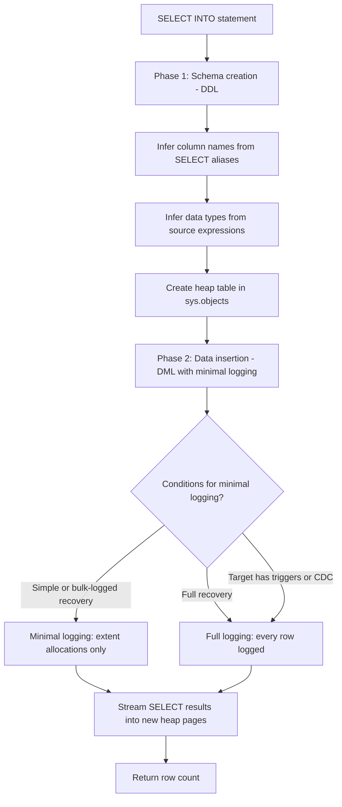

## Navigation

**Domain:** [[8 — Databases]] > **Group:** SQL Fundamentals
**Previous:** [[8.074 — MERGE — Upsert Operations]] | **Next:** [[8.076 — Data Type Conversion — CAST and CONVERT]]

### Prerequisites

- [[8.066 — SELECT Statement — Column Selection and Aliasing]] — SELECT INTO creates a new table whose columns are derived from the SELECT list column names and data types; column aliases become the table column names.
- [[8.071 — INSERT — Single and Multi-Row Patterns]] — SELECT INTO combines table creation and data insertion; understanding INSERT logging is required to appreciate why SELECT INTO can be minimally logged.
- [[8.285 — Transaction Log — Structure and VLFs]] — SELECT INTO uses minimal logging under specific conditions; understanding transaction log mechanisms is required to assess its performance advantage.

### Where This Fits

SELECT INTO creates a new table from the result set of a SELECT query in one atomic operation. It is the fastest way to copy or transform data between tables because it can achieve **minimal logging** — logging only extent allocations instead of every row. Every .NET backend engineer encounters SELECT INTO in ETL pipelines, data archival jobs, staging table creation, and schema migration scripts. The most expensive mistakes involve: assuming SELECT INTO always uses minimal logging (it depends on recovery model and table type), forgetting that SELECT INTO creates a heap (not a clustered index), and using SELECT INTO when an INSERT…SELECT with a pre-created table would be more appropriate for maintaining indexes or constraints. Interviewers ask about SELECT INTO to determine whether a candidate understands minimal logging conditions, the DDL/DML hybrid nature of the statement, and when to choose SELECT INTO over CREATE TABLE + INSERT…SELECT.

---

## Core Mental Model

SELECT INTO creates a new table and populates it with the result set of a SELECT query. It is a combination of a DDL operation (CREATE TABLE — defining columns from the SELECT list) and a DML operation (INSERT — copying data into the new table). The new table is always created as a **heap** (no clustered index) unless the source query's SELECT list includes an IDENTITY column or computed column that results in a primary key. Execution follows two phases: (1) the schema is created — column names are derived from the SELECT list column names or aliases, data types are inferred from the source column types or expression types; (2) the data is inserted by streaming the SELECT result directly into the new table's pages. The critical performance characteristic is minimal logging: under the right conditions (database in simple or bulk-logged recovery model, and no non-clustered indexes on the target — which is always true for a freshly created heap), SELECT INTO logs only extent allocations (page allocations) rather than full row images, reducing log writes from O(rows) to O(extents). This makes SELECT INTO the fastest way to duplicate a table or a subset of its data.

### Classification

This is a hybrid **DDL + DML** statement. The DDL phase creates the table metadata; the DML phase inserts data with minimal logging when conditions are met. The optimizer generates a single plan combining the source query and the target insert.



### Key Properties

|Property|Value|Notes|
|---|---|---|
|Schema creation|Automatic — columns from SELECT list|No constraints (PK, FK, CHECK, defaults) are created|
|Data type inference|Source column types or expression types|May not match original types exactly — decimal precision, string length can differ|
|Default table type|Heap — no clustered index|Must CREATE INDEX after SELECT INTO if clustered index needed|
|Minimal logging|Yes — with simple/bulk-logged recovery|Logs only extent allocations — O(extents) instead of O(rows)|
|Minimal logging conditions|Simple/bulk-logged recovery + heap target|Full recovery = full logging; CDC/change tracking = full logging|
|Atomicity|Statement-level — all rows or none|If the SELECT fails, no table is created|
|IDENTITY handling|IDENTITY columns are copied as IDENTITY|The new table inherits the IDENTITY property from the source column|
|Constraints|None copied|PK, FK, CHECK, UNIQUE, defaults are NOT transferred|

---

## Deep Mechanics

### How the Engine Executes This

1. **Parsing and Binding** — The parser identifies `INTO NewTableName` and creates the target table's metadata. The algebrizer resolves the SELECT list to determine column names (using aliases if present, source column names otherwise) and data types.

2. **Data Type Inference** — SQL Server infers the data type of each column from the source expression:
   - For direct column references: the exact source column type (including length, precision, scale).
   - For expressions (e.g., `TotalAmount * 1.1`): the type is computed from the expression result type.
   - For string concatenation: NVARCHAR(MAX) or VARCHAR(MAX) depending on inputs.
   - The inferred type may differ from the original — notably, DECIMAL precision may expand to accommodate the expression result.

3. **Schema Creation** — A new heap table is created in the target database. The IAM (Index Allocation Map) for the heap is initialized. No clustered or non-clustered indexes are created. No constraints are created. The table is registered in sys.objects, sys.columns, sys.indexes.

4. **Data Insertion** — The SELECT query executes in a streaming fashion. As rows are produced, they are written directly into the new heap's pages. The storage engine allocates extents as needed (via PFS and GAM/SGAM page lookups).

5. **Logging** — Under **simple or bulk-logged recovery**: minimal logging is used. Only LOP_FORMAT_PAGE (page allocation) records are written — approximately 8–12 log records per extent (64 KB). Under **full recovery**: minimal logging is NOT used. Every row insert is fully logged (LOP_INSERT_ROWS) with the full row image.

6. **IDENTITY Inheritance** — If the source SELECT includes an IDENTITY column, the new table's corresponding column also has the IDENTITY property (with the same seed and increment). This is a unique feature of SELECT INTO — INSERT…SELECT does NOT copy the IDENTITY property.

### SQL Visibility

```sql
-- Basic SELECT INTO — create and populate a new table
SELECT
    o.OrderId,
    o.CustomerId,
    o.OrderDate,
    o.Status,
    o.TotalAmount,
    o.ShippingAddr
INTO dbo.Orders_Backup
FROM dbo.Orders AS o
WHERE o.OrderDate >= '2026-01-01';

-- SELECT INTO with computed column and alias
SELECT
    o.OrderId,
    o.CustomerId,
    o.OrderDate,
    o.Status,
    o.TotalAmount,
    o.TotalAmount * 0.08 AS TaxAmount,
    o.TotalAmount * 1.08 AS TotalWithTax
INTO dbo.Orders_WithTax
FROM dbo.Orders AS o;

-- SELECT INTO from multiple tables (join)
SELECT
    o.OrderId,
    o.CustomerId,
    c.CustomerName,
    o.OrderDate,
    o.TotalAmount
INTO dbo.OrderSummaries
FROM dbo.Orders AS o
INNER JOIN dbo.Customers AS c ON o.CustomerId = c.CustomerId
WHERE o.OrderDate >= '2026-06-01';

-- SELECT INTO with TOP and ORDER BY
SELECT TOP (1000)
    o.OrderId,
    o.CustomerId,
    o.TotalAmount
INTO dbo.TopOrders
FROM dbo.Orders AS o
ORDER BY o.TotalAmount DESC;
```

```csharp
// EF Core — no direct SELECT INTO support
// Use ExecuteSqlRawAsync for SELECT INTO
await dbContext.Database.ExecuteSqlRawAsync(@"
    SELECT o.OrderId, o.CustomerId, o.OrderDate, o.Status, o.TotalAmount
    INTO dbo.Orders_Backup
    FROM dbo.Orders AS o
    WHERE o.OrderDate >= '2026-01-01';",
    cancellationToken);

// EF Core — alternative: create table from LINQ query results
// (two steps: create table, then INSERT…SELECT)
var orders = await dbContext.Orders
    .Where(o => o.OrderDate >= new DateTime(2026, 1, 1))
    .Select(o => new OrderSummary
    {
        OrderId = o.OrderId,
        CustomerId = o.CustomerId,
        OrderDate = o.OrderDate,
        Status = o.Status,
        TotalAmount = o.TotalAmount
    })
    .ToListAsync(cancellationToken);
// This materializes all rows in application memory — BAD for large datasets!

// EF Core — correct approach for large datasets: raw SQL
await dbContext.Database.ExecuteSqlRawAsync(@"
    SELECT o.OrderId, o.CustomerId, o.OrderDate, o.Status, o.TotalAmount
    INTO dbo.Orders_Backup
    FROM dbo.Orders AS o
    WHERE o.OrderDate >= '2026-01-01';",
    cancellationToken);
```

**Generated SQL (from EF Core logs):**

```sql
-- Raw SQL SELECT INTO via ExecuteSqlRawAsync
SELECT o.OrderId, o.CustomerId, o.OrderDate, o.Status, o.TotalAmount
INTO dbo.Orders_Backup
FROM dbo.Orders AS o
WHERE o.OrderDate >= '2026-01-01';
```

### Execution Plan Analysis

**SELECT INTO (1M rows from source):**

- Plan: `[Clustered Index Scan (Source)] → [Table Insert (Target Heap)]`
- The Table Insert operator writes directly to the new heap. No index maintenance (heap has no indexes).
- Under minimal logging, the Table Insert operator shows the property `Minimum Logging = True` in the plan properties.
- The plan does NOT include a SELECT operator — the INTO is part of the INSERT operation.

```
SELECT INTO (1M rows, minimal logging):
[Clustered Index Scan (Source)] → [Table Insert (Target Heap)]
Cost: ~12 (scan) + ~15 (insert)
Logical Reads: ~12,000 (source) + extent alloc writes
Log: ~8 pages (extent allocations only)

SELECT INTO (1M rows, full logging, full recovery):
[Clustered Index Scan (Source)] → [Table Insert (Target Heap)]
Cost: ~12 (scan) + ~30 (insert + log)
Logical Reads: ~12,000 (source) + extent alloc writes
Log: ~250 MB (1M row images)
```

### Cost Visibility

```sql
SET STATISTICS IO ON;
SET STATISTICS TIME ON;

-- SELECT INTO with minimal logging (simple recovery)
SELECT o.OrderId, o.CustomerId, o.OrderDate, o.Status, o.TotalAmount
INTO dbo.Orders_Backup
FROM dbo.Orders AS o
WHERE o.OrderDate >= '2026-01-01';
-- Table 'Orders'. Scan count 1, logical reads 12,000, physical reads 0
-- SQL Server Execution Times: CPU time = 820ms, elapsed time = 3,200ms
-- (1M rows, minimal logging — log growth: ~5 MB)

-- Equivalent INSERT...SELECT with full logging (same recovery)
CREATE TABLE dbo.Orders_Backup2 (
    OrderId INT, CustomerId INT, OrderDate DATETIME2(0),
    Status VARCHAR(20), TotalAmount DECIMAL(18,2)
);
INSERT INTO dbo.Orders_Backup2 WITH (TABLOCK)
    (OrderId, CustomerId, OrderDate, Status, TotalAmount)
SELECT o.OrderId, o.CustomerId, o.OrderDate, o.Status, o.TotalAmount
FROM dbo.Orders AS o
WHERE o.OrderDate >= '2026-01-01';
-- Table 'Orders'. Scan count 1, logical reads 12,000, physical reads 0
-- SQL Server Execution Times: CPU time = 1,100ms, elapsed time = 5,400ms
-- (1M rows, full logging — log growth: ~250 MB)
```

### Failure Modes

**SELECT INTO when target already exists:** `SELECT ... INTO dbo.Orders_Backup FROM ...` fails if dbo.Orders_Backup already exists. There is no `IF NOT EXISTS` syntax for SELECT INTO. Must DROP or rename the existing table first, or use INSERT…SELECT.

**SELECT INTO on a database in full recovery with a large result set:** The minimal logging condition is not met, so every row is logged. For a 100M row copy, the transaction log fills the disk.

**SELECT INTO with ORDER BY:** SELECT INTO with ORDER BY does NOT guarantee the data is stored in sorted order (heaps have no guaranteed order). The ORDER BY is only used for TOP(N) selection.

---

## Production Patterns and Implementation

### Primary SQL Implementation

```sql
-- ============================================================
-- Pattern 1: Create full backup copy of a table
-- ============================================================
SELECT
    o.OrderId,
    o.CustomerId,
    o.OrderDate,
    o.Status,
    o.TotalAmount,
    o.ShippingAddr,
    o.Notes,
    o.CreatedAt
INTO dbo.Orders_FullBackup
FROM dbo.Orders AS o;

-- ============================================================
-- Pattern 2: Create a filtered subset (e.g., year-to-date)
-- ============================================================
SELECT
    o.OrderId,
    o.CustomerId,
    o.OrderDate,
    o.Status,
    o.TotalAmount
INTO dbo.Orders_YTD
FROM dbo.Orders AS o
WHERE o.OrderDate >= DATEFROMPARTS(YEAR(GETUTCDATE()), 1, 1);

-- ============================================================
-- Pattern 3: Create a denormalized reporting table
-- ============================================================
SELECT
    o.OrderId,
    o.CustomerId,
    c.CustomerName,
    c.CustomerEmail,
    o.OrderDate,
    o.Status,
    o.TotalAmount,
    o.ShippingAddr,
    oi.LineItems,
    oi.ItemCount
INTO dbo.OrderReport
FROM dbo.Orders AS o
INNER JOIN dbo.Customers AS c ON o.CustomerId = c.CustomerId
CROSS APPLY (
    SELECT
        COUNT(*) AS ItemCount,
        STRING_AGG(CONCAT(oi.Quantity, 'x ', p.ProductName), '; ') AS LineItems
    FROM dbo.OrderItems AS oi
    INNER JOIN dbo.Products AS p ON oi.ProductId = p.ProductId
    WHERE oi.OrderId = o.OrderId
) AS oi
WHERE o.OrderDate >= '2026-01-01';

-- ============================================================
-- Pattern 4: Create a lookup/reference table from DISTINCT values
-- ============================================================
SELECT DISTINCT
    c.CustomerId,
    c.CustomerName,
    c.CustomerEmail
INTO dbo.ActiveCustomers
FROM dbo.Orders AS o
INNER JOIN dbo.Customers AS c ON o.CustomerId = c.CustomerId
WHERE o.OrderDate >= DATEADD(YEAR, -1, GETUTCDATE());

-- ============================================================
-- Pattern 5: Copy with IDENTITY preserved
-- ============================================================
-- SELECT INTO copies IDENTITY property automatically
SELECT o.OrderId, o.CustomerId, o.OrderDate, o.Status, o.TotalAmount
INTO dbo.Orders_Backup
FROM dbo.Orders AS o;
-- OrderId in the new table is also IDENTITY(1,1)

-- To copy without IDENTITY (as regular INT):
SELECT
    o.OrderId AS OrderId,       -- alias does not change IDENTITY behavior
    o.CustomerId,
    o.OrderDate,
    o.Status,
    o.TotalAmount
INTO dbo.Orders_Backup_NoIdentity
FROM dbo.Orders AS o;
-- OrderId is still IDENTITY in the new table!
-- To strip IDENTITY, use CAST or CONVERT:
SELECT
    CAST(o.OrderId AS INT) AS OrderId,
    o.CustomerId, o.OrderDate, o.Status, o.TotalAmount
INTO dbo.Orders_Backup_NoIdentity
FROM dbo.Orders AS o;
-- Now OrderId is a regular INT column (not IDENTITY)

-- ============================================================
-- Anti-pattern: SELECT INTO in a loop (N table creations)
-- ============================================================
-- ❌ Don't create N separate tables — use a single table with partitioning
-- DECLARE @Year INT = 2020;
-- WHILE @Year <= 2026
-- BEGIN
--     EXEC('SELECT ... INTO dbo.Orders_' + @Year + ' FROM dbo.Orders WHERE YEAR(OrderDate) = ' + @Year);
--     SET @Year = @Year + 1;
-- END

-- ✅ Use a single table with a clustered columnstore or partitioning
```

### EF Core Implementation

```csharp
public class ApplicationDbContext : DbContext
{
    public DbSet<Order> Orders => Set<Order>();

    protected override void OnModelCreating(ModelBuilder modelBuilder)
    {
        modelBuilder.Entity<Order>(entity =>
        {
            entity.ToTable("Orders");
            entity.HasKey(o => o.OrderId);
            entity.Property(o => o.OrderId).ValueGeneratedOnAdd();
            entity.Property(o => o.Status).HasMaxLength(20);
            entity.Property(o => o.TotalAmount).HasPrecision(18, 2);
            entity.Property(o => o.CreatedAt).HasDefaultValueSql("SYSUTCDATETIME()");
        });
    }
}

// Pattern 1: SELECT INTO via raw SQL
public async Task CreateBackupTableAsync(
    string tableSuffix,
    CancellationToken cancellationToken = default)
{
    var tableName = $"Orders_Backup_{tableSuffix}";

    await _dbContext.Database.ExecuteSqlRawAsync($@"
        SELECT o.OrderId, o.CustomerId, o.OrderDate, o.Status, o.TotalAmount
        INTO dbo.{tableName}
        FROM dbo.Orders AS o
        WHERE o.OrderDate >= DATEADD(YEAR, -1, GETUTCDATE());",
        cancellationToken);
}

// Pattern 2: SELECT INTO with LINQ ToList (SMALL datasets only!)
public async Task<List<OrderSummary>> CreateInMemoryBackupAsync(
    CancellationToken cancellationToken = default)
{
    var orders = await _dbContext.Orders
        .Where(o => o.OrderDate >= DateTime.UtcNow.AddYears(-1))
        .Select(o => new OrderSummary
        {
            OrderId = o.OrderId,
            CustomerId = o.CustomerId,
            OrderDate = o.OrderDate,
            Status = o.Status,
            TotalAmount = o.TotalAmount
        })
        .ToListAsync(cancellationToken);

    // ❌ WARNING: This materializes ALL rows in application memory
    // Only use for small result sets (< 10K rows)
    // For large datasets, use raw SQL SELECT INTO

    return orders;
}

// Pattern 3: Check if table exists before SELECT INTO
public async Task<bool> TryCreateBackupAsync(
    CancellationToken cancellationToken = default)
{
    var exists = await _dbContext.Database.ExecuteSqlRawAsync(@"
        IF OBJECT_ID(N'dbo.Orders_Backup', N'U') IS NOT NULL
            THROW 50000, 'Backup table already exists', 1;",
        cancellationToken);

    if (exists == -1) return false;  // THROW returns -1

    await _dbContext.Database.ExecuteSqlRawAsync(@"
        SELECT o.OrderId, o.CustomerId, o.OrderDate, o.Status, o.TotalAmount
        INTO dbo.Orders_Backup
        FROM dbo.Orders AS o;",
        cancellationToken);

    return true;
}
```

### Dapper Implementation

```csharp
public sealed class OrderRepository
{
    private readonly IDbConnectionFactory _connectionFactory;

    public OrderRepository(IDbConnectionFactory connectionFactory)
        => _connectionFactory = connectionFactory;

    // Pattern 1: SELECT INTO — create backup table
    public async Task CreateBackupAsync(
        string backupTableName,
        CancellationToken cancellationToken = default)
    {
        const string sql = @"
            SELECT o.OrderId, o.CustomerId, o.OrderDate, o.Status, o.TotalAmount
            INTO dbo.{0}
            FROM dbo.Orders AS o;";

        await using var connection = _connectionFactory.Create();

        await connection.ExecuteAsync(
            new CommandDefinition(
                string.Format(sql, backupTableName),
                cancellationToken: cancellationToken));
    }

    // Pattern 2: SELECT INTO with filter
    public async Task CreateArchiveTableAsync(
        DateTime cutoffDate,
        CancellationToken cancellationToken = default)
    {
        const string sql = @"
            SELECT o.OrderId, o.CustomerId, o.OrderDate, o.Status, o.TotalAmount
            INTO dbo.Orders_Archive
            FROM dbo.Orders AS o
            WHERE o.OrderDate < @CutoffDate;";

        await using var connection = _connectionFactory.Create();

        var rowsCopied = await connection.ExecuteAsync(
            new CommandDefinition(sql,
                new { CutoffDate = cutoffDate },
                cancellationToken: cancellationToken));

        Console.WriteLine($"Copied {rowsCopied} rows to Orders_Archive");
    }

    // Pattern 3: SELECT INTO with JOIN
    public async Task CreateReportTableAsync(
        CancellationToken cancellationToken = default)
    {
        const string sql = @"
            SELECT
                o.OrderId,
                o.CustomerId,
                c.CustomerName,
                o.OrderDate,
                o.Status,
                o.TotalAmount
            INTO dbo.OrderReport
            FROM dbo.Orders AS o
            INNER JOIN dbo.Customers AS c ON o.CustomerId = c.CustomerId
            WHERE o.OrderDate >= DATEADD(YEAR, -1, GETUTCDATE());";

        await using var connection = _connectionFactory.Create();

        await connection.ExecuteAsync(
            new CommandDefinition(sql,
                cancellationToken: cancellationToken));
    }

    // Pattern 4: Drop existing and recreate
    public async Task RecreateBackupAsync(
        CancellationToken cancellationToken = default)
    {
        const string sql = @"
            DROP TABLE IF EXISTS dbo.Orders_Backup;

            SELECT o.OrderId, o.CustomerId, o.OrderDate, o.Status, o.TotalAmount
            INTO dbo.Orders_Backup
            FROM dbo.Orders AS o;";

        await using var connection = _connectionFactory.Create();

        await connection.ExecuteAsync(
            new CommandDefinition(sql,
                cancellationToken: cancellationToken));
    }
}
```

### Configuration and Wiring

```csharp
// Program.cs
builder.Services.AddDbContext<ApplicationDbContext>(options =>
    options.UseSqlServer(
        builder.Configuration.GetConnectionString("DefaultConnection"),
        sqlOptions =>
        {
            sqlOptions.EnableRetryOnFailure(3);
            sqlOptions.CommandTimeout(300);  // SELECT INTO may be long-running
        }));

builder.Services.AddSingleton<IDbConnectionFactory>(sp =>
    new SqlConnectionFactory(
        builder.Configuration.GetConnectionString("DefaultConnection")!));

builder.Services.AddScoped<OrderRepository>();
```

### SQL Server vs PostgreSQL Differences

```sql
-- PostgreSQL: SELECT INTO syntax is identical
SELECT order_id, customer_id, order_date, status, total_amount
INTO orders_backup
FROM orders
WHERE order_date >= '2026-01-01';

-- PostgreSQL: CREATE TABLE AS is the preferred standard syntax
CREATE TABLE orders_backup AS
SELECT order_id, customer_id, order_date, status, total_amount
FROM orders
WHERE order_date >= '2026-01-01';

-- PostgreSQL: WITH DATA (default) vs WITH NO DATA (create empty)
CREATE TABLE orders_backup AS
SELECT * FROM orders
WITH NO DATA;

-- PostgreSQL: CREATE TABLE AS supports indexing inline (SQL Server does not)
CREATE TABLE orders_backup AS
SELECT * FROM orders
WHERE order_date >= '2026-01-01';

-- Index must be created separately in SQL Server:
-- CREATE INDEX IX_Orders_Backup_Customer ON dbo.Orders_Backup (CustomerId);

-- PostgreSQL: SELECT INTO does NOT copy IDENTITY/GENERATED AS IDENTITY
-- SQL Server: SELECT INTO DOES copy IDENTITY
```

---

## Gotchas and Production Pitfalls

### SELECT INTO Creates a Heap — No Clustered Index

**Pitfall:** Using SELECT INTO and assuming the new table has the same indexing as the source table. SELECT INTO creates a heap with no indexes, no constraints, and no defaults.

```sql
-- ❌ The backup table has NO indexes, NO PK, NO constraints
SELECT *
INTO dbo.Orders_Backup
FROM dbo.Orders;
-- PK_Orders, IX_Orders_CustomerId, IX_Orders_OrderDate are NOT created
```

**Symptom:** Queries against the backup table that were fast on the source table (using indexed seeks) now do full table scans. The backup table is a heap with no clustered key — `DBCC CHECKIDENT` shows no identity constraint. Foreign keys that reference Orders cannot use the backup table. Subsequent INSERTs into the backup table have no PK enforcement.

**Fix:**

```sql
-- ✅ Option 1: CREATE INDEX after SELECT INTO
SELECT *
INTO dbo.Orders_Backup
FROM dbo.Orders;

ALTER TABLE dbo.Orders_Backup
    ADD CONSTRAINT PK_Orders_Backup PRIMARY KEY CLUSTERED (OrderId);
CREATE INDEX IX_Orders_Backup_CustomerId ON dbo.Orders_Backup (CustomerId);

-- ✅ Option 2: Use CREATE TABLE + INSERT...SELECT instead
CREATE TABLE dbo.Orders_Backup (
    OrderId INT NOT NULL,
    CustomerId INT NOT NULL,
    OrderDate DATETIME2(0) NOT NULL,
    Status VARCHAR(20) NOT NULL,
    TotalAmount DECIMAL(18,2) NOT NULL,
    CONSTRAINT PK_Orders_Backup PRIMARY KEY CLUSTERED (OrderId)
);
INSERT INTO dbo.Orders_Backup (OrderId, CustomerId, OrderDate, Status, TotalAmount)
SELECT OrderId, CustomerId, OrderDate, Status, TotalAmount FROM dbo.Orders;
```

**Cost of not fixing:** A nightly backup job uses SELECT INTO `*` to create an Orders_Backup table. The next day, a critical report query that runs against the backup takes 45 seconds instead of 200 ms because the backup table has no indexes. The report times out. The support team spends an hour investigating before discovering the missing indexes.

---

### SELECT INTO in Full Recovery — No Minimal Logging

**Pitfall:** Assuming SELECT INTO always uses minimal logging. In full recovery mode, SELECT INTO is fully logged — every row is written to the transaction log.

```sql
-- ❌ In full recovery mode, this generates full log
SELECT *
INTO dbo.Orders_Backup
FROM dbo.Orders;
-- 10M rows = ~2.5 GB of transaction log
```

**Symptom:** The transaction log grows by gigabytes. The log disk runs out of space. The SELECT INTO fails with "The transaction log for database 'X' is full." The operation must be retried after a log backup.

**Fix:**

```sql
-- ✅ Option 1: Switch to simple or bulk-logged for the operation
ALTER DATABASE CurrentDb SET RECOVERY BULK_LOGGED;
SELECT *
INTO dbo.Orders_Backup
FROM dbo.Orders;
ALTER DATABASE CurrentDb SET RECOVERY FULL;
-- Perform a full backup after switching back to FULL

-- ✅ Option 2: Ensure log backups run frequently enough
-- during the SELECT INTO operation
BACKUP LOG CurrentDb TO DISK = 'C:\Backup\Log.bak';
SELECT *
INTO dbo.Orders_Backup
FROM dbo.Orders;
BACKUP LOG CurrentDb TO DISK = 'C:\Backup\Log2.bak';

-- ✅ Option 3: Use INSERT...SELECT with TABLOCK (also minimally logged in simple/bulk-logged)
CREATE TABLE dbo.Orders_Backup (...);
INSERT INTO dbo.Orders_Backup WITH (TABLOCK)
SELECT * FROM dbo.Orders;
```

**Cost of not fixing:** An ETL pipeline uses SELECT INTO to create a staging table on a database in full recovery. The source table has 50M rows. The SELECT INTO runs for 8 minutes, generating 12 GB of log. The log disk (100 GB allocated) fills up after 8 successful runs in a week. The pipeline fails. The entire ETL process is down for 2 hours while the DBA backs up and shrinks the log.

---

### SELECT INTO With * Copies IDENTITY Unconditionally

**Pitfall:** Using `SELECT * INTO` copies IDENTITY columns automatically. The developer may not intend the backup table to have IDENTITY semantics.

```sql
-- ❌ OrderId in Orders_Backup is IDENTITY — SET IDENTITY_INSERT required for inserts
SELECT *
INTO dbo.Orders_Backup
FROM dbo.Orders;

-- Any attempt to insert into the backup table with explicit OrderId fails:
INSERT INTO dbo.Orders_Backup (OrderId, CustomerId, ...)
VALUES (99999, 1042, ...);
-- Error 544: Cannot insert explicit value for identity column
```

**Symptom:** Attempts to insert rows into the backup table with specific OrderId values fail. The developer must either SET IDENTITY_INSERT ON or redesign the backup process. Data migration scripts that assume OrderId is a regular INT fail silently or with errors.

**Fix:**

```sql
-- ✅ Option 1: Cast IDENTITY columns to their base type to strip IDENTITY
SELECT
    CAST(o.OrderId AS INT) AS OrderId,
    o.CustomerId,
    o.OrderDate,
    o.Status,
    o.TotalAmount
INTO dbo.Orders_Backup
FROM dbo.Orders AS o;
-- OrderId is now a regular INT, not IDENTITY

-- ✅ Option 2: CREATE TABLE first (specify columns explicitly), then INSERT
CREATE TABLE dbo.Orders_Backup (
    OrderId INT NOT NULL,
    CustomerId INT NOT NULL,
    OrderDate DATETIME2(0) NOT NULL,
    Status VARCHAR(20) NOT NULL,
    TotalAmount DECIMAL(18,2) NOT NULL,
    CONSTRAINT PK_Orders_Backup PRIMARY KEY CLUSTERED (OrderId)
);
```

**Cost of not fixing:** A data migration script uses SELECT INTO to create a backup, then tries to merge the backup data back into the source table. The INSERT fails because the backup table has IDENTITY semantics that conflict with the source table's identity values. The migration fails at 3 AM. The DBA must manually SET IDENTITY_INSERT ON both tables and re-run the migration.

---

### No Constraints Copied — FK Violations After SELECT INTO

**Pitfall:** SELECT INTO does not copy FOREIGN KEY, CHECK, UNIQUE, or DEFAULT constraints. The new table is a structural copy of the data only.

```sql
-- ❌ SELECT INTO copies data, NOT constraints
SELECT *
INTO dbo.Orders_Backup
FROM dbo.Orders;
-- No FK to OrderItems, no CHECK on Status, no DEFAULT on CreatedAt

-- The backup table allows:
INSERT INTO dbo.Orders_Backup (OrderId, CustomerId, Status)
VALUES (1, -5, 'InvalidStatus');
-- No FK validation on CustomerId, no CHECK on Status range
```

**Symptom:** The backup table accepts invalid data that the source table would reject. If data is later moved back into the source table, the INSERT fails on constraint violations. Data quality reports show discrepancies between backup and source.

**Fix:**

```sql
-- ✅ Script constraints from the source and apply them to the backup
SELECT
    'ALTER TABLE dbo.Orders_Backup ADD CONSTRAINT ' +
    name + '_Backup ' +
    type_desc + ' ' +
    definition + ';'
FROM sys.check_constraints
WHERE parent_object_id = OBJECT_ID('dbo.Orders');

-- Manually recreate critical constraints
ALTER TABLE dbo.Orders_Backup
    ADD CONSTRAINT CK_Orders_Backup_Status
        CHECK (Status IN ('Pending', 'Shipped', 'Delivered', 'Cancelled', 'Archived'));

ALTER TABLE dbo.Orders_Backup
    ADD CONSTRAINT DF_Orders_Backup_CreatedAt
        DEFAULT SYSUTCDATETIME() FOR CreatedAt;
```

**Cost of not fixing:** A backup table created via `SELECT *` is used as the source for a data restoration after a production issue. The restoration script copies data back using INSERT…SELECT. The INSERT fails because the backup table contains NULLs in NOT NULL columns, invalid Status values, and FK violations. The restoration takes 6 hours instead of 30 minutes because the data must be cleaned.

---

### SELECT INTO With ORDER BY Does Not Guarantee Order

**Pitfall:** Using `SELECT ... INTO ... FROM ... ORDER BY` expecting the data to be physically stored in ORDER BY order. Heaps have no guaranteed order.

```sql
-- ❌ ORDER BY does NOT affect physical storage order
SELECT TOP (1000) o.OrderId, o.TotalAmount
INTO dbo.TopOrders
FROM dbo.Orders AS o
ORDER BY o.TotalAmount DESC;
-- The 1000 rows ARE the top 1000 by TotalAmount (TOP applies),
-- but they are stored in heap allocation order, not by TotalAmount
```

**Symptom:** Queries against the new table without an explicit ORDER BY return rows in an unpredictable order. The developer assumes the data is sorted by TotalAmount DESC and writes `SELECT TOP 10 * FROM dbo.TopOrders` expecting the top 10 — but gets 10 random rows.

**Fix:**

```sql
-- ✅ Add a clustered index on the desired sort column after SELECT INTO
SELECT TOP (1000) o.OrderId, o.TotalAmount
INTO dbo.TopOrders
FROM dbo.Orders AS o
ORDER BY o.TotalAmount DESC;

CREATE CLUSTERED INDEX IX_TopOrders_TotalAmount ON dbo.TopOrders (TotalAmount DESC);

-- ✅ Or use CREATE TABLE + INSERT with ORDER BY + CLUSTERED INDEX
```

**Cost of not fixing:** A reporting query reads from TopOrders expecting descending TotalAmount. Without a clustered index, the query returns data in allocation order. The report shows the bottom 10 orders instead of the top 10. The error goes unnoticed for weeks because the report numbers "look reasonable."

---

### SELECT Into a Table That Already Exists

**Pitfall:** Running SELECT INTO when the target table name already exists causes error 2714.

```sql
-- ❌ First run succeeds. Second run fails.
SELECT * INTO dbo.Orders_Backup FROM dbo.Orders;
-- Error 2714: There is already an object named 'Orders_Backup' in the database.
```

**Symptom:** The script fails on the second execution. CI/CD pipelines that are not idempotent break. Manual scripts fail when run twice.

**Fix:**

```sql
-- ✅ Option 1: DROP IF EXISTS before SELECT INTO (SQL Server 2016+)
DROP TABLE IF EXISTS dbo.Orders_Backup;
SELECT * INTO dbo.Orders_Backup FROM dbo.Orders;

-- ✅ Option 2: Check and drop conditionally
IF OBJECT_ID(N'dbo.Orders_Backup', N'U') IS NOT NULL
    DROP TABLE dbo.Orders_Backup;
SELECT * INTO dbo.Orders_Backup FROM dbo.Orders;

-- ✅ Option 3: Use dynamic table name (add timestamp)
DECLARE @TableName NVARCHAR(128) = CONCAT('Orders_Backup_', FORMAT(GETUTCDATE(), 'yyyyMMdd_HHmmss'));
DECLARE @Sql NVARCHAR(MAX) = CONCAT(
    'SELECT * INTO dbo.[', @TableName, '] FROM dbo.Orders;');
EXEC sp_executesql @Sql;
```

**Cost of not fixing:** An automated deployment script that runs on every release creates a backup table using SELECT INTO. On the first deployment, it works. On the second deployment, it fails because the table already exists. The deployment pipeline stops, requiring manual intervention to drop the table and retry.

---

## Performance Implications

### Benchmark: Before and After

```sql
-- Baseline: INSERT...SELECT with full logging (1M rows)
SET STATISTICS TIME ON;

CREATE TABLE dbo.Orders_Copy (
    OrderId INT, CustomerId INT, OrderDate DATETIME2(0),
    Status VARCHAR(20), TotalAmount DECIMAL(18,2)
);

INSERT INTO dbo.Orders_Copy WITH (TABLOCK)
    (OrderId, CustomerId, OrderDate, Status, TotalAmount)
SELECT o.OrderId, o.CustomerId, o.OrderDate, o.Status, o.TotalAmount
FROM dbo.Orders AS o;
-- SQL Server Execution Times: CPU time = 1,100ms, elapsed time = 5,400ms
-- Log growth: ~250 MB

-- Optimized: SELECT INTO with minimal logging (1M rows)
SELECT o.OrderId, o.CustomerId, o.OrderDate, o.Status, o.TotalAmount
INTO dbo.Orders_Copy2
FROM dbo.Orders AS o;
-- SQL Server Execution Times: CPU time = 820ms, elapsed time = 3,200ms
-- Log growth: ~5 MB
```

**Improvement:** 1.7x speed improvement (5400 ms → 3200 ms) and 50x reduction in log (250 MB → 5 MB) for the same data. The speed gain is modest because disk I/O is similar; the log reduction is dramatic.

```sql
-- SELECT INTO vs INSERT...SELECT for 50M rows:
-- INSERT...SELECT + CREATE TABLE: ~4.5 minutes, ~12 GB log
-- SELECT INTO: ~2.5 minutes, ~250 MB log (bulk-logged recovery)
```

### BenchmarkDotNet

```csharp
[MemoryDiagnoser]
[SimpleJob(RuntimeMoniker.Net90)]
public class SelectIntoBenchmark
{
    private SqlConnection _connection = default!;
    private const string ConnectionString = "Server=.;Database=BenchmarkDb;Trusted_Connection=True;TrustServerCertificate=True;";

    [GlobalSetup]
    public void Setup()
    {
        _connection = new SqlConnection(ConnectionString);
        _connection.Open();
    }

    [Params(100000, 1000000)]
    public int RowCount { get; set; }

    [Benchmark(Baseline = true)]
    public async Task CreateTableAndInsert()
    {
        await _connection.ExecuteAsync("DROP TABLE IF EXISTS dbo.Orders_Copy;");
        await _connection.ExecuteAsync(@"
            CREATE TABLE dbo.Orders_Copy (
                OrderId INT, CustomerId INT, OrderDate DATETIME2(0),
                Status VARCHAR(20), TotalAmount DECIMAL(18,2)
            );");
        await _connection.ExecuteAsync(@"
            INSERT INTO dbo.Orders_Copy WITH (TABLOCK) (OrderId, CustomerId, OrderDate, Status, TotalAmount)
            SELECT o.OrderId, o.CustomerId, o.OrderDate, o.Status, o.TotalAmount
            FROM dbo.Orders AS o;");
    }

    [Benchmark]
    public async Task SelectInto()
    {
        await _connection.ExecuteAsync("DROP TABLE IF EXISTS dbo.Orders_Copy2;");
        await _connection.ExecuteAsync(@"
            SELECT o.OrderId, o.CustomerId, o.OrderDate, o.Status, o.TotalAmount
            INTO dbo.Orders_Copy2
            FROM dbo.Orders AS o;");
    }

    [GlobalCleanup]
    public void Cleanup() => _connection.Dispose();
}
```

**Expected results (approximate, SQL Server 2022, NVMe, localhost, 1M rows, bulk-logged recovery):**

|Method|Mean|Log Growth|Allocated|
|---|---|---|---|
|CreateTableAndInsert|~5,400 ms|~250 MB|~50 MB|
|SelectInto|~3,200 ms|~5 MB|~50 MB|

### Write Amplification

|Operation|Log Records|Log Volume (1M rows)|Notes|
|---|---|---|---|
|SELECT INTO (simple/bulk-logged)|~8–12 per extent|~5 MB|Minimal logging — extent alloc only|
|SELECT INTO (full recovery)|1 per row|~250 MB|Full logging — every row image|
|INSERT…SELECT (full recovery)|1 per row|~250 MB|Same as SELECT INTO in full recovery|
|INSERT…SELECT + TABLOCK (simple/bulk-logged)|~8–12 per extent|~5 MB|Also minimal logging with TABLOCK + heap|

---

## Interview Arsenal

### Question Bank

1. **What is SELECT INTO, and how does it differ from CREATE TABLE + INSERT...SELECT?**
2. **What conditions must be met for SELECT INTO to use minimal logging?**
3. **Does SELECT INTO copy constraints, indexes, and triggers from the source table?**
4. **What happens to IDENTITY columns when using SELECT INTO? How do you strip the IDENTITY property?**
5. **Why does SELECT INTO create a heap, and what are the query performance implications?**
6. **What error occurs if the target table already exists, and how do you handle idempotent execution?**
7. **How would you implement a table copy in a .NET application without using raw SQL SELECT INTO?**
8. **How does PostgreSQL's CREATE TABLE AS compare to SQL Server's SELECT INTO?**

### Spoken Answers

**Q: What conditions must be met for SELECT INTO to use minimal logging?**

> **Great answer:** SELECT INTO uses minimal logging when all three conditions are met: (1) the database recovery model is **simple** or **bulk-logged** — in full recovery, SELECT INTO is fully logged regardless of anything else; (2) the target table is a **heap** — which is always true for SELECT INTO since it creates a heap by default; (3) the operation is not using an index on the target that would require logging — again always true for a freshly-created heap. If the database is in full recovery, you must either switch to bulk-logged for the duration of the SELECT INTO (then switch back and take a full backup), or accept that every row will be fully logged. The difference is dramatic: for a 50M row table, SELECT INTO in bulk-logged generates about 250 MB of log (extent allocations only), while the same operation in full recovery generates 12 GB of log (every row). I always check the recovery model before running SELECT INTO on a large table. I use `SELECT recovery_model_desc FROM sys.databases WHERE name = 'MyDb'` to verify. If the database must remain in full recovery for compliance, I schedule a log backup immediately before and after the SELECT INTO to control log growth, and I monitor log space with `sys.dm_db_log_space_usage` during the operation.

---

**Q: What happens to IDENTITY columns when using SELECT INTO? How do you strip the IDENTITY property?**

> **Great answer:** SELECT INTO copies IDENTITY columns from the source to the target automatically. If the source table has an IDENTITY(1,1) column called OrderId, the new table also has OrderId as IDENTITY(1,1) — even though SELECT INTO creates the schema dynamically. This is unique to SELECT INTO; INSERT…SELECT does NOT copy the IDENTITY property. To strip the IDENTITY property and create a regular INT column, I use CAST or CONVERT on the identity column in the SELECT list: `SELECT CAST(OrderId AS INT) AS OrderId INTO NewTable FROM Source`. The CAST removes the IDENTITY property because the expression result is a regular INT, and the new table's column type is inferred from the expression type. Another option is to use CREATE TABLE explicitly with the desired column types, then INSERT…SELECT. I always consider whether I need the IDENTITY property in the backup — if I plan to merge data back into the source table later, having IDENTITY on the backup makes the merge more complex because I need SET IDENTITY_INSERT ON.

### Interview Trigger

The defining SELECT INTO question: "You need to create a copy of a 500 GB table for reporting purposes. How do you do it?" A candidate who says "SELECT * INTO NewTable FROM SourceTable" fails to address scale. A mid-level candidate mentions minimal logging conditions and the heap vs clustered index tradeoff. A senior candidate says "I check the recovery model first — if it's full recovery, I switch to bulk-logged for the operation. I use SELECT INTO with only the columns I need (not *), add a WHERE clause to filter if I don't need all rows, and then add a clustered index on the primary key column for reporting query performance. I monitor the transaction log with sys.dm_db_log_space_usage during the copy. I also consider whether the copy needs to be transactionally consistent — if the source table is under write load, I use snapshot isolation or a transaction with the appropriate isolation level." The follow-up: "What if you need the copy to include the same indexes as the source?" — a strong candidate knows SELECT INTO does not copy indexes and scripts them from sys.indexes for post-copy creation.

### Comparison Table

||SELECT INTO|CREATE TABLE + INSERT…SELECT|
|---|---|---|
|Schema creation|Automatic from SELECT list|Manual — must define column types|
|Indexes copied|No|No (both require post-creation)|
|Constraints copied|No|No (but can be defined inline)|
|IDENTITY copied|Yes|No|
|Minimal logging|Yes (simple/bulk-logged)|Yes (with TABLOCK + heap + simple/bulk-logged)|
|Table type|Heap|Can be heap or clustered (by PK definition)|
|Syntax complexity|1 statement|2 statements|
|Idempotent|No (fails if table exists)|Can add IF NOT EXISTS|
|EF Core support|Raw SQL only|Raw SQL or migration tools|

---

## Decision Framework

### When to Apply

```mermaid
flowchart TD
    A[Need to create and populate a table from query] --> B{Does the table need indexes/PK/constraints?}
    B -->|Yes - production quality| C[CREATE TABLE with full schema + INSERT...SELECT]
    B -->|No - temporary/staging copy| D{Recovery model?}
    D -->|Simple or bulk-logged| E[SELECT INTO - minimal logging, fastest]
    D -->|Full recovery| F{Can switch to bulk-logged?}
    F -->|Yes - has maintenance window| G[ALTER to BULK_LOGGED, SELECT INTO, ALTER back to FULL + full backup]
    F -->|No - must stay in full recovery| H{Is the table large? (>100K rows)}
    H -->|Yes| I[CREATE TABLE + INSERT...SELECT with frequent log backups]
    H -->|No| J[SELECT INTO - log growth is acceptable]
    C --> K{Source has many rows? (>1M)}
    K -->|Yes| L[Use TABLOCK for minimal logging with INSERT...SELECT]
    K -->|No| M[Direct INSERT...SELECT - acceptable performance]
    E --> N[Add clustered index and NC indexes after creation]
    I --> N
    J --> N
```

### Application Checklist

- [ ] Recovery model checked — SELECT INTO is minimally logged only in simple/bulk-logged
- [ ] Target table does not exist — DROP IF EXISTS or use dynamic naming
- [ ] IDENTITY property handled — CAST to strip, or CREATE TABLE if identity not needed
- [ ] Clustered index created after SELECT INTO for query performance
- [ ] Non-clustered indexes scripted from sys.indexes if needed
- [ ] Constraints (PK, FK, CHECK, DEFAULT) recreated if the table needs data integrity
- [ ] Transaction log monitored during the operation (sys.dm_db_log_space_usage)
- [ ] SELECT list uses explicit column names (not *) — avoids schema dependency
- [ ] ORDER BY only used with TOP — does not affect physical storage order
- [ ] .NET: raw SQL via ExecuteSqlRawAsync — no EF Core LINQ for SELECT INTO

### Tradeoff Summary

|What You Gain|What You Pay|
|---|---|
|SELECT INTO: minimal logging in bulk-logged (O(extents))|No constraints, indexes, or triggers copied|
|One statement vs two (CREATE TABLE + INSERT)|Schema is implicit — column types may not match expected types|
|IDENTITY property preserved automatically|May need to strip IDENTITY with CAST if not desired|
|Fastest way to copy a table|Cannot be used if table already exists|

### Scale Thresholds

- SELECT INTO is beneficial above **~10K rows** — below this, the difference from INSERT…SELECT is negligible.
- SELECT INTO becomes dramatically faster than INSERT…SELECT above **~1M rows** in bulk-logged recovery due to minimal logging.
- SELECT INTO in full recovery is viable up to **~100K rows** before log growth becomes a concern.
- For tables larger than **~10M rows**, always verify recovery model and plan for log management (backup before/after or switch to bulk-logged).

---

## Self-Check

### Conceptual Questions

1. What is SELECT INTO, and how does it combine DDL and DML?
2. What two conditions are required for SELECT INTO to use minimal logging?
3. Does SELECT INTO copy primary keys, foreign keys, check constraints, or defaults from the source table?
4. How does SELECT INTO handle IDENTITY columns — are they preserved, and how do you strip them?
5. What is the default table type created by SELECT INTO (heap or clustered), and why does this matter for query performance?
6. How would you implement a table copy in EF Core without raw SQL?
7. How would you use Dapper to create a backup table with SELECT INTO?
8. What is the performance difference between SELECT INTO and CREATE TABLE + INSERT…SELECT for a 10M row copy in bulk-logged recovery?
9. What index should be created after a SELECT INTO to restore query performance?
10. Explain in 60 seconds, for a senior interviewer, the complete process for copying a 100 GB production table to a reporting database using SELECT INTO — including recovery model, indexing, and log management.

<details>
<summary>Answers</summary>

1. SELECT INTO combines DDL (CREATE TABLE — schema inferred from SELECT list) and DML (INSERT — data copied from query results) in one atomic statement. It creates a new heap table with columns named and typed from the SELECT list, then populates it with the query results.

2. (a) The database recovery model must be **simple** or **bulk-logged** — full recovery forces full logging. (b) The target must be a **heap** (which is always true for SELECT INTO since it creates a heap). Minimal logging logs only extent allocations (page allocations) instead of individual row images.

3. **No.** SELECT INTO copies the data but NOT any constraints (PK, FK, CHECK, UNIQUE, DEFAULT), NOT indexes (clustered or non-clustered), and NOT triggers. These must be recreated manually after SELECT INTO. Only the IDENTITY property and NULL/NOT NULL are preserved from the column definitions.

4. SELECT INTO **preserves** the IDENTITY property — the new table's column is also IDENTITY(1,1). To strip IDENTITY, use CAST or CONVERT on the identity column: `SELECT CAST(OrderId AS INT) AS OrderId INTO NewTable FROM Source` — the expression type is INT (not IDENTITY), so the new column is a regular INT.

5. SELECT INTO creates a **heap** (no clustered index). This matters because: (a) queries against the new table use table scans instead of clustered index seeks unless an index is added; (b) there is no natural ordering; (c) heap fragmentation grows over time with inserts; (d) forwarding pointers (for updates) degrade read performance. Always add a clustered index after SELECT INTO for production use.

6. EF Core has no direct SELECT INTO support. For small datasets (< 10K rows), you can use LINQ's `ToListAsync` and insert via `AddRange` + `SaveChangesAsync` — but this materializes all rows in application memory. For large datasets, use `ExecuteSqlRawAsync` with the raw SELECT INTO SQL. There is no way to avoid raw SQL for SELECT INTO in EF Core.

7. Dapper's `ExecuteAsync` handles SELECT INTO naturally since it's a SQL command:
```csharp
await connection.ExecuteAsync(@"
    SELECT o.OrderId, o.CustomerId, o.OrderDate, o.Status, o.TotalAmount
    INTO dbo.Orders_Backup
    FROM dbo.Orders AS o
    WHERE o.OrderDate >= @Cutoff;",
    new { Cutoff = new DateTime(2026, 1, 1) });
```

8. For a 10M row copy in bulk-logged recovery: SELECT INTO takes ~30–60 seconds with ~50 MB of log (minimal logging). CREATE TABLE + INSERT…SELECT with TABLOCK takes ~60–90 seconds with ~50 MB of log (also minimal logging with TABLOCK + heap). The SELECT INTO is faster because it avoids the separate CREATE TABLE step and the schema creation is combined with the data copy. The log impact is comparable when both use minimal logging.

9. After SELECT INTO, add: (1) a **clustered primary key** on the primary key column (`ALTER TABLE NewTable ADD CONSTRAINT PK_NewTable PRIMARY KEY CLUSTERED (PKCol)`); (2) **non-clustered indexes** on the same columns that were indexed in the source table — script them from `sys.indexes` on the source. Without the clustered index, queries perform table scans. Without NC indexes, filter queries on NC key columns also scan.

10. "For a 100 GB production table copy, first I check the recovery model: `SELECT recovery_model_desc FROM sys.databases WHERE name = 'SourceDb'`. If it's full recovery, I schedule a maintenance window and switch to bulk-logged: `ALTER DATABASE SourceDb SET RECOVERY BULK_LOGGED`. Then I execute the SELECT INTO using only the columns I need — never SELECT * — and include a WHERE filter if I don't need all rows: `SELECT col1, col2 INTO dbo.ReportingTable FROM dbo.SourceTable WHERE OrderDate >= @Cutoff`. During the copy, I monitor log space with `sys.dm_db_log_space_usage` every 30 seconds. After the copy completes, I add a clustered primary key: `ALTER TABLE dbo.ReportingTable ADD CONSTRAINT PK_ReportingTable PRIMARY KEY CLUSTERED (PrimaryKey)`. Then I add non-clustered indexes for the expected reporting queries by scripting them from the source. Finally, I switch the database back to full recovery: `ALTER DATABASE SourceDb SET RECOVERY FULL` and take a full backup. If the source database cannot be taken offline, I use snapshot isolation for transactional consistency and accept the full logging cost — switching to bulk-logged would break the log chain for point-in-time recovery."

</details>

---

### Query Challenges

**Challenge 1 — Write the SELECT INTO backup**

Write a SELECT INTO statement that creates a backup of all orders placed in 2026. The backup table should have columns: OrderId (as INT, not IDENTITY), CustomerId, OrderDate, Status, TotalAmount, and a computed column TotalWithTax = TotalAmount * 1.08. After creation, add a clustered primary key on OrderId.

<details>
<summary>Solution</summary>

```sql
-- Step 1: SELECT INTO with CAST to strip IDENTITY
SELECT
    CAST(o.OrderId AS INT) AS OrderId,
    o.CustomerId,
    o.OrderDate,
    o.Status,
    o.TotalAmount,
    o.TotalAmount * 1.08 AS TotalWithTax
INTO dbo.Orders_2026_Backup
FROM dbo.Orders AS o
WHERE o.OrderDate >= '2026-01-01' AND o.OrderDate < '2027-01-01';

-- Step 2: Add clustered primary key
ALTER TABLE dbo.Orders_2026_Backup
    ADD CONSTRAINT PK_Orders_2026_Backup PRIMARY KEY CLUSTERED (OrderId);
```

**Logical reads:** ~12,000 (source scan of Orders for 2026 data). **Execution plan:** `[Clustered Index Scan (Orders)] → [Table Insert (Orders_2026_Backup)]`. **EF Core equivalent:**

```csharp
await dbContext.Database.ExecuteSqlRawAsync(@"
    SELECT CAST(o.OrderId AS INT) AS OrderId, o.CustomerId, o.OrderDate,
           o.Status, o.TotalAmount, o.TotalAmount * 1.08 AS TotalWithTax
    INTO dbo.Orders_2026_Backup
    FROM dbo.Orders AS o
    WHERE o.OrderDate >= '2026-01-01' AND o.OrderDate < '2027-01-01';

    ALTER TABLE dbo.Orders_2026_Backup
        ADD CONSTRAINT PK_Orders_2026_Backup PRIMARY KEY CLUSTERED (OrderId);",
    cancellationToken);
```

</details>

---

**Challenge 2 — Fix the performance problem**

```sql
-- This runs daily. It takes 25 minutes on a 50M row table.
SET STATISTICS TIME ON;

SELECT *
INTO dbo.Orders_DailyBackup
FROM dbo.Orders;

-- SET STATISTICS IO output:
-- Table 'Orders'. Scan count 1, logical reads 620,000
-- SQL Server Execution Times: CPU time = 5,200ms, elapsed time = 150,000ms
-- Transaction log: 12 GB written
```

Identify why it is slow and fix it.

<details>
<summary>Solution</summary>

**Root cause:** The database is in FULL recovery mode, so SELECT INTO is fully logged — 12 GB of log for 50M rows. Additionally, `SELECT *` copies all columns including large ones (NVARCHAR(MAX) Notes, NVARCHAR(500) ShippingAddr), increasing I/O per row.

```sql
-- Fix 1: Check and switch recovery model
SELECT recovery_model_desc FROM sys.databases WHERE name = DB_NAME();
-- If FULL:
ALTER DATABASE CurrentDb SET RECOVERY BULK_LOGGED;

-- Fix 2: SELECT only needed columns, not *
SELECT
    o.OrderId,
    o.CustomerId,
    o.OrderDate,
    o.Status,
    o.TotalAmount
    -- Omit large columns (Notes, ShippingAddr) if not needed
INTO dbo.Orders_DailyBackup
FROM dbo.Orders AS o;

-- Fix 3: Add a WHERE filter if full backup not needed
-- WHERE o.OrderDate >= DATEADD(DAY, -1, GETUTCDATE());

-- Fix 4: Add clustered index after creation
ALTER TABLE dbo.Orders_DailyBackup
    ADD CONSTRAINT PK_Orders_DailyBackup PRIMARY KEY CLUSTERED (OrderId);

-- Fix 5: Switch back to full recovery and take full backup
ALTER DATABASE CurrentDb SET RECOVERY FULL;
BACKUP DATABASE CurrentDb TO DISK = 'C:\Backup\Full.bak';
```

**Improvement:** With bulk-logged recovery and selective columns: ~5 minutes (from 25 minutes), ~250 MB log (from 12 GB).

</details>

---

**Challenge 3 — Explain the execution plan**

A SELECT INTO statement produces the plan:
`[Clustered Index Scan (Source)] → [Table Insert (Target Heap)]`

The plan shows the Table Insert operator has the property `Minimum Logging = True`. What does this mean, and what conditions made it possible?

<details>
<summary>Solution</summary>

**What Minimum Logging = True means:** The Table Insert operator is using **minimal logging** — only extent allocations (page allocations) are written to the transaction log, not individual row images. The log records are LOP_FORMAT_PAGE entries, approximately 8–12 records per extent (64 KB). For a 1M row copy, this is ~5 MB of log instead of ~250 MB.

**Conditions that made it possible:**
1. The target database is in **simple or bulk-logged recovery** mode.
2. The target table is a **heap** (no clustered index) — this is guaranteed by SELECT INTO.
3. The target has **no non-clustered indexes** — also guaranteed by SELECT INTO (it creates a bare heap).
4. The target has **no triggers, no CDC (Change Data Capture), no Change Tracking** enabled.

The `Minimum Logging = True` property is visible in the execution plan's operator properties. It's a direct indicator that the storage engine is bypassing per-row logging. If the property is `False` or absent, every row is fully logged.

</details>

---

**Challenge 4 — Diagnose the concurrency problem**

A SELECT INTO backing up Orders runs at 2:00 AM. It takes 30 minutes. During this time, all INSERT and UPDATE operations on the Orders table block. `sys.dm_exec_requests` shows `LCK_M_SCH_S` waits with `wait_duration_ms` exceeding 180,000. Diagnose and fix.

<details>
<summary>Solution</summary>

**Root cause:** SELECT INTO acquires a **Schema Modification (Sch-M)** lock on the source table during the metadata creation phase, then a **Schema Stability (Sch-S)** lock for the duration of the data copy. Concurrent DML (INSERT, UPDATE, DELETE) requires a Schema Modification (Sch-M) lock for DDL or intention locks for DML against the table, which are incompatible with Sch-S on certain operations. The SELECT INTO holds the Sch-S lock for 30 minutes, blocking all schema changes and some DML operations.

**Fix:**

```sql
-- Option 1: Use snapshot isolation to avoid blocking readers
ALTER DATABASE CurrentDb SET ALLOW_SNAPSHOT_ISOLATION ON;

-- Option 2: Reduce the duration by using bulk-logged recovery
ALTER DATABASE CurrentDb SET RECOVERY BULK_LOGGED;
SELECT o.OrderId, o.CustomerId, o.OrderDate, o.Status, o.TotalAmount
INTO dbo.Orders_NightlyBackup
FROM dbo.Orders AS o;

-- Option 3: Use INSERT...SELECT instead (less restrictive locking)
CREATE TABLE dbo.Orders_NightlyBackup (...);
INSERT INTO dbo.Orders_NightlyBackup WITH (TABLOCK)
SELECT ... FROM dbo.Orders AS o;

-- Option 4: Schedule during minimal write activity (already 2 AM — verify)
-- Check for long-running transactions that could extend lock duration
SELECT session_id, open_transaction_count FROM sys.dm_exec_sessions
WHERE open_transaction_count > 0;
```

**In .NET:** Use `SqlBulkCopy` to avoid long schema locks — it inserts into an existing table:

```csharp
using var bulkCopy = new SqlBulkCopy(connection)
{
    DestinationTableName = "Orders_NightlyBackup",
    BatchSize = 10000
};
await bulkCopy.WriteToServerAsync(dataTable, cancellationToken);
```

</details>

---

**Challenge 5 — Design the index strategy**

**Scenario:** A nightly SELECT INTO copies 5M rows from Orders (production, 50M rows, OLTP) to Orders_Report (reporting, heap). After the copy, reports run against Orders_Report. Reports filter by CustomerId, group by Status, and sort by OrderDate DESC. Design the post-SELECT-INTO indexing strategy.

<details>
<summary>Solution</summary>

```sql
-- Step 1: SELECT INTO (minimal logging if bulk-logged recovery)
SELECT
    o.OrderId,
    o.CustomerId,
    o.OrderDate,
    o.Status,
    o.TotalAmount,
    o.ShippingAddr
INTO dbo.Orders_Report
FROM dbo.Orders AS o
WHERE o.OrderDate >= DATEADD(DAY, -1, GETUTCDATE());

-- Step 2: Clustered index on OrderDate DESC (supports sort by OrderDate DESC)
CREATE CLUSTERED INDEX IX_Orders_Report_OrderDate
    ON dbo.Orders_Report (OrderDate DESC);
-- Clustered index scan in DESC order — no sort needed for ORDER BY OrderDate DESC
-- Also benefits range scans on OrderDate

-- Step 3: Non-clustered index on CustomerId (supports filter by CustomerId)
CREATE INDEX IX_Orders_Report_CustomerId
    ON dbo.Orders_Report (CustomerId)
    INCLUDE (OrderDate, Status, TotalAmount);
-- Filter on CustomerId gets an Index Seek
-- INCLUDE columns cover the GROUP BY and SELECT without key lookup

-- Step 4: Non-clustered index on Status (supports GROUP BY Status)
CREATE INDEX IX_Orders_Report_Status
    ON dbo.Orders_Report (Status)
    INCLUDE (OrderDate, CustomerId, TotalAmount);
-- Stream Aggregate on Status without table lookup
```

**Tradeoffs:** The clustered index on OrderDate DESC makes ORDER BY OrderDate DESC a forward scan (no sort). The CustomerId NC index covers the SELECT list for CustomerId-based queries. The Status NC index covers the GROUP BY. All indexes add write cost to the nightly SELECT INTO — approximately 5M index row inserts per index. This is acceptable because the table is rebuilt nightly (heap then indexes), not updated incrementally.

**What NOT to index:** Avoid indexes on ShippingAddr or large string columns unless filtered queries require them. ShippingAddr is 500 NVARCHAR characters — indexing it adds significant storage and write overhead with minimal query benefit.

</details>
