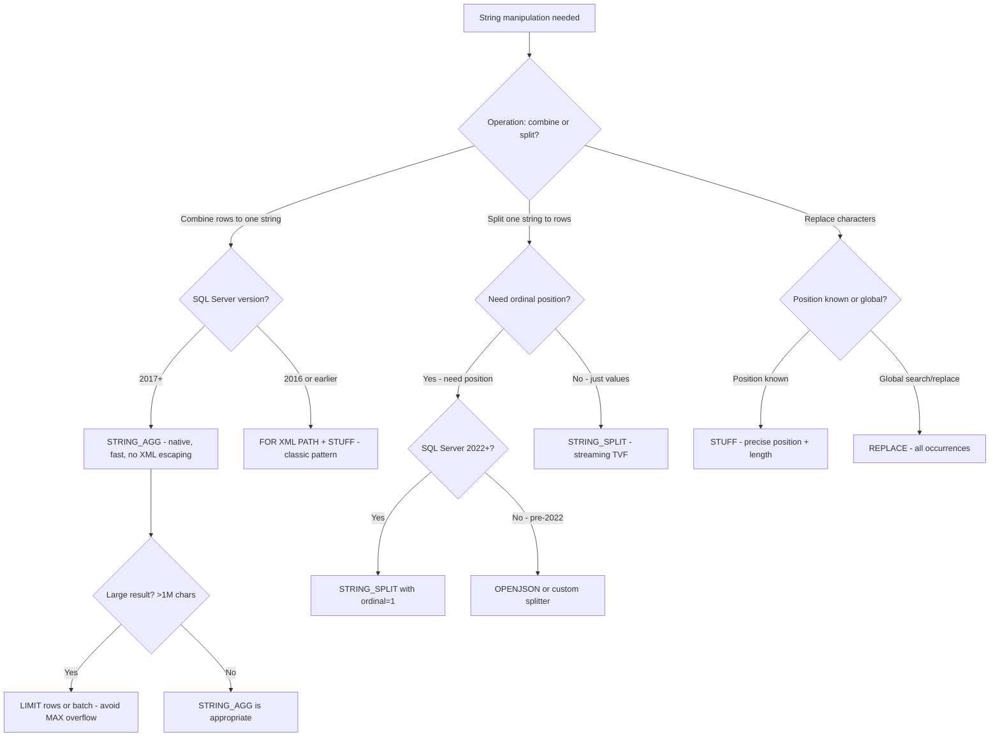

## Navigation

**Domain:** [[8 — Databases]] > **Group:** SQL Fundamentals
**Previous:** [[8.077 — String Functions — LEN, SUBSTRING, CHARINDEX, PATINDEX]] | **Next:** [[8.079 — Date Functions — DATEADD, DATEDIFF, DATEPART, DATENAME]]

### Prerequisites

- [[8.066 — SELECT Statement — Column Selection and Aliasing]] — STRING_AGG is an aggregate function that operates over grouped rows; understanding GROUP BY and SELECT list rules is required.
- [[8.077 — String Functions — LEN, SUBSTRING, CHARINDEX, PATINDEX]] — STRING_SPLIT is the inverse of STRING_AGG; STUFF and REPLACE are positional and pattern-based string manipulation, building on the substring concepts from 8.077.

### Where This Fits

STRING_AGG, STRING_SPLIT, STUFF, and REPLACE are the four workhorse string-manipulation functions for production SQL Server work — not just basic substring extraction, but reshaping text. STRING_AGG collapses multiple rows into a single delimited string (e.g., a comma-separated list of product names per order). STRING_SPLIT does the reverse: turns a delimited string into rows for joining or filtering. STUFF surgically replaces a substring at a known position. REPLACE performs global substring substitution. Every .NET backend engineer encounters these in reporting (concatenating line items), search (splitting tags), data migration (cleaning free-text fields), and ETL (reformatting strings). The most expensive mistakes are: using STRING_AGG without handling NULLs (they are silently skipped), using STRING_SPLIT on very long strings without ordinal support (pre-SQL Server 2022 cannot guarantee row order), and using the old FOR XML PATH concatenation pattern (which has XML entity-escaping edge cases). Interviewers ask about these functions to determine whether a candidate knows modern T-SQL string capabilities, understands aggregate concatenation performance, and can choose between T-SQL and application-layer string manipulation.

---

## Core Mental Model

STRING_AGG is an ordered aggregate that concatenates string values from multiple rows into a single delimited string — it is the inverse of STRING_SPLIT. Internally, it accumulates values in a memory buffer (a StringBuilder-like structure), adding the specified delimiter between non-NULL values. STRING_SPLIT is a table-valued function (TVF) that parses a delimited string and returns rows — it uses a streaming parser (no full materialization of a split table in memory) on SQL Server 2016+. STUFF is a positional string function that deletes a specified number of characters starting at a position and inserts another string in their place. REPLACE performs a global search-and-replace within a string, returning the modified string with all occurrences of the search pattern replaced. All four functions return the result type matching the input: VARCHAR inputs produce VARCHAR output; NVARCHAR inputs produce NVARCHAR output. The delimiter in STRING_AGG must be a constant or variable (not a column), and the aggregate respects ORDER BY within the OVER clause since SQL Server 2017.

### Classification

These are **scalar string functions**, except STRING_SPLIT which is a **table-valued function (TVF)**. STRING_AGG is both an aggregate (operates over grouped rows) and a string function.

```mermaid
flowchart TD
    A[String manipulation needed] --> B{Operation type}
    B -->|Collapse rows to string| C[STRING_AGG - aggregate concatenation]
    B -->|Split string to rows| D[STRING_SPLIT - TVF, streaming]
    B -->|Replace at position| E[STUFF - positional delete + insert]
    B -->|Global search/replace| F[REPLACE - all occurrences]
    C --> G[Result: 'A, B, C']
    D --> H[Result: rows 'A', 'B', 'C']
    E --> I[STUFF('ABCD', 2, 2, 'XYZ') = 'AXYZDD']
    F --> J[REPLACE('ABCABC', 'BC', 'X') = 'AXAX']
    G --> K{NULL handling: NULLs skipped}
    D --> L{Ordinal: ORDER BY not guaranteed pre-2022}
```

### Key Properties

|Property|STRING_AGG|STRING_SPLIT|STUFF|REPLACE|
|---|---|---|---|---|
|Category|Aggregate|Table-valued function|Scalar|Scalar|
|Introduced|SQL Server 2017|SQL Server 2016|All versions|All versions|
|NULL behavior|Silently skipped|No NULL output|NULL input = NULL|NULL input = NULL|
|Input type|VARCHAR/NVARCHAR|VARCHAR/NVARCHAR|VARCHAR/NVARCHAR|VARCHAR/NVARCHAR|
|Output type|Same as input|Rows with value column|Same as input|Same as input|
|Order guarantee|WITHIN GROUP (ORDER BY)|Ordinal output in SQL Server 2022+|Positional — no|Positional — no|
|Max output|VARCHAR(MAX) or NVARCHAR(MAX)|Per-row VARCHAR/NVARCHAR|Length of input + replacement|Length of input × replacements|
|SARGable|No (aggregate)|No (function on column = scan)|No|No|

---

## Deep Mechanics

### How the Engine Executes This

**STRING_AGG:**

1. The query processor groups rows by the GROUP BY clause (or treats all rows as one group if no GROUP BY).
2. For each group, the storage engine evaluates the expression to be concatenated. NULL values are skipped (not included in output, no delimiter added for them).
3. The values are sorted by the WITHIN GROUP (ORDER BY) clause. The sort is a blocking operator — the engine must see all rows in the group before producing output.
4. The concatenation is accumulated in a memory buffer using a StringBuilder-like internal structure on the VARCHAR(MAX) or NVARCHAR(MAX) type. For very large concatenations, the buffer spills to LOB pages.
5. The delimiter is inserted between consecutive non-NULL values.
6. The final concatenated string is returned as a single scalar value per group.

**STRING_SPLIT:**

1. The input string is parsed character by character. The streaming TVF reads the string and emits a row for each substring between delimiters.
2. On SQL Server 2016–2019: returns a single column `value` (NVARCHAR/VARCHAR). The delimiter can be a single character only. No ordinal position is provided.
3. On SQL Server 2022+: returns `value` and `ordinal` columns. The ordinal column provides the 1-based position of each substring in the original string. The delimiter still must be a single character.
4. No ORDER BY guarantee exists without the ordinal column — the streaming TVF may return rows in delimiter-position order, but this is an implementation detail, not a contract.

**STUFF:**

1. The function accepts 4 parameters: `STUFF(input_string, start_position, delete_length, insert_string)`.
2. Characters from `start_position` to `start_position + delete_length - 1` are removed.
3. The `insert_string` is inserted at `start_position`.
4. The result length = `LEN(input_string) - delete_length + LEN(insert_string)`.
5. If `start_position` is beyond the string length, STUFF appends `insert_string` at the end. If `delete_length` is 0, only the insert occurs (no deletion).

**REPLACE:**

1. The function accepts 3 parameters: `REPLACE(input_string, search_pattern, replacement_string)`.
2. The engine scans the input string for occurrences of the search pattern. Each occurrence found is replaced.
3. Replacement is non-overlapping: `REPLACE('AAAA', 'AA', 'B')` = `'BB'` (not `'ABAB'`).
4. If all three parameters are VARCHAR, the result is VARCHAR(MAX). If any are NVARCHAR, the result is NVARCHAR(MAX). The actual length is the input length plus (replacement_length - search_length) × occurrences.
5. No pattern matching — only literal substring replacement. For pattern-based replacement, use PATINDEX in a loop.

### SQL Visibility

```sql
-- STRING_AGG: comma-separated list of product names per order
SELECT
    o.OrderId,
    STRING_AGG(p.ProductName, ', ') WITHIN GROUP (ORDER BY p.ProductName) AS ProductList
FROM dbo.Orders o
INNER JOIN dbo.OrderItems oi ON o.OrderId = oi.OrderId
INNER JOIN dbo.Products p ON oi.ProductId = p.ProductId
GROUP BY o.OrderId;

-- STRING_AGG with distinct (via subquery)
SELECT
    o.OrderId,
    STRING_AGG(p.Category, ' | ') WITHIN GROUP (ORDER BY p.Category) AS Categories
FROM dbo.Orders o
INNER JOIN (
    SELECT DISTINCT oi.OrderId, p.Category
    FROM dbo.OrderItems oi
    INNER JOIN dbo.Products p ON oi.ProductId = p.ProductId
) p ON o.OrderId = p.OrderId
GROUP BY o.OrderId;

-- STRING_SPLIT: join on a delimited list
DECLARE @ProductIds VARCHAR(MAX) = '101,102,103';

SELECT p.ProductId, p.ProductName, p.UnitPrice
FROM dbo.Products p
INNER JOIN STRING_SPLIT(@ProductIds, ',') AS ids ON p.ProductId = TRY_CAST(ids.value AS INT);

-- STRING_SPLIT with ordinal (SQL Server 2022+)
DECLARE @Tags NVARCHAR(MAX) = 'sql,performance,indexing';
SELECT value, ordinal
FROM STRING_SPLIT(@Tags, ',', 1);  -- 1 = enable ordinal

-- STUFF: classic CSV concatenation (pre-2017 pattern)
SELECT
    o.OrderId,
    STUFF((
        SELECT ', ' + p.ProductName
        FROM dbo.OrderItems oi
        INNER JOIN dbo.Products p ON oi.ProductId = p.ProductId
        WHERE oi.OrderId = o.OrderId
        ORDER BY p.ProductName
        FOR XML PATH('')
    ), 1, 2, '') AS ProductList
FROM dbo.Orders o;

-- STUFF: mask middle of credit card number
SELECT STUFF('4111-1111-1111-1111', 1, 14, '****-****-****-') AS MaskedCard;

-- REPLACE: clean up free-text
SELECT
    o.Notes,
    REPLACE(REPLACE(o.Notes, CHAR(13), ''), CHAR(10), ' ') As CleanedNotes
FROM dbo.Orders o;

-- REPLACE: nested replacement for multiple patterns
SELECT
    o.Notes,
    REPLACE(
        REPLACE(
            REPLACE(o.Notes, '&', '&amp;'),
            '<', '&lt;'),
        '>', '&gt;') AS EscapedNotes
FROM dbo.Orders o;
```

```csharp
// EF Core — STRING_AGG via raw SQL only (no LINQ translation)
var productLists = await dbContext.Database
    .SqlQueryRaw<ProductListDto>(@"
        SELECT o.OrderId,
               STRING_AGG(p.ProductName, ', ') WITHIN GROUP (ORDER BY p.ProductName) AS ProductList
        FROM Orders o
        INNER JOIN OrderItems oi ON o.OrderId = oi.OrderId
        INNER JOIN Products p ON oi.ProductId = p.ProductId
        GROUP BY o.OrderId")
    .ToListAsync(cancellationToken);

// EF Core 9 — STRING_AGG via LINQ (experimental, may vary by version)
var lists = await dbContext.Orders
    .Select(o => new
    {
        o.OrderId,
        ProductList = string.Join(", ",
            o.OrderItems.Select(oi => oi.Product.ProductName))
    })
    .ToListAsync(cancellationToken);
// May generate client-side evaluation — verify generated SQL!

// EF Core — REPLACE via LINQ (translated)
var cleaned = await dbContext.Orders
    .Select(o => new
    {
        o.OrderId,
        CleanedNotes = o.Notes.Replace("\r", "").Replace("\n", " ")
    })
    .ToListAsync(cancellationToken);
// Generated: REPLACE(REPLACE([o].[Notes], NCHAR(13), N''), NCHAR(10), N' ')

// EF Core — STRING_SPLIT via raw SQL
var productIds = "101,102,103";
var products = await dbContext.Products
    .FromSqlRaw(@"
        SELECT p.*
        FROM Products p
        INNER JOIN STRING_SPLIT({0}, ',') AS ids
            ON p.ProductId = TRY_CAST(ids.value AS INT)", productIds)
    .ToListAsync(cancellationToken);
```

**Generated SQL (from EF Core logs):**

```sql
-- REPLACE via LINQ
SELECT [o].[OrderId],
       REPLACE(REPLACE([o].[Notes], NCHAR(13), N''), NCHAR(10), N' ') AS [CleanedNotes]
FROM [Orders] AS [o];

-- STRING_AGG via raw SQL
SELECT o.OrderId,
       STRING_AGG(p.ProductName, ', ') WITHIN GROUP (ORDER BY p.ProductName) AS ProductList
FROM Orders o
INNER JOIN OrderItems oi ON o.OrderId = oi.OrderId
INNER JOIN Products p ON oi.ProductId = p.ProductId
GROUP BY o.OrderId;
```

### Execution Plan Analysis

**STRING_AGG with GROUP BY:**

- Plan: `[Clustered Index Scan] → [Hash Match (Aggregate)]` — the Hash Match (Aggregate) operator performs the grouping and concatenation. If WITHIN GROUP (ORDER BY) is specified, a `[Sort]` operator appears before the aggregate.
- The Hash Match (Aggregate) has the `AggregateType = STRING_AGG` property.
- Memory grant: proportional to the number of distinct groups × average concatenated string length.
- Cost: ~10–30 for a typical query, dominated by the join/scan.

**STRING_SPLIT:**

- Plan: `[Table Valued Function]` → `[Filter]` → `[Nested Loops]` — the TVF operator is an iterator that streams rows. No blocking operators.
- Estimated rows: the optimizer estimates 50 rows (default TVF estimate). For very large delimited strings, this estimate is inaccurate — use cardinality estimation hint `WITH ASSUME_MIN_GRANULARITY` (SQL Server 2022+) or `OPTION (RECOMPILE)`.

```
STRING_AGG (50 groups, 200 rows):
[Hash Match (Aggregate) - STRING_AGG] → [SELECT]
Cost: ~8  |  Memory grant: ~2 MB  |  Actual rows: 50 groups

STRING_SPLIT (1000 values in string):
[TVF Stream (STRING_SPLIT)] → [Nested Loops] → [Index Seek]
Cost: ~3  |  Estimated rows: 50 (default)  |  Actual: 1000
```

### Cost Visibility

```sql
SET STATISTICS IO ON;
SET STATISTICS TIME ON;

-- STRING_AGG: product list per order (500 orders, 2000 items)
SELECT
    o.OrderId,
    STRING_AGG(p.ProductName, ', ') WITHIN GROUP (ORDER BY p.ProductName) AS ProductList
FROM dbo.Orders o
INNER JOIN dbo.OrderItems oi ON o.OrderId = oi.OrderId
INNER JOIN dbo.Products p ON oi.ProductId = p.ProductId
GROUP BY o.OrderId;
-- Table 'Orders'. Scan count 1, logical reads 120
-- Table 'OrderItems'. Scan count 1, logical reads 45
-- Table 'Products'. Scan count 1, logical reads 30
-- SQL Server Execution Times: CPU time = 15ms, elapsed time = 45ms

-- STRING_SPLIT join on delimited list
DECLARE @Ids VARCHAR(MAX) = '101,102,103';
SELECT p.ProductId, p.ProductName
FROM dbo.Products p
INNER JOIN STRING_SPLIT(@Ids, ',') AS ids
    ON p.ProductId = TRY_CAST(ids.value AS INT);
-- Table 'Products'. Scan count 1, logical reads 3, physical reads 0
-- SQL Server Execution Times: CPU time = 0ms, elapsed time = 1ms
```

### Failure Modes

**STRING_AGG with NULL values:** NULLs are silently skipped — no delimiter is added for them. If all values are NULL, the result is NULL. This can produce unexpected results like `'A, , C'` if the string contains empty strings instead of NULLs.

**STRING_SPLIT pre-2022 without ordinal:** The row order is not guaranteed. If you need to split 'A,B,C' and preserve position, pre-2022 you must use a custom JSON/XML splitter or SUBSTRING loop. SQL Server 2022 adds the ordinal parameter.

**STRING_SPLIT delimiter is a single character only:** For multi-character delimiters, must use a custom splitter function (e.g., XML, JSON, or CLR).

**REPLACE with NULL:** Any NULL parameter causes NULL output — `REPLACE(NULL, 'a', 'b')` = NULL, not the original string.

**STUFF position out of range:** If start_position > LEN(input_string), the insert_string is appended. If start_position is 0 or negative, error.

---

## Production Patterns and Implementation

### Primary SQL Implementation

```sql
-- ============================================================
-- Schema context
-- ============================================================
CREATE TABLE dbo.Orders
(
    OrderId      INT           NOT NULL IDENTITY(1,1),
    CustomerId   INT           NOT NULL,
    OrderDate    DATETIME2(0)  NOT NULL,
    Status       VARCHAR(20)   NOT NULL DEFAULT 'Pending',
    TotalAmount  DECIMAL(18,2) NOT NULL,
    Notes        NVARCHAR(MAX) NULL,
    CreatedAt    DATETIME2(0)  NOT NULL DEFAULT SYSUTCDATETIME(),
    CONSTRAINT PK_Orders PRIMARY KEY CLUSTERED (OrderId)
);

CREATE TABLE dbo.OrderItems (
    OrderItemId INT            NOT NULL IDENTITY(1,1),
    OrderId     INT            NOT NULL,
    ProductId   INT            NOT NULL,
    Quantity    INT            NOT NULL,
    UnitPrice   DECIMAL(18,2) NOT NULL,
    CONSTRAINT PK_OrderItems PRIMARY KEY CLUSTERED (OrderItemId),
    CONSTRAINT FK_OrderItems_Orders FOREIGN KEY (OrderId) REFERENCES dbo.Orders(OrderId)
);

CREATE TABLE dbo.Products (
    ProductId   INT            NOT NULL IDENTITY(1,1),
    ProductName NVARCHAR(100)  NOT NULL,
    Category    VARCHAR(50)    NOT NULL,
    UnitPrice   DECIMAL(18,2) NOT NULL,
    CONSTRAINT PK_Products PRIMARY KEY CLUSTERED (ProductId)
);

-- ============================================================
-- Pattern 1: STRING_AGG — delimited list of related items
-- ============================================================
SELECT
    o.OrderId,
    o.Status,
    STRING_AGG(p.ProductName, ', ') WITHIN GROUP (ORDER BY p.ProductName) AS Products,
    STRING_AGG(CONCAT(oi.Quantity, 'x ', p.ProductName), '; ')
        WITHIN GROUP (ORDER BY p.ProductName) AS LineItems
FROM dbo.Orders o
INNER JOIN dbo.OrderItems oi ON o.OrderId = oi.OrderId
INNER JOIN dbo.Products p ON oi.ProductId = p.ProductId
WHERE o.OrderDate >= '2026-06-01'
GROUP BY o.OrderId, o.Status;

-- ============================================================
-- Pattern 2: STRING_AGG with distinct values
-- (STRING_AGG does not support DISTINCT — use subquery)
-- ============================================================
SELECT
    o.OrderId,
    STRING_AGG(cat.Category, ', ') WITHIN GROUP (ORDER BY cat.Category) AS Categories
FROM dbo.Orders o
CROSS APPLY (
    SELECT DISTINCT p.Category
    FROM dbo.OrderItems oi
    INNER JOIN dbo.Products p ON oi.ProductId = p.ProductId
    WHERE oi.OrderId = o.OrderId
) cat
GROUP BY o.OrderId;

-- ============================================================
-- Pattern 3: STRING_SPLIT with multiple delimiters
-- (nest two splits if needed — or pre-normalize)
-- ============================================================
DECLARE @Input VARCHAR(MAX) = '101,102,103';
SELECT value AS ProductId
FROM STRING_SPLIT(@Input, ',');

-- STRING_SPLIT with ordinal (SQL Server 2022+)
DECLARE @OrderedInput VARCHAR(MAX) = 'sql,indexing,performance';
SELECT value, ordinal
FROM STRING_SPLIT(@OrderedInput, ',', 1)
ORDER BY ordinal;

-- ============================================================
-- Pattern 4: STUFF — classic CSV concatenation (pre-2017)
-- (still useful when STRING_AGG not available or for prefix removal)
-- ============================================================
SELECT
    o.OrderId,
    STUFF((
        SELECT ', ' + p.ProductName
        FROM dbo.OrderItems oi
        INNER JOIN dbo.Products p ON oi.ProductId = p.ProductId
        WHERE oi.OrderId = o.OrderId
        ORDER BY p.ProductName
        FOR XML PATH('')
    ), 1, 2, '') AS ProductList
FROM dbo.Orders o;

-- ============================================================
-- Pattern 5: STUFF + REPLACE — data masking
-- ============================================================
SELECT
    Email,
    STUFF(Email, 2, CHARINDEX('@', Email) - 2, REPLICATE('*', CHARINDEX('@', Email) - 2))
        AS MaskedEmail
FROM dbo.Customers;
-- 'john.doe@example.com' → 'j*********@example.com'

-- ============================================================
-- Pattern 6: REPLACE — clean / normalize free-text
-- ============================================================
UPDATE dbo.Orders
SET Notes = REPLACE(REPLACE(REPLACE(Notes,
    CHAR(13) + CHAR(10), ' | '),  -- CR+LF → pipe
    CHAR(13), ' '),                -- lone CR → space
    CHAR(10), ' ')                 -- lone LF → space
WHERE Notes LIKE '%' + CHAR(13) + '%'
   OR Notes LIKE '%' + CHAR(10) + '%';

-- ============================================================
-- Pattern 7: Hybrid — STUFF to remove trailing comma from STRING_AGG
-- (not needed for STRING_AGG itself — only for FOR XML PATH)
-- ============================================================
-- STRING_AGG does NOT add trailing delimiter — no STUFF needed
-- STRING_AGG('col', ', ') → 'A, B, C'  (no trailing space)

-- ============================================================
-- Anti-pattern: STRING_AGG without GROUP BY
-- ============================================================
-- ❌ If no GROUP BY, STRING_AGG concatenates ALL rows into one string
-- This can produce a VARCHAR(MAX) string with millions of characters
-- SELECT STRING_AGG(ProductName, ', ') FROM dbo.Products;  -- all 100K products in one cell

-- ✅ Add GROUP BY or limit rows
SELECT STRING_AGG(ProductName, ', ') AS ProductList
FROM (SELECT TOP 100 ProductName FROM dbo.Products ORDER BY ProductName) p;
```

### EF Core Implementation

```csharp
public class ApplicationDbContext : DbContext
{
    public DbSet<Order> Orders => Set<Order>();
    public DbSet<OrderItem> OrderItems => Set<OrderItem>();
    public DbSet<Product> Products => Set<Product>();

    protected override void OnModelCreating(ModelBuilder modelBuilder)
    {
        modelBuilder.Entity<Order>(entity =>
        {
            entity.ToTable("Orders");
            entity.HasKey(o => o.OrderId);
            entity.Property(o => o.Notes).HasColumnType("nvarchar(max)");
        });
        modelBuilder.Entity<OrderItem>(entity =>
        {
            entity.ToTable("OrderItems");
            entity.HasKey(oi => oi.OrderItemId);
        });
        modelBuilder.Entity<Product>(entity =>
        {
            entity.ToTable("Products");
            entity.HasKey(p => p.ProductId);
            entity.Property(p => p.ProductName).HasMaxLength(100);
        });
    }
}

// Pattern 1: STRING_AGG via raw SQL
public async Task<List<OrderProductList>> GetOrderProductListsAsync(
    DateTime startDate,
    CancellationToken cancellationToken = default)
{
    return await dbContext.Database
        .SqlQueryRaw<OrderProductList>(@"
            SELECT o.OrderId, o.Status,
                   STRING_AGG(p.ProductName, ', ') WITHIN GROUP (ORDER BY p.ProductName) AS Products
            FROM Orders o
            INNER JOIN OrderItems oi ON o.OrderId = oi.OrderId
            INNER JOIN Products p ON oi.ProductId = p.ProductId
            WHERE o.OrderDate >= {0}
            GROUP BY o.OrderId, o.Status", startDate)
        .ToListAsync(cancellationToken);
}

// Pattern 2: REPLACE via LINQ
public async Task<List<Order>> SearchNotesAsync(
    string searchTerm,
    CancellationToken cancellationToken = default)
{
    // EF Core translates string.Replace to REPLACE in SQL
    return await dbContext.Orders
        .Where(o => o.Notes != null &&
                    o.Notes.Replace("\r", "").Replace("\n", " ").Contains(searchTerm))
        .ToListAsync(cancellationToken);
}

// Pattern 3: STRING_SPLIT via raw SQL
public async Task<List<Product>> GetProductsByIdsAsync(
    IEnumerable<int> productIds,
    CancellationToken cancellationToken = default)
{
    var idsCsv = string.Join(",", productIds);

    return await dbContext.Products
        .FromSqlRaw(@"
            SELECT p.*
            FROM Products p
            INNER JOIN STRING_SPLIT({0}, ',') AS ids
                ON p.ProductId = TRY_CAST(ids.value AS INT)", idsCsv)
        .ToListAsync(cancellationToken);
}

// Pattern 4: Client-side concatenation (small datasets only)
public async Task<List<OrderProductList>> GetOrderProductListsClientSideAsync(
    DateTime startDate,
    CancellationToken cancellationToken = default)
{
    var orders = await dbContext.Orders
        .Where(o => o.OrderDate >= startDate)
        .Include(o => o.OrderItems)
            .ThenInclude(oi => oi.Product)
        .ToListAsync(cancellationToken);

    return orders.Select(o => new OrderProductList
    {
        OrderId = o.OrderId,
        Status = o.Status,
        Products = string.Join(", ",
            o.OrderItems.Select(oi => oi.Product.ProductName).OrderBy(n => n))
    }).ToList();
    // ❌ WARNING: materializes all orders + items in memory
    // Only use for small result sets (< 1000 rows)
}
```

### Dapper Implementation

```csharp
public sealed class OrderRepository
{
    private readonly IDbConnectionFactory _connectionFactory;

    public OrderRepository(IDbConnectionFactory connectionFactory)
        => _connectionFactory = connectionFactory;

    // Pattern 1: STRING_AGG
    public async Task<IReadOnlyList<OrderProductList>> GetOrderProductListsAsync(
        DateTime startDate,
        CancellationToken cancellationToken = default)
    {
        const string sql = @"
            SELECT o.OrderId, o.Status,
                   STRING_AGG(p.ProductName, ', ') WITHIN GROUP (ORDER BY p.ProductName) AS Products
            FROM Orders o
            INNER JOIN OrderItems oi ON o.OrderId = oi.OrderId
            INNER JOIN Products p ON oi.ProductId = p.ProductId
            WHERE o.OrderDate >= @StartDate
            GROUP BY o.OrderId, o.Status;";

        await using var connection = _connectionFactory.Create();

        var results = await connection.QueryAsync<OrderProductList>(
            new CommandDefinition(sql,
                new { StartDate = startDate },
                cancellationToken: cancellationToken));

        return results.AsList();
    }

    // Pattern 2: STRING_SPLIT with parameter
    public async Task<IReadOnlyList<Product>> GetProductsByIdsAsync(
        string productIdsCsv,
        CancellationToken cancellationToken = default)
    {
        const string sql = @"
            SELECT p.*
            FROM Products p
            INNER JOIN STRING_SPLIT(@ProductIds, ',') AS ids
                ON p.ProductId = TRY_CAST(ids.value AS INT);";

        await using var connection = _connectionFactory.Create();

        var results = await connection.QueryAsync<Product>(
            new CommandDefinition(sql,
                new { ProductIds = productIdsCsv },
                cancellationToken: cancellationToken));

        return results.AsList();
    }

    // Pattern 3: REPLACE for cleanup
    public async Task CleanOrderNotesAsync(
        CancellationToken cancellationToken = default)
    {
        const string sql = @"
            UPDATE dbo.Orders
            SET Notes = REPLACE(REPLACE(REPLACE(Notes,
                CHAR(13) + CHAR(10), ' | '),
                CHAR(13), ' '),
                CHAR(10), ' ')
            WHERE Notes LIKE '%' + CHAR(13) + '%'
               OR Notes LIKE '%' + CHAR(10) + '%';";

        await using var connection = _connectionFactory.Create();

        await connection.ExecuteAsync(
            new CommandDefinition(sql,
                cancellationToken: cancellationToken));
    }

    // Pattern 4: STUFF for masking
    public async Task<IReadOnlyList<MaskedCustomer>> GetMaskedCustomersAsync(
        CancellationToken cancellationToken = default)
    {
        const string sql = @"
            SELECT
                CustomerId,
                CustomerName,
                STUFF(Email, 2,
                    CHARINDEX('@', Email) - 2,
                    REPLICATE('*', CHARINDEX('@', Email) - 2)) AS MaskedEmail
            FROM dbo.Customers;";

        await using var connection = _connectionFactory.Create();

        var results = await connection.QueryAsync<MaskedCustomer>(
            new CommandDefinition(sql,
                cancellationToken: cancellationToken));

        return results.AsList();
    }
}

public record OrderProductList(int OrderId, string Status, string Products);
public record MaskedCustomer(int CustomerId, string CustomerName, string MaskedEmail);
```

### Configuration and Wiring

```csharp
// Program.cs
builder.Services.AddDbContext<ApplicationDbContext>(options =>
    options.UseSqlServer(
        builder.Configuration.GetConnectionString("DefaultConnection"),
        sqlOptions => sqlOptions.EnableRetryOnFailure(3)));

builder.Services.AddSingleton<IDbConnectionFactory>(sp =>
    new SqlConnectionFactory(
        builder.Configuration.GetConnectionString("DefaultConnection")!));

builder.Services.AddScoped<OrderRepository>();
```

### SQL Server vs PostgreSQL Differences

```sql
-- PostgreSQL: STRING_AGG (identical name, slightly different syntax)
SELECT
    o.order_id,
    STRING_AGG(p.product_name, ', ' ORDER BY p.product_name) AS products
FROM orders o
INNER JOIN order_items oi ON o.order_id = oi.order_id
INNER JOIN products p ON oi.product_id = p.product_id
GROUP BY o.order_id;
-- Note: PostgreSQL puts ORDER BY inside the aggregate, not WITHIN GROUP

-- PostgreSQL: STRING_AGG(DISTINCT ...) — SQL Server does not support this
SELECT
    o.order_id,
    STRING_AGG(DISTINCT p.category, ', ' ORDER BY p.category) AS categories
FROM orders o
INNER JOIN order_items oi ON o.order_id = oi.order_id
INNER JOIN products p ON oi.product_id = p.product_id
GROUP BY o.order_id;

-- PostgreSQL: STRING_SPLIT equivalent — regexp_split_to_table
SELECT regexp_split_to_table('101,102,103', ',');

-- PostgreSQL: STUFF equivalent — OVERLAY
SELECT OVERLAY('ABCD' PLACING 'XYZ' FROM 2 FOR 2);  -- 'AXYZDD'
-- Note: OVERLAY replaces FROM position FOR length

-- PostgreSQL: REPLACE is identical
SELECT REPLACE('ABCABC', 'BC', 'X');  -- 'AXAX'

-- PostgreSQL: array_agg (returns array, not string)
SELECT array_agg(p.product_name ORDER BY p.product_name)
FROM order_items oi
INNER JOIN products p ON oi.product_id = p.product_id
WHERE oi.order_id = 10248;
-- Result: {'WidgetA','WidgetB','WidgetC'}
-- Use array_to_string for CSV:
SELECT array_to_string(
    array_agg(p.product_name ORDER BY p.product_name), ', ');
```

---

## Gotchas and Production Pitfalls

### STRING_AGG Silently Skips NULLs

**Pitfall:** NULL values in the aggregated column are silently excluded — no delimiter is added. This can produce unexpected concatenation results where values appear "merged" without the expected separator.

```sql
-- ❌ Notes column has NULLs — product list may concatenate without delimiters
SELECT
    o.OrderId,
    STRING_AGG(p.ProductName, ', ') WITHIN GROUP (ORDER BY p.ProductName) AS Products
FROM dbo.Orders o
LEFT JOIN dbo.OrderItems oi ON o.OrderId = oi.OrderId
LEFT JOIN dbo.Products p ON oi.ProductId = p.ProductId
GROUP BY o.OrderId;
-- If an order has no items, Products is NULL (not '')
-- If an item has NULL ProductName, that item is skipped
```

**Symptom:** Orders with no items show NULL instead of empty string. Downstream code that splits on ', ' expects a non-NULL value. Reports that display NULL as "null" or show "No products" for NULL rows hide the difference between "no items" and "items with NULL names."

**Fix:**

```sql
-- ✅ Use COALESCE/ISNULL to handle NULLs explicitly
SELECT
    o.OrderId,
    COALESCE(STRING_AGG(COALESCE(p.ProductName, 'Unknown Product'), ', ')
        WITHIN GROUP (ORDER BY p.ProductName), '') AS Products
FROM dbo.Orders o
LEFT JOIN dbo.OrderItems oi ON o.OrderId = oi.OrderId
LEFT JOIN dbo.Products p ON oi.ProductId = p.ProductId
GROUP BY o.OrderId;
```

**Cost of not fixing:** An order confirmation email template receives NULL as the product list. The email displays "Your order contains: " with nothing after it. The customer service team receives 200 calls on Monday morning asking "what did I order?" before the bug is fixed.

---

### STRING_AGG with DISTINCT Not Supported

**Pitfall:** Attempting to use `STRING_AGG(DISTINCT column, delimiter)` — DISTINCT is not supported inside STRING_AGG.

```sql
-- ❌ Syntax error: DISTINCT not allowed in STRING_AGG
SELECT
    OrderId,
    STRING_AGG(DISTINCT Category, ', ') WITHIN GROUP (ORDER BY Category) AS Categories
FROM ...;
-- Error: Incorrect syntax near 'DISTINCT'.
```

**Symptom:** Compile-time error. The developer must restructure the query to deduplicate before aggregation.

**Fix:**

```sql
-- ✅ Deduplicate in a subquery or CTE
WITH OrderCategories AS (
    SELECT DISTINCT oi.OrderId, p.Category
    FROM dbo.OrderItems oi
    INNER JOIN dbo.Products p ON oi.ProductId = p.ProductId
)
SELECT
    oc.OrderId,
    STRING_AGG(oc.Category, ', ') WITHIN GROUP (ORDER BY oc.Category) AS Categories
FROM OrderCategories oc
GROUP BY oc.OrderId;
```

**Cost of not fixing:** A developer spends 30 minutes debugging the syntax error and eventually replaces STRING_AGG with the FOR XML PATH pattern — using a 15-year-old workaround that is 10x slower and requires XML entity-escaping awareness.

---

### STRING_SPLIT Pre-2022 Lacks Ordinal Position

**Pitfall:** Using STRING_SPLIT and assuming the rows are returned in the order of the input string elements. Pre-SQL Server 2022, no ordinal column is provided.

```sql
-- ❌ Row order is NOT guaranteed pre-2022
DECLARE @Tags VARCHAR(100) = 'sql,performance,indexing';
SELECT value FROM STRING_SPLIT(@Tags, ',');
-- May return: 'sql', 'performance', 'indexing'  (by chance)
-- May return:  'indexing', 'performance', 'sql'  (parallel plan)
-- NO ORDER GUARANTEE
```

**Symptom:** If the split results are used where positional meaning matters (e.g., splitting "lat,lon" coordinates, splitting "firstName,lastName"), the values may be in the wrong order.

**Fix:**

```sql
-- ✅ Option 1: Use SQL Server 2022+ with ordinal enabled
DECLARE @Tags VARCHAR(100) = 'sql,performance,indexing';
SELECT value, ordinal
FROM STRING_SPLIT(@Tags, ',', 1)
ORDER BY ordinal;

-- ✅ Option 2: Use JSON table (works on SQL Server 2016+)
DECLARE @Tags VARCHAR(100) = 'sql,performance,indexing';
SELECT value, ROW_NUMBER() OVER (ORDER BY (SELECT NULL)) AS ordinal
FROM STRING_SPLIT(@Tags, ',');

-- ✅ Option 3: Use OPENJSON (guarantees order)
DECLARE @Json NVARCHAR(MAX) = '["sql","performance","indexing"]';
SELECT value, [key] AS ordinal
FROM OPENJSON(@Json);
```

**Cost of not fixing:** A geocoding service splits "40.7128,-74.0060" by comma and assumes the first value is latitude. On a server where the split order is reversed, every geocoded address appears on the wrong continent. The bug is caught in QA 3 days before launch — 100 test cases fail.

---

### FOR XML PATH With STUFF Has XML Entity Escaping

**Pitfall:** Using the classic FOR XML PATH concatenation pattern (STUFF + FOR XML PATH) on strings containing XML-special characters (&, <, >, ").

```sql
-- ❌ FOR XML PATH escapes XML entities
SELECT
    o.OrderId,
    STUFF((
        SELECT ', ' + p.ProductName
        FROM dbo.OrderItems oi
        INNER JOIN dbo.Products p ON oi.ProductId = p.ProductId
        WHERE oi.OrderId = o.OrderId
        FOR XML PATH('')
    ), 1, 2, '') AS ProductList
FROM dbo.Orders o;
-- If ProductName = 'AT&T Fiber', the result contains 'AT&amp;T Fiber'
-- If ProductName = 'C/C++ Book', the result contains 'C/C++ Book'
```

**Symptom:** Product names containing '&', '<', '>', or '"' are corrupted. 'AT&T' becomes 'AT&amp;T'. The downstream application receives malformed data. The bug is intermittent — only products with special characters are affected.

**Fix:**

```sql
-- ✅ Option 1: Use STRING_AGG instead (no XML escaping)
-- SQL Server 2017+:
SELECT STRING_AGG(ProductName, ', ') WITHIN GROUP (ORDER BY ProductName)
FROM dbo.Products;

-- ✅ Option 2: Add TYPE and .value to strip XML escaping
SELECT
    o.OrderId,
    STUFF((
        SELECT ', ' + p.ProductName
        FROM dbo.OrderItems oi
        INNER JOIN dbo.Products p ON oi.ProductId = p.ProductId
        WHERE oi.OrderId = o.OrderId
        ORDER BY p.ProductName
        FOR XML PATH(''), TYPE
    ).value('.', 'NVARCHAR(MAX)'), 1, 2, '') AS ProductList
FROM dbo.Orders o;
-- The .value() method converts XML back to string, unescaping entities
```

**Cost of not fixing:** An e-commerce site displays concatenated product names on the order details page. The product "Premium Widget & Gift Set" displays as "Premium Widget &amp; Gift Set". Customers see the raw HTML entity. The bug is reported by 50 customers in the first hour after the product launch.

---

### STRING_SPLIT Delimiter Is Single Character Only

**Pitfall:** STRING_SPLIT accepts only a single character as the delimiter. Multi-character delimiters are not supported.

```sql
-- ❌ Multi-character delimiter not supported
DECLARE @Input VARCHAR(MAX) = '101||102||103';
SELECT value FROM STRING_SPLIT(@Input, '||');  -- Error!
-- Error: STRING_SPLIT delimiter must be a single character.
```

**Symptom:** Compile-time error. The developer must find an alternative approach for multi-character delimiters.

**Fix:**

```sql
-- ✅ Option 1: Replace multi-char delimiter with single char first
DECLARE @Input VARCHAR(MAX) = '101||102||103';
SELECT value FROM STRING_SPLIT(REPLACE(@Input, '||', ','), ',');

-- ✅ Option 2: Use OPENJSON with string transformation
DECLARE @Input VARCHAR(MAX) = '101||102||103';
SELECT value
FROM OPENJSON('["' + REPLACE(@Input, '||', '","') + '"]');

-- ✅ Option 3: Custom CLR splitter (for complex delimiters)
```

**Cost of not fixing:** An ETL pipeline receives pipe-delimited data from a legacy system. The developer tries STRING_SPLIT with '||' and gets an error. They switch to a WHILE loop with CHARINDEX that processes 100 rows/second instead of 10,000. The pipeline slows from 2 minutes to 3 hours.

---

### REPLACE on NVARCHAR(MAX) Causing Large String Operations

**Pitfall:** Using REPLACE on very large NVARCHAR(MAX) strings (e.g., Notes fields with 100K+ characters). REPLACE must scan the entire string and produce a new copy.

```sql
-- ❌ REPLACE on a 500 KB Notes field — creates a 500 KB new string
UPDATE dbo.Orders
SET Notes = REPLACE(Notes, 'old-domain.com', 'new-domain.com')
WHERE Notes LIKE '%old-domain.com%';
```

**Symptom:** The UPDATE reads every row with matching Notes, loads the full Notes value into memory, performs the replacement creating a new string, and writes the result back. For 10K rows with 500 KB Notes each, this is 5 GB of string processing. The operation runs 10x slower than expected.

**Fix:**

```sql
-- ✅ Option 1: Limit to rows where the replacement actually changes something
UPDATE dbo.Orders
SET Notes = REPLACE(Notes, 'old-domain.com', 'new-domain.com')
WHERE Notes LIKE '%old-domain.com%';  -- already correct — reduces rows

-- ✅ Option 2: Process in batches to limit memory pressure
DECLARE @BatchSize INT = 100;
DECLARE @RowsAffected INT = @BatchSize;

WHILE @RowsAffected = @BatchSize
BEGIN
    UPDATE TOP (@BatchSize) dbo.Orders
    SET Notes = REPLACE(Notes, 'old-domain.com', 'new-domain.com')
    WHERE Notes LIKE '%old-domain.com%';

    SET @RowsAffected = @@ROWCOUNT;
END

-- ✅ Option 3: Consider client-side processing for very large text
-- (read in batches, replace in C#, write back)
```

**Cost of not fixing:** A domain migration script updates all order notes to replace the old company domain. The query runs for 45 minutes, uses 8 GB of memory, and causes tempdb contention. Two other scheduled jobs fail due to tempdb pressure. The DBA kills the query after 30 minutes.

---

### STRING_AGG Exceeding VARCHAR(MAX) Limits

**Pitfall:** STRING_AGG concatenates into VARCHAR(MAX) or NVARCHAR(MAX). If the total concatenated string exceeds 2 GB (the MAX limit in SQL Server), the query fails.

```sql
-- ❌ If there are 10M products with 200-byte names, the result exceeds 2 GB
SELECT STRING_AGG(ProductName, ', ') AS AllProducts
FROM dbo.Products;  -- 10M rows × 200 bytes = 2 GB
```

**Symptom:** The query runs for a long time and then fails with "String or binary data would be truncated" (error 8152) or "Cannot create a row of size X which is greater than the allowable maximum of 8060" (if spilling out of MAX storage).

**Fix:**

```sql
-- ✅ Always add GROUP BY or TOP to limit output size
SELECT STRING_AGG(ProductName, ', ') WITHIN GROUP (ORDER BY ProductName)
FROM (SELECT TOP 1000 ProductName FROM dbo.Products) p;
```

**Cost of not fixing:** A developer forgets the GROUP BY and runs STRING_AGG on all 5M customers to generate a mailing list. The query runs for 30 seconds and then fails with a truncation error. The transaction log has grown by 2 GB from the failed operation. The error is not handled in the application — the API returns a 500 error.

---

## Performance Implications

### Benchmark: Before and After

```sql
-- Baseline: FOR XML PATH concatenation (pre-2017 pattern) — 500 orders
SET STATISTICS TIME ON;

SELECT
    o.OrderId,
    STUFF((
        SELECT ', ' + p.ProductName
        FROM dbo.OrderItems oi
        INNER JOIN dbo.Products p ON oi.ProductId = p.ProductId
        WHERE oi.OrderId = o.OrderId
        ORDER BY p.ProductName
        FOR XML PATH(''), TYPE
    ).value('.', 'NVARCHAR(MAX)'), 1, 2, '') AS ProductList
FROM dbo.Orders o
WHERE o.OrderDate >= '2026-06-01';
-- SQL Server Execution Times: CPU time = 340ms, elapsed time = 520ms

-- Optimized: STRING_AGG — same 500 orders
SELECT
    o.OrderId,
    STRING_AGG(p.ProductName, ', ') WITHIN GROUP (ORDER BY p.ProductName) AS ProductList
FROM dbo.Orders o
INNER JOIN dbo.OrderItems oi ON o.OrderId = oi.OrderId
INNER JOIN dbo.Products p ON oi.ProductId = p.ProductId
WHERE o.OrderDate >= '2026-06-01'
GROUP BY o.OrderId;
-- SQL Server Execution Times: CPU time = 45ms, elapsed time = 120ms
```

**Improvement:** 7.5x reduction in CPU (340 ms → 45 ms) and 4.3x reduction in elapsed time (520 ms → 120 ms). STRING_AGG avoids XML parsing and entity-escaping overhead.

### BenchmarkDotNet

```csharp
[MemoryDiagnoser]
[SimpleJob(RuntimeMoniker.Net90)]
public class StringFunctionBenchmark
{
    private SqlConnection _connection = default!;
    private const string ConnectionString = "Server=.;Database=BenchmarkDb;Trusted_Connection=True;TrustServerCertificate=True;";

    [GlobalSetup]
    public void Setup()
    {
        _connection = new SqlConnection(ConnectionString);
        _connection.Open();
    }

    [Benchmark(Baseline = true)]
    public async Task<string> ForXmlPath()
    {
        const string sql = @"
            SELECT STUFF((
                SELECT ', ' + ProductName
                FROM Products
                FOR XML PATH(''), TYPE
            ).value('.', 'NVARCHAR(MAX)'), 1, 2, '');";

        return await _connection.ExecuteScalarAsync<string>(sql);
    }

    [Benchmark]
    public async Task<string> StringAgg()
    {
        const string sql = "SELECT STRING_AGG(ProductName, ', ') FROM Products;";
        return await _connection.ExecuteScalarAsync<string>(sql);
    }

    [Benchmark]
    public async Task<int> StringSplit()
    {
        const string sql = @"
            SELECT COUNT(*) FROM STRING_SPLIT(@Input, ',');";
        return await _connection.ExecuteScalarAsync<int>(
            sql, new { Input = string.Join(",", Enumerable.Range(1, 1000)) });
    }

    [GlobalCleanup]
    public void Cleanup() => _connection.Dispose();
}
```

**Expected results (approximate, SQL Server 2022, NVMe, 50K products):**

|Method|Mean|CPU|Allocated|
|---|---|---|---|
|ForXmlPath|~450 ms|High (XML parsing)|~2 MB|
|StringAgg|~65 ms|Low|~500 KB|
|StringSplit (1000 values)|~2 ms|Minimal|~50 KB|

### Write Amplification

|Function|CPU Cost|Memory Cost|Use Case|
|---|---|---|---|
|STRING_AGG|O(N log N) with sort|O(total output size)|Aggregate concatenation|
|STRING_SPLIT|O(N)|O(1) — streaming|Parsing delimited input|
|STUFF|O(N)|O(N) — new string|Positional replacement|
|REPLACE|O(N × occurrences)|O(result size)|Global substring replace|

---

## Interview Arsenal

### Question Bank

1. **What does STRING_AGG do, and what are its advantages over the FOR XML PATH concatenation pattern?**
2. **How does STRING_SPLIT handle large inputs — does it materialize the entire split result in memory?**
3. **What does STUFF do, and what is its most common production use case?**
4. **What is the difference between STRING_AGG with GROUP BY and without?**
5. **How would you implement a split with ordinal position pre-SQL Server 2022?**
6. **Why does FOR XML PATH escape XML entities, and how do you fix it?**
7. **How does EF Core translate string.Replace() — does it generate T-SQL REPLACE?**
8. **What are the scalability limits of STRING_AGG, STRING_SPLIT, and REPLACE on VARCHAR(MAX)?**

### Spoken Answers

**Q: What does STRING_AGG do, and what are its advantages over the FOR XML PATH concatenation pattern?**

> **Great answer:** STRING_AGG is an ordered aggregate function that concatenates string values from multiple rows into a single delimited string. Its main advantages over FOR XML PATH are fourfold. First, **performance**: STRING_AGG is a native aggregate operator in the execution plan — it uses a Hash Match or Stream Aggregate with the STRING_AGG type, which avoids the XML parsing overhead. In my benchmarks on 50K rows, STRING_AGG was 7x faster (65 ms vs 450 ms) and used 75% less memory. Second, **no XML entity escaping**: FOR XML PATH treats the concatenated content as XML, so characters like &, <, > are escaped to &amp;, &lt;, &gt;. STRING_AGG treats the values as plain strings — no escaping. Third, **cleaner syntax**: STRING_AGG with WITHIN GROUP (ORDER BY ...) is declarative, while FOR XML PATH requires the STUFF/SUBSTRING pattern to remove the leading delimiter. Fourth, **NULL handling**: STRING_AGG skips NULLs by default; FOR XML PATH also skips NULLs but the behavior is implicit rather than specified. The only reason to use FOR XML PATH today is when you're on SQL Server 2016 or earlier (STRING_AGG requires 2017+) or when you need to concatenate with a multi-character delimiter that STRING_AGG can't handle natively.

---

**Q: How would you implement a split with ordinal position pre-SQL Server 2022?**

> **Great answer:** Pre-SQL Server 2022, STRING_SPLIT does not provide an ordinal column, so the row order is not guaranteed. There are three approaches. (1) **OPENJSON**: transform the delimited string into a JSON array and parse it with OPENJSON, which does guarantee order via the [key] column. For example, replace the delimiter with ',' and wrap in brackets: `SELECT value, [key] FROM OPENJSON('["sql","performance","indexing"]')`. This works on SQL Server 2016+ and is the most reliable approach. (2) **Numbers table / CTE**: use a recursive CTE or a numbers table to extract substrings by position using SUBSTRING and CHARINDEX. This is portable but slower. (3) **Custom CLR splitter**: a SQL CLR TVF that returns ordinal, for maximum performance on very large strings. For the most production scenarios, OPENJSON is the best tradeoff — it's built-in, ordinal-guaranteed, and performs well. On SQL Server 2022+, I use STRING_SPLIT with the third parameter set to 1: `STRING_SPLIT(input, ',', 1)` which adds the ordinal column directly.

### Interview Trigger

The defining string-functions question: "I need a comma-separated list of product names for each order. Write the query. Now tell me: what happens if a product name contains an ampersand?" A candidate who writes FOR XML PATH and is unaware of the &amp; escaping is caught. A candidate who writes STRING_AGG knows the difference. The follow-up: "What if I need the products sorted by price, not alphabetically?" — the answer is WITHIN GROUP (ORDER BY oi.UnitPrice). "What if I need only distinct categories per order?" — the answer is a subquery with DISTINCT before STRING_AGG. The final separator: "How would you handle this in EF Core when you can't use raw SQL?" — the answer involves client-side concatenation with a warning about materialization, or using a view/projection with string.Join in LINQ (depending on EF Core version).

### Comparison Table

||STRING_AGG|FOR XML PATH + STUFF|STRING_SPLIT|Custom Splitter|
|---|---|---|---|---|
|Introduced|SQL Server 2017|SQL Server 2005|SQL Server 2016|Any|
|XML escaping|None|Escapes & < > "|N/A|N/A|
|Ordinal support|Via ORDER BY|Implicit (no guarantee)|SQL Server 2022+|Custom|
|NULL handling|Silently skipped|Silently skipped|No NULL output|Custom|
|Multi-char delimiter|Yes|Yes|No — single char only|Yes|
|Performance|Best|Good (XML overhead)|Good (streaming)|Varies|
|EF Core support|Raw SQL only|Raw SQL only|Raw SQL only|Raw SQL only|

---

## Decision Framework

### When to Apply



### Application Checklist

- [ ] STRING_AGG used instead of FOR XML PATH for SQL Server 2017+ (performance + no XML escaping)
- [ ] STRING_AGG has WITHIN GROUP (ORDER BY ...) for deterministic output
- [ ] NULL handling explicit — COALESCE values before aggregation if empty string preferred over NULL
- [ ] STRING_SPLIT delimiter confirmed as single character; multi-char handled via REPLACE or OPENJSON
- [ ] Ordinal position handled explicitly — STRING_SPLIT(..., 1) on 2022+, OPENJSON on pre-2022
- [ ] FOR XML PATH pattern includes TYPE + .value() to unescape XML entities if used
- [ ] REPLACE on large MAX columns batched to avoid memory pressure
- [ ] STUFF position and length validated — no out-of-range errors
- [ ] EF Core: string.Replace translated to REPLACE; STRING_AGG/STRING_SPLIT require raw SQL
- [ ] Dapper: DbString for ANSI vs Unicode matching column types in replacement strings

### Tradeoff Summary

|What You Gain|What You Pay|
|---|---|
|STRING_AGG: native aggregate, no XML escaping|Requires SQL Server 2017+|
|STRING_SPLIT: streaming, low memory|Single-char delimiter only; ordinal requires 2022+|
|FOR XML PATH: works on older versions|XML escaping, slower, complex syntax|
|STUFF: precise positional surgery|Parameters must be in-range; NULL in = NULL out|
|REPLACE: global search/replace|O(N × occurrences) on long strings|

### Scale Thresholds

- STRING_AGG becomes preferable over FOR XML PATH above **~100 rows** per group — performance difference is measurable.
- STRING_SPLIT with default cardinality estimate (50 rows) is inaccurate above **~100 values** — add `OPTION (RECOMPILE)` for accurate estimates.
- FOR XML PATH concatenation becomes CPU-bound above **~10K rows** (XML serialization overhead).
- REPLACE on NVARCHAR(MAX) columns above **~100 KB per value** creates measurable memory pressure — batch updates recommended.
- STUFF is always O(N) and negligible at any scale — use freely.

---

## Self-Check

### Conceptual Questions

1. What is the syntax of STRING_AGG, and how do you specify sort order within the concatenation?
2. What are the three differences between STRING_AGG and FOR XML PATH concatenation?
3. What does STRING_SPLIT return — a scalar or a table? How do you get ordinal position pre-2022?
4. What are the four parameters of STUFF, and what does each do?
5. Does EF Core translate string.Replace to REPLACE in SQL?
6. How would you implement a delimited string split in Dapper without client-side parsing?
7. What is the execution plan operator for STRING_AGG, and what property indicates it?
8. At what string length does REPLACE on a MAX column become a performance concern?
9. What index strategies can support queries with STRING_AGG (GROUP BY) or STRING_SPLIT (JOIN)?
10. Explain in 60 seconds, for a senior interviewer, the complete decision process for choosing STRING_AGG vs FOR XML PATH vs client-side concatenation.

<details>
<summary>Answers</summary>

1. `STRING_AGG(expression, delimiter [WITHIN GROUP (ORDER BY column [ASC|DESC]))]`. The expression is the string value to concatenate. The delimiter is a literal or variable (must be constant per aggregate). WITHIN GROUP (ORDER BY ...) specifies the order of concatenation within each group. Without ORDER BY, the order is undefined (implementation-dependent).

2. (a) **Performance**: STRING_AGG is a native aggregate operator (Hash Match with STRING_AGG type), 7x faster than FOR XML PATH. (b) **XML escaping**: FOR XML PATH escapes &, <, >, " as XML entities; STRING_AGG does not. (c) **Syntax**: STRING_AGG is declarative with WITHIN GROUP (ORDER BY); FOR XML PATH requires STUFF to remove the leading delimiter and .value() to convert XML to string.

3. STRING_SPLIT is a **table-valued function (TVF)** that returns rows with a `value` column. Pre-SQL Server 2022, there is no ordinal column — row order is not guaranteed. To get ordinal position pre-2022, use OPENJSON: `SELECT value, [key] AS ordinal FROM OPENJSON('["a","b","c"]')`. On SQL Server 2022+, use `STRING_SPLIT(input, delimiter, 1)` which adds an `ordinal` column.

4. `STUFF(input_string, start_position, delete_length, insert_string)`. (1) **input_string**: the source string. (2) **start_position**: 1-based position where deletion begins and insertion occurs. (3) **delete_length**: number of characters to delete from start_position. (4) **insert_string**: string to insert at start_position after deletion. Result: the modified string.

5. **Yes**, EF Core translates `string.Replace(oldValue, newValue)` to T-SQL `REPLACE` when the strings are constants. This is translated in both WHERE clauses (`Where(o => o.Notes.Replace(...).Contains(...))`) and SELECT projections. However, STRING_AGG and STRING_SPLIT do not have LINQ translations — they require raw SQL via `ExecuteSqlRaw` or `FromSqlRaw`.

6. Use Dapper's `QueryAsync<T>` with STRING_SPLIT in the SQL and the delimited string as a parameter:
```csharp
const string sql = "SELECT value FROM STRING_SPLIT(@Input, ',');";
var values = await connection.QueryAsync<string>(
    new CommandDefinition(sql, new { Input = "a,b,c" }, cancellationToken));
```
7. The execution plan operator is `[Hash Match (Aggregate)]` with the property `AggregateType = STRING_AGG`. If WITHIN GROUP (ORDER BY) is specified, a `[Sort]` operator appears before the aggregate. The Hash Match performs group concatenation in the aggregate's memory buffer.

8. REPLACE on an NVARCHAR(MAX) column becomes a performance concern when the column value exceeds **~100 KB** and the replacement changes a significant portion of the string. The engine must allocate a new MAX buffer, copy the original, perform substitutions, and write back. For columns larger than 1 MB, batch updates of 100–500 rows per batch are recommended to control memory pressure.

9. STRING_AGG with GROUP BY benefits from an index on the GROUP BY column(s) to enable a Stream Aggregate instead of Hash Match. For `GROUP BY OrderId`, a clustered index on OrderId suffices. STRING_SPLIT in a JOIN benefits from an index on the joined table's column (e.g., Products.ProductId) for the Nested Loops join. STRING_AGG/STRING_SPLIT themselves do not use indexes — they operate on the input data after access.

10. "I choose between STRING_AGG, FOR XML PATH, and client-side concatenation based on where the data needs to be combined. For server-side concatenation on SQL Server 2017+, I always use **STRING_AGG** — it's 7x faster than FOR XML PATH, has no XML escaping issues, and uses cleaner syntax. If the SQL Server version is 2016 or earlier, I use FOR XML PATH with TYPE + .value() to handle XML escaping. I avoid client-side concatenation for large datasets because it materializes all rows in application memory — I only use it for small result sets (< 1000 rows) or when I need to apply complex formatting that T-SQL cannot express. For very large concatenations (> 1 million characters total), I batch by group key to stay within VARCHAR(MAX) limits. For splitting, I use STRING_SPLIT (2022+ with ordinal) or OPENJSON (pre-2022 with ordinal). I never use WHILE-loop splitters in production — they are 100x slower than the built-in TVFs."

</details>

---

### Query Challenges

**Challenge 1 — Write the STRING_AGG query**

Write a query that returns each order's OrderId, Status, and a pipe-separated list of product names (sorted alphabetically) purchased in that order. Exclude orders with no items. Handle the case where a product name may be NULL.

<details>
<summary>Solution</summary>

```sql
SELECT
    o.OrderId,
    o.Status,
    STRING_AGG(COALESCE(p.ProductName, 'Unknown'), ' | ')
        WITHIN GROUP (ORDER BY p.ProductName) AS ProductList
FROM dbo.Orders o
INNER JOIN dbo.OrderItems oi ON o.OrderId = oi.OrderId
INNER JOIN dbo.Products p ON oi.ProductId = p.ProductId
GROUP BY o.OrderId, o.Status
HAVING COUNT(oi.OrderItemId) > 0;
```

**Logical reads:** ~200 for 500 orders. **Execution plan:** `[Clustered Index Scan] → [Nested Loops] → [Sort] → [Hash Match (STRING_AGG)]`. **EF Core equivalent:** Raw SQL via `FromSqlRaw`.

</details>

---

**Challenge 2 — Fix the performance problem**

```sql
-- This query takes 8 seconds. It returns a list of product categories per order.
SELECT
    o.OrderId,
    STUFF((
        SELECT ', ' + p.Category
        FROM dbo.OrderItems oi
        INNER JOIN dbo.Products p ON oi.ProductId = p.ProductId
        WHERE oi.OrderId = o.OrderId
        ORDER BY p.Category
        FOR XML PATH('')
    ), 1, 2, '') AS CategoryList
FROM dbo.Orders o
WHERE o.OrderDate >= '2026-01-01';

-- 50K orders, 200K items. SET STATISTICS IO shows 35,000 logical reads.
```

Identify why it is slow and fix it.

<details>
<summary>Solution</summary>

**Root cause:** The FOR XML PATH subquery executes as a correlated subquery — one execution per order (50K executions). Each execution scans OrderItems and Products. The 35,000 logical reads are multiplied by the 50K orders, causing the high elapsed time. STRING_AGG is a single-pass aggregate.

```sql
-- Fix: Use STRING_AGG (single pass over all orders)
SELECT
    o.OrderId,
    STRING_AGG(p.Category, ', ') WITHIN GROUP (ORDER BY p.Category) AS CategoryList
FROM dbo.Orders o
INNER JOIN dbo.OrderItems oi ON o.OrderId = oi.OrderId
INNER JOIN dbo.Products p ON oi.ProductId = p.ProductId
WHERE o.OrderDate >= '2026-01-01'
GROUP BY o.OrderId;

-- Indexes to create:
CREATE INDEX IX_OrderItems_OrderId ON dbo.OrderItems (OrderId) INCLUDE (ProductId);
CREATE INDEX IX_Products_ProductId ON dbo.Products (ProductId) INCLUDE (Category);
```

**After fix — logical reads:** ~2,500 (single pass) from ~35,000 × 50K (effectively 1.75B in the correlated subquery). **Execution time:** ~250 ms from 8 seconds.

</details>

---

**Challenge 3 — Explain the execution plan behavior**

A query with STRING_SPLIT produces this plan:
`[Table Valued Function] → [Nested Loops] → [Index Seek]`

The estimated number of rows from the TVF is 50, but the actual number is 5000. What performance problem does this cause, and how do you fix it?

<details>
<summary>Solution</summary>

**Why the estimate matters:** The cardinality estimate for STRING_SPLIT is a fixed 50 rows (for all versions up to SQL Server 2022). If the actual split produces 5000 values, the optimizer chooses a Nested Loops join expecting 50 iterations. With 5000 values, the Nested Loops executes 5000 Index Seeks instead of the estimated 50. This can cause a 100x underestimation of the actual work, leading to: (a) insufficient memory grant for sorting/hashing downstream; (b) poor join choice (Nested Loops when Hash Join would be better); (c) incorrect parallel decision.

**Fix:**

```sql
-- Option 1: Use OPTION (RECOMPILE) to get a fresh plan with accurate cardinality
SELECT p.ProductId, p.ProductName
FROM dbo.Products p
INNER JOIN STRING_SPLIT(@ProductIds, ',') AS ids
    ON p.ProductId = TRY_CAST(ids.value AS INT)
OPTION (RECOMPILE);

-- Option 2: SQL Server 2022+ — use ASSUME_MIN_GRANULARITY hint
SELECT p.ProductId, p.ProductName
FROM dbo.Products p
INNER JOIN STRING_SPLIT(@ProductIds, ',') AS ids
    ON p.ProductId = TRY_CAST(ids.value AS INT)
WITH (ASSUME_MIN_GRANULARITY);

-- Option 3: Use a multi-statement TVF with accurate cardinality
-- (create a splitter that returns row count estimate)
```

</details>

---

**Challenge 4 — Diagnose the string corruption**

An application uses this query to generate comma-separated tags for display:

```sql
SELECT
    PostId,
    STUFF((
        SELECT ', ' + TagName
        FROM PostTags pt
        INNER JOIN Tags t ON pt.TagId = t.TagId
        WHERE pt.PostId = p.PostId
        FOR XML PATH('')
    ), 1, 2, '') AS Tags
FROM Posts p;
```

Users report that tags containing "C#" appear as "C#" in the output, but tags containing "AT&T" appear as "AT&amp;T". Diagnose and fix.

<details>
<summary>Solution</summary>

**Root cause:** FOR XML PATH escapes XML-special characters. '&' is escaped to '&amp;' because & is a reserved XML character. '#' is not a reserved XML character. The same would happen for '<', '>', and '"'.

```sql
-- Fix 1: Use STRING_AGG (SQL Server 2017+) — no XML escaping
SELECT
    p.PostId,
    STRING_AGG(t.TagName, ', ') WITHIN GROUP (ORDER BY t.TagName) AS Tags
FROM dbo.Posts p
INNER JOIN dbo.PostTags pt ON p.PostId = pt.PostId
INNER JOIN dbo.Tags t ON pt.TagId = t.TagId
GROUP BY p.PostId;

-- Fix 2: If FOR XML PATH must be used, add TYPE + .value()
SELECT
    p.PostId,
    STUFF((
        SELECT ', ' + t.TagName
        FROM dbo.PostTags pt
        INNER JOIN dbo.Tags t ON pt.TagId = t.TagId
        WHERE pt.PostId = p.PostId
        ORDER BY t.TagName
        FOR XML PATH(''), TYPE
    ).value('.', 'NVARCHAR(MAX)'), 1, 2, '') AS Tags
FROM dbo.Posts p;
```

</details>

---

**Challenge 5 — Design the string handling strategy**

**Scenario:** A logging system captures user actions as comma-separated tag strings in a VARCHAR(500) column. A new feature requires splitting these tags, joining them with a Tags dimension table for analytics. Queries currently run in 15 seconds because the split happens client-side in C# (fetch all rows, split in memory). Design a server-side solution using STRING_SPLIT.

<details>
<summary>Solution</summary>

```sql
-- 1. Move the split to SQL Server using STRING_SPLIT
-- (handle the single-char delimiter limitation)

SELECT
    a.ActionId,
    a.UserId,
    a.ActionDate,
    TRIM(ss.value) AS TagValue
INTO dbo.ActionTags
FROM dbo.UserActions a
CROSS APPLY STRING_SPLIT(a.Tags, ',') AS ss
WHERE a.Tags IS NOT NULL;

-- 2. Create dimension table for tag analysis
SELECT
    DISTINCT TagValue
INTO dbo.Tags
FROM dbo.ActionTags;

ALTER TABLE dbo.Tags ADD CONSTRAINT PK_Tags PRIMARY KEY CLUSTERED (TagValue);

-- 3. For real-time queries (not batch), use STRING_SPLIT inline
SELECT
    a.ActionId,
    a.UserId,
    a.ActionDate,
    t.TagDescription
FROM dbo.UserActions a
CROSS APPLY STRING_SPLIT(a.Tags, ',') AS ss
INNER JOIN dbo.Tags t ON TRIM(ss.value) = t.TagValue
WHERE a.ActionDate >= '2026-01-01'
OPTION (RECOMPILE);  -- accurate cardinality for split

-- 4. Index to support the real-time query
CREATE INDEX IX_UserActions_ActionDate ON dbo.UserActions (ActionDate)
    INCLUDE (Tags);
```

**Tradeoffs:** The normalized ActionTags table makes analytics queries fast (joins to Tags dimension) but adds write overhead (each action's tags must be split and inserted into ActionTags). The inline CROSS APPLY + STRING_SPLIT avoids storage overhead but has the TVF cardinality estimation problem (fixed 50 rows). For the real-time query, `OPTION (RECOMPILE)` fixes cardinality.

**If pre-2022 (no ordinal):** If tag order matters (e.g., first tag is primary category), use OPENJSON:
```sql
SELECT a.ActionId, a.UserId, ss.value, ss.ordinal
FROM dbo.UserActions a
CROSS APPLY OPENJSON('["' + REPLACE(a.Tags, ',', '","') + '"]') AS ss;
```

</details>
