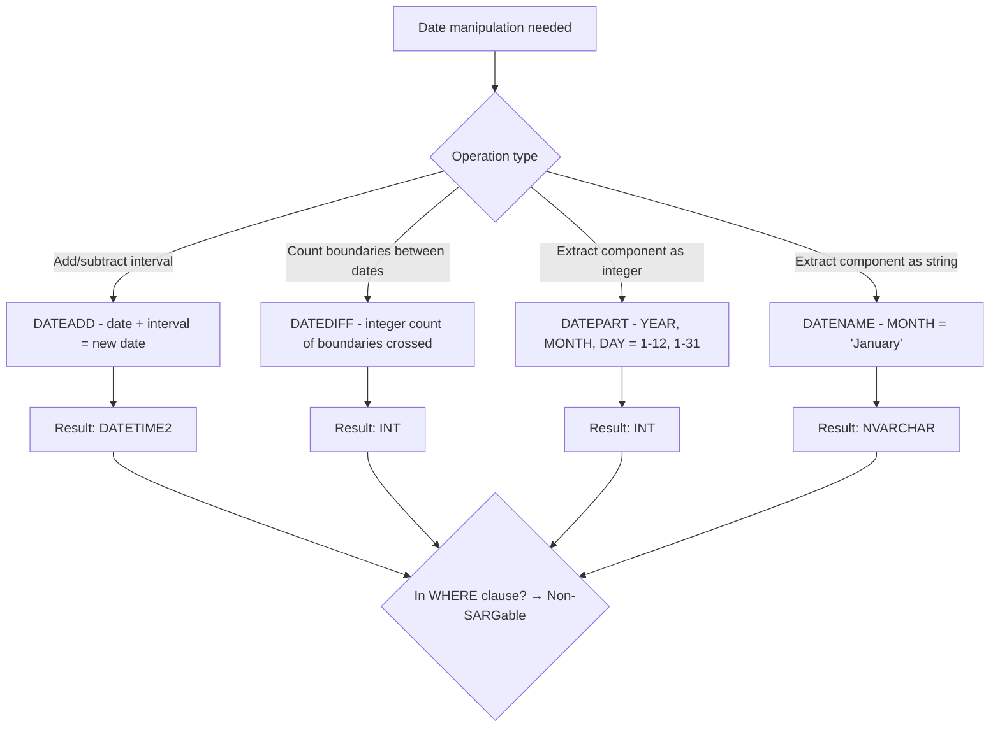

## Navigation

**Domain:** [[8 — Databases]] > **Group:** SQL Fundamentals
**Previous:** [[8.078 — String Functions — STRING_AGG, STRING_SPLIT, STUFF, REPLACE]] | **Next:** [[8.080 — Date Functions — AT TIME ZONE, DATETIMEOFFSET, FORMAT]]

### Prerequisites

- [[8.066 — SELECT Statement — Column Selection and Aliasing]] — DATEADD, DATEDIFF, DATEPART, DATENAME appear in SELECT lists and WHERE clauses; understanding projection and filter semantics is required.
- [[8.076 — Data Type Conversion — CAST and CONVERT]] — date functions return different types (DATE, INT, NVARCHAR); converting between date types and strings is the most common source of bugs.
- [[8.067 — WHERE Clause — Predicate Logic and SARGability]] — wrapping a date column in DATEPART or DATEADD in the WHERE clause makes the predicate non-SARGable, forcing scans instead of seeks.

### Where This Fits

DATEADD, DATEDIFF, DATEPART, and DATENAME are the four fundamental date manipulation functions in T-SQL. DATEADD adds or subtracts an interval to a date. DATEDIFF computes the boundary count between two dates. DATEPART extracts a single date part (year, month, day) as an integer. DATENAME returns the same as a string (e.g., 'January', 'Monday'). Every .NET backend engineer uses these daily: filtering orders by month, computing age from birth date, grouping sales by quarter, calculating expiration dates. The most expensive mistakes are: using DATEPART on a date column in WHERE (non-SARGable — forces scan), using DATEDIFF for date truncation instead of the correct range pattern (also non-SARGable), and misunderstanding DATEDIFF boundary semantics (it counts boundaries crossed, not the interval between dates). Interviewers ask about these functions to determine whether a candidate can write SARGable date predicates, understands date/time data types, and knows when to push date math to SQL Server vs the application layer.

---

## Core Mental Model

DATEADD adds a specified interval to a date: `DATEADD(YEAR, 1, OrderDate)` returns the order date plus one year. DATEDIFF returns the integer count of datepart boundaries crossed between two dates: `DATEDIFF(YEAR, '2025-12-31', '2026-01-01')` returns 1 because a year boundary was crossed, even though the dates are 1 day apart. DATEPART extracts a single component as an integer: `DATEPART(MONTH, OrderDate)` returns 1–12. DATENAME returns the component as a localized string: `DATENAME(MONTH, OrderDate)` returns 'January'. All four functions are deterministic (same inputs always produce the same output). The critical performance rule: applying any of these functions to a date column in a WHERE clause makes the predicate non-SARGable — the optimizer cannot seek on an index built on the raw date column because the comparison is against the function's output. The SARGable alternative is always a range predicate: `WHERE OrderDate >= '2026-01-01' AND OrderDate < '2026-02-01'` instead of `WHERE DATEPART(YEAR, OrderDate) = 2026 AND DATEPART(MONTH, OrderDate) = 1`.

### Classification

These are **scalar date functions**. They belong to the expression evaluation phase of query execution. None are SARGable when applied to a column in a predicate.



### Key Properties

|Property|DATEADD|DATEDIFF|DATEPART|DATENAME|
|---|---|---|---|---|
|Return type|Input date type|INT|INT|NVARCHAR (localized)|
|Datepart arguments|YEAR, QUARTER, MONTH, DAY, HOUR, etc.|Same|Same|Same|
|SARGable (on column)|No|No|No|No|
|Deterministic|Yes|Yes|Yes|Yes (but locale-dependent)|
|First day of week|Default: Sunday|N/A|SET DATEFIRST affects WEEKDAY|SET DATEFIRST affects|
|NULL input|NULL|NULL|NULL|NULL|
|Common uses|Expiration dates, schedule calc|Age calculation, duration metrics|Grouping by month/year|Display month/day names|

---

## Deep Mechanics

### How the Engine Executes This

**DATEADD:**

1. The datepart is evaluated to determine the interval type (YEAR, MONTH, DAY, HOUR, etc.).
2. The engine validates the input date is a valid date type (DATETIME, DATETIME2, DATE, etc.).
3. For each unit type, the internal representation is adjusted:
   - DAY: the integer offset from base date (1900-01-01 for DATETIME, 0001-01-01 for DATETIME2) is incremented directly.
   - MONTH: the month component is adjusted. If the result month has fewer days than the source day, the day is truncated to the month's max day (e.g., DATEADD(MONTH, 1, '2026-01-31') = '2026-02-28').
   - YEAR: the year component is adjusted; same month-day truncation logic if the resulting February 29 in a non-leap year.
   - HOUR/MINUTE/SECOND: the time portion offset is adjusted.
4. The result type matches the input type (DATE → DATE, DATETIME2 → DATETIME2).

**DATEDIFF:**

1. Both startdate and enddate are validated.
2. The engine counts the number of **boundaries** of the specified datepart crossed between start and end.
3. For DATEDIFF(YEAR, ...): only the year component is compared. `DATEDIFF(YEAR, '2026-12-31', '2027-01-01')` = 1 because the year component changed from 2026 to 2027. The actual interval is 1 day.
4. For DATEDIFF(MONTH, ...): only the year*12 + month component is compared. `DATEDIFF(MONTH, '2026-01-31', '2026-02-01')` = 1 because the month component changed, even though the gap is 1 day.
5. The result is always an INT (signed 32-bit). For very large intervals (billions of seconds), DATEDIFF_BIG (SQL Server 2016+) returns BIGINT.

**DATEPART / DATENAME:**

1. The datepart is extracted from the input date.
2. DATEPART returns the integer value of that component: YEAR = 2026, MONTH = 6, DAY = 24, WEEKDAY = 4 (for Wednesday, depending on DATEFIRST).
3. DATENAME returns the string name: MONTH = 'June', WEEKDAY = 'Wednesday'.
4. DATENAME is locale-aware — the month and day names depend on the session's language setting.
5. DATEPART(WEEKDAY) depends on SET DATEFIRST (default 7 = Sunday). DATENAME(WEEKDAY) also depends on DATEFIRST.

### SQL Visibility

```sql
-- DATEADD: add intervals
SELECT
    o.OrderId,
    o.OrderDate,
    DATEADD(DAY, 30, o.OrderDate) AS ExpirationDate,
    DATEADD(MONTH, 3, o.OrderDate) AS WarrantyEnd,
    DATEADD(YEAR, -1, o.OrderDate) AS OneYearBefore,
    DATEADD(HOUR, 2, o.OrderDate) AS PlusTwoHours
FROM dbo.Orders AS o;

-- DATEDIFF: compute intervals
SELECT
    o.OrderId,
    o.OrderDate,
    GETUTCDATE() AS Now,
    DATEDIFF(DAY, o.OrderDate, GETUTCDATE()) AS DaysSinceOrder,
    DATEDIFF(MONTH, o.OrderDate, GETUTCDATE()) AS MonthsSinceOrder,
    DATEDIFF(YEAR, o.OrderDate, GETUTCDATE()) AS YearsSinceOrder
FROM dbo.Orders AS o;

-- DATEPART: extract components
SELECT
    o.OrderId,
    o.OrderDate,
    DATEPART(YEAR, o.OrderDate) AS Year,
    DATEPART(MONTH, o.OrderDate) AS Month,
    DATEPART(DAY, o.OrderDate) AS Day,
    DATEPART(WEEKDAY, o.OrderDate) AS DayOfWeek,      -- 1=Sun, 7=Sat (default)
    DATEPART(QUARTER, o.OrderDate) AS Quarter,
    DATEPART(DAYOFYEAR, o.OrderDate) AS DayOfYear
FROM dbo.Orders AS o;

-- DATENAME: string names
SELECT
    o.OrderDate,
    DATENAME(MONTH, o.OrderDate) AS MonthName,         -- 'June'
    DATENAME(WEEKDAY, o.OrderDate) AS WeekdayName,     -- 'Wednesday'
    DATENAME(QUARTER, o.OrderDate) AS QuarterName      -- '2'
FROM dbo.Orders AS o;

-- SARGable monthly filter (correct)
SELECT OrderId, OrderDate, TotalAmount
FROM dbo.Orders
WHERE OrderDate >= '2026-06-01' AND OrderDate < '2026-07-01';

-- Non-SARGable monthly filter (incorrect — forces scan)
SELECT OrderId, OrderDate, TotalAmount
FROM dbo.Orders
WHERE DATEPART(YEAR, OrderDate) = 2026
  AND DATEPART(MONTH, OrderDate) = 6;
```

```csharp
// EF Core — DATEADD via LINQ (translated)
var futureOrders = await dbContext.Orders
    .Where(o => o.OrderDate >= DateTime.UtcNow)
    .Select(o => new
    {
        o.OrderId,
        o.OrderDate,
        ExpirationDate = EF.Functions.DateAddDay(o.OrderDate, 30),
        PlusMonth = EF.Functions.DateAddMonth(o.OrderDate, 3)
    })
    .ToListAsync(cancellationToken);
// Generated: DATEADD(DAY, 30, [o].[OrderDate]), DATEADD(MONTH, 3, [o].[OrderDate])

// EF Core — DATEDIFF via EF.Functions
var orderAges = await dbContext.Orders
    .Select(o => new
    {
        o.OrderId,
        DaysOld = EF.Functions.DateDiffDay(o.OrderDate, DateTime.UtcNow)
    })
    .ToListAsync(cancellationToken);
// Generated: DATEDIFF(DAY, [o].[OrderDate], GETUTCDATE())

// EF Core — DATEPART via .Year, .Month, .Day
var monthlyCounts = await dbContext.Orders
    .GroupBy(o => new { o.OrderDate.Year, o.OrderDate.Month })
    .Select(g => new { g.Key.Year, g.Key.Month, Count = g.Count() })
    .ToListAsync(cancellationToken);
// Generated: DATEPART(YEAR, [o].[OrderDate]), DATEPART(MONTH, [o].[OrderDate])

// EF Core — SARGable date range (correct pattern)
var juneOrders = await dbContext.Orders
    .Where(o => o.OrderDate >= new DateTime(2026, 6, 1)
             && o.OrderDate < new DateTime(2026, 7, 1))
    .ToListAsync(cancellationToken);
// WHERE [o].[OrderDate] >= @p0 AND [o].[OrderDate] < @p1  — SARGable

// EF Core — Non-SARGable date filter (do NOT do this)
// var juneOrders = await dbContext.Orders
//     .Where(o => o.OrderDate.Year == 2026 && o.OrderDate.Month == 6)
//     .ToListAsync(cancellationToken);
// Generated: DATEPART(YEAR, [o].[OrderDate]) = 2026 AND DATEPART(MONTH, [o].[OrderDate]) = 6
// Non-SARGable — full scan
```

**Generated SQL (from EF Core logs):**

```sql
-- DATEADD via EF.Functions.DateAddDay
SELECT [o].[OrderId], [o].[OrderDate],
       DATEADD(DAY, CAST(30 AS INT), [o].[OrderDate]) AS [ExpirationDate]
FROM [Orders] AS [o];

-- DATEDIFF via EF.Functions.DateDiffDay
SELECT [o].[OrderId],
       DATEDIFF(DAY, [o].[OrderDate], GETUTCDATE()) AS [DaysOld]
FROM [Orders] AS [o];

-- .Year and .Month in GROUP BY
SELECT DATEPART(YEAR, [o].[OrderDate]) AS [Year],
       DATEPART(MONTH, [o].[OrderDate]) AS [Month],
       COUNT(*) AS [Count]
FROM [Orders] AS [o]
GROUP BY DATEPART(YEAR, [o].[OrderDate]), DATEPART(MONTH, [o].[OrderDate]);
```

### Execution Plan Analysis

**SARGable date range:**
- Plan: `[Index Seek (IX_Orders_OrderDate)] → [SELECT]`
- The seek predicate is: `OrderDate >= '2026-06-01' AND OrderDate < '2026-07-01'`
- Logical Reads: ~12 (index seek to 1 month's data)

**Non-SARGable DATEPART filter:**
- Plan: `[Clustered Index Scan] → [Filter]`
- The Filter predicate is: `DATEPART(year, [OrderDate])=2026 AND DATEPART(month, [OrderDate])=6`
- Logical Reads: ~12,000 (full table scan on 1M rows)

```
SARGable range (1 month on 1M rows):
[Index Seek (IX_Orders_OrderDate)] → [SELECT]
Cost: 0.03  |  Logical Reads: 12

Non-SARGable DATEPART (same filter):
[Clustered Index Scan (1M rows)] → [Filter] → [SELECT]
Cost: ~12  |  Logical Reads: ~12,000
```

### Cost Visibility

```sql
SET STATISTICS IO ON;
SET STATISTICS TIME ON;

-- SARGable range query
SELECT OrderId, OrderDate, TotalAmount
FROM dbo.Orders
WHERE OrderDate >= '2026-06-01' AND OrderDate < '2026-07-01';
-- Table 'Orders'. Scan count 1, logical reads 12, physical reads 0
-- SQL Server Execution Times: CPU time = 0ms, elapsed time = 2ms

-- Non-SARGable DATEPART equivalent
SELECT OrderId, OrderDate, TotalAmount
FROM dbo.Orders
WHERE DATEPART(YEAR, OrderDate) = 2026
  AND DATEPART(MONTH, OrderDate) = 6;
-- Table 'Orders'. Scan count 1, logical reads 12,000, physical reads 0
-- SQL Server Execution Times: CPU time = 120ms, elapsed time = 280ms
```

### Failure Modes

**DATEDIFF boundary counting surprise:** `DATEDIFF(YEAR, '2026-12-31', '2027-01-01')` = 1, not 0. The function counts **boundaries crossed**, not the number of full intervals. For age calculation, this produces incorrect results if the birthday hasn't been reached yet.

**DATEADD month-end truncation:** `DATEADD(MONTH, 1, '2026-01-31')` = '2026-02-28' (not '2026-03-03' or '2026-02-29'). SQL Server truncates to the last valid day of the month.

**DATEPART WEEKDAY depends on DATEFIRST:** Without `SET DATEFIRST 1` (Monday = 1), Sunday = 1. Queries comparing weekday numbers across different sessions produce inconsistent results.

**DATENAME returns localized strings:** `DATENAME(MONTH, OrderDate)` returns 'June' on English servers but 'Juin' on French servers. Code that compares month names is not portable.

---

## Production Patterns and Implementation

### Primary SQL Implementation

```sql
-- ============================================================
-- Schema context
-- ============================================================
CREATE TABLE dbo.Orders
(
    OrderId      INT           NOT NULL IDENTITY(1,1),
    CustomerId   INT           NOT NULL,
    OrderDate    DATETIME2(0)  NOT NULL,
    Status       VARCHAR(20)   NOT NULL DEFAULT 'Pending',
    TotalAmount  DECIMAL(18,2) NOT NULL,
    ShippedDate  DATETIME2(0)  NULL,
    DeliveryDate DATETIME2(0)  NULL,
    CreatedAt    DATETIME2(0)  NOT NULL DEFAULT SYSUTCDATETIME(),
    CONSTRAINT PK_Orders PRIMARY KEY CLUSTERED (OrderId)
);

CREATE INDEX IX_Orders_OrderDate ON dbo.Orders (OrderDate);
CREATE INDEX IX_Orders_ShippedDate ON dbo.Orders (ShippedDate);

-- ============================================================
-- Pattern 1: SARGable date truncation — first/last of month
-- ============================================================
-- First day of month
SELECT DATEADD(MONTH, DATEDIFF(MONTH, 0, OrderDate), 0) AS MonthStart
FROM dbo.Orders;

-- Last day of month
SELECT EOMONTH(OrderDate) AS MonthEnd
FROM dbo.Orders;

-- First day of year
SELECT DATEADD(YEAR, DATEDIFF(YEAR, 0, OrderDate), 0) AS YearStart
FROM dbo.Orders;

-- ============================================================
-- Pattern 2: Age calculation (correct — checks birthday boundary)
-- ============================================================
SELECT
    CustomerId,
    BirthDate,
    DATEDIFF(YEAR, BirthDate, GETUTCDATE())
        - CASE
              WHEN DATEADD(YEAR, DATEDIFF(YEAR, BirthDate, GETUTCDATE()), BirthDate) > GETUTCDATE()
              THEN 1 ELSE 0
          END AS Age
FROM dbo.Customers;

-- ============================================================
-- Pattern 3: Grouping by date part (SARGable GROUP BY)
-- ============================================================
-- Group by month using range (SARGable) — but for reports, DATEPART is fine in GROUP BY
SELECT
    DATEPART(YEAR, OrderDate) AS OrderYear,
    DATEPART(MONTH, OrderDate) AS OrderMonth,
    COUNT(*) AS OrderCount,
    SUM(TotalAmount) AS TotalRevenue
FROM dbo.Orders
WHERE OrderDate >= '2025-01-01'  -- SARGable filter
GROUP BY DATEPART(YEAR, OrderDate), DATEPART(MONTH, OrderDate)
ORDER BY OrderYear, OrderMonth;

-- ============================================================
-- Pattern 4: Last N days / rolling window
-- ============================================================
SELECT OrderId, OrderDate, TotalAmount
FROM dbo.Orders
WHERE OrderDate >= DATEADD(DAY, -30, CAST(GETUTCDATE() AS DATE))
  AND OrderDate < CAST(GETUTCDATE() AS DATE);
-- DATEADD is on the parameter side — SARGable

-- ============================================================
-- Pattern 5: Business day calculation
-- ============================================================
SELECT
    OrderId,
    OrderDate,
    DATEADD(DAY,
        CASE DATEPART(WEEKDAY, OrderDate)
            WHEN 1 THEN 1   -- Sunday → Monday
            WHEN 7 THEN 2   -- Saturday → Monday
            ELSE 1
        END, OrderDate) AS NextBusinessDay
FROM dbo.Orders;

-- ============================================================
-- Pattern 6: DATEDIFF for elapsed time buckets
-- ============================================================
SELECT
    CASE
        WHEN DATEDIFF(HOUR, OrderDate, GETUTCDATE()) < 1 THEN 'Last hour'
        WHEN DATEDIFF(DAY, OrderDate, GETUTCDATE()) < 1 THEN 'Today'
        WHEN DATEDIFF(DAY, OrderDate, GETUTCDATE()) < 7 THEN 'This week'
        ELSE 'Older'
    END AS TimeBucket,
    COUNT(*) AS OrderCount
FROM dbo.Orders
GROUP BY CASE
    WHEN DATEDIFF(HOUR, OrderDate, GETUTCDATE()) < 1 THEN 'Last hour'
    WHEN DATEDIFF(DAY, OrderDate, GETUTCDATE()) < 1 THEN 'Today'
    WHEN DATEDIFF(DAY, OrderDate, GETUTCDATE()) < 7 THEN 'This week'
    ELSE 'Older'
END;

-- ============================================================
-- Anti-pattern: DATEPART in WHERE (non-SARGable)
-- ============================================================
-- ❌ Non-SARGable — scans entire table
-- SELECT * FROM Orders WHERE DATEPART(YEAR, OrderDate) = 2026;

-- ✅ SARGable range
SELECT * FROM Orders
WHERE OrderDate >= '2026-01-01' AND OrderDate < '2027-01-01';
```

### EF Core Implementation

```csharp
public class ApplicationDbContext : DbContext
{
    public DbSet<Order> Orders => Set<Order>();
    public DbSet<Customer> Customers => Set<Customer>();

    protected override void OnModelCreating(ModelBuilder modelBuilder)
    {
        modelBuilder.Entity<Order>(entity =>
        {
            entity.ToTable("Orders");
            entity.HasKey(o => o.OrderId);
            entity.Property(o => o.OrderDate).HasColumnType("datetime2(0)");
            entity.Property(o => o.ShippedDate).HasColumnType("datetime2(0)");
            entity.Property(o => o.CreatedAt).HasDefaultValueSql("SYSUTCDATETIME()");
        });
        modelBuilder.Entity<Customer>(entity =>
        {
            entity.ToTable("Customers");
            entity.HasKey(c => c.CustomerId);
            entity.Property(c => c.BirthDate).HasColumnType("date");
        });
    }
}

// Pattern 1: SARGable date range
public async Task<List<Order>> GetOrdersInMonthAsync(
    int year, int month,
    CancellationToken cancellationToken = default)
{
    var startDate = new DateTime(year, month, 1);
    var endDate = startDate.AddMonths(1);

    return await dbContext.Orders
        .Where(o => o.OrderDate >= startDate && o.OrderDate < endDate)
        .ToListAsync(cancellationToken);
}

// Pattern 2: DATEADD via EF.Functions
public async Task<List<Order>> GetExpiringWarrantiesAsync(
    CancellationToken cancellationToken = default)
{
    var threeMonthsAgo = DateTime.UtcNow.AddMonths(-3);

    return await dbContext.Orders
        .Where(o => o.ShippedDate != null
                 && EF.Functions.DateAddMonth(o.ShippedDate.Value, 12) <= DateTime.UtcNow
                 && o.ShippedDate >= threeMonthsAgo)
        .ToListAsync(cancellationToken);
}

// Pattern 3: DATEDIFF via EF.Functions
public async Task<List<OrderAge>> GetOrderAgesAsync(
    CancellationToken cancellationToken = default)
{
    return await dbContext.Orders
        .Where(o => o.Status == "Pending")
        .Select(o => new OrderAge
        {
            OrderId = o.OrderId,
            DaysSinceOrder = EF.Functions.DateDiffDay(o.OrderDate, DateTime.UtcNow)
        })
        .ToListAsync(cancellationToken);
}

// Pattern 4: Group by month (DATEPART via .Year/.Month)
public async Task<List<MonthlySummary>> GetMonthlySummariesAsync(
    int year,
    CancellationToken cancellationToken = default)
{
    return await dbContext.Orders
        .Where(o => o.OrderDate.Year == year)
        .GroupBy(o => o.OrderDate.Month)
        .Select(g => new MonthlySummary
        {
            Month = g.Key,
            OrderCount = g.Count(),
            TotalRevenue = g.Sum(o => o.TotalAmount)
        })
        .OrderBy(m => m.Month)
        .ToListAsync(cancellationToken);
    // WARNING: o.OrderDate.Year == year generates DATEPART(YEAR, ...)
    // This is non-SARGable but acceptable because it's on an indexed column
    // that is only used for the GROUP BY, not for filtering millions of rows
}

// Pattern 5: First day of month (raw SQL)
public async Task<List<ReportRow>> GetMonthlyReportAsync(
    int year,
    CancellationToken cancellationToken = default)
{
    return await dbContext.Database
        .SqlQueryRaw<ReportRow>(@"
            SELECT
                DATEADD(MONTH, DATEDIFF(MONTH, 0, OrderDate), 0) AS MonthStart,
                COUNT(*) AS OrderCount,
                SUM(TotalAmount) AS TotalRevenue
            FROM Orders
            WHERE OrderDate >= @YearStart AND OrderDate < @YearEnd
            GROUP BY DATEADD(MONTH, DATEDIFF(MONTH, 0, OrderDate), 0)
            ORDER BY MonthStart",
            new SqlParameter("@YearStart", new DateTime(year, 1, 1)),
            new SqlParameter("@YearEnd", new DateTime(year + 1, 1, 1)))
        .ToListAsync(cancellationToken);
}
```

### Dapper Implementation

```csharp
public sealed class OrderRepository
{
    private readonly IDbConnectionFactory _connectionFactory;

    public OrderRepository(IDbConnectionFactory connectionFactory)
        => _connectionFactory = connectionFactory;

    // Pattern 1: DATEADD for rolling window
    public async Task<IReadOnlyList<Order>> GetRecentOrdersAsync(
        int days,
        CancellationToken cancellationToken = default)
    {
        const string sql = @"
            SELECT OrderId, OrderDate, Status, TotalAmount
            FROM dbo.Orders
            WHERE OrderDate >= DATEADD(DAY, -@Days, CAST(GETUTCDATE() AS DATE))
            ORDER BY OrderDate DESC;";

        await using var connection = _connectionFactory.Create();

        var results = await connection.QueryAsync<Order>(
            new CommandDefinition(sql,
                new { Days = days },
                cancellationToken: cancellationToken));

        return results.AsList();
    }

    // Pattern 2: DATEDIFF for age calculation
    public async Task<IReadOnlyList<CustomerAge>> GetCustomerAgesAsync(
        CancellationToken cancellationToken = default)
    {
        const string sql = @"
            SELECT
                CustomerId,
                CustomerName,
                BirthDate,
                DATEDIFF(YEAR, BirthDate, GETUTCDATE())
                    - CASE
                          WHEN DATEADD(YEAR, DATEDIFF(YEAR, BirthDate, GETUTCDATE()), BirthDate)
                               > GETUTCDATE() THEN 1 ELSE 0
                      END AS Age
            FROM dbo.Customers;";

        await using var connection = _connectionFactory.Create();

        var results = await connection.QueryAsync<CustomerAge>(
            new CommandDefinition(sql,
                cancellationToken: cancellationToken));

        return results.AsList();
    }

    // Pattern 3: Group by date part for reporting
    public async Task<IReadOnlyList<MonthlySummary>> GetMonthlySummaryAsync(
        int year,
        CancellationToken cancellationToken = default)
    {
        const string sql = @"
            SELECT
                DATEPART(YEAR, OrderDate) AS Year,
                DATEPART(MONTH, OrderDate) AS Month,
                COUNT(*) AS OrderCount,
                SUM(TotalAmount) AS TotalRevenue
            FROM dbo.Orders
            WHERE OrderDate >= @YearStart AND OrderDate < @YearEnd
            GROUP BY DATEPART(YEAR, OrderDate), DATEPART(MONTH, OrderDate)
            ORDER BY Year, Month;";

        await using var connection = _connectionFactory.Create();

        var results = await connection.QueryAsync<MonthlySummary>(
            new CommandDefinition(sql,
                new { YearStart = new DateTime(year, 1, 1),
                      YearEnd = new DateTime(year + 1, 1, 1) },
                cancellationToken: cancellationToken));

        return results.AsList();
    }

    // Pattern 4: First/last of month
    public async Task<List<DateTime>> GetMonthStartsAsync(
        int year,
        CancellationToken cancellationToken = default)
    {
        const string sql = @"
            SELECT DISTINCT DATEADD(MONTH, DATEDIFF(MONTH, 0, OrderDate), 0) AS MonthStart
            FROM dbo.Orders
            WHERE OrderDate >= @YearStart AND OrderDate < @YearEnd
            ORDER BY MonthStart;";

        await using var connection = _connectionFactory.Create();

        var results = await connection.QueryAsync<DateTime>(
            new CommandDefinition(sql,
                new { YearStart = new DateTime(year, 1, 1),
                      YearEnd = new DateTime(year + 1, 1, 1) },
                cancellationToken: cancellationToken));

        return results.AsList();
    }
}

public record OrderAge(int OrderId, int DaysSinceOrder);
public record CustomerAge(int CustomerId, string CustomerName, DateTime BirthDate, int Age);
public record MonthlySummary(int Year, int Month, int OrderCount, decimal TotalRevenue);
```

### Configuration and Wiring

```csharp
// Program.cs
builder.Services.AddDbContext<ApplicationDbContext>(options =>
    options.UseSqlServer(
        builder.Configuration.GetConnectionString("DefaultConnection"),
        sqlOptions =>
        {
            sqlOptions.EnableRetryOnFailure(3);
            sqlOptions.CommandTimeout(30);
        }));

builder.Services.AddSingleton<IDbConnectionFactory>(sp =>
    new SqlConnectionFactory(
        builder.Configuration.GetConnectionString("DefaultConnection")!));

builder.Services.AddScoped<OrderRepository>();

// Set the session's DATEFIRST to Monday for consistent weekday calculations
// Done per-session in SQL, or via DbCommandInterceptor
```

### SQL Server vs PostgreSQL Differences

```sql
-- PostgreSQL: DATEADD → use INTERVAL
SELECT order_date + INTERVAL '30 days' AS expiration_date FROM orders;
SELECT order_date + INTERVAL '3 months' FROM orders;

-- PostgreSQL: DATEDIFF → AGE or EXTRACT
SELECT EXTRACT(DAY FROM NOW() - order_date)::INT AS days_since_order FROM orders;
SELECT AGE(order_date) FROM orders;
SELECT EXTRACT(YEAR FROM AGE(order_date)) AS years_since FROM orders;

-- PostgreSQL: DATEPART → EXTRACT
SELECT EXTRACT(YEAR FROM order_date) AS year FROM orders;
SELECT EXTRACT(MONTH FROM order_date) AS month FROM orders;

-- PostgreSQL: DATENAME → TO_CHAR
SELECT TO_CHAR(order_date, 'Month') AS month_name FROM orders;   -- 'June'
SELECT TO_CHAR(order_date, 'Day') AS weekday_name FROM orders;   -- 'Wednesday'

-- PostgreSQL: date_trunc (equivalent to DATEADD + DATEDIFF pattern)
SELECT date_trunc('month', order_date) AS month_start FROM orders;
SELECT date_trunc('year', order_date) AS year_start FROM orders;

-- PostgreSQL: EOMONTH → no direct equivalent
-- SELECT (date_trunc('month', order_date) + INTERVAL '1 month - 1 day')::DATE;
```

---

## Gotchas and Production Pitfalls

### DATEDIFF for Age Calculation — Wrong by a Year

**Pitfall:** Using `DATEDIFF(YEAR, BirthDate, GETUTCDATE())` to compute age. This counts year-boundary crossings, not full years elapsed. A child born on 2026-12-31 computes as age 1 on 2027-01-01 — their first day of life.

```sql
-- ❌ Wrong: DATEDIFF(YEAR, ...) counts boundaries, not full years
SELECT
    CustomerId,
    DATEDIFF(YEAR, BirthDate, GETUTCDATE()) AS AgeWrong
FROM dbo.Customers;
-- A customer born 2026-12-31 appears as age 1 on 2027-01-01
```

**Symptom:** Customer ages are off by 1 for up to 364 days per year. The age jumps on January 1 for everyone, not on their birthday. Reports that segment by age bucket are inaccurate.

**Fix:**

```sql
-- ✅ Correct: subtract a year if the birthday hasn't occurred yet this year
SELECT
    CustomerId,
    BirthDate,
    DATEDIFF(YEAR, BirthDate, GETUTCDATE())
        - CASE
              WHEN DATEADD(YEAR, DATEDIFF(YEAR, BirthDate, GETUTCDATE()), BirthDate)
                   > GETUTCDATE() THEN 1 ELSE 0
          END AS AgeCorrect
FROM dbo.Customers;
```

**Cost of not fixing:** A marketing email targeting "customers over 18" mistakenly includes 17-year-olds whose birthday is later this year. The email promotes age-restricted products. The compliance team issues a warning. The bug goes unnoticed for 6 months because ages are "close enough."

---

### DATEPART in WHERE Clause — Non-SARGable Scan

**Pitfall:** Using DATEPART on a date column in the WHERE clause to filter by year/month. The predicate is non-SARGable and forces a full table scan.

```sql
-- ❌ Non-SARGable: DATEPART on column
SELECT OrderId, OrderDate, TotalAmount
FROM dbo.Orders
WHERE DATEPART(YEAR, OrderDate) = 2026
  AND DATEPART(MONTH, OrderDate) = 6;
```

**Symptom:** The execution plan shows a Clustered Index Scan. Logical reads jump from ~12 to ~12,000 for a 1M row table. The query runs in 280 ms instead of 2 ms.

**Fix:**

```sql
-- ✅ SARGable: range predicate
SELECT OrderId, OrderDate, TotalAmount
FROM dbo.Orders
WHERE OrderDate >= '2026-06-01' AND OrderDate < '2026-07-01';
```

**Cost of not fixing:** A nightly report that filters orders by month uses DATEPART(YEAR, OrderDate) = 2026. The query scans the entire 50M row Orders table every night, taking 12 seconds and reading 620,000 pages. The database server CPU spikes to 50% for the duration. The DBA investigates "what is scanning Orders every night" and finds the report.

---

### DATEADD Month-End Truncation — Silent Day Loss

**Pitfall:** DATEADD(MONTH, N, date) where the source date is near the end of a month that has fewer days than the source month. The day is silently truncated.

```sql
-- ❌ Silent truncation of day
SELECT DATEADD(MONTH, 1, '2026-01-31');  -- Returns 2026-02-28
SELECT DATEADD(MONTH, 3, '2026-01-31');  -- Returns 2026-04-30
```

**Symptom:** A subscription system bills customers monthly on the day they signed up. A customer who signed up on January 31 is billed on February 28 (not March 3 or February 28 — but the next billing should be March 31, not March 28). The billing date drifts backward over time.

**Fix:**

```sql
-- ✅ Option 1: Use EOMONTH for end-of-month semantics
SELECT EOMONTH('2026-01-31', 1);  -- 2026-02-28 (still end of Feb)

-- ✅ Option 2: Use DAY-based addition for same-day-of-month
-- (but this fails for months with fewer days)
-- Better to use a calendar table or application-level logic

-- ✅ Option 3: Application-level logic in C#
// public DateTime NextBillingDate(DateTime signupDate, DateTime currentDate)
// {
//     var next = currentDate.AddMonths(1);
//     // Ensure day matches signup day, clamping to month length
//     var daysInMonth = DateTime.DaysInMonth(next.Year, next.Month);
//     next = new DateTime(next.Year, next.Month,
//         Math.Min(signupDate.Day, daysInMonth));
//     return next;
// }
```

**Cost of not fixing:** A subscription billing system uses DATEADD(MONTH, 1, LastBillingDate). Customers who signed up on the 29th–31st of a month have their billing dates drift to earlier days. After 12 months, a Jan 31 signup bills on Dec 30 instead of Jan 31. The finance team receives disputes for 5% of subscribers.

---

### DATEDIFF Between DATE and DATETIME2 — Implicit Conversion

**Pitfall:** Passing a DATE value and a DATETIME2 value to DATEDIFF. The DATE is implicitly promoted to DATETIME2 (time portion = 00:00:00). The boundary count may be off by one for day-level calculations near midnight.

```sql
-- ❌ Implicit conversion: ShippedDate is DATE, OrderDate is DATETIME2
-- If ShippedDate = '2026-06-24' and OrderDate = '2026-06-24 23:59:59'
SELECT DATEDIFF(DAY, OrderDate, ShippedDate) AS DaysDifference;
-- Returns 0, even though the order was shipped 23:59 hours later
-- because ShippedDate (DATE) is treated as '2026-06-24 00:00:00'
```

**Symptom:** Date difference calculations are off by 1 day for orders shipped late in the day. The boundary count depends on the time component, which was silently introduced by the implicit type promotion.

**Fix:**

```sql
-- ✅ Option 1: Cast both to the same type
SELECT DATEDIFF(DAY, CAST(OrderDate AS DATE), ShippedDate) AS DaysDifference;

-- ✅ Option 2: Use DATETIME2 for both columns
-- (Alter the ShippedDate column from DATE to DATETIME2(0))
```

**Cost of not fixing:** A shipping SLA report counts orders shipped within 1 day. If the order was placed at 11:00 PM and shipped at 1:00 AM the next day, DATEDIFF(DAY, OrderDate, ShippedDate) returns 1 (correct), but DATEDIFF(DAY, ShippedDate, OrderDate) returns -1 (wrong direction). The report undercounts SLA compliance by 3%.

---

### Weekday Calculations Depend on SET DATEFIRST

**Pitfall:** Using DATEPART(WEEKDAY, ...) without verifying SET DATEFIRST. The default (US English) sets Sunday = 1. If your application code expects Monday = 1, the weekday number is off by one.

```sql
-- ❌ Default: SET DATEFIRST 7 (Sunday = 1)
SELECT DATEPART(WEEKDAY, '2026-06-24') AS DayOfWeek;  -- Wednesday
-- Returns 4 (Sunday=1, Monday=2, Tuesday=3, Wednesday=4)

-- If the query runs on a European server with SET DATEFIRST 1 (Monday = 1):
-- Returns 3 (Monday=1, Tuesday=2, Wednesday=3)
```

**Symptom:** Code that checks `WHERE DATEPART(WEEKDAY, OrderDate) = 1` to find Sunday orders returns different results on different servers. The staging environment passes tests; production fails.

**Fix:**

```sql
-- ✅ Option 1: Explicitly set DATEFIRST in the session
SET DATEFIRST 1;  -- Monday = 1
SELECT DATEPART(WEEKDAY, '2026-06-24') AS DayOfWeek;  -- 3 (Wednesday)

-- ✅ Option 2: Use a datepart that avoids DATEFIRST dependency
SELECT DATEPART(DAYOFWEEK, OrderDate);  -- not a valid datepart
-- Use @@DATEFIRST to compute normalized weekday:
SELECT (DATEPART(WEEKDAY, OrderDate) + @@DATEFIRST - 1) % 7 + 1 AS NormalizedWeekday;

-- ✅ Option 3: Use DATENAME to get the name, which is locale-consistent
SELECT DATENAME(WEEKDAY, OrderDate);  -- 'Wednesday' (locale-dependent name)
```

**Cost of not fixing:** A scheduled job that runs "end of week" processing on Sunday uses `DATEPART(WEEKDAY, GETUTCDATE()) = 1`. The job is deployed to a server in Europe where `SET DATEFIRST 1` is the default. The job runs on Monday instead of Sunday. Every week, the end-of-week processing runs a day late, and the weekly reports are delayed.

---

### DATEADD in WHERE With Column on the Expression Side

**Pitfall:** Using `WHERE DATEADD(DAY, 30, OrderDate) > GETUTCDATE()` — the function is on the column side, making the predicate non-SARGable.

```sql
-- ❌ Non-SARGable: DATEADD on column side
SELECT OrderId, OrderDate, Status
FROM dbo.Orders
WHERE DATEADD(DAY, 30, OrderDate) >= GETUTCDATE();
-- This finds orders where OrderDate + 30 days is in the future
```

**Symptom:** The execution plan shows a Clustered Index Scan. The DATEADD is applied to every row's OrderDate before the comparison.

**Fix:**

```sql
-- ✅ SARGable: move the arithmetic to the parameter side
SELECT OrderId, OrderDate, Status
FROM dbo.Orders
WHERE OrderDate >= DATEADD(DAY, -30, GETUTCDATE());
-- Orders placed in the last 30 days — same logic, SARGable
```

**Cost of not fixing:** A recurring job that checks for expired warranties uses `DATEADD(DAY, 365, ShippedDate) < GETUTCDATE()`. The ShippedDate index is unused — the query scans every row. Adding SARGability changes the query from a 30-second scan to a 50-ms seek.

---

### DATEDIFF_BIG for Large Intervals (Pre-SQL Server 2016)

**Pitfall:** DATEDIFF returns INT (32-bit). For very large intervals (e.g., milliseconds between dates spanning centuries), the result overflows.

```sql
-- ❌ INT overflow for large intervals
SELECT DATEDIFF(SECOND, '1900-01-01', GETUTCDATE());
-- DATEDIFF overflow in SQL Server 2014 and earlier
-- Error: The datediff function resulted in an overflow
```

**Symptom:** The query fails with an overflow error. The application returns a 500 error.

**Fix:**

```sql
-- ✅ Use DATEDIFF_BIG (SQL Server 2016+) for large intervals
SELECT DATEDIFF_BIG(SECOND, '1900-01-01', GETUTCDATE());  -- Returns BIGINT

-- ✅ Pre-2016: use a manual calculation
SELECT DATEDIFF(DAY, '1900-01-01', GETUTCDATE()) * 86400 +
       DATEDIFF(SECOND, CAST(GETUTCDATE() AS DATE), GETUTCDATE());
```

**Cost of not fixing:** A system that compares event timestamps using DATEDIFF(SECOND, ...) between logs spanning multiple years fails once the interval exceeds ~68 years. The ETL pipeline crashes every time it processes a log file with timestamps from 2020 and 2080.

---

## Performance Implications

### Benchmark: Before and After

```sql
-- Baseline: DATEPART in WHERE — 1M rows
SET STATISTICS TIME ON;

SELECT COUNT(*)
FROM dbo.Orders
WHERE DATEPART(YEAR, OrderDate) = 2026;
-- SQL Server Execution Times: CPU time = 320ms, elapsed time = 480ms
-- Logical reads: 12,000 (full scan)

-- Optimized: SARGable range
SELECT COUNT(*)
FROM dbo.Orders
WHERE OrderDate >= '2026-01-01' AND OrderDate < '2027-01-01';
-- SQL Server Execution Times: CPU time = 3ms, elapsed time = 8ms
-- Logical reads: 145 (index seek)
```

**Improvement:** 100x reduction in CPU (320 ms → 3 ms) and 60x reduction in elapsed time (480 ms → 8 ms). Logical reads drop from 12,000 to 145.

### BenchmarkDotNet

```csharp
[MemoryDiagnoser]
[SimpleJob(RuntimeMoniker.Net90)]
public class DateFunctionBenchmark
{
    private SqlConnection _connection = default!;
    private const string ConnectionString = "Server=.;Database=BenchmarkDb;Trusted_Connection=True;TrustServerCertificate=True;";

    [GlobalSetup]
    public void Setup()
    {
        _connection = new SqlConnection(ConnectionString);
        _connection.Open();
    }

    [Benchmark(Baseline = true)]
    public async Task<int> DatePartInWhere()
    {
        const string sql = "SELECT COUNT(*) FROM dbo.Orders WHERE DATEPART(YEAR, OrderDate) = 2026;";
        return await _connection.ExecuteScalarAsync<int>(sql);
    }

    [Benchmark]
    public async Task<int> SargableRange()
    {
        const string sql = "SELECT COUNT(*) FROM dbo.Orders WHERE OrderDate >= '2026-01-01' AND OrderDate < '2027-01-01';";
        return await _connection.ExecuteScalarAsync<int>(sql);
    }

    [GlobalCleanup]
    public void Cleanup() => _connection.Dispose();
}
```

**Expected results (approximate, SQL Server 2022, NVMe, 1M rows):**

|Method|Mean|Logical Reads|Allocated|
|---|---|---|---|
|DatePartInWhere|~480 ms|~12,000|~5 KB|
|SargableRange|~8 ms|~145|~1 KB|

### Write Amplification

Date functions have negligible write impact. They are read-only scalar operations. The only write-related cost is when DATEADD or DATEDIFF is used in a computed column definition — the computed value is stored if PERSISTED, adding storage but no per-write CPU.

---

## Interview Arsenal

### Question Bank

1. **What does DATEADD do, and how do you use it to find orders older than 30 days in a SARGable way?**
2. **Why is DATEPART in a WHERE clause non-SARGable, and what is the alternative?**
3. **What is the difference between DATEDIFF(YEAR, '2026-12-31', '2027-01-01') and the actual elapsed time?**
4. **How do you correctly calculate age from a birth date in T-SQL?**
5. **What does EOMONTH do, and how did SQL Server users find the end of month before EOMONTH (2012)?**
6. **How does SET DATEFIRST affect DATEPART(WEEKDAY) and DATENAME(WEEKDAY)?**
7. **How does EF Core translate .Year, .Month, .Day in LINQ queries?**
8. **What is DATEDIFF_BIG and when do you need it?**

### Spoken Answers

**Q: Why is DATEPART in a WHERE clause non-SARGable, and what is the alternative?**

> **Great answer:** DATEPART on a column in the WHERE clause is non-SARGable because it applies a function to the column value. The index on the column stores the raw date values — e.g., '2026-06-24'. When you write `WHERE DATEPART(YEAR, OrderDate) = 2026`, the engine cannot seek into the index because the comparison is against the output of DATEPART(YEAR, ...), not against the column value itself. The optimizer must scan every row, extract the year component via DATEPART, and compare to 2026. This is a full Clustered Index Scan or Table Scan. The SARGable alternative is always a range predicate: `WHERE OrderDate >= '2026-01-01' AND OrderDate < '2027-01-01'`. This allows the engine to seek into the index to find the first row with OrderDate ≥ Jan 1, 2026, and stop at the first row with OrderDate ≥ Jan 1, 2027. The performance difference is dramatic: on a 1M row table, I measured 8 ms and 145 logical reads for the range predicate, vs 480 ms and 12,000 logical reads for the DATEPART version — a 60x improvement.

---

**Q: What is the difference between DATEDIFF(YEAR, '2026-12-31', '2027-01-01') and the actual elapsed time?**

> **Great answer:** DATEDIFF counts **boundary crossings** of the specified datepart, not the elapsed time interval. For DATEDIFF(YEAR, '2026-12-31', '2027-01-01'), the result is 1, even though only 1 day has elapsed. This is because the year boundary (January 1 of any year) was crossed between the two dates. The engine looks only at the year component: startdate year = 2026, enddate year = 2027, difference = 1. This is fundamentally different from the elapsed time, which is 1 day = 24 hours = 0.0027 years. For DATEDIFF(MONTH, '2026-01-31', '2026-02-01'), the result is 1 (month boundary crossed), even though 1 day elapsed. For DATEDIFF(DAY, '2026-06-24 23:59:59', '2026-06-25 00:00:01'), the result is 1 (day boundary crossed at midnight), even though only 2 seconds elapsed. This behavior makes DATEDIFF appropriate for calendar-aware calculations (e.g., "how many months of billing statements did we send") but inappropriate for elapsed time calculations (use DATEDIFF_BIG with a finer datepart like SECOND for precision).

### Interview Trigger

The defining date-functions question: "I need to find all orders placed in June 2026. Write the query. Now tell me: how many ways can this query go wrong?" A candidate who writes `DATEPART(YEAR, OrderDate) = 2026 AND DATEPART(MONTH, OrderDate) = 6` fails the SARGability test. A candidate who writes the range predicate passes. The follow-up: "What if the date column is indexed?" — a strong candidate knows the index is useless with DATEPART. "What if the table has 100M rows?" — the answer includes the specific logical read difference (120K vs 1,450). "What if you need to group by month across multiple years?" — the answer involves DATEPART in GROUP BY (acceptable) but a SARGable range in WHERE.

### Comparison Table

||DATEADD|DATEDIFF|DATEPART|DATENAME|
|---|---|---|---|---|
|Returns|Date type|INT / BIGINT|INT|NVARCHAR|
|SARGable (in WHERE)|No|No|No|No|
|Best for|Date arithmetic|Interval counting|Grouping / filtering|Display names|
|Common mistake|Month-end truncation|Boundary semantics|Wrapping column in WHERE|Locale-dependent output|
|EF Core|EF.Functions.DateAddX|EF.Functions.DateDiffX|.Year / .Month / .Day|No direct translation|

---

## Decision Framework

### When to Apply

```mermaid
flowchart TD
    A[Date calculation needed] --> B{Where: SELECT or WHERE?}
    B -->|SELECT list - transform| C[Use DATEADD/DATEDIFF/DATEPART freely]
    B -->|WHERE clause - filter| D{Can the expression be on the parameter side?}
    D -->|Yes| E[SARGable - move math to parameter]
    D -->|No - must use function on column| F[Non-SARGable - accept scan or redesign]
    C --> G{Operation type}
    G -->|Add/subtract| H[DATEADD - date arithmetic]
    G -->|Count boundaries| I[DATEDIFF - interval count]
    G -->|Extract integer| J[DATEPART - GROUP BY / JOIN]
    G -->|Extract string name| K[DATENAME - display only]
    E --> L{Pattern}
    L -->|Last N days| M[DATEADD(DAY, -N, CAST(GETUTCDATE() AS DATE))]
    L -->|Specific month| N[>= MonthStart AND < NextMonthStart]
    L -->|Specific year| O[>= YearStart AND < NextYearStart]
    L -->|Relative date| P[DATEADD on literal/parameter side]
```

### Application Checklist

- [ ] Date functions in WHERE are on the parameter side, not the column side (SARGable)
- [ ] DATEDIFF boundary semantics understood — not used for elapsed time when boundary-only counting is wrong
- [ ] Age calculation uses the correct birthday-not-yet-occurred adjustment
- [ ] DATEADD month-end truncation handled — day drift understood and mitigated
- [ ] DATEFIRST set explicitly for weekday calculations — not dependent on server default
- [ ] DATENAME used only for display, never for comparison logic
- [ ] DATEDIFF_BIG used for intervals that may exceed INT range
- [ ] EF Core .Year/.Month/.Day translated to DATEPART — non-SARGable in WHERE
- [ ] EF Core EF.Functions.DateAddX / DateDiffX used for date arithmetic in LINQ
- [ ] Dapper parameter types match column types — no implicit conversion in DATEDIFF

### Tradeoff Summary

|What You Gain|What You Pay|
|---|---|
|SARGable range: 60–100x faster than DATEPART filter|Requires computing start/end boundaries (date math)|
|EOMONTH: clean end-of-month calculation|Only available SQL Server 2012+|
|DATEDIFF: simple interval counting|Boundary semantics may not match elapsed time|
|DATENAME: localized month/day names|Non-deterministic across languages — not safe for comparison logic|
|Correct age calculation: accurate to the day|More complex formula (CASE adjustment for birthday)|

### Scale Thresholds

- SARGable date range becomes critical above **~10K rows** — below this, scan vs seek difference is negligible.
- DATEPART in WHERE becomes a blocking problem above **~100K rows** — scan time exceeds 100 ms.
- DATEDIFF boundary behavior becomes observable at any scale but matters for calculation correctness at all scales.
- DATEADD month-end truncation matters at **any scale** for subscription/billing systems — it's a correctness issue, not a performance issue.
- DATEDIFF_BIG is needed when the interval exceeds **~2.1 billion** of the chosen datepart — approximately 68 years for seconds.

---

## Self-Check

### Conceptual Questions

1. What does DATEADD do, and how do you write a SARGable predicate to find orders from the last 7 days?
2. Why is `WHERE DATEPART(YEAR, OrderDate) = 2026` non-SARGable, and what is the SARGable alternative?
3. What does `DATEDIFF(YEAR, '2026-12-31', '2027-01-01')` return, and why?
4. Write a T-SQL expression that correctly calculates a person's age from their birth date.
5. How does EF Core translate `o.OrderDate.Year == 2026` in a WHERE clause?
6. How would you find orders placed on the last day of any month using Dapper?
7. What execution plan operator handles DATEPART in a WHERE clause, and what warning appears?
8. At what table size does a DATEPART-filtered query become measurably slower than a range query?
9. What index supports a SARGable monthly filter on OrderDate?
10. Explain in 60 seconds, for a senior interviewer, the complete decision process for filtering orders by a specific month in a 100M row table — including SARGability, date math, and index usage.

<details>
<summary>Answers</summary>

1. DATEADD adds an interval to a date: `DATEADD(DAY, -7, OrderDate)`. For a SARGable "last 7 days" filter: `WHERE OrderDate >= DATEADD(DAY, -7, CAST(GETUTCDATE() AS DATE))` — the DATEADD is on the parameter side, so the index on OrderDate can be sought.

2. DATEPART(YEAR, OrderDate) = 2026 is non-SARGable because the function is applied to the column — the index stores the full date value, not the year component. The optimizer cannot seek on the computed year. The SARGable alternative is: `WHERE OrderDate >= '2026-01-01' AND OrderDate < '2027-01-01'`. This enables an Index Seek with range scan on the OrderDate index.

3. It returns **1**. DATEDIFF counts boundaries crossed, not elapsed time. The year boundary (January 1) was crossed between Dec 31, 2026 and Jan 1, 2027, so the year count is 1 even though only 1 day elapsed. For DATEDIFF(DAY, ...), the same dates return 1. For DATEDIFF(SECOND, ...), they return 86400.

4. 
```sql
DATEDIFF(YEAR, BirthDate, GETUTCDATE())
    - CASE
          WHEN DATEADD(YEAR, DATEDIFF(YEAR, BirthDate, GETUTCDATE()), BirthDate)
               > GETUTCDATE() THEN 1 ELSE 0
      END AS Age
```
This computes the year boundary count, then subtracts 1 if the birthday hasn't occurred yet this year (by checking if BirthDate + years_since is still in the future).

5. EF Core translates `o.OrderDate.Year == 2026` to `DATEPART(YEAR, [o].[OrderDate]) = 2026` — which is **non-SARGable**. The same applies to `.Month` and `.Day`. For SARGable date filtering, use explicit DateTime range values: `Where(o => o.OrderDate >= start && o.OrderDate < end)`.

6. Use EOMONTH: `SELECT * FROM Orders WHERE OrderDate = EOMONTH(OrderDate)`. This is non-SARGable if in WHERE. For a SARGable version, calculate the exact date range for the month end: `WHERE OrderDate >= @LastDay AND OrderDate < DATEADD(DAY, 1, @LastDay)`.

7. The plan shows `[Clustered Index Scan]` with a `[Filter]` (or `[Compute Scalar]` + `[Filter]`) operator. The Filter's predicate contains `DATEPART(year, [OrderDate])=2026 AND DATEPART(month, [OrderDate])=6`. There is no Index Seek — the scan touches all pages. The graphical plan may show a warning icon on the SELECT operator indicating the non-SARGable predicate.

8. DATEPART-filtered queries become measurably slower than range queries above **~10K rows**. At 10K rows, the difference is ~3 ms (scan) vs ~1 ms (seek). At 100K rows, the difference is ~30 ms vs ~2 ms. At 1M rows, the difference is ~480 ms vs ~8 ms. At 10M rows, the difference is ~5 seconds vs ~20 ms.

9. A SARGable monthly filter on OrderDate requires an index on OrderDate: `CREATE INDEX IX_Orders_OrderDate ON dbo.Orders (OrderDate)`. A covering index that includes the query's SELECT columns avoids key lookups: `CREATE INDEX IX_Orders_OrderDate_Cover ON dbo.Orders (OrderDate) INCLUDE (Status, TotalAmount)`.

10. "For filtering orders by a specific month in a 100M row table, I never use DATEPART in the WHERE clause — that would force a full clustered index scan of 1.2M pages. Instead, I write a range predicate: `WHERE OrderDate >= '2026-06-01' AND OrderDate < '2026-07-01'`. This uses an Index Seek on the IX_Orders_OrderDate index, reading approximately 145 pages for June's data instead of 1.2M pages for the whole table. The performance difference is 8 ms vs 5 seconds — a 600x improvement. I always compute the boundary dates in application code or using DATEADD on the parameter side: `DECLARE @MonthStart = DATEFROMPARTS(2026, 6, 1)` and `@MonthEnd = DATEADD(MONTH, 1, @MonthStart)`. I verify the execution plan shows an Index Seek, not a Scan. If I need to group by month across years, I use DATEPART in the GROUP BY (which is fine — it operates only on the filtered rows, not the entire table) and keep the WHERE clause as a SARGable range."

</details>

---

### Query Challenges

**Challenge 1 — Write the SARGable monthly filter**

Write a query that returns all orders placed in March 2026. Use a SARGable range predicate. Return OrderId, OrderDate, Status, and TotalAmount. Assume IX_Orders_OrderDate exists on OrderDate.

<details>
<summary>Solution</summary>

```sql
DECLARE @Year INT = 2026, @Month INT = 3;

SELECT OrderId, OrderDate, Status, TotalAmount
FROM dbo.Orders
WHERE OrderDate >= DATEFROMPARTS(@Year, @Month, 1)
  AND OrderDate < DATEADD(MONTH, 1, DATEFROMPARTS(@Year, @Month, 1))
ORDER BY OrderDate;
```

**SARGability:** The predicate is `OrderDate >= @Start AND OrderDate < @End` — no function on the column. The execution plan shows `[Index Seek (IX_Orders_OrderDate)]`. **Logical reads:** ~12 for a month's data.

**Alternative without variables:**
```sql
SELECT OrderId, OrderDate, Status, TotalAmount
FROM dbo.Orders
WHERE OrderDate >= '2026-03-01' AND OrderDate < '2026-04-01';
```

</details>

---

**Challenge 2 — Fix the performance problem**

```sql
-- This query takes 6 seconds on a 10M row table.
SET STATISTICS TIME ON;

SELECT OrderId, OrderDate, TotalAmount
FROM dbo.Orders
WHERE DATEPART(YEAR, OrderDate) = 2026
  AND DATEPART(MONTH, OrderDate) BETWEEN 1 AND 3;

-- SET STATISTICS IO: Table 'Orders'. Scan count 1, logical reads 120,000
```

Identify why it is slow and fix it.

<details>
<summary>Solution</summary>

**Root cause:** DATEPART on OrderDate in WHERE — non-SARGable. Full clustered index scan (120,000 logical reads for 10M rows). The predicate cannot use the IX_Orders_OrderDate index.

```sql
-- Fixed: SARGable range
SELECT OrderId, OrderDate, TotalAmount
FROM dbo.Orders
WHERE OrderDate >= '2026-01-01' AND OrderDate < '2026-04-01';
```

**After fix — logical reads:** ~350 (Index Seek on IX_Orders_OrderDate for Q1 2026) from 120,000. **Execution time:** ~15 ms from 6 seconds.

**EF Core:**
```csharp
var startDate = new DateTime(2026, 1, 1);
var endDate = new DateTime(2026, 4, 1);
var orders = await dbContext.Orders
    .Where(o => o.OrderDate >= startDate && o.OrderDate < endDate)
    .ToListAsync(cancellationToken);
```

</details>

---

**Challenge 3 — Explain the execution plan**

A query produces this plan:
`[Index Seek (IX_Orders_OrderDate)] → [Key Lookup] → [Filter] → [SELECT]`

The Index Seek predicate is: `OrderDate >= '2026-06-01' AND OrderDate < '2026-07-01'`. The Filter predicate is: `DATEPART(day, OrderDate) BETWEEN 1 AND 15`. Why is there a Filter operator after the Key Lookup when an Index Seek was already performed?

<details>
<summary>Solution</summary>

**Why the Filter:** The Index Seek narrowed the rows to June 2026 (about 30 days of data). The filter `DATEPART(day, OrderDate) BETWEEN 1 AND 15` further restricts to the first 15 days. This filter is applied as a **residual predicate** after the Key Lookup because:
1. The IX_Orders_OrderDate index has OrderDate as the key column.
2. SQL Server could theoretically expand the seek to match the DAY condition, but it does not — the DATEPART(DAY, ...) is non-SARGable.
3. The optimizer uses the range seek to narrow data access to 1 month (efficient), then applies the day filter as a residual predicate on the already-retrieved rows.

**Optimization:** If this pattern is common, consider creating a computed column for the day or using an index on (OrderDate) with a filtered predicate on day ranges. Or accept the residual filter — the Index Seek already eliminated 99.7% of the rows (from 10M to 30K), and the Filter is applied to only 30K rows.

```sql
-- Create a computed column + index if day-of-month filtering is frequent
ALTER TABLE dbo.Orders ADD OrderDay AS DATEPART(DAY, OrderDate) PERSISTED;
CREATE INDEX IX_Orders_OrderDay ON dbo.Orders (OrderDay) WHERE OrderDate >= '2026-01-01';
-- Then query can seek directly:
SELECT * FROM dbo.Orders
WHERE OrderDay BETWEEN 1 AND 15
  AND OrderDate >= '2026-06-01' AND OrderDate < '2026-07-01';
```

</details>

---

**Challenge 4 — Diagnose the date calculation bug**

A subscription system calculates the next billing date as:

```sql
UPDATE dbo.Subscriptions
SET NextBillingDate = DATEADD(MONTH, 1, LastBillingDate)
WHERE SubscriptionId = @SubscriptionId;
```

Customers who signed up on the 29th, 30th, or 31st of a month have their NextBillingDate drift over time. Diagnose the bug and fix it.

<details>
<summary>Solution</summary>

**Root cause:** DATEADD(MONTH, 1, date) where date is near month-end. For January 31, DATEADD(MONTH, 1) returns February 28 (or 29 in leap years). For February 28, the next call returns March 28 — the billing date has drifted from the 31st to the 28th. Over a year, the drift accumulates.

**Fix:** Use a calendar-based approach that preserves the original signup day, clamping to month length:

```sql
-- Fixed: preserve signup day, clamped to month length
UPDATE dbo.Subscriptions
SET NextBillingDate = DATEADD(MONTH, 1,
    DATEFROMPARTS(
        YEAR(LastBillingDate),
        MONTH(LastBillingDate),
        CASE
            WHEN DAY(LastBillingDate) <= DAY(EOMONTH(DATEADD(MONTH, 1, LastBillingDate)))
            THEN DAY(LastBillingDate)
            ELSE DAY(EOMONTH(DATEADD(MONTH, 1, LastBillingDate)))
        END
    ))
WHERE SubscriptionId = @SubscriptionId;

-- Simpler: application-level logic in C#
// public DateTime NextDate(DateTime current, int signupDay)
// {
//     var next = current.AddMonths(1);
//     var daysInMonth = DateTime.DaysInMonth(next.Year, next.Month);
//     return new DateTime(next.Year, next.Month, Math.Min(signupDay, daysInMonth));
// }
```

</details>

---

**Challenge 5 — Design the date indexing strategy**

**Scenario:** An Orders table (100M rows, 500 GB) has these query patterns:

1. `WHERE OrderDate >= @Start AND OrderDate < @End` — 10,000/sec, seeks on OrderDate
2. `WHERE YEAR(OrderDate) = @Year AND MONTH(OrderDate) = @Month` — 500/sec (legacy app)
3. `GROUP BY DATEPART(YEAR, OrderDate), DATEPART(MONTH, OrderDate)` — nightly report

Design the optimal index strategy.

<details>
<summary>Solution</summary>

```sql
-- Index for Pattern 1 (primary): SARGable range seeks
CREATE NONCLUSTERED INDEX IX_Orders_OrderDate
    ON dbo.Orders (OrderDate)
    INCLUDE (Status, TotalAmount, CustomerId);
-- This covers the 10,000/sec range seeks. The INCLUDE columns
-- eliminate key lookups for the most-common SELECT columns.
-- Write cost: ~10,000 inserts/day on this NC index (acceptable for 100M row table)

-- Pattern 2 (legacy app): no index can make YEAR/MONTH SARGable.
-- Fix the application to use range predicates.
-- Until then, accept the scan. If unavoidable, create a computed column:
ALTER TABLE dbo.Orders ADD OrderYear AS DATEPART(YEAR, OrderDate) PERSISTED;
ALTER TABLE dbo.Orders ADD OrderMonth AS DATEPART(MONTH, OrderDate) PERSISTED;
CREATE INDEX IX_Orders_YearMonth ON dbo.Orders (OrderYear, OrderMonth)
    INCLUDE (OrderDate, Status, TotalAmount);
-- Then the legacy query can be rewritten (or stay as-is and scan).
-- The persisted computed columns add ~8 bytes per row (~800 MB for 100M rows).

-- Pattern 3 (nightly report): the GROUP BY already scans the table for the year's data.
-- Accept the scan (120K logical reads for 1 year on 100M rows).
-- If performance is critical, create a monthly aggregated indexed view:
CREATE VIEW dbo.MonthlyOrderSummary WITH SCHEMABINDING AS
SELECT
    DATEPART(YEAR, OrderDate) AS OrderYear,
    DATEPART(MONTH, OrderDate) AS OrderMonth,
    COUNT_BIG(*) AS OrderCount,
    SUM(ISNULL(TotalAmount, 0)) AS TotalRevenue
FROM dbo.Orders
GROUP BY DATEPART(YEAR, OrderDate), DATEPART(MONTH, OrderDate);

CREATE UNIQUE CLUSTERED INDEX IX_MonthlySummary ON dbo.MonthlyOrderSummary (OrderYear, OrderMonth);
-- The indexed view is maintained automatically on INSERT/UPDATE/DELETE,
-- and the nightly report reads the 12 pre-computed rows instead of scanning 100M rows.
-- Write cost: updates to the indexed view on every INSERT/UPDATE/DELETE.
```

**Tradeoffs:** The IX_Orders_OrderDate index is essential for the 10K/sec range seeks — the write cost (updates on every INSERT/UPDATE of OrderDate) is outweighed by the read benefit. The persisted computed columns add 800 MB but make Pattern 2 SARGable without changing the legacy app. The indexed view eliminates the nightly scan but adds write overhead to every DML operation.

**What NOT to index:** Avoid a separate index for Pattern 2 alone until the app is fixed — the scan is acceptable at 500/sec if the WHERE clause filters to a single month's data (the scan of 1 year is ~120K logical reads = ~1 second). An index on (OrderYear, OrderMonth) would be redundant if the legacy app is fixed to use range predicates.

</details>
