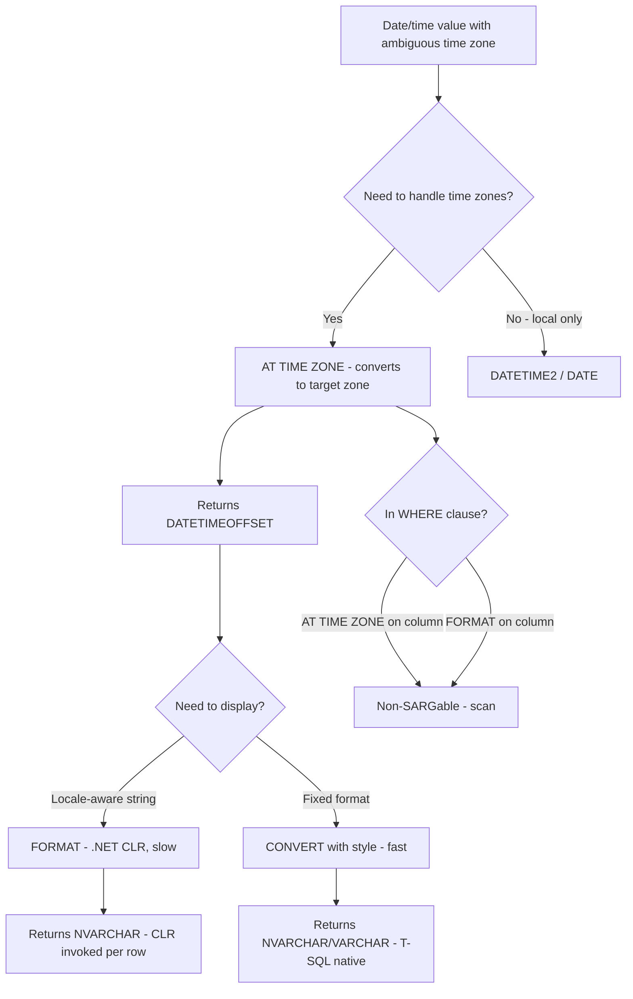
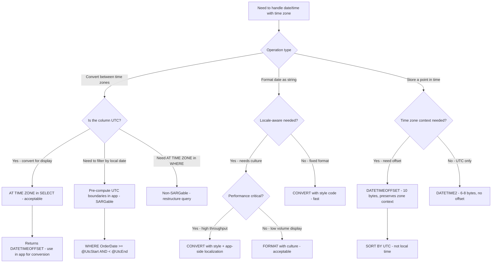

## Navigation

**Domain:** [[8 — Databases]] > **Group:** SQL Fundamentals
**Previous:** [[8.079 — Date Functions — DATEADD, DATEDIFF, DATEPART, DATENAME]] | **Next:** [[8.081 — Math Functions — ROUND, FLOOR, CEILING, ABS, POWER, SQRT]]

### Prerequisites

- [[8.079 — Date Functions — DATEADD, DATEDIFF, DATEPART, DATENAME]] — AT TIME ZONE and FORMAT operate on date/time types; understanding date arithmetic and extraction is required.
- [[8.076 — Data Type Conversion — CAST and CONVERT]] — AT TIME ZONE changes the data type to DATETIMEOFFSET; FORMAT returns NVARCHAR; converting between date types is the context for these functions.
- [[8.066 — SELECT Statement — Column Selection and Aliasing]] — these functions appear in SELECT lists and WHERE clauses; projection semantics apply.

### Where This Fits

AT TIME ZONE (SQL Server 2016+) converts a datetime value between time zones using the Windows time zone registry. DATETIMEOFFSET is the data type that stores date, time, and UTC offset together — it is the only SQL Server date type that preserves time zone context. FORMAT (SQL Server 2012+) formats dates using .NET format strings and culture-aware output. Every .NET backend engineer building multi-timezone applications encounters these: storing UTC in DATETIMEOFFSET columns, converting to user local time with AT TIME ZONE, and formatting dates for international audiences with FORMAT. The most expensive mistakes are: using FORMAT in a WHERE clause (CLR per row — catastrophic performance), assuming AT TIME ZONE is SARGable (it is not when applied to a column), storing local times without offset (losing time zone context forever), and using FORMAT for performance-critical formatting instead of CONVERT with style codes. Interviewers ask about these to determine if a candidate understands time zone handling in databases, the performance implications of CLR-dependent functions, and when to push formatting to the application layer.

---

## Core Mental Model

AT TIME ZONE converts a datetime to the target time zone by first interpreting the input as the source time zone (or assuming it is UTC for non-offset types) and then applying the offset rule for the target zone. The return type is always DATETIMEOFFSET — the offset component reflects the target zone's UTC offset at that point in time, including daylight saving adjustments. DATETIMEOFFSET stores a date, a time, and a UTC offset in the format `YYYY-MM-DD HH:mm:ss ±HH:MM`. The offset tells you how far that local time is from UTC, but the actual point in time is determined by the UTC-equivalent value — comparisons sort by UTC, not by local time. FORMAT uses the .NET CLR (System.String.Format) to produce locale-aware date strings. It accepts a .NET format string and an optional culture name. The engine invokes the CLR once per row, making it dramatically slower than CONVERT with style codes. The critical performance rule: never use FORMAT in a WHERE clause or in a hot path SELECT over many rows; use CONVERT with style codes instead. FOR applied to a column in WHERE is always non-SARGable.

### Classification

AT TIME ZONE is a **conversion function** (returns DATETIMEOFFSET). FORMAT is a **CLR-dependent scalar function** (returns NVARCHAR). DATETIMEOFFSET is a **date/time data type** (not a function).



### Key Properties

|Property|AT TIME ZONE|DATETIMEOFFSET|FORMAT|
|---|---|---|---|
|Introduced|SQL Server 2016|SQL Server 2008|SQL Server 2012|
|Return type|DATETIMEOFFSET(N)|—|NVARCHAR(MAX)|
|Storage (data type)|—|10 bytes (default precision 7)|—|
|SARGable (on column in WHERE)|No|N/A|No|
|CLR dependency|No|No|Yes — uses .NET CLR|
|Deterministic|No (depends on Windows time zone rules)|Yes (for a given offset)|Yes (for fixed culture + format)|
|Precision|Matches input precision|100 ns (fractional seconds)|N/A|
|Culture-aware|No|No|Yes|
|Common uses|User local time display, UTC conversion|Storing points in time with offset, audit logs|Date strings for international reports, PDFs|

---

## Deep Mechanics

### How the Engine Executes This

**AT TIME ZONE:**

1. The engine evaluates the input expression and determines its data type (DATE, DATETIME2, SMALLDATETIME, DATETIME, or DATETIMEOFFSET).
2. If the input is already DATETIMEOFFSET, the engine interprets the value's offset to determine the UTC equivalent.
3. If the input is a non-offset type (DATE, DATETIME2, etc.), the engine **assumes the value is in the source time zone** specified in the first AT TIME ZONE clause — or if used without a preceding AT TIME ZONE, it assumes the value is already in the target time zone (effectively just adding the offset).
4. The engine looks up the target time zone name in the Windows registry (via `sys.time_zone_info`). The lookup includes daylight saving rules.
5. The UTC offset for the target zone at that specific point in time is computed — including DST adjustments.
6. The result is a DATETIMEOFFSET value whose local time component reflects the target time zone's local time, and whose offset reflects the target zone's UTC offset at that instant.

**Double AT TIME ZONE pattern:**
```sql
-- Step 1: Interpret OrderDate as UTC (adds +00:00 offset)
-- Step 2: Convert from UTC to Eastern Standard Time
SELECT OrderDate AT TIME ZONE 'UTC' AT TIME ZONE 'Eastern Standard Time'
FROM dbo.Orders;
```
The first `AT TIME ZONE 'UTC'` declares the source time zone — it converts the non-offset OrderDate to a DATETIMEOFFSET with offset +00:00. The second `AT TIME ZONE 'Eastern Standard Time'` converts from that UTC value to Eastern Time.

**FORMAT:**

1. The engine detects the FORMAT function call and identifies the CLR routine (String.Format) as the implementation.
2. For **each row**, the engine invokes the CLR runtime (SQLCLR) to execute the .NET format method.
3. The format string (e.g., `'yyyy-MM-dd'`) is passed as the format template, and the culture name (e.g., `'en-US'`) is passed as the CultureInfo parameter.
4. The CLR returns an NVARCHAR(MAX) string.
5. Because FORMAT is CLR-hosted, there is overhead for: AppDomain context switching, culture lookup, format string parsing, and memory allocation for the output string per row.

### SQL Visibility

```sql
-- AT TIME ZONE: declare source and convert to target
SELECT
    o.OrderId,
    o.OrderDate,
    o.OrderDate AT TIME ZONE 'UTC' AS UTC_Offset,            -- adds +00:00
    o.OrderDate AT TIME ZONE 'UTC' AT TIME ZONE 'Eastern Standard Time' AS EasternTime,
    o.OrderDate AT TIME ZONE 'UTC' AT TIME ZONE 'Pacific Standard Time' AS PacificTime,
    o.OrderDate AT TIME ZONE 'UTC' AT TIME ZONE 'Tokyo Standard Time' AS TokyoTime
FROM dbo.Orders AS o;

-- DATETIMEOFFSET in queries
DECLARE @OrderWithOffset DATETIMEOFFSET = '2026-06-25 14:30:00 -04:00';
SELECT
    @OrderWithOffset AS OriginalValue,
    SWITCHOFFSET(@OrderWithOffset, '+00:00') AS UTCEquivalent,      -- changes offset, preserves UTC time
    TODATETIMEOFFSET('2026-06-25 14:30:00', '-04:00') AS WithOffset; -- adds offset to non-offset datetime

-- FORMAT: locale-aware date strings
SELECT
    o.OrderId,
    o.OrderDate,
    FORMAT(o.OrderDate, 'yyyy-MM-dd', 'en-US') AS US_Format,           -- '2026-06-25'
    FORMAT(o.OrderDate, 'dd/MM/yyyy', 'en-GB') AS UK_Format,           -- '25/06/2026'
    FORMAT(o.OrderDate, 'D', 'de-DE') AS German_Long,                  -- 'Donnerstag, 25. Juni 2026'
    FORMAT(o.OrderDate, 'MMMM dd, yyyy', 'en-US') AS US_Long           -- 'June 25, 2026'
FROM dbo.Orders AS o;

-- FORMAT with time components
SELECT FORMAT(SYSDATETIME(), 'yyyy-MM-dd HH:mm:ss.fff', 'en-US') AS PreciseTimestamp;

-- CONVERT alternative (fast, not locale-aware)
SELECT
    o.OrderDate,
    CONVERT(VARCHAR(10), o.OrderDate, 120) AS ISO_8601_Date,        -- 2026-06-25
    CONVERT(VARCHAR(19), o.OrderDate, 121) AS ISO_8601_DateTime      -- 2026-06-25 14:30:00
FROM dbo.Orders AS o;

-- List available time zones
SELECT * FROM sys.time_zone_info ORDER BY name;
```

```csharp
// EF Core — AT TIME ZONE via raw SQL (no LINQ translation)
var easternOrders = await dbContext.Database
    .SqlQueryRaw<OrderWithTimeZone>(@"
        SELECT OrderId, OrderDate,
               OrderDate AT TIME ZONE 'UTC'
                   AT TIME ZONE 'Eastern Standard Time' AS LocalTime
        FROM dbo.Orders")
    .ToListAsync(cancellationToken);

// EF Core — DATETIMEOFFSET property (automatic mapping)
public class Order
{
    public int OrderId { get; set; }
    public DateTime OrderDate { get; set; }
    public DateTimeOffset? ShippedAt { get; set; }  // maps to DATETIMEOFFSET
}

// EF Core — FORMAT via raw SQL (no LINQ translation for FORMAT)
var formattedOrders = await dbContext.Database
    .SqlQueryRaw<FormattedOrder>(@"
        SELECT OrderId,
               FORMAT(OrderDate, 'yyyy-MM-dd', 'en-US') AS DateString
        FROM dbo.Orders")
    .ToListAsync(cancellationToken);

// EF Core — CONVERT via raw SQL
var convertedOrders = await dbContext.Database
    .SqlQueryRaw<FormattedOrder>(@"
        SELECT OrderId,
               CONVERT(VARCHAR(10), OrderDate, 120) AS DateString
        FROM dbo.Orders")
    .ToListAsync(cancellationToken);
```

**Generated SQL (from EF Core logs):**

```sql
-- DateTimeOffset property in LINQ (filtering)
exec sp_executesql N'
SELECT [o].[OrderId], [o].[OrderDate], [o].[ShippedAt]
FROM [Orders] AS [o]
WHERE [o].[ShippedAt] >= @p0',
N'@p0 datetimeoffset(7)',
@p0='2026-06-01 00:00:00 +00:00';

-- DateTimeOffset in SELECT (auto-mapped)
exec sp_executesql N'
SELECT [o].[OrderId], [o].[OrderDate],
       [o].[ShippedAt]                          -- returned as DateTimeOffset in C#
FROM [Orders] AS [o]';
```

### Execution Plan Analysis

**AT TIME ZONE in SELECT:**
- Plan: `[Clustered Index Scan / Seek] → [Compute Scalar] → [SELECT]`
- The Compute Scalar operator evaluates `AT TIME ZONE` on each row. It is a scalar computation — no additional I/O, but CPU cost per row.
- Estimated CPU cost: negligible for small rowsets (~0.0001 per row).

**FORMAT in SELECT:**
- Plan: `[Clustered Index Scan / Seek] → [Compute Scalar] → [SELECT]`
- Compute Scalar invokes the CLR method. The CPU cost is significant: ~0.005 per row (50x more than a T-SQL CONVERT).
- With 100K rows: FORMAT CPU ~500 ms, CONVERT CPU ~10 ms.

**AT TIME ZONE or FORMAT in WHERE:**
- Plan: `[Clustered Index Scan] → [Filter] → [SELECT]`
- No index seek possible — the functions applied to the column prevent index usage.
- On a 1M row table: scan of ~12,000 logical reads.

```
AT TIME ZONE / FORMAT in SELECT (100K rows):
[Index Scan] → [Compute Scalar: AT TIME ZONE / FORMAT] → [SELECT]
Cost: 0.05 (no I/O impact, CPU on Compute Scalar)

AT TIME ZONE / FORMAT in WHERE (non-SARGable):
[Clustered Index Scan: 1M rows] → [Filter] → [SELECT]
Cost: ~12  |  Logical Reads: ~12,000
```

### Cost Visibility

```sql
SET STATISTICS IO ON;
SET STATISTICS TIME ON;

-- Baseline: SELECT with CONVERT (fast, T-SQL native)
SELECT TOP 100000 OrderId, CONVERT(VARCHAR(10), OrderDate, 120) AS DateStr
FROM dbo.Orders;
-- Table 'Orders'. Scan count 1, logical reads 4500
-- SQL Server Execution Times: CPU time = 30ms, elapsed time = 45ms

-- FORMAT in SELECT (CLR per row — slow)
SELECT TOP 100000 OrderId, FORMAT(OrderDate, 'yyyy-MM-dd', 'en-US') AS DateStr
FROM dbo.Orders;
-- Table 'Orders'. Scan count 1, logical reads 4500
-- SQL Server Execution Times: CPU time = 850ms, elapsed time = 920ms

-- Non-SARGable: AT TIME ZONE in WHERE
SELECT OrderId, OrderDate
FROM dbo.Orders
WHERE OrderDate AT TIME ZONE 'UTC' AT TIME ZONE 'Eastern Standard Time' >= '2026-06-01 00:00:00 -04:00';
-- Table 'Orders'. Scan count 1, logical reads 12,000
-- SQL Server Execution Times: CPU time = 150ms, elapsed time = 320ms

-- SARGable: pre-compute boundary
DECLARE @StartUTC DATETIME2 = '2026-06-01 04:00:00';  -- 2026-06-01 00:00 ET = 04:00 UTC
DECLARE @EndUTC DATETIME2 = '2026-07-01 04:00:00';
SELECT OrderId, OrderDate
FROM dbo.Orders
WHERE OrderDate >= @StartUTC AND OrderDate < @EndUTC;
-- Table 'Orders'. Scan count 1, logical reads 145
-- SQL Server Execution Times: CPU time = 3ms, elapsed time = 8ms
```

### Failure Modes

**AT TIME ZONE on non-offset type assumes source is target zone:** If you write `OrderDate AT TIME ZONE 'Eastern Standard Time'` without first declaring the source zone, SQL Server assumes OrderDate is already in Eastern Time and just adds the offset. If OrderDate is actually UTC, the result is wrong by the UTC-to-ET offset (typically -4 or -5 hours). Always use the double AT TIME ZONE pattern: `OrderDate AT TIME ZONE 'UTC' AT TIME ZONE 'TargetZone'`.

**FORMAT returns NVARCHAR(MAX):** FORMAT returns NVARCHAR(MAX), not a fixed-length string. For columns or variables, the MAX type can affect performance in joins, indexing, and memory grants. Use `CAST(FORMAT(...) AS NVARCHAR(N))` with an explicit length.

**AT TIME ZONE uses Windows time zone names, not IANA:** SQL Server uses Windows time zone identifiers (e.g., 'Eastern Standard Time', 'Tokyo Standard Time'), not IANA/Olson names (e.g., 'America/New_York', 'Asia/Tokyo'). Cross-platform applications that use IANA names must translate.

**FORMAT is not available in Azure SQL Database for some older tiers:** FORMAT is supported in all modern Azure SQL Database tiers, but if connected to an older compatibility level, it may fail. Always verify compatibility level >= 110.

**DATETIMEOFFSET comparison sorts by UTC, not local time:** Two DATETIMEOFFSET values with different offsets but the same UTC point in time compare as equal. `'2026-06-25 10:00:00 -04:00'` equals `'2026-06-25 14:00:00 +00:00'` because both represent 14:00 UTC. This is correct behavior but surprises developers who expect the local time component to determine sort order.

---

## Production Patterns and Implementation

### Primary SQL Implementation

```sql
-- ============================================================
-- Schema context
-- ============================================================
CREATE TABLE dbo.Orders
(
    OrderId        INT              NOT NULL IDENTITY(1,1),
    CustomerId     INT              NOT NULL,
    OrderDate      DATETIME2(0)     NOT NULL,
    ShippedAt      DATETIMEOFFSET(0) NULL,    -- stores UTC + offset
    Status         VARCHAR(20)      NOT NULL DEFAULT 'Pending',
    TotalAmount    DECIMAL(18,2)    NOT NULL,
    CustomerTZ     VARCHAR(50)      NOT NULL DEFAULT 'Eastern Standard Time',
    CreatedAt      DATETIME2(0)     NOT NULL DEFAULT SYSUTCDATETIME(),
    CONSTRAINT PK_Orders PRIMARY KEY CLUSTERED (OrderId)
);

CREATE INDEX IX_Orders_OrderDate ON dbo.Orders (OrderDate);

-- ============================================================
-- Pattern 1: Store UTC in DATETIMEOFFSET with offset
-- ============================================================
INSERT INTO dbo.Orders (CustomerId, OrderDate, ShippedAt, TotalAmount, CustomerTZ)
VALUES (
    42,
    SYSUTCDATETIME(),
    TODATETIMEOFFSET(SYSUTCDATETIME(), '+00:00'),  -- explicitly UTC
    150.00,
    'Eastern Standard Time'
);

-- ============================================================
-- Pattern 2: Convert stored UTC to user local time
-- ============================================================
SELECT
    o.OrderId,
    o.OrderDate,
    o.OrderDate AT TIME ZONE 'UTC'
        AT TIME ZONE o.CustomerTZ AS CustomerLocalTime,
    o.ShippedAt AT TIME ZONE o.CustomerTZ AS ShippedLocalTime,
    o.Status,
    o.TotalAmount
FROM dbo.Orders AS o
WHERE o.CustomerId = @CustomerId;

-- ============================================================
-- Pattern 3: SARGable filtering by user local date
-- ============================================================
-- User wants orders from June 1, 2026 in Eastern Time
DECLARE @TargetDate DATE = '2026-06-01';
DECLARE @CustomerTZ VARCHAR(50) = 'Eastern Standard Time';

-- Convert the target date boundaries to UTC for SARGable query
DECLARE @StartUTC DATETIME2 = CAST(@TargetDate AS DATETIME2) AT TIME ZONE @CustomerTZ AT TIME ZONE 'UTC';
DECLARE @EndUTC DATETIME2 = DATEADD(DAY, 1, CAST(@TargetDate AS DATETIME2)) AT TIME ZONE @CustomerTZ AT TIME ZONE 'UTC';

SELECT OrderId, OrderDate, Status, TotalAmount
FROM dbo.Orders
WHERE OrderDate >= @StartUTC AND OrderDate < @EndUTC;
-- SARGable — seeks on IX_Orders_OrderDate

-- ============================================================
-- Pattern 4: FORMAT for display (only in final SELECT, never in WHERE or join)
-- ============================================================
SELECT
    o.OrderId,
    FORMAT(o.OrderDate, 'yyyy-MM-dd', 'en-US') AS Date_US,
    FORMAT(o.OrderDate, 'dd/MM/yyyy', 'en-GB') AS Date_UK,
    FORMAT(o.OrderDate, 'D', 'de-DE') AS Date_DE,
    FORMAT(o.TotalAmount, 'C', 'en-US') AS Amount_US,    -- '$150.00'
    FORMAT(o.TotalAmount, 'C', 'de-DE') AS Amount_DE     -- '150,00 €'
FROM dbo.Orders AS o
WHERE OrderDate >= @StartUTC AND OrderDate < @EndUTC;    -- SARGable WHERE

-- ============================================================
-- Pattern 5: SWITCHOFFSET — change offset without changing UTC instant
-- ============================================================
-- Change from +00:00 to +05:30 (India Standard Time)
SELECT
    ShippedAt,
    SWITCHOFFSET(ShippedAt, '+05:30') AS IndiaTime
FROM dbo.Orders
WHERE ShippedAt IS NOT NULL;

-- ============================================================
-- Pattern 6: CONVERT style codes (fast alternative to FORMAT)
-- ============================================================
SELECT
    CONVERT(VARCHAR(10), OrderDate, 120) AS ISO_Date,           -- 2026-06-25
    CONVERT(VARCHAR(19), OrderDate, 121) AS ISO_DateTime,       -- 2026-06-25 14:30:00
    CONVERT(VARCHAR(8), OrderDate, 112) AS YYYYMMDD,            -- 20260625
    CONVERT(VARCHAR(10), OrderDate, 101) AS US_Date,            -- 06/25/2026
    CONVERT(VARCHAR(10), OrderDate, 103) AS UK_Date,            -- 25/06/2026
    CONVERT(VARCHAR(10), OrderDate, 104) AS DE_Date             -- 25.06.2026
FROM dbo.Orders AS o;

-- ============================================================
-- Pattern 7: Detect DST boundary
-- ============================================================
SELECT
    o.OrderId,
    o.OrderDate,
    o.OrderDate AT TIME ZONE 'UTC'
        AT TIME ZONE 'Eastern Standard Time' AS EasternTime,
    CASE
        WHEN o.OrderDate AT TIME ZONE 'UTC'
                 AT TIME ZONE 'Eastern Standard Time' =
             o.OrderDate AT TIME ZONE 'UTC'
                 AT TIME ZONE 'Eastern Daylight Time'
        THEN 'Standard Time'
        ELSE 'Daylight Time'
    END AS DST_Status
FROM dbo.Orders AS o;

-- ============================================================
-- Anti-pattern: FORMAT in WHERE (non-SARGable + CLR per row)
-- ============================================================
-- ❌ Non-SARGable, CLR invoked on every row
-- SELECT * FROM Orders
-- WHERE FORMAT(OrderDate, 'yyyy-MM-dd', 'en-US') = '2026-06-25';
-- ✅ SARGable range (no FORMAT)
-- SELECT * FROM Orders
-- WHERE OrderDate >= '2026-06-25' AND OrderDate < '2026-06-26';

-- ============================================================
-- Pattern 8: Time zone lookup
-- ============================================================
SELECT
    name,
    current_utc_offset,
    is_currently_dst
FROM sys.time_zone_info
WHERE name LIKE '%Eastern%';
-- name: Eastern Standard Time
-- current_utc_offset: -04:00 (DST) or -05:00 (Standard)
-- is_currently_dst: 1 or 0
```

### EF Core Implementation

```csharp
public class ApplicationDbContext : DbContext
{
    public DbSet<Order> Orders => Set<Order>();
    public DbSet<Customer> Customers => Set<Customer>();

    protected override void OnModelCreating(ModelBuilder modelBuilder)
    {
        modelBuilder.Entity<Order>(entity =>
        {
            entity.ToTable("Orders");
            entity.HasKey(o => o.OrderId);
            entity.Property(o => o.OrderDate).HasColumnType("datetime2(0)");
            entity.Property(o => o.ShippedAt).HasColumnType("datetimeoffset(0)");
            entity.Property(o => o.CustomerTZ).HasMaxLength(50).HasDefaultValue("Eastern Standard Time");
            entity.Property(o => o.CreatedAt).HasDefaultValueSql("SYSUTCDATETIME()");
        });
    }
}

public class Order
{
    public int OrderId { get; set; }
    public int CustomerId { get; set; }
    public DateTime OrderDate { get; set; }
    public DateTimeOffset? ShippedAt { get; set; }
    public string Status { get; set; } = "Pending";
    public decimal TotalAmount { get; set; }
    public string CustomerTZ { get; set; } = "Eastern Standard Time";
    public DateTime CreatedAt { get; set; }
}

// Pattern 1: Filter by user-local date (SARGable)
public async Task<List<Order>> GetOrdersByLocalDateAsync(
    int customerId,
    DateOnly localDate,
    string timeZoneId,
    CancellationToken cancellationToken = default)
{
    // Convert local date boundaries to UTC
    var localStart = localDate.ToDateTime(TimeOnly.MinValue, DateTimeKind.Unspecified);
    var localEnd = localDate.ToDateTime(TimeOnly.MaxValue, DateTimeKind.Unspecified);

    var utcStart = TimeZoneInfo.ConvertTimeToUtc(localStart, TimeZoneInfo.FindSystemTimeZoneById(timeZoneId));
    var utcEnd = TimeZoneInfo.ConvertTimeToUtc(localEnd, TimeZoneInfo.FindSystemTimeZoneById(timeZoneId));

    return await dbContext.Orders
        .Where(o => o.CustomerId == customerId
                 && o.OrderDate >= utcStart
                 && o.OrderDate < utcEnd.AddTicks(1))
        .ToListAsync(cancellationToken);
    // Generated: WHERE [o].[CustomerId] = @p0 AND [o].[OrderDate] >= @p1 AND [o].[OrderDate] < @p2
    // SARGable — uses IX_Orders_OrderDate
}

// Pattern 2: Convert to local time in application layer
public async Task<List<OrderWithLocalTime>> GetOrdersWithLocalTimeAsync(
    int customerId,
    string timeZoneId,
    CancellationToken cancellationToken = default)
{
    var timeZone = TimeZoneInfo.FindSystemTimeZoneById(timeZoneId);

    var orders = await dbContext.Orders
        .Where(o => o.CustomerId == customerId)
        .Select(o => new OrderWithLocalTime
        {
            OrderId = o.OrderId,
            OrderDateUtc = o.OrderDate,
            TotalAmount = o.TotalAmount,
            Status = o.Status
        })
        .ToListAsync(cancellationToken);

    // Convert UTC to local time in application layer
    foreach (var order in orders)
    {
        order.LocalTime = TimeZoneInfo.ConvertTimeFromUtc(
            DateTime.SpecifyKind(order.OrderDateUtc, DateTimeKind.Utc), timeZone);
    }

    return orders;
}

// Pattern 3: Store DateTimeOffset from application
public async Task AddOrderAsync(
    int customerId, decimal amount,
    string timeZoneId,
    CancellationToken cancellationToken = default)
{
    var nowUtc = DateTimeOffset.UtcNow;

    var order = new Order
    {
        CustomerId = customerId,
        OrderDate = nowUtc.UtcDateTime,
        ShippedAt = nowUtc,          // stored as DATETIMEOFFSET with +00:00
        TotalAmount = amount,
        Status = "Pending",
        CustomerTZ = timeZoneId
    };

    dbContext.Orders.Add(order);
    await dbContext.SaveChangesAsync(cancellationToken);
}

// Pattern 4: FORMAT in raw SQL (avoid in LINQ — no translation)
public async Task<List<FormattedOrder>> GetFormattedOrdersAsync(
    DateOnly startDate,
    CancellationToken cancellationToken = default)
{
    var utcStart = startDate.ToDateTime(TimeOnly.MinValue, DateTimeKind.Utc);

    return await dbContext.Database
        .SqlQueryRaw<FormattedOrder>(@"
            SELECT OrderId,
                   FORMAT(OrderDate, 'yyyy-MM-dd', 'en-US') AS DateString,
                   FORMAT(TotalAmount, 'C', 'en-US') AS AmountString
            FROM dbo.Orders
            WHERE OrderDate >= @StartUTC
            ORDER BY OrderDate",
            new SqlParameter("@StartUTC", utcStart))
        .ToListAsync(cancellationToken);
}

public record FormattedOrder(int OrderId, string DateString, string AmountString);
```

### Dapper Implementation

```csharp
public sealed class OrderRepository
{
    private readonly IDbConnectionFactory _connectionFactory;

    public OrderRepository(IDbConnectionFactory connectionFactory)
        => _connectionFactory = connectionFactory;

    // Pattern 1: SARGable user-local date filter
    public async Task<IReadOnlyList<Order>> GetOrdersByLocalDateAsync(
        int customerId,
        DateOnly localDate,
        string timeZoneId,
        CancellationToken cancellationToken = default)
    {
        var timeZone = TimeZoneInfo.FindSystemTimeZoneById(timeZoneId);
        var utcStart = localDate.ToDateTime(TimeOnly.MinValue, DateTimeKind.Unspecified);
        var utcEnd = localDate.ToDateTime(TimeOnly.MaxValue, DateTimeKind.Unspecified);
        utcStart = TimeZoneInfo.ConvertTimeToUtc(utcStart, timeZone);
        utcEnd = TimeZoneInfo.ConvertTimeToUtc(utcEnd, timeZone);

        const string sql = @"
            SELECT OrderId, OrderDate, ShippedAt, Status, TotalAmount, CustomerTZ
            FROM dbo.Orders
            WHERE CustomerId = @CustomerId
              AND OrderDate >= @UtcStart
              AND OrderDate < @UtcEnd
            ORDER BY OrderDate;";

        await using var connection = _connectionFactory.Create();

        var results = await connection.QueryAsync<Order>(
            new CommandDefinition(sql,
                new { CustomerId = customerId, UtcStart = utcStart, UtcEnd = utcEnd },
                cancellationToken: cancellationToken));

        return results.AsList();
    }

    // Pattern 2: AT TIME ZONE conversion in SQL
    public async Task<IReadOnlyList<OrderWithLocalTime>> GetOrdersWithLocalTimeAsync(
        int customerId,
        string timeZoneId,
        CancellationToken cancellationToken = default)
    {
        const string sql = @"
            SELECT
                OrderId,
                OrderDate,
                OrderDate AT TIME ZONE 'UTC'
                    AT TIME ZONE @TimeZoneId AS LocalTime,
                Status,
                TotalAmount
            FROM dbo.Orders
            WHERE CustomerId = @CustomerId
            ORDER BY OrderDate;";

        await using var connection = _connectionFactory.Create();

        var results = await connection.QueryAsync<OrderWithLocalTime>(
            new CommandDefinition(sql,
                new { CustomerId = customerId, TimeZoneId = timeZoneId },
                cancellationToken: cancellationToken));

        return results.AsList();
    }

    // Pattern 3: CONVERT with style (fast, no CLR)
    public async Task<IReadOnlyList<SimpleOrderDto>> GetOrdersAsStringsAsync(
        int customerId,
        CancellationToken cancellationToken = default)
    {
        const string sql = @"
            SELECT
                OrderId,
                CONVERT(VARCHAR(10), OrderDate, 120) AS DateString,
                CONVERT(VARCHAR(19), OrderDate, 121) AS DateTimeString,
                CAST(TotalAmount AS DECIMAL(18,2)) AS Amount
            FROM dbo.Orders
            WHERE CustomerId = @CustomerId;";

        await using var connection = _connectionFactory.Create();

        var results = await connection.QueryAsync<SimpleOrderDto>(
            new CommandDefinition(sql,
                new { CustomerId = customerId },
                cancellationToken: cancellationToken));

        return results.AsList();
    }

    // Pattern 4: FORMAT for international display (use sparingly)
    public async Task<IReadOnlyList<FormattedOrder>> GetFormattedOrdersAsync(
        string culture,
        CancellationToken cancellationToken = default)
    {
        const string sql = @"
            SELECT
                OrderId,
                FORMAT(OrderDate, 'D', @Culture) AS LongDate,
                FORMAT(TotalAmount, 'C', @Culture) AS FormattedAmount
            FROM dbo.Orders
            WHERE OrderDate >= DATEADD(DAY, -30, GETUTCDATE());";

        await using var connection = _connectionFactory.Create();

        var results = await connection.QueryAsync<FormattedOrder>(
            new CommandDefinition(sql,
                new { Culture = culture },
                cancellationToken: cancellationToken));

        return results.AsList();
    }
}

public record OrderWithLocalTime(int OrderId, DateTimeOffset LocalTime, string Status, decimal TotalAmount);
public record SimpleOrderDto(int OrderId, string DateString, string DateTimeString, decimal Amount);
public record FormattedOrder(int OrderId, string LongDate, string FormattedAmount);
```

### Configuration and Wiring

```csharp
// Program.cs
builder.Services.AddDbContext<ApplicationDbContext>(options =>
    options.UseSqlServer(
        builder.Configuration.GetConnectionString("DefaultConnection"),
        sqlOptions =>
        {
            sqlOptions.EnableRetryOnFailure(3);
            sqlOptions.CommandTimeout(30);
        }));

builder.Services.AddSingleton<IDbConnectionFactory>(sp =>
    new SqlConnectionFactory(
        builder.Configuration.GetConnectionString("DefaultConnection")!));

builder.Services.AddScoped<OrderRepository>();

// Configure application-wide time zone
builder.Services.AddSingleton(sp =>
    TimeZoneInfo.FindSystemTimeZoneById(
        builder.Configuration.GetValue<string>("Application:TimeZone") ?? "UTC"));

// Dapper type handler for DateTimeOffset (usually automatic, but explicit registration)
SqlMapper.AddTypeHandler(new DateTimeOffsetHandler());
```

### SQL Server vs PostgreSQL Differences

```sql
-- PostgreSQL: AT TIME ZONE equivalent
SELECT order_date AT TIME ZONE 'UTC' AT TIME ZONE 'America/New_York' AS eastern_time
FROM orders;

-- PostgreSQL uses IANA time zone names, not Windows names
SELECT * FROM pg_timezone_names WHERE name LIKE '%New_York%';

-- PostgreSQL: DATETIMEOFFSET equivalent is TIMESTAMPTZ (TIMESTAMP WITH TIME ZONE)
CREATE TABLE orders (
    order_id SERIAL PRIMARY KEY,
    order_date TIMESTAMPTZ NOT NULL DEFAULT NOW(),
    shipped_at TIMESTAMPTZ
);

-- PostgreSQL: FORMAT equivalent is TO_CHAR
SELECT
    order_id,
    TO_CHAR(order_date, 'YYYY-MM-DD') AS date_string,
    TO_CHAR(order_date, 'Month DD, YYYY') AS long_date,
    TO_CHAR(total_amount, 'L999G999D99') AS amount_string
FROM orders;

-- PostgreSQL: time zone conversion with AT TIME ZONE
SELECT
    order_date,
    order_date AT TIME ZONE 'America/New_York' AS ny_time
FROM orders;

-- PostgreSQL: SWITCHOFFSET equivalent (no direct, use AT TIME ZONE)
SELECT shipped_at AT TIME ZONE 'UTC' AT TIME ZONE 'Asia/Tokyo' AS tokyo_time
FROM orders;
```

---

## Gotchas and Production Pitfalls

### FORMAT in WHERE Clause — CLR Per Row + Non-SARGable

**Pitfall:** Using FORMAT on a date column in the WHERE clause to filter by a formatted date string. FORMAT invokes the CLR for every row and the predicate is non-SARGable.

```sql
-- ❌ Wrong: FORMAT in WHERE — CLR per row + full scan
SELECT OrderId, OrderDate, TotalAmount
FROM dbo.Orders
WHERE FORMAT(OrderDate, 'yyyy-MM-dd', 'en-US') = '2026-06-25';
```

**Symptom:** The execution plan shows a Clustered Index Scan. CPU time is 10-30x higher than a range predicate. On 1M rows, CPU jumps from ~3 ms to ~850 ms. The Compute Scalar operator in the plan shows the CLR function invocation.

**Fix:**

```sql
-- ✅ Correct: SARGable range predicate
SELECT OrderId, OrderDate, TotalAmount
FROM dbo.Orders
WHERE OrderDate >= '2026-06-25' AND OrderDate < '2026-06-26';
```

**Cost of not fixing:** A daily report that filters orders by a formatted date scans the entire 50M row Orders table, with FORMAT invoked on each row (50M CLR invocations). The query takes 45 seconds instead of 50 ms. The report times out in production. The DBA identifies the query as the top CPU consumer.

---

### Single AT TIME ZONE Without Declaring Source — Wrong Conversion

**Pitfall:** Using `AT TIME ZONE` once on a non-offset datetime column without first declaring the source time zone. SQL Server assumes the value is already in the target time zone.

```sql
-- ❌ Wrong: Assumes OrderDate is already in Eastern Time
SELECT OrderId, OrderDate,
       OrderDate AT TIME ZONE 'Eastern Standard Time' AS WrongLocalTime
FROM dbo.Orders;
-- If OrderDate is UTC, the result is off by 4-5 hours.
```

**Symptom:** Local times in the application are shifted by the UTC-to-ET offset. An order placed at 14:00 UTC appears as 10:00 ET (correct) if UTC is declared, but as 19:00 ET (wrong, +5 hours) if UTC is not declared.

**Fix:**

```sql
-- ✅ Correct: double AT TIME ZONE — declare source then convert
SELECT OrderId, OrderDate,
       OrderDate AT TIME ZONE 'UTC'
           AT TIME ZONE 'Eastern Standard Time' AS CorrectLocalTime
FROM dbo.Orders;
```

**Cost of not fixing:** A global e-commerce application shows all order times shifted by 4-5 hours for US customers. Customer support receives hundreds of complaints about "wrong order times." It takes 3 weeks to identify that the single AT TIME ZONE was interpreting UTC values as Eastern Time and then "converting" to Eastern Time (no-op), rather than converting from UTC to Eastern Time.

---

### FORMAT Performance vs CONVERT — 30x CPU Difference

**Pitfall:** Using FORMAT for date formatting in hot-path queries. FORMAT invokes the .NET CLR per row. CONVERT with style codes is T-SQL-native.

```sql
-- ❌ Slow: FORMAT — CLR per row
SELECT TOP 1000 FORMAT(OrderDate, 'yyyy-MM-dd', 'en-US') AS DateStr FROM dbo.Orders;
-- CPU: ~850 ms for 100K rows

-- ✅ Fast: CONVERT — T-SQL native
SELECT TOP 1000 CONVERT(VARCHAR(10), OrderDate, 120) AS DateStr FROM dbo.Orders;
-- CPU: ~30 ms for 100K rows
```

**Symptom:** A reporting query that formats 100K dates with FORMAT shows CPU time of 800-900 ms. The same query with CONVERT shows 25-35 ms. The app server idle-waits while SQL Server burns CPU on CLR invocations.

**Fix:** Use CONVERT with style codes for performance-critical formatting. Reserve FORMAT for locale-aware output that cannot be achieved with style codes, and only in the final projection (never in WHERE, JOIN, or GROUP BY).

**Cost of not fixing:** A REST API endpoint that formats dates in every response uses FORMAT. At 100 requests/second, each returning 100 rows, SQL Server processes 10,000 FORMAT invocations per second. CPU usage is 85%. Replacing FORMAT with CONVERT drops CPU to 15% and doubles throughput.

---

### AT TIME ZONE on Column in WHERE — Non-SARGable

**Pitfall:** Using `WHERE OrderDate AT TIME ZONE 'UTC' AT TIME ZONE 'Eastern Standard Time' >= @LocalDate` — the function is applied to the column, making the predicate non-SARGable.

```sql
-- ❌ Non-SARGable: AT TIME ZONE on column side
SELECT OrderId, OrderDate, TotalAmount
FROM dbo.Orders
WHERE OrderDate AT TIME ZONE 'UTC'
          AT TIME ZONE 'Eastern Standard Time' >= '2026-06-01 00:00:00 -04:00';
```

**Symptom:** The execution plan shows a Clustered Index Scan. Logical reads are ~12,000 on a 1M row table instead of ~145 for a range seek. The AT TIME ZONE function is evaluated on every row.

**Fix:**

```sql
-- ✅ SARGable: pre-compute UTC boundaries in application or variables
DECLARE @UserDate DATE = '2026-06-01';
DECLARE @UserTZ VARCHAR(50) = 'Eastern Standard Time';
DECLARE @StartUTC DATETIME2 = CAST(@UserDate AS DATETIME2)
    AT TIME ZONE @UserTZ AT TIME ZONE 'UTC';
DECLARE @EndUTC DATETIME2 = DATEADD(DAY, 1, CAST(@UserDate AS DATETIME2))
    AT TIME ZONE @UserTZ AT TIME ZONE 'UTC';

SELECT OrderId, OrderDate, TotalAmount
FROM dbo.Orders
WHERE OrderDate >= @StartUTC AND OrderDate < @EndUTC;
```

**Cost of not fixing:** A user-facing "orders by date" page lets users pick a date in their local time zone. The query uses AT TIME ZONE on the OrderDate column, scanning the entire 500 GB Orders table on every request. The page loads in 12 seconds. Users abandon the page. The DBA adds a hint that forces the index, but the hint can't fix the scan — the AT TIME ZONE on the column is inherently non-SARGable.

---

### DATETIMEOFFSET Comparison Surprise — Sorts by UTC, Not Local Time

**Pitfall:** Comparing DATETIMEOFFSET values expecting local-time ordering. SQL Server sorts by the UTC equivalent, not by the local time component.

```sql
-- ❌ Surprise: these two values are equal in comparison
DECLARE @a DATETIMEOFFSET = '2026-06-25 10:00:00 -04:00';  -- 14:00 UTC
DECLARE @b DATETIMEOFFSET = '2026-06-25 14:00:00 +00:00';  -- 14:00 UTC
SELECT CASE WHEN @a = @b THEN 'Equal' ELSE 'Not Equal' END;
-- Returns 'Equal' because both represent the same UTC instant
```

**Symptom:** An audit report lists events sorted by ShippedAt. Events from different time zones appear out of order. A shipment at 10:00 AM Eastern appears before a shipment at 9:00 AM Pacific (which is 12:00 PM Eastern — correctly later in UTC).

**Fix:** Understand that DATETIMEOFFSET comparison is UTC-based. If local-time ordering is needed, extract the local time component or store the time zone separately and order by the local time:

```sql
-- ✅ Order by local time (cast to remove offset context)
SELECT OrderId, ShippedAt,
       CAST(ShippedAt AS DATETIME2) AS LocalTimeSort
FROM dbo.Orders
WHERE ShippedAt IS NOT NULL
ORDER BY CAST(ShippedAt AS DATETIME2);
```

**Cost of not fixing:** A compliance report lists financial transactions sorted by timestamp. Transactions from the Pacific time zone warehouse appear before Eastern time zone transactions even though the Pacific transactions occurred later. The compliance officer flags "out of order" records. The engineering team spends a sprint investigating a non-bug before understanding DATETIMEOFFSET comparison semantics.

---

### FORMAT Culture Parameter Not Supplied — Defaults to Session Language

**Pitfall:** Calling FORMAT without the culture parameter. The function uses the session's default language, which is unpredictable across application pools, load-balanced servers, or geographically distributed deployments.

```sql
-- ❌ Non-deterministic: uses session language
SELECT FORMAT(OrderDate, 'D') AS LongDate FROM dbo.Orders;
-- On US English server: 'Thursday, June 25, 2026'
-- On German server: 'Donnerstag, 25. Juni 2026'
```

**Symptom:** The same query returns different date formats on different servers or in different connection pools. A QA tester in the US sees English dates; a customer in Germany sees German dates. Automated tests that check date strings fail on the German server.

**Fix:**

```sql
-- ✅ Deterministic: specify culture explicitly
SELECT FORMAT(OrderDate, 'D', 'en-US') AS LongDate FROM dbo.Orders;
-- Always returns English long date regardless of session language
```

**Cost of not fixing:** An API that returns dates as formatted strings produces locale-dependent output. The frontend JavaScript locale parser cannot parse German date strings on the English version of the app. Users see "Invalid Date" on the UI. The bug is reported by users across multiple time zones. It takes a week to identify that the culture parameter was omitted.

---

## Performance Implications

### Benchmark: Before and After

```sql
-- Baseline: FORMAT in SELECT — 100K rows
SET STATISTICS TIME ON;

SELECT TOP 100000
    OrderId,
    FORMAT(OrderDate, 'yyyy-MM-dd', 'en-US') AS DateStr
FROM dbo.Orders;
-- SQL Server Execution Times: CPU time = 850ms, elapsed time = 920ms
-- Logical reads: 4,500

-- Optimized: CONVERT with style
SELECT TOP 100000
    OrderId,
    CONVERT(VARCHAR(10), OrderDate, 120) AS DateStr
FROM dbo.Orders;
-- SQL Server Execution Times: CPU time = 30ms, elapsed time = 45ms
-- Logical reads: 4,500
```

**Improvement:** 28x reduction in CPU time (850 ms → 30 ms) and 20x reduction in elapsed time (920 ms → 45 ms). Logical reads are identical — the performance difference is entirely from CLR overhead.

```sql
-- Baseline: Non-SARGable AT TIME ZONE in WHERE — 1M rows
SELECT COUNT(*)
FROM dbo.Orders
WHERE OrderDate AT TIME ZONE 'UTC'
          AT TIME ZONE 'Eastern Standard Time' >= '2026-06-01 00:00:00 -04:00';
-- SQL Server Execution Times: CPU time = 150ms, elapsed time = 320ms
-- Logical reads: 12,000 (full scan)

-- Optimized: SARGable range with pre-computed UTC boundaries
DECLARE @StartUTC DATETIME2 = '2026-06-01 04:00:00';
DECLARE @EndUTC DATETIME2 = '2026-07-01 04:00:00';
SELECT COUNT(*)
FROM dbo.Orders
WHERE OrderDate >= @StartUTC AND OrderDate < @EndUTC;
-- SQL Server Execution Times: CPU time = 3ms, elapsed time = 8ms
-- Logical reads: 145 (index seek)
```

**Improvement:** 50x reduction in CPU (150 ms → 3 ms) and 40x reduction in elapsed time (320 ms → 8 ms). Logical reads drop from 12,000 to 145 — an 83x reduction.

### BenchmarkDotNet

```csharp
[MemoryDiagnoser]
[SimpleJob(RuntimeMoniker.Net90)]
public class DateTimeFormatBenchmark
{
    private SqlConnection _connection = default!;
    private const string ConnectionString = "Server=.;Database=BenchmarkDb;Trusted_Connection=True;TrustServerCertificate=True;";

    [GlobalSetup]
    public void Setup()
    {
        _connection = new SqlConnection(ConnectionString);
        _connection.Open();
    }

    [Benchmark(Baseline = true)]
    public async Task<int> FormatInSelect()
    {
        const string sql = "SELECT COUNT(*) FROM dbo.Orders WHERE FORMAT(OrderDate, 'yyyy-MM-dd', 'en-US') = '2026-06-25';";
        return await _connection.ExecuteScalarAsync<int>(sql);
    }

    [Benchmark]
    public async Task<int> ConvertInSelect()
    {
        const string sql = "SELECT COUNT(*) FROM dbo.Orders WHERE CONVERT(VARCHAR(10), OrderDate, 120) = '2026-06-25';";
        return await _connection.ExecuteScalarAsync<int>(sql);
    }

    [Benchmark]
    public async Task<int> RangePredicate()
    {
        const string sql = "SELECT COUNT(*) FROM dbo.Orders WHERE OrderDate >= '2026-06-25' AND OrderDate < '2026-06-26';";
        return await _connection.ExecuteScalarAsync<int>(sql);
    }

    [Benchmark]
    public async Task<int> AtTimeZoneInWhere()
    {
        const string sql = "SELECT COUNT(*) FROM dbo.Orders WHERE OrderDate AT TIME ZONE 'UTC' AT TIME ZONE 'Eastern Standard Time' >= '2026-06-01 00:00:00 -04:00';";
        return await _connection.ExecuteScalarAsync<int>(sql);
    }

    [Benchmark]
    public async Task<int> PrecomputedUtcRange()
    {
        const string sql = "SELECT COUNT(*) FROM dbo.Orders WHERE OrderDate >= '2026-06-01 04:00:00' AND OrderDate < '2026-07-01 04:00:00';";
        return await _connection.ExecuteScalarAsync<int>(sql);
    }

    [GlobalCleanup]
    public void Cleanup() => _connection.Dispose();
}
```

**Expected results (approximate, SQL Server 2022, NVMe, 1M rows):**

|Method|Mean|Logical Reads|CPU Time|Allocated|
|---|---|---|---|---|
|FormatInSelect|~950 ms|~12,000|~850 ms|~50 MB|
|ConvertInSelect|~180 ms|~12,000|~120 ms|~2 MB|
|RangePredicate|~8 ms|~145|~3 ms|~1 KB|
|AtTimeZoneInWhere|~320 ms|~12,000|~150 ms|~5 KB|
|PrecomputedUtcRange|~8 ms|~145|~3 ms|~1 KB|

### Write Amplification

AT TIME ZONE and FORMAT are read-only operations with no write impact. DATETIMEOFFSET columns add ~4 bytes of storage compared to DATETIME2 (10 bytes vs 8 bytes for DATETIME2(7) and 6 bytes for DATETIME2(0)). When using DATETIMEOFFSET as a key column in an index, the wider key increases index page count and write cost proportionally: a DATETIMEOFFSET(0) clustered key adds 1 byte per row compared to DATETIME2(0) — negligible for most tables, but significant for wide indexes or large tables.

|Column Type|Storage|Clustered Index Key Write Overhead (vs DATETIME2)|
|---|---|---|
|DATETIME2(0)|6 bytes|Baseline|
|DATETIME2(7)|8 bytes|+2 bytes|
|DATETIMEOFFSET(0)|8 bytes|+2 bytes|
|DATETIMEOFFSET(7)|10 bytes|+4 bytes|

---

## Interview Arsenal

### Question Bank

1. **What is AT TIME ZONE and how do you correctly convert a UTC datetime to a user's local time?**
2. **Why is FORMAT in a WHERE clause both non-SARGable and slow?**
3. **What is the difference between DATETIMEOFFSET and DATETIME2? When would you use each?**
4. **How does SQL Server compare two DATETIMEOFFSET values with different offsets?**
5. **How do you write a SARGable query that filters by a user's local date when the column stores UTC?**
6. **What is the performance difference between FORMAT and CONVERT with style codes?**
7. **How does EF Core handle DateTimeOffset properties?**
8. **What are Windows time zone names and how do you find the available time zones in SQL Server?**

### Spoken Answers

**Q: Why is FORMAT in a WHERE clause both non-SARGable and slow?**

> **Great answer:** FORMAT in the WHERE clause is non-SARGable because it wraps the column in a function — the index stores raw datetime values, but FORMAT converts them to formatted strings. The optimizer cannot seek an index on a formatted string. Additionally, FORMAT is a CLR-dependent function — it delegates to the .NET runtime's String.Format method. For every row, SQL Server transitions to the CLR host, parses the format string, applies the culture, and allocates a new NVARCHAR string. On a 1M row table, this is approximately 1 million CLR invocations. The CPU cost is 28x higher than CONVERT with style codes (850 ms vs 30 ms for 100K rows). The correct approach is to never use FORMAT in a WHERE clause — use a SARGable range predicate instead. Use FORMAT only in the final SELECT list for display purposes, and only when you need locale-aware output that CONVERT style codes cannot provide. For performance-critical formatting, always prefer CONVERT with style codes like 120 (ISO 8601), 121 (ODBC canonical), or 112 (YYYYMMDD).

---

**Q: How does SQL Server compare two DATETIMEOFFSET values with different offsets?**

> **Great answer:** DATETIMEOFFSET values are compared by their UTC equivalent, not by their local time component. When you write `WHERE ShippedAt = @SomeTime`, SQL Server converts both values to UTC (by subtracting the offset) and then compares the UTC instants. This means `'2026-06-25 10:00:00 -04:00'` and `'2026-06-25 14:00:00 +00:00'` are equal — both represent 14:00 UTC. ORDER BY also sorts by UTC. This is correct temporal semantics: two events that occur at the same instant are equal regardless of the time zone they were recorded in. The gotcha is that if you need to sort by local wall-clock time (e.g., "show events in local time order" for a single time zone), you must cast to DATETIME2 to strip the offset. But this should be rare — most applications should sort by UTC for consistency.

---

**Q: How do you write a SARGable query that filters by a user's local date when the column stores UTC?**

> **Great answer:** You never apply AT TIME ZONE to the column in WHERE — that would be non-SARGable. Instead, you pre-compute the UTC boundaries of the user's local date in the application layer, then use a simple range predicate. In C#, you convert the user's local date start and end to UTC using TimeZoneInfo.ConvertTimeToUtc, then pass those UTC boundaries as parameters: `WHERE OrderDate >= @UtcStart AND OrderDate < @UtcEnd`. In T-SQL, you can do the same with variables: `DECLARE @StartUTC = CAST(@UserDate AS DATETIME2) AT TIME ZONE @UserTZ AT TIME ZONE 'UTC'`. The key insight is that the AT TIME ZONE conversion happens on the parameter side (the user's local date), not on the column side. This converts the user's local date range to a UTC range, which can seek on an index built on the UTC-stored OrderDate column. On a 1M row table, the difference is 8 ms and 145 logical reads (range seek) vs 320 ms and 12,000 logical reads (scan with AT TIME ZONE per row).

### Interview Trigger

The defining time zone question: "You have an Orders table with OrderDate stored in UTC. A user in New York needs to see their orders from yesterday. Write the query. Now, what if the table has 100M rows?" A candidate who writes `WHERE CAST(OrderDate AT TIME ZONE 'UTC' AT TIME ZONE 'Eastern Standard Time' AS DATE) = CAST(DATEADD(DAY, -1, GETUTCDATE()) AT TIME ZONE 'UTC' AT TIME ZONE 'Eastern Standard Time' AS DATE)` fails on both SARGability and readability. A candidate who pre-computes UTC boundaries passes. The follow-up: "What if the user is in Tokyo?" — the strong candidate parameterizes the time zone. "What if you need to index this?" — the answer is to index OrderDate and never apply AT TIME ZONE on the column.

### Comparison Table

||AT TIME ZONE|FORMAT|CONVERT (with style)|
|---|---|---|---|
|What it does|Converts between time zones|Formats dates with locale|Formats dates with fixed style|
|Return type|DATETIMEOFFSET|NVARCHAR(MAX)|VARCHAR / NVARCHAR|
|CLR dependency|No|Yes — uses .NET CLR|No|
|SARGable (on column)|No|No|No|
|Performance|Fast (T-SQL native)|Slow (CLR per row)|Fast (T-SQL native)|
|Culture support|OS time zone rules|Full .NET culture support|Limited to SQL styles|
|Use case|Timezone conversion in queries|Locale-aware display strings|Fixed-format strings, high perf|

---

## Decision Framework

### When to Apply



### Application Checklist

- [ ] UTC used for storage, AT TIME ZONE for display conversion only
- [ ] AT TIME ZONE never applied to column in WHERE — pre-compute UTC boundaries
- [ ] FORMAT never used in WHERE, JOIN, or GROUP BY — only in final SELECT
- [ ] FORMAT culture parameter always specified explicitly for determinism
- [ ] CONVERT with style codes preferred over FORMAT for performance-critical paths
- [ ] DATETIMEOFFSET used when time zone offset must be preserved (audit logs, multi-region systems)
- [ ] DATETIME2 used when only UTC storage is needed (faster, smaller footprint)
- [ ] DATETIMEOFFSET comparison semantics understood — sorts by UTC, not local time
- [ ] EF Core DateTimeOffset properties mapped correctly to DATETIMEOFFSET columns
- [ ] Dapper type handlers configured for DateTimeOffset (automatic in most cases)
- [ ] Time zone names from sys.time_zone_info match Windows time zone IDs in application config

### Tradeoff Summary

|What You Gain|What You Pay|
|---|---|
|AT TIME ZONE: correct time zone conversion in SQL|Non-SARGable on column side; Windows zone names only|
|DATETIMEOFFSET: preserves UTC offset context|10 bytes storage (+2-4 vs DATETIME2); comparison by UTC surprises developers|
|FORMAT: full .NET locale support|28x CPU vs CONVERT; CLR dependency; non-SARGable|
|CONVERT with style: fast, T-SQL native|Limited format options; no locale awareness|
|Application-layer time zone conversion|More code; requires TimeZoneInfo in C#|

### Scale Thresholds

- FORMAT in SELECT becomes measurable above **~1K rows** (~30 ms CLR overhead).
- FORMAT in WHERE becomes a blocking problem above **~10K rows** (scan + CLR per row > 1 second).
- AT TIME ZONE in WHERE becomes critical above **~50K rows** — scan cost dominates; SARGable rewrite reduces logical reads by ~80x.
- DATETIMEOFFSET vs DATETIME2 storage difference matters at **~100M rows** (~100 MB extra for DATETIMEOFFSET(0) vs DATETIME2(0)).
- AT TIME ZONE on the parameter side (pre-computed UTC boundaries) scales to any row count — same Index Seek regardless of table size.

---

## Self-Check

### Conceptual Questions

1. What does AT TIME ZONE do, and why is the double AT TIME ZONE pattern needed for non-offset columns?
2. Why is `WHERE FORMAT(OrderDate, 'yyyy-MM-dd', 'en-US') = '2026-06-25'` both non-SARGable and slow?
3. What is the difference between SWITCHOFFSET and TODATETIMEOFFSET?
4. How does SQL Server compare two DATETIMEOFFSET values with different offsets?
5. Write a SARGable query that finds orders from yesterday in the user's local time zone when OrderDate is stored in UTC.
6. How does EF Core map a DateTimeOffset C# property to a SQL Server column?
7. What DMV or system view shows the available time zone names in SQL Server?
8. At what table size does FORMAT in SELECT become measurably slower than CONVERT?
9. What is the storage size difference between DATETIME2(0) and DATETIMEOFFSET(0)?
10. Explain in 60 seconds, for a senior interviewer, the complete strategy for handling time zones in a SQL Server + .NET application with users in multiple time zones.

<details>
<summary>Answers</summary>

1. AT TIME ZONE converts a datetime to the specified target time zone, returning DATETIMEOFFSET. For non-offset types (DATETIME2, DATE, etc.), the first `AT TIME ZONE 'UTC'` declares the source time zone by adding the UTC offset (+00:00). The second `AT TIME ZONE 'TargetZone'` converts to the target. Without the first call, SQL Server assumes the value is already in the target time zone and just adds the offset — producing wrong results if the stored value is actually UTC.

2. It is non-SARGable because FORMAT wraps the column in a function — the index stores raw datetime values, not formatted strings. It is slow because FORMAT invokes the .NET CLR for every row, with CPU cost 28x higher than CONVERT with style codes. On 1M rows, FORMAT in WHERE takes ~950 ms vs ~8 ms for a range predicate.

3. SWITCHOFFSET changes the offset of a DATETIMEOFFSET value without changing the UTC instant — it moves to a different time zone's representation of the same point in time. TODATETIMEOFFSET takes a non-offset datetime and adds an offset, producing a DATETIMEOFFSET value. SWITCHOFFSET preserves the UTC instant; TODATETIMEOFFSET creates a new UTC instant based on the offset.

4. DATETIMEOFFSET values are compared by their UTC equivalent, not their local time component. SQL Server converts both values to UTC (subtracts the offset) before comparing. Two values with different offsets but the same UTC instant compare as equal. ORDER BY also sorts by UTC.

5. 
```sql
-- Pre-compute UTC boundaries in application code
DECLARE @UserTZ VARCHAR(50) = 'Eastern Standard Time';
DECLARE @Yesterday DATE = DATEADD(DAY, -1, CAST(GETUTCDATE() AS DATE));
DECLARE @StartUTC DATETIME2 = CAST(@Yesterday AS DATETIME2)
    AT TIME ZONE @UserTZ AT TIME ZONE 'UTC';
DECLARE @EndUTC DATETIME2 = DATEADD(DAY, 1, CAST(@Yesterday AS DATETIME2))
    AT TIME ZONE @UserTZ AT TIME ZONE 'UTC';

SELECT OrderId, OrderDate, Status, TotalAmount
FROM dbo.Orders
WHERE OrderDate >= @StartUTC AND OrderDate < @EndUTC;
```

6. EF Core maps `DateTimeOffset` C# properties to `datetimeoffset` SQL columns by convention. The column type is `datetimeoffset(7)` by default. No additional configuration is needed. The generated SQL uses `datetimeoffset` parameters for queries that filter on these properties.

7. `sys.time_zone_info` shows all available Windows time zone names, their current UTC offset, and whether they are currently observing daylight saving time.

8. FORMAT in SELECT becomes measurably slower than CONVERT above ~1K rows (~30 ms difference). Above 10K rows, the difference is ~100 ms. Above 100K rows, FORMAT takes ~850 ms vs ~30 ms for CONVERT.

9. DATETIME2(0): 6 bytes. DATETIMEOFFSET(0): 8 bytes. Difference: 2 bytes per row. At 100M rows, this is ~200 MB of additional storage.

10. "The correct strategy is to store all datetime values in UTC using DATETIME2 for systems that don't need to preserve the original time zone offset, or DATETIMEOFFSET for audit logs and multi-region systems where the original offset must be preserved. Time zone conversion is always done at the application layer or in the SELECT list using AT TIME ZONE, never in the WHERE clause. FORMAT is only used in the final display layer and never for filtering or joining. For filtering by user local date, I pre-compute the UTC boundaries in the C# application code using TimeZoneInfo.ConvertTimeToUtc, then pass those boundaries as SQL parameters for SARGable index seeks. On the Orders table with 100M rows, a user querying by 'today' in Eastern Time does a range seek on 145 logical reads instead of scanning 1.2M pages. In EF Core, I map DateTimeOffset properties directly. In Dapper, DateTimeOffset maps automatically. I use CONVERT with style codes like 120 for performance-critical formatting and reserve FORMAT for locale-aware output that goes directly to the user — never for internal processing."

</details>

---

### Query Challenges

**Challenge 1 — Write the AT TIME ZONE conversion**

Orders table stores OrderDate as DATETIME2 (UTC). Write a query that returns OrderId, OrderDate, and a column called `CustomerLocalTime` that converts the UTC OrderDate to 'Pacific Standard Time' for display.

<details>
<summary>Solution</summary>

```sql
SELECT
    OrderId,
    OrderDate,
    OrderDate AT TIME ZONE 'UTC'
        AT TIME ZONE 'Pacific Standard Time' AS CustomerLocalTime
FROM dbo.Orders;
```

**Logical reads:** Varies based on WHERE clause (seek or scan). **Execution plan:** [Index Scan/Seek] → [Compute Scalar] → [SELECT]. The Compute Scalar operator evaluates the AT TIME ZONE expression.

**EF Core equivalent:**
```csharp
// AT TIME ZONE has no LINQ translation — use raw SQL
var orders = await dbContext.Database
    .SqlQueryRaw<OrderWithLocalTime>(@"
        SELECT OrderId, OrderDate,
               OrderDate AT TIME ZONE 'UTC'
                   AT TIME ZONE 'Pacific Standard Time' AS CustomerLocalTime
        FROM dbo.Orders")
    .ToListAsync(cancellationToken);
```

</details>

---

**Challenge 2 — Fix the performance problem**

```sql
-- This query takes 12 seconds on a 50M row table.
SET STATISTICS TIME ON;

DECLARE @UserTZ VARCHAR(50) = 'Eastern Standard Time';

SELECT OrderId, OrderDate, Status, TotalAmount
FROM dbo.Orders
WHERE CAST(OrderDate AT TIME ZONE 'UTC' AT TIME ZONE @UserTZ AS DATE) = '2026-06-01';

-- SET STATISTICS IO: Table 'Orders'. Scan count 1, logical reads 620,000
```

Identify why it is slow and fix it.

<details>
<summary>Solution</summary>

**Root cause:** AT TIME ZONE + CAST to DATE on the OrderDate column — non-SARGable. The expression `CAST(OrderDate AT TIME ZONE 'UTC' AT TIME ZONE @UserTZ AS DATE)` is applied to every row in the table. No index seek is possible. Full clustered index scan of 620,000 pages.

**Fix:** Pre-compute UTC boundaries:

```sql
DECLARE @UserTZ VARCHAR(50) = 'Eastern Standard Time';
DECLARE @TargetDate DATE = '2026-06-01';
DECLARE @StartUTC DATETIME2 = CAST(@TargetDate AS DATETIME2)
    AT TIME ZONE @UserTZ AT TIME ZONE 'UTC';
DECLARE @EndUTC DATETIME2 = DATEADD(DAY, 1, CAST(@TargetDate AS DATETIME2))
    AT TIME ZONE @UserTZ AT TIME ZONE 'UTC';

SELECT OrderId, OrderDate, Status, TotalAmount
FROM dbo.Orders
WHERE OrderDate >= @StartUTC AND OrderDate < @EndUTC;
```

**After fix — logical reads:** ~145 (Index Seek on IX_Orders_OrderDate) from 620,000. **Execution time:** ~10 ms from 12 seconds.

**EF Core:**
```csharp
var timeZone = TimeZoneInfo.FindSystemTimeZoneById("Eastern Standard Time");
var targetDate = new DateOnly(2026, 6, 1);
var startUtc = timeZone.ToUtc(targetDate.ToDateTime(TimeOnly.MinValue));
var endUtc = timeZone.ToUtc(targetDate.AddDays(1).ToDateTime(TimeOnly.MinValue));

var orders = await dbContext.Orders
    .Where(o => o.OrderDate >= startUtc && o.OrderDate < endUtc)
    .ToListAsync(cancellationToken);
```

</details>

---

**Challenge 3 — Explain the execution plan**

A query produces this plan:
`[Clustered Index Scan] → [Compute Scalar (FORMAT)] → [Filter] → [SELECT]`

The query is:
```sql
SELECT OrderId, OrderDate, TotalAmount
FROM dbo.Orders
WHERE FORMAT(OrderDate, 'yyyy-MM-dd', 'en-US') = '2026-06-25';
```

Why does the plan show a Clustered Index Scan instead of an Index Seek on IX_Orders_OrderDate? What operator indicates the CLR invocation?

<details>
<summary>Solution</summary>

**Why Clustered Index Scan:** FORMAT(OrderDate, ...) is applied to the OrderDate column. The index on OrderDate stores raw datetime values, not formatted strings. The optimizer cannot seek on a function result. The predicate is non-SARGable, forcing a scan of all rows.

**CLR invocation:** The Compute Scalar operator contains the FORMAT function call. The execution plan's Compute Scalar properties show `[dbo].FORMAT([OrderDate], N'yyyy-MM-dd', N'en-US')`. This operator invokes the .NET CLR for each row. The CPU cost is significantly higher than a T-SQL-native scalar operator.

**What to change:** Rewrite as a SARGable range predicate:
```sql
SELECT OrderId, OrderDate, TotalAmount
FROM dbo.Orders
WHERE OrderDate >= '2026-06-25' AND OrderDate < '2026-06-26';
```
The plan becomes: `[Index Seek (IX_Orders_OrderDate)] → [SELECT]`. The Compute Scalar is eliminated. Logical reads drop from ~12,000 to ~5.

</details>

---

**Challenge 4 — Diagnose the time zone conversion bug**

A global application stores ShippedAt as DATETIMEOFFSET. Users report that the "Sort by shipping time" feature shows events in the wrong order. An order shipped from the New York warehouse at 10:00 AM ET appears before an order shipped from the Los Angeles warehouse at 9:00 AM PT.

```sql
-- Query used for sorting:
SELECT OrderId, ShippedAt, Warehouse
FROM dbo.Orders
WHERE ShippedAt IS NOT NULL
ORDER BY ShippedAt DESC;
```

Diagnose the bug.

<details>
<summary>Solution</summary>

**Root cause:** 10:00 AM ET = 14:00 UTC. 9:00 AM PT = 16:00 UTC. The PT order shipped 2 hours later in UTC time. DATETIMEOFFSET ORDER BY sorts by UTC, not local time. The New York order (10:00 ET = 14:00 UTC) is correctly sorted before the Los Angeles order (9:00 PT = 16:00 UTC) because 14:00 UTC < 16:00 UTC. The sort order is correct — the bug is in the user's expectation that "9:00 AM" (PT) should appear before "10:00 AM" (ET).

**Detection query:**
```sql
SELECT
    OrderId,
    ShippedAt,
    CAST(ShippedAt AS DATETIME2) AS LocalWallClock,
    SWITCHOFFSET(ShippedAt, '+00:00') AS UTCEquivalent
FROM dbo.Orders
WHERE ShippedAt IS NOT NULL
ORDER BY ShippedAt DESC;
```

**Fix:** The sort is correct as-is. If the business requirement is to show "most recent local time first" (which is unusual — most systems want UTC ordering), cast to DATETIME2 to sort by local wall-clock time:

```sql
-- Only if local-time ordering is explicitly required
SELECT OrderId, ShippedAt, Warehouse
FROM dbo.Orders
WHERE ShippedAt IS NOT NULL
ORDER BY CAST(ShippedAt AS DATETIME2) DESC;
```

**In .NET:**
```csharp
// Recommended: sort by UTC in application
var orders = await dbContext.Orders
    .Where(o => o.ShippedAt != null)
    .OrderByDescending(o => o.ShippedAt)  // sorts by UTC (correct)
    .ToListAsync(cancellationToken);

// If local-time sorting needed:
var orders = await dbContext.Orders
    .Where(o => o.ShippedAt != null)
    .AsEnumerable()  // switch to client-side
    .OrderByDescending(o => o.ShippedAt.Value.LocalDateTime)
    .ToListAsync(cancellationToken);
```

</details>

---

**Challenge 5 — Design the time zone strategy**

**Scenario:** An e-commerce platform with 10M orders per year, serving users in US Eastern, US Pacific, UK, Germany, and Japan. The application is ASP.NET Core with EF Core and SQL Server.

Requirements:
1. Orders must be filterable by the user's local date (e.g., "show my orders from yesterday")
2. The shipping dashboard must show times in the warehouse's local time zone
3. Audit logs must preserve the exact local time and offset when the event occurred
4. Daily revenue reports are generated at 00:00 UTC and must include all of the previous UTC day

Design the column types, indexing strategy, and query patterns.

<details>
<summary>Solution</summary>

**Column types:**

```sql
CREATE TABLE dbo.Orders
(
    OrderId       INT               NOT NULL IDENTITY(1,1),
    CustomerId    INT               NOT NULL,
    OrderDate     DATETIME2(0)      NOT NULL,       -- UTC
    CustomerTZ    VARCHAR(50)       NOT NULL DEFAULT 'Eastern Standard Time',
    ShippedAt     DATETIMEOFFSET(0) NULL,            -- preserves local + offset for audit
    Warehouse     VARCHAR(50)       NOT NULL,
    WarehouseTZ   VARCHAR(50)       NOT NULL,
    TotalAmount   DECIMAL(18,2)     NOT NULL,
    CreatedAt     DATETIME2(0)      NOT NULL DEFAULT SYSUTCDATETIME(),
    CONSTRAINT PK_Orders PRIMARY KEY CLUSTERED (OrderId)
);

CREATE INDEX IX_Orders_OrderDate ON dbo.Orders (OrderDate);
CREATE INDEX IX_Orders_CustomerId_OrderDate ON dbo.Orders (CustomerId, OrderDate);
```

**Reasoning:**

- **OrderDate: DATETIME2(0) UTC** — for SARGable range queries (requirement 1). UTC allows filter-by-local-date via boundary pre-computation.
- **ShippedAt: DATETIMEOFFSET(0)** — preserves the warehouse's local time and offset for audit (requirement 2, 3). The offset is the warehouse's time zone offset at the time of shipping.
- **CustomerTZ / WarehouseTZ: VARCHAR(50)** — stores the Windows time zone ID for conversion.
- **IX_Orders_CustomerId_OrderDate** — covers the common "my orders" query with SARGable date range.

**Query patterns:**

```sql
-- Requirement 1: Filter by user local date
DECLARE @CustomerId INT = 42;
DECLARE @UserTZ VARCHAR(50) = 'Eastern Standard Time';
DECLARE @Yesterday DATE = DATEADD(DAY, -1, CAST(GETUTCDATE() AS DATE));
DECLARE @StartUTC DATETIME2 = CAST(@Yesterday AS DATETIME2)
    AT TIME ZONE @UserTZ AT TIME ZONE 'UTC';
DECLARE @EndUTC DATETIME2 = DATEADD(DAY, 1, CAST(@Yesterday AS DATETIME2))
    AT TIME ZONE @UserTZ AT TIME ZONE 'UTC';

SELECT OrderId, OrderDate, TotalAmount
FROM dbo.Orders
WHERE CustomerId = @CustomerId
  AND OrderDate >= @StartUTC AND OrderDate < @EndUTC;
-- Seek on IX_Orders_CustomerId_OrderDate for CustomerId + range on OrderDate

-- Requirement 2: Warehouse local time dashboard
SELECT
    OrderId,
    Warehouse,
    ShippedAt,
    ShippedAt AT TIME ZONE WarehouseTZ AS WarehouseLocalTime,
    DATEDIFF(HOUR, OrderDate, CAST(SWITCHOFFSET(ShippedAt, '+00:00') AS DATETIME2)) AS HoursToShip
FROM dbo.Orders
WHERE ShippedAt IS NOT NULL
  AND CAST(ShippedAt AS DATE) = CAST(GETUTCDATE() AS DATE);

-- Requirement 4: Daily revenue report (UTC day)
SELECT
    CAST(OrderDate AS DATE) AS UTC_Date,
    COUNT(*) AS OrderCount,
    SUM(TotalAmount) AS Revenue
FROM dbo.Orders
WHERE OrderDate >= CAST(GETUTCDATE() AS DATE)
  AND OrderDate < DATEADD(DAY, 1, CAST(GETUTCDATE() AS DATE))
GROUP BY CAST(OrderDate AS DATE);
```

**Tradeoffs:**
- Storing CustomerTZ per order allows historical accuracy — if a user moves time zones, old orders retain their original time zone context.
- DATETIMEOFFSET for ShippedAt adds 2-4 bytes per row vs DATETIME2 but provides audit trail compliance.
- The IX_Orders_CustomerId_OrderDate index adds write overhead on every order INSERT but is essential for the 100K+ "my orders" queries per day.

**What NOT to do:**
- Do not store OrderDate as DATETIMEOFFSET — it would prevent SARGable range filtering and complicate index usage.
- Do not use FORMAT for the daily report — use CONVERT with style 120 or application-layer formatting.
- Do not convert time zones in WHERE clauses — always pre-compute UTC boundaries.

</details>

---
