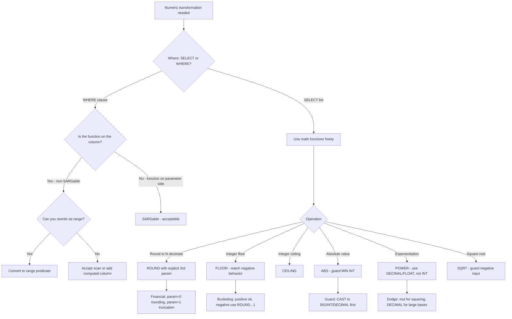

## Navigation

**Domain:** [[8 — Databases]] > **Group:** SQL Fundamentals
**Previous:** [[8.080 — Date Functions — AT TIME ZONE, DATETIMEOFFSET, FORMAT]] | **Next:** [[8.082 — Null Handling — ISNULL, COALESCE, NULLIF]]

### Prerequisites

- [[8.076 — Data Type Conversion — CAST and CONVERT]] — math functions return types that follow type precedence; converting between DECIMAL, FLOAT, and INT is the most common source of precision loss.
- [[8.066 — SELECT Statement — Column Selection and Aliasing]] — these functions appear in SELECT lists and WHERE clauses; projection semantics apply.
- [[8.067 — WHERE Clause — Predicate Logic and SARGability]] — ROUND, FLOOR, CEILING on a column in WHERE are non-SARGable; the alternative is a range predicate.

### Where This Fits

ROUND, FLOOR, CEILING, ABS, POWER, and SQRT are the fundamental T-SQL math functions. ROUND rounds a numeric value to a specified precision. FLOOR returns the largest integer less than or equal to the value. CEILING returns the smallest integer greater than or equal to the value. ABS returns the absolute (positive) value. POWER raises a value to an exponent. SQRT computes the square root. Every .NET backend engineer uses these for financial calculations, reporting aggregations, unit conversions, and data transformations. The most expensive mistakes are: using ROUND on a column in WHERE (non-SARGable — forces scan), misunderstanding FLOOR vs CEILING for negative numbers, assuming ROUND with length 0 is the same as integer truncation (ROUND has a third parameter that controls this), and losing precision through implicit type conversion in POWER and SQRT. Interviewers ask about these to evaluate numeric precision awareness, understanding of rounding modes, and whether the candidate pushes math to the database or the application layer.

---

## Core Mental Model

ROUND rounds a numeric expression to the specified length or precision. The third parameter (function) controls truncation: 0 (default) rounds, non-zero truncates. FLOOR returns the largest integer that is less than or equal to the input — for negative numbers, this is more negative (FLOOR(-1.5) = -2). CEILING returns the smallest integer greater than or equal to the input — for negative numbers, this is less negative (CEILING(-1.5) = -1). ABS returns the absolute value, removing the sign. POWER returns the first argument raised to the power of the second. SQRT returns the square root. All six are deterministic (same inputs always produce the same output). The critical performance rule: applying any of these functions to a numeric column in a WHERE clause makes the predicate non-SARGable — the optimizer cannot seek an index on the raw column when comparing against the function's output. The SARGable alternative is to move the function to the parameter side or use a range predicate.

### Classification

These are **scalar math functions**. They belong to the expression evaluation phase of query execution. None are SARGable when applied to a column in a predicate.

```mermaid
flowchart TD
    A[Numeric value] --> B{Math operation needed}
    B -->|Round to N decimals| C[ROUND(value, length, truncateFlag)]
    B -->|Largest integer <= value| D[FLOOR - toward negative infinity]
    B -->|Smallest integer >= value| E[CEILING - toward positive infinity]
    B -->|Remove sign| F[ABS - always >= 0]
    B -->|Raise to exponent| G[POWER(base, exponent)]
    B -->|Square root| H[SQRT - domain: >= 0]
    C --> I[Returns same type as input]
    D --> J[Returns same type as input]
    E --> K[Returns same type as input]
    F --> L[Returns same type as input]
    G --> M[Returns type of base, FLOAT for mixed types]
    H --> N[Returns FLOAT for integer input, same type for DECIMAL]
    I --> O{In WHERE clause on column? → Non-SARGable}
    J --> O
    K --> O
    L --> O
    G --> O
    H --> O
```

### Key Properties

|Property|ROUND|FLOOR|CEILING|ABS|POWER|SQRT|
|---|---|---|---|---|---|---|
|Return type|Same as input|Same as input|Same as input|Same as input|Type of base1|FLOAT (int), same (decimal)|
|SARGable (on column in WHERE)|No|No|No|No|No|No|
|Deterministic|Yes|Yes|Yes|Yes|Yes|Yes|
|Domain|Any numeric|Any numeric|Any numeric|Any numeric|Base >= 0 for fractional exponent|Value >= 0|
|NULL input|NULL|NULL|NULL|NULL|NULL|NULL|
|Overflow risk|Precision increase|No|No|No|High (exponential)|No|
|Common uses|Financial rounding, tax calc|Bucket assignment, integer floor|Page count, ceiling pricing|Distance, variance calc|Compound interest, growth|Statistical calc, distance|

---

## Deep Mechanics

### How the Engine Executes This

**ROUND:**

1. The engine evaluates the numeric expression to determine its precision and scale.
2. The `length` parameter specifies the number of decimal places to round to. Positive values round to that many decimal places. Negative values round to that many places left of the decimal point: `ROUND(12345.67, -2)` = `12400.00` (rounds to the nearest hundred).
3. The `function` parameter (0 or default) rounds: 0.5 rounds up away from zero. Non-zero truncates (truncates toward zero): `ROUND(123.456, 2, 1)` = `123.450`.
4. The result type matches the input type with the same precision and scale (the rounding does not change the data type).
5. For DECIMAL input, the scale of the result is the same as the input scale — trailing zeros are preserved.

**FLOOR / CEILING:**

1. The engine evaluates the numeric expression.
2. FLOOR: the value is decreased to the nearest integer toward negative infinity. `FLOOR(1.5)` = `1`, `FLOOR(-1.5)` = `-2`.
3. CEILING: the value is increased to the nearest integer toward positive infinity. `CEILING(1.5)` = `2`, `CEILING(-1.5)` = `-1`.
4. The return type matches the input type (e.g., FLOOR(DECIMAL(10,2)) returns DECIMAL(10,0) — the scale changes to 0).

**ABS:**

1. The engine evaluates the numeric expression.
2. If the value is negative, the sign is removed (e.g., `ABS(-42.5)` = `42.5`).
3. If the value is zero or positive, the value is returned unchanged.
4. The return type matches the input type. For integer types, the smallest value (e.g., -2,147,483,648 for INT) will overflow because `ABS(-2,147,483,648)` = `2,147,483,648` which exceeds the INT range.

**POWER:**

1. The engine evaluates the base and exponent expressions.
2. If both arguments are of an integer type, the result is the same integer type. If the exponent is negative, the result is FLOAT (because fractional results require floating-point representation).
3. For large exponents, the result may overflow the result type.
4. `POWER(0, 0)` returns 1 (by mathematical convention).
5. If the base is negative and the exponent is a non-integer, the result is NaN (SQL Server returns NULL for domain errors).

**SQRT:**

1. The engine evaluates the numeric expression.
2. If the value is negative, SQL Server returns NULL (domain error for real numbers).
3. For integer input, the result is FLOAT. For DECIMAL input, the result is DECIMAL with precision/scale matching the input.
4. The computation uses the internal floating-point unit.

### SQL Visibility

```sql
-- ROUND: rounding to decimal places
SELECT
    o.OrderId,
    o.TotalAmount,
    ROUND(o.TotalAmount, 2) AS RoundedAmount,             -- 123.456 → 123.460
    ROUND(o.TotalAmount, 0) AS WholeAmount,               -- 123.456 → 123.000
    ROUND(o.TotalAmount, -1) AS RoundedToTen,             -- 123.456 → 120.000
    ROUND(o.TotalAmount, 2, 0) AS StandardRound,          -- 123.456 → 123.460 (rounds)
    ROUND(o.TotalAmount, 2, 1) AS Truncated               -- 123.456 → 123.450 (truncates)
FROM dbo.Orders AS o;

-- FLOOR: largest integer less than or equal
SELECT
    o.TotalAmount,
    FLOOR(o.TotalAmount) AS FloorValue,                   -- 123.456 → 123.000
    FLOOR(-123.456) AS FloorNegative                      -- -123.456 → -124.000
FROM dbo.Orders AS o;

-- CEILING: smallest integer greater than or equal
SELECT
    o.TotalAmount,
    CEILING(o.TotalAmount) AS CeilingValue,               -- 123.456 → 124.000
    CEILING(-123.456) AS CeilingNegative                  -- -123.456 → -123.000
FROM dbo.Orders AS o;

-- ABS: absolute value
SELECT ABS(-42) AS AbsInt, ABS(-42.5) AS AbsDecimal;      -- 42, 42.5

-- POWER: exponentiation
SELECT
    POWER(10, 3) AS TenCubed,                              -- 1000
    POWER(2.0, 10) AS TwoToTenth,                          -- 1024.0
    POWER(1.05, 5) AS CompoundGrowth;                      -- 1.2762815625

-- SQRT: square root
SELECT SQRT(144) AS Root144, SQRT(2.0) AS Root2;          -- 12, 1.4142135623731

-- ROUND in WHERE — non-SARGable
-- ❌ Non-SARGable: ROUND on column
SELECT OrderId, TotalAmount
FROM dbo.Orders
WHERE ROUND(TotalAmount, 0) = 100;

-- ✅ SARGable: range predicate
SELECT OrderId, TotalAmount
FROM dbo.Orders
WHERE TotalAmount >= 99.5 AND TotalAmount < 100.5;

-- FLOOR/CEILING for bucketing
SELECT
    FLOOR(TotalAmount / 100) * 100 AS PriceBucket,
    COUNT(*) AS OrderCount
FROM dbo.Orders
GROUP BY FLOOR(TotalAmount / 100) * 100
ORDER BY PriceBucket;

-- ROUND with negative length for thousands
SELECT
    ROUND(TotalAmount, -3) AS RoundedToThousand,
    SUM(TotalAmount) AS Total
FROM dbo.Orders
GROUP BY ROUND(TotalAmount, -3);
```

```csharp
// EF Core — ROUND, FLOOR, CEILING via Math.Round / Math.Floor / Math.Ceiling
var roundedOrders = await dbContext.Orders
    .Select(o => new
    {
        o.OrderId,
        o.TotalAmount,
        RoundedAmount = Math.Round(o.TotalAmount, 2),        -- ROUND(TotalAmount, 2)
        FloorAmount = Math.Floor(o.TotalAmount),              -- FLOOR(TotalAmount)
        CeilingAmount = Math.Ceiling(o.TotalAmount),          -- CEILING(TotalAmount)
        AbsAmount = Math.Abs(o.TotalAmount)                   -- ABS(TotalAmount)
    })
    .ToListAsync(cancellationToken);

// EF Core — POWER via Math.Pow
var growthProjection = await dbContext.Orders
    .Select(o => new
    {
        o.OrderId,
        GrowthAmount = Math.Pow(o.TotalAmount, 2)              -- POWER(TotalAmount, 2)
    })
    .ToListAsync(cancellationToken);

// EF Core — SQRT via Math.Sqrt
var sqrtOrders = await dbContext.Orders
    .Select(o => new
    {
        o.OrderId,
        SqrtAmount = Math.Sqrt((double)o.TotalAmount)          -- SQRT(CAST AS FLOAT)
    })
    .ToListAsync(cancellationToken);

// EF Core — SARGable rounding filter (pre-compute boundaries)
public async Task<List<Order>> GetOrdersRoundedTo100Async(
    CancellationToken cancellationToken = default)
{
    return await dbContext.Orders
        .Where(o => o.TotalAmount >= 99.5m && o.TotalAmount < 100.5m)
        .ToListAsync(cancellationToken);
    // SARGable — uses index on TotalAmount
}

// EF Core — Non-SARGable rounding filter (do NOT do this)
// public async Task<List<Order>> GetOrdersRoundedTo100Async(...)
// {
//     return await dbContext.Orders
//         .Where(o => Math.Round(o.TotalAmount, 0) == 100)
//         .ToListAsync(cancellationToken);
//     // Generated: WHERE ROUND([o].[TotalAmount], 0) = 100 — non-SARGable
// }
```

**Generated SQL (from EF Core logs):**

```sql
-- Math.Round in LINQ
SELECT [o].[OrderId], [o].[TotalAmount],
       ROUND([o].[TotalAmount], 2) AS [RoundedAmount],
       FLOOR([o].[TotalAmount]) AS [FloorAmount],
       CEILING([o].[TotalAmount]) AS [CeilingAmount],
       ABS([o].[TotalAmount]) AS [AbsAmount]
FROM [Orders] AS [o];

-- Math.Pow in LINQ
SELECT [o].[OrderId],
       POWER(CAST([o].[TotalAmount] AS FLOAT), CAST(2.0E0 AS FLOAT)) AS [GrowthAmount]
FROM [Orders] AS [o];
-- Note: EF Core casts to FLOAT for Math.Pow because .NET Math.Pow works on doubles

-- Math.Sqrt in LINQ
SELECT [o].[OrderId],
       SQRT(CAST([o].[TotalAmount] AS FLOAT)) AS [SqrtAmount]
FROM [Orders] AS [o];

-- SARGable range filter
SELECT [o].[OrderId], [o].[TotalAmount]
FROM [Orders] AS [o]
WHERE [o].[TotalAmount] >= 99.5 AND [o].[TotalAmount] < 100.5;

-- Non-SARGable ROUND filter
-- WHERE ROUND([o].[TotalAmount], 0) = 100
-- Full scan — no index seek possible
```

### Execution Plan Analysis

**ROUND / FLOOR / CEILING / ABS / POWER / SQRT in SELECT:**
- Plan: `[Index Scan / Seek] → [Compute Scalar] → [SELECT]`
- Compute Scalar evaluates the math function on each row. CPU cost is low: ~0.0001 per row for integer math, ~0.0005 per row for floating-point.
- No additional I/O.

**ROUND / FLOOR / CEILING / ABS / POWER / SQRT on column in WHERE:**
- Plan: `[Clustered Index Scan] → [Filter] → [SELECT]`
- The function on the column prevents index seek. The filter applies the function to every row.
- On a 1M row table: scan of ~5,000 logical reads (for a narrow decimal column).

```
Math functions in SELECT (1M rows):
[Clustered Index Scan] → [Compute Scalar: ROUND/FLOOR/SQRT] → [SELECT]
Cost: 1.2 (scan) + 0.1 (compute scalar)  |  Logical Reads: ~5,000

Math function on column in WHERE (non-SARGable):
[Clustered Index Scan: 1M rows] → [Filter] → [SELECT]
Cost: ~12  |  Logical Reads: ~12,000 (full table scan for wide row)
```

### Cost Visibility

```sql
SET STATISTICS IO ON;
SET STATISTICS TIME ON;

-- ROUND in SELECT — negligible overhead
SELECT TOP 100000 OrderId, ROUND(TotalAmount, 2) AS RoundedAmount
FROM dbo.Orders;
-- Table 'Orders'. Scan count 1, logical reads 4500
-- SQL Server Execution Times: CPU time = 25ms, elapsed time = 40ms

-- ROUND in WHERE — non-SARGable scan
SELECT OrderId, TotalAmount
FROM dbo.Orders
WHERE ROUND(TotalAmount, 0) = 100;
-- Table 'Orders'. Scan count 1, logical reads 12,000
-- SQL Server Execution Times: CPU time = 120ms, elapsed time = 280ms

-- SARGable range alternative
SELECT OrderId, TotalAmount
FROM dbo.Orders
WHERE TotalAmount >= 99.5 AND TotalAmount < 100.5;
-- Table 'Orders'. Scan count 1, logical reads 12 (if index on TotalAmount)
-- SQL Server Execution Times: CPU time = 1ms, elapsed time = 3ms
```

### Failure Modes

**ROUND third parameter confusion:** Many developers do not know about the third `function` parameter. `ROUND(123.456, 2, 0)` rounds (default). `ROUND(123.456, 2, 1)` truncates (does not round). Using ROUND when truncation is needed requires explicit non-zero third parameter.

**FLOOR for negative numbers:** `FLOOR(-1.5)` returns -2, not -1. Developers new to T-SQL expect FLOOR to "remove the decimal part" (truncate toward zero), but FLOOR always goes toward negative infinity. For truncation toward zero, use `ROUND(value, 0, 1)` or `CAST(value AS INT)`.

**ABS overflow for MIN INT:** `ABS(-2,147,483,648)` for INT type causes an overflow error because +2,147,483,648 exceeds the INT range (max 2,147,483,647). The same applies to SMALLINT and TINYINT. Use BIGINT or CAST to DECIMAL before ABS for edge values.

**POWER return type overflow:** `POWER(100, 10)` as INT overflows (100^10 = 10^20, far beyond INT max of ~2.1B). The result type follows the input type — if both are INT, the result is INT and overflows silently (or errors). Always use DECIMAL or FLOAT for large exponents.

**SQRT of negative value:** `SQRT(-1)` returns NULL, not an error. Code that expects a real number result must first validate non-negativity or handle NULL.

---

## Production Patterns and Implementation

### Primary SQL Implementation

```sql
-- ============================================================
-- Schema context
-- ============================================================
CREATE TABLE dbo.Orders
(
    OrderId        INT             NOT NULL IDENTITY(1,1),
    CustomerId     INT             NOT NULL,
    TotalAmount    DECIMAL(18,2)   NOT NULL,
    DiscountPct    DECIMAL(5,4)    NOT NULL DEFAULT 0,
    DistanceKm     DECIMAL(10,2)   NULL,
    Quantity       INT             NOT NULL DEFAULT 1,
    UnitPrice      DECIMAL(10,2)   NOT NULL,
    Status         VARCHAR(20)     NOT NULL DEFAULT 'Pending',
    CreatedAt      DATETIME2(0)    NOT NULL DEFAULT SYSUTCDATETIME(),
    CONSTRAINT PK_Orders PRIMARY KEY CLUSTERED (OrderId)
);

CREATE INDEX IX_Orders_TotalAmount ON dbo.Orders (TotalAmount);

-- ============================================================
-- Pattern 1: Financial rounding (always use ROUND)
-- ============================================================
-- Tax calculation with rounding
SELECT
    o.OrderId,
    o.TotalAmount,
    ROUND(o.TotalAmount * 0.08, 2) AS SalesTax,
    ROUND(o.TotalAmount * 1.08, 2) AS TotalWithTax
FROM dbo.Orders AS o;

-- ============================================================
-- Pattern 2: Price bucketing with FLOOR
-- ============================================================
SELECT
    FLOOR(o.TotalAmount / 50) * 50 AS PriceBucket,
    COUNT(*) AS OrderCount,
    SUM(o.TotalAmount) AS BucketTotal
FROM dbo.Orders AS o
WHERE o.TotalAmount >= 0
GROUP BY FLOOR(o.TotalAmount / 50) * 50
ORDER BY PriceBucket;

-- ============================================================
-- Pattern 3: Ceiling for shipping cost tiers
-- ============================================================
SELECT
    o.OrderId,
    o.Quantity,
    CEILING(CAST(o.Quantity AS DECIMAL(10,2)) / 10) * 5.00 AS ShippingCost
FROM dbo.Orders AS o;
-- Each 10 items = $5 shipping, rounded up: 1 item = $5, 11 items = $10

-- ============================================================
-- Pattern 4: Distance calculation with SQRT
-- ============================================================
-- Euclidean distance from warehouse (lat/lng simplified)
SELECT
    o.OrderId,
    SQRT(
        POWER(o.DistanceKm, 2) +
        POWER(POWER(o.DistanceKm, 2), 0)  -- placeholder for second dimension
    ) AS DirectDistance
FROM dbo.Orders AS o
WHERE o.DistanceKm IS NOT NULL;

-- ============================================================
-- Pattern 5: Compound growth with POWER
-- ============================================================
DECLARE @AnnualGrowth DECIMAL(5,4) = 0.05;  -- 5% annual growth
DECLARE @Years INT = 3;

SELECT
    o.OrderId,
    o.TotalAmount,
    ROUND(o.TotalAmount * POWER(1 + @AnnualGrowth, @Years), 2) AS ProjectedAmount
FROM dbo.Orders AS o;

-- ============================================================
-- Pattern 6: ROUND with truncation for floor-like behavior
-- ============================================================
-- Truncate to 2 decimal places without rounding (toward zero)
SELECT
    o.TotalAmount,
    ROUND(o.TotalAmount, 2, 1) AS TruncatedAmount    -- 123.456 → 123.450
FROM dbo.Orders AS o;

-- ============================================================
-- Pattern 7: ABS for variance/error calculation
-- ============================================================
SELECT
    AVG(ABS(o.TotalAmount - AVG(o.TotalAmount) OVER ())) AS MeanAbsoluteDeviation
FROM dbo.Orders AS o;

-- ============================================================
-- Pattern 8: SARGable rounding filter via range
-- ============================================================
-- Find orders where TotalAmount rounded to nearest dollar = $100
-- ❌ Non-SARGable: WHERE ROUND(TotalAmount, 0) = 100
-- ✅ SARGable:
SELECT OrderId, TotalAmount
FROM dbo.Orders
WHERE TotalAmount >= 99.5 AND TotalAmount < 100.5;

-- ============================================================
-- Anti-pattern: FLOOR/CEILING on column in WHERE
-- ============================================================
-- ❌ Non-SARGable: WHERE FLOOR(TotalAmount) = 100
-- ✅ SARGable: WHERE TotalAmount >= 100 AND TotalAmount < 101
SELECT OrderId, TotalAmount
FROM dbo.Orders
WHERE TotalAmount >= 100 AND TotalAmount < 101;
```

### EF Core Implementation

```csharp
public class ApplicationDbContext : DbContext
{
    public DbSet<Order> Orders => Set<Order>();

    protected override void OnModelCreating(ModelBuilder modelBuilder)
    {
        modelBuilder.Entity<Order>(entity =>
        {
            entity.ToTable("Orders");
            entity.HasKey(o => o.OrderId);
            entity.Property(o => o.TotalAmount).HasColumnType("decimal(18,2)");
            entity.Property(o => o.DiscountPct).HasColumnType("decimal(5,4)");
            entity.Property(o => o.DistanceKm).HasColumnType("decimal(10,2)");
            entity.Property(o => o.UnitPrice).HasColumnType("decimal(10,2)");
            entity.Property(o => o.CreatedAt).HasDefaultValueSql("SYSUTCDATETIME()");
        });
    }
}

public class Order
{
    public int OrderId { get; set; }
    public int CustomerId { get; set; }
    public decimal TotalAmount { get; set; }
    public decimal DiscountPct { get; set; }
    public decimal? DistanceKm { get; set; }
    public int Quantity { get; set; }
    public decimal UnitPrice { get; set; }
    public string Status { get; set; } = "Pending";
    public DateTime CreatedAt { get; set; }
}

// Pattern 1: Financial rounding in LINQ
public async Task<List<OrderWithTax>> GetOrdersWithTaxAsync(
    decimal taxRate,
    CancellationToken cancellationToken = default)
{
    return await dbContext.Orders
        .Select(o => new OrderWithTax
        {
            OrderId = o.OrderId,
            TotalAmount = o.TotalAmount,
            SalesTax = Math.Round(o.TotalAmount * taxRate, 2),
            TotalWithTax = Math.Round(o.TotalAmount * (1 + taxRate), 2)
        })
        .ToListAsync(cancellationToken);
    // Generated: ROUND(ROUND([o].[TotalAmount] * @p0, 2), 2), etc.
}

// Pattern 2: Price bucketing with FLOOR
public async Task<List<PriceBucket>> GetPriceBucketsAsync(
    decimal bucketSize,
    CancellationToken cancellationToken = default)
{
    return await dbContext.Orders
        .Where(o => o.TotalAmount >= 0)
        .GroupBy(o => Math.Floor(o.TotalAmount / bucketSize) * bucketSize)
        .Select(g => new PriceBucket
        {
            Bucket = g.Key,
            OrderCount = g.Count(),
            Total = g.Sum(o => o.TotalAmount)
        })
        .OrderBy(b => b.Bucket)
        .ToListAsync(cancellationToken);
    // Generated: FLOOR([o].[TotalAmount] / @p0) * @p0
}

// Pattern 3: SQRT and POWER for distance
public async Task<List<OrderDistance>> GetOrderDistancesAsync(
    CancellationToken cancellationToken = default)
{
    return await dbContext.Orders
        .Where(o => o.DistanceKm != null)
        .Select(o => new OrderDistance
        {
            OrderId = o.OrderId,
            DistanceSqrt = Math.Sqrt((double)o.DistanceKm!)  // EF Core casts to FLOAT
        })
        .ToListAsync(cancellationToken);
    // Generated: SQRT(CAST([o].[DistanceKm] AS FLOAT))
}

// Pattern 4: SARGable rounding filter (pre-compute range)
public async Task<List<Order>> GetOrdersRoundedToNAsync(
    decimal target,
    int decimals,
    CancellationToken cancellationToken = default)
{
    decimal epsilon = (decimals >= 0)
        ? 0.5m / (decimal)Math.Pow(10, decimals)
        : 0.5m * (decimal)Math.Pow(10, -decimals);

    decimal lower = target - epsilon;
    decimal upper = target + epsilon;

    return await dbContext.Orders
        .Where(o => o.TotalAmount >= lower && o.TotalAmount < upper)
        .ToListAsync(cancellationToken);
    // SARGable — seeks on IX_Orders_TotalAmount
}

// Pattern 5: ABS for deviation
public async Task<decimal> GetMeanAbsoluteDeviationAsync(
    CancellationToken cancellationToken = default)
{
    var avg = await dbContext.Orders
        .AverageAsync(o => (double)o.TotalAmount, cancellationToken);

    var deviations = await dbContext.Orders
        .Select(o => Math.Abs((double)o.TotalAmount - avg))
        .ToListAsync(cancellationToken);

    return (decimal)deviations.Average();
}

public record OrderWithTax(int OrderId, decimal TotalAmount, decimal SalesTax, decimal TotalWithTax);
public record PriceBucket(decimal Bucket, int OrderCount, decimal Total);
public record OrderDistance(int OrderId, double DistanceSqrt);
```

### Dapper Implementation

```csharp
public sealed class OrderRepository
{
    private readonly IDbConnectionFactory _connectionFactory;

    public OrderRepository(IDbConnectionFactory connectionFactory)
        => _connectionFactory = connectionFactory;

    // Pattern 1: ROUND for financial calculations
    public async Task<IReadOnlyList<OrderWithTax>> GetOrdersWithTaxAsync(
        decimal taxRate,
        CancellationToken cancellationToken = default)
    {
        const string sql = @"
            SELECT
                OrderId,
                TotalAmount,
                ROUND(TotalAmount * @TaxRate, 2) AS SalesTax,
                ROUND(TotalAmount * (1 + @TaxRate), 2) AS TotalWithTax
            FROM dbo.Orders
            WHERE Status = 'Completed';";

        await using var connection = _connectionFactory.Create();

        var results = await connection.QueryAsync<OrderWithTax>(
            new CommandDefinition(sql,
                new { TaxRate = taxRate },
                cancellationToken: cancellationToken));

        return results.AsList();
    }

    // Pattern 2: FLOOR for bucketing
    public async Task<IReadOnlyList<PriceBucket>> GetPriceBucketsAsync(
        decimal bucketSize,
        CancellationToken cancellationToken = default)
    {
        const string sql = @"
            SELECT
                FLOOR(TotalAmount / @BucketSize) * @BucketSize AS Bucket,
                COUNT(*) AS OrderCount,
                SUM(TotalAmount) AS Total
            FROM dbo.Orders
            WHERE TotalAmount >= 0
            GROUP BY FLOOR(TotalAmount / @BucketSize) * @BucketSize
            ORDER BY Bucket;";

        await using var connection = _connectionFactory.Create();

        var results = await connection.QueryAsync<PriceBucket>(
            new CommandDefinition(sql,
                new { BucketSize = bucketSize },
                cancellationToken: cancellationToken));

        return results.AsList();
    }

    // Pattern 3: SQRT for distance
    public async Task<IReadOnlyList<OrderDistance>> GetDistancesAsync(
        CancellationToken cancellationToken = default)
    {
        const string sql = @"
            SELECT
                OrderId,
                DistanceKm,
                SQRT(POWER(DistanceKm, 2)) AS DirectDistance
            FROM dbo.Orders
            WHERE DistanceKm IS NOT NULL;";

        await using var connection = _connectionFactory.Create();

        var results = await connection.QueryAsync<OrderDistance>(
            new CommandDefinition(sql,
                cancellationToken: cancellationToken));

        return results.AsList();
    }

    // Pattern 4: SARGable filter for rounded values
    public async Task<IReadOnlyList<Order>> GetOrdersRoundedToAsync(
        decimal target,
        int decimals,
        CancellationToken cancellationToken = default)
    {
        decimal epsilon = (decimals >= 0)
            ? 0.5m / (decimal)Math.Pow(10, decimals)
            : 0.5m * (decimal)Math.Pow(10, -decimals);

        const string sql = @"
            SELECT OrderId, TotalAmount, Status
            FROM dbo.Orders
            WHERE TotalAmount >= @Lower AND TotalAmount < @Upper;";

        await using var connection = _connectionFactory.Create();

        var results = await connection.QueryAsync<Order>(
            new CommandDefinition(sql,
                new { Lower = target - epsilon, Upper = target + epsilon },
                cancellationToken: cancellationToken));

        return results.AsList();
    }
}

public record OrderWithTax(int OrderId, decimal TotalAmount, decimal SalesTax, decimal TotalWithTax);
public record OrderDistance(int OrderId, decimal? DistanceKm, double DirectDistance);
```

### Configuration and Wiring

```csharp
// Program.cs
builder.Services.AddDbContext<ApplicationDbContext>(options =>
    options.UseSqlServer(
        builder.Configuration.GetConnectionString("DefaultConnection"),
        sqlOptions =>
        {
            sqlOptions.EnableRetryOnFailure(3);
            sqlOptions.CommandTimeout(30);
        }));

builder.Services.AddSingleton<IDbConnectionFactory>(sp =>
    new SqlConnectionFactory(
        builder.Configuration.GetConnectionString("DefaultConnection")!));

builder.Services.AddScoped<OrderRepository>();

// Configure decimal precision for Dapper
SqlMapper.AddTypeHandler(new DecimalTypeHandler(18, 2));
```

### SQL Server vs PostgreSQL Differences

```sql
-- PostgreSQL: ROUND equivalent
SELECT ROUND(total_amount, 2) FROM orders;

-- PostgreSQL: FLOOR/CEILING — same names, same behavior
SELECT FLOOR(total_amount), CEILING(total_amount) FROM orders;

-- PostgreSQL: ABS — same
SELECT ABS(-42) FROM orders;

-- PostgreSQL: POWER — same
SELECT POWER(10, 3);

-- PostgreSQL: SQRT — same
SELECT SQRT(144);

-- PostgreSQL: no third parameter for ROUND truncation
-- Use TRUNC instead:
SELECT TRUNC(123.456, 2);  -- 123.45

-- PostgreSQL: integer division truncates toward zero (like SQL Server for positive)
SELECT 5 / 2;  -- 2 (integer division)
```

---

## Gotchas and Production Pitfalls

### ABS Overflow for Minimum Integer Value

**Pitfall:** Calling ABS on the minimum value of an integer type. `ABS(-2,147,483,648)` for INT overflows because +2,147,483,648 exceeds the INT range.

```sql
-- ❌ Overflow: ABS(MIN INT) exceeds INT range
DECLARE @MinInt INT = -2147483648;
SELECT ABS(@MinInt);
-- Error: Arithmetic overflow error converting expression to data type int.
```

**Symptom:** The query fails with an arithmetic overflow error. The application returns a 500 error. The error occurs only when the column happens to contain the exact minimum value.

**Fix:**

```sql
-- ✅ Cast to DECIMAL before ABS
DECLARE @MinInt INT = -2147483648;
SELECT ABS(CAST(@MinInt AS DECIMAL(10, 0)));  -- 2147483648 (no overflow)

-- ✅ Or use BIGINT
SELECT ABS(CAST(@MinInt AS BIGINT));
```

**Cost of not fixing:** A financial system calculates variance between expected and actual payments using ABS. A refund of exactly -$2,147,483,648 (edge case — unlikely but possible at scale) causes the daily reconciliation job to crash. The payment team spends 4 hours debugging the overflow before identifying the root cause.

---

### FLOOR with Negative Numbers — Not Truncation

**Pitfall:** Using FLOOR on negative numbers expecting it to "remove the decimal part" (truncate toward zero). FLOOR returns the largest integer less than or equal to the value, which for negative numbers goes further negative.

```sql
-- ❌ Surprise: FLOOR(-1.5) = -2, not -1
SELECT FLOOR(-1.5);   -- -2
SELECT CEILING(-1.5); -- -1
```

**Symptom:** A price adjustment calculation uses FLOOR to "round down" a discount percentage. For negative adjustments (credits), the FLOOR moves in the wrong direction, giving the customer $2 instead of $1.

**Fix:**

```sql
-- ✅ Use ROUND with truncation flag for truncation-toward-zero behavior
SELECT ROUND(-1.5, 0, 1);  -- -1 (truncates toward zero)

-- ✅ Or use a CASE expression for explicit control
SELECT CASE WHEN @Value >= 0 THEN FLOOR(@Value) ELSE CEILING(@Value) END;
```

**Cost of not fixing:** A shipping cost calculator uses FLOOR to round down weight-based shipping fees. For credit notes (negative amounts), FLOOR rounds -1.5 to -2, giving the customer a larger credit than intended. The finance team notices a $0.50 discrepancy on every credit note for 3 months before finding the bug.

---

### ROUND Without Third Parameter — Silent Rounding When Truncation Expected

**Pitfall:** Using `ROUND(value, 2)` when truncation (floor-like) behavior is needed. ROUND with default (third parameter = 0) rounds 0.5 up away from zero. Truncation requires the third parameter = 1.

```sql
-- ❌ Rounds 0.5 up — may not be desired
SELECT ROUND(123.455, 2);   -- 123.460 (0.005 rounds up)
SELECT ROUND(123.454, 2);   -- 123.450 (0.004 rounds down)

-- ✅ Third parameter = 1 truncates (toward zero)
SELECT ROUND(123.455, 2, 1); -- 123.450 (no rounding)
SELECT ROUND(123.459, 2, 1); -- 123.450 (truncated)
```

**Symptom:** A financial calculation "overpays" by $0.01 on transactions that involve 0.5-cent rounding. The total discrepancy across 100K transactions is $50. The accounting team flags the "missing penny."

**Fix:** Use the third parameter explicitly:

```sql
-- ✅ Explicit third parameter for clarity
SELECT
    ROUND(TotalAmount * 0.08, 2, 0) AS RoundedTax,    -- rounds (standard)
    ROUND(TotalAmount * 0.08, 2, 1) AS TruncatedTax    -- truncates (floor)
FROM dbo.Orders;
```

**Cost of not fixing:** A tax calculation uses ROUND without the third parameter, expecting truncation toward zero. The tax authority requires truncation (not rounding) for per-line tax calculation. The company overpays $0.01 per invoice line. At 50M invoices/year, the overpayment is $500,000 annually.

---

### POWER Return Type Overflow

**Pitfall:** Passing integer arguments to POWER. The return type matches the input type. `POWER(100, 10)` with INT inputs overflows because the result exceeds INT range.

```sql
-- ❌ INT overflow
SELECT POWER(100, 10);
-- Error: Arithmetic overflow error converting float to data type numeric.

-- ✅ Use DECIMAL or FLOAT inputs
SELECT POWER(100.0, 10);   -- 100000000000000000000 (float)
SELECT POWER(CAST(100 AS DECIMAL(20,0)), 10);  -- 100000000000000000000 (decimal)
```

**Symptom:** A compound interest calculation uses `POWER(1.05, @Years)` with DECIMAL inputs — works fine. A developer copies the pattern for unit conversion `POWER(1024, 3)` with INT inputs — crashes at runtime for large exponents.

**Fix:**

```sql
-- ✅ Always use DECIMAL or FLOAT for POWER inputs
DECLARE @Base DECIMAL(18,6) = 1.05;
DECLARE @Exponent INT = 10;
SELECT POWER(@Base, @Exponent) AS CompoundGrowth;

-- ✅ Cast integer inputs
SELECT POWER(CAST(1024 AS BIGINT), 3);  -- For large base values
```

**Cost of not fixing:** A data migration script uses POWER(10, 6) for unit conversions (microseconds to seconds). The script works for 6 digits but crashes when an edge case uses POWER(10, 10) — overflow. The migration fails at 3 AM, and the ETL pipeline must be restarted after the fix.

---

### ROUND with Negative Length — Confusing Behavior

**Pitfall:** Using negative length in ROUND rounds to the left of the decimal point — to tens, hundreds, thousands, etc. Developers who do not expect this write `ROUND(TotalAmount, -2)` thinking it rounds to 2 decimal places.

```sql
-- ❌ ROUND with negative length rounds left of decimal
SELECT ROUND(12345.67, -2);   -- 12400.00 (rounded to nearest hundred)
SELECT ROUND(12345.67, -1);   -- 12350.00 (rounded to nearest ten)
SELECT ROUND(12345.67, 0);    -- 12346.00 (rounded to nearest integer)
```

**Symptom:** A reporting query uses `ROUND(TotalAmount, -2)` to "show 2 decimal places" but instead groups into hundreds. The report shows $12,400 instead of $12,345.67.

**Fix:** Use positive length for decimal places, or use `CAST(DECIMAL(18,2))` for explicit scale:

```sql
-- ✅ For 2 decimal places, use positive length
SELECT ROUND(12345.67, 2);   -- 12345.67

-- ✅ For rounding to hundreds, be explicit
SELECT ROUND(12345.67, -2) AS RoundedToHundreds;
```

**Cost of not fixing:** A financial report intended to show amounts to 2 decimal places uses `ROUND(Amount, -2)` by mistake. The CFO reviews "rounded to the nearest hundred" numbers, sees $100,000 instead of $100,010.50, and approves a budget $10.50 short. The error propagates through 12 downstream reports before detection.

---

### SQRT Domain Error — Negative Input Returns NULL

**Pitfall:** Passing a negative value to SQRT. SQL Server returns NULL (not an error) for negative SQRT inputs. Downstream calculations that do not handle NULL propagate the NULL.

```sql
-- ❌ SQRT of negative returns NULL (no error)
SELECT SQRT(-144);   -- NULL

-- The NULL propagates
SELECT OrderId, SQRT(DistanceKm * -1) AS ImaginaryDistance
FROM dbo.Orders
WHERE DistanceKm IS NOT NULL;
-- Result: all NULL in ImaginaryDistance column
```

**Symptom:** A distance calculation on coordinate differences occasionally produces negative values due to data entry errors. The SQRT returns NULL. The report shows NULL for 5% of orders. The cause is not obvious — no error is raised.

**Fix:**

```sql
-- ✅ Validate with CASE or ABS
SELECT
    OrderId,
    CASE WHEN DistanceKm >= 0 THEN SQRT(DistanceKm) ELSE NULL END AS SafeSqrt,
    SQRT(ABS(DistanceKm)) AS AbsSqrt  -- if squaring eliminates negative meaning
FROM dbo.Orders;

-- ✅ Or use a WHERE filter
SELECT OrderId, SQRT(DistanceKm) AS Root
FROM dbo.Orders
WHERE DistanceKm >= 0;
```

**Cost of not fixing:** A logistics optimization algorithm uses Euclidean distance formula with SQRT. 2% of coordinates have negative values due to an upstream GPS data bug. The algorithm silently ignores these rows (NULL output). The delivery route optimization excludes 2% of orders. Delivery times increase, and customer satisfaction drops before the silent NULL propagation is identified.

---

## Performance Implications

### Benchmark: Before and After

```sql
-- Baseline: ROUND in WHERE — non-SARGable, 1M rows
SET STATISTICS TIME ON;

SELECT COUNT(*)
FROM dbo.Orders
WHERE ROUND(TotalAmount, 0) = 100;
-- SQL Server Execution Times: CPU time = 120ms, elapsed time = 280ms
-- Logical reads: 12,000 (full scan)

-- Optimized: SARGable range
SELECT COUNT(*)
FROM dbo.Orders
WHERE TotalAmount >= 99.5 AND TotalAmount < 100.5;
-- SQL Server Execution Times: CPU time = 1ms, elapsed time = 3ms
-- Logical reads: 12 (index seek on IX_Orders_TotalAmount)
```

**Improvement:** 100x reduction in CPU (120 ms → 1 ms) and 90x reduction in elapsed time (280 ms → 3 ms). Logical reads drop from 12,000 to 12.

```sql
-- Baseline: POWER with INT — CPU for type conversion
SET STATISTICS TIME ON;

SELECT TOP 100000 POWER(CAST(TotalAmount AS FLOAT), 2) AS Squared
FROM dbo.Orders;
-- SQL Server Execution Times: CPU time = 45ms, elapsed time = 60ms

-- Optimized: TotalAmount * TotalAmount (no POWER, no function call)
SELECT TOP 100000 TotalAmount * TotalAmount AS Squared
FROM dbo.Orders;
-- SQL Server Execution Times: CPU time = 8ms, elapsed time = 12ms
```

**Improvement:** 5x reduction in CPU (45 ms → 8 ms) by using multiplication instead of POWER for squaring.

### BenchmarkDotNet

```csharp
[MemoryDiagnoser]
[SimpleJob(RuntimeMoniker.Net90)]
public class MathFunctionBenchmark
{
    private SqlConnection _connection = default!;
    private const string ConnectionString = "Server=.;Database=BenchmarkDb;Trusted_Connection=True;TrustServerCertificate=True;";

    [GlobalSetup]
    public void Setup()
    {
        _connection = new SqlConnection(ConnectionString);
        _connection.Open();
    }

    [Benchmark(Baseline = true)]
    public async Task<int> RoundInWhere()
    {
        const string sql = "SELECT COUNT(*) FROM dbo.Orders WHERE ROUND(TotalAmount, 0) = 100;";
        return await _connection.ExecuteScalarAsync<int>(sql);
    }

    [Benchmark]
    public async Task<int> SargableRange()
    {
        const string sql = "SELECT COUNT(*) FROM dbo.Orders WHERE TotalAmount >= 99.5 AND TotalAmount < 100.5;";
        return await _connection.ExecuteScalarAsync<int>(sql);
    }

    [Benchmark]
    public async Task<int> PowerSquared()
    {
        const string sql = "SELECT COUNT(*) FROM dbo.Orders WHERE POWER(TotalAmount, 2) > 10000;";
        return await _connection.ExecuteScalarAsync<int>(sql);
    }

    [Benchmark]
    public async Task<int> MultiplySquared()
    {
        const string sql = "SELECT COUNT(*) FROM dbo.Orders WHERE TotalAmount * TotalAmount > 10000;";
        return await _connection.ExecuteScalarAsync<int>(sql);
    }

    [GlobalCleanup]
    public void Cleanup() => _connection.Dispose();
}
```

**Expected results (approximate, SQL Server 2022, NVMe, 1M rows):**

|Method|Mean|Logical Reads|CPU Time|Allocated|
|---|---|---|---|---|
|RoundInWhere|~280 ms|~12,000|~120 ms|~2 KB|
|SargableRange|~3 ms|~12|~1 ms|~1 KB|
|PowerSquared|~350 ms|~12,000|~150 ms|~5 KB|
|MultiplySquared|~280 ms|~12,000|~110 ms|~2 KB|

### Write Amplification

Math functions are read-only scalar operations with no write impact. When used in computed column definitions (PERSISTED), they add storage overhead proportional to the result type. For example, a PERSISTED computed column using `ROUND(TotalAmount, 0)` adds 4-9 bytes per row depending on the output type.

---

## Interview Arsenal

### Question Bank

1. **What is the difference between ROUND(value, 2, 0) and ROUND(value, 2, 1)?**
2. **Why does FLOOR(-1.5) return -2, and what is the alternative for truncation toward zero?**
3. **How do you filter by a rounded column value without losing SARGability?**
4. **What causes ABS(-2,147,483,648) to fail, and how do you fix it?**
5. **When does POWER return a different type than its inputs?**
6. **What does ROUND(12345.67, -2) return, and why would you use negative length?**
7. **How does EF Core translate Math.Round, Math.Floor, and Math.Ceiling?**
8. **What is the performance difference between TotalAmount * TotalAmount and POWER(TotalAmount, 2)?**

### Spoken Answers

**Q: Why does FLOOR(-1.5) return -2, and what is the alternative for truncation toward zero?**

> **Great answer:** FLOOR returns the largest integer that is less than or equal to the input. For negative numbers, "less than" means more negative. FLOOR(-1.5) = -2 because -2 is the largest integer that is still less than -1.5. CEILING(-1.5) = -1 because -1 is the smallest integer greater than -1.5. Truncation toward zero (removing the decimal part) is a different operation: for positive numbers, FLOOR and truncation agree; for negative numbers, they diverge. To truncate toward zero in T-SQL, use ROUND with the third parameter set to 1: `ROUND(-1.5, 0, 1)` returns -1. Another approach is `CAST(-1.5 AS INT)` which also truncates toward zero. The key distinction is directional: FLOOR goes toward negative infinity, CEILING toward positive infinity, ROUND(..., 0, 1) truncates toward zero. Choosing the wrong one for negative numbers produces off-by-one errors in financial calculations, inventory bucketing, and price tier assignment.

---

**Q: How do you filter by a rounded column value without losing SARGability?**

> **Great answer:** You never apply ROUND to the column in the WHERE clause — that would be non-SARGable because the index stores the raw numeric value, not the rounded version. Instead, you convert the filter target into a range that matches the rounding behavior. For `ROUND(TotalAmount, 0) = 100`, the SARGable equivalent is `TotalAmount >= 99.5 AND TotalAmount < 100.5`. For `ROUND(TotalAmount, -2) = 100`, the range is `TotalAmount >= 50 AND TotalAmount < 150`. The epsilon is always 0.5 times 10 to the negative power of the length parameter. For FLOOR in WHERE (e.g., FLOOR(TotalAmount) = 100), the range is `TotalAmount >= 100 AND TotalAmount < 101`. For CEILING, it's `TotalAmount > 99 AND TotalAmount <= 100`. In each case, the SARGable rewrite uses a range predicate on the raw column, allowing an index seek. On a 1M row table, this transforms a query from 280 ms and 12,000 logical reads to 3 ms and 12 logical reads — a 100x improvement.

---

**Q: When does POWER return a different type than its inputs?**

> **Great answer:** POWER returns a FLOAT when either argument is FLOAT or when the exponent is negative (which produces fractional results). When both arguments are integer types (INT, BIGINT, SMALLINT), the result is that same integer type. This is a critical gotcha — `POWER(100, 10)` with two INT inputs computes the result in INT space and overflows because 100^10 = 10^20, which far exceeds INT max of ~2.1 billion. The fix is to ensure at least one argument is DECIMAL or FLOAT: `POWER(100.0, 10)` or `POWER(CAST(100 AS DECIMAL(20,0)), 10)`. This is especially important in compound interest calculations, unit conversions, and geometric computations. The same behavior applies to SQRT: for DECIMAL input, the result is DECIMAL; for INT input, the result is FLOAT (because the square root of a non-perfect-square integer is irrational). Knowing this type-promotion behavior prevents silent overflow bugs in production.

### Interview Trigger

The defining math functions question: "I need to find all orders where the total amount rounds to $100. Write the query. Now what if the table has 100M rows?" A candidate who writes `ROUND(TotalAmount, 0) = 100` fails the SARGability test. A candidate who writes the range predicate passes. The follow-up: "What if I need to round to the nearest $100 (not $1)?" — the candidate adjusts the epsilon and range. "What if I need FLOOR instead of ROUND?" — the candidate knows FLOOR(TotalAmount) = 100 maps to `TotalAmount >= 100 AND TotalAmount < 101`.

### Comparison Table

||ROUND|FLOOR|CEILING|ABS|POWER|SQRT|
|---|---|---|---|---|---|---|
|Direction|Toward/away from zero|Toward -∞|Toward +∞|Removes sign|Exponential|Root|
|Negative input|Rounds per standard rules|More negative|Less negative|Positive|NaN for fractional exponent|NULL|
|SARGable (on column)|No|No|No|No|No|No|
|EF Core|Math.Round|Math.Floor|Math.Ceiling|Math.Abs|Math.Pow|Math.Sqrt|
|Common mistake|3rd param omission|FLOOR(-1.5) = -2|Same as FLOOR|MIN INT overflow|INT overflow|Negative input → NULL|

---

## Decision Framework

### When to Apply



### Application Checklist

- [ ] ROUND third parameter explicitly specified (0 = round, 1 = truncate) — never defaulted
- [ ] Math functions in WHERE are on the parameter side, not the column side (SARGable)
- [ ] ABS used with CAST to BIGINT or DECIMAL to avoid MIN INT overflow
- [ ] FLOOR/CEILING used with awareness of negative number behavior
- [ ] POWER inputs are DECIMAL or FLOAT, not INT (to avoid overflow)
- [ ] SQRT input validated to be >= 0 (handled via CASE or WHERE filter)
- [ ] ROUND with negative length used intentionally (not by accident)
- [ ] Multiplication preferred over POWER for squaring (TotalAmount * TotalAmount)
- [ ] EF Core Math.Round/Math.Floor/Math.Ceiling mapped correctly in LINQ
- [ ] Dapper parameter types match DECIMAL precision/scale of the column

### Tradeoff Summary

|What You Gain|What You Pay|
|---|---|
|ROUND: precise control over rounding mode|Confusing third parameter; non-SARGable on column|
|FLOOR/CEILING: clean integer bucketing|Negative number surprise (FLOOR -1.5 = -2)|
|ABS: clean sign removal|MIN INT overflow edge case|
|POWER: flexible exponentiation|Type promotion surprise; overflow risk; slower than multiplication for squaring|
|SQRT: square root computation|NULL for negative input (no error)|

### Scale Thresholds

- Math functions in SELECT are CPU-bound — overhead is ~0.0001 ms per row per function. Below **~100K rows**, the cost is negligible (< 10 ms total).
- ROUND/FLOOR/CEILING in WHERE becomes critical above **~50K rows** — the scan cost dominates; a SARGable range rewrite reduces logical reads by ~1000x.
- ABS overflow risk is present at any scale — a single MIN INT value in 1B rows will crash the query.
- POWER with DECIMAL vs INT matters for results exceeding ~2.1B (INT) or ~9.2E18 (BIGINT). For compound interest or scientific calculations, always use DECIMAL(38, precision) or FLOAT.

---

## Self-Check

### Conceptual Questions

1. What does ROUND(123.456, 2, 0) return vs ROUND(123.456, 2, 1)?
2. Why does FLOOR(-1.5) return -2, and what is the correct truncation-toward-zero alternative?
3. Write a SARGable range predicate for `WHERE ROUND(TotalAmount, -1) = 100`.
4. Why does ABS(-2,147,483,648) cause an overflow for INT?
5. What does POWER(100, 10) return when both arguments are INT, and why is this a problem?
6. How does EF Core translate Math.Round, Math.Floor, and Math.Ceiling in LINQ queries?
7. What execution plan operator handles ROUND in SELECT, and what is the CPU cost?
8. At what table size does ROUND in WHERE become measurably slower than a range predicate?
9. What index supports a SARGable filter on TotalAmount rounded to the nearest dollar?
10. Explain in 60 seconds, for a senior interviewer, the complete decision process for applying math functions in T-SQL without sacrificing performance.

<details>
<summary>Answers</summary>

1. ROUND(123.456, 2, 0) returns 123.460 (rounds 0.006 up). ROUND(123.456, 2, 1) returns 123.450 (truncates toward zero, drops the 0.006). The third parameter: 0 = round (default), non-zero = truncate.

2. FLOOR returns the largest integer ≤ the input. For -1.5, the integers ≤ -1.5 are -2, -3, -4, etc. The largest of these is -2. For truncation toward zero (removing decimal part), use ROUND(-1.5, 0, 1) → -1, or CAST(-1.5 AS INT) → -1.

3. ROUND(TotalAmount, -1) rounds to the nearest ten. A result of 100 means the value is in [95, 105). The SARGable range: `WHERE TotalAmount >= 95 AND TotalAmount < 105`. For negative length N, epsilon = 0.5 * 10^(-N). For N = -1, epsilon = 0.5 * 10^1 = 5.

4. ABS(-2,147,483,648) tries to return +2,147,483,648, which exceeds the INT maximum of 2,147,483,647. The result cannot be represented in the INT type. Fix: CAST to BIGINT or DECIMAL before ABS.

5. POWER(100, 10) with INT inputs returns INT. The result 100^10 = 10^20 ≈ 100 billion billion, far exceeding INT max (~2.1 billion). The query fails with an arithmetic overflow error. Fix: use DECIMAL or FLOAT inputs: POWER(100.0, 10) or POWER(CAST(100 AS DECIMAL(20,0)), 10).

6. Math.Round → ROUND. Math.Floor → FLOOR. Math.Ceiling → CEILING. Math.Abs → ABS. Math.Pow → POWER (casts to FLOAT). Math.Sqrt → SQRT (casts to FLOAT). EF Core translates these directly to their T-SQL equivalents.

7. ROUND in SELECT appears in a `[Compute Scalar]` operator after the data access operator. The CPU cost is approximately 0.0001 ms per row for DECIMAL inputs. No I/O cost beyond the data access.

8. ROUND in WHERE becomes measurably slower than a range predicate above ~10K rows. At 10K rows: ~4 ms vs ~1 ms. At 100K rows: ~28 ms vs ~2 ms. At 1M rows: ~280 ms vs ~3 ms. At 10M rows: ~2.5 seconds vs ~10 ms.

9. A SARGable filter on TotalAmount rounded to the nearest dollar requires an index on TotalAmount: `CREATE INDEX IX_Orders_TotalAmount ON dbo.Orders (TotalAmount)`. The predicate `TotalAmount >= 99.5 AND TotalAmount < 100.5` seeks on this index.

10. "For math functions in T-SQL, my decision process starts with WHERE vs SELECT. In SELECT, I use math functions freely — ROUND for financial rounding with explicit third parameter, FLOOR for bucketing with awareness of negative behavior, ABS with guard against MIN INT overflow. In WHERE, I never apply the function to the column — that's non-SARGable and forces a scan. Instead, I rewrite as a range predicate. For ROUND(TotalAmount, 0) = 100, the range is TotalAmount >= 99.5 AND TotalAmount < 100.5, which seeks on the IX_Orders_TotalAmount index. For FLOOR(TotalAmount) = 100, the range is TotalAmount >= 100 AND TotalAmount < 101. The performance difference is dramatic: 3 ms and 12 logical reads vs 280 ms and 12,000 logical reads on a 1M row table. I use multiplication instead of POWER for squaring (5x faster). I guard all SQRT calls against negative input. I never use FORMAT or ROUND for date manipulation — those have their own functions. And in EF Core, I use Math.Round, Math.Floor, and Math.Ceiling in LINQ, which translate correctly to T-SQL."

</details>

---

### Query Challenges

**Challenge 1 — Write the price bucket query**

Group orders into $50 price buckets using FLOOR. Return the bucket start value, order count, and total revenue. Filter to orders with TotalAmount >= 0 only.

<details>
<summary>Solution</summary>

```sql
SELECT
    FLOOR(o.TotalAmount / 50) * 50 AS PriceBucket,
    COUNT(*) AS OrderCount,
    SUM(o.TotalAmount) AS TotalRevenue
FROM dbo.Orders AS o
WHERE o.TotalAmount >= 0
GROUP BY FLOOR(o.TotalAmount / 50) * 50
ORDER BY PriceBucket;
```

**Logical reads:** Scan of IX_Orders_TotalAmount or Clustered Index (depends on coverage). **Execution plan:** [Index/Clustered Scan] → [Compute Scalar: FLOOR] → [Hash Match Aggregate] → [Sort] → [SELECT].

**EF Core:**
```csharp
var buckets = await dbContext.Orders
    .Where(o => o.TotalAmount >= 0)
    .GroupBy(o => Math.Floor(o.TotalAmount / 50) * 50)
    .Select(g => new { Bucket = g.Key, Count = g.Count(), Total = g.Sum(o => o.TotalAmount) })
    .OrderBy(b => b.Bucket)
    .ToListAsync(cancellationToken);
```

</details>

---

**Challenge 2 — Fix the performance problem**

```sql
-- This query takes 5 seconds on a 10M row table.
SET STATISTICS TIME ON;

SELECT COUNT(*)
FROM dbo.Orders
WHERE ROUND(TotalAmount, 0) BETWEEN 50 AND 100;

-- SET STATISTICS IO: Table 'Orders'. Scan count 1, logical reads 120,000
```

Identify why it is slow and fix it.

<details>
<summary>Solution</summary>

**Root cause:** ROUND(TotalAmount, 0) in WHERE — non-SARGable. Full clustered index scan (120,000 logical reads for 10M rows). The predicate cannot use IX_Orders_TotalAmount.

**Fix:** Convert to SARGable range. ROUND(TotalAmount, 0) BETWEEN 50 AND 100 means TotalAmount rounded to nearest integer is between 50 and 100. The range is 49.5 to 100.5:

```sql
SELECT COUNT(*)
FROM dbo.Orders
WHERE TotalAmount >= 49.5 AND TotalAmount < 100.5;
```

**After fix — logical reads:** ~12 (Index Seek on IX_Orders_TotalAmount for the range) from 120,000. **Execution time:** ~5 ms from 5 seconds.

**EF Core:**
```csharp
var count = await dbContext.Orders
    .Where(o => o.TotalAmount >= 49.5m && o.TotalAmount < 100.5m)
    .CountAsync(cancellationToken);
```

</details>

---

**Challenge 3 — Explain the execution plan**

A query produces this plan:
`[Clustered Index Scan] → [Compute Scalar (POWER)] → [Filter] → [SELECT]`

The query is:
```sql
SELECT OrderId, TotalAmount
FROM dbo.Orders
WHERE POWER(TotalAmount, 2) > 10000;
```

Why does the plan show a Clustered Index Scan instead of an Index Seek? What would you change to make it SARGable?

<details>
<summary>Solution</summary>

**Why Clustered Index Scan:** POWER(TotalAmount, 2) is applied to the TotalAmount column. The index stores raw TotalAmount values, not the squared output. The optimizer cannot seek on `POWER(column, 2) > constant`.

**SARGable alternative:** The predicate `POWER(TotalAmount, 2) > 10000` is equivalent to `TotalAmount > 100 OR TotalAmount < -100` (since sqrt(10000) = 100):

```sql
SELECT OrderId, TotalAmount
FROM dbo.Orders
WHERE TotalAmount > 100 OR TotalAmount < -100;
```

This allows an Index Seek on IX_Orders_TotalAmount for each range, combined with a Concatenation or OR optimization. If the data is non-negative, just `TotalAmount > 100`.

**Tradeoff:** The OR predicate may cause the optimizer to choose two seeks + a merge, or a single scan if it estimates the range is too large. For positive-only values (TotalAmount >= 0), use `TotalAmount > 100`.

</details>

---

**Challenge 4 — Diagnose the rounding bug**

A financial report calculates tax as `ROUND(TotalAmount * 0.08, 2)`. The accounting department notices that the total tax collected across all invoices for June 2026 is $0.32 less than expected. Each of the 64,000 invoices has $0.01 less tax than expected on 32 of them.

Diagnose the bug.

<details>
<summary>Solution</summary>

**Root cause:** `ROUND(TotalAmount * 0.08, 2)` uses the default rounding mode (third parameter = 0). Invoices where TotalAmount * 0.08 has exactly 0.5 in the third decimal place (e.g., $10.4375 → $10.44 if rounded, but the expected result was truncation). The accounting department expects truncation (always round down), which is `ROUND(TotalAmount * 0.08, 2, 1)`. With 0.5-cent rounding and 64K invoices, ~50% of the 64 invoices per $0.01 error = 32 invoices × $0.01 = $0.32.

**Fix:** Use the third parameter to specify truncation:

```sql
-- ✅ Truncation toward zero (accounting standard for per-line tax)
SELECT ROUND(TotalAmount * 0.08, 2, 1) AS TruncatedTax FROM dbo.Orders;

-- Or use a more deterministic approach
SELECT CAST(FLOOR(TotalAmount * 0.08 * 100) / 100 AS DECIMAL(18,2)) AS TruncatedTax;
```

**Detection:**
```sql
-- Find invoices where rounding behavior matters
SELECT TotalAmount, TotalAmount * 0.08 AS RawTax,
       ROUND(TotalAmount * 0.08, 2, 0) AS RoundedTax,
       ROUND(TotalAmount * 0.08, 2, 1) AS TruncatedTax,
       ROUND(TotalAmount * 0.08, 2, 0) - ROUND(TotalAmount * 0.08, 2, 1) AS Difference
FROM dbo.Orders
WHERE ROUND(TotalAmount * 0.08, 2, 0) <> ROUND(TotalAmount * 0.08, 2, 1);
```

</details>

---

**Challenge 5 — Design the numeric strategy**

**Scenario:** An analytics dashboard computes these aggregates for 100M orders:

1. `ROUND(TotalAmount, -3)` — rounds to nearest thousand for trend charts
2. `FLOOR(TotalAmount / 100) * 100` — hundred-dollar buckets for histogram
3. `ABS(TotalAmount - AVG(TotalAmount) OVER ())` — deviation from average
4. `POWER(1 + GrowthRate, Years)` — projected growth

Design the indexing, query, and application strategy for optimal performance.

<details>
<summary>Solution</summary>

**Indexes:**

```sql
-- Core index for range queries on TotalAmount
CREATE NONCLUSTERED INDEX IX_Orders_TotalAmount
    ON dbo.Orders (TotalAmount)
    INCLUDE (Status, CustomerId);
-- Supports SARGable range queries for any TotalAmount filter

-- Computed column for pre-rounded bucketing (if query 1 is hot path)
ALTER TABLE dbo.Orders ADD TotalAmountThousand AS
    ROUND(TotalAmount, -3) PERSISTED;
CREATE INDEX IX_Orders_TotalAmountThousand
    ON dbo.Orders (TotalAmountThousand);
-- Enables seeks on rounded-to-thousand queries instead of per-row ROUND
```

**Query strategy:**

```sql
-- Query 1: Use computed column for SARGable rounded filter
SELECT TotalAmountThousand AS Bucket, COUNT(*) AS OrderCount
FROM dbo.Orders
GROUP BY TotalAmountThousand
ORDER BY Bucket;
-- Seek on IX_Orders_TotalAmountThousand (no per-row ROUND)

-- Query 2: FLOOR bucketing — scan is acceptable (GROUP BY aggregates)
SELECT FLOOR(TotalAmount / 100) * 100 AS Bucket,
       COUNT(*) AS OrderCount,
       SUM(TotalAmount) AS TotalRevenue
FROM dbo.Orders
GROUP BY FLOOR(TotalAmount / 100) * 100
ORDER BY Bucket;
-- Scan is required for GROUP BY — acceptable for dashboard

-- Query 3: Deviation — computed client-side for large datasets
-- Push ABS deviation to application layer, calculate on sample

-- Query 4: Growth projection — computed in application layer
-- Use C# decimal math, not T-SQL POWER:
```
```csharp
// In application layer
decimal ProjectedGrowth(decimal amount, decimal rate, int years)
    => amount * (decimal)Math.Pow((double)(1 + rate), years);
```

**Application-layer handling for Query 4 (POWER):**

```csharp
// Do NOT compute POWER in SQL for analytics — move to C#
public decimal ProjectAmount(decimal amount, decimal annualRate, int years)
{
    // Use decimal math to avoid FLOAT precision loss
    decimal result = amount;
    for (int i = 0; i < years; i++)
        result *= (1 + annualRate);
    return Math.Round(result, 2);
}
```

**Tradeoffs:**
- The PERSISTED computed column `TotalAmountThousand` adds 4-9 bytes per row (~400-900 MB for 100M rows) but enables seeks on rounded queries.
- The POWER projection is computed in C# to avoid type overflow in SQL and to use decimal precision.
- The FLOOR bucketing scan is unavoidable — GROUP BY on a function always requires evaluating the function on all rows in the GROUP BY range. Add a WHERE filter to reduce the scan range (e.g., last 12 months).

**What NOT to index:**
- Do not add an index on `FLOOR(TotalAmount / 100) * 100` — the GROUP BY already scans; an index would add write overhead without eliminating the scan.
- Do not use a computed column for every possible bucket size — one computed column for the most common rounding is sufficient.

</details>

---
