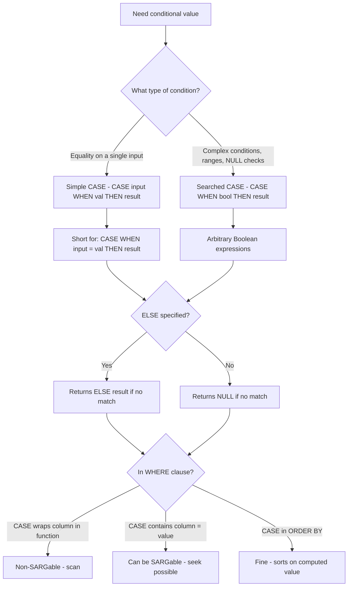
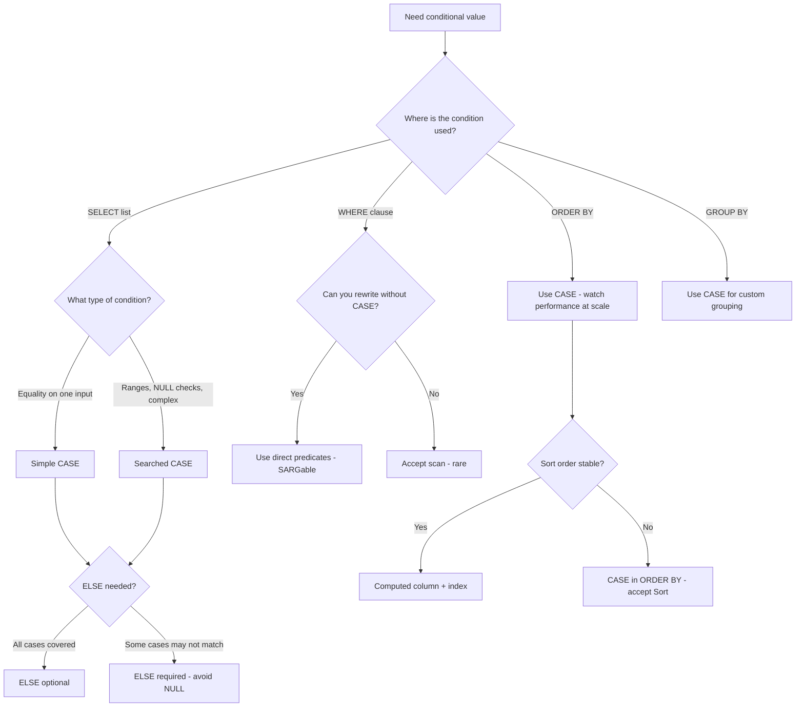

## Navigation

**Domain:** [[8 — Databases]] > **Group:** SQL Fundamentals
**Previous:** [[8.082 — Null Handling — ISNULL, COALESCE, NULLIF]] | **Next:** [[8.084 — IIF — Inline Conditional]]

### Prerequisites

- [[8.082 — Null Handling — ISNULL, COALESCE, NULLIF]] — CASE can produce NULL results; understanding three-valued logic is required for CASE conditions in WHERE and WHEN clauses.
- [[8.066 — SELECT Statement — Column Selection and Aliasing]] — CASE is an expression used in SELECT lists, WHERE, ORDER BY, and GROUP BY.
- [[8.067 — WHERE Clause — Predicate Logic and SARGability]] — CASE in WHERE can be SARGable or non-SARGable depending on whether the condition wraps a column.

### Where This Fits

CASE is the fundamental conditional expression in T-SQL — it evaluates a list of conditions and returns one of multiple possible results. Unlike procedural IF/ELSE, CASE is an expression that returns a single scalar value and can appear anywhere an expression is valid: SELECT lists, WHERE clauses, ORDER BY, GROUP BY, HAVING, computed column definitions, CHECK constraints, and SET statements. Every .NET backend engineer uses CASE for conditional column values, custom sort orders, PIVOT-like aggregation, status labeling, and inline data transformations. The most expensive mistakes are: putting CASE in a WHERE clause that wraps indexed columns (non-SARGable — forces scan), using simple CASE when searched CASE is needed for range conditions, forgetting that CASE returns NULL when no WHEN matches and no ELSE is specified, and not understanding that all result expressions must have compatible data types (following type precedence). Interviewers ask about CASE to evaluate understanding of expression semantics (not statement semantics), the difference between simple and searched forms, and whether the candidate can use CASE for set-based conditional logic without resorting to procedural iteration.

---

## Core Mental Model

CASE evaluates conditions in left-to-right order and returns the result expression of the first matching WHEN clause. If no WHEN matches and no ELSE is specified, CASE returns NULL. There are two forms: **simple CASE** (`CASE input WHEN value THEN result...`) compares input to each WHEN value using equality (`=`) — it is shorthand for `CASE WHEN input = value THEN result...`. **Searched CASE** (`CASE WHEN boolean_expression THEN result...`) evaluates arbitrary Boolean expressions — it supports ranges, pattern matching, NULL checks, and any predicate. Searched CASE is more flexible and more commonly used. CASE is deterministic when the input expressions and WHEN conditions are deterministic. The critical performance rule: CASE itself is not SARGable or non-SARGable — it is the expressions inside the WHEN clauses that determine SARGability. A CASE in WHERE with `WHEN Status = 'Shipped' THEN 1 END` on an indexed column is SARGable (the column is compared directly). A CASE in WHERE with `WHEN LEN(Status) > 5 THEN 1 END` is non-SARGable (function on column). The optimizer evaluates CASE as a scalar expression and can optimize the individual predicates within each WHEN clause.

### Classification

CASE is a **scalar expression** (returns a single value). It has two forms: simple (equality comparison) and searched (arbitrary Boolean conditions). CASE can be SARGable or non-SARGable depending on the predicates within WHEN clauses.



### Key Properties

|Property|Simple CASE|Searched CASE|
|---|---|---|
|Syntax|`CASE input WHEN v1 THEN r1 WHEN v2 THEN r2 ELSE rN END`|`CASE WHEN cond1 THEN r1 WHEN cond2 THEN r2 ELSE rN END`|
|Condition type|Equality only (`=`) | Any Boolean expression|
|NULL comparison|`CASE NULL WHEN NULL THEN...` → FALSE (NULL ≠ NULL)|`CASE WHEN expr IS NULL THEN...` → correct|
|Short-circuit|Yes (stops at first match)|Yes (stops at first TRUE condition)|
|ELSE default|NULL if omitted|NULL if omitted|
|Result type|Highest type precedence among all THEN/ELSE expressions|Same|
|Deterministic|Yes (if all inputs are deterministic)|Yes (if all conditions are deterministic)|
|SARGability (in WHERE)|Depends on WHEN expressions|Depends on WHEN expressions|
|Common uses|Status mapping, value lookup|Range bucketing, conditional aggregation, custom sort|

---

## Deep Mechanics

### How the Engine Executes This

**Simple CASE:**

1. The engine evaluates the input expression once.
2. Each WHEN clause's value expression is compared to the input using equality (`=`).
3. If a match is found, the corresponding THEN result is returned — no further WHEN clauses are evaluated.
4. If no match is found and ELSE is present, the ELSE result is returned.
5. If no match and no ELSE, NULL is returned.
6. Important: `CASE NULL WHEN NULL THEN...` does NOT match — because `NULL = NULL` evaluates to UNKNOWN, not TRUE. Use searched CASE with `WHEN expr IS NULL` for NULL checks.

**Searched CASE:**

1. The engine evaluates WHEN clauses in order.
2. Each WHEN Boolean expression is evaluated. If TRUE, the corresponding THEN result is returned.
3. Evaluation stops at the first TRUE condition — short-circuit.
4. If no WHEN is TRUE and ELSE is present, the ELSE result is returned.
5. If no WHEN is TRUE and no ELSE, NULL is returned.

**CASE in WHERE:**

1. The CASE expression is evaluated as part of the WHERE predicate.
2. If the CASE expression returns a value that makes the overall predicate TRUE, the row is included.
3. The optimizer can push individual WHEN conditions into the execution plan as seek predicates if they reference indexed columns with SARGable comparisons.
4. Complex CASE expressions in WHERE may cause the optimizer to fall back to a scan.

**CASE in ORDER BY:**

1. The CASE expression is evaluated for each row to determine the sort key.
2. A sort operator in the execution plan sorts by the computed CASE result.
3. CASE in ORDER BY does not affect index seek behavior — the data access path is determined by the WHERE clause.

**CASE in GROUP BY:**

1. The CASE expression is evaluated for each row to determine the group key.
2. Rows with the same CASE result are aggregated together.
3. CASE in GROUP BY always requires evaluating the expression for all rows in the access path.

### SQL Visibility

```sql
-- Simple CASE: compare input to fixed values
SELECT
    o.OrderId,
    o.Status,
    CASE o.Status
        WHEN 'Pending'  THEN 'Awaiting Processing'
        WHEN 'Shipped'  THEN 'In Transit'
        WHEN 'Delivered' THEN 'Completed'
        WHEN 'Cancelled' THEN 'Cancelled'
        ELSE 'Unknown Status'
    END AS StatusDisplay
FROM dbo.Orders AS o;

-- Searched CASE: complex conditions
SELECT
    o.OrderId,
    o.TotalAmount,
    o.Quantity,
    CASE
        WHEN o.TotalAmount >= 1000 THEN 'Premium'
        WHEN o.TotalAmount >= 500  THEN 'High Value'
        WHEN o.TotalAmount >= 100  THEN 'Standard'
        WHEN o.Quantity > 10       THEN 'Bulk Order'
        ELSE 'Regular'
    END AS OrderCategory
FROM dbo.Orders AS o;

-- CASE in WHERE — non-SARGable
DECLARE @CategoryFilter VARCHAR(20) = 'Premium';

SELECT OrderId, TotalAmount, Status
FROM dbo.Orders
WHERE
    CASE
        WHEN TotalAmount >= 1000 THEN 'Premium'
        WHEN TotalAmount >= 500  THEN 'High Value'
        ELSE 'Regular'
    END = @CategoryFilter;
-- Non-SARGable: CASE wraps TotalAmount in a conditional expression

-- SARGable alternative: direct predicates
SELECT OrderId, TotalAmount, Status
FROM dbo.Orders
WHERE (@CategoryFilter = 'Premium'    AND TotalAmount >= 1000)
   OR (@CategoryFilter = 'High Value' AND TotalAmount >= 500 AND TotalAmount < 1000);

-- CASE in ORDER BY — custom sort order
SELECT OrderId, Status, TotalAmount
FROM dbo.Orders
ORDER BY
    CASE Status
        WHEN 'Pending'   THEN 1
        WHEN 'Shipped'   THEN 2
        WHEN 'Delivered' THEN 3
        WHEN 'Cancelled' THEN 4
        ELSE 5
    END;

-- CASE in GROUP BY — conditional grouping
SELECT
    CASE
        WHEN OrderDate >= '2026-01-01' AND OrderDate < '2027-01-01' THEN '2026'
        WHEN OrderDate >= '2025-01-01' AND OrderDate < '2026-01-01' THEN '2025'
        ELSE 'Older'
    END AS OrderYear,
    COUNT(*) AS OrderCount,
    SUM(TotalAmount) AS TotalRevenue
FROM dbo.Orders
GROUP BY
    CASE
        WHEN OrderDate >= '2026-01-01' AND OrderDate < '2027-01-01' THEN '2026'
        WHEN OrderDate >= '2025-01-01' AND OrderDate < '2026-01-01' THEN '2025'
        ELSE 'Older'
    END
ORDER BY OrderYear;

-- CASE with aggregate — PIVOT-like conditional aggregation
SELECT
    CustomerId,
    SUM(CASE WHEN Status = 'Shipped'   THEN TotalAmount ELSE 0 END) AS ShippedRevenue,
    SUM(CASE WHEN Status = 'Pending'   THEN TotalAmount ELSE 0 END) AS PendingRevenue,
    SUM(CASE WHEN Status = 'Delivered' THEN TotalAmount ELSE 0 END) AS DeliveredRevenue,
    SUM(CASE WHEN Status = 'Cancelled' THEN TotalAmount ELSE 0 END) AS CancelledRevenue
FROM dbo.Orders
GROUP BY CustomerId;

-- CASE for divide-by-zero guard
SELECT
    OrderId,
    TotalAmount,
    CASE WHEN Quantity > 0 THEN TotalAmount / Quantity ELSE NULL END AS UnitPrice
FROM dbo.Orders;

-- CASE with NULL handling
SELECT
    OrderId,
    ShippingAddr,
    CASE
        WHEN ShippingAddr IS NULL THEN 'No Address'
        WHEN ShippingAddr = ''    THEN 'Not Provided'
        ELSE ShippingAddr
    END AS DisplayAddress
FROM dbo.Orders;

-- Simple CASE NULL trap
DECLARE @Val INT = NULL;
SELECT
    CASE @Val
        WHEN NULL THEN 'Is NULL'      -- Never matches (NULL = NULL is UNKNOWN)
        ELSE 'Not NULL'
    END AS Result;                    -- 'Not NULL'

-- Correct NULL check: searched CASE
SELECT
    CASE
        WHEN @Val IS NULL THEN 'Is NULL'
        ELSE 'Not NULL'
    END AS CorrectResult;             -- 'Is NULL'
```

```csharp
// EF Core — ternary operator (? :) translates to CASE
var categorizedOrders = await dbContext.Orders
    .Select(o => new
    {
        o.OrderId,
        o.TotalAmount,
        Category = o.TotalAmount >= 1000
            ? "Premium"
            : o.TotalAmount >= 500
                ? "High Value"
                : "Regular"
    })
    .ToListAsync(cancellationToken);
// Generated: CASE WHEN [o].[TotalAmount] >= 1000.0 THEN N'Premium'
//                WHEN [o].[TotalAmount] >= 500.0 THEN N'High Value'
//                ELSE N'Regular' END

// EF Core — switch expression (C# 8+) translates to CASE
var statusLabels = await dbContext.Orders
    .Select(o => new
    {
        o.OrderId,
        o.Status,
        Label = o.Status switch
        {
            "Pending"   => "Awaiting Processing",
            "Shipped"   => "In Transit",
            "Delivered" => "Completed",
            "Cancelled" => "Cancelled",
            _           => "Unknown Status"
        }
    })
    .ToListAsync(cancellationToken);
// Generated: CASE [o].[Status]
//                WHEN N'Pending'   THEN N'Awaiting Processing'
//                WHEN N'Shipped'   THEN N'In Transit'
//                WHEN N'Delivered' THEN N'Completed'
//                WHEN N'Cancelled' THEN N'Cancelled'
//                ELSE N'Unknown Status' END

// EF Core — conditional aggregation (SUM + CASE)
var revenueByStatus = await dbContext.Orders
    .GroupBy(o => o.CustomerId)
    .Select(g => new
    {
        CustomerId = g.Key,
        ShippedRevenue = g.Sum(o => o.Status == "Shipped" ? o.TotalAmount : 0m),
        PendingRevenue = g.Sum(o => o.Status == "Pending" ? o.TotalAmount : 0m)
    })
    .ToListAsync(cancellationToken);
// Generated: SUM(CASE WHEN [o].[Status] = N'Shipped' THEN [o].[TotalAmount] ELSE 0.0 END)

// EF Core — CASE in ORDER BY for custom sort
var sortedOrders = await dbContext.Orders
    .OrderBy(o => o.Status switch
    {
        "Pending"   => 1,
        "Shipped"   => 2,
        "Delivered" => 3,
        "Cancelled" => 4,
        _           => 5
    })
    .ThenBy(o => o.OrderDate)
    .ToListAsync(cancellationToken);
// Generated: ORDER BY CASE [o].[Status]
//                        WHEN N'Pending'   THEN 1
//                        WHEN N'Shipped'   THEN 2
//                        WHEN N'Delivered' THEN 3
//                        WHEN N'Cancelled' THEN 4
//                        ELSE 5 END, [o].[OrderDate]

// EF Core — CASE in WHERE (non-SARGable — avoid)
var premiumOrders = await dbContext.Orders
    .Where(o =>
        o.TotalAmount >= 1000 ? "Premium" :
        o.TotalAmount >= 500  ? "High Value" :
        "Regular" == "Premium")
    .ToListAsync(cancellationToken);
// Generated: WHERE CASE WHEN [o].[TotalAmount] >= 1000.0 THEN N'Premium' ...
// Non-SARGable — full scan

// Better: use direct predicates
var premiumOrders2 = await dbContext.Orders
    .Where(o => o.TotalAmount >= 1000)
    .ToListAsync(cancellationToken);
```

**Generated SQL (from EF Core logs):**

```sql
-- Ternary operator (?:) in SELECT
SELECT [o].[OrderId], [o].[TotalAmount],
    CASE
        WHEN [o].[TotalAmount] >= 1000.0 THEN N'Premium'
        WHEN [o].[TotalAmount] >= 500.0 THEN N'High Value'
        ELSE N'Regular'
    END AS [Category]
FROM [Orders] AS [o];

-- Switch expression in SELECT
SELECT [o].[OrderId], [o].[Status],
    CASE [o].[Status]
        WHEN N'Pending'   THEN N'Awaiting Processing'
        WHEN N'Shipped'   THEN N'In Transit'
        WHEN N'Delivered' THEN N'Completed'
        WHEN N'Cancelled' THEN N'Cancelled'
        ELSE N'Unknown Status'
    END AS [Label]
FROM [Orders] AS [o];

-- Conditional aggregation (SUM + CASE)
SELECT [o].[CustomerId],
    SUM(CASE WHEN [o].[Status] = N'Shipped'   THEN [o].[TotalAmount] ELSE 0.0 END) AS [ShippedRevenue],
    SUM(CASE WHEN [o].[Status] = N'Pending'   THEN [o].[TotalAmount] ELSE 0.0 END) AS [PendingRevenue]
FROM [Orders] AS [o]
GROUP BY [o].[CustomerId];

-- CASE in ORDER BY
SELECT [o].[OrderId], [o].[OrderDate], [o].[Status]
FROM [Orders] AS [o]
ORDER BY CASE [o].[Status]
            WHEN N'Pending'   THEN CAST(1 AS INT)
            WHEN N'Shipped'   THEN CAST(2 AS INT)
            WHEN N'Delivered' THEN CAST(3 AS INT)
            WHEN N'Cancelled' THEN CAST(4 AS INT)
            ELSE CAST(5 AS INT)
         END, [o].[OrderDate];
```

### Execution Plan Analysis

**CASE in SELECT:**
- Plan: `[Index Scan / Seek] → [Compute Scalar] → [SELECT]`
- Compute Scalar evaluates the CASE expression. CPU cost: ~0.0001 per row for simple comparisons.

**CASE in WHERE (non-SARGable):**
- Plan: `[Clustered Index Scan] → [Filter] → [SELECT]`
- The Filter operator evaluates the CASE for every row. No index seek on the expressions inside CASE.

**CASE with conditional aggregation (SUM + CASE):**
- Plan: `[Clustered Index Scan] → [Compute Scalar] → [Hash Match Aggregate] → [SELECT]`
- The Compute Scalar evaluates the CASE for each row. The aggregate (Hash Match) sums the results.

```
CASE in SELECT (1M rows):
[Clustered Index Scan] → [Compute Scalar: CASE] → [SELECT]
Cost: 1.2 (scan) + 0.05 (CASE)  |  Logical Reads: ~5,000

CASE in WHERE (non-SARGable):
[Clustered Index Scan: 1M rows] → [Filter: CASE] → [SELECT]
Cost: ~12  |  Logical Reads: ~12,000

Conditional aggregation (SUM + CASE, 1M rows):
[Clustered Index Scan] → [Compute Scalar: CASE] → [Hash Match Aggregate] → [SELECT]
Cost: ~12 + 0.1 + 0.5  |  Logical Reads: ~12,000
```

### Cost Visibility

```sql
SET STATISTICS IO ON;
SET STATISTICS TIME ON;

-- CASE in SELECT — negligible overhead
SELECT TOP 100000
    OrderId,
    CASE WHEN TotalAmount >= 1000 THEN 'Premium' ELSE 'Standard' END AS Category
FROM dbo.Orders;
-- Table 'Orders'. Scan count 1, logical reads 4500
-- SQL Server Execution Times: CPU time = 15ms, elapsed time = 25ms

-- CASE in WHERE — non-SARGable (1M rows)
SELECT OrderId, TotalAmount
FROM dbo.Orders
WHERE
    CASE WHEN TotalAmount >= 1000 THEN 'Premium'
         WHEN TotalAmount >= 500  THEN 'High Value'
         ELSE 'Standard'
    END = 'Premium';
-- Table 'Orders'. Scan count 1, logical reads 12,000
-- SQL Server Execution Times: CPU time = 80ms, elapsed time = 200ms

-- SARGable alternative
SELECT OrderId, TotalAmount
FROM dbo.Orders
WHERE TotalAmount >= 1000;
-- Table 'Orders'. Scan count 1, logical reads 145 (seek on IX_Orders_TotalAmount)
-- SQL Server Execution Times: CPU time = 2ms, elapsed time = 5ms
```

### Failure Modes

**Simple CASE NULL comparison:** `CASE NULL WHEN NULL THEN 'match' ELSE 'no match' END` returns 'no match' because `NULL = NULL` is UNKNOWN, not TRUE. Always use searched CASE with `WHEN expr IS NULL` for NULL checks.

**CASE data type mismatch:** All THEN and ELSE result expressions must have compatible data types. If one THEN returns VARCHAR and another returns INT, the INT is implicitly converted to VARCHAR (or an error occurs). The result type follows T-SQL type precedence across all possible result expressions.

**CASE without ELSE returns NULL:** When no WHEN matches and no ELSE is specified, CASE returns NULL. In arithmetic or string concatenation, this NULL propagates silently: `TotalAmount + CASE WHEN DiscountPct IS NOT NULL THEN TotalAmount * DiscountPct END` returns NULL if DiscountPct is NULL.

**CASE in WHERE with non-SARGable predicates:** CASE that wraps columns in functions (LEN, YEAR, SUBSTRING) inside WHEN clauses makes the entire WHERE predicate non-SARGable.

**Type precedence in CASE result:** If THEN returns DECIMAL(18,2) and another THEN returns INT, the result type is DECIMAL(18,2). If THEN returns VARCHAR(10) and another THEN returns VARCHAR(20), the result type is VARCHAR(20) — no truncation. But if THEN returns NVARCHAR and another THEN returns VARCHAR, NVARCHAR wins (higher precedence).

---

## Production Patterns and Implementation

### Primary SQL Implementation

```sql
-- ============================================================
-- Schema context
-- ============================================================
CREATE TABLE dbo.Orders
(
    OrderId        INT             NOT NULL IDENTITY(1,1),
    CustomerId     INT             NOT NULL,
    OrderDate      DATETIME2(0)    NOT NULL,
    Status         VARCHAR(20)     NOT NULL DEFAULT 'Pending',
    TotalAmount    DECIMAL(18,2)   NOT NULL,
    Quantity       INT             NOT NULL DEFAULT 1,
    DiscountPct    DECIMAL(5,4)    NULL,
    ShippingAddr   VARCHAR(200)    NULL,
    Region         VARCHAR(50)     NOT NULL DEFAULT 'US',
    CreatedAt      DATETIME2(0)    NOT NULL DEFAULT SYSUTCDATETIME(),
    CONSTRAINT PK_Orders PRIMARY KEY CLUSTERED (OrderId)
);

CREATE INDEX IX_Orders_TotalAmount ON dbo.Orders (TotalAmount);
CREATE INDEX IX_Orders_Status ON dbo.Orders (Status);

-- ============================================================
-- Pattern 1: Status display mapping (simple CASE)
-- ============================================================
SELECT
    o.OrderId,
    o.Status,
    CASE o.Status
        WHEN 'Pending'    THEN 'Awaiting Processing'
        WHEN 'Confirmed'  THEN 'Payment Confirmed'
        WHEN 'Shipped'    THEN 'In Transit'
        WHEN 'Delivered'  THEN 'Completed'
        WHEN 'Cancelled'  THEN 'Cancelled'
        WHEN 'Returned'   THEN 'Returned'
        ELSE 'Unknown'
    END AS StatusLabel
FROM dbo.Orders AS o;

-- ============================================================
-- Pattern 2: Value bucketing (searched CASE)
-- ============================================================
SELECT
    o.OrderId,
    o.TotalAmount,
    CASE
        WHEN o.TotalAmount >= 5000 THEN 'Platinum'
        WHEN o.TotalAmount >= 1000 THEN 'Gold'
        WHEN o.TotalAmount >= 250  THEN 'Silver'
        WHEN o.TotalAmount > 0     THEN 'Bronze'
        ELSE 'Free'
    END AS Tier
FROM dbo.Orders AS o;

-- ============================================================
-- Pattern 3: Custom ORDER BY with CASE
-- ============================================================
SELECT OrderId, Status, OrderDate, TotalAmount
FROM dbo.Orders
ORDER BY
    CASE o.Status
        WHEN 'Pending'   THEN 1
        WHEN 'Shipped'   THEN 2
        WHEN 'Delivered' THEN 3
        WHEN 'Cancelled' THEN 4
        ELSE 5
    END,
    OrderDate DESC;

-- ============================================================
-- Pattern 4: Conditional aggregation (PIVOT via CASE)
-- ============================================================
SELECT
    CustomerId,
    COUNT(*) AS TotalOrders,
    SUM(CASE WHEN Status = 'Delivered' THEN 1 ELSE 0 END) AS CompletedOrders,
    SUM(CASE WHEN Status = 'Pending'   THEN 1 ELSE 0 END) AS PendingOrders,
    SUM(CASE WHEN Status = 'Cancelled' THEN 1 ELSE 0 END) AS CancelledOrders,
    SUM(CASE WHEN Status = 'Delivered' THEN TotalAmount ELSE 0 END) AS CompletedRevenue,
    SUM(CASE WHEN Status = 'Pending'   THEN TotalAmount ELSE 0 END) AS PendingRevenue
FROM dbo.Orders
GROUP BY CustomerId;

-- ============================================================
-- Pattern 5: CASE for divide-by-zero and NULL guards
-- ============================================================
SELECT
    o.OrderId,
    o.TotalAmount,
    o.Quantity,
    CASE WHEN o.Quantity > 0 THEN o.TotalAmount / o.Quantity ELSE NULL END AS UnitPrice,
    CASE WHEN o.Quantity > 0 THEN o.TotalAmount / o.Quantity ELSE 0 END AS SafeUnitPrice,
    o.TotalAmount * (1 - CASE WHEN o.DiscountPct IS NOT NULL THEN o.DiscountPct ELSE 0 END) AS DiscountedAmount
FROM dbo.Orders AS o;

-- ============================================================
-- Pattern 6: CASE in SET statement (column update)
-- ============================================================
UPDATE dbo.Orders
SET Status = CASE
    WHEN DATEDIFF(DAY, OrderDate, GETUTCDATE()) > 30 AND Status = 'Pending' THEN 'Cancelled'
    WHEN DATEDIFF(DAY, OrderDate, GETUTCDATE()) > 7  AND Status = 'Shipped' THEN 'Delivered'
    ELSE Status
END
WHERE Status IN ('Pending', 'Shipped');

-- ============================================================
-- Pattern 7: CASE in CHECK constraint
-- ============================================================
ALTER TABLE dbo.Orders ADD CONSTRAINT CK_Orders_Status_Transition
CHECK (
    CASE
        WHEN Status = 'Shipped'   AND ShippedDate IS NULL THEN 0
        WHEN Status = 'Delivered' AND DeliveryDate IS NULL THEN 0
        ELSE 1
    END = 1
);

-- ============================================================
-- Pattern 8: CASE with region-based tax calculation
-- ============================================================
SELECT
    o.OrderId,
    o.TotalAmount,
    o.Region,
    ROUND(o.TotalAmount *
        CASE o.Region
            WHEN 'US'      THEN 0.08
            WHEN 'CA'      THEN 0.05
            WHEN 'UK'      THEN 0.20
            WHEN 'DE'      THEN 0.19
            WHEN 'JP'      THEN 0.10
            ELSE 0.00
        END, 2) AS TaxAmount
FROM dbo.Orders AS o;

-- ============================================================
-- Anti-pattern: CASE in WHERE (non-SARGable)
-- ============================================================
-- Non-SARGable: CASE wraps TotalAmount
-- SELECT * FROM Orders
-- WHERE CASE WHEN TotalAmount >= 1000 THEN 'Premium' ELSE 'Standard' END = 'Premium';
-- SARGable:
SELECT * FROM Orders WHERE TotalAmount >= 1000;
```

### EF Core Implementation

```csharp
public class ApplicationDbContext : DbContext
{
    public DbSet<Order> Orders => Set<Order>();

    protected override void OnModelCreating(ModelBuilder modelBuilder)
    {
        modelBuilder.Entity<Order>(entity =>
        {
            entity.ToTable("Orders");
            entity.HasKey(o => o.OrderId);
            entity.Property(o => o.TotalAmount).HasColumnType("decimal(18,2)");
            entity.Property(o => o.DiscountPct).HasColumnType("decimal(5,4)");
            entity.Property(o => o.ShippingAddr).HasMaxLength(200);
            entity.Property(o => o.Region).HasMaxLength(50);
            entity.Property(o => o.CreatedAt).HasDefaultValueSql("SYSUTCDATETIME()");
        });
    }
}

public class Order
{
    public int OrderId { get; set; }
    public int CustomerId { get; set; }
    public DateTime OrderDate { get; set; }
    public string Status { get; set; } = "Pending";
    public decimal TotalAmount { get; set; }
    public int Quantity { get; set; }
    public decimal? DiscountPct { get; set; }
    public string? ShippingAddr { get; set; }
    public string Region { get; set; } = "US";
    public DateTime CreatedAt { get; set; }
}

// Pattern 1: Status label mapping with switch expression
public async Task<List<OrderWithLabel>> GetOrdersWithLabelsAsync(
    CancellationToken cancellationToken = default)
{
    return await dbContext.Orders
        .Select(o => new OrderWithLabel
        {
            OrderId = o.OrderId,
            Status = o.Status,
            Label = o.Status switch
            {
                "Pending"    => "Awaiting Processing",
                "Confirmed"  => "Payment Confirmed",
                "Shipped"    => "In Transit",
                "Delivered"  => "Completed",
                "Cancelled"  => "Cancelled",
                "Returned"   => "Returned",
                _            => "Unknown"
            }
        })
        .ToListAsync(cancellationToken);
}

// Pattern 2: Value bucketing with ternary
public async Task<List<OrderTier>> GetOrderTiersAsync(
    CancellationToken cancellationToken = default)
{
    return await dbContext.Orders
        .Select(o => new OrderTier
        {
            OrderId = o.OrderId,
            TotalAmount = o.TotalAmount,
            Tier = o.TotalAmount >= 5000 ? "Platinum"
                 : o.TotalAmount >= 1000 ? "Gold"
                 : o.TotalAmount >= 250  ? "Silver"
                 : o.TotalAmount > 0     ? "Bronze"
                 : "Free"
        })
        .ToListAsync(cancellationToken);
}

// Pattern 3: Custom sort order
public async Task<List<Order>> GetOrdersByPriorityAsync(
    CancellationToken cancellationToken = default)
{
    return await dbContext.Orders
        .OrderBy(o => o.Status switch
        {
            "Pending"   => 1,
            "Shipped"   => 2,
            "Delivered" => 3,
            "Cancelled" => 4,
            _           => 5
        })
        .ThenByDescending(o => o.OrderDate)
        .ToListAsync(cancellationToken);
}

// Pattern 4: Conditional aggregation
public async Task<List<CustomerStatusSummary>> GetCustomerStatusSummariesAsync(
    CancellationToken cancellationToken = default)
{
    return await dbContext.Orders
        .GroupBy(o => o.CustomerId)
        .Select(g => new CustomerStatusSummary
        {
            CustomerId = g.Key,
            TotalOrders = g.Count(),
            CompletedOrders = g.Count(o => o.Status == "Delivered"),
            PendingOrders = g.Count(o => o.Status == "Pending"),
            CancelledOrders = g.Count(o => o.Status == "Cancelled"),
            CompletedRevenue = g.Sum(o => o.Status == "Delivered" ? o.TotalAmount : 0m),
            PendingRevenue = g.Sum(o => o.Status == "Pending" ? o.TotalAmount : 0m)
        })
        .ToListAsync(cancellationToken);
}

// Pattern 5: Region-based tax (switch)
public async Task<List<OrderWithTax>> GetOrdersWithTaxAsync(
    CancellationToken cancellationToken = default)
{
    return await dbContext.Orders
        .Select(o => new OrderWithTax
        {
            OrderId = o.OrderId,
            TotalAmount = o.TotalAmount,
            TaxRate = o.Region switch
            {
                "US" => 0.08m,
                "CA" => 0.05m,
                "UK" => 0.20m,
                "DE" => 0.19m,
                "JP" => 0.10m,
                _    => 0.00m
            }
        })
        .ToListAsync(cancellationToken);
}

// Pattern 6: Safe division with CASE
public async Task<List<OrderUnitPrice>> GetUnitPricesAsync(
    CancellationToken cancellationToken = default)
{
    return await dbContext.Orders
        .Select(o => new OrderUnitPrice
        {
            OrderId = o.OrderId,
            UnitPrice = o.Quantity > 0 ? o.TotalAmount / o.Quantity : (decimal?)null
        })
        .ToListAsync(cancellationToken);
}

// Pattern 7: Bulk status update
public async Task<int> CancelStaleOrdersAsync(
    int daysThreshold,
    CancellationToken cancellationToken = default)
{
    var cutoffDate = DateTime.UtcNow.AddDays(-daysThreshold);

    return await dbContext.Orders
        .Where(o => o.Status == "Pending" && o.OrderDate < cutoffDate)
        .ExecuteUpdateAsync(
            s => s.SetProperty(o => o.Status, "Cancelled"),
            cancellationToken);
}

public record OrderWithLabel(int OrderId, string Status, string Label);
public record OrderTier(int OrderId, decimal TotalAmount, string Tier);
public record CustomerStatusSummary(int CustomerId, int TotalOrders, int CompletedOrders, int PendingOrders, int CancelledOrders, decimal CompletedRevenue, decimal PendingRevenue);
public record OrderWithTax(int OrderId, decimal TotalAmount, decimal TaxRate);
public record OrderUnitPrice(int OrderId, decimal? UnitPrice);
```

### Dapper Implementation

```csharp
public sealed class OrderRepository
{
    private readonly IDbConnectionFactory _connectionFactory;

    public OrderRepository(IDbConnectionFactory connectionFactory)
        => _connectionFactory = connectionFactory;

    // Pattern 1: Status labels with CASE
    public async Task<IReadOnlyList<OrderWithLabel>> GetOrdersWithLabelsAsync(
        CancellationToken cancellationToken = default)
    {
        const string sql = @"
            SELECT
                OrderId,
                Status,
                CASE Status
                    WHEN 'Pending'   THEN 'Awaiting Processing'
                    WHEN 'Confirmed' THEN 'Payment Confirmed'
                    WHEN 'Shipped'   THEN 'In Transit'
                    WHEN 'Delivered' THEN 'Completed'
                    WHEN 'Cancelled' THEN 'Cancelled'
                    WHEN 'Returned'  THEN 'Returned'
                    ELSE 'Unknown'
                END AS Label
            FROM dbo.Orders
            ORDER BY OrderId;";

        await using var connection = _connectionFactory.Create();

        var results = await connection.QueryAsync<OrderWithLabel>(
            new CommandDefinition(sql,
                cancellationToken: cancellationToken));

        return results.AsList();
    }

    // Pattern 2: Conditional aggregation
    public async Task<IReadOnlyList<CustomerStatusSummary>> GetCustomerSummariesAsync(
        CancellationToken cancellationToken = default)
    {
        const string sql = @"
            SELECT
                CustomerId,
                COUNT(*) AS TotalOrders,
                SUM(CASE WHEN Status = 'Delivered' THEN 1 ELSE 0 END) AS CompletedOrders,
                SUM(CASE WHEN Status = 'Pending'   THEN 1 ELSE 0 END) AS PendingOrders,
                SUM(CASE WHEN Status = 'Cancelled' THEN 1 ELSE 0 END) AS CancelledOrders,
                SUM(CASE WHEN Status = 'Delivered' THEN TotalAmount ELSE 0 END) AS CompletedRevenue,
                SUM(CASE WHEN Status = 'Pending'   THEN TotalAmount ELSE 0 END) AS PendingRevenue
            FROM dbo.Orders
            GROUP BY CustomerId;";

        await using var connection = _connectionFactory.Create();

        var results = await connection.QueryAsync<CustomerStatusSummary>(
            new CommandDefinition(sql,
                cancellationToken: cancellationToken));

        return results.AsList();
    }

    // Pattern 3: Custom sort order
    public async Task<IReadOnlyList<Order>> GetOrdersByPriorityAsync(
        int customerId,
        CancellationToken cancellationToken = default)
    {
        const string sql = @"
            SELECT OrderId, Status, OrderDate, TotalAmount
            FROM dbo.Orders
            WHERE CustomerId = @CustomerId
            ORDER BY
                CASE Status
                    WHEN 'Pending'   THEN 1
                    WHEN 'Shipped'   THEN 2
                    WHEN 'Delivered' THEN 3
                    WHEN 'Cancelled' THEN 4
                    ELSE 5
                END,
                OrderDate DESC;";

        await using var connection = _connectionFactory.Create();

        var results = await connection.QueryAsync<Order>(
            new CommandDefinition(sql,
                new { CustomerId = customerId },
                cancellationToken: cancellationToken));

        return results.AsList();
    }

    // Pattern 4: Region-based calculation
    public async Task<IReadOnlyList<OrderWithTax>> GetOrdersWithTaxAsync(
        CancellationToken cancellationToken = default)
    {
        const string sql = @"
            SELECT
                OrderId,
                TotalAmount,
                ROUND(TotalAmount *
                    CASE Region
                        WHEN 'US' THEN 0.08
                        WHEN 'CA' THEN 0.05
                        WHEN 'UK' THEN 0.20
                        WHEN 'DE' THEN 0.19
                        WHEN 'JP' THEN 0.10
                        ELSE 0.00
                    END, 2) AS TaxAmount
            FROM dbo.Orders;";

        await using var connection = _connectionFactory.Create();

        var results = await connection.QueryAsync<OrderWithTax>(
            new CommandDefinition(sql,
                cancellationToken: cancellationToken));

        return results.AsList();
    }

    // Pattern 5: Bulk status update with CASE
    public async Task<int> BulkUpdateStatusAsync(
        CancellationToken cancellationToken = default)
    {
        const string sql = @"
            UPDATE dbo.Orders
            SET Status = CASE
                WHEN DATEDIFF(DAY, OrderDate, GETUTCDATE()) > 30 AND Status = 'Pending' THEN 'Cancelled'
                WHEN DATEDIFF(DAY, OrderDate, GETUTCDATE()) > 7 AND Status = 'Shipped'   THEN 'Delivered'
                ELSE Status
            END
            WHERE Status IN ('Pending', 'Shipped');";

        await using var connection = _connectionFactory.Create();

        return await connection.ExecuteAsync(
            new CommandDefinition(sql,
                cancellationToken: cancellationToken));
    }
}

public record OrderWithTax(int OrderId, decimal TotalAmount, decimal TaxAmount);
```

### Configuration and Wiring

```csharp
// Program.cs
builder.Services.AddDbContext<ApplicationDbContext>(options =>
    options.UseSqlServer(
        builder.Configuration.GetConnectionString("DefaultConnection"),
        sqlOptions =>
        {
            sqlOptions.EnableRetryOnFailure(3);
            sqlOptions.CommandTimeout(30);
        }));

builder.Services.AddSingleton<IDbConnectionFactory>(sp =>
    new SqlConnectionFactory(
        builder.Configuration.GetConnectionString("DefaultConnection")!));

builder.Services.AddScoped<OrderRepository>();
```

### SQL Server vs PostgreSQL Differences

```sql
-- PostgreSQL: CASE syntax is identical (ANSI standard)
SELECT
    order_id,
    CASE
        WHEN total_amount >= 1000 THEN 'Premium'
        WHEN total_amount >= 500  THEN 'High Value'
        ELSE 'Standard'
    END AS category
FROM orders;

-- PostgreSQL: CASE in ORDER BY — identical
SELECT * FROM orders
ORDER BY CASE status
    WHEN 'Pending'   THEN 1
    WHEN 'Shipped'   THEN 2
    ELSE 3
END;

-- PostgreSQL: conditional aggregation — identical
SELECT
    customer_id,
    SUM(CASE WHEN status = 'Delivered' THEN total_amount ELSE 0 END) AS revenue
FROM orders
GROUP BY customer_id;
```

---

## Gotchas and Production Pitfalls

### CASE in WHERE — Non-SARGable Scan

**Pitfall:** Using CASE in the WHERE clause to implement conditional filtering. The CASE expression wraps column conditions, preventing index seek.

```sql
-- Non-SARGable: CASE in WHERE wraps column logic
SELECT OrderId, TotalAmount, Status
FROM dbo.Orders
WHERE
    CASE
        WHEN TotalAmount >= 1000 THEN 'Premium'
        WHEN TotalAmount >= 500  THEN 'High Value'
        ELSE 'Standard'
    END = 'Premium';
```

**Symptom:** The execution plan shows a Clustered Index Scan. The CASE expression is evaluated for every row. Logical reads: 12,000 instead of 145.

**Fix:**

```sql
-- SARGable: use direct predicate
SELECT OrderId, TotalAmount, Status
FROM dbo.Orders
WHERE TotalAmount >= 1000;
```

**Cost of not fixing:** A reporting dashboard uses CASE in WHERE for category filtering. At 100 requests/second with 1M rows, each query scans 12,000 pages. The database server I/O subsystem saturates at 50 concurrent requests. The reporting page loads in 15 seconds instead of 50 ms.

---

### Missing ELSE Returns NULL — Silent Propagation

**Pitfall:** Omitting the ELSE clause in a CASE expression used in arithmetic. When no WHEN matches, CASE returns NULL, which silently propagates through arithmetic.

```sql
-- Missing ELSE: returns NULL when DiscountPct is NULL or <= 0.05
SELECT
    OrderId,
    TotalAmount,
    TotalAmount * (1 - CASE
        WHEN DiscountPct > 0.20 THEN DiscountPct
        WHEN DiscountPct > 0.05 THEN DiscountPct
    END) AS DiscountedAmount
FROM dbo.Orders;
```

**Symptom:** Orders with DiscountPct <= 0.05 or NULL show NULL for DiscountedAmount. SUM(DiscountedAmount) for a customer with one such order returns NULL for the entire group.

**Fix:**

```sql
-- Explicit ELSE handles all remaining cases
SELECT
    OrderId,
    TotalAmount,
    TotalAmount * (1 - CASE
        WHEN DiscountPct > 0.20 THEN DiscountPct
        WHEN DiscountPct > 0.05 THEN DiscountPct
        ELSE 0
    END) AS DiscountedAmount
FROM dbo.Orders;
```

**Cost of not fixing:** A billing system calculates adjusted revenue using CASE without ELSE. 5% of orders show NULL revenue. The monthly revenue report shows 5% less than actual. The finance team spends a week investigating.

---

### Simple CASE Cannot Handle NULL

**Pitfall:** Using simple CASE (`CASE input WHEN value THEN...`) to test for NULL. Simple CASE uses equality (`=`) comparison, which returns UNKNOWN for NULL comparisons.

```sql
-- Simple CASE: NULL checks never match
SELECT
    OrderId,
    CASE ShippingAddr
        WHEN NULL THEN 'No Address'   -- Never matches
        WHEN ''    THEN 'Not Provided'
        ELSE ShippingAddr
    END AS DisplayAddr
FROM dbo.Orders;
```

**Symptom:** NULL shipping addresses display as NULL instead of 'No Address'. The bug goes unnoticed for months because NULLs fall through to ELSE.

**Fix:**

```sql
-- Searched CASE: use IS NULL for NULL checks
SELECT
    OrderId,
    CASE
        WHEN ShippingAddr IS NULL THEN 'No Address'
        WHEN ShippingAddr = ''    THEN 'Not Provided'
        ELSE ShippingAddr
    END AS DisplayAddr
FROM dbo.Orders;
```

**Cost of not fixing:** A customer communications system generates shipping labels. For orders with NULL addresses, the CASE returns NULL and the label shows a blank address. The shipping department manually looks up 500 orders per day.

---

### CASE Data Type Mismatch — Implicit Conversion

**Pitfall:** Returning different data types in different WHEN/ELSE branches. T-SQL determines the result type by type precedence across all branches.

```sql
-- Mixed types: INT and VARCHAR
SELECT
    OrderId,
    CASE Status
        WHEN 'Pending'   THEN 1
        WHEN 'Shipped'   THEN 2
        WHEN 'Delivered' THEN 'Completed'
        ELSE 0
    END AS SortKey
FROM dbo.Orders;
-- Result type is VARCHAR — INT values are converted to strings
```

**Symptom:** A CASE expression used in ORDER BY sorts lexicographically instead of numerically: '10' < '2'.

**Fix:**

```sql
-- All branches return VARCHAR
SELECT
    OrderId,
    CASE Status
        WHEN 'Pending'   THEN '1 - Pending'
        WHEN 'Shipped'   THEN '2 - Shipped'
        WHEN 'Delivered' THEN '3 - Completed'
        ELSE '9 - Other'
    END AS SortKey
FROM dbo.Orders
ORDER BY SortKey;
```

**Cost of not fixing:** A support queue sorts tickets by priority. Due to mixed INT/VARCHAR types, '10' sorts before '2'. Critical tickets with priority 10 appear before priority 2. The support team misprioritizes for 3 months.

---

### CASE in ORDER BY Preventing Index Sort

**Pitfall:** Using CASE in ORDER BY to create a custom sort order. The sort operator evaluates CASE for every row and sorts by the computed value. The index on the raw column cannot be used.

```sql
-- CASE in ORDER BY forces a Sort operator
SELECT OrderId, Status, OrderDate
FROM dbo.Orders
ORDER BY
    CASE Status
        WHEN 'Pending'   THEN 1
        WHEN 'Shipped'   THEN 2
        WHEN 'Delivered' THEN 3
        WHEN 'Cancelled' THEN 4
        ELSE 5
    END;
```

**Symptom:** The execution plan shows a Sort operator after data access. For large result sets (100K+ rows), the sort spills to tempdb, causing high I/O.

**Fix:** Add a computed column with the sort order value and index it:

```sql
ALTER TABLE dbo.Orders ADD SortOrder AS
    CASE Status
        WHEN 'Pending'   THEN 1
        WHEN 'Shipped'   THEN 2
        WHEN 'Delivered' THEN 3
        WHEN 'Cancelled' THEN 4
        ELSE 5
    END;

CREATE INDEX IX_Orders_SortOrder ON dbo.Orders (SortOrder, OrderDate DESC);

SELECT OrderId, Status, OrderDate
FROM dbo.Orders
ORDER BY SortOrder, OrderDate DESC;
```

**Cost of not fixing:** A customer support queue sorts 200K tickets by priority. The Sort operator spills to tempdb, consuming 2 GB per query. The support page takes 8 seconds to load. The computed column reduces it to 200 ms.

---

## Performance Implications

### Benchmark: Before and After

```sql
-- Baseline: CASE in WHERE — non-SARGable, 1M rows
SET STATISTICS TIME ON;

SELECT COUNT(*)
FROM dbo.Orders
WHERE
    CASE WHEN TotalAmount >= 1000 THEN 'Premium'
         ELSE 'Standard'
    END = 'Premium';
-- SQL Server Execution Times: CPU time = 80ms, elapsed time = 200ms
-- Logical reads: 12,000 (full scan)

-- Optimized: direct predicate — SARGable
SELECT COUNT(*)
FROM dbo.Orders
WHERE TotalAmount >= 1000;
-- SQL Server Execution Times: CPU time = 2ms, elapsed time = 5ms
-- Logical reads: 145 (index seek)
```

**Improvement:** 40x reduction in CPU (80 ms → 2 ms) and 40x reduction in elapsed time (200 ms → 5 ms). Logical reads drop from 12,000 to 145.

### BenchmarkDotNet

```csharp
[MemoryDiagnoser]
[SimpleJob(RuntimeMoniker.Net90)]
public class CaseExpressionBenchmark
{
    private SqlConnection _connection = default!;
    private const string ConnectionString = "Server=.;Database=BenchmarkDb;Trusted_Connection=True;TrustServerCertificate=True;";

    [GlobalSetup]
    public void Setup()
    {
        _connection = new SqlConnection(ConnectionString);
        _connection.Open();
    }

    [Benchmark(Baseline = true)]
    public async Task<int> CaseInWhere()
    {
        const string sql = "SELECT COUNT(*) FROM dbo.Orders WHERE CASE WHEN TotalAmount >= 1000 THEN 'Premium' ELSE 'Standard' END = 'Premium';";
        return await _connection.ExecuteScalarAsync<int>(sql);
    }

    [Benchmark]
    public async Task<int> DirectPredicate()
    {
        const string sql = "SELECT COUNT(*) FROM dbo.Orders WHERE TotalAmount >= 1000;";
        return await _connection.ExecuteScalarAsync<int>(sql);
    }

    [Benchmark]
    public async Task<decimal> ConditionalAggregation()
    {
        const string sql = "SELECT SUM(CASE WHEN Status = 'Shipped' THEN TotalAmount ELSE 0 END) FROM dbo.Orders;";
        return await _connection.ExecuteScalarAsync<decimal>(sql);
    }

    [Benchmark]
    public async Task<decimal> SumWithFilter()
    {
        const string sql = "SELECT SUM(TotalAmount) FROM dbo.Orders WHERE Status = 'Shipped';";
        return await _connection.ExecuteScalarAsync<decimal>(sql);
    }

    [GlobalCleanup]
    public void Cleanup() => _connection.Dispose();
}
```

**Expected results (approximate, SQL Server 2022, NVMe, 1M rows):**

|Method|Mean|Logical Reads|CPU Time|Notes|
|---|---|---|---|---|
|CaseInWhere|~200 ms|~12,000|~80 ms|Non-SARGable scan|
|DirectPredicate|~5 ms|~145|~2 ms|SARGable seek|
|ConditionalAggregation|~350 ms|~12,000|~150 ms|SUM(CASE) scan|
|SumWithFilter|~8 ms|~145|~3 ms|SUM after seek|

### Write Amplification

CASE expressions have no direct write impact. When used in computed column definitions (PERSISTED), they add storage proportional to the result type. When used in UPDATE SET statements, the write cost is proportional to the number of rows updated.

---

## Interview Arsenal

### Question Bank

1. **What is the difference between simple CASE and searched CASE? When would you use each?**
2. **Why does `CASE NULL WHEN NULL THEN 'match' ELSE 'no match' END` return 'no match'?**
3. **How do you make CASE in WHERE SARGable?**
4. **What does CASE return when no WHEN matches and no ELSE is specified?**
5. **How do you implement a PIVOT-like aggregation using CASE?**
6. **How does EF Core translate the C# ternary operator (`? :`) and switch expressions?**
7. **What happens when different THEN branches return different data types?**
8. **How do you create a custom sort order with CASE without hurting performance?**

### Spoken Answers

**Q: What is the difference between simple CASE and searched CASE? When would you use each?**

> **Great answer:** Simple CASE compares a single input expression to a list of WHEN values using equality: `CASE Status WHEN 'Shipped' THEN 'In Transit' WHEN 'Pending' THEN 'Awaiting' END`. It is shorthand for `CASE WHEN Status = 'Shipped' THEN...`. Searched CASE evaluates arbitrary Boolean expressions in each WHEN clause: `CASE WHEN TotalAmount >= 1000 THEN 'Premium' WHEN TotalAmount >= 500 THEN 'High Value' END`. I use simple CASE when I'm comparing a single column or expression to a fixed list of discrete values — it's cleaner. I use searched CASE for range conditions, NULL checks, or any condition that cannot be expressed as equality. A critical distinction: simple CASE cannot handle NULL — `CASE NULL WHEN NULL THEN` never matches because it uses `=` which returns UNKNOWN. For NULL checks, always use searched CASE with `IS NULL`.

---

**Q: How do you make CASE in WHERE SARGable?**

> **Great answer:** You eliminate the CASE expression from WHERE entirely and replace it with direct predicates. CASE in WHERE is almost never SARGable because it wraps column logic inside an expression the optimizer cannot simplify. For example, `WHERE CASE WHEN TotalAmount >= 1000 THEN 'Premium' ELSE 'Standard' END = 'Premium'` is logically equivalent to `WHERE TotalAmount >= 1000`, but the optimizer cannot derive that equivalence. The fix is to rewrite as direct predicates: for a category filter, use `WHERE (@Category = 'Premium' AND TotalAmount >= 1000) OR (@Category = 'High Value' AND TotalAmount >= 500 AND TotalAmount < 1000)`. The optimizer can seek on the TotalAmount index for each branch. For simple boolean conditions, use the direct predicate: `WHERE TotalAmount >= 1000`. The performance difference: 200 ms and 12,000 logical reads vs 5 ms and 145 logical reads.

---

**Q: How do you implement a PIVOT-like aggregation using CASE?**

> **Great answer:** Use SUM(CASE...) or COUNT(CASE...) inside a GROUP BY query to pivot a column's values into separate aggregated columns. For example: `SELECT CustomerId, SUM(CASE WHEN Status = 'Shipped' THEN TotalAmount ELSE 0 END) AS ShippedRevenue, SUM(CASE WHEN Status = 'Pending' THEN TotalAmount ELSE 0 END) AS PendingRevenue FROM Orders GROUP BY CustomerId`. This is often more flexible than the PIVOT operator because you control the aggregation function and can include multiple measures per pivot column. The performance profile is a single scan with CASE evaluated as Compute Scalars during aggregation. I use SUM(CASE) when I need multiple measures per pivot value, when the pivot values are dynamic, or when I want explicit control over the ELSE behavior (0 vs NULL).

### Interview Trigger

The defining CASE question: "I have Orders with Status values 'Pending', 'Shipped', 'Delivered', 'Cancelled'. I need a report showing customers with revenue broken down by status. Write the query. Now sort by a custom priority (Pending first, then Shipped, then Delivered, then Cancelled)." The candidate who writes SUM(CASE) aggregation and CASE in ORDER BY passes. Follow-up: "What if the report has 10M rows? How does CASE in ORDER BY affect performance?" — a strong candidate mentions Sort operator spill and suggests a computed column. "What if I need to filter by order category based on TotalAmount?" — the strong candidate uses direct predicates, not CASE in WHERE.

### Comparison Table

||Simple CASE|Searched CASE|IIF|COALESCE|
|---|---|---|---|---|
|Condition type|Equality only|Any Boolean|Single Boolean|First non-NULL|
|NULL handling|Cannot check NULL|Works with IS NULL|Works with IS NULL|Returns first non-NULL|
|Max branches|Unlimited|Unlimited|2|Unlimited|
|ANSI standard|Yes|Yes|No (T-SQL only)|Yes|
|Performance|Fast|Fast|Same as CASE|Slightly slower than ISNULL|
|EF Core|Switch expression|Ternary|No direct map|`??` operator|

---

## Decision Framework

### When to Apply



### Application Checklist

- [ ] Simple CASE used for equality-based mapping on a single input
- [ ] Searched CASE used for ranges, NULL checks, complex conditions
- [ ] CASE in WHERE eliminated — replaced with direct SARGable predicates
- [ ] ELSE explicitly specified in CASE used in arithmetic
- [ ] All THEN/ELSE branches return the same data type
- [ ] Simple CASE not used for NULL checking
- [ ] CASE in ORDER BY has computed column fallback for stable sort orders
- [ ] Conditional aggregation (SUM(CASE)) used without ELSE returning NULL
- [ ] EF Core ternary/switch expressions translated correctly to CASE

### Tradeoff Summary

|What You Gain|What You Pay|
|---|---|
|CASE in SELECT: flexible conditional values|Non-SARGable if used in WHERE|
|Conditional aggregation: PIVOT-like|Requires scanning all rows in the group|
|CASE in ORDER BY: custom sort order|Sort operator may spill to tempdb|
|CASE in UPDATE: conditional set logic|Must test all transitions|

### Scale Thresholds

- CASE in WHERE (non-SARGable) critical above **~10K rows**.
- Conditional aggregation (SUM(CASE)) acceptable at any scale.
- CASE in ORDER BY measurable above **~50K rows**; spills above **~1M rows**.
- Computed column with CASE + index beneficial for queries hitting **~100K+ rows** regularly.

---

## Self-Check

### Conceptual Questions

1. What is the difference between simple CASE and searched CASE?
2. Why does `CASE NULL WHEN NULL THEN 'match' ELSE 'no match'` return 'no match'?
3. Write a SARGable query that filters orders where TotalAmount maps to Premium (>= $1000) or Standard (< $1000) category.
4. What does CASE return when no WHEN matches and no ELSE is specified?
5. How would you implement a PIVOT showing order count by status per customer using CASE?
6. How does EF Core translate `o.Status == "Shipped" ? "In Transit" : "Other"`?
7. What execution plan operator evaluates CASE expressions?
8. What happens when CASE returns different data types in different WHEN branches?
9. How do you use CASE to avoid divide-by-zero errors?
10. Explain in 60 seconds the correct approach for conditional logic in T-SQL covering SELECT, WHERE, ORDER BY, and aggregation.

<details>
<summary>Answers</summary>

1. Simple CASE compares input to each WHEN value using equality (`=`). Searched CASE evaluates arbitrary Boolean expressions in each WHEN clause. Simple CASE cannot check NULL; searched CASE can.

2. Simple CASE uses `=` for comparison. `NULL = NULL` is UNKNOWN, not TRUE. The WHEN never matches. For NULL checks, use searched CASE with `IS NULL`.

3. 
```sql
SELECT * FROM Orders
WHERE (@Category = 'Premium'  AND TotalAmount >= 1000)
   OR (@Category = 'Standard' AND TotalAmount < 1000);
```

4. CASE returns NULL when no WHEN matches and no ELSE is specified. Include ELSE in arithmetic contexts to prevent NULL propagation.

5. 
```sql
SELECT CustomerId,
    SUM(CASE WHEN Status = 'Pending'   THEN 1 ELSE 0 END) AS PendingCount,
    SUM(CASE WHEN Status = 'Shipped'   THEN 1 ELSE 0 END) AS ShippedCount
FROM Orders GROUP BY CustomerId;
```

6. EF Core translates ternary to `CASE WHEN [o].[Status] = N'Shipped' THEN N'In Transit' ELSE N'Other' END`. Switch expressions translate to `CASE [o].[Status] WHEN...ELSE...END`.

7. The `[Compute Scalar]` operator evaluates CASE expressions. It appears after the data access operator in the execution plan.

8. T-SQL determines the result type by type precedence across all THEN/ELSE expressions. Lower-precedence types are promoted. Mixed INT/VARCHAR causes VARCHAR promotion and lexicographic sort.

9. Use CASE to check the divisor: `CASE WHEN Quantity > 0 THEN TotalAmount / Quantity ELSE NULL END`. Or NULLIF: `TotalAmount / NULLIF(Quantity, 0)`.

10. "Use CASE in SELECT freely, keep it out of WHERE, use it sparingly in ORDER BY at scale. In SELECT, simple CASE for equality mapping, searched CASE for ranges. Always include ELSE to prevent NULL propagation. Ensure all branches return the same data type. For filtering, use direct predicates — never CASE in WHERE. For custom sort, add a computed column if the sort is stable and you're sorting 100K+ rows. For aggregation, SUM(CASE) for PIVOT-like reports."

</details>

---

### Query Challenges

**Challenge 1 — Write the conditional aggregation**

Write a query returning each customer's total orders, delivered revenue, pending revenue, and cancelled revenue using CASE.

<details>
<summary>Solution</summary>

```sql
SELECT
    CustomerId,
    COUNT(*) AS TotalOrders,
    SUM(CASE WHEN Status = 'Delivered' THEN TotalAmount ELSE 0 END) AS DeliveredRevenue,
    SUM(CASE WHEN Status = 'Pending'   THEN TotalAmount ELSE 0 END) AS PendingRevenue,
    SUM(CASE WHEN Status = 'Cancelled' THEN TotalAmount ELSE 0 END) AS CancelledRevenue
FROM dbo.Orders
GROUP BY CustomerId
ORDER BY CustomerId;
```

**EF Core:**
```csharp
var summaries = await dbContext.Orders
    .GroupBy(o => o.CustomerId)
    .Select(g => new
    {
        CustomerId = g.Key,
        TotalOrders = g.Count(),
        DeliveredRevenue = g.Where(o => o.Status == "Delivered").Sum(o => o.TotalAmount),
        PendingRevenue = g.Where(o => o.Status == "Pending").Sum(o => o.TotalAmount),
        CancelledRevenue = g.Where(o => o.Status == "Cancelled").Sum(o => o.TotalAmount)
    })
    .ToListAsync(cancellationToken);
```

</details>

---

**Challenge 2 — Fix the performance problem**

```sql
-- This query takes 4 seconds on a 10M row table.
SELECT OrderId, TotalAmount, Status
FROM dbo.Orders
WHERE
    CASE WHEN TotalAmount >= 1000 THEN 'High' ELSE 'Low' END = 'High';
-- SET STATISTICS IO: Scan count 1, logical reads 120,000
```

<details>
<summary>Solution</summary>

**Root cause:** CASE in WHERE wrapping TotalAmount — non-SARGable. Full scan of 120,000 logical reads.

**Fix:**
```sql
SELECT OrderId, TotalAmount, Status
FROM dbo.Orders
WHERE TotalAmount >= 1000;
```

**After fix — logical reads:** ~145 from 120,000. **Execution time:** ~5 ms from 4 seconds.

</details>

---

**Challenge 3 — Explain the execution plan**

Plan: `[Clustered Index Scan] → [Sort] → [SELECT]`

Query:
```sql
SELECT OrderId, Status, OrderDate
FROM dbo.Orders
ORDER BY
    CASE Status
        WHEN 'Pending' THEN 1 WHEN 'Shipped' THEN 2
        WHEN 'Delivered' THEN 3 WHEN 'Cancelled' THEN 4 ELSE 5
    END, OrderDate DESC;
```

Why Sort operator? How to optimize?

<details>
<summary>Solution</summary>

**Why Sort:** The ORDER BY uses a CASE expression. The index on Status stores string values, not the integer sort keys. SQL Server must compute the CASE for each row and sort by the result.

**Optimization:** Add a computed column and index:
```sql
ALTER TABLE dbo.Orders ADD StatusSortOrder AS
    CASE Status WHEN 'Pending' THEN 1 WHEN 'Shipped' THEN 2
                WHEN 'Delivered' THEN 3 WHEN 'Cancelled' THEN 4 ELSE 5 END;
CREATE INDEX IX_Orders_StatusSort ON dbo.Orders (StatusSortOrder, OrderDate DESC);

SELECT OrderId, Status, OrderDate FROM dbo.Orders
ORDER BY StatusSortOrder, OrderDate DESC;
```

Plan becomes: `[Index Scan (IX_Orders_StatusSort)] → [SELECT]` — no Sort operator.

</details>

---

**Challenge 4 — Diagnose the NULL propagation bug**

```sql
SELECT OrderId, TotalAmount,
    TotalAmount * (1 - CASE WHEN DiscountPct >= 0.05 THEN DiscountPct END) AS Discounted
FROM dbo.Orders;
```

Many orders show NULL for Discounted. Why?

<details>
<summary>Solution</summary>

**Root cause:** Missing ELSE. When DiscountPct < 0.05 or is NULL, CASE returns NULL. `TotalAmount * (1 - NULL)` = NULL.

**Fix:**
```sql
SELECT OrderId, TotalAmount,
    TotalAmount * (1 - CASE WHEN DiscountPct >= 0.05 THEN DiscountPct ELSE 0 END) AS Discounted
FROM dbo.Orders;
```

</details>

---

**Challenge 5 — Design the conditional logic strategy**

An e-commerce platform needs:
1. Status label mapping: Pending → Awaiting Payment, Confirmed → Payment Received, Shipped → In Transit, Delivered → Completed, Cancelled → Cancelled
2. Customer dashboard with order counts by status
3. Support queue sorted: Pending first, Confirmed, Shipped, Delivered, Cancelled
4. Filter for high-value orders (TotalAmount >= 1000)

Design the SQL, indexes, and EF Core approach.

<details>
<summary>Solution</summary>

**Labels — EF Core switch expression:**
```csharp
Label = o.Status switch
{
    "Pending"   => "Awaiting Payment",
    "Confirmed" => "Payment Received",
    "Shipped"   => "In Transit",
    "Delivered" => "Completed",
    "Cancelled" => "Cancelled",
    _           => "Unknown"
}
```

**Dashboard — conditional aggregation:**
```csharp
var dashboard = await dbContext.Orders
    .GroupBy(o => o.CustomerId)
    .Select(g => new
    {
        CustomerId = g.Key,
        PendingCount = g.Count(o => o.Status == "Pending"),
        ShippedCount = g.Count(o => o.Status == "Shipped"),
        DeliveredCount = g.Count(o => o.Status == "Delivered"),
        CancelledCount = g.Count(o => o.Status == "Cancelled")
    })
    .ToListAsync(cancellationToken);
```

**Support queue — computed column for sort:**
```sql
ALTER TABLE dbo.Orders ADD SupportPriority AS
    CASE Status WHEN 'Pending' THEN 1 WHEN 'Confirmed' THEN 2
                WHEN 'Shipped' THEN 3 WHEN 'Delivered' THEN 4
                WHEN 'Cancelled' THEN 5 ELSE 99 END;
CREATE INDEX IX_Orders_SupportPriority ON dbo.Orders (SupportPriority, OrderDate DESC);
```

**High-value filter — direct predicate:**
```csharp
var highValue = await dbContext.Orders
    .Where(o => o.TotalAmount >= 1000)
    .ToListAsync(cancellationToken);
```

**Indexes:**
```sql
CREATE INDEX IX_Orders_TotalAmount ON dbo.Orders (TotalAmount);
CREATE INDEX IX_Orders_CustomerId_Status ON dbo.Orders (CustomerId, Status) INCLUDE (TotalAmount);
```

</details>

---
