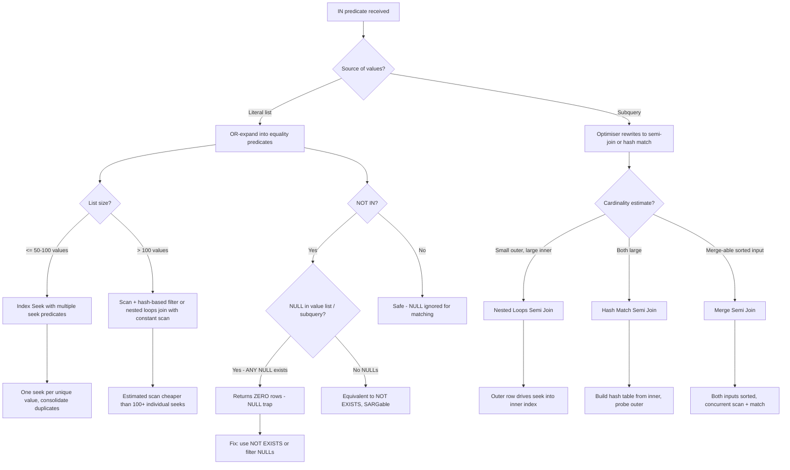
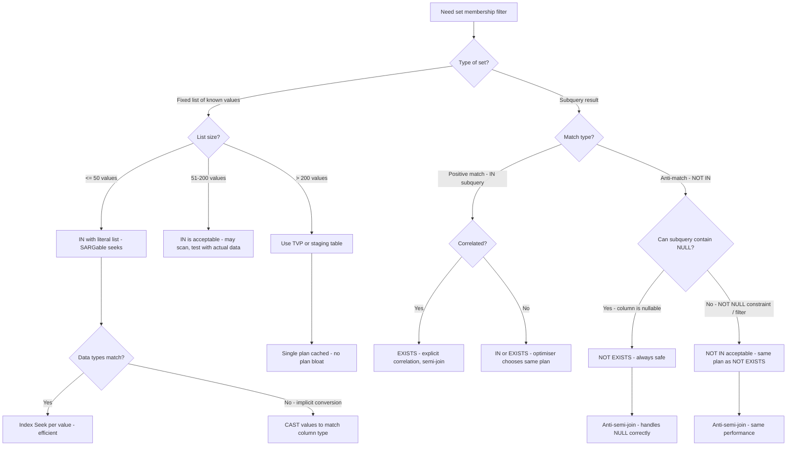

## Navigation

**Domain:** [[8 — Databases]] > **Group:** SQL Fundamentals
**Previous:** [[8.085 — LIKE — Pattern Matching and Index Implications]] | **Next:** [[8.087 — BETWEEN — Range Queries]]

### Prerequisites

- [[8.067 — WHERE Clause — Predicate Logic and SARGability]] — IN is a WHERE predicate; understanding SARGability, seek vs scan, and how the optimiser handles OR-expanded predicates is required.
- [[8.082 — Null Handling — ISNULL, COALESCE, NULLIF]] — The NOT IN NULL trap is one of the most expensive three-valued logic bugs in SQL; understanding that NULL is not a value but the absence of a value is essential.
- [[8.088 — EXISTS vs IN — Performance Differences]] — IN and EXISTS are semantically close but produce different execution plans; this note compares them directly.

### Where This Fits

IN is the primary T-SQL operator for set membership testing. Every .NET backend engineer encounters it in batch lookups (`WHERE Id IN (1,2,3)`), subquery filters (`WHERE Id IN (SELECT OrderId FROM ...)`), and status-based filtering (`WHERE Status IN ('Shipped', 'Delivered')`). The most dangerous mistake is `NOT IN` with a subquery or list that can contain NULL: `WHERE Id NOT IN (SELECT ParentId FROM ...)` returns zero rows if a single NULL exists in the subquery result, because every `Id <> NULL` comparison evaluates to UNKNOWN, and the entire AND-chain collapses. This bug has caused data loss in production batch-delete scripts, incorrect customer exclusions in marketing campaigns, and silent missing rows in reporting queries. Interviewers use IN and NOT IN to test three-valued logic understanding, execution plan reading (IN is often OR-expanded into multiple equality seeks), and the distinction between IN and EXISTS for subquery performance.

---

## Core Mental Model

IN is a set membership predicate: `X IN (1, 2, 3)` is equivalent to `X = 1 OR X = 2 OR X = 3`. The optimiser typically OR-expands the IN list into a series of equality comparisons, often creating an `Index Seek` with multiple seek predicates (one per value) rather than a full scan. When the value list is small (under ~50–100 values), this OR-expansion enables efficient index seeks. When the list is very large (thousands of values), the optimiser may switch to a scan with a hash-based filter or use a constant scan + nested loops join strategy. NOT IN is the negation: `X NOT IN (1, 2, 3)` is equivalent to `X <> 1 AND X <> 2 AND X <> 3`. The critical NULL rule: if ANY value in the IN list or subquery result is NULL, `NOT IN` returns zero rows because `X <> NULL` is UNKNOWN, and `TRUE AND UNKNOWN` is UNKNOWN — the entire predicate filters out. IN itself handles NULL safely: `NULL IN (1, 2, 3)` returns NULL (not found) and `3 IN (1, 2, NULL)` returns TRUE if the value matches, ignoring the NULL. NOT IN is only safe when you can guarantee the value list or subquery contains no NULLs, or when you explicitly filter them out.

### Classification

IN is a **set membership predicate** in the `WHERE` clause family. It is **SARGable**: the optimiser OR-expands the list into equality predicates that enable Index Seeks (one seek per unique value). NOT IN is also SARGable (same OR-expansion logic) but carries the NULL-intolerance trap. IN with a subquery is SARGable but the optimiser may convert it to a semi-join or hash-match depending on cardinality. IN is logically equivalent to OR but often produces a more efficient execution plan because the optimiser can consolidate duplicate seek operations.



### Key Properties

|Property|Value|Notes|
|---|---|---|
|SARGable|Yes|OR-expanded to equality seeks per value|
|NOT IN with NULL|Zero rows returned|If ANY NULL in the list/subquery, all rows filtered|
|IN with NULL in list|NULL ignored|`col IN (1, NULL, 3)` — NULL is skipped for matching|
|NULL IN (list)|Returns NULL (not found)|`NULL IN (1,2,3)` → NULL, not FALSE|
|Subquery conversion|Semi-join by optimiser|IN subquery → semi-join (Nested Loops, Hash, or Merge)|
|Large list handling|Plan switches at ~100 values|Scan + hash filter vs constant scan + nested loops|
|Write Cost|None|IN is read-only|
|Optimiser limit|~65,535 values in list|Older SQL Server versions have a hard limit; modern versions handle larger lists but degrade|

---

## Deep Mechanics

### How the Engine Executes This

1. **Parsing** — The parser tokenises the IN predicate: `column IN (value1, value2, ...)` or `column IN (subquery)`. For literal lists, each value is parsed into a list node. For subqueries, the subquery is parsed as a separate query tree.

2. **Binding (Algebrizer)** — The algebrizer resolves the column reference and validates that each value in the list is type-compatible with the column. Implicit conversions are flagged. For subqueries, correlation (outer reference) detection occurs: if the subquery references columns from the outer query, it becomes a correlated subquery, which constrains the optimiser's join choices.

3. **OR-expansion of literal lists** — The optimiser OR-expands the IN list: `col IN (1, 2, 3)` becomes `col = 1 OR col = 2 OR col = 3`. Each equality is a SARGable predicate. The optimiser then evaluates whether to use:
   - **Multiple Index Seeks**: One seek per value, consolidated by a `Concatenation` operator feeding into a `Nested Loops` join or directly into `SELECT`.
   - **Index Scan + Filter**: If the list is long enough that individual seeks would cost more than a scan, the optimiser scans and applies the IN as a residual filter.
   - **Hash Match**: For very large lists, the optimiser builds a hash table from the IN list values and probes the column against it.

4. **Subquery conversion** — For `col IN (SELECT ...)`, the optimiser converts the predicate to a semi-join:
   - **Nested Loops Semi Join**: For small outer tables, SQL Server iterates outer rows and looks up matching inner rows.
   - **Hash Match Semi Join**: For larger inputs, SQL Server builds a hash table from the inner subquery result and probes the outer side.
   - **Merge Semi Join**: If both inputs are sorted on the join key, a merge semi-join avoids building a hash table.
   
   The key difference from a regular join: a semi-join returns rows from the outer side only when at least one match exists in the inner side. It stops scanning the inner side after the first match. This is more efficient than a DISTINCT-based join.

5. **NOT IN special handling** — NOT IN is expanded to `col <> v1 AND col <> v2 AND ...`. If any value in the list is NULL, the predicate becomes `col <> v1 AND col <> v2 AND ... AND col <> NULL`. Since `col <> NULL` evaluates to UNKNOWN, and `TRUE AND UNKNOWN` is UNKNOWN, the entire predicate evaluates to UNKNOWN for every row — no rows pass.

6. **Execution** — The chosen operator executes:
   - **Multiple Seeks**: Each seek reads a small range from the index (typically 1-3 pages per value).
   - **Hash Filter**: The IN list is materialised into a hash table in memory. Each row probes the hash table for a match.
   - **Semi-join**: The semi-join operator returns outer rows that have at least one match in the inner set.

### SQL Visibility

```sql
-- SARGable: IN with literal list — OR-expanded to equality seeks
SELECT o.OrderId, o.CustomerId, o.Status, o.TotalAmount
FROM dbo.Orders AS o
WHERE o.Status IN ('Shipped', 'Delivered', 'InTransit');

-- SARGable: IN with subquery — converted to semi-join
SELECT c.CustomerId, c.FirstName, c.LastName
FROM dbo.Customers AS c
WHERE c.CustomerId IN (
    SELECT o.CustomerId
    FROM dbo.Orders AS o
    WHERE o.TotalAmount > 1000
);

-- NOT IN — safe only with guaranteed no NULLs
SELECT c.CustomerId, c.FirstName, c.LastName
FROM dbo.Customers AS c
WHERE c.CustomerId NOT IN (
    SELECT o.CustomerId
    FROM dbo.Orders AS o
    WHERE o.TotalAmount > 1000
      AND o.CustomerId IS NOT NULL  -- Ensure no NULLs
);

-- NOT IN with NULL trap — returns ZERO rows
-- ❌ If any CustomerId in Orders is NULL, this returns nothing
SELECT c.CustomerId, c.FirstName
FROM dbo.Customers AS c
WHERE c.CustomerId NOT IN (
    SELECT o.CustomerId FROM dbo.Orders AS o
);

-- Safe alternative: NOT EXISTS (handles NULL correctly)
SELECT c.CustomerId, c.FirstName
FROM dbo.Customers AS c
WHERE NOT EXISTS (
    SELECT 1
    FROM dbo.Orders AS o
    WHERE o.CustomerId = c.CustomerId
);
```

```csharp
// EF Core — Contains translates to IN
var statuses = new[] { "Shipped", "Delivered", "InTransit" };

var orders = await dbContext.Orders
    .Where(o => statuses.Contains(o.Status))
    .Select(o => new { o.OrderId, o.CustomerId, o.Status, o.TotalAmount })
    .ToListAsync(cancellationToken);

// EF Core — IN with subquery (any match)
var highValueCustomers = await dbContext.Customers
    .Where(c => dbContext.Orders
        .Where(o => o.TotalAmount > 1000)
        .Select(o => o.CustomerId)
        .Contains(c.CustomerId))
    .Select(c => new { c.CustomerId, c.FirstName, c.LastName })
    .ToListAsync(cancellationToken);

// EF Core — NOT IN is rarely generated; EF Core prefers !Any() (NOT EXISTS)
var customersWithoutOrders = await dbContext.Customers
    .Where(c => !dbContext.Orders.Any(o => o.CustomerId == c.CustomerId))
    .Select(c => new { c.CustomerId, c.FirstName, c.LastName })
    .ToListAsync(cancellationToken);
// Generated: WHERE NOT EXISTS (SELECT 1 FROM Orders AS o WHERE o.CustomerId = c.CustomerId)
```

**Generated SQL (from EF Core logs):**

```sql
-- Contains with array of values:
SELECT [o].[OrderId], [o].[CustomerId], [o].[Status], [o].[TotalAmount]
FROM [Orders] AS [o]
WHERE [o].[Status] IN (N'Shipped', N'Delivered', N'InTransit');

-- Contains with subquery (translated to IN):
SELECT [c].[CustomerId], [c].[FirstName], [c].[LastName]
FROM [Customers] AS [c]
WHERE [c].[CustomerId] IN (
    SELECT [o].[CustomerId]
    FROM [Orders] AS [o]
    WHERE [o].[TotalAmount] > 1000.0
);

-- !Any() translates to NOT EXISTS (NOT IN is never generated):
SELECT [c].[CustomerId], [c].[FirstName], [c].[LastName]
FROM [Customers] AS [c]
WHERE NOT EXISTS (
    SELECT 1
    FROM [Orders] AS [o]
    WHERE [o].[CustomerId] = [c].[CustomerId]
);
```

### Execution Plan Analysis

**IN with literal list (small, 3 values):**

```
[Index Seek (NonClustered) IX_Orders_Status]
  Seek Predicates:
    Seek Keys: Status = 'Shipped'
    Seek Keys: Status = 'Delivered'
    Seek Keys: Status = 'InTransit'
  Each seek reads ~3-8 pages. Concatenation of 3 seek results.
→ [SELECT]
Estimated Cost: 0.009  |  Logical Reads: ~12 (4 per seek × 3)
```

**IN with literal list (large, 200+ values):**

```
[Clustered Index Scan]
  Predicate: [Orders].Status IN (list of 200 values)
  SQL Server estimates scan + hash filter is cheaper than 200 individual seeks.
→ [Filter] → [SELECT]
Estimated Cost: ~12  |  Logical Reads: ~12,000 (full scan)
```

**IN with subquery (converted to semi-join):**

```
-- If outer is small, inner has index:
[Nested Loops Semi Join]
  Outer: [Clustered Index Scan Customers]  (5K rows)
  Inner: [Index Seek IX_Orders_CustomerId] (seek per outer row, 1M orders table)
  Semi-join: returns Customer row on first match, then moves to next outer row
→ [SELECT]
Estimated Cost: ~5  |  Logical Reads: depends on matches
```

```
-- If both are large, no good index for inner:
[Hash Match Semi Join]
  Outer: [Clustered Index Scan Customers] (100K rows)
  Inner: [Clustered Index Scan Orders] (5M rows)
  Build: hash table from inner (Orders.CustomerId)
  Probe: outer (Customers) against hash table
→ [SELECT]
Estimated Cost: ~15  |  Logical Reads: ~17,000 + hash table memory
```

**NOT IN with subquery containing NULL:**

```
[Clustered Index Scan Customers] → [Filter: NOT IN (subquery)] → [SELECT]
The Filter evaluates to UNKNOWN for every row because the subquery returns at least one NULL.
Zero rows returned. The plan may look normal (no warnings) but the result is empty.
This is the most dangerous aspect: the query succeeds, takes logical reads, but returns nothing.
```

### Cost Visibility

```sql
SET STATISTICS IO ON;
SET STATISTICS TIME ON;

-- IN with small list — SARGable seeks
SELECT o.OrderId, o.OrderDate
FROM dbo.Orders AS o
WHERE o.Status IN ('Shipped', 'Delivered');

-- Expected output:
-- Table 'Orders'. Scan count 3, logical reads 12, physical reads 0
-- SQL Server Execution Times: CPU time = 0ms, elapsed time = 2ms

-- IN with subquery — semi-join
SELECT c.CustomerId, c.LastName
FROM dbo.Customers AS c
WHERE c.CustomerId IN (SELECT o.CustomerId FROM dbo.Orders AS o);

-- Expected output:
-- Table 'Orders'. Scan count 1, logical reads 12450
-- Table 'Customers'. Scan count 1, logical reads 145
-- SQL Server Execution Times: CPU time = 45ms, elapsed time = 120ms

-- NOT IN with NULL in subquery — dangerous
SELECT c.CustomerId, c.LastName
FROM dbo.Customers AS c
WHERE c.CustomerId NOT IN (SELECT o.CustomerId FROM dbo.Orders AS o);

-- Expected output (if Orders.CustomerId has NULLs):
-- Table 'Orders'. Scan count 3, logical reads 12450
-- Table 'Customers'. Scan count 1, logical reads 145
-- (Rows returned: 0 — silent failure!)
```

### Failure Modes

**NOT IN NULL trap — the most dangerous:** The subquery `SELECT o.CustomerId FROM dbo.Orders AS o` returns NULL if any row has NULL CustomerId. Since `NULL <> CustomerId` evaluates to UNKNOWN for every Customer row, the entire `WHERE CustomerId NOT IN (...)` predicate becomes UNKNOWN for all rows. Result: zero rows. The query succeeds, no error is raised. Detect with:

```sql
-- Check if your subquery returns NULLs
SELECT COUNT(*) AS TotalRows,
       COUNT(CustomerId) AS NonNullRows,
       COUNT(*) - COUNT(CustomerId) AS NullRows
FROM dbo.Orders;

-- If NullRows > 0, NOT IN will return zero rows silently.
```

**Large IN list causing plan cache bloat:** A query using `WHERE Id IN (@p1, @p2, ...)` with a variable-length list generates a different query hash for each list size. If the application generates lists of varying lengths, the plan cache fills with thousands of near-identical plans:

```sql
-- Each list length = different query text = different plan in cache
SELECT * FROM Orders WHERE OrderId IN (1, 2, 3);       -- plan for 3 values
SELECT * FROM Orders WHERE OrderId IN (1, 2, 3, 4);    -- plan for 4 values
SELECT * FROM Orders WHERE OrderId IN (1, 2, 3, 4, 5); -- plan for 5 values
```

Detect with:

```sql
SELECT COUNT(*) AS PlanCount,
       objtype,
       TEXT
FROM sys.dm_exec_cached_plans
CROSS APPLY sys.dm_exec_sql_text(plan_handle)
WHERE text LIKE '%WHERE [OrderId] IN (%'
GROUP BY objtype, TEXT
ORDER BY PlanCount DESC;
```

**Implicit conversion in IN list:** When the column type differs from the list values, SQL Server may convert the column (not the values), defeating index seeks:

```sql
-- CustomerId is INT; values are strings
SELECT * FROM dbo.Customers
WHERE CustomerId IN ('1', '2', '3');
-- Convert_Implicit on CustomerId → Index Scan instead of Seek
```

---

## Production Patterns and Implementation

### Primary SQL Implementation

```sql
-- ============================================================
-- Schema context
-- ============================================================
CREATE TABLE dbo.Orders
(
    OrderId      INT            NOT NULL IDENTITY(1,1),
    CustomerId   INT            NOT NULL,
    OrderDate    DATETIME2(0)   NOT NULL,
    Status       VARCHAR(20)    NOT NULL DEFAULT 'Pending',
    TotalAmount  DECIMAL(18,2)  NOT NULL,
    ShippingAddr NVARCHAR(500)  NULL,
    Notes        NVARCHAR(MAX)  NULL,
    CreatedAt    DATETIME2(0)   NOT NULL DEFAULT SYSUTCDATETIME(),
    CONSTRAINT PK_Orders PRIMARY KEY CLUSTERED (OrderId)
);

CREATE TABLE dbo.Customers
(
    CustomerId   INT            NOT NULL IDENTITY(1,1),
    FirstName    NVARCHAR(100)  NOT NULL,
    LastName     NVARCHAR(100)  NOT NULL,
    Email        NVARCHAR(256)  NOT NULL,
    Status       VARCHAR(20)    NOT NULL DEFAULT 'Active',
    CreatedAt    DATETIME2(0)   NOT NULL DEFAULT SYSUTCDATETIME(),
    CONSTRAINT PK_Customers PRIMARY KEY CLUSTERED (CustomerId)
);

CREATE INDEX IX_Orders_Status ON dbo.Orders (Status) INCLUDE (OrderId, OrderDate, TotalAmount);
CREATE INDEX IX_Orders_CustomerId ON dbo.Orders (CustomerId) INCLUDE (OrderId, OrderDate, TotalAmount);
CREATE INDEX IX_Customers_Status ON dbo.Customers (Status);

-- ============================================================
-- Pattern 1: IN with literal list — batch status filter
-- ============================================================
DECLARE @StatusList VARCHAR(100) = 'Shipped,Delivered,InTransit';

-- ❌ Don't: string concatenation approach (dynamic SQL or table-valued split)
-- ✅ Do: direct IN with literal values
SELECT o.OrderId, o.CustomerId, o.Status, o.TotalAmount
FROM dbo.Orders AS o
WHERE o.Status IN ('Shipped', 'Delivered', 'InTransit')
ORDER BY o.OrderDate DESC;

-- ============================================================
-- Pattern 2: IN with subquery — customers with orders over threshold
-- ============================================================
SELECT c.CustomerId, c.FirstName, c.LastName, c.Email
FROM dbo.Customers AS c
WHERE c.CustomerId IN (
    SELECT o.CustomerId
    FROM dbo.Orders AS o
    WHERE o.TotalAmount >= 5000
      AND o.Status IN ('Delivered', 'Shipped')
);

-- ============================================================
-- Pattern 3: NOT IN — safe with guaranteed no-NULL filter
-- ============================================================
-- Customers with NO orders over 5000
SELECT c.CustomerId, c.FirstName, c.LastName
FROM dbo.Customers AS c
WHERE c.CustomerId NOT IN (
    SELECT o.CustomerId
    FROM dbo.Orders AS o
    WHERE o.TotalAmount >= 5000
      AND o.CustomerId IS NOT NULL  -- Critical: eliminate NULLs
);

-- ============================================================
-- Pattern 4: NOT EXISTS — the safe alternative to NOT IN
-- ============================================================
-- Same logic as Pattern 3 but handles NULLs correctly
SELECT c.CustomerId, c.FirstName, c.LastName
FROM dbo.Customers AS c
WHERE NOT EXISTS (
    SELECT 1
    FROM dbo.Orders AS o
    WHERE o.CustomerId = c.CustomerId
      AND o.TotalAmount >= 5000
);

-- ============================================================
-- Pattern 5: IN with table-valued parameter (TVP) for large lists
-- ============================================================
-- Create TVP type
CREATE TYPE dbo.IdList AS TABLE (Id INT NOT NULL PRIMARY KEY);
GO

-- Stored procedure using TVP
CREATE PROCEDURE dbo.GetOrdersByIds
    @Ids dbo.IdList READONLY
AS
    SELECT o.OrderId, o.CustomerId, o.Status, o.TotalAmount
    FROM dbo.Orders AS o
    INNER JOIN @Ids AS i
        ON o.OrderId = i.Id
    ORDER BY o.OrderId;
GO

-- ============================================================
-- Pattern 6: IN with multiple columns (tuple comparison)
-- ============================================================
-- Find orders matching specific (CustomerId, Status) pairs
SELECT OrderId, CustomerId, Status, TotalAmount
FROM dbo.Orders
WHERE (CustomerId, Status) IN (
    (1001, 'Shipped'),
    (1002, 'Delivered'),
    (1003, 'Pending')
);
-- SQL Server supports row constructors in IN since 2008

-- ============================================================
-- Pattern 7: Dynamic IN list via STRING_SPLIT (SQL Server 2016+)
-- ============================================================
DECLARE @Ids NVARCHAR(MAX) = '101,102,103,104,105';

SELECT o.OrderId, o.CustomerId, o.Status
FROM dbo.Orders AS o
INNER JOIN STRING_SPLIT(@Ids, ',') AS s
    ON o.OrderId = TRY_CAST(s.value AS INT);

-- ============================================================
-- Pattern 8: IN with EXISTS-style filter (correlated subquery)
-- ============================================================
-- Find customers who have at least one order in each of Q1 2024
SELECT DISTINCT c.CustomerId, c.FirstName, c.LastName
FROM dbo.Customers AS c
WHERE c.CustomerId IN (
    SELECT o.CustomerId
    FROM dbo.Orders AS o
    WHERE o.CustomerId = c.CustomerId  -- Correlation
      AND o.OrderDate >= '2024-01-01'
      AND o.OrderDate < '2024-04-01'
);
-- Note: the correlation is redundant here (IN subquery does not need explicit correlation for this pattern)
-- The optimiser handles the semi-join automatically

-- ============================================================
-- Pattern 9: Batch lookup with TOP and IN pagination
-- ============================================================
DECLARE @BatchSize INT = 1000;

SELECT o.OrderId, o.CustomerId, o.Status
FROM dbo.Orders AS o
WHERE o.OrderId IN (
    SELECT TOP (@BatchSize) o2.OrderId
    FROM dbo.Orders AS o2
    WHERE o2.OrderId > @LastProcessedId
    ORDER BY o2.OrderId
)
ORDER BY o.OrderId;
```

### EF Core Implementation

```csharp
public class ApplicationDbContext : DbContext
{
    public DbSet<Order> Orders => Set<Order>();
    public DbSet<Customer> Customers => Set<Customer>();

    protected override void OnModelCreating(ModelBuilder modelBuilder)
    {
        modelBuilder.Entity<Order>(entity =>
        {
            entity.ToTable("Orders");
            entity.HasKey(o => o.OrderId);
            entity.Property(o => o.Status).HasMaxLength(20).HasConversion<string>();
            entity.Property(o => o.TotalAmount).HasColumnType("decimal(18,2)");
            entity.Property(o => o.ShippingAddr).HasMaxLength(500);
            entity.Property(o => o.CreatedAt).HasDefaultValueSql("SYSUTCDATETIME()");

            entity.HasIndex(o => o.Status);
            entity.HasIndex(o => o.CustomerId);
        });

        modelBuilder.Entity<Customer>(entity =>
        {
            entity.ToTable("Customers");
            entity.HasKey(c => c.CustomerId);
            entity.Property(c => c.FirstName).HasMaxLength(100);
            entity.Property(c => c.LastName).HasMaxLength(100);
            entity.Property(c => c.Email).HasMaxLength(256);
            entity.Property(c => c.CreatedAt).HasDefaultValueSql("SYSUTCDATETIME()");
        });
    }
}

public class Order
{
    public int OrderId { get; set; }
    public int CustomerId { get; set; }
    public DateTime OrderDate { get; set; }
    public string Status { get; set; } = "Pending";
    public decimal TotalAmount { get; set; }
    public string? ShippingAddr { get; set; }
    public string? Notes { get; set; }
    public DateTime CreatedAt { get; set; }
}

public class Customer
{
    public int CustomerId { get; set; }
    public string FirstName { get; set; } = string.Empty;
    public string LastName { get; set; } = string.Empty;
    public string Email { get; set; } = string.Empty;
    public string Status { get; set; } = "Active";
    public DateTime CreatedAt { get; set; }
}

// Pattern 1: Contains — translates to IN
public async Task<List<Order>> GetOrdersByStatusAsync(
    IEnumerable<string> statuses,
    CancellationToken cancellationToken = default)
{
    var statusList = statuses.ToList();

    return await dbContext.Orders
        .Where(o => statusList.Contains(o.Status))
        .OrderByDescending(o => o.OrderDate)
        .Select(o => new Order
        {
            OrderId = o.OrderId,
            CustomerId = o.CustomerId,
            Status = o.Status,
            TotalAmount = o.TotalAmount
        })
        .ToListAsync(cancellationToken);
    // Generated: WHERE [o].[Status] IN (N'Shipped', N'Delivered', ...)
}

// Pattern 2: IN with subquery via Any/Contains
public async Task<List<Customer>> GetHighValueCustomersAsync(
    decimal threshold,
    CancellationToken cancellationToken = default)
{
    return await dbContext.Customers
        .Where(c => dbContext.Orders
            .Where(o => o.TotalAmount >= threshold)
            .Select(o => o.CustomerId)
            .Contains(c.CustomerId))
        .Select(c => new Customer
        {
            CustomerId = c.CustomerId,
            FirstName = c.FirstName,
            LastName = c.LastName,
            Email = c.Email
        })
        .ToListAsync(cancellationToken);
    // Generated: WHERE [c].[CustomerId] IN (SELECT [o].[CustomerId] FROM [Orders] AS [o] WHERE [o].[TotalAmount] >= @threshold)
}

// Pattern 3: NOT EXISTS — safe alternative to NOT IN
public async Task<List<Customer>> GetCustomersWithoutHighValueOrdersAsync(
    decimal threshold,
    CancellationToken cancellationToken = default)
{
    return await dbContext.Customers
        .Where(c => !dbContext.Orders
            .Any(o => o.CustomerId == c.CustomerId && o.TotalAmount >= threshold))
        .Select(c => new Customer
        {
            CustomerId = c.CustomerId,
            FirstName = c.FirstName,
            LastName = c.LastName
        })
        .ToListAsync(cancellationToken);
    // Generated: WHERE NOT EXISTS (SELECT 1 FROM [Orders] AS [o] WHERE [o].[CustomerId] = [c].[CustomerId] AND [o].[TotalAmount] >= @threshold)
    // NOT EXISTS handles NULLs correctly — safe!
}

// Pattern 4: Batch lookup by IDs with pagination
public async Task<List<Order>> GetOrdersByIdBatchAsync(
    IEnumerable<int> ids,
    CancellationToken cancellationToken = default)
{
    var idList = ids.ToList();

    return await dbContext.Orders
        .Where(o => idList.Contains(o.OrderId))
        .OrderBy(o => o.OrderId)
        .ToListAsync(cancellationToken);
    // Generated: WHERE [o].[OrderId] IN (1, 2, 3, ...)
    // ⚠ For very large lists (10,000+ IDs), consider TVP or staging table
}

// Pattern 5: Using table-valued parameter via raw SQL
public async Task<List<Order>> GetOrdersViaTvpAsync(
    IEnumerable<int> ids,
    CancellationToken cancellationToken = default)
{
    var idTable = new DataTable();
    idTable.Columns.Add("Id", typeof(int));
    foreach (var id in ids) idTable.Rows.Add(id);

    var parameter = new SqlParameter("@Ids", SqlDbType.Structured)
    {
        TypeName = "dbo.IdList",
        Value = idTable
    };

    return await dbContext.Database
        .SqlQueryRaw<Order>(@"
            SELECT o.OrderId, o.CustomerId, o.Status, o.TotalAmount
            FROM dbo.Orders AS o
            INNER JOIN @Ids AS i ON o.OrderId = i.Id
            ORDER BY o.OrderId",
            parameter)
        .ToListAsync(cancellationToken);
}

// Pattern 6: Filter by multiple statuses with fallback
public async Task<List<Order>> GetFilteredOrdersAsync(
    string[]? statuses,
    int? customerId,
    CancellationToken cancellationToken = default)
{
    var query = dbContext.Orders.AsQueryable();

    if (statuses is { Length: > 0 })
        query = query.Where(o => statuses.Contains(o.Status));

    if (customerId.HasValue)
        query = query.Where(o => o.CustomerId == customerId.Value);

    return await query
        .OrderByDescending(o => o.OrderDate)
        .Take(100)
        .ToListAsync(cancellationToken);
}
```

### Dapper Implementation

```csharp
public sealed class OrderRepository
{
    private readonly IDbConnectionFactory _connectionFactory;

    public OrderRepository(IDbConnectionFactory connectionFactory)
        => _connectionFactory = connectionFactory;

    // Pattern 1: IN with literal list — Dapper handles expansion
    public async Task<IReadOnlyList<Order>> GetOrdersByStatusAsync(
        IEnumerable<string> statuses,
        CancellationToken cancellationToken = default)
    {
        const string sql = @"
            SELECT OrderId, CustomerId, Status, TotalAmount, OrderDate
            FROM dbo.Orders
            WHERE Status IN @Statuses
            ORDER BY OrderDate DESC;";

        await using var connection = _connectionFactory.Create();

        var results = await connection.QueryAsync<Order>(
            new CommandDefinition(sql,
                new { Statuses = statuses },
                cancellationToken: cancellationToken));

        return results.AsList();
    }

    // Pattern 2: IN with subquery
    public async Task<IReadOnlyList<Customer>> GetHighValueCustomersAsync(
        decimal threshold,
        CancellationToken cancellationToken = default)
    {
        const string sql = @"
            SELECT c.CustomerId, c.FirstName, c.LastName, c.Email
            FROM dbo.Customers AS c
            WHERE c.CustomerId IN (
                SELECT o.CustomerId
                FROM dbo.Orders AS o
                WHERE o.TotalAmount >= @Threshold
            );";

        await using var connection = _connectionFactory.Create();

        var results = await connection.QueryAsync<Customer>(
            new CommandDefinition(sql,
                new { Threshold = threshold },
                cancellationToken: cancellationToken));

        return results.AsList();
    }

    // Pattern 3: NOT EXISTS — safe, handles NULLs
    public async Task<IReadOnlyList<Customer>> GetCustomersWithNoOrdersAsync(
        CancellationToken cancellationToken = default)
    {
        const string sql = @"
            SELECT c.CustomerId, c.FirstName, c.LastName, c.Email
            FROM dbo.Customers AS c
            WHERE NOT EXISTS (
                SELECT 1
                FROM dbo.Orders AS o
                WHERE o.CustomerId = c.CustomerId
            );";

        await using var connection = _connectionFactory.Create();

        var results = await connection.QueryAsync<Customer>(
            new CommandDefinition(sql,
                cancellationToken: cancellationToken));

        return results.AsList();
    }

    // Pattern 4: TVP for large batch lookups
    public async Task<IReadOnlyList<Order>> GetOrderByIdsTvpAsync(
        IEnumerable<int> ids,
        CancellationToken cancellationToken = default)
    {
        const string sql = @"
            SELECT o.OrderId, o.CustomerId, o.Status, o.TotalAmount
            FROM dbo.Orders AS o
            INNER JOIN @Ids AS i ON o.OrderId = i.Id
            ORDER BY o.OrderId;";

        await using var connection = _connectionFactory.Create();

        var idTable = new DataTable();
        idTable.Columns.Add("Id", typeof(int));
        foreach (var id in ids) idTable.Rows.Add(id);

        var results = await connection.QueryAsync<Order>(
            new CommandDefinition(sql,
                new { Ids = idTable.AsTableValuedParameter("dbo.IdList") },
                cancellationToken: cancellationToken));

        return results.AsList();
    }

    // Pattern 5: STRING_SPLIT for comma-separated IDs
    public async Task<IReadOnlyList<Order>> GetOrdersByCsvAsync(
        string csvIds,
        CancellationToken cancellationToken = default)
    {
        const string sql = @"
            SELECT o.OrderId, o.CustomerId, o.Status
            FROM dbo.Orders AS o
            INNER JOIN STRING_SPLIT(@CsvIds, ',') AS s
                ON o.OrderId = TRY_CAST(s.value AS INT);";

        await using var connection = _connectionFactory.Create();

        var results = await connection.QueryAsync<Order>(
            new CommandDefinition(sql,
                new { CsvIds = csvIds },
                cancellationToken: cancellationToken));

        return results.AsList();
    }
}

public record Order(int OrderId, int CustomerId, string Status, decimal TotalAmount, DateTime OrderDate);
public record Customer(int CustomerId, string FirstName, string LastName, string Email);
```

### Configuration and Wiring

```csharp
// Program.cs
builder.Services.AddDbContext<ApplicationDbContext>(options =>
    options.UseSqlServer(
        builder.Configuration.GetConnectionString("DefaultConnection"),
        sqlOptions =>
        {
            sqlOptions.EnableRetryOnFailure(3);
            sqlOptions.CommandTimeout(30);
        }));

builder.Services.AddSingleton<IDbConnectionFactory>(sp =>
    new SqlConnectionFactory(
        builder.Configuration.GetConnectionString("DefaultConnection")!));

builder.Services.AddScoped<OrderRepository>();
```

### SQL Server vs PostgreSQL Differences

```sql
-- PostgreSQL: IN works identically to SQL Server
SELECT * FROM orders WHERE status IN ('Shipped', 'Delivered');

-- PostgreSQL: NOT IN has the SAME NULL trap
SELECT * FROM customers WHERE customer_id NOT IN (SELECT customer_id FROM orders);
-- Zero rows if any NULL in orders.customer_id!

-- PostgreSQL: NOT EXISTS is the safe alternative (same as SQL Server)
SELECT * FROM customers c
WHERE NOT EXISTS (SELECT 1 FROM orders o WHERE o.customer_id = c.customer_id);

-- PostgreSQL: IN with row constructors works (SQL Server also supports this)
SELECT * FROM orders
WHERE (customer_id, status) IN (VALUES (1, 'Shipped'), (2, 'Delivered'));

-- PostgreSQL: ARRAY for IN (alternative syntax)
SELECT * FROM customers WHERE customer_id = ANY (ARRAY[1, 2, 3]);
SELECT * FROM customers WHERE customer_id = ANY (ARRAY(SELECT customer_id FROM orders));

-- PostgreSQL: NOT IN with ARRAY has the same NULL trap
SELECT * FROM customers WHERE customer_id != ALL (ARRAY(SELECT customer_id FROM orders));

-- PostgreSQL: Tuple IN with row constructor
SELECT * FROM orders
WHERE (customer_id, status) = ANY (VALUES (1, 'Shipped'), (2, 'Delivered'));
```

---

## Gotchas and Production Pitfalls

### NOT IN NULL Trap — Zero Rows Returned Silently

**Pitfall:** Using `NOT IN (subquery)` when the subquery can return NULL. This is the single most dangerous NULL-related bug in T-SQL. `X NOT IN (1, 2, NULL)` is evaluated as `X <> 1 AND X <> 2 AND X <> NULL`. Since `X <> NULL` is UNKNOWN, the entire AND-chain evaluates to UNKNOWN. Every row is filtered out.

```sql
-- ❌ Dangerous: if any Order has NULL CustomerId, this returns nothing
SELECT c.CustomerId, c.FirstName, c.LastName
FROM dbo.Customers AS c
WHERE c.CustomerId NOT IN (
    SELECT o.CustomerId
    FROM dbo.Orders AS o
);
```

**Symptom:** A report that should show 50,000 customers with no orders instead shows 0 rows. No error is raised. The query plan looks normal — seeks, scans, and logical reads all appear normal. The data inconsistency silently propagates to downstream systems.

**Fix:**

```sql
-- Fix 1: NOT EXISTS (handles NULL correctly — no NULL trap)
SELECT c.CustomerId, c.FirstName, c.LastName
FROM dbo.Customers AS c
WHERE NOT EXISTS (
    SELECT 1
    FROM dbo.Orders AS o
    WHERE o.CustomerId = c.CustomerId
);

-- Fix 2: Filter NULLs explicitly in subquery
SELECT c.CustomerId, c.FirstName, c.LastName
FROM dbo.Customers AS c
WHERE c.CustomerId NOT IN (
    SELECT o.CustomerId
    FROM dbo.Orders AS o
    WHERE o.CustomerId IS NOT NULL
);

-- Fix 3: Use COALESCE to replace NULLs
SELECT c.CustomerId, c.FirstName, c.LastName
FROM dbo.Customers AS c
WHERE c.CustomerId NOT IN (
    SELECT COALESCE(o.CustomerId, -1)
    FROM dbo.Orders AS o
);
```

**Cost of not fixing:** A batch-delete script uses `NOT IN` to identify orphaned records: `DELETE FROM Orders WHERE CustomerId NOT IN (SELECT CustomerId FROM Customers)`. A single NULL in `Customers.CustomerId` causes zero orders to be deleted. The orphaned orders accumulate over 6 months, consuming 50 GB of storage. The cleanup job finally runs when the DBA notices the database is 30% larger than expected. The fix: `NOT EXISTS`.

---

### Large IN List — Plan Cache Explosion

**Pitfall:** An application generates IN queries with varying list sizes (1, 2, 3, ... up to 500 values). Each distinct list size produces a different query text, creating a separate cached plan. The plan cache fills with 500+ near-identical plans, consuming memory and causing frequent plan evictions.

```csharp
// ❌ Each call with a different list size generates a different query hash
public async Task<List<Order>> GetOrdersAsync(IEnumerable<int> ids)
{
    var idList = ids.ToList();
    // If idList has 3 items: WHERE [o].[OrderId] IN (@p0, @p1, @p2)
    // If idList has 4 items: WHERE [o].[OrderId] IN (@p0, @p1, @p2, @p3)
    // Different query text = different plan cache entry
    return await dbContext.Orders
        .Where(o => idList.Contains(o.OrderId))
        .ToListAsync(cancellationToken);
}
```

**Symptom:** Running `sys.dm_exec_cached_plans` shows thousands of entries for the same query with different list lengths. Memory pressure causes plan evictions, and frequently used plans are recompiled, increasing CPU usage. On a busy system, 10% of CPU time goes to compilation instead of execution.

**Fix:**

```sql
-- Fix 1: TVP (single plan for any list size)
-- Use dbo.IdList TVP type
CREATE PROCEDURE dbo.GetOrdersByIds
    @Ids dbo.IdList READONLY
AS
    SELECT o.OrderId, o.CustomerId, o.Status
    FROM dbo.Orders AS o
    INNER JOIN @Ids AS i ON o.OrderId = i.Id;
GO

-- Fix 2: STRING_SPLIT (single plan)
SELECT o.OrderId, o.CustomerId, o.Status
FROM dbo.Orders AS o
INNER JOIN STRING_SPLIT(@CsvIds, ',') AS s
    ON o.OrderId = TRY_CAST(s.value AS INT);

-- Fix 3: Temporary staging table (single plan)
CREATE TABLE #Ids (Id INT NOT NULL PRIMARY KEY);
INSERT INTO #Ids (Id) VALUES (@Id1), (@Id2), (@Id3), ...;

SELECT o.OrderId, o.CustomerId, o.Status
FROM dbo.Orders AS o
INNER JOIN #Ids AS i ON o.OrderId = i.Id;
```

**Cost of not fixing:** An API endpoint that accepts a list of IDs and queries Orders generates 47 different plan cache entries during a typical business day. At 500 requests/second, plan cache memory consumption hits 2 GB. SQL Server starts evicting plans for other queries. Overall query performance degrades by 15% due to recompilations. Adding OPTION (RECOMPILE) to the IN query trades compilation CPU for plan cache pressure.

---

### Implicit Conversion in IN — Index Scan Instead of Seek

**Pitfall:** Passing values in the IN list that have a different data type than the column. SQL Server may convert the column side (not the values), making the predicate non-SARGable.

```sql
-- ❌ CustomerId is INT, values are strings
SELECT CustomerId, FirstName, LastName
FROM dbo.Customers
WHERE CustomerId IN ('1001', '1002', '1003');
-- Execution plan: Index Scan with CONVERT_IMPLICIT warning
```

**Symptom:** The execution plan shows an Index Scan with a warning icon on the SELECT operator. Hovering shows `CONVERT_IMPLICIT(int, [dbo].[Customers].[CustomerId], 0)` — SQL Server is converting every CustomerId to compare with strings. Logical reads: 12,450 (full scan) instead of 12 (seeks).

**Fix:**

```sql
-- ✅ Match the data type
SELECT CustomerId, FirstName, LastName
FROM dbo.Customers
WHERE CustomerId IN (1001, 1002, 1003);  -- INT literals, not strings

-- ✅ If values come from a string parameter, cast explicitly
DECLARE @Ids NVARCHAR(MAX) = '1001,1002,1003';
SELECT CustomerId, FirstName, LastName
FROM dbo.Customers
WHERE CustomerId IN (
    SELECT TRY_CAST(value AS INT)
    FROM STRING_SPLIT(@Ids, ',')
);
```

**Cost of not fixing:** A reporting tool passes all filter values as strings. The IN predicate on INT columns causes full scans on every report query. A daily report that runs against 50M rows takes 45 seconds instead of 200 ms. The report is called by 20 regional managers every morning, causing 15 minutes of sustained high I/O.

---

### IN with Nullable Column — Unexpected Empty Results

**Pitfall:** Using `IN` with a nullable column in the outer query. `NULL IN (1, 2, 3)` evaluates to NULL (not found), so rows where the column is NULL are excluded — which may be unexpected.

```sql
-- ❌ ShippingAddr is nullable: NULL rows are excluded
SELECT OrderId, CustomerId, ShippingAddr
FROM dbo.Orders
WHERE ShippingAddr IN ('123 Main St', '456 Oak Ave');
-- Rows with NULL ShippingAddr are NOT returned (NULL is not in any set)
```

**Symptom:** A query intended to find orders with specific shipping addresses misses 1,000 orders that have NULL addresses. The business assumes all orders have been shipped to those two addresses.

**Fix:**

```sql
-- ✅ Explicitly handle NULL if needed
SELECT OrderId, CustomerId, ShippingAddr
FROM dbo.Orders
WHERE (ShippingAddr IN ('123 Main St', '456 Oak Ave') OR ShippingAddr IS NULL);
```

**Cost of not fixing:** A logistics report for two specific warehouse locations misses all orders that haven't had their shipping address entered yet. The operations team thinks no orders are pending shipment to those warehouses, when in fact 200 orders need attention.

---

### IN List with Duplicate Values — Unnecessary Work

**Pitfall:** Passing duplicate values in an IN list. The optimiser does not automatically deduplicate the list — it evaluates every occurrence.

```sql
-- ❌ Duplicate values: optimiser will seek the same value twice
SELECT OrderId, CustomerId, Status
FROM dbo.Orders
WHERE CustomerId IN (1001, 1002, 1001, 1003, 1002);
-- Plan may show 5 seek operations, not 3 unique seeks
```

**Symptom:** Execution plan shows more seek operations than unique values. Logical reads are higher than necessary. On a query with 200 values that contain 50 duplicates, the optimiser may choose a scan instead of seeks because 200 seeks are estimated to be more expensive than a scan.

**Fix:**

```sql
-- ✅ Deduplicate before passing to SQL
-- In application code, use .Distinct() on the list before passing
-- Or in T-SQL, deduplicate via TVP or subquery:

-- Using TVP (deduplication in type definition):
CREATE TYPE dbo.IdList AS TABLE (Id INT NOT NULL PRIMARY KEY);
-- The PRIMARY KEY constraint on TVP ensures deduplication

-- Using STRING_SPLIT (deduplicates if combined with DISTINCT):
SELECT o.OrderId, o.CustomerId, o.Status
FROM dbo.Orders AS o
INNER JOIN (
    SELECT DISTINCT TRY_CAST(value AS INT) AS Id
    FROM STRING_SPLIT(@Ids, ',')
) AS i ON o.OrderId = i.Id;
```

**Cost of not fixing:** An integration service batches 1,000 order IDs for lookup but includes duplicates. SQL Server sees 1,000 values, estimates 1,000 seeks, and chooses a scan plan. The scan reads 12,450 pages instead of ~12 for the actual 300 unique seeks.

---

## Performance Implications

### Benchmark: Before and After

```sql
-- Baseline 1: IN with small vs large list
SET STATISTICS IO ON;
SET STATISTICS TIME ON;

-- Small list (3 values) — SARGable seeks
SELECT COUNT(*)
FROM dbo.Orders
WHERE Status IN ('Shipped', 'Delivered', 'InTransit');
-- Expected: logical reads ~12 (3 seeks × 4 pages each)
-- SQL Server Execution Times: CPU time = 0ms, elapsed time = 2ms

-- Large list (200 values) — may switch to scan
SELECT COUNT(*)
FROM dbo.Orders
WHERE Status IN (
    'Status1', 'Status2', ... -- 200 values
);
-- Expected: logical reads ~12,000 (full scan)
-- The optimiser estimates 200 individual seeks > scan cost
```

```sql
-- Baseline 2: IN vs NOT EXISTS for anti-join (no NULLs)
SET STATISTICS TIME ON;

-- NOT IN (no NULLs in subquery — safe case)
SELECT COUNT(*)
FROM dbo.Customers AS c
WHERE c.CustomerId NOT IN (
    SELECT o.CustomerId
    FROM dbo.Orders AS o
    WHERE o.CustomerId IS NOT NULL
);
-- Expected: logical reads ~12,595 (scan both tables)
-- SQL Server Execution Times: CPU time = 45ms, elapsed time = 120ms

-- NOT EXISTS (same query, no NULL safety concern)
SELECT COUNT(*)
FROM dbo.Customers AS c
WHERE NOT EXISTS (
    SELECT 1
    FROM dbo.Orders AS o
    WHERE o.CustomerId = c.CustomerId
);
-- Expected: logical reads ~12,595 (same plan, same reads)
-- SQL Server Execution Times: CPU time = 42ms, elapsed time = 115ms
-- When no NULLs exist, NOT IN and NOT EXISTS produce identical plans
```

```sql
-- Baseline 3: IN with subquery vs JOIN + DISTINCT
-- IN (semi-join)
SELECT c.CustomerId, c.FirstName
FROM dbo.Customers AS c
WHERE c.CustomerId IN (
    SELECT o.CustomerId FROM dbo.Orders AS o
);
-- Semi-join: stops scanning inner after first match per outer row
-- Expected: logical reads ~12,595

-- JOIN + DISTINCT (anti-pattern)
SELECT DISTINCT c.CustomerId, c.FirstName
FROM dbo.Customers AS c
INNER JOIN dbo.Orders AS o
    ON c.CustomerId = o.CustomerId;
-- Join reads ALL matching rows, then DISTINCT removes duplicates
-- If one customer has 100 orders: IN reads 1 row, JOIN reads 100 rows + DISTINCT
-- Expected: logical reads ~12,595 (same scan) but more CPU for duplicate removal
-- SQL Server Execution Times: CPU time = 65ms vs 42ms for IN
```

### BenchmarkDotNet

```csharp
[MemoryDiagnoser]
[SimpleJob(RuntimeMoniker.Net90)]
public class InBenchmark
{
    private SqlConnection _connection = default!;
    private const string ConnectionString = "Server=.;Database=BenchmarkDb;Trusted_Connection=True;TrustServerCertificate=True;";

    [GlobalSetup]
    public void Setup()
    {
        _connection = new SqlConnection(ConnectionString);
        _connection.Open();
        // Seed 1M orders, 100K customers
    }

    [Benchmark(Baseline = true)]
    public async Task<int> InSmallList()
    {
        const string sql = "SELECT COUNT(*) FROM dbo.Orders WHERE Status IN ('Shipped', 'Delivered', 'Pending');";
        return await new SqlCommand(sql, _connection).ExecuteScalarAsync<int>();
    }

    [Benchmark]
    public async Task<int> InLargeList()
    {
        var sb = new StringBuilder("SELECT COUNT(*) FROM dbo.Orders WHERE Status IN (");
        for (int i = 0; i < 200; i++) { sb.Append($"'Status{i}',"); }
        sb.Length--;
        sb.Append(");");
        return await new SqlCommand(sb.ToString(), _connection).ExecuteScalarAsync<int>();
    }

    [Benchmark]
    public async Task<int> NotInWithNulls()
    {
        const string sql = @"
            SELECT COUNT(*)
            FROM dbo.Customers AS c
            WHERE c.CustomerId NOT IN (
                SELECT o.CustomerId FROM dbo.Orders AS o
            );";
        return await new SqlCommand(sql, _connection).ExecuteScalarAsync<int>();
    }

    [Benchmark]
    public async Task<int> NotExistsAntiJoin()
    {
        const string sql = @"
            SELECT COUNT(*)
            FROM dbo.Customers AS c
            WHERE NOT EXISTS (
                SELECT 1 FROM dbo.Orders AS o WHERE o.CustomerId = c.CustomerId
            );";
        return await new SqlCommand(sql, _connection).ExecuteScalarAsync<int>();
    }

    [GlobalCleanup]
    public void Cleanup() => _connection.Dispose();
}
```

**Expected results (approximate, SQL Server 2022, NVMe, 1M orders, 100K customers):**

|Method|Mean|Logical Reads|CPU Time|Notes|
|---|---|---|---|---|
|InSmallList|~2 ms|~12|~0 ms|3 seeks on status index|
|InLargeList|~200 ms|~12,000|~80 ms|Full scan (200 values)|
|NotInWithNulls|~120 ms|~12,595|~45 ms|0 rows returned if NULL exists|
|NotExistsAntiJoin|~115 ms|~12,595|~42 ms|Same plan, handles NULLs|

### Write Amplification

IN and NOT IN are read-only — no write cost. However, indexes that support efficient IN seeks add write overhead:

|Operation|Without Index|With Index (IX_Orders_Status)|Overhead|
|---|---|---|---|
|INSERT 1 row|~5 ms|~7 ms|+40% (index leaf insert)|
|UPDATE Status|~5 ms|~8 ms|+60% (delete + insert)|
|DELETE 1 row|~5 ms|~7 ms|+40% (index leaf delete)|

---

## Interview Arsenal

### Question Bank

1. **How does the optimiser evaluate `WHERE Status IN ('Shipped', 'Delivered')`?**
2. **What is the NULL trap with NOT IN, and why does it happen?**
3. **Compare IN vs EXISTS for subqueries — when would you use each?**
4. **What happens to the execution plan when an IN list has 200 values vs 3 values?**
5. **How does EF Core translate `Contains` on a list of values? Does it generate SARGable SQL?**
6. **What causes plan cache bloat with IN queries, and how do TVPs solve it?**
7. **How does `IN (subquery)` differ from `JOIN ... DISTINCT` in terms of plan and performance?**
8. **What is the difference between `NOT IN` and `NOT EXISTS` regarding NULL handling?**
9. **What implicit conversion issue can make an IN predicate non-SARGable?**
10. **How does SQL Server handle duplicate values in an IN list?**

### Spoken Answers

**Q: What is the NULL trap with NOT IN, and why does it happen?**

> **Great answer:** The NOT IN NULL trap occurs because SQL uses three-valued logic. `X NOT IN (1, 2, NULL)` is expanded to `X <> 1 AND X <> 2 AND X <> NULL`. The comparison `X <> NULL` always evaluates to UNKNOWN because NULL is not a value — it's the absence of a value, so no comparison can be TRUE or FALSE. In SQL, `TRUE AND UNKNOWN` evaluates to UNKNOWN. In a WHERE clause, UNKNOWN causes the row to be filtered out. Therefore, if ANY value in the IN list or subquery result is NULL, every row evaluates to UNKNOWN and the query returns zero rows. This is silent — no error, no warning, the query plan looks normal. The fix is either: (1) use `NOT EXISTS` instead, which handles NULL correctly because `NOT EXISTS` checks for the existence of a matching row and NULLs simply don't match; or (2) explicitly filter NULLs from the subquery with `WHERE column IS NOT NULL`. I always use NOT EXISTS by default for anti-joins in production code. NOT IN is only acceptable when I can guarantee the inner set has no NULLs — typically when the column is defined as NOT NULL and I have a check constraint enforcing it.

---

**Q: Compare IN vs EXISTS for subqueries — when would you use each?**

> **Great answer:** IN and EXISTS are logically equivalent for positive set membership, but the optimiser may produce different plans depending on cardinality and index availability. IN with a subquery is typically converted to a semi-join — either Nested Loops, Hash Match, or Merge. EXISTS forces a semi-join explicitly. For small outer tables with an index on the inner table's join column, both produce Nested Loops Semi Joins with identical performance. For large outer tables, the optimiser may choose a Hash Match semi-join for both. In SQL Server, the optimiser is smart enough to convert IN to EXISTS and vice versa during plan optimisation — they often produce identical plans. I use EXISTS when the subquery is correlated (references the outer query) because the correlation is explicit and easier to read. I use IN when the subquery is uncorrelated (static set) because it reads more naturally. The one case where I always choose EXISTS over IN: NOT IN vs NOT EXISTS. NOT EXISTS handles NULLs correctly; NOT IN has the NULL trap. For NOT queries, EXISTS is always safer.

---

**Q: How does EF Core translate `Contains` on a list of values? Does it generate SARGable SQL?**

> **Great answer:** EF Core translates `list.Contains(value)` to `WHERE [column] IN (value1, value2, ...)`. This IS SARGable — the optimiser OR-expands the IN list into equality predicates that can use Index Seeks. For small lists (under ~50 values), this is highly efficient. However, EF Core parameterises each value as a separate SQL parameter, so a list of 100 values generates 100 parameters. Each distinct list length generates a different query text and a different cached plan, which can cause plan cache bloat for high-variability list sizes. For large, variable-length lists, I recommend using a Table-Valued Parameter with raw SQL or Dapper, which produces a single cached plan regardless of list size. Also note: if the column type differs from the list values (e.g., INT column with string values), EF Core may generate implicit conversions that defeat the index seek.

### Interview Trigger

The defining IN question: "What does `WHERE Id NOT IN (1, 2, NULL)` return, and why?" A candidate who says "all rows where Id is not 1 or 2" fails — they don't understand three-valued logic. A candidate who says "zero rows, because the NULL causes every comparison to be UNKNOWN" passes. The follow-up: "How would you fix it?" — "Use NOT EXISTS instead, or filter out the NULL." The next follow-up: "What about `WHERE Id IN (1, 2, NULL)`?" — "That's safe. The NULL is ignored for matching purposes. `1 IN (1, 2, NULL)` returns TRUE, `3 IN (1, 2, NULL)` returns FALSE."

### Comparison Table

| | IN | EXISTS | NOT IN | NOT EXISTS |
|---|---|---|---|---|
|Semantics|Value in set|At least one row exists|Value not in set|No row exists|
|NULL in list|Ignored for match|N/A (correlation)|Zero rows returned|Handles correctly|
|NULL in subquery|Ignored for match|Handles correctly|Zero rows returned|Handles correctly|
|Plan type|OR-expand or semi-join|Semi-join (always)|Anti-semi-join|Anti-semi-join (always)|
|SARGable|Yes (OR-expanded)|Depends on correlation|Yes (OR-expanded)|Depends on correlation|
|Large list handling|May switch to scan|N/A|May switch to scan|N/A|
|EF Core|`Contains()`|`Any()`|No direct translation (use `!Any()`)|`!Any()`|
|PostgreSQL|Identical|Identical|Same NULL trap|Identical|

---

## Decision Framework

### When to Apply



### Application Checklist

- [ ] NOT IN only used when the value list / subquery is guaranteed to have no NULLs
- [ ] NOT EXISTS preferred for anti-join patterns (safe by default)
- [ ] IN list size is reasonable (under ~100 values) to avoid plan switching to scan
- [ ] Data types match between column and IN list values (no implicit conversion)
- [ ] Duplicate values are removed from IN lists before sending to SQL
- [ ] Large or variable-length lists use TVP or staging table (not dynamic SQL with IN)
- [ ] TVP type has a PRIMARY KEY to enforce deduplication and improve join performance
- [ ] IN subquery has an index on the inner table's join column for Nested Loops semi-join
- [ ] EF Core uses `Contains` for simple IN lists, `Any` for subquery EXISTS
- [ ] Plan cache is monitored for IN-related plan explosion (`sys.dm_exec_cached_plans`)

### Tradeoff Summary

|What You Gain|What You Pay|
|---|---|
|IN with literal list: simple, readable, SARGable|Large lists cause plan switch to scan or plan cache bloat|
|EXISTS: explicit semi-join, handles NULLs|Slightly more verbose for simple set membership|
|NOT EXISTS: safe anti-join, no NULL trap|Must write correlated subquery|
|TVP: single cached plan, deduplication, type safety|Requires type creation, slightly more setup|
|NOT IN (safe): compact syntax|Zero margin for error — one NULL in data and query silently returns nothing|

### Scale Thresholds

- **< 10K rows**: IN with any list size is fine (scan is cheap at this scale).
- **10K–1M rows**: IN with small lists (< 50 values) is efficient with seeks. Large lists (> 200 values) will likely cause a scan — test with actual data.
- **> 1M rows**: Use IN only with small lists (< 20 values) for seeks. Use TVP or staging table for batch lookups. Prefer EXISTS over IN for subqueries to control the plan shape.
- **Concurrent writers > 100/sec**: Avoid long-running IN scans (they hold Shared (S) locks on pages during scan, causing blocking). Keep IN predicates SARGable with seeks.
- **NOT IN with nullable column**: Unacceptable at any scale above zero rows.

---

## Self-Check

### Conceptual Questions

1. How does the optimiser expand `WHERE Status IN ('A', 'B', 'C')`?
2. Why does `WHERE Id NOT IN (1, 2, NULL)` return zero rows?
3. What happens to the execution plan when an IN list grows from 3 to 300 values?
4. What is the difference between `NOT IN` and `NOT EXISTS` regarding NULL handling?
5. How does EF Core translate `list.Contains(value)` — what SQL does it generate?
6. What causes plan cache bloat with IN queries, and how do you prevent it?
7. How does `IN (SELECT ...)` differ from `INNER JOIN ... DISTINCT` in execution?
8. What implicit conversion between INT and VARCHAR can make IN non-SARGable?
9. What happens when `NULL IN (1, 2, 3)` is evaluated in a WHERE clause?
10. Explain in 60 seconds, for a senior interviewer, why you should always prefer NOT EXISTS over NOT IN.

<details>
<summary>Answers</summary>

1. The optimiser OR-expands `IN ('A', 'B', 'C')` to `Status = 'A' OR Status = 'B' OR Status = 'C'`. Each equality is a SARGable predicate. For small lists, the optimiser creates an Index Seek with multiple seek predicates (one per value). For large lists, it may choose a scan + hash filter.

2. `NOT IN (1, 2, NULL)` expands to `Id <> 1 AND Id <> 2 AND Id <> NULL`. `Id <> NULL` always evaluates to UNKNOWN (NULL is not a value). `TRUE AND UNKNOWN` is UNKNOWN. `TRUE AND UNKNOWN AND UNKNOWN` is UNKNOWN. Every row evaluates to UNKNOWN, so no row passes the WHERE clause. Result: zero rows.

3. At ~3 values: Index Seek with 3 seek predicates (~12 logical reads). At ~50–100 values: Optimiser switches from seek to scan because 50+ individual seeks are estimated to be more expensive than a full scan. At 300 values: full scan (~12,000 logical reads for 1M rows).

4. `NOT IN` returns zero rows if any value in the subquery is NULL, because `X <> NULL` is UNKNOWN. `NOT EXISTS` handles NULLs correctly because it checks for the absence of a matching row — if a NULL exists in the inner table, the comparison `inner.column = outer.column` evaluates to UNKNOWN (not a match), so `NOT EXISTS` correctly returns the outer row. `NOT EXISTS` is always safe; `NOT IN` is only safe when NULLs are guaranteed absent.

5. `list.Contains(value)` translates to `WHERE [column] IN (@p0, @p1, @p2, ...)`. Each value is a separate parameter. The SQL is SARGable — it OR-expands to equality predicates. However, each distinct list length generates a different query text and cached plan, potentially causing plan cache bloat.

6. Each distinct IN list length generates a different query text (`WHERE Id IN (@p0, @p1, @p2)` vs `WHERE Id IN (@p0, @p1, @p2, @p3)`), each with its own cached plan. With list sizes from 1 to 500, this fills the plan cache with 500 near-identical plans. Prevention: use a Table-Valued Parameter (TVP — single plan for any list size), STRING_SPLIT, or a temp staging table.

7. `IN (SELECT ...)` uses a semi-join — it returns outer rows that have at least one match in the inner set, without returning any inner rows. The semi-join stops scanning the inner side after the first match per outer row. `INNER JOIN ... DISTINCT` performs a full join (returns all matching pairs) and then removes duplicates. The JOIN reads more rows from the inner side and the DISTINCT adds a Sort operator. IN is always more efficient.

8. `WHERE CustomerId IN ('1001', '1002')` when CustomerId is INT. The optimiser adds `CONVERT_IMPLICIT(int, CustomerId)` on the column side, which prevents index seek. The execution plan shows an Index Scan instead of an Index Seek, with a warning icon. Fix: use INT literals or CAST the values.

9. `NULL IN (1, 2, 3)` evaluates to NULL (not found). In a WHERE clause, NULL (UNKNOWN) causes the row to be filtered out. This means rows where the IN column is NULL are never returned by an IN predicate, even if the IN list includes NULL. `NULL IN (1, 2, NULL)` also returns NULL (UNKNOWN).

10. "NOT IN has a dangerous interaction with NULL that makes it unreliable. If the subquery or value list contains even one NULL, NOT IN returns zero rows. This is not a bug — it's correct three-valued logic — but it produces the wrong result in almost every real-world scenario. The issue is that `X <> NULL` is UNKNOWN, and ANDing UNKNOWN with other TRUE comparisons still gives UNKNOWN. NOT EXISTS avoids this entirely because it checks for the absence of a matching row. If the inner table has NULLs, the comparison simply doesn't match, and the outer row is correctly returned. I never use NOT IN in production code. I use NOT EXISTS. The only exception is when the column is guaranteed NOT NULL by a constraint AND I control the query and know the values contain no NULLs. Even then, NOT EXISTS is just as fast and doesn't require the mental overhead of proving NULL absence."

</details>

---

### Query Challenges

**Challenge 1 — Write the IN batch lookup**

An API endpoint receives a list of order IDs and needs to return the matching orders. The list can range from 1 to 5,000 IDs. Orders table has 50M rows. Write a query that performs efficiently regardless of list size, avoiding plan cache bloat.

<details>
<summary>Solution</summary>

Using TVP (best approach for variable-length lists):

```sql
-- Create TVP type (one-time setup)
CREATE TYPE dbo.IdList AS TABLE (Id INT NOT NULL PRIMARY KEY);
GO

-- Stored procedure
CREATE PROCEDURE dbo.GetOrdersByIds
    @Ids dbo.IdList READONLY
AS
    SELECT o.OrderId, o.CustomerId, o.Status, o.TotalAmount, o.OrderDate
    FROM dbo.Orders AS o
    INNER JOIN @Ids AS i
        ON o.OrderId = i.Id
    OPTION (RECOMPILE);
    -- RECOMPILE helps the optimiser choose seek vs join based on actual @Ids size
GO
```

**Logical reads:** Depends on list size. For 100 IDs: ~102-200 (seek per ID + TVP scan). For 5,000 IDs: optimiser may choose Hash Match join. **Execution plan:** `[Table Valued Function (TVP)] → [Hash Match/Nested Loops] → [Index Seek on PK_Orders per ID] → [SELECT]`.

**EF Core (using TVP with raw SQL):**
```csharp
public async Task<List<Order>> GetOrdersByIdsAsync(IEnumerable<int> ids, CancellationToken ct)
{
    var idTable = new DataTable();
    idTable.Columns.Add("Id", typeof(int));
    foreach (var id in ids.Distinct()) idTable.Rows.Add(id);

    var parameter = new SqlParameter("@Ids", SqlDbType.Structured)
    {
        TypeName = "dbo.IdList",
        Value = idTable
    };

    return await dbContext.Database
        .SqlQueryRaw<Order>(@"
            SELECT o.OrderId, o.CustomerId, o.Status, o.TotalAmount, o.OrderDate
            FROM dbo.Orders AS o
            INNER JOIN @Ids AS i ON o.OrderId = i.Id
            ORDER BY o.OrderId",
            parameter)
        .ToListAsync(ct);
}
```

**Dapper:**
```csharp
public async Task<IReadOnlyList<Order>> GetOrdersByIdsAsync(IEnumerable<int> ids, CancellationToken ct)
{
    const string sql = @"
        SELECT o.OrderId, o.CustomerId, o.Status, o.TotalAmount, o.OrderDate
        FROM dbo.Orders AS o
        INNER JOIN @Ids AS i ON o.OrderId = i.Id
        ORDER BY o.OrderId;";

    await using var connection = _connectionFactory.Create();
    var idTable = new DataTable();
    idTable.Columns.Add("Id", typeof(int));
    foreach (var id in ids.Distinct()) idTable.Rows.Add(id);

    return (await connection.QueryAsync<Order>(
        new CommandDefinition(sql,
            new { Ids = idTable.AsTableValuedParameter("dbo.IdList") },
            cancellationToken: ct))).AsList();
}
```

</details>

---

**Challenge 2 — Fix the performance problem**

```sql
-- This query is used by a CRM application to find customers relevant to a campaign.
-- It takes 15 seconds on a 10M row Orders table and 500K row Customers table.
SET STATISTICS TIME ON;

SELECT c.CustomerId, c.FirstName, c.LastName, c.Email
FROM dbo.Customers AS c
WHERE c.CustomerId IN (
    SELECT o.CustomerId
    FROM dbo.Orders AS o
    WHERE o.TotalAmount > 5000
);

-- SET STATISTICS IO:
-- Table 'Orders'. Scan count 1, logical reads 12450
-- Table 'Customers'. Scan count 1, logical reads 6100
-- SQL Server Execution Times: CPU time = 350ms, elapsed time = 15s
```

Identify why it is slow and fix it.

<details>
<summary>Solution</summary>

**Root cause:** The query is doing two full scans: Orders (12,450 reads) and Customers (6,100 reads). The optimiser likely chose a Hash Match semi-join because there is no index on `Orders(CustomerId)` to support a Nested Loops semi-join. The IN subquery forces SQL Server to scan all 10M orders to find those with `TotalAmount > 5000`, then build a hash table to probe against Customers.

**Index to create:**

```sql
-- Covering index for the subquery filter: seek on TotalAmount, join on CustomerId
CREATE INDEX IX_Orders_CustomerId_TotalAmount
    ON dbo.Orders (CustomerId, TotalAmount)
    INCLUDE (OrderId);
-- This index supports both the TotalAmount > 5000 seek and the semi-join on CustomerId
```

**Rewritten query (using NOT EXISTS pattern for clarity — same plan):**

```sql
SELECT c.CustomerId, c.FirstName, c.LastName, c.Email
FROM dbo.Customers AS c
WHERE EXISTS (
    SELECT 1
    FROM dbo.Orders AS o
    WHERE o.CustomerId = c.CustomerId
      AND o.TotalAmount > 5000
);
```

**After fix — logical reads:** `Table 'Orders'. Scan count 1, logical reads 45` (Index Seek on IX_Orders_CustomerId_TotalAmount for range `TotalAmount > 5000`, then look up CustomerId). `Table 'Customers'. Scan count 1, logical reads 6100` (still scans customers — acceptable for 500K rows). **Execution time:** ~800 ms from 15 seconds.

**EF Core:**
```csharp
var highValueCustomers = await dbContext.Customers
    .Where(c => c.Orders.Any(o => o.TotalAmount > 5000))
    .Select(c => new { c.CustomerId, c.FirstName, c.LastName, c.Email })
    .ToListAsync(cancellationToken);
```

</details>

---

**Challenge 3 — Explain the execution plan**

A query and its execution plan:

```sql
SELECT c.CustomerId, c.FirstName, c.LastName
FROM dbo.Customers AS c
WHERE c.CustomerId NOT IN (
    SELECT o.CustomerId
    FROM dbo.Orders AS o
    WHERE o.TotalAmount > 1000
);
```

The execution plan shows:
```
[Clustered Index Scan Customers] → [Filter] → [SELECT]
Estimated Cost: 12.3  |  Actual Logical Reads: 6,100
Rows Affected: 0
```

No error, no warning. The query takes 3 seconds. Explain why it returns zero rows and what to do about it.

<details>
<summary>Solution</summary>

**Root cause:** The NOT IN NULL trap. The subquery `SELECT o.CustomerId FROM dbo.Orders AS o WHERE o.TotalAmount > 1000` returns CustomerId values, but if any order has a NULL CustomerId (or if some CustomerId values are NULL for the orders that meet the TotalAmount condition), the NOT IN predicate evaluates to UNKNOWN for every customer row.

Even if the `Orders.CustomerId` column is defined as `NOT NULL`, if the optimiser's statistics or query plan detect any NULL from the subquery (e.g., from an outer join or expression), the plan can return zero rows. The more common scenario: the column IS nullable, or a LEFT JOIN / derived table introduces NULLs.

**Verification:**

```sql
-- Check for NULLs in the subquery
SELECT COUNT(*) AS HasNulls
FROM dbo.Orders
WHERE TotalAmount > 1000
  AND CustomerId IS NULL;

-- If > 0, NOT IN will return zero rows
```

**Fix:**

```sql
-- Option A: NOT EXISTS (safe)
SELECT c.CustomerId, c.FirstName, c.LastName
FROM dbo.Customers AS c
WHERE NOT EXISTS (
    SELECT 1
    FROM dbo.Orders AS o
    WHERE o.CustomerId = c.CustomerId
      AND o.TotalAmount > 1000
);

-- Option B: Filter NULLs and keep NOT IN
SELECT c.CustomerId, c.FirstName, c.LastName
FROM dbo.Customers AS c
WHERE c.CustomerId NOT IN (
    SELECT o.CustomerId
    FROM dbo.Orders AS o
    WHERE o.TotalAmount > 1000
      AND o.CustomerId IS NOT NULL
);
```

**After fix — logical reads:** ~6,100 (similar scan) but this time returns the correct 350,000 customers who don't have orders over $1000.

</details>

---

**Challenge 4 — Diagnose the plan cache problem**

An API endpoint that allows searching orders by multiple statuses is experiencing intermittent slow performance. The query is generated by EF Core:

```csharp
public async Task<List<Order>> GetByStatusesAsync(List<string> statuses)
{
    return await dbContext.Orders
        .Where(o => statuses.Contains(o.Status))
        .ToListAsync();
}
```

The first few calls are fast, but after the endpoint has been called with 20 different list sizes, performance degrades. Explain why and fix it.

<details>
<summary>Solution</summary>

**Root cause:** Plan cache bloat from variable-length IN lists. EF Core generates a different query for each list size:

- 2 statuses: `WHERE [o].[Status] IN (@p0, @p1)` — plan for 2 params
- 3 statuses: `WHERE [o].[Status] IN (@p0, @p1, @p2)` — plan for 3 params
- ...
- 7 statuses: `WHERE [o].[Status] IN (@p0, @p1, @p2, @p3, @p4, @p5, @p6)` — plan for 7 params

Each plan is cached. With 20 different list sizes, the plan cache has 20 entries for the same logical query. Memory pressure from 20+ plans may cause the optimiser to choose less efficient plans for other queries. Additionally, the optimiser may choose a scan plan for larger lists (7+ values) but a seek plan for smaller lists (2-3 values), causing inconsistent performance.

**Fix:**

```csharp
// Fix 1: Normalize list sizes by padding (not recommended for large lists)
// Fix 2: Use raw SQL with TVP (recommended)
public async Task<List<Order>> GetByStatusesFixedAsync(
    List<string> statuses,
    CancellationToken ct)
{
    var statusTable = new DataTable();
    statusTable.Columns.Add("Status", typeof(string));
    foreach (var s in statuses.Distinct()) statusTable.Rows.Add(s);

    var parameter = new SqlParameter("@Statuses", SqlDbType.Structured)
    {
        TypeName = "dbo.StatusList",
        Value = statusTable
    };

    return await dbContext.Database
        .SqlQueryRaw<Order>(@"
            SELECT o.OrderId, o.CustomerId, o.Status, o.TotalAmount, o.OrderDate
            FROM dbo.Orders AS o
            INNER JOIN @Statuses AS s ON o.Status = s.Status
            ORDER BY o.OrderDate DESC",
            parameter)
        .ToListAsync(ct);
}

// Fix 3: For simple cases, add OPTION (RECOMPILE) via EF Core interceptor or raw SQL
```

**Memory impact:** Single plan for all list sizes instead of N plans. Compilation time: negligible for infrequent queries. For high-frequency queries, use TVP without RECOMPILE.

</details>

---

**Challenge 5 — Design the query strategy**

**Scenario:** An e-commerce platform with:
- `Orders` (50M rows) — `OrderId`, `CustomerId`, `Status`, `TotalAmount`, `OrderDate`
- `Customers` (2M rows) — `CustomerId`, `FirstName`, `LastName`, `Email`, `Status` (Active/Inactive)
- `OrderItems` (200M rows) — `OrderItemId`, `OrderId`, `ProductId`, `Quantity`, `UnitPrice`
- `Products` (500K rows) — `ProductId`, `ProductName`, `CategoryId`

You need to build the following queries:
1. Find all orders with status 'Pending' or 'Processing' (batch size varies from 1 to 10 statuses).
2. Find customers who have ordered product ID 1001 at least once.
3. Find customers who have NEVER ordered product ID 1001 (anti-join).
4. Find all products that have not been ordered in 2024 (anti-join with date filter).

Design the SQL, indexes, and indicate IN vs EXISTS vs NOT IN vs NOT EXISTS for each.

<details>
<summary>Solution</summary>

**Indexes:**

```sql
-- For query 1: status filter
CREATE INDEX IX_Orders_Status ON dbo.Orders (Status) INCLUDE (CustomerId, TotalAmount, OrderDate);

-- For queries 2, 3, 4: customer-product relationship
CREATE INDEX IX_OrderItems_ProductId ON dbo.OrderItems (ProductId) INCLUDE (OrderId);
CREATE INDEX IX_OrderItems_OrderId_ProductId ON dbo.OrderItems (OrderId, ProductId);

-- For query 4: orders by date
CREATE INDEX IX_Orders_OrderDate ON dbo.Orders (OrderDate) INCLUDE (OrderId, CustomerId);
```

**Query 1 — IN with TVP (variable list size, safe SARGable):**

```sql
CREATE TYPE dbo.StatusList AS TABLE (Status VARCHAR(20) NOT NULL PRIMARY KEY);

CREATE PROCEDURE dbo.GetOrdersByStatuses
    @Statuses dbo.StatusList READONLY
AS
    SELECT o.OrderId, o.CustomerId, o.Status, o.TotalAmount, o.OrderDate
    FROM dbo.Orders AS o
    INNER JOIN @Statuses AS s ON o.Status = s.Status
    ORDER BY o.OrderDate DESC;
```

**Query 2 — EXISTS (semi-join, efficient):**

```sql
SELECT c.CustomerId, c.FirstName, c.LastName, c.Email
FROM dbo.Customers AS c
WHERE EXISTS (
    SELECT 1
    FROM dbo.OrderItems AS oi
    INNER JOIN dbo.Orders AS o ON oi.OrderId = o.OrderId
    WHERE o.CustomerId = c.CustomerId
      AND oi.ProductId = 1001
);
-- Semi-join: returns customer rows, stops scanning inner after first match
-- Index on OrderItems(ProductId, OrderId) + Orders(CustomerId) supports seek-driven Nested Loops
```

**Query 3 — NOT EXISTS (safe anti-join, NO NULL trap):**

```sql
SELECT c.CustomerId, c.FirstName, c.LastName, c.Email
FROM dbo.Customers AS c
WHERE NOT EXISTS (
    SELECT 1
    FROM dbo.OrderItems AS oi
    INNER JOIN dbo.Orders AS o ON oi.OrderId = o.OrderId
    WHERE o.CustomerId = c.CustomerId
      AND oi.ProductId = 1001
);
-- NOT EXISTS is safe: if any OrderItem has NULL OrderId or CustomerId, the NOT EXISTS still works correctly.
-- NOT IN would be dangerous here due to possible NULLs in join chains.
```

**Query 4 — NOT EXISTS with date filter:**

```sql
SELECT p.ProductId, p.ProductName
FROM dbo.Products AS p
WHERE NOT EXISTS (
    SELECT 1
    FROM dbo.OrderItems AS oi
    INNER JOIN dbo.Orders AS o ON oi.OrderId = o.OrderId
    WHERE oi.ProductId = p.ProductId
      AND o.OrderDate >= '2024-01-01'
      AND o.OrderDate < '2025-01-01'
);
-- NOT EXISTS handles any NULLs in OrderItems.OrderId or Orders.OrderDate correctly.
```

**Tradeoff decisions:**
- Queries 1 and 2: Use IN / EXISTS (positive match — no NULL concern).
- Queries 3 and 4: Use NOT EXISTS (anti-join — NULL-safe). NOT IN would be risky because OrderItems.OrderId could theoretically be NULL (even with FK constraint, if the column is nullable, or if joins introduce NULLs).
- TVP for query 1: Avoids plan cache bloat. Single plan for 1, 3, or 10 statuses.
- Index design: Covering indexes eliminate key lookups. The OrderItems index on (ProductId, OrderId) supports both positive and anti semi-joins by letting the optimiser quickly check existence.

</details>

---

