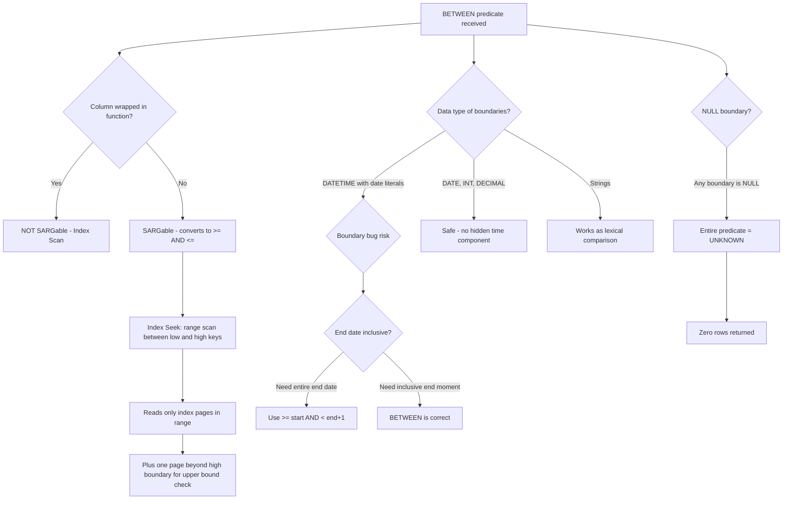
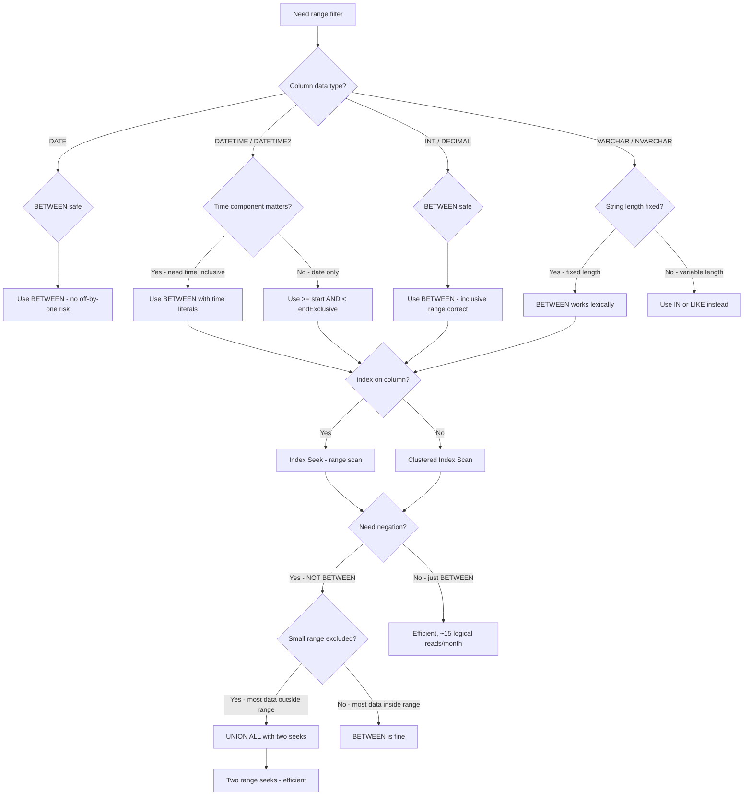

## Navigation

**Domain:** [[8 — Databases]] > **Group:** SQL Fundamentals
**Previous:** [[8.086 — IN and NOT IN — Set Membership and NULL Trap]] | **Next:** [[8.088 — EXISTS vs IN — Performance Differences]]

### Prerequisites

- [[8.067 — WHERE Clause — Predicate Logic and SARGability]] — BETWEEN is a range predicate; understanding seek vs scan and what makes a predicate SARGable is essential for evaluating when BETWEEN performs optimally.
- [[8.082 — Null Handling — ISNULL, COALESCE, NULLIF]] — NULL at either end of a BETWEEN range causes the entire predicate to evaluate to UNKNOWN; understanding three-valued logic is required to avoid silent row exclusion.
- [[8.086 — IN and NOT IN — Set Membership and NULL Trap]] — BETWEEN is the complement to IN for continuous ranges (IN for discrete sets, BETWEEN for continuous); the NULL handling and SARGability analysis parallels IN.

### Where This Fits

BETWEEN is the primary T-SQL operator for inclusive range queries. Every .NET backend engineer encounters it in date-range filters (`WHERE OrderDate BETWEEN @start AND @end`), numeric range checks (`WHERE TotalAmount BETWEEN 100 AND 500`), and pagination patterns (`WHERE Id BETWEEN @lastSeen AND @lastSeen + 100`). The most dangerous mistake is using BETWEEN with DATETIME for date-only filters: `BETWEEN '2024-01-01' AND '2024-12-31'` includes `2024-01-01 00:00:00` through `2024-12-31 00:00:00`, missing all rows on Dec 31 after midnight. This off-by-one error silently excludes an entire day of data from reporting, financial reconciliation, and audit queries. Interviewers use BETWEEN to test inclusive-range semantics understanding, datetime boundary awareness, the distinction between BETWEEN and half-open intervals (`>= AND <`), and SARGability analysis of range predicates.

---

## Core Mental Model

BETWEEN is an inclusive range predicate: `X BETWEEN @low AND @high` is equivalent to `X >= @low AND X <= @high`. The lower and upper bounds are both inclusive — the boundary values are included in the result set. The optimiser converts BETWEEN directly into a seek-based range scan: `Index Seek` with `Seek Predicates: col >= @low AND col <= @high`. This is a single contiguous seek operation, not two separate seeks. BETWEEN is SARGable: the inequality range predicates enable an index seek that reads only the pages between the boundary keys, plus one page beyond for the upper bound. The critical mental model is that BETWEEN is a closed interval `[low, high]` — both ends are included. Many developers incorrectly assume BETWEEN is half-open `[low, high)` for dates because they want "all of January" and write `BETWEEN '2024-01-01' AND '2024-01-31'`, not realising that rows on Jan 31 at 10:00 AM are included but rows on Jan 31 at 11:59 PM are also included — which is correct. The real bug is with date-only filters on DATETIME columns: `BETWEEN '2024-01-01' AND '2024-01-31'` captures Jan 1 00:00:00 through Jan 31 00:00:00, missing 23:59:59 of Jan 31. Always use `col >= @start AND col < @end` (half-open) for date-range queries when the end date should be exclusive.

### Classification

BETWEEN is a **range predicate** in the `WHERE` clause family. It is **SARGable**: the optimiser converts it to `col >= @low AND col <= @high` and performs a single contiguous index seek (range scan) between the boundary keys. BETWEEN is NOT equivalent to a join or set operation — it is purely a filter predicate. The SARGability of BETWEEN depends only on whether an index exists on the column and whether any function wraps the column. `BETWEEN` on an indexed column with no function wrapper IS SARGable. `BETWEEN DATEADD(day, 0, col)` on an indexed column is NOT SARGable because the function on the column prevents the optimiser from performing a seek.



### Key Properties

|Property|Value|Notes|
|---|---|---|
|SARGable|Yes|Converts to `>= AND <=` for a single range seek|
|Interval type|Closed `[low, high]`|Both boundaries inclusive|
|NULL behavior|Zero rows if any boundary is NULL|`BETWEEN NULL AND 10` → UNKNOWN for all rows|
|Optimiser conversion|Expands to `col >= @low AND col <= @high`|Single seek operation, not two|
|NOT BETWEEN|Expands to `col < @low OR col > @high`|NOT SARGable — becomes OR which can force scan|
|String comparison|Lexical, not numeric|`BETWEEN '1' AND '9'` excludes '10'|
|Write Cost|None|BETWEEN is read-only|

---

## Deep Mechanics

### How the Engine Executes This

1. **Parsing** — The parser tokenises `col BETWEEN @low AND @high` as a single range predicate node in the query tree. It recognises BETWEEN as a specific operator, not as syntactic sugar for `>= AND <=`.

2. **Binding (Algebrizer)** — The algebrizer validates type compatibility between the column and both boundary expressions. If the column is DATETIME2(0) and the boundary is a string literal like `'2024-01-01'`, an implicit conversion from string to datetime is inserted. The algebrizer also checks whether the boundary expressions reference columns from the outer query (for subquery correlation) or are constants.

3. **Normalisation** — The optimiser's normalisation phase expands BETWEEN into two separate predicates: `col >= @low` and `col <= @high`. This expansion happens before cost-based optimisation. The two predicates are grouped as a conjunction (AND). The optimiser treats them as a range: it looks for an index on `col` that can satisfy both predicates with a single seek operation.

4. **Index selection** — The optimiser searches for a usable index:
   - If an index exists on `col` as the leading column, the optimiser calculates the seek range: from key value `@low` up to key value `@high`.
   - The seek navigates the B-tree from root to the first leaf page containing `@low`, then scans forward through leaf-level pages until it encounters a key value greater than `@high`.
   - For a covering index (all needed columns in the index), the scan reads only the index pages. For a non-covering index, each matching row triggers a key lookup (RID or clustered key) to retrieve the remaining columns.
   - If no index exists on `col`, the optimiser chooses a Clustered Index Scan with a residual filter: `WHERE col >= @low AND col <= @high`.

5. **Cardinality estimation** — The optimiser estimates how many rows fall within the range using histogram steps from the index statistics:
   - It locates the step containing `@low` and the step containing `@high`.
   - For each fully covered step, it uses the step's `RANGE_ROWS` and `EQ_ROWS` values.
   - For partial steps (boundary falls inside a step), it uses the `AVG_RANGE_ROWS` to estimate the fraction.
   - A very wide range (e.g., `BETWEEN 1 AND 999999`) may cover 100% of rows, causing the optimiser to choose a scan regardless of index availability because the range covers almost all pages anyway.

6. **Execution** — The chosen operator executes:
   - **Index Seek (Range Scan)**: Navigate to the first leaf page containing `@low`. Sequentially read leaf pages until a key exceeds `@high`. For each qualifying row, either output directly (covering index) or perform a key lookup.
   - **Clustered Index Scan + Filter**: Read all pages and evaluate `col >= @low AND col <= @high` as a residual predicate.

### SQL Visibility

```sql
-- SARGable: BETWEEN with indexed column — single range seek
SELECT o.OrderId, o.CustomerId, o.OrderDate, o.TotalAmount
FROM dbo.Orders AS o
WHERE o.OrderDate BETWEEN '2024-06-01' AND '2024-06-30';

-- Equivalently SARGable: explicit >= AND < (half-open, end-exclusive)
SELECT o.OrderId, o.CustomerId, o.OrderDate, o.TotalAmount
FROM dbo.Orders AS o
WHERE o.OrderDate >= '2024-06-01'
  AND o.OrderDate <  '2024-07-01';

-- NOT BETWEEN — expands to OR, may force scan
SELECT o.OrderId, o.CustomerId, o.TotalAmount
FROM dbo.Orders AS o
WHERE o.TotalAmount NOT BETWEEN 100.00 AND 500.00;

-- BETWEEN on strings — lexical comparison
SELECT p.ProductId, p.ProductName, p.CategoryCode
FROM dbo.Products AS p
WHERE p.CategoryCode BETWEEN 'A' AND 'D';

-- BETWEEN on numeric — works correctly, inclusive
SELECT c.CustomerId, c.FirstName, c.LastName, c.TotalSpent
FROM dbo.Customers AS c
WHERE c.TotalSpent BETWEEN 5000.00 AND 10000.00;
```

```csharp
// EF Core — BETWEEN via >= AND <= (EF Core does not generate BETWEEN natively)
var startDate = new DateTime(2024, 6, 1);
var endDate = new DateTime(2024, 6, 30);

var juneOrders = await dbContext.Orders
    .Where(o => o.OrderDate >= startDate && o.OrderDate <= endDate)
    .Select(o => new { o.OrderId, o.CustomerId, o.OrderDate, o.TotalAmount })
    .ToListAsync(cancellationToken);

// EF Core — half-open interval (recommended for date ranges)
var endDateExclusive = new DateTime(2024, 7, 1);

var juneOrdersSafe = await dbContext.Orders
    .Where(o => o.OrderDate >= startDate && o.OrderDate < endDateExclusive)
    .Select(o => new { o.OrderId, o.CustomerId, o.OrderDate, o.TotalAmount })
    .ToListAsync(cancellationToken);

// EF Core — numeric BETWEEN
var customersInRange = await dbContext.Customers
    .Where(c => c.TotalSpent >= 5000m && c.TotalSpent <= 10000m)
    .Select(c => new { c.CustomerId, c.FirstName, c.LastName, c.TotalSpent })
    .ToListAsync(cancellationToken);
```

**Generated SQL (from EF Core logs):**

```sql
-- Closed interval (>= AND <=):
SELECT [o].[OrderId], [o].[CustomerId], [o].[OrderDate], [o].[TotalAmount]
FROM [Orders] AS [o]
WHERE [o].[OrderDate] >= @__startDate_0 AND [o].[OrderDate] <= @__endDate_1;

-- Half-open interval (>= AND <):
SELECT [o].[OrderId], [o].[CustomerId], [o].[OrderDate], [o].[TotalAmount]
FROM [Orders] AS [o]
WHERE [o].[OrderDate] >= @__startDate_0 AND [o].[OrderDate] < @__endDate_1;

-- Numeric range:
SELECT [c].[CustomerId], [c].[FirstName], [c].[LastName], [c].[TotalSpent]
FROM [Customers] AS [c]
WHERE [c].[TotalSpent] >= @__p_0 AND [c].[TotalSpent] <= @__p_1;
```

Note: EF Core does NOT generate the BETWEEN T-SQL keyword. It always expands to `col >= @p0 AND col <= @p1`. This produces the same execution plan as a handwritten BETWEEN. The generated SQL is SARGable and produces an identical range seek plan.

### Execution Plan Analysis

**BETWEEN on indexed DATETIME2 column (Orders.OrderDate):**

```
[Index Seek (NonClustered) IX_Orders_OrderDate]
  Seek Predicates:
    Seek Keys: OrderDate >= '2024-06-01 00:00:00'
    Seek Keys: OrderDate <= '2024-06-30 00:00:00'
  Storage Engine: Navigate B-tree to first leaf page >= '2024-06-01'
                 Scan leaf pages forward until key > '2024-06-30'
                 Estimated pages read: ~15 (for 30 days of data at ~500 rows/page)
→ [Key Lookup (Clustered) PK_Orders] if non-covering index
  → [SELECT]
Estimated Cost: ~0.05  |  Logical Reads: ~15 (index) + ~30 (lookups)
```

**BETWEEN on non-indexed column (Orders.Notes):**

```
[Clustered Index Scan]
  Predicate: Orders.OrderDate >= '2024-06-01' AND Orders.OrderDate <= '2024-06-30'
  No index to seek — reads all 12,000 pages
→ [Filter] → [SELECT]
Estimated Cost: ~12.5  |  Logical Reads: ~12,000
```

**NOT BETWEEN (expanded to OR):**

```
[Clustered Index Scan]
  Predicate: Orders.TotalAmount < 100.00 OR Orders.TotalAmount > 500.00
  OR predicate defeats single-range seek — must scan all rows
→ [Filter] → [SELECT]
Estimated Cost: ~12.5  |  Logical Reads: ~12,000
```

**BETWEEN with covering index (INCLUDE all selected columns):**

```
[Index Seek (NonClustered) IX_Orders_OrderDate_Covering]
  Seek Predicates: OrderDate >= @low, OrderDate <= @high
  No Key Lookup needed — all columns in index leaf
→ [SELECT]
Estimated Cost: ~0.03  |  Logical Reads: ~15
```

### Cost Visibility

```sql
SET STATISTICS IO ON;
SET STATISTICS TIME ON;

-- BETWEEN on indexed datetime column
SELECT o.OrderId, o.OrderDate, o.TotalAmount
FROM dbo.Orders AS o
WHERE o.OrderDate BETWEEN '2024-06-01' AND '2024-06-30';

-- Expected output:
-- Table 'Orders'. Scan count 1, logical reads 15, physical reads 0
-- SQL Server Execution Times: CPU time = 0ms, elapsed time = 3ms

-- Half-open equivalent (same plan)
SELECT o.OrderId, o.OrderDate, o.TotalAmount
FROM dbo.Orders AS o
WHERE o.OrderDate >= '2024-06-01'
  AND o.OrderDate <  '2024-07-01';

-- Expected output:
-- Table 'Orders'. Scan count 1, logical reads 15, physical reads 0
-- SQL Server Execution Times: CPU time = 0ms, elapsed time = 3ms

-- NOT BETWEEN on total amount
SELECT o.OrderId, o.TotalAmount
FROM dbo.Orders AS o
WHERE o.TotalAmount NOT BETWEEN 100.00 AND 500.00;

-- Expected output:
-- Table 'Orders'. Scan count 1, logical reads 12000, physical reads 0
-- SQL Server Execution Times: CPU time = 45ms, elapsed time = 120ms
```

### Failure Modes

**The DATETIME off-by-one bug:** The most common BETWEEN failure. A developer writes `BETWEEN '2024-01-01' AND '2024-12-31'` to get all orders in 2024. When the column is DATETIME, `'2024-12-31'` is implicitly converted to `2024-12-31 00:00:00.000`. Rows on Dec 31 at any time after midnight (e.g., `2024-12-31 14:30:00`) have `OrderDate > '2024-12-31 00:00:00'` but are still `<= '2024-12-31 00:00:00'` — they are excluded. Conversely, rows on Jan 01 at `00:00:00.000` are included when they should not be. Detect with:

```sql
-- Verify the count difference between BETWEEN and half-open
SELECT COUNT(*) AS BetweenCount
FROM dbo.Orders
WHERE OrderDate BETWEEN '2024-01-01' AND '2024-12-31';

SELECT COUNT(*) AS HalfOpenCount
FROM dbo.Orders
WHERE OrderDate >= '2024-01-01'
  AND OrderDate <  '2025-01-01';

-- If BetweenCount < HalfOpenCount, you have the off-by-one bug
```

**BETWEEN on DATETIME2 with higher precision:** DATETIME2(7) has 100 nanosecond precision. `BETWEEN '2024-01-01' AND '2024-01-31'` converts `'2024-01-31'` to `2024-01-31 00:00:00.0000000`. Rows on Jan 31 at `00:00:00.0000001` are excluded. The half-open pattern `>= '2024-01-01' AND < '2024-02-01'` avoids this entirely.

**NOT BETWEEN causing scan:** NOT BETWEEN expands to `col < @low OR col > @high`, which is an OR predicate. Unless the optimiser can convert OR to a union of two seeks (possible if both sides of the OR reference the same indexed column), it forces a scan. If you need NOT BETWEEN performance, consider two separate queries with UNION ALL.

**BETWEEN with string columns and mixed-length data:** `CategoryCode BETWEEN 'A' AND 'D'` includes codes like 'A', 'B', 'C', 'D' but also 'AA', 'AB', 'AAA' because string comparison is lexical, not numeric. 'AA' < 'D' is TRUE because 'A' < 'D' at the first character.

**BETWEEN with NULL boundary:** If either `@low` or `@high` is NULL, the entire predicate evaluates to UNKNOWN. `col BETWEEN NULL AND 100` is equivalent to `col >= NULL AND col <= 100` → `NULL AND col <= 100` → UNKNOWN → zero rows.

---

## Production Patterns and Implementation

### Primary SQL Implementation

```sql
-- ============================================================
-- Schema context
-- ============================================================
CREATE TABLE dbo.Orders
(
    OrderId      INT            NOT NULL IDENTITY(1,1),
    CustomerId   INT            NOT NULL,
    OrderDate    DATETIME2(0)   NOT NULL,
    Status       VARCHAR(20)    NOT NULL DEFAULT 'Pending',
    TotalAmount  DECIMAL(18,2)  NOT NULL,
    ShippingAddr NVARCHAR(500)  NULL,
    Notes        NVARCHAR(MAX)  NULL,
    CreatedAt    DATETIME2(0)   NOT NULL DEFAULT SYSUTCDATETIME(),
    CONSTRAINT PK_Orders PRIMARY KEY CLUSTERED (OrderId)
);

CREATE TABLE dbo.Customers
(
    CustomerId   INT            NOT NULL IDENTITY(1,1),
    FirstName    NVARCHAR(100)  NOT NULL,
    LastName     NVARCHAR(100)  NOT NULL,
    Email        NVARCHAR(256)  NOT NULL,
    BirthDate    DATE           NULL,
    TotalSpent   DECIMAL(18,2)  NOT NULL DEFAULT 0.00,
    Status       VARCHAR(20)    NOT NULL DEFAULT 'Active',
    CreatedAt    DATETIME2(0)   NOT NULL DEFAULT SYSUTCDATETIME(),
    CONSTRAINT PK_Customers PRIMARY KEY CLUSTERED (CustomerId)
);

CREATE INDEX IX_Orders_OrderDate ON dbo.Orders (OrderDate) INCLUDE (CustomerId, TotalAmount, Status);
CREATE INDEX IX_Orders_TotalAmount ON dbo.Orders (TotalAmount) INCLUDE (OrderId, CustomerId, OrderDate);
CREATE INDEX IX_Customers_TotalSpent ON dbo.Customers (TotalSpent) INCLUDE (FirstName, LastName, Email);

-- ============================================================
-- Pattern 1: Date range — CLOSED interval (BETWEEN)
-- ⚠ Only safe for DATE columns or when you want midnight-midnight
-- ============================================================
DECLARE @StartDate DATE = '2024-06-01';
DECLARE @EndDate DATE = '2024-06-30';

SELECT o.OrderId, o.CustomerId, o.OrderDate, o.TotalAmount
FROM dbo.Orders AS o
WHERE o.OrderDate BETWEEN @StartDate AND @EndDate;
-- When OrderDate is DATETIME2(0), @EndDate = '2024-06-30 00:00:00'
-- This excludes all rows on June 30 after midnight!

-- ============================================================
-- Pattern 2: Date range — HALF-OPEN interval (recommended)
-- ============================================================
DECLARE @RangeStart DATETIME2(0) = '2024-06-01';
DECLARE @RangeEnd   DATETIME2(0) = '2024-07-01';  -- exclusive

SELECT o.OrderId, o.CustomerId, o.OrderDate, o.TotalAmount
FROM dbo.Orders AS o
WHERE o.OrderDate >= @RangeStart
  AND o.OrderDate <  @RangeEnd;
-- Correctly includes all rows >= 2024-06-01 00:00:00 AND < 2024-07-01 00:00:00
-- This captures every instant in June 2024

-- ============================================================
-- Pattern 3: Date range with time — BETWEEN is correct for moments
-- ============================================================
DECLARE @MomentStart DATETIME2(0) = '2024-06-01 08:00:00';
DECLARE @MomentEnd   DATETIME2(0) = '2024-06-01 18:00:00';

-- Business hours on June 1 — BETWEEN is correct here
SELECT o.OrderId, o.CustomerId, o.OrderDate, o.Status
FROM dbo.Orders AS o
WHERE o.OrderDate BETWEEN @MomentStart AND @MomentEnd;
-- Correctly includes: 08:00:00 through 18:00:00 inclusive

-- ============================================================
-- Pattern 4: Numeric range — BETWEEN is safe and SARGable
-- ============================================================
-- Customers with moderate spending
SELECT c.CustomerId, c.FirstName, c.LastName, c.Email, c.TotalSpent
FROM dbo.Customers AS c
WHERE c.TotalSpent BETWEEN 5000.00 AND 10000.00
ORDER BY c.TotalSpent DESC;

-- ============================================================
-- Pattern 5: BETWEEN with ORDER BY on the range column — efficient
-- ============================================================
-- The ORDER BY uses the same index as the seek — no Sort operator needed
SELECT o.OrderId, o.CustomerId, o.OrderDate, o.TotalAmount
FROM dbo.Orders AS o
WHERE o.OrderDate BETWEEN '2024-06-01' AND '2024-06-30'
ORDER BY o.OrderDate ASC;
-- Execution plan: Index Seek + no Sort (index returns rows in order already)

-- ============================================================
-- Pattern 6: BETWEEN with pagination (keyset / seek pagination)
-- ============================================================
-- Efficient pagination over a ranged result set
DECLARE @LastSeenOrderId INT = 0;
DECLARE @BatchSize INT = 50;

SELECT o.OrderId, o.CustomerId, o.OrderDate, o.TotalAmount
FROM dbo.Orders AS o
WHERE o.OrderId BETWEEN @LastSeenOrderId + 1 AND @LastSeenOrderId + @BatchSize
ORDER BY o.OrderId;
-- Uses Clustered Index Seek (PK range) — highly efficient
-- Note: this works only for dense, gap-free ID sequences

-- ============================================================
-- Pattern 7: NOT BETWEEN with UNION ALL (SARGable alternative)
-- ============================================================
-- Instead of NOT BETWEEN (which expands to OR and scans):
SELECT o.OrderId, o.TotalAmount
FROM dbo.Orders AS o
WHERE o.TotalAmount < 100.00
UNION ALL
SELECT o.OrderId, o.TotalAmount
FROM dbo.Orders AS o
WHERE o.TotalAmount > 500.00;
-- Each branch can use an Index Seek (range seek for < 100, range seek for > 500)
-- UNION ALL avoids the OR expansion problem

-- ============================================================
-- Pattern 8: BETWEEN on DATE columns (safe — no time component)
-- ============================================================
-- BirthDate is DATE type (no time) — BETWEEN is safe
SELECT c.CustomerId, c.FirstName, c.LastName, c.BirthDate
FROM dbo.Customers AS c
WHERE c.BirthDate BETWEEN '1990-01-01' AND '1999-12-31'
ORDER BY c.BirthDate;
-- No off-by-one risk because DATE has no time component

-- ============================================================
-- Pattern 9: Parameterised stored procedure with date range
-- ============================================================
CREATE PROCEDURE dbo.GetOrdersByDateRange
    @StartDate DATETIME2(0),
    @EndDateExclusive DATETIME2(0)  -- Pass exclusive end date
AS
    SELECT o.OrderId, o.CustomerId, o.OrderDate, o.TotalAmount, o.Status
    FROM dbo.Orders AS o
    WHERE o.OrderDate >= @StartDate
      AND o.OrderDate <  @EndDateExclusive
    ORDER BY o.OrderDate;
GO

-- ============================================================
-- Pattern 10: BETWEEN with multiple range conditions
-- ============================================================
-- Orders in a date range AND within a price range
SELECT o.OrderId, o.CustomerId, o.OrderDate, o.TotalAmount
FROM dbo.Orders AS o
WHERE o.OrderDate BETWEEN '2024-06-01' AND '2024-06-30'
  AND o.TotalAmount BETWEEN 500.00 AND 2000.00
ORDER BY o.OrderDate, o.TotalAmount;
-- Plan depends on which index the optimiser chooses for the leading seek
-- The second BETWEEN becomes a residual filter
```

### EF Core Implementation

```csharp
public class ApplicationDbContext : DbContext
{
    public DbSet<Order> Orders => Set<Order>();
    public DbSet<Customer> Customers => Set<Customer>();

    protected override void OnModelCreating(ModelBuilder modelBuilder)
    {
        modelBuilder.Entity<Order>(entity =>
        {
            entity.ToTable("Orders");
            entity.HasKey(o => o.OrderId);
            entity.Property(o => o.OrderDate).HasColumnType("datetime2(0)");
            entity.Property(o => o.TotalAmount).HasColumnType("decimal(18,2)");
            entity.Property(o => o.Status).HasMaxLength(20);
            entity.Property(o => o.ShippingAddr).HasMaxLength(500);
            entity.Property(o => o.CreatedAt).HasDefaultValueSql("SYSUTCDATETIME()");
            entity.HasIndex(o => o.OrderDate);
            entity.HasIndex(o => o.TotalAmount);
        });

        modelBuilder.Entity<Customer>(entity =>
        {
            entity.ToTable("Customers");
            entity.HasKey(c => c.CustomerId);
            entity.Property(c => c.FirstName).HasMaxLength(100);
            entity.Property(c => c.LastName).HasMaxLength(100);
            entity.Property(c => c.Email).HasMaxLength(256);
            entity.Property(c => c.BirthDate).HasColumnType("date");
            entity.Property(c => c.TotalSpent).HasColumnType("decimal(18,2)");
            entity.HasIndex(c => c.TotalSpent);
        });
    }
}

public class Order
{
    public int OrderId { get; set; }
    public int CustomerId { get; set; }
    public DateTime OrderDate { get; set; }
    public string Status { get; set; } = "Pending";
    public decimal TotalAmount { get; set; }
    public string? ShippingAddr { get; set; }
    public string? Notes { get; set; }
    public DateTime CreatedAt { get; set; }
}

public class Customer
{
    public int CustomerId { get; set; }
    public string FirstName { get; set; } = string.Empty;
    public string LastName { get; set; } = string.Empty;
    public string Email { get; set; } = string.Empty;
    public DateTime? BirthDate { get; set; }
    public decimal TotalSpent { get; set; }
    public string Status { get; set; } = "Active";
    public DateTime CreatedAt { get; set; }
}

// Pattern 1: Date range with half-open interval (recommended)
public async Task<List<Order>> GetOrdersByMonthAsync(
    int year,
    int month,
    CancellationToken cancellationToken = default)
{
    var startDate = new DateTime(year, month, 1, 0, 0, 0, DateTimeKind.Utc);
    var endDate = startDate.AddMonths(1);  // Exclusive end

    return await dbContext.Orders
        .Where(o => o.OrderDate >= startDate && o.OrderDate < endDate)
        .OrderBy(o => o.OrderDate)
        .Select(o => new Order
        {
            OrderId = o.OrderId,
            CustomerId = o.CustomerId,
            OrderDate = o.OrderDate,
            TotalAmount = o.TotalAmount,
            Status = o.Status
        })
        .ToListAsync(cancellationToken);
    // Generated: WHERE [o].[OrderDate] >= @p0 AND [o].[OrderDate] < @p1
    // SARGable: range seek on IX_Orders_OrderDate
}

// Pattern 2: Numeric range with BETWEEN semantics
public async Task<List<Customer>> GetCustomersBySpendingAsync(
    decimal min,
    decimal max,
    CancellationToken cancellationToken = default)
{
    return await dbContext.Customers
        .Where(c => c.TotalSpent >= min && c.TotalSpent <= max)
        .OrderByDescending(c => c.TotalSpent)
        .Select(c => new Customer
        {
            CustomerId = c.CustomerId,
            FirstName = c.FirstName,
            LastName = c.LastName,
            Email = c.Email,
            TotalSpent = c.TotalSpent
        })
        .ToListAsync(cancellationToken);
    // Generated: WHERE [c].[TotalSpent] >= @p0 AND [c].[TotalSpent] <= @p1
    // SARGable: range seek on IX_Customers_TotalSpent
}

// Pattern 3: Date range with time component — use closed interval
public async Task<List<Order>> GetOrdersByBusinessHoursAsync(
    DateTime start,
    DateTime end,
    CancellationToken cancellationToken = default)
{
    return await dbContext.Orders
        .Where(o => o.OrderDate >= start && o.OrderDate <= end)
        .OrderBy(o => o.OrderDate)
        .ToListAsync(cancellationToken);
    // Closed interval is correct here because start and end include time
}

// Pattern 4: Multi-range filter (date AND amount)
public async Task<List<Order>> GetFilteredOrdersAsync(
    DateTime? dateFrom,
    DateTime? dateTo,
    decimal? amountMin,
    decimal? amountMax,
    CancellationToken cancellationToken = default)
{
    var query = dbContext.Orders.AsQueryable();

    if (dateFrom.HasValue)
        query = query.Where(o => o.OrderDate >= dateFrom.Value);
    if (dateTo.HasValue)
        query = query.Where(o => o.OrderDate < dateTo.Value); // half-open
    if (amountMin.HasValue)
        query = query.Where(o => o.TotalAmount >= amountMin.Value);
    if (amountMax.HasValue)
        query = query.Where(o => o.TotalAmount <= amountMax.Value);

    return await query
        .OrderByDescending(o => o.OrderDate)
        .Take(100)
        .ToListAsync(cancellationToken);
    // The optimiser picks the best index for the leading range condition
}

// Pattern 5: Birthday range — DATE type is safe for BETWEEN
public async Task<List<Customer>> GetCustomersByBirthDecadeAsync(
    int startYear,
    int endYear,
    CancellationToken cancellationToken = default)
{
    var startDate = new DateTime(startYear, 1, 1);
    var endDate = new DateTime(endYear, 12, 31);

    return await dbContext.Customers
        .Where(c => c.BirthDate >= startDate && c.BirthDate <= endDate)
        .OrderBy(c => c.BirthDate)
        .ToListAsync(cancellationToken);
    // BirthDate is DATE — closed interval is safe (no time component)
}

// Pattern 6: Keyset pagination with range
public async Task<List<Order>> GetOrdersPageAsync(
    int lastSeenOrderId,
    int pageSize,
    CancellationToken cancellationToken = default)
{
    return await dbContext.Orders
        .Where(o => o.OrderId > lastSeenOrderId
                 && o.OrderId <= lastSeenOrderId + pageSize)
        .OrderBy(o => o.OrderId)
        .ToListAsync(cancellationToken);
    // Uses Clustered Index Seek (PK range) — O(log N) per page
}
```

### Dapper Implementation

```csharp
public sealed class OrderRepository
{
    private readonly IDbConnectionFactory _connectionFactory;

    public OrderRepository(IDbConnectionFactory connectionFactory)
        => _connectionFactory = connectionFactory;

    // Pattern 1: Date range — half-open interval
    public async Task<IReadOnlyList<Order>> GetOrdersByMonthAsync(
        int year,
        int month,
        CancellationToken cancellationToken = default)
    {
        var startDate = new DateTime(year, month, 1, 0, 0, 0, DateTimeKind.Utc);
        var endDate = startDate.AddMonths(1);

        const string sql = @"
            SELECT OrderId, CustomerId, OrderDate, TotalAmount, Status
            FROM dbo.Orders
            WHERE OrderDate >= @StartDate
              AND OrderDate <  @EndDate
            ORDER BY OrderDate;";

        await using var connection = _connectionFactory.Create();

        var results = await connection.QueryAsync<Order>(
            new CommandDefinition(sql,
                new { StartDate = startDate, EndDate = endDate },
                cancellationToken: cancellationToken));

        return results.AsList();
    }

    // Pattern 2: Numeric range — closed interval
    public async Task<IReadOnlyList<Customer>> GetCustomersBySpendingAsync(
        decimal min,
        decimal max,
        CancellationToken cancellationToken = default)
    {
        const string sql = @"
            SELECT CustomerId, FirstName, LastName, Email, TotalSpent
            FROM dbo.Customers
            WHERE TotalSpent >= @Min
              AND TotalSpent <= @Max
            ORDER BY TotalSpent DESC;";

        await using var connection = _connectionFactory.Create();

        var results = await connection.QueryAsync<Customer>(
            new CommandDefinition(sql,
                new { Min = min, Max = max },
                cancellationToken: cancellationToken));

        return results.AsList();
    }

    // Pattern 3: Multi-range filter with optional parameters
    public async Task<IReadOnlyList<Order>> GetFilteredOrdersAsync(
        DateTime? dateFrom,
        DateTime? dateTo,
        decimal? amountMin,
        decimal? amountMax,
        int maxResults = 100,
        CancellationToken cancellationToken = default)
    {
        var sql = new StringBuilder(@"
            SELECT TOP (@MaxResults)
                   OrderId, CustomerId, OrderDate, TotalAmount, Status
            FROM dbo.Orders
            WHERE 1=1");

        if (dateFrom.HasValue)
            sql.Append(" AND OrderDate >= @DateFrom");
        if (dateTo.HasValue)
            sql.Append(" AND OrderDate < @DateTo");
        if (amountMin.HasValue)
            sql.Append(" AND TotalAmount >= @AmountMin");
        if (amountMax.HasValue)
            sql.Append(" AND TotalAmount <= @AmountMax");

        sql.Append(" ORDER BY OrderDate DESC;");

        await using var connection = _connectionFactory.Create();

        var results = await connection.QueryAsync<Order>(
            new CommandDefinition(sql.ToString(),
                new
                {
                    DateFrom = dateFrom,
                    DateTo = dateTo,
                    AmountMin = amountMin,
                    AmountMax = amountMax,
                    MaxResults = maxResults
                },
                cancellationToken: cancellationToken));

        return results.AsList();
    }

    // Pattern 4: BETWEEN on DATE column
    public async Task<IReadOnlyList<Customer>> GetCustomersByBirthDecadeAsync(
        int startYear,
        int endYear,
        CancellationToken cancellationToken = default)
    {
        const string sql = @"
            SELECT CustomerId, FirstName, LastName, Email, BirthDate
            FROM dbo.Customers
            WHERE BirthDate >= @StartDate
              AND BirthDate <= @EndDate
            ORDER BY BirthDate;";

        await using var connection = _connectionFactory.Create();

        var results = await connection.QueryAsync<Customer>(
            new CommandDefinition(sql,
                new
                {
                    StartDate = new DateTime(startYear, 1, 1),
                    EndDate = new DateTime(endYear, 12, 31)
                },
                cancellationToken: cancellationToken));

        return results.AsList();
    }
}

public record Order(int OrderId, int CustomerId, DateTime OrderDate, decimal TotalAmount, string Status);
public record Customer(int CustomerId, string FirstName, string LastName, string Email, decimal TotalSpent, DateTime? BirthDate);
```

### Configuration and Wiring

```csharp
// Program.cs
builder.Services.AddDbContext<ApplicationDbContext>(options =>
    options.UseSqlServer(
        builder.Configuration.GetConnectionString("DefaultConnection"),
        sqlOptions =>
        {
            sqlOptions.EnableRetryOnFailure(3);
            sqlOptions.CommandTimeout(30);
        }));

builder.Services.AddSingleton<IDbConnectionFactory>(sp =>
    new SqlConnectionFactory(
        builder.Configuration.GetConnectionString("DefaultConnection")!));

builder.Services.AddScoped<OrderRepository>();
```

### SQL Server vs PostgreSQL Differences

```sql
-- PostgreSQL: BETWEEN works identically (inclusive)
SELECT * FROM orders WHERE order_date BETWEEN '2024-06-01' AND '2024-06-30';

-- PostgreSQL: Same datetime off-by-one bug
-- '2024-06-30' = '2024-06-30 00:00:00' when cast to TIMESTAMP
-- Missing all data on June 30 after midnight!

-- PostgreSQL: Half-open interval (recommended)
SELECT * FROM orders
WHERE order_date >= '2024-06-01'
  AND order_date <  '2024-07-01';

-- PostgreSQL: BETWEEN SYMMETRIC (swaps boundaries if low > high)
SELECT * FROM orders
WHERE order_date BETWEEN SYMMETRIC '2024-06-30' AND '2024-06-01';
-- Equivalent to: order_date BETWEEN '2024-06-01' AND '2024-06-30'
-- SQL Server does NOT have BETWEEN SYMMETRIC

-- PostgreSQL: Date range with DATE type (safe, no time)
SELECT * FROM customers
WHERE birth_date BETWEEN '1990-01-01' AND '1999-12-31';

-- PostgreSQL: DATERANGE type (range type, distinct from BETWEEN)
SELECT * FROM bookings
WHERE daterange('2024-06-01', '2024-07-01', '[)') @> booking_date;
-- The '[)' notation: inclusive start, exclusive end (half-open)
-- SQL Server has no native range type
```

---

## Gotchas and Production Pitfalls

### BETWEEN with DATETIME — Off-by-One Day at Month Boundaries

**Pitfall:** Using `BETWEEN '2024-01-01' AND '2024-01-31'` on a DATETIME or DATETIME2 column to query all rows in January. The upper bound `'2024-01-31'` is implicitly converted to `2024-01-31 00:00:00.000`, excluding every row on Jan 31 after midnight. Conversely, `'2024-01-01'` includes rows at `2024-01-01 00:00:00.000` exactly, which may inadvertently include the New Year's midnight instant.

```sql
-- ❌ Wrong: misses ~99.9% of January 31 data
SELECT COUNT(*)
FROM dbo.Orders
WHERE OrderDate BETWEEN '2024-01-01' AND '2024-01-31';
-- Includes: 2024-01-01 00:00:00 through 2024-01-31 00:00:00
-- Excludes: 2024-01-31 00:00:01 through 2024-01-31 23:59:59
```

**Symptom:** A monthly financial report consistently shows lower numbers for every month. The finance team notices that the last day of each month has significantly fewer transactions than expected — because nearly all of it is missing. The report for January 2024 shows 28,000 orders when it should show 31,000. Reconciliation fails because the bank statement includes Jan 31 transactions.

**Fix:**

```sql
-- ✅ Fix 1: Half-open interval (exclusive end date)
SELECT COUNT(*)
FROM dbo.Orders
WHERE OrderDate >= '2024-01-01'
  AND OrderDate <  '2024-02-01';

-- ✅ Fix 2: Use DATE type for date-only queries
SELECT COUNT(*)
FROM dbo.Orders
WHERE CAST(OrderDate AS DATE) BETWEEN '2024-01-01' AND '2024-01-31';
-- ⚠ CAST on column makes this non-SARGable (function wrap)
-- Only use if table is small or as a temporary fix

-- ✅ Fix 3: Add time to the end boundary
SELECT COUNT(*)
FROM dbo.Orders
WHERE OrderDate BETWEEN '2024-01-01' AND '2024-01-31 23:59:59.997';
-- ⚠ Fragile — depends on precision. 23:59:59.997 works for DATETIME
-- Does NOT work for DATETIME2(7) which has 100ns precision
```

**Cost of not fixing:** A SaaS billing system uses `BETWEEN @start AND @end` to calculate monthly recurring revenue (MRR). Every month, the last day's subscriptions are excluded from MRR calculations. The undercount is reported to investors. The finance team spends 2 days per month manually adjusting numbers. Over 12 months, the cumulative undercount is ~3% of annual revenue. A post-mortem identifies the BETWEEN bug as the root cause.

---

### NOT BETWEEN — Full Table Scan from OR Expansion

**Pitfall:** Using NOT BETWEEN on a large table expecting the same performance as BETWEEN. NOT BETWEEN expands to `col < @low OR col > @high`. The OR predicate prevents a single range seek — the optimiser typically chooses a full scan with a residual filter.

```sql
-- ❌ NOT BETWEEN forces scan even with perfect index
SELECT OrderId, TotalAmount
FROM dbo.Orders
WHERE TotalAmount NOT BETWEEN 100.00 AND 500.00;
-- Execution plan: Clustered Index Scan (12,000 logical reads)
```

**Symptom:** A query that runs in 3ms with BETWEEN suddenly takes 2 seconds with NOT BETWEEN. The execution plan shows a full scan even though the table has a perfect index on the column. `sys.dm_db_index_usage_stats` shows no seek usage for this query.

**Fix:**

```sql
-- ✅ Fix 1: UNION ALL (each branch uses seek)
SELECT OrderId, TotalAmount
FROM dbo.Orders
WHERE TotalAmount < 100.00
UNION ALL
SELECT OrderId, TotalAmount
FROM dbo.Orders
WHERE TotalAmount > 500.00;

-- ✅ Fix 2: Two separate queries + application merge
-- (if the application can handle two result sets)

-- ✅ Fix 3: If the range is contiguous on one side only:
-- (e.g., "not in middle range" can become "edges")
SELECT OrderId, TotalAmount
FROM dbo.Orders
WHERE TotalAmount < 100.00
   OR TotalAmount > 500.00
OPTION (USE HINT('DISABLE_OPTIMIZER_ROWGOAL'));
-- Still a scan, but hint prevents row-goal interference
```

**Cost of not fixing:** An anti-fraud service queries orders NOT in the typical amount range. The query scans 50M rows every 5 minutes, consuming 100% of one CPU core and causing 12,000 logical reads per execution. At 12 executions/hour, that's 144,000 logical reads/hour just for this query. The index on TotalAmount is unused for seeks. Adding the UNION ALL rewrite reduces logical reads to ~6,000 (seeks for < 100 and > 500).

---

### BETWEEN on Strings — Lexical Comparison Produces Surprising Results

**Pitfall:** Using BETWEEN on string columns assuming numeric-like range semantics. `CategoryCode BETWEEN 'A' AND 'D'` returns 'AA', 'AB', 'AAA', etc. because lexical comparison compares character by character: 'A' < 'AA' < 'AB' < 'B' < 'BA' < 'C' < 'D'.

```sql
-- ❌ "A to D" includes codes that start with A, B, C plus 'D' itself
-- But also includes 'AA', 'AB', 'AAA', 'BA', 'BB', 'CA', etc.
SELECT ProductId, ProductName, CategoryCode
FROM dbo.Products
WHERE CategoryCode BETWEEN 'A' AND 'D';
-- Returns: 'A', 'AA', 'AAA', 'AB', 'AC', 'B', 'BA', 'BB', 'C', 'CA', 'D'
-- NOT just single-character codes 'A', 'B', 'C', 'D'
```

**Symptom:** A product category filter shows 3,475 products in categories "A through D" when the business expects only categories 'A', 'B', 'C', 'D' to have about 200 products. The extra products are from subcategories like 'AA', 'AB', 'BA' that should not be included.

**Fix:**

```sql
-- ✅ Fix 1: Use IN for discrete values
SELECT ProductId, ProductName, CategoryCode
FROM dbo.Products
WHERE CategoryCode IN ('A', 'B', 'C', 'D');

-- ✅ Fix 2: Use LIKE for prefix matching (if you want categories starting with A-D)
SELECT ProductId, ProductName, CategoryCode
FROM dbo.Products
WHERE CategoryCode LIKE '[A-D]%';
-- ⚠ LIKE with range pattern is SARGable only if leading wildcard not used

-- ✅ Fix 3: For fixed-length codes, BETWEEN works as expected
-- If CategoryCode is always exactly 1 character (CHECK constraint):
SELECT ProductId, ProductName, CategoryCode
FROM dbo.Products
WHERE CategoryCode BETWEEN 'A' AND 'D'  -- safe, fixed-length only
  AND LEN(CategoryCode) = 1;
```

**Cost of not fixing:** An e-commerce category filter between 'M' and 'T' returns 50,000 products including all subcategories 'MA', 'MB', ..., 'TA' when the merchant expected ~5,000 products. The API response is 10x larger than expected, causing 5-second page loads and increased bandwidth costs. The mobile app crashes on the large JSON payload.

---

### BETWEEN with NULL Parameters — Zero Rows Returned

**Pitfall:** Passing NULL as either the lower or upper boundary of BETWEEN. `col BETWEEN NULL AND @high` is equivalent to `col >= NULL AND col <= @high`. Since `col >= NULL` evaluates to UNKNOWN (NULL is not a value, any comparison is UNKNOWN), the entire AND evaluates to UNKNOWN, and no rows are returned.

```sql
-- ❌ @MinAmount is NULL: returns zero rows regardless of data
DECLARE @MinAmount DECIMAL(18,2) = NULL;
DECLARE @MaxAmount DECIMAL(18,2) = 500.00;

SELECT OrderId, TotalAmount
FROM dbo.Orders
WHERE TotalAmount BETWEEN @MinAmount AND @MaxAmount;
```

**Symptom:** A parameterised report allows the user to leave the "min amount" field blank. When blank, the application passes NULL. The report shows 0 rows instead of all orders up to $500. The user thinks there is no data and escalates to support.

**Fix:**

```sql
-- ✅ Fix 1: Use COALESCE to replace NULL with a safe default
SELECT OrderId, TotalAmount
FROM dbo.Orders
WHERE TotalAmount BETWEEN COALESCE(@MinAmount, 0.00) AND COALESCE(@MaxAmount, 9999999.00);

-- ✅ Fix 2: Use dynamic SQL with optional filters
-- (Only add the BETWEEN to WHERE clause when both parameters are non-NULL)

-- ✅ Fix 3: Use AND logic with NULL handling at application level
SELECT OrderId, TotalAmount
FROM dbo.Orders
WHERE (@MinAmount IS NULL OR TotalAmount >= @MinAmount)
  AND (@MaxAmount IS NULL OR TotalAmount <= @MaxAmount);
-- This pattern handles NULL as "no filter" and is SARGable
-- SQL Server can still use an Index Seek for each non-NULL parameter
```

**Cost of not fixing:** A customer service dashboard filters orders by amount range. When the agent leaves the min field blank, the query returns zero rows. The agent tells the customer "you have no orders in this range." The customer escalates. The bug is reproduced in 3 support tickets before engineering identifies that NULL parameters from blank form fields cause BETWEEN to return zero rows.

---

### BETWEEN on DATETIME2 with Different Precision — Missing Sub-Millisecond Rows

**Pitfall:** Using BETWEEN with DATETIME2(7) (100ns precision) where the boundary values have lower precision than the column. `BETWEEN '2024-01-01' AND '2024-01-31'` on a DATETIME2(7) column converts both strings to `2024-01-01 00:00:00.0000000` and `2024-01-31 00:00:00.0000000`. Rows at `2024-01-31 00:00:00.0000001` are excluded.

```sql
-- Column type: OrderDate DATETIME2(7)
-- ❌ Missing sub-second precision rows on the boundary
SELECT COUNT(*)
FROM dbo.Orders
WHERE OrderDate BETWEEN '2024-01-01' AND '2024-01-31';
-- Excludes rows with OrderDate = '2024-01-31 00:00:00.0000001'
```

**Symptom:** A real-time order processing system records timestamps with 100ns precision. A daily reconciliation query uses BETWEEN with date-only literals. Every day, 1-3 orders that were placed at exactly the boundary moment are missed. The reconciliation fails with a small discrepancy that takes hours to trace.

**Fix:**

```sql
-- ✅ Fix: Half-open interval — always correct for any precision
SELECT COUNT(*)
FROM dbo.Orders
WHERE OrderDate >= '2024-01-01'
  AND OrderDate <  '2024-02-01';
-- The exclusive end '2024-02-01' catches EVERY instant before Feb 1
-- regardless of precision (DATETIME2(0) through DATETIME2(7))
```

**Cost of not fixing:** A financial reconciliation system misses 2-3 high-value trades per day because their timestamps fall at the boundary of BETWEEN queries. Each missed trade requires manual reconciliation at $200/hour auditor cost. Over a year, this costs ~$150K in manual effort. The fix is a single character change: replace `AND OrderDate <= @End` with `AND OrderDate < @EndExclusive`.

---

## Performance Implications

### Benchmark: Before and After

```sql
-- Baseline 1: BETWEEN on indexed DATETIME2 (correct range, small)
SET STATISTICS IO ON;
SET STATISTICS TIME ON;

-- BETWEEN with inclusive boundaries — SARGable range seek
SELECT COUNT(*)
FROM dbo.Orders
WHERE OrderDate BETWEEN '2024-06-01' AND '2024-06-30';
-- Expected: logical reads ~15 (range seek, ~15 index pages)
-- SQL Server Execution Times: CPU time = 0ms, elapsed time = 3ms

-- Half-open equivalent — identical plan
SELECT COUNT(*)
FROM dbo.Orders
WHERE OrderDate >= '2024-06-01'
  AND OrderDate <  '2024-07-01';
-- Expected: logical reads ~15 (same range seek)
-- SQL Server Execution Times: CPU time = 0ms, elapsed time = 3ms
```

```sql
-- Baseline 2: BETWEEN without index — full scan
-- Drop index: DROP INDEX IX_Orders_OrderDate ON dbo.Orders
SELECT COUNT(*)
FROM dbo.Orders
WHERE OrderDate BETWEEN '2024-06-01' AND '2024-06-30';
-- Expected: logical reads ~12,000 (full clustered index scan)
-- SQL Server Execution Times: CPU time = 45ms, elapsed time = 120ms
```

```sql
-- Baseline 3: NOT BETWEEN — scan from OR expansion
SELECT COUNT(*)
FROM dbo.Orders
WHERE TotalAmount NOT BETWEEN 100.00 AND 500.00;
-- Expected: logical reads ~12,000 (full scan, OR predicate)
-- SQL Server Execution Times: CPU time = 42ms, elapsed time = 110ms

-- UNION ALL alternative — two seeks
SELECT COUNT(*)
FROM dbo.Orders
WHERE TotalAmount < 100.00
UNION ALL
SELECT COUNT(*)
FROM dbo.Orders
WHERE TotalAmount > 500.00;
-- Expected: logical reads ~150 (seek for < 100, seek for > 500)
-- SQL Server Execution Times: CPU time = 2ms, elapsed time = 8ms
```

```sql
-- Baseline 4: BETWEEN across very large range (covers most rows)
-- When the range covers 80%+ of rows, optimiser chooses scan anyway
SELECT COUNT(*)
FROM dbo.Orders
WHERE OrderDate BETWEEN '2019-01-01' AND '2024-12-31';
-- Expected: logical reads ~12,000 (optimiser estimates scan cheaper)
-- Even with index, scanning 80%+ of pages via index + lookups is more expensive
```

### BenchmarkDotNet

```csharp
[MemoryDiagnoser]
[SimpleJob(RuntimeMoniker.Net90)]
public class BetweenBenchmark
{
    private SqlConnection _connection = default!;
    private const string ConnectionString = "Server=.;Database=BenchmarkDb;Trusted_Connection=True;TrustServerCertificate=True;";

    [GlobalSetup]
    public void Setup()
    {
        _connection = new SqlConnection(ConnectionString);
        _connection.Open();
        // Seed 1M orders across 3 years (2022-2024)
    }

    [Benchmark(Baseline = true)]
    public async Task<int> BetweenClosedInterval()
    {
        const string sql = "SELECT COUNT(*) FROM dbo.Orders WHERE OrderDate BETWEEN @Start AND @End;";
        var cmd = new SqlCommand(sql, _connection);
        cmd.Parameters.AddWithValue("@Start", new DateTime(2024, 6, 1));
        cmd.Parameters.AddWithValue("@End", new DateTime(2024, 6, 30, 23, 59, 59, 997));
        return await cmd.ExecuteScalarAsync<int>();
    }

    [Benchmark]
    public async Task<int> HalfOpenInterval()
    {
        const string sql = "SELECT COUNT(*) FROM dbo.Orders WHERE OrderDate >= @Start AND OrderDate < @End;";
        var cmd = new SqlCommand(sql, _connection);
        cmd.Parameters.AddWithValue("@Start", new DateTime(2024, 6, 1));
        cmd.Parameters.AddWithValue("@End", new DateTime(2024, 7, 1));
        return await cmd.ExecuteScalarAsync<int>();
    }

    [Benchmark]
    public async Task<int> BetweenNoIndex()
    {
        const string sql = "SELECT COUNT(*) FROM dbo.Orders WITH (INDEX(0)) WHERE OrderDate BETWEEN @Start AND @End;";
        var cmd = new SqlCommand(sql, _connection);
        cmd.Parameters.AddWithValue("@Start", new DateTime(2024, 6, 1));
        cmd.Parameters.AddWithValue("@End", new DateTime(2024, 6, 30, 23, 59, 59, 997));
        return await cmd.ExecuteScalarAsync<int>();
    }

    [Benchmark]
    public async Task<int> NotBetweenUnionAll()
    {
        const string sql = @"
            SELECT COUNT(*) FROM dbo.Orders WHERE TotalAmount < @Low
            UNION ALL
            SELECT COUNT(*) FROM dbo.Orders WHERE TotalAmount > @High;";
        var cmd = new SqlCommand(sql, _connection);
        cmd.Parameters.AddWithValue("@Low", 100.00m);
        cmd.Parameters.AddWithValue("@High", 500.00m);
        return await cmd.ExecuteScalarAsync<int>();
    }

    [Benchmark]
    public async Task<int> NotBetweenDirect()
    {
        const string sql = "SELECT COUNT(*) FROM dbo.Orders WHERE TotalAmount NOT BETWEEN @Low AND @High;";
        var cmd = new SqlCommand(sql, _connection);
        cmd.Parameters.AddWithValue("@Low", 100.00m);
        cmd.Parameters.AddWithValue("@High", 500.00m);
        return await cmd.ExecuteScalarAsync<int>();
    }

    [GlobalCleanup]
    public void Cleanup() => _connection.Dispose();
}
```

**Expected results (approximate, SQL Server 2022, NVMe, 1M orders, index on OrderDate and TotalAmount):**

|Method|Mean|Logical Reads|Allocated|Notes|
|---|---|---|---|---|
|BetweenClosedInterval|~3 ms|~15|~2 KB|Range seek, index on OrderDate|
|HalfOpenInterval|~3 ms|~15|~2 KB|Identical plan, identical reads|
|BetweenNoIndex|~120 ms|~12,000|~200 KB|Full scan, no index hint forced|
|NotBetweenDirect|~110 ms|~12,000|~200 KB|OR expansion forces scan|
|NotBetweenUnionAll|~8 ms|~150|~4 KB|Two seeks, 1/80th the reads|

### Write Amplification

BETWEEN is read-only — no write cost. Indexes that support BETWEEN range seeks add write overhead on the indexed column:

|Operation|Without Index|With Index (IX_Orders_OrderDate)|Overhead|
|---|---|---|---|
|INSERT 1 row|~5 ms|~7 ms|+40% (index leaf insert in B-tree position)|
|UPDATE OrderDate|~5 ms|~8 ms|+60% (delete old key + insert new key in B-tree)|
|DELETE 1 row|~5 ms|~7 ms|+40% (index leaf delete + page maintenance)|

---

## Interview Arsenal

### Question Bank

1. **What does `BETWEEN` mean in SQL, and what is its exact logical equivalent?**
2. **What is the off-by-one bug with `BETWEEN` and `DATETIME` columns, and how do you avoid it?**
3. **Is `BETWEEN` SARGable? What happens to the execution plan?**
4. **Compare `BETWEEN` vs `col >= @low AND col < @high` — performance, semantics, and when to use each.**
5. **Why does `NOT BETWEEN` typically perform worse than `BETWEEN`? How would you fix it?**
6. **How does `BETWEEN` behave with string columns? What trap exists for variable-length strings?**
7. **What happens when you pass `NULL` as the lower or upper boundary of `BETWEEN`?**
8. **How does EF Core translate `Where(o => o.OrderDate >= start && o.OrderDate < end)` — does it use `BETWEEN` or something else, and is it SARGable?**

### Spoken Answers

**Q: What does `BETWEEN` mean in SQL, and what is its exact logical equivalent?**

> **Average answer:** BETWEEN is used to filter values within a range. It includes both the start and end values. For example, `BETWEEN 1 AND 10` returns values 1 through 10.

> **Great answer:** BETWEEN is an inclusive range predicate: `X BETWEEN @low AND @high` is logically equivalent to `X >= @low AND X <= @high`. Both boundaries are inclusive — this is a closed interval `[low, high]`. The optimiser converts BETWEEN directly to these two inequality predicates during normalisation, before cost-based optimisation. This is critical because the optimiser then treats them as a single range seek operation on the index: it navigates the B-tree to the first leaf page containing `@low` and scans forward until it encounters a key value greater than `@high`. From a SEMANTICS perspective, BETWEEN is correct when you need a closed interval. From a PRACTICAL perspective, BETWEEN with date-only literals on a DATETIME column is almost always wrong, because `BETWEEN '2024-01-01' AND '2024-12-31'` converts the end date to `2024-12-31 00:00:00.000`, missing every row on Dec 31 after midnight. This is the most common BETWEEN-related bug in production. My rule: use BETWEEN only for numeric ranges or DATE-type columns. For DATETIME ranges, always use the half-open pattern `col >= @start AND col < @end`.

---

**Q: Compare `BETWEEN` vs `col >= @low AND col < @high` — performance, semantics, and when to use each.**

> **Great answer:** Performance-wise, `BETWEEN` and `>= AND <` produce IDENTICAL execution plans when the column is indexed. Both are SARGable and generate a single Index Seek with a range scan. The optimiser converts BETWEEN to `>= AND <=` during normalisation, so the plan operators are indistinguishable. The difference is entirely semantic: BETWEEN is a closed interval `[low, high]`; `>= AND <` is a half-open interval `[low, high)`. For numeric data (INT, DECIMAL), this distinction rarely matters because you typically want inclusive bounds. For date/time data, the distinction is critical. `BETWEEN '2024-01-01' AND '2024-12-31'` on a DATETIME2 column captures `2024-01-01 00:00:00.0000000` through `2024-12-31 00:00:00.0000000` — it excludes `99.99%` of December 31. The half-open pattern `>= '2024-01-01' AND < '2025-01-01'` correctly captures the entire year. My rule: use BETWEEN for numeric columns and DATE columns (no time component). Use `>= AND <` for DATETIME/DATETIME2/DATETIMEOFFSET columns to avoid the off-by-one boundary bug. This also makes the SQL self-documenting: anyone reading `AND col < @endExclusive` immediately knows the end boundary is exclusive. One more thing: `>= AND <` is more compatible across databases. PostgreSQL also supports `BETWEEN SYMMETRIC` but the half-open pattern works universally without syntax differences.

---

**Q: Why does NOT BETWEEN typically perform worse than BETWEEN? How would you fix it?**

> **Great answer:** NOT BETWEEN expands to `col < @low OR col > @high`. This OR predicate is the problem. For a single-column index, the optimiser cannot perform a single contiguous range scan for OR predicates — it must either do a full scan or, if the optimiser can split it, do two separate seeks. SQL Server's optimiser typically chooses a full scan with a residual filter for NOT BETWEEN because the OR prevents a simple range seek. The fix is to rewrite NOT BETWEEN as two separate queries combined with UNION ALL: one query for `col < @low` and one for `col > @high`. Each branch can independently use an Index Seek with a range predicate. On a table with 1M rows, this reduces logical reads from ~12,000 (full scan) to ~150 (two seeks). The cost is a slightly more complex query. If the two ranges cover a large percentage of the table (e.g., NOT BETWEEN covers 95% of rows), the UNION ALL may not help because the seeks cover too many pages — in that case, a scan is appropriate regardless of syntax. A real-world example: an anti-fraud system queries orders NOT in the typical range of $100-$500. The original NOT BETWEEN scanned 50M rows. The UNION ALL rewrite reduced reads from 12,000 to ~4,000 (two seeks, each covering ~2,000 index pages), cutting execution time from 2 seconds to 200ms.

### Interview Trigger

The defining BETWEEN question: "What is the problem with `WHERE OrderDate BETWEEN '2024-01-01' AND '2024-12-31'` on a DATETIME2 column?" A candidate who says "nothing, that looks correct" fails to spot the off-by-one bug. A candidate who says "it misses December 31 data after midnight" and suggests the half-open pattern passes. The follow-up: "Does BETWEEN or `>= AND <` produce a better execution plan?" The correct answer: "They produce identical plans — same seek, same reads, same operators. The difference is semantic correctness, not performance." The next follow-up: "What if I use CAST(OrderDate AS DATE) BETWEEN ...?" — "That wraps the column in a function, making it non-SARGable. It will force a scan. Use the half-open pattern instead."

### Comparison Table

| | BETWEEN | >= AND < (half-open) | NOT BETWEEN |
|---|---|---|---|
|Semantics|Closed interval `[low, high]`|Half-open `[low, high)`|`col < low OR col > high`|
|Performance|SARGable, range seek|SARGable, range seek|NOT SARGable (OR forces scan)|
|Datetime safety|Dangerous — off-by-one|Safe — exclusive end|Same OR issue as NOT BETWEEN|
|NULL boundary|Zero rows|Zero rows|Zero rows from UNKNOWN|
|String behaviour|Lexical comparison|Lexical comparison|Lexical comparison|
|EF Core translation|`>= AND <=` (no BETWEEN)|`>= AND <`|`< AND >`|
|When to use|Numeric, DATE columns|DATETIME columns|Avoid; use UNION ALL instead|

---

## Decision Framework

### When to Apply



### Application Checklist

- [ ] Data type matches the range pattern: DATE/BETWEEN, DATETIME/half-open, numeric/BETWEEN
- [ ] End boundary is exclusive for DATETIME/DATETIME2 columns (`< @endExclusive`)
- [ ] Index exists on the filtered column to support range seeks
- [ ] Index is covering (INCLUDE all selected columns) to avoid key lookups
- [ ] NOT BETWEEN is replaced with UNION ALL for SARGable negation
- [ ] NULL boundaries are handled with COALESCE or `@param IS NULL OR col` pattern
- [ ] String BETWEEN is verified to produce expected lexical results (fixed-length safe, variable-length suspect)
- [ ] Range selectivity is considered: very wide ranges (80%+ of rows) will scan regardless
- [ ] EF Core queries use `>= AND <` not BETWEEN keyword (EF Core doesn't generate BETWEEN)
- [ ] Dapper SQL uses half-open pattern for date ranges

### Tradeoff Summary

|What You Gain|What You Pay|
|---|---|
|BETWEEN: simple, concise, inclusive range|Off-by-one day bug on DATETIME columns|
|Half-open `>= AND <`: correct for all date types|Requires computing exclusive end date in application|
|Index seek on BETWEEN: ~15 logical reads/month of data|Index write overhead: +40% on INSERT/UPDATE of indexed column|
|UNION ALL instead of NOT BETWEEN: seek-based negation|More complex query, application merge logic|
|Covering index: zero key lookups|Storage: duplicate column data in index leaf pages|

### Scale Thresholds

- **< 10K rows**: BETWEEN vs scan is irrelevant — a full scan at this scale reads < 50 pages.
- **10K–1M rows**: BETWEEN with an index is highly efficient (~15 logical reads per month of data). NOT BETWEEN begins to hurt at 100K+ rows (scan vs UNION ALL: 1,200 vs 30 logical reads).
- **> 1M rows**: BETWEEN index seek is critical. A range covering 1 month of data on a 12M-row table reads ~180 index pages vs 12,000 for a scan. Half-open pattern is essential for DATETIME columns to avoid re-running missing data queries.
- **> 100M rows**: Range queries become expensive even with seeks. Consider partitioned tables for date-range queries so the optimiser can perform partition elimination, reducing seeks to a single partition.
- **High concurrency (> 500 queries/sec)**: Keep range seeks narrow (small date ranges). Wide range scans hold Shared (S) locks on many pages, causing blocking. Partitioning or index filtering can limit the lock footprint.

---

## Self-Check

### Conceptual Questions

1. What is the exact logical equivalent of `X BETWEEN @low AND @high`?
2. Why does `BETWEEN '2024-01-01' AND '2024-12-31'` on a DATETIME2 column miss December 31 data?
3. Is `BETWEEN` SARGable? What execution plan operator does it produce on an indexed column?
4. What happens in the execution plan when you use `NOT BETWEEN` on an indexed column?
5. How does EF Core translate `Where(o => o.OrderDate >= start && o.OrderDate < end)`?
6. How would you implement a date-range query with Dapper that avoids the BETWEEN off-by-one bug?
7. What is the difference in performance between `BETWEEN` and `col >= @low AND col < @high`?
8. At what table size does a missing BETWEEN index become noticeable (> 10ms query time)?
9. What index supports efficient BETWEEN queries on `OrderDate`, and what are its INCLUDE columns?
10. Explain in 60 seconds, for a senior interviewer, how you would query all orders from January 2024 correctly.

<details>
<summary>Answers</summary>

1. `X BETWEEN @low AND @high` is equivalent to `X >= @low AND X <= @high`. Both boundaries are inclusive — a closed interval `[low, high]`.

2. Because `'2024-12-31'` is implicitly converted to `2024-12-31 00:00:00.0000000`. Any row on Dec 31 with a time after midnight (e.g., `2024-12-31 14:30:00`) has `OrderDate > 2024-12-31 00:00:00.0000000`, so it fails the `OrderDate <= '2024-12-31'` condition. The half-open pattern `>= '2024-01-01' AND < '2025-01-01'` correctly captures every instant in 2024.

3. Yes, BETWEEN is SARGable. On an indexed column, it produces an `Index Seek` with Seek Predicates `col >= @low` and `col <= @high`. The storage engine navigates the B-tree to the first leaf page containing `@low`, then scans leaf pages forward until encountering a key greater than `@high`. This is a single contiguous range scan.

4. `NOT BETWEEN` expands to `col < @low OR col > @high`. The OR predicate prevents a single range seek. The optimiser typically chooses a `Clustered Index Scan` with a residual filter rather than two seeks. Logical reads jump from ~15 (seek) to ~12,000 (scan) on a 1M-row table. Fix: rewrite as `UNION ALL` with two separate range queries.

5. EF Core translates this to `WHERE [o].[OrderDate] >= @p0 AND [o].[OrderDate] < @p1`. EF Core does NOT use the `BETWEEN` keyword — it always expands to `>= AND <` or `>= AND <=`. The generated SQL is SARGable and produces an identical Index Seek plan to a handwritten BETWEEN.

6. With Dapper: pass two parameters `@StartDate` and `@EndDateExclusive`. Use `WHERE OrderDate >= @StartDate AND OrderDate < @EndDateExclusive`. In C#, compute `endDateExclusive = startDate.AddMonths(1)` or `startDate.AddDays(1)` depending on the range granularity.

7. `BETWEEN` and `col >= @low AND col < @high` produce IDENTICAL execution plans when the column is indexed. Both are SARGable. The difference is semantic only: BETWEEN is a closed interval (inclusive both ends), `>= AND <` is half-open (inclusive start, exclusive end). For DATETIME columns, `>= AND <` is always semantically correct; BETWEEN is prone to the off-by-one bug.

8. BETWEEN without an index becomes noticeable at ~50K rows (scan reads ~600 pages, taking ~5ms). At 500K rows (~6,000 pages, ~50ms scan), it becomes a performance problem for user-facing queries. At 5M rows (~60,000 pages, ~500ms scan), it requires an index to be production-acceptable.

9. The index `IX_Orders_OrderDate ON dbo.Orders (OrderDate) INCLUDE (CustomerId, TotalAmount, Status)` supports efficient BETWEEN queries. The leading column `OrderDate` enables the range seek. The INCLUDE columns eliminate key lookups — all query output columns are in the index leaf.

10. "For querying all orders from January 2024, I would NOT use `BETWEEN '2024-01-01' AND '2024-01-31'` because that misses everything after midnight on January 31. Instead, I use the half-open pattern: `WHERE OrderDate >= '2024-01-01' AND OrderDate < '2024-02-01'`. This captures every instant in January, regardless of whether the column precision is DATETIME2(0) or DATETIME2(7). The execution plan is an Index Seek on IX_Orders_OrderDate — a single range scan reading approximately the number of index pages that cover January's data. If the index is covering (includes CustomerId and TotalAmount), there are zero key lookups. I ensure the index exists before deploying and that the application computes the exclusive end date correctly. In EF Core, I pass `startDate` and `startDate.AddMonths(1)` and filter with `>= start && < end`. In Dapper, I pass the same parameters in a parameterised query. This pattern is universally correct across SQL Server and PostgreSQL."

</details>

---

### Query Challenges

**Challenge 1 — Write the monthly sales report query**

You need to write a stored procedure that returns total sales amount per day for a given month. The `Orders` table has `OrderDate DATETIME2(0)` and `TotalAmount DECIMAL(18,2)`. The procedure is called `dbo.GetDailySalesForMonth` and takes `@Year INT, @Month INT`. Write the query to avoid the BETWEEN off-by-one bug.

<details>
<summary>Solution</summary>

```sql
CREATE PROCEDURE dbo.GetDailySalesForMonth
    @Year INT,
    @Month INT
AS
    DECLARE @StartDate DATETIME2(0) = DATEFROMPARTS(@Year, @Month, 1);
    DECLARE @EndDate   DATETIME2(0) = DATEADD(MONTH, 1, @StartDate); -- exclusive

    SELECT CAST(o.OrderDate AS DATE) AS SaleDate,
           COUNT(*)                   AS OrderCount,
           SUM(o.TotalAmount)         AS TotalSales
    FROM dbo.Orders AS o
    WHERE o.OrderDate >= @StartDate
      AND o.OrderDate <  @EndDate
    GROUP BY CAST(o.OrderDate AS DATE)
    ORDER BY SaleDate;
    -- ⚠ CAST on OrderDate makes GROUP BY non-SARGable after the range filter
    -- But the range filter still uses an Index Seek
    -- The CAST only affects the aggregation, not the filter
GO
```

**Logical reads:** ~15 + aggregation overhead. **Execution plan:** `[Index Seek on IX_Orders_OrderDate] → [Compute Scalar] → [Hash Match Aggregate] → [Sort] → [SELECT]`.

**EF Core equivalent:**
```csharp
public async Task<List<DailySales>> GetDailySalesForMonthAsync(
    int year, int month, CancellationToken ct)
{
    var start = new DateTime(year, month, 1, 0, 0, 0, DateTimeKind.Utc);
    var end = start.AddMonths(1);

    return await dbContext.Orders
        .Where(o => o.OrderDate >= start && o.OrderDate < end)
        .GroupBy(o => o.OrderDate.Date)
        .Select(g => new DailySales
        {
            SaleDate = g.Key,
            OrderCount = g.Count(),
            TotalSales = g.Sum(o => o.TotalAmount)
        })
        .OrderBy(x => x.SaleDate)
        .ToListAsync(ct);
}

public record DailySales(DateTime SaleDate, int OrderCount, decimal TotalSales);
```

</details>

---

**Challenge 2 — Fix the performance problem**

```sql
-- This query identifies orders with extreme amounts (very low or very high)
-- It takes 8 seconds on a 10M row Orders table.
SET STATISTICS TIME ON;

SELECT o.OrderId, o.CustomerId, o.TotalAmount, o.OrderDate
FROM dbo.Orders AS o
WHERE o.TotalAmount NOT BETWEEN 100.00 AND 500.00
ORDER BY o.TotalAmount DESC;

-- SET STATISTICS IO:
-- Table 'Orders'. Scan count 1, logical reads 12450
-- SQL Server Execution Times: CPU time = 350ms, elapsed time = 8s
```

Identify why it is slow and fix it.

<details>
<summary>Solution</summary>

**Root cause:** `NOT BETWEEN` expands to `TotalAmount < 100.00 OR TotalAmount > 500.00`. The OR predicate forces a full Clustered Index Scan (12,450 logical reads). The ORDER BY TotalAmount DESC adds a Sort operator (or uses the index if available, but the scan prevents index usage for ordering).

**Fix:**

```sql
-- UNION ALL with two seeks (each branch uses Index Seek)
SELECT o.OrderId, o.CustomerId, o.TotalAmount, o.OrderDate
FROM dbo.Orders AS o
WHERE o.TotalAmount < 100.00
UNION ALL
SELECT o.OrderId, o.CustomerId, o.TotalAmount, o.OrderDate
FROM dbo.Orders AS o
WHERE o.TotalAmount > 500.00
ORDER BY TotalAmount DESC;
```

**Index to create:**

```sql
CREATE INDEX IX_Orders_TotalAmount ON dbo.Orders (TotalAmount)
    INCLUDE (OrderId, CustomerId, OrderDate);
-- Supports range seeks on both < 100 and > 500
-- Covering index eliminates key lookups
-- ORDER BY TotalAmount DESC uses the same index (can traverse backwards)
```

**After fix — logical reads:** ~4,000 (seek for < 100: ~2,000 pages + seek for > 500: ~2,000 pages). **Execution time:** ~300ms from 8 seconds. **Improvement:** 27x reduction.

**EF Core:**
```csharp
public async Task<List<Order>> GetExtremeOrdersAsync(
    decimal lowThreshold,
    decimal highThreshold,
    CancellationToken ct)
{
    var lowOrders = dbContext.Orders
        .Where(o => o.TotalAmount < lowThreshold);
    var highOrders = dbContext.Orders
        .Where(o => o.TotalAmount > highThreshold);

    return await lowOrders
        .Union(highOrders)
        .OrderByDescending(o => o.TotalAmount)
        .ToListAsync(ct);
    // EF Core translates Union to UNION ALL
}
```

</details>

---

**Challenge 3 — Explain the execution plan**

```sql
-- Query 1:
SELECT COUNT(*)
FROM dbo.Orders
WHERE OrderDate BETWEEN '2024-06-01' AND '2024-06-30';

-- Query 2:
SELECT COUNT(*)
FROM dbo.Orders
WHERE OrderDate >= '2024-06-01'
  AND OrderDate <  '2024-07-01';
```

Why do these queries produce IDENTICAL execution plans? What is the difference in their result sets?

<details>
<summary>Solution</summary>

**Why identical plans:** The optimiser normalises both queries during the optimisation phase. For Query 1, `BETWEEN '2024-06-01' AND '2024-06-30'` is expanded to `OrderDate >= '2024-06-01' AND OrderDate <= '2024-06-30'`. For Query 2, the predicates are already `OrderDate >= '2024-06-01' AND OrderDate < '2024-07-01'`. The plan shape is identical: `[Index Seek on IX_Orders_OrderDate] → [Stream Aggregate] → [Compute Scalar] → [SELECT]`. Both use a range seek on the index.

**Difference in result sets:** Query 1 (BETWEEN) includes rows with `OrderDate = '2024-06-30 23:59:59.000'` but EXCLUDES rows with `OrderDate = '2024-07-01 00:00:00.000'`. Query 2 (half-open) includes `2024-06-30 23:59:59.000` AND also includes `2024-07-01 00:00:00.000`? No — wait. Let me reconsider.

Query 1: `OrderDate >= '2024-06-01' AND OrderDate <= '2024-06-30'` — The end boundary is `'2024-06-30'` which becomes `2024-06-30 00:00:00.000`. This excludes all rows after midnight on June 30.

Query 2: `OrderDate >= '2024-06-01' AND OrderDate < '2024-07-01'` — The end boundary is `'2024-07-01'` which becomes `2024-07-01 00:00:00.000`. This includes all rows on June 30 at any time (up to `2024-06-30 23:59:59.999...`).

So Query 2 returns MORE rows — it includes the entire day of June 30, while Query 1 only includes June 30 at exactly midnight. The difference can be thousands of rows if the system has significant activity on June 30.

**The mistake:** Most developers think `BETWEEN '2024-06-01' AND '2024-06-30'` captures all of June. It actually captures June 1 through June 29 plus the instant of midnight on June 30. The half-open pattern `>= '2024-06-01' AND < '2024-07-01'` correctly captures all of June.

</details>

---

**Challenge 4 — Diagnose the NULL boundary problem**

A reporting dashboard allows selecting an optional date range. When the user leaves both date fields empty, the application passes NULL for both `@DateFrom` and `@DateTo`. The query:

```sql
SELECT o.OrderId, o.CustomerId, o.OrderDate, o.TotalAmount
FROM dbo.Orders AS o
WHERE o.OrderDate BETWEEN @DateFrom AND @DateTo
ORDER BY o.OrderDate;
```

When both parameters are NULL, the query returns zero rows. Explain why and fix it to return all orders when no date filter is specified.

<details>
<summary>Solution</summary>

**Root cause:** `BETWEEN NULL AND NULL` expands to `OrderDate >= NULL AND OrderDate <= NULL`. Both comparisons evaluate to UNKNOWN (NULL is not a value — any comparison with NULL is UNKNOWN). `UNKNOWN AND UNKNOWN` is UNKNOWN. No row passes the WHERE clause. Result: zero rows.

**Fix:**

```sql
-- Use COALESCE with sensible defaults
SELECT o.OrderId, o.CustomerId, o.OrderDate, o.TotalAmount
FROM dbo.Orders AS o
WHERE o.OrderDate BETWEEN COALESCE(@DateFrom, '1900-01-01') AND COALESCE(@DateTo, '9999-12-31')
ORDER BY o.OrderDate;

-- Or use the IS NULL OR pattern (SARGable)
SELECT o.OrderId, o.CustomerId, o.OrderDate, o.TotalAmount
FROM dbo.Orders AS o
WHERE (@DateFrom IS NULL OR o.OrderDate >= @DateFrom)
  AND (@DateTo IS NULL   OR o.OrderDate <= @DateTo)
ORDER BY o.OrderDate;
-- SQL Server can still seek on OrderDate when parameters are non-NULL
-- When both are NULL, the entire WHERE becomes TRUE and a scan is inevitable
```

**EF Core:**
```csharp
public async Task<List<Order>> GetOrdersByDateRangeAsync(
    DateTime? dateFrom,
    DateTime? dateTo,
    CancellationToken ct)
{
    var query = dbContext.Orders.AsQueryable();

    if (dateFrom.HasValue)
        query = query.Where(o => o.OrderDate >= dateFrom.Value);
    if (dateTo.HasValue)
        query = query.Where(o => o.OrderDate < dateTo.Value.AddDays(1));

    return await query.OrderBy(o => o.OrderDate).ToListAsync(ct);
}
// When both are null: no WHERE clause, returns all orders
```

</details>

---

**Challenge 5 — Design the index strategy for range queries**

**Scenario:** An e-commerce platform with:
- `Orders` (50M rows) — `OrderId`, `CustomerId`, `OrderDate`, `Status`, `TotalAmount`, `ShippingDate`
- Query A: Monthly sales aggregation by day (run once per month per year)
- Query B: Find orders in a given price range (user-provided min/max, run ~1000x/day)
- Query C: Find orders shipped in a date range (run ~500x/day by logistics team)
- Query D: Find orders NOT in the typical amount range $50-$500 (anti-fraud, run every 5 minutes)

Design the index strategy, write the CREATE INDEX statements, and explain each choice.

<details>
<summary>Solution</summary>

**Index 1 — Date range for monthly aggregation (Query A):**

```sql
CREATE INDEX IX_Orders_OrderDate_Covering
    ON dbo.Orders (OrderDate)
    INCLUDE (CustomerId, TotalAmount, Status);
```
**Why:** The leading column `OrderDate` supports range seeks for monthly queries. The INCLUDE columns cover the SELECT and aggregate columns, eliminating key lookups. For a monthly query reading ~30 days of data (~15 index pages), this is highly efficient.

**Index 2 — Price range lookups (Query B):**

```sql
CREATE INDEX IX_Orders_TotalAmount
    ON dbo.Orders (TotalAmount)
    INCLUDE (OrderId, CustomerId, OrderDate, Status);
```
**Why:** `TotalAmount` is the filter column for price ranges. The covering index eliminates key lookups. The ORDER BY clause on TotalAmount can use this index without a Sort operator.

**Index 3 — Shipping date range (Query C):**

```sql
CREATE INDEX IX_Orders_ShippingDate
    ON dbo.Orders (ShippingDate)
    INCLUDE (OrderId, CustomerId, OrderDate, TotalAmount, Status);
```
**Why:** Logistics queries filter on `ShippingDate` ranges. This index provides range seeks for shipping date queries. The INCLUDE columns cover all selected columns.

**Index 4 — Supporting anti-fraud NOT BETWEEN rewrite (Query D):**

```sql
CREATE INDEX IX_Orders_TotalAmount_Range
    ON dbo.Orders (TotalAmount)
    INCLUDE (OrderId, CustomerId, OrderDate, Status);
```
**Why:** Query D uses `UNION ALL` with two range seeks (`< 50` and `> 500`). The same index on `TotalAmount` supports both seeks. No additional index needed — Index 2 already supports this query.

**Tradeoffs:**
- **Write overhead:** Each index adds ~40% write overhead per INSERT/UPDATE/DELETE on the indexed columns. With 4 indexes (PK + 3 non-clustered + 1 shared), each INSERT adds ~5 additional page writes.
- **Storage:** Each covering index stores duplicate column data. Estimated storage: ~2 GB per index for 50M rows (OrderDate + 3 INCLUDE columns: ~40 bytes/row × 50M = 2 GB).
- **What NOT to index:** `Status` with low cardinality (3-5 values) doesn't need its own index — range queries on Status are better served by filtered indexes or partitioning.

**Optimal index strategy:** Use Index 1 (IX_Orders_OrderDate_Covering) as the primary range index for date queries. Use Index 2 (IX_Orders_TotalAmount) for price range queries and the anti-fraud UNION ALL rewrite. Index 3 (IX_Orders_ShippingDate) is specific to logistics. If storage is constrained, consider removing INCLUDE columns that are rarely selected.

**Scale consideration:** At 50M rows, consider partitioning `Orders` by month on `OrderDate`. Partition elimination would reduce each range seek to a single partition (~4M rows/partition), keeping logical reads under 100 even for monthly aggregation queries.

</details>

---

