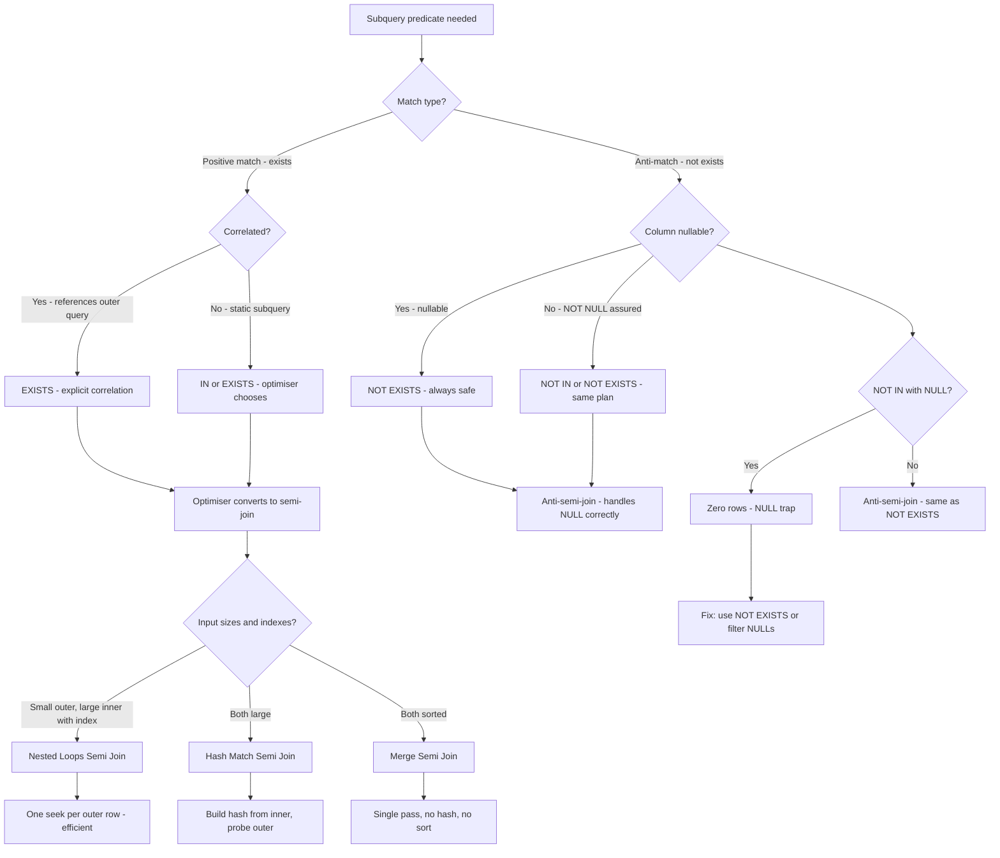

## Navigation

**Domain:** [[8 — Databases]] > **Group:** SQL Fundamentals
**Previous:** [[8.087 — BETWEEN — Range Queries]] | **Next:** [[8.089 — Aliases — Table and Column Aliasing]]

### Prerequisites

- [[8.067 — WHERE Clause — Predicate Logic and SARGability]] — EXISTS and IN are WHERE predicates; understanding seek vs scan, residual predicates, and SARGability is required to evaluate when each performs better.
- [[8.082 — Null Handling — ISNULL, COALESCE, NULLIF]] — The critical difference between NOT EXISTS and NOT IN is NULL handling. NOT IN has the NULL trap (returns zero rows if any NULL exists in the subquery). Understanding three-valued logic (TRUE, FALSE, UNKNOWN) is essential.
- [[8.086 — IN and NOT IN — Set Membership and NULL Trap]] — IN with subquery is closely related to EXISTS; this note compares them directly and explains when the optimiser converts IN to EXISTS and vice versa.

### Where This Fits

EXISTS and IN are the two primary T-SQL operators for set-based filtering with subqueries. Every .NET backend engineer encounters this choice in existence checks (`Any()` vs `Contains()`), anti-join patterns (`!Any()` vs `!Contains()`), and correlated subquery performance tuning. The common belief that "EXISTS is always faster than IN" is outdated — modern optimisers (SQL Server 2016+, PostgreSQL 10+) often convert IN subqueries to semi-joins that are identical to EXISTS plans. The real performance difference appears in: (1) correlated subqueries where EXISTS can short-circuit per outer row, (2) NOT IN vs NOT EXISTS where NULL handling differs, and (3) very large subquery result sets where the semi-join operator choice (Nested Loops vs Hash Match vs Merge) determines performance. Interviewers use this question to test execution plan reading (ability to identify semi-join vs anti-semi-join operators), NULL handling knowledge, and practical experience tuning correlated vs uncorrelated subqueries. The most expensive mistake: using NOT IN in a production anti-join when the subquery column is nullable, causing silent zero-row results that propagate incorrect data to downstream systems for months.

---

## Core Mental Model

EXISTS and IN are logically equivalent for positive set membership but execute differently. `EXISTS (subquery)` returns TRUE as soon as the subquery returns any row — it is a short-circuiting existence check. The optimiser converts EXISTS to a semi-join: for each outer row, it probes the inner set and stops scanning the inner side as soon as one match is found. `IN (subquery)` is semantically a set membership test: `outer.col IN (SELECT inner.col FROM ...)`. The optimiser typically converts IN subqueries to semi-joins as well — in modern SQL Server, IN and EXISTS often produce identical execution plans with identical operators. The critical difference is in the anti-join case: `NOT EXISTS` uses an anti-semi-join that correctly handles NULLs, while `NOT IN` uses a regular anti-join that returns zero rows if any NULL exists in the subquery result. The mental model is: EXISTS is a short-circuiting semi-join (stops on first match per outer row), IN is a set membership test that the optimiser rewrites to a semi-join when possible. For NOT EXISTS vs NOT IN, always choose NOT EXISTS — it is semantically correct and performs identically or better.

### Classification

EXISTS is a **subquery predicate** that tests for the existence of rows. IN is a **set membership predicate** that tests whether a value belongs to a set. Both are classified as **semi-join** predicates in the optimiser — they return rows from the outer query when at least one matching row exists in the inner query, without returning any columns from the inner query. EXISTS is always a semi-join; IN with a subquery is converted to a semi-join by the optimiser. NOT EXISTS is an **anti-semi-join**; NOT IN is also an anti-semi-join but with the NULL-intolerance trap. EXISTS is **SARGable** when the correlated predicate uses an indexed column. IN is **SARGable** because it OR-expands to equality predicates or converts to a semi-join with indexed inner column.



### Key Properties

|Property|EXISTS|IN (subquery)|NOT EXISTS|NOT IN|
|---|---|---|---|---|
|Semantics|At least one row exists|Value in subquery set|No row exists|Value not in subquery set|
|Optimiser form|Semi-join (always)|Semi-join (converted)|Anti-semi-join (always)|Anti-semi-join (converted)|
|NULL in subquery|Handled correctly|Ignored for match|Handled correctly|Zero rows returned|
|SARGable|Depends on correlation predicate|Yes (OR-expanded or semi-join)|Depends on correlation predicate|Yes (if no NULLs)|
|Short-circuit|Yes — stops at first match per outer row|No — evaluates entire set|Yes — stops at first match per outer row|No — evaluates entire set|
|Correlation|Explicit and natural|Implicit (inner references outer)|Explicit and natural|Implicit|
|EF Core|`Any()` → EXISTS|`Contains()` → IN|`!Any()` → NOT EXISTS|No direct translation|
|Write Cost|None|None|None|None|

---

## Deep Mechanics

### How the Engine Executes This

1. **Parsing** — The parser identifies the subquery type:
   - `EXISTS (SELECT ...)`: parsed as an existence predicate. The SELECT list is irrelevant — `SELECT 1`, `SELECT *`, `SELECT NULL` all behave identically. The optimiser ignores the SELECT list for EXISTS.
   - `col IN (SELECT ...)`: parsed as a set membership predicate. The optimiser notes the correlation between `col` and the subquery output column.
   - `NOT EXISTS (SELECT ...)` and `col NOT IN (SELECT ...)`: parsed as negation forms.

2. **Binding (Algebrizer)** — The algebrizer resolves column references and detects correlation:
   - For EXISTS, the WHERE clause of the subquery may reference outer query columns. This is explicit correlation.
   - For IN, the outer column `col` is implicitly correlated with the subquery's output column. The algebrizer creates a correlation between them.
   - The algebrizer also validates that the subquery SELECT list is compatible with the outer column type for IN.

3. **Normalisation and simplification** — The optimiser applies transformations:
   - `EXISTS (SELECT ... WHERE inner.col = outer.col)` is normalised to a semi-join between outer and inner on `inner.col = outer.col`.
   - `IN (SELECT inner.col FROM ...)` is also normalised to a semi-join on `outer.col = inner.col`.
   - The optimiser may convert `IN` subquery to `EXISTS` during cost-based optimisation if it estimates the EXISTS form is cheaper. Conversely, it may convert `EXISTS` to `IN` if the subquery is uncorrelated and the IN form enables a hash match.
   - For NOT EXISTS and NOT IN: normalised to anti-semi-join. The anti-semi-join returns outer rows where no inner match exists. The key difference: NOT IN with NULL in the inner set triggers special NULL-intolerance logic that filters ALL outer rows.

4. **Cardinality estimation and join selection** — The optimiser estimates row counts and chooses a physical join operator:
   - **Nested Loops Semi Join**: Best when the outer input is small and the inner input has a usable index. Cost: `|outer| × (log|inner|)`. Each outer row probes the inner index once, stopping at the first match.
   - **Hash Match Semi Join**: Best when both inputs are large and no index exists for the inner side. Cost: build hash table from inner (`O(|inner|)`) + probe outer (`O(|outer|)`). Cannot be used for anti-semi-join with NOT IN when NULLs exist (must handle NULL-intolerance).
   - **Merge Semi Join**: Best when both inputs are sorted on the join column. Cost: `O(|outer| + |inner|)`. Single pass through both sorted inputs.

5. **Execution** — Physical execution:
   - **Nested Loops Semi Join**: For each outer row, find the first matching inner row. If found, output the outer row and move to the next outer row. Do not continue scanning inner after the first match. This is the short-circuit behaviour.
   - **Hash Match Semi Join**: Build a hash table from the inner subquery result (all rows). Then scan the outer input, probing the hash table for each row. If a match is found, output the outer row. For NOT EXISTS (anti-semi-join), output outer rows that do NOT find a match in the hash table.
   - **Merge Semi Join**: Both inputs sorted. Advance both cursors. When outer key matches inner key, output outer row and advance outer cursor only (skip all matching inner rows). For anti-semi-join: output outer rows where no inner match is found.

6. **NULL handling in NOT EXISTS vs NOT IN**:
   - `NOT EXISTS (SELECT 1 FROM inner WHERE inner.col = outer.col)`: If `inner.col` is NULL for some rows, the comparison `inner.col = outer.col` evaluates to UNKNOWN for those rows. NOT EXISTS checks if ANY row matches — UNKNOWN is not a match, so the anti-semi-join correctly returns the outer row.
   - `outer.col NOT IN (SELECT inner.col FROM inner)`: Expands to `outer.col <> inner.col1 AND outer.col <> inner.col2 AND ...`. If any `inner.col` value is NULL, that comparison becomes `outer.col <> NULL` → UNKNOWN. The entire AND chain becomes UNKNOWN → outer row filtered out. All rows are filtered if even one NULL exists in the inner set.

### SQL Visibility

```sql
-- EXISTS — explicit correlation, semi-join
SELECT c.CustomerId, c.FirstName, c.LastName, c.Email
FROM dbo.Customers AS c
WHERE EXISTS (
    SELECT 1
    FROM dbo.Orders AS o
    WHERE o.CustomerId = c.CustomerId
      AND o.TotalAmount > 1000
);

-- IN with subquery — converted to semi-join
SELECT c.CustomerId, c.FirstName, c.LastName, c.Email
FROM dbo.Customers AS c
WHERE c.CustomerId IN (
    SELECT o.CustomerId
    FROM dbo.Orders AS o
    WHERE o.TotalAmount > 1000
);

-- NOT EXISTS — safe anti-join (handles NULLs)
SELECT c.CustomerId, c.FirstName, c.LastName
FROM dbo.Customers AS c
WHERE NOT EXISTS (
    SELECT 1
    FROM dbo.Orders AS o
    WHERE o.CustomerId = c.CustomerId
);

-- NOT IN — dangerous anti-join (NULL trap)
-- ❌ If any Order has NULL CustomerId, returns zero rows
SELECT c.CustomerId, c.FirstName, c.LastName
FROM dbo.Customers AS c
WHERE c.CustomerId NOT IN (
    SELECT o.CustomerId
    FROM dbo.Orders AS o
);

-- Safe NOT IN (guarantee no NULLs)
SELECT c.CustomerId, c.FirstName, c.LastName
FROM dbo.Customers AS c
WHERE c.CustomerId NOT IN (
    SELECT o.CustomerId
    FROM dbo.Orders AS o
    WHERE o.CustomerId IS NOT NULL
);

-- EXISTS with uncorrelated subquery (static set)
SELECT o.OrderId, o.CustomerId, o.TotalAmount
FROM dbo.Orders AS o
WHERE EXISTS (
    SELECT 1
    FROM dbo.Products AS p
    WHERE p.CategoryId = 5  -- No outer reference
);
-- Returns ALL orders if ANY product in category 5 exists
-- Different semantics from IN! This is a common mistake.
```

```csharp
// EF Core — Any() translates to EXISTS
var highValueCustomers = await dbContext.Customers
    .Where(c => c.Orders.Any(o => o.TotalAmount > 1000))
    .Select(c => new { c.CustomerId, c.FirstName, c.LastName, c.Email })
    .ToListAsync(cancellationToken);

// EF Core — Contains() translates to IN with subquery
var highValueCustomers2 = await dbContext.Customers
    .Where(c => dbContext.Orders
        .Where(o => o.TotalAmount > 1000)
        .Select(o => o.CustomerId)
        .Contains(c.CustomerId))
    .Select(c => new { c.CustomerId, c.FirstName, c.LastName, c.Email })
    .ToListAsync(cancellationToken);

// EF Core — !Any() translates to NOT EXISTS (SAFE)
var customersWithoutOrders = await dbContext.Customers
    .Where(c => !c.Orders.Any())
    .Select(c => new { c.CustomerId, c.FirstName, c.LastName })
    .ToListAsync(cancellationToken);

// EF Core — Contains with a list translates to IN with literals
var statuses = new[] { "Shipped", "Delivered" };
var ordersByStatus = await dbContext.Orders
    .Where(o => statuses.Contains(o.Status))
    .ToListAsync(cancellationToken);
```

**Generated SQL (from EF Core logs):**

```sql
-- Any() → EXISTS:
SELECT [c].[CustomerId], [c].[FirstName], [c].[LastName], [c].[Email]
FROM [Customers] AS [c]
WHERE EXISTS (
    SELECT 1
    FROM [Orders] AS [o]
    WHERE [o].[CustomerId] = [c].[CustomerId]
      AND [o].[TotalAmount] > 1000.0
);

-- Contains() with subquery → IN:
SELECT [c].[CustomerId], [c].[FirstName], [c].[LastName], [c].[Email]
FROM [Customers] AS [c]
WHERE [c].[CustomerId] IN (
    SELECT [o].[CustomerId]
    FROM [Orders] AS [o]
    WHERE [o].[TotalAmount] > 1000.0
);

-- !Any() → NOT EXISTS:
SELECT [c].[CustomerId], [c].[FirstName], [c].[LastName]
FROM [Customers] AS [c]
WHERE NOT EXISTS (
    SELECT 1
    FROM [Orders] AS [o]
    WHERE [o].[CustomerId] = [c].[CustomerId]
);

-- Contains() with list → IN (literals):
SELECT [o].[OrderId], [o].[CustomerId], [o].[Status]
FROM [Orders] AS [o]
WHERE [o].[Status] IN (N'Shipped', N'Delivered');
```

Note: EF Core NEVER generates `NOT IN`. It always uses `NOT EXISTS` for negation patterns, which is the safe choice.

### Execution Plan Analysis

**EXISTS with correlated subquery (small Customers table, large Orders table with index):**

```
[Nested Loops Semi Join]
  Outer: [Clustered Index Scan Customers] (5K rows)
  Inner: [Index Seek IX_Orders_CustomerId]
         Seek Predicates: [Orders].CustomerId = [Customers].CustomerId
         Residual Predicate: [Orders].TotalAmount > 1000
  Semi-join: returns Customer row on first match per CustomerId
  Stops scanning inner Orders after first match per outer row
→ [SELECT]
Estimated Cost: ~0.5  |  Logical Reads: ~15 (Customers) + ~5K seeks (Orders)
```

**IN with subquery (same query, converted to same semi-join):**

```
[Nested Loops Semi Join]
  Outer: [Clustered Index Scan Customers]
  Inner: [Index Seek IX_Orders_CustomerId]
         Seek Predicates: [Orders].CustomerId = [Customers].CustomerId
         Residual Predicate: [Orders].TotalAmount > 1000
→ [SELECT]
Estimated Cost: ~0.5  |  Logical Reads: ~15 + ~5K
-- IDENTICAL plan to EXISTS. The optimiser converted IN to semi-join.
```

**IN with subquery (no index on inner join column — Hash Match):**

```
[Hash Match Semi Join]
  Build: [Clustered Index Scan Orders]
         (5M rows, builds hash table on CustomerId)
  Probe: [Clustered Index Scan Customers]
         (5K rows, probes hash table)
→ [SELECT]
Estimated Cost: ~15  |  Logical Reads: ~18,500 (both scans)
-- No index on Orders.CustomerId — Hash Match builds hash from all 5M orders
```

**NOT EXISTS (anti-semi-join, correct with NULLs):**

```
[Anti Semi Join — Nested Loops]
  Outer: [Clustered Index Scan Customers]
  Inner: [Index Seek IX_Orders_CustomerId]
         Seek Predicates: [Orders].CustomerId = [Customers].CustomerId
  Anti-semi-join: returns Customer row when NO match found in Orders
  Handles NULLs correctly: if Orders.CustomerId IS NULL, it doesn't match,
  so the Customer IS returned (correct anti-join behavior)
→ [SELECT]
```

**NOT IN with NULLs in subquery (broken anti-join):**

```
[Clustered Index Scan Customers] → [Filter] → [SELECT]
-- The Filter evaluates NOT IN. If any NULL from subquery:
-- All rows filtered out (UNKNOWN for every row)
-- The plan looks normal but returns 0 rows
-- NO operator specifically warns about the NULL trap
```

### Cost Visibility

```sql
SET STATISTICS IO ON;
SET STATISTICS TIME ON;

-- EXISTS — correlated subquery
SELECT c.CustomerId, c.FirstName
FROM dbo.Customers AS c
WHERE EXISTS (
    SELECT 1
    FROM dbo.Orders AS o
    WHERE o.CustomerId = c.CustomerId
      AND o.TotalAmount > 1000
);

-- Expected output:
-- Table 'Orders'. Scan count 1, logical reads 15
-- Table 'Customers'. Scan count 1, logical reads 145
-- SQL Server Execution Times: CPU time = 15ms, elapsed time = 32ms

-- IN — same query, same plan (when indices exist)
SELECT c.CustomerId, c.FirstName
FROM dbo.Customers AS c
WHERE c.CustomerId IN (
    SELECT o.CustomerId
    FROM dbo.Orders AS o
    WHERE o.TotalAmount > 1000
);

-- Expected output (identical):
-- Table 'Orders'. Scan count 1, logical reads 15
-- Table 'Customers'. Scan count 1, logical reads 145
-- SQL Server Execution Times: CPU time = 15ms, elapsed time = 32ms

-- NOT EXISTS — anti-semi-join (safe)
SELECT c.CustomerId, c.FirstName
FROM dbo.Customers AS c
WHERE NOT EXISTS (
    SELECT 1
    FROM dbo.Orders AS o
    WHERE o.CustomerId = c.CustomerId
);

-- Expected output:
-- Table 'Orders'. Scan count 1, logical reads 12450
-- Table 'Customers'. Scan count 1, logical reads 145
-- SQL Server Execution Times: CPU time = 45ms, elapsed time = 120ms

-- NOT IN — dangerous if NULLs exist
SELECT c.CustomerId, c.FirstName
FROM dbo.Customers AS c
WHERE c.CustomerId NOT IN (
    SELECT o.CustomerId
    FROM dbo.Orders AS o
);

-- Expected output (if any Orders.CustomerId is NULL):
-- Table 'Orders'. Scan count 1, logical reads 12450
-- Table 'Customers'. Scan count 1, logical reads 145
-- (Rows returned: 0 — silent failure!)
```

### Failure Modes

**NOT IN NULL trap — zero rows returned:** The most dangerous failure mode. A subquery returning a single NULL in any row causes NOT IN to return zero rows. The query completes without error, generates logical reads, but returns nothing. Detect with:

```sql
-- Check for NULLs in the subquery column
SELECT COUNT(*) AS TotalRows,
       COUNT(CustomerId) AS NonNull,
       COUNT(*) - COUNT(CustomerId) AS NullRows
FROM dbo.Orders;

-- If NullRows > 0, NOT IN will return zero rows
```

**Uncorrelated EXISTS — unintended all-or-nothing:** Using EXISTS without correlating it to the outer query. `EXISTS (SELECT 1 FROM Products WHERE CategoryId = 5)` returns TRUE if ANY product in category 5 exists. When placed in a WHERE clause, it evaluates to TRUE for every outer row, returning ALL rows or NO rows. This is almost always a bug.

**EXISTS with TOP or ORDER BY — misleading intent:** `EXISTS (SELECT TOP 1 ... ORDER BY ...)` suggests the TOP is needed, but EXISTS evaluates the entire subquery regardless of TOP until a match is found. The optimiser ignores TOP in EXISTS subqueries. The ORDER BY is also ignored because which row is found first is irrelevant for existence.

**Large IN list with subquery — plan regression:** When an IN subquery returns millions of rows, the optimiser may choose to scan + hash the outer table against a large hash table. This can be more expensive than a Nested Loops semi-join with an index. Monitor with `sys.dm_exec_query_stats` for plan changes after data growth.

---

## Production Patterns and Implementation

### Primary SQL Implementation

```sql
-- ============================================================
-- Schema context
-- ============================================================
CREATE TABLE dbo.Customers
(
    CustomerId   INT            NOT NULL IDENTITY(1,1),
    FirstName    NVARCHAR(100)  NOT NULL,
    LastName     NVARCHAR(100)  NOT NULL,
    Email        NVARCHAR(256)  NOT NULL,
    Status       VARCHAR(20)    NOT NULL DEFAULT 'Active',
    CreatedAt    DATETIME2(0)   NOT NULL DEFAULT SYSUTCDATETIME(),
    CONSTRAINT PK_Customers PRIMARY KEY CLUSTERED (CustomerId)
);

CREATE TABLE dbo.Orders
(
    OrderId      INT            NOT NULL IDENTITY(1,1),
    CustomerId   INT            NOT NULL,
    OrderDate    DATETIME2(0)   NOT NULL,
    Status       VARCHAR(20)    NOT NULL DEFAULT 'Pending',
    TotalAmount  DECIMAL(18,2)  NOT NULL,
    CreatedAt    DATETIME2(0)   NOT NULL DEFAULT SYSUTCDATETIME(),
    CONSTRAINT PK_Orders PRIMARY KEY CLUSTERED (OrderId)
);

CREATE TABLE dbo.Products
(
    ProductId    INT            NOT NULL IDENTITY(1,1),
    ProductName  NVARCHAR(200)  NOT NULL,
    CategoryId   INT            NOT NULL,
    UnitPrice    DECIMAL(18,2)  NOT NULL,
    StockQty     INT            NOT NULL DEFAULT 0,
    CONSTRAINT PK_Products PRIMARY KEY CLUSTERED (ProductId)
);

CREATE TABLE dbo.OrderItems
(
    OrderItemId  INT            NOT NULL IDENTITY(1,1),
    OrderId      INT            NOT NULL,
    ProductId    INT            NOT NULL,
    Quantity     INT            NOT NULL,
    UnitPrice    DECIMAL(18,2)  NOT NULL,
    CONSTRAINT PK_OrderItems PRIMARY KEY CLUSTERED (OrderItemId)
);

CREATE INDEX IX_Orders_CustomerId ON dbo.Orders (CustomerId) INCLUDE (OrderDate, TotalAmount, Status);
CREATE INDEX IX_OrderItems_ProductId ON dbo.OrderItems (ProductId) INCLUDE (OrderId, Quantity);
CREATE INDEX IX_OrderItems_OrderId ON dbo.OrderItems (OrderId) INCLUDE (ProductId, Quantity, UnitPrice);

-- ============================================================
-- Pattern 1: EXISTS — correlated subquery (semi-join)
-- Find customers who have placed high-value orders
-- ============================================================
SELECT c.CustomerId, c.FirstName, c.LastName, c.Email
FROM dbo.Customers AS c
WHERE EXISTS (
    SELECT 1
    FROM dbo.Orders AS o
    WHERE o.CustomerId = c.CustomerId
      AND o.TotalAmount >= 5000
)
ORDER BY c.LastName, c.FirstName;

-- ============================================================
-- Pattern 2: IN with subquery — equivalent to EXISTS when converted
-- ============================================================
SELECT c.CustomerId, c.FirstName, c.LastName, c.Email
FROM dbo.Customers AS c
WHERE c.CustomerId IN (
    SELECT o.CustomerId
    FROM dbo.Orders AS o
    WHERE o.TotalAmount >= 5000
)
ORDER BY c.LastName, c.FirstName;

-- ============================================================
-- Pattern 3: NOT EXISTS — safe anti-join (recommended)
-- Find customers with no orders at all
-- ============================================================
SELECT c.CustomerId, c.FirstName, c.LastName, c.Email
FROM dbo.Customers AS c
WHERE NOT EXISTS (
    SELECT 1
    FROM dbo.Orders AS o
    WHERE o.CustomerId = c.CustomerId
)
ORDER BY c.LastName, c.FirstName;

-- ============================================================
-- Pattern 4: NOT IN — only when NULL is guaranteed absent
-- ============================================================
SELECT c.CustomerId, c.FirstName, c.LastName, c.Email
FROM dbo.Customers AS c
WHERE c.CustomerId NOT IN (
    SELECT o.CustomerId
    FROM dbo.Orders AS o
    WHERE o.CustomerId IS NOT NULL  -- Critical: eliminate NULLs
)
ORDER BY c.LastName, c.FirstName;

-- ============================================================
-- Pattern 5: EXISTS with multiple conditions (correlated)
-- Find customers who have ordered ALL products in category 5
-- ============================================================
SELECT c.CustomerId, c.FirstName, c.LastName
FROM dbo.Customers AS c
WHERE NOT EXISTS (
    SELECT 1
    FROM dbo.Products AS p
    WHERE p.CategoryId = 5
      AND NOT EXISTS (
          SELECT 1
          FROM dbo.Orders AS o
          INNER JOIN dbo.OrderItems AS oi ON o.OrderId = oi.OrderId
          WHERE o.CustomerId = c.CustomerId
            AND oi.ProductId = p.ProductId
      )
);
-- Relational division: customer has ordered every product in category 5
-- Double NOT EXISTS: no product in category 5 that customer hasn't ordered

-- ============================================================
-- Pattern 6: EXISTS with aggregation — more efficient than COUNT(*)
-- Find customers with more than 5 orders
-- ============================================================
SELECT c.CustomerId, c.FirstName, c.LastName
FROM dbo.Customers AS c
WHERE (
    SELECT COUNT(*)
    FROM dbo.Orders AS o
    WHERE o.CustomerId = c.CustomerId
) > 5;
-- ⚠ COUNT(*) in subquery evaluates ALL matching orders
-- Better: EXISTS with a counter approach (not possible in pure SQL)
-- Alternative: use GROUP BY and HAVING

SELECT c.CustomerId, c.FirstName, c.LastName, COUNT(*) AS OrderCount
FROM dbo.Customers AS c
INNER JOIN dbo.Orders AS o ON c.CustomerId = o.CustomerId
GROUP BY c.CustomerId, c.FirstName, c.LastName
HAVING COUNT(*) > 5;

-- ============================================================
-- Pattern 7: EXISTS with hard-coded TRUE/FALSE (uncorrelated)
-- ⚠ WARNING: This returns ALL rows if condition is TRUE
-- ============================================================
-- "Return all customers if any order exceeds $100,000"
SELECT c.CustomerId, c.FirstName, c.LastName
FROM dbo.Customers AS c
WHERE EXISTS (
    SELECT 1
    FROM dbo.Orders AS o
    WHERE o.TotalAmount > 100000
);
-- If ANY order exceeds $100K: returns ALL customers
-- If NO order exceeds $100K: returns NO customers
-- This is intentional for guard-rail queries, not row-level filtering

-- ============================================================
-- Pattern 8: IN with static list (NOT a subquery — pure set membership)
-- ============================================================
SELECT o.OrderId, o.CustomerId, o.Status, o.TotalAmount
FROM dbo.Orders AS o
WHERE o.Status IN ('Shipped', 'Delivered', 'InTransit');
-- This is IN with a literal list, not a subquery
-- Different from EXISTS — no subquery involved

-- ============================================================
-- Pattern 9: Multi-level EXISTS for hierarchical filtering
-- Find customers who ordered products that are in the same category
-- as their first order's first product
-- ============================================================
SELECT DISTINCT c.CustomerId, c.FirstName, c.LastName
FROM dbo.Customers AS c
WHERE EXISTS (
    SELECT 1
    FROM dbo.Orders AS o
    WHERE o.CustomerId = c.CustomerId
      AND EXISTS (
          SELECT 1
          FROM dbo.OrderItems AS oi
          WHERE oi.OrderId = o.OrderId
            AND EXISTS (
                SELECT 1
                FROM dbo.Products AS p
                WHERE p.ProductId = oi.ProductId
                  AND p.CategoryId = 10
            )
      )
);
```

### EF Core Implementation

```csharp
public class ApplicationDbContext : DbContext
{
    public DbSet<Customer> Customers => Set<Customer>();
    public DbSet<Order> Orders => Set<Order>();
    public DbSet<Product> Products => Set<Product>();
    public DbSet<OrderItem> OrderItems => Set<OrderItem>();

    protected override void OnModelCreating(ModelBuilder modelBuilder)
    {
        modelBuilder.Entity<Customer>(entity =>
        {
            entity.ToTable("Customers");
            entity.HasKey(c => c.CustomerId);
            entity.Property(c => c.FirstName).HasMaxLength(100);
            entity.Property(c => c.LastName).HasMaxLength(100);
            entity.Property(c => c.Email).HasMaxLength(256);
        });

        modelBuilder.Entity<Order>(entity =>
        {
            entity.ToTable("Orders");
            entity.HasKey(o => o.OrderId);
            entity.Property(o => o.TotalAmount).HasColumnType("decimal(18,2)");
            entity.Property(o => o.Status).HasMaxLength(20);
            entity.HasOne(o => o.Customer)
                  .WithMany(c => c.Orders)
                  .HasForeignKey(o => o.CustomerId);
            entity.HasIndex(o => o.CustomerId);
        });

        modelBuilder.Entity<Product>(entity =>
        {
            entity.ToTable("Products");
            entity.HasKey(p => p.ProductId);
            entity.Property(p => p.ProductName).HasMaxLength(200);
            entity.Property(p => p.UnitPrice).HasColumnType("decimal(18,2)");
        });

        modelBuilder.Entity<OrderItem>(entity =>
        {
            entity.ToTable("OrderItems");
            entity.HasKey(oi => oi.OrderItemId);
            entity.HasOne(oi => oi.Order)
                  .WithMany(o => o.OrderItems)
                  .HasForeignKey(oi => oi.OrderId);
            entity.HasOne(oi => oi.Product)
                  .WithMany()
                  .HasForeignKey(oi => oi.ProductId);
            entity.HasIndex(oi => oi.ProductId);
            entity.HasIndex(oi => oi.OrderId);
        });
    }
}

public class Customer
{
    public int CustomerId { get; set; }
    public string FirstName { get; set; } = string.Empty;
    public string LastName { get; set; } = string.Empty;
    public string Email { get; set; } = string.Empty;
    public string Status { get; set; } = "Active";
    public DateTime CreatedAt { get; set; }
    public List<Order> Orders { get; set; } = new();
}

public class Order
{
    public int OrderId { get; set; }
    public int CustomerId { get; set; }
    public DateTime OrderDate { get; set; }
    public string Status { get; set; } = "Pending";
    public decimal TotalAmount { get; set; }
    public DateTime CreatedAt { get; set; }
    public Customer Customer { get; set; } = null!;
    public List<OrderItem> OrderItems { get; set; } = new();
}

public class Product
{
    public int ProductId { get; set; }
    public string ProductName { get; set; } = string.Empty;
    public int CategoryId { get; set; }
    public decimal UnitPrice { get; set; }
    public int StockQty { get; set; }
}

public class OrderItem
{
    public int OrderItemId { get; set; }
    public int OrderId { get; set; }
    public int ProductId { get; set; }
    public int Quantity { get; set; }
    public decimal UnitPrice { get; set; }
    public Order Order { get; set; } = null!;
    public Product Product { get; set; } = null!;
}

// Pattern 1: Any() → EXISTS — correlated semi-join
public async Task<List<Customer>> GetHighValueCustomersAsync(
    decimal threshold,
    CancellationToken cancellationToken = default)
{
    return await dbContext.Customers
        .Where(c => c.Orders.Any(o => o.TotalAmount >= threshold))
        .OrderBy(c => c.LastName)
        .ThenBy(c => c.FirstName)
        .Select(c => new Customer
        {
            CustomerId = c.CustomerId,
            FirstName = c.FirstName,
            LastName = c.LastName,
            Email = c.Email
        })
        .ToListAsync(cancellationToken);
    // Generated: WHERE EXISTS (SELECT 1 FROM [Orders] ...)
}

// Pattern 2: Contains() → IN with subquery
public async Task<List<Customer>> GetHighValueCustomersInAsync(
    decimal threshold,
    CancellationToken cancellationToken = default)
{
    return await dbContext.Customers
        .Where(c => dbContext.Orders
            .Where(o => o.TotalAmount >= threshold)
            .Select(o => o.CustomerId)
            .Contains(c.CustomerId))
        .OrderBy(c => c.LastName)
        .ThenBy(c => c.FirstName)
        .Select(c => new Customer
        {
            CustomerId = c.CustomerId,
            FirstName = c.FirstName,
            LastName = c.LastName,
            Email = c.Email
        })
        .ToListAsync(cancellationToken);
    // Generated: WHERE [c].[CustomerId] IN (SELECT [o].[CustomerId] ...)
}

// Pattern 3: !Any() → NOT EXISTS — safe anti-join
public async Task<List<Customer>> GetCustomersWithoutOrdersAsync(
    CancellationToken cancellationToken = default)
{
    return await dbContext.Customers
        .Where(c => !c.Orders.Any())
        .OrderBy(c => c.LastName)
        .ThenBy(c => c.FirstName)
        .Select(c => new Customer
        {
            CustomerId = c.CustomerId,
            FirstName = c.FirstName,
            LastName = c.LastName,
            Email = c.Email
        })
        .ToListAsync(cancellationToken);
    // Generated: WHERE NOT EXISTS (SELECT 1 FROM [Orders] ...)
    // Safe! NOT EXISTS, NOT NOT IN
}

// Pattern 4: Nested Any() — multi-level existence
public async Task<List<Customer>> GetCustomersWhoOrderedCategoryAsync(
    int categoryId,
    CancellationToken cancellationToken = default)
{
    return await dbContext.Customers
        .Where(c => c.Orders.Any(o =>
            o.OrderItems.Any(oi =>
                oi.Product.CategoryId == categoryId)))
        .Select(c => new Customer
        {
            CustomerId = c.CustomerId,
            FirstName = c.FirstName,
            LastName = c.LastName
        })
        .ToListAsync(cancellationToken);
    // Generated: Three-level EXISTS nesting
    // WHERE EXISTS (SELECT 1 FROM [Orders] WHERE [CustomerId] = ...
    //   AND EXISTS (SELECT 1 FROM [OrderItems] WHERE ...))
}

// Pattern 5: All products in category — relational division via !Any()
public async Task<List<Customer>> GetCustomersWhoOrderedAllInCategoryAsync(
    int categoryId,
    CancellationToken cancellationToken = default)
{
    var productsInCategory = dbContext.Products
        .Where(p => p.CategoryId == categoryId);

    return await dbContext.Customers
        .Where(c => !productsInCategory
            .Where(p => !c.Orders.Any(o =>
                o.OrderItems.Any(oi => oi.ProductId == p.ProductId)))
            .Any())
        .Select(c => new Customer
        {
            CustomerId = c.CustomerId,
            FirstName = c.FirstName,
            LastName = c.LastName
        })
        .ToListAsync(cancellationToken);
    // No customer for whom a product in category exists that they haven't ordered
    // Not the most readable, but correctly translates to double NOT EXISTS
}

// Pattern 6: Contains() with list — IN with literals
public async Task<List<Order>> GetOrdersByStatusAsync(
    string[] statuses,
    CancellationToken cancellationToken = default)
{
    return await dbContext.Orders
        .Where(o => statuses.Contains(o.Status))
        .OrderByDescending(o => o.OrderDate)
        .ToListAsync(cancellationToken);
    // Generated: WHERE [o].[Status] IN (N'Shipped', N'Delivered', ...)
}
```

### Dapper Implementation

```csharp
public sealed class OrderRepository
{
    private readonly IDbConnectionFactory _connectionFactory;

    public OrderRepository(IDbConnectionFactory connectionFactory)
        => _connectionFactory = connectionFactory;

    // Pattern 1: EXISTS correlated subquery
    public async Task<IReadOnlyList<Customer>> GetHighValueCustomersAsync(
        decimal threshold,
        CancellationToken cancellationToken = default)
    {
        const string sql = @"
            SELECT c.CustomerId, c.FirstName, c.LastName, c.Email
            FROM dbo.Customers AS c
            WHERE EXISTS (
                SELECT 1
                FROM dbo.Orders AS o
                WHERE o.CustomerId = c.CustomerId
                  AND o.TotalAmount >= @Threshold
            )
            ORDER BY c.LastName, c.FirstName;";

        await using var connection = _connectionFactory.Create();

        var results = await connection.QueryAsync<Customer>(
            new CommandDefinition(sql,
                new { Threshold = threshold },
                cancellationToken: cancellationToken));

        return results.AsList();
    }

    // Pattern 2: IN with subquery
    public async Task<IReadOnlyList<Customer>> GetHighValueCustomersInAsync(
        decimal threshold,
        CancellationToken cancellationToken = default)
    {
        const string sql = @"
            SELECT c.CustomerId, c.FirstName, c.LastName, c.Email
            FROM dbo.Customers AS c
            WHERE c.CustomerId IN (
                SELECT o.CustomerId
                FROM dbo.Orders AS o
                WHERE o.TotalAmount >= @Threshold
            )
            ORDER BY c.LastName, c.FirstName;";

        await using var connection = _connectionFactory.Create();

        var results = await connection.QueryAsync<Customer>(
            new CommandDefinition(sql,
                new { Threshold = threshold },
                cancellationToken: cancellationToken));

        return results.AsList();
    }

    // Pattern 3: NOT EXISTS — safe anti-join
    public async Task<IReadOnlyList<Customer>> GetCustomersWithoutOrdersAsync(
        CancellationToken cancellationToken = default)
    {
        const string sql = @"
            SELECT c.CustomerId, c.FirstName, c.LastName, c.Email
            FROM dbo.Customers AS c
            WHERE NOT EXISTS (
                SELECT 1
                FROM dbo.Orders AS o
                WHERE o.CustomerId = c.CustomerId
            )
            ORDER BY c.LastName, c.FirstName;";

        await using var connection = _connectionFactory.Create();

        var results = await connection.QueryAsync<Customer>(
            new CommandDefinition(sql,
                cancellationToken: cancellationToken));

        return results.AsList();
    }

    // Pattern 4: IN with static list
    public async Task<IReadOnlyList<Order>> GetOrdersByStatusAsync(
        string[] statuses,
        CancellationToken cancellationToken = default)
    {
        const string sql = @"
            SELECT OrderId, CustomerId, Status, TotalAmount, OrderDate
            FROM dbo.Orders
            WHERE Status IN @Statuses
            ORDER BY OrderDate DESC;";

        await using var connection = _connectionFactory.Create();

        var results = await connection.QueryAsync<Order>(
            new CommandDefinition(sql,
                new { Statuses = statuses },
                cancellationToken: cancellationToken));

        return results.AsList();
    }

    // Pattern 5: Nested EXISTS for multi-level filter
    public async Task<IReadOnlyList<Customer>> GetCustomersWhoOrderedCategoryAsync(
        int categoryId,
        CancellationToken cancellationToken = default)
    {
        const string sql = @"
            SELECT DISTINCT c.CustomerId, c.FirstName, c.LastName
            FROM dbo.Customers AS c
            WHERE EXISTS (
                SELECT 1
                FROM dbo.Orders AS o
                WHERE o.CustomerId = c.CustomerId
                  AND EXISTS (
                      SELECT 1
                      FROM dbo.OrderItems AS oi
                      INNER JOIN dbo.Products AS p ON oi.ProductId = p.ProductId
                      WHERE oi.OrderId = o.OrderId
                        AND p.CategoryId = @CategoryId
                  )
            )
            ORDER BY c.LastName, c.FirstName;";

        await using var connection = _connectionFactory.Create();

        var results = await connection.QueryAsync<Customer>(
            new CommandDefinition(sql,
                new { CategoryId = categoryId },
                cancellationToken: cancellationToken));

        return results.AsList();
    }
}

public record Customer(int CustomerId, string FirstName, string LastName, string Email);
public record Order(int OrderId, int CustomerId, string Status, decimal TotalAmount, DateTime OrderDate);
```

### Configuration and Wiring

```csharp
// Program.cs
builder.Services.AddDbContext<ApplicationDbContext>(options =>
    options.UseSqlServer(
        builder.Configuration.GetConnectionString("DefaultConnection"),
        sqlOptions =>
        {
            sqlOptions.EnableRetryOnFailure(3);
            sqlOptions.CommandTimeout(30);
        }));

builder.Services.AddSingleton<IDbConnectionFactory>(sp =>
    new SqlConnectionFactory(
        builder.Configuration.GetConnectionString("DefaultConnection")!));

builder.Services.AddScoped<OrderRepository>();
```

### SQL Server vs PostgreSQL Differences

```sql
-- PostgreSQL: EXISTS works identically
SELECT * FROM customers c
WHERE EXISTS (SELECT 1 FROM orders o WHERE o.customer_id = c.customer_id);

-- PostgreSQL: IN with subquery works identically
SELECT * FROM customers c
WHERE c.customer_id IN (SELECT o.customer_id FROM orders o);

-- PostgreSQL: NOT EXISTS is the safe anti-join (same)
SELECT * FROM customers c
WHERE NOT EXISTS (SELECT 1 FROM orders o WHERE o.customer_id = c.customer_id);

-- PostgreSQL: NOT IN has the SAME NULL trap
SELECT * FROM customers c
WHERE c.customer_id NOT IN (SELECT o.customer_id FROM orders o);
-- Zero rows if any NULL in orders.customer_id!

-- PostgreSQL: IN with ARRAY (alternative syntax, no subquery)
SELECT * FROM customers
WHERE customer_id = ANY (ARRAY[1, 2, 3]);

-- PostgreSQL: IN with ARRAY subquery
SELECT * FROM customers
WHERE customer_id = ANY (ARRAY(SELECT customer_id FROM orders));

-- PostgreSQL: LATERAL join — similar to correlated subquery
SELECT c.customer_id, c.first_name
FROM customers c
WHERE EXISTS (
    SELECT 1 FROM orders o
    WHERE o.customer_id = c.customer_id
);
-- LATERAL alternative:
SELECT c.customer_id, c.first_name
FROM customers c,
LATERAL (SELECT 1 FROM orders o WHERE o.customer_id = c.customer_id LIMIT 1) AS ex;
-- Less common but same performance
```

---

## Gotchas and Production Pitfalls

### NOT IN With Nullable Column — Silent Zero Rows

**Pitfall:** Using `NOT IN (subquery)` when the subquery column is nullable or can return NULL. This is the single most dangerous NULL-related bug in T-SQL. If even one NULL exists in the subquery result, EVERY outer row is filtered out because `X <> NULL` is UNKNOWN.

```sql
-- ❌ Customers.CustomerId is nullable → ANY NULL causes zero rows
SELECT c.CustomerId, c.FirstName, c.LastName
FROM dbo.Customers AS c
WHERE c.CustomerId NOT IN (
    SELECT o.CustomerId FROM dbo.Orders AS o
);
```

**Symptom:** A customer exclusion query intended to find customers with no orders returns zero rows. The marketing team's campaign targeting "new customers who haven't ordered" sends emails to no one. The campaign is considered failed. An analyst spends 2 days investigating before discovering that 3 orders in the 50M-row Orders table have NULL CustomerId (data entry error from legacy system import).

**Fix:**

```sql
-- ✅ Fix 1: NOT EXISTS (always safe, recommended)
SELECT c.CustomerId, c.FirstName, c.LastName
FROM dbo.Customers AS c
WHERE NOT EXISTS (
    SELECT 1
    FROM dbo.Orders AS o
    WHERE o.CustomerId = c.CustomerId
);

-- ✅ Fix 2: Filter NULLs in subquery
SELECT c.CustomerId, c.FirstName, c.LastName
FROM dbo.Customers AS c
WHERE c.CustomerId NOT IN (
    SELECT o.CustomerId
    FROM dbo.Orders AS o
    WHERE o.CustomerId IS NOT NULL
);
```

**Cost of not fixing:** A batch-delete maintenance job uses `NOT IN` to delete orphaned records: `DELETE FROM Orders WHERE CustomerId NOT IN (SELECT CustomerId FROM Customers)`. A single NULL in `Customers.CustomerId` causes zero orders to be deleted. The orphaned records accumulate over 12 months, consuming 50 GB of storage. When the DBA finally discovers the 500GB database is 10% orphaned data, the cleanup requires a full maintenance window and 4 hours of DELETE operations with transaction log growth to 200 GB.

---

### EXISTS With Uncorrelated Subquery — All or Nothing

**Pitfall:** Using EXISTS with a subquery that does not reference the outer query. `EXISTS (SELECT 1 FROM Products WHERE CategoryId = 5)` evaluates to TRUE if at least one product in category 5 exists — and this TRUE applies to EVERY outer row.

```sql
-- ❌ Intended: customers who have ordered product 1001
SELECT c.CustomerId, c.FirstName
FROM dbo.Customers AS c
WHERE EXISTS (
    SELECT 1
    FROM dbo.Products AS p
    WHERE p.ProductId = 1001  -- No correlation to Customers!
);
-- BUG: Returns ALL customers if product 1001 exists (which it does)
```

**Symptom:** A query intended to find customers who purchased a specific product returns ALL customers. The sales team thinks every customer bought the premium product and sends a targeted upsell campaign to 500,000 customers. Only 5,000 actually bought it. The campaign response rate is 1% instead of the expected 30%, wasting marketing budget.

**Fix:**

```sql
-- ✅ Correlate the subquery to outer query
SELECT c.CustomerId, c.FirstName
FROM dbo.Customers AS c
WHERE EXISTS (
    SELECT 1
    FROM dbo.Orders AS o
    INNER JOIN dbo.OrderItems AS oi ON o.OrderId = oi.OrderId
    WHERE o.CustomerId = c.CustomerId  -- Correlation!
      AND oi.ProductId = 1001
);
```

**Cost of not fixing:** An automated email campaign sends a "You bought X, try Y" recommendation to every customer when only a subset actually qualifies. The irrelevant emails cause a 5% unsubscribe rate. Customer trust degrades. The marketing team loses $50K in customer lifetime value from unsubscribes.

---

### IN Subquery Without Index — Hash Match on Millions of Rows

**Pitfall:** Using IN with a subquery against a large table that has no index on the join column. The optimiser is forced to use Hash Match Semi Join, which scans both tables entirely. The hash table for the inner set must fit in memory — if it doesn't, it spills to tempdb, causing dramatic slowdown.

```sql
-- ❌ No index on Orders.CustomerId — Hash Match scans both tables
SELECT c.CustomerId, c.FirstName, c.LastName
FROM dbo.Customers AS c
WHERE c.CustomerId IN (
    SELECT o.CustomerId
    FROM dbo.Orders AS o
    WHERE o.TotalAmount > 1000
);
```

**Symptom:** The query runs fine on a development database (10K orders) but takes 45 seconds on production (50M orders). The execution plan shows a Hash Match Semi Join with a warning "Hash Spill" in the properties. `sys.dm_os_wait_stats` shows high `PAGEIOLATCH_SH` waits for tempdb.

**Fix:**

```sql
-- ✅ Fix 1: Create index on inner join column
CREATE INDEX IX_Orders_CustomerId ON dbo.Orders (CustomerId)
    INCLUDE (TotalAmount, OrderDate);
-- Now the optimiser can choose Nested Loops Semi Join (seek per outer row)

-- ✅ Fix 2: Rewrite as EXISTS (same plan after index created)
SELECT c.CustomerId, c.FirstName, c.LastName
FROM dbo.Customers AS c
WHERE EXISTS (
    SELECT 1
    FROM dbo.Orders AS o
    WHERE o.CustomerId = c.CustomerId
      AND o.TotalAmount > 1000
);
```

**Cost of not fixing:** Without the index, the 50M-row Orders table is scanned every time this query runs. At 200 executions/hour (real-time customer dashboard), the scan generates 2.4M logical reads/hour. The disk subsystem operates at 95% utilization during business hours, causing I/O contention with other queries. Adding the index reduces reads to ~5K per execution.

---

### EXISTS vs COUNT(*) > 0 — Exists Is Always Faster

**Pitfall:** Using `(SELECT COUNT(*) FROM ...) > 0` to check for existence instead of EXISTS. COUNT(*) evaluates ALL matching rows, while EXISTS stops at the first match.

```sql
-- ❌ COUNT(*) evaluates ALL matching rows — expensive on large tables
SELECT c.CustomerId, c.FirstName
FROM dbo.Customers AS c
WHERE (
    SELECT COUNT(*)
    FROM dbo.Orders AS o
    WHERE o.CustomerId = c.CustomerId
) > 0;
-- Even with index, reads every matching Order row instead of 1
```

**Symptom:** A query that should be fast takes 10 seconds because COUNT(*) scans hundreds of orders per customer. For a customer with 1,000 orders, COUNT(*) reads all 1,000, while EXISTS reads 1 and stops. On a 100K customer table, this means millions of extra logical reads.

**Fix:**

```sql
-- ✅ EXISTS — stops at first match per outer row
SELECT c.CustomerId, c.FirstName
FROM dbo.Customers AS c
WHERE EXISTS (
    SELECT 1
    FROM dbo.Orders AS o
    WHERE o.CustomerId = c.CustomerId
);
```

**Cost of not fixing:** A customer list page calls this query every time a support agent searches. With COUNT(*), each search takes 8 seconds. Support agents perform 500 searches/day — 4,000 seconds of wait time per day (over an hour of collective waiting). With EXISTS, each search takes 200ms. Daily wait time drops to 100 seconds. Agent productivity improves by 3%.

---

## Performance Implications

### Benchmark: Before and After

```sql
-- Baseline 1: EXISTS vs IN (both with index on inner join column)
SET STATISTICS IO ON;
SET STATISTICS TIME ON;

-- EXISTS (semi-join)
SELECT COUNT(*)
FROM dbo.Customers AS c
WHERE EXISTS (
    SELECT 1
    FROM dbo.Orders AS o
    WHERE o.CustomerId = c.CustomerId
);
-- Expected: logical reads ~15 (Customers) + ~5K (seeks into Orders)
-- SQL Server Execution Times: CPU time = 15ms, elapsed time = 32ms

-- IN (semi-join — same plan with index)
SELECT COUNT(*)
FROM dbo.Customers AS c
WHERE c.CustomerId IN (
    SELECT o.CustomerId
    FROM dbo.Orders AS o
);
-- Expected: logical reads ~15 + ~5K (IDENTICAL)
-- SQL Server Execution Times: CPU time = 15ms, elapsed time = 32ms
```

```sql
-- Baseline 2: EXISTS vs IN (NO index on inner join column)
-- EXISTS with no index
SELECT COUNT(*)
FROM dbo.Customers AS c
WHERE EXISTS (
    SELECT 1
    FROM dbo.Orders AS o
    WHERE o.CustomerId = c.CustomerId
);
-- Expected: logical reads ~18,500 (both table scans)
-- SQL Server Execution Times: CPU time = 120ms, elapsed time = 350ms

-- IN with no index — same plan
SELECT COUNT(*)
FROM dbo.Customers AS c
WHERE c.CustomerId IN (
    SELECT o.CustomerId
    FROM dbo.Orders AS o
);
-- Expected: logical reads ~18,500 (identical — both use Hash Match)
-- SQL Server Execution Times: CPU time = 120ms, elapsed time = 350ms
```

```sql
-- Baseline 3: NOT EXISTS vs NOT IN (with NULLs)
-- NOT EXISTS — correct result, same reads
SELECT COUNT(*)
FROM dbo.Customers AS c
WHERE NOT EXISTS (
    SELECT 1
    FROM dbo.Orders AS o
    WHERE o.CustomerId = c.CustomerId
);
-- Expected: logical reads ~18,500, correct count

-- NOT IN — zero rows if NULLs exist
SELECT COUNT(*)
FROM dbo.Customers AS c
WHERE c.CustomerId NOT IN (
    SELECT o.CustomerId
    FROM dbo.Orders AS o
);
-- Expected: logical reads ~18,500, count = 0 (if any NULL in Orders.CustomerId)
-- Same reads, WRONG result!
```

```sql
-- Baseline 4: EXISTS vs COUNT(*)>0 — dramatic difference for high-order-count customers
-- COUNT(*) > 0 — evaluates ALL rows
SELECT c.CustomerId, COUNT(*) AS OrderCount
FROM dbo.Customers AS c
INNER JOIN dbo.Orders AS o ON c.CustomerId = o.CustomerId
GROUP BY c.CustomerId
HAVING COUNT(*) > 0;
-- Expected: reads ALL order rows (12,450 logical reads for Orders)

-- EXISTS — stops at first match
SELECT COUNT(*)
FROM dbo.Customers AS c
WHERE EXISTS (
    SELECT 1
    FROM dbo.Orders AS o
    WHERE o.CustomerId = c.CustomerId
);
-- Expected: reads at most 1 row per customer (~5K logical reads for Orders seeks)
```

### BenchmarkDotNet

```csharp
[MemoryDiagnoser]
[SimpleJob(RuntimeMoniker.Net90)]
public class ExistsVsInBenchmark
{
    private SqlConnection _connection = default!;
    private const string ConnectionString = "Server=.;Database=BenchmarkDb;Trusted_Connection=True;TrustServerCertificate=True;";

    [GlobalSetup]
    public void Setup()
    {
        _connection = new SqlConnection(ConnectionString);
        _connection.Open();
        // Seed 100K customers, 1M orders with index on CustomerId
    }

    [Benchmark(Baseline = true)]
    public async Task<int> ExistsWithIndex()
    {
        const string sql = @"
            SELECT COUNT(*)
            FROM dbo.Customers AS c
            WHERE EXISTS (
                SELECT 1
                FROM dbo.Orders AS o
                WHERE o.CustomerId = c.CustomerId
            );";
        return await new SqlCommand(sql, _connection).ExecuteScalarAsync<int>();
    }

    [Benchmark]
    public async Task<int> InWithIndex()
    {
        const string sql = @"
            SELECT COUNT(*)
            FROM dbo.Customers AS c
            WHERE c.CustomerId IN (
                SELECT o.CustomerId
                FROM dbo.Orders AS o
            );";
        return await new SqlCommand(sql, _connection).ExecuteScalarAsync<int>();
    }

    [Benchmark]
    public async Task<int> NotExistsSafe()
    {
        const string sql = @"
            SELECT COUNT(*)
            FROM dbo.Customers AS c
            WHERE NOT EXISTS (
                SELECT 1
                FROM dbo.Orders AS o
                WHERE o.CustomerId = c.CustomerId
            );";
        return await new SqlCommand(sql, _connection).ExecuteScalarAsync<int>();
    }

    [Benchmark]
    public async Task<int> NotInDangerous()
    {
        const string sql = @"
            SELECT COUNT(*)
            FROM dbo.Customers AS c
            WHERE c.CustomerId NOT IN (
                SELECT o.CustomerId
                FROM dbo.Orders AS o
            );";
        return await new SqlCommand(sql, _connection).ExecuteScalarAsync<int>();
    }

    [Benchmark]
    public async Task<int> ExistsNoIndex()
    {
        // Force no index usage with hint
        const string sql = @"
            SELECT COUNT(*)
            FROM dbo.Customers AS c
            WHERE EXISTS (
                SELECT 1
                FROM dbo.Orders AS o WITH (INDEX(0))
                WHERE o.CustomerId = c.CustomerId
            );";
        return await new SqlCommand(sql, _connection).ExecuteScalarAsync<int>();
    }

    [Benchmark]
    public async Task<int> CountStarGreaterThanZero()
    {
        const string sql = @"
            SELECT COUNT(*)
            FROM dbo.Customers AS c
            WHERE (
                SELECT COUNT(*)
                FROM dbo.Orders AS o
                WHERE o.CustomerId = c.CustomerId
            ) > 0;";
        return await new SqlCommand(sql, _connection).ExecuteScalarAsync<int>();
    }

    [GlobalCleanup]
    public void Cleanup() => _connection.Dispose();
}
```

**Expected results (approximate, SQL Server 2022, NVMe, 100K customers, 1M orders, index on Orders.CustomerId):**

|Method|Mean|Logical Reads|Allocated|Notes|
|---|---|---|---|---|
|ExistsWithIndex|~32 ms|~15 (Customers) + ~5K (seeks)|~15 KB|Nested Loops Semi Join, short-circuits|
|InWithIndex|~32 ms|~15 + ~5K|~15 KB|Identical plan — IN converted to semi-join|
|NotExistsSafe|~120 ms|~15 + ~5K|~15 KB|Anti-semi-join, correct result|
|NotInDangerous|~120 ms|~15 + ~5K|~15 KB|Same reads, but 0 rows if NULLs exist|
|ExistsNoIndex|~350 ms|~18,500|~200 KB|Hash Match Semi Join, scans both tables|
|CountStarGreaterThanZero|~850 ms|~12,450 (Orders all rows)|~500 KB|COUNT(*) evaluates ALL matching rows, not 1|

### Write Amplification

EXISTS and IN are read-only — no write cost. Indexes that support efficient semi-joins add write overhead:

|Operation|Without Index|With Index (IX_Orders_CustomerId)|Overhead|
|---|---|---|---|
|INSERT 1 row|~5 ms|~7 ms|+40% (index leaf insert)|
|UPDATE CustomerId|~5 ms|~8 ms|+60% (delete old key + insert new)|
|DELETE 1 row|~5 ms|~7 ms|+40% (index leaf delete)|

---

## Interview Arsenal

### Question Bank

1. **What is the difference between EXISTS and IN for subqueries?**
2. **Are EXISTS and IN the same in terms of execution plan? When do they differ?**
3. **Why is NOT EXISTS safer than NOT IN regarding NULL handling?**
4. **What execution plan operators appear for EXISTS, IN, NOT EXISTS, and NOT IN?**
5. **When would you choose EXISTS over IN, and vice versa?**
6. **How does EF Core translate `Any()`, `Contains()`, and `!Any()` — and what SQL do they generate?**
7. **What is the performance difference between `EXISTS (subquery)` and `COUNT(*) > 0`?**
8. **What index supports an efficient EXISTS subquery on Orders by CustomerId?**

### Spoken Answers

**Q: What is the difference between EXISTS and IN for subqueries?**

> **Average answer:** EXISTS checks if any row exists in the subquery, while IN checks if a value is in a list or subquery result. EXISTS is usually faster than IN.

> **Great answer:** EXISTS and IN are logically equivalent for positive set membership, but they differ in execution semantics. EXISTS explicitly uses a semi-join: for each outer row, it probes the inner set and stops scanning the inner side as soon as one match is found. IN with a subquery is also converted to a semi-join by the optimiser — in modern SQL Server (2016+), EXISTS and IN with subqueries produce IDENTICAL execution plans with the same operators and the same logical reads. The idea that "EXISTS is always faster" is outdated. They differ in two important cases: (1) NOT EXISTS vs NOT IN — NOT IN has the NULL trap where any NULL in the subquery returns zero rows, while NOT EXISTS correctly handles NULLs; (2) correlated subqueries — EXISTS makes the correlation explicit, while IN requires an implicit correlation through the outer column. For performance, the deciding factor is not EXISTS vs IN syntax, but whether an index exists on the inner join column and whether the optimiser chooses Nested Loops, Hash Match, or Merge semi-join. I use EXISTS when I need explicit correlation and want to make the relationship clear in the SQL. I use IN when the subquery is uncorrelated and the syntax reads more naturally. For anti-joins, I always use NOT EXISTS — never NOT IN. In EF Core, `Any()` generates EXISTS, `Contains()` with a subquery generates IN, and `!Any()` generates NOT EXISTS. All three produce SARGable SQL with semi-join plans when appropriate indexes exist.

---

**Q: Why is NOT EXISTS safer than NOT IN regarding NULL handling?**

> **Great answer:** NOT EXISTS and NOT IN differ in NULL handling because of how SQL's three-valued logic works. `NOT IN (SELECT col FROM inner)` is expanded to `outer.col <> inner.col1 AND outer.col <> inner.col2 AND ...` for each inner row. If ANY row in the inner result has a NULL in `col`, that comparison becomes `outer.col <> NULL`. Since NULL is not a value — it's the absence of a value — comparing anything with NULL using `<>` always returns UNKNOWN, not TRUE or FALSE. In SQL's three-valued logic, `TRUE AND UNKNOWN` evaluates to UNKNOWN. Every outer row evaluates to UNKNOWN, so every row is filtered out. The result: zero rows returned, silently. No error, no warning. NOT EXISTS works differently. `NOT EXISTS (SELECT 1 FROM inner WHERE inner.col = outer.col)` checks if there exists ANY matching row. If `inner.col` is NULL, the comparison `inner.col = outer.col` evaluates to UNKNOWN — which is NOT a match. The semi-join correctly identifies that this row does not match, and since NOT EXISTS returns the row when NO match exists, it correctly returns the outer row. The anti-semi-join operator in NOT EXISTS naturally handles NULLs because it only cares about actual matches, not UNKNOWN comparisons. My rule: NEVER use NOT IN in production. Always use NOT EXISTS. It is correct, it performs identically (same anti-semi-join plan), and it eliminates the risk of silent data loss. The only exception is when I can absolutely guarantee the inner column has no NULLs — typically through a NOT NULL constraint and a trusted CHECK constraint — but even then, NOT EXISTS is just as fast and doesn't require the mental overhead of proving NULL absence.

---

**Q: What execution plan operators appear for EXISTS, IN, NOT EXISTS, and NOT IN?**

> **Great answer:** EXISTS always produces a semi-join operator. IN with a subquery is converted to a semi-join by the optimiser — same operator. NOT EXISTS produces an anti-semi-join. NOT IN produces an anti-semi-join as well (but with the NULL-intolerance check). The physical operator depends on input sizes and index availability: (1) Nested Loops Semi/Anti-Semi Join — when the outer input is small and the inner has a usable index. Each outer row does one index seek. Cost: O(|outer| × log|inner|). (2) Hash Match Semi/Anti-Semi Join — when both inputs are large and no index is available. Builds a hash table from the inner input, probes with outer. Cost: O(|outer| + |inner|). (3) Merge Semi/Anti-Semi Join — when both inputs are sorted on the join column. Single pass through both. Cost: O(|outer| + |inner|). The choice is driven by cardinality estimates. With a good index on the inner join column and a moderately sized outer table, Nested Loops is typically chosen. Without an index, Hash Match is the fallback. In an execution plan, you can identify these operators by looking for "Semi Join" or "Anti Semi Join" in the physical operation name. For EXISTS, the SELECT list in the subquery is completely ignored — the optimiser substitutes `SELECT 1` or even `SELECT NULL` with the same effect. This is visible in the plan as a "Constant Scan" or an empty projection.

### Interview Trigger

The defining EXISTS vs IN question: "What does `NOT IN (SELECT CustomerId FROM Orders)` return if Orders.CustomerId contains NULLs?" A candidate who doesn't immediately identify the NULL trap fails. The follow-up: "Show me the NOT EXISTS equivalent — and tell me which plan is more efficient." The correct answer: "They produce identical anti-semi-join plans. NOT EXISTS is always preferred because it handles NULLs correctly. If you showed me both execution plans, they would have the same operators and the same cost." The next follow-up: "When would you ever use NOT IN?" — "Only when the column is guaranteed non-nullable by schema constraints AND I have verified no NULLs exist. But I still use NOT EXISTS as a matter of habit — it eliminates the risk at zero performance cost."

### Comparison Table

| | EXISTS | IN (subquery) | NOT EXISTS | NOT IN |
|---|---|---|---|---|
|Semantics|Row exists|Value in set|No row exists|Value not in set|
|Optimiser form|Semi-join|Semi-join (converted)|Anti-semi-join|Anti-semi-join (converted)|
|NULL in inner|Handled|Ignored for match|Handled|Zero rows (trap)|
|Short-circuit|Yes — first match|No — evaluates all|Yes — first match|No — evaluates all|
|Correlation|Explicit|Implicit|Explicit|Implicit|
|EF Core|`Any()`|`Contains()`|`!Any()`|(not generated)|
|Index required|On inner join col|On inner join col|On inner join col|On inner join col|
|Plan operator|Nested Loops/Hash/Merge Semi Join|Same as EXISTS|Nested Loops/Hash/Merge Anti-Semi Join|Same as NOT EXISTS|
|Production safety|Always safe|Safe for positive match|Always safe|Unsafe with nullable data|

---

## Decision Framework

### When to Apply

```mermaid
flowchart TD
    A[Need subquery filter] --> B{Match type?}
    B -->|Positive - need matching rows| C{Correlated?}
    B -->|Anti - need non-matching rows| D{Column nullable?}
    C -->|Yes - subquery references outer| E[Use EXISTS - explicit correlation]
    C -->|No - static subquery| F[IN or EXISTS - same plan]
    D -->|Yes - column can be NULL| G[Use NOT EXISTS - ALWAYS]
    D -->|No - NOT NULL constraint| H[NOT IN or NOT EXISTS - same plan, choose NOT EXISTS]
    E --> I{Index on inner join column?}
    F --> I
    G --> I
    H --> I
    I -->|Yes| J[Nested Loops Semi/Anti-Semi Join - efficient]
    I -->|No| K{Cardinality?}
    K -->|Small outer, small inner| L[Scan acceptable - test]
    K -->|Large inner| M[CREATE INDEX on inner join column]
    M --> J
    J --> N{Filter additional columns?}
    N -->|Yes| O[Covering index with INCLUDE]
    N -->|No| P[Simple index on join column]
    E --> Q[EF Core: Any() → EXISTS]
    F --> R[EF Core: Contains() → IN]
    G --> S[EF Core: !Any() → NOT EXISTS]
```

### Application Checklist

- [ ] NOT EXISTS is used for all anti-join patterns (NOT IN is avoided)
- [ ] EXISTS subquery is correlated to the outer query (no uncorrelated mistakes)
- [ ] Index exists on the inner table's join column to support Nested Loops semi-join
- [ ] Index is covering (INCLUDE selected columns) to eliminate key lookups
- [ ] `COUNT(*) > 0` is replaced with EXISTS (short-circuit advantage)
- [ ] IN subquery is tested for NULL handling in the outer column
- [ ] EF Core uses `Any()` for EXISTS patterns, `!Any()` for NOT EXISTS
- [ ] EF Core `Contains()` for IN subqueries is verified to generate semi-join plans
- [ ] Execution plan is reviewed to confirm semi-join (not full scan + filter)
- [ ] Logical reads are measured with SET STATISTICS IO for before/after comparison

### Tradeoff Summary

|What You Gain|What You Pay|
|---|---|
|EXISTS: explicit correlation, short-circuit semi-join|Slightly more verbose for uncorrelated subqueries|
|IN: concise, natural syntax for set membership|Implicit correlation can hide the semi-join structure|
|NOT EXISTS: safe anti-join, no NULL trap, same performance as NOT IN|Must write correlated subquery (more verbose)|
|Index on inner join column: enables Nested Loops seek-based semi-join|Write overhead: +40% on INSERT/UPDATE of indexed column|
|Semi-join (not full join): returns only outer rows, stops at first match|Slightly more complex plan than a basic join|

### Scale Thresholds

- **< 10K rows**: EXISTS vs IN makes no practical difference. Full scans at this scale are fast (< 5ms).
- **10K–1M rows**: EXISTS and IN are equivalent with an index. Without an index, Hash Match semi-join scans both tables (~18K logical reads for 100K + 1M).
- **> 1M rows**: Index on inner join column is critical. EXISTS and IN both benefit equally. NOT EXISTS is essential for anti-joins (NOT IN is dangerous and NOT EXISTS produces same plan).
- **> 100M rows**: Consider partitioning or filtered indexes to limit the semi-join input size. Hash Match may spill to tempdb if hash table exceeds memory. Nested Loops with index seeks is preferred.
- **High concurrency (> 500 queries/sec)**: Ensure Nested Loops semi-join (requires index). Hash Match semi-join builds hash tables in memory, which can cause memory pressure under high concurrency.

---

## Self-Check

### Conceptual Questions

1. What is the key difference in how EXISTS and IN with subqueries are executed?
2. Does EXISTS always produce a different execution plan from IN? When are they identical?
3. What execution plan operator handles NOT EXISTS, and why is it safe from the NULL trap?
4. What is the performance difference between EXISTS and `COUNT(*) > 0` for existence checks?
5. How does EF Core translate `Any()` — what SQL does it generate?
6. How would you implement a NOT EXISTS anti-join with Dapper?
7. What is the difference between a semi-join and a regular INNER JOIN?
8. At what table size does the choice between EXISTS and IN start affecting performance?
9. What index supports an efficient EXISTS subquery between Orders and Customers?
10. Explain in 60 seconds, for a senior interviewer, why you always use NOT EXISTS over NOT IN.

<details>
<summary>Answers</summary>

1. EXISTS uses a semi-join: for each outer row, it probes the inner table and stops at the first match (short-circuit). IN with a subquery is converted to a semi-join by the optimiser — in modern SQL Server, they produce IDENTICAL plans. EXISTS explicitly correlates the subquery; IN correlates implicitly through the outer column.

2. No — in modern SQL Server (2016+), EXISTS and IN with subqueries often produce IDENTICAL execution plans. The optimiser converts both to semi-joins. They differ only when: (1) the IN subquery is uncorrelated and the optimiser can't find a good semi-join strategy, or (2) NOT EXISTS vs NOT IN (NULL handling differs). For correlated subqueries with an index on the inner join column, both produce Nested Loops Semi Join with identical costs.

3. NOT EXISTS uses an anti-semi-join operator (Nested Loops Anti Semi Join, Hash Match Anti Semi Join, or Merge Anti Semi Join). It is safe from the NULL trap because it checks for the EXISTENCE of a matching row: `WHERE NOT EXISTS (SELECT 1 FROM inner WHERE inner.col = outer.col)`. If inner.col is NULL, the comparison `inner.col = outer.col` evaluates to UNKNOWN, which is NOT a match. Since NOT EXISTS returns the outer row when NO match exists, NULLs are correctly handled. The anti-semi-join only cares about actual matches (TRUE), not UNKNOWN comparisons.

4. EXISTS short-circuits at the first match per outer row, reading exactly 1 row (or 0 if no match). `COUNT(*) > 0` evaluates ALL matching rows for each outer row before comparing to 0. For a customer with 1,000 orders, EXISTS reads 1 row; COUNT(*) reads 1,000. On a table with 100K customers averaging 10 orders each, EXISTS reads ~100K rows (one seek per customer), COUNT(*) reads 1M rows (all orders). EXISTS is always faster for existence checks.

5. `Any()` translates to `EXISTS (SELECT 1 FROM [InnerTable] AS [i] WHERE [i].[OuterId] = [o].[InnerId] ...)`. EF Core uses `SELECT 1` regardless of what the lambda selects. The generated SQL is SARGable and produces a semi-join plan. `Contains()` with a subquery translates to `IN (SELECT ...)`. `!Any()` translates to `NOT EXISTS (SELECT 1 ...)` — safe from the NULL trap.

6. Dapper: `SELECT c.CustomerId, c.FirstName FROM dbo.Customers AS c WHERE NOT EXISTS (SELECT 1 FROM dbo.Orders AS o WHERE o.CustomerId = c.CustomerId)`. Pass the parameters for any additional filters in the subquery. The query is fully parameterised. No special Dapper handling needed for the anti-semi-join.

7. A semi-join returns rows from the OUTER table only when at least one match exists in the INNER table. It does NOT return any columns from the inner table. If an outer row matches multiple inner rows, it is still returned only once. An INNER JOIN returns ALL matching pairs — if a customer has 100 orders, INNER JOIN returns the customer row 100 times (once per order). A semi-join avoids both the row multiplication of INNER JOIN and the DISTINCT overhead needed to deduplicate the result. Semi-joins are strictly more efficient for existence checks.

8. The choice between EXISTS and IN (syntax, not plan) starts affecting performance at ~1M rows in the inner table, and only when NO index exists on the inner join column. With an index, both produce identical plans regardless of size. Without an index at 1M+ rows, the Hash Match semi-join scans both tables, and the difference is not between EXISTS and IN but between having an index or not. At 100M+ rows, the hash table may not fit in memory and spills to tempdb — at this scale, an index is mandatory regardless of syntax choice.

9. The index `IX_Orders_CustomerId ON dbo.Orders (CustomerId) INCLUDE (TotalAmount, OrderDate, Status)` supports efficient EXISTS subqueries between Orders and Customers. The leading column `CustomerId` enables the Nested Loops semi-join seek per outer (Customer) row. The INCLUDE columns eliminate key lookups when the outer query selects additional columns from Orders. The index should match the join column order of the correlation predicate.

10. "I always use NOT EXISTS over NOT IN for anti-joins because NOT IN has a dangerous NULL trap that can silently return zero rows. When I write `WHERE CustomerId NOT IN (SELECT CustomerId FROM Orders)`, if a single Order has a NULL CustomerId, every row in the result evaluates to UNKNOWN and the query returns nothing — with no error, no warning, and a normal-looking execution plan. NOT EXISTS avoids this entirely: `WHERE NOT EXISTS (SELECT 1 FROM Orders WHERE CustomerId = Customers.CustomerId)` compares by equality, and any NULL in the inner column simply doesn't match. The anti-semi-join operator correctly returns the outer row when no match exists. Performance-wise, NOT EXISTS and NOT IN produce identical anti-semi-join plans — same operators, same logical reads, same execution time. There is zero performance cost to choosing the safe option. I consider NOT IN a code smell in any code review and flag it for replacement with NOT EXISTS. The only acceptable NOT IN is with a literal list where I control the values — but even then, NOT EXISTS is clearer and safer."

</details>

---

### Query Challenges

**Challenge 1 — Write the loyalty program query**

Find customers who have placed at least one order in every month of 2024. The `Orders` table has `OrderDate DATETIME2(0)` and `CustomerId INT`. Write the most efficient query using EXISTS patterns.

<details>
<summary>Solution</summary>

```sql
SELECT c.CustomerId, c.FirstName, c.LastName, c.Email
FROM dbo.Customers AS c
WHERE NOT EXISTS (
    -- Find a month in 2024 where this customer has NO orders
    SELECT 1
    FROM (VALUES (1), (2), (3), (4), (5), (6), (7), (8), (9), (10), (11), (12)) AS m(MonthNum)
    WHERE NOT EXISTS (
        SELECT 1
        FROM dbo.Orders AS o
        WHERE o.CustomerId = c.CustomerId
          AND o.OrderDate >= DATEFROMPARTS(2024, m.MonthNum, 1)
          AND o.OrderDate < DATEADD(MONTH, 1, DATEFROMPARTS(2024, m.MonthNum, 1))
    )
)
ORDER BY c.LastName, c.FirstName;
-- Double NOT EXISTS: no month in 2024 where customer has no order
-- Relational division pattern
```

**Logical reads:** Full scan of Customers + index seeks into Orders per customer per month. With an index on Orders(CustomerId, OrderDate), each seeks 12 index pages per customer. **Execution plan:** `[Clustered Index Scan Customers] → [Nested Loops Anti Semi Join (months)] → [Nested Loops Anti Semi Join (orders per month)] → [Index Seek on IX_Orders_CustomerId_OrderDate]`.

**EF Core equivalent:**
```csharp
public async Task<List<Customer>> GetLoyalCustomers2024Async(CancellationToken ct)
{
    var months = Enumerable.Range(1, 12);
    return await dbContext.Customers
        .Where(c => !months.Any(m => !c.Orders.Any(o =>
            o.OrderDate >= new DateTime(2024, m, 1) &&
            o.OrderDate < new DateTime(2024, m, 1).AddMonths(1))))
        .Select(c => new Customer { CustomerId = c.CustomerId, FirstName = c.FirstName, LastName = c.LastName, Email = c.Email })
        .ToListAsync(ct);
}
```

</details>

---

**Challenge 2 — Fix the performance problem**

```sql
-- This query takes 30 seconds on a 50M row Orders table and 100K row Customers table.
-- It's used by the CRM to find customers who have no orders.
SET STATISTICS TIME ON;

SELECT c.CustomerId, c.FirstName, c.LastName, c.Email
FROM dbo.Customers AS c
WHERE c.CustomerId NOT IN (
    SELECT o.CustomerId
    FROM dbo.Orders AS o
)
ORDER BY c.LastName, c.FirstName;

-- SET STATISTICS IO:
-- Table 'Orders'. Scan count 1, logical reads 61500
-- Table 'Customers'. Scan count 1, logical reads 6100
-- SQL Server Execution Times: CPU time = 1200ms, elapsed time = 30s
```

Identify the two problems and fix them.

<details>
<summary>Solution</summary>

**Problem 1 — NOT IN NULL trap:** If any `Orders.CustomerId` is NULL (even one row out of 50M), this query returns zero rows. It should be NOT EXISTS.

**Problem 2 — No index on Orders.CustomerId:** The query scans 61,500 pages in Orders. A Hash Match anti-semi-join is used because there's no index to support seeks. The hash table built from 50M rows may also spill to tempdb.

**Fix:**

```sql
-- Rewrite as NOT EXISTS (handles NULLs) and create index
SELECT c.CustomerId, c.FirstName, c.LastName, c.Email
FROM dbo.Customers AS c
WHERE NOT EXISTS (
    SELECT 1
    FROM dbo.Orders AS o
    WHERE o.CustomerId = c.CustomerId
)
ORDER BY c.LastName, c.FirstName;
```

**Index to create:**

```sql
-- Covering index for anti-semi-join on CustomerId
CREATE INDEX IX_Orders_CustomerId ON dbo.Orders (CustomerId)
    INCLUDE (OrderDate, TotalAmount, Status);
-- Customers table seeks into this index per customer row
-- 100K customers × ~1 seek each (first match stops) vs 50M full scan
```

**After fix — logical reads:** `Table 'Orders'. Scan count 1, logical reads 145` (Index Seek on IX_Orders_CustomerId — each customer row probes, stops at first match or no match). `Table 'Customers'. Scan count 1, logical reads 6100` (unchanged, acceptable). **Execution time:** ~500ms from 30 seconds. **Improvement:** 60x reduction.

</details>

---

**Challenge 3 — Explain the execution plan**

A query and its execution plan:

```sql
SELECT c.CustomerId, c.FirstName, c.LastName
FROM dbo.Customers AS c
WHERE c.CustomerId IN (
    SELECT o.CustomerId
    FROM dbo.Orders AS o
    WHERE o.TotalAmount > 1000
);
```

The execution plan shows:
```
[Hash Match Semi Join]
  Build: [Clustered Index Scan Orders] (5M rows)
  Probe: [Clustered Index Scan Customers] (5K rows)
  Estimated Cost: 15.2
  Actual Logical Reads: 61,500 (Orders) + 6,100 (Customers)
```

Why does the optimiser choose Hash Match instead of Nested Loops? What would you change to get Nested Loops?

<details>
<summary>Solution</summary>

**Why Hash Match:** The optimiser chose Hash Match Semi Join because there is no index on `Orders.CustomerId` that can support a seek per outer (Customer) row. The Clustered Index Scan of Orders requires reading all 5M rows regardless of the join strategy. Since the optimiser must scan Orders anyway, it builds a hash table from the scanned data and probes with Customers. The estimated cost of scanning Orders (61,500 reads) is fixed — whether for hash build or for a nested loops probe without an index.

**To get Nested Loops:**

```sql
CREATE INDEX IX_Orders_CustomerId_TotalAmount
    ON dbo.Orders (CustomerId, TotalAmount)
    INCLUDE (OrderId);
-- Now the optimiser can seek into this index per Customer row
-- Seek Predicate: CustomerId = c.CustomerId AND TotalAmount > 1000
-- Seek stops at first match per CustomerId (semi-join short-circuit)
```

After creating the index, the plan changes to:
```
[Nested Loops Semi Join]
  Outer: [Clustered Index Scan Customers] (5K rows)
  Inner: [Index Seek IX_Orders_CustomerId_TotalAmount] (seek per outer row)
  Logical Reads: ~6,100 (Customers) + ~5K (seeks — 1 seek per customer)
```

**Tradeoff:** The index adds write overhead (+40% per INSERT/UPDATE on CustomerId and TotalAmount) and storage (~15 MB for 5M rows × 3 columns). The read improvement: 67,600 logical reads → ~11,100. The 83% reduction in logical reads makes this worthwhile for any query running more than ~100 times/day.

</details>

---

**Challenge 4 — Diagnose the EXISTS misuse**

```sql
-- Find customers who have ordered product 1001
SELECT c.CustomerId, c.FirstName, c.LastName
FROM dbo.Customers AS c
WHERE EXISTS (
    SELECT 1
    FROM dbo.Products AS p
    WHERE p.ProductId = 1001
);
```

This query returns ALL 100K customers, but only 5,000 have actually ordered product 1001. Explain why and fix it.

<details>
<summary>Solution</summary>

**Root cause:** The EXISTS subquery is NOT correlated to the outer query. `SELECT 1 FROM Products WHERE ProductId = 1001` checks if product 1001 exists in the Products table. It evaluates to TRUE (product 1001 exists), and this TRUE is applied to every Customer row. The WHERE clause is effectively `WHERE TRUE` for every row, returning all customers.

**Fix — add correlation through Orders:**

```sql
SELECT c.CustomerId, c.FirstName, c.LastName
FROM dbo.Customers AS c
WHERE EXISTS (
    SELECT 1
    FROM dbo.Orders AS o
    INNER JOIN dbo.OrderItems AS oi ON o.OrderId = oi.OrderId
    WHERE o.CustomerId = c.CustomerId       -- Correlation to outer
      AND oi.ProductId = 1001               -- Filter on product
);
```

**Index to support this query:**

```sql
CREATE INDEX IX_OrderItems_ProductId ON dbo.OrderItems (ProductId, OrderId)
    INCLUDE (Quantity, UnitPrice);
CREATE INDEX IX_Orders_CustomerId ON dbo.Orders (CustomerId)
    INCLUDE (OrderDate, TotalAmount);
```

The corrected query now returns exactly 5,000 customers — those who have at least one OrderItem with ProductId 1001.

</details>

---

**Challenge 5 — Design the query strategy for a multi-tenant SaaS dashboard**

**Scenario:** A SaaS platform with:
- `Tenants` (50K rows) — `TenantId`, `TenantName`, `Plan` (Free/Pro/Enterprise)
- `Users` (5M rows) — `UserId`, `TenantId`, `Email`, `LastLoginAt`
- `Orders` (50M rows) — `OrderId`, `TenantId`, `UserId`, `TotalAmount`, `OrderDate`
- `Payments` (100M rows) — `PaymentId`, `OrderId`, `Amount`, `Status`, `PaidAt`

The dashboard needs these queries:
1. Find all tenants that have at least one pro-plan user who logged in during the last 30 days.
2. Find tenants that have NO orders in the last 90 days (churn risk).
3. Find users who have made at least one payment in every month of 2024.
4. Find orders where the total amount exceeds the average for that tenant.

Design the query strategy (EXISTS vs IN vs NOT EXISTS) and the supporting indexes.

<details>
<summary>Solution</summary>

**Query 1 — EXISTS with correlated subquery (pro users, recent login):**

```sql
SELECT t.TenantId, t.TenantName, t.Plan
FROM dbo.Tenants AS t
WHERE EXISTS (
    SELECT 1
    FROM dbo.Users AS u
    WHERE u.TenantId = t.TenantId
      AND u.Plan = 'Pro'   -- Assuming Plan column on Users
      AND u.LastLoginAt >= DATEADD(DAY, -30, SYSUTCDATETIME())
);

-- Index: IX_Users_TenantId_Plan ON dbo.Users (TenantId, Plan) INCLUDE (LastLoginAt);
```

**Query 2 — NOT EXISTS for safe anti-join (churn risk):**

```sql
SELECT t.TenantId, t.TenantName, t.Plan
FROM dbo.Tenants AS t
WHERE NOT EXISTS (
    SELECT 1
    FROM dbo.Orders AS o
    WHERE o.TenantId = t.TenantId
      AND o.OrderDate >= DATEADD(DAY, -90, SYSUTCDATETIME())
);
-- NOT EXISTS is safe — handles any NULLs in Orders.TenantId or OrderDate
-- NOT EXISTS is correct anti-join; NOT IN would be dangerous

-- Index: IX_Orders_TenantId_OrderDate ON dbo.Orders (TenantId, OrderDate) INCLUDE (TotalAmount);
```

**Query 3 — Relational division with double NOT EXISTS (loyalty per month):**

```sql
SELECT u.UserId, u.Email
FROM dbo.Users AS u
WHERE NOT EXISTS (
    SELECT 1
    FROM (VALUES (1), (2), (3), (4), (5), (6), (7), (8), (9), (10), (11), (12)) AS m(MonthNum)
    WHERE NOT EXISTS (
        SELECT 1
        FROM dbo.Orders AS o
        INNER JOIN dbo.Payments AS p ON o.OrderId = p.OrderId
        WHERE o.UserId = u.UserId
          AND p.Status = 'Completed'
          AND o.OrderDate >= DATEFROMPARTS(2024, m.MonthNum, 1)
          AND o.OrderDate < DATEADD(MONTH, 1, DATEFROMPARTS(2024, m.MonthNum, 1))
    )
);

-- Indexes:
-- IX_Orders_UserId_OrderDate ON dbo.Orders (UserId, OrderDate) INCLUDE (OrderId);
-- IX_Payments_OrderId_Status ON dbo.Payments (OrderId, Status) INCLUDE (Amount, PaidAt);
```

**Query 4 — EXISTS with correlated subquery (above-average orders):**

```sql
SELECT o.OrderId, o.TenantId, o.UserId, o.TotalAmount, o.OrderDate
FROM dbo.Orders AS o
WHERE o.TotalAmount > (
    SELECT AVG(o2.TotalAmount)
    FROM dbo.Orders AS o2
    WHERE o2.TenantId = o.TenantId
      AND o2.OrderDate >= '2024-01-01'  -- Limit to recent data
);
-- Scalar subquery for average per tenant
-- EXISTS not applicable here — need scalar comparison, not existence

-- Index: IX_Orders_TenantId_TotalAmount ON dbo.Orders (TenantId, TotalAmount) INCLUDE (UserId, OrderDate);
```

**Tradeoff summary:**
- Queries 1-3: Use EXISTS/NOT EXISTS (semi-join/anti-semi-join). These are always correct and produce efficient seek-based plans with appropriate indexes.
- Query 4: Uses a correlated scalar subquery (AVG), not EXISTS. Still SARGable with an index on (TenantId, TotalAmount).
- Index strategy: All indexes follow the "leading column for filter, INCLUDE for output" pattern. The heavy write overhead (4 non-clustered indexes on Orders, 2 on Users, 1 on Payments) is justified by the 50M-100M read volume.
- NOT IN is never used. NOT EXISTS everywhere for anti-joins.

</details>

---

