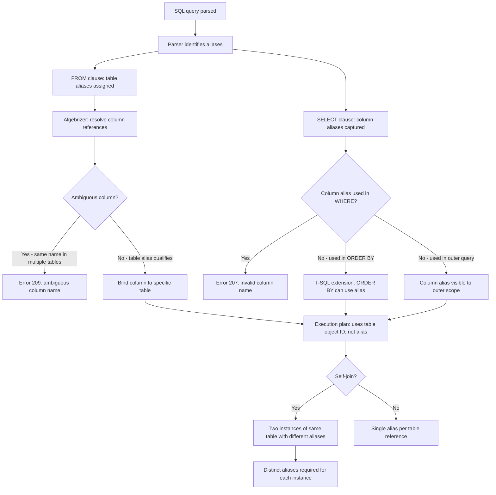

## Navigation

**Domain:** [[8 — Databases]] > **Group:** SQL Fundamentals
**Previous:** [[8.088 — EXISTS vs IN — Performance Differences]] | **Next:** [[8.090 — UNION, INTERSECT, EXCEPT — Set Operations]]

### Prerequisites

- [[8.067 — WHERE Clause — Predicate Logic and SARGability]] — Aliases are used in WHERE clause correlations; understanding how the optimiser resolves column references with aliases is essential for debugging ambiguous column errors.
- [[8.083 — SELECT and FROM — Projection and Source]] — Aliases are defined in the FROM and SELECT clauses; understanding logical query processing order (FROM → WHERE → GROUP BY → HAVING → SELECT → ORDER BY) explains why column aliases are not visible in WHERE but are visible in ORDER BY.
- [[8.088 — EXISTS vs IN — Performance Differences]] — EXISTS subqueries require correlation names for the outer table reference; aliases are how correlation is established.

### Where This Fits

Aliases (correlation names) are the mechanism for giving temporary names to tables, derived tables, CTEs, and columns in a SQL query. Every .NET backend engineer uses aliases when writing SQL — whether explicitly (`FROM Orders AS o`) or implicitly through EF Core's auto-generated aliases (`[o]`, `[c]`). The most common mistakes: (1) forgetting that derived tables MUST have an alias (SQL Server error 156: Incorrect syntax near the keyword 'FROM'), (2) assuming column aliases defined in SELECT are visible in WHERE (they are not — the WHERE clause is evaluated before SELECT), (3) ambiguous column references in JOINs when tables share column names without table aliases to disambiguate, and (4) using the same alias twice in a self-join (conflict rather than error since SQL Server allows alias shadowing). Interviewers use aliases to test SQL logical processing order knowledge (what is visible where), CTE and derived table syntax fluency, and the ability to write self-joins and correlated subqueries. Aliases have zero performance impact — they are purely a readability and maintainability tool.

---

## Core Mental Model

An alias is a temporary name assigned to a table, derived table, CTE, or column expression within the scope of a single query. Table aliases (correlation names) are resolved during the binding phase: the algebrizer maps every unqualified column reference to a specific table source by matching against available aliases. When ambiguity exists (same column name in multiple tables with no qualifying alias), the algebrizer raises error 209: "Ambiguous column name." Column aliases are resolved in the SELECT and ORDER BY clauses only — they are not visible to the WHERE, GROUP BY, or HAVING clauses because those are logically evaluated before the SELECT list. The AS keyword is optional for table aliases in T-SQL but recommended for clarity; it is also optional for column aliases but recommended when the alias differs from the expression. Derived tables (subqueries in FROM) MANDATORILY require an alias — SQL Server enforces this because the outer query needs a name to reference the derived table's columns. CTEs are effectively named aliases for subqueries defined before the main query. Self-joins require table aliases to distinguish the two instances of the same table. The mental model: aliases are scope-local bindings that make SQL readable by replacing fully-qualified table names with short mnemonics and by giving meaningful names to computed expressions.

### Classification

Aliasing is a **syntactic and binding mechanism** in the SQL language. It has no impact on the execution engine — aliases are resolved during binding and do not appear in execution plans (the plan references the base table object IDs, not the aliases). Table aliases affect how the optimiser references tables in the plan's operator details (the alias appears in the plan XML). Column aliases only affect the output column names in the final result set (or in the ORDER BY clause for T-SQL). There is no SARGability or performance implication — aliasing is purely a developer-facing readability and maintainability concern.



### Key Properties

|Property|Value|Notes|
|---|---|---|
|Performance impact|None|Aliases resolved at bind time; plan uses object IDs|
|AS keyword|Optional (T-SQL)|Recommended for column aliases; optional for table aliases|
|Derived table alias|Mandatory|`SELECT * FROM (SELECT ...) AS alias` — error if omitted|
|CTE name|Mandatory|`WITH Name AS (SELECT ...) SELECT ... FROM Name`|
|Column alias scope|SELECT, ORDER BY|Not visible in WHERE, GROUP BY, HAVING (logical processing order)|
|Column alias visibility in ORDER BY|Yes (T-SQL extension)|ANSI SQL does not allow this (T-SQL does for non-ambiguous aliases)|
|Ambiguous column error|Error 209|Raised at bind time when column name exists in multiple FROM sources without table qualifier|
|Self-join alias|Required|Must use different aliases for each instance of the same table|
|UPDATE/DELETE alias|Allowed|`UPDATE t SET ... FROM dbo.Orders AS t WHERE ...`|
|Maximum alias length|128 characters (T-SQL)|Same as identifier length limit|

---

## Deep Mechanics

### How the Engine Executes This

1. **Parsing** — The parser identifies alias definitions in each clause:
   - `FROM TableName AS Alias` or `FROM TableName Alias`: captures the alias name as the correlation name for that table source.
   - `SELECT expression AS ColumnAlias` or `SELECT expression ColumnAlias`: captures the alias for the output column.
   - `(subquery) AS DerivedAlias`: requires the derived table alias.
   - `WITH CTEName (ColumnAliases) AS (SELECT ...)`: captures both the CTE name and optional column aliases.

2. **Binding (Algebrizer)** — The algebrizer performs alias resolution:
   - Builds a scope-level alias table: for each table source in FROM, maps the alias to the underlying table object.
   - For each column reference in the query, checks if it is qualified (`TableAlias.ColumnName`). If qualified, resolves directly. If unqualified, searches all table sources in the current scope for a column with that name.
   - If an unqualified column name exists in exactly one table in the scope, binds to it. If it exists in multiple tables, raises error 209: "Ambiguous column name."
   - Column aliases from the SELECT list are NOT added to the binding scope for WHERE/GROUP BY/HAVING — they are only recorded for the projection phase. This is why `SELECT TotalAmount * 0.1 AS Tax FROM Orders WHERE Tax > 10` fails: `Tax` is not defined in the WHERE scope.
   - For ORDER BY, T-SQL extends the binding: column aliases from SELECT ARE visible. SQL Server resolves ORDER BY aliases during the sort phase, after the projection is computed.

3. **Derived table binding** — When a subquery appears in FROM:
   - The subquery is fully bound first (its own alias scope).
   - The derived table alias (mandatory) becomes a new table source in the outer scope.
   - Columns from the derived table are referenced using the derived table alias: `SELECT d.* FROM (SELECT ...) AS d`.
   - This is why CTEs and derived tables require aliases — they create a new scope-level table source.

4. **Self-join resolution** — When the same table appears twice with different aliases:
   - Each alias creates a separate entry in the alias table, pointing to the same base table object.
   - The optimiser treats them as two independent table scans/accesses with separate I/O operations.
   - In the execution plan, each alias appears as a separate Clustered Index Scan or Seek node referencing the same table but with different alias names in the plan XML.

5. **CTE binding** — CTEs are similar to derived tables but defined before the main query:
   - The CTE definition (`WITH Name AS (...)`) is bound first.
   - The CTE name becomes a scope-level table source for the main query.
   - Multiple CTEs can reference previously defined CTEs (recursive or sequential).
   - The CTE name, unlike a derived table alias, is available throughout the entire batch after its definition.

6. **Execution** — Aliases do not appear in execution. The execution engine uses internal object IDs and the query plan's access paths. Alias names appear only in the plan XML (for readability) and in the result set column headers (for column aliases).

### SQL Visibility

```sql
-- Table alias (AS keyword, recommended)
SELECT c.CustomerId, c.FirstName, c.LastName
FROM dbo.Customers AS c
WHERE c.Status = 'Active';

-- Table alias (no AS keyword, T-SQL allows it)
SELECT c.CustomerId, c.FirstName, c.LastName
FROM dbo.Customers c  -- No AS keyword
WHERE c.Status = 'Active';

-- Column alias in SELECT
SELECT o.OrderId,
       o.TotalAmount,
       o.TotalAmount * 0.08 AS TaxAmount
FROM dbo.Orders AS o;

-- Column alias visible in ORDER BY (T-SQL extension)
SELECT o.OrderId,
       o.TotalAmount,
       o.TotalAmount * 0.08 AS TaxAmount
FROM dbo.Orders AS o
ORDER BY TaxAmount DESC;
-- This works in T-SQL but is NOT valid ANSI SQL

-- Derived table alias (mandatory)
SELECT d.OrderCount, d.TotalRevenue
FROM (
    SELECT COUNT(*) AS OrderCount,
           SUM(TotalAmount) AS TotalRevenue
    FROM dbo.Orders
    WHERE OrderDate >= '2024-01-01'
) AS d;  -- Derived table alias REQUIRED

-- Self-join with aliases
SELECT e1.FirstName AS EmployeeName,
       e2.FirstName AS ManagerName
FROM dbo.Employees AS e1
LEFT JOIN dbo.Employees AS e2
    ON e1.ManagerId = e2.EmployeeId;

-- CTE alias
WITH HighValueOrders AS (
    SELECT CustomerId, COUNT(*) AS OrderCount
    FROM dbo.Orders
    WHERE TotalAmount > 1000
    GROUP BY CustomerId
)
SELECT c.CustomerId, c.FirstName, c.LastName, h.OrderCount
FROM dbo.Customers AS c
INNER JOIN HighValueOrders AS h
    ON c.CustomerId = h.CustomerId;

-- Multiple CTEs
WITH
OrderSummary AS (
    SELECT CustomerId, COUNT(*) AS Cnt
    FROM dbo.Orders GROUP BY CustomerId
),
CustomerSpending AS (
    SELECT CustomerId, SUM(TotalAmount) AS TotalSpent
    FROM dbo.Orders GROUP BY CustomerId
)
SELECT c.CustomerId, c.FirstName,
       COALESCE(os.Cnt, 0) AS OrderCount,
       COALESCE(cs.TotalSpent, 0) AS TotalSpent
FROM dbo.Customers AS c
LEFT JOIN OrderSummary AS os ON c.CustomerId = os.CustomerId
LEFT JOIN CustomerSpending AS cs ON c.CustomerId = cs.CustomerId;

-- UPDATE with alias
UPDATE o
SET o.Status = 'Processed',
    o.Notes = CONCAT(o.Notes, '; Auto-processed')
FROM dbo.Orders AS o
WHERE o.OrderDate < '2024-01-01'
  AND o.Status = 'Pending';

-- DELETE with alias
DELETE o
FROM dbo.Orders AS o
WHERE o.OrderDate < '2020-01-01';
```

```csharp
// EF Core — auto-generated aliases
var activeCustomers = await dbContext.Customers
    .Where(c => c.Status == "Active")
    .Select(c => new { c.CustomerId, c.FirstName, c.LastName, FullName = c.FirstName + " " + c.LastName })
    .ToListAsync(cancellationToken);

// Generated SQL:
// SELECT [c].[CustomerId], [c].[FirstName], [c].[LastName],
//        ([c].[FirstName] + N' ') + [c].[LastName] AS [FullName]
// FROM [Customers] AS [c]
// WHERE [c].[Status] = N'Active'

// EF Core — controlling column aliases with .Select()
var orderTax = await dbContext.Orders
    .Where(o => o.OrderDate >= startDate)
    .Select(o => new
    {
        OrderId = o.OrderId,
        Tax = o.TotalAmount * 0.08m,
        TotalWithTax = o.TotalAmount * 1.08m
    })
    .ToListAsync(cancellationToken);

// Generated SQL:
// SELECT [o].[OrderId],
//        [o].[TotalAmount] * 0.08 AS [Tax],
//        [o].[TotalAmount] * 1.08 AS [TotalWithTax]
// FROM [Orders] AS [o]
// WHERE [o].[OrderDate] >= @p0
```

**Generated SQL (from EF Core logs):**

```sql
-- EF Core always uses AS keyword for table aliases
SELECT [c].[CustomerId], [c].[FirstName], [c].[LastName],
       ([c].[FirstName] + N' ') + [c].[LastName] AS [FullName]
FROM [Customers] AS [c]
WHERE [c].[Status] = N'Active';

-- Multi-table query with auto-generated aliases
SELECT [o].[OrderId], [o].[TotalAmount], [c].[FirstName], [c].[LastName]
FROM [Orders] AS [o]
INNER JOIN [Customers] AS [c]
    ON [o].[CustomerId] = [c].[CustomerId];

-- Subquery in FROM (EF Core translates to derived table with auto-alias)
SELECT [t].[CustomerId], [t].[OrderCount]
FROM (
    SELECT [o].[CustomerId], COUNT(*) AS [OrderCount]
    FROM [Orders] AS [o]
    GROUP BY [o].[CustomerId]
) AS [t];
-- EF Core auto-generates the derived table alias [t]
```

### Execution Plan Analysis

**Simple query with table alias:**

```
[Clustered Index Scan (PK_Customers)]
  Object: [dbo].[Customers]
  Alias in plan XML: [c]
→ [SELECT]
```

The alias `c` appears in the plan XML's `<ColumnReference>`, `<Object>`, and `<IndexScan>` elements as the `Alias` attribute. The execution engine uses the object ID `[dbo].[Customers]` internally, but the alias is preserved for readability.

**Self-join with two aliases:**

```
[Nested Loops Left Outer Join]
  Outer: [Clustered Index Scan (PK_Employees)] — Alias: [e1]
  Inner: [Clustered Index Seek (PK_Employees)] — Alias: [e2]
  Seek Predicates: [e2].EmployeeId = [e1].ManagerId
→ [SELECT]
```

Two separate scans/accesses of the same table. Each has a different alias in the plan XML. The optimiser estimates the cost for each access independently.

**Derived table with alias:**

```
[Hash Match (Aggregate)]
  Input: [Clustered Index Scan Orders] — Alias: [o]
→ [Compute Scalar] → [SELECT]
  Derived table alias [d] is referenced in the outer query's
  [Nested Loops Inner Join] as the inner side: [d]
```

### Cost Visibility

```sql
SET STATISTICS IO ON;
SET STATISTICS TIME ON;

-- Self-join with aliases (two reads of same table)
SELECT e1.EmployeeId, e1.FirstName AS EmployeeName,
       e2.FirstName AS ManagerName
FROM dbo.Employees AS e1
LEFT JOIN dbo.Employees AS e2
    ON e1.ManagerId = e2.EmployeeId;

-- Expected output:
-- Table 'Employees'. Scan count 2, logical reads 120
-- (Two scans: one for e1 alias, one for e2 alias)
-- SQL Server Execution Times: CPU time = 0ms, elapsed time = 8ms

-- Derived table with alias
SELECT d.CustomerId, d.OrderCount
FROM (
    SELECT CustomerId, COUNT(*) AS OrderCount
    FROM dbo.Orders
    GROUP BY CustomerId
) AS d;

-- Expected output:
-- Table 'Orders'. Scan count 1, logical reads 12450
-- SQL Server Execution Times: CPU time = 45ms, elapsed time = 120ms
```

### Failure Modes

**Missing derived table alias — error 156:** The most common alias error. Every derived table (subquery in FROM) MUST have an alias. SQL Server raises: `Msg 156, Level 15, State 1, Line N: Incorrect syntax near the keyword 'WHERE'.` (or the keyword after the subquery).

```sql
-- ❌ Error: missing derived table alias
SELECT d.CustomerId, d.OrderCount
FROM (
    SELECT CustomerId, COUNT(*) AS OrderCount
    FROM dbo.Orders
    GROUP BY CustomerId
);  -- Error: need alias after closing parenthesis

-- ✅ Fix
FROM (... ) AS d;
```

**Ambiguous column — error 209:** When two tables in the same query scope have same-named columns and the query references the column without qualifying it with a table alias.

```sql
-- Both Orders and Customers have a Status column
SELECT CustomerId, FirstName, Status  -- Which Status? Error 209
FROM dbo.Customers AS c
INNER JOIN dbo.Orders AS o ON c.CustomerId = o.CustomerId;

-- ✅ Fix: qualify with table alias
SELECT c.CustomerId, c.FirstName, o.Status
FROM dbo.Customers AS c
INNER JOIN dbo.Orders AS o ON c.CustomerId = o.CustomerId;
```

**Column alias in WHERE — error 207:** Column aliases defined in SELECT are not visible in WHERE due to logical processing order (FROM → WHERE → GROUP BY → HAVING → SELECT → ORDER BY).

```sql
-- ❌ Error: column alias not visible in WHERE
SELECT OrderId, TotalAmount * 0.08 AS Tax
FROM dbo.Orders
WHERE Tax > 10;  -- Error 207: Invalid column name 'Tax'

-- ✅ Fix: repeat the expression
SELECT OrderId, TotalAmount * 0.08 AS Tax
FROM dbo.Orders
WHERE TotalAmount * 0.08 > 10;

-- ✅ Fix: derived table
SELECT * FROM (
    SELECT OrderId, TotalAmount * 0.08 AS Tax
    FROM dbo.Orders
) AS d
WHERE d.Tax > 10;
```

**Alias shadowing — confusing self-join aliases:** Using the same alias for different table instances. While SQL Server does not error on this (it uses the closest scope), it causes confusion in complex queries.

---

## Production Patterns and Implementation

### Primary SQL Implementation

```sql
-- ============================================================
-- Schema context
-- ============================================================
CREATE TABLE dbo.Customers
(
    CustomerId   INT            NOT NULL IDENTITY(1,1),
    FirstName    NVARCHAR(100)  NOT NULL,
    LastName     NVARCHAR(100)  NOT NULL,
    Email        NVARCHAR(256)  NOT NULL,
    Status       VARCHAR(20)    NOT NULL DEFAULT 'Active',
    CreatedAt    DATETIME2(0)   NOT NULL DEFAULT SYSUTCDATETIME(),
    CONSTRAINT PK_Customers PRIMARY KEY CLUSTERED (CustomerId)
);

CREATE TABLE dbo.Orders
(
    OrderId      INT            NOT NULL IDENTITY(1,1),
    CustomerId   INT            NOT NULL,
    OrderDate    DATETIME2(0)   NOT NULL,
    Status       VARCHAR(20)    NOT NULL DEFAULT 'Pending',
    TotalAmount  DECIMAL(18,2)  NOT NULL,
    CreatedAt    DATETIME2(0)   NOT NULL DEFAULT SYSUTCDATETIME(),
    CONSTRAINT PK_Orders PRIMARY KEY CLUSTERED (OrderId)
);

CREATE TABLE dbo.Employees
(
    EmployeeId   INT            NOT NULL IDENTITY(1,1),
    FirstName    NVARCHAR(100)  NOT NULL,
    LastName     NVARCHAR(100)  NOT NULL,
    ManagerId    INT            NULL,
    DepartmentId INT            NOT NULL,
    HireDate     DATE           NOT NULL,
    Salary       DECIMAL(18,2)  NOT NULL,
    CONSTRAINT PK_Employees PRIMARY KEY CLUSTERED (EmployeeId)
);

-- ============================================================
-- Pattern 1: Table alias for simple queries
-- ============================================================
-- Standard table alias (AS keyword)
SELECT o.OrderId, o.CustomerId, o.OrderDate, o.TotalAmount
FROM dbo.Orders AS o
WHERE o.Status = 'Shipped'
ORDER BY o.OrderDate DESC;

-- ============================================================
-- Pattern 2: Table alias without AS (T-SQL idiom)
-- ============================================================
-- Many SQL Server developers omit AS for table aliases
-- This is valid but can be confusing — AS is clearer
SELECT o.OrderId, o.CustomerId
FROM dbo.Orders o
WHERE o.CustomerId = 1001;

-- ============================================================
-- Pattern 3: Column alias for computed expressions
-- ============================================================
SELECT o.OrderId,
       o.TotalAmount,
       o.TotalAmount * 0.08 AS TaxAmount,
       o.TotalAmount * 1.08 AS TotalWithTax,
       DATEDIFF(DAY, o.OrderDate, SYSUTCDATETIME()) AS DaysSinceOrder
FROM dbo.Orders AS o
WHERE o.OrderDate >= '2024-01-01';

-- ============================================================
-- Pattern 4: Column alias visible in ORDER BY (T-SQL)
-- ============================================================
SELECT o.CustomerId,
       COUNT(*) AS OrderCount,
       SUM(o.TotalAmount) AS TotalSpent
FROM dbo.Orders AS o
GROUP BY o.CustomerId
ORDER BY TotalSpent DESC;  -- Column alias in ORDER BY (T-SQL only)

-- ============================================================
-- Pattern 5: Self-join with aliases (employee hierarchy)
-- ============================================================
-- Find all employees and their managers
SELECT e1.EmployeeId,
       e1.FirstName + ' ' + e1.LastName AS EmployeeName,
       e2.FirstName + ' ' + e2.LastName AS ManagerName,
       e1.Salary AS EmployeeSalary,
       e2.Salary AS ManagerSalary
FROM dbo.Employees AS e1
LEFT JOIN dbo.Employees AS e2
    ON e1.ManagerId = e2.EmployeeId
ORDER BY e1.EmployeeId;

-- ============================================================
-- Pattern 6: Self-join with different alias patterns
-- ============================================================
-- Employees who earn more than their manager
SELECT e1.FirstName + ' ' + e1.LastName AS Employee,
       e1.Salary AS EmployeeSalary,
       e2.FirstName + ' ' + e2.LastName AS Manager,
       e2.Salary AS ManagerSalary,
       (e1.Salary - e2.Salary) AS SalaryDifference
FROM dbo.Employees AS e1
INNER JOIN dbo.Employees AS e2
    ON e1.ManagerId = e2.EmployeeId
WHERE e1.Salary > e2.Salary
ORDER BY SalaryDifference DESC;

-- ============================================================
-- Pattern 7: Derived table alias (mandatory)
-- ============================================================
-- Find customers with above-average order counts
SELECT c.CustomerId, c.FirstName, c.LastName, d.OrderCount
FROM dbo.Customers AS c
INNER JOIN (
    SELECT o.CustomerId,
           COUNT(*) AS OrderCount
    FROM dbo.Orders AS o
    GROUP BY o.CustomerId
) AS d  -- Derived table alias REQUIRED
    ON c.CustomerId = d.CustomerId
WHERE d.OrderCount > (
    SELECT AVG(OrderCount)
    FROM (
        SELECT COUNT(*) AS OrderCount
        FROM dbo.Orders
        GROUP BY CustomerId
    ) AS avg_d  -- Another derived table alias
)
ORDER BY d.OrderCount DESC;

-- ============================================================
-- Pattern 8: Column aliases in derived table column definitions
-- ============================================================
-- Assign column aliases in the derived table definition itself
SELECT d.CustomerId, d.OrderCount, d.TotalSpent
FROM (
    SELECT o.CustomerId,
           COUNT(*) AS OrderCount,
           SUM(o.TotalAmount) AS TotalSpent
    FROM dbo.Orders AS o
    GROUP BY o.CustomerId
) AS d
WHERE d.OrderCount > 5;

-- ============================================================
-- Pattern 9: CTE with alias
-- ============================================================
WITH CustomerStats AS (
    SELECT o.CustomerId,
           COUNT(*) AS OrderCount,
           SUM(o.TotalAmount) AS TotalSpent,
           MIN(o.OrderDate) AS FirstOrderDate,
           MAX(o.OrderDate) AS LastOrderDate
    FROM dbo.Orders AS o
    GROUP BY o.CustomerId
)
SELECT c.CustomerId,
       c.FirstName + ' ' + c.LastName AS CustomerName,
       COALESCE(cs.OrderCount, 0) AS OrderCount,
       COALESCE(cs.TotalSpent, 0) AS TotalSpent,
       cs.FirstOrderDate,
       cs.LastOrderDate
FROM dbo.Customers AS c
LEFT JOIN CustomerStats AS cs
    ON c.CustomerId = cs.CustomerId
ORDER BY cs.TotalSpent DESC;

-- ============================================================
-- Pattern 10: Multiple CTEs with aliases
-- ============================================================
WITH
Orders2024 AS (
    SELECT CustomerId, COUNT(*) AS OrderCount
    FROM dbo.Orders
    WHERE OrderDate >= '2024-01-01'
      AND OrderDate < '2025-01-01'
    GROUP BY CustomerId
),
HighValueCustomers AS (
    SELECT o.CustomerId, SUM(o.TotalAmount) AS TotalSpent
    FROM dbo.Orders AS o
    WHERE o.TotalAmount > 5000
    GROUP BY o.CustomerId
)
SELECT c.CustomerId,
       c.FirstName + ' ' + c.LastName AS CustomerName,
       COALESCE(o24.OrderCount, 0) AS Orders2024,
       COALESCE(hv.TotalSpent, 0) AS HighValueTotal
FROM dbo.Customers AS c
LEFT JOIN Orders2024 AS o24
    ON c.CustomerId = o24.CustomerId
LEFT JOIN HighValueCustomers AS hv
    ON c.CustomerId = hv.CustomerId
WHERE COALESCE(o24.OrderCount, 0) > 0
   OR COALESCE(hv.TotalSpent, 0) > 0
ORDER BY CustomerName;

-- ============================================================
-- Pattern 11: Subquery correlation with aliases
-- ============================================================
-- Correlated subquery using table aliases for correlation
SELECT c.CustomerId,
       c.FirstName,
       c.LastName,
       (SELECT COUNT(*)
        FROM dbo.Orders AS o
        WHERE o.CustomerId = c.CustomerId  -- Correlation via alias
          AND o.OrderDate >= '2024-01-01'
       ) AS Orders2024Count
FROM dbo.Customers AS c
ORDER BY Orders2024Count DESC;

-- ============================================================
-- Pattern 12: UPDATE with alias
-- ============================================================
-- Update all pending orders older than 30 days
UPDATE o
SET o.Status = 'Cancelled',
    o.Notes = COALESCE(o.Notes + '; ', '') + 'Auto-cancelled: over 30 days pending'
FROM dbo.Orders AS o
WHERE o.Status = 'Pending'
  AND o.OrderDate < DATEADD(DAY, -30, SYSUTCDATETIME());

-- ============================================================
-- Pattern 13: DELETE with alias
-- ============================================================
-- Delete orphaned order items (no matching order)
DELETE oi
FROM dbo.OrderItems AS oi
WHERE NOT EXISTS (
    SELECT 1
    FROM dbo.Orders AS o
    WHERE o.OrderId = oi.OrderId
);

-- ============================================================
-- Pattern 14: MERGE with aliases
-- ============================================================
MERGE INTO dbo.Orders AS target
USING (
    SELECT oi.OrderId,
           SUM(oi.Quantity * oi.UnitPrice) AS CalculatedTotal
    FROM dbo.OrderItems AS oi
    GROUP BY oi.OrderId
) AS source
    ON target.OrderId = source.OrderId
WHEN MATCHED AND ABS(target.TotalAmount - source.CalculatedTotal) > 0.01 THEN
    UPDATE SET target.TotalAmount = source.CalculatedTotal,
               target.Notes = COALESCE(target.Notes + '; ', '') + 'Total recalculated';

-- ============================================================
-- Pattern 15: Column alias in HAVING — must repeat expression
-- ============================================================
-- ❌ Column alias not visible in HAVING
SELECT o.CustomerId, SUM(o.TotalAmount) AS TotalSpent
FROM dbo.Orders AS o
GROUP BY o.CustomerId
HAVING TotalSpent > 10000;  -- Error: TotalSpent not visible in HAVING

-- ✅ Correct: repeat the expression
SELECT o.CustomerId, SUM(o.TotalAmount) AS TotalSpent
FROM dbo.Orders AS o
GROUP BY o.CustomerId
HAVING SUM(o.TotalAmount) > 10000;

-- ✅ Or use derived table
SELECT d.*
FROM (
    SELECT o.CustomerId, SUM(o.TotalAmount) AS TotalSpent
    FROM dbo.Orders AS o
    GROUP BY o.CustomerId
) AS d
WHERE d.TotalSpent > 10000;
```

### EF Core Implementation

```csharp
public class ApplicationDbContext : DbContext
{
    public DbSet<Customer> Customers => Set<Customer>();
    public DbSet<Order> Orders => Set<Order>();
    public DbSet<Employee> Employees => Set<Employee>();

    protected override void OnModelCreating(ModelBuilder modelBuilder)
    {
        modelBuilder.Entity<Customer>(entity =>
        {
            entity.ToTable("Customers");
            entity.HasKey(c => c.CustomerId);
            entity.Property(c => c.FirstName).HasMaxLength(100);
            entity.Property(c => c.LastName).HasMaxLength(100);
            entity.Property(c => c.Email).HasMaxLength(256);
        });

        modelBuilder.Entity<Order>(entity =>
        {
            entity.ToTable("Orders");
            entity.HasKey(o => o.OrderId);
            entity.Property(o => o.TotalAmount).HasColumnType("decimal(18,2)");
            entity.Property(o => o.Status).HasMaxLength(20);
            entity.HasOne(o => o.Customer)
                  .WithMany(c => c.Orders)
                  .HasForeignKey(o => o.CustomerId);
        });

        modelBuilder.Entity<Employee>(entity =>
        {
            entity.ToTable("Employees");
            entity.HasKey(e => e.EmployeeId);
            entity.Property(e => e.FirstName).HasMaxLength(100);
            entity.Property(e => e.LastName).HasMaxLength(100);
            entity.Property(e => e.Salary).HasColumnType("decimal(18,2)");
            entity.HasOne(e => e.Manager)
                  .WithMany()
                  .HasForeignKey(e => e.ManagerId)
                  .OnDelete(DeleteBehavior.NoAction);
        });
    }
}

public class Customer
{
    public int CustomerId { get; set; }
    public string FirstName { get; set; } = string.Empty;
    public string LastName { get; set; } = string.Empty;
    public string Email { get; set; } = string.Empty;
    public string Status { get; set; } = "Active";
    public DateTime CreatedAt { get; set; }
    public List<Order> Orders { get; set; } = new();
}

public class Order
{
    public int OrderId { get; set; }
    public int CustomerId { get; set; }
    public DateTime OrderDate { get; set; }
    public string Status { get; set; } = "Pending";
    public decimal TotalAmount { get; set; }
    public DateTime CreatedAt { get; set; }
    public Customer Customer { get; set; } = null!;
}

public class Employee
{
    public int EmployeeId { get; set; }
    public string FirstName { get; set; } = string.Empty;
    public string LastName { get; set; } = string.Empty;
    public int? ManagerId { get; set; }
    public int DepartmentId { get; set; }
    public DateTime HireDate { get; set; }
    public decimal Salary { get; set; }
    public Employee? Manager { get; set; }
}

// Pattern 1: Basic column aliases via Select()
public async Task<List<OrderSummary>> GetOrderSummariesAsync(
    CancellationToken cancellationToken = default)
{
    return await dbContext.Orders
        .Where(o => o.OrderDate >= new DateTime(2024, 1, 1))
        .Select(o => new OrderSummary
        {
            OrderId = o.OrderId,
            CustomerId = o.CustomerId,
            TaxAmount = o.TotalAmount * 0.08m,
            TotalWithTax = o.TotalAmount * 1.08m,
            DaysSinceOrder = EF.Functions.DateDiffDay(
                o.OrderDate, DateTime.UtcNow)
        })
        .OrderByDescending(o => o.OrderId)
        .ToListAsync(cancellationToken);
    // EF Core generates: AS [TaxAmount], AS [TotalWithTax], AS [DaysSinceOrder]
}

public class OrderSummary
{
    public int OrderId { get; set; }
    public int CustomerId { get; set; }
    public decimal TaxAmount { get; set; }
    public decimal TotalWithTax { get; set; }
    public int? DaysSinceOrder { get; set; }
}

// Pattern 2: Self-join with aliases (EF Core navigation)
// EF Core handles self-joins through navigation properties
public async Task<List<ManagerSubordinateDto>> GetEmployeeHierarchyAsync(
    CancellationToken cancellationToken = default)
{
    return await dbContext.Employees
        .Where(e => e.ManagerId != null)
        .Select(e => new ManagerSubordinateDto
        {
            EmployeeId = e.EmployeeId,
            EmployeeName = e.FirstName + " " + e.LastName,
            ManagerName = e.Manager!.FirstName + " " + e.Manager.LastName,
            SalaryDifference = e.Salary - e.Manager.Salary
        })
        .OrderByDescending(x => x.SalaryDifference)
        .ToListAsync(cancellationToken);
    // Generated: INNER JOIN [Employees] AS [e0] ON [e].[ManagerId] = [e0].[EmployeeId]
}

public class ManagerSubordinateDto
{
    public int EmployeeId { get; set; }
    public string EmployeeName { get; set; } = string.Empty;
    public string ManagerName { get; set; } = string.Empty;
    public decimal SalaryDifference { get; set; }
}

// Pattern 3: GroupBy with column aliases
public async Task<List<CustomerStatsDto>> GetCustomerStatsAsync(
    CancellationToken cancellationToken = default)
{
    return await dbContext.Orders
        .GroupBy(o => o.CustomerId)
        .Select(g => new CustomerStatsDto
        {
            CustomerId = g.Key,
            OrderCount = g.Count(),
            TotalSpent = g.Sum(o => o.TotalAmount)
        })
        .OrderByDescending(x => x.TotalSpent)
        .ToListAsync(cancellationToken);
    // Generated: GROUP BY [o].[CustomerId], then COUNT(*) and SUM in SELECT
}

public class CustomerStatsDto
{
    public int CustomerId { get; set; }
    public int OrderCount { get; set; }
    public decimal TotalSpent { get; set; }
}

// Pattern 4: Subquery in Select (correlated subquery)
public async Task<List<CustomerWithCountDto>> GetCustomersWithOrderCountAsync(
    int year,
    CancellationToken cancellationToken = default)
{
    var yearStart = new DateTime(year, 1, 1);
    var yearEnd = yearStart.AddYears(1);

    return await dbContext.Customers
        .Select(c => new CustomerWithCountDto
        {
            CustomerId = c.CustomerId,
            FirstName = c.FirstName,
            LastName = c.LastName,
            Orders2024Count = c.Orders
                .Where(o => o.OrderDate >= yearStart && o.OrderDate < yearEnd)
                .Count()
        })
        .OrderByDescending(x => x.Orders2024Count)
        .ToListAsync(cancellationToken);
    // Generated: OUTER APPLY (SELECT COUNT(*) ... )
}

public class CustomerWithCountDto
{
    public int CustomerId { get; set; }
    public string FirstName { get; set; } = string.Empty;
    public string LastName { get; set; } = string.Empty;
    public int Orders2024Count { get; set; }
}

// Pattern 5: Composability — building queries with multiple CTEs via LINQ
public async Task<List<CustomerDto>> GetHighVolumeCustomersAsync(
    int minOrders,
    decimal minTotal,
    CancellationToken cancellationToken = default)
{
    var orderCounts = dbContext.Orders
        .GroupBy(o => o.CustomerId)
        .Select(g => new { CustomerId = g.Key, Count = g.Count() });

    var orderTotals = dbContext.Orders
        .GroupBy(o => o.CustomerId)
        .Select(g => new { CustomerId = g.Key, Total = g.Sum(o => o.TotalAmount) });

    var query = from c in dbContext.Customers
                join oc in orderCounts on c.CustomerId equals oc.CustomerId
                join ot in orderTotals on c.CustomerId equals ot.CustomerId
                where oc.Count >= minOrders && ot.Total >= minTotal
                orderby ot.Total descending
                select new CustomerDto
                {
                    CustomerId = c.CustomerId,
                    FirstName = c.FirstName,
                    LastName = c.LastName,
                    OrderCount = oc.Count,
                    TotalSpent = ot.Total
                };

    return await query.ToListAsync(cancellationToken);
    // EF Core translates joins to a single query with derived tables or joins
}

public class CustomerDto
{
    public int CustomerId { get; set; }
    public string FirstName { get; set; } = string.Empty;
    public string LastName { get; set; } = string.Empty;
    public int OrderCount { get; set; }
    public decimal TotalSpent { get; set; }
}
```

### Dapper Implementation

```csharp
public sealed class CustomerRepository
{
    private readonly IDbConnectionFactory _connectionFactory;

    public CustomerRepository(IDbConnectionFactory connectionFactory)
        => _connectionFactory = connectionFactory;

    // Pattern 1: Column aliases for computed expressions
    public async Task<IReadOnlyList<OrderWithTax>> GetOrdersWithTaxAsync(
        CancellationToken cancellationToken = default)
    {
        const string sql = @"
            SELECT o.OrderId,
                   o.CustomerId,
                   o.TotalAmount,
                   o.TotalAmount * 0.08 AS TaxAmount,
                   o.TotalAmount * 1.08 AS TotalWithTax
            FROM dbo.Orders AS o
            WHERE o.OrderDate >= '2024-01-01'
            ORDER BY o.OrderDate DESC;";

        await using var connection = _connectionFactory.Create();

        return (await connection.QueryAsync<OrderWithTax>(
            new CommandDefinition(sql,
                cancellationToken: cancellationToken))).AsList();
    }

    // Pattern 2: Self-join with aliases
    public async Task<IReadOnlyList<EmployeeHierarchy>> GetEmployeeHierarchyAsync(
        CancellationToken cancellationToken = default)
    {
        const string sql = @"
            SELECT e1.EmployeeId,
                   e1.FirstName + ' ' + e1.LastName AS EmployeeName,
                   e2.FirstName + ' ' + e2.LastName AS ManagerName,
                   e1.Salary AS EmployeeSalary,
                   e2.Salary AS ManagerSalary,
                   (e1.Salary - e2.Salary) AS SalaryDifference
            FROM dbo.Employees AS e1
            INNER JOIN dbo.Employees AS e2
                ON e1.ManagerId = e2.EmployeeId
            WHERE e1.Salary > e2.Salary
            ORDER BY SalaryDifference DESC;";

        await using var connection = _connectionFactory.Create();

        return (await connection.QueryAsync<EmployeeHierarchy>(
            new CommandDefinition(sql,
                cancellationToken: cancellationToken))).AsList();
    }

    // Pattern 3: Derived table alias (critical)
    public async Task<IReadOnlyList<CustomerStat>> GetCustomerStatsAsync(
        CancellationToken cancellationToken = default)
    {
        const string sql = @"
            SELECT c.CustomerId,
                   c.FirstName + ' ' + c.LastName AS CustomerName,
                   COALESCE(d.OrderCount, 0) AS OrderCount,
                   COALESCE(d.TotalSpent, 0) AS TotalSpent
            FROM dbo.Customers AS c
            LEFT JOIN (
                SELECT o.CustomerId,
                       COUNT(*) AS OrderCount,
                       SUM(o.TotalAmount) AS TotalSpent
                FROM dbo.Orders AS o
                GROUP BY o.CustomerId
            ) AS d  -- Derived table alias MANDATORY
                ON c.CustomerId = d.CustomerId
            ORDER BY TotalSpent DESC;";

        await using var connection = _connectionFactory.Create();

        return (await connection.QueryAsync<CustomerStat>(
            new CommandDefinition(sql,
                cancellationToken: cancellationToken))).AsList();
    }

    // Pattern 4: CTE for readability
    public async Task<IReadOnlyList<CustomerStat>> GetCustomerStatsWithCteAsync(
        CancellationToken cancellationToken = default)
    {
        const string sql = @"
            WITH OrderStats AS (
                SELECT o.CustomerId,
                       COUNT(*) AS OrderCount,
                       SUM(o.TotalAmount) AS TotalSpent
                FROM dbo.Orders AS o
                GROUP BY o.CustomerId
            )
            SELECT c.CustomerId,
                   c.FirstName + ' ' + c.LastName AS CustomerName,
                   COALESCE(os.OrderCount, 0) AS OrderCount,
                   COALESCE(os.TotalSpent, 0) AS TotalSpent
            FROM dbo.Customers AS c
            LEFT JOIN OrderStats AS os
                ON c.CustomerId = os.CustomerId
            ORDER BY TotalSpent DESC;";

        await using var connection = _connectionFactory.Create();

        return (await connection.QueryAsync<CustomerStat>(
            new CommandDefinition(sql,
                cancellationToken: cancellationToken))).AsList();
    }
}

public record OrderWithTax(int OrderId, int CustomerId, decimal TotalAmount, decimal TaxAmount, decimal TotalWithTax);
public record EmployeeHierarchy(int EmployeeId, string EmployeeName, string ManagerName, decimal EmployeeSalary, decimal ManagerSalary, decimal SalaryDifference);
public record CustomerStat(int CustomerId, string CustomerName, int OrderCount, decimal TotalSpent);
```

### Configuration and Wiring

```csharp
// Program.cs
builder.Services.AddDbContext<ApplicationDbContext>(options =>
    options.UseSqlServer(
        builder.Configuration.GetConnectionString("DefaultConnection"),
        sqlOptions =>
        {
            sqlOptions.EnableRetryOnFailure(3);
            sqlOptions.CommandTimeout(30);
        }));

builder.Services.AddSingleton<IDbConnectionFactory>(sp =>
    new SqlConnectionFactory(
        builder.Configuration.GetConnectionString("DefaultConnection")!));

builder.Services.AddScoped<CustomerRepository>();
```

### SQL Server vs PostgreSQL Differences

```sql
-- PostgreSQL: AS is optional for table aliases (same as SQL Server)
SELECT c.customer_id, c.first_name
FROM customers AS c
WHERE c.status = 'Active';

-- PostgreSQL: AS is also optional for column aliases
SELECT o.total_amount * 0.08 AS tax_amount
FROM orders AS o;

-- PostgreSQL: Column aliases are ALSO not visible in WHERE (same)
SELECT o.order_id, o.total_amount * 0.08 AS tax
FROM orders AS o
WHERE tax > 10;  -- Error! Same as SQL Server

-- PostgreSQL: Column aliases ARE visible in ORDER BY (same as T-SQL)
SELECT o.order_id, o.total_amount * 0.08 AS tax
FROM orders AS o
ORDER BY tax DESC;  -- Works

-- PostgreSQL: Derived table alias MANDATORY (same)
SELECT * FROM (SELECT customer_id FROM orders) AS d;

-- PostgreSQL: CTE alias (same syntax)
WITH order_stats AS (
    SELECT customer_id, COUNT(*) AS order_count
    FROM orders GROUP BY customer_id
)
SELECT * FROM order_stats;

-- PostgreSQL: LATERAL subquery (different from SQL Server's CROSS APPLY)
-- LATERAL allows subquery to reference columns from preceding FROM items
SELECT c.customer_id, c.first_name, o.order_count
FROM customers AS c,
LATERAL (
    SELECT COUNT(*) AS order_count
    FROM orders AS o
    WHERE o.customer_id = c.customer_id
) AS o;
-- In SQL Server: CROSS APPLY is used instead of LATERAL

-- PostgreSQL: Table alias for DELETE (standard SQL)
DELETE FROM orders AS o
WHERE o.order_date < '2020-01-01';
-- SQL Server: DELETE o FROM dbo.Orders AS o WHERE ...
-- PostgreSQL syntax is cleaner

-- PostgreSQL: Table alias for UPDATE (same)
UPDATE orders AS o
SET status = 'Cancelled'
WHERE o.order_date < '2020-01-01';
```

---

## Gotchas and Production Pitfalls

### Missing Derived Table Alias — SQL Compilation Error

**Pitfall:** Writing a subquery in the FROM clause without an alias. SQL Server requires every derived table to have an alias (correlation name). Omitting it causes error 156.

```sql
-- ❌ Error: missing derived table alias
SELECT d.CustomerId, d.OrderCount
FROM (
    SELECT CustomerId, COUNT(*) AS OrderCount
    FROM dbo.Orders
    GROUP BY CustomerId
);
-- Msg 156, Level 15, State 1: Incorrect syntax near the keyword 'WHERE'.
```

**Symptom:** The query fails to compile. The error message points to the wrong location (the keyword AFTER the subquery, not the subquery itself). A developer unfamiliar with this rule wastes time debugging the wrong part of the query.

**Fix:**

```sql
-- ✅ Add alias after the closing parenthesis
FROM (
    SELECT CustomerId, COUNT(*) AS OrderCount
    FROM dbo.Orders
    GROUP BY CustomerId
) AS d;  -- Alias required
```

**Cost of not fixing:** A developer spends 15 minutes debugging a compilation error that looks like it's in the WHERE clause but is actually a missing derived table alias. In a team of 20 developers, this adds up to 5 hours/month of collective wasted debugging time.

---

### Column Alias in WHERE — Semantic Error

**Pitfall:** Using a column alias defined in SELECT within the WHERE clause. Due to logical processing order (FROM → WHERE → GROUP BY → HAVING → SELECT → ORDER BY), column aliases are not created until after WHERE is evaluated.

```sql
-- ❌ Error: column alias not visible in WHERE
SELECT OrderId, TotalAmount * 0.08 AS Tax
FROM dbo.Orders
WHERE Tax > 10;  -- Error 207: Invalid column name 'Tax'
```

**Symptom:** The query returns "Invalid column name 'Tax'" even though `Tax` is clearly defined in the SELECT list. The developer is confused because they can see the alias in SELECT and assumes it should be available everywhere.

**Fix:**

```sql
-- ✅ Fix 1: Repeat the expression
SELECT OrderId, TotalAmount * 0.08 AS Tax
FROM dbo.Orders
WHERE TotalAmount * 0.08 > 10;

-- ✅ Fix 2: Derived table (column alias becomes visible in outer scope)
SELECT * FROM (
    SELECT OrderId, TotalAmount * 0.08 AS Tax
    FROM dbo.Orders
) AS d
WHERE d.Tax > 10;

-- ✅ Fix 3: CTE
WITH TaxedOrders AS (
    SELECT OrderId, TotalAmount * 0.08 AS Tax
    FROM dbo.Orders
)
SELECT OrderId, Tax
FROM TaxedOrders
WHERE Tax > 10;
```

**Cost of not fixing:** A developer creates a complex query with 5 computed columns and tries to filter by their aliases in WHERE. They spend 30 minutes restructuring the query. If they don't know the logical processing order rule, they may add a HAVING clause (which also doesn't see SELECT aliases) and get further confused. The correct pattern (derived table or CTE) adds nesting but makes the intent clear.

---

### Ambiguous Column Without Table Alias — Error 209

**Pitfall:** Joining tables that share a column name (e.g., both `Orders` and `Customers` have `Status` and `CreatedAt` columns) and referencing the column without a table alias qualifier.

```sql
-- ❌ Both Orders and Customers have Status and CreatedAt
SELECT CustomerId, FirstName, Status, CreatedAt
FROM dbo.Customers AS c
INNER JOIN dbo.Orders AS o
    ON c.CustomerId = o.CustomerId;
-- Error 209: Ambiguous column name 'Status'
-- Error 209: Ambiguous column name 'CreatedAt'
```

**Symptom:** The query fails with ambiguous column errors. Developer has to guess which table each column belongs to. If both tables have the same column, the error is raised even if the developer intended one specific table's column.

**Fix:**

```sql
-- ✅ Always qualify column names with table aliases in JOINs
SELECT c.CustomerId, c.FirstName,
       o.Status AS OrderStatus, c.Status AS CustomerStatus,
       o.CreatedAt AS OrderDate, c.CreatedAt AS CustomerSince
FROM dbo.Customers AS c
INNER JOIN dbo.Orders AS o
    ON c.CustomerId = o.CustomerId;
```

**Cost of not fixing:** A JOIN between 4 tables (Orders, Customers, Payments, Invoices) all having `CreatedAt` and `Status` columns causes 8 ambiguous column errors. The developer spends 10 minutes qualifying each column. A code review catches this and requires all column references in multi-table queries to be qualified — adding this as a team standard prevents future occurrences.

---

### Column Alias in HAVING — Not Visible

**Pitfall:** Similar to the WHERE issue: column aliases defined in SELECT are not visible in HAVING because HAVING is evaluated before SELECT (logical order: FROM → WHERE → GROUP BY → HAVING → SELECT → ORDER BY).

```sql
-- ❌ Error: column alias not visible in HAVING
SELECT CustomerId, SUM(TotalAmount) AS TotalSpent
FROM dbo.Orders
GROUP BY CustomerId
HAVING TotalSpent > 10000;  -- Error 207: Invalid column name 'TotalSpent'
```

**Symptom:** Developer expects HAVING to see `TotalSpent` like ORDER BY does. It doesn't. The error is confusing because ORDER BY can see column aliases but HAVING cannot. This inconsistency is a common source of confusion for developers learning T-SQL.

**Fix:**

```sql
-- ✅ Fix 1: Repeat the expression in HAVING
SELECT CustomerId, SUM(TotalAmount) AS TotalSpent
FROM dbo.Orders
GROUP BY CustomerId
HAVING SUM(TotalAmount) > 10000;

-- ✅ Fix 2: Derived table
SELECT d.*
FROM (
    SELECT CustomerId, SUM(TotalAmount) AS TotalSpent
    FROM dbo.Orders
    GROUP BY CustomerId
) AS d
WHERE d.TotalSpent > 10000;
```

**Cost of not fixing:** Developer writes a grouped query with HAVING using column aliases and gets an error. They try adding more aliases to SELECT, thinking the issue is with alias naming. After 10 minutes, they discover HAVING can't see SELECT aliases. The team adds a linting rule to prevent this pattern.

---

### Alias Shadowing in Nested Scopes — Hard-to-Detect Bug

**Pitfall:** Using the same alias name for a table in a subquery that matches an alias in the outer query. The inner scope "shadows" the outer alias, making the outer table inaccessible within the subquery.

```sql
-- ❌ Alias c is used in both outer and inner query
SELECT c.CustomerId, c.FirstName
FROM dbo.Customers AS c
WHERE EXISTS (
    SELECT 1
    FROM dbo.Orders AS c  -- Same alias 'c' — shadows outer Customers
    WHERE c.CustomerId = c.CustomerId  -- Which c? Both refer to Orders!
);
-- This query is broken: c.CustomerId = c.CustomerId is always TRUE
-- It should correlate with outer Customers but can't
```

**Symptom:** A correlated subquery returns all rows instead of filtering correctly. The EXISTS condition is always TRUE because the self-comparison `c.CustomerId = c.CustomerId` always matches. The query returns all customers instead of only those with high-value orders.

**Fix:**

```sql
-- ✅ Use unique aliases for each table reference
SELECT c.CustomerId, c.FirstName
FROM dbo.Customers AS c
WHERE EXISTS (
    SELECT 1
    FROM dbo.Orders AS o  -- Different alias
    WHERE o.CustomerId = c.CustomerId  -- Clear: o = Orders, c = Customers
);
```

**Cost of not fixing:** A query silently returns wrong results — all customers instead of filtered subset. The bug goes unnoticed for 3 months in a monthly report. When discovered, the incorrect data has been used for business decisions (budget allocation based on customer segmentation). The fix is trivial but the confidence in reporting is damaged.

---

## Performance Implications

### Benchmark: Algorithmic Equivalence

Aliases have ZERO performance impact. They are purely a syntactic feature resolved at bind time. The execution plan references tables by object ID, not alias. The cost of alias resolution is in the sub-millisecond binding phase and does not appear in runtime statistics.

```sql
SET STATISTICS IO ON;
SET STATISTICS TIME ON;

-- Query with table alias
SELECT o.OrderId, o.CustomerId, o.TotalAmount
FROM dbo.Orders AS o
WHERE o.OrderDate >= '2024-01-01';

-- Query without table alias (fully qualified)
SELECT dbo.Orders.OrderId, dbo.Orders.CustomerId, dbo.Orders.TotalAmount
FROM dbo.Orders
WHERE dbo.Orders.OrderDate >= '2024-01-01';

-- Both produce identical:
-- Table 'Orders'. Scan count 1, logical reads 12450
-- SQL Server Execution Times: CPU time = 45ms, elapsed time = 120ms
-- IDENTICAL logical reads and execution time
```

The only performance-related aspect of aliasing is that self-joins (which REQUIRE aliases) cause the table to be accessed multiple times, doubling (or more) the logical reads and I/O:

```sql
-- Self-join: two separate scans of Employees table
SELECT e1.FirstName AS Employee, e2.FirstName AS Manager
FROM dbo.Employees AS e1
LEFT JOIN dbo.Employees AS e2
    ON e1.ManagerId = e2.EmployeeId;

-- Expected: Table 'Employees'. Scan count 2, logical reads 120
-- Two scans: one per alias
```

### BenchmarkDotNet

```csharp
[MemoryDiagnoser]
[SimpleJob(RuntimeMoniker.Net90)]
public class AliasBenchmark
{
    private SqlConnection _connection = default!;
    private const string ConnectionString = "Server=.;Database=BenchmarkDb;Trusted_Connection=True;TrustServerCertificate=True;";

    [GlobalSetup]
    public void Setup()
    {
        _connection = new SqlConnection(ConnectionString);
        _connection.Open();
        // Seed 100K customers, 500K orders
    }

    [Benchmark(Baseline = true)]
    public async Task<int> WithAlias()
    {
        const string sql = @"
            SELECT COUNT(*)
            FROM dbo.Customers AS c
            INNER JOIN dbo.Orders AS o
                ON c.CustomerId = o.CustomerId
            WHERE c.Status = 'Active'
              AND o.Status = 'Shipped';";
        return await new SqlCommand(sql, _connection).ExecuteScalarAsync<int>();
    }

    [Benchmark]
    public async Task<int> WithoutAlias()
    {
        const string sql = @"
            SELECT COUNT(*)
            FROM dbo.Customers
            INNER JOIN dbo.Orders
                ON dbo.Customers.CustomerId = dbo.Orders.CustomerId
            WHERE dbo.Customers.Status = 'Active'
              AND dbo.Orders.Status = 'Shipped';";
        return await new SqlCommand(sql, _connection).ExecuteScalarAsync<int>();
    }

    [Benchmark]
    public async Task<int> SelfJoinWithAlias()
    {
        const string sql = @"
            SELECT COUNT(*)
            FROM dbo.Employees AS e1
            INNER JOIN dbo.Employees AS e2
                ON e1.ManagerId = e2.EmployeeId;";
        return await new SqlCommand(sql, _connection).ExecuteScalarAsync<int>();
    }

    [GlobalCleanup]
    public void Cleanup() => _connection.Dispose();
}
```

**Expected results (approximate, SQL Server 2022, NVMe, 100K customers, 500K orders):**

|Method|Mean|Logical Reads|Allocated|Notes|
|---|---|---|---|---|
|WithAlias|~120 ms|~18,500|~200 KB|Same as without alias — no difference|
|WithoutAlias|~120 ms|~18,500|~200 KB|Identical plan, identical reads|
|SelfJoinWithAlias|~8 ms|~120|~4 KB|Two scans of Employees (60 pages each)|

### Write Amplification

Aliases have no write cost — they are syntactic, not physical. The only write-related impact is that self-joins (which require aliases) cause the table to be read multiple times, potentially causing additional PAGEIOLATCH waits if the table is under heavy write load and pages are not in cache.

---

## Interview Arsenal

### Question Bank

1. **What is the purpose of table and column aliases in SQL?**
2. **Can you use a column alias defined in SELECT in the WHERE clause? Why or why not?**
3. **Why must derived tables (subqueries in FROM) have an alias?**
4. **What is alias shadowing, and how does it cause bugs?**
5. **How does EF Core generate aliases for tables and columns?**
6. **What happens when two joined tables have the same column name without table alias qualification?**
7. **How do CTE aliases differ from derived table aliases?**
8. **Does aliasing affect query performance? Explain.**

### Spoken Answers

**Q: Can you use a column alias defined in SELECT in the WHERE clause? Why or why not?**

> **Great answer:** No, column aliases defined in the SELECT clause are NOT visible in the WHERE clause. This is because of SQL's logical processing order. The clauses are evaluated in this order: FROM (table sources), WHERE (row filter), GROUP BY (grouping), HAVING (group filter), SELECT (projection and column aliasing), ORDER BY (sorting). Column aliases are assigned during the SELECT phase, which occurs AFTER the WHERE phase. So when the WHERE clause is evaluated, the column alias doesn't exist yet. This is why `SELECT TotalAmount * 0.08 AS Tax FROM Orders WHERE Tax > 10` raises error 207: 'Invalid column name "Tax".'
>
> Three workarounds exist: (1) Repeat the expression in WHERE (simplest, but violates DRY). (2) Use a derived table: wrap the query in a subquery with the alias in the SELECT, then filter by the alias in the outer WHERE — this works because the derived table's columns are materialised before the outer WHERE evaluates. (3) Use a CTE, which has the same effect as a derived table. I use the CTE approach for readability when the expression is complex or used multiple times.
>
> Note that T-SQL DOES allow column aliases in ORDER BY: `SELECT TotalAmount * 0.08 AS Tax FROM Orders ORDER BY Tax`. This is a T-SQL extension. Standard ANSI SQL does NOT allow this, but SQL Server's implementation evaluates ORDER BY after SELECT, making aliases available. PostgreSQL also allows this. MySQL allows it in GROUP BY and HAVING as well (a non-standard extension that can cause ambiguity bugs).

---

**Q: Why must derived tables (subqueries in FROM) have an alias?**

> **Great answer:** Derived tables in the FROM clause must have an alias because the outer query needs a way to reference the derived table's columns. When SQL Server processes `FROM (SELECT ...)`, the subquery produces a virtual table with no name. The outer query's column references must be qualified — for example, `SELECT d.CustomerId FROM (...) AS d`. Without the alias `d`, there is no name to use for column qualification. The SQL standard requires every table in the FROM clause to have a correlation name (alias) that can be used to qualify columns. For base tables and views, the table name serves as the implicit correlation name. For derived tables (subqueries), there is no persistent name, so an explicit alias is mandatory.
>
> This is also why CTEs exist: `WITH MyCTE AS (SELECT ...) SELECT * FROM MyCTE`. The CTE name `MyCTE` serves the same purpose as a derived table alias but is defined separately, making the query more readable, especially when the same CTE is referenced multiple times.

---

**Q: Does aliasing affect query performance?**

> **Great answer:** No, aliasing has absolutely zero impact on query performance. Aliases are resolved during the binding phase, before the query is optimised. The execution engine operates on table object IDs and column IDs — aliases are never referenced during execution. The only exception is that self-joins require aliases, and self-joins cause the table to be accessed multiple times (each alias instance generates a separate scan/seek). But this is the JOIN's performance characteristic, not the aliasing's. A self-join without aliases isn't possible, but the performance cost comes from reading the table twice, not from the alias syntax. In the execution plan, aliases appear only in the plan XML as metadata — they don't affect operator selection, cardinality estimation, or I/O. You can verify this by running `SET STATISTICS IO ON` with and without aliases: the logical reads are identical. Aliasing is purely a developer-facing tool for readability and maintainability. My rule: always use short, meaningful table aliases (like `o` for Orders, `c` for Customers) that make the query more readable. Never use aliases like `a`, `b`, `c` that convey no information.

### Interview Trigger

The defining alias question: "I have this query: `SELECT TotalAmount * 0.08 AS Tax FROM Orders WHERE Tax > 10`. Why does it fail?" A candidate who says "you need to use HAVING instead of WHERE" fails — they don't understand logical processing order. A candidate who says "column aliases are not visible in WHERE because WHERE is evaluated before SELECT" passes. The follow-up: "How do you fix it while avoiding repeating the expression?" — "Use a derived table or CTE: `SELECT * FROM (SELECT TotalAmount * 0.08 AS Tax FROM Orders) AS d WHERE d.Tax > 10`." The next follow-up: "Does this impact performance?" — "No, the derived table is inlined during optimisation. The plan is identical to repeating the expression."

### Comparison Table

| | Table Alias | Column Alias | Derived Table Alias | CTE Name |
|---|---|---|---|---|
|Purpose|Shorten table name|Name computed expression|Name subquery result|Name reusable CTE|
|AS keyword|Optional (T-SQL)|Optional|Mandatory|Mandatory (WITH keyword)|
|Scope|Entire query|SELECT + ORDER BY only|Outer query|Entire batch after definition|
|Performance impact|None|None|None|None|
|Required for|Self-joins, multi-table queries, readability|Computed columns, aggregation results|Always required|Always required|
|Ambiguity prevention|Qualifies column references|Distinguishes output columns|Names the subquery table|Names the CTE relation|
|EF Core generation|Auto: [o], [c], etc.|Auto from property name|Auto: [t], [t0], etc.|N/A (no CTE in EF Core)|

---

## Decision Framework

### When to Apply

```mermaid
flowchart TD
    A[Writing or reviewing SQL] --> B{Query has multiple tables?}
    B -->|Yes - 2+ tables in FROM| C{Self-join?}
    B -->|No - single table| D{Aliases needed?}
    C -->|Yes| E[Use distinct aliases per instance]
    C -->|No| F[Use short meaningful aliases per table]
    D -->|Readability| G[Use table alias: FROM Orders AS o]
    D -->|Not needed| H[Fully qualified table name is fine]
    E --> I[Clarify role: e1=Employee, e2=Manager]
    F --> J[Convention: o=Orders, c=Customers, p=Products]
    A --> K{Computed columns?}
    K -->|Yes| L[Column alias in SELECT: AS TaxAmount]
    K -->|No| M[Use column names directly]
    L --> N{Used in WHERE?}
    N -->|Yes| O[Use derived table or CTE]
    N -->|Used in ORDER BY| P[Column alias works (T-SQL)]
    A --> Q{Subquery in FROM?}
    Q -->|Yes| R[Derived table alias MANDATORY]
    Q -->|No| S{CTE for readability?}
    S -->|Yes| T[WITH Name AS (...) SELECT FROM Name]
    S -->|No| U[Direct FROM clause aliases]
    R --> V[Always include AS keyword for clarity]
    A --> W{Ever need correlation?}
    W -->|Correlated subquery| X[Outer alias c, inner alias o]
    W -->|EXISTS subquery| Y[Clear aliases for correlation: c.CustomerId = o.CustomerId]
```

### Application Checklist

- [ ] All table aliases are short, meaningful, and consistent (`o` for Orders, `c` for Customers)
- [ ] AS keyword is used for clarity (especially in code reviews)
- [ ] All column references in multi-table queries are qualified with table aliases
- [ ] Column aliases are NOT used in WHERE, GROUP BY, or HAVING clauses
- [ ] Column aliases in ORDER BY are verified to be non-ambiguous
- [ ] Derived tables have mandatory aliases (checked before running)
- [ ] CTE names are descriptive (`HighValueOrders` not `CTE1`)
- [ ] Self-join aliases are distinct and role-descriptive (`emp`, `mgr`)
- [ ] Alias shadowing is avoided (no reused alias names in nested scopes)
- [ ] Column aliases for computed expressions improve readability (not redundant)

### Tradeoff Summary

|What You Gain|What You Pay|
|---|---|
|Table aliases: shorter queries, clearer column qualification|Slight overhead of learning/remembering alias conventions|
|Column aliases: meaningful output names, ORDER BY by alias|Not visible in WHERE/HAVING — requires derived table for reuse|
|Derived table aliases: mandatory reference for subquery results|Extra syntax — one more token to forget|
|CTE names: reusable, readable, self-documenting queries|Slightly more verbose than derived tables|
|Qualified columns: no ambiguous column errors, self-documenting|More typing (but worth it for clarity)|
|Self-join aliases: enable hierarchical queries|Two reads of same table (logical reads double)|

### Scale Thresholds

- **Any size**: Aliases are always applicable and never cause performance regressions.
- **< 100 rows**: Aliases matter for readability only — no performance concern either way.
- **> 1M rows**: Self-join aliases cause two full scans of large tables. Ensure proper indexes exist to avoid full scans for each alias instance.
- **High concurrency (> 500 queries/sec)**: Self-joins with aliases cause double the I/O on the same table. Ensure pages are cached or the table fits in buffer pool.
- **Complex queries (10+ tables)**: Aliases become critical for readability. Standardise naming conventions (e.g., first letter of table name, two-letter codes for ambiguous cases).

---

## Self-Check

### Conceptual Questions

1. What is the difference between a table alias and a column alias?
2. Can a column alias defined in SELECT be used in WHERE? Why?
3. Why does SQL Server require an alias for derived tables but not for base tables?
4. What error occurs when two joined tables have the same column name without a qualifier?
5. How does EF Core generate table aliases for JOIN queries?
6. How would you implement a self-join using Dapper?
7. What is alias shadowing, and why is it dangerous?
8. Does using aliases affect query performance? Support your answer.
9. What is the logical processing order that determines WHERE cannot see SELECT aliases?
10. Explain in 60 seconds, for a senior interviewer, the rules for alias visibility in SQL.

<details>
<summary>Answers</summary>

1. A table alias (correlation name) is assigned in the FROM clause to provide a shorthand name for a table, derived table, or CTE. A column alias is assigned in the SELECT clause to name a computed expression or rename an output column. Table aliases are used for column qualification throughout the query. Column aliases affect only the output column name and (in T-SQL) ORDER BY visibility.

2. No, column aliases defined in SELECT are NOT visible in WHERE. The logical processing order is: FROM → WHERE → GROUP BY → HAVING → SELECT → ORDER BY. Column aliases are assigned during the SELECT phase, which is evaluated AFTER WHERE. So the alias does not exist when WHERE is processed. Error 207: Invalid column name.

3. Base tables have persistent names (the table name itself serves as the implicit correlation name). Derived tables are anonymous subquery results — they have no persistent name, so an explicit alias is mandatory for the outer query to reference their columns. The SQL standard requires every table-like source in FROM to have a name that can be used for column qualification.

4. Error 209: "Ambiguous column name." SQL Server cannot determine which table's column to use when the same column name exists in multiple FROM sources and is referenced without a table qualifier.

5. EF Core auto-generates table aliases based on the entity type name (first letter lowercase): `[o]` for Orders, `[c]` for Customers, `[p]` for Products. In JOIN queries, each joined table gets its own auto-generated alias. If the same table appears multiple times (e.g., self-join via navigation properties), EF Core assigns sequential aliases: `[e]`, `[e0]`, `[e1]`.

6. Dapper: `SELECT e1.EmployeeId, e1.FirstName AS Employee, e2.FirstName AS Manager FROM dbo.Employees AS e1 INNER JOIN dbo.Employees AS e2 ON e1.ManagerId = e2.EmployeeId`. The self-join requires distinct aliases `e1` and `e2`. Dapper maps the result columns to the C# object properties (matching column aliases to property names).

7. Alias shadowing occurs when a subquery reuses the same alias name as an outer query table. The inner scope's alias "shadows" the outer one, making the outer table inaccessible within the subquery. This causes broken correlation in EXISTS subqueries and silently incorrect results. Example: both outer Customers and inner Orders use alias `c` — inside the subquery, `c` refers to Orders, not Customers, breaking the correlation.

8. No, aliasing has zero performance impact. Aliases are resolved during the binding phase before optimisation. The execution plan uses table object IDs and column IDs — aliases appear only in the plan XML as metadata. SET STATISTICS IO output is identical with or without aliases. The only exception is that self-joins (which require aliases) cause double I/O because the table is accessed twice — but this is the join's cost, not the alias syntax.

9. The logical processing order is: FROM (table sources), WHERE (row filter), GROUP BY (group rows), HAVING (filter groups), SELECT (projection, assign column aliases), ORDER BY (sort results). Since WHERE is processed in step 2 and SELECT in step 5, column aliases from SELECT are not visible in WHERE. ORDER BY (step 6) is after SELECT (step 5), so T-SQL extends visibility to ORDER BY.

10. "In SQL, aliases have well-defined visibility rules determined by the logical processing order. Table aliases, defined in the FROM clause, are visible throughout the entire query — they are the earliest-resolved aliases and are available in WHERE, GROUP BY, HAVING, SELECT, and ORDER BY. Column aliases, defined in the SELECT clause, are only visible in the ORDER BY clause in T-SQL — this is a T-SQL extension. In ANSI SQL, column aliases are only visible in the result set, not in any clause. Column aliases are NOT visible in WHERE, GROUP BY, or HAVING because those clauses are evaluated before SELECT in the logical processing order. Derived table aliases are mandatory because derived tables are anonymous — the outer query needs a name to reference their columns. CTE names behave like derived table aliases but are defined before the main query, making the CTE referenceable multiple times. Self-join aliases are required to distinguish multiple instances of the same table. Alias shadowing is a dangerous anti-pattern where an inner subquery reuses an outer alias, breaking correlation. My rule: always qualify columns with table aliases in multi-table queries, never use column aliases in WHERE, and always use distinct, meaningful aliases for self-joins."

</details>

---

### Query Challenges

**Challenge 1 — Write the employee hierarchy query**

Write a query that returns all employees with their manager's name, the department name (assume a Departments table), the employee's salary, and a column indicating whether the employee earns more than their manager (Yes/No). Use appropriate aliases for all tables and computed columns.

<details>
<summary>Solution</summary>

```sql
SELECT e.EmployeeId,
       e.FirstName + ' ' + e.LastName AS EmployeeName,
       m.FirstName + ' ' + m.LastName AS ManagerName,
       d.DepartmentName,
       e.Salary AS EmployeeSalary,
       m.Salary AS ManagerSalary,
       CASE WHEN e.Salary > m.Salary THEN 'Yes' ELSE 'No' END AS EarnsMoreThanManager
FROM dbo.Employees AS e
LEFT JOIN dbo.Employees AS m
    ON e.ManagerId = m.EmployeeId
INNER JOIN dbo.Departments AS d
    ON e.DepartmentId = d.DepartmentId
ORDER BY EmployeeSalary DESC;
```

**Logical reads:** Depends on table sizes. Two scans of Employees (e and m aliases) + one scan of Departments. **Execution plan:** `[Clustered Index Scan Employees AS e] → [Clustered Index Seek Employees AS m] → [Clustered Index Scan Departments AS d] → [Compute Scalar for EarnsMoreThanManager] → [Sort] → [SELECT]`.

**EF Core equivalent:**
```csharp
public async Task<List<EmployeeHierarchyDto>> GetEmployeeHierarchyAsync(CancellationToken ct)
{
    return await dbContext.Employees
        .Where(e => e.ManagerId != null)
        .Select(e => new EmployeeHierarchyDto
        {
            EmployeeId = e.EmployeeId,
            EmployeeName = e.FirstName + " " + e.LastName,
            ManagerName = e.Manager!.FirstName + " " + e.Manager.LastName,
            DepartmentName = e.Department!.DepartmentName,
            EmployeeSalary = e.Salary,
            ManagerSalary = e.Manager.Salary,
            EarnsMoreThanManager = e.Salary > e.Manager.Salary
        })
        .OrderByDescending(x => x.EmployeeSalary)
        .ToListAsync(ct);
}
```

</details>

---

**Challenge 2 — Fix the ambiguous column error**

```sql
SELECT OrderId, CustomerId, FirstName, LastName, Status, OrderDate, TotalAmount
FROM dbo.Orders, dbo.Customers
WHERE Orders.CustomerId = Customers.CustomerId;
```

This query returns "Ambiguous column name 'Status'." Fix it by adding proper table aliases and qualifying all columns.

<details>
<summary>Solution</summary>

```sql
SELECT o.OrderId,
       c.CustomerId,
       c.FirstName,
       c.LastName,
       o.Status AS OrderStatus,
       c.Status AS CustomerStatus,
       o.OrderDate,
       o.TotalAmount
FROM dbo.Orders AS o
INNER JOIN dbo.Customers AS c
    ON o.CustomerId = c.CustomerId;
```

**Changes:**
- Changed implicit cross-join (comma) to explicit INNER JOIN
- Added table aliases `o` (Orders) and `c` (Customers)
- Qualified all column references with table aliases
- Disambiguated `Status` by renaming to `OrderStatus` and `CustomerStatus`
- Used AS keyword for column aliases (clarity)

</details>

---

**Challenge 3 — Explain the logical processing order**

Given this query:

```sql
SELECT o.CustomerId,
       COUNT(*) AS OrderCount,
       SUM(o.TotalAmount) AS TotalSpent
FROM dbo.Orders AS o
WHERE o.OrderDate >= '2024-01-01'
GROUP BY o.CustomerId
HAVING SUM(o.TotalAmount) > 1000
ORDER BY TotalSpent DESC;
```

Explain why `TotalSpent` is valid in ORDER BY but would be invalid in HAVING. What is the logical processing order that governs this?

<details>
<summary>Solution</summary>

**Logical processing order:**
1. FROM: Table `Orders` with alias `o` is loaded.
2. WHERE: Rows with `OrderDate >= '2024-01-01'` are filtered. At this point, no column aliases exist.
3. GROUP BY: Rows are grouped by `o.CustomerId`. No column aliases yet.
4. HAVING: Groups are filtered by `SUM(o.TotalAmount) > 1000`. The expression `SUM(o.TotalAmount)` must be the raw aggregate — `TotalSpent` is NOT available because SELECT hasn't executed yet.
5. SELECT: The projection creates column aliases `OrderCount` and `TotalSpent`. These aliases are now assigned.
6. ORDER BY: `TotalSpent` IS valid here because T-SQL evaluates ORDER BY AFTER SELECT. The alias has been created and is available for sorting.

This is why `HAVING TotalSpent > 1000` fails (alias not created yet) but `ORDER BY TotalSpent DESC` works (alias already created).

**Workaround for HAVING:** Use derived table:
```sql
SELECT d.*
FROM (
    SELECT o.CustomerId, COUNT(*) AS OrderCount, SUM(o.TotalAmount) AS TotalSpent
    FROM dbo.Orders AS o
    WHERE o.OrderDate >= '2024-01-01'
    GROUP BY o.CustomerId
) AS d
WHERE d.TotalSpent > 1000
ORDER BY d.TotalSpent DESC;
```
The derived table materialises the aliases, making them available for the outer WHERE.

</details>

---

**Challenge 4 — Diagnose the alias shadowing bug**

```sql
-- Find customers who have placed orders in 2024
SELECT c.CustomerId, c.FirstName, c.LastName
FROM dbo.Customers AS c
WHERE EXISTS (
    SELECT 1
    FROM dbo.Orders AS c
    WHERE c.CustomerId = c.CustomerId
      AND c.OrderDate >= '2024-01-01'
);
```

This query returns ALL customers, not just those with 2024 orders. Explain why and fix it.

<details>
<summary>Solution</summary>

**Root cause — alias shadowing:** The subquery reuses the alias `c` for the Orders table, which shadows the outer `c` alias for Customers. Inside the subquery, `c` refers to Orders, not Customers. The condition `c.CustomerId = c.CustomerId` becomes `Orders.CustomerId = Orders.CustomerId`, which is always TRUE for every row in Orders. The `c.OrderDate >= '2024-01-01'` also refers to Orders.OrderDate. Since the subquery returns rows for every order (self-match always TRUE), EXISTS evaluates to TRUE for every outer Customer row.

**Fix — distinct aliases:**

```sql
SELECT c.CustomerId, c.FirstName, c.LastName
FROM dbo.Customers AS c
WHERE EXISTS (
    SELECT 1
    FROM dbo.Orders AS o  -- Different alias
    WHERE o.CustomerId = c.CustomerId  -- Clear: o = Orders, c = Customers
      AND o.OrderDate >= '2024-01-01'
);
```

**Prevention rule:** Always use different aliases for every table reference, even in nested scopes. Standard convention: first letter of table name. If conflict, use two letters. Never reuse an outer alias in a subquery.

</details>

---

**Challenge 5 — Design the query with CTE and derived table aliases**

**Scenario:** You need to produce a report showing:
1. Total orders and total revenue per customer for 2024
2. The rank of each customer by revenue (highest = 1)
3. The percentage of total revenue each customer represents
4. A label: 'High' if revenue > $10K, 'Medium' if > $1K, 'Low' otherwise

Use CTEs for modularity and appropriate aliases everywhere. Write the query.

<details>
<summary>Solution</summary>

```sql
WITH Customer2024Stats AS (
    SELECT o.CustomerId,
           COUNT(*) AS OrderCount,
           SUM(o.TotalAmount) AS TotalRevenue
    FROM dbo.Orders AS o
    WHERE o.OrderDate >= '2024-01-01'
      AND o.OrderDate <  '2025-01-01'
    GROUP BY o.CustomerId
),
OverallStats AS (
    SELECT SUM(TotalRevenue) AS GrandTotal
    FROM Customer2024Stats
),
RankedCustomers AS (
    SELECT cs.CustomerId,
           cs.OrderCount,
           cs.TotalRevenue,
           RANK() OVER (ORDER BY cs.TotalRevenue DESC) AS RevenueRank,
           (cs.TotalRevenue * 100.0) / NULLIF(os.GrandTotal, 0) AS RevenuePercentage,
           CASE
               WHEN cs.TotalRevenue > 10000 THEN 'High'
               WHEN cs.TotalRevenue > 1000  THEN 'Medium'
               ELSE                              'Low'
           END AS CustomerTier
    FROM Customer2024Stats AS cs
    CROSS JOIN OverallStats AS os
)
SELECT c.CustomerId,
       c.FirstName + ' ' + c.LastName AS CustomerName,
       r.OrderCount,
       r.TotalRevenue,
       r.RevenueRank,
       r.RevenuePercentage,
       r.CustomerTier
FROM dbo.Customers AS c
INNER JOIN RankedCustomers AS r
    ON c.CustomerId = r.CustomerId
ORDER BY r.RevenueRank;
```

**Aliases used:**
- `o` for Orders (FROM clause table alias)
- `cs` for Customer2024Stats CTE alias
- `os` for OverallStats CTE alias
- `r` for RankedCustomers CTE alias (joined in main query)
- `c` for Customers table alias
- Column aliases: `OrderCount`, `TotalRevenue`, `GrandTotal`, `RevenueRank`, `RevenuePercentage`, `CustomerTier`, `CustomerName`

**EF Core equivalent:**
```csharp
public async Task<List<CustomerReportDto>> GetCustomerReport2024Async(CancellationToken ct)
{
    var yearStart = new DateTime(2024, 1, 1);
    var yearEnd = new DateTime(2025, 1, 1);

    var customerStats = await dbContext.Orders
        .Where(o => o.OrderDate >= yearStart && o.OrderDate < yearEnd)
        .GroupBy(o => o.CustomerId)
        .Select(g => new
        {
            CustomerId = g.Key,
            OrderCount = g.Count(),
            TotalRevenue = g.Sum(o => o.TotalAmount)
        })
        .ToListAsync(ct);

    var grandTotal = customerStats.Sum(x => x.TotalRevenue);

    var ranked = customerStats
        .Select((cs, index) => new CustomerReportDto
        {
            CustomerId = cs.CustomerId,
            OrderCount = cs.OrderCount,
            TotalRevenue = cs.TotalRevenue,
            RevenueRank = customerStats.Count(x => x.TotalRevenue > cs.TotalRevenue) + 1,
            RevenuePercentage = grandTotal > 0 ? (cs.TotalRevenue * 100.0m / grandTotal) : 0,
            CustomerTier = cs.TotalRevenue > 10000 ? "High" : cs.TotalRevenue > 1000 ? "Medium" : "Low"
        })
        .OrderBy(x => x.RevenueRank)
        .ToList();

    var customerIds = ranked.Select(r => r.CustomerId).ToList();
    var customers = await dbContext.Customers
        .Where(c => customerIds.Contains(c.CustomerId))
        .ToDictionaryAsync(c => c.CustomerId, ct);

    return ranked.Select(r =>
    {
        var customer = customers[r.CustomerId];
        r.CustomerName = $"{customer.FirstName} {customer.LastName}";
        return r;
    }).ToList();
}

public class CustomerReportDto
{
    public int CustomerId { get; set; }
    public string CustomerName { get; set; } = string.Empty;
    public int OrderCount { get; set; }
    public decimal TotalRevenue { get; set; }
    public int RevenueRank { get; set; }
    public decimal RevenuePercentage { get; set; }
    public string CustomerTier { get; set; } = "Low";
}
```

</details>

---

