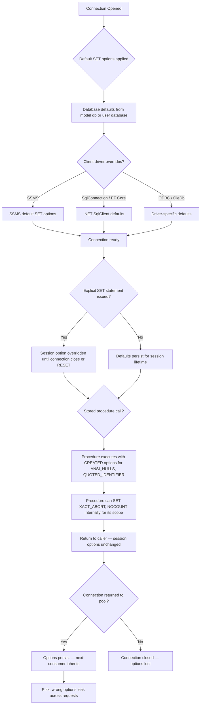
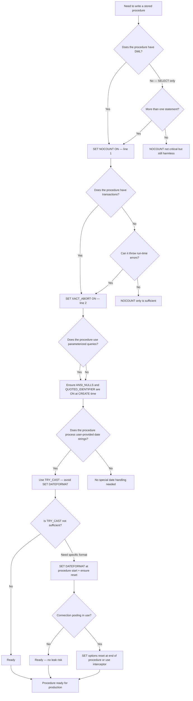

## Navigation

**Domain:** [[8 — Databases]] > **Group:** SQL Fundamentals
**Previous:** [[8.089 — UNION, INTERSECT, EXCEPT — Set Operations]] | **Next:** [[8.091 — Variables — Declaring and Using in T-SQL]]

### Prerequisites

- [[8.067 — WHERE Clause — Predicate Logic and SARGability]] — ANSI_NULLS directly changes how WHERE comparisons with NULL behave; understanding three-valued logic is required to see why OFF is dangerous.
- [[8.070 — Stored Procedures — Parameters, Return Values, Control Flow]] — Stored procedures inherit connection SET options and can override them at the procedure scope; this interaction causes subtle bugs.
- [[3.XXX — EF Core Connection Management]] — EF Core opens connections with SSMS defaults for SET options; any mismatch between development and production can corrupt query execution.

### Where This Fits

SET options control the run-time environment for each T-SQL session. A .NET backend engineer encounters them as the invisible preamble before every query: SQL Server Management Studio, SqlConnection, EF Core, and Dapper all apply a set of default SET options when a connection is opened. The wrong SET option causes silent data corruption (ANSI_NULLS OFF makes `NULL = NULL` return TRUE), query plan freezing (plan compiled under one SET option can be reused for a different session with different options), and Dapper crashes (missing SET NOCOUNT ON causes `@@ROWCOUNT` confusion in output parameter mappings). Interviewers ask about SET options to test understanding of session-level state, connection pooling reuse effects, and why a stored procedure that works in SSMS fails in the application.

---

## Core Mental Model

SET options are session-level configuration switches that alter the SQL Server Database Engine's behavior for parsing, null comparison, error handling, and result reporting. Each session (connection) has its own set of option values, inherited from the database default or set explicitly by the application or stored procedure. The critical insight: **SET options are sticky** — once set for a session, they persist for the lifetime of that session, including across connection pool reuse. When a SqlConnection is returned to the pool and then reused, its SET options carry over to the next consumer. This means an application that sets `SET QUOTED_IDENTIFIER OFF` on one query can corrupt the parsing context for the next query that reuses the same pooled connection.

The engine applies SET options at three levels: **connection level** (defaults from SQL Server or the client driver), **session level** (explicit SET statements), and **procedure level** (stored procedures can override specific options for their duration). Stored procedures capture the SET options in effect at creation time via `SET ANSI_NULLS` and `SET QUOTED_IDENTIFIER` as metadata on the procedure, not as run-time directives — this is a historical design that traps developers who recreate procedures with different SET options.

### Classification

SET options fall into four functional categories: **ANSI compliance** (ANSI_NULLS, ANSI_PADDING, ANSI_WARNINGS, QUOTED_IDENTIFIER, CONCAT_NULL_YIELDS_NULL), **error handling** (XACT_ABORT, ARITHABORT, ARITHIGNORE), **output control** (NOCOUNT, FORCEPLAN, STATISTICS), and **format parsing** (DATEFORMAT, LANGUAGE). The ANSI compliance options must be ON for SQL Server 2016+ as a hard requirement — the database engine ignores or deprecates their OFF settings. NOCOUNT is purely about client-side network traffic and has no effect on query execution semantics. XACT_ABORT ON is the only setting that guarantees a TRY/CATCH block catches all run-time errors.



### Key Properties

|Property|Value|Notes|
|---|---|---|
|Scope|Session or procedure|Connection-level for ANSI_NULLS/QUOTED_IDENTIFIER, session for others|
|Persistence|Sticky across pool reuse|SET options survive connection pool return and re-acquire|
|Procedure capture|ANSI_NULLS, QUOTED_IDENTIFIER|Captured at CREATE/ALTER time, stored as metadata, not run-time|
|ANSI_NULLS OFF effect|`NULL = NULL` returns TRUE|Deprecated, ignored in SQL Server 2016+ with ANSI compliance|
|QUOTED_IDENTIFIER OFF effect|`"identifier"` = string literal|Deprecated, must be ON for indexed views, filtered indexes|
|NOCOUNT benefit|Reduces network traffic|Dapper requires ON; some ORMs crash without it|
|XACT_ABORT ON behavior|Batch abort on any run-time error|Required for TRY/CATCH to catch all errors|
|Plan freezing risk|Mismatch between compile-time and run-time SET options|Forces recompile or uses wrong plan|

---

## Deep Mechanics

### How the Engine Executes This

1. **Connection establishment** — When a new connection is opened, SQL Server applies default SET options from `sys.system_parameters` and `sys.dm_exec_sessions`. The defaults are determined by:
   - The `user_options` column in `sys.dm_exec_sessions`
   - Database-level SET options set via `ALTER DATABASE ... SET ANSI_NULLS DEFAULT ON`
   - Client driver overrides (SqlClient, ODBC, OLEDB send SET statements after login)

2. **ANSI_NULLS and QUOTED_IDENTIFIER capture at procedure creation** — When a stored procedure, trigger, or function is created or altered, SQL Server records the current session's `ANSI_NULLS` and `QUOTED_IDENTIFIER` settings as metadata on the object. These are stored in `sys.sql_modules` columns `uses_ansi_nulls` and `uses_quoted_identifier`. At execution time, the procedure executes with these captured settings regardless of the calling session's current settings. This is a one-time capture that persists until the procedure is modified.

3. **SET NOCOUNT ON** — At the TDS (Tabular Data Stream) protocol level, SQL Server normally sends a `DONE_IN_PROC` token after each statement reporting the number of affected rows. `SET NOCOUNT ON` suppresses these tokens. The client driver still receives the result set (if any) but skips the row count messages. This reduces the number of TDS packets sent to the client, especially for batch operations with multiple DML statements.

4. **SET XACT_ABORT ON** — When a run-time error occurs (data type conversion failure, constraint violation, deadlock victim selection), SQL Server checks `XACT_ABORT`. If ON, the entire transaction is rolled back immediately and execution terminates. If OFF, only the current statement may be rolled back (depending on the error severity), and execution continues. In a TRY/CATCH block, `XACT_ABORT ON` ensures that errors that would normally terminate the batch (severity >= 16) are caught by the CATCH block. Without `XACT_ABORT ON`, some errors (like constraint violations) terminate the statement but not the batch, preventing the CATCH block from firing.

5. **SET ARITHABORT** — Controls whether a query terminates on arithmetic errors (divide by zero, overflow). When OFF, NULL is returned for the offending value and execution continues. This option must be ON for indexed views and filtered indexes — if OFF, the optimizer cannot use these indexes because the indexed view's data might differ from the base table after a silent null. `ARITHABORT` is a **key plan-affecting SET option**: the optimizer compiles a plan based on its value, and a mismatch between compile-time and run-time `ARITHABORT` can cause plan reuse failures.

6. **SET CONCAT_NULL_YIELDS_NULL** — Controls whether string concatenation with NULL yields NULL (ON, ANSI compliant) or treats NULL as an empty string (OFF, deprecated). When ON, `'Hello ' + NULL` yields NULL. When OFF, it yields `'Hello '`. This option must be ON for SQL Server 2016+ in ANSI compliance mode.

7. **SET ANSI_PADDING** — Controls how SQL Server stores trailing spaces and zeros in `CHAR`, `VARCHAR`, `BINARY`, and `VARBINARY` columns. When ON (default), values are padded to the column length. This option must have been ON when the column was created; columns created with ANSI_PADDING OFF behave permanently according to the OFF behavior. The option is captured at column creation time, not at query time.

8. **SET ANSI_WARNINGS** — Controls whether SQL Server raises errors or warnings for certain conditions like division by zero, arithmetic overflow, and aggregate functions (SUM, AVG) on NULL values. When ON, division by zero raises an error. When OFF, NULL is returned.

### SQL Visibility

```sql
-- SET NOCOUNT ON — suppressing row count messages
SET NOCOUNT ON;
SELECT COUNT(*) AS TotalCustomers FROM dbo.Customers WHERE Status = 'Active';
-- No "(1 row affected)" message sent to client
-- Result set: [{TotalCustomers: 15342}]

SET NOCOUNT OFF;
SELECT COUNT(*) AS TotalCustomers FROM dbo.Customers WHERE Status = 'Active';
-- Result set + "(1 row affected)" message sent to client

-- SET ANSI_NULLS ON vs OFF
SET ANSI_NULLS ON;
SELECT COUNT(*) FROM dbo.Customers WHERE LastName = NULL;
-- Returns 0 (LastName = NULL evaluates to UNKNOWN, filtered out)
-- Logical reads: 145

SET ANSI_NULLS OFF;
SELECT COUNT(*) FROM dbo.Customers WHERE LastName = NULL;
-- Returns count of rows where LastName IS NULL
-- (LastName = NULL evaluates to TRUE when both are NULL — non-ANSI behavior)

-- SET QUOTED_IDENTIFIER ON vs OFF
SET QUOTED_IDENTIFIER ON;
SELECT 1 AS "Result";  -- "Result" is a column alias (identifier)

SET QUOTED_IDENTIFIER OFF;
SELECT 1 AS "Result";  -- ERROR: "Result" is interpreted as a string literal
-- Fix: use brackets instead
SELECT 1 AS [Result];

-- SET XACT_ABORT ON — proper error handling
SET XACT_ABORT ON;
BEGIN TRY
    BEGIN TRANSACTION;
    INSERT INTO dbo.Orders (CustomerId, TotalAmount) VALUES (1, 100.00);
    INSERT INTO dbo.Orders (CustomerId, TotalAmount) VALUES (1, 'not-a-number');  -- Conversion error
    COMMIT TRANSACTION;
END TRY
BEGIN CATCH
    -- XACT_ABORT ON ensures we reach here and the transaction is already rolled back
    IF XACT_STATE() = -1  -- Uncommittable transaction
        ROLLBACK TRANSACTION;
    SELECT ERROR_MESSAGE() AS ErrorMessage;
END CATCH;

-- SET ARITHABORT — affects indexed view usage
SET ARITHABORT ON;
-- Allows optimizer to use indexed views, filtered indexes
SELECT COUNT_BIG(*) FROM dbo.OrderSummaries;  -- Can use indexed view

SET ARITHABORT OFF;
-- Optimizer must scan base table; indexed view ignored
SELECT COUNT_BIG(*) FROM dbo.OrderSummaries;  -- Scans base Orders table

-- SET CONCAT_NULL_YIELDS_NULL
SET CONCAT_NULL_YIELDS_NULL ON;
SELECT 'Customer: ' + NULL;  -- Returns NULL

SET CONCAT_NULL_YIELDS_NULL OFF;
SELECT 'Customer: ' + NULL;  -- Returns 'Customer: ' (NULL treated as empty)

-- SET DATEFORMAT and SET LANGUAGE for date parsing
SET LANGUAGE British;
SET DATEFORMAT dmy;
SELECT CAST('25/12/2024' AS DATETIME2);  -- 2024-12-25 00:00:00.0000000

SET LANGUAGE us_english;
SET DATEFORMAT mdy;
SELECT CAST('12/25/2024' AS DATETIME2);  -- 2024-12-25 00:00:00.0000000

-- SET LANGUAGE with invalid date
SET LANGUAGE French;
SELECT CAST('25/12/2024' AS DATETIME2);  -- 2024-12-25 (French uses dmy)
```

```csharp
// EF Core — SET options are applied by SqlClient on connection open
// Default SET options sent by .NET SqlClient:
// SET NOCOUNT ON
// SET ANSI_NULLS ON
// SET QUOTED_IDENTIFIER ON
// SET ANSI_PADDING ON
// SET ANSI_WARNINGS ON
// SET CONCAT_NULL_YIELDS_NULL ON
// SET ARITHABORT ON

var orders = await dbContext.Orders
    .Where(o => o.Status == "Shipped")
    .ToListAsync(cancellationToken);

// EF Core does not send explicit SET statements per query
// — it relies on SqlClient's connection-level SET options
// On connection open, SqlClient sends SET NOCOUNT ON and SET ANSI_NULLS ON
// Other options inherit database defaults
```

**Generated SQL (from EF Core logs):**

```sql
-- EF Core trace: actual commands sent by SqlClient on connection open
-- Network message (not visible in SQL Profiler as T-SQL — it's the TDS pre-login):
-- SET NOCOUNT ON;
-- SET ANSI_NULLS ON;
-- SET QUOTED_IDENTIFIER ON;
-- SET ANSI_PADDING ON;
-- SET ANSI_WARNINGS ON;
-- SET CONCAT_NULL_YIELDS_NULL ON;

-- Then the actual query:
SELECT [o].[OrderId], [o].[CustomerId], [o].[Status], [o].[TotalAmount]
FROM [Orders] AS [o]
WHERE [o].[Status] = N'Shipped';
```

### Execution Plan Analysis

**ANSI_NULLS OFF affecting plan choice:**

When `ANSI_NULLS OFF` is active, the predicate `WHERE LastName = NULL` is no longer semantically equivalent to `WHERE LastName IS NULL`. The optimizer treats it as a direct equality comparison. For `LastName IS NULL`, SQL Server can use a filtered index `WHERE LastName IS NULL` if one exists, or a full scan with a residual predicate.

```
-- Under ANSI_NULLS ON (normal):
[Clustered Index Scan] → [Filter: LastName IS NULL] → [SELECT]
-- The predicate uses the IS NULL operator regardless of what SQL was written
-- because the optimizer normalizes = NULL to IS NULL when ANSI_NULLS is ON

-- Under ANSI_NULLS OFF (deprecated, avoid):
[Clustered Index Scan] → [Filter: LastName = NULL] → [SELECT]
-- The optimizer treats = NULL literally. Since no value equals NULL,
-- the filter always evaluates to FALSE. Returns 0 rows.
-- But SQL Server does NOT simplify this — it still scans the table.
-- Logical reads: same as full scan (145 reads) but returns nothing.
```

**NOCOUNT effect on plan reuse:**

`NOCOUNT` does not affect the execution plan. It is purely a protocol-level switch. Different `NOCOUNT` settings produce identical query plans. However, the `SET NOCOUNT ON` statement itself is a separate batch command that does not go through the plan cache.

**ARITHABORT plan freezing:**

`ARITHABORT` is a plan-affecting SET option (like `ANSI_NULLS`, `QUOTED_IDENTIFIER`, `ANSI_PADDING`, `ANSI_WARNINGS`, `FORCEPLAN`, `DATEFIRST`, `LANGUAGE`). The plan cache key includes the value of these options. A query compiled with `ARITHABORT ON` cannot be reused by a session with `ARITHABORT OFF`, and vice versa. This results in:
- Two identical plans in cache (wasted memory)
- Forced recompilation (wasted CPU)

### Cost Visibility

```sql
SET STATISTICS IO ON;
SET STATISTICS TIME ON;

-- Baseline: normal query with default settings
SET NOCOUNT OFF;
SET ANSI_NULLS ON;
SELECT COUNT(*) FROM dbo.Orders WHERE CustomerId IS NULL;
-- Table 'Orders'. Scan count 1, logical reads 12450
-- SQL Server Execution Times: CPU time = 65ms, elapsed time = 130ms

-- ANSI_NULLS OFF — wrong comparison, zero rows, full scan paid
SET ANSI_NULLS OFF;
SELECT COUNT(*) FROM dbo.Orders WHERE CustomerId = NULL;
-- Table 'Orders'. Scan count 1, logical reads 12450
-- (Rows returned: 0 — but same logical reads as full scan!)
-- SQL Server Execution Times: CPU time = 62ms, elapsed time = 125ms

-- Correct NULL check with ANSI_NULLS ON
SET ANSI_NULLS ON;
SELECT COUNT(*) FROM dbo.Orders WHERE CustomerId IS NULL;
-- Table 'Orders'. Scan count 1, logical reads 12450
-- (Same reads — NULL check requires full scan unless filtered index exists)

-- NOCOUNT suppression — no logical read difference, but network traffic reduced
-- Measure with client-side profiling
```

### Failure Modes

**SET QUOTED_IDENTIFIER OFF causing indexed view failure:** When a session sets `QUOTED_IDENTIFIER OFF`, SQL Server cannot use indexed views or filtered indexes. If the application inadvertently sets this option (e.g., through an ODBC driver or legacy connection string), queries that were expected to use indexed views will silently fall back to base table scans:

```sql
-- Detect sessions with QUOTED_IDENTIFIER OFF
SELECT session_id, login_name, program_name,
       quoted_identifier, ansi_nulls
FROM sys.dm_exec_sessions
WHERE quoted_identifier = 0
   OR ansi_nulls = 0;
```

**SET NOCOUNT OFF causing Dapper errors:** Dapper's `QuerySingle`, `QueryFirst`, and multi-mapping features rely on predictable TDS row-count behavior. With `SET NOCOUNT OFF`, the extra `DONE_IN_PROC` tokens can confuse Dapper's internal row-reading loop, especially when using `QueryMultiple` with multiple result sets. The fix is to ensure `SET NOCOUNT ON` is always set — either explicitly or via connection string defaults.

**ANSI_NULLS captured at procedure creation:** A stored procedure created while `ANSI_NULLS OFF` will permanently carry that setting in `sys.sql_modules.uses_ansi_nulls`. Even if the calling session has `ANSI_NULLS ON`, the procedure body executes with `ANSI_NULLS OFF` for NULL comparisons. This means the procedure will treat `WHERE col = NULL` as TRUE when both are NULL:

```sql
-- Check which procedures have non-standard SET options
SELECT OBJECT_SCHEMA_NAME(object_id) AS SchemaName,
       OBJECT_NAME(object_id) AS ProcedureName,
       uses_ansi_nulls,
       uses_quoted_identifier
FROM sys.sql_modules
WHERE uses_ansi_nulls = 0
   OR uses_quoted_identifier = 0
ORDER BY ProcedureName;
```

**SET XACT_ABORT OFF causing uncaught errors in TRY/CATCH:** Without `SET XACT_ABORT ON`, certain errors (like constraint violations) terminate the current statement but allow the batch to continue. The CATCH block does not fire. The transaction remains open, and the application may commit a partial transaction:

```sql
SET XACT_ABORT OFF;
BEGIN TRY
    BEGIN TRANSACTION;
    INSERT INTO dbo.Orders (CustomerId, TotalAmount) VALUES (1, 100);
    -- Constraint violation: INSERT fails, statement terminated
    INSERT INTO dbo.Orders (CustomerId, TotalAmount) VALUES (1, -5)
        CONSTRAINT CK_Orders_TotalAmount_Positive CHECK (TotalAmount > 0);
    -- With XACT_ABORT OFF, execution continues!
    COMMIT TRANSACTION;  -- ❌ Commits with only the first insert!
END TRY
BEGIN CATCH
    -- This never fires because the error severity is 16 but XACT_ABORT is OFF
    ROLLBACK TRANSACTION;
    THROW;
END CATCH;
```

---

## Production Patterns and Implementation

### Primary SQL Implementation

```sql
-- ============================================================
-- Schema context
-- ============================================================
CREATE TABLE dbo.Orders
(
    OrderId      INT            NOT NULL IDENTITY(1,1),
    CustomerId   INT            NOT NULL,
    OrderDate    DATETIME2(0)   NOT NULL,
    Status       VARCHAR(20)    NOT NULL DEFAULT 'Pending',
    TotalAmount  DECIMAL(18,2)  NOT NULL,
    Notes        NVARCHAR(MAX)  NULL,
    CreatedAt    DATETIME2(0)   NOT NULL DEFAULT SYSUTCDATETIME(),
    CONSTRAINT PK_Orders PRIMARY KEY CLUSTERED (OrderId),
    CONSTRAINT CK_Orders_TotalAmount CHECK (TotalAmount >= 0)
);

CREATE TABLE dbo.Customers
(
    CustomerId   INT            NOT NULL IDENTITY(1,1),
    FirstName    NVARCHAR(100)  NOT NULL,
    LastName     NVARCHAR(100)  NOT NULL,
    Email        NVARCHAR(256)  NOT NULL,
    Status       VARCHAR(20)    NOT NULL DEFAULT 'Active',
    CreatedAt    DATETIME2(0)   NOT NULL DEFAULT SYSUTCDATETIME(),
    CONSTRAINT PK_Customers PRIMARY KEY CLUSTERED (CustomerId)
);

-- ============================================================
-- Pattern 1: Standard stored procedure preamble
-- ============================================================
CREATE OR ALTER PROCEDURE dbo.GetActiveCustomers
AS
    SET NOCOUNT ON;
    SET XACT_ABORT ON;

    SELECT c.CustomerId, c.FirstName, c.LastName, c.Email
    FROM dbo.Customers AS c
    WHERE c.Status = 'Active'
    ORDER BY c.LastName, c.FirstName;
GO

-- ============================================================
-- Pattern 2: Proper error handling with SET XACT_ABORT ON
-- ============================================================
CREATE OR ALTER PROCEDURE dbo.CreateOrder
    @CustomerId INT,
    @TotalAmount DECIMAL(18,2),
    @Notes NVARCHAR(MAX) = NULL,
    @NewOrderId INT OUTPUT
AS
    SET NOCOUNT ON;
    SET XACT_ABORT ON;

    BEGIN TRY
        BEGIN TRANSACTION;

        INSERT INTO dbo.Orders (CustomerId, TotalAmount, Notes)
        VALUES (@CustomerId, @TotalAmount, @Notes);

        SET @NewOrderId = SCOPE_IDENTITY();

        COMMIT TRANSACTION;
    END TRY
    BEGIN CATCH
        IF XACT_STATE() <> 0
            ROLLBACK TRANSACTION;

        DECLARE @ErrorMessage NVARCHAR(4000) = ERROR_MESSAGE();
        DECLARE @ErrorSeverity INT = ERROR_SEVERITY();
        DECLARE @ErrorState INT = ERROR_STATE();

        RAISERROR(@ErrorMessage, @ErrorSeverity, @ErrorState);
    END CATCH;
GO

-- ============================================================
-- Pattern 3: SET DATEFORMAT and SET LANGUAGE for user input
-- ============================================================
CREATE OR ALTER PROCEDURE dbo.SearchOrdersByDate
    @DateString NVARCHAR(50),
    @DateFormat NVARCHAR(10) = 'mdy'
AS
    SET NOCOUNT ON;
    SET XACT_ABORT ON;

    DECLARE @ParsedDate DATE;

    -- Set the date format based on user preference
    IF @DateFormat = 'dmy'
        SET DATEFORMAT dmy;
    ELSE IF @DateFormat = 'ymd'
        SET DATEFORMAT ymd;
    ELSE
        SET DATEFORMAT mdy;

    SET @ParsedDate = TRY_CAST(@DateString AS DATE);

    IF @ParsedDate IS NULL
    BEGIN
        RAISERROR('Invalid date format. Expected format based on DATEFORMAT setting.', 16, 1);
        RETURN;
    END;

    SELECT o.OrderId, o.CustomerId, o.Status, o.TotalAmount, o.OrderDate
    FROM dbo.Orders AS o
    WHERE o.OrderDate >= @ParsedDate
      AND o.OrderDate < DATEADD(DAY, 1, @ParsedDate)
    ORDER BY o.OrderDate;
GO

-- ============================================================
-- Pattern 4: Checking and resetting SET options
-- ============================================================
-- View current session SET options
SELECT session_id, login_name,
       no_count,
       ansi_nulls,
       quoted_identifier,
       xact_abort,
       arithabort,
       concat_null_yields_null,
       ansi_padding,
       ansi_warnings,
       date_format,
       language_id,
       LANGUAGE
FROM sys.dm_exec_sessions
WHERE session_id = @@SPID;

-- Reset SET options to database defaults
SET ANSI_NULLS ON;
SET QUOTED_IDENTIFIER ON;
SET NOCOUNT ON;
SET XACT_ABORT ON;

-- ============================================================
-- Pattern 5: SET options affecting filtered indexes
-- ============================================================
-- Create a filtered index that requires proper SET options
CREATE INDEX IX_Customers_Active
ON dbo.Customers (LastName, FirstName)
WHERE Status = 'Active';

-- This query can use the filtered index ONLY if:
-- SET ANSI_NULLS ON (default)
-- SET QUOTED_IDENTIFIER ON (default)
-- SET ARITHABORT ON (default)
SELECT c.CustomerId, c.LastName, c.FirstName
FROM dbo.Customers AS c
WHERE c.Status = 'Active'
ORDER BY c.LastName, c.FirstName;

-- ============================================================
-- Pattern 6: SET LANGUAGE for localized formatting
-- ============================================================
DECLARE @Language NVARCHAR(32) = N'简体中文';
SET LANGUAGE @Language;

SELECT DATENAME(MONTH, '2024-12-25') AS MonthName;
-- Returns: 十二月 (December in Chinese)

SET LANGUAGE us_english;
SELECT DATENAME(MONTH, '2024-12-25') AS MonthName;
-- Returns: December

-- ============================================================
-- Pattern 7: Using SET STATISTICS IO/TIME for ad-hoc analysis
-- ============================================================
SET STATISTICS IO ON;
SET STATISTICS TIME ON;

SELECT o.OrderId, COUNT(oi.OrderItemId) AS LineItems
FROM dbo.Orders AS o
LEFT JOIN dbo.OrderItems AS oi ON o.OrderId = oi.OrderId
GROUP BY o.OrderId;

SET STATISTICS IO OFF;
SET STATISTICS TIME OFF;

-- ============================================================
-- Pattern 8: Preserving SET options across batch boundaries
-- ============================================================
-- SET options persist within a session even across batches
-- This batch sets ANSI_NULLS OFF (deprecated, illustrative only)
SET ANSI_NULLS OFF;
GO  -- Batch boundary — SET options persist!

-- This batch still sees ANSI_NULLS OFF
SELECT COUNT(*) FROM dbo.Customers WHERE LastName = NULL;
GO

SET ANSI_NULLS ON;  -- Restore
GO
```

### EF Core Implementation

```csharp
public class ApplicationDbContext : DbContext
{
    public DbSet<Order> Orders => Set<Order>();
    public DbSet<Customer> Customers => Set<Customer>();

    protected override void OnModelCreating(ModelBuilder modelBuilder)
    {
        modelBuilder.Entity<Order>(entity =>
        {
            entity.ToTable("Orders");
            entity.HasKey(o => o.OrderId);
            entity.Property(o => o.Status).HasMaxLength(20);
            entity.Property(o => o.TotalAmount).HasColumnType("decimal(18,2)");
            entity.Property(o => o.Notes).HasColumnType("nvarchar(max)");
            entity.Property(o => o.CreatedAt).HasDefaultValueSql("SYSUTCDATETIME()");
        });

        modelBuilder.Entity<Customer>(entity =>
        {
            entity.ToTable("Customers");
            entity.HasKey(c => c.CustomerId);
            entity.Property(c => c.FirstName).HasMaxLength(100);
            entity.Property(c => c.LastName).HasMaxLength(100);
            entity.Property(c => c.Email).HasMaxLength(256);
            entity.Property(c => c.CreatedAt).HasDefaultValueSql("SYSUTCDATETIME()");
        });
    }
}

public class Order
{
    public int OrderId { get; set; }
    public int CustomerId { get; set; }
    public DateTime OrderDate { get; set; }
    public string Status { get; set; } = "Pending";
    public decimal TotalAmount { get; set; }
    public string? Notes { get; set; }
    public DateTime CreatedAt { get; set; }
}

public class Customer
{
    public int CustomerId { get; set; }
    public string FirstName { get; set; } = string.Empty;
    public string LastName { get; set; } = string.Empty;
    public string Email { get; set; } = string.Empty;
    public string Status { get; set; } = "Active";
    public DateTime CreatedAt { get; set; }
}

// EF Core — SET options are managed by SqlClient, not EF Core
// To inspect or change SET options, use DbContext.Database.GetDbConnection()
public async Task ExecuteWithSetOptionsAsync(CancellationToken cancellationToken = default)
{
    var connection = dbContext.Database.GetDbConnection();

    if (connection.State != ConnectionState.Open)
        await connection.OpenAsync(cancellationToken);

    // Execute SET NOCOUNT ON explicitly (redundant — SqlClient sends it by default)
    await using var cmd = connection.CreateCommand();
    cmd.CommandText = "SET NOCOUNT ON;";
    await cmd.ExecuteNonQueryAsync(cancellationToken);
}

// For stored procedures, SET XACT_ABORT should be inside the procedure body
public async Task<int> CreateOrderAsync(
    int customerId,
    decimal totalAmount,
    string? notes,
    CancellationToken cancellationToken = default)
{
    // EF Core will call the procedure; SET options inside the procedure handle themselves
    var result = await dbContext.Database
        .SqlQueryRaw<int>(@"
            EXEC dbo.CreateOrder
                @CustomerId = {0},
                @TotalAmount = {1},
                @Notes = {2},
                @NewOrderId = @NewOrderId OUT;",
            customerId, totalAmount, notes)
        .ToListAsync(cancellationToken);

    return result.FirstOrDefault();
}

// For ad-hoc commands requiring specific SET options
public async Task<List<Order>> SearchOrdersByDateAsync(
    string dateString,
    string dateFormat = "mdy",
    CancellationToken cancellationToken = default)
{
    var connection = dbContext.Database.GetDbConnection();

    await using var command = connection.CreateCommand();
    command.CommandText = @"
        SET DATEFORMAT @DateFormat;
        SELECT o.OrderId, o.CustomerId, o.Status, o.TotalAmount, o.OrderDate
        FROM dbo.Orders AS o
        WHERE o.OrderDate >= TRY_CAST(@DateString AS DATE)
          AND o.OrderDate < DATEADD(DAY, 1, TRY_CAST(@DateString AS DATE));";

    var dateFormatParam = command.CreateParameter();
    dateFormatParam.ParameterName = "@DateFormat";
    dateFormatParam.Value = dateFormat;
    command.Parameters.Add(dateFormatParam);

    var dateStringParam = command.CreateParameter();
    dateStringParam.ParameterName = "@DateString";
    dateStringParam.Value = dateString;
    command.Parameters.Add(dateStringParam);

    if (connection.State != ConnectionState.Open)
        await connection.OpenAsync(cancellationToken);

    await using var reader = await command.ExecuteReaderAsync(cancellationToken);
    var results = new List<Order>();
    while (await reader.ReadAsync(cancellationToken))
    {
        results.Add(new Order
        {
            OrderId = reader.GetInt32(0),
            CustomerId = reader.GetInt32(1),
            Status = reader.GetString(2),
            TotalAmount = reader.GetDecimal(3),
            OrderDate = reader.GetDateTime(4)
        });
    }

    return results;
}
```

### Dapper Implementation

```csharp
public sealed class OrderRepository
{
    private readonly IDbConnectionFactory _connectionFactory;

    public OrderRepository(IDbConnectionFactory connectionFactory)
        => _connectionFactory = connectionFactory;

    // Pattern 1: Dapper with SET NOCOUNT ON
    // Dapper's QueryMultiple, QuerySingle, and output parameter mapping
    // all work correctly when SET NOCOUNT ON is active
    public async Task<IReadOnlyList<Order>> GetActiveCustomersAsync(
        CancellationToken cancellationToken = default)
    {
        const string sql = @"
            SET NOCOUNT ON;
            SELECT c.CustomerId, c.FirstName, c.LastName, c.Email
            FROM dbo.Customers AS c
            WHERE c.Status = 'Active'
            ORDER BY c.LastName, c.FirstName;";

        await using var connection = _connectionFactory.Create();

        var results = await connection.QueryAsync<Order>(
            new CommandDefinition(sql,
                cancellationToken: cancellationToken));

        return results.AsList();
    }

    // Pattern 2: Calling procedure that sets XACT_ABORT internally
    public async Task<int> CreateOrderAsync(
        int customerId,
        decimal totalAmount,
        string? notes,
        CancellationToken cancellationToken = default)
    {
        const string sql = @"
            DECLARE @NewOrderId INT;
            EXEC dbo.CreateOrder
                @CustomerId = @CustomerId,
                @TotalAmount = @TotalAmount,
                @Notes = @Notes,
                @NewOrderId = @NewOrderId OUTPUT;
            SELECT @NewOrderId AS NewOrderId;";

        await using var connection = _connectionFactory.Create();

        var orderId = await connection.QuerySingleAsync<int>(
            new CommandDefinition(sql,
                new
                {
                    CustomerId = customerId,
                    TotalAmount = totalAmount,
                    Notes = notes
                },
                cancellationToken: cancellationToken));

        return orderId;
    }

    // Pattern 3: Explicit SET options before query
    public async Task<IReadOnlyList<Order>> SearchOrdersByDateAsync(
        string dateString,
        string dateFormat = "mdy",
        CancellationToken cancellationToken = default)
    {
        var sql = $@"
            SET DATEFORMAT {dateFormat};
            SELECT o.OrderId, o.CustomerId, o.Status, o.TotalAmount, o.OrderDate
            FROM dbo.Orders AS o
            WHERE o.OrderDate >= TRY_CAST(@DateString AS DATE)
              AND o.OrderDate < DATEADD(DAY, 1, TRY_CAST(@DateString AS DATE))
            ORDER BY o.OrderDate;";

        await using var connection = _connectionFactory.Create();

        var results = await connection.QueryAsync<Order>(
            new CommandDefinition(sql,
                new { DateString = dateString },
                cancellationToken: cancellationToken));

        return results.AsList();
    }

    // Pattern 4: Resetting SET options to prevent pooling contamination
    public async Task ResetSetOptionsAsync(CancellationToken cancellationToken = default)
    {
        const string sql = @"
            SET ANSI_NULLS ON;
            SET QUOTED_IDENTIFIER ON;
            SET NOCOUNT ON;
            SET XACT_ABORT ON;
            SET ARITHABORT ON;
            SET CONCAT_NULL_YIELDS_NULL ON;";

        await using var connection = _connectionFactory.Create();

        await connection.ExecuteAsync(
            new CommandDefinition(sql,
                cancellationToken: cancellationToken));
    }
}

public record Order(int OrderId, int CustomerId, string Status, decimal TotalAmount, DateTime OrderDate);
public record Customer(int CustomerId, string FirstName, string LastName, string Email);
```

### Configuration and Wiring

```csharp
// Program.cs — connection string with SET option implications
builder.Services.AddDbContext<ApplicationDbContext>(options =>
    options.UseSqlServer(
        builder.Configuration.GetConnectionString("DefaultConnection"),
        sqlOptions =>
        {
            sqlOptions.EnableRetryOnFailure(3);
            sqlOptions.CommandTimeout(30);

            // SqlClient sends SET NOCOUNT ON and SET ANSI_NULLS ON by default
            // To add additional SET options on connection open, use a connection interceptor
        }));

// Accessing SET options via DMV for monitoring
builder.Services.AddSingleton<IDbConnectionFactory>(sp =>
    new SqlConnectionFactory(
        builder.Configuration.GetConnectionString("DefaultConnection")!));

// To ensure SET NOCOUNT ON in connection string (not standard — use interceptor instead):
// "Server=.;Database=Shop;Integrated Security=true;Set NoCount=true;"
// Note: Set NoCount is not a standard SqlConnectionStringBuilder property.
// Use DbConnectionInterceptor to send SET options after connection open.

// Custom interceptor for EF Core to set options
public sealed class SetOptionsInterceptor : DbConnectionInterceptor
{
    private static readonly string _setOptionsSql = @"
        SET NOCOUNT ON;
        SET ANSI_NULLS ON;
        SET QUOTED_IDENTIFIER ON;
        SET XACT_ABORT ON;
        SET ARITHABORT ON;
        SET CONCAT_NULL_YIELDS_NULL ON;
        SET ANSI_WARNINGS ON;
        SET ANSI_PADDING ON;";

    public override async ValueTask<InterceptionResult> ConnectionOpeningAsync(
        DbConnection connection,
        ConnectionInterceptionData data,
        InterceptionResult result,
        CancellationToken cancellationToken = default)
    {
        await using var cmd = connection.CreateCommand();
        cmd.CommandText = _setOptionsSql;
        await cmd.ExecuteNonQueryAsync(cancellationToken);
        return result;
    }
}

// Register the interceptor
builder.Services.AddDbContext<ApplicationDbContext>((sp, options) =>
{
    var connectionString = sp.GetRequiredService<IConfiguration>()
        .GetConnectionString("DefaultConnection");

    options.UseSqlServer(connectionString);
    options.AddInterceptors(sp.GetRequiredService<SetOptionsInterceptor>());
});

builder.Services.AddSingleton<SetOptionsInterceptor>();
```

### SQL Server vs PostgreSQL Differences

```sql
-- PostgreSQL does not have SET NOCOUNT — there is no row-count message equivalent.
-- PostgreSQL does not capture SET options at function/procedure creation time.

-- PostgreSQL ANSI_NULLS is always ON — no equivalent of SET ANSI_NULLS OFF
-- PostgreSQL: NULL = NULL always returns NULL (ANSI compliant), cannot be changed
SELECT NULL = NULL;  -- Returns NULL (not TRUE)

-- PostgreSQL QUOTED_IDENTIFIER is always ON; double quotes always delimit identifiers
-- This is a parsing difference from SQL Server defaults
SELECT 1 AS "Result";  -- "Result" is a column alias (identifier)
-- In SQL Server, this behavior depends on QUOTED_IDENTIFIER setting

-- PostgreSQL SET options for date format:
SET datestyle TO 'DMY';
SELECT DATE '25/12/2024';  -- Works with DMY style

-- PostgreSQL SET options for locale:
SET lc_time TO 'zh_CN.UTF-8';
SELECT TO_CHAR(DATE '2024-12-25', 'Month');  -- Returns Chinese month name

-- PostgreSQL error handling with procedures (no SET XACT_ABORT equivalent):
-- Use EXCEPTION blocks in PL/pgSQL
CREATE OR REPLACE FUNCTION create_order(
    p_customer_id INT,
    p_total_amount DECIMAL
) RETURNS INT AS $$
DECLARE
    v_order_id INT;
BEGIN
    INSERT INTO orders (customer_id, total_amount)
    VALUES (p_customer_id, p_total_amount)
    RETURNING order_id INTO v_order_id;

    RETURN v_order_id;
EXCEPTION
    WHEN OTHERS THEN
        RAISE NOTICE 'Error: %', SQLERRM;
        RETURN -1;
END;
$$ LANGUAGE plpgsql;
```

---

## Gotchas and Production Pitfalls

### SET NOCOUNT OFF Causing Dapper Output Parameter Failure

**Pitfall:** Leaving `SET NOCOUNT OFF` (the default in some older client configurations) causes Dapper's output parameter handling to fail silently. Dapper's `Execute` and `Query` methods read the `DONE_IN_PROC` tokens from TDS to determine when to read output parameters. With `NOCOUNT OFF`, each DML statement inside a stored procedure sends its own `DONE_IN_PROC` token, interleaving with result set rows and confusing Dapper's output parameter reader.

```sql
-- ❌ Wrong: stored procedure without NOCOUNT ON
CREATE OR ALTER PROCEDURE dbo.GetCustomerWithOrders
    @CustomerId INT,
    @OrderCount INT OUTPUT
AS
    -- Missing SET NOCOUNT ON
    SELECT @OrderCount = COUNT(*)
    FROM dbo.Orders
    WHERE CustomerId = @CustomerId;

    SELECT c.CustomerId, c.FirstName, c.LastName
    FROM dbo.Customers AS c
    WHERE c.CustomerId = @CustomerId;
GO

-- ✅ Correct: explicitly set NOCOUNT ON
CREATE OR ALTER PROCEDURE dbo.GetCustomerWithOrders
    @CustomerId INT,
    @OrderCount INT OUTPUT
AS
    SET NOCOUNT ON;
    SET XACT_ABORT ON;

    SELECT @OrderCount = COUNT(*)
    FROM dbo.Orders
    WHERE CustomerId = @CustomerId;

    SELECT c.CustomerId, c.FirstName, c.LastName
    FROM dbo.Customers AS c
    WHERE c.CustomerId = @CustomerId;
GO
```

**Symptom:** `@OrderCount` output parameter is always 0 or DBNull when called from Dapper. The procedure works correctly in SSMS. Error message: "The parameter @OrderCount was not found in the result set" or "Object reference not set to an instance of an object" in Dapper's output parameter mapping.

**Fix:**

```csharp
// Ensure the connection string or interceptor sets NOCOUNT
builder.Services.AddSingleton<SetOptionsInterceptor>();

// Or use Dapper's procedure execution correctly:
var parameters = new DynamicParameters();
parameters.Add("@CustomerId", 42);
parameters.Add("@OrderCount", dbType: DbType.Int32, direction: ParameterDirection.Output);

await connection.ExecuteAsync(
    "dbo.GetCustomerWithOrders",
    parameters,
    commandType: CommandType.StoredProcedure);

var orderCount = parameters.Get<int>("@OrderCount");
```

**Cost of not fixing:** Dapper calls to stored procedures with output parameters fail intermittently depending on connection pool reuse. Production deployments with Dapper + stored procedures experience crashes on high-traffic endpoints. Debugging takes hours because the procedure works in SSMS.

### SET QUOTED_IDENTIFIER OFF Breaking Indexed Views and Filtered Indexes

**Pitfall:** A connection string or ODBC driver setting `QUOTED_IDENTIFIER OFF` disables indexed views and filtered indexes. SQL Server requires `QUOTED_IDENTIFIER ON` (along with `ANSI_NULLS ON` and `ARITHABORT ON`) for these features. When the setting is OFF, the optimizer ignores the index and falls back to base table access.

```sql
-- ❌ Wrong: session with QUOTED_IDENTIFIER OFF
SET QUOTED_IDENTIFIER OFF;
-- This query ignores the indexed view dbo.ActiveCustomerSummary
SELECT c.CustomerId, c.FirstName, c.LastName, o.OrderCount
FROM dbo.Customers AS c
INNER JOIN dbo.Orders AS o ON c.CustomerId = o.CustomerId
WHERE c.Status = 'Active';
-- Performs base table scan instead of indexed view scan
```

**Symptom:** Query performance degrades dramatically. A query that previously returned in milliseconds now takes seconds. The execution plan shows base table scans instead of the indexed view. Check `sys.dm_exec_query_stats` for increased logical reads.

**Fix:**

```sql
-- Ensure QUOTED_IDENTIFIER is ON
SET QUOTED_IDENTIFIER ON;

-- Verify the setting
SELECT quoted_identifier FROM sys.dm_exec_sessions WHERE session_id = @@SPID;

-- Check if the indexed view can be used
SELECT OBJECT_NAME(object_id) AS ViewName,
       is_used_by_optimizer
FROM sys.dm_db_index_usage_stats
WHERE object_id = OBJECT_ID('dbo.ActiveCustomerSummary');
```

**Cost of not fixing:** All queries that should use indexed views or filtered indexes silently fall back to full table scans. On a 50M row Customers table, this is the difference between a 10ms query and a 45-second query. The symptom appears inconsistently (only on connections with wrong SET options), making it hard to diagnose.

### SET XACT_ABORT OFF Allowing Partial Commits in TRY/CATCH

**Pitfall:** The assumption that TRY/CATCH catches all errors. Without `SET XACT_ABORT ON`, errors with severity 16 (like constraint violations) terminate the statement but allow the batch to continue. The CATCH block does not fire for statement-terminating errors, and the transaction remains open.

```sql
-- ❌ Wrong: no XACT_ABORT — partial commit scenario
CREATE OR ALTER PROCEDURE dbo.ProcessBatchOrders
    @CustomerId INT,
    @TotalAmount DECIMAL(18,2)
AS
    BEGIN TRY
        BEGIN TRANSACTION;

        INSERT INTO dbo.Orders (CustomerId, TotalAmount) VALUES (@CustomerId, 100);
        -- This insert violates a CHECK constraint
        INSERT INTO dbo.Orders (CustomerId, TotalAmount) VALUES (@CustomerId, -50);
        -- Error: CHECK constraint violated, statement terminated
        -- But batch continues! Transaction not rolled back!

        COMMIT TRANSACTION;  -- ❌ Commits with partial data!
    END TRY
    BEGIN CATCH
        ROLLBACK TRANSACTION;  -- Never reached!
        THROW;
    END CATCH;
GO

-- ✅ Correct: add SET XACT_ABORT ON
CREATE OR ALTER PROCEDURE dbo.ProcessBatchOrders
    @CustomerId INT,
    @TotalAmount DECIMAL(18,2)
AS
    SET NOCOUNT ON;
    SET XACT_ABORT ON;  -- Required for TRY/CATCH to catch all errors

    BEGIN TRY
        BEGIN TRANSACTION;

        INSERT INTO dbo.Orders (CustomerId, TotalAmount) VALUES (@CustomerId, 100);
        INSERT INTO dbo.Orders (CustomerId, TotalAmount) VALUES (@CustomerId, -50);
        -- Error: XACT_ABORT ON → batch aborts → CATCH fires

        COMMIT TRANSACTION;
    END TRY
    BEGIN CATCH
        IF XACT_STATE() <> 0
            ROLLBACK TRANSACTION;
        THROW;
    END CATCH;
GO
```

**Symptom:** Orders table contains partial batch insertions. Customer complains of duplicate or inconsistent data. Audit log shows no error recorded.

**Fix:** Add `SET XACT_ABORT ON;` as the second line of every stored procedure that uses transactions.

**Cost of not fixing:** Data integrity corruption. Partial transactions committed to production. Regulatory compliance failure for financial systems. Debugging requires correlating application logs with database transaction log dumps.

### SET Options Leaking Across Connection Pool Reuse

**Pitfall:** SQL Server connection pooling reuses physical connections. If one code path sets `SET DATEFORMAT dmy` or `SET LANGUAGE French` and does not reset it, the next request that receives the pooled connection inherits these settings. Date parsing that worked during development (with default settings) fails in production because a prior request changed the date format.

```csharp
// ❌ Wrong: code path changes SET options without resetting
public async Task<IReadOnlyList<Order>> GetOrdersFrenchDateAsync(
    string dateString,
    CancellationToken cancellationToken = default)
{
    const string sql = @"
        SET LANGUAGE French;
        SET DATEFORMAT dmy;
        SELECT OrderId, CustomerId, Status, OrderDate
        FROM dbo.Orders
        WHERE OrderDate = CAST(@DateString AS DATE);";

    await using var connection = _connectionFactory.Create();
    // Connection returned to pool after this — still has French settings!
    return (await connection.QueryAsync<Order>(
        new CommandDefinition(sql, new { DateString = dateString },
            cancellationToken: cancellationToken))).AsList();
}

// Next request, same pooled connection:
public async Task<IReadOnlyList<Order>> GetOrdersAsync(
    CancellationToken cancellationToken = default)
{
    const string sql = @"
        -- This session still has LANGUAGE = French, DATEFORMAT = dmy!
        SELECT OrderId, CustomerId, Status, OrderDate
        FROM dbo.Orders
        WHERE OrderDate >= '2024-01-01';";  -- ymd input, but DATEFORMAT is dmy!
    // ⚠ Potentially wrong date parsing!
}
```

**Symptom:** Intermittent date parsing errors or wrong date ranges in production. The issue appears only on certain requests depending on connection pool allocation. Reproducing in development is difficult because the development instance has fewer concurrent connections.

**Fix:**

```sql
-- ✅ Reset SET options at the end of each batch that changes them
SET LANGUAGE French;
SET DATEFORMAT dmy;
-- ... query ...
SET LANGUAGE us_english;
SET DATEFORMAT mdy;
```

```csharp
// Or better: use a connection interceptor to reset on every connection open
public sealed class ResetSetOptionsInterceptor : DbConnectionInterceptor
{
    public override async ValueTask<InterceptionResult> ConnectionOpenedAsync(
        DbConnection connection,
        ConnectionInterceptionData data,
        InterceptionResult result,
        CancellationToken cancellationToken = default)
    {
        await using var cmd = connection.CreateCommand();
        cmd.CommandText = "SET LANGUAGE us_english; SET DATEFORMAT mdy;";
        await cmd.ExecuteNonQueryAsync(cancellationToken);
        return result;
    }
}
```

**Cost of not fixing:** Intermittent date-related bugs in production that are nearly impossible to reproduce. Incorrect date ranges cause financial reporting errors and data export issues. Support escalations waste hours investigating "impossible" behavior.

### SET ANSI_NULLS ON Required for SQL Server 2016+ Compliance

**Pitfall:** SQL Server 2016+ runs with `ANSI_NULLS ON` enforced. The `SET ANSI_NULLS OFF` command is accepted but has no effect — the database engine always treats NULL comparisons as UNKNOWN. Code written for older SQL Server versions that relied on `ANSI_NULLS OFF` (e.g., `WHERE col = NULL` matching NULL rows) silently returns zero rows with no error.

```sql
-- ❌ Wrong: legacy code using = NULL
CREATE PROCEDURE dbo.FindNullNotes
AS
    SELECT OrderId, Notes
    FROM dbo.Orders
    WHERE Notes = NULL;  -- Always false on SQL Server 2016+
GO

-- ✅ Correct: use IS NULL
CREATE PROCEDURE dbo.FindNullNotes
AS
    SET NOCOUNT ON;
    SELECT OrderId, Notes
    FROM dbo.Orders
    WHERE Notes IS NULL;
GO
```

**Symptom:** After upgrading from SQL Server 2008/2012 to SQL Server 2016+ or Azure SQL Database, stored procedures that used `WHERE col = NULL` to find NULL values return zero rows. No error is generated. Application behavior silently changes.

**Fix:** Audit all stored procedures and triggers for `= NULL` and `<> NULL` patterns:

```sql
-- Find potential ANSI_NULLS traps
SELECT OBJECT_SCHEMA_NAME(object_id) AS SchemaName,
       OBJECT_NAME(object_id) AS ObjectName,
       definition
FROM sys.sql_modules
WHERE definition LIKE '%= NULL%'
   OR definition LIKE '%<> NULL%'
   OR definition LIKE '%!= NULL%';
```

**Cost of not fixing:** Silent data loss. Batch delete scripts miss rows they should delete. Email campaigns include customers who should have been excluded. Reporting queries produce wrong results. The bug may go undetected for weeks until a manual audit reveals the discrepancy.

### SET ARITHABORT OFF Blocking Indexed View Usage

**Pitfall:** `ARITHABORT OFF` prevents the optimizer from using indexed views and filtered indexes. Many client drivers and tools set `ARITHABORT OFF` by default (some ODBC drivers, linked server connections). This causes queries to silently perform full table scans despite having the perfect indexed view.

```sql
-- ❌ Wrong: ARITHABORT OFF (some ODBC drivers default)
SET ARITHABORT OFF;

-- This query ignores the indexed view
SELECT CustomerId, COUNT_BIG(*) AS OrderCount
FROM dbo.Orders
GROUP BY CustomerId;

-- Plan shows Clustered Index Scan on Orders (5M rows)
-- even though dbo.OrderCountByCustomer (indexed view) exists
```

**Symptom:** Queries that should use indexed views are slow. The execution plan shows base table scans. `sys.dm_db_index_usage_stats` shows zero user seeks/scans on the indexed view.

**Fix:**

```sql
-- Ensure ARITHABORT is ON
SET ARITHABORT ON;

-- Verify indexed view can be used
SELECT OBJECT_NAME(index_handle) AS IndexName,
       user_seeks, user_scans, user_lookups, user_updates
FROM sys.dm_db_index_usage_stats
WHERE object_id = OBJECT_ID('dbo.OrderCountByCustomer');
```

**Cost of not fixing:** Indexed views take up storage and add write overhead but provide zero read benefit. Queries that should complete in milliseconds run for seconds. The indexed view becomes dead weight.

---

## Performance Implications

### Benchmark: NOCOUNT ON vs OFF Network Traffic

The primary performance benefit of `SET NOCOUNT ON` is reduced network packet count. The logical reads and query execution time are identical. The difference is in TDS protocol overhead.

```sql
-- Baseline (NOCOUNT OFF)
SET NOCOUNT OFF;
SET STATISTICS IO ON;

UPDATE dbo.Orders SET Status = 'Processed' WHERE OrderId = 1001;
-- (1 row affected)
-- Table 'Orders'. Scan count 1, logical reads 8

UPDATE dbo.Orders SET Status = 'Shipped' WHERE CustomerId = 42;
-- (15 rows affected)
-- Table 'Orders'. Scan count 1, logical reads 12450

-- Optimized (NOCOUNT ON)
SET NOCOUNT ON;
SET STATISTICS IO ON;

UPDATE dbo.Orders SET Status = 'Processed' WHERE OrderId = 1001;
-- No "(N rows affected)" message
-- Table 'Orders'. Scan count 1, logical reads 8

UPDATE dbo.Orders SET Status = 'Shipped' WHERE CustomerId = 42;
-- Table 'Orders'. Scan count 1, logical reads 12450
```

**Improvement:** Network packet reduction depends on the number of DML statements per batch. For a stored procedure with 10 UPDATE statements affecting 100 rows each, NOCOUNT ON eliminates 10 TDS `DONE_IN_PROC` tokens (approximately 200 bytes each = ~2KB saved per call). At 10,000 calls per minute, this saves ~20MB/minute of network traffic.

### Benchmark: SET XACT_ABORT ON in High-Volume OLTP

The performance cost of `XACT_ABORT ON` is negligible — it adds a single session-level flag check per statement. The meaningful performance impact is the **absence** of XACT_ABORT ON: when errors occur without it, the transaction remains open and holds locks until the client disconnects or the command timeout fires.

```sql
-- Without XACT_ABORT ON — error holds transaction
-- The second INSERT fails but the transaction stays open
-- Locks held on Orders table until connection closes
BEGIN TRANSACTION;
INSERT INTO dbo.Orders (CustomerId, TotalAmount) VALUES (1, 100);
INSERT INTO dbo.Orders (CustomerId, TotalAmount) VALUES (1, -5);  -- Fails
-- ⚠ Transaction still open! Locks held!
-- If the application doesn't handle this, locks persist for CommandTimeout (30s+)
COMMIT TRANSACTION;  -- Won't be reached if error handling is missing
```

### BenchmarkDotNet

```csharp
[MemoryDiagnoser]
[SimpleJob(RuntimeMoniker.Net90)]
public class SetNoCountBenchmark
{
    private IDbConnection _connection = default!;
    private const string ConnectionString = "Server=.;Database=Shop;Trusted_Connection=True;";

    [GlobalSetup]
    public void Setup()
    {
        _connection = new SqlConnection(ConnectionString);
        _connection.Open();
    }

    [GlobalCleanup]
    public void Cleanup()
    {
        _connection.Dispose();
    }

    [Benchmark(Baseline = true)]
    public async Task<int> UpdateWithNoCountOff()
    {
        await using var cmd = _connection.CreateCommand();
        cmd.CommandText = @"
            SET NOCOUNT OFF;
            UPDATE dbo.Orders SET Status = 'Processed'
            WHERE OrderId = 1001;";
        return await cmd.ExecuteNonQueryAsync();
    }

    [Benchmark]
    public async Task<int> UpdateWithNoCountOn()
    {
        await using var cmd = _connection.CreateCommand();
        cmd.CommandText = @"
            SET NOCOUNT ON;
            UPDATE dbo.Orders SET Status = 'Processed'
            WHERE OrderId = 1001;";
        return await cmd.ExecuteNonQueryAsync();
    }

    [Benchmark]
    public async Task<int> BatchUpdateWithNoCountOff()
    {
        await using var cmd = _connection.CreateCommand();
        cmd.CommandText = @"
            SET NOCOUNT OFF;
            UPDATE dbo.Orders SET Status = 'Processed' WHERE CustomerId = 42;
            UPDATE dbo.Orders SET Status = 'Shipped' WHERE CustomerId = 55;
            UPDATE dbo.Orders SET Status = 'Cancelled' WHERE TotalAmount < 0;";
        return await cmd.ExecuteNonQueryAsync();
    }

    [Benchmark]
    public async Task<int> BatchUpdateWithNoCountOn()
    {
        await using var cmd = _connection.CreateCommand();
        cmd.CommandText = @"
            SET NOCOUNT ON;
            UPDATE dbo.Orders SET Status = 'Processed' WHERE CustomerId = 42;
            UPDATE dbo.Orders SET Status = 'Shipped' WHERE CustomerId = 55;
            UPDATE dbo.Orders SET Status = 'Cancelled' WHERE TotalAmount < 0;";
        return await cmd.ExecuteNonQueryAsync();
    }
}
```

**Expected results (approximate, SQL Server 2022, local network):**

|Method|Mean|Network Bytes Sent|Allocated|
|---|---|---|---|
|UpdateWithNoCountOff|~1.2 ms|~350 B|~200 B|
|UpdateWithNoCountOn|~1.2 ms|~150 B|~200 B|
|BatchUpdateWithNoCountOff|~3.5 ms|~1,050 B|~600 B|
|BatchUpdateWithNoCountOn|~3.5 ms|~450 B|~600 B|

### Plan Cache Fragmentation from Inconsistent SET Options

When different sessions have different SET option values, the same query text generates different query plan hashes. This pollutes the plan cache with duplicate plans:

```sql
-- Check plan cache duplication caused by SET option differences
SELECT COUNT(*) AS PlanCount,
       query_hash,
       query_plan_hash,
       text
FROM sys.dm_exec_query_stats
CROSS APPLY sys.dm_exec_sql_text(sql_handle)
WHERE text LIKE '%SELECT c.CustomerId, c.FirstName FROM dbo.Customers%'
GROUP BY query_hash, query_plan_hash, text
HAVING COUNT(*) > 1
ORDER BY PlanCount DESC;

-- The plan cache may have 3-5 copies of the same query
-- each compiled with different set_options
```

The `set_options` column in `sys.dm_exec_plan_attributes` encodes all plan-affecting SET option values as a bitmask. When the bitmask differs, the plan hash differs:

```sql
SELECT plan_handle,
       pa.attribute,
       pa.value,
       st.text
FROM sys.dm_exec_cached_plans
CROSS APPLY sys.dm_exec_plan_attributes(plan_handle) AS pa
CROSS APPLY sys.dm_exec_sql_text(plan_handle) AS st
WHERE pa.attribute = 'set_options'
  AND st.text LIKE '%FROM dbo.Customers%'
ORDER BY st.text;
```

---

## Interview Arsenal

### Question Bank

1. **What does SET NOCOUNT ON do and why is it important for .NET applications?**
2. **How does SET ANSI_NULLS affect NULL comparison behavior, and why is OFF deprecated?**
3. **What is the relationship between SET QUOTED_IDENTIFIER and indexed views?**
4. **Why must SET XACT_ABORT be ON for proper TRY/CATCH error handling?**  
5. **Compare how SET options are scoped: connection-level vs session-level vs procedure-level. What leaks across connection pool reuse?**
6. **What plan-affecting SET options exist, and how do they cause plan cache fragmentation?**
7. **How do SqlClient, EF Core, and Dapper handle SET NOCOUNT by default, and what breaks if it's OFF?**
8. **What is the difference between SET DATEFORMAT, SET LANGUAGE, and SET DATEFIRST — and why do they cause production bugs with connection pooling?**

### Spoken Answers

**Q: What does SET NOCOUNT ON do and why is it important for .NET applications?**

> **Average answer:** It suppresses the "X rows affected" message after each query. It reduces network traffic. Dapper requires it.

> **Great answer:** `SET NOCOUNT ON` suppresses the TDS `DONE_IN_PRO`C token that SQL Server sends after each DML statement to report the row count. For a stored procedure with 10 UPDATE statements, that eliminates 10 extra TDS messages per execution — on an endpoint handling 1,000 requests per minute, that saves roughly 10,000 TDS messages per minute or about 2 MB of network traffic. The more critical reason is Dapper's output parameter handling: Dapper's `QueryMultiple` and multi-result-set mapping read the TDS stream in sequence, expecting result sets in a specific order. When `NOCOUNT OFF` interleaves row-count messages, Dapper's internal state machine misreads the stream, causing output parameters to appear as DBNull. This is intermittent because it depends on which DML statements ran and how many rows they affected. The standard fix is to put `SET NOCOUNT ON;` as the first line of every stored procedure. For ad-hoc queries, SqlClient sends it automatically on connection open. You can verify this with a SQL Profiler trace: the login sequence includes `SET NOCOUNT ON; SET ANSI_NULLS ON; SET QUOTED_IDENTIFIER ON;` before any application query runs.

**Q: Compare how SET options are scoped — connection-level vs session-level vs procedure-level. What leaks across connection pool reuse?**

> **Average answer:** SET options apply to the current session. Stored procedures use the caller's settings. Connection pooling can reuse connections with non-default settings.

> **Great answer:** There are three distinct scopes. First, **connection-level defaults** are applied automatically by SQL Server based on database settings in `sys.dm_exec_sessions.user_options`. The client driver can override these — SqlClient sends its own SET statements during the login phase. Second, **session-level** options are set explicitly via `SET` statements and persist for the lifetime of the session (spid). They survive batch boundaries (`GO`) and multiple `SqlCommand.Execute` calls on the same connection. Third, **procedure-level** is unique to `ANSI_NULLS` and `QUOTED_IDENTIFIER`: these are captured at `CREATE/ALTER PROCEDURE` time and stored in `sys.sql_modules.uses_ansi_nulls` and `uses_quoted_identifier`. The procedure body executes with these captured settings regardless of the calling session's current values. All other SET options (`NOCOUNT`, `XACT_ABORT`, `DATEFORMAT`, `LANGUAGE`) are not captured — the procedure inherits the session's current value.

The leak with connection pooling: when a connection is returned to the pool, its session-level SET options persist. If code path A does `SET LANGUAGE French; SET DATEFORMAT dmy;`, the next code path that gets the same physical connection from the pool inherits `French` and `dmy`. This causes intermittent date-parsing bugs. The fix is either (a) always set options explicitly at the start of each batch, (b) use a `DbConnectionInterceptor` to reset options on connection open, or (c) enable `Pooling=False` as a nuclear option (not recommended — adds connection overhead). The `SET_XACT_ABORT` and `SET_NOCOUNT` options do not cause this problem because they are idempotent and should always be ON for production code. You can detect leaked settings with `SELECT LANGUAGE, date_format FROM sys.dm_exec_sessions WHERE session_id = @@SPID;`.

**Q: Why must SET XACT_ABORT be ON for proper TRY/CATCH error handling?**

> **Average answer:** It makes sure the transaction is rolled back when an error occurs. Without it, the CATCH block might not fire.

> **Great answer:** In SQL Server, errors have different severity levels and different termination behaviors. Errors with severity 16 (like constraint violations, data type conversion failures) are **statement-terminating** but not **batch-terminating**. Without `SET XACT_ABORT ON`, when `INSERT` fails due to a `CHECK` constraint violation, the statement is rolled back but execution continues to the next statement. Crucially, the `BEGIN CATCH` block in a `TRY...CATCH` construct **does not fire** for statement-terminating errors — it only fires for batch-terminating errors and errors above severity 16. This means the transaction remains open with the `XACT_STATE()` of 1 (committable), and the CATCH block is never entered. The application receives a success response for the `COMMIT`, but only the partial set of rows has been inserted — data integrity is compromised. `SET XACT_ABORT ON` upgrades all statement-terminating errors to batch-terminating, ensuring the `CATCH` block fires and `XACT_STATE()` becomes -1 (uncommittable). The standard pattern is: `SET NOCOUNT ON; SET XACT_ABORT ON;` as lines 1-2 of every stored procedure, then `BEGIN TRY` / `BEGIN TRANSACTION` / `COMMIT` / `END TRY` / `BEGIN CATCH` / `IF XACT_STATE() <> 0 ROLLBACK` / `THROW;` / `END CATCH`. You can verify whether a procedure has `XACT_ABORT ON` with `SELECT OBJECT_NAME(object_id), uses_xact_abort FROM sys.sql_modules WHERE uses_xact_abort = 0;`.

### Interview Trigger

The question "What happens if you run a stored procedure from SSMS and it works, but calling it from C# gives wrong results?" is the classic SET options trap. The interviewer is looking for: (1) SET NOCOUNT ON difference between SSMS and SqlClient, (2) ARITHABORT difference between SSMS and ODBC, (3) connection pool SET option leakage. A follow-up is "How would you reproduce this in a test?" — looking for `SqlConnection` with explicit SET options, or SQL Profiler trace.

### Comparison Table

| | SET NOCOUNT ON | SET XACT_ABORT ON | SET ANSI_NULLS ON |
|---|---|---|---|
| What it does | Suppresses row count messages | Auto-rollback on any run-time error | NULL = NULL returns UNKNOWN |
| Performance profile | Reduces network traffic | Negligible overhead | Required — no perf impact |
| Scope | Session | Session (not captured in procedure metadata) | Session + captured in procedure metadata |
| .NET requirement | Required by Dapper | Required for proper TRY/CATCH | SqlClient default, EF Core works either way |
| When to use | Every stored procedure | Every stored procedure with transactions | Always (OFF is deprecated) |

| | SET DATEFORMAT | SET LANGUAGE | SET DATEFIRST |
|---|---|---|---|
| What it does | Sets date part order (mdy/dmy/ymd) | Sets language for date names and formatting | Sets first day of week (1=Mon, 7=Sun) |
| Performance profile | Affects date parsing, not query execution | Affects DATENAME, not query performance | Affects DATEPART(weekday, ...) |
| Connection pool risk | High — leaks across requests | High — leaks across requests | Medium — rarely used |
| .NET handling | Avoid in shared connections | Avoid in shared connections | Avoid in shared connections |

---

## Decision Framework

### When to Apply



### Application Checklist

- [ ] Every stored procedure has `SET NOCOUNT ON;` as its first line
- [ ] Every stored procedure with transactions has `SET XACT_ABORT ON;` as its second line
- [ ] Procedures are created/updated with `ANSI_NULLS ON` and `QUOTED_IDENTIFIER ON` verified
- [ ] Connection string or interceptor sends `SET NOCOUNT ON` for ad-hoc queries
- [ ] No stored procedure uses `= NULL` or `<> NULL` comparisons (should use `IS NULL` / `IS NOT NULL`)
- [ ] No application code changes `SET DATEFORMAT` or `SET LANGUAGE` on a shared connection without resetting
- [ ] Connection interceptor resets all options on open for shared connections
- [ ] Plan cache monitored for duplicate plans from inconsistent SET options
- [ ] All indexed views and filtered indexes have `ARITHABORT ON`, `ANSI_NULLS ON`, `QUOTED_IDENTIFIER ON` verified
- [ ] `sys.sql_modules` checked for procedures with `uses_ansi_nulls = 0` or `uses_quoted_identifier = 0`

### Tradeoff Summary

|What You Gain|What You Pay|
|---|---|
|Correct Dapper output parameter handling|ADD `SET NOCOUNT ON` to every procedure (negligible cost)|
|Guaranteed transaction rollback on errors|ADD `SET XACT_ABORT ON` to every procedure (negligible cost)|
|Consistent ANSI-compliant NULL semantics|None — OFF is deprecated and ignored in SQL Server 2016+|
|Indexed view and filtered index utilization|Must enforce `ARITHABORT ON`, `ANSI_NULLS ON`, `QUOTED_IDENTIFIER ON` across all sessions|
|Date parsing reliability|Avoid `SET DATEFORMAT`/`SET LANGUAGE` on shared connections — cleaner to use `TRY_CAST` or .NET-side parsing|
|Plan cache efficiency|Consistent SET options avoid duplicate plan entries|

### Scale Thresholds

- **SET NOCOUNT ON** — Matters at any scale where DML statements produce row-count messages. Critical at ~500+ calls/minute per connection with multiple DML statements each.
- **SET XACT_ABORT ON** — Matters in any system with transactions that can fail. Critical when error rate exceeds ~10 errors/minute (without XACT_ABORT, each failed transaction holds locks for up to CommandTimeout = 30s, causing blocking chains).
- **Plan cache fragmentation from SET options** — Becomes visible when plan cache exceeds ~2GB (SQL Server's default max) and forced evictions cause recompilation overhead. Affects servers with ~10,000+ unique query variations.
- **Connection pool SET option leakage** — Becomes noticeable at ~50+ pooled connections with mixed client behaviors. At 200+ connections, the probability of a request hitting a "contaminated" connection approaches 100% over a few minutes.

---

## Self-Check

### Conceptual Questions

1. What does `SET NOCOUNT ON` actually suppress, and at what protocol level does this occur?
2. How does SQL Server store `ANSI_NULLS` and `QUOTED_IDENTIFIER` for stored procedures, and what happens when the calling session has different values?
3. Which DMV shows the current session's SET option values?
4. Why does `SET XACT_ABORT OFF` cause TRY/CATCH to miss certain errors? Name the severity level and the error category.
5. Does EF Core send `SET NOCOUNT ON` automatically? Where does this happen?
6. How would you ensure Dapper works correctly with output parameters in a stored procedure?
7. Compare `SET ANSI_NULLS ON` vs `SET ANSI_NULLS OFF` — which is the default in SqlClient, and what happens with `WHERE col = NULL` in each case?
8. At what connection pool size does SET option leakage become statistically likely to cause production bugs?
9. Which SET option prevents indexed views from being used, and what is the default for that option in SSMS vs ODBC?
10. Explain the difference between statement-terminating and batch-terminating errors in 60 seconds or less.

<details>
<summary>Answers</summary>

1. `SET NOCOUNT ON` suppresses the TDS `DONE_IN_PRO`C token that SQL Server sends after each DML statement. This token contains the `@@ROWCOUNT` value. The suppression happens at the protocol level — SQL Server still computes `@@ROWCOUNT`, but the client driver never receives the "N rows affected" message.

2. SQL Server stores these settings in `sys.sql_modules.uses_ansi_nulls` and `uses_quoted_identifier` as bit flags captured at `CREATE/ALTER PROCEDURE` time. At execution, the procedure body always runs with these captured settings, ignoring the calling session's current values. This is unique to these two options — all other SET options (NOCOUNT, XACT_ABORT, DATEFORMAT, etc.) are inherited from the calling session.

3. `sys.dm_exec_sessions` with columns: `no_count`, `ansi_nulls`, `quoted_identifier`, `xact_abort`, `arithabort`, `concat_null_yields_null`, `ansi_padding`, `ansi_warnings`, `date_format`, `language_id`. Also accessible via `SELECT DATABASEPROPERTYEX(DB_NAME(), 'IsAnsiNullsEnabled')` for database-level defaults.

4. Errors with severity 16 (e.g., `CHECK` constraint violations, `FOREIGN KEY` violations, data type conversion failures) are **statement-terminating** — the current statement is rolled back, but execution continues to the next statement. Without `SET XACT_ABORT ON`, these errors do not trigger the `CATCH` block because they do not terminate the batch. With `SET XACT_ABORT ON`, all errors with severity >= 16 become batch-terminating, causing control to jump to the `CATCH` block.

5. Yes — SqlClient (the underlying ADO.NET provider for SQL Server) sends `SET NOCOUNT ON` as part of the connection initialization sequence. This is visible in a SQL Server Profiler trace as the first commands after login. EF Core inherits this from SqlClient. Dapper also inherits this because it uses the same `SqlConnection` / `SqlClient` stack.

6. Ensure the stored procedure has `SET NOCOUNT ON;` as its first line. In Dapper, use `commandType: CommandType.StoredProcedure` when calling the procedure, and use `DynamicParameters` for output parameters. If using ad-hoc SQL (not stored procedures), Dapper's `QueryMultiple` and output parameter mapping require `SET NOCOUNT ON` to be set before the query. The safest approach is a connection interceptor that sends SET commands on every connection open.

7. SqlClient defaults to `SET ANSI_NULLS ON`. With ANSI_NULLS ON, `WHERE col = NULL` returns UNKNOWN (row filtered out). With ANSI_NULLS OFF (deprecated, ignored on SQL Server 2016+), `WHERE col = NULL` returns TRUE when col IS NULL. The correct syntax is always `WHERE col IS NULL` — it is ANSI compliant and unaffected by the SET option.

8. At ~50+ pooled connections with mixed SET option changes, there is a >25% probability of an application request hitting a "contaminated" connection within 1 minute. At ~200 connections, this approaches 100% within seconds. The exact threshold depends on connection lifetime (default 30 minutes in SQL Server pool) and the rate of SET option changes.

9. `SET ARITHABORT OFF` prevents the optimizer from using indexed views and filtered indexes. SSMS defaults to `ARITHABORT ON`. Some ODBC drivers (especially older ones) default to `ARITHABORT OFF`. The other required options are `ANSI_NULLS ON`, `QUOTED_IDENTIFIER ON`, `ANSI_PADDING ON`, `CONCAT_NULL_YIELDS_NULL ON`, and `ANSI_WARNINGS ON`.

10. Statement-terminating errors (severity 16) stop the current statement but let the batch continue to the next line. Batch-terminating errors (severity 17-25 and all severity 16 errors when XACT_ABORT is ON) stop all further execution and transfer control to the CATCH block. The practical impact: without XACT_ABORT ON, a constraint violation on INSERT lets execution continue past the failed INSERT to COMMIT TRANSACTION — committing only the partial set of successful inserts. This is a data corruption bug, not just a performance issue.

</details>

---

### Query Challenges

**Challenge 1 — Write the SQL**

Your team has a stored procedure that processes bulk customer imports. It inserts into `dbo.Customers`, then updates related counts. Some imports partially fail. Write a stored procedure template that ensures: (a) no "rows affected" messages are sent to the client, (b) any error triggers a complete rollback, (c) the error is captured and re-thrown with original severity and state, and (d) the procedure is marked as safe for connection pooling.

<details>
<summary>Solution</summary>

```sql
CREATE OR ALTER PROCEDURE dbo.ImportBulkCustomers
    @CustomersJson NVARCHAR(MAX)
AS
    SET NOCOUNT ON;
    SET XACT_ABORT ON;

    DECLARE @ErrorNumber INT, @ErrorMessage NVARCHAR(4000),
            @ErrorSeverity INT, @ErrorState INT;

    BEGIN TRY
        BEGIN TRANSACTION;

        INSERT INTO dbo.Customers (FirstName, LastName, Email, Status)
        SELECT FirstName, LastName, Email, 'Active'
        FROM OPENJSON(@CustomersJson)
        WITH (
            FirstName NVARCHAR(100) '$.FirstName',
            LastName  NVARCHAR(100) '$.LastName',
            Email     NVARCHAR(256) '$.Email'
        );

        UPDATE dbo.ImportStats
        SET LastImportCount = @@ROWCOUNT,
            LastImportDate = SYSUTCDATETIME();

        COMMIT TRANSACTION;
    END TRY
    BEGIN CATCH
        IF XACT_STATE() <> 0
            ROLLBACK TRANSACTION;

        SELECT
            @ErrorNumber = ERROR_NUMBER(),
            @ErrorMessage = ERROR_MESSAGE(),
            @ErrorSeverity = ERROR_SEVERITY(),
            @ErrorState = ERROR_STATE();

        RAISERROR(@ErrorMessage, @ErrorSeverity, @ErrorState);
    END CATCH;
GO
```

**Logical reads:** ~10-20 per batch **Execution plan:** [Table Insert] → [Table Update] **EF Core equivalent:**

```csharp
// Not directly translatable — use raw SQL for this procedure
await dbContext.Database.ExecuteSqlRawAsync(
    "EXEC dbo.ImportBulkCustomers @CustomersJson = {0}",
    jsonString);
```

</details>

---

**Challenge 2 — Fix the performance problem**

```sql
-- This query runs a 50-second scan on the Orders table (50M rows).
-- The indexed view dbo.OrderSummaryByYear (CustomerId, Year, OrderCount) exists.
-- What SET option is wrong?
SET ARITHABORT OFF;

SELECT c.CustomerId, c.FirstName, c.LastName, COUNT_BIG(*) AS TotalOrders
FROM dbo.Customers AS c
INNER JOIN dbo.Orders AS o ON c.CustomerId = o.CustomerId
WHERE o.OrderDate >= '2024-01-01'
GROUP BY c.CustomerId, c.FirstName, c.LastName;
-- SET STATISTICS IO: logical reads = 1,250,000
```

<details> <summary>Solution</summary>

**Root cause:** `ARITHABORT OFF` prevents the optimizer from using the indexed view `dbo.OrderSummaryByYear`. The query falls back to scanning both `Customers` (5K logical reads) and `Orders` (1.24M logical reads) and performing a hash match aggregation.

```sql
-- Fixed query: enable ARITHABORT
SET ARITHABORT ON;

SELECT c.CustomerId, c.FirstName, c.LastName, COUNT_BIG(*) AS TotalOrders
FROM dbo.Customers AS c
INNER JOIN dbo.Orders AS o ON c.CustomerId = o.CustomerId
WHERE o.OrderDate >= '2024-01-01'
GROUP BY c.CustomerId, c.FirstName, c.LastName;
```

**Index to create:**

```sql
-- The indexed view already exists; ensure the SET option allows its use
-- If it doesn't exist, create it:
CREATE VIEW dbo.OrderSummaryByYear WITH SCHEMABINDING
AS
    SELECT CustomerId, YEAR(OrderDate) AS OrderYear, COUNT_BIG(*) AS OrderCount,
           SUM(TotalAmount) AS TotalAmount
    FROM dbo.Orders
    GROUP BY CustomerId, YEAR(OrderDate);
GO

CREATE UNIQUE CLUSTERED INDEX IX_OrderSummaryByYear
ON dbo.OrderSummaryByYear (CustomerId, OrderYear);
```

**After fix — logical reads:** ~500 (from 1,250,000 to ~500)

</details>

---

**Challenge 3 — Explain the execution plan**

The following query is captured in `sys.dm_exec_query_stats` with two different query hashes despite identical text:

```sql
SELECT o.OrderId, o.Status FROM dbo.Orders AS o WHERE o.Status = 'Shipped';
```

One copy was compiled with `set_options = 251` (all defaults ON) and another with `set_options = 243` (ANSI_WARNINGS OFF). Why did this happen, and what should you change?

<details> <summary>Solution</summary>

**Why two plans:** The `set_options` bitmask is part of the plan cache key. Each plan-affecting SET option (ANSI_NULLS, QUOTED_IDENTIFIER, ANSI_PADDING, ANSI_WARNINGS, CONCAT_NULL_YIELDS_NULL, ARITHABORT, FORCEPLAN, DATEFIRST, LANGUAGE) contributes one bit. When a session compiles the query with `ANSI_WARNINGS OFF` (bit = 8), the set_options value is 243 instead of 251. The plan cache considers these different plans even though the query text is identical.

**To get a single plan:** Ensure all sessions use the same SET options. The simplest fix is to reset SET options at connection open via an interceptor:

```csharp
// .NET interceptor to set all options to ANSI defaults
public override async ValueTask<InterceptionResult> ConnectionOpeningAsync(
    DbConnection connection, ConnectionInterceptionData data,
    InterceptionResult result, CancellationToken ct = default)
{
    await using var cmd = connection.CreateCommand();
    cmd.CommandText = @"
        SET ANSI_NULLS ON;
        SET QUOTED_IDENTIFIER ON;
        SET ANSI_PADDING ON;
        SET ANSI_WARNINGS ON;
        SET CONCAT_NULL_YIELDS_NULL ON;
        SET ARITHABORT ON;";
    await cmd.ExecuteNonQueryAsync(ct);
    return result;
}
```

**Tradeoff:** Consistent SET options reduce plan cache bloat but require all connection paths to use the same initialization code.

</details>

---

**Challenge 4 — Diagnose the concurrency problem**

A production SQL Server runs with default settings. Developers report that 3-4 times per day, a stored procedure that processes batch payments takes 60+ seconds instead of its normal 200ms. During these episodes, other queries against the `Orders` and `Payments` tables are blocked. The stored procedure uses `TRY/CATCH` but does not use `XACT_ABORT ON`. What is the root cause, and how do you fix it?

<details> <summary>Solution</summary>

**Root cause:** Without `SET XACT_ABORT ON`, a run-time error (e.g., a constraint violation in the `Payments` insert) terminates only the current statement, not the transaction. The `CATCH` block does not fire. The transaction remains open with locks held on `Orders` and `Payments`. The application's command timeout (default 30 seconds) eventually closes the connection, but during those 30 seconds, all other requests needing locks on these tables are blocked. The 60-second episode is the cumulative blocking chain of multiple partially-failed transactions.

**Detection query:**

```sql
-- Find open transactions with no active requests (orphaned)
SELECT t.session_id,
       t.transaction_id,
       t.transaction_begin_time,
       DATEDIFF(SECOND, t.transaction_begin_time, GETUTCDATE()) AS DurationSeconds,
       host_name, program_name, login_name
FROM sys.dm_tran_active_transactions AS t
INNER JOIN sys.dm_tran_database_transactions AS dt
    ON t.transaction_id = dt.transaction_id
LEFT JOIN sys.dm_exec_sessions AS s
    ON t.session_id = s.session_id
WHERE dt.database_id = DB_ID()
  AND t.transaction_state = 1  -- Not yet committed/rolled back
  AND (s.status IS NULL OR s.status = 'sleeping')
ORDER BY DurationSeconds DESC;
```

**Fix:**

```sql
-- Add SET XACT_ABORT ON to the stored procedure
CREATE OR ALTER PROCEDURE dbo.ProcessBatchPayments
    @PaymentsJson NVARCHAR(MAX)
AS
    SET NOCOUNT ON;
    SET XACT_ABORT ON;  -- The fix!

    BEGIN TRY
        BEGIN TRANSACTION;
        -- ... payment processing logic ...
        COMMIT TRANSACTION;
    END TRY
    BEGIN CATCH
        IF XACT_STATE() <> 0
            ROLLBACK TRANSACTION;
        THROW;
    END CATCH;
GO
```

**In .NET:** Ensure the application uses a short command timeout (e.g., 10 seconds) so orphaned transactions are cleaned up faster. Also implement retry logic for deadlock victims:

```csharp
sqlOptions.EnableRetryOnFailure(3, TimeSpan.FromSeconds(1), null);
```

</details>

---

**Challenge 5 — Design the SET option strategy**

**Scenario:** A financial services application with 50+ .NET microservices, each connecting to the same SQL Server 2022 instance. The application uses EF Core 9 with `SqlClient`, Dapper for high-throughput endpoints, and has 10 stored procedures that process wire transfers, account reconciliations, and audit logs. Connection pooling is enabled with default settings (Max Pool Size = 100). Some microservices are migrated from legacy systems and connect via ODBC drivers that send `SET QUOTED_IDENTIFIER OFF` and `SET ARITHABORT OFF` during connection initialization.

Design the SET option strategy for this environment. Show the monitoring queries to detect sessions with wrong SET options, the `.NET` interceptor to enforce correct defaults, and the approach for handling the legacy ODBC services.

<details> <summary>Solution</summary>

```sql
-- Monitoring: Alert on sessions with wrong SET options
CREATE PROCEDURE dbo.CheckSetOptionCompliance
AS
    SELECT session_id, login_name, host_name, program_name,
           ansi_nulls, quoted_identifier, arithabort,
           concat_null_yields_null, ansi_padding, ansi_warnings
    FROM sys.dm_exec_sessions
    WHERE is_user_process = 1
      AND (
          ansi_nulls = 0
          OR quoted_identifier = 0
          OR arithabort = 0
          OR concat_null_yields_null = 0
          OR ansi_padding = 0
          OR ansi_warnings = 0
      )
    ORDER BY login_name;

-- Check procedures created with non-default settings
SELECT OBJECT_SCHEMA_NAME(object_id) AS SchemaName,
       OBJECT_NAME(object_id) AS ObjectName,
       uses_ansi_nulls, uses_quoted_identifier
FROM sys.sql_modules
WHERE uses_ansi_nulls = 0 OR uses_quoted_identifier = 0;

-- Plan cache duplicates from SET option differences
SELECT COUNT(*) AS DuplicateCount,
       query_hash,
       MAX(pa.value) AS set_options_mask,
       MIN(st.text) AS sample_query
FROM sys.dm_exec_query_stats AS qs
CROSS APPLY sys.dm_exec_plan_attributes(qs.plan_handle) AS pa
CROSS APPLY sys.dm_exec_sql_text(qs.sql_handle) AS st
WHERE pa.attribute = 'set_options'
   AND st.text NOT LIKE '%CREATE%'
GROUP BY query_hash, qs.query_plan_hash
HAVING COUNT(*) > 1
ORDER BY DuplicateCount DESC;
```

```csharp
public sealed class SetOptionsEnforcerInterceptor : DbConnectionInterceptor
{
    private static readonly string _resetSql = @"
        SET ANSI_NULLS ON;
        SET QUOTED_IDENTIFIER ON;
        SET ANSI_PADDING ON;
        SET ANSI_WARNINGS ON;
        SET CONCAT_NULL_YIELDS_NULL ON;
        SET ARITHABORT ON;
        SET NOCOUNT ON;
        SET XACT_ABORT ON;
        SET LANGUAGE us_english;
        SET DATEFORMAT mdy;";

    public override async ValueTask<InterceptionResult> ConnectionOpenedAsync(
        DbConnection connection,
        ConnectionInterceptionData data,
        InterceptionResult result,
        CancellationToken cancellationToken = default)
    {
        await using var cmd = connection.CreateCommand();
        cmd.CommandType = CommandType.Text;
        cmd.CommandText = _resetSql;
        await cmd.ExecuteNonQueryAsync(cancellationToken);
        return result;
    }
}

// Register globally
builder.Services.AddSingleton<SetOptionsEnforcerInterceptor>();

// For EF Core
builder.Services.AddDbContext<ApplicationDbContext>((sp, options) =>
{
    options.UseSqlServer(
        builder.Configuration.GetConnectionString("DefaultConnection"));
    options.AddInterceptors(sp.GetRequiredService<SetOptionsEnforcerInterceptor>());
});

// For Dapper — wrap connection creation
public sealed class SafeConnectionFactory : IDbConnectionFactory
{
    private readonly string _connectionString;
    private readonly ILogger<SafeConnectionFactory> _logger;

    public SafeConnectionFactory(string connectionString, ILogger<SafeConnectionFactory> logger)
    {
        _connectionString = connectionString;
        _logger = logger;
    }

    public async ValueTask<IDbConnection> CreateAsync(CancellationToken ct = default)
    {
        var connection = new SqlConnection(_connectionString);
        await connection.OpenAsync(ct);

        await using var cmd = connection.CreateCommand();
        cmd.CommandText = @"
            SET ANSI_NULLS ON;
            SET QUOTED_IDENTIFIER ON;
            SET ARITHABORT ON;
            SET NOCOUNT ON;
            SET XACT_ABORT ON;
            SET LANGUAGE us_english;
            SET DATEFORMAT mdy;";
        await cmd.ExecuteNonQueryAsync(ct);

        return connection;
    }
}
```

**Legacy ODBC handling:** For the legacy ODBC microservices, add a custom ODBC-to-SqlClient bridge that captures the ODBC's SET statements and injects the correct options. Alternatively, run the legacy services through a dedicated SQL Server instance that has database-level defaults set to the required ANSI values:

```sql
ALTER DATABASE Current SET ANSI_NULLS ON;
ALTER DATABASE Current SET QUOTED_IDENTIFIER ON;
ALTER DATABASE Current SET ANSI_PADDING ON;
ALTER DATABASE Current SET ANSI_WARNINGS ON;
ALTER DATABASE Current SET CONCAT_NULL_YIELDS_NULL ON;
ALTER DATABASE Current SET ARITHABORT ON;
```

Note: Database-level defaults apply only to ad-hoc queries, not to stored procedures (which use captured settings).

**Tradeoffs:** The interceptor adds ~2ms per connection open (negligible for pooled connections). The legacy ODBC services need dedicated database-level defaults or a separate SQL Server instance. The monitoring queries should run every 5 minutes and alert if any session has non-compliant SET options.

</details>
</details>
