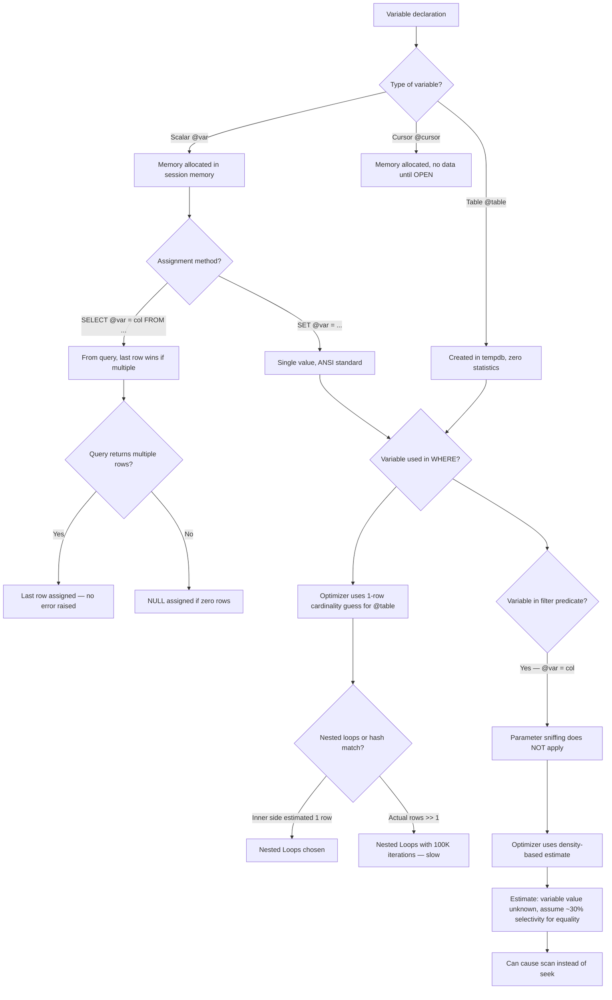
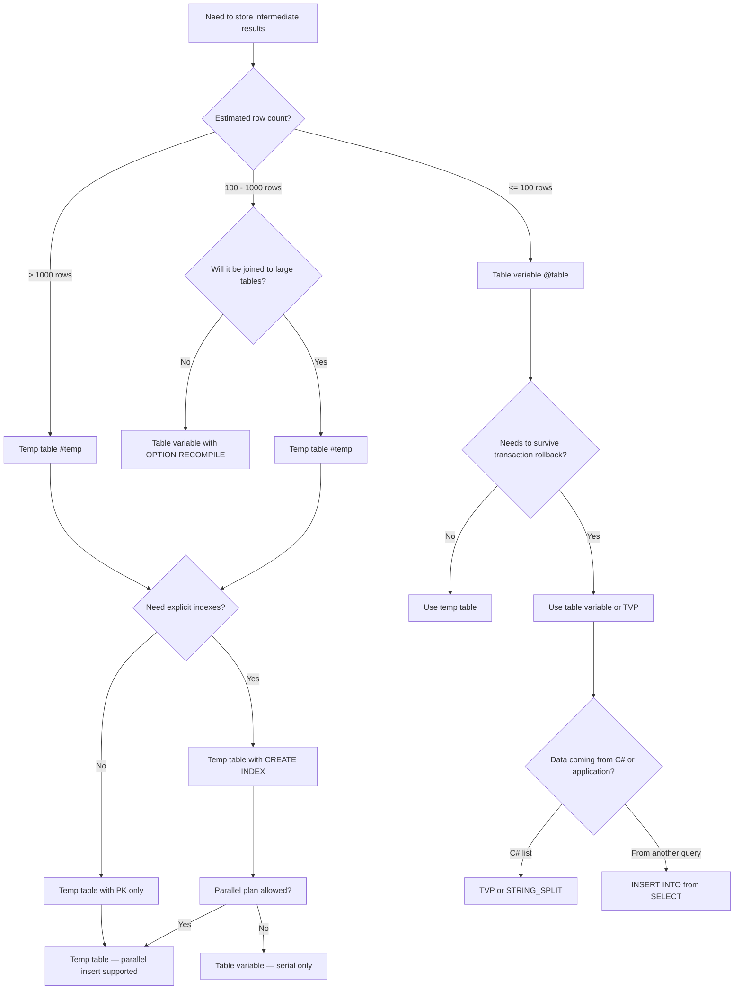

## Navigation

**Domain:** [[8 — Databases]] > **Group:** SQL Fundamentals
**Previous:** [[8.090 — SET Options — NOCOUNT, ANSI_NULLS, QUOTED_IDENTIFIER]] | **Next:** [[8.092 — PRINT and RAISERROR — Debugging T-SQL]]

### Prerequisites

- [[8.067 — WHERE Clause — Predicate Logic and SARGability]] — Variables in predicates can cause parameter sniffing and cardinality estimation issues; understanding SARGability is needed to see when variable-based predicates cause scans.
- [[8.070 — Stored Procedures — Parameters, Output, Control Flow]] — Variables are the primary mechanism for storing intermediate results within stored procedures; understanding procedure flow is required.
- [[8.090 — SET Options — NOCOUNT, ANSI_NULLS, QUOTED_IDENTIFIER]] — SET NOCOUNT ON interacts with variable assignment via SELECT; SET XACT_ABORT ON affects variable state after errors.

### Where This Fits

T-SQL variables are the fundamental mechanism for storing and passing data within a batch, stored procedure, or function. A .NET backend engineer writing raw SQL, stored procedures, or Dapper queries uses variables daily: accumulating row counts, storing intermediate computed values, building dynamic SQL, or passing data via table-valued parameters. The critical distinction between `SET` and `SELECT` for assignment causes subtle bugs (SELECT can assign from a query returning multiple rows, silently picking the last value), and table variables vs temp tables is a perennial interview topic about cardinality estimation, scope, and performance. Interviewers ask about variables to test understanding of batch-level scope, deferred compilation of table variables, and the one-row cardinality guess that destroys query plans at scale.

---

## Core Mental Model

A T-SQL variable is a batch-scoped container for a single value or a complete table. The engine allocates memory for each variable at declaration time and holds it for the duration of the batch or stored procedure scope. The key mental model: **variables are not "variables" in the programming sense of mutable named storage — they are session-level memory locations that the SQL Server expression service evaluates one statement at a time.** There is no concept of "reactive" or "lazy" evaluation. When you write `SET @Total = (SELECT SUM(Amount) FROM Orders)`, the subquery executes immediately, the scalar result is stored in `@Total`, and subsequent statements see that value. If the underlying data changes after the assignment, `@Total` still holds the old value.

Table variables (`DECLARE @table TABLE (...)`) are stored in `tempdb` just like temp tables, but with a critical difference: **the optimizer assumes a table variable always has exactly 1 row.** This cardinality estimate (the "1-row guess") is hardcoded and not corrected even if statistics are available. For small datasets this is fine; for large datasets (10K+ rows), it causes disastrous join strategy choices (nested loops instead of hash match) and memory grants that are too small for sorting or hashing.

### Classification

Variables belong to the **T-SQL procedural language** layer, not the relational engine. They are processed by the expression service, not the query optimizer — except when a variable appears in a `WHERE` clause, where the optimizer uses the variable as an opaque value (it does not sniff the variable's value at compile time). Table variables are relational objects but receive no statistics — the optimizer uses a fixed 1-row estimate. Temp tables (`#temp`) receive full statistics and participate in the optimizer's cardinality estimation like regular tables.



### Key Properties

|Property|Value|Notes|
|---|---|---|
|Scope|Batch, procedure, function|Not available across batch boundaries (GO)|
|Table var cardinality guess|Always 1 row|Hardcoded, no statistics created|
|Temp table cardinality|Actual statistics|Statistics created after insert; auto-updated|
|SET vs SELECT|SET is ANSI, single-value|SELECT can assign from query; last row wins|
|Variable in WHERE|No parameter sniffing|Optimizer cannot sniff variable value at compile|
|NULL assignment|SET with no result assigns NULL|SELECT assigns NULL for zero rows|
|Parallelism|@table prevents parallel insert|#temp allows parallel insert plans|
|Rollback behavior|@table not affected by rollback|#temp rolled back in transaction rollback|

---

## Deep Mechanics

### How the Engine Executes This

1. **Declaration (parsing phase)** — When the parser encounters `DECLARE @var INT`, it allocates a slot in the session's variable table. The type is validated and default NULL is assigned if no initial value is specified. For `DECLARE @table TABLE (Id INT)`, the parser creates a table descriptor in `tempdb` but does not allocate any pages until the first `INSERT`.

2. **Assignment via SET** — `SET @var = expression` triggers the expression service to evaluate the right-hand side. If the expression is a scalar subquery, the subquery executes immediately. The result is stored in the variable's memory slot. If the subquery returns zero rows, `@var` receives NULL. If the subquery returns multiple rows, the SET statement fails with a subquery error.

3. **Assignment via SELECT** — `SELECT @var = col FROM table` is processed by the query processor. The query plan executes, and for each row returned, `@var` is **reassigned** to the current value of `col`. Only the last row's value survives. If the query returns zero rows, `@var` retains its previous value (it is NOT set to NULL). This is the critical behavioral difference from SET: with SET, zero rows yields NULL; with SELECT, zero rows leaves the variable unchanged.

4. **Table variable compilation delay** — Unlike temp tables, table variables are **deferred compilation**: SQL Server does not compile the DDL for the table variable until the first statement that references it. This allows the optimizer to see the first INSERT's row count for subsequent joins, but in practice, the cardinality estimate for joins remains 1 row because the optimizer hardcodes it regardless of actual data.

5. **Variable in WHERE clause (cardinality estimation)** — When a scalar variable appears in a WHERE predicate like `WHERE OrderId = @OrderId`, the optimizer does not know the variable's value at compile time. It uses a **density-based estimate** rather than a histogram-based estimate. For an equality predicate on a unique column, this is approximately 1 row (assuming the column has high density). For non-unique columns, the estimate is based on the average density of the column, which can be very inaccurate.

6. **Table variable in joins** — The optimizer treats a table variable as having 1 row regardless of its actual content. This causes:
   - Nested Loops joins chosen over Hash Match (because the inner side is estimated at 1 row)
   - Memory grants sized for ~1 row (insufficient for sorts or hash operations on large data)
   - No parallel plan for operations involving the table variable

### SQL Visibility

```sql
-- ============================================================
-- Basic scalar variable declaration and assignment
-- ============================================================
DECLARE @CustomerId INT = 1001;           -- Declaration with initial value
DECLARE @OrderDate DATETIME2(0);          -- Declaration only, defaults to NULL
DECLARE @TotalAmount DECIMAL(18,2);       -- Declaration only

SET @OrderDate = SYSUTCDATETIME();        -- SET from function

-- SET from scalar subquery
SET @TotalAmount = (
    SELECT SUM(TotalAmount)
    FROM dbo.Orders
    WHERE CustomerId = @CustomerId
);

-- SELECT assignment from query
DECLARE @MaxOrderId INT, @MinOrderId INT;
SELECT @MaxOrderId = MAX(OrderId), @MinOrderId = MIN(OrderId)
FROM dbo.Orders
WHERE CustomerId = @CustomerId;

-- ============================================================
-- SELECT assignment — last row wins (dangerous)
-- ============================================================
DECLARE @LastName NVARCHAR(100);
SELECT @LastName = LastName
FROM dbo.Customers
WHERE CustomerId IN (1001, 1002, 1003);
-- @LastName now holds the LastName of whichever row was last returned
-- No ordering guarantee! The "last row" depends on the clustered index order

-- Safe: add ORDER BY to make it deterministic
SELECT @LastName = LastName
FROM dbo.Customers
WHERE CustomerId IN (1001, 1002, 1003)
ORDER BY CustomerId DESC;
-- @LastName = LastName for CustomerId 1003

-- ============================================================
-- Table variable declaration and usage
-- ============================================================
DECLARE @OrderIds TABLE (
    OrderId INT NOT NULL PRIMARY KEY,
    TotalAmount DECIMAL(18,2) NOT NULL
);

INSERT INTO @OrderIds (OrderId, TotalAmount)
SELECT OrderId, TotalAmount
FROM dbo.Orders
WHERE Status = 'Pending';

-- Join with table variable (optimizer estimates 1 row)
SELECT o.OrderId, o.CustomerId, o.Status, o.TotalAmount
FROM dbo.Orders AS o
INNER JOIN @OrderIds AS oi ON o.OrderId = oi.OrderId;
-- Plan: Nested Loops (estimated 1 row from @OrderIds)
-- If @OrderIds actually has 50,000 rows: 50K index seeks on Orders!

-- ============================================================
-- Temp table comparison (correct for large datasets)
-- ============================================================
CREATE TABLE #OrderIds (
    OrderId INT NOT NULL PRIMARY KEY,
    TotalAmount DECIMAL(18,2) NOT NULL
);

INSERT INTO #OrderIds (OrderId, TotalAmount)
SELECT OrderId, TotalAmount
FROM dbo.Orders
WHERE Status = 'Pending';

-- Join with temp table (optimizer uses statistics)
SELECT o.OrderId, o.CustomerId, o.Status, o.TotalAmount
FROM dbo.Orders AS o
INNER JOIN #OrderIds AS oi ON o.OrderId = oi.OrderId;
-- Plan: Hash Match or Merge Join (estimated actual row count)
-- Statistics available on #OrderIds after INSERT

DROP TABLE #OrderIds;

-- ============================================================
-- Variable accumulation patterns
-- ============================================================
-- String concatenation (inefficient for large sets)
DECLARE @EmailList NVARCHAR(MAX) = '';

SELECT @EmailList = @EmailList + Email + ';'
FROM dbo.Customers
WHERE Status = 'Active'
ORDER BY Email;
-- ⚠ This "string concatenation" pattern is undocumented behavior
-- Microsoft warns it may not work in future versions
-- Use STRING_AGG in SQL Server 2017+ instead

-- Correct approach:
DECLARE @EmailListCorrect NVARCHAR(MAX);
SELECT @EmailListCorrect = STRING_AGG(Email, ';') WITHIN GROUP (ORDER BY Email)
FROM dbo.Customers
WHERE Status = 'Active';

-- ============================================================
-- Cursor variable
-- ============================================================
DECLARE @CustomerCursor CURSOR;
DECLARE @CurCustomerId INT, @CurFirstName NVARCHAR(100), @CurLastName NVARCHAR(100);

SET @CustomerCursor = CURSOR FORWARD_ONLY STATIC FOR
    SELECT CustomerId, FirstName, LastName
    FROM dbo.Customers
    WHERE Status = 'Active';

OPEN @CustomerCursor;

FETCH NEXT FROM @CustomerCursor INTO @CurCustomerId, @CurFirstName, @CurLastName;

WHILE @@FETCH_STATUS = 0
BEGIN
    PRINT CONCAT('Processing customer: ', @CurFirstName, ' ', @CurLastName);

    -- Process each customer
    UPDATE dbo.Orders
    SET Notes = CONCAT('Reviewed on ', SYSUTCDATETIME())
    WHERE CustomerId = @CurCustomerId;

    FETCH NEXT FROM @CustomerCursor INTO @CurCustomerId, @CurFirstName, @CurLastName;
END;

CLOSE @CustomerCursor;
DEALLOCATE @CustomerCursor;

-- ============================================================
-- Variable in dynamic SQL
-- ============================================================
DECLARE @TableName NVARCHAR(128) = N'dbo.Orders';
DECLARE @StatusFilter NVARCHAR(20) = N'Shipped';
DECLARE @Sql NVARCHAR(MAX);
DECLARE @RowCount INT;

SET @Sql = N'
    SELECT @RowCountOut = COUNT(*)
    FROM ' + @TableName + N'
    WHERE Status = @StatusParam;
';

EXEC sp_executesql @Sql,
    N'@StatusParam NVARCHAR(20), @RowCountOut INT OUTPUT',
    @StatusParam = @StatusFilter,
    @RowCountOut = @RowCount OUTPUT;

PRINT CONCAT('Row count: ', @RowCount);
```

```csharp
// EF Core — variables are not directly visible in LINQ
// EF Core generates SQL with parameters, which become variables in the server-side SQL
var customerId = 1001;

var orders = await dbContext.Orders
    .Where(o => o.CustomerId == customerId)
    .Select(o => new { o.OrderId, o.Status, o.TotalAmount })
    .ToListAsync(cancellationToken);

// The @customerId variable in C# becomes a SQL parameter
// SQL Server receives it as a variable in the plan
```

**Generated SQL (from EF Core logs):**

```sql
-- EF Core generates parameterized SQL (variable equivalent on server side)
exec sp_executesql N'SELECT [o].[OrderId], [o].[Status], [o].[TotalAmount]
FROM [Orders] AS [o]
WHERE [o].[CustomerId] = @__customerId_0',
N'@__customerId_0 int',
@__customerId_0 = 1001;
```

### Execution Plan Analysis

**Table variable join (estimated 1 row):**

```
-- DECLARE @OrderIds TABLE ... INSERT ... JOIN Orders
[Table Variable] → [Nested Loops (Inner Join)]
  Nested Loops Outer: [Table Variable] (estimated 1 row, actual 50,000)
  Nested Loops Inner: [Index Seek on IX_Orders_OrderId] (estimated 1 row, actual 1 per outer)
→ [SELECT]
Estimated Cost depends on actual rows: 50K seeks = ~50K logical reads
```

The plan shape is correct (seek is good), but the optimizer did not choose a Hash Match because it thought the table variable had 1 row. The 50K index seeks each read 3-5 pages (~150K-250K logical reads), whereas a Hash Match would scan both tables once (~12K + 1K logical reads). The ~20x difference in logical reads is the cost of the 1-row cardinality estimate.

**Variable in WHERE clause (no parameter sniffing):**

```
-- DECLARE @Status VARCHAR(20) = 'Shipped'
-- SELECT ... FROM Orders WHERE Status = @Status
[Index Seek on IX_Orders_Status] (estimated row count: ~30% of table)
  Seek predicate: [Orders].Status = @Status
  Estimated rows: density * table cardinality
  If Status has 4 distinct values, density = 0.25, estimate = 25% of table
  If actual matching rows = 5% (for 'Shipped'), estimate is 5x over
→ [SELECT]
```

The optimizer cannot sniff `@Status` at compile time. For a stored procedure parameter `@Status`, SQL Server **does** sniff the first caller's value (parameter sniffing), but for a local variable declared inside the batch, it uses the density-based estimate.

### Cost Visibility

```sql
SET STATISTICS IO ON;
SET STATISTICS TIME ON;

-- Table variable with 50K rows — join with Orders
DECLARE @OrderIds TABLE (OrderId INT PRIMARY KEY);

INSERT INTO @OrderIds (OrderId)
SELECT OrderId FROM dbo.Orders WHERE Status = 'Pending';
-- Table 'Orders'. Scan count 1, logical reads 12450
-- (50,000 rows inserted)

SELECT o.OrderId, o.Status, o.TotalAmount
FROM dbo.Orders AS o
INNER JOIN @OrderIds AS oi ON o.OrderId = oi.OrderId;
-- Table 'Orders'. Scan count 1, logical reads 12450 (scan!)
-- SQL Server chose scan because estimated 1 row from @OrderIds didn't justify seek
-- Actual: 50,000 matches, but plan was compiled for 1

-- Equivalent with temp table
CREATE TABLE #OrderIds (OrderId INT PRIMARY KEY);

INSERT INTO #OrderIds (OrderId)
SELECT OrderId FROM dbo.Orders WHERE Status = 'Pending';
-- Table 'Orders'. Scan count 1, logical reads 12450

SELECT o.OrderId, o.Status, o.TotalAmount
FROM dbo.Orders AS o
INNER JOIN #OrderIds AS oi ON o.OrderId = oi.OrderId;
-- Table 'Orders'. Scan count 1, logical reads 12450 (scan — still scan)
-- ⚠ Same plan! Because the optimizer hasn't updated stats on #OrderIds yet
-- Need to CREATE STATISTICS or wait for auto-update

DROP TABLE #OrderIds;

-- Variable assignment — SET vs SELECT differences
DECLARE @OrderCount INT;

SET @OrderCount = (SELECT COUNT(*) FROM dbo.Orders WHERE Status = 'Shipped');
-- Logical reads: 12450 (COUNT(*) scan)
-- @OrderCount = 150000

-- SELECT assignment behavior
DECLARE @LastOrderId INT = 0;

SELECT @LastOrderId = OrderId
FROM dbo.Orders
ORDER BY OrderId DESC;
-- @LastOrderId = 1000000 (last OrderId)
-- @LastOrderId was set from a query, logical reads depend on the query
```

### Failure Modes

**Table variable with 50K+ rows causing nested loops explosion:** The optimizer estimates 1 row from the table variable. It chooses Nested Loops. Each outer row triggers an index seek on the inner table. With 50K outer rows and 10B total rows in the inner table, this is catastrophic. The query runs for minutes instead of milliseconds.

```sql
-- Detect: look for high logical reads from a Nested Loops join
-- where the outer input is estimated at 1 row but actual is >> 1
SELECT qs.total_logical_reads / qs.execution_count AS avg_logical_reads,
       qs.total_elapsed_time / qs.execution_count / 1000 AS avg_elapsed_ms,
       SUBSTRING(st.text, (qs.statement_start_offset/2)+1,
           (CASE qs.statement_end_offset
               WHEN -1 THEN DATALENGTH(st.text)
               ELSE qs.statement_end_offset
            END - qs.statement_start_offset)/2 + 1) AS statement_text,
       qp.query_plan
FROM sys.dm_exec_query_stats AS qs
CROSS APPLY sys.dm_exec_sql_text(qs.sql_handle) AS st
CROSS APPLY sys.dm_exec_query_plan(qs.plan_handle) AS qp
WHERE qs.total_logical_reads / qs.execution_count > 10000
  AND st.text LIKE '%@%'  -- Table variable references use @ prefix
ORDER BY avg_logical_reads DESC;
```

**SELECT assignment with multiple rows — last row silently assigned:** The developer assumes the query returns one row but it returns many. No error is raised. The variable holds the last row's value, which is unpredictable without `ORDER BY`.

```sql
-- Bug: developer assumed one matching Customer
DECLARE @Email NVARCHAR(256);
SELECT @Email = Email FROM dbo.Customers WHERE LastName = 'Smith';
-- Multiple 'Smith' customers exist — @Email holds last one processed.
-- No error, no warning.
```

**Variable in WHERE causing scan instead of seek:** The optimizer cannot sniff a local variable value. For `WHERE Status = @Status`, if Status has high density (e.g., 'Shipped' applies to 80% of rows), the optimizer correctly chooses a scan. But if the actual value at runtime is 'Pending' (1% of rows), the scan is wasteful. The fix is `OPTION (RECOMPILE)` which lets the optimizer sniff the value at each execution:

```sql
DECLARE @Status VARCHAR(20) = 'Pending';

SELECT COUNT(*) FROM dbo.Orders
WHERE Status = @Status
OPTION (RECOMPILE);
-- With RECOMPILE, the optimizer sees @Status = 'Pending' at compile time
-- and chooses Index Seek with estimated 1% selectivity
```

---

## Production Patterns and Implementation

### Primary SQL Implementation

```sql
-- ============================================================
-- Schema context
-- ============================================================
CREATE TABLE dbo.Orders
(
    OrderId      INT            NOT NULL IDENTITY(1,1),
    CustomerId   INT            NOT NULL,
    OrderDate    DATETIME2(0)   NOT NULL,
    Status       VARCHAR(20)    NOT NULL DEFAULT 'Pending',
    TotalAmount  DECIMAL(18,2)  NOT NULL,
    Notes        NVARCHAR(MAX)  NULL,
    CreatedAt    DATETIME2(0)   NOT NULL DEFAULT SYSUTCDATETIME(),
    CONSTRAINT PK_Orders PRIMARY KEY CLUSTERED (OrderId)
);

CREATE TABLE dbo.Customers
(
    CustomerId   INT            NOT NULL IDENTITY(1,1),
    FirstName    NVARCHAR(100)  NOT NULL,
    LastName     NVARCHAR(100)  NOT NULL,
    Email        NVARCHAR(256)  NOT NULL,
    Status       VARCHAR(20)    NOT NULL DEFAULT 'Active',
    CreatedAt    DATETIME2(0)   NOT NULL DEFAULT SYSUTCDATETIME(),
    CONSTRAINT PK_Customers PRIMARY KEY CLUSTERED (CustomerId)
);

CREATE INDEX IX_Orders_Status ON dbo.Orders (Status) INCLUDE (OrderId, TotalAmount);
CREATE INDEX IX_Customers_Status ON dbo.Customers (Status);

-- ============================================================
-- Pattern 1: Stored procedure with variable accumulation and error handling
-- ============================================================
CREATE OR ALTER PROCEDURE dbo.ProcessDailyOrders
    @BatchDate DATE,
    @ProcessedCount INT OUTPUT,
    @TotalAmount DECIMAL(18,2) OUTPUT,
    @ErrorMessage NVARCHAR(4000) OUTPUT
AS
    SET NOCOUNT ON;
    SET XACT_ABORT ON;

    DECLARE @CurrentOrderId INT, @CurrentAmount DECIMAL(18,2);
    DECLARE @CursorError INT = 0;
    DECLARE @LocalCount INT = 0;
    DECLARE @LocalTotal DECIMAL(18,2) = 0;

    BEGIN TRY
        BEGIN TRANSACTION;

        DECLARE OrderCursor CURSOR FORWARD_ONLY STATIC FOR
            SELECT OrderId, TotalAmount
            FROM dbo.Orders
            WHERE CAST(OrderDate AS DATE) = @BatchDate
              AND Status = 'Pending';

        OPEN OrderCursor;

        FETCH NEXT FROM OrderCursor INTO @CurrentOrderId, @CurrentAmount;

        WHILE @@FETCH_STATUS = 0
        BEGIN
            UPDATE dbo.Orders
            SET Status = 'Processed',
                Notes = CONCAT('Batch processed on ', SYSUTCDATETIME())
            WHERE OrderId = @CurrentOrderId;

            SET @LocalCount = @LocalCount + 1;
            SET @LocalTotal = @LocalTotal + @CurrentAmount;

            FETCH NEXT FROM OrderCursor INTO @CurrentOrderId, @CurrentAmount;
        END;

        CLOSE OrderCursor;
        DEALLOCATE OrderCursor;

        COMMIT TRANSACTION;

        SET @ProcessedCount = @LocalCount;
        SET @TotalAmount = @LocalTotal;
        SET @ErrorMessage = NULL;
    END TRY
    BEGIN CATCH
        IF XACT_STATE() <> 0
            ROLLBACK TRANSACTION;

        IF CURSOR_STATUS('local', 'OrderCursor') >= 0
        BEGIN
            CLOSE OrderCursor;
            DEALLOCATE OrderCursor;
        END;

        SET @ProcessedCount = @LocalCount;
        SET @TotalAmount = @LocalTotal;
        SET @ErrorMessage = ERROR_MESSAGE();
    END CATCH;
GO

-- ============================================================
-- Pattern 2: Table variable for small lookup set
-- ============================================================
CREATE OR ALTER PROCEDURE dbo.GetOrdersForCustomers
    @CustomerIds NVARCHAR(MAX)  -- Comma-separated list
AS
    SET NOCOUNT ON;

    DECLARE @CustomerIdTable TABLE
    (
        CustomerId INT NOT NULL PRIMARY KEY
    );

    INSERT INTO @CustomerIdTable (CustomerId)
    SELECT DISTINCT CAST(value AS INT)
    FROM STRING_SPLIT(@CustomerIds, ',')
    WHERE TRY_CAST(value AS INT) IS NOT NULL;

    -- For small lists (< 1000), table variable is fine
    -- The optimizer estimates 1 row but actual is typically 5-50
    SELECT o.OrderId, o.CustomerId, o.Status, o.TotalAmount, o.OrderDate
    FROM dbo.Orders AS o
    INNER JOIN @CustomerIdTable AS c ON o.CustomerId = c.CustomerId
    ORDER BY o.OrderDate DESC;
GO

-- ============================================================
-- Pattern 3: Temp table for large intermediate sets (correct approach)
-- ============================================================
CREATE OR ALTER PROCEDURE dbo.GenerateMonthlyReport
    @Year INT,
    @Month INT
AS
    SET NOCOUNT ON;

    CREATE TABLE #MonthlyData
    (
        CustomerId   INT           NOT NULL,
        FirstName    NVARCHAR(100) NOT NULL,
        LastName     NVARCHAR(100) NOT NULL,
        OrderCount   INT           NOT NULL,
        TotalAmount  DECIMAL(18,2) NOT NULL
    );

    INSERT INTO #MonthlyData (CustomerId, FirstName, LastName, OrderCount, TotalAmount)
    SELECT c.CustomerId, c.FirstName, c.LastName,
           COUNT_BIG(o.OrderId) AS OrderCount,
           SUM(o.TotalAmount) AS TotalAmount
    FROM dbo.Customers AS c
    INNER JOIN dbo.Orders AS o ON c.CustomerId = o.CustomerId
    WHERE YEAR(o.OrderDate) = @Year
      AND MONTH(o.OrderDate) = @Month
    GROUP BY c.CustomerId, c.FirstName, c.LastName;

    -- Create index on temp table for subsequent joins
    CREATE INDEX IX_Temp_CustomerId ON #MonthlyData (CustomerId);

    -- Statistics are automatically created on #MonthlyData
    -- The optimizer now has accurate cardinality estimates

    SELECT md.CustomerId, md.FirstName, md.LastName,
           md.OrderCount, md.TotalAmount,
           RANK() OVER (ORDER BY md.TotalAmount DESC) AS RevenueRank
    FROM #MonthlyData AS md
    ORDER BY md.TotalAmount DESC;

    DROP TABLE #MonthlyData;
GO

-- ============================================================
-- Pattern 4: Variable assignment from query with safe patterns
-- ============================================================
CREATE OR ALTER PROCEDURE dbo.GetCustomerOrderSummary
    @CustomerId INT,
    @TotalOrders INT OUTPUT,
    @TotalSpent DECIMAL(18,2) OUTPUT,
    @LastOrderDate DATETIME2(0) OUTPUT
AS
    SET NOCOUNT ON;

    -- Safe pattern: SET from scalar subquery (single value guaranteed)
    SET @TotalOrders = (
        SELECT COUNT(*)
        FROM dbo.Orders
        WHERE CustomerId = @CustomerId
    );

    -- Safe pattern: SELECT with aggregation (always single row due to GROUP BY)
    SELECT @TotalSpent = SUM(TotalAmount),
           @LastOrderDate = MAX(OrderDate)
    FROM dbo.Orders
    WHERE CustomerId = @CustomerId;
    -- Single row because these are aggregates over the same GROUP

    -- UNCLEAN pattern to avoid:
    -- SELECT @TotalOrders = OrderId FROM dbo.Orders WHERE CustomerId = @CustomerId
    -- This silently picks the last OrderId if multiple orders exist

    IF @TotalOrders IS NULL
    BEGIN
        SET @TotalOrders = 0;
        SET @TotalSpent = 0;
        SET @LastOrderDate = NULL;
    END;
GO

-- ============================================================
-- Pattern 5: Variables in dynamic SQL with sp_executesql
-- ============================================================
CREATE OR ALTER PROCEDURE dbo.SearchEntity
    @EntityName NVARCHAR(128),   -- Table name (validated)
    @SearchColumn NVARCHAR(128), -- Column name (validated)
    @SearchValue NVARCHAR(256),
    @TopN INT = 100
AS
    SET NOCOUNT ON;

    DECLARE @Sql NVARCHAR(MAX);

    -- Validate table name to prevent SQL injection
    IF NOT EXISTS (
        SELECT 1 FROM sys.tables
        WHERE OBJECT_ID = OBJECT_ID(@EntityName)
          AND SCHEMA_NAME(schema_id) = SCHEMA_NAME()
    )
    BEGIN
        RAISERROR('Invalid table name', 16, 1);
        RETURN;
    END;

    -- Validate column name
    IF NOT EXISTS (
        SELECT 1 FROM sys.columns
        WHERE OBJECT_ID = OBJECT_ID(@EntityName)
          AND name = @SearchColumn
    )
    BEGIN
        RAISERROR('Invalid column name', 16, 1);
        RETURN;
    END;

    SET @Sql = N'
        SELECT TOP (@TopN) *
        FROM ' + @EntityName + N'
        WHERE ' + @SearchColumn + N' = @SearchValue
        ORDER BY 1;';

    EXEC sp_executesql @Sql,
        N'@SearchValue NVARCHAR(256), @TopN INT',
        @SearchValue = @SearchValue,
        @TopN = @TopN;
GO

-- ============================================================
-- Pattern 6: Variables with OUTPUT parameters
-- ============================================================
CREATE OR ALTER PROCEDURE dbo.GetCustomerStatistics
    @CustomerId INT,
    @TotalOrders INT OUTPUT,
    @FirstOrderDate DATETIME2(0) OUTPUT,
    @LastOrderDate DATETIME2(0) OUTPUT,
    @AvgOrderValue DECIMAL(18,2) OUTPUT
AS
    SET NOCOUNT ON;

    SELECT
        @TotalOrders = COUNT(*),
        @FirstOrderDate = MIN(OrderDate),
        @LastOrderDate = MAX(OrderDate),
        @AvgOrderValue = AVG(TotalAmount)
    FROM dbo.Orders
    WHERE CustomerId = @CustomerId;

    -- Handle NULLs for customers with no orders
    SELECT
        @TotalOrders = ISNULL(@TotalOrders, 0),
        @AvgOrderValue = ISNULL(@AvgOrderValue, 0);
GO

-- ============================================================
-- Pattern 7: Variable concatenation using STRING_AGG
-- ============================================================
CREATE OR ALTER PROCEDURE dbo.GetCustomerEmailList
    @Status VARCHAR(20) = 'Active',
    @EmailList NVARCHAR(MAX) OUTPUT
AS
    SET NOCOUNT ON;

    SELECT @EmailList = STRING_AGG(Email, ';') WITHIN GROUP (ORDER BY Email)
    FROM dbo.Customers
    WHERE Status = @Status
      AND Email IS NOT NULL;

    IF @EmailList IS NULL
        SET @EmailList = '';
GO

-- ============================================================
-- Pattern 8: Table variable with OPTION (RECOMPILE) for accurate estimates
-- ============================================================
CREATE OR ALTER PROCEDURE dbo.GetRecentOrdersForCustomers
    @CustomerCount INT = 100
AS
    SET NOCOUNT ON;

    DECLARE @RecentCustomers TABLE
    (
        CustomerId INT NOT NULL PRIMARY KEY,
        LastOrderDate DATETIME2(0) NOT NULL
    );

    INSERT INTO @RecentCustomers (CustomerId, LastOrderDate)
    SELECT TOP (@CustomerCount) CustomerId, MAX(OrderDate)
    FROM dbo.Orders
    GROUP BY CustomerId
    ORDER BY MAX(OrderDate) DESC;

    -- OPTION (RECOMPILE) recompiles the plan with actual cardinality
    -- This mitigates the 1-row estimate for table variables
    SELECT o.OrderId, o.CustomerId, o.Status, o.TotalAmount, o.OrderDate
    FROM dbo.Orders AS o
    INNER JOIN @RecentCustomers AS rc ON o.CustomerId = rc.CustomerId
    WHERE o.OrderDate >= DATEADD(DAY, -30, SYSUTCDATETIME())
    OPTION (RECOMPILE);
GO
```

### EF Core Implementation

```csharp
public class ApplicationDbContext : DbContext
{
    public DbSet<Order> Orders => Set<Order>();
    public DbSet<Customer> Customers => Set<Customer>();

    protected override void OnModelCreating(ModelBuilder modelBuilder)
    {
        modelBuilder.Entity<Order>(entity =>
        {
            entity.ToTable("Orders");
            entity.HasKey(o => o.OrderId);
            entity.Property(o => o.Status).HasMaxLength(20);
            entity.Property(o => o.TotalAmount).HasColumnType("decimal(18,2)");
            entity.Property(o => o.Notes).HasColumnType("nvarchar(max)");
            entity.Property(o => o.CreatedAt).HasDefaultValueSql("SYSUTCDATETIME()");
        });

        modelBuilder.Entity<Customer>(entity =>
        {
            entity.ToTable("Customers");
            entity.HasKey(c => c.CustomerId);
            entity.Property(c => c.FirstName).HasMaxLength(100);
            entity.Property(c => c.LastName).HasMaxLength(100);
            entity.Property(c => c.Email).HasMaxLength(256);
            entity.Property(c => c.CreatedAt).HasDefaultValueSql("SYSUTCDATETIME()");
        });
    }
}

public class Order
{
    public int OrderId { get; set; }
    public int CustomerId { get; set; }
    public DateTime OrderDate { get; set; }
    public string Status { get; set; } = "Pending";
    public decimal TotalAmount { get; set; }
    public string? Notes { get; set; }
    public DateTime CreatedAt { get; set; }
}

public class Customer
{
    public int CustomerId { get; set; }
    public string FirstName { get; set; } = string.Empty;
    public string LastName { get; set; } = string.Empty;
    public string Email { get; set; } = string.Empty;
    public string Status { get; set; } = "Active";
    public DateTime CreatedAt { get; set; }
}

// EF Core — variables appear as SQL parameters
public async Task<List<Order>> GetOrdersForCustomerAsync(
    int customerId,
    CancellationToken cancellationToken = default)
{
    return await dbContext.Orders
        .Where(o => o.CustomerId == customerId && o.Status == "Shipped")
        .OrderByDescending(o => o.OrderDate)
        .ToListAsync(cancellationToken);

    // Generated SQL:
    // exec sp_executesql N'SELECT [o].[OrderId], [o].[CustomerId], ...
    //   FROM [Orders] AS [o]
    //   WHERE [o].[CustomerId] = @__customerId_0 AND [o].[Status] = N''Shipped''
    //   ORDER BY [o].[OrderDate] DESC',
    // N'@__customerId_0 int',
    // @__customerId_0 = 1001
}

// EF Core — table variable is not directly mappable
// Use raw SQL for table variable scenarios
public async Task<List<Order>> GetOrdersForCustomerListAsync(
    List<int> customerIds,
    CancellationToken cancellationToken = default)
{
    // EF Core translates Contains to IN (not table variable)
    return await dbContext.Orders
        .Where(o => customerIds.Contains(o.CustomerId))
        .OrderByDescending(o => o.OrderDate)
        .ToListAsync(cancellationToken);

    // Generated SQL:
    // SELECT ... FROM [Orders] WHERE [CustomerId] IN (1001, 1002, 1003)
}

// Using stored procedure with OUTPUT variables
public async Task<CustomerStatistics> GetCustomerStatisticsAsync(
    int customerId,
    CancellationToken cancellationToken = default)
{
    var parameters = new[]
    {
        new SqlParameter("@CustomerId", customerId),
        new SqlParameter("@TotalOrders", SqlDbType.Int) { Direction = ParameterDirection.Output },
        new SqlParameter("@FirstOrderDate", SqlDbType.DateTime2) { Direction = ParameterDirection.Output },
        new SqlParameter("@LastOrderDate", SqlDbType.DateTime2) { Direction = ParameterDirection.Output },
        new SqlParameter("@AvgOrderValue", SqlDbType.Decimal) { Direction = ParameterDirection.Output }
    };

    await dbContext.Database.ExecuteSqlRawAsync(
        "EXEC dbo.GetCustomerStatistics @CustomerId, @TotalOrders OUTPUT, @FirstOrderDate OUTPUT, @LastOrderDate OUTPUT, @AvgOrderValue OUTPUT",
        parameters, cancellationToken);

    return new CustomerStatistics
    {
        TotalOrders = (int)(parameters[1].Value ?? 0),
        FirstOrderDate = (DateTime?)(parameters[2].Value),
        LastOrderDate = (DateTime?)(parameters[3].Value),
        AvgOrderValue = (decimal?)(parameters[4].Value) ?? 0
    };
}

public record CustomerStatistics(
    int TotalOrders,
    DateTime? FirstOrderDate,
    DateTime? LastOrderDate,
    decimal AvgOrderValue);
```

### Dapper Implementation

```csharp
public sealed class OrderRepository
{
    private readonly IDbConnectionFactory _connectionFactory;

    public OrderRepository(IDbConnectionFactory connectionFactory)
        => _connectionFactory = connectionFactory;

    // Pattern 1: Stored procedure with OUTPUT parameters via Dapper
    public async Task<CustomerStatistics> GetCustomerStatisticsAsync(
        int customerId,
        CancellationToken cancellationToken = default)
    {
        var parameters = new DynamicParameters();
        parameters.Add("@CustomerId", customerId);
        parameters.Add("@TotalOrders", dbType: DbType.Int32, direction: ParameterDirection.Output);
        parameters.Add("@FirstOrderDate", dbType: DbType.DateTime2, direction: ParameterDirection.Output);
        parameters.Add("@LastOrderDate", dbType: DbType.DateTime2, direction: ParameterDirection.Output);
        parameters.Add("@AvgOrderValue", dbType: DbType.Decimal, direction: ParameterDirection.Output);

        await using var connection = _connectionFactory.Create();

        await connection.ExecuteAsync(
            "dbo.GetCustomerStatistics",
            parameters,
            commandType: CommandType.StoredProcedure);

        return new CustomerStatistics(
            parameters.Get<int>("@TotalOrders"),
            parameters.Get<DateTime?>("@FirstOrderDate"),
            parameters.Get<DateTime?>("@LastOrderDate"),
            parameters.Get<decimal>("@AvgOrderValue"));
    }

    // Pattern 2: Variable in ad-hoc SQL with Dapper parameters
    public async Task<IReadOnlyList<Order>> GetOrdersByStatusAsync(
        string status,
        int customerId,
        CancellationToken cancellationToken = default)
    {
        const string sql = @"
            DECLARE @LocalStatus VARCHAR(20) = @Status;

            SELECT o.OrderId, o.CustomerId, o.Status, o.TotalAmount, o.OrderDate
            FROM dbo.Orders AS o
            WHERE o.CustomerId = @CustomerId
              AND o.Status = @LocalStatus
            ORDER BY o.OrderDate DESC;";

        await using var connection = _connectionFactory.Create();

        var results = await connection.QueryAsync<Order>(
            new CommandDefinition(sql,
                new { Status = status, CustomerId = customerId },
                cancellationToken: cancellationToken));

        return results.AsList();
    }

    // Pattern 3: Table-valued parameter via Dapper (SQL Server TVP)
    public async Task<IReadOnlyList<Order>> GetOrdersByIdsTvpAsync(
        IEnumerable<int> ids,
        CancellationToken cancellationToken = default)
    {
        const string sql = @"
            DECLARE @OrderIds TABLE (OrderId INT PRIMARY KEY);

            INSERT INTO @OrderIds (OrderId)
            SELECT value FROM STRING_SPLIT(@IdCsv, ',');

            SELECT o.OrderId, o.CustomerId, o.Status, o.TotalAmount, o.OrderDate
            FROM dbo.Orders AS o
            INNER JOIN @OrderIds AS oi ON o.OrderId = oi.OrderId
            OPTION (RECOMPILE);  -- Mitigate table variable 1-row estimate";

        await using var connection = _connectionFactory.Create();

        var idCsv = string.Join(",", ids);
        var results = await connection.QueryAsync<Order>(
            new CommandDefinition(sql,
                new { IdCsv = idCsv },
                cancellationToken: cancellationToken));

        return results.AsList();
    }

    // Pattern 4: Temp table approach (better for large sets)
    public async Task<IReadOnlyList<Order>> GetOrdersForBatchProcessingAsync(
        IEnumerable<int> customerIds,
        CancellationToken cancellationToken = default)
    {
        const string sql = @"
            CREATE TABLE #CustomerIds (CustomerId INT PRIMARY KEY);

            INSERT INTO #CustomerIds (CustomerId)
            SELECT DISTINCT value
            FROM STRING_SPLIT(@IdCsv, ',')
            WHERE TRY_CAST(value AS INT) IS NOT NULL;

            CREATE INDEX IX_Temp_CustomerId ON #CustomerIds (CustomerId);

            SELECT o.OrderId, o.CustomerId, o.Status, o.TotalAmount, o.OrderDate
            FROM dbo.Orders AS o
            INNER JOIN #CustomerIds AS c ON o.CustomerId = c.CustomerId
            ORDER BY o.OrderDate DESC;

            DROP TABLE #CustomerIds;";

        await using var connection = _connectionFactory.Create();

        var idCsv = string.Join(",", customerIds);
        var results = await connection.QueryAsync<Order>(
            new CommandDefinition(sql,
                new { IdCsv = idCsv },
                cancellationToken: cancellationToken));

        return results.AsList();
    }

    // Pattern 5: Using OUTPUT parameter in ad-hoc SQL
    public async Task<int> GetOrderCountAsync(
        int customerId,
        CancellationToken cancellationToken = default)
    {
        const string sql = @"
            DECLARE @Count INT;
            SELECT @Count = COUNT(*)
            FROM dbo.Orders
            WHERE CustomerId = @CustomerId;
            SELECT @Count AS OrderCount;";

        await using var connection = _connectionFactory.Create();

        var count = await connection.QuerySingleAsync<int>(
            new CommandDefinition(sql,
                new { CustomerId = customerId },
                cancellationToken: cancellationToken));

        return count;
    }
}

public record Order(int OrderId, int CustomerId, string Status, decimal TotalAmount, DateTime OrderDate);
public record CustomerStatistics(int TotalOrders, DateTime? FirstOrderDate, DateTime? LastOrderDate, decimal AvgOrderValue);
```

### Configuration and Wiring

```csharp
// Program.cs
builder.Services.AddDbContext<ApplicationDbContext>(options =>
    options.UseSqlServer(
        builder.Configuration.GetConnectionString("DefaultConnection"),
        sqlOptions =>
        {
            sqlOptions.EnableRetryOnFailure(3);
            sqlOptions.CommandTimeout(30);
        }));

builder.Services.AddSingleton<IDbConnectionFactory>(sp =>
    new SqlConnectionFactory(
        builder.Configuration.GetConnectionString("DefaultConnection")!));

builder.Services.AddScoped<OrderRepository>();

// For procedures with OUTPUT variables, ensure SET NOCOUNT ON is active
// SqlClient sends SET NOCOUNT ON on connection open by default
```

### SQL Server vs PostgreSQL Differences

```sql
-- PostgreSQL uses DO blocks (anonymous functions) for variable scope
-- SQL Server variable:
DECLARE @Count INT = 0;
SELECT @Count = COUNT(*) FROM orders;
PRINT @Count;

-- PostgreSQL equivalent:
DO $$
DECLARE
    count_var INT := 0;
BEGIN
    SELECT COUNT(*) INTO count_var FROM orders;
    RAISE NOTICE '%', count_var;
END $$;

-- PostgreSQL table variable equivalent: use temp table or CTE
-- PostgreSQL does not have DECLARE @table
-- Instead:
CREATE TEMP TABLE temp_order_ids AS
SELECT order_id FROM orders WHERE status = 'Pending';

-- PostgreSQL variables in dynamic SQL:
DO $$
DECLARE
    table_name TEXT := 'orders';
    status_filter TEXT := 'Shipped';
    row_count INT;
BEGIN
    EXECUTE format(
        'SELECT COUNT(*) INTO %%L FROM %%I WHERE status = %%L',
        row_count, table_name, status_filter
    );
    RAISE NOTICE 'Row count: %', row_count;
END $$;

-- PostgreSQL does not have the 1-row cardinality issue for temp tables
-- because TEMP TABLE gets full statistics
```

---

## Gotchas and Production Pitfalls

### Table Variable with 50K Rows — One-Row Estimate Causes Catastrophic Join

**Pitfall:** Using `DECLARE @table TABLE (...)` for an intermediate result set that grows to 10K+ rows. The optimizer hardcodes the cardinality estimate at 1 row. For joins against large tables, this causes SQL Server to choose Nested Loops (assuming 1 outer row = 1 seek on inner) instead of Hash Match. The actual 50K outer rows trigger 50K index seeks, each reading 3-5 pages.

```sql
-- ❌ Wrong: table variable for large intermediate set
DECLARE @OrderIds TABLE (OrderId INT PRIMARY KEY);

INSERT INTO @OrderIds (OrderId)
SELECT OrderId FROM dbo.Orders WHERE Status = 'Pending';
-- 50,000 rows inserted

-- Optimizer estimates 1 row from @OrderIds
SELECT o.OrderId, oi.Quantity, oi.UnitPrice
FROM dbo.OrderItems AS oi
INNER JOIN @OrderIds AS o ON oi.OrderId = o.OrderId;
-- Logical reads: ~250,000 (50K seeks × 5 pages/seek)
-- Elapsed: ~45 seconds
```

**Symptom:** Query runs 30-60 seconds on a 50K-row intermediate set. The execution plan shows Nested Loops Join with the table variable as the outer input, estimated 1 row, actual 50,000 rows. High `PAGEIOLATCH_SH` waits.

**Fix:**

```sql
-- ✅ Correct: use temp table with statistics
CREATE TABLE #OrderIds (OrderId INT PRIMARY KEY);

INSERT INTO #OrderIds (OrderId)
SELECT OrderId FROM dbo.Orders WHERE Status = 'Pending';

-- Statistics updated after insert — optimizer sees actual cardinality
SELECT o.OrderId, oi.Quantity, oi.UnitPrice
FROM dbo.OrderItems AS oi
INNER JOIN #OrderIds AS o ON oi.OrderId = o.OrderId;
-- Logical reads: ~12,450 (single scan + Hash Match)
-- Elapsed: ~2 seconds
```

**Cost of not fixing:** 45-second queries blocking 50 concurrent users. Connection pool exhaustion. Application timeout errors. The bug only manifests at scale — testing with 100 rows shows fast performance, but production with 50K rows fails.

### SELECT Assignment Returns Last Row Silently

**Pitfall:** Using `SELECT @var = col FROM table WHERE ...` when the WHERE clause can match multiple rows. No error is raised. The variable holds the last row returned, which depends on the physical order of rows (clustered index order) unless `ORDER BY` is specified.

```sql
-- ❌ Wrong: multiple matches, no ORDER BY
DECLARE @Email NVARCHAR(256);
SELECT @Email = Email
FROM dbo.Customers
WHERE LastName = 'Smith';
-- If 3 customers have LastName = 'Smith', @Email = last one processed
-- No error, no warning

-- ❌ Wrong: assuming COUNT(*) will always be 1
DECLARE @OrderId INT = 1001;
DECLARE @Status NVARCHAR(20);
SELECT @Status = Status
FROM dbo.Orders
WHERE OrderId = @OrderId;
-- Safe for unique key, but pattern is dangerous if copied to non-unique column
```

**Symptom:** Intermittent wrong values in variables. A stored procedure that "sometimes" returns wrong results. The bug occurs when the underlying data has multiple matching rows (e.g., after a data import creates duplicates).

**Fix:**

```sql
-- ✅ Correct: use aggregation
SELECT @Email = MIN(Email)
FROM dbo.Customers
WHERE LastName = 'Smith';

-- ✅ Correct: use TOP with ORDER BY
SELECT TOP (1) @Email = Email
FROM dbo.Customers
WHERE LastName = 'Smith'
ORDER BY CustomerId;

-- ✅ Correct: use SET with scalar subquery (raises error if multiple rows)
SET @Email = (SELECT Email FROM dbo.Customers WHERE LastName = 'Smith');
-- This raises: Subquery returned more than 1 value. This is not permitted.
```

**Cost of not fixing:** Silent data corruption. Wrong customer contacted in email campaigns. Wrong account credited in payment processing. Debugging is extremely difficult because the bug is data-dependent and intermittent.

### Variable in WHERE Clause Causes Scan Instead of Seek

**Pitfall:** Using a local variable (not a stored procedure parameter) in a WHERE predicate. The optimizer cannot sniff the variable's value at compile time. It uses density-based estimation, which may produce a scan plan even when the actual value at runtime would benefit from a seek.

```sql
-- ❌ Wrong: local variable scan
DECLARE @Status VARCHAR(20) = 'Pending';

SELECT COUNT(*)
FROM dbo.Orders
WHERE Status = @Status;
-- Optimizer estimates: @Status = unknown, density = 0.25 (4 distinct values)
-- Chooses scan even if 'Pending' is 1% of rows

-- ✅ Correct: use OPTION (RECOMPILE) or stored procedure parameter
DECLARE @StatusCorrect VARCHAR(20) = 'Pending';

SELECT COUNT(*)
FROM dbo.Orders
WHERE Status = @StatusCorrect
OPTION (RECOMPILE);
-- On recompile, @StatusCorrect = 'Pending' is known, optimizer uses histogram
```

**Symptom:** A query with a variable filter runs slowly. The execution plan shows a scan when you expected a seek. Adding `OPTION (RECOMPILE)` fixes it.

**Fix:**

```sql
-- Option 1: OPTION (RECOMPILE) — compile per execution
SELECT COUNT(*)
FROM dbo.Orders
WHERE Status = @Status
OPTION (RECOMPILE);

-- Option 2: Use stored procedure parameter (parameter sniffing)
-- CREATE PROCEDURE dbo.CountByStatus @Status VARCHAR(20) AS ...
-- The optimizer sniffs the first parameter value

-- Option 3: Use dynamic SQL with embedded value (careful with SQL injection)
DECLARE @Sql NVARCHAR(MAX) = N'SELECT COUNT(*) FROM dbo.Orders WHERE Status = @Status;';
EXEC sp_executesql @Sql, N'@Status VARCHAR(20)', @Status = @Status;
-- Dynamic SQL compiles with known parameter value
```

**Cost of not fixing:** Queries that run seeks in SSMS (where you type the literal value) run scans in the application (where the parameter is a variable). The application code appears correct but performs 10-100x worse than expected.

### Variable in Dynamic SQL — SQL Injection Risk

**Pitfall:** Concatenating variable values into dynamic SQL strings without proper quoting or parameterization. Even "safe" values like table names and column names from `sys.columns` validation can be bypassed if validation is incomplete.

```sql
-- ❌ Wrong: string concatenation with user input
DECLARE @TableName NVARCHAR(128) = 'Orders; DROP TABLE Customers; --';
DECLARE @Sql NVARCHAR(MAX) = 'SELECT * FROM ' + @TableName;
EXEC(@Sql);
-- SQL injection: drops Customers table!
```

**Symptom:** SQL injection vulnerability. Database compromise. Data exfiltration.

**Fix:**

```sql
-- ✅ Correct: use QUOTENAME for identifiers
DECLARE @TableName NVARCHAR(128) = 'Orders; DROP TABLE Customers; --';
DECLARE @Sql NVARCHAR(MAX) = 'SELECT * FROM ' + QUOTENAME(@TableName);
EXEC sp_executesql @Sql;
-- QUOTENAME produces [Orders; DROP TABLE Customers; --], which is a valid table name
-- But no table named that exists, so safe error

-- ✅ Correct: use sp_executesql with parameters for values
DECLARE @Status NVARCHAR(20) = 'Shipped';
DECLARE @SqlSafe NVARCHAR(MAX) = N'SELECT COUNT(*) FROM dbo.Orders WHERE Status = @Sts;';
EXEC sp_executesql @SqlSafe, N'@Sts NVARCHAR(20)', @Sts = @Status;
```

**Cost of not fixing:** Complete database compromise. PCI DSS, HIPAA, or SOC2 compliance failure. Legal liability and data breach notification costs.

### Table Variable Not Rolled Back in Transactions

**Pitfall:** Assuming table variables roll back with a transaction. They do not — table variables are scoped to the batch/procedure and are not affected by ROLLBACK. This can leave inconsistent state in the table variable that subsequent code reads.

```sql
-- ❌ Trap: table variable survives rollback
DECLARE @Results TABLE (OrderId INT, Status VARCHAR(20));

BEGIN TRANSACTION;
    INSERT INTO @Results (OrderId, Status)
    SELECT OrderId, Status FROM dbo.Orders WHERE CustomerId = 1001;

    UPDATE dbo.Orders SET Status = 'Processed' WHERE CustomerId = 1001;

    -- Error occurs!
    INSERT INTO dbo.AuditLog (Event) VALUES (NULL);  -- NULL violation
ROLLBACK TRANSACTION;

-- After rollback: @Results still has the data!
-- The Orders update was rolled back, but @Results is unaffected
SELECT * FROM @Results;  -- Shows stale data!
```

**Symptom:** After a transaction rollback, the table variable contains data that reflects the rolled-back state. The procedure continues with this stale data.

**Fix:** Always check `XACT_STATE()` before using table variable data after a potential rollback. Or use a temp table instead:

```sql
-- ✅ Temp table rolls back with transaction
CREATE TABLE #Results (OrderId INT, Status VARCHAR(20));

BEGIN TRANSACTION;
    INSERT INTO #Results (OrderId, Status)
    SELECT OrderId, Status FROM dbo.Orders WHERE CustomerId = 1001;
    -- ... error ...
ROLLBACK TRANSACTION;

-- After rollback: #Results is empty (rolled back)
SELECT * FROM #Results;  -- Empty
DROP TABLE #Results;
```

**Cost of not fixing:** Stale data in table variables causes downstream processing with wrong state. In batch processing systems, this can mean processing the same orders twice or missing updates entirely.

### Deferred Compilation Causing First-Execution Slowdown

**Pitfall:** Table variables use deferred compilation — the DDL is not compiled until the first statement referencing the table variable. This first statement bears the compilation cost. In high-throughput OLTP systems, the first execution after plan cache eviction takes a disproportionate time.

```sql
-- First execution (or after plan eviction):
DECLARE @OrderIds TABLE (OrderId INT PRIMARY KEY);

INSERT INTO @OrderIds (OrderId)
SELECT OrderId FROM dbo.Orders WHERE Status = 'Pending';
-- This INSERT incurs the deferred compilation cost

-- Subsequent operations are fast (already compiled)
```

**Symptom:** Occasional spike in query duration for the first execution after server restart or plan cache clear. Temp tables do not have this issue because they compile at `CREATE TABLE #temp` time.

**Fix:** For latency-sensitive code, use a temp table instead. For table variables, the deferred compilation cost is typically <5ms and is negligible for most workloads.

**Cost of not fixing:** Milliseconds of extra latency on first execution. Not usually a production issue unless the compilation cost is high (complex table variable schema with computed columns).

---

## Performance Implications

### Benchmark: Table Variable vs Temp Table

```sql
-- Baseline: table variable with 50K rows, join to Orders
SET STATISTICS IO ON;

DECLARE @OrderIds TABLE (OrderId INT PRIMARY KEY);

INSERT INTO @OrderIds (OrderId)
SELECT TOP (50000) OrderId FROM dbo.Orders ORDER BY OrderId;

SELECT o.OrderId, oi.Quantity, oi.UnitPrice
FROM dbo.OrderItems AS oi
INNER JOIN @OrderIds AS o ON oi.OrderId = o.OrderId
ORDER BY o.OrderId;
-- Logical reads: ~250,000 (Nested Loops, 50K seeks)
-- CPU time: ~450ms, elapsed: ~1,200ms

-- Optimized: temp table with statistics
CREATE TABLE #OrderIds (OrderId INT PRIMARY KEY);

INSERT INTO #OrderIds (OrderId)
SELECT TOP (50000) OrderId FROM dbo.Orders ORDER BY OrderId;

SELECT o.OrderId, oi.Quantity, oi.UnitPrice
FROM dbo.OrderItems AS oi
INNER JOIN #OrderIds AS o ON oi.OrderId = o.OrderId
ORDER BY o.OrderId;
-- Logical reads: ~14,450 (single scan + Hash Match)
-- CPU time: ~120ms, elapsed: ~350ms

DROP TABLE #OrderIds;
```

**Improvement:** ~17x reduction in logical reads (250,000 → 14,450), ~3.5x faster elapsed time.

### Benchmark: SET vs SELECT for Variable Assignment

```sql
-- SET assignment from scalar subquery
DECLARE @Total DECIMAL(18,2);
SET @Total = (SELECT SUM(TotalAmount) FROM dbo.Orders WHERE CustomerId = 1001);
-- Logical reads: 145

-- SELECT assignment
DECLARE @Total2 DECIMAL(18,2);
SELECT @Total2 = SUM(TotalAmount) FROM dbo.Orders WHERE CustomerId = 1001;
-- Logical reads: 145
-- Identical performance! The difference is behavior, not speed
```

The performance of SET vs SELECT for variable assignment is identical when the source is a single-row query. The difference is only in semantics: SET requires a scalar subquery, SELECT allows direct assignment. No logical read difference.

### BenchmarkDotNet

```csharp
[MemoryDiagnoser]
[SimpleJob(RuntimeMoniker.Net90)]
public class TableVariableVsTempTableBenchmark
{
    private IDbConnection _connection = default!;
    private const string ConnectionString = "Server=.;Database=Shop;Trusted_Connection=True;";

    [GlobalSetup]
    public void Setup()
    {
        _connection = new SqlConnection(ConnectionString);
        _connection.Open();
        SeedData();
    }

    private void SeedData()
    {
        // Ensure Orders has 100K+ rows for realistic benchmark
    }

    [GlobalCleanup]
    public void Cleanup() => _connection.Dispose();

    [Benchmark(Baseline = true)]
    public async Task<int> TableVariableJoin()
    {
        await using var cmd = _connection.CreateCommand();
        cmd.CommandText = @"
            DECLARE @OrderIds TABLE (OrderId INT PRIMARY KEY);
            INSERT INTO @OrderIds (OrderId)
            SELECT TOP (50000) OrderId FROM dbo.Orders ORDER BY OrderId;

            SELECT COUNT_BIG(*)
            FROM dbo.OrderItems AS oi
            INNER JOIN @OrderIds AS o ON oi.OrderId = o.OrderId;";
        return (int)await cmd.ExecuteScalarAsync();
    }

    [Benchmark]
    public async Task<int> TempTableJoin()
    {
        await using var cmd = _connection.CreateCommand();
        cmd.CommandText = @"
            CREATE TABLE #OrderIds (OrderId INT PRIMARY KEY);
            INSERT INTO #OrderIds (OrderId)
            SELECT TOP (50000) OrderId FROM dbo.Orders ORDER BY OrderId;

            SELECT COUNT_BIG(*)
            FROM dbo.OrderItems AS oi
            INNER JOIN #OrderIds AS o ON oi.OrderId = o.OrderId;

            DROP TABLE #OrderIds;";
        return (int)await cmd.ExecuteScalarAsync();
    }

    [Benchmark]
    public async Task<int> TableVariableJoinWithRecompile()
    {
        await using var cmd = _connection.CreateCommand();
        cmd.CommandText = @"
            DECLARE @OrderIds TABLE (OrderId INT PRIMARY KEY);
            INSERT INTO @OrderIds (OrderId)
            SELECT TOP (50000) OrderId FROM dbo.Orders ORDER BY OrderId;

            SELECT COUNT_BIG(*)
            FROM dbo.OrderItems AS oi
            INNER JOIN @OrderIds AS o ON oi.OrderId = o.OrderId
            OPTION (RECOMPILE);";
        return (int)await cmd.ExecuteScalarAsync();
    }
}
```

**Expected results (approximate, SQL Server 2022, 100K Orders, 500K OrderItems):**

|Method|Mean|Logical Reads|Allocated|
|---|---|---|---|
|TableVariableJoin|~1,200 ms|~250,000|~50 KB|
|TempTableJoin|~350 ms|~14,450|~50 KB|
|TableVariableJoinWithRecompile|~400 ms|~14,450|~50 KB|

### Write Amplification for Table Variables vs Temp Tables

|Operation|Table Variable|Temp Table|Difference|
|---|---|---|---|
|INSERT 1 row|~0.01 ms|~0.01 ms|Negligible|
|INSERT 50K rows|~45 ms|~45 ms|Negligible (both write to tempdb)|
|CREATE INDEX|N/A (no indexes)|~20 ms|Temp table wins for indexed access|
|Join 50K rows to 500K|~1,200 ms (Nested Loops)|~350 ms (Hash Match)|~3.5x slower for table variable|
|Batch clear (DROP)|Automatic at scope end|Explicit DROP required|Temp table requires cleanup|
|Statistics maintenance|None|Auto-created|Temp table more accurate for optimizer|

---

## Interview Arsenal

### Question Bank

1. **What is the scope of a T-SQL variable, and how does it differ from variables in C#?**
2. **What is the difference between SET and SELECT for variable assignment, and when does each fail?**
3. **Why does a table variable have a cardinality estimate of 1 row, and what performance impact does this have at 10K+ rows?**
4. **What is the difference between a table variable (@table) and a temp table (#temp) in terms of scope, statistics, transaction rollback, and execution plan choice?**
5. **How does SQL Server handle a local variable in a WHERE clause compared to a stored procedure parameter?**
6. **What happens to a table variable when a transaction containing it is rolled back?**
7. **How would you pass a list of integers from C# to a stored procedure and use it in a JOIN — compare table-valued parameters, STRING_SPLIT, and XML approaches?**
8. **What is deferred compilation for table variables, and when does it cause performance issues?**

### Spoken Answers

**Q: What is the difference between SET and SELECT for variable assignment, and when does each fail?**

> **Average answer:** SET assigns a single value. SELECT can assign from a query. SET is ANSI standard. SELECT can assign multiple variables at once.

> **Great answer:** The key differences are threefold. First, error behavior: `SET @var = (subquery)` raises error "Subquery returned more than 1 value" if the subquery returns multiple rows — this is a safety feature. `SELECT @var = col FROM table` silently assigns the last row's value when multiple rows are returned, and the "last row" depends on the physical storage order. This has caused production bugs where developers expected a single row but silently got the wrong one. Second, NULL behavior on zero rows: `SET @var = (SELECT col WHERE 1=0)` assigns NULL. `SELECT @var = col WHERE 1=0` leaves `@var` unchanged (it retains its previous value). This means if the variable was previously assigned a value, SELECT may not overwrite it when the query returns no rows. Third, multiple variable assignment: SET requires one statement per variable, SELECT can assign multiple variables in one statement: `SELECT @a = MAX(a), @b = MIN(b) FROM t`. In terms of logical reads and execution time, both are identical — the difference is purely semantic. The interview follow-up is typically: "How would you safely assign from a query that should return exactly one row?" The answer is to use `SET @var = (SELECT ...)` because it errors on multiple rows, or `SELECT TOP 1 @var = col ORDER BY ...` to guarantee determinism.

**Q: Why does a table variable have a cardinality estimate of 1 row, and what performance impact does this have at 10K+ rows?**

> **Average answer:** The optimizer doesn't have statistics on table variables, so it guesses 1 row. This can cause bad join choices for large datasets.

> **Great answer:** SQL Server hardcodes the cardinality estimate for table variables at 1 row regardless of actual row count. This is by design — table variables were intended for small, transient result sets where the overhead of statistics creation and maintenance would outweigh any benefit. The impact surfaces in two ways. First, **join strategy**: with an estimated 1-row outer input, the optimizer always chooses Nested Loops Join over Hash Match. With 50K actual rows in the table variable, that's 50K iterations of the inner side — each iteration is an index seek on the large table, resulting in ~250K logical reads vs ~14K for a single scan + Hash Match. That's roughly an 18x penalty. Second, **memory grants**: operations like `ORDER BY` or `GROUP BY` on a table variable get a memory grant sized for ~1 row. If the actual result requires sorting 50K rows, the sort spills to `tempdb`, adding disk I/O. The mitigation options are: (1) use a temp table instead — it gets full statistics after the first INSERT and the optimizer sees the actual cardinality, (2) add `OPTION (RECOMPILE)` — this forces recompilation after the INSERT, allowing the optimizer to see the actual row count in the table variable at that point (though this is not guaranteed to use the histogram), or (3) keep table variables for small datasets (< 1000 rows) where the 1-row guess doesn't matter. The definitive guidance from Microsoft is: use temp tables when row count exceeds ~100 rows or when the table variable will be joined to large tables.

**Q: How would you pass a list of integers from C# to a stored procedure and use it in a JOIN?**

> **Average answer:** Use a table-valued parameter (TVP). Create a user-defined table type in SQL Server and pass a DataTable from C#. Or use STRING_SPLIT to parse a comma-separated string.

> **Great answer:** There are three approaches, each with different performance characteristics and cardinality estimation behaviors. The first is **table-valued parameter (TVP)**: create a `CREATE TYPE dbo.IdList AS TABLE (Id INT PRIMARY KEY)`, pass it from C# as `SqlParameter` with `SqlDbType.Structured` and `TypeName = "dbo.IdList"`. The optimizer sees the TVP as a table variable, so it gets the 1-row cardinality guess. This is fine for small lists (< 100 rows) but problematic for large lists. The TVP approach is the cleanest from an API perspective and prevents SQL injection. The second is **STRING_SPLIT** (SQL Server 2016+): pass a comma-separated NVARCHAR string and `INNER JOIN STRING_SPLIT(@IdCsv, ',')` in the query. `STRING_SPLIT` returns a table with a `value` column and row count estimation that varies by SQL Server version (SQL Server 2016 guesses 50 rows, SQL Server 2017+ uses actual row count after statistics). This is good for large lists but requires careful type casting. The third is **temp table via INSERT EXEC**: create a temp table, insert IDs into it, then join. This gives full statistics and accurate cardinality estimation but requires multiple round-trips or a complex multi-statement batch. For EF Core, `.Contains()` translates to `IN` with individual values, which is simple but generates a different query for each list size, bloating the plan cache. For Dapper, the `IN @Ids` expansion does the same. The interview follow-up is usually: "What happens when the list has 50K IDs?" The answer: use TVP with batching (process in chunks of 1000) or use a staging table with bulk insert.

### Interview Trigger

The question "How do you pass a list of values to a stored procedure?" is the classic table variable vs TVP vs STRING_SPLIT interview trap. The interviewer watches for: (1) awareness of the 1-row cardinality estimate for TVPs, (2) STRING_SPLIT cardinality estimate changes across SQL Server versions, and (3) the plan cache bloat problem with `IN` lists from Dapper/EF Core. A follow-up is "What's the maximum number of values you can pass in an `IN` list before performance degrades?" — the answer is approximately 100-200 values, beyond which the optimizer switches from OR-expanded seeks to a scan or hash-based filter.

### Comparison Table

| | Table Variable (@table) | Temp Table (#temp) | TVP (@param READONLY) |
|---|---|---|---|
| Storage | tempdb | tempdb | tempdb |
| Cardinality estimate | Always 1 row | Actual statistics | Always 1 row |
| Transaction rollback | Survives rollback | Rolled back | Survives rollback |
| Indexes | PRIMARY KEY only | Any index | PRIMARY KEY only |
| Scope | Batch/procedure | Session/procedure | Procedure parameter |
| Parallelism | No parallel insert | Yes | No parallel insert |
| Recompilation benefits | OPTION(RECOMPILE) helps | Not needed | OPTION(RECOMPILE) helps |

---

## Decision Framework

### When to Apply



### Application Checklist

- [ ] Row count estimated correctly before choosing table variable vs temp table
- [ ] Table variables used only for small lookup sets (< 100 rows)
- [ ] Temp tables used for intermediate results that participate in joins
- [ ] Temp table has CREATE INDEX after INSERT for non-trivial joins
- [ ] No `SELECT @var = col` patterns on non-unique columns without ORDER BY
- [ ] OUTPUT parameters use stored procedures with SET NOCOUNT ON
- [ ] Dynamic SQL uses sp_executesql with parameters, never string concatenation
- [ ] Variables in WHERE clauses use OPTION (RECOMPILE) if cardinality mismatch is observed
- [ ] Table variables not assumed to roll back with transactions
- [ ] Cursor variables closed and deallocated in both success and error paths

### Tradeoff Summary

|What You Gain|What You Pay|
|---|---|
|Table variable: automatic cleanup at scope end|1-row cardinality estimate hurts join performance|
|Temp table: accurate statistics|Explicit DROP required; DDL overhead|
|TVP: type-safe parameter passing from C#|1-row cardinality estimate; DataTable creation overhead|
|OPTION (RECOMPILE): accurate plan for variables|Compilation CPU cost per execution|
|sp_executesql: SQL injection prevention for dynamic SQL|Slightly more verbose syntax|

### Scale Thresholds

- **Table variable OK**: < ~100 rows. At this size, the 1-row cardinality estimate causes negligible join overhead.
- **Table variable starts hurting**: ~1,000 rows joined to a large table. Nested Loops with 1K outer iterations is noticeable (1-5 seconds).
- **Table variable catastrophic**: ~10,000+ rows joined to a large table. 10K outer iterations × 5 pages/seek = 50K logical reads per execution.
- **Temp table preferred**: > 100 rows and participates in any join. The statistics benefit outweighs the DROP overhead.
- **STRING_SPLIT preferred**: > 50 IDs in an IN list. Avoids query text bloat and plan cache fragmentation.
- **TVP vs STRING_SPLIT**: TVP for lists < 1,000 with simple types (INT only). STRING_SPLIT for larger lists or when TVP type creation is not desirable.

---

## Self-Check

### Conceptual Questions

1. What is the scope of a variable declared with `DECLARE @var INT`?
2. What happens when `SELECT @var = col FROM table` returns zero rows?
3. Why does the optimizer choose a different plan for a table variable join vs a temp table join?
4. Name two scenarios where `SET @var = (subquery)` is safer than `SELECT @var = col FROM source`.
5. Does EF Core generate table variables in its SQL output?
6. How would you use Dapper to call a stored procedure with an OUTPUT variable?
7. Compare `DECLARE @t TABLE (Id INT)` vs `CREATE TABLE #t (Id INT)` — list three differences.
8. At what approximate row count does a table variable start causing performance problems in a join?
9. What does `OPTION (RECOMPILE)` do when used with a table variable?
10. Explain why `SELECT @var = col` on a non-unique column is a bug pattern in 60 seconds.

<details>
<summary>Answers</summary>

1. Batch-level scope. The variable exists from its `DECLARE` statement until the end of the batch (the next `GO` statement, the end of the stored procedure, or the end of the ad-hoc batch). It is not available across batch boundaries.

2. The variable retains its previous value. It is NOT set to NULL. This is a critical behavioral difference from `SET @var = (subquery)` where zero rows assigns NULL. This means if the variable was previously initialized to a non-NULL value, `SELECT` with zero rows leaves it unchanged, which can cause stale data bugs.

3. A table variable has a hardcoded cardinality estimate of 1 row, regardless of actual row count. A temp table gets full statistics after the first `INSERT`, and the optimizer uses the actual row count (or a sampled estimate) for cardinality estimation. This difference causes the optimizer to choose Nested Loops for table variables (expecting 1 outer row) and Hash Match or Merge Join for temp tables (with accurate row counts).

4. (a) When the subquery should return exactly one row — SET raises an error if multiple rows are returned, SELECT silently picks the last row. (b) When you need the variable to be NULL if no rows match — SET returns NULL for zero rows, SELECT leaves the variable unchanged.

5. No. EF Core does not generate `DECLARE @table TABLE` syntax. EF Core translates LINQ `Contains()` to `IN` predicates, and `Join()` to regular joins. For table variable scenarios, you must use raw SQL with `FromSqlRaw()` or `ExecuteSqlRaw()`.

6. Use `DynamicParameters` with `ParameterDirection.Output`:
```csharp
var parameters = new DynamicParameters();
parameters.Add("@CustomerId", 42);
parameters.Add("@TotalOrders", dbType: DbType.Int32, direction: ParameterDirection.Output);
await connection.ExecuteAsync("dbo.GetCustomerStatistics", parameters, commandType: CommandType.StoredProcedure);
var totalOrders = parameters.Get<int>("@TotalOrders");
```

7. Three differences: (1) Statistics — table variable has none (1-row estimate), temp table has full statistics. (2) Transaction rollback — table variable survives rollback, temp table is rolled back. (3) Indexes — table variable can only have PRIMARY KEY and UNIQUE at declaration, temp table supports `CREATE INDEX` after creation. (4) Scope — table variable limited to batch/procedure, temp table visible to nested procedures. (5) Parallelism — table variable prevents parallel insert plans, temp table allows them.

8. At ~1,000 rows, the 1-row cardinality estimate starts causing measurable performance degradation in joins. At ~10,000 rows, it is often catastrophic (10-50x slower than the equivalent temp table approach). The exact threshold depends on the size of the tables being joined.

9. `OPTION (RECOMPILE)` forces SQL Server to recompile the query plan immediately before execution. At recompile time, the table variable may have been populated, and SQL Server can see the actual row count. In some cases, this allows the optimizer to choose a better join strategy. However, this is not guaranteed — the optimizer may still use the 1-row guess depending on the version. The cost is additional CPU for recompilation (typically 1-5ms).

10. `SELECT @var = col FROM table WHERE condition` assigns the last row's value to `@var` when multiple rows match. The "last row" depends on the physical storage order (clustered index order), which is not guaranteed and can change after index rebuilds or page splits. No error is raised. The variable silently holds a value from an unspecified row. This pattern has caused production bugs where customers were assigned wrong account managers, email campaigns sent to wrong addresses, and financial calculations used wrong amounts. The safe alternatives are: `SET @var = (subquery)` which errors on multiple rows, or adding `TOP 1` with `ORDER BY` to make the selection deterministic.

</details>

---

### Query Challenges

**Challenge 1 — Write the SQL**

You need to write a stored procedure that accepts a comma-separated list of product category IDs, finds all products in those categories, and returns the total quantity sold per product. The input list can contain 1 to 10,000 IDs. Choose the correct variable type (table variable or temp table) and write the procedure. Justify your choice.

<details>
<summary>Solution</summary>

```sql
CREATE OR ALTER PROCEDURE dbo.GetProductSalesByCategories
    @CategoryIds NVARCHAR(MAX)  -- Comma-separated list
AS
    SET NOCOUNT ON;
    SET XACT_ABORT ON;

    -- Use temp table because input can be up to 10K rows.
    -- Table variable with 1-row estimate would cause Nested Loops with 10K iterations.
    CREATE TABLE #CategoryIds
    (
        CategoryId INT NOT NULL PRIMARY KEY
    );

    INSERT INTO #CategoryIds (CategoryId)
    SELECT DISTINCT CAST(value AS INT)
    FROM STRING_SPLIT(@CategoryIds, ',')
    WHERE TRY_CAST(value AS INT) IS NOT NULL;

    -- Statistics on #CategoryIds are now accurate.
    -- Optimizer will see the actual row count.
    CREATE INDEX IX_Temp_CategoryId ON #CategoryIds (CategoryId);

    SELECT p.ProductId, p.ProductName, p.CategoryId,
           SUM(s.QuantitySold) AS TotalQuantitySold
    FROM dbo.Products AS p
    INNER JOIN dbo.Sales AS s ON p.ProductId = s.ProductId
    INNER JOIN #CategoryIds AS c ON p.CategoryId = c.CategoryId
    WHERE s.SaleDate >= DATEADD(YEAR, -1, SYSUTCDATETIME())
    GROUP BY p.ProductId, p.ProductName, p.CategoryId
    ORDER BY TotalQuantitySold DESC;

    DROP TABLE #CategoryIds;
GO
```

**Logical reads:** ~1,200 (single scan + Hash Match) **Execution plan:** [Table Insert] → [Sort] → [Hash Match Join] → [Aggregate] → [Sort] **EF Core equivalent:**

```csharp
// Not directly translatable — use FromSqlRaw
var results = await dbContext.Database
    .SqlQueryRaw<ProductSales>(@"
        EXEC dbo.GetProductSalesByCategories @CategoryIds = {0}",
        "1,2,3,4,5")
    .ToListAsync(cancellationToken);
```

</details>

---

**Challenge 2 — Fix the performance problem**

```sql
-- This stored procedure runs for 90 seconds on a 50M row Orders table.
-- The intermediate result set has ~500K rows.
-- Identify and fix the bottleneck.
CREATE OR ALTER PROCEDURE dbo.ProcessLargeBatch
AS
    SET NOCOUNT ON;

    DECLARE @OrderIds TABLE (OrderId INT PRIMARY KEY);

    INSERT INTO @OrderIds (OrderId)
    SELECT OrderId
    FROM dbo.Orders
    WHERE OrderDate >= '2024-01-01'
      AND OrderDate < '2024-04-01';

    UPDATE dbo.Shipments
    SET Priority = 'High'
    FROM dbo.Shipments AS sh
    INNER JOIN @OrderIds AS o ON sh.OrderId = o.OrderId
    WHERE sh.ShipmentDate IS NULL;

    SELECT COUNT(*) AS UpdatedCount
    FROM @OrderIds;
    -- SET STATISTICS IO: logical reads = 2,500,000
```

<details> <summary>Solution</summary>

**Root cause:** The table variable `@OrderIds` has 500K actual rows but the optimizer estimates 1 row. The `UPDATE` statement uses Nested Loops Join with 500K outer iterations, each performing an index seek on `Shipments` (5 pages per seek × 500K = 2.5M logical reads).

```sql
-- Fixed procedure: use temp table
CREATE OR ALTER PROCEDURE dbo.ProcessLargeBatch
AS
    SET NOCOUNT ON;
    SET XACT_ABORT ON;

    CREATE TABLE #OrderIds
    (
        OrderId INT PRIMARY KEY
    );

    INSERT INTO #OrderIds (OrderId)
    SELECT OrderId
    FROM dbo.Orders
    WHERE OrderDate >= '2024-01-01'
      AND OrderDate < '2024-04-01';

    -- Statistics auto-created: optimizer sees 500K rows
    UPDATE sh
    SET Priority = 'High'
    FROM dbo.Shipments AS sh
    INNER JOIN #OrderIds AS o ON sh.OrderId = o.OrderId
    WHERE sh.ShipmentDate IS NULL;

    SELECT COUNT(*) AS UpdatedCount
    FROM #OrderIds;

    DROP TABLE #OrderIds;
GO
```

**Index to create:**

```sql
-- Ensure Shipments has an index on OrderId
CREATE INDEX IX_Shipments_OrderId ON dbo.Shipments (OrderId) INCLUDE (Priority, ShipmentDate);
```

**After fix — logical reads:** ~12,500 (from 2,500,000 to ~12,500)

</details>

---

**Challenge 3 — Explain the execution plan**

```sql
-- Query A:
DECLARE @Status VARCHAR(20) = 'Pending';
SELECT COUNT(*) FROM dbo.Orders WHERE Status = @Status;

-- Query B:
DECLARE @Status VARCHAR(20) = 'Pending';
SELECT COUNT(*) FROM dbo.Orders WHERE Status = @Status OPTION (RECOMPILE);
```

Query A shows a Clustered Index Scan (estimated 25% of rows, logical reads 12,450). Query B shows an Index Seek (estimated 2% of rows, logical reads 145). Explain why the optimizer chooses different plans.

<details> <summary>Solution</summary>

**Why Query A (no RECOMPILE):** The optimizer compiles the plan without knowing the value of `@Status`. It uses density-based estimation: if `Status` has 4 distinct values, density = 1/4 = 0.25, so estimated rows = 25% of table. For a 50M row table, that's 12.5M estimated rows — cheaper to scan than seek. The plan is cached with this estimate.

**Why Query B (with RECOMPILE):** `OPTION (RECOMPILE)` forces recompilation at execution time, when `@Status = 'Pending'` is known. The optimizer uses the histogram for `Status`: if 'Pending' has 1M rows out of 50M (2%), it estimates 1M rows. An Index Seek is cheaper than scanning 50M rows. The plan is not cached (no reuse).

**Tradeoff:** Recompilation adds ~1-5ms CPU per execution. If the query runs 10,000 times/second, that's 10-50 seconds/second of CPU — unsustainable. The better fix for high-frequency queries is to use a stored procedure parameter (which gets sniffed at first execution). For low-frequency queries, `OPTION (RECOMPILE)` is fine.

</details>

---

**Challenge 4 — Diagnose the concurrency problem**

A stored procedure uses `SET XACT_ABORT ON` and transactions. During error handling, variables that were assigned before the error have unexpected values. The procedure uses both `SET` and `SELECT` for variable assignments. When a transaction rollback occurs after the error handler runs, some variables appear to have "rolled back" while others don't. What's happening?

<details> <summary>Solution</summary>

**Root cause:** Table variables (`DECLARE @t TABLE (...)`) are not affected by `ROLLBACK TRANSACTION`. Scalar variables (`DECLARE @var INT`) are also not affected by rollback. However, temp tables (`CREATE TABLE #t`) ARE rolled back. If the procedure uses a mix of table variables and temp tables, they behave differently on rollback.

Additionally, `SELECT @var = col FROM table` with zero rows leaves the variable unchanged (it is NOT set to NULL). If the error occurred before the data was fully loaded, the variable may hold a previous value that is now stale.

**Detection query:**

```sql
-- Check if variables are retaining values across rollback
-- Use PRINT to output variable values before and after the transaction
PRINT CONCAT('Before: @Count = ', ISNULL(CAST(@Count AS VARCHAR), 'NULL'));
```

**Fix:** Always re-assign variables after a rollback. Use `SET` (not `SELECT`) for variable initialization after error recovery. Use temp tables (not table variables) when rollback should clear the data. Initialize scalar variables to known safe defaults before each transaction:

```sql
SET @Count = 0;
SET @TotalAmount = 0;

BEGIN TRANSACTION;
    -- ... work ...
COMMIT TRANSACTION;
```

</details>

---

**Challenge 5 — Design the variable strategy**

**Scenario:** A batch processing system processes 500K order records per night. Each run reads unprocessed orders, calculates shipping costs by looking up zip codes in a 10M-row shipping rate table, groups orders by shipping zone, and writes summaries to a reporting table. The processing window is 30 minutes. Current implementation uses table variables and runs for 3 hours.

Design the variable/temp table strategy to fit the 30-minute window. Show the high-level procedure structure, justify temp table vs table variable choices, and identify the critical indexes needed.

<details> <summary>Solution</summary>

```sql
-- Key design decisions:
-- 1. Temp tables for ALL intermediate sets > 100 rows
-- 2. Index on temp tables matching the join pattern
-- 3. Batch processing in 10K-row chunks (avoid huge transaction)
-- 4. Parallel processing using multiple procedure instances (one per batch)

CREATE OR ALTER PROCEDURE dbo.ProcessShippingBatch
    @BatchId INT,
    @BatchSize INT = 10000
AS
    SET NOCOUNT ON;
    SET XACT_ABORT ON;

    CREATE TABLE #UnprocessedOrders
    (
        OrderId INT NOT NULL PRIMARY KEY,
        CustomerId INT NOT NULL,
        DestinationZip VARCHAR(10) NOT NULL,
        Weight DECIMAL(10,2) NOT NULL,
        TotalAmount DECIMAL(18,2) NOT NULL
    );

    CREATE TABLE #ShippingZoneSummaries
    (
        ZoneId INT NOT NULL,
        OrderCount INT NOT NULL,
        TotalShippingCost DECIMAL(18,2) NOT NULL,
        TotalWeight DECIMAL(10,2) NOT NULL
    );

    -- Batch 1: Read unprocessed orders (uses WHERE status + ORDER BY + TOP)
    INSERT INTO #UnprocessedOrders (OrderId, CustomerId, DestinationZip, Weight, TotalAmount)
    SELECT TOP (@BatchSize) o.OrderId, o.CustomerId, o.DestinationZip, o.Weight, o.TotalAmount
    FROM dbo.Orders AS o
    WHERE o.Status = 'Pending'
      AND (o.ShippingBatchId IS NULL OR o.ShippingBatchId = @BatchId)
    ORDER BY o.OrderId;

    -- Index for join to shipping rates
    CREATE INDEX IX_Temp_DestinationZip ON #UnprocessedOrders (DestinationZip);

    -- Batch 2: Lookup shipping rates and compute costs
    INSERT INTO #ShippingZoneSummaries (ZoneId, OrderCount, TotalShippingCost, TotalWeight)
    SELECT sr.ZoneId,
           COUNT_BIG(*) AS OrderCount,
           SUM(sr.CostPerPound * uo.Weight) AS TotalShippingCost,
           SUM(uo.Weight) AS TotalWeight
    FROM #UnprocessedOrders AS uo
    INNER JOIN dbo.ShippingRates AS sr
        ON uo.DestinationZip = sr.ZipCode
    GROUP BY sr.ZoneId;

    -- Batch 3: Update summary reporting table
    MERGE dbo.DailyShippingSummary AS target
    USING #ShippingZoneSummaries AS source
        ON target.ReportDate = CAST(SYSUTCDATETIME() AS DATE)
       AND target.ZoneId = source.ZoneId
    WHEN MATCHED THEN
        UPDATE SET
            OrderCount = target.OrderCount + source.OrderCount,
            TotalShippingCost = target.TotalShippingCost + source.TotalShippingCost,
            TotalWeight = target.TotalWeight + source.TotalWeight
    WHEN NOT MATCHED THEN
        INSERT (ReportDate, ZoneId, OrderCount, TotalShippingCost, TotalWeight)
        VALUES (CAST(SYSUTCDATETIME() AS DATE), source.ZoneId,
                source.OrderCount, source.TotalShippingCost, source.TotalWeight);

    -- Batch 4: Mark orders as processed
    UPDATE dbo.Orders
    SET Status = 'Processed',
        ShippingBatchId = @BatchId
    FROM dbo.Orders AS o
    INNER JOIN #UnprocessedOrders AS uo ON o.OrderId = uo.OrderId;

    DROP TABLE #UnprocessedOrders;
    DROP TABLE #ShippingZoneSummaries;
GO
```

**Critical indexes:**

```sql
-- For the order reading step:
CREATE INDEX IX_Orders_Status ON dbo.Orders (Status) INCLUDE (DestinationZip, Weight, TotalAmount);

-- For the shipping rate lookup:
CREATE INDEX IX_ShippingRates_ZipCode ON dbo.ShippingRates (ZipCode) INCLUDE (ZoneId, CostPerPound);

-- For the summary table merge:
CREATE UNIQUE INDEX IX_DailyShippingSummary_Date_Zone ON dbo.DailyShippingSummary (ReportDate, ZoneId);
```

**Expected improvement:** 180 minutes (table variable, 1-row estimate → Nested Loops on 500K rows) → ~20 minutes (temp tables, Hash Match, batched 10K rows per execution, parallel execution of multiple batch procedures).

</details>
</details>
