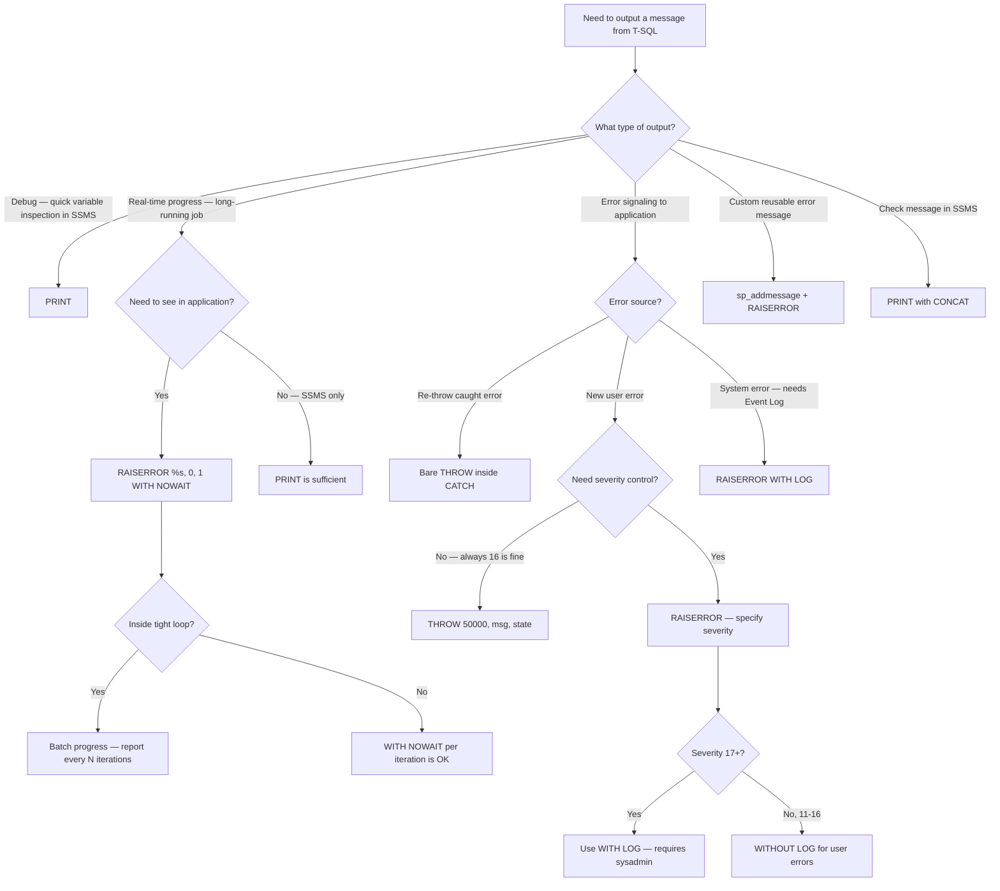

## Navigation

**Domain:** [[8 — Databases]] > **Group:** SQL Fundamentals
**Previous:** [[8.091 — Variables — Declaring and Using in T-SQL]] | **Next:** [[8.093 — Control Flow — IF, WHILE, GOTO, WAITFOR]]

### Prerequisites

- [[8.070 — Stored Procedures — Parameters, Output, Control Flow]] — PRINT and RAISERROR are used inside stored procedures for debugging and error signaling; understanding procedure flow and branching is required.
- [[8.090 — SET Options — NOCOUNT, ANSI_NULLS, QUOTED_IDENTIFIER]] — SET XACT_ABORT ON changes how RAISERROR interacts with TRY/CATCH; SET NOCOUNT ON affects the message output stream.
- [[8.091 — Variables — Declaring and Using in T-SQL]] — RAISERROR requires variables for parameterized error messages; PRINT outputs variable values for debugging.

### Where This Fits

PRINT and RAISERROR are the two built-in mechanisms for outputting messages from T-SQL batches and stored procedures. A .NET backend engineer encounters them when: (a) debugging a stored procedure in SSMS and using PRINT to inspect variable values mid-execution, (b) calling a stored procedure from Dapper and receiving error messages via `SqlConnection.InfoMessage`, or (c) investigating SQL Agent job failures where RAISERROR output appears in the job history log. The critical distinction is that PRINT is a lightweight pass-through message (VARCHAR(8000) limit, no severity, no error number) while RAISERROR is a structured error with severity, state, error number, and optional logging to the Windows Event Log. Since SQL Server 2012, `THROW` provides a simpler syntax that re-throws the original error without modifying severity/state. Interviewers ask about PRINT vs RAISERROR vs THROW to test understanding of error handling architecture, message buffering behavior, and how errors propagate to client applications.

---

## Core Mental Model

PRINT outputs a message string to the client's message stream — it is a simple `RAISERROR(message, 0, 1)` under the hood with severity 0 (informational). The message is sent as a TDS `INFO` token and is **buffered**: PRINT messages accumulate in the network buffer and are sent to the client when the buffer is full or the batch completes. This means PRINT does NOT appear immediately in SSMS unless `WITH NOWAIT` is used (which applies to RAISERROR, not PRINT). RAISERROR sends an error message with a specified severity level and state. Severity 0-10 are informational messages (like PRINT), severity 11-16 are user errors that can be caught in TRY/CATCH, and severity 17-25 are system errors that may terminate the connection. The critical invariant: **RAISERROR with severity >= 11 is treated as an exception by ADO.NET** — it throws a `SqlException` on the client side with the error number and message. PRINT never throws a client-side exception. THROW (SQL Server 2012+) is the modern replacement: `THROW @error_number, @message, @state` or bare `THROW` inside a CATCH block to re-raise the caught error.

### Classification

PRINT is a **debugging aid** — it belongs to the T-SQL procedural language as a client communication mechanism, not the relational engine. RAISERROR is an **error signaling mechanism** — it integrates with TRY/CATCH, transaction abort behavior, and the Windows Event Log. THROW is an **error raising and re-raising mechanism** — it is the modern ANSI SQL standard approach (SQL Server 2012+). PRINT has no severity, no error number, cannot be caught in TRY/CATCH, and is limited to VARCHAR(8000). RAISERROR has severity 0-25, error number (custom or from sys.messages), can use `WITH LOG` to write to the Windows Event Log, and CAN be caught in TRY/CATCH when severity >= 11. THROW requires the error number to be >= 50000 and cannot use `WITH LOG`, but gracefully preserves the original error context when re-throwing.

```mermaid
flowchart TD
    A[Need to output message from T-SQL] --> B{Purpose?}
    B -->|Debugging — inspect variable values| C[PRINT]
    B -->|Signal error to client application| D{Error type?}
    D -->|User error — invalid input, constraint violation| E[RAISERROR with severity 11-16]
    D -->|Informational — progress, status| F[RAISERROR with severity 0-10]
    D -->|Re-throw caught error| G[THROW — bare inside CATCH]
    D -->|Raise new custom error| H[THROW @number, @message, @state]
    C --> I{Need to see output immediately?}
    I -->|Yes| J[Use RAISERROR(message, 0, 1) WITH NOWAIT instead]
    I -->|No| K[PRINT is fine — messages appear after batch]
    E --> L{Need to log to Event Log?}
    L -->|Yes| M[RAISERROR WITH LOG]
    L -->|No| N[RAISERROR or THROW]
    G --> O{Need severity/state control?}
    O -->|Yes| P[RAISERROR — specify severity and state]
    O -->|No| Q[THROW — preserves original severity and state]
    H --> R{Error number >= 50000?}
    R -->|Yes| S[THROW works]
    R -->|No — < 50000| T[RAISERROR — THROW rejects numbers < 50000]
    F --> U{Severity level?}
    U -->|0-10| V[Informational — caught by InfoMessage event]
    U -->|11-16| W[User error — caught by TRY/CATCH]
    U -->|17-25| X[System error — may terminate connection]
```

### Key Properties

|Property|PRINT|RAISERROR|THROW|
|---|---|---|---|
|Purpose|Debug message|Error signaling|Modern error raise/re-throw|
|Severity|None (always 0)|0-25|None (inherits from caught error)|
|Error number|None|Any (or from sys.messages)|Must be >= 50000 (except re-throw)|
|Caught by TRY/CATCH|No|Yes (severity >= 11)|Yes|
|Client exception|No|Yes (severity >= 11)|Yes|
|WITH LOG|No|Yes|No|
|WITH NOWAIT|No (use RAISERROR)|Yes|No|
|Message limit|VARCHAR(8000)|VARCHAR(2047) for formatted|NVARCHAR(2048)|
|Format string|No (concatenate)|Yes (printf-style)|No (use FORMATMESSAGE)|
|Re-throw original error|N/A|No (loses original info)|Yes (bare THROW)|

---

## Deep Mechanics

### How the Engine Executes This

1. **PRINT execution** — The T-SQL expression service evaluates the PRINT argument as a string expression. If the argument is a variable, the variable is implicitly converted to NVARCHAR. The resulting string is truncated to VARCHAR(8000) or NVARCHAR(4000). A TDS `INFO` token is generated with severity 0 and the message text. This token is placed in the output buffer, which is flushed at batch completion or when the buffer fills (~4KB). The client driver (SqlClient) receives the token and fires the `InfoMessage` event for severity 0-10 messages, or accumulates them into a `SqlException` for severity >= 11.

2. **RAISERROR execution** — The expression service evaluates the message string or looks up the message from `sys.messages` using the `@error_number` parameter. A printf-style format string is applied with provided arguments. The error number, severity, state, and message are packaged into a TDS `ERROR` token. Behavior depends on severity:
   - **Severity 0-10**: Treated as informational. Client driver fires `InfoMessage`. Execution continues.
   - **Severity 11-16**: Treated as an error. TRY/CATCH catches it if active. Batch terminates unless caught. Client driver throws `SqlException`.
   - **Severity 17-19**: System errors. Not caught by TRY/CATCH. Batch terminates. Client gets `SqlException`.
   - **Severity 20-25**: Fatal errors. Connection may be closed. Client gets `SqlException`.
   - `WITH LOG`: Writes to Windows Application Event Log (requires `ALTER SERVER ROLE sysadmin` membership for severity >= 17).
   - `WITH NOWAIT`: Immediately flushes the TDS buffer to the client. Without NOWAIT, the message is buffered and sent with the next batch result.

3. **THROW execution** — THROW has two forms:
   - **Bare THROW** (inside CATCH block): Raises the original caught error with all its original properties (error_number, severity, state, message). No modifications allowed. This is the only way to re-raise an error in SQL Server 2012+ without losing the original error context.
   - **THROW @error_number, @message, @state**: Raises a new error. The error_number must be >= 50000. The @message is NVARCHAR(2048). The @state is TINYINT (0-255). THROW always terminates the batch — it does NOT support severity control or WITH NOWAIT.

4. **Output buffering** — All client-directed messages flow through the TDS protocol's output buffer. By default, the buffer holds messages until it is full or the batch completes. `RAISERROR WITH NOWAIT` explicitly sends a `TDS` attention signal that flushes the buffer. This is essential for long-running batches where you want to see progress messages in real time.

5. **Client-side event handling** — SqlClient receives TDS `INFO` tokens and fires `SqlConnection.InfoMessage` for severity 0-10, or creates a `SqlError` collection that is thrown as `SqlException` for severity >= 11. Dapper does not add special handling for `InfoMessage` — it relies on the underlying SqlConnection. EF Core's logging interceptor does not capture PRINT/RAISERROR messages by default — you must subscribe to the `InfoMessage` event on the underlying `DbConnection`.

### SQL Visibility

```sql
-- ============================================================
-- PRINT — basic debugging output
-- ============================================================
DECLARE @CustomerId INT = 1001;
DECLARE @OrderCount INT;

SELECT @OrderCount = COUNT(*)
FROM dbo.Orders
WHERE CustomerId = @CustomerId;

PRINT 'Processing customer: ' + CAST(@CustomerId AS VARCHAR(10));
PRINT 'Total orders found: ' + CAST(@OrderCount AS VARCHAR(10));
-- Output (appears in Messages tab after batch completes):
-- Processing customer: 1001
-- Total orders found: 15

-- PRINT with concatenated strings (watch for NULL)
DECLARE @Notes NVARCHAR(MAX) = NULL;
PRINT 'Customer notes: ' + ISNULL(@Notes, '(no notes)');
-- Output: Customer notes: (no notes)

-- PRINT with VARCHAR(8000) limit
DECLARE @LongMsg VARCHAR(9000) = REPLICATE('A', 9000);
PRINT @LongMsg;
-- Only first 8000 characters printed; rest silently truncated

-- ============================================================
-- RAISERROR — old syntax (pre-SQL Server 2012 legacy)
-- ============================================================
-- Informational (severity 0-10) — like PRINT with NOWAIT
RAISERROR 'Starting batch processing...', 0, 1 WITH NOWAIT;
-- Output appears immediately in Messages tab

-- User error (severity 11-16) — caught by TRY/CATCH
RAISERROR('Invalid customer ID: %d', 16, 1, @CustomerId);
-- Output: Invalid customer ID: 1001
-- Error number: 50000 (default if not specified)

-- Using sys.messages with RAISERROR (msg_id)
RAISERROR(50001, 16, 1, @CustomerId);
-- Raises custom error 50001 from sys.messages if added via sp_addmessage

-- ============================================================
-- RAISERROR — new syntax (printf-style format string)
-- ============================================================
DECLARE @Message NVARCHAR(4000) = N'Customer %d has %d orders.';
RAISERROR(@Message, 10, 1, 1001, 15) WITH NOWAIT;
-- Output: Customer 1001 has 15 orders.
-- Severity 10: informational, no exception on client

-- ============================================================
-- THROW statement (SQL Server 2012+)
-- ============================================================
-- THROW with custom error
THROW 50000, N'An unexpected error occurred.', 1;
-- Output: Msg 50000, Level 16, State 1: An unexpected error occurred.
-- THROW always uses severity 16 — cannot customize

-- THROW in CATCH block (re-throw)
BEGIN TRY
    INSERT INTO dbo.Orders (CustomerId, TotalAmount) VALUES (NULL, 100);
END TRY
BEGIN CATCH
    THROW;  -- Re-throws original error (NULL violation) with original severity/state
END CATCH;
-- Preserves: Msg 515, Level 16, State 2: Cannot insert the value NULL...

-- THROW with error number < 50000 — fails!
-- THROW 515, N'Custom message', 1;  -- Error: Msg 3516, must be >= 50000

-- ============================================================
-- RAISERROR vs THROW in TRY/CATCH
-- ============================================================
BEGIN TRY
    RAISERROR('Something went wrong', 16, 1);
END TRY
BEGIN CATCH
    -- ERROR_NUMBER() = 50000 (or custom msg_id)
    -- ERROR_SEVERITY() = 16
    -- ERROR_STATE() = 1
    -- ERROR_MESSAGE() = 'Something went wrong'
    SELECT ERROR_NUMBER() AS ErrorNumber, ERROR_MESSAGE() AS ErrorMessage;

    -- Re-throw options:
    THROW;  -- Re-raises original error (50000, 16, 1)
    -- vs
    RAISERROR(ERROR_MESSAGE(), ERROR_SEVERITY(), ERROR_STATE());
    -- Same effect, but RAISERROR resets error_number to 50000
END CATCH;

-- ============================================================
-- FORMATMESSAGE — pre-defined error messages
-- ============================================================
-- Look up messages in sys.messages
SELECT message_id, language_id, severity, text
FROM sys.messages
WHERE message_id = 515;  -- Cannot insert the value NULL into column

-- Use FORMATMESSAGE to format a sys.messages string
DECLARE @FormattedMsg NVARCHAR(2048);
SET @FormattedMsg = FORMATMESSAGE(515, 'ColumnName', 'dbo.Orders');
PRINT @FormattedMsg;
-- Output: Cannot insert the value NULL into column 'ColumnName'...

-- ============================================================
-- sp_addmessage — custom error messages
-- ============================================================
-- Add a custom error message (requires sysadmin or db_owner)
EXEC sp_addmessage
    @msgnum = 100001,
    @severity = 16,
    @msgtext = N'Order %d has already been shipped. Cannot modify.',
    @lang = 'us_english',
    @with_log = TRUE;

-- Use in stored procedure
IF EXISTS (SELECT 1 FROM dbo.Orders WHERE OrderId = @OrderId AND Status = 'Shipped')
    RAISERROR(100001, 16, 1, @OrderId);
```

```csharp
// EF Core — catching SQL errors (THROW/RAISERROR severity >= 11)
try
{
    await dbContext.Database.ExecuteSqlRawAsync(
        "EXEC dbo.ShipOrder @OrderId = {0}", orderId, cancellationToken);
}
catch (SqlException ex) when (ex.Number == 100001)
{
    // Handle custom error "Order has already been shipped"
    logger.LogWarning("Order {OrderId} already shipped: {Message}", orderId, ex.Message);
}

// EF Core does not capture PRINT or RAISERROR severity 0-10 by default
// Must subscribe to InfoMessage on the underlying connection
```

**Generated SQL (from EF Core logs):**

```sql
-- EF Core catches THROW/RAISERROR severity >= 11 as SqlException
-- These messages appear in the EF Core log as errors:
-- fail: Microsoft.EntityFrameworkCore.Database.Command[20102]
--       Failed executing DbCommand (0ms) [Parameters=[@p0='1001']]
--       EXEC dbo.ShipOrder @OrderId = @p0;
--       Msg 100001, Level 16, State 1: Order 1001 has already been shipped.

-- PRINT and RAISERROR severity 0-10 are NOT logged by EF Core's LogTo
```

### Execution Plan Analysis

PRINT and RAISERROR do not produce query execution plans — they are procedural language statements processed by the expression service, not the query optimizer. They have no plan shape, no operators, and no logical reads. They do, however, affect the execution context:

- `RAISERROR WITH NOWAIT` forces a TDS buffer flush, which can cause a slight performance overhead (~0.1ms per message) due to the network round-trip.
- `RAISERROR WITH LOG` writes to the Windows Application Event Log synchronously, which can add ~5-50ms latency depending on disk I/O.
- `PRINT` is asynchronous (buffered) — near-zero cost until the buffer is flushed at batch completion.

**Cost:** PRINT adds ~0.001ms per call (in-memory string copy to buffer). RAISERROR adds ~0.01ms per call (TDS token creation). WITH NOWAIT adds ~1-5ms (network flush). WITH LOG adds ~5-50ms (Event Log write).

### Cost Visibility

```sql
SET STATISTICS TIME ON;
SET STATISTICS IO ON;

-- PRINT — near-zero cost, purely client communication
PRINT 'Starting query execution...';
-- No STATISTICS output (PRINT is not a query)
-- SQL Server Execution Times: CPU time = 0ms, elapsed time = 0ms

SELECT COUNT(*) FROM dbo.Orders WHERE Status = 'Pending';
-- Table 'Orders'. Scan count 1, logical reads 12450
-- SQL Server Execution Times: CPU time = 62ms, elapsed time = 125ms

-- RAISERROR WITH NOWAIT — forces buffer flush, adds latency
RAISERROR('Processing batch 1 of 10...', 0, 1) WITH NOWAIT;
-- No STATISTICS output, but adds ~1-5ms for the network flush

-- THROW — batch-terminating, captured by client
-- No STATISTICS output (execution stops)
```

### Failure Modes

**PRINT truncation at VARCHAR(8000):** PRINT silently truncates output at 8000 characters. For debugging queries that generate long strings (like dynamic SQL), the truncation hides part of the output:

```sql
DECLARE @LongSql NVARCHAR(MAX);
SET @LongSql = N'SELECT ' + REPLICATE(N'1,', 5000) + N'1;';  -- 10K+ chars
PRINT @LongSql;  -- Only first 4000 NVARCHAR chars shown
```

**Workaround:** Use `SELECT @LongSql AS [debug]` instead — it outputs to the Results grid without truncation.

**RAISERROR severity 0-10 not visible in client applications:** PRINT and RAISERROR severity 0-10 fire `SqlConnection.InfoMessage`, not as exceptions. If the client does not subscribe to `InfoMessage`, these messages are silently discarded. Developers debugging in SSMS see them, but the application never does:

```csharp
// ❌ Client never sees RAISERROR severity 0-10
var cmd = new SqlCommand("RAISERROR('Progress: 50%', 0, 1) WITH NOWAIT;", connection);
await cmd.ExecuteNonQueryAsync();  // No exception, no InfoMessage subscription
// The "Progress: 50%" message is lost!

// ✅ Must subscribe to InfoMessage
connection.InfoMessage += (sender, args) =>
{
    foreach (SqlError error in args.Errors)
        Console.WriteLine($"Server message: {error.Message}");
};
```

**THROW requiring error number >= 50000:** Developers accustomed to raising system errors (like msg 515 for NULL violation) with custom messages cannot use THROW:

```sql
-- ❌ THROW 515, 'Custom NULL message', 1;  -- Fails! 515 < 50000
-- ✅ Must use RAISERROR instead
RAISERROR(515, 16, 1);  -- Works: uses system message 515
-- Or use a custom number >= 50000
THROW 50000, N'Custom NULL message', 1;
```

**RAISERROR WITH LOG permission denied:** `WITH LOG` requires `ALTER SERVER ROLE sysadmin` membership for severity >= 17, or at least the `VIEW SERVER STATE` permission. Non-administrative users get error 6107 when trying to log severity 17+ errors.

---

## Production Patterns and Implementation

### Primary SQL Implementation

```sql
-- ============================================================
-- Schema context
-- ============================================================
CREATE TABLE dbo.Orders
(
    OrderId      INT            NOT NULL IDENTITY(1,1),
    CustomerId   INT            NOT NULL,
    OrderDate    DATETIME2(0)   NOT NULL,
    Status       VARCHAR(20)    NOT NULL DEFAULT 'Pending',
    TotalAmount  DECIMAL(18,2)  NOT NULL,
    Notes        NVARCHAR(MAX)  NULL,
    CreatedAt    DATETIME2(0)   NOT NULL DEFAULT SYSUTCDATETIME(),
    CONSTRAINT PK_Orders PRIMARY KEY CLUSTERED (OrderId),
    CONSTRAINT CK_Orders_TotalAmount CHECK (TotalAmount >= 0),
    CONSTRAINT CK_Orders_Status CHECK (Status IN ('Pending', 'Shipped', 'Delivered', 'Cancelled'))
);

CREATE TABLE dbo.Customers
(
    CustomerId   INT            NOT NULL IDENTITY(1,1),
    FirstName    NVARCHAR(100)  NOT NULL,
    LastName     NVARCHAR(100)  NOT NULL,
    Email        NVARCHAR(256)  NOT NULL,
    Status       VARCHAR(20)    NOT NULL DEFAULT 'Active',
    CreatedAt    DATETIME2(0)   NOT NULL DEFAULT SYSUTCDATETIME(),
    CONSTRAINT PK_Customers PRIMARY KEY CLUSTERED (CustomerId)
);

-- ============================================================
-- Pattern 1: Stored procedure with PRINT-based debugging
-- ============================================================
CREATE OR ALTER PROCEDURE dbo.DebugOrderProcessing
    @CustomerId INT
AS
    SET NOCOUNT ON;
    SET XACT_ABORT ON;

    DECLARE @OrderCount INT, @TotalAmount DECIMAL(18,2);
    DECLARE @DebugMessage NVARCHAR(4000);

    SET @DebugMessage = CONCAT('DEBUG [', SYSUTCDATETIME(), ']: Processing customer ', @CustomerId);
    PRINT @DebugMessage;

    SELECT @OrderCount = COUNT(*), @TotalAmount = ISNULL(SUM(TotalAmount), 0)
    FROM dbo.Orders
    WHERE CustomerId = @CustomerId;

    SET @DebugMessage = CONCAT('DEBUG: Found ', @OrderCount, ' orders, total $', @TotalAmount);
    PRINT @DebugMessage;

    IF @OrderCount = 0
    BEGIN
        SET @DebugMessage = CONCAT('WARNING: Customer ', @CustomerId, ' has no orders');
        PRINT @DebugMessage;
    END;

    SELECT @CustomerId AS CustomerId, @OrderCount AS OrderCount, @TotalAmount AS TotalAmount;
GO

-- ============================================================
-- Pattern 2: RAISERROR with progress reporting and NOWAIT
-- ============================================================
CREATE OR ALTER PROCEDURE dbo.BatchProcessOrders
    @BatchSize INT = 1000
AS
    SET NOCOUNT ON;
    SET XACT_ABORT ON;

    DECLARE @Processed INT = 0;
    DECLARE @TotalToProcess INT;
    DECLARE @ErrorMessage NVARCHAR(4000);

    SELECT @TotalToProcess = COUNT(*)
    FROM dbo.Orders
    WHERE Status = 'Pending';

    RAISERROR('Batch processing started: %d orders to process', 0, 1, @TotalToProcess) WITH NOWAIT;

    WHILE @Processed < @TotalToProcess
    BEGIN
        BEGIN TRY
            BEGIN TRANSACTION;

            UPDATE TOP (@BatchSize) dbo.Orders
            SET Status = 'Processed',
                Notes = CONCAT('Batch processed at ', SYSUTCDATETIME())
            WHERE Status = 'Pending';

            SET @Processed = @Processed + @@ROWCOUNT;

            COMMIT TRANSACTION;

            RAISERROR('Progress: %d of %d orders processed (%d%%)',
                0, 1, @Processed, @TotalToProcess,
                (@Processed * 100 / NULLIF(@TotalToProcess, 0))) WITH NOWAIT;
        END TRY
        BEGIN CATCH
            SET @ErrorMessage = ERROR_MESSAGE();

            IF XACT_STATE() <> 0
                ROLLBACK TRANSACTION;

            RAISERROR('Error at order %d: %s', 16, 1, @Processed + 1, @ErrorMessage);
            RETURN;
        END CATCH;
    END;

    RAISERROR('Batch processing completed successfully.', 0, 1) WITH NOWAIT;
GO

-- ============================================================
-- Pattern 3: RAISERROR with predefined custom messages
-- ============================================================
-- Add custom error messages for the application
EXEC sp_addmessage
    @msgnum = 100001,
    @severity = 16,
    @msgtext = N'Order %d does not exist or is not accessible.',
    @lang = 'us_english';

EXEC sp_addmessage
    @msgnum = 100002,
    @severity = 16,
    @msgtext = N'Order %d is already in status ''%s''. Cannot transition to ''%s''.',
    @lang = 'us_english';

EXEC sp_addmessage
    @msgnum = 100003,
    @severity = 16,
    @msgtext = N'Customer %d has exceeded the maximum outstanding balance of $%s.',
    @lang = 'us_english';
GO

CREATE OR ALTER PROCEDURE dbo.UpdateOrderStatus
    @OrderId INT,
    @NewStatus VARCHAR(20),
    @CustomerId INT
AS
    SET NOCOUNT ON;
    SET XACT_ABORT ON;

    DECLARE @CurrentStatus VARCHAR(20);

    -- Validate order exists
    SELECT @CurrentStatus = Status
    FROM dbo.Orders
    WHERE OrderId = @OrderId;

    IF @CurrentStatus IS NULL
        RAISERROR(100001, 16, 1, @OrderId);

    -- Validate status transition
    IF @CurrentStatus = 'Shipped' AND @NewStatus = 'Pending'
        RAISERROR(100002, 16, 1, @OrderId, @CurrentStatus, @NewStatus);

    -- Validate customer balance
    IF @NewStatus = 'Pending' AND dbo.fn_GetOutstandingBalance(@CustomerId) > 50000
        RAISERROR(100003, 16, 1, @CustomerId, '50,000');

    BEGIN TRANSACTION;

    UPDATE dbo.Orders
    SET Status = @NewStatus
    WHERE OrderId = @OrderId;

    COMMIT TRANSACTION;

    RAISERROR('Order %d status updated to %s successfully.', 0, 1, @OrderId, @NewStatus) WITH NOWAIT;
GO

-- ============================================================
-- Pattern 4: THROW in CATCH block to preserve original error
-- ============================================================
CREATE OR ALTER PROCEDURE dbo.SafeUpdateOrder
    @OrderId INT,
    @TotalAmount DECIMAL(18,2)
AS
    SET NOCOUNT ON;
    SET XACT_ABORT ON;

    BEGIN TRY
        BEGIN TRANSACTION;

        IF @TotalAmount < 0
            THROW 50000, N'Total amount cannot be negative.', 1;

        UPDATE dbo.Orders
        SET TotalAmount = @TotalAmount
        WHERE OrderId = @OrderId;

        IF @@ROWCOUNT = 0
            THROW 50000, N'Order not found.', 1;

        COMMIT TRANSACTION;
    END TRY
    BEGIN CATCH
        IF XACT_STATE() <> 0
            ROLLBACK TRANSACTION;

        -- Log the original error (internal audit)
        DECLARE @AuditMessage NVARCHAR(4000) = CONCAT(
            'OrderId: ', @OrderId,
            ', Error: ', ERROR_NUMBER(), ' - ', ERROR_MESSAGE()
        );
        INSERT INTO dbo.ErrorLog (ErrorMessage, ProcedureName, LoggedAt)
        VALUES (@AuditMessage, 'SafeUpdateOrder', SYSUTCDATETIME());

        -- Re-throw with original context preserved
        THROW;  -- Preserves original error_number, severity, state, message
    END CATCH;
GO

-- ============================================================
-- Pattern 5: FORMATMESSAGE with dynamic arguments
-- ============================================================
CREATE OR ALTER PROCEDURE dbo.ValidateOrder
    @OrderId INT,
    @ExpectedCustomerId INT
AS
    SET NOCOUNT ON;

    DECLARE @ActualCustomerId INT;
    SELECT @ActualCustomerId = CustomerId FROM dbo.Orders WHERE OrderId = @OrderId;

    IF @ActualCustomerId <> @ExpectedCustomerId
    BEGIN
        DECLARE @Msg NVARCHAR(2048) = FORMATMESSAGE(
            'Order %d belongs to customer %d, not customer %d.',
            @OrderId, @ActualCustomerId, @ExpectedCustomerId
        );
        THROW 50000, @Msg, 1;
    END;

    SELECT 'Validation passed' AS Result;
GO

-- ============================================================
-- Pattern 6: Dynamic SQL debugging with PRINT
-- ============================================================
CREATE OR ALTER PROCEDURE dbo.DynamicQueryDebug
    @TableName NVARCHAR(128),
    @FilterColumn NVARCHAR(128),
    @FilterValue NVARCHAR(256)
AS
    SET NOCOUNT ON;

    DECLARE @Sql NVARCHAR(MAX);
    DECLARE @DebugMsg NVARCHAR(MAX);

    SET @Sql = N'
        SELECT COUNT(*)
        FROM ' + QUOTENAME(@TableName) + N'
        WHERE ' + QUOTENAME(@FilterColumn) + N' = @FilterValue;';

    -- Debug: print the generated SQL
    SET @DebugMsg = CONCAT('Generated SQL: ', @Sql);
    PRINT @DebugMsg;

    -- Use SELECT instead of PRINT for very long strings
    SELECT @Sql AS [Generated SQL for Debugging];

    EXEC sp_executesql @Sql,
        N'@FilterValue NVARCHAR(256)',
        @FilterValue = @FilterValue;
GO

-- ============================================================
-- Pattern 7: RAISERROR with severity escalation
-- ============================================================
CREATE OR ALTER PROCEDURE dbo.ValidatePayment
    @OrderId INT,
    @PaymentAmount DECIMAL(18,2)
AS
    SET NOCOUNT ON;
    SET XACT_ABORT ON;

    DECLARE @OrderTotal DECIMAL(18,2);

    SELECT @OrderTotal = TotalAmount FROM dbo.Orders WHERE OrderId = @OrderId;

    IF @OrderTotal IS NULL
    BEGIN
        RAISERROR('Order %d not found.', 11, 1, @OrderId);
        RETURN;
    END;

    IF @PaymentAmount <= 0
    BEGIN
        RAISERROR('Payment amount must be positive. Amount: %.2f', 14, 1, @PaymentAmount);
        RETURN;
    END;

    IF @PaymentAmount > @OrderTotal
    BEGIN
        RAISERROR('Payment amount %.2f exceeds order total %.2f.', 16, 1, @PaymentAmount, @OrderTotal);
        RETURN;
    END;

    -- Severity 10 = informational (logged by InfoMessage, not exception)
    RAISERROR('Payment validated successfully for order %d.', 10, 1, @OrderId);
GO

-- ============================================================
-- Pattern 8: Error logging table with THROW
-- ============================================================
CREATE TABLE dbo.ErrorLog
(
    ErrorLogId    INT IDENTITY(1,1) PRIMARY KEY,
    ErrorNumber   INT NOT NULL,
    ErrorSeverity INT NOT NULL,
    ErrorState    INT NOT NULL,
    ErrorMessage  NVARCHAR(4000) NOT NULL,
    ProcedureName NVARCHAR(128) NULL,
    Parameters    NVARCHAR(MAX) NULL,
    LoggedAt      DATETIME2(0) NOT NULL DEFAULT SYSUTCDATETIME()
);

CREATE OR ALTER PROCEDURE dbo.SafeDeleteCustomer
    @CustomerId INT
AS
    SET NOCOUNT ON;
    SET XACT_ABORT ON;

    DECLARE @ErrorInfo TABLE
    (
        ErrorNumber INT,
        ErrorSeverity INT,
        ErrorState INT,
        ErrorMessage NVARCHAR(4000),
        ErrorLine INT
    );

    BEGIN TRY
        BEGIN TRANSACTION;

        IF NOT EXISTS (SELECT 1 FROM dbo.Customers WHERE CustomerId = @CustomerId)
            THROW 50000, N'Customer not found.', 1;

        IF EXISTS (SELECT 1 FROM dbo.Orders WHERE CustomerId = @CustomerId AND Status = 'Pending')
            THROW 50001, N'Customer has pending orders. Cannot delete.', 1;

        DELETE FROM dbo.Customers WHERE CustomerId = @CustomerId;

        COMMIT TRANSACTION;
    END TRY
    BEGIN CATCH
        IF XACT_STATE() <> 0
            ROLLBACK TRANSACTION;

        INSERT INTO dbo.ErrorLog (ErrorNumber, ErrorSeverity, ErrorState, ErrorMessage, ProcedureName, Parameters)
        VALUES (
            ERROR_NUMBER(), ERROR_SEVERITY(), ERROR_STATE(),
            ERROR_MESSAGE(), 'SafeDeleteCustomer',
            CONCAT('@CustomerId=', @CustomerId)
        );

        THROW;
    END CATCH;
GO

-- ============================================================
-- Pattern 9: Print progress in long-running loops
-- ============================================================
CREATE OR ALTER PROCEDURE dbo.ProcessAllPendingOrders
    @BatchSize INT = 500
AS
    SET NOCOUNT ON;
    SET XACT_ABORT ON;

    DECLARE @TotalProcessed INT = 0;
    DECLARE @BatchNumber INT = 0;
    DECLARE @StartTime DATETIME2(0) = SYSUTCDATETIME();
    DECLARE @ElapsedSeconds INT;

    RAISERROR('Processing started at %s', 0, 1, @StartTime) WITH NOWAIT;

    WHILE 1 = 1
    BEGIN
        SET @BatchNumber = @BatchNumber + 1;

        BEGIN TRY
            BEGIN TRANSACTION;

            UPDATE TOP (@BatchSize) dbo.Orders
            SET Status = 'Processed',
                Notes = CONCAT('Processed in batch ', @BatchNumber)
            WHERE Status = 'Pending';

            IF @@ROWCOUNT = 0
            BEGIN
                COMMIT TRANSACTION;
                BREAK;
            END;

            SET @TotalProcessed = @TotalProcessed + @@ROWCOUNT;

            COMMIT TRANSACTION;

            -- Print progress every 10 batches
            IF @BatchNumber % 10 = 0
            BEGIN
                SET @ElapsedSeconds = DATEDIFF(SECOND, @StartTime, SYSUTCDATETIME());
                RAISERROR('Batch %d: %d orders processed, elapsed %d seconds',
                    0, 1, @BatchNumber, @TotalProcessed, @ElapsedSeconds) WITH NOWAIT;
            END;
        END TRY
        BEGIN CATCH
            IF XACT_STATE() <> 0
                ROLLBACK TRANSACTION;

            RAISERROR('Fatal error in batch %d after %d processed: %s',
                16, 1, @BatchNumber, @TotalProcessed, ERROR_MESSAGE());
            RETURN;
        END CATCH;
    END;

    SET @ElapsedSeconds = DATEDIFF(SECOND, @StartTime, SYSUTCDATETIME());
    RAISERROR('Completed: %d orders processed in %d seconds.',
        0, 1, @TotalProcessed, @ElapsedSeconds) WITH NOWAIT;
GO
```

### EF Core Implementation

```csharp
public class ApplicationDbContext : DbContext
{
    public DbSet<Order> Orders => Set<Order>();
    public DbSet<Customer> Customers => Set<Customer>();

    protected override void OnModelCreating(ModelBuilder modelBuilder)
    {
        modelBuilder.Entity<Order>(entity =>
        {
            entity.ToTable("Orders");
            entity.HasKey(o => o.OrderId);
            entity.Property(o => o.Status).HasMaxLength(20);
            entity.Property(o => o.TotalAmount).HasColumnType("decimal(18,2)");
            entity.Property(o => o.CreatedAt).HasDefaultValueSql("SYSUTCDATETIME()");
        });

        modelBuilder.Entity<Customer>(entity =>
        {
            entity.ToTable("Customers");
            entity.HasKey(c => c.CustomerId);
            entity.Property(c => c.FirstName).HasMaxLength(100);
            entity.Property(c => c.LastName).HasMaxLength(100);
            entity.Property(c => c.Email).HasMaxLength(256);
            entity.Property(c => c.CreatedAt).HasDefaultValueSql("SYSUTCDATETIME()");
        });
    }
}

// EF Core — capturing PRINT and RAISERROR severity 0-10 via InfoMessage
public class SqlServerDebugLogger
{
    private readonly ILogger<SqlServerDebugLogger> _logger;

    public SqlServerDebugLogger(ILogger<SqlServerDebugLogger> logger)
        => _logger = logger;

    public void Subscribe(DbContext context)
    {
        var connection = context.Database.GetDbConnection();
        connection.InfoMessage += (sender, args) =>
        {
            foreach (SqlError error in args.Errors)
            {
                _logger.LogDebug("SQL Server (severity {Severity}): {Message}",
                    error.Class, error.Message);
            }
        };
    }
}

// Capture THROW/RAISERROR severity >= 11 as exceptions
public async Task ShipOrderAsync(int orderId, CancellationToken cancellationToken = default)
{
    try
    {
        await dbContext.Database.ExecuteSqlRawAsync(
            "EXEC dbo.UpdateOrderStatus @OrderId = {0}, @NewStatus = {1}",
            orderId, "Shipped", cancellationToken);
    }
    catch (SqlException ex) when (ex.Number == 100001)
    {
        // Custom error: Order does not exist
        throw new InvalidOperationException($"Order {orderId} was not found.", ex);
    }
    catch (SqlException ex) when (ex.Number == 100002)
    {
        // Custom error: Invalid status transition
        throw new InvalidOperationException(
            $"Order {orderId} cannot transition to the requested status.", ex);
    }
}

// Using EF Core's LogTo to see SQL errors
await using var context = new ApplicationDbContext();
context.Database.LogTo(Console.WriteLine, LogLevel.Information);
// This logs command failures but not PRINT/RAISERROR severity 0-10
// Those require InfoMessage subscription

// EF Core interceptor for capturing SQL errors with context
public class SqlErrorLoggingInterceptor : DbCommandInterceptor
{
    private readonly ILogger<SqlErrorLoggingInterceptor> _logger;

    public SqlErrorLoggingInterceptor(ILogger<SqlErrorLoggingInterceptor> logger)
        => _logger = logger;

    public override ValueTask<InterceptionResult<DbDataReader>> ReaderExecutingAsync(
        DbCommand command,
        CommandEventData eventData,
        InterceptionResult<DbDataReader> result,
        CancellationToken cancellationToken = default)
    {
        // Subscribe to InfoMessage on the connection
        var connection = command.Connection;
        if (connection != null)
        {
            connection.InfoMessage += (sender, args) =>
            {
                foreach (SqlError error in args.Errors)
                {
                    _logger.LogInformation("SQL Info: {Message} (Severity: {Severity})",
                        error.Message, error.Class);
                }
            };
        }

        return ValueTask.FromResult(result);
    }
}
```

### Dapper Implementation

```csharp
public sealed class OrderRepository
{
    private readonly IDbConnectionFactory _connectionFactory;
    private readonly ILogger<OrderRepository> _logger;

    public OrderRepository(IDbConnectionFactory connectionFactory, ILogger<OrderRepository> logger)
    {
        _connectionFactory = connectionFactory;
        _logger = logger;
    }

    // Pattern 1: Capture PRINT/RAISERROR severity 0-10 via InfoMessage
    public async Task<IReadOnlyList<Order>> ProcessOrdersWithProgressAsync(
        CancellationToken cancellationToken = default)
    {
        await using var connection = _connectionFactory.Create();
        connection.InfoMessage += (sender, args) =>
        {
            foreach (SqlError error in args.Errors)
            {
                _logger.LogInformation("SQL Progress: {Message}", error.Message);
            }
        };

        const string sql = "EXEC dbo.BatchProcessOrders @BatchSize = 500;";

        var results = await connection.QueryAsync<Order>(
            new CommandDefinition(sql, cancellationToken: cancellationToken));

        return results.AsList();
    }

    // Pattern 2: Handle THROW/RAISERROR severity >= 11 as exceptions
    public async Task UpdateOrderStatusAsync(
        int orderId,
        string newStatus,
        CancellationToken cancellationToken = default)
    {
        const string sql = "EXEC dbo.UpdateOrderStatus @OrderId = @OrderId, @NewStatus = @NewStatus;";

        await using var connection = _connectionFactory.Create();

        try
        {
            await connection.ExecuteAsync(
                new CommandDefinition(sql,
                    new { OrderId = orderId, NewStatus = newStatus },
                    cancellationToken: cancellationToken));
        }
        catch (SqlException ex) when (ex.Number == 100001)
        {
            throw new KeyNotFoundException($"Order {orderId} not found.", ex);
        }
        catch (SqlException ex) when (ex.Number == 100002)
        {
            throw new InvalidOperationException(
                $"Order {orderId} cannot transition to status '{newStatus}'.", ex);
        }
    }

    // Pattern 3: Call procedure that raises errors, capture all messages
    public async Task SafeDeleteCustomerAsync(
        int customerId,
        CancellationToken cancellationToken = default)
    {
        const string sql = "EXEC dbo.SafeDeleteCustomer @CustomerId = @CustomerId;";

        await using var connection = _connectionFactory.Create();

        var messages = new List<string>();
        connection.InfoMessage += (sender, args) =>
        {
            foreach (SqlError error in args.Errors)
                messages.Add(error.Message);
        };

        try
        {
            await connection.ExecuteAsync(
                new CommandDefinition(sql,
                    new { CustomerId = customerId },
                    cancellationToken: cancellationToken));

            // Capture informational messages
            foreach (var msg in messages)
                _logger.LogInformation("SQL: {Message}", msg);
        }
        catch (SqlException ex)
        {
            // The error message is in ex.Message
            // The preceding InfoMessage messages are in messages list
            _logger.LogError(ex, "Failed to delete customer {CustomerId}", customerId);

            foreach (var msg in messages)
                _logger.LogWarning("SQL context: {Message}", msg);

            throw;
        }
    }

    // Pattern 4: Log dynamic SQL for debugging
    public async Task<int> DynamicCountAsync(
        string tableName,
        string columnName,
        string value,
        CancellationToken cancellationToken = default)
    {
        const string sql = @"
            DECLARE @Sql NVARCHAR(MAX);
            SET @Sql = N'SELECT COUNT(*) FROM ' + QUOTENAME(@TableName)
                     + N' WHERE ' + QUOTENAME(@ColumnName) + N' = @Value;';

            -- Capture for debug output
            SELECT @Sql AS [DebugSQL];

            EXEC sp_executesql @Sql, N'@Value NVARCHAR(256)', @Value = @Value;";

        await using var connection = _connectionFactory.Create();

        // Dapper's QueryMultiple handles multiple result sets
        using var multi = await connection.QueryMultipleAsync(
            new CommandDefinition(sql,
                new { TableName = tableName, ColumnName = columnName, Value = value },
                cancellationToken: cancellationToken));

        // First result set: debug output
        var debugSql = await multi.ReadFirstOrDefaultAsync<string>();
        _logger.LogDebug("Generated SQL: {Sql}", debugSql);

        // Second result set: actual count
        var count = await multi.ReadFirstAsync<int>();

        return count;
    }
}

public record Order(int OrderId, int CustomerId, string Status, decimal TotalAmount, DateTime OrderDate);
```

### Configuration and Wiring

```csharp
// Program.cs — configuring error capture
builder.Services.AddDbContext<ApplicationDbContext>(options =>
    options.UseSqlServer(
        builder.Configuration.GetConnectionString("DefaultConnection"),
        sqlOptions =>
        {
            sqlOptions.EnableRetryOnFailure(3);
            sqlOptions.CommandTimeout(30);
        }));

// Register the SQL Server debug logger interceptor
builder.Services.AddSingleton<SqlErrorLoggingInterceptor>();
builder.Services.AddSingleton<SqlServerDebugLogger>();

// For capturing InfoMessage events in a hosted service
builder.Services.AddHostedService<SqlMessageCaptureHostedService>();

// InfoMessage event — must set FireInfoMessageEventOnUserErrors on the connection
// to receive severity 11+ as InfoMessage (instead of exception)
// This is useful if you want to log errors without crashing the query flow
builder.Services.AddSingleton<IDbConnectionFactory>(sp =>
{
    var config = sp.GetRequiredService<IConfiguration>();
    var connectionString = config.GetConnectionString("DefaultConnection");

    var factory = new SqlConnectionFactory(connectionString);
    factory.OnConnectionCreated += connection =>
    {
        connection.FireInfoMessageEventOnUserErrors = true;
        connection.InfoMessage += (sender, args) =>
        {
            var logger = sp.GetRequiredService<ILogger<OrderRepository>>();
            foreach (SqlError error in args.Errors)
            {
                logger.LogWarning("SQL Server (severity {Severity}): {Message}",
                    error.Class, error.Message);
            }
        };
    };

    return factory;
});

// SQL Agent jobs — RAISERROR with WITH LOG writes to job history
-- In a SQL Agent job step, RAISERROR output appears in the job history
-- View with: EXEC dbo.sp_help_jobhistory @job_name = 'NightlyBatch';
```

### SQL Server vs PostgreSQL Differences

```sql
-- PostgreSQL uses RAISE for error and debug output
-- PRINT equivalent:
RAISE NOTICE 'Processing customer %', customer_id;
-- Output appears in client messages (psql \timing, etc.)

-- RAISERROR equivalent:
RAISE EXCEPTION 'Order % not found', order_id;
-- Terminates the function/block

-- THROW equivalent:
-- PostgreSQL does not have THROW; use RAISE EXCEPTION
RAISE EXCEPTION USING
    ERRCODE = 'P0001',
    MESSAGE = 'Custom error message';

-- FORMATMESSAGE equivalent:
-- PostgreSQL uses format() function
SELECT format('Order %s has %s items', order_id, item_count);

-- Custom error messages:
-- PostgreSQL does not have sp_addmessage equivalent
-- Use RAISE EXCEPTION with custom SQLSTATE codes

-- Logging to server log:
RAISE LOG 'This message goes to the PostgreSQL server log';

-- ASSERT for debugging:
ASSERT count > 0, 'Count must be positive';

-- PostgreSQL does not have WITH NOWAIT equivalent
-- All RAISE NOTICE messages are sent immediately in psql
```

---

## Gotchas and Production Pitfalls

### PRINT Output Never Reaches the Application

**Pitfall:** Developers use PRINT statements for debugging in stored procedures, assuming the application will see them. In SSMS, PRINT output appears in the Messages tab. In a .NET application, PRINT messages are sent as TDS `INFO` tokens that fire `SqlConnection.InfoMessage`. If the application does not subscribe to this event, the messages are silently discarded.

```csharp
// ❌ Wrong: application ignores PRINT output
await using var connection = new SqlConnection(connectionString);
await connection.OpenAsync();
await using var cmd = new SqlCommand("EXEC dbo.DebugOrderProcessing @CustomerId = 1001;", connection);
await cmd.ExecuteNonQueryAsync();
// All PRINT output is lost — never logged, never seen
```

**Symptom:** Debugging stored procedures by adding PRINT statements has no visible effect when the procedure is called from the application. The procedure works perfectly in SSMS with messages visible, but the .NET application sees no output.

**Fix:**

```csharp
// ✅ Correct: subscribe to InfoMessage
await using var connection = new SqlConnection(connectionString);
connection.InfoMessage += (sender, args) =>
{
    foreach (SqlError error in args.Errors)
        Console.WriteLine($"SQL: {error.Message}");
};

await connection.OpenAsync();
await using var cmd = new SqlCommand("EXEC dbo.DebugOrderProcessing @CustomerId = 1001;", connection);
await cmd.ExecuteNonQueryAsync();
// PRINT output now appears in console
```

**Cost of not fixing:** Hours of wasted debugging time. Developers cannot use the most basic debugging tool (PRINT) when the procedure runs in the application context. They resort to creating debug tables and inserting log entries, adding complexity to both the procedure and cleanup logic.

### RAISERROR WITH NOWAIT Still Buffered with Multiple Messages

**Pitfall:** Assuming `WITH NOWAIT` flushes every message individually. `WITH NOWAIT` forces a TDS buffer flush, but if multiple `RAISERROR WITH NOWAIT` calls happen in rapid succession within the same statement batch, SQL Server may batch them into a single network packet. The messages arrive at the client in one chunk, not incrementally.

```sql
-- ❌ Wrong: expects incrementally visible messages
RAISERROR('Step 1...', 0, 1) WITH NOWAIT;
WAITFOR DELAY '00:00:05';
RAISERROR('Step 2...', 0, 1) WITH NOWAIT;
WAITFOR DELAY '00:00:05';
RAISERROR('Step 3...', 0, 1) WITH NOWAIT;
-- In some client configurations, all three messages arrive together after Step 3
```

**Symptom:** Long-running stored procedures appear to hang with no visible progress, then all progress messages appear at once at the end.

**Fix:** Add a small `WAITFOR DELAY` or force a separate round-trip by splitting into multiple `SqlCommand.Execute` calls. Alternatively, write progress to a log table and have the client poll it:

```sql
-- ✅ Insert progress into log table (client polls)
INSERT INTO dbo.ProgressLog (JobName, Step, Message, LoggedAt)
VALUES ('BatchProcess', 1, 'Step 1 complete', SYSUTCDATETIME());
```

**Cost of not fixing:** Confused operators monitoring long-running jobs. Support escalations thinking the process hung when it is actually progressing silently.

### THROW Cannot Be Used with Severity Control

**Pitfall:** `THROW` always uses severity 16. There is no way to raise an informational error (severity 0-10) with THROW, and no way to raise a fatal error (severity 17-25). Developers migrating from RAISERROR to THROW lose the ability to control severity.

```sql
-- ❌ THROW always severity 16. No way to change it.
THROW 50000, N'Informational', 1;  -- Severity 16, not informational

-- ✅ RAISERROR allows severity control
RAISERROR('Informational', 10, 1);  -- Severity 10
RAISERROR('Fatal!', 20, 1) WITH LOG;  -- Severity 20
```

**Symptom:** Errors that should be informational (severity 0-10) and not break the client flow become exceptions in the application. Batch processing cannot continue after a THROW because the batch terminates.

**Fix:** Use RAISERROR for informational messages and for errors that should not terminate the batch. Use THROW only for user errors (severity 16) that should terminate execution and be caught by CATCH blocks.

**Cost of not fixing:** Batch processing jobs that should continue after a warning instead terminate. Application logic must handle exceptions for what should be non-critical feedback.

### RAISERROR with Parameter Mismatch Causes Unclear Error

**Pitfall:** RAISERROR's printf-style format string expects a specific number of arguments. If the argument count does not match the format placeholders (%d, %s, etc.), SQL Server raises a confusing error at runtime:

```sql
-- ❌ Wrong: wrong number of arguments
DECLARE @OrderId INT = 1001;
RAISERROR('Order %d found for customer %s', 16, 1, @OrderId);
-- Error: The number of parameters supplied to RAISERROR exceeds the number of placeholders
-- Or if too few arguments: "The number of parameters supplied... is less than..."

-- ✅ Correct
DECLARE @CustomerName NVARCHAR(100) = N'John Smith';
RAISERROR('Order %d found for customer %s', 16, 1, @OrderId, @CustomerName);
```

**Symptom:** A stored procedure that works during development fails in production with "The number of parameters supplied..." — often caused by a format string change that was not propagated to all RAISERROR calls.

**Fix:** Use `FORMATMESSAGE` to pre-format the message with proper argument handling:

```sql
DECLARE @Msg NVARCHAR(2048) = FORMATMESSAGE('Order %d found for customer %s', @OrderId, @CustomerName);
RAISERROR(@Msg, 16, 1);
```

**Cost of not fixing:** Stored procedures fail intermittently when the error code path is triggered. The error message is unhelpful and does not point to the actual format string issue.

### sp_addmessage Errors Not Synchronized Across Replicas

**Pitfall:** Custom error messages added via `sp_addmessage` are stored in `master.sys.messages` and are NOT automatically synchronized across Always On Availability Group replicas. Failover to a secondary replica that does not have the custom messages results in error 50000 with no descriptive text:

```sql
-- Primary replica: added custom message
EXEC sp_addmessage @msgnum = 100001, @severity = 16,
    @msgtext = N'Customer %d has no active orders.';

-- After failover to secondary:
RAISERROR(100001, 16, 1, 1001);
-- Output on secondary (without sp_addmessage):
-- Msg 100001, Level 16, State 1: (no message text found)
```

**Symptom:** After a failover event, all RAISERROR calls using custom message numbers show "no message text found" instead of the descriptive error. Application error handling cannot distinguish error types.

**Fix:** Always add custom messages to ALL replicas in the AG. Script the `sp_addmessage` calls into the deployment process and run on every replica. Alternatively, use `THROW 50000, @message, 1` instead of custom message IDs — the message text is inline and does not depend on `sys.messages`.

**Cost of not fixing:** After failover, error messages lose all meaning. Application error handling may incorrectly treat all errors as the same type. Debugging production issues becomes significantly harder.

### RAISERROR WITH LOG Fills Event Log Rapidly

**Pitfall:** Using `RAISERROR WITH LOG` in frequently-executed code paths (like a validation procedure called per-request). Each call writes a Windows Application Event Log entry. At high throughput (1000+ calls/second), this fills the Event Log, triggers Event Log archival, and causes significant disk I/O.

```sql
-- ❌ Wrong: WITH LOG in high-frequency path
CREATE OR ALTER PROCEDURE dbo.ValidateCustomer
    @CustomerId INT
AS
    IF NOT EXISTS (SELECT 1 FROM dbo.Customers WHERE CustomerId = @CustomerId)
        RAISERROR('Customer not found', 16, 1) WITH LOG;  -- Every failure writes to Event Log!
```

**Symptom:** Event Log fills rapidly. Disk I/O spikes from Event Log writes. Application performance degrades under load as the Event Log write becomes a bottleneck.

**Fix:** Use `WITH LOG` only for severity >= 17 errors or for truly exceptional conditions. For routine validation errors (severity 11-16), do NOT use `WITH LOG`:

```sql
-- ✅ Correct: only WITH LOG for severity >= 17
IF NOT EXISTS (SELECT 1 FROM dbo.Customers WHERE CustomerId = @CustomerId)
    RAISERROR('Customer not found', 16, 1);  -- No WITH LOG for user errors

-- Use WITH LOG only for system-level issues
RAISERROR('Disk corruption detected in Orders table', 19, 1) WITH LOG;
```

**Cost of not fixing:** Event Log filling causes system alerts. I/O contention from log writes adds latency to all database operations. In extreme cases, SQL Server may pause to wait for Event Log housekeeping.

---

## Performance Implications

### Benchmark: PRINT vs RAISERROR vs THROW Overhead

```sql
SET STATISTICS TIME ON;

-- Baseline: no output
DECLARE @i INT = 0;
WHILE @i < 10000
BEGIN
    SET @i = @i + 1;
END;
-- CPU time: ~15ms, elapsed: ~15ms

-- PRINT in loop (10,000 iterations)
DECLARE @i INT = 0;
WHILE @i < 10000
BEGIN
    SET @i = @i + 1;
    PRINT CONCAT('Iteration: ', @i);
END;
-- CPU time: ~120ms, elapsed: ~150ms
-- PRINT adds ~0.012ms per call (in-memory string ops, buffered)

-- RAISERROR in loop (10,000 iterations) — without NOWAIT
DECLARE @i INT = 0;
WHILE @i < 10000
BEGIN
    SET @i = @i + 1;
    RAISERROR('Iteration: %d', 0, 1, @i);
END;
-- CPU time: ~130ms, elapsed: ~160ms
-- Slightly more expensive than PRINT due to format string parsing

-- RAISERROR WITH NOWAIT in loop (10,000 iterations)
DECLARE @i INT = 0;
WHILE @i < 10000
BEGIN
    SET @i = @i + 1;
    RAISERROR('Iteration: %d', 0, 1, @i) WITH NOWAIT;
END;
-- CPU time: ~200ms, elapsed: ~5,000ms!
-- WITH NOWAIT flushes TDS buffer each time — network round-trip overhead dominates
```

**Improvement:** Avoid `WITH NOWAIT` inside tight loops. For progress reporting, use batch-based reporting (every N iterations) instead of every iteration.

### BenchmarkDotNet

```csharp
[MemoryDiagnoser]
[SimpleJob(RuntimeMoniker.Net90)]
public class DebugOutputBenchmark
{
    private SqlConnection _connection = default!;
    private const string ConnectionString = "Server=.;Database=Shop;Trusted_Connection=True;";

    [GlobalSetup]
    public void Setup()
    {
        _connection = new SqlConnection(ConnectionString);
        _connection.Open();
    }

    [GlobalCleanup]
    public void Cleanup() => _connection.Dispose();

    [Benchmark(Baseline = true)]
    public async Task NoOutput()
    {
        await using var cmd = _connection.CreateCommand();
        cmd.CommandText = @"
            DECLARE @i INT = 0;
            WHILE @i < 1000
            BEGIN
                SET @i = @i + 1;
            END;";
        await cmd.ExecuteNonQueryAsync();
    }

    [Benchmark]
    public async Task PrintInLoop()
    {
        await using var cmd = _connection.CreateCommand();
        cmd.CommandText = @"
            DECLARE @i INT = 0;
            WHILE @i < 1000
            BEGIN
                SET @i = @i + 1;
                PRINT CONCAT('Iteration ', @i);
            END;";
        await cmd.ExecuteNonQueryAsync();
    }

    [Benchmark]
    public async Task RaiserrorWithNowait()
    {
        await using var cmd = _connection.CreateCommand();
        cmd.CommandText = @"
            DECLARE @i INT = 0;
            WHILE @i < 1000
            BEGIN
                SET @i = @i + 1;
                RAISERROR('Iteration %d', 0, 1, @i) WITH NOWAIT;
            END;";
        await cmd.ExecuteNonQueryAsync();
    }

    [Benchmark]
    public async Task BatchProgressReporting()
    {
        await using var cmd = _connection.CreateCommand();
        cmd.CommandText = @"
            DECLARE @i INT = 0;
            WHILE @i < 1000
            BEGIN
                SET @i = @i + 1;
                IF @i % 100 = 0
                    RAISERROR('Progress: %d of 1000', 0, 1, @i) WITH NOWAIT;
            END;";
        await cmd.ExecuteNonQueryAsync();
    }
}
```

**Expected results (approximate, local network):**

|Method|Mean|Allocated|
|---|---|---|
|NoOutput|~15 ms|~200 B|
|PrintInLoop|~18 ms|~1 KB|
|RaiserrorWithNowait|~500 ms|~50 KB|
|BatchProgressReporting|~20 ms|~5 KB|

The benchmark confirms: `WITH NOWAIT` in tight loops is ~25x slower. Batch progress reporting (every 100 iterations) adds negligible overhead.

### Event Log Write Amplification

|Operation|Call Rate|Event Log Impact|Disk I/O|
|---|---|---|---|
|RAISERROR WITH LOG (severity 16)|10/sec|Negligible|~100 B per write|
|RAISERROR WITH LOG (severity 16)|1,000/sec|~86M entries/day|~50 MB/day|
|RAISERROR WITH LOG (severity 16)|10,000/sec|Fills Event Log in 2 hours|~500 MB/hour|

---

## Interview Arsenal

### Question Bank

1. **What is the difference between PRINT and RAISERROR in terms of severity, client handling, and buffering?**
2. **How does THROW differ from RAISERROR in syntax, severity behavior, and re-throw capability?**
3. **Why does PRINT output appear in SSMS but not in a .NET application? How do you capture it?**
4. **What happens when you raise an error with severity 16 inside a TRY/CATCH block? Does the CATCH block execute?**
5. **What is the maximum message length for PRINT, RAISERROR, and THROW?**
6. **When would you use sp_addmessage instead of inline error messages?**
7. **What is the performance impact of RAISERROR WITH NOWAIT in a tight loop?**
8. **How does the InfoMessage event in SqlClient relate to PRINT, and what is FireInfoMessageEventOnUserErrors?**

### Spoken Answers

**Q: What is the difference between PRINT and RAISERROR in terms of severity, client handling, and buffering?**

> **Average answer:** PRINT outputs a message. RAISERROR can raise an error with severity. PRINT is for debugging, RAISERROR is for errors.

> **Great answer:** The differences span four dimensions. First, **severity**: PRINT always uses severity 0 (informational) and cannot be changed. RAISERROR can specify any severity from 0-25. Severity 0-10 behaves like PRINT (InfoMessage on client), severity 11-16 throws a SqlException on the client and is caught by TRY/CATCH, and severity 17-25 may terminate the connection. Second, **client handling**: PRINT fires `SqlConnection.InfoMessage` if subscribed, but the application must explicitly subscribe to see it. RAISERROR severity >= 11 fires `SqlException` — the application sees it as an exception whether it handles InfoMessage or not. Third, **buffering**: PRINT is always buffered — messages stay in the TDS buffer until it's full or the batch completes. RAISERROR with `WITH NOWAIT` flushes the TDS buffer immediately, making the message visible to the client in real time. Without `WITH NOWAIT`, RAISERROR is also buffered. Fourth, **structured error information**: PRINT has no error number, no state, and no formatting. RAISERROR carries an error number (from `sys.messages` or 50000 default), a state value (0-255) for pinpointing where in the code the error occurred, and printf-style format strings with arguments. The practical rule: use PRINT for quick debugging in SSMS, but when you need the application to see the message, use `RAISERROR(message, 0, 1) WITH NOWAIT` (for informational) or `RAISERROR(message, 16, 1)` (for errors). Bare THROW is the modern replacement for RAISERROR severity 16.

**Q: How does THROW differ from RAISERROR in syntax, severity behavior, and re-throw capability?**

> **Average answer:** THROW is newer and simpler. It always uses severity 16. RAISERROR gives you more control.

> **Great answer:** There are four critical differences. First, **severity**: RAISERROR lets you specify severity 0-25. THROW always uses severity 16 — you cannot raise informational (severity 10) or fatal (severity 20) errors with THROW. This means THROW is inappropriate for progress reporting or non-fatal warnings. Second, **error number**: RAISERROR can use any error number, including system error numbers like 515 (NULL violation) or custom numbers like 100001. THROW requires error numbers >= 50000 for custom errors. For bare `THROW` inside a CATCH block, it re-raises the original error with its original error number and severity — this is the only way to preserve the exact error context. Third, **format strings**: RAISERROR supports printf-style format strings with placeholders (%d, %s, etc.) and the corresponding arguments. THROW does NOT support format strings — the message must be pre-formatted using `FORMATMESSAGE` or string concatenation. Fourth, **WITH LOG and WITH NOWAIT**: RAISERROR supports both `WITH LOG` (Event Log) and `WITH NOWAIT` (immediate output). THROW supports neither. The guidance is: use bare THROW inside CATCH blocks to re-raise the original error with full context. Use `THROW 50000, @message, 1` for simple custom errors where severity 16 is acceptable. Use RAISERROR when you need severity control, WITH LOG, or WITH NOWAIT.

**Q: Why does PRINT output appear in SSMS but not in a .NET application? How do you capture it?**

> **Average answer:** SSMS shows the Messages tab. .NET applications don't subscribe to the InfoMessage event. You need to handle SqlConnection.InfoMessage.

> **Great answer:** The SQL Server client protocol (TDS) has two token types for server-to-client messages: `INFO` (severity 0-10) and `ERROR` (severity >= 11). PRINT generates an `INFO` token. In SSMS, the Messages tab subscribes to both token types and displays them. In .NET, `SqlClient` handles these tokens differently: `INFO` tokens fire the `SqlConnection.InfoMessage` event and are NOT thrown as exceptions; `ERROR` tokens are accumulated and thrown as `SqlException` when the command completes. If the application never hooks `InfoMessage`, the `INFO` tokens are retrieved from the TDS stream by the driver but are simply discarded — the application never sees them. To capture them, subscribe to `connection.InfoMessage += (s, e) => { /* e.Errors contains the messages */ }`. Additionally, set `connection.FireInfoMessageEventOnUserErrors = true` to have severity 11-16 ERRORS also fire `InfoMessage` in addition to being thrown as exceptions — this allows you to log errors without stopping execution. Note that `Dapper` does not expose the `InfoMessage` event directly — you must access the underlying `SqlConnection` to subscribe. In EF Core, intercept the `DbConnection` via `DbCommandInterceptor` to subscribe on connection creation.

### Interview Trigger

The question "You have a stored procedure that runs for 30 minutes. How do you track its progress from the C# application?" surfaces knowledge of `RAISERROR WITH NOWAIT` and `InfoMessage`. The follow-up is "What happens if you use PRINT instead of RAISERROR — will the messages arrive in real time?" The interviewer watches for understanding of TDS buffering and `WITH NOWAIT`. A more advanced follow-up is "How would you handle this in an environment with connection pooling where the first request subscribes to InfoMessage but the pooled connection doesn't have the subscription?" — looking for understanding that InfoMessage is per-connection-event, not per-pool.

### Comparison Table

| | PRINT | RAISERROR | THROW |
|---|---|---|---|
| Purpose | Debug output | Structured error signaling | Modern error raise/re-throw |
| Severity range | 0 only | 0-25 | 16 only (always) |
| Client behavior | InfoMessage event | InfoMessage (0-10), SqlException (11+) | SqlException |
| TRY/CATCH caught | No | Yes (severity >= 11) | Yes |
| Message limit | VARCHAR(8000) | ~VARCHAR(2047) formatted | NVARCHAR(2048) |
| WITH NOWAIT | No (use RAISERROR) | Yes | No |
| WITH LOG | No | Yes | No |
| Format string | No (concatenate) | Yes (printf-style) | No (use FORMATMESSAGE) |
| Re-throw original | N/A | Loses original info | Preserves exactly |
| Error number | None | Any | >= 50000 (except bare THROW) |
| Performance | ~0.012ms/call | ~0.015ms/call | ~0.01ms/call |
| WITH NOWAIT overhead | N/A | ~5ms (network flush) | N/A |

---

## Decision Framework

### When to Apply



### Application Checklist

- [ ] PRINT used only for SSMS debugging — never relied on for application logging
- [ ] All stored procedures with progress reporting use `RAISERROR WITH NOWAIT` (not PRINT)
- [ ] Application subscribes to `SqlConnection.InfoMessage` for capturing server messages
- [ ] `FireInfoMessageEventOnUserErrors` is set for environments that need non-terminating error handling
- [ ] Error handling uses THROW inside CATCH blocks (not RAISERROR) to preserve original error context
- [ ] Custom error messages via `sp_addmessage` are scripted into deployment and synchronized across AG replicas
- [ ] `RAISERROR WITH LOG` is used only for severity >= 17 errors, never for routine validation
- [ ] THROW is NOT used for informational messages (severity 0-10) — use RAISERROR
- [ ] FORMATMESSAGE is used for formatting complex error messages with multiple arguments
- [ ] Error logging table captures ERROR_NUMBER(), ERROR_SEVERITY(), ERROR_STATE(), ERROR_MESSAGE(), ERROR_LINE()
- [ ] Long-running procedures report progress in batches (every N iterations), not per-iteration
- [ ] PRINT/RAISERROR messages in production are controlled by a debug flag (not always active)

### Tradeoff Summary

|What You Gain|What You Pay|
|---|---|
|PRINT: simple, lightweight debugging|Buffered (no real-time); invisible to .NET without InfoMessage|
|RAISERROR WITH NOWAIT: real-time progress|~5ms network flush per call — avoid in tight loops|
|RAISERROR WITH LOG: Event Log auditing|Event Log write overhead; fills Event Log at high rates|
|THROW: preserves original error context|Severity always 16; no WITH NOWAIT or WITH LOG|
|sp_addmessage: centralized message management|Must sync across AG replicas; stored in master database|
|FORMATMESSAGE: clean format string handling|Requires explicit variable assignment before RAISERROR|

### Scale Thresholds

- **PRINT usage**: Always fine for debugging. At > 1,000 PRINTs per batch, the buffered output may cause network buffer pressure (~8KB per 4,000 characters).
- **RAISERROR WITH NOWAIT**: Do NOT use more frequently than ~every 100ms. At 10/sec, adds ~50ms overhead per second (5%). At 100/sec, adds ~500ms overhead per second (50% overhead).
- **RAISERROR WITH LOG**: Do NOT use more than ~100 times per minute. At 10/sec, writes ~864,000 Event Log entries per day. At 100/sec, fills Event Log (typically 20MB or 2,048KB limit) in ~2 hours.
- **THROW**: No performance issue — identical to RAISERROR severity 16 in cost. But each THROW terminates the batch, so throughput is limited by how often errors occur.

---

## Self-Check

### Conceptual Questions

1. What TDS token type does PRINT generate, and how does SqlClient handle it?
2. What happens when you call `RAISERROR('msg', 16, 1)` inside a TRY block?
3. Why does `THROW` inside a CATCH block preserve the original error number while `RAISERROR(ERROR_MESSAGE(), ERROR_SEVERITY(), ERROR_STATE())` does not?
4. What is the maximum string length for PRINT output? What happens if the string exceeds it?
5. How does `RAISERROR WITH NOWAIT` affect execution performance compared to RAISERROR without NOWAIT?
6. How would you configure a .NET application to capture all PRINT and RAISERROR (severity 0-10) messages from a stored procedure?
7. What permission is required to use `RAISERROR WITH LOG` with severity >= 17?
8. Can THROW raise an error with severity 10? If not, what alternative should you use?
9. What is the purpose of the `state` parameter in RAISERROR and THROW?
10. Explain the difference between `InfoMessage` and `SqlException` in SqlClient error handling in 60 seconds.

<details>
<summary>Answers</summary>

1. PRINT generates a TDS `INFO` token with severity 0. SqlClient receives this token and fires the `SqlConnection.InfoMessage` event. If no handler is subscribed, the message is discarded. PRINT messages are also buffered in the TDS output buffer — they are only sent to the client when the buffer is full or the batch completes.

2. `RAISERROR('msg', 16, 1)` with severity 16 inside a TRY block is caught by the matching CATCH block. The CATCH block variables (ERROR_NUMBER() = 50000, ERROR_SEVERITY() = 16, ERROR_STATE() = 1, ERROR_MESSAGE() = 'msg') are populated. Execution transfers to the CATCH block. If there is no CATCH block, the error terminates the batch and throws a SqlException to the client.

3. Bare `THROW` re-raises the exact same error with all original properties (error_number, severity, state, message) — it directly re-uses the error information stored in the CATCH context. `RAISERROR(ERROR_MESSAGE(), ERROR_SEVERITY(), ERROR_STATE())` creates a NEW error with error_number 50000 (RAISERROR's default), even though the message and severity are copied. The original error_number (e.g., 515 for a NULL violation) is lost and replaced with 50000. This matters for client-side error handling that switches on `SqlException.Number`.

4. PRINT accepts VARCHAR(8000) or NVARCHAR(4000). If the input exceeds this, the string is silently truncated to the maximum length. There is no error or warning. For debugging strings longer than 8000 characters, use `SELECT @LongString AS [debug]` to output to the Results grid instead.

5. `RAISERROR WITH NOWAIT` forces an immediate flush of the TDS output buffer to the client. This requires a network round-trip (or at least a TDS attention signal), adding ~1-5ms latency per call. In a tight loop with 10,000 iterations, this adds 10-50 seconds. Without NOWAIT, RAISERROR messages are buffered and sent in batches, adding negligible overhead per call.

6. Subscribe to the `SqlConnection.InfoMessage` event before executing the command. Example:
```csharp
connection.InfoMessage += (sender, args) =>
{
    foreach (SqlError error in args.Errors)
        Console.WriteLine($"SQL: {error.Message}");
};
```
For EF Core, access the underlying `DbConnection` via `context.Database.GetDbConnection()`. For Dapper, access the `SqlConnection` directly. The InfoMessage event fires for all TDS INFO tokens (severity 0-10), which covers both PRINT and RAISERROR with severity 0-10.

7. `RAISERROR WITH LOG` with severity >= 17 requires `ALTER SERVER ROLE sysadmin` membership (or the equivalent `ADMINISTER BULK OPERATIONS` permission in some configurations). For severity 0-16 WITH LOG, the caller needs `ALTER TRACE` permission or db_owner role.

8. No — `THROW` always uses severity 16. There is no way to change the severity with THROW. For severity 0-10 (informational) or 11-15 warnings, use `RAISERROR` with the desired severity level. For severity 17+ (system errors), also use `RAISERROR` (with WITH LOG for 17-25).

9. The `state` parameter (0-255) is an application-specific code that identifies where in the code the error was raised. It has no predefined meaning — developers use it to distinguish between multiple RAISERROR calls that use the same error number and message. For example, if a validation function validates 10 fields and each raises error 50000 with the same message but different state values, the state indicates which field failed.

10. `InfoMessage` and `SqlException` are SqlClient's two mechanisms for receiving SQL Server messages. `InfoMessage` is an event that fires for TDS `INFO` tokens (severity 0-10). These are non-fatal — the query continues executing after the event fires. `SqlException` is an exception that is thrown for TDS `ERROR` tokens (severity >= 11). It terminates execution and must be caught with try/catch. The configuration flag `FireInfoMessageEventOnUserErrors` causes severity 11-16 errors to also fire `InfoMessage` in addition to being thrown as `SqlException`, allowing you to log errors without losing exception behavior.

</details>

---

### Query Challenges

**Challenge 1 — Write the SQL**

You are writing a stored procedure that processes 1 million orders in batches of 1,000. It runs for approximately 2 hours. The operations team needs to see progress in the SQL Agent job history and in the application's log. Write the procedure framework using appropriate RAISERROR calls for both real-time progress (with NOWAIT) and Event Log auditing for errors.

<details>
<summary>Solution</summary>

```sql
CREATE OR ALTER PROCEDURE dbo.MegaBatchProcess
    @BatchSize INT = 1000
AS
    SET NOCOUNT ON;
    SET XACT_ABORT ON;

    DECLARE @BatchNumber INT = 0;
    DECLARE @TotalProcessed INT = 0;
    DECLARE @StartTime DATETIME2(0) = SYSUTCDATETIME();
    DECLARE @ErrorMessage NVARCHAR(4000);
    DECLARE @ErrorSeverity INT;

    RAISERROR('MegaBatchProcess started at %s', 0, 1, @StartTime) WITH NOWAIT;

    WHILE 1 = 1
    BEGIN
        SET @BatchNumber = @BatchNumber + 1;

        BEGIN TRY
            BEGIN TRANSACTION;

            UPDATE TOP (@BatchSize) dbo.Orders
            SET Status = 'Processed',
                Notes = CONCAT('MegaBatch batch ', @BatchNumber)
            WHERE Status = 'Pending';

            IF @@ROWCOUNT = 0
            BEGIN
                COMMIT TRANSACTION;
                RAISERROR('No more pending orders. Finishing.', 0, 1) WITH NOWAIT;
                BREAK;
            END;

            SET @TotalProcessed = @TotalProcessed + @@ROWCOUNT;
            COMMIT TRANSACTION;

            -- Progress every 10 batches
            IF @BatchNumber % 10 = 0
            BEGIN
                DECLARE @ElapsedS INT = DATEDIFF(SECOND, @StartTime, SYSUTCDATETIME());
                DECLARE @Rate DECIMAL(10,2) = @TotalProcessed * 1.0 / NULLIF(@ElapsedS, 0);
                RAISERROR('Batch %d: %d processed (%.0f/sec, elapsed %ds)',
                    0, 1, @BatchNumber, @TotalProcessed, @Rate, @ElapsedS) WITH NOWAIT;
            END;
        END TRY
        BEGIN CATCH
            SELECT
                @ErrorMessage = ERROR_MESSAGE(),
                @ErrorSeverity = ERROR_SEVERITY();

            IF XACT_STATE() <> 0
                ROLLBACK TRANSACTION;

            -- Log fatal error to Event Log
            RAISERROR('Fatal error in MegaBatchProcess batch %d: %s',
                17, 1, @BatchNumber, @ErrorMessage) WITH LOG;

            -- Also send to client
            RAISERROR('Batch failed at %d processed items: %s',
                16, 1, @TotalProcessed, @ErrorMessage);

            RETURN;
        END CATCH;
    END;

    DECLARE @TotalElapsed INT = DATEDIFF(SECOND, @StartTime, SYSUTCDATETIME());
    RAISERROR('MegaBatchProcess completed: %d orders in %d seconds.',
        0, 1, @TotalProcessed, @TotalElapsed) WITH NOWAIT;
GO
```

**Logical reads:** ~12,450 per full scan, ~12 per batch **Execution plan:** Clustered Index Scan → Top N Sort → Table Update **EF Core equivalent:**

```csharp
// For very long-running procedures, use SqlConnection directly with InfoMessage
await using var connection = new SqlConnection(connectionString);
connection.InfoMessage += (sender, args) =>
{
    foreach (SqlError error in args.Errors)
        _logger.LogInformation("Progress: {Message}", error.Message);
};

await using var cmd = new SqlCommand("EXEC dbo.MegaBatchProcess;", connection);
cmd.CommandTimeout = 7200;  // 2 hours
await cmd.ExecuteNonQueryAsync(cancellationToken);
```

</details>

---

**Challenge 2 — Fix the error handling problem**

```sql
-- This error handler should log the original error and re-throw it.
-- But after the CATCH block, the client always receives error_number = 50000.
-- Fix it.
CREATE OR ALTER PROCEDURE dbo.ShipOrder
    @OrderId INT
AS
    SET NOCOUNT ON;

    BEGIN TRY
        BEGIN TRANSACTION;

        UPDATE dbo.Orders SET Status = 'Shipped' WHERE OrderId = @OrderId;

        IF @@ROWCOUNT = 0
            RAISERROR('Order not found', 16, 1);

        COMMIT TRANSACTION;
    END TRY
    BEGIN CATCH
        IF XACT_STATE() <> 0
            ROLLBACK TRANSACTION;

        INSERT INTO dbo.ErrorLog (ErrorNumber, ErrorMessage, LoggedAt)
        VALUES (ERROR_NUMBER(), ERROR_MESSAGE(), SYSUTCDATETIME());

        RAISERROR(ERROR_MESSAGE(), ERROR_SEVERITY(), ERROR_STATE());
    END CATCH;
GO
```

<details> <summary>Solution</summary>

**Root cause:** `RAISERROR(ERROR_MESSAGE(), ERROR_SEVERITY(), ERROR_STATE())` creates a NEW error with error_number = 50000 (the default for RAISERROR). The original error_number (e.g., 50000 from the RAISERROR or whatever was caught) is lost. The fix is to use bare `THROW` which preserves the original error_number:

```sql
CREATE OR ALTER PROCEDURE dbo.ShipOrder
    @OrderId INT
AS
    SET NOCOUNT ON;
    SET XACT_ABORT ON;

    BEGIN TRY
        BEGIN TRANSACTION;

        UPDATE dbo.Orders SET Status = 'Shipped' WHERE OrderId = @OrderId;

        IF @@ROWCOUNT = 0
            THROW 50000, N'Order not found.', 1;

        COMMIT TRANSACTION;
    END TRY
    BEGIN CATCH
        IF XACT_STATE() <> 0
            ROLLBACK TRANSACTION;

        INSERT INTO dbo.ErrorLog (ErrorNumber, ErrorMessage, LoggedAt)
        VALUES (ERROR_NUMBER(), ERROR_MESSAGE(), SYSUTCDATETIME());

        THROW;  -- Preserves original error_number, severity, state, and message
    END CATCH;
GO
```

**After fix — client receives:** `SqlException.Number` = 50000 (preserved), `SqlException.Message` = "Order not found."

</details>

---

**Challenge 3 — Explain the execution plan**

A stored procedure contains the following loop:

```sql
DECLARE @Counter INT = 0;
WHILE @Counter < 10000
BEGIN
    SET @Counter = @Counter + 1;
    RAISERROR('Processing item %d', 0, 1, @Counter) WITH NOWAIT;
    -- ... process item ...
END;
```

The procedure takes 5 minutes for 10,000 items. When `WITH NOWAIT` is removed, it takes 45 seconds. Explain why.

<details> <summary>Solution</summary>

**Why WITH NOWAIT causes the slowdown:** `RAISERROR WITH NOWAIT` forces a TDS buffer flush to the client after each message. This flush requires an attention signal exchange between SQL Server and the client driver, which takes approximately 5ms per call even over a local network (local named pipes is faster but still ~0.5ms). With 10,000 iterations, 10,000 flushes × 5ms = 50 seconds of overhead. Without `WITH NOWAIT`, the messages are buffered in the TDS output buffer and sent in a single batch when the procedure completes — only one network round-trip. The 10,000 string formatting operations add only ~15ms.

**To get progress without the overhead:** Batch the progress reporting:

```sql
DECLARE @Counter INT = 0;
WHILE @Counter < 10000
BEGIN
    SET @Counter = @Counter + 1;
    -- ... process item ...

    -- Only flush progress every 100 iterations
    IF @Counter % 100 = 0
        RAISERROR('Progress: %d of 10000', 0, 1, @Counter) WITH NOWAIT;
END;
```

This reduces the flush count from 10,000 to 100, eliminating ~49.5 seconds of overhead.

</details>

---

**Challenge 4 — Diagnose the concurrency problem**

A .NET application calls a stored procedure that uses `RAISERROR WITH LOG` on every validation failure. Under normal load (~100 requests/sec), the application performs well. Under peak load (~1,000 requests/sec), response times spike from 50ms to 5 seconds. The Event Log fills up and is archived multiple times during the peak period. What is happening, and what should be changed?

<details> <summary>Solution</summary>

**Root cause:** `RAISERROR WITH LOG` synchronously writes each error to the Windows Application Event Log. At 1,000 requests/sec with a 10% validation failure rate, that's 100 Event Log writes per second. Each write requires disk I/O to the Event Log file (typically on the system drive), and the Event Log service serializes these writes. The Event Log also triggers archival when it reaches its size limit (typically 20MB), which adds additional disk I/O. The 100 writes/second contend with SQL Server's own I/O to data and log files, causing overall system slowdown.

**Detection query:**

```sql
-- Check sys.dm_os_wait_stats for Event Log contention
SELECT wait_type, wait_time_ms, signal_wait_time_ms, waiting_tasks_count
FROM sys.dm_os_wait_stats
WHERE wait_type LIKE '%EVENT%' OR wait_type LIKE '%LOG%'
ORDER BY wait_time_ms DESC;
```

**Fix:** Remove `WITH LOG` from routine validation errors. Reserve `WITH LOG` for severity >= 17 errors (system-level issues). For user errors (severity 11-16), use plain `RAISERROR` or `THROW`:

```sql
-- Before (production killer):
RAISERROR('Customer %d not found', 16, 1, @CustomerId) WITH LOG;

-- After (production safe):
RAISERROR('Customer %d not found', 16, 1, @CustomerId);
```

If Event Log auditing is required, batch the writes via a dedicated logging table that accumulates errors and writes them to the Event Log via a scheduled job (e.g., every 5 minutes) instead of per-call.

</details>

---

**Challenge 5 — Design the error handling strategy**

**Scenario:** A high-throughput payment processing system processes 500 transactions/second. Each transaction goes through validation, authorization, capture, and settlement. Any failure at any stage must be logged for audit (with original error details preserved), the transaction must be marked as failed in the database, and the error must be returned to the client application with a structured error code (not just a message). The system uses SQL Server 2022, EF Core 9, and a mix of stored procedures and C# business logic.

Design the error handling strategy. Show the stored procedure error handling pattern (with THROW re-throw), the EF Core exception handling code (with catch by error number), and the logging table schema. Explain how to ensure the original error number is preserved through all layers.

<details> <summary>Solution</summary>

```sql
-- Step 1: Error logging table
CREATE TABLE dbo.TransactionErrors
(
    ErrorId        INT IDENTITY(1,1) PRIMARY KEY,
    TransactionId  INT NOT NULL,
    ErrorNumber    INT NOT NULL,
    ErrorSeverity  INT NOT NULL,
    ErrorState     INT NOT NULL,
    ErrorMessage   NVARCHAR(4000) NOT NULL,
    ErrorLine      INT NULL,
    ProcedureName  NVARCHAR(128) NULL,
    Stage          VARCHAR(20) NOT NULL,  -- Validate, Authorize, Capture, Settle
    LoggedAt       DATETIME2(0) NOT NULL DEFAULT SYSUTCDATETIME()
);

CREATE INDEX IX_TransactionErrors_TransactionId ON dbo.TransactionErrors (TransactionId);

-- Step 2: Stored procedure pattern with THROW preservation
CREATE OR ALTER PROCEDURE dbo.ProcessPayment
    @TransactionId INT,
    @Amount DECIMAL(18,2),
    @Currency VARCHAR(3),
    @PaymentMethod VARCHAR(20)
AS
    SET NOCOUNT ON;
    SET XACT_ABORT ON;

    BEGIN TRY
        BEGIN TRANSACTION;

        -- Stage: Validate
        IF @Amount <= 0
            THROW 51001, N'Payment amount must be positive.', 1;

        IF @Currency NOT IN ('USD', 'EUR', 'GBP')
            THROW 51002, N'Unsupported currency.', 1;

        -- Stage: Authorize
        UPDATE dbo.PaymentTransactions
        SET Status = 'Authorized',
            AuthorizedAt = SYSUTCDATETIME()
        WHERE TransactionId = @TransactionId;

        IF @@ROWCOUNT = 0
            THROW 51003, N'Transaction not found for authorization.', 2;

        -- Stage: Capture
        UPDATE dbo.PaymentTransactions
        SET Status = 'Captured',
            CapturedAt = SYSUTCDATETIME()
        WHERE TransactionId = @TransactionId;

        COMMIT TRANSACTION;

        SELECT TransactionId, Status, 'Success' AS Result
        FROM dbo.PaymentTransactions
        WHERE TransactionId = @TransactionId;
    END TRY
    BEGIN CATCH
        IF XACT_STATE() <> 0
            ROLLBACK TRANSACTION;

        -- Log with original error details
        INSERT INTO dbo.TransactionErrors
            (TransactionId, ErrorNumber, ErrorSeverity, ErrorState,
             ErrorMessage, ErrorLine, ProcedureName, Stage)
        VALUES (
            @TransactionId,
            ERROR_NUMBER(),
            ERROR_SEVERITY(),
            ERROR_STATE(),
            ERROR_MESSAGE(),
            ERROR_LINE(),
            'ProcessPayment',
            CASE
                WHEN ERROR_NUMBER() = 51001 OR ERROR_NUMBER() = 51002 THEN 'Validate'
                WHEN ERROR_NUMBER() = 51003 THEN 'Authorize'
                ELSE 'Unknown'
            END
        );

        -- Mark transaction as failed
        UPDATE dbo.PaymentTransactions
        SET Status = 'Failed',
            FailureCode = ERROR_NUMBER(),
            FailureMessage = ERROR_MESSAGE()
        WHERE TransactionId = @TransactionId;

        -- Preserve original error number for client
        THROW;
    END CATCH;
GO
```

```csharp
// EF Core — catch by structured error number
public async Task<PaymentResult> ProcessPaymentAsync(
    int transactionId,
    decimal amount,
    string currency,
    string paymentMethod,
    CancellationToken cancellationToken = default)
{
    try
    {
        var result = await dbContext.Database
            .SqlQueryRaw<PaymentResult>(@"
                EXEC dbo.ProcessPayment
                    @TransactionId = {0},
                    @Amount = {1},
                    @Currency = {2},
                    @PaymentMethod = {3};",
                transactionId, amount, currency, paymentMethod,
                cancellationToken)
            .FirstOrDefaultAsync(cancellationToken);

        return result ?? new PaymentResult { Result = "Error", Status = "Unknown" };
    }
    catch (SqlException ex)
    {
        return ex.Number switch
        {
            51001 => new PaymentResult { Result = "Error", Status = "InvalidAmount" },
            51002 => new PaymentResult { Result = "Error", Status = "UnsupportedCurrency" },
            51003 => new PaymentResult { Result = "Error", Status = "TransactionNotFound" },
            _ => new PaymentResult { Result = "Error", Status = "Unknown", Message = ex.Message }
        };
    }
}

public record PaymentResult
{
    public int TransactionId { get; set; }
    public string Status { get; set; } = string.Empty;
    public string Result { get; set; } = string.Empty;
    public string? Message { get; set; }
}

// The original error number is preserved because:
// 1. THROW inside CATCH block uses bare THROW (not RAISERROR)
// 2. Bare THROW preserves ERROR_NUMBER() = 51001, 51002, etc.
// 3. SqlClient receives the original error number as SqlException.Number
// 4. EF Core/Dapper pass through the SqlException without modification
```

</details>
</details>
