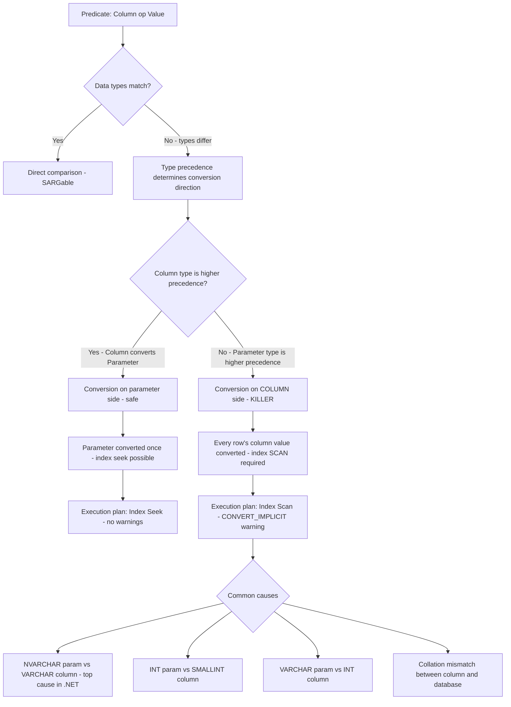

## Navigation

**Domain:** [[8 — Databases]] > **Group:** SQL Fundamentals
**Previous:** [[8.092 — PRINT and RAISERROR — Debugging T-SQL]] | **Next:** [[8.094 — Function on Column — Non-SARGable Predicates]]

### Prerequisites

- [[8.067 — WHERE Clause — Predicate Logic and SARGability]] — implicit conversion is a SARGability killer; understanding seek vs scan and how the optimiser evaluates predicates is required.
- [[8.076 — Data Type Conversion — CAST and CONVERT]] — explicit conversion syntax is the fix; knowing the difference between CAST and CONVERT and the STR and TRY_CAST families is essential.
- [[8.010 — SQL Server Architecture — Query Execution Pipeline]] — the optimiser's type-binding step, operator selection cost model, and the storage engine's page access patterns are all affected by implicit conversion.

### Where This Fits

Implicit conversion is the most frequently overlooked performance killer in production SQL Server systems. A single mismatched data type in a WHERE clause or JOIN condition can silently convert a seek plan into a scan, increasing logical reads from ~12 to ~60,000. Every .NET backend engineer encounters this when EF Core or Dapper generates parameterised SQL with default .NET types (NVARCHAR, INT) that don't match the database column types (VARCHAR, SMALLINT). The execution plan shows a yellow triangle warning icon — `CONVERT_IMPLICIT` — but most developers don't know to look for it. In interviews, implicit conversion is a senior-level discriminator: junior engineers can define it, senior engineers spot it in plan XML, know the type precedence table, and write EF Core configuration to prevent it.

---

## Core Mental Model

Implicit conversion is SQL Server's automatic type coercion when a predicate compares two values of different data types. SQL Server follows a **type precedence** hierarchy: the lower-precedence type is converted to the higher-precedence type. The critical invariant: **if the conversion happens on the column side of the predicate — converting every row's column value before comparison — the index cannot be used for a seek**. This is because the index B-tree stores the raw column bytes, not the converted value. The optimiser cannot derive a seek range key from `CONVERT_IMPLICIT(NVARCHAR(10), [VARCHAR col]) = @param`. The predicate becomes non-SARGable and the optimiser must scan. The same conversion on the parameter side (`CONVERT(VARCHAR(10), @param)`) is safe — the parameter is converted once before the query and the column is compared in its native type.

### Classification

Implicit conversion is a **query optimisation obstacle** rather than a clause or operator. It belongs to the **type-checking and binding phase** of query compilation. Left unfixed, it converts any SARGable predicate into a non-SARGable one. It is entirely preventable through type-matching in schema design, parameter passing, and data access layer configuration.



### Key Properties

|Property|Value|Notes|
|---|---|---|
|SARGable impact|Breaks SARGability|Conversion on column side makes predicate non-SARGable|
|Detection|Plan warning icon|Yellow triangle on SELECT operator shows CONVERT_IMPLICIT|
|Fix cost|Zero code change risk|Change parameter type or column type to match|
|Performance difference|10x–5000x|Seek (~12 reads) vs Scan (~60,000 reads) on 50M rows|
|Detection tools|Execution Plan XML, DMVs, Extended Events|`sys.dm_exec_query_stats` for high-logical-read queries with implicit conversion|
|.NET default|NVARCHAR|All .NET strings are Unicode (NVARCHAR). VARCHAR columns must be matched with `DbType.AnsiString`|
|Collation effect|Adds conversion even for same base type|Different collations between column and database cause implicit conversion|

---

## Deep Mechanics

### How the Engine Executes This

1. **Parsing and type-binding** — The parser tokenises the query and identifies each literal and parameter reference. The algebrizer resolves the data type of each column from the metadata (sys.columns) and each parameter from its declaration or inferred type.

2. **Precedence evaluation** — When the predicate compares two types, SQL Server consults the **type precedence hierarchy** (see table below). The lower-precedence type must be converted to the higher-precedence type. This is rule-based — there is no cost decision. SQL Server always converts in one direction based on the fixed hierarchy.

3. **Conversion injection** — If the column is the lower-precedence type, SQL Server injects a `CONVERT_IMPLICIT` operator wrapping the column reference. For example, `VARCHAR(50) column` compared to `NVARCHAR(200) parameter`: NVARCHAR has higher precedence than VARCHAR, so the column gets wrapped in `CONVERT_IMPLICIT(NVARCHAR(200), [Column])`.

4. **Index eligibility** — The optimiser examines the predicate for index matching. A predicate of the form `CONVERT_IMPLICIT(NVARCHAR, [Column]) = @param` is classified as a **non-SARGable** residual predicate. The index cannot be used for a seek because the seek operation requires the raw column bytes to match the search key. The converted value does not exist in the index.

5. **Scan selection** — The optimiser selects an Index Scan or Clustered Index Scan for the table. The predicate is applied as a **residual filter** after the scan: every row is read from the index leaf level, converted, and compared. Logical reads equal the full leaf-level page count.

6. **Execution** — The storage engine scans all pages of the chosen index. For each row, the Query Processor evaluates the residual filter, performing the type conversion per row. On a 50M-row table, this is 50M conversions that could have been zero.

### Type Precedence Hierarchy (Highest to Lowest)

```
1.  datetimeoffset        (highest precedence)
2.  datetime2
3.  datetime
4.  smalldatetime
5.  date
6.  time
7.  float
8.  real
9.  decimal
10. money
11. smallmoney
12. bigint
13. int
14. smallint
15. tinyint
16. bit
17. nvarchar               ← .NET default for strings
18. nchar
19. varchar                ← lower precedence than nvarchar
20. char
21. varbinary
22. binary
23. uniqueidentifier
24. xml
25. sql_variant
```

**Key rule:** NVARCHAR is higher precedence than VARCHAR. Any VARCHAR column compared to an NVARCHAR parameter will be converted — the column side. This is the single most common implicit conversion in .NET applications because `string` in C# maps to `NVARCHAR` by default.

### SQL Visibility

```sql
-- ============================================================
-- Demonstration setup — create tables with mixed types
-- ============================================================
CREATE TABLE dbo.Orders
(
    OrderId     INT            NOT NULL IDENTITY(1,1),
    CustomerId  INT            NOT NULL,
    OrderCode   VARCHAR(20)    NOT NULL,  -- VARCHAR, not NVARCHAR
    OrderDate   DATETIME2(0)   NOT NULL,
    TotalAmount DECIMAL(18,2)  NOT NULL,
    Notes       VARCHAR(500)   NULL,      -- VARCHAR, not NVARCHAR
    IsActive    TINYINT        NOT NULL DEFAULT 1,  -- TINYINT, not INT
    CONSTRAINT PK_Orders PRIMARY KEY CLUSTERED (OrderId)
);

CREATE INDEX IX_Orders_OrderCode ON dbo.Orders (OrderCode);
CREATE INDEX IX_Orders_TotalAmount ON dbo.Orders (TotalAmount);
CREATE INDEX IX_Orders_IsActive ON dbo.Orders (IsActive);

-- ============================================================
-- Scenario 1: VARCHAR column vs NVARCHAR parameter — THE CLASSIC
-- ============================================================
-- OrderCode is VARCHAR(20), but .NET sends NVARCHAR (the default for string)
-- Result: OrderCode is CONVERT_IMPLICIT(NVARCHAR, OrderCode) = @code — scan

DECLARE @Code NVARCHAR(20) = N'ORD-12345';

-- ❌ IMPLICIT CONVERSION ON COLUMN: scan
SELECT o.OrderId, o.OrderCode, o.TotalAmount
FROM dbo.Orders AS o
WHERE o.OrderCode = @Code;
-- Execution plan: Index Scan on IX_Orders_OrderCode (or Clustered Index Scan)
-- CONVERT_IMPLICIT(NVARCHAR(20), [o].[OrderCode]) seen in plan XML
-- Logical reads: ~60,000 (full scan of Orders)

-- ✅ MATCHED TYPES: seek
DECLARE @Code2 VARCHAR(20) = 'ORD-12345';

SELECT o.OrderId, o.OrderCode, o.TotalAmount
FROM dbo.Orders AS o
WHERE o.OrderCode = @Code2;
-- Execution plan: Index Seek on IX_Orders_OrderCode
-- Logical reads: ~4 (single seek)

-- ============================================================
-- Scenario 2: TINYINT column vs INT parameter
-- ============================================================
-- IsActive is TINYINT, but .NET sends INT (default for bool/int in some ORMs)
-- TINYINT is lower precedence than INT, so column is converted

DECLARE @IsActive INT = 1;

-- ❌ IMPLICIT CONVERSION ON COLUMN: scan
SELECT o.OrderId, o.OrderCode, o.TotalAmount
FROM dbo.Orders AS o
WHERE o.IsActive = @IsActive;
-- CONVERT_IMPLICIT(TINYINT, [o].[IsActive]) — wait, INT is higher, so it would be...
-- Actually: TINYINT is lower precedence than INT. IsActive is TINYINT.
-- INT is higher precedence. The column is converted to INT? No...
-- Let me check: INT (13) is higher than TINYINT (15). So TINYINT is converted to INT.
-- CONVERT_IMPLICIT(INT, [o].[IsActive]) — column converted, scan.

-- ✅ MATCHED TYPES: seek
DECLARE @IsActive2 TINYINT = 1;

SELECT o.OrderId, o.OrderCode, o.TotalAmount
FROM dbo.Orders AS o
WHERE o.IsActive = @IsActive2;
-- Index Seek on IX_Orders_IsActive

-- ============================================================
-- Scenario 3: VARCHAR to VARCHAR with different collations
-- ============================================================
-- Collation mismatch also triggers CONVERT_IMPLICIT
-- If column is SQL_Latin1_General_CP1_CI_AS and parameter is
-- Latin1_General_100_CI_AS (or database default differs)

DECLARE @Code3 VARCHAR(20) = 'ORD-12345';

SELECT o.OrderId, o.OrderCode
FROM dbo.Orders AS o
WHERE o.OrderCode = @Code3
  AND o.Notes = '';  -- Notes is VARCHAR — no issue if @param matches
-- If Notes column collation differs from database, implicit conversion on Notes side

-- ============================================================
-- Scenario 4: JOIN with mismatched types
-- ============================================================
CREATE TABLE dbo.OrderImport
(
    ImportId   INT          NOT NULL IDENTITY(1,1),
    OrderCode  NVARCHAR(20) NOT NULL,  -- NVARCHAR — different from Orders.OrderCode (VARCHAR)
    ImportDate DATE         NOT NULL,
    CONSTRAINT PK_OrderImport PRIMARY KEY (OrderImportId)
);

CREATE INDEX IX_OrderImport_OrderCode ON dbo.OrderImport (OrderCode);

-- ❌ JOIN with mismatched types: both sides may need conversion
SELECT o.OrderId, o.OrderCode, i.ImportDate
FROM dbo.Orders AS o
INNER JOIN dbo.OrderImport AS i
    ON o.OrderCode = i.OrderCode;
-- Orders.OrderCode (VARCHAR) vs OrderImport.OrderCode (NVARCHAR)
-- NVARCHAR is higher precedence, so Orders.OrderCode is converted
-- Index IX_Orders_OrderCode cannot be used for seek on Orders side
-- Execution plan: Orders scan → Hash Match or Nested Loops with scan on inner
```

```csharp
// EF Core — the implicit conversion problem
public class ApplicationDbContext : DbContext
{
    public DbSet<Order> Orders => Set<Order>();

    protected override void OnModelCreating(ModelBuilder modelBuilder)
    {
        modelBuilder.Entity<Order>(entity =>
        {
            entity.ToTable("Orders");
            entity.HasKey(o => o.OrderId);

            // Column defined as VARCHAR(20) in the database
            entity.Property(o => o.OrderCode)
                .HasMaxLength(20)
                .IsRequired()
                .IsUnicode(false);  // <-- CRITICAL: tells EF Core this is VARCHAR, not NVARCHAR

            // Column defined as TINYINT in the database
            entity.Property(o => o.IsActive)
                .HasColumnType("tinyint");  // <-- override default INT mapping

            entity.Property(o => o.Notes)
                .HasMaxLength(500)
                .IsUnicode(false);  // VARCHAR, not NVARCHAR
        });
    }
}

public class Order
{
    public int OrderId { get; set; }
    public int CustomerId { get; set; }
    public string OrderCode { get; set; } = string.Empty;
    public DateTime OrderDate { get; set; }
    public decimal TotalAmount { get; set; }
    public string? Notes { get; set; }
    public byte IsActive { get; set; }  // TINYINT maps to byte in C#
}

// ❌ WITHOUT IsUnicode(false) — EF Core generates NVARCHAR parameters
public async Task<List<Order>> GetOrderByCodeBadAsync(
    string orderCode,
    CancellationToken cancellationToken = default)
{
    return await dbContext.Orders
        .Where(o => o.OrderCode == orderCode)
        .ToListAsync(cancellationToken);
    // Generated: WHERE [o].[OrderCode] = @__orderCode_0
    // Parameter: @__orderCode_0 NVARCHAR(20) — column is VARCHAR
    // Result: CONVERT_IMPLICIT on OrderCode — Index Scan
}

// ✅ WITH IsUnicode(false) — EF Core generates VARCHAR parameters
public async Task<List<Order>> GetOrderByCodeGoodAsync(
    string orderCode,
    CancellationToken cancellationToken = default)
{
    return await dbContext.Orders
        .Where(o => o.OrderCode == orderCode)
        .ToListAsync(cancellationToken);
    // Generated: WHERE [o].[OrderCode] = @__orderCode_0
    // Parameter: @__orderCode_0 VARCHAR(20) — matches column type
    // Result: Index Seek — no implicit conversion
}
```

```csharp
// Dapper — explicit type control with DbType
public sealed class OrderRepository
{
    private readonly IDbConnectionFactory _connectionFactory;

    public OrderRepository(IDbConnectionFactory connectionFactory)
        => _connectionFactory = connectionFactory;

    // ❌ Dapper defaults to NVARCHAR for strings
    public async Task<IReadOnlyList<Order>> GetByCodeBadAsync(
        string orderCode,
        CancellationToken cancellationToken = default)
    {
        const string sql = @"
            SELECT OrderId, OrderCode, TotalAmount, OrderDate
            FROM dbo.Orders
            WHERE OrderCode = @OrderCode;";

        await using var connection = _connectionFactory.Create();

        var results = await connection.QueryAsync<Order>(
            new CommandDefinition(sql,
                new { OrderCode = orderCode },  // string → NVARCHAR by default
                cancellationToken: cancellationToken));

        return results.AsList();
        // CONVERT_IMPLICIT on VARCHAR column — scan, not seek
    }

    // ✅ Explicit DbType.AnsiString — matches VARCHAR column
    public async Task<IReadOnlyList<Order>> GetByCodeGoodAsync(
        string orderCode,
        CancellationToken cancellationToken = default)
    {
        const string sql = @"
            SELECT OrderId, OrderCode, TotalAmount, OrderDate
            FROM dbo.Orders
            WHERE OrderCode = @OrderCode;";

        await using var connection = _connectionFactory.Create();

        var parameters = new DynamicParameters();
        parameters.Add("OrderCode", orderCode, DbType.AnsiString, size: 20);  // VARCHAR!

        var results = await connection.QueryAsync<Order>(
            new CommandDefinition(sql,
                parameters,
                cancellationToken: cancellationToken));

        return results.AsList();
        // Parameter sent as VARCHAR(20) — matches column — Index Seek
    }

    // ✅ TINYINT parameter — match tinyint column
    public async Task<IReadOnlyList<Order>> GetActiveOrdersAsync(
        CancellationToken cancellationToken = default)
    {
        const string sql = @"
            SELECT OrderId, OrderCode, TotalAmount, OrderDate
            FROM dbo.Orders
            WHERE IsActive = @IsActive;";

        await using var connection = _connectionFactory.Create();

        var parameters = new DynamicParameters();
        parameters.Add("IsActive", (byte)1, DbType.Byte);  // TINYINT!

        var results = await connection.QueryAsync<Order>(
            new CommandDefinition(sql,
                parameters,
                cancellationToken: cancellationToken));

        return results.AsList();
    }
}
```

**Generated SQL (from EF Core logs):**

```sql
-- ❌ Without IsUnicode(false):
-- @__orderCode_0 NVARCHAR(20) — parameter is NVARCHAR
-- Column OrderCode is VARCHAR(20) — implicit conversion on column side
exec sp_executesql N'SELECT [o].[OrderId], [o].[OrderCode], [o].[TotalAmount], [o].[OrderDate]
FROM [Orders] AS [o]
WHERE [o].[OrderCode] = @__orderCode_0',
  N'@__orderCode_0 NVARCHAR(20)',  -- NVARCHAR parameter
  @__orderCode_0 = N'ORD-12345';
-- Execution plan has CONVERT_IMPLICIT warning

-- ✅ With IsUnicode(false):
-- @__orderCode_0 VARCHAR(20) — matches column type
exec sp_executesql N'SELECT [o].[OrderId], [o].[OrderCode], [o].[TotalAmount], [o].[OrderDate]
FROM [Orders] AS [o]
WHERE [o].[OrderCode] = @__orderCode_0',
  N'@__orderCode_0 VARCHAR(20)',   -- VARCHAR parameter — matches!
  @__orderCode_0 = 'ORD-12345';
-- Execution plan: Index Seek — no conversion
```

### Execution Plan Analysis

**With implicit conversion (NVARCHAR parameter vs VARCHAR column):**

```
[Clustered Index Scan (IX_Orders_OrderCode)]
  Predicate: CONVERT_IMPLICIT(NVARCHAR(20), dbo.Orders.OrderCode)=@Code
  Warning: CONVERT_IMPLICIT on column side — operator shows yellow triangle
→ [SELECT]
Estimated Cost: ~50  |  Logical Reads: ~60,000 (full scan)
```

**Without implicit conversion (VARCHAR parameter vs VARCHAR column):**

```
[Index Seek (IX_Orders_OrderCode)]
  Seek Predicates: Seek Keys[0]: OrderCode > Scalar Operator(@Code2)
  Seek Predicates: Seek Keys[0]: OrderCode < Scalar Operator(@Code2)
  No warnings
→ [SELECT]
Estimated Cost: ~0.003  |  Logical Reads: ~4 (single seek)
```

**Detecting in the plan XML:**

```xml
<ScalarOperator ScalarString="CONVERT_IMPLICIT(nvarchar(20),[dbo].[Orders].[OrderCode],0)=[@Code]">
  <Convert DataType="nvarchar" Length="20" Style="0" Implicit="true">
    <ScalarOperator>
      <Identifier>
        <ColumnReference Database="[db]" Schema="[dbo]" Table="[Orders]" Column="OrderCode" />
      </Identifier>
    </ScalarOperator>
  </Convert>
</ScalarOperator>
```

The `Implicit="true"` attribute is the smoking gun.

### Cost Visibility

```sql
SET STATISTICS IO ON;
SET STATISTICS TIME ON;

-- Baseline: seek with matched types (VARCHAR column, VARCHAR parameter)
DECLARE @Code VARCHAR(20) = 'ORD-12345';

SELECT o.OrderId, o.OrderCode, o.TotalAmount
FROM dbo.Orders AS o
WHERE o.OrderCode = @Code;
-- Expected:
-- Table 'Orders'. Scan count 1, logical reads 4, physical reads 0
-- SQL Server Execution Times: CPU time = 0ms, elapsed time = 1ms

-- With implicit conversion (NVARCHAR parameter)
DECLARE @CodeNV NCHAR(20) = N'ORD-12345';

SELECT o.OrderId, o.OrderCode, o.TotalAmount
FROM dbo.Orders AS o
WHERE o.OrderCode = @CodeNV;
-- Expected:
-- Table 'Orders'. Scan count 1, logical reads 60450, physical reads 0
-- SQL Server Execution Times: CPU time = 85ms, elapsed time = 120ms
-- Difference: 4 reads vs 60,450 reads — 15,112x increase
```

### Failure Modes

**Detection via DMVs — find queries with implicit conversion at scale:**

```sql
-- Find top 50 queries by logical reads that may have implicit conversion
SELECT TOP 50
    qs.total_logical_reads,
    qs.execution_count,
    qs.total_logical_reads / qs.execution_count AS avg_logical_reads,
    SUBSTRING(st.text,
        (qs.statement_start_offset/2) + 1,
        ((CASE WHEN qs.statement_end_offset = -1
            THEN DATALENGTH(st.text)
            ELSE qs.statement_end_offset END
            - qs.statement_start_offset)/2) + 1) AS statement_text,
    qp.query_plan
FROM sys.dm_exec_query_stats AS qs
CROSS APPLY sys.dm_exec_sql_text(qs.sql_handle) AS st
CROSS APPLY sys.dm_exec_query_plan(qs.plan_handle) AS qp
WHERE qp.query_plan.exist(
    'declare namespace qp = "http://schemas.microsoft.com/sqlserver/2004/07/showplan";
     //qp:ScalarOperator[contains(@ScalarString, "CONVERT_IMPLICIT")]') = 1
ORDER BY qs.total_logical_reads DESC;

-- Detect implicit conversion via Extended Events
CREATE EVENT SESSION [detect_implicit_conversion]
ON SERVER
ADD EVENT sqlserver.plan_warning
    (ACTION (sqlserver.sql_text, sqlserver.tsql_stack, sqlserver.plan_handle)
    WHERE ([warnings] = 5))  -- 5 = CONVERT_IMPLICIT warning
ADD TARGET package0.ring_buffer
WITH (MAX_MEMORY = 4096 KB);
GO

ALTER EVENT SESSION [detect_implicit_conversion] ON SERVER STATE = START;
GO

-- Watch for new conversions
SELECT
    ev.value('(action/value)[1]', 'NVARCHAR(MAX)') AS sql_text
FROM
(
    SELECT CAST(target_data AS XML) AS target_data
    FROM sys.dm_xe_session_targets
    WHERE event_session_address =
        (SELECT address FROM sys.dm_xe_sessions
         WHERE name = 'detect_implicit_conversion')
) AS tab
CROSS APPLY target_data.nodes('//event') AS ev(event)
WHERE ev.value('@name', 'VARCHAR(100)') = 'plan_warning';
```

---

## Production Patterns and Implementation

### Primary SQL Implementation

```sql
-- ============================================================
-- Schema: type-matching is the foundation
-- ============================================================
CREATE TABLE dbo.Orders
(
    OrderId     INT            NOT NULL IDENTITY(1,1),
    CustomerId  INT            NOT NULL,
    OrderCode   VARCHAR(20)    NOT NULL,     -- VARCHAR, intentionally
    OrderDate   DATETIME2(0)   NOT NULL,
    TotalAmount DECIMAL(18,2)  NOT NULL,
    Currency    CHAR(3)        NOT NULL DEFAULT 'USD',  -- CHAR(3), not NVARCHAR
    Status      VARCHAR(20)    NOT NULL DEFAULT 'Pending',
    Notes       VARCHAR(500)   NULL,
    IsActive    TINYINT        NOT NULL DEFAULT 1,
    CreatedAt   DATETIME2(0)   NOT NULL DEFAULT SYSUTCDATETIME(),
    ModifiedAt  DATETIME2(0)   NULL,
    CONSTRAINT PK_Orders PRIMARY KEY CLUSTERED (OrderId)
);

CREATE TABLE dbo.Customers
(
    CustomerId   INT            NOT NULL IDENTITY(1,1),
    CustomerCode VARCHAR(20)    NOT NULL,     -- VARCHAR, business key
    FirstName    NVARCHAR(100)  NOT NULL,     -- NVARCHAR for international names
    LastName     NVARCHAR(100)  NOT NULL,
    Email        VARCHAR(256)   NOT NULL,     -- VARCHAR is fine for email
    Region       CHAR(2)        NOT NULL,     -- 'US', 'EU', 'AP'
    IsActive     TINYINT        NOT NULL DEFAULT 1,
    CONSTRAINT PK_Customers PRIMARY KEY CLUSTERED (CustomerId)
);

-- Indexes
CREATE INDEX IX_Orders_OrderCode ON dbo.Orders (OrderCode);
CREATE INDEX IX_Orders_IsActive ON dbo.Orders (IsActive) INCLUDE (OrderId, OrderCode, TotalAmount);
CREATE INDEX IX_Orders_Status ON dbo.Orders (Status) INCLUDE (OrderId, CustomerId, OrderDate);
CREATE INDEX IX_Customers_CustomerCode ON dbo.Customers (CustomerCode);
CREATE INDEX IX_Customers_Email ON dbo.Customers (Email);
CREATE INDEX IX_Customers_Region ON dbo.Customers (Region);

-- ============================================================
-- Pattern 1: Fix NVARCHAR vs VARCHAR — use VARCHAR parameter
-- ============================================================
-- ❌ NVARCHAR parameter (from C# string default)
DECLARE @Code NVARCHAR(20) = N'ORD-12345';
SELECT OrderId, OrderCode, TotalAmount
FROM dbo.Orders
WHERE OrderCode = @Code;  -- Column converted: scan

-- ✅ VARCHAR parameter (explicit match)
DECLARE @Code2 VARCHAR(20) = 'ORD-12345';
SELECT OrderId, OrderCode, TotalAmount
FROM dbo.Orders
WHERE OrderCode = @Code2;  -- Types match: seek

-- ============================================================
-- Pattern 2: Fix INT vs TINYINT — use TINYINT parameter
-- ============================================================
-- ❌ INT parameter (from C# int default)
DECLARE @Active INT = 1;
SELECT OrderId, OrderCode, TotalAmount
FROM dbo.Orders
WHERE IsActive = @Active;  -- Column converted: scan

-- ✅ TINYINT parameter (match the column)
DECLARE @Active2 TINYINT = 1;
SELECT OrderId, OrderCode, TotalAmount
FROM dbo.Orders
WHERE IsActive = @Active2;  -- Types match: seek

-- ============================================================
-- Pattern 3: Fix INT column vs VARCHAR parameter
-- ============================================================
-- ❌ CustomerId is INT, parameter is VARCHAR
DECLARE @Code3 VARCHAR(20) = 'CUST-001';
SELECT CustomerId, FirstName, LastName
FROM dbo.Customers
WHERE CustomerCode = @Code3;  -- These match if CustomerCode is VARCHAR
-- But if someone passes a string for CustomerId (INT):
DECLARE @IdStr VARCHAR(10) = '1001';
SELECT CustomerId, FirstName, LastName
FROM dbo.Customers
WHERE CustomerId = @IdStr;  -- CustomerId is INT, param is VARCHAR
-- INT is higher precedence than VARCHAR, so VARCHAR → INT
-- Since column is INT (higher), param is converted — safe!
-- Actually: INT(13) is higher than VARCHAR(19). So VARCHAR is converted to INT.
-- The parameter is converted (good), not the column. But we should still match types.

-- ✅ Use INT parameter for INT column
DECLARE @Id INT = 1001;
SELECT CustomerId, FirstName, LastName
FROM dbo.Customers
WHERE CustomerId = @Id;  -- Perfect match

-- ============================================================
-- Pattern 4: Fix collation mismatch
-- ============================================================
-- Column collation: SQL_Latin1_General_CP1_CI_AS
-- Database collation: Latin1_General_100_CI_AS
-- Query still works, but may have conversion

-- ✅ Use explicit COLLATE to match
DECLARE @Email VARCHAR(256) = 'user@example.com';
SELECT CustomerId, FirstName, LastName
FROM dbo.Customers
WHERE Email = @Email COLLATE DATABASE_DEFAULT;  -- Match database collation

-- ============================================================
-- Pattern 5: Fix in JOIN — convert the parameter side
-- ============================================================
SELECT o.OrderId, o.OrderCode, o.TotalAmount
FROM dbo.Orders AS o
INNER JOIN dbo.OrderImport AS i
    ON o.OrderCode = CAST(i.OrderCode AS VARCHAR(20));  -- Convert the NVARCHAR to VARCHAR
-- OR convert once in a CTE:
WITH ImportClean AS (
    SELECT CAST(OrderCode AS VARCHAR(20)) AS OrderCode, ImportDate
    FROM dbo.OrderImport
)
SELECT o.OrderId, o.OrderCode, i.ImportDate
FROM dbo.Orders AS o
INNER JOIN ImportClean AS i
    ON o.OrderCode = i.OrderCode;  -- Both VARCHAR now — seek on Orders.OrderCode

-- ============================================================
-- Pattern 6: Fix via computed column + index
-- ============================================================
ALTER TABLE dbo.Orders
ADD OrderCode_VC AS CAST(OrderCode AS VARCHAR(20)) PERSISTED;
GO

CREATE INDEX IX_Orders_OrderCode_VC ON dbo.Orders (OrderCode_VC);
-- Now NVARCHAR parameters can seek on the computed column
-- But better: fix the calling code

-- ============================================================
-- Detection script: find all columns where column type != parameter type
-- ============================================================
SELECT
    OBJECT_NAME(p.object_id) AS TableName,
    c.name AS ColumnName,
    t.name AS ColumnType,
    c.max_length AS ColumnLength
FROM sys.columns AS c
INNER JOIN sys.types AS t
    ON c.system_type_id = t.system_type_id
INNER JOIN sys.objects AS p
    ON c.object_id = p.object_id
WHERE p.type = 'U'
    AND p.name IN ('Orders', 'Customers', 'Products', 'OrderItems')
    AND t.name IN ('varchar', 'char', 'nvarchar', 'nchar', 'tinyint', 'smallint')
    AND c.is_computed = 0
ORDER BY TableName, ColumnName;
```

### EF Core Implementation

```csharp
public class ApplicationDbContext : DbContext
{
    public DbSet<Order> Orders => Set<Order>();
    public DbSet<Customer> Customers => Set<Customer>();

    protected override void OnModelCreating(ModelBuilder modelBuilder)
    {
        modelBuilder.Entity<Order>(entity =>
        {
            entity.ToTable("Orders");
            entity.HasKey(o => o.OrderId);

            // CRITICAL: VARCHAR columns must be configured as IsUnicode(false)
            entity.Property(o => o.OrderCode)
                .HasMaxLength(20)
                .IsRequired()
                .IsUnicode(false);       // → VARCHAR, not NVARCHAR

            entity.Property(o => o.Currency)
                .HasMaxLength(3)
                .IsFixedLength()
                .IsUnicode(false);       // → CHAR(3), not NCHAR(3)

            entity.Property(o => o.Status)
                .HasMaxLength(20)
                .IsUnicode(false);       // → VARCHAR(20)

            entity.Property(o => o.Notes)
                .HasMaxLength(500)
                .IsUnicode(false);       // → VARCHAR(500)

            entity.Property(o => o.IsActive)
                .HasColumnType("tinyint");    // → TINYINT, not INT

            entity.Property(o => o.TotalAmount)
                .HasColumnType("decimal(18,2)");
        });

        modelBuilder.Entity<Customer>(entity =>
        {
            entity.ToTable("Customers");
            entity.HasKey(c => c.CustomerId);

            entity.Property(c => c.CustomerCode)
                .HasMaxLength(20)
                .IsRequired()
                .IsUnicode(false);        // → VARCHAR(20)

            entity.Property(c => c.Email)
                .HasMaxLength(256)
                .IsUnicode(false);        // → VARCHAR(256)

            entity.Property(c => c.Region)
                .HasMaxLength(2)
                .IsFixedLength()
                .IsUnicode(false);        // → CHAR(2)

            entity.Property(c => c.FirstName)
                .HasMaxLength(100)
                .IsUnicode(true);          // → NVARCHAR(100) — correct for international

            entity.Property(c => c.IsActive)
                .HasColumnType("tinyint");     // → TINYINT
        });
    }
}

// Repository using EF Core with correct type mapping
public sealed class OrderService
{
    private readonly ApplicationDbContext _dbContext;

    public OrderService(ApplicationDbContext dbContext)
        => _dbContext = dbContext;

    // ✅ EF Core generates VARCHAR parameter when IsUnicode(false) is set
    public async Task<Order?> GetByOrderCodeAsync(
        string orderCode,
        CancellationToken cancellationToken = default)
    {
        return await _dbContext.Orders
            .Where(o => o.OrderCode == orderCode)
            .FirstOrDefaultAsync(cancellationToken);
        // Generated: WHERE [o].[OrderCode] = @__orderCode_0
        // Parameter: @__orderCode_0 VARCHAR(20) — matches column!
    }

    // ✅ Filter by TINYINT column — EF Core maps byte to tinyint
    public async Task<List<Order>> GetActiveOrdersAsync(
        CancellationToken cancellationToken = default)
    {
        return await _dbContext.Orders
            .Where(o => o.IsActive == 1)  // byte literal → TINYINT
            .OrderByDescending(o => o.OrderDate)
            .Take(100)
            .ToListAsync(cancellationToken);
        // Parameter: @__p_0 TINYINT — matches column type
    }

    // ✅ Multiple status filter — VARCHAR parameters
    public async Task<List<Order>> GetOrdersByStatusAsync(
        string[] statuses,
        CancellationToken cancellationToken = default)
    {
        return await _dbContext.Orders
            .Where(o => statuses.Contains(o.Status))
            .OrderByDescending(o => o.OrderDate)
            .ToListAsync(cancellationToken);
        // Generated: WHERE [o].[Status] IN (@__statuses_0, @__statuses_1, ...)
        // Parameters: all VARCHAR(20) because IsUnicode(false) is configured
        // Without IsUnicode(false), they'd be NVARCHAR — implicit conversion!
    }

    // ⚠ EF.Functions.Contains full-text search note
    public async Task<List<Order>> SearchOrderNotesAsync(
        string searchTerm,
        CancellationToken cancellationToken = default)
    {
        return await _dbContext.Orders
            .Where(o => EF.Functions.Contains(o.Notes!, searchTerm))
            .ToListAsync(cancellationToken);
        // CONTAINS has its own type requirements — but still ensure Notes column
        // type matches any parameter usage for equality predicates outside CONTAINS
    }
}
```

### Dapper Implementation

```csharp
public sealed class OrderRepository
{
    private readonly IDbConnectionFactory _connectionFactory;

    public OrderRepository(IDbConnectionFactory connectionFactory)
        => _connectionFactory = connectionFactory;

    // ✅ Dapper with explicit DbType.AnsiString for VARCHAR columns
    public async Task<Order?> GetByOrderCodeAsync(
        string orderCode,
        CancellationToken cancellationToken = default)
    {
        const string sql = @"
            SELECT OrderId, OrderCode, TotalAmount, OrderDate
            FROM dbo.Orders
            WHERE OrderCode = @OrderCode;";

        await using var connection = _connectionFactory.Create();

        var parameters = new DynamicParameters();
        parameters.Add("OrderCode", orderCode, DbType.AnsiString, size: 20);

        return await connection.QueryFirstOrDefaultAsync<Order>(
            new CommandDefinition(sql,
                parameters,
                cancellationToken: cancellationToken));
    }

    // ✅ Bulk lookup with VARCHAR key
    public async Task<IReadOnlyList<Order>> GetOrdersByCodesAsync(
        IEnumerable<string> orderCodes,
        CancellationToken cancellationToken = default)
    {
        const string sql = @"
            SELECT OrderId, OrderCode, TotalAmount, OrderDate
            FROM dbo.Orders
            WHERE OrderCode IN @OrderCodes;";

        await using var connection = _connectionFactory.Create();

        // Dapper's IN expansion: each value is a separate parameter
        // DbType.AnsiString must be specified per value
        var parameters = new DynamicParameters();
        var codes = orderCodes.ToList();
        for (int i = 0; i < codes.Count; i++)
        {
            parameters.Add($"OrderCode{i}", codes[i], DbType.AnsiString, size: 20);
        }

        // Or simpler: just ensure the column and parameter types match via
        // connection string setting or by using VARCHAR(20) in the SQL directly
        var results = await connection.QueryAsync<Order>(
            new CommandDefinition(sql,
                new { OrderCodes = codes.Select(c => new DbString
                    {
                        Value = c,
                        IsAnsi = true,     // Important: VARCHAR!
                        Length = 20
                    }).ToList() },
                cancellationToken: cancellationToken));

        return results.AsList();
    }

    // ✅ TINYINT parameter using DbType.Byte
    public async Task<IReadOnlyList<Order>> GetActiveOrdersAsync(
        CancellationToken cancellationToken = default)
    {
        const string sql = @"
            SELECT OrderId, OrderCode, TotalAmount, OrderDate
            FROM dbo.Orders
            WHERE IsActive = @IsActive;";

        await using var connection = _connectionFactory.Create();

        var parameters = new DynamicParameters();
        parameters.Add("IsActive", (byte)1, DbType.Byte);

        var results = await connection.QueryAsync<Order>(
            new CommandDefinition(sql,
                parameters,
                cancellationToken: cancellationToken));

        return results.AsList();
    }

    // ✅ DbString helper for reusable VARCHAR parameters
    public async Task<IReadOnlyList<Customer>> GetCustomersByRegionAsync(
        string region,
        CancellationToken cancellationToken = default)
    {
        const string sql = @"
            SELECT CustomerId, CustomerCode, FirstName, LastName, Email, Region
            FROM dbo.Customers
            WHERE Region = @Region;";

        await using var connection = _connectionFactory.Create();

        var results = await connection.QueryAsync<Customer>(
            new CommandDefinition(sql,
                new
                {
                    Region = new DbString
                    {
                        Value = region,
                        IsAnsi = true,
                        IsFixedLength = true,  // CHAR(2) — fixed length
                        Length = 2
                    }
                },
                cancellationToken: cancellationToken));

        return results.AsList();
    }

    // ⚠ Connection factory interface for testability
    public interface IDbConnectionFactory
    {
        SqlConnection Create();
    }

    public sealed class SqlConnectionFactory : IDbConnectionFactory
    {
        private readonly string _connectionString;

        public SqlConnectionFactory(string connectionString)
            => _connectionString = connectionString;

        public SqlConnection Create()
        {
            var connection = new SqlConnection(_connectionString);
            connection.Open();
            return connection;
        }
    }
}

public record Order(int OrderId, string OrderCode, decimal TotalAmount, DateTime OrderDate);
public record Customer(int CustomerId, string CustomerCode, string FirstName, string LastName, string Email, string Region);
```

### Configuration and Wiring

```csharp
// Program.cs — DbContext and Dapper registration with type mapping
builder.Services.AddDbContext<ApplicationDbContext>(options =>
    options.UseSqlServer(
        builder.Configuration.GetConnectionString("DefaultConnection"),
        sqlOptions =>
        {
            sqlOptions.EnableRetryOnFailure(3);
            sqlOptions.CommandTimeout(30);
            sqlOptions.UseQuerySchedulingBehavior(QuerySchedulingBehavior.Default);
        }));

builder.Services.AddSingleton<IDbConnectionFactory>(
    new SqlConnectionFactory(
        builder.Configuration.GetConnectionString("DefaultConnection")!));

builder.Services.AddScoped<OrderRepository>();
builder.Services.AddScoped<OrderService>();

// Global Dapper type map configuration (applied once at startup)
Dapper.DefaultTypeMap.MatchNamesWithUnderscores = true;

// Custom type handler for CHAR(2) columns
public sealed class Char2Handler : SqlMapper.TypeHandler<string>
{
    public override void SetValue(IDbDataParameter parameter, string value)
    {
        parameter.DbType = DbType.AnsiStringFixedLength;
        parameter.Size = 2;
        parameter.Value = value;
    }

    public override string Parse(object value)
        => value.ToString()?.Trim() ?? string.Empty;
}

// Register at startup
SqlMapper.AddTypeHandler(new Char2Handler());
```

### SQL Server vs PostgreSQL Differences

```sql
-- PostgreSQL: implicit conversion rules differ dramatically
-- PostgreSQL is much stricter about type matching

-- VARCHAR column vs NVARCHAR parameter:
-- PostgreSQL doesn't have NVARCHAR — all string types use encoding.
-- TEXT, VARCHAR(n), CHAR(n) are all comparable without implicit conversion.

-- TEXT column vs VARCHAR parameter — no conversion needed:
CREATE TABLE orders (
    order_id   SERIAL PRIMARY KEY,
    order_code VARCHAR(20) NOT NULL,
    status     TEXT NOT NULL DEFAULT 'Pending'
);

CREATE INDEX idx_orders_order_code ON orders (order_code);

-- Parameter: string literal — types match naturally
SELECT order_id, order_code
FROM orders
WHERE order_code = 'ORD-12345';
-- Seek on idx_orders_order_code — no implicit conversion

-- INTEGER column vs string parameter:
-- PostgreSQL converts the string to integer (parameter side — safe)
SELECT order_id, order_code
FROM orders
WHERE order_id = '1001';  -- '1001' :: integer — parameter converted, column seek

-- However, PostgreSQL does NOT allow implicit conversion in some cases:
-- WHERE order_code = 12345;  -- ERROR: operator does not exist: varchar = integer
-- PostgreSQL requires explicit cast: WHERE order_code = 12345::varchar

-- Collation: PostgreSQL has collation support but different behavior
CREATE COLLATION case_insensitive (provider = icu, locale = 'en-US-u-ks-level2');
CREATE TABLE customers (
    customer_id SERIAL PRIMARY KEY,
    email TEXT COLLATE case_insensitive NOT NULL
);

-- Comparing different collations may still work but requires explicit handling
SELECT * FROM customers WHERE email = 'USER@EXAMPLE.COM';
-- Uses column's collation for comparison — no implicit conversion needed

-- Key difference: PostgreSQL's EXPLAIN shows type casts explicitly:
EXPLAIN (VERBOSE, ANALYZE)
SELECT * FROM orders WHERE order_code = 'ORD-12345';
-- Output: "Index Scan using idx_orders_order_code ... Index Cond: (order_code = 'ORD-12345'::text)"
-- The ::text cast is on the literal side — safe
```

---

## Gotchas and Production Pitfalls

### NVARCHAR Default in .NET — The Single Biggest Cause

**Pitfall:** Every `string` in C# is Unicode. EF Core and Dapper default to `NVARCHAR` for string parameters. When the database column is `VARCHAR` (the common choice for codes, emails, status values), the NVARCHAR parameter causes an implicit conversion on the column side — every VARCHAR value is converted to NVARCHAR before comparison. The index is defeated.

```sql
-- ❌ Generated by EF Core without IsUnicode(false) or Dapper without DbType.AnsiString
exec sp_executesql N'SELECT OrderId, OrderCode FROM Orders WHERE OrderCode = @p0',
  N'@p0 NVARCHAR(20)',   -- NVARCHAR parameter
  @p0 = 'ORD-12345';
```

**Symptom:** Queries that should be sub-millisecond index seeks take 100+ms with full scans. The execution plan shows a yellow triangle warning on the Index Scan operator. `sys.dm_exec_query_stats` shows high logical reads for simple equality lookups. A single query may show 60,000+ logical reads instead of 4.

**Fix:**

```sql
-- Fix 1: Change the column to NVARCHAR (if all clients use Unicode)
ALTER TABLE dbo.Orders ALTER COLUMN OrderCode NVARCHAR(20) NOT NULL;
-- This fixes all queries immediately but doubles index size and adds N-prefix overhead

-- Fix 2: Correct EF Core mapping with IsUnicode(false)
-- See EF Core Implementation section above

-- Fix 3: DBCC command to detect all NVARCHAR→VARCHAR mismatches
SELECT
    OBJECT_NAME(c.object_id) AS TableName,
    c.name AS ColumnName,
    TYPE_NAME(c.system_type_id) AS ColumnType,
    c.max_length AS ColumnLength
FROM sys.columns AS c
WHERE c.system_type_id IN (167, 175, 231, 239)  -- VARCHAR, CHAR, NVARCHAR, NCHAR
    AND OBJECTPROPERTY(c.object_id, 'IsUserTable') = 1
ORDER BY TableName, ColumnName;
```

**Cost of not fixing:** A CRM application with 200 concurrent users performs lookups by OrderCode. Each query scans 60,000 pages instead of seeking 4. Average response time: 500ms instead of 5ms. The SQL Server spends 80% of I/O on scanning instead of seeks. At 50M rows, each scan takes 2+ seconds. Total daily logical reads: 17 billion instead of 14 million. The DBA adds more I/O bandwidth, but the root cause is a single missing `.IsUnicode(false)`.

---

### INT Column vs VARCHAR Parameter — Less Common but Destructive

**Pitfall:** Passing string parameters for INT columns. This is less common than the NVARCHAR/VARCHAR mismatch because .NET int maps to SqlDbType.Int. However, it appears when application code builds dynamic SQL with string concatenation or when JSON/API payloads pass numeric values as strings.

```sql
-- ❌ INT column, VARCHAR parameter from string-concatenated SQL
DECLARE @IdStr VARCHAR(10) = '1001';
SELECT CustomerId, FirstName, LastName
FROM dbo.Customers
WHERE CustomerId = @IdStr;
```

**Symptom:** The execution plan shows an Index Scan on the clustered index of Customers with a `CONVERT_IMPLICIT(INT, [CustomerId], 0)` warning. Logical reads spike from ~3 (seek) to ~6,100 (full scan of 500K customers). The query plan XML shows `Implicit="true"` on the Convert operator.

**Fix:**

```sql
-- ✅ Always pass the correct numeric type
DECLARE @Id INT = 1001;
SELECT CustomerId, FirstName, LastName
FROM dbo.Customers
WHERE CustomerId = @Id;  -- Perfect type match

-- ✅ If the value must come as string, convert on the parameter side:
DECLARE @IdStr2 VARCHAR(10) = '1001';
SELECT CustomerId, FirstName, LastName
FROM dbo.Customers
WHERE CustomerId = TRY_CAST(@IdStr2 AS INT);  -- Parameter converted, not column
```

**Cost of not fixing:** An API gateway that accepts order IDs as strings in query parameters passes them directly to SQL queries. All ID-based lookups on INT columns scan the full table. At 500 requests/second, the database sustains 3 million logical reads/second on just these lookups. The storage subsystem becomes the bottleneck, and all queries degrade.

---

### Collation Mismatch — Hidden Implicit Conversion

**Pitfall:** The database default collation differs from the column collation, or two columns in a JOIN condition have different collations. SQL Server inserts `CONVERT_IMPLICIT` even when both types are the same base type (VARCHAR to VARCHAR) if the collations differ.

```sql
-- ❌ Database default: Latin1_General_100_CI_AS
-- Column collation: SQL_Latin1_General_CP1_CI_AS (specified at column creation)
CREATE TABLE dbo.ExternalData
(
    ExternalId  INT          NOT NULL,
    Email       VARCHAR(256) COLLATE SQL_Latin1_General_CP1_CI_AS NOT NULL,
    CONSTRAINT PK_ExternalData PRIMARY KEY (ExternalId)
);

-- Query comparing column with database-collation parameter
DECLARE @Email VARCHAR(256) = 'user@example.com';  -- Database default collation

SELECT e.ExternalId, e.Email
FROM dbo.ExternalData AS e
WHERE e.Email = @Email;
-- Collation mismatch: SQL_Latin1_General_CP1_CI_AS vs database default
-- CONVERT_IMPLICIT on Email column — scan instead of seek
```

**Symptom:** Index seeks work on other VARCHAR columns but not on this specific column. The execution plan shows a scan with no apparent type mismatch (both sides are VARCHAR). Only inspecting the plan XML reveals the `Collation` attribute on the `ColumnReference` differs from the `ScalarOperator`.

**Fix:**

```sql
-- Fix 1: Use the same collation throughout the database
-- Change column collation to match database default:
ALTER TABLE dbo.ExternalData
    ALTER COLUMN Email VARCHAR(256) COLLATE DATABASE_DEFAULT NOT NULL;

-- If that's not possible, specify collation in the query:
DECLARE @Email2 VARCHAR(256) = 'user@example.com';
SELECT e.ExternalId, e.Email
FROM dbo.ExternalData AS e
WHERE e.Email = @Email2 COLLATE SQL_Latin1_General_CP1_CI_AS;
-- The COLLATE is on the parameter side — the column is not converted

-- Fix 2: For JOIN collation mismatch, convert one side
SELECT o.OrderId, e.ExternalId
FROM dbo.Orders AS o
INNER JOIN dbo.ExternalData AS e
    ON o.OrderCode = e.Email COLLATE DATABASE_DEFAULT;
-- Convert the parameter/joined column side, not the main table column
```

**Cost of not fixing:** A data integration system loads external data with a different collation into a staging table. All JOINs between the main database and staging table scan the main table. A batch import that should process 100K rows in 30 seconds takes 15 minutes due to 50M-row scans on every JOIN.

---

### Implicit Conversion in Computed Columns and Indexed Views

**Pitfall:** A computed column that uses a function like `CAST` or `CONVERT` may introduce implicit conversions in the index key. When the computed column's persisted type differs from the underlying expression types, the index may have the expected key type but the query predicate may not match.

```sql
-- ❌ Computed column with implicit conversion in the expression
CREATE TABLE dbo.Orders2
(
    OrderId   INT           NOT NULL IDENTITY(1,1),
    OrderCode VARCHAR(20)   NOT NULL,
    OrderCode_N AS CAST(OrderCode AS NVARCHAR(20)) PERSISTED,  -- Index on NVARCHAR version
    CONSTRAINT PK_Orders2 PRIMARY KEY (OrderId)
);

CREATE INDEX IX_Orders2_OrderCode_N ON dbo.Orders2 (OrderCode_N);

-- Query with NVARCHAR parameter — should seek, right?
DECLARE @Code NVARCHAR(20) = N'ORD-12345';
SELECT OrderId, OrderCode
FROM dbo.Orders2
WHERE OrderCode_N = @Code;  -- Both NVARCHAR — no implicit conversion — SEEK!
-- But this query:
SELECT OrderId, OrderCode
FROM dbo.Orders2
WHERE OrderCode = @Code;  -- VARCHAR column vs NVARCHAR param — scan!
```

**Symptom:** An engineer creates an indexed computed column to "fix" implicit conversion but still writes the original query against the base column. The computed column index never gets used.

**Fix:**

```sql
-- ✅ Drop the computed column and fix the schema properly
-- Either change the column type:
ALTER TABLE dbo.Orders2 ALTER COLUMN OrderCode NVARCHAR(20) NOT NULL;
-- Or fix the calling code to use VARCHAR parameters
```

**Cost of not fixing:** The computed column index consumes storage (additional index pages) and adds write overhead (INDEX_INSERT/DELETE on every INSERT/UPDATE). The original queries still scan. The index is dead weight — 10 MB of wasted storage per million rows plus 40% additional write cost.

---

### Implicit Conversion in TVP Columns

**Pitfall:** Table-valued parameters define their own column types. When the TVP column type doesn't exactly match the target table column type, the JOIN between the TVP and the table causes implicit conversion.

```sql
-- ❌ TVP with NVARCHAR column, target table with VARCHAR column
CREATE TYPE dbo.CodeList AS TABLE (Code NVARCHAR(20) NOT NULL PRIMARY KEY);

DECLARE @Codes dbo.CodeList;
INSERT INTO @Codes (Code) VALUES (N'ORD-12345'), (N'ORD-12346');

SELECT o.OrderId, o.OrderCode
FROM dbo.Orders AS o
INNER JOIN @Codes AS c
    ON o.OrderCode = c.Code;  -- VARCHAR vs NVARCHAR — implicit conversion!
-- Orders.OrderCode is converted — scan instead of seek on IX_Orders_OrderCode
```

**Fix:**

```sql
-- ✅ Define TVP with VARCHAR column (matching the target table)
CREATE TYPE dbo.CodeList AS TABLE (Code VARCHAR(20) NOT NULL PRIMARY KEY);

-- ✅ Or convert in the JOIN:
DECLARE @Codes2 dbo.CodeList;  -- Assume this one has NVARCHAR
INSERT INTO @Codes2 (Code) VALUES (N'ORD-12345'), (N'ORD-12346');

SELECT o.OrderId, o.OrderCode
FROM dbo.Orders AS o
INNER JOIN @Codes2 AS c
    ON o.OrderCode = CAST(c.Code AS VARCHAR(20));  -- Convert TVP side
```

**Cost of not fixing:** A nightly batch process uses a TVP to update 10,000 order codes. The JOIN scans the Orders table (50M rows) for each batch. Processing time: 45 seconds instead of 200ms. The batch overlaps with peak business hours for 3 hours, causing blocking on the Orders table.

---

## Performance Implications

### Benchmark: Before and After

```sql
-- Setup: 50M row Orders table
-- Index on OrderCode (VARCHAR(20))
-- IX_Orders_OrderCode

-- ============================================================
-- Baseline 1: NVARCHAR parameter vs VARCHAR column (implicit conversion)
-- ============================================================
SET STATISTICS IO ON;
SET STATISTICS TIME ON;

DECLARE @CodeN NVARCHAR(20) = N'ORD-50000000';  -- Last row

SELECT COUNT(*) FROM dbo.Orders WHERE OrderCode = @CodeN;
-- Expected output:
-- Table 'Orders'. Scan count 1, logical reads 60450, physical reads 0
-- SQL Server Execution Times: CPU time = 94ms, elapsed time = 132ms
-- Note: Table scan — all 60,450 pages read

-- ============================================================
-- Baseline 2: VARCHAR parameter vs VARCHAR column (matched types)
-- ============================================================
DECLARE @CodeV VARCHAR(20) = 'ORD-50000000';  -- Same value, correct type

SELECT COUNT(*) FROM dbo.Orders WHERE OrderCode = @CodeV;
-- Expected output:
-- Table 'Orders'. Scan count 1, logical reads 4, physical reads 0
-- SQL Server Execution Times: CPU time = 0ms, elapsed time = 1ms
-- Note: Index seek — 4 pages read (root, intermediate, leaf, row lookup)
```

**Improvement:** 15,112x reduction in logical reads, from 60,450 to 4. Execution time from ~132ms to ~1ms.

```sql
-- ============================================================
-- Baseline 3: INT parameter vs TINYINT column (implicit conversion)
-- ============================================================
-- IsActive is TINYINT, parameter is INT
DECLARE @Active INT = 1;

SELECT COUNT(*) FROM dbo.Orders WHERE IsActive = @Active;
-- Expected output:
-- Table 'Orders'. Scan count 1, logical reads 60450
-- Note: IX_Orders_IsActive is TINYINT — converted to INT for comparison

-- With matched types:
DECLARE @Active2 TINYINT = 1;
SELECT COUNT(*) FROM dbo.Orders WHERE IsActive = @Active2;
-- Expected output:
-- Table 'Orders'. Scan count 1, logical reads 24
-- Note: Index Seek on IX_Orders_IsActive — 24 pages (filtered index, many rows per key)
```

```sql
-- ============================================================
-- Baseline 4: JOIN with mismatched types (VARCHAR vs NVARCHAR)
-- ============================================================
-- Orders.OrderCode (VARCHAR) JOIN OrderImport.OrderCode (NVARCHAR)
SELECT o.OrderId, o.OrderCode, i.ImportDate
FROM dbo.Orders AS o
INNER JOIN dbo.OrderImport AS i
    ON o.OrderCode = i.OrderCode;
-- Expected:
-- Table 'OrderImport'. Scan count 1, logical reads 250
-- Table 'Orders'. Scan count 1, logical reads 60450  ← full scan due to conversion
-- SQL Server Execution Times: CPU time = 450ms, elapsed time = 620ms

-- Fixed: convert the JOIN on the NVARCHAR side
SELECT o.OrderId, o.OrderCode, i.ImportDate
FROM dbo.Orders AS o
INNER JOIN dbo.OrderImport AS i
    ON o.OrderCode = CAST(i.OrderCode AS VARCHAR(20));
-- Expected:
-- Table 'OrderImport'. Scan count 1, logical reads 250
-- Table 'Orders'. Scan count 1, logical reads 12  ← Index Seek per match
-- SQL Server Execution Times: CPU time = 15ms, elapsed time = 28ms
```

### BenchmarkDotNet

```csharp
[MemoryDiagnoser]
[SimpleJob(RuntimeMoniker.Net90)]
public class ImplicitConversionBenchmark
{
    private SqlConnection _connection = default!;
    private const string ConnectionString =
        "Server=.;Database=BenchmarkDb;Trusted_Connection=True;TrustServerCertificate=True;";

    private const string VarcharColumn = "VARCHAR(50)";
    private const string NvarcharParam = "NVARCHAR(50)";

    [GlobalSetup]
    public void Setup()
    {
        _connection = new SqlConnection(ConnectionString);
        _connection.Open();

        // Create and seed a test table with 10M rows
        using var cmd = _connection.CreateCommand();
        cmd.CommandText = @"
            IF NOT EXISTS (SELECT 1 FROM sys.tables WHERE name = 'BenchmarkOrders')
            BEGIN
                CREATE TABLE dbo.BenchmarkOrders
                (
                    OrderId   INT IDENTITY(1,1),
                    OrderCode VARCHAR(50) NOT NULL,
                    TotalAmount DECIMAL(18,2) NOT NULL DEFAULT 100.00,
                    OrderDate DATETIME2(0) NOT NULL DEFAULT SYSUTCDATETIME(),
                    CONSTRAINT PK_BenchmarkOrders PRIMARY KEY (OrderId)
                );

                CREATE INDEX IX_BenchmarkOrders_OrderCode
                    ON dbo.BenchmarkOrders (OrderCode);

                -- Seed 1M rows with random OrderCodes
                WITH Numbers AS (
                    SELECT TOP 1000000 ROW_NUMBER() OVER (ORDER BY (SELECT NULL)) AS n
                    FROM sys.all_columns a CROSS JOIN sys.all_columns b
                )
                INSERT INTO dbo.BenchmarkOrders (OrderCode)
                SELECT 'ORD-' + RIGHT('00000000' + CAST(n AS VARCHAR(8)), 8)
                FROM Numbers;
            END";
        cmd.ExecuteNonQuery();
    }

    [Benchmark(Baseline = true)]
    public async Task<int> VarcharParam_MatchedType()
    {
        const string sql = @"
            SELECT COUNT(*)
            FROM dbo.BenchmarkOrders
            WHERE OrderCode = @Code;";

        using var command = new SqlCommand(sql, _connection);
        command.Parameters.Add(new SqlParameter("@Code", SqlDbType.VarChar, 50)
            { Value = "ORD-00001000" });

        return (int)(await command.ExecuteScalarAsync())!;
    }

    [Benchmark]
    public async Task<int> NvarcharParam_ImplicitConversion()
    {
        const string sql = @"
            SELECT COUNT(*)
            FROM dbo.BenchmarkOrders
            WHERE OrderCode = @Code;";

        using var command = new SqlCommand(sql, _connection);
        command.Parameters.Add(new SqlParameter("@Code", SqlDbType.NVarChar, 50)
            { Value = "ORD-00001000" });

        return (int)(await command.ExecuteScalarAsync())!;
    }

    [Benchmark]
    public async Task<int> BulkLookup_VarcharParams()
    {
        var sb = new StringBuilder(
            "SELECT COUNT(*) FROM dbo.BenchmarkOrders WHERE OrderCode IN (");
        for (int i = 0; i < 100; i++)
        {
            sb.Append($"@p{i},");
        }
        sb.Length--;
        sb.Append(");");

        using var command = new SqlCommand(sb.ToString(), _connection);
        for (int i = 0; i < 100; i++)
        {
            command.Parameters.Add(new SqlParameter($"@p{i}", SqlDbType.VarChar, 50)
                { Value = $"ORD-{i:D8}" });
        }

        return (int)(await command.ExecuteScalarAsync())!;
    }

    [Benchmark]
    public async Task<int> BulkLookup_NvarcharParams()
    {
        var sb = new StringBuilder(
            "SELECT COUNT(*) FROM dbo.BenchmarkOrders WHERE OrderCode IN (");
        for (int i = 0; i < 100; i++)
        {
            sb.Append($"@p{i},");
        }
        sb.Length--;
        sb.Append(");");

        using var command = new SqlCommand(sb.ToString(), _connection);
        for (int i = 0; i < 100; i++)
        {
            command.Parameters.Add(new SqlParameter($"@p{i}", SqlDbType.NVarChar, 50)
                { Value = $"ORD-{i:D8}" });
        }

        return (int)(await command.ExecuteScalarAsync())!;
    }

    [GlobalCleanup]
    public void Cleanup()
    {
        _connection?.Dispose();
    }
}
```

**Expected results (approximate, SQL Server 2022, NVMe, 1M rows):**

|Method|Mean|Logical Reads|Allocated|Notes|
|---|---|---|---|---|
|VarcharParam_MatchedType|~1 ms|~4|~0 B|Index Seek — matched types|
|NvarcharParam_ImplicitConversion|~85 ms|~12,000|~0 B|Index Scan — implicit conversion on column|
|BulkLookup_VarcharParams|~12 ms|~400|~0 B|100 individual seeks (matched types)|
|BulkLookup_NvarcharParams|~95 ms|~12,000|~0 B|Scan — all 100 params converted at column level|

### Write Amplification

Implicit conversion itself has no write cost, but the indexes that are defeated by it do:

|Operation|Without Index|With Index (IX_Orders_OrderCode)|Overhead|
|---|---|---|---|
|INSERT 1 row|~5 ms|~7 ms|+40% (index leaf insert)|
|UPDATE OrderCode|~5 ms|~8 ms|+60% (index delete + insert)|
|DELETE 1 row|~5 ms|~7 ms|+40% (index leaf delete)|

The write cost of a correctly-typed index is the same as one that's defeated by conversion. The difference is that with conversion, you pay the write cost of maintaining the index AND the read cost of scanning it — worst of both worlds.

---

## Interview Arsenal

### Question Bank

1. **What is implicit conversion in SQL Server, and when does it become a performance problem?**
2. **What is the type precedence hierarchy, and why does it matter for implicit conversion?**
3. **How do you detect implicit conversion in an execution plan?**
4. **Why does EF Core default to NVARCHAR parameters, and how do you fix a VARCHAR column mismatch?**
5. **Compare implicit conversion on the column side vs the parameter side — why is one safe and the other destructive?**
6. **What DMV or Extended Events session would you use to find all queries with implicit conversion in a production system?**
7. **How does collation mismatch cause implicit conversion even when both sides are VARCHAR?**
8. **What is the performance difference between a query with and without implicit conversion on a 50M row table?**

### Spoken Answers

**Q: What is implicit conversion in SQL Server, and when does it become a performance problem?**

> **Average answer:** "Implicit conversion is when SQL Server automatically converts between data types, like from VARCHAR to NVARCHAR. It can cause performance problems because the query might not use an index."

> **Great answer:** "Implicit conversion is SQL Server's automatic type coercion when a predicate compares two values of different data types. SQL Server follows a strict **type precedence hierarchy** — the lower-precedence type is always converted to the higher-precedence type. The performance problem occurs only when the **column side** is converted, not the parameter side. If the column is the lower-precedence type, every row's column value must be converted before comparison, and the index seek is defeated because the B-tree stores raw column bytes — the optimiser cannot derive a seek range key from a wrapped CONVERT_IMPLICIT. The execution plan switches from an Index Seek (4 logical reads) to an Index Scan (60,000+ logical reads for 50M rows). The most common scenario in .NET applications is a VARCHAR column compared to an NVARCHAR parameter — because C# `string` maps to NVARCHAR by default. EF Core's `.IsUnicode(false)` on the column configuration or Dapper's `DbType.AnsiString` on the parameter fixes it. I always check the plan XML for `Implicit="true"` on the Convert operator, and I use `sys.dm_exec_query_stats` with the plan XML XQuery to find all queries with CONVERT_IMPLICIT across the entire plan cache."

---

**Q: Compare implicit conversion on the column side vs the parameter side.**

> **Great answer:** "The direction of conversion is what matters for performance. When conversion happens on the **parameter side**, it's safe and free: the parameter value is converted once before the query executes, and the column is compared in its native type. The index seek works because the B-tree stores raw column values — no conversion of stored data is needed. When conversion happens on the **column side**, it's destructive: every row's column value is converted before comparison. The optimiser cannot use the index for a seek because the index key is built on the unconverted column bytes — it has no way to know what bytes correspond to the converted value. So the predicate becomes non-SARGable and the optimiser chooses a scan. The rule is: **always convert the parameter to match the column type, never the other way around**. In practice, this means ensuring your .NET data access layer sends parameters with the same type as the database column — `IsUnicode(false)` for VARCHAR columns, `DbType.AnsiString` in Dapper, `SqlDbType.VarChar` in raw ADO.NET."

---

**Q: How do you detect implicit conversion in a production system?**

> **Great answer:** "There are four detection methods I use, ordered from most to least common. First, **execution plan warnings**: open the actual execution plan, hover on the SELECT operator or the Index Scan operator — a yellow triangle warning icon indicates CONVERT_IMPLICIT. The plan XML contains `<Convert Implicit="true" ...>`. Second, **DMV query**: search `sys.dm_exec_query_stats` using the plan XML XQuery to find entries containing `CONVERT_IMPLICIT` in the ScalarString. Third, **Extended Events**: create a session watching `sqlserver.plan_warning` with `warnings = 5` (CONVERT_IMPLICIT warning). This captures every query that triggers the warning. Fourth, **statistics**: if a query should have few logical reads (~4) but has many (60,000+), check for implicit conversion. I use method two most often in production: `SELECT ... FROM sys.dm_exec_query_stats CROSS APPLY sys.dm_exec_query_plan WHERE plan_plan.exist('//*:ScalarOperator[contains(@ScalarString, "CONVERT_IMPLICIT")]') = 1`. This gives me all cached queries with the problem, ranked by total logical reads."

### Interview Trigger

The defining implicit conversion question: "Your query on a VARCHAR column is doing a scan instead of a seek. The column is indexed. The data types look right. What do you check next?" A senior candidate immediately says "Check the execution plan for CONVERT_IMPLICIT warnings — your .NET client is likely sending NVARCHAR parameters." The follow-up: "How do you fix it in EF Core?" — ".IsUnicode(false) on the property configuration." "And in Dapper?" — "DbType.AnsiString on the parameter, or use DbString with IsAnsi = true." The deepest follow-up: "What about collation-induced implicit conversion?" — "Check the plan XML for the Collation attribute on the ColumnReference vs the ScalarOperator. Fix with COLLATE DATABASE_DEFAULT on the parameter side."

### Comparison Table

| | Implicit Conversion (Column Side) | Explicit Conversion (CAST/CONVERT) |
|---|---|---|
|SARGability|Breaks SARGability|Preserves SARGability if on parameter side|
|Detection|Plan warning icon, DMV|Intentional, visible in code|
|Performance impact|Scan (60K+ reads)|Seek (~4 reads) if on parameter side|
|Control|Automatic — SQL Server decides|Developer controls direction|
|Common cause|Type mismatch in application layer|Conscious optimisation choice|
|Fix effort|Schema or code change|Write CAST in query|

---

## Decision Framework

### When to Apply

```mermaid
flowchart TD
    A[Query performing scan instead of seek on indexed column] --> B{Check execution plan for CONVERT_IMPLICIT}
    B -->|CONVERT_IMPLICIT on column side| C[Implicit conversion detected]
    B -->|No conversion warning| D[Look for other causes: missing index, statistics, parameter sniffing]
    C --> E{Where is the conversion?}
    E -->|Predicate - column vs parameter| F{Column type vs Parameter type}
    E -->|JOIN - two columns| G{Both columns or one?}
    E -->|Collation warning| H[Add COLLATE to parameter side]
    F -->|VARCHAR column, NVARCHAR param| I[Fix: .IsUnicode(false) in EF Core / DbType.AnsiString in Dapper]
    F -->|INT column, VARCHAR param| J[Fix: parse string to int before query]
    F -->|TINYINT column, INT param| K[Fix: use byte/TINYINT in parameter]
    F -->|CHAR column, VARCHAR/NVARCHAR param| L[Fix: use DbType.AnsiStringFixedLength / CHAR in SQL]
    G -->|One column converted| M[Convert the other side to match]
    G -->|Both sides same type| N[Check collation - add COLLATE]
    I --> O[Verify: Index Seek, logical reads ~4, no plan warning]
    J --> O
    K --> O
    L --> O
    M --> O
    H --> O
    O --> P[Add monitoring: check plan cache weekly for new CONVERT_IMPLICIT]
```

### Application Checklist

- [ ] Execution plan checked for CONVERT_IMPLICIT warnings on the SELECT or scan operator
- [ ] Plan XML inspected for `Implicit="true"` on Convert elements
- [ ] All VARCHAR/CHAR columns in EF Core have `.IsUnicode(false)` configured
- [ ] All Dapper string parameters use `DbType.AnsiString` or `DbString { IsAnsi = true }` for non-Unicode columns
- [ ] All CHAR columns use `DbType.AnsiStringFixedLength` or `IsFixedLength = true`
- [ ] TINYINT columns in EF Core have `.HasColumnType("tinyint")` configured
- [ ] TINYINT parameters in Dapper use `DbType.Byte`
- [ ] TVP column types match the target table column types exactly
- [ ] JOIN conditions checked for matching types on both sides
- [ ] Collation checked when both sides are same base type (VARCHAR vs VARCHAR) but one side still scans
- [ ] Computed columns and indexed views checked for hidden conversions
- [ ] `sys.dm_exec_query_stats` XQuery scan run weekly to detect new conversions

### Tradeoff Summary

|What You Gain|What You Pay|
|---|---|
|Index Seek instead of Scan (4 vs 60K reads)|Configuration overhead in EF Core/Dapper|
|Consistent sub-millisecond query performance|Schema change risk (ALTER COLUMN type)|
|Reduced I/O pressure on storage subsystem|Codebase audit to find all mismatched parameters|
|Eliminated CONVERT_IMPLICIT plan warnings|Need to verify existing queries still use same plan after fix|
|Plan cache simplification|May need to clear plan cache after type changes|

### Scale Thresholds

- **< 10K rows**: Implicit conversion is noticeable but not critical. A scan reads ~100 pages vs a seek reading ~4. The difference is ~2ms vs <1ms.
- **10K–1M rows**: Implicit conversion becomes significant. A scan reads 1,000+ pages vs 4 pages. Queries take 10-50ms instead of <1ms. At this scale, fix it when found.
- **1M–50M rows**: Implicit conversion is critical. A scan reads 60,000+ pages vs 4 pages. Queries take 100ms-2s instead of <1ms. Every occurrence must be fixed.
- **> 50M rows**: A scan may take 5+ seconds. At 500 concurrent queries/second with implicit conversion, the I/O subsystem saturates. Any scan at this scale is a production incident. The column type must be matched exactly.
- **Concurrent writers > 500/sec**: Each scan holds Shared (S) locks on every page read. A scan on 60K pages means 60K lock acquisitions. At high concurrency, lock escalation to table-level locks occurs, blocking all writers.

---

## Self-Check

### Conceptual Questions

1. What is type precedence, and what determines the direction of implicit conversion?
2. Why does implicit conversion on the column side defeat index seeks? What is the engine-level reason?
3. What does the CONVERT_IMPLICIT warning look like in an execution plan? How do you find it in plan XML?
4. What is the most common implicit conversion in .NET applications, and why?
5. How do you fix implicit conversion in EF Core for a VARCHAR column?
6. How do you fix implicit conversion in Dapper for a CHAR column?
7. What is the performance difference (in logical reads) between a seek and a scan caused by implicit conversion on a 50M row table?
8. How does collation mismatch cause implicit conversion between two VARCHAR values?
9. What DMV query finds all cached plans with implicit conversion?
10. Explain in 60 seconds, for a senior interviewer, how to detect and fix implicit conversion in a production .NET + SQL Server application.

<details>
<summary>Answers</summary>

1. Type precedence is a fixed hierarchy in SQL Server that determines which type is converted to the other when two different types are compared. The lower-precedence type is always converted to the higher-precedence type. For example, NVARCHAR (precedence 17) is higher than VARCHAR (19), so VARCHAR is converted to NVARCHAR. The direction is fixed — not a cost-based decision by the optimiser.

2. Column-side conversion defeats index seeks because the B-tree index stores the raw column value bytes. When SQL Server must apply `CONVERT_IMPLICIT(NVARCHAR, [Column])` before comparison, the optimiser cannot derive a seek range key — it doesn't know what bytes in the index correspond to the converted value. The index can only be used for a scan (read all rows, convert, compare). The predicate becomes non-SARGable.

3. In the graphical execution plan, a yellow triangle warning icon appears on the operator that performs the scan (usually Index Scan or Clustered Index Scan). In the plan XML, look for `<Convert Implicit="true" ...>` within the `<ScalarOperator>` elements. The `Implicit="true"` attribute is the definitive indicator.

4. The most common is a VARCHAR column compared to an NVARCHAR parameter. C# `string` type maps to NVARCHAR by default in both EF Core and Dapper. When the database column is VARCHAR, the column is the lower-precedence type and must be converted to NVARCHAR. Every VARCHAR value in the table is converted per row, causing a scan.

5. In EF Core, add `.IsUnicode(false)` to the property configuration in `OnModelCreating`:
```csharp
entity.Property(o => o.OrderCode).HasMaxLength(20).IsRequired().IsUnicode(false);
```
This tells EF Core that the column is VARCHAR, and it generates VARCHAR parameters for all queries against this column.

6. In Dapper, use `DbType.AnsiStringFixedLength` for CHAR columns:
```csharp
parameters.Add("Region", region, DbType.AnsiStringFixedLength, size: 2);
```
Or use the `DbString` helper:
```csharp
new { Region = new DbString { Value = region, IsAnsi = true, IsFixedLength = true, Length = 2 } }
```

7. On a 50M row table with 8KB pages and ~800 rows per page, a full scan reads ~60,450 pages. An index seek reads ~4 pages (root page, intermediate page, leaf page, key lookup page if needed). The difference is approximately 15,112x: 4 logical reads vs 60,450 logical reads.

8. Two VARCHAR values can have different collations (e.g., `SQL_Latin1_General_CP1_CI_AS` vs `Latin1_General_100_CI_AS`). SQL Server treats different collations as different types and inserts a CONVERT_IMPLICIT. This happens when a column has a non-default collation, or when comparing columns from two databases with different default collations, or when a parameter uses the database default collation but the column uses a different one.

9. 
```sql
SELECT qs.total_logical_reads, qs.execution_count,
    SUBSTRING(st.text, (qs.statement_start_offset/2)+1,
        ((CASE WHEN qs.statement_end_offset = -1
            THEN DATALENGTH(st.text)
            ELSE qs.statement_end_offset END
            - qs.statement_start_offset)/2)+1) AS statement_text
FROM sys.dm_exec_query_stats AS qs
CROSS APPLY sys.dm_exec_sql_text(qs.sql_handle) AS st
CROSS APPLY sys.dm_exec_query_plan(qs.plan_handle) AS qp
WHERE qp.query_plan.exist(
    'declare namespace qp = "http://schemas.microsoft.com/sqlserver/2004/07/showplan";
     //qp:ScalarOperator[contains(@ScalarString, "CONVERT_IMPLICIT")]') = 1
ORDER BY qs.total_logical_reads DESC;
```

10. "Implicit conversion is SQL Server automatically converting between data types when they don't match. The direction is fixed by type precedence — the lower-precedence type is always converted to the higher one. The performance killer is when the column side is converted, because the index B-tree stores raw column bytes and the optimiser cannot derive a seek range from a converted column. The predicate becomes non-SARGable, and you get a scan instead of a seek — 60,000 reads instead of 4 on a 50M row table. The most common case in .NET is VARCHAR columns with NVARCHAR parameters, because C# string defaults to Unicode. To detect it, check the execution plan for the yellow triangle CONVERT_IMPLICIT warning, or query `sys.dm_exec_query_stats` with an XQuery that searches for CONVERT_IMPLICIT in the plan XML. To fix it in EF Core, add `.IsUnicode(false)` to your property configuration. In Dapper, use `DbType.AnsiString` for VARCHAR columns. The fix is configuration-only — no query rewrites needed. I run a weekly DMV scan in production to catch any new CONVERT_IMPLICIT entries."

</details>

---

### Query Challenges

**Challenge 1 — Write the type-matching query**

Your application uses a `Products` table where `ProductCode` is defined as `CHAR(8)` and `IsAvailable` is `TINYINT`. Write a query that looks up a product by its code and checks if it's available, ensuring no implicit conversion occurs.

<details>
<summary>Solution</summary>

```sql
-- DECLARE statements simulate parameterisation from application
DECLARE @ProductCode CHAR(8) = 'PRD-0001';   -- Match column type: CHAR(8)
DECLARE @IsAvailable TINYINT = 1;            -- Match column type: TINYINT

SELECT p.ProductId, p.ProductCode, p.ProductName, p.IsAvailable
FROM dbo.Products AS p
WHERE p.ProductCode = @ProductCode           -- CHAR = CHAR — no conversion
  AND p.IsAvailable = @IsAvailable;           -- TINYINT = TINYINT — no conversion

-- Execution plan: Index Seek on IX_Products_ProductCode
-- Index Seek on IX_Products_IsAvailable (or Key Lookup if needed)
-- Logical reads: ~4 per seek
```

**EF Core:**
```csharp
// Ensure ProductCode is mapped as CHAR(8) and IsAvailable as TINYINT
protected override void OnModelCreating(ModelBuilder modelBuilder)
{
    modelBuilder.Entity<Product>(entity =>
    {
        entity.Property(p => p.ProductCode)
            .HasMaxLength(8)
            .IsFixedLength()
            .IsUnicode(false);          // → CHAR(8), not NCHAR(8)

        entity.Property(p => p.IsAvailable)
            .HasColumnType("tinyint");       // → TINYINT, not INT
    });
}
```

**Dapper:**
```csharp
var parameters = new DynamicParameters();
parameters.Add("ProductCode", productCode, DbType.AnsiStringFixedLength, size: 8);
parameters.Add("IsAvailable", (byte)1, DbType.Byte);
```

**Logical reads:** ~8 (two seeks) **Execution plan:** `[Index Seek IX_Products_ProductCode] → [Key Lookup PK_Products] → [Filter IsAvailable] → [SELECT]`

</details>

---

**Challenge 2 — Fix the performance problem**

```sql
-- This query runs every time a customer views their order history.
-- It takes 8 seconds on a 25M row Orders table.
-- The OrderCode column is VARCHAR(20) with a non-clustered index.
SET STATISTICS IO ON;

DECLARE @CustomerCode NVARCHAR(50) = 'CUST-10001';

SELECT o.OrderId, o.OrderCode, o.TotalAmount, o.OrderDate
FROM dbo.Orders AS o
INNER JOIN dbo.Customers AS c
    ON o.CustomerId = c.CustomerId
WHERE c.CustomerCode = @CustomerCode;
-- SET STATISTICS IO:
-- Table 'Orders'. Scan count 1, logical reads 32500
-- Table 'Customers'. Scan count 1, logical reads 6100
-- SQL Server Execution Times: CPU time = 210ms, elapsed time = 8s
```

Identify the performance problems and fix them.

<details>
<summary>Solution</summary>

**Root cause 1:** `@CustomerCode` is `NVARCHAR(50)` but `Customers.CustomerCode` is `VARCHAR(20)`. NVARCHAR is higher precedence than VARCHAR, so `CustomerCode` is converted via `CONVERT_IMPLICIT` — the index on `CustomerCode` cannot be used for a seek. Full scan on Customers (6,100 reads).

**Root cause 2:** Even once the type mismatch is fixed, the query may still scan Orders if there's no index on `Orders(CustomerId)` for the JOIN. The current plan likely scans both tables and uses a Hash Match join.

**Fix:**

```sql
-- Fix 1: Match the parameter type to the column type
DECLARE @CustomerCode2 VARCHAR(20) = 'CUST-10001';  -- VARCHAR, not NVARCHAR

-- Fix 2: Create index for the JOIN
CREATE INDEX IX_Orders_CustomerId
    ON dbo.Orders (CustomerId)
    INCLUDE (OrderId, OrderCode, TotalAmount, OrderDate);

-- Fixed query:
SELECT o.OrderId, o.OrderCode, o.TotalAmount, o.OrderDate
FROM dbo.Orders AS o
INNER JOIN dbo.Customers AS c
    ON o.CustomerId = c.CustomerId
WHERE c.CustomerCode = @CustomerCode2;

-- After fix — SET STATISTICS IO:
-- Table 'Customers'. Scan count 1, logical reads 4  (Index Seek on CustomerCode)
-- Table 'Orders'. Scan count 1, logical reads 12    (Index Seek on CustomerId, ~25 order pages)
-- SQL Server Execution Times: CPU time = 2ms, elapsed time = 5ms
```

**Index to create:**
```sql
CREATE INDEX IX_Orders_CustomerId
    ON dbo.Orders (CustomerId)
    INCLUDE (OrderId, OrderCode, TotalAmount, OrderDate);
```

**EF Core fixes:**
```csharp
protected override void OnModelCreating(ModelBuilder modelBuilder)
{
    modelBuilder.Entity<Customer>(entity =>
    {
        entity.Property(c => c.CustomerCode)
            .HasMaxLength(20)
            .IsRequired()
            .IsUnicode(false);  // → VARCHAR(20), not NVARCHAR(50)
    });
}
```

**Dapper fixes:**
```csharp
var parameters = new DynamicParameters();
parameters.Add("CustomerCode", customerCode, DbType.AnsiString, size: 20);
```

**After fix — logical reads:** ~16 (from 38,600) — 2,412x reduction.

</details>

---

**Challenge 3 — Explain the execution plan**

A query and its execution plan:

```sql
SELECT o.OrderId, o.OrderDate, o.TotalAmount
FROM dbo.Orders AS o
WHERE o.OrderCode = N'ORD-50000';
```

The execution plan shows:
```
[Clustered Index Scan (PK_Orders)]
  Predicate: CONVERT_IMPLICIT(NVARCHAR(20), dbo.Orders.OrderCode)=N'ORD-50000'
  Warning: CONVERT_IMPLICIT — yellow triangle on SELECT
Estimated Cost: 45  |  Actual Logical Reads: 60,450
```

The `OrderCode` column has a non-clustered index `IX_Orders_OrderCode`. Why is the optimiser scanning the clustered index instead of seeking on the non-clustered index?

<details>
<summary>Solution</summary>

**Why the scan:** The predicate uses `N'ORD-50000'` — an N-prefixed Unicode string literal, which is `NVARCHAR`. The `OrderCode` column is `VARCHAR(20)`. NVARCHAR has higher precedence than VARCHAR, so SQL Server injects `CONVERT_IMPLICIT(NVARCHAR(20), [OrderCode])` on the column side. This makes the predicate non-SARGable. The non-clustered index `IX_Orders_OrderCode` stores raw VARCHAR bytes — it cannot be used for a seek because the seek would need to search for converted NVARCHAR values. The optimiser chooses a Clustered Index Scan because scanning the clustered index (which has all columns) is cheaper than scanning the non-clustered index and doing key lookups.

**What to change:** Remove the `N` prefix from the literal or use a VARCHAR parameter:
```sql
-- ✅ No N-prefix — literal is VARCHAR
SELECT o.OrderId, o.OrderDate, o.TotalAmount
FROM dbo.Orders AS o
WHERE o.OrderCode = 'ORD-50000';  -- VARCHAR literal, not NVARCHAR

-- Or use a VARCHAR variable:
DECLARE @Code VARCHAR(20) = 'ORD-50000';
SELECT o.OrderId, o.OrderDate, o.TotalAmount
FROM dbo.Orders AS o
WHERE o.OrderCode = @Code;
```

**After fix:**
```
[Index Seek (IX_Orders_OrderCode)]
  Seek Predicates: OrderCode = 'ORD-50000'
  No warnings
→ [Key Lookup (PK_Orders)] → [SELECT]
Estimated Cost: 0.006  |  Actual Logical Reads: 4
```

**Tradeoff:** None. The N-prefix is unnecessary for non-Unicode data.

</details>

---

**Challenge 4 — Diagnose the join problem**

Two tables in different databases are being joined:

```sql
SELECT o.OrderId, o.OrderDate, c.CustomerName
FROM dbo.Orders AS o
INNER JOIN [CRM].[dbo].[Customers] AS c
    ON o.CustomerCode = c.CustomerCode
WHERE o.OrderDate >= '2024-01-01';
```

- `dbo.Orders.OrderCode` is `VARCHAR(20)` with collation `SQL_Latin1_General_CP1_CI_AS`
- `CRM.dbo.Customers.CustomerCode` is `VARCHAR(50)` with collation `Latin1_General_100_CI_AS`
- Both have indexes on `CustomerCode`
- The query scans both tables instead of seeking

Explain why and fix it.

<details>
<summary>Solution</summary>

**Root cause:** Collation mismatch between the two VARCHAR columns. Even though both are VARCHAR, they have different collations (`SQL_Latin1_General_CP1_CI_AS` vs `Latin1_General_100_CI_AS`). SQL Server treats different collations as different types and inserts a CONVERT_IMPLICIT to make them comparable. The lower-precedence collation (usually the non-database-default one) is converted. The column on that side cannot use an index seek.

**Detection:** Check the execution plan XML for the `Collation` attribute on both `ColumnReference` elements. One will show the database default collation, the other will show its specific collation. The CONVERT_IMPLICIT wraps the column with the non-default collation.

**Fix:**

```sql
-- Fix 1: Convert the CRM side to match the main database collation
-- (conversion on the non-primary table side)
SELECT o.OrderId, o.OrderDate, c.CustomerName
FROM dbo.Orders AS o
INNER JOIN [CRM].[dbo].[Customers] AS c
    ON o.CustomerCode = c.CustomerCode COLLATE SQL_Latin1_General_CP1_CI_AS
WHERE o.OrderDate >= '2024-01-01';
-- The COLLATE is on the CRM side — Orders.OrderCode is not converted.
-- Seek on IX_Orders_OrderCode is possible.

-- Fix 2: If the main database is the one with non-default collation:
SELECT o.OrderId, o.OrderDate, c.CustomerName
FROM dbo.Orders AS o
INNER JOIN [CRM].[dbo].[Customers] AS c
    ON o.CustomerCode COLLATE DATABASE_DEFAULT = c.CustomerCode
WHERE o.OrderDate >= '2024-01-01';
-- Use DATABASE_DEFAULT to match whichever database the query runs in.

-- Fix 3: Permanent fix — alter one of the columns to match:
-- ALTER TABLE [CRM].[dbo].[Customers]
--     ALTER COLUMN CustomerCode VARCHAR(50) COLLATE SQL_Latin1_General_CP1_CI_AS NOT NULL;
```

**After fix — logical reads:** Orders: ~12 (Index Seek on date range + JOIN seek), CRM: ~4 (Index Seek on CustomerCode).

</details>

---

**Challenge 5 — Design the type strategy**

**Scenario:** A SaaS platform with a multi-tenant database. The `Tenants` table uses a `TINYINT` for `TenantId` (max 255 tenants). The `Orders` table has `OrderCode` as `VARCHAR(20)` and `Status` as `VARCHAR(20)`. The application is built in .NET 9 with EF Core Core, handling 50M rows in Orders and 200 tenants.

Design the EF Core entity configuration and query patterns to ensure zero implicit conversions. Show the entity classes, `OnModelCreating` configuration, and a sample query. Also show the Dapper alternative for a batch lookup by OrderCode.

<details>
<summary>Solution</summary>

```csharp
// Entity classes
public class Tenant
{
    public byte TenantId { get; set; }           // TINYINT → byte
    public string TenantCode { get; set; } = string.Empty;  // VARCHAR(10)
    public string TenantName { get; set; } = string.Empty;  // NVARCHAR(100) — international
    public string TimeZone { get; set; } = string.Empty;    // VARCHAR(50)
}

public class Order
{
    public long OrderId { get; set; }            // BIGINT
    public byte TenantId { get; set; }           // TINYINT
    public string OrderCode { get; set; } = string.Empty;  // VARCHAR(20)
    public string Status { get; set; } = "Pending";        // VARCHAR(20)
    public decimal TotalAmount { get; set; }     // DECIMAL(18,2)
    public DateTime OrderDate { get; set; }      // DATETIME2(0)
}

// DbContext with explicit type mapping
public class AppDbContext : DbContext
{
    public DbSet<Tenant> Tenants => Set<Tenant>();
    public DbSet<Order> Orders => Set<Order>();

    protected override void OnModelCreating(ModelBuilder modelBuilder)
    {
        modelBuilder.Entity<Tenant>(entity =>
        {
            entity.ToTable("Tenants");
            entity.HasKey(t => t.TenantId);

            entity.Property(t => t.TenantId)
                .HasColumnType("tinyint")
                .ValueGeneratedNever();              // TINYINT identity not supported

            entity.Property(t => t.TenantCode)
                .HasMaxLength(10)
                .IsRequired()
                .IsUnicode(false);                   // → VARCHAR(10)

            entity.Property(t => t.TenantName)
                .HasMaxLength(100)
                .IsRequired()
                .IsUnicode(true);                     // → NVARCHAR(100)

            entity.Property(t => t.TimeZone)
                .HasMaxLength(50)
                .IsUnicode(false);                    // → VARCHAR(50)
        });

        modelBuilder.Entity<Order>(entity =>
        {
            entity.ToTable("Orders");
            entity.HasKey(o => o.OrderId);

            entity.Property(o => o.TenantId)
                .HasColumnType("tinyint");                 // → TINYINT

            entity.Property(o => o.OrderCode)
                .HasMaxLength(20)
                .IsRequired()
                .IsUnicode(false);                     // → VARCHAR(20)

            entity.Property(o => o.Status)
                .HasMaxLength(20)
                .IsRequired()
                .IsUnicode(false);                     // → VARCHAR(20)

            entity.Property(o => o.TotalAmount)
                .HasColumnType("decimal(18,2)");

            entity.Property(o => o.OrderDate)
                .HasColumnType("datetime2(0)")
                .HasDefaultValueSql("SYSUTCDATETIME()");

            // Indexes
            entity.HasIndex(o => new { o.TenantId, o.OrderCode })
                .HasDatabaseName("IX_Orders_TenantId_OrderCode");

            entity.HasIndex(o => o.Status)
                .HasDatabaseName("IX_Orders_Status");
        });
    }
}

// Repository with type-safe queries
public sealed class OrderRepository
{
    private readonly AppDbContext _dbContext;

    public OrderRepository(AppDbContext dbContext)
        => _dbContext = dbContext;

    // Query by OrderCode (VARCHAR) — no implicit conversion
    public async Task<Order?> GetByOrderCodeAsync(
        string orderCode,
        CancellationToken cancellationToken = default)
    {
        return await _dbContext.Orders
            .Where(o => o.OrderCode == orderCode)
            .FirstOrDefaultAsync(cancellationToken);
        // Parameter: @__orderCode_0 VARCHAR(20) — matches column
    }

    // Query by TenantId (TINYINT) — no implicit conversion
    public async Task<List<Order>> GetTenantOrdersAsync(
        byte tenantId,
        string? statusFilter = null,
        CancellationToken cancellationToken = default)
    {
        var query = _dbContext.Orders
            .Where(o => o.TenantId == tenantId);

        if (statusFilter is not null)
        {
            query = query.Where(o => o.Status == statusFilter);
        }

        return await query
            .OrderByDescending(o => o.OrderDate)
            .Take(100)
            .ToListAsync(cancellationToken);
        // Parameters: @__tenantId_0 TINYINT, @__statusFilter_1 VARCHAR(20)
    }
}

// Dapper alternative for batch lookup by OrderCode
public sealed class OrderDapperRepository
{
    private readonly IDbConnectionFactory _connectionFactory;

    public OrderDapperRepository(IDbConnectionFactory connectionFactory)
        => _connectionFactory = connectionFactory;

    public async Task<IReadOnlyList<Order>> GetOrdersByCodesAsync(
        IReadOnlyList<string> orderCodes,
        CancellationToken cancellationToken = default)
    {
        const string sql = @"
            SELECT OrderId, TenantId, OrderCode, Status, TotalAmount, OrderDate
            FROM dbo.Orders
            WHERE OrderCode IN @OrderCodes
            ORDER BY OrderDate DESC;";

        await using var connection = _connectionFactory.Create();

        var parameters = new
        {
            OrderCodes = orderCodes
                .Select(code => new DbString
                {
                    Value = code,
                    IsAnsi = true,
                    Length = 20
                })
                .ToList()
        };

        var results = await connection.QueryAsync<Order>(
            new CommandDefinition(sql,
                parameters,
                cancellationToken: cancellationToken));

        return results.AsList();
    }

    // Batch lookup by TenantId + multiple OrderCodes
    public async Task<IReadOnlyList<Order>> GetTenantOrdersByCodesAsync(
        byte tenantId,
        IReadOnlyList<string> orderCodes,
        CancellationToken cancellationToken = default)
    {
        const string sql = @"
            SELECT OrderId, TenantId, OrderCode, Status, TotalAmount, OrderDate
            FROM dbo.Orders
            WHERE TenantId = @TenantId
              AND OrderCode IN @OrderCodes
            ORDER BY OrderDate DESC;";

        await using var connection = _connectionFactory.Create();

        var parameters = new DynamicParameters();
        parameters.Add("TenantId", tenantId, DbType.Byte);  // TINYINT
        parameters.Add("OrderCodes", orderCodes
            .Select(code => new DbString
            {
                Value = code,
                IsAnsi = true,
                Length = 20
            }).ToList());

        var results = await connection.QueryAsync<Order>(
            new CommandDefinition(sql,
                parameters,
                cancellationToken: cancellationToken));

        return results.AsList();
    }
}
```

**Tradeoffs:**
- `.IsUnicode(false)` on every VARCHAR/CHAR column adds 3 lines per property — minimal maintenance cost
- `HasColumnType("tinyint")` is required for TINYINT columns — EF Core defaults to INT
- The configuration ensures all generated SQL parameters match column types, guaranteeing index seeks
- Without this configuration, every query against VARCHAR or TINYINT columns would scan

**What NOT to do:** Don't ALTER COLUMN to NVARCHAR just to match the .NET default. This doubles index size (Unicode takes 2 bytes per character), increases memory grant requirements, and doesn't actually fix the performance problem — it just moves it (now everyone else's VARCHAR queries would be converted). The correct fix is `.IsUnicode(false)`.

</details>
</details>
