## Navigation

**Domain:** [[8 — Databases]] > **Group:** SQL Fundamentals
**Previous:** [[8.094 — Function on Column — Non-SARGable Predicates]]

### Prerequisites

- [[8.066 — SELECT Statement — Column Selection and Aliasing]] — style conventions for column selection, aliasing patterns, and the SELECT * prohibition are foundational to readable SQL.
- [[8.089 — Aliases — Table and Column Aliasing]] — consistent alias patterns (meaningful abbreviations, AS keyword usage) are a core style concern.
- [[8.067 — WHERE Clause — Predicate Logic and SARGability]] — WHERE clause formatting affects readability; consistent alignment of AND/OR conditions matters for maintenance.

### Where This Fits

SQL code style is the most underrated productivity tool in a database-backed engineering team. Inconsistent naming, unformatted queries, and ad-hoc patterns make code reviews slow, hide bugs (a missing JOIN condition blends into the noise), and make every query a fresh puzzle to read. For .NET backend engineers writing SQL in EF Core LINQ, raw Dapper queries, or stored procedures, a shared style convention means queries are immediately parseable by any team member. This note defines a complete SQL style guide covering naming, formatting, commenting, and tooling, with specific guidance for the EF Core and Dapper contexts.

---

## Core Mental Model

SQL code style is a shared contract between the humans who write and maintain queries. The goal is not aesthetic preference but **cognitive load reduction**: consistent patterns let the reader skip over the formatting and focus on the logic. The invariant is: **a query's structure should visually mirror its logical execution order**. FROM comes first in the mental model, so it comes first visually (after WITH/CTEs). WHERE conditions align vertically, so the reader can scan the filtering logic as a column. JOINs are on separate lines so the join chain is a clear sequence. Keywords are uppercase so they visually separate from identifiers. Table names are PascalCase (matching the data model), column names are descriptive snake_case or PascalCase (team convention), and every object type has a distinct prefix pattern so the name alone reveals whether it is a table, view, index, or constraint.

### Classification

SQL code style is a **team convention and readability standard**. It has no intrinsic performance impact (the parser ignores case, whitespace, and naming), but it directly affects maintainability, review speed, bug frequency, and onboarding time. It spans the full SQL grammar, naming, comment style, whitespace, and tooling.

```mermaid
flowchart TD
    A[SQL Code Style] --> B[Naming Conventions]
    A --> C[Formatting Rules]
    A --> D[Comment Guidelines]
    A --> E[Tooling and Automation]
    B --> B1[Table names: PascalCase, singular]
    B --> B2[Column names: descriptive, no reserved words]
    B --> B3[Index names: IX_Table_Columns]
    B --> B4[Constraint names: PK/UQ/FK/CK/DF_Table_Column]
    B --> B5[SP names: verb_noun or proc_ prefix]
    C --> C1[Keywords: UPPERCASE tradition]
    C --> C2[Indentation: aligned WHERE, separate JOINs]
    C --> C3[CTEs before main query, comma-separated]
    C --> C4[Schema qualification: dbo. required or not?]
    C --> C5[Semicolons: required for some, recommended for all]
    D --> D1[Comment WHY not WHAT]
    D --> D2[Avoid obvious comments]
    D --> D3[Document edge cases and business rules]
    E --> E1[Poor Man's T-SQL Formatter]
    E --> E2[SQL Server Management Studio configuration]
    E --> E3[Redgate SQL Prompt]
    E --> E4[Git hooks for automated formatting]
    E --> E5[.editorconfig for SQL files]
```



### Key Properties

|Property|Value|Notes|
|---|---|---|
|Enforcement|Automated or manual|Best when enforced by formatter + code review|
|Team consistency|Required|Mixed styles = cognitive overhead per query read|
|Parser impact|None|Case, whitespace, naming irrelevant to SQL Server|
|Review speed impact|2x–5x improvement|Formatted queries reviewed faster than unformatted|
|Bug visibility|High|Missing JOIN condition visible when JOINs are on separate lines|
|Tooling support|Multiple options|Open source (Poor Man's), commercial (SQL Prompt), built-in (SSMS)|

---

## Deep Mechanics

### How the Engine Executes This

SQL Server's parser and optimiser completely ignore:
- **Case**: `SELECT`, `select`, `Select` are identical.
- **Whitespace**: single spaces, multiple spaces, newlines, tabs — all treated as whitespace delimiters.
- **Comments**: `-- line comments` and `/* block comments */` are stripped during parsing.
- **Naming**: table name casing has no performance impact (schema binding uses object_id, not name text).
- **Semicolons**: only required for specific statements (MERGE, CTEs before another statement). Missing semicolons are inferred in most cases.

However, these style choices affect:
- **Plan cache**: different casing or formatting of identical queries creates separate cache entries (though SQL Server normalizes most whitespace). Consistent formatting improves plan reuse.
- **Code review speed**: a formatted query takes 10-30 seconds to review; an unformatted one takes 2-5 minutes.
- **Bug introduction rate**: misaligned WHERE clauses hide logic errors. A missing `AND` in a long WHERE chain is immediately visible when conditions are aligned.
- **Onboarding time**: a team with consistent style conventions adds junior developers faster.

### SQL Visibility

```sql
-- ============================================================
-- ❌ BAD STYLE — inconsistent, unformatted, unreadable
-- ============================================================
select o.OrderId,o.OrderDate,c.FirstName,c.LastName
from orders o inner join customers c on o.CustomerId=c.CustomerId
where o.Status='Shipped' and o.TotalAmount>500
order by o.OrderDate desc;

-- ============================================================
-- ✅ GOOD STYLE — consistent, formatted, immediately readable
-- ============================================================
SELECT o.OrderId, o.OrderDate, c.FirstName, c.LastName
FROM dbo.Orders AS o
INNER JOIN dbo.Customers AS c
    ON o.CustomerId = c.CustomerId
WHERE o.Status = 'Shipped'
  AND o.TotalAmount > 500
ORDER BY o.OrderDate DESC;

-- ============================================================
-- ✅ GOOD STYLE — CTE formatted with named columns
-- ============================================================
WITH CustomerRevenue AS
(
    SELECT
        o.CustomerId,
        SUM(oi.Quantity * oi.UnitPrice) AS TotalRevenue,
        COUNT(DISTINCT o.OrderId) AS OrderCount
    FROM dbo.Orders AS o
    INNER JOIN dbo.OrderItems AS oi
        ON o.OrderId = oi.OrderId
    WHERE o.Status = 'Delivered'
    GROUP BY o.CustomerId
)
SELECT
    c.CustomerId,
    c.FirstName,
    c.LastName,
    cr.TotalRevenue,
    cr.OrderCount
FROM dbo.Customers AS c
INNER JOIN CustomerRevenue AS cr
    ON c.CustomerId = cr.CustomerId
WHERE cr.TotalRevenue > 10000
ORDER BY cr.TotalRevenue DESC;
```

```csharp
// EF Core — LINQ style matters differently
// Style rule: use method syntax (fluent), not query syntax
// Method syntax aligns with SQL generation and is familiar to all .NET devs

// ✅ GOOD STYLE — fluent method syntax, meaningful variable names, async
public async Task<List<OrderSummary>> GetTopCustomerOrdersAsync(
    int customerId,
    int topCount,
    CancellationToken cancellationToken = default)
{
    return await dbContext.Orders
        .Where(o => o.CustomerId == customerId)
        .OrderByDescending(o => o.TotalAmount)
        .Take(topCount)
        .Select(o => new OrderSummary
        {
            OrderId = o.OrderId,
            OrderDate = o.OrderDate,
            TotalAmount = o.TotalAmount,
            Status = o.Status
        })
        .ToListAsync(cancellationToken);
}

// ❌ BAD STYLE — mixed query syntax, no async, inconsistent naming
var q = from o in db.Orders
        where o.CustomerId == id
        select o;
var r = q.OrderByDescending(x => x.TotalAmount).Take(n).ToList();
```

```csharp
// Dapper — raw SQL in C# strings needs its own formatting discipline

// ✅ GOOD STYLE — formatted SQL string, named parameters, const pattern
public async Task<IReadOnlyList<OrderSummary>> GetTopCustomerOrdersAsync(
    int customerId,
    int topCount,
    CancellationToken cancellationToken = default)
{
    const string sql = @"
        SELECT TOP (@TopCount)
            o.OrderId,
            o.OrderDate,
            o.TotalAmount,
            o.Status
        FROM dbo.Orders AS o
        WHERE o.CustomerId = @CustomerId
        ORDER BY o.TotalAmount DESC;";

    await using var connection = _connectionFactory.Create();

    var results = await connection.QueryAsync<OrderSummary>(
        new CommandDefinition(sql,
            new { CustomerId = customerId, TopCount = topCount },
            cancellationToken: cancellationToken));

    return results.AsList();
}

// ❌ BAD STYLE — inline SQL, no formatting, string interpolation
public List<Order> GetOrders(int id)
{
    var sql = $"select * from Orders where CustomerId = {id}";
    // SQL injection risk + unformatted + synchronous + SELECT *
    return connection.Query<Order>(sql).ToList();
}
```

### Execution Plan Analysis

Style has no direct plan impact, but consistent formatting enables:
- **Plan reuse**: same query text (after whitespace normalization) maps to the same plan handle.
- **DMV readability**: `sys.dm_exec_sql_text` shows the formatted query, making review easier.
- **Execution plan XML**: formatted SQL embedded in plan XML is readable in the SSMS plan viewer.

### Cost Visibility

```sql
SET STATISTICS IO ON;

-- Well-formatted query — same performance as poorly formatted
SELECT o.OrderId, o.OrderDate
FROM dbo.Orders AS o
WHERE o.CustomerId = 1001;

-- Poorly formatted — same performance
select o.OrderId, o.OrderDate from dbo.Orders AS o where o.CustomerId = 1001;

-- Both produce identical logical reads (e.g., ~4 for a seek)
-- Style has NO performance impact — it's a human concern only
```

### Failure Modes

**Inconsistent naming causing confusion:**
```sql
-- Is OrderTotal a column, a computed column, or a function?
SELECT OrderTotal FROM Orders;  -- Could be any of the above

-- Better: naming makes it obvious
SELECT o.TotalAmount FROM dbo.Orders AS o;  -- TotalAmount is clearly a column
```

**SELECT * causing maintenance issues:**
```sql
-- ❌ SELECT * — breaks when columns change order, returns unnecessary data
CREATE PROCEDURE dbo.GetCustomer
    @CustomerId INT
AS
    SELECT * FROM dbo.Customers WHERE CustomerId = @CustomerId;
GO

-- If a new NVARCHAR(MAX) column is added, this SP now returns 8KB per row
-- instead of 200 bytes. Network, memory, and result set all bloat.

-- ✅ Explicit column list
CREATE PROCEDURE dbo.GetCustomer
    @CustomerId INT
AS
    SELECT
        CustomerId,
        FirstName,
        LastName,
        Email,
        Phone,
        CreatedAt
    FROM dbo.Customers
    WHERE CustomerId = @CustomerId;
GO
```

---

## Production Patterns and Implementation

### Primary SQL Implementation

```sql
-- ============================================================
-- NAMING CONVENTIONS — complete reference with examples
-- ============================================================

-- ============================================================
-- TABLE NAMES: PascalCase, singular (team convention)
-- ============================================================
-- Preferred: singular noun
CREATE TABLE dbo.Customer ( ... );
CREATE TABLE dbo.Order ( ... );
CREATE TABLE dbo.Product ( ... );
CREATE TABLE dbo.OrderItem ( ... );

-- Also common: plural noun (be consistent within a project)
CREATE TABLE dbo.Customers ( ... );
CREATE TABLE dbo.Orders ( ... );
CREATE TABLE dbo.Products ( ... );

-- Junction tables: both entity names
CREATE TABLE dbo.OrderProduct ( ... );      -- Order ↔ Product many-to-many
CREATE TABLE dbo.CustomerAddress ( ... );    -- Customer ↔ Address many-to-many

-- System-prefixed tables (if needed)
CREATE TABLE dbo.AuditLog ( ... );
CREATE TABLE dbo.ImportBatch ( ... );
CREATE TABLE dbo.StagingCustomer ( ... );

-- ============================================================
-- COLUMN NAMES: descriptive, PascalCase or snake_case
-- ============================================================
CREATE TABLE dbo.Order
(
    OrderId          INT            NOT NULL IDENTITY(1,1),
    CustomerId       INT            NOT NULL,
    OrderDate        DATETIME2(0)   NOT NULL,
    TotalAmount      DECIMAL(18,2)  NOT NULL,
    Status           VARCHAR(20)    NOT NULL,
    ShippingAddress  NVARCHAR(500)  NULL,       -- descriptive, not "Addr"
    BillingAddress   NVARCHAR(500)  NULL,
    CreatedAt        DATETIME2(0)   NOT NULL,
    ModifiedAt       DATETIME2(0)   NULL
);

-- Naming rules:
-- 1. Primary key: TableName + Id  (OrderId, CustomerId, ProductId)
-- 2. Foreign key: parent table name + Id (CustomerId, ProductId)
-- 3. Date columns: suffixed with At/Date (CreatedAt, OrderDate, PaidDate)
-- 4. Boolean columns: prefixed with Is/Has (IsActive, IsDeleted, HasShipped)
-- 5. Amount columns: suffixed with Amount/Price/Total (TotalAmount, UnitPrice)
-- 6. Avoid reserved words: use Status not State, UserAccount not User
-- 7. Avoid abbreviations: use Description not Desc, Address not Addr
-- 8. Consistent prefixes per logical group

-- ============================================================
-- INDEX NAMING: IX_TableName_Columns
-- ============================================================
CREATE INDEX IX_Order_CustomerId ON dbo.Order (CustomerId);
CREATE INDEX IX_Order_OrderDate ON dbo.Order (OrderDate);
CREATE INDEX IX_Order_CustomerId_OrderDate
    ON dbo.Order (CustomerId, OrderDate)
    INCLUDE (TotalAmount, Status);
CREATE UNIQUE INDEX IX_Product_ProductCode ON dbo.Product (ProductCode);
CREATE INDEX IX_Order_CustomerId_OrderDate_TotalAmount
    ON dbo.Order (CustomerId, OrderDate, TotalAmount);
CREATE INDEX IX_Order_Status_Include_OrderDate ON dbo.Order (Status)
    INCLUDE (OrderDate, TotalAmount, CustomerId);

-- Filtered index naming: add condition descriptor
CREATE INDEX IX_Order_Status_ActiveOrders ON dbo.Order (Status)
    WHERE Status IN ('Pending', 'Processing', 'Shipped');

-- ============================================================
-- CONSTRAINT NAMING: type prefix + table + columns
-- ============================================================
-- Primary Key: PK_Table
ALTER TABLE dbo.Order ADD CONSTRAINT PK_Order PRIMARY KEY CLUSTERED (OrderId);
ALTER TABLE dbo.Customer ADD CONSTRAINT PK_Customer PRIMARY KEY CLUSTERED (CustomerId);

-- Foreign Key: FK_ChildTable_ParentTable
ALTER TABLE dbo.Order ADD CONSTRAINT FK_Order_Customer
    FOREIGN KEY (CustomerId) REFERENCES dbo.Customer (CustomerId);
ALTER TABLE dbo.OrderItem ADD CONSTRAINT FK_OrderItem_Order
    FOREIGN KEY (OrderId) REFERENCES dbo.Order (OrderId);
ALTER TABLE dbo.OrderItem ADD CONSTRAINT FK_OrderItem_Product
    FOREIGN KEY (ProductId) REFERENCES dbo.Product (ProductId);

-- Unique Constraint: UQ_Table_Columns
ALTER TABLE dbo.Customer ADD CONSTRAINT UQ_Customer_Email
    UNIQUE (Email);
ALTER TABLE dbo.Product ADD CONSTRAINT UQ_Product_ProductCode
    UNIQUE (ProductCode);

-- Check Constraint: CK_Table_Column
ALTER TABLE dbo.Order ADD CONSTRAINT CK_Order_TotalAmount_Positive
    CHECK (TotalAmount >= 0);
ALTER TABLE dbo.Order ADD CONSTRAINT CK_Order_Status_Valid
    CHECK (Status IN ('Pending', 'Processing', 'Shipped', 'Delivered', 'Cancelled'));
ALTER TABLE dbo.Customer ADD CONSTRAINT CK_Customer_Email_Format
    CHECK (Email LIKE '%_@__%.__%');

-- Default Constraint: DF_Table_Column
ALTER TABLE dbo.Order ADD CONSTRAINT DF_Order_Status DEFAULT 'Pending' FOR Status;
ALTER TABLE dbo.Order ADD CONSTRAINT DF_Order_CreatedAt DEFAULT SYSUTCDATETIME() FOR CreatedAt;

-- ============================================================
-- STORED PROCEDURE NAMING: verb_noun
-- ============================================================
-- Option 1: usp_ prefix (traditional)
CREATE PROCEDURE dbo.usp_GetCustomerById     @CustomerId INT AS ...
CREATE PROCEDURE dbo.usp_CreateOrder         @CustomerId INT, ... AS ...
CREATE PROCEDURE dbo.usp_UpdateOrderStatus   @OrderId INT, @Status VARCHAR(20) AS ...
CREATE PROCEDURE dbo.usp_DeleteCustomer      @CustomerId INT AS ...

-- Option 2: verb_noun (modern, avoids Hungarian)
CREATE PROCEDURE dbo.GetCustomerById         @CustomerId INT AS ...
CREATE PROCEDURE dbo.CreateOrder             @CustomerId INT, ... AS ...
CREATE PROCEDURE dbo.UpdateOrderStatus       @OrderId INT, @Status VARCHAR(20) AS ...
CREATE PROCEDURE dbo.DeleteCustomer          @CustomerId INT AS ...
CREATE PROCEDURE dbo.SearchOrders            @CustomerId INT = NULL, @Status VARCHAR(20) = NULL AS ...

-- Avoid: proc_, sp_ prefix (sp_ causes master database lookup)
-- Avoid: abbreviations (usp_GetCustById → usp_GetCustomerById)

-- ============================================================
-- VIEW NAMING: V_Entity_Description or ViewName pattern
-- ============================================================
CREATE VIEW dbo.CustomerOrderSummary AS ...
CREATE VIEW dbo.MonthlySalesReport AS ...
CREATE VIEW dbo.ActiveCustomer AS ...

-- Avoid: v_ prefix (outdated)
-- Avoid: views named like tables (confusing)

-- ============================================================
-- FUNCTION NAMING: fn_DescriptiveName
-- ============================================================
CREATE FUNCTION dbo.fn_CalculateDiscount
    (@OrderDate DATETIME2(0), @TotalAmount DECIMAL(18,2))
RETURNS DECIMAL(18,2) AS ...
GO

-- ============================================================
-- FORMATTING CONVENTIONS
-- ============================================================

-- Keywords: UPPERCASE (traditional)
-- Some teams use lowercase — consistency matters more than case choice
SELECT
    o.OrderId,
    o.OrderDate,
    c.FirstName + ' ' + c.LastName AS CustomerName
FROM dbo.Order AS o
INNER JOIN dbo.Customer AS c
    ON o.CustomerId = c.CustomerId
WHERE o.Status = 'Shipped'
  AND o.TotalAmount > 500
ORDER BY o.OrderDate DESC;

-- ============================================================
-- WHERE CLAUSE FORMATTING: aligned conditions
-- ============================================================
SELECT ...
FROM dbo.Order AS o
WHERE o.Status = 'Shipped'
  AND o.TotalAmount > 500
  AND o.OrderDate >= '2024-01-01'
  AND o.OrderDate < '2025-01-01'
  AND o.CustomerId IN (1001, 1002, 1003);

-- ============================================================
-- JOIN FORMATTING: one JOIN per line, aligned ON
-- ============================================================
SELECT
    o.OrderId,
    o.OrderDate,
    c.FirstName,
    c.LastName,
    p.ProductName,
    oi.Quantity,
    oi.UnitPrice
FROM dbo.Order AS o
INNER JOIN dbo.Customer AS c
    ON o.CustomerId = c.CustomerId
INNER JOIN dbo.OrderItem AS oi
    ON o.OrderId = oi.OrderId
INNER JOIN dbo.Product AS p
    ON oi.ProductId = p.ProductId
WHERE o.Status = 'Delivered'
ORDER BY o.OrderDate DESC;

-- ============================================================
-- CTE FORMATTING: named CTEs before main query
-- ============================================================
WITH CustomerRevenue AS
(
    SELECT
        o.CustomerId,
        SUM(oi.Quantity * oi.UnitPrice) AS TotalRevenue,
        COUNT(DISTINCT o.OrderId) AS OrderCount
    FROM dbo.Order AS o
    INNER JOIN dbo.OrderItem AS oi
        ON o.OrderId = oi.OrderId
    WHERE o.Status = 'Delivered'
    GROUP BY o.CustomerId
),
TopCustomers AS
(
    SELECT
        cr.CustomerId,
        cr.TotalRevenue,
        cr.OrderCount,
        DENSE_RANK() OVER (ORDER BY cr.TotalRevenue DESC) AS RevenueRank
    FROM CustomerRevenue AS cr
)
SELECT
    tc.RevenueRank,
    c.CustomerId,
    c.FirstName,
    c.LastName,
    tc.TotalRevenue,
    tc.OrderCount
FROM TopCustomers AS tc
INNER JOIN dbo.Customer AS c
    ON tc.CustomerId = c.CustomerId
WHERE tc.RevenueRank <= 10
ORDER BY tc.RevenueRank;

-- ============================================================
-- SEMICOLONS: recommended for all statements
-- ============================================================
-- Required for:
--   MERGE
--   CTE before another statement (WITH ... ; SELECT ...)
--   Service Broker statements

-- Recommended for everything else:
SELECT 1;
SELECT 2;

-- WITH CTE before a SELECT must end previous statement with semicolon:
SELECT TOP 1 @LastOrderId = OrderId FROM dbo.Order ORDER BY OrderId DESC;

WITH BatchOrders AS
(
    SELECT TOP (1000) OrderId, OrderDate
    FROM dbo.Order
    WHERE OrderId > @LastOrderId
    ORDER BY OrderId
)
SELECT * FROM BatchOrders;

-- ============================================================
-- SCHEMA QUALIFICATION: always use dbo. or schema name
-- ============================================================
-- Required: when the user's default schema is not dbo
-- Best practice: always qualify

-- ❌ Unqualified — relies on default schema
SELECT * FROM Order;

-- ✅ Qualified — unambiguous
SELECT * FROM dbo.Order;

-- ============================================================
-- SELECT * — never in production
-- ============================================================
-- ❌ Never
SELECT * FROM dbo.Order;

-- ✅ Explicit column list
SELECT OrderId, CustomerId, OrderDate, TotalAmount, Status
FROM dbo.Order;

-- ✅ For existence checks, use EXISTS with literal
IF EXISTS (SELECT 1 FROM dbo.Order WHERE OrderId = @OrderId)

-- ============================================================
-- COMMENT STYLE: WHY not WHAT
-- ============================================================
-- ❌ Bad: states the obvious
-- SELECT OrderId and OrderDate from Orders
SELECT o.OrderId, o.OrderDate
FROM dbo.Order AS o;

-- ✅ Good: explains WHY the query exists, business rules, edge cases
-- This query excludes cancelled orders because the downstream
-- fulfillment system does not process cancellations.
-- INNER JOIN with Customer ensures we only return orders
-- from active customers (IsActive = 1 filters above).
SELECT o.OrderId, o.OrderDate, o.TotalAmount
FROM dbo.Order AS o
INNER JOIN dbo.Customer AS c
    ON o.CustomerId = c.CustomerId
    AND c.IsActive = 1  -- Only active customers
WHERE o.Status IN ('Shipped', 'Delivered')
  AND o.TotalAmount > 0
ORDER BY o.OrderDate DESC;

-- ============================================================
-- MODULE-LEVEL SQL CONVENTIONS (stored procedures)
-- ============================================================
CREATE PROCEDURE dbo.GetCustomerOrders
    @CustomerId  INT,
    @StartDate   DATETIME2(0) = NULL,
    @EndDate     DATETIME2(0) = NULL,
    @MaxOrders   INT          = 100
AS
BEGIN
    SET NOCOUNT ON;

    -- Validate input
    IF @CustomerId IS NULL
        THROW 50001, '@CustomerId is required.', 1;

    -- Apply defaults
    IF @StartDate IS NULL
        SET @StartDate = '1900-01-01';
    IF @EndDate IS NULL
        SET @EndDate = SYSUTCDATETIME();

    -- Main query
    SELECT
        o.OrderId,
        o.OrderDate,
        o.TotalAmount,
        o.Status,
        (
            SELECT COUNT(*)
            FROM dbo.OrderItem AS oi
            WHERE oi.OrderId = o.OrderId
        ) AS ItemCount
    FROM dbo.Order AS o
    WHERE o.CustomerId = @CustomerId
      AND o.OrderDate >= @StartDate
      AND o.OrderDate < DATEADD(DAY, 1, @EndDate)
    ORDER BY o.OrderDate DESC
    OFFSET 0 ROWS FETCH NEXT @MaxOrders ROWS ONLY;

    RETURN 0;
END;
GO
```

### EF Core Implementation

```csharp
// EF Core — naming conventions in the data access layer

// Entities follow the same naming conventions as SQL tables
// PascalCase, singular entity names
public class Order
{
    public int OrderId { get; set; }
    public int CustomerId { get; set; }
    public DateTime OrderDate { get; set; }
    public decimal TotalAmount { get; set; }
    public string Status { get; set; } = "Pending";
    public string? ShippingAddress { get; set; }
    public string? BillingAddress { get; set; }
    public DateTime CreatedAt { get; set; }
    public DateTime? ModifiedAt { get; set; }

    // Navigation properties
    public Customer Customer { get; set; } = null!;
    public ICollection<OrderItem> OrderItems { get; set; } = new List<OrderItem>();
}

public class Customer
{
    public int CustomerId { get; set; }
    public string FirstName { get; set; } = string.Empty;
    public string LastName { get; set; } = string.Empty;
    public string Email { get; set; } = string.Empty;
    public string? Phone { get; set; }
    public bool IsActive { get; set; } = true;
    public DateTime CreatedAt { get; set; }

    public ICollection<Order> Orders { get; set; } = new List<Order>();
}

public class OrderItem
{
    public int OrderItemId { get; set; }
    public int OrderId { get; set; }
    public int ProductId { get; set; }
    public int Quantity { get; set; }
    public decimal UnitPrice { get; set; }

    public Order Order { get; set; } = null!;
    public Product Product { get; set; } = null!;
}

public class Product
{
    public int ProductId { get; set; }
    public string ProductName { get; set; } = string.Empty;
    public string ProductCode { get; set; } = string.Empty;
    public decimal Price { get; set; }
    public string? Description { get; set; }
    public bool IsActive { get; set; } = true;

    public ICollection<OrderItem> OrderItems { get; set; } = new List<OrderItem>();
}

// DbContext with explicit configuration for naming consistency
public class AppDbContext : DbContext
{
    public DbSet<Order> Orders => Set<Order>();
    public DbSet<Customer> Customers => Set<Customer>();
    public DbSet<OrderItem> OrderItems => Set<OrderItem>();
    public DbSet<Product> Products => Set<Product>();

    protected override void OnModelCreating(ModelBuilder modelBuilder)
    {
        // Table names: explicit plural (EF Core defaults to DbSet name)
        modelBuilder.Entity<Order>(entity =>
        {
            entity.ToTable("Orders");                    // Explicit table name
            entity.HasKey(o => o.OrderId);               // PK_Orders convention

            entity.Property(o => o.Status)
                .HasMaxLength(20)
                .HasConversion<string>();

            entity.Property(o => o.TotalAmount)
                .HasColumnType("decimal(18,2)");

            entity.Property(o => o.CreatedAt)
                .HasDefaultValueSql("SYSUTCDATETIME()");

            // FK constraint name: FK_Orders_Customers
            entity.HasOne(o => o.Customer)
                .WithMany(c => c.Orders)
                .HasForeignKey(o => o.CustomerId)
                .HasConstraintName("FK_Orders_Customers");

            // Index naming: IX_Orders_CustomerId
            entity.HasIndex(o => o.CustomerId)
                .HasDatabaseName("IX_Orders_CustomerId");

            entity.HasIndex(o => o.OrderDate)
                .HasDatabaseName("IX_Orders_OrderDate");
        });

        modelBuilder.Entity<Customer>(entity =>
        {
            entity.ToTable("Customers");
            entity.HasKey(c => c.CustomerId);

            entity.Property(c => c.Email)
                .HasMaxLength(256);

            // Unique constraint: UQ_Customers_Email
            entity.HasIndex(c => c.Email)
                .IsUnique()
                .HasDatabaseName("UQ_Customers_Email");

            entity.Property(c => c.CreatedAt)
                .HasDefaultValueSql("SYSUTCDATETIME()");
        });

        modelBuilder.Entity<Product>(entity =>
        {
            entity.ToTable("Products");
            entity.HasKey(p => p.ProductId);

            entity.Property(p => p.ProductCode)
                .HasMaxLength(20);

            // Unique constraint: UQ_Products_ProductCode
            entity.HasIndex(p => p.ProductCode)
                .IsUnique()
                .HasDatabaseName("UQ_Products_ProductCode");

            entity.Property(p => p.Price)
                .HasColumnType("decimal(18,2)");
        });

        modelBuilder.Entity<OrderItem>(entity =>
        {
            entity.ToTable("OrderItems");
            entity.HasKey(oi => oi.OrderItemId);

            entity.Property(oi => oi.UnitPrice)
                .HasColumnType("decimal(18,2)");

            entity.HasOne(oi => oi.Order)
                .WithMany(o => o.OrderItems)
                .HasForeignKey(oi => oi.OrderId)
                .HasConstraintName("FK_OrderItems_Orders");

            entity.HasOne(oi => oi.Product)
                .WithMany(p => p.OrderItems)
                .HasForeignKey(oi => oi.ProductId)
                .HasConstraintName("FK_OrderItems_Products");
        });
    }
}

// Repository with clean, readable LINQ
public sealed class OrderRepository
{
    private readonly AppDbContext _dbContext;

    public OrderRepository(AppDbContext dbContext)
        => _dbContext = dbContext;

    public async Task<List<OrderSummary>> GetCustomerOrdersAsync(
        int customerId,
        DateTime? startDate = null,
        DateTime? endDate = null,
        CancellationToken cancellationToken = default)
    {
        var query = _dbContext.Orders
            .Where(o => o.CustomerId == customerId);

        if (startDate.HasValue)
            query = query.Where(o => o.OrderDate >= startDate.Value);

        if (endDate.HasValue)
            query = query.Where(o => o.OrderDate < endDate.Value);

        return await query
            .OrderByDescending(o => o.OrderDate)
            .Select(o => new OrderSummary
            {
                OrderId = o.OrderId,
                OrderDate = o.OrderDate,
                TotalAmount = o.TotalAmount,
                Status = o.Status,
                ItemCount = o.OrderItems.Count
            })
            .Take(100)
            .ToListAsync(cancellationToken);
    }
}

public record OrderSummary
{
    public int OrderId { get; init; }
    public DateTime OrderDate { get; init; }
    public decimal TotalAmount { get; init; }
    public string Status { get; init; } = string.Empty;
    public int ItemCount { get; init; }
}
```

### Dapper Implementation

```csharp
// Dapper — SQL strings must follow the same conventions
public sealed class OrderDapperRepository
{
    private readonly IDbConnectionFactory _connectionFactory;

    public OrderDapperRepository(IDbConnectionFactory connectionFactory)
        => _connectionFactory = connectionFactory;

    // Const pattern: SQL is a const string, formatted with proper indentation
    private const string GetCustomerOrdersSql = @"
        SELECT
            o.OrderId,
            o.OrderDate,
            o.TotalAmount,
            o.Status,
            (
                SELECT COUNT(*)
                FROM dbo.OrderItems AS oi
                WHERE oi.OrderId = o.OrderId
            ) AS ItemCount
        FROM dbo.Orders AS o
        WHERE o.CustomerId = @CustomerId
          AND (@StartDate IS NULL OR o.OrderDate >= @StartDate)
          AND (@EndDate IS NULL OR o.OrderDate < DATEADD(DAY, 1, @EndDate))
        ORDER BY o.OrderDate DESC
        OFFSET 0 ROWS FETCH NEXT @MaxOrders ROWS ONLY;";

    public async Task<IReadOnlyList<OrderSummary>> GetCustomerOrdersAsync(
        int customerId,
        DateTime? startDate = null,
        DateTime? endDate = null,
        int maxOrders = 100,
        CancellationToken cancellationToken = default)
    {
        await using var connection = _connectionFactory.Create();

        var results = await connection.QueryAsync<OrderSummary>(
            new CommandDefinition(
                GetCustomerOrdersSql,
                new
                {
                    CustomerId = customerId,
                    StartDate = startDate,
                    EndDate = endDate,
                    MaxOrders = maxOrders
                },
                cancellationToken: cancellationToken));

        return results.AsList();
    }

    // Multi-mapping with splitOn
    private const string GetOrdersWithItemsSql = @"
        SELECT
            o.OrderId,
            o.OrderDate,
            o.TotalAmount,
            o.Status,
            oi.OrderItemId,
            oi.ProductId,
            oi.Quantity,
            oi.UnitPrice,
            p.ProductId,
            p.ProductName,
            p.ProductCode
        FROM dbo.Orders AS o
        INNER JOIN dbo.OrderItems AS oi
            ON o.OrderId = oi.OrderId
        INNER JOIN dbo.Products AS p
            ON oi.ProductId = p.ProductId
        WHERE o.CustomerId = @CustomerId
        ORDER BY o.OrderDate DESC, oi.OrderItemId;";

    public async Task<IReadOnlyList<OrderWithItems>> GetOrdersWithItemsAsync(
        int customerId,
        CancellationToken cancellationToken = default)
    {
        await using var connection = _connectionFactory.Create();

        var orderMap = new Dictionary<int, OrderWithItems>();

        await connection.QueryAsync<OrderWithItems, OrderItemDetail, ProductDetail, OrderWithItems>(
            new CommandDefinition(
                GetOrdersWithItemsSql,
                new { CustomerId = customerId },
                cancellationToken: cancellationToken),
            (order, item, product) =>
            {
                if (!orderMap.TryGetValue(order.OrderId, out var existing))
                {
                    existing = order;
                    existing.Items = new List<OrderItemDetail>();
                    orderMap.Add(existing.OrderId, existing);
                }

                item.Product = product;
                existing.Items.Add(item);
                return existing;
            },
            splitOn: "OrderItemId,ProductId");

        return orderMap.Values.ToList().AsReadOnly();
    }
}

public record OrderWithItems
{
    public int OrderId { get; init; }
    public DateTime OrderDate { get; init; }
    public decimal TotalAmount { get; init; }
    public string Status { get; init; } = string.Empty;
    public List<OrderItemDetail> Items { get; set; } = new();
}

public record OrderItemDetail
{
    public int OrderItemId { get; init; }
    public int ProductId { get; init; }
    public int Quantity { get; init; }
    public decimal UnitPrice { get; init; }
    public ProductDetail? Product { get; set; }
}

public record ProductDetail
{
    public int ProductId { get; init; }
    public string ProductName { get; init; } = string.Empty;
    public string ProductCode { get; init; } = string.Empty;
}
```

### Configuration and Wiring

```csharp
// Program.cs
builder.Services.AddDbContext<AppDbContext>(options =>
    options.UseSqlServer(
        builder.Configuration.GetConnectionString("DefaultConnection"),
        sqlOptions =>
        {
            sqlOptions.EnableRetryOnFailure(3);
            sqlOptions.CommandTimeout(30);
        }));

builder.Services.AddSingleton<IDbConnectionFactory>(
    new SqlConnectionFactory(
        builder.Configuration.GetConnectionString("DefaultConnection")!));

builder.Services.AddScoped<OrderRepository>();
builder.Services.AddScoped<OrderDapperRepository>();

// .editorconfig for SQL formatting (if using SQL Formatter extension)
// [*.sql]
// indent_style = space
// indent_size = 4
// sql_format.keyword_case = upper
// sql_format.indent_join = true
// sql_format.indent_where = true
// sql_format.place_distinct_on_new_line = true
```

### SQL Server vs PostgreSQL Differences

```sql
-- PostgreSQL naming conventions differ slightly:

-- Table names: snake_case is the PostgreSQL convention (lowercase, underscores)
CREATE TABLE customer_order ( ... );
CREATE TABLE order_item ( ... );

-- Column names: snake_case
CREATE TABLE customer (
    customer_id  SERIAL PRIMARY KEY,
    first_name   TEXT NOT NULL,
    last_name    TEXT NOT NULL,
    email        TEXT NOT NULL UNIQUE,
    is_active    BOOLEAN NOT NULL DEFAULT true,
    created_at   TIMESTAMPTZ NOT NULL DEFAULT NOW()
);

-- Index naming: PostgreSQL auto-generates names if not specified
-- Custom names: idx_table_column(s)
CREATE INDEX idx_customer_email ON customer (email);
CREATE INDEX idx_order_customer_id ON "order" (customer_id);
CREATE INDEX idx_order_customer_id_order_date ON "order" (customer_id, order_date);

-- Constraint naming: auto-generated by default (e.g., customer_pkey, order_pkey)
-- Custom names: same pattern as SQL Server but snake_case
ALTER TABLE customer ADD CONSTRAINT uq_customer_email UNIQUE (email);
ALTER TABLE "order" ADD CONSTRAINT fk_order_customer
    FOREIGN KEY (customer_id) REFERENCES customer (customer_id);
ALTER TABLE order_item ADD CONSTRAINT ck_order_item_quantity_positive
    CHECK (quantity > 0);

-- Quotes: PostgreSQL requires double quotes for case-sensitive names
-- Best practice: use unquoted lowercase identifiers (no quotes needed)

-- Function naming: snake_case, prefixed with fn_ or not
CREATE FUNCTION calculate_discount(order_date TIMESTAMPTZ, total_amount DECIMAL)
RETURNS DECIMAL AS $$ ... $$ LANGUAGE plpgsql;

-- Dapper with PostgreSQL (Npgsql) uses the same SQL style conventions:
-- const string sql = @"
--     SELECT o.order_id, o.order_date, o.total_amount
--     FROM customer_order AS o
--     WHERE o.customer_id = @CustomerId
--     ORDER BY o.order_date DESC;";
```

---

## Gotchas and Production Pitfalls

### SELECT * in Stored Procedures — Silent Schema Breakage

**Pitfall:** Using `SELECT *` in a stored procedure or view. When the underlying table schema changes (column added, removed, reordered), the procedure silently returns different columns. The application may break, but the procedure compiles successfully because `SELECT *` is resolved at execution time.

```sql
-- ❌ SELECT * — fragile
CREATE PROCEDURE dbo.GetCustomer
    @CustomerId INT
AS
    SELECT * FROM dbo.Customers WHERE CustomerId = @CustomerId;
GO
```

**Symptom:** A new column `ProfileImage VARBINARY(MAX)` is added to the Customers table. Suddenly the application gets `OutOfMemoryException` when calling GetCustomer because each row now includes 2 MB of image data. The stored procedure compiled fine — no error was raised.

**Fix:**

```sql
-- ✅ Explicit column list
CREATE PROCEDURE dbo.GetCustomer
    @CustomerId INT
AS
    SELECT
        CustomerId,
        FirstName,
        LastName,
        Email,
        Phone,
        CreatedAt
    FROM dbo.Customers
    WHERE CustomerId = @CustomerId;
GO
```

**Cost of not fixing:** An ORM or Dapper mapping expects exactly the columns that were originally in the table. Adding a column to the table causes the SP to return an extra column, which Dapper may silently ignore (if the POCO doesn't have the property) or crash on (if the POCO has a property with an incompatible type). Worst case: a large column causes memory pressure across all callers.

---

### Unqualified Object Names — Default Schema Confusion

**Pitfall:** Omitting the schema prefix on table references. When a user's default schema is not `dbo` (e.g., the user's login schema is their username), `SELECT * FROM Orders` resolves to `[username].[Orders]` instead of `[dbo].[Orders]`. This causes "object not found" errors or resolves to the wrong table.

```sql
-- ❌ Unqualified — resolution depends on user's default schema
SELECT * FROM Orders;

-- ✅ Qualified — always resolves correctly
SELECT * FROM dbo.Orders;
```

**Symptom:** The DBA creates a new login for a reporting tool. The tool fails with "Invalid object name Orders" because the login's default schema is `report` and there's no `report.Orders` table.

**Fix:**

```sql
-- Always qualify with schema name
SELECT * FROM dbo.Orders;
SELECT * FROM dbo.OrderItems;
EXEC dbo.GetCustomer @CustomerId = 1001;
```

**Cost of not fixing:** A deployment script that creates a login for a new environment breaks because object resolution fails. A midnight troubleshooting session to find the one missing `dbo.` prefix.

---

### Inconsistent Naming — Column Ambiguity

**Pitfall:** Inconsistent naming across tables makes queries harder to read and increases join errors. Mixing `CustomerId`, `CustomerID`, `CustId`, and `Customer_ID` in the same database.

```sql
-- ❌ Inconsistent: Orders.CustomerId vs CustomerOrder.Customer_ID
SELECT *
FROM dbo.Orders AS o
INNER JOIN dbo.CustomerOrder AS co
    ON o.CustomerId = co.Customer_ID;  -- Different name for same concept

-- ✅ Consistent: same column name in both tables
SELECT *
FROM dbo.Orders AS o
INNER JOIN dbo.CustomerOrder AS co
    ON o.CustomerId = co.CustomerId;
```

**Symptom:** Code reviews spend time debating whether `Customer_ID = CustomerId` is the correct join condition. New team members can't predict foreign key column names. ORM configuration becomes verbose (must manually map each FK).

**Fix:**

```sql
-- Adopt a naming convention and enforce it:
-- All foreign key columns: ParentTableName + Id
-- dbo.Customer.CustomerId → FK in dbo.Order.CustomerId
-- dbo.Product.ProductId → FK in dbo.OrderItem.ProductId

-- Use INFORMATION_SCHEMA to find inconsistencies:
SELECT
    c.TABLE_NAME,
    c.COLUMN_NAME,
    c.DATA_TYPE
FROM INFORMATION_SCHEMA.COLUMNS AS c
WHERE c.COLUMN_NAME LIKE '%Id'
  AND c.COLUMN_NAME NOT LIKE '%Id'
ORDER BY c.TABLE_NAME, c.COLUMN_NAME;
```

**Cost of not fixing:** A new developer joins the team and accidentally joins `Orders.CustomerID` to `Customers.CustomerId` (a cross-join on the wrong column). The query returns 50M × 500K rows. The reporting server runs out of tempdb space. The query kills the server. The root cause: inconsistent naming.

---

### Missing SQL Formatter — Formatting Drift

**Pitfall:** Different developers format SQL differently. Without an automated formatter, every pull request has formatting-only changes mixed with logic changes, making reviews painful.

```sql
-- Developer A writes:
SELECT o.OrderId, o.OrderDate
FROM dbo.Orders o
WHERE o.Status='Shipped';

-- Developer B writes:
select
    o.orderid
    , o.orderdate
from
    Orders as o
where
    o.status = N'Shipped';
```

**Symptom:** Pull requests show 50% formatting changes and 50% actual logic changes. Reviewers tire of commenting on formatting and start approving sloppy SQL. The codebase accumulates 3-4 formatting styles.

**Fix:**

```text
// Add a .editorconfig file for SQL files:
// [*.sql]
// indent_style = space
// indent_size = 4
// sql_format.keyword_case = upper
// sql_format.indent_join = true
// sql_format.indent_where = true

// Use a Git hook to format SQL on commit
// Or use Poor Man's T-SQL Formatter for SSMS and VS Code
```

**Cost of not fixing:** A critical production bug is missed in code review because the reviewer was distracted by formatting inconsistencies. The `LEFT JOIN` that should have been `INNER JOIN` was hidden in a wall of unformatted text.

---

## Performance Implications

### Benchmark: Before and After

Style has no direct performance impact. The performance benchmark measures **review time**, **bug detection rate**, and **onboarding speed** — not query execution metrics.

```sql
-- Two queries, identical performance:
SET STATISTICS IO ON;

-- Query A (poorly formatted):
SELECT o.OrderId, o.OrderDate, c.FirstName, c.LastName
FROM dbo.Orders AS o INNER JOIN dbo.Customers AS c ON o.CustomerId = c.CustomerId
WHERE o.Status = 'Shipped' AND o.TotalAmount > 500
ORDER BY o.OrderDate DESC;
-- Logical reads: ~12

-- Query B (well-formatted):
SELECT o.OrderId, o.OrderDate, c.FirstName, c.LastName
FROM dbo.Orders AS o
INNER JOIN dbo.Customers AS c
    ON o.CustomerId = c.CustomerId
WHERE o.Status = 'Shipped'
  AND o.TotalAmount > 500
ORDER BY o.OrderDate DESC;
-- Logical reads: ~12 (identical)

-- Performance is identical — only human factors differ.
```

### BenchmarkDotNet

```csharp
[MemoryDiagnoser]
[SimpleJob(RuntimeMoniker.Net90)]
public class ReadabilityBenchmark
{
    // This benchmark measures developer review time, not query execution.
    // Included to show the framework, but the actual benefit is human.

    private const string UnformattedSql = @"
select o.OrderId,o.OrderDate,c.FirstName,c.LastName
from Orders o inner join Customers c on o.CustomerId=c.CustomerId
where o.Status='Shipped' and o.TotalAmount>500
order by o.OrderDate desc;";

    private const string FormattedSql = @"
SELECT o.OrderId, o.OrderDate, c.FirstName, c.LastName
FROM dbo.Orders AS o
INNER JOIN dbo.Customers AS c
    ON o.CustomerId = c.CustomerId
WHERE o.Status = 'Shipped'
  AND o.TotalAmount > 500
ORDER BY o.OrderDate DESC;";

    // Not a real benchmark — represents the null performance impact
    [Benchmark(Baseline = true)]
    public int Unformatted_Length() => UnformattedSql.Length;

    [Benchmark]
    public int Formatted_Length() => FormattedSql.Length;
}

// Expected results:
// |Method|Mean|Allocated|
// |---|---|---|
// |Unformatted_Length|~2 ns|0 B|
// |Formatted_Length|~2 ns|0 B|
// Both queries are cached identically and execute the same plan.
```

### Write Amplification

Style has no write amplification. Naming conventions affect zero pages, zero log writes, and zero index maintenance.

---

## Interview Arsenal

### Question Bank

1. **What are the key elements of a SQL naming convention, and why should a team adopt one?**
2. **Why should you never use SELECT * in production code?**
3. **Should SQL keywords be uppercase or lowercase? Does it matter?**
4. **How do you name indexes, constraints, and stored procedures? Provide examples.**
5. **What is the difference between singular and plural table names, and which should you use?**
6. **Why should you qualify schema names (e.g., dbo.) in SQL queries?**
7. **When are semicolons required in T-SQL, and when are they optional?**
8. **How do you maintain consistent SQL formatting across a team? What tools do you use?**

### Spoken Answers

**Q: What are the key elements of a SQL naming convention, and why should a team adopt one?**

> **Great answer:** "A SQL naming convention has five key elements: **table names**, **column names**, **index names**, **constraint names**, and **object prefixes**. Tables should be PascalCase and consistently singular or plural — I prefer singular because the table represents one entity type. Columns should be descriptive with consistent patterns: `Id` suffix for primary keys, `At` suffix for timestamps, `Is` prefix for booleans, and avoid reserved words. Indexes should be `IX_Table_Columns`. Constraints should be `PK_Table`, `FK_Child_Parent`, `UQ_Table_Column`, `CK_Table_Column`, `DF_Table_Column`. Stored procedures should be `VerbNoun` like `GetCustomerById`, not `sp_` or `proc_` prefixes — `sp_` causes SQL Server to search master first. The reason a team should adopt these is cognitive load reduction: when every object's name tells you what it is, you read queries faster, you catch bugs in code review faster, and new team members learn the database faster. Inconsistent naming is the SQL equivalent of inconsistent indentation in C# — it works but it slows everyone down."

---

**Q: Why should you never use SELECT * in production code?**

> **Great answer:** "SELECT * has four problems. First, **schema coupling**: if a column is added to the table, SELECT * returns it immediately. If the new column is a large data type like VARBINARY(MAX) or NVARCHAR(MAX), every consumer of that query suddenly gets more data — potentially causing network timeouts, memory pressure, or ORM mapping failures. Second, **index usage**: SELECT * reads all columns from the clustered index or performs a key lookup for every non-covered column. A covering index that has the 3 columns you actually need cannot be used — the * forces a key lookup for the rest. Third, **plan stability**: the optimizer may choose different access paths when the column list changes. Fourth, **maintainability**: code that specifies `SELECT *` hides what data is actually being consumed. When you're debugging a production issue, you have no idea which columns the application depends on. The only exception is `EXISTS (SELECT 1 ...)` — the constant is just a placeholder, and SELECT 1 is convention. For all production queries, explicitly list the columns."

---

**Q: How do you maintain consistent SQL formatting across a team?**

> **Great answer:** "The only reliable way is **automated formatting**. Manual enforcement in code review is inconsistent and burns review time on formatting instead of logic. I use **Poor Man's T-SQL Formatter** (free, open-source) integrated into SSMS and VS Code. For CI/CD, I add a **git hook** that formats all .sql files before commit, or a CI check that rejects unformatted SQL. Some teams use **Redgate SQL Prompt** (commercial) which is excellent but requires licenses. I also define a **.editorconfig** for SQL files with rules like `indent_style = space`, `indent_size = 4`, `sql_format.keyword_case = upper`. The key is that formatting rules are non-negotiable and enforced by tooling — not by reviewer preference. In code review, I want to discuss the logic, not whether JOINs should be indented 2 or 4 spaces."

### Interview Trigger

The defining SQL style question: "What naming convention do you use for database objects, and why?" A candidate who says "We use whatever the team decides" is reasonable but misses the depth. A great candidate says "We use PascalCase for tables, singular names, `IX_Table_Columns` for indexes, constraint type prefixes for constraints, and `VerbNoun` for stored procedures — all enforced by SQL Prompt or Poor Man's T-SQL Formatter in CI." The follow-up: "Why not plural table names?" — "Either works, but consistency matters more than the choice. I prefer singular because the table represents the entity, not the collection. But I've worked on teams that use plural, and the key was that everyone used the same convention." The deepest follow-up: "What about SELECT *?" — "Never in production. It's a code review red flag. If I see SELECT * in a procedure, I flag it immediately."

### Comparison Table

| | Consistent Convention | Inconsistent Convention |
|---|---|---|
|Query readability|Parseable in seconds|Requires mental parsing each time|
|Code review speed|~15 seconds per query|~2 minutes per query|
|Bug detection|Missing JOIN visible immediately|Mistakes hide in formatting noise|
|Onboarding time|New team member productive in days|New member confused for weeks|
|Tooling support|Formatters work well|Formatters fix inconsistencies but not naming|
|Schema changes|Explicit column lists protect consumers|SELECT * breaks silently|

---

## Decision Framework

### When to Apply

```mermaid
flowchart TD
    A[Team writes SQL] --> B{Has a style guide?}
    B -->|No| C[Adopt a convention (this note)]
    B -->|Yes| D{Is it enforced?}
    D -->|Manually - code review| E[Add automated formatting tool]
    D -->|Automated - formatter| F{All SQL covered?}
    F -->|Stored procedures| G[Apply formatter to .sql files]
    F -->|EF Core LINQ| H[Follow C# conventions for LINQ style - fluent method syntax]
    F -->|Dapper raw SQL| I[Apply same formatting rules to SQL in C# strings]
    G --> J[Add .editorconfig for SQL]
    H --> K[Code review: no ToUpper/Year in LINQ Where]
    I --> L[Const string pattern with formatted SQL]
    J --> M[Git hook: format on commit]
    M --> N[CI check: validate formatting]
    K --> O[Result: consistent, readable, reviewable SQL across the stack]
    L --> O
    N --> O
```

### Application Checklist

- [ ] Team has a documented SQL style guide
- [ ] Table names are consistent (singular or plural, PascalCase or snake_case)
- [ ] Column names follow consistent patterns (Id suffix, At suffix, Is prefix)
- [ ] Index names follow `IX_Table_Columns` pattern
- [ ] Constraint names follow `PK/FK/UQ/CK/DF_Table_Columns` pattern
- [ ] Stored procedures use `VerbNoun` naming, not `sp_`
- [ ] SELECT * is banned in production queries
- [ ] Schema qualification (`dbo.`) is always used
- [ ] Keywords are consistently cased (I recommend UPPERCASE)
- [ ] JOINs are on separate lines with aligned ON
- [ ] WHERE conditions are aligned vertically
- [ ] CTEs are named and placed before the main query
- [ ] Semicolons terminate all statements
- [ ] Comments explain WHY, not WHAT
- [ ] No obvious comments (`-- SELECT columns` on a SELECT statement)
- [ ] Git hooks or CI check enforces formatting
- [ ] .editorconfig for SQL files is checked into the repository

### Tradeoff Summary

|What You Gain|What You Pay|
|---|---|
|Faster code reviews (2x-5x speed)|Initial investment in style guide + formatter setup|
|Fewer bugs from misread queries|Enforcement tooling cost (SQL Prompt licenses if commercial)|
|Consistent plan cache (same query text)|Retraining team members who have different habits|
|Faster onboarding for new team members|Legacy code migration cost to adopt conventions|
|Better searchability in DMV queries (`sys.dm_exec_sql_text`) |Occasional formatting-only commits|

### Scale Thresholds

- **1-3 developers**: Style is less critical. A one-page guide and basic formatter suffice.
- **3-10 developers**: Style guide + formatter in CI is essential. Code review throughput depends on consistent formatting.
- **10-50 developers**: Automated enforcement is mandatory. Code review is the bottleneck; every minute spent on formatting is a minute not spent on logic. SQL Prompt or Poor Man's T-SQL Formatter integrated into CI.
- **Multiple teams**: Shared style guide across teams. Cross-team code reviews require absolute formatting consistency. A shared .editorconfig is checked into the repo.
- **> 50 developers**: Style is part of the definition of done. No PR is approved without formatting validation. Automated formatting in CI rejects non-compliant SQL.

---

## Self-Check

### Conceptual Questions

1. Why should you never use SELECT * in production stored procedures?
2. What is the recommended naming pattern for indexes? For constraints?
3. Should SQL keywords be uppercase or lowercase, and why?
4. What are the two valid table naming conventions (singular vs plural), and why does consistency matter more than the choice?
5. Why should stored procedures not use the `sp_` prefix?
6. When are semicolons required in T-SQL?
7. Why should you always qualify schema names (e.g., `dbo.`)?
8. What is the difference between commenting WHAT vs WHY the code does?
9. How do you format WHERE clauses for readability?
10. Explain in 60 seconds, for a senior interviewer, the SQL naming conventions you would enforce on a new project.

<details>
<summary>Answers</summary>

1. SELECT * couples the query to the table schema. Adding a column to the table immediately changes the result set, potentially causing network bloat, memory pressure, or ORM mapping failures. It also prevents index-only access patterns and hides which columns the application actually depends on. Always list columns explicitly.

2. Indexes: `IX_TableName_ColumnName` (or `IX_TableName_Column1_Column2` for composite). Constraints: `PK_Table` for primary keys, `FK_ChildTable_ParentTable` for foreign keys, `UQ_Table_Column` for unique constraints, `CK_Table_Column` for check constraints, `DF_Table_Column` for default constraints. These follow a consistent `type_table_qualifier` pattern.

3. Either is fine, but UPPERCASE is the traditional SQL convention. It visually separates keywords (SELECT, FROM, WHERE) from identifiers (table names, column names). Some modern teams use lowercase — consistency within a project matters more than the case choice. Enforce with a formatter.

4. Singular (`dbo.Customer`, `dbo.Order`) treats the table as the entity definition. Plural (`dbo.Customers`, `dbo.Orders`) treats it as the collection of entities. Both are widely used. Consistency matters more because it means all JOIN conditions, all ORM mappings, and all queries follow the same mental model. A mix of singular and plural is confusing.

5. The `sp_` prefix causes SQL Server to search the `master` database first when resolving the procedure name. This adds a small but unnecessary lookup. Additionally, `sp_` stored procedures are reserved for system procedures. Use `VerbNoun` pattern (e.g., `GetCustomerById`, `CreateOrder`) or a team-specific prefix like `usp_` or `app_`.

6. Semicolons are required before MERGE statements, before CTEs when they follow another statement (the preceding statement must end with `;`), and for some Service Broker statements. They are recommended for all statements as a best practice. SQL Server 2005+ makes most semicolons optional, but future versions may require them.

7. Without schema qualification, SQL Server resolves the object based on the user's default schema. If the user's default schema is not `dbo` (e.g., their username), `SELECT * FROM Orders` resolves to `[username].[Orders]` which may not exist. Always using `dbo.Orders` (or the correct schema) guarantees unambiguous resolution.

8. WHAT comments restate the obvious: `-- Select orders` above a SELECT statement. WHY comments explain the business logic, edge case handling, or performance reasoning: `-- Exclude cancelled orders because the downstream fulfillment system doesn't accept them`. WHAT comments add noise; WHY comments add value.

9. WHERE conditions should be aligned vertically, with AND/OR at the start of each line, aligned to the same column. Long conditions are on their own line. Parentheses group logical OR conditions. This creates a visual "column" of filtering logic that the reader can scan top-to-bottom.

10. "On a new project, I would enforce: PascalCase singular table names (`Customer`, `Order`); descriptive column names with standard suffixes (`Id`, `At`, `Amount`) and prefixes (`Is`, `Has`); indexes named `IX_Table_Columns`; constraints named `PK/FK/UQ/CK/DF_Table_Columns`; stored procedures using `VerbNoun` without `sp_`; all SQL keywords uppercase; schema qualification always present (`dbo.`); and SELECT * banned. These would be enforced by a formatter (Poor Man's T-SQL Formatter in CI), an .editorconfig for SQL files, and a git pre-commit hook. The goal is that every SQL object's name tells the reader what it is, every query format mirrors the logical execution order, and code review focuses on logic not formatting."

</details>

---

### Query Challenges

**Challenge 1 — Refactor the poorly formatted query**

The following query is in production. Refactor it following the style conventions in this note:

```sql
select * from orders o inner join customers c on o.customerid=c.customerid
inner join orderitems oi on o.orderid=oi.orderid where o.status='shipped'
and o.totalamount>500 and c.isactive=1 order by o.orderdate desc
```

<details>
<summary>Solution</summary>

```sql
SELECT
    o.OrderId,
    o.OrderDate,
    o.TotalAmount,
    o.Status,
    c.FirstName,
    c.LastName,
    oi.Quantity,
    oi.UnitPrice
FROM dbo.Orders AS o
INNER JOIN dbo.Customers AS c
    ON o.CustomerId = c.CustomerId
INNER JOIN dbo.OrderItems AS oi
    ON o.OrderId = oi.OrderId
WHERE o.Status = 'Shipped'
  AND o.TotalAmount > 500
  AND c.IsActive = 1
ORDER BY o.OrderDate DESC;
```

**Changes:**
- UPPERCASE keywords
- Explicit column list instead of SELECT *
- Schema-qualified table names (`dbo.`)
- AS keyword for table aliases
- One JOIN per line with aligned ON
- WHERE conditions vertically aligned
- Meaningful primary key column names (OrderId, not orderid)

</details>

---

**Challenge 2 — Fix the naming convention**

A database has the following objects. Apply consistent naming conventions:

- Tables: `Customers`, `orders`, `order_items`, `product`
- Columns in `orders`: `order_id`, `customer_id`, `orderdate`, `total_amt`, `status_code`
- Index: `idx_orders_customer`, `IX_order_date`
- Constraint: `pk_orders`, `fk_customer`

<details>
<summary>Solution</summary>

**Adopt PascalCase singular convention:**
```sql
-- Rename tables
EXEC sp_rename 'dbo.Customers', 'Customer';
EXEC sp_rename 'dbo.orders', 'Order';
EXEC sp_rename 'dbo.order_items', 'OrderItem';
EXEC sp_rename 'dbo.product', 'Product';
```

**Consistent column naming:**
```sql
-- Not actual rename commands, but the target:
-- Order (table):
--   OrderId     (not order_id)
--   CustomerId  (not customer_id)
--   OrderDate   (not orderdate)
--   TotalAmount (not total_amt)
--   StatusCode  (not status_code — though 'Status' alone is fine)
```

**Index naming:**
```sql
-- Rename indexes
EXEC sp_rename 'dbo.Order.idx_orders_customer', 'IX_Order_CustomerId', 'INDEX';
EXEC sp_rename 'dbo.Order.IX_order_date', 'IX_Order_OrderDate', 'INDEX';
```

**Constraint naming:**
```sql
-- Rename constraints
EXEC sp_rename 'dbo.Order.pk_orders', 'PK_Order', 'OBJECT';
EXEC sp_rename 'dbo.Order.fk_customer', 'FK_Order_Customer', 'OBJECT';
```

**The convention:**
- Tables: PascalCase, singular (Customer, Order, OrderItem, Product)
- Columns: PascalCase, descriptive (OrderId, CustomerId, OrderDate, TotalAmount, Status)
- Indexes: `IX_TableName_Columns` (IX_Order_CustomerId, IX_Order_OrderDate)
- Constraints: `type_TableName_Qualifier` (PK_Order, FK_Order_Customer)

</details>

---

**Challenge 3 — Remove SELECT * from the procedure**

A stored procedure is causing memory issues. The Customers table has 30 columns and is frequently updated with new columns:

```sql
CREATE PROCEDURE dbo.GetCustomerInfo
    @CustomerId INT
AS
    SELECT * FROM dbo.Customers WHERE CustomerId = @CustomerId;
GO
```

The application only needs: `CustomerId`, `FirstName`, `LastName`, `Email`, `Phone`, `IsActive`, `CreatedAt`. Fix the procedure.

<details>
<summary>Solution</summary>

```sql
CREATE PROCEDURE dbo.GetCustomerInfo
    @CustomerId INT
AS
BEGIN
    SET NOCOUNT ON;

    SELECT
        CustomerId,
        FirstName,
        LastName,
        Email,
        Phone,
        IsActive,
        CreatedAt
    FROM dbo.Customers
    WHERE CustomerId = @CustomerId;

    RETURN 0;
END;
GO
```

**Changes:**
- Explicit column list (only the 7 columns needed)
- SET NOCOUNT ON (reduces network traffic from DONE_IN_PROC messages)
- BEGIN/END block (best practice for multi-statement procedures)
- RETURN 0 (success status)
- No SELECT * — if a new `ProfileImage VARBINARY(MAX)` column is added, this procedure is unaffected

</details>

---

**Challenge 4 — Format the CTE for readability**

Reformat this query following good style:

```sql
WITH cte1 AS (SELECT o.CustomerId, SUM(oi.Quantity * oi.UnitPrice) AS TotalRevenue FROM dbo.Orders AS o INNER JOIN dbo.OrderItems AS oi ON o.OrderId = oi.OrderId WHERE o.Status = 'Delivered' GROUP BY o.CustomerId), cte2 AS (SELECT c.CustomerId, c.FirstName, c.LastName FROM dbo.Customers AS c WHERE c.IsActive = 1) SELECT c2.CustomerId, c2.FirstName, c2.LastName, c1.TotalRevenue FROM cte2 AS c2 INNER JOIN cte1 AS c1 ON c2.CustomerId = c1.CustomerId WHERE c1.TotalRevenue > 10000 ORDER BY c1.TotalRevenue DESC;
```

<details>
<summary>Solution</summary>

```sql
WITH CustomerRevenue AS
(
    SELECT
        o.CustomerId,
        SUM(oi.Quantity * oi.UnitPrice) AS TotalRevenue
    FROM dbo.Orders AS o
    INNER JOIN dbo.OrderItems AS oi
        ON o.OrderId = oi.OrderId
    WHERE o.Status = 'Delivered'
    GROUP BY o.CustomerId
),
ActiveCustomers AS
(
    SELECT
        c.CustomerId,
        c.FirstName,
        c.LastName
    FROM dbo.Customers AS c
    WHERE c.IsActive = 1
)
SELECT
    ac.CustomerId,
    ac.FirstName,
    ac.LastName,
    cr.TotalRevenue
FROM ActiveCustomers AS ac
INNER JOIN CustomerRevenue AS cr
    ON ac.CustomerId = cr.CustomerId
WHERE cr.TotalRevenue > 10000
ORDER BY cr.TotalRevenue DESC;
```

**Changes:**
- Meaningful CTE names (CustomerRevenue, ActiveCustomers)
- CTEs separated by blank lines
- Each CTE has its own SELECT with properly indented columns
- JOINs and WHERE aligned
- Main query separated from CTEs by a blank line
- Semicolons omitted after CTEs (the final SELECT is the end of the batch)

</details>

---

**Challenge 5 — Design the naming convention document**

A new team of 8 developers is starting a greenfield project with SQL Server and .NET 9. Write a one-page naming convention guide covering tables, columns, indexes, constraints, stored procedures, and formatting rules. Include at least one example of an index naming conflict and how to resolve it.

<details>
<summary>Solution</summary>

**Team SQL Style Guide — One-Page Reference**

**1. Table Names** — PascalCase, singular.
```
✅ dbo.Customer, dbo.Order, dbo.OrderItem, dbo.Product
❌ dbo.Customers, dbo.orders, dbo.order_items
```

**2. Column Names** — PascalCase, descriptive.
- PK: `{TableName}Id` → `OrderId`, `CustomerId`
- FK: `{ParentTableName}Id` → `CustomerId`, `ProductId`
- Dates: `{Description}At` → `CreatedAt`, `ModifiedAt`, `ShippedAt`
- Dates with date-only: `{Description}Date` → `OrderDate`, `PaidDate`
- Booleans: `Is{Adjective}` → `IsActive`, `IsDeleted`, `HasShipped`
- Amounts: `{Description}Amount` → `TotalAmount`, `DiscountAmount`
- Avoid: reserved words (`User`, `Order`, `Status` are fine as column names but use `UserAccount` for table names)
- Avoid: abbreviations (`Addr` → `Address`, `Desc` → `Description`, `Qty` → `Quantity`)

**3. Index Names** — `IX_TableName_Column1_Column2`.
```
CREATE INDEX IX_Order_CustomerId ON dbo.Order (CustomerId);
CREATE INDEX IX_Order_CustomerId_OrderDate ON dbo.Order (CustomerId, OrderDate);
CREATE UNIQUE INDEX IX_Product_ProductCode ON dbo.Product (ProductCode);
```

**Naming conflict:** `IX_Order_CustomerId` and `IX_Order_CustomerId_OrderDate` share the prefix `IX_Order_CustomerId`. Resolution: the composite index name uniquely distinguishes it. For filtered indexes, add a suffix: `IX_Order_Status_ActiveOrders`.

**4. Constraint Names** — `{type}_{table}_{qualifier}`.
- PK: `PK_Order`, `PK_Customer`
- FK: `FK_Order_Customer`, `FK_OrderItem_Order`
- UQ: `UQ_Customer_Email`, `UQ_Product_ProductCode`
- CK: `CK_Order_TotalAmount_Positive`, `CK_Order_Status_Valid`
- DF: `DF_Order_CreatedAt`, `DF_Order_Status`

**5. Stored Procedure Names** — `VerbNoun`, no `sp_` prefix.
```
✅ GetCustomerById, CreateOrder, UpdateOrderStatus, SearchOrders
❌ sp_GetCustomer, proc_GetCustomer, usp_GetCustomerById
```

**6. Formatting Rules** —
- Keywords: UPPERCASE (`SELECT`, `FROM`, `WHERE`, `JOIN`, `ON`)
- Schema: always qualify (`dbo.TableName`)
- Semicolons: terminate every statement
- JOINs: one per line, `ON` aligned under `JOIN`
- WHERE: conditions aligned at `AND`/`OR`
- CTEs: named, one per line, comma after CTE brace
- SELECT: explicit column list, one per line with leading comma or trailing comma (choose one, be consistent)
- Indent: 4 spaces (not tabs)

</details>
</details>
