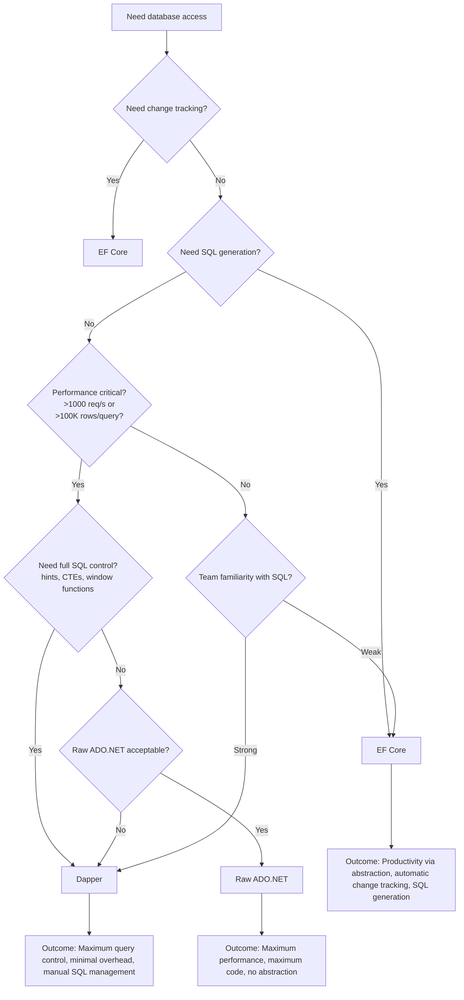

## Navigation

**Domain:** [[8 — Databases]] > **Group:** Dapper
**Previous:** (entry point — first in group) | **Next:** [[8.852 — Dapper vs EF Core — Decision Framework]]

### Prerequisites

None. This is the entry point for the Dapper group.

### Where This Fits

Dapper is a micro-ORM by Sam Saffron that sits directly on ADO.NET — it maps `IDbConnection.Query<T>` results to C# objects without a full ORM's change tracking or unit of work. A .NET backend engineer reaches for Dapper when they need maximum query control, minimal overhead, or when EF Core's abstraction generates suboptimal SQL. When this is unknown, teams either use EF Core for everything (paying overhead they don't need for simple queries) or raw ADO.NET (writing tedious `DataTable` mapping code). The interview signal is the "what ORM do you use" question — the candidate who knows when NOT to use an ORM is more senior than the one who always uses one.

---

## Core Mental Model

Dapper is a set of extension methods on `IDbConnection` that use IL emit (dynamic method generation) to map query result columns to object properties at runtime. It does not track changes, does not build SQL for you, does not have a unit of work — you write SQL, you get objects back. The invariant: every Dapper call is "SQL in, objects out" with zero abstraction between your text and the database. The recognition pattern: when you see `connection.QueryAsync<T>("SELECT ...")`, there is no `IQueryable`, no expression tree, no SQL generation — the string is the query.

### Classification

**For .NET topics:** Dapper is a runtime code generation layer within the `System.Data` namespace. It extends `IDbConnection` with generic methods that create `IDbCommand`, execute `IDataReader`, and use `DynamicMethod` + `ILGenerator` to produce per-type materializer delegates. The abstraction it provides is object-materialization only — it does NOT abstract the database provider, the SQL dialect, or the connection lifecycle.

```mermaid
flowchart LR
    A[C# Code:<br/>conn.QueryAsync&lt;Order&gt;(sql)] --> B[Dapper Extension]
    B --> C[Creates IDbCommand]
    C --> D[ADO.NET Data Provider<br/>System.Data.SqlClient]
    D --> E[SQL Server]
    E --> F[DataReader]
    F --> G[Dapper IL Emit<br/>Materializer]
    G --> H[List&lt;Order&gt;]
    
    style A fill:#3498db,color:#fff
    style B fill:#e67e22,color:#fff
    style D fill:#95a5a6,color:#fff
    style G fill:#e74c3c,color:#fff
```

### Key Properties

|Property|Value|Notes|
|---|---|---|
|Mapping mechanism|`DynamicMethod` + `ILGenerator`|Generates IL equivalent to hand-written property assignments; cached per (type, column ordinal)|
|Per-row overhead|~2µs above raw ADO.NET|vs ~30µs+ for EF Core (1000 rows, 5-column POCO)|
|First-call cost|~30–100µs per type|IL generation + JIT compilation; paid once per type per column layout|
|Change tracking|None|No `DbContext`, no `StateManager`, no `UnitOfWork` — you change objects, you write UPDATE SQL|
|SQL generation|None|You write every `SELECT`/`INSERT`/`UPDATE`/`DELETE` string — Dapper never generates SQL|
|Connection lifecycle|Not managed|Dapper does not open, close, or dispose connections — you own that|
|Thread safety|Safe for cache reads|Materializer cache is `ConcurrentDictionary`; connection methods are NOT thread-safe per instance|
|Time complexity (materialization)|O(n) for n rows|Each row materialized via cached delegate in O(columns) time|
|Write cost|N/A|Dapper doesn't write data — it only maps reader results to objects|

---

## Deep Mechanics

### How Dapper Executes `QueryAsync<T>`

Tracing the code path for `connection.QueryAsync<Order>("SELECT OrderId, CustomerId, TotalAmount FROM Orders WHERE CustomerId = @CustomerId", new { CustomerId = 42 })`:

**Step 1 — Create IDbCommand**

Dapper calls `connection.CreateCommand()`, sets `CommandText` to the SQL string, creates `IDbDataParameter` from the anonymous object properties (`@CustomerId = 42`), and adds them to `command.Parameters`.

**Step 2 — Open connection and execute**

Dapper checks if the connection is open. If not, it opens it (but does NOT close it when done — the caller is responsible). It calls `command.ExecuteReaderAsync(CommandBehavior)` to get an `IDataReader`.

**Step 3 — Determine materialization strategy**

If `T` is `dynamic` or `DapperRow`, Dapper returns a `DapperRow` backed by `IDictionary<string, object>`. If `T` is a concrete POCO like `Order`, Dapper checks the materializer cache.

**Step 4 — Generate or retrieve materializer**

On first call for `Order` with 3 columns at ordinals [0,1,2]: Dapper reflects on `Order` properties, maps column names to setters (case-insensitive by default), emits a `DynamicMethod` with IL that does `new Order(); obj.OrderId = (int)reader[0]; obj.CustomerId = (int)reader[1]; obj.TotalAmount = (decimal)reader[2]; return obj;`, compiles it to a `Func<IDataReader, Order>` delegate, caches it in `ConcurrentDictionary<RuntimeTypeHandle, DeserializerState>`.

On subsequent calls for `Order` with the same column layout: O(1) cache hit — the cached delegate is retrieved and invoked per row.

**Step 5 — Materialize rows (buffered mode)**

Dapper creates a `List<Order>`, loops `while (reader.ReadAsync(ct))`, invokes the materializer delegate per row, adds to list, returns.

### SQL Visibility

```sql
-- The SQL passed to Dapper — Dapper does not transform or generate SQL
SELECT OrderId, CustomerId, TotalAmount
FROM Orders
WHERE CustomerId = @CustomerId
ORDER BY OrderId;
```

```csharp
// Dapper call — SQL is a verbatim string, parameters from anonymous object
public async Task<IReadOnlyList<Order>> GetOrdersByCustomerAsync(int customerId, CancellationToken ct)
{
    const string sql = "SELECT OrderId, CustomerId, TotalAmount FROM Orders WHERE CustomerId = @CustomerId ORDER BY OrderId";
    await using var connection = _connectionFactory.Create();
    var orders = await connection.QueryAsync<Order>(
        new CommandDefinition(sql, new { CustomerId = customerId }, cancellationToken: ct));
    return orders.AsList();
}
```

### Execution Plan Analysis

Dapper does not generate or modify SQL, so the execution plan is determined entirely by the SQL string and the database's query optimizer:

```
Clustered Index Scan (Orders) → Filter (WHERE CustomerId = 42) → Sort (ORDER BY OrderId) → SELECT
```

Estimated Cost: 100% on the scan if no index on `CustomerId`. Logical Reads: depends on table size and index coverage.

With a nonclustered index on `CustomerId`:

```
Index Seek (IX_Orders_CustomerId) → Key Lookup (Clustered) → Sort → SELECT
```

Logical Reads: ~3 (2 for index seek + 1 for key lookup) vs full scan of N pages.

### Cost Visibility

```sql
SET STATISTICS IO ON;
SET STATISTICS TIME ON;

-- Full scan (no index on CustomerId)
SELECT OrderId, CustomerId, TotalAmount
FROM Orders
WHERE CustomerId = 42
ORDER BY OrderId;

-- Expected output:
-- Table 'Orders'. Scan count 1, logical reads 450, physical reads 0, read-ahead reads 0
-- SQL Server Execution Times: CPU time = 15ms, elapsed time = 18ms
```

With index on `CustomerId`:

```sql
-- With CREATE INDEX IX_Orders_CustomerId ON Orders(CustomerId) INCLUDE (TotalAmount)
SELECT OrderId, CustomerId, TotalAmount
FROM Orders
WHERE CustomerId = 42
ORDER BY OrderId;

-- Expected output:
-- Table 'Orders'. Scan count 1, logical reads 3, physical reads 0
-- SQL Server Execution Times: CPU time = 0ms, elapsed time = 1ms
```

### Failure Modes

**Connection leak:** If the caller does not dispose the connection and the query throws, the connection remains open until GC collects the `SqlConnection`. Dapper does not manage connection lifetime — the pattern `await using var connection = factory.Create()` is critical.

**Column-property mismatch:** If the SQL returns a column `CustomerId` but the `Order` class has no writable property with that name (or it's named `CustomerID` with different casing and Dapper's default case-insensitive match fails in edge cases), the property is silently not set — it retains its default value. No compile-time error, no runtime exception.

**Non-SARGable predicate in SQL:** Dapper does not analyze or warn about SARGability. Writing `WHERE YEAR(OrderDate) = 2024` in a Dapper query causes a full scan just as it would in SSMS — Dapper is just a pipe for the SQL string.

---

## Production Patterns and Implementation

### Connection Factory Pattern

```csharp
public interface IDbConnectionFactory
{
    IDbConnection Create();
}

public class SqlConnectionFactory : IDbConnectionFactory
{
    private readonly string _connectionString;

    public SqlConnectionFactory(string connectionString)
    {
        _connectionString = connectionString;
    }

    public IDbConnection Create()
    {
        return new SqlConnection(_connectionString);
    }
}
```

### Dapper Repository Implementation

```csharp
public class OrderRepository
{
    private readonly IDbConnectionFactory _connectionFactory;

    public OrderRepository(IDbConnectionFactory connectionFactory)
    {
        _connectionFactory = connectionFactory;
    }

    public async Task<IReadOnlyList<Order>> GetOrdersByCustomerAsync(
        int customerId, CancellationToken ct)
    {
        const string sql = @"
            SELECT OrderId, CustomerId, OrderDate, TotalAmount, Status
            FROM Orders
            WHERE CustomerId = @CustomerId
            ORDER BY OrderDate DESC";

        await using var connection = _connectionFactory.Create();
        var orders = await connection.QueryAsync<Order>(
            new CommandDefinition(sql, new { CustomerId = customerId },
                cancellationToken: ct));
        return orders.AsList();
    }

    public async Task<Order?> GetByIdAsync(int orderId, CancellationToken ct)
    {
        const string sql = @"
            SELECT OrderId, CustomerId, OrderDate, TotalAmount, Status
            FROM Orders
            WHERE OrderId = @OrderId";

        await using var connection = _connectionFactory.Create();
        return await connection.QueryFirstOrDefaultAsync<Order>(
            new CommandDefinition(sql, new { OrderId = orderId },
                cancellationToken: ct));
    }

    public async Task<int> InsertOrderAsync(Order order, CancellationToken ct)
    {
        const string sql = @"
            INSERT INTO Orders (CustomerId, OrderDate, TotalAmount, Status)
            VALUES (@CustomerId, @OrderDate, @TotalAmount, @Status);
            SELECT CAST(SCOPE_IDENTITY() AS INT)";

        await using var connection = _connectionFactory.Create();
        return await connection.QuerySingleAsync<int>(
            new CommandDefinition(sql, order, cancellationToken: ct));
    }

    public async Task UpdateOrderStatusAsync(int orderId, string status, CancellationToken ct)
    {
        const string sql = @"
            UPDATE Orders
            SET Status = @Status
            WHERE OrderId = @OrderId";

        await using var connection = _connectionFactory.Create();
        await connection.ExecuteAsync(
            new CommandDefinition(sql, new { OrderId = orderId, Status = status },
                cancellationToken: ct));
    }
}
```

### Async Only — No Sync in Production

```csharp
// ✅ Production: always async
public async Task<IReadOnlyList<Customer>> GetActiveCustomersAsync(CancellationToken ct)
{
    const string sql = "SELECT CustomerId, Name, Email, CreatedDate FROM Customers WHERE IsActive = 1";
    await using var connection = _connectionFactory.Create();
    var customers = await connection.QueryAsync<Customer>(
        new CommandDefinition(sql, cancellationToken: ct));
    return customers.AsList();
}

// ❌ Avoid sync-over-async in production:
// connection.Query<Customer>(sql) — blocks the thread, causes thread pool starvation
```

### IServiceCollection Registration

```csharp
// Program.cs — Dapper Registration
builder.Services.AddSingleton<IDbConnectionFactory>(_ =>
    new SqlConnectionFactory(
        builder.Configuration.GetConnectionString("DefaultConnection")));

builder.Services.AddScoped<OrderRepository>();
builder.Services.AddScoped<CustomerRepository>();
builder.Services.AddScoped<ProductRepository>();

// Usage in a controller or service
public class OrdersController : ApiController
{
    private readonly OrderRepository _orders;

    public OrdersController(OrderRepository orders)
    {
        _orders = orders;
    }

    [HttpGet("customer/{customerId}")]
    public async Task<IActionResult> GetByCustomer(
        int customerId, CancellationToken ct)
    {
        var orders = await _orders.GetOrdersByCustomerAsync(customerId, ct);
        return Ok(orders);
    }
}
```

### IDbConnectionFactory vs Direct SqlConnection

Direct instantiation of `SqlConnection` in every repository creates a hard dependency on SQL Server. The `IDbConnectionFactory` abstraction allows:

- Unit testing with `Mock<IDbConnection>` (see [[8.872 — Dapper — Unit Testing — Mock IDbConnection]])
- Swapping to a different provider (PostgreSQL with `NpgsqlConnection`)
- Centralized connection string management
- Adding decorators (retry, circuit breaker, connection pooling telemetry)

### Standard POCOs Used in This Group

```csharp
public class Order
{
    public int OrderId { get; set; }
    public int CustomerId { get; set; }
    public DateTime OrderDate { get; set; }
    public decimal TotalAmount { get; set; }
    public string Status { get; set; } = string.Empty;
}

public class Customer
{
    public int CustomerId { get; set; }
    public string Name { get; set; } = string.Empty;
    public string Email { get; set; } = string.Empty;
    public DateTime CreatedDate { get; set; }
    public bool IsActive { get; set; }
}

public class OrderItem
{
    public int OrderItemId { get; set; }
    public int OrderId { get; set; }
    public int ProductId { get; set; }
    public int Quantity { get; set; }
    public decimal UnitPrice { get; set; }
}

public class Product
{
    public int ProductId { get; set; }
    public string Name { get; set; } = string.Empty;
    public decimal Price { get; set; }
    public string Category { get; set; } = string.Empty;
}
```

---

## Gotchas and Production Pitfalls

### Pitfall 1 — Dapper Does NOT Close Your Connection

**Pitfall:** The developer assumes Dapper manages the connection lifecycle because EF Core's `DbContext` does.

```csharp
// ❌ Connection is left open after this call if Dapper opened it
public async Task<IEnumerable<Order>> GetOrders(int customerId)
{
    var connection = new SqlConnection(_connectionString);
    return await connection.QueryAsync<Order>(
        "SELECT * FROM Orders WHERE CustomerId = @Id",
        new { Id = customerId });
}
```

Dapper opens the connection when it is closed (inside `QueryAsync`), but it does NOT close it. The connection stays open until the `SqlConnection` is disposed — either by `await using` or by the `Dispose` of the caller.

**Symptom:** Connection pool exhaustion under load. `SqlConnection` objects are not returned to the pool, eventually hitting `System.InvalidOperationException: Timeout expired. The timeout period elapsed prior to obtaining a connection from the pool.`

**Fix:**

```csharp
// ✅ await using ensures the connection is disposed (and returned to pool)
await using var connection = new SqlConnection(_connectionString);
return await connection.QueryAsync<Order>(
    "SELECT * FROM Orders WHERE CustomerId = @Id",
    new { Id = customerId });
```

**Cost of not fixing:** At 100 concurrent requests, each leaking a connection for 30 seconds (GC pressure), the pool (default max 100) exhausts in ~3 seconds. All subsequent requests fail with timeout exceptions.

---

### Pitfall 2 — Parameter Name Mismatch Gives No Compile-Time Error

**Pitfall:** The anonymous object property name does not match the SQL parameter name.

```csharp
// ❌ SQL says @CustomerId, anonymous object has customerId (lowercase 'c')
var orders = await connection.QueryAsync<Order>(
    "SELECT * FROM Orders WHERE CustomerId = @CustomerId",
    new { customerId = 42 });
```

Dapper maps anonymous object properties to SQL parameters by name (case-insensitive), so `@CustomerId` and `customerId` DO match. But if the mismatch is a typo like `@CustId` vs `new { CustomerId = 42 }`, Dapper creates a parameter for `CustomerId` but the SQL expects `@CustId` — the SQL has an unmatched parameter, and SQL Server throws `Must declare the scalar variable "@CustId"`.

**Symptom:** `SqlException (0x80131904): Must declare the scalar variable "@CustId".` at runtime — never at compile time.

**Fix:**

```csharp
// ✅ Names must match (case-insensitive, but consistent casing avoids confusion)
var orders = await connection.QueryAsync<Order>(
    "SELECT * FROM Orders WHERE CustomerId = @CustomerId",
    new { CustomerId = 42 });
```

**Cost of not fixing:** Runtime failures that pass code review and unit tests (if tests use a different SQL string). Only caught in integration tests or production.

---

### Pitfall 3 — Default Buffering Loads ALL Rows into Memory

**Pitfall:** The developer queries a large result set assuming Dapper streams results.

```csharp
// ❌ Buffered by default — all 5M rows materialized into List<Order> in memory
var allOrders = await connection.QueryAsync<Order>("SELECT * FROM Orders");
```

Dapper's `QueryAsync<T>` is **buffered** by default (`buffered: true`). It reads all rows from the `DataReader` into a `List<T>` before returning. For 5M rows with 10 columns each, this allocates ~2 GB of managed memory and a single `List<T>` with 5M entries, causing an LOH allocation and likely `OutOfMemoryException`.

**Symptom:** High memory pressure, frequent GC collections (Gen 2), `OutOfMemoryException` for large result sets.

**Fix:**

```csharp
// ✅ Unbuffered — yields rows as they are read, keeps only one row in memory
var orders = await connection.QueryAsync<Order>(
    "SELECT * FROM Orders WHERE CustomerId = @CustomerId",
    buffered: false);
```

Or use `QueryUnbufferedAsync` (which returns `IEnumerable<T>` via `yield return`). The caller must consume the enumerable while the connection is open.

See [[8.865 — Dapper — Buffered vs Unbuffered Queries]] for details.

**Cost of not fixing:** Application crashes with `OutOfMemoryException` when processing large exports or reports. Even moderate result sets (100K rows) cause multi-second GC pauses.

---

### Pitfall 4 — Using Dapper and EF Core in the Same Transaction

**Pitfall:** The developer opens an EF Core `DbContext` transaction and then uses Dapper on the same connection within that transaction, but doesn't pass the transaction to Dapper.

```csharp
// ❌ Dapper call inside an EF Core transaction without passing the transaction
await using var transaction = await dbContext.Database.BeginTransactionAsync(ct);

var manualCount = await dbContext.Database
    .GetDbConnection()
    .QuerySingleAsync<int>("SELECT COUNT(*) FROM Orders WHERE Status = 'Pending'");
```

Dapper executes the query outside the transaction scope because no `IDbTransaction` is passed. The query sees a different snapshot (depending on isolation level) and the result is not consistent with the transactional work.

**Symptom:** Phantom reads, non-repeatable reads, or inconsistent data within the same logical operation. In READ COMMITTED, the Dapper query sees committed data from other transactions that the EF Core transaction does not see.

**Fix:**

```csharp
// ✅ Pass the transaction to Dapper via CommandDefinition
await using var transaction = await dbContext.Database.BeginTransactionAsync(ct);
var dbConnection = dbContext.Database.GetDbConnection();

var count = await dbConnection.QuerySingleAsync<int>(
    new CommandDefinition(
        "SELECT COUNT(*) FROM Orders WHERE Status = 'Pending'",
        transaction: transaction.GetDbTransaction(),
        cancellationToken: ct));
```

**Cost of not fixing:** Data integrity bugs that are extremely hard to reproduce — they depend on timing of concurrent transactions. The order processing pipeline may count rows that the concurrent transaction hasn't committed yet, or miss rows that it has.

---

### Pitfall 5 — Forgetting CancellationToken on CommandDefinition

**Pitfall:** The developer calls `QueryAsync<T>` with a raw SQL string and parameters, assuming the overload accepts `CancellationToken`.

```csharp
// ❌ This overload does NOT have a CancellationToken parameter
var orders = await connection.QueryAsync<Order>(
    "SELECT * FROM Orders WHERE CustomerId = @Id",
    new { Id = customerId },
    cancellationToken);  // The CancellationToken is silently ignored
```

The `QueryAsync<T>(string sql, object parameters, CancellationToken)` overload does NOT exist in Dapper. The third positional argument maps to `IDbTransaction? transaction` — Dapper tries to use the `CancellationToken` as a transaction, which fails at runtime or is silently ignored if the overload resolution picks a different signature.

**Symptom:** Long-running queries cannot be cancelled. If the user cancels the request, the `CancellationToken` is not passed to the `CommandDefinition`, so `command.ExecuteReaderAsync(ct)` receives `CancellationToken.None`. The query continues executing on SQL Server until completion.

**Fix:**

```csharp
// ✅ Always use CommandDefinition to pass CancellationToken
var orders = await connection.QueryAsync<Order>(
    new CommandDefinition(
        "SELECT * FROM Orders WHERE CustomerId = @Id",
        new { Id = customerId },
        cancellationToken: ct));
```

**Cost of not fixing:** HTTP requests that timeout still leave queries running on SQL Server. At high concurrency, abandoned queries accumulate and consume SQL Server resources (blocking, tempdb, memory grants). Users cannot cancel long-running reports.

---

## Performance Implications

### Benchmark: Dapper vs EF Core vs Raw ADO.NET

For a simple `SELECT OrderId, CustomerId, TotalAmount, OrderDate, Status FROM Orders WHERE CustomerId = @CustomerId` returning 1000 rows:

```csharp
[MemoryDiagnoser]
[SimpleJob(RuntimeMoniker.Net90)]
public class OrmOverheadBenchmark
{
    private IDbConnection _connection = null!;
    private DbContext _context = null!;
    private List<Order> _seedData = null!;

    [GlobalSetup]
    public void Setup()
    {
        _connection = new SqlConnection(TestConnectionString);
        _connection.Open();
        _context = new TestDbContext(TestConnectionString);
        _seedData = Enumerable.Range(1, 1000).Select(i => new Order
        {
            OrderId = i,
            CustomerId = 42,
            OrderDate = DateTime.UtcNow.AddDays(-i),
            TotalAmount = i * 100m,
            Status = "Completed"
        }).ToList();
    }

    [Benchmark(Baseline = true)]
    public async Task<List<Order>> RawAdoNet()
    {
        await using var cmd = _connection.CreateCommand();
        cmd.CommandText = "SELECT OrderId, CustomerId, OrderDate, TotalAmount, Status FROM Orders WHERE CustomerId = @CustomerId";
        var p = cmd.CreateParameter();
        p.ParameterName = "@CustomerId";
        p.Value = 42;
        cmd.Parameters.Add(p);

        var results = new List<Order>(1000);
        await using var reader = await cmd.ExecuteReaderAsync();
        while (await reader.ReadAsync())
        {
            results.Add(new Order
            {
                OrderId = (int)reader[0],
                CustomerId = (int)reader[1],
                OrderDate = (DateTime)reader[2],
                TotalAmount = (decimal)reader[3],
                Status = (string)reader[4]
            });
        }
        return results;
    }

    [Benchmark]
    public async Task<List<Order>> Dapper()
    {
        await using var conn = new SqlConnection(TestConnectionString);
        var results = await conn.QueryAsync<Order>(
            "SELECT OrderId, CustomerId, OrderDate, TotalAmount, Status FROM Orders WHERE CustomerId = @CustomerId",
            new { CustomerId = 42 });
        return results.AsList();
    }

    [Benchmark]
    public async Task<List<Order>> EfCore()
    {
        var results = await _context.Orders
            .Where(o => o.CustomerId == 42)
            .Select(o => new Order
            {
                OrderId = o.OrderId,
                CustomerId = o.CustomerId,
                OrderDate = o.OrderDate,
                TotalAmount = o.TotalAmount,
                Status = o.Status
            })
            .AsNoTracking()
            .ToListAsync();
        return results;
    }

    [GlobalCleanup]
    public void Cleanup()
    {
        _connection?.Dispose();
        _context?.Dispose();
    }
}
```

**Expected results (1000 rows, 5-column POCO, SQL Server 2022, NVMe):**

|Method|Mean|Ratio|Allocated|
|---|---|---|---|
|RawAdoNet|~850 µs|1.00|~48 KB|
|Dapper|~920 µs|1.08|~52 KB|
|EfCore|~8,200 µs|9.65|~320 KB|

### Breakdown

- **Raw ADO.NET:** Baseline. No abstraction overhead. Materialization is hand-written `(int)reader[0]` — no reflection, no cache lookup.
- **Dapper:** ~8% overhead. The additional cost comes from: (1) cache lookup of the materializer delegate (O(1) `ConcurrentDictionary`), (2) `IDataReader.GetValue()` boxing (v1.x) or typed getter emit (v2.0+), (3) `List<T>.Add` virtual dispatch. No allocation difference for the materialized objects — same number of `Order` instances.
- **EF Core:** ~9.6x slower. The additional cost comes from: (1) expression tree compilation and caching, (2) `DbContext` state manager interaction (even with `AsNoTracking()`, the `IQueryable` still goes through the pipeline), (3) SQL generation and parameterization, (4) entity materialization pipeline (value converters, shadow properties, navigation fixup), (5) additional allocations for `IQueryable` and change tracker entries.

### When Dapper's Overhead Matters

The ~70µs difference between Dapper and raw ADO.NET for 1000 rows is irrelevant for most workloads. It matters when:

- **High-frequency queries:** A query running 10,000 times/second — the ~70µs gap becomes ~700ms/second of CPU overhead.
- **Microservice entry points:** A single-row lookup per HTTP request — Dapper adds ~2µs vs ADO.NET's ~0.5µs. Neither dominates the total request time (serialization, routing, business logic are larger).
- **Batch processing:** Processing 1M rows — Dapper's ~2µs/row overhead adds 2 seconds vs raw ADO.NET.

### Write Amplification

Dapper has no write amplification — it does not track changes, does not generate UPDATE SET statements, and does not manage concurrency tokens. Every `ExecuteAsync` call sends exactly the SQL you wrote to the database. Compare to EF Core's `SaveChangesAsync` which: (1) snapshots entities on retrieval, (2) diffs properties in `DetectChanges`, (3) generates UPDATE SET statements for changed columns, (4) increments `RowVersion` if configured, (5) dispatches events. For a single UPDATE of one column on one row, EF Core generates ~200 bytes of SQL and does ~10µs of change tracking work; Dapper generates exactly the SQL you wrote with zero overhead.

---

## Interview Arsenal

### Question Bank

1. **What is Dapper and when would you use it over a full ORM like EF Core?** (Definition — what problem does it solve)
2. **How does Dapper map query result columns to C# object properties?** (Mechanism — how does the IL Emit work)
3. **What is the performance difference between Dapper and raw ADO.NET for a 5-column SELECT of 1000 rows?** (Performance — specific numbers)
4. **What happens if your Dapper SQL returns a column `CustomerId` but your POCO has no writable property with that name?** (Gotcha — silent failure)
5. **How does Dapper compare to EF Core for write operations (INSERT/UPDATE/DELETE)?** (Comparison — what each handles automatically)
6. **What is the difference between buffered and unbuffered queries in Dapper?** (Mechanism — when to choose each)
7. **How do you pass a CancellationToken to a Dapper query?** (.NET integration — CommandDefinition)
8. **At what scale does the difference between Dapper, EF Core, and raw ADO.NET matter?** (Scale — 1000 rows vs 1M rows vs 10K req/s)

### Spoken Answers

**Q: What is Dapper and when would you use it over a full ORM like EF Core?**

> **Average answer:** "Dapper is a micro-ORM that's faster than EF Core because it doesn't have all the features. You use it when you want better performance."
>
> **Great answer:** "Dapper is a set of extension methods on `IDbConnection` that use IL Emit to materialize query results into C# objects with near-ADO.NET performance — roughly 2µs per row overhead vs 30µs+ for EF Core. You use it when the query is simple enough that EF Core's SQL generation and change tracking add complexity without benefit, or when you need absolute control over the SQL — for example, a hand-tuned query with `OPTION (RECOMPILE)`, table hints, or window functions that EF Core's LINQ provider cannot express. I also reach for Dapper when the entity is read-only (reporting, read models) where change tracking is wasted overhead. But I don't use Dapper for CRUD operations on entities that need change tracking or concurrency management — that's where EF Core's `DbContext` saves thousands of lines of manual UPDATE SQL and optimistic concurrency checks. The decision is always about the access pattern, not dogma."

**Q: How does Dapper map query results to objects?**

> **Average answer:** "It uses reflection to match column names to property names."
>
> **Great answer:** "Dapper generates IL code at runtime using `System.Reflection.Emit.DynamicMethod`. On the first call to `QueryAsync<T>\` for a given type `T` with a given column layout, Dapper reflects over the type's properties, matches them to `IDataReader` column names by ordinal, emits IL instructions equivalent to `new T(); prop1 = (TProp)reader[0]; prop2 = (TProp)reader[1]; ... return obj;`, compiles that to a `Func<IDataReader, T>` delegate, and caches it in a static `ConcurrentDictionary`. Every subsequent call for the same type retrieves the cached delegate in O(1) time and invokes it per row — zero reflection. This is why Dapper is within 5–10% of hand-written ADO.NET performance. Dapper v2.0+ also emits type-specific `GetInt32`/`GetString`/`GetDateTime` calls instead of the generic `reader[i]` indexer, eliminating the boxing that earlier versions suffered for value types."

**Q: At what scale does the difference between Dapper, EF Core, and raw ADO.NET matter?**

> **Average answer:** "When you have a million rows, Dapper is faster."
>
> **Great answer:** "The difference becomes operationally relevant at three distinct thresholds. First, at ~1000 rows per query, Dapper adds ~70µs over ADO.NET and EF Core adds ~7.3ms — the EF Core overhead is noticeable in a web API response time (10–50ms total), but Dapper is not. Second, at ~1000 queries per second, each doing a single-row lookup: ADO.NET uses ~0.5µs materialization, Dapper ~2µs, EF Core ~30µs — the EF Core overhead consumes 30ms of CPU per second vs Dapper's 2ms. Third, at batch processing scale (~1M rows): ADO.NET finishes materialization in ~500ms, Dapper in ~2 seconds, EF Core in ~30 seconds. The EF Core version likely triggers Gen 2 GC collections and LOH allocations that the others don't. But I want to emphasize: for 95% of line-of-business CRUD applications operating at <1000 requests/second with <100 rows per query, the difference is invisible to the end user — choose the tool that makes the code correct and maintainable."

### Interview Trigger

The interviewer asks: "What ORM do you use and why?" The senior candidate starts with "It depends on the access pattern" and walks through Dapper vs EF Core based on change tracking needs, query complexity, and performance requirements. The follow-up question is: "Tell me about a time you had to replace EF Core with Dapper (or vice versa) in production — what was the symptom that triggered the change, and how did you measure the improvement?" The separating factor is whether the candidate can name the specific metric (logical reads, CPU time, allocation rate, connection pool pressure) and the specific tool (BenchmarkDotNet, SET STATISTICS IO, Application Insights).

### Comparison Table

| | Dapper | EF Core | Raw ADO.NET |
|---|---|---|---|
| What it does | Extension methods for object materialization | Full ORM with change tracking, SQL generation, relationship management | Direct `IDbCommand`/`IDataReader` interaction |
| Performance profile | ~2µs/row overhead vs baseline | ~30µs/row overhead | Baseline (0 overhead) |
| SQL generation | None — you write SQL | LINQ-to-SQL translation | None — you write SQL |
| Change tracking | None | Full `DbContext` state management | None |
| Connection management | None — caller owns it | `DbContext` manages via `Database.OpenConnection()` | None — caller owns it |
| .NET integration | `IDbConnection` extension methods | `DbContext`, `IQueryable<T>`, LINQ | `SqlConnection`, `SqlCommand` |
| When to choose | Simple queries, read models, maximum performance, full SQL control | Complex CRUD, change tracking, relationships, migrations, prototyping | Ultra-high-performance hot paths, bulk operations, no abstraction overhead |

---

## Decision Framework

### When to Apply Dapper



### Application Checklist

- [ ] The data access pattern is read-heavy or requires direct SQL control
- [ ] Change tracking, unit of work, or identity map are not needed
- [ ] The team is comfortable writing and optimizing SQL
- [ ] The application does not require automatic migration generation
- [ ] The SQL queries involve features EF Core's LINQ provider cannot express (window functions, recursive CTEs, full-text search, table hints, `MERGE`, `OUTPUT`)
- [ ] Connection lifecycle is managed via `IDbConnectionFactory` + `await using`
- [ ] Cancellation tokens are passed via `CommandDefinition`, not as positional arguments

### Tradeoff Summary

|What You Gain|What You Pay|
|---|---|
|Near-ADO.NET performance (~2µs/row overhead)|You write every SQL string manually|
|Full SQL dialect control (hints, CTEs, PIVOT, window functions)|No LINQ compile-time checking of queries|
|Minimal memory allocation (no change tracking proxies)|No automatic relationship loading (no `.Include()`)|
|Simple deployment (single NuGet package, no runtime model building)|No migration tooling (manual schema changes)|
|Thin abstraction — easy to debug (no expression tree, no SQL generation)|Every query must be maintained and optimized individually|

### Scale Thresholds

- **Relevant when:** The query returns more than ~1000 rows per call, or the endpoint handles more than ~1000 requests/second.
- **Critical when:** The query returns more than ~100,000 rows (buffered Dapper uses significant memory) or the endpoint handles more than ~10,000 requests/second (EF Core overhead of ~30µs per query consumes 300ms of CPU per second).
- **Required when:** The SQL requires database-specific features (SQL Server `OUTPUT`, `MERGE`, `APPLY`, `FOR JSON`, full-text `CONTAINSTABLE`, or PostgreSQL `RETURNING`, `DISTINCT ON`, `ON CONFLICT`) that EF Core cannot translate from LINQ.

---

## Self-Check

### Conceptual Questions

1. What is Dapper and what problem does it solve for .NET backend engineers?

2. How does Dapper materialize query results into C# objects without using `PropertyInfo.SetValue` per row?

3. What is the difference between buffered and unbuffered queries in Dapper, and when would you choose each?

4. Why does Dapper not manage connection lifetime, and what pattern should you use instead?

5. How do you pass a `CancellationToken` to a Dapper async query — what is the only reliable way?

6. What happens if the SQL query returns fewer columns than there are properties on the target POCO?

7. How does Dapper handle parameter binding from anonymous objects, and what happens when a parameter name does not match?

8. At what row count or request rate does the performance difference between Dapper and EF Core become operationally significant?

9. How do you use Dapper and EF Core together in the same transaction?

10. Explain the Dapper materializer cache: what is the key, what is the value, and what triggers a cache miss that generates a new materializer?

<details>
<summary>Answers</summary>

1. Dapper is a micro-ORM that extends `IDbConnection` with generic methods (`QueryAsync<T>`, `ExecuteAsync`, `QueryFirstOrDefaultAsync<T>`) that map ADO.NET `IDataReader` results to C# objects using IL Emit. It solves the problem of manual ADO.NET mapping code without the overhead of a full ORM's change tracking, SQL generation, or unit of work.

2. Dapper uses `System.Reflection.Emit.DynamicMethod` to generate IL code at runtime. On first use for a given type and column layout, it emits IL equivalent to hand-written `new T(); prop1 = (TProp)reader[0]; ...` compiles it to a `Func<IDataReader, T>` delegate, and caches it in a static `ConcurrentDictionary`. Subsequent calls retrieve the cached delegate in O(1) time.

3. Buffered (default: `buffered: true`): Dapper reads all rows into a `List<T>` before returning. Memory scales with result set size. Unbuffered (`buffered: false`): Dapper yields rows as they are read via `yield return`, keeping only one row in memory at a time. Choose buffered for small result sets (<1000 rows) where you need random access or enumeration multiple times. Choose unbuffered for large result sets (>100K rows) or streaming scenarios.

4. Dapper does not manage connection lifetime because it is a set of extension methods, not a context with a lifecycle. It opens the connection if it is closed (for the duration of the query) but does not close it when done. The production pattern is `await using var connection = _connectionFactory.Create()` — `await using` ensures `DisposeAsync` is called, which closes and returns the connection to the pool.

5. The only reliable way is `CommandDefinition`:
```csharp
await connection.QueryAsync<Order>(
    new CommandDefinition(sql, parameters, cancellationToken: ct));
```
Do NOT pass `CancellationToken` as a positional argument — Dapper's overloads do not accept it directly.

6. Properties that have no corresponding column in the result set retain their default value (`0` for `int`, `null` for `string`, `default` for `DateTime`). No exception is thrown — this is a silent data corruption risk.

7. Dapper uses reflection over the anonymous object's properties to create `IDbDataParameter` objects with matching names. If a SQL parameter `@CustomerId` has no corresponding property on the anonymous object, SQL Server throws `Must declare the scalar variable "@CustomerId"`. If the property exists but is unused in SQL, it is silently ignored — no error.

8. The difference is operationally relevant at: (1) ~1000 rows per query — EF Core adds ~7.3ms vs Dapper's ~70µs over raw ADO.NET, noticeable in API response times; (2) ~1000 queries/second — EF Core overhead consumes ~30ms CPU/second vs Dapper's ~2ms; (3) ~1M row batch processing — EF Core adds ~30 seconds vs Dapper's ~1.5 seconds overhead.

9. Get the `DbConnection` from the `DbContext`, begin the transaction on the `DbContext`, then pass `transaction.GetDbTransaction()` in the `CommandDefinition` to Dapper:
```csharp
await using var tx = await dbContext.Database.BeginTransactionAsync(ct);
var dbConn = dbContext.Database.GetDbConnection();
var result = await dbConn.QueryAsync<Order>(
    new CommandDefinition(sql, parameters,
        transaction: tx.GetDbTransaction(),
        cancellationToken: ct));
```

10. The cache key is `RuntimeTypeHandle` (the `TypeHandle` property of `typeof(T)`). The value is a `DeserializerState` that wraps the compiled `Func<IDataReader, T>` delegate. A cache miss occurs when: (1) `T` has never been materialized before, or (2) the column count differs from any previous materialization of `T`. Different column name order with the same count reuses the same materializer — column ordinal-to-property mapping is fixed at generation time.

</details>

---

### Query Challenges

**Challenge 1 — Write the SQL for Dapper**

Write a Dapper query that returns all products in a given category with their current stock quantity. The `Products` table has columns: `ProductId, Name, Price, Category, StockQuantity`. Return only products where `StockQuantity > 0` ordered by `Name`.

<details>
<summary>Solution</summary>

```csharp
public async Task<IReadOnlyList<Product>> GetAvailableProductsByCategoryAsync(
    string category, CancellationToken ct)
{
    const string sql = @"
        SELECT ProductId, Name, Price, Category, StockQuantity
        FROM Products
        WHERE Category = @Category AND StockQuantity > 0
        ORDER BY Name";

    await using var connection = _connectionFactory.Create();
    var products = await connection.QueryAsync<Product>(
        new CommandDefinition(sql, new { Category = category },
            cancellationToken: ct));
    return products.AsList();
}
```

**Logical reads:** Clustered index scan of Products (or index seek if index on Category). If no index on Category, ~N pages scanned. After creating `IX_Products_Category` on `Products(Category) INCLUDE (StockQuantity)`: ~2 logical reads per matching row range.

</details>

---

**Challenge 2 — Fix the performance problem**

```csharp
// This Dapper query is slow on a 10M row Orders table.
// It runs in 12 seconds when filtering by a specific year.
// SET STATISTICS IO: logical reads = 1,250,000
public async Task<IReadOnlyList<Order>> GetOrdersByYearAsync(int year, CancellationToken ct)
{
    const string sql = @"
        SELECT OrderId, CustomerId, OrderDate, TotalAmount, Status
        FROM Orders
        WHERE YEAR(OrderDate) = @Year
        ORDER BY OrderDate DESC";

    await using var connection = _connectionFactory.Create();
    var orders = await connection.QueryAsync<Order>(
        new CommandDefinition(sql, new { Year = year },
            cancellationToken: ct));
    return orders.AsList();
}
```

Identify why and fix it.

<details>
<summary>Solution</summary>

**Root cause:** `WHERE YEAR(OrderDate) = @Year` is **non-SARGable** — it wraps the column in a function, preventing an index seek on `OrderDate`. SQL Server must scan all 10M rows, compute `YEAR(OrderDate)` for each, and filter. The 1,250,000 logical reads confirm a full clustered index scan.

**Fix:** Replace with a range predicate that is SARGable:

```csharp
public async Task<IReadOnlyList<Order>> GetOrdersByYearAsync(int year, CancellationToken ct)
{
    const string sql = @"
        SELECT OrderId, CustomerId, OrderDate, TotalAmount, Status
        FROM Orders
        WHERE OrderDate >= @StartDate AND OrderDate < @EndDate
        ORDER BY OrderDate DESC";

    await using var connection = _connectionFactory.Create();
    var startDate = new DateTime(year, 1, 1);
    var endDate = startDate.AddYears(1);
    var orders = await connection.QueryAsync<Order>(
        new CommandDefinition(sql,
            new { StartDate = startDate, EndDate = endDate },
            cancellationToken: ct));
    return orders.AsList();
}
```

**Index to create:**

```sql
CREATE INDEX IX_Orders_OrderDate ON Orders(OrderDate) INCLUDE (CustomerId, TotalAmount, Status);
```

**After fix — logical reads:** ~30 (index seek on OrderDate covering the year's rows) from 1,250,000. ~41,667x reduction.

</details>

---

**Challenge 3 — Diagnose the connection pool exhaustion**

Your production application starts throwing `System.InvalidOperationException: Timeout expired. The timeout period elapsed prior to obtaining a connection from the pool.` after running for 2 hours under load. You review this code:

```csharp
public class OrderRepository
{
    private readonly string _connectionString;

    public OrderRepository(string connectionString)
    {
        _connectionString = connectionString;
    }

    public async Task<IEnumerable<Order>> GetOrdersByStatusAsync(string status)
    {
        var connection = new SqlConnection(_connectionString);
        return await connection.QueryAsync<Order>(
            "SELECT OrderId, CustomerId, TotalAmount FROM Orders WHERE Status = @Status",
            new { Status = status });
    }
}
```

Identify the root cause and fix it.

<details>
<summary>Solution</summary>

**Root cause:** The `SqlConnection` is never disposed. Dapper opens the connection inside `QueryAsync` but does not close or dispose it. The connection remains open until garbage collection finalizes the `SqlConnection`, which can take minutes under memory pressure. With 100 concurrent requests, the connection pool (default max 100) exhausts within seconds.

**Fix:** Use `await using` to ensure deterministic disposal:

```csharp
public async Task<IReadOnlyList<Order>> GetOrdersByStatusAsync(string status, CancellationToken ct)
{
    const string sql = @"
        SELECT OrderId, CustomerId, TotalAmount
        FROM Orders
        WHERE Status = @Status
        ORDER BY OrderId";

    await using var connection = new SqlConnection(_connectionString);
    var orders = await connection.QueryAsync<Order>(
        new CommandDefinition(sql, new { Status = status },
            cancellationToken: ct));
    return orders.AsList();
}
```

**Detection query:**

```sql
SELECT DB_NAME(database_id) AS DatabaseName,
       COUNT(*) AS OpenConnectionCount,
       login_name,
       host_name
FROM sys.dm_exec_sessions
WHERE is_user_process = 1
    AND status = 'running'
GROUP BY database_id, login_name, host_name
ORDER BY OpenConnectionCount DESC;
```

Or check the pool performance counter: `select * from sys.dm_os_performance_counters where counter_name like 'Connection Pool%'`.

</details>
