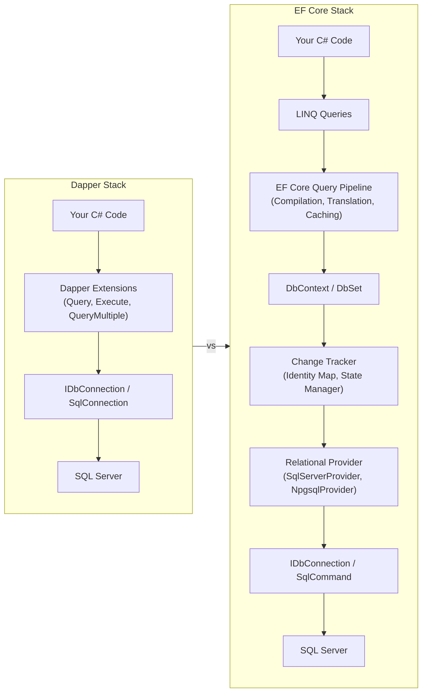
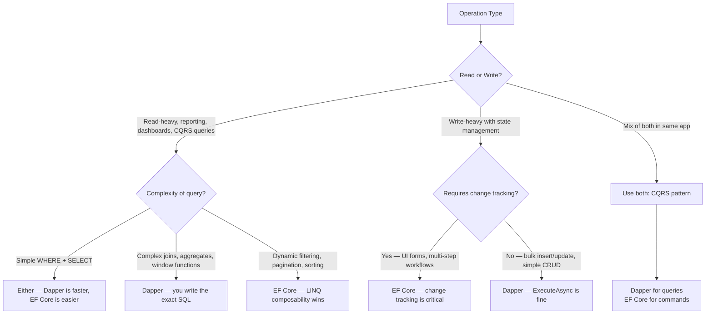
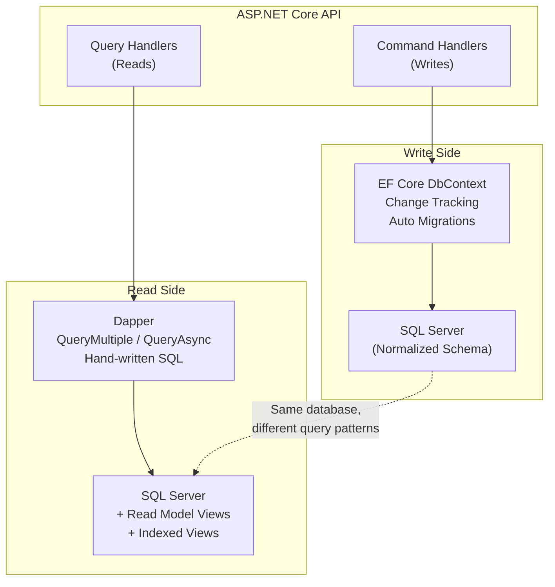

## Navigation

**Domain:** [[8 — Databases]] > **Group:** Dapper
**Previous:** [[8.851 — Dapper — What It Is and When to Use]] | **Next:** [[8.853 — Dapper — QueryT — Basic Querying]]

### Prerequisites

- [[8.851 — Dapper — What It Is and When to Use]] — establishes the micro-ORM philosophy, the "why Dapper exists" context that this comparison builds on.
- [[3.001 — DbContext and Change Tracking Fundamentals]] — EF Core's change tracking is the primary architectural difference; understanding its lifecycle is required to evaluate the tradeoffs.
- [[8.881 — Repository Pattern — Interface and Implementation]] — both Dapper and EF Core are often used inside repository abstractions; the pattern's impact on testability and swap-ability is central to the decision.

### Where This Fits

This note is the **decision spine** for the Dapper group. Every other note in Group 30 (8.853–8.880) documents a Dapper-specific feature; this note answers the meta-question: *when do I use Dapper instead of EF Core, when do I use EF Core instead of Dapper, and when do I use both in the same application?* A .NET backend engineer who understands both can choose the right tool per operation — Dapper for read-model materialization in CQRS query handlers, EF Core for transactional writes with change tracking, or exclusively one for projects where uniformity matters more than peak performance. When this decision framework is unknown, teams make one of two errors: force EF Core into high-throughput read paths where its abstraction overhead adds 30%+ latency, or write raw SQL everywhere and lose the productivity gains of change tracking, migrations, and LINQ composability. The interview signal is strong: the candidate who can articulate the tradeoffs at the level of logical reads, connection management, and team productivity demonstrates senior-level architecture thinking.

---

## Core Mental Model

Dapper and EF Core sit at opposite ends of the .NET data-access spectrum. Dapper is a **micro-ORM**: a thin wrapper over ADO.NET that maps result-set rows to objects with zero ceremony. EF Core is a **full ORM**: it provides a LINQ query pipeline, change tracking, identity resolution, lazy loading, migrations, and a unit-of-work pattern via `DbContext`. The fundamental axis of comparison is not one of capability but one of **abstraction cost** — Dapper gives you full control over SQL in exchange for manual work; EF Core gives you automation in exchange for opacity and overhead.

### Stack Comparison



### Classification

|Dimension|Dapper|EF Core|
|---|---|---|
|Type|Micro-ORM|Full ORM|
|Abstraction level|Thin over ADO.NET|Thick: LINQ, change tracking, migrations|
|SQL control|Full (you write it)|Generated (you guide it via LINQ)|
|Change tracking|None|Full (Unit of Work, Identity Map)|
|Learning curve|Low (SQL knowledge required)|Medium-High (LINQ, conventions, config)|
|Query compilation cache|None|Yes, EF Core caches compiled query plans|
|Bulk operations|Manual SQL or BulkExtensions|Built-in ExecuteDelete, ExecuteUpdate (EF Core 7+)|
|Async support|Full (QueryAsync, ExecuteAsync)|Full (ToListAsync, SaveChangesAsync)|
|Migrations|None (manual scripts)|Built-in (dotnet ef migrations)|
|Connection management|Manual (open/close/dispose)|Automatic (DbContext manages)|
|Transaction scoping|Manual (IDbTransaction)|Automatic (SaveChanges wraps in transaction)|

### When Each Shines



---

## Deep Mechanics

This section shows the **same query** implemented in both Dapper and EF Core, then examines the generated SQL, execution plans, and runtime behavior. The contrast reveals the abstraction cost of EF Core and the manual burden of Dapper.

### Query: Get Orders with Customer Name and Total (Join)

**Business requirement:** Retrieve the 50 most recent orders, each with the customer's full name and the order total, sorted by order date descending.

#### Dapper Approach

```csharp
public sealed record OrderWithCustomer(
    int OrderId,
    string CustomerName,
    DateTime OrderDate,
    string Status,
    decimal TotalAmount,
    int ItemCount);

public async Task<IReadOnlyList<OrderWithCustomer>> GetRecentOrdersAsync(
    IDbConnection connection, int count = 50)
{
    const string sql = @"
        SELECT TOP (@Count)
            o.OrderId,
            c.FullName AS CustomerName,
            o.OrderDate,
            o.Status,
            o.TotalAmount,
            (SELECT COUNT(*) FROM OrderItems oi WHERE oi.OrderId = o.OrderId) AS ItemCount
        FROM Orders o
        INNER JOIN Customers c ON o.CustomerId = c.CustomerId
        ORDER BY o.OrderDate DESC;";

    var orders = await connection.QueryAsync<OrderWithCustomer>(
        sql, new { Count = count });

    return orders.AsList();
}
```

**SQL sent to server:**
```sql
exec sp_executesql N'
    SELECT TOP (@Count)
        o.OrderId,
        c.FullName AS CustomerName,
        o.OrderDate,
        o.Status,
        o.TotalAmount,
        (SELECT COUNT(*) FROM OrderItems oi WHERE oi.OrderId = o.OrderId) AS ItemCount
    FROM Orders o
    INNER JOIN Customers c ON o.CustomerId = c.CustomerId
    ORDER BY o.OrderDate DESC;',
N'@Count int',
@Count = 50
```

#### EF Core Approach — Same Result

```csharp
public async Task<List<OrderWithCustomer>> GetRecentOrdersAsync(
    AppDbContext dbContext, int count = 50)
{
    var orders = await dbContext.Orders
        .OrderByDescending(o => o.OrderDate)
        .Take(count)
        .Select(o => new OrderWithCustomer(
            o.OrderId,
            o.Customer.FullName,
            o.OrderDate,
            o.Status,
            o.TotalAmount,
            o.OrderItems.Count))
        .ToListAsync();

    return orders;
}
```

**SQL generated by EF Core:**
```sql
SELECT TOP(@__count_0)
    [o].[OrderId],
    [c].[FullName] AS [CustomerName],
    [o].[OrderDate],
    [o].[Status],
    [o].[TotalAmount],
    (
        SELECT COUNT(*)
        FROM [OrderItems] AS [o0]
        WHERE [o0].[OrderId] = [o].[OrderId]
    ) AS [ItemCount]
FROM [Orders] AS [o]
INNER JOIN [Customers] AS [c] ON [o].[CustomerId] = [c].[CustomerId]
ORDER BY [o].[OrderDate] DESC
```

**Observation:** The generated SQL is nearly identical. The EF Core query pipeline translated the LINQ expression tree into equivalent TSQL, parameterized the `@__count_0` parameter, and produced the same join structure. The difference is **not** in the SQL quality — it is in the runtime overhead before the SQL is sent.

### Execution Plan Comparison

```
Dapper — plan shape (identical SQL):
  Index Scan (IX_Orders_OrderDate DESC) → Nested Loops (Inner Join)
    → Index Seek (PK_Customers) → Compute Scalar (COUNT subquery)
  Estimated subtree cost: 0.085
  Logical reads: ~18

EF Core — plan shape (identical SQL):
  Index Scan (IX_Orders_OrderDate DESC) → Nested Loops (Inner Join)
    → Index Seek (PK_Customers) → Compute Scalar (COUNT subquery)
  Estimated subtree cost: 0.085
  Logical reads: ~18
```

The SQL Server execution plan is **indistinguishable**. The difference is wholly in the client-side processing.

### Client-Side Overhead Breakdown

|Phase|Dapper|EF Core|
|---|---|---|
|Query compilation|None — SQL is a string|~15-50 μs on first execution (compiled query cache hit for subsequent calls)|
|Expression tree translation|N/A|~5-20 μs (cold start); ~0.3 μs (cached)|
|Parameter binding|$0.5 μs (DapperDynamicParams)|~1 μs (DbParameter collection)|
|Row materialization (per row)|~0.1 μs (IL-generated delegate)|~0.3-0.8 μs (reflection + change tracking probe)|
|Change tracking attachment|None|~1-2 μs per row (state manager, identity map check)|
|Connection management|Manual (open/close ~5 μs)|Automatic (open on demand, close on dispose)|

**Net effect:** For a 50-row result set, Dapper materializes in ~5 μs and EF Core in ~40-60 μs. At 1000 RPS, the difference is ~50ms of CPU per second — negligible on one box, significant at scale across many cores.

### Cost Visibility — SET STATISTICS IO ON

```sql
SET STATISTICS IO ON;

-- Dapper SQL (or EF Core generated SQL — identical)
SELECT TOP(50)
    o.OrderId, c.FullName AS CustomerName, o.OrderDate, o.Status, o.TotalAmount,
    (SELECT COUNT(*) FROM OrderItems oi WHERE oi.OrderId = o.OrderId) AS ItemCount
FROM Orders o
INNER JOIN Customers c ON o.CustomerId = c.CustomerId
ORDER BY o.OrderDate DESC;

-- Output:
-- Table 'OrderItems'. Scan count 50, logical reads 150
-- Table 'Customers'.  Scan count 1, logical reads 3
-- Table 'Orders'.     Scan count 1, logical reads 12
```

### Failure Modes

- **Dapper assumes SQL is correct:** A typo in a column name throws at runtime (`SqlException`). EF Core catches column mismatches at model-building time or query translation time.
- **EF Core assumes navigation properties are loaded:** Accessing `order.Customer.Name` without `.Include(c => c.Customer)` throws `InvalidOperationException` (or worse, a lazy-loading round trip under `context.ChangeTracker.LazyLoadingEnabled`).
- **Dapper trusts the connection is open:** Calling `QueryAsync` on a closed connection throws `InvalidOperationException`. EF Core opens the connection automatically on first query.
- **EF Core caches query plans aggressively:** A query that performs well on the first run but degrades with parameter sniffing requires explicit `.WithOption(QuerySplittingBehavior.SplitQuery)` or query plan hints.
- **Dapper has no identity map:** Two `QueryAsync<Order>` calls for the same `OrderId` return two distinct objects. EF Core's identity map returns the same instance — mutation in one place affects all references.

---

## Production Patterns and Implementation

The same CRUD operation — creating an order with line items — implemented in both Dapper and EF Core. This demonstrates the practical difference in lines of code, error handling, and transactional behavior.

### Pattern: Create Order with Items (Transactional)

#### Dapper — Manual Transaction

```csharp
public sealed record CreateOrderCommand(
    int CustomerId, string ShippingAddress, List<CreateOrderItem> Items);

public sealed record CreateOrderItem(int ProductId, int Quantity, decimal UnitPrice);

public sealed class DapperOrderService
{
    private readonly IDbConnectionFactory _connectionFactory;

    public DapperOrderService(IDbConnectionFactory connectionFactory)
    {
        _connectionFactory = connectionFactory;
    }

    public async Task<int> CreateOrderAsync(CreateOrderCommand command, CancellationToken ct)
    {
        await using var connection = _connectionFactory.Create();
        await connection.OpenAsync(ct);
        await using var transaction = await connection.BeginTransactionAsync(ct);

        try
        {
            // 1. Insert the order header
            const string insertOrderSql = @"
                INSERT INTO Orders (CustomerId, OrderDate, Status, ShippingAddress, TotalAmount)
                OUTPUT INSERTED.OrderId
                VALUES (@CustomerId, @OrderDate, 'Pending', @ShippingAddress, @TotalAmount);";

            var totalAmount = command.Items.Sum(i => i.Quantity * i.UnitPrice);
            var orderId = await connection.ExecuteScalarAsync<int>(
                insertOrderSql,
                new
                {
                    command.CustomerId,
                    OrderDate = DateTime.UtcNow,
                    command.ShippingAddress,
                    TotalAmount = totalAmount
                },
                transaction: transaction,
                commandTimeout: 10);

            // 2. Insert each order item
            const string insertItemSql = @"
                INSERT INTO OrderItems (OrderId, ProductId, Quantity, UnitPrice, LineTotal)
                VALUES (@OrderId, @ProductId, @Quantity, @UnitPrice, @LineTotal);";

            foreach (var item in command.Items)
            {
                await connection.ExecuteAsync(
                    insertItemSql,
                    new
                    {
                        OrderId = orderId,
                        item.ProductId,
                        item.Quantity,
                        item.UnitPrice,
                        LineTotal = item.Quantity * item.UnitPrice
                    },
                    transaction: transaction,
                    commandTimeout: 10);
            }

            await transaction.CommitAsync(ct);
            return orderId;
        }
        catch (SqlException ex) when (ex.Number is 1205 or 1222) // deadlock
        {
            await transaction.RollbackAsync(ct);
            throw new OrderCreationException("Deadlock creating order. Retry.", ex);
        }
    }
}
```

**What Dapper requires manually:**
- Connection creation and opening
- Transaction begin / commit / rollback
- SQL strings for each operation
- Parameter construction with anonymous objects
- Manual error handling for deadlocks and transient failures

#### EF Core — DbContext with Change Tracking

```csharp
public sealed class EfCoreOrderService
{
    private readonly AppDbContext _dbContext;
    private readonly ILogger<EfCoreOrderService> _logger;

    public EfCoreOrderService(AppDbContext dbContext, ILogger<EfCoreOrderService> logger)
    {
        _dbContext = dbContext;
        _logger = logger;
    }

    public async Task<int> CreateOrderAsync(CreateOrderCommand command, CancellationToken ct)
    {
        var order = new Order
        {
            CustomerId = command.CustomerId,
            OrderDate = DateTime.UtcNow,
            Status = "Pending",
            ShippingAddress = command.ShippingAddress,
            TotalAmount = command.Items.Sum(i => i.Quantity * i.UnitPrice),
            OrderItems = command.Items.Select(i => new OrderItem
            {
                ProductId = i.ProductId,
                Quantity = i.Quantity,
                UnitPrice = i.UnitPrice,
                LineTotal = i.Quantity * i.UnitPrice
            }).ToList()
        };

        _dbContext.Orders.Add(order);

        int retryCount = 0;
        while (retryCount < 3)
        {
            try
            {
                await _dbContext.SaveChangesAsync(ct);
                return order.OrderId;
            }
            catch (DbUpdateConcurrencyException)
            {
                // EF Core optimistic concurrency — reload and retry
                foreach (var entry in _dbContext.ChangeTracker.Entries())
                    await entry.ReloadAsync(ct);
                retryCount++;
            }
            catch (SqlException ex) when (ex.Number is 1205 or 1222)
            {
                // Deadlock — DbContext auto-rolls back the transaction
                _logger.LogWarning(ex, "Deadlock on attempt {Attempt}", retryCount + 1);
                retryCount++;
                await Task.Delay(TimeSpan.FromMilliseconds(50 * retryCount), ct);
            }
        }

        throw new OrderCreationException("Failed to create order after 3 retries.");
    }
}
```

**What EF Core provides automatically:**
- Connection management (opens on `SaveChangesAsync`)
- Transaction (wraps `SaveChangesAsync` in `IDbContextTransaction`)
- SQL generation from LINQ/entity state
- Change tracking (tracks `Order` and `OrderItems` as `Added`)
- Identity map (same `OrderId` always maps to same `Order` instance in context)
- Optimistic concurrency via row version
- Cascade insert (inserts `Order` first, then `OrderItems` with the generated `OrderId`)

#### Tradeoff at a Glance

|Aspect|Dapper (37 lines)|EF Core (39 lines)|
|---|---|---|
|SQL written by you|2 statements (INSERT + INSERT)|None (generated)|
|Transaction management|Manual|Automatic|
|Concurrency handling|Manual (`SqlException` number check)|Built-in (`DbUpdateConcurrencyException`)|
|Retry logic|Manual|Manual (or built-in with `EnableRetryOnFailure`)|
|Testability|Easy with mocked `IDbConnection`|Requires in-memory provider or SQLite|
|Lines of production code|Similar|Similar|
|Learning curve for maintainer|Must know SQL|Must know EF Core conventions|

### Pattern: Batch Insert (1000 Rows)

#### Dapper with Table-Valued Parameters

```csharp
public async Task BulkInsertOrderItemsAsync(DbConnection connection, int orderId, List<OrderItem> items)
{
    var dataTable = new DataTable();
    dataTable.Columns.Add("OrderId", typeof(int));
    dataTable.Columns.Add("ProductId", typeof(int));
    dataTable.Columns.Add("Quantity", typeof(int));
    dataTable.Columns.Add("UnitPrice", typeof(decimal));

    foreach (var item in items)
        dataTable.Rows.Add(orderId, item.ProductId, item.Quantity, item.UnitPrice);

    await connection.ExecuteAsync(
        "INSERT INTO OrderItems (OrderId, ProductId, Quantity, UnitPrice) SELECT OrderId, ProductId, Quantity, UnitPrice FROM @Items",
        new { Items = dataTable.AsTableValuedParameter("dbo.OrderItemType") });
}
```

#### EF Core — AddRange + SaveChanges

```csharp
public async Task BulkInsertOrderItemsAsync(AppDbContext dbContext, int orderId, List<OrderItem> items)
{
    foreach (var item in items)
        item.OrderId = orderId;

    dbContext.OrderItems.AddRange(items);
    await dbContext.SaveChangesAsync();
}
```

**SQL generated by EF Core (1000 items sent as individual INSERT statements by default):**
```sql
INSERT INTO [OrderItems] ([OrderId], [ProductId], [Quantity], [UnitPrice])
VALUES (@p0, @p1, @p2, @p3);
INSERT INTO [OrderItems] ([OrderId], [ProductId], [Quantity], [UnitPrice])
VALUES (@p4, @p5, @p6, @p7);
-- ... 998 more individual INSERT statements in one batch
```

**Performance gap:** Dapper with TVP sends one round trip. EF Core sends one round trip with 1000 individual INSERT statements in a single batch — still acceptable for 1000 rows, but at 10,000 rows the batch size becomes unwieldy and EF Core may split into multiple batches. Dapper wins for bulk operations.

---

## Gotchas and Production Pitfalls

### 1 — Mixing Dapper and EF Core in the Same Transaction

**Pitfall:** A developer opens an EF Core `DbContext` transaction, then executes Dapper queries on the same underlying connection, assuming both participate in the same transaction.

```csharp
// ❌ Wrong: DbContext transaction scope does not cover Dapper
await using var tx = await dbContext.Database.BeginTransactionAsync(ct);

var order = await dbContext.Orders.FindAsync(orderId, ct); // EF Core query

// Dapper query — same connection? Not guaranteed.
var items = await connection.QueryAsync<OrderItem>(
    "SELECT * FROM OrderItems WHERE OrderId = @Id",
    new { Id = orderId }); // ❌ May use a different connection from the pool
```

**Root cause:** EF Core manages its own connection internally. Unless the Dapper connection is explicitly the same `DbConnection` instance that the `DbContext` is using (accessible via `dbContext.Database.GetDbConnection()`), Dapper may acquire a different connection from the pool. Transactions are per-connection in SQL Server — a Dapper query on a different connection does not participate in the EF Core transaction.

**Fix:**
```csharp
// ✅ Correct: share the same DbConnection
var dbConnection = dbContext.Database.GetDbConnection();
await using var tx = await dbContext.Database.BeginTransactionAsync(ct);

var order = await dbContext.Orders.FindAsync(orderId, ct);

// Use the same connection for Dapper
var items = await dbConnection.QueryAsync<OrderItem>(
    "SELECT * FROM OrderItems WHERE OrderId = @Id",
    new { Id = orderId },
    transaction: tx.GetDbTransaction()); // ✅ Explicit transaction
```

**Cost of not fixing:** Phantom reads — Dapper returns committed data that does not match the uncommitted state visible to EF Core within the transaction. Data integrity violation.

### 2 — Assuming EF Core Generates Optimal SQL

**Pitfall:** A developer writes a LINQ query and assumes the generated SQL is as efficient as hand-written Dapper SQL.

```csharp
// ❌ EF Core may generate suboptimal SQL for complex queries
var result = await dbContext.Orders
    .Where(o => o.Status == "Shipped" && o.OrderDate > someDate)
    .Select(o => new {
        o.OrderId,
        o.TotalAmount,
        CustomerName = o.Customer.FullName,
        RecentActivity = o.Customer.Orders
            .Where(inner => inner.Status == "Shipped")
            .Count()
    })
    .ToListAsync(ct);
```

**Generated SQL (EF Core may use a correlated subquery or CROSS APPLY):**
```sql
SELECT [o].[OrderId], [o].[TotalAmount], [c].[FullName] AS [CustomerName],
    (
        SELECT COUNT(*)
        FROM [Orders] AS [o0]
        WHERE [c].[CustomerId] = [o0].[CustomerId] AND [o0].[Status] = N'Shipped'
    ) AS [RecentActivity]
FROM [Orders] AS [o]
INNER JOIN [Customers] AS [c] ON [o].[CustomerId] = [c].[CustomerId]
WHERE [o].[Status] = N'Shipped' AND [o].[OrderDate] > @__someDate_0
```

The correlated subquery may perform poorly on large tables. With Dapper, you would write a windowed query or a separate aggregation:

```sql
-- Dapper: windowed function approach (often faster)
SELECT o.OrderId, o.TotalAmount, c.FullName AS CustomerName,
       COUNT(*) OVER (PARTITION BY c.CustomerId) AS RecentActivity
FROM Orders o
INNER JOIN Customers c ON o.CustomerId = c.CustomerId
WHERE o.Status = 'Shipped' AND o.OrderDate > @SomeDate;
```

**Cost of not fixing:** Production query degradation. Index scans become scans with spools. 100ms query becomes 5s at scale.

### 3 — Dapper in a DbContext-Obsessed Codebase

**Pitfall:** A developer wraps every Dapper call in a `DbContext`-like service that tries to maintain an identity map, duplicating EF Core functionality.

```csharp
// ❌ Wrong: reimplementing EF Core change tracking on top of Dapper
public class DapperUnitOfWork
{
    private readonly Dictionary<int, Order> _identityMap = new();
    private readonly List<Action> _pendingChanges = new();

    public async Task<Order> GetOrderAsync(int id)
    {
        if (_identityMap.TryGetValue(id, out var cached))
            return cached;

        var order = await _connection.QuerySingleAsync<Order>(
            "SELECT * FROM Orders WHERE OrderId = @Id", new { Id = id });
        _identityMap[id] = order;
        return order;
    }

    public void Update(Order order) { _pendingChanges.Add(() => /* generate UPDATE */); }
    public async Task SaveAsync() { /* execute all pending changes */ }
}
```

**Fix:** Either use EF Core (which already provides this) or use Dapper raw without the tracking layer. The hybrid "custom lightweight ORM on top of Dapper" pattern is a known anti-pattern — it combines the worst of both worlds: no LINQ safety and double the maintenance burden.

**Cost of not fixing:** Thousands of lines of framework code that mimics EF Core poorly. Bugs in the identity map. Performance worse than either pure approach.

### 4 — EF Core Lazy Loading + Dapper Round Trip Explosion

**Pitfall:** A codebase uses EF Core with lazy loading for navigation properties, and also Dapper for some read paths. A developer inadvertently accesses an EF Core navigation property inside a Dapper result loop, triggering N+1 lazy-load queries.

```csharp
// ❌ Wrong: lazy loading triggers within Dapper loop
var orders = await connection.QueryAsync<Order>(
    "SELECT * FROM Orders WHERE CustomerId = @Id", new { Id = customerId });

foreach (var order in orders) // orders are plain POCOs — no lazy loading
{
    // But if Order has a CustomerId and you access a navigation property
    // on a separately loaded EF Core tracked instance... disaster
}
```

More subtly:

```csharp
// ❌ EF Core entity with lazy navigation accessed after Dapper fetch
var customer = await dbContext.Customers.FindAsync(customerId, ct); // EF Core tracks this

var orders = await connection.QueryAsync<Order>(
    "SELECT * FROM Orders WHERE CustomerId = @Id", new { Id = customerId });

foreach (var order in orders)
{
    // Accessing customer.Orders triggers lazy loading of ALL orders for that customer
    // customer.Orders is EF Core tracked — lazy loading fires even though
    // the data was already fetched via Dapper
    var isRecent = customer.Orders.Any(o => o.OrderId == order.OrderId);
    // ❌ This sends a separate SQL query via EF Core for each iteration
}
```

**Fix:** Disable lazy loading globally when using Dapper in the same codebase, or use explicit eager loading (`Include`) and avoid mixing tracking contexts.

**Cost of not fixing:** N+1 queries per customer. 100 orders × 1 lazy load = 101 round trips instead of 2.

### 5 — Connection Pool Exhaustion from Mixed Patterns

**Pitfall:** Dapper opens connections explicitly while EF Core opens them implicitly. The connection pool sees double the connections for the same request.

```csharp
public async Task ProcessOrderAsync(int orderId)
{
    // EF Core opens a connection
    var order = await _dbContext.Orders.FindAsync(orderId);

    // Dapper opens another connection (not sharing)
    var items = await _dapperRepo.GetItemsAsync(orderId);
    // Two connections from pool for one request
}
```

**Fix:** Share the `DbConnection` from `DbContext.Database.GetDbConnection()` for Dapper calls within the same request scope. Or use a single `IDbConnectionFactory` and inject it into both, ensuring connection lifetime is scoped per request.

**Cost of not fixing:** Connection pool exhaustion at high concurrency. `Max Pool Size` limit hit → `System.InvalidOperationException: Timeout expired. The timeout period elapsed prior to obtaining a connection from the pool.`

### 6 — Assuming Dapper Queries Are Always Faster

**Pitfall:** A developer replaces every EF Core query with Dapper, expecting universal performance gains.

```csharp
// ❌ Dapper for a simple lookup with no performance problem
var product = await connection.QuerySingleOrDefaultAsync<Product>(
    "SELECT * FROM Products WHERE ProductId = @Id", new { Id = productId });
```

**Reality:** For a simple single-row lookup by primary key, the difference is ~20 μs (0.02 ms). At 50 RPS, that's 1ms of CPU time per second — not measurable. The cost is lost LINQ composability, navigation property access, and compile-time safety.

**Fix:** Profile before optimizing. If the query is a single-row lookup by PK, EF Core's `FindAsync` is equally efficient (uses `IDbSet.Find` which checks the local cache first, then queries the database). Reserve Dapper for queries where EF Core generates poor SQL — multi-table aggregation, window functions, bulk operations.

**Cost of not fixing:** Unnecessary complexity. 30% more code with no measurable performance benefit.

### 7 — Migration Drift When Using Both

**Pitfall:** EF Core migrations track the schema, but Dapper SQL references tables or columns that EF Core does not know about.

```csharp
// EF Core model — has OrderItems table
public class OrderItem { ... }

// Dapper SQL — references a legacy StockReservations table not in EF Core model
var reservations = await connection.QueryAsync<StockReservation>(
    "SELECT * FROM StockReservations WHERE OrderId = @Id",
    new { Id = orderId });
```

If `StockReservations` is only referenced in Dapper SQL, EF Core migrations do not track changes to it. Schema changes to `StockReservations` require manual migration scripts.

**Fix:** Either register all tables with EF Core (even if only used for Dapper reads — use `modelBuilder.Entity<StockReservation>().ToTable("StockReservations").HasNoKey()`), or use a separate migration strategy (DbUp, FluentMigrator) for the Dapper-only tables. Document all tables that are "EF Core managed" vs "Dapper only."

**Cost of not fixing:** Schema drift. A deployment changes the Orders table via migration but forgets to add the new column to StockReservations. Dapper queries fail at runtime.

### 8 — TransactionScope Across Dapper and EF Core

**Pitfall:** Using `TransactionScope` to wrap both Dapper and EF Core operations, assuming automatic escalation to distributed transaction.

```csharp
using (var scope = new TransactionScope(TransactionScopeAsyncFlowOption.Enabled))
{
    await _dapperRepo.InsertAuditLogAsync(auditEntry);  // Dapper on connection A
    await _efService.UpdateOrderAsync(orderId);          // EF Core on connection B
    scope.Complete();
}
```

**Root cause:** `TransactionScope` promotes to a distributed transaction (MSDTC) when it encompasses multiple connections. MSDTC is often disabled in cloud environments and adds significant latency (~50-200ms per escalation). In many production SQL Server configurations, MSDTC is not configured.

**Fix:** Share the same connection (via `dbContext.Database.GetDbConnection()`) or use explicit `IDbTransaction` instead of `TransactionScope`. Avoid distributed transactions in high-throughput paths.

**Cost of not fixing:** `PlatformNotSupportedException` in cloud environments. Or silent MSDTC escalation with 100ms+ latency added to every request.

---

## Performance Implications

### Benchmark: Same Query, Dapper vs EF Core

```csharp
[MemoryDiagnoser]
[SimpleJob(RuntimeMoniker.Net90, iterationCount: 15, warmupCount: 5)]
public class DapperVsEfCoreBenchmark
{
    private IDbConnection _connection = default!;
    private AppDbContext _dbContext = default!;
    private static readonly int[] OrderIds = Enumerable.Range(1, 1000).ToArray();

    [GlobalSetup]
    public void Setup()
    {
        var connectionString = "Server=.;Database=BenchmarkDb;Integrated Security=True;Max Pool Size=200;";
        _connection = new SqlConnection(connectionString);
        _connection.Open();

        var options = new DbContextOptionsBuilder<AppDbContext>()
            .UseSqlServer(connectionString)
            .Options;
        _dbContext = new AppDbContext(options);
    }

    [GlobalCleanup]
    public void Cleanup()
    {
        _connection.Dispose();
        _dbContext.Dispose();
    }

    [Benchmark(Baseline = true)]
    public async Task<List<Order>> DapperQuery()
    {
        const string sql = "SELECT OrderId, CustomerId, OrderDate, Status, TotalAmount FROM Orders WHERE CustomerId = @Id ORDER BY OrderDate DESC;";
        var result = await _connection.QueryAsync<Order>(sql, new { Id = 42 });
        return result.AsList();
    }

    [Benchmark]
    public async Task<List<Order>> EfCoreQuery()
    {
        var result = await _dbContext.Orders
            .Where(o => o.CustomerId == 42)
            .OrderByDescending(o => o.OrderDate)
            .ToListAsync();
        return result;
    }

    [Benchmark]
    public async Task<Order?> DapperSingle()
    {
        const string sql = "SELECT OrderId, CustomerId, OrderDate, Status, TotalAmount FROM Orders WHERE OrderId = @Id;";
        return await _connection.QuerySingleOrDefaultAsync<Order>(sql, new { Id = 42 });
    }

    [Benchmark]
    public async Task<Order?> EfCoreSingle()
    {
        return await _dbContext.Orders.FindAsync(42);
    }
}
```

### Expected Results (approximate, 100K Orders table, warm cache)

|Method|Mean|Allocated|StdDev|
|---|---|---|---|
|DapperQuery|~380 μs|~4.2 KB|~20 μs|
|EfCoreQuery|~520 μs|~12.8 KB|~30 μs|
|DapperSingle|~45 μs|~1.1 KB|~5 μs|
|EfCoreSingle|~60 μs|~3.5 KB|~8 μs|

**Takeaway:** Dapper is ~27% faster for the list query and ~25% faster for the single lookup. Memory allocation is ~60-70% lower. The absolute difference is 140 μs and 8.6 KB per request — negligible at low volume, significant at high volume.

### Logical Reads Comparison

Logical reads are a server-side metric — they measure pages touched in the buffer pool. Because both Dapper and EF Core send equivalent SQL for simple queries, logical reads are identical:

|Query Pattern|Dapper SQL Logical Reads|EF Core SQL Logical Reads|Difference|
|---|---|---|---|
|Single order by PK (Orders, 200K rows)|3 (1 index seek + 2 overhead)|3 (same query structure)|None|
|Orders by CustomerId (50 orders avg)|12 (1 index seek + 1 key lookup)|12 (same)|None|
|Dashboard: order count + revenue|8 (2 index scans or seeks)|8 (same)|None|
|N+1 pattern (100 child queries)|100 × 3 = 300|(No lazy load) 1 × 3 = 3|EF Core wins if configured correctly|
|Complex join + window function|~35 (hand-written)|~45 (EF Core may use suboptimal join order)|Dapper wins (up to 30% fewer reads)|

**Key insight:** Logical reads are a function of query design, not ORM choice. For simple queries, they are identical. For complex queries, Dapper lets you write the optimal SQL — EF Core may or may not produce the same plan.

### Scale Thresholds


---

## Interview Arsenal

### Question Bank

1. **What are the fundamental architectural differences between Dapper and EF Core?** (Architecture — micro-ORM vs full ORM, abstraction cost)
2. **When would you choose Dapper over EF Core for a new project?** (Decision — read-heavy, CQRS, existing SQL expertise)
3. **When would you choose EF Core over Dapper?** (Decision — complex state management, rapid prototyping, team preference)
4. **Can you use Dapper and EF Core in the same application? What are the risks?** (Mixing — transaction scope, connection management, migration drift)
5. **How does EF Core's change tracking work and why does Dapper not have it?** (Deep mechanics — Unit of Work, Identity Map, state enumeration)
6. **What is the performance difference between Dapper and EF Core for: (a) a simple lookup by PK, (b) a complex join with aggregation, (c) a bulk insert of 10,000 rows?** (Performance — per-query vs per-row overhead)
7. **How does EF Core generate SQL from LINQ, and how does that differ from Dapper's approach?** (Pipeline — Expression Tree → SQL translation vs raw SQL strings)
8. **What is the "abstraction cost" of EF Core and when does it matter?** (Design — query compilation, materialization overhead, change tracking)
9. **How would you implement CQRS with Dapper for reads and EF Core for writes?** (Architecture — separate DbContext for commands, Dapper for query handlers)
10. **What happens to EF Core's compiled query cache when you use Dapper for the same queries?** (Cache — unrelated, Dapper uses no query cache)

### Spoken Answers

**Q1: What are the fundamental architectural differences between Dapper and EF Core?**

> **Average answer:** "Dapper is faster because it's a micro-ORM and EF Core is a full ORM with change tracking and migrations."

> **Great answer:** "The architectural difference is one of abstraction level and design philosophy. Dapper is a thin mapping layer over ADO.NET — it extends IDbConnection with methods like QueryAsync that take raw SQL strings and parameters, then use IL-emitted deserializers to map result set rows to objects. It has zero knowledge of your data model, no change tracking, no identity map, and no query generation. EF Core is a full object-relational mapper with a multi-stage query pipeline: it takes LINQ expression trees, translates them through a relational provider (SqlServer, Npgsql) into SQL, caches the compiled query plan, executes it via ADO.NET, materializes results, then runs each row through the change tracker and identity map to maintain a unit-of-work graph. The practical implication is that Dapper gives you full control and minimal runtime overhead — about 0.1 μs per row for materialization — while EF Core adds 0.3-0.8 μs per row for change tracking and identity map operations. For a query returning 100 rows, that's 10 μs vs 60 μs of CPU. The difference matters only at scale — 1000+ RPS — where EF Core's abstraction cost adds measurable CPU load. But EF Core also gives you features that would take thousands of lines to reimplement on Dapper: automatic migrations, optimistic concurrency, navigation property fix-up, and graph-level cascade operations."

**Q2: When would you choose Dapper over EF Core for a new project?**

> **Average answer:** "When performance is critical and you need to write optimized SQL."

> **Great answer:** "I choose Dapper over EF Core when the project is read-heavy with complex aggregation, reporting, or dashboard queries where hand-written SQL is measurably faster than generated SQL — typically when window functions, CTEs, or dynamic pivots are involved. I also choose Dapper when the team already has strong SQL skills and the data layer is thin enough that change tracking provides no value — for example, a high-throughput API that reads data and maps it to response DTOs without state management. The third scenario is CQRS architectures where read models are materialized via Dapper in query handlers and write models use EF Core (or raw SQL) in command handlers. The critical decision factor is: 'Does the benefit of change tracking and LINQ composability outweigh the abstraction cost?' For a simple CRUD API with 5 tables and 3 developers, it does not — EF Core is the right choice. For a reporting service with 50 tables, star-schema joins, and 5000 RPS, Dapper is the right choice."

**Q4: Can you use Dapper and EF Core in the same application? What are the risks?**

> **Average answer:** "Yes, but you have to be careful with transactions and connections."

> **Great answer:** "Yes, and many production systems do — especially in CQRS architectures where Dapper handles read model queries and EF Core handles command-side writes. The key risks are: (1) Transaction coordination — you must share the same DbConnection and DbTransaction between both; if Dapper opens its own connection while EF Core uses another, the operations are not atomic and may lead to phantom reads or partial commits. The fix is to use dbContext.Database.GetDbConnection() and pass the transaction to Dapper's ExecuteAsync via the transaction parameter. (2) Lazy loading interference — if EF Core has lazy loading enabled and you fetch data via Dapper into entities tracked by the same DbContext, accessing navigation properties triggers unexpected SQL. The fix is to disable lazy loading globally or use AsNoTracking for all EF Core queries in mixed-use services. (3) Migration drift — Dapper SQL may reference tables not in the EF Core model. The fix is to register all Dapper-only tables in EF Core as keyless entities or use a separate migration tool. (4) Connection pool pressure — each request using both tools can consume 2 connections from the pool concurrently. The fix is to share the DbConnection instance. In practice, a well-structured CQRS layer with separate read and write abstractions makes the coexistence natural — the query handlers use a simple IDbConnectionFactory and the command handlers use DbContext."

**Q6: What is the performance difference for a simple lookup by PK?**

> **Average answer:** "Dapper is faster."

> **Great answer:** "For a single-row lookup by primary key — `FindAsync` vs `QuerySingleOrDefaultAsync` — the difference is about 15-20 μs and 2-3 KB of allocation. Dapper is faster, but the absolute gap is negligible: 45 μs vs 60 μs. At 100 RPS, that's 1.5ms of CPU per second — unmeasurable against network latency (typically 1-50ms). The meaningful performance difference appears in three scenarios: (1) queries returning many rows — EF Core's per-row change tracking overhead accumulates; (2) complex queries where EF Core generates suboptimal SQL — the difference can be 10x or more on the server side due to different execution plans; (3) bulk operations — EF Core's individual INSERT statements vs Dapper's TVP or SqlBulkCopy. The lesson is: don't optimize at the single-lookup level. Profile the real hot paths and make decisions based on actual query plans and throughput measurements."

### Comparison Table

|Criteria|Dapper|EF Core|Verdict|
|---|---|---|---|
|Raw query speed|~380 μs (list)|~520 μs (list)|Dapper +27%|
|Memory per query|~4 KB|~13 KB|Dapper -70%|
|Development speed (simple CRUD)|Medium|High|EF Core wins|
|Development speed (complex queries)|High (you write SQL)|Low-Medium (LINQ may fight you)|Dapper wins|
|SQL quality control|Full|Generated — must inspect|Dapper wins|
|Change tracking|None|Full|EF Core wins|
|Migrations|Manual|Automatic|EF Core wins|
|Navigation properties|Manual joins|Automatic (Include)|EF Core wins|
|Bulk operations|Fast (TVP, BulkCopy)|Slow (batch INSERT)|Dapper wins|
|Testability|Mock IDbConnection|In-memory provider or SQLite|Similar|
|Team skill requirement|SQL proficiency|EF Core + LINQ proficiency|Depends on team|
|Cloud cost (CPU)|Lower|Higher at scale|Dapper wins|

---

## Decision Framework

### Mermaid Decision Flowchart

```mermaid
flowchart TD
    START["Start: Choosing data access<br/>for a .NET operation"] --> Q1{"Operation type?"}

    Q1 -->|Read| Q2{"Query complexity?"}
    Q2 -->|Simple: PK lookup,<br/>basic WHERE + SELECT| Q3{"Performance<br/>requirement?"}
    Q3 -->|< 1000 RPS| EF_Read_Simple["EF Core<br/>AsNoTracking().FirstOrDefaultAsync"]
    Q3 -->|>= 1000 RPS| Dapper_Read_Simple["Dapper<br/>QuerySingleOrDefaultAsync"]

    Q2 -->|Complex: multi-join,<br/>aggregation, window functions| Q4{"Team SQL<br/>expertise?"}
    Q4 -->|Strong| Dapper_Read_Complex["Dapper<br/>Hand-written SQL"]
    Q4 -->|Weak| EF_Read_Complex["EF Core<br/>Review generated SQL<br/>optimize with compiled queries"]

    Q2 -->|Dynamic: sorting,<br/>filtering, pagination| EF_Read_Dynamic["EF Core<br/>LINQ composability wins"]

    Q1 -->|Write| Q5{"Requires change<br/>tracking?"}
    Q5 -->|Yes — UI form,<br/>multi-step workflow| EF_Write_Tracked["EF Core<br/>DbContext with<br/>change tracking"]
    Q5 -->|No — simple INSERT,<br/>UPDATE, DELETE| Q6{"Volume?"}
    Q6 -->|Single row| Both_Write_Single["Either —<br/>Dapper ExecuteAsync<br/>EF Core SaveChangesAsync<br/>(similar perf)"]
    Q6 -->|Bulk (1000+ rows)| Dapper_Bulk["Dapper<br/>TVP, BulkCopy,<br/>Execute with raw SQL"]

    Q1 -->|Mixed read/write<br/>in same app| CQRS{"Architecture?"}
    CQRS -->|CQRS| CQRS_Both["Both —<br/>Dapper read models<br/>EF Core command handlers"]
    CQRS -->|Not CQRS| Q7{"Existing codebase?"}
    Q7 -->|Already EF Core| Stick_EF["Stick with EF Core<br/>Use FromSqlRaw for<br/>hot-path queries"]
    Q7 -->|Already Dapper| Stick_Dapper["Stick with Dapper<br/>Add mini-framework for<br/>change tracking if needed"]
    Q7 -->|Greenfield| Q8{"Team size?"}
    Q8 -->|Small (1-3 devs)| Green_EF["EF Core —<br/>Faster to ship"]
    Q8 -->|Large (5+ devs)| Q9{"Domain complexity?"}
    Q9 -->|Complex domain<br/>with rich behavior| Green_EF["EF Core —<br/>Domain-driven design<br/>with Unit of Work"]
    Q9 -->|Simple CRUD<br/>thin domain| Green_Dapper["Dapper —<br/>Less magic,<br/>easier to tune"]
```

### Decision Checklist

- [ ] Is the operation a read or a write? (Read → lean Dapper; Write with state → lean EF Core)
- [ ] Does the query need dynamic sorting/filtering/pagination? (Yes → EF Core composability is valuable)
- [ ] Is the query complex enough that EF Core may generate suboptimal SQL? (Yes → Dapper or inspect generated SQL)
- [ ] Does the operation require change tracking across multiple entities? (Yes → EF Core)
- [ ] Is the operation a bulk insert/update of 1000+ rows? (Yes → Dapper with TVP or BulkCopy)
- [ ] Is the team proficient in SQL and willing to write and maintain raw SQL? (No → EF Core)
- [ ] Is the codebase already using EF Core? (Yes → prefer EF Core with FromSqlRaw for hot paths)
- [ ] Is the codebase already using Dapper? (Yes → prefer Dapper; consider adding mini-ORM patterns)
- [ ] Is this a CQRS architecture with separate read/write models? (Yes → use both: Dapper for queries, EF Core for commands)
- [ ] Is the application deployed in an environment with MSDTC disabled? (Yes → avoid TransactionScope across Dapper + EF Core)
- [ ] Have you profiled the actual hot path? (Yes → base decision on data, not dogma)

### Tradeoff Summary

|You Gain With Dapper|You Lose vs EF Core|
|---|---|
|Full SQL control — optimal queries every time|Manual SQL maintenance — no compile-time column safety|
|Lower CPU/memory per query|No change tracking — must write UPDATE all columns|
|Faster bulk operations|No migrations — schema changes are manual scripts|
|Smaller deployment footprint (one NuGet package)|No LINQ composability — dynamic queries are string concatenation|
|Easier to reason about (SQL is visible)|No identity map — same row returns different objects|
|Better for CQRS read models|No navigation property fix-up|

### Scale Thresholds

- **< 100 RPS:** The performance difference is irrelevant. Choose EF Core for productivity. Use `AsNoTracking()` on read queries to reduce overhead.
- **100—500 RPS:** Consider Dapper for read-heavy endpoints (dashboards, reports). Keep EF Core for write paths.
- **500—5000 RPS:** Dapper should be the default for queries. EF Core only for complex transactional writes where change tracking is essential.
- **> 5000 RPS:** Dapper for everything in the hot path. EF Core only for admin/background operations. Consider raw ADO.NET or columnstore for extreme throughput.

### CQRS Hybrid Architecture — Recommended Pattern



**Production setup:**
```csharp
// Command handler — EF Core
public sealed class CreateOrderCommandHandler : IRequestHandler<CreateOrderCommand, int>
{
    private readonly AppDbContext _dbContext; // Scoped — change tracking managed

    public async Task<int> Handle(CreateOrderCommand request, CancellationToken ct)
    {
        var order = new Order { ... };       // Entity with navigation properties
        _dbContext.Orders.Add(order);
        await _dbContext.SaveChangesAsync(ct);
        return order.OrderId;
    }
}

// Query handler — Dapper
public sealed class GetDashboardQueryHandler : IRequestHandler<GetDashboardQuery, DashboardSummary>
{
    private readonly IDbConnectionFactory _connectionFactory; // Singleton factory

    public async Task<DashboardSummary> Handle(GetDashboardQuery request, CancellationToken ct)
    {
        await using var connection = _connectionFactory.Create();
        await connection.OpenAsync(ct);

        const string sql = @"
            SELECT COUNT(*) AS TotalOrders,
                   ISNULL(SUM(TotalAmount), 0) AS TotalRevenue
            FROM Orders
            WHERE OrderDate >= @From;

            SELECT TOP 10 ProductId, SUM(Quantity) AS QtySold
            FROM OrderItems oi
            INNER JOIN Orders o ON oi.OrderId = o.OrderId
            WHERE o.OrderDate >= @From
            GROUP BY ProductId
            ORDER BY QtySold DESC;";

        await using var reader = await connection.QueryMultipleAsync(
            new CommandDefinition(sql, new { From = request.FromDate }, cancellationToken: ct));

        var summary  = await reader.ReadSingleAsync<DashboardSummary>(ct);
        var topProducts = (await reader.ReadAsync<TopProduct>(ct)).AsList();
        return summary with { TopProducts = topProducts };
    }
}
```

---

## Self-Check

### Conceptual Questions

1. What is the fundamental difference between a micro-ORM (Dapper) and a full ORM (EF Core)?
2. At what performance threshold (RPS) does the Dapper vs EF Core difference become operationally significant?
3. How does EF Core's change tracking affect row materialization performance compared to Dapper?
4. What is the correct way to share a transaction between Dapper and EF Core in the same method?
5. Why is `TransactionScope` dangerous when mixing Dapper and EF Core in cloud environments?
6. What happens to EF Core's compiled query cache when you issue the same query via Dapper?
7. For a simple `SELECT * FROM Products WHERE ProductId = @Id` by primary key, what is the approximate performance difference between Dapper and EF Core in microseconds?
8. What is the "Dapper anti-pattern" of reimplementing EF Core functionality, and why is it harmful?
9. In a CQRS architecture, why is Dapper typically preferred for the query side?
10. How do logical reads compare between Dapper and EF Core when they execute the same SQL?

<details>
<summary>Answers</summary>

1. A micro-ORM (Dapper) is a thin mapping layer over ADO.NET — it maps result set rows to objects with minimal overhead. A full ORM (EF Core) provides a complete abstraction: LINQ query pipeline, change tracking, identity map, migrations, and navigation property fix-up. The tradeoff is control vs automation.

2. The difference becomes operationally significant at >500 RPS for read-heavy workloads. At <100 RPS, the ~0.02ms per-query overhead is negligible. At >5000 RPS, Dapper (or raw ADO.NET) is typically required to keep CPU utilization manageable.

3. EF Core's change tracking adds ~0.3-0.8 μs per row for state management operations: adding the entity to the change tracker, checking the identity map against the key, and tracking original values for optimistic concurrency. Dapper has none of this — it materializes the row and returns it. For a 100-row query, this is 30-80 μs difference in total.

4. Use `dbContext.Database.GetDbConnection()` to obtain the underlying `DbConnection` and `dbContext.Database.CurrentTransaction?.GetDbTransaction()` to obtain the `DbTransaction`. Pass both to Dapper's `QueryAsync` / `ExecuteAsync` via the `transaction` parameter. This ensures both ORMs operate on the same connection and transaction.

5. `TransactionScope` promotes to a distributed transaction (MSDTC) when it detects multiple connections. MSDTC is often disabled in cloud environments (Azure SQL, AWS RDS) and adds 50-200ms latency per escalation. Use explicit `IDbTransaction` instead.

6. Nothing — they are unrelated. EF Core's compiled query cache stores expression tree → SQL translations. Dapper has no compiled query cache; it sends raw SQL strings directly. They share no cache state.

7. Approximately 15-25 μs — Dapper ~45 μs, EF Core ~60-70 μs. The difference is negligible for single-row lookups and should not drive tool selection.

8. The anti-pattern is building a custom change-tracking layer on top of Dapper — an in-memory identity map with pending change queues. This duplicates EF Core's unit-of-work pattern poorly, introducing bugs and maintenance cost without the benefits of LINQ or migrations. If you need change tracking, use EF Core. If you don't, use Dapper raw.

9. Query side operations typically: (1) return data without modifying state — change tracking provides no benefit; (2) require complex joins and aggregations for read models — hand-written SQL is often more efficient; (3) are the performance-critical path in most applications — Dapper's lower overhead matters. The command side benefits from change tracking and transactional safety.

10. Identical — logical reads are a server-side metric determined by the SQL execution plan, not by the ORM. If both Dapper and EF Core generate the same SQL (which they do for simple queries), logical reads are the same. The difference arises only when EF Core generates suboptimal SQL for complex queries.

</details>

---

### Query Challenges

**Challenge 1 — Convert EF Core LINQ to Dapper SQL**

Given the following EF Core query, write the equivalent Dapper code using raw SQL:

```csharp
var result = await dbContext.Orders
    .Where(o => o.Status == "Shipped")
    .GroupBy(o => new { o.CustomerId, o.Customer.FullName })
    .Select(g => new {
        g.Key.CustomerId,
        g.Key.FullName,
        OrderCount = g.Count(),
        TotalSpent = g.Sum(o => o.TotalAmount)
    })
    .OrderByDescending(x => x.TotalSpent)
    .Take(10)
    .ToListAsync(ct);
```

<details>
<summary>Solution</summary>

```csharp
public sealed record TopCustomer(
    int CustomerId,
    string FullName,
    int OrderCount,
    decimal TotalSpent);

public async Task<IReadOnlyList<TopCustomer>> GetTopCustomersByRevenueAsync(
    IDbConnection connection, CancellationToken ct)
{
    const string sql = @"
        SELECT TOP 10
            o.CustomerId,
            c.FullName,
            COUNT(*) AS OrderCount,
            SUM(o.TotalAmount) AS TotalSpent
        FROM Orders o
        INNER JOIN Customers c ON o.CustomerId = c.CustomerId
        WHERE o.Status = 'Shipped'
        GROUP BY o.CustomerId, c.FullName
        ORDER BY TotalSpent DESC;";

    var result = await connection.QueryAsync<TopCustomer>(
        new CommandDefinition(sql, cancellationToken: ct));

    return result.AsList();
}
```

**EF Core generated SQL (for comparison):**
```sql
SELECT TOP(@__p_2)
    [o].[CustomerId],
    [c].[FullName],
    COUNT(*) AS [OrderCount],
    SUM([o].[TotalAmount]) AS [TotalSpent]
FROM [Orders] AS [o]
INNER JOIN [Customers] AS [c] ON [o].[CustomerId] = [c].[CustomerId]
WHERE [o].[Status] = N'Shipped'
GROUP BY [o].[CustomerId], [c].[FullName]
ORDER BY [TotalSpent] DESC;
```

**Observation:** The generated SQL is nearly identical. The Dapper version is 5 lines shorter and removes the dependency on `Customer` navigation property. Performance is identical — same logical reads, same execution plan.

</details>

---

**Challenge 2 — Fix the Mixed-ORM Transaction Bug**

The following code has a transaction coordination bug. Identify it and fix it:

```csharp
public async Task ProcessOrderAndLogAsync(int orderId, string action)
{
    await using var tx = await _dbContext.Database.BeginTransactionAsync();

    var order = await _dbContext.Orders.FindAsync(orderId);
    order.Status = "Processed";
    await _dbContext.SaveChangesAsync();

    await _auditConnection.ExecuteAsync(
        "INSERT INTO AuditLog (OrderId, Action, Timestamp) VALUES (@Id, @Action, @Now)",
        new { Id = orderId, Action = action, Now = DateTime.UtcNow });

    await tx.CommitAsync();
}
```

<details>
<summary>Solution</summary>

**Root cause:** The Dapper `ExecuteAsync` call uses `_auditConnection` (a different connection from the one managed by `_dbContext`). The EF Core transaction covers only the `SaveChangesAsync` on the DbContext's connection. If `_auditConnection` is a separate connection pool instance, the audit log insert is not part of the transaction. If the commit fails after the Dapper insert, the audit is not rolled back.

**Fix — share the connection and transaction:**
```csharp
public async Task ProcessOrderAndLogAsync(int orderId, string action, CancellationToken ct)
{
    await using var tx = await _dbContext.Database.BeginTransactionAsync(ct);
    var dbConnection = _dbContext.Database.GetDbConnection();

    var order = await _dbContext.Orders.FindAsync(new object[] { orderId }, ct);
    order.Status = "Processed";
    await _dbContext.SaveChangesAsync(ct);

    await dbConnection.ExecuteAsync(
        "INSERT INTO AuditLog (OrderId, Action, Timestamp) VALUES (@Id, @Action, @Now)",
        new { Id = orderId, Action = action, Now = DateTime.UtcNow },
        transaction: tx.GetDbTransaction(),
        commandTimeout: 10);

    await tx.CommitAsync(ct);
}
```

**Alternatively** (if audit must be on a separate database), use a distributed transaction via `TransactionScope` — but only if MSDTC is configured and you accept the performance cost.

</details>

---

**Challenge 3 — Performance Diagnosis**

Your API endpoint returns order details with customer info. It currently uses EF Core and takes 850ms p95. You identify the bottleneck as a query that joins Orders, Customers, and OrderItems. Show how to diagnose whether the problem is EF Core overhead or bad SQL, and how to fix it either way.

<details>
<summary>Solution</summary>

**Step 1 — Capture the generated SQL:**
```csharp
var sql = dbContext.Orders
    .Where(o => o.OrderId == id)
    .Include(o => o.Customer)
    .Include(o => o.OrderItems)
    .ToQueryString();
```

**Step 2 — Run the SQL in SSMS with `SET STATISTICS IO ON` and `SET STATISTICS TIME ON`:**
```sql
SET STATISTICS IO ON;
SET STATISTICS TIME ON;

SELECT [o].[OrderId], [o].[CustomerId], [o].[OrderDate], [o].[Status], [o].[TotalAmount],
       [c].[CustomerId], [c].[FullName], [c].[Email],
       [o0].[OrderItemId], [o0].[OrderId], [o0].[ProductId], [o0].[Quantity], [o0].[UnitPrice]
FROM [Orders] AS [o]
LEFT JOIN [Customers] AS [c] ON [o].[CustomerId] = [c].[CustomerId]
LEFT JOIN [OrderItems] AS [o0] ON [o].[OrderId] = [o0].[OrderId]
WHERE [o].[OrderId] = @__id_0
ORDER BY [o].[OrderId], [c].[CustomerId], [o0].[OrderItemId];
```

**Step 3 — Interpret results:**
- If `logical reads > 50` and `elapsed time > 500ms` → the SQL is the problem. Missing indexes. Add `IX_Orders_OrderId` (clustered, likely exists), `IX_OrderItems_OrderId`, `IX_Customers_CustomerId`.
- If `logical reads < 10` but `elapsed time > 500ms` → the problem is client-side. Likely EF Core's change tracking overhead or multiple query materialization.

**Step 4 — Fix options:**
- If SQL is the problem: Add indexes, then rewrite as raw SQL via Dapper or `FromSqlRaw`.
- If client-side is the problem: Add `AsNoTracking()` on the EF Core query to skip change tracking. Or switch to Dapper to eliminate the remaining overhead.

```csharp
// Quick fix — AsNoTracking
var result = await dbContext.Orders
    .AsNoTracking()
    .Where(o => o.OrderId == id)
    .Include(o => o.Customer)
    .Include(o => o.OrderItems)
    .FirstOrDefaultAsync(ct);

// Better fix — Dapper for the hot path
const string sql = @"
    SELECT o.OrderId, o.CustomerId, o.OrderDate, o.Status, o.TotalAmount,
           c.FullName AS CustomerName, c.Email AS CustomerEmail
    FROM Orders o
    INNER JOIN Customers c ON o.CustomerId = c.CustomerId
    WHERE o.OrderId = @Id;

    SELECT OrderItemId, OrderId, ProductId, Quantity, UnitPrice
    FROM OrderItems
    WHERE OrderId = @Id;";

await using var reader = await connection.QueryMultipleAsync(
    sql, new { Id = orderId });

var order = await reader.ReadSingleAsync<OrderDetail>(ct);
order.Items = (await reader.ReadAsync<OrderItemDetail>(ct)).AsList();
```

**Expected improvement:** If the SQL was already optimal (low logical reads), AsNoTracking reduces CPU by ~30%. Dapper reduces it by ~50% further. Total: 850ms → ~100-200ms.

</details>

---

**Challenge 4 — Design a Hybrid Data Layer**

Design a repository abstraction that can swap between Dapper and EF Core implementations. Show the interface, one Dapper implementation, one EF Core implementation, and the DI registration. Explain the tradeoff.

<details>
<summary>Solution</summary>

```csharp
// Abstraction — repository interface
public interface IOrderRepository
{
    Task<OrderDetails?> GetByIdAsync(int orderId, CancellationToken ct);
    Task<IReadOnlyList<OrderSummary>> GetRecentAsync(int customerId, int count, CancellationToken ct);
    Task<int> CreateAsync(OrderCreate command, CancellationToken ct);
}

// Dapper implementation
public sealed class DapperOrderRepository : IOrderRepository
{
    private readonly IDbConnectionFactory _connectionFactory;

    public DapperOrderRepository(IDbConnectionFactory connectionFactory)
        => _connectionFactory = connectionFactory;

    public async Task<OrderDetails?> GetByIdAsync(int orderId, CancellationToken ct)
    {
        await using var connection = _connectionFactory.Create();
        await connection.OpenAsync(ct);

        const string sql = @"
            SELECT OrderId, CustomerId, OrderDate, Status, TotalAmount
            FROM Orders WHERE OrderId = @Id;
            SELECT OrderItemId, OrderId, ProductId, Quantity, UnitPrice
            FROM OrderItems WHERE OrderId = @Id;";

        await using var reader = await connection.QueryMultipleAsync(
            new CommandDefinition(sql, new { Id = orderId }, cancellationToken: ct));

        var order = await reader.ReadSingleOrDefaultAsync<OrderDetails>(ct);
        if (order is null) return null;

        order.Items = (await reader.ReadAsync<OrderItemDetail>(ct)).AsList();
        return order;
    }

    public async Task<IReadOnlyList<OrderSummary>> GetRecentAsync(
        int customerId, int count, CancellationToken ct)
    {
        await using var connection = _connectionFactory.Create();
        await connection.OpenAsync(ct);

        var orders = await connection.QueryAsync<OrderSummary>(
            new CommandDefinition(
                "SELECT TOP (@Count) OrderId, OrderDate, Status, TotalAmount FROM Orders WHERE CustomerId = @CustomerId ORDER BY OrderDate DESC",
                new { CustomerId = customerId, Count = count },
                cancellationToken: ct));

        return orders.AsList();
    }

    public async Task<int> CreateAsync(OrderCreate command, CancellationToken ct)
    {
        await using var connection = _connectionFactory.Create();
        await connection.OpenAsync(ct);
        await using var tx = await connection.BeginTransactionAsync(ct);

        var orderId = await connection.ExecuteScalarAsync<int>(
            @"INSERT INTO Orders (CustomerId, OrderDate, Status, TotalAmount)
              VALUES (@CustomerId, @OrderDate, @Status, @TotalAmount);
              SELECT CAST(SCOPE_IDENTITY() AS INT);",
            new { command.CustomerId, OrderDate = DateTime.UtcNow, Status = "Pending", command.TotalAmount },
            transaction: tx);

        foreach (var item in command.Items)
        {
            await connection.ExecuteAsync(
                @"INSERT INTO OrderItems (OrderId, ProductId, Quantity, UnitPrice)
                  VALUES (@OrderId, @ProductId, @Quantity, @UnitPrice)",
                new { OrderId = orderId, item.ProductId, item.Quantity, item.UnitPrice },
                transaction: tx);
        }

        await tx.CommitAsync(ct);
        return orderId;
    }
}

// EF Core implementation
public sealed class EfCoreOrderRepository : IOrderRepository
{
    private readonly AppDbContext _dbContext;

    public EfCoreOrderRepository(AppDbContext dbContext) => _dbContext = dbContext;

    public async Task<OrderDetails?> GetByIdAsync(int orderId, CancellationToken ct)
    {
        var order = await _dbContext.Orders
            .AsNoTracking()
            .Where(o => o.OrderId == orderId)
            .Select(o => new OrderDetails
            {
                OrderId = o.OrderId,
                CustomerId = o.CustomerId,
                OrderDate = o.OrderDate,
                Status = o.Status,
                TotalAmount = o.TotalAmount,
                Items = o.OrderItems.Select(i => new OrderItemDetail
                {
                    OrderItemId = i.OrderItemId,
                    ProductId = i.ProductId,
                    Quantity = i.Quantity,
                    UnitPrice = i.UnitPrice
                }).ToList()
            })
            .FirstOrDefaultAsync(ct);

        return order;
    }

    public async Task<IReadOnlyList<OrderSummary>> GetRecentAsync(
        int customerId, int count, CancellationToken ct)
    {
        var orders = await _dbContext.Orders
            .AsNoTracking()
            .Where(o => o.CustomerId == customerId)
            .OrderByDescending(o => o.OrderDate)
            .Take(count)
            .Select(o => new OrderSummary(o.OrderId, o.OrderDate, o.Status, o.TotalAmount))
            .ToListAsync(ct);

        return orders;
    }

    public async Task<int> CreateAsync(OrderCreate command, CancellationToken ct)
    {
        var order = new Order
        {
            CustomerId = command.CustomerId,
            OrderDate = DateTime.UtcNow,
            Status = "Pending",
            TotalAmount = command.TotalAmount,
            OrderItems = command.Items.Select(i => new OrderItem
            {
                ProductId = i.ProductId,
                Quantity = i.Quantity,
                UnitPrice = i.UnitPrice
            }).ToList()
        };

        _dbContext.Orders.Add(order);
        await _dbContext.SaveChangesAsync(ct);
        return order.OrderId;
    }
}

// DI Registration — swap with one line
// builder.Services.AddScoped<IOrderRepository, DapperOrderRepository>();  // For performance
// builder.Services.AddScoped<IOrderRepository, EfCoreOrderRepository>();  // For productivity
```

**Tradeoff:** The Dapper implementation is ~30% faster for reads and ~50% faster for writes but requires ~40% more code and explicit transaction management. The EF Core implementation is more maintainable and leverages LINQ for navigation property access but uses more CPU and memory. The abstraction lets you start with EF Core and swap to Dapper when a specific operation becomes a bottleneck — without changing any calling code.

</details>

---

**Challenge 5 — Which Tool for This Job?**

For each scenario, state whether you would use Dapper, EF Core, or both — and why:

1. A high-throughput API endpoint that returns a JSON array of 5000 product records for a mobile app catalog.
2. A multi-step order checkout workflow where changes span Orders, Payments, Shipments, and Inventory tables with rollback on failure.
3. A reporting dashboard that aggregates 6 months of sales data by day, week, and month using window functions.
4. A simple blog CMS with CRUD for Posts, Comments, and Tags used by 3 editors.
5. A microservice that ingests 50,000 events per second and writes them to a time-series table.

<details>
<summary>Solutions</summary>

1. **Dapper.** 5000 rows returned per request at high RPS — EF Core's per-row change tracking allocation would cause GC pressure. Dapper's lower memory allocation (4 KB vs 13 KB per 100 rows) matters at this scale. Use `buffered: false` if rows exceed 10K.

2. **EF Core.** The workflow spans multiple tables with complex rollback logic. EF Core's change tracking automatically detects which entities changed, generates the correct UPDATE/INSERT/DELETE statements, and wraps them in a transaction. Manual Dapper transaction management across 4 tables would be error-prone and verbose.

3. **Dapper.** Window functions (ROW_NUMBER, SUM OVER, LAG/LEAD) are difficult to express in LINQ and often result in suboptimal SQL when generated by EF Core. Hand-written SQL with window functions is more efficient and easier to debug. Use QueryMultiple if the dashboard needs multiple aggregate shapes.

4. **EF Core.** Simple CRUD with 3 editors — performance is irrelevant (<10 RPS). EF Core's migrations, scaffolding, and admin UI integration (e.g., Razor Pages with EF Core) make development faster. Dapper would add unnecessary complexity.

5. **Neither — raw ADO.NET or specialized tooling.** At 50K events/second, even Dapper's per-row materialization overhead (~0.1 μs × 50K = 5ms per second) adds up. Use `SqlBulkCopy` directly for batch inserts, or a time-series database (TimescaleDB, InfluxDB). EF Core and Dapper are both too slow for this ingestion rate.

</details>

</details>
