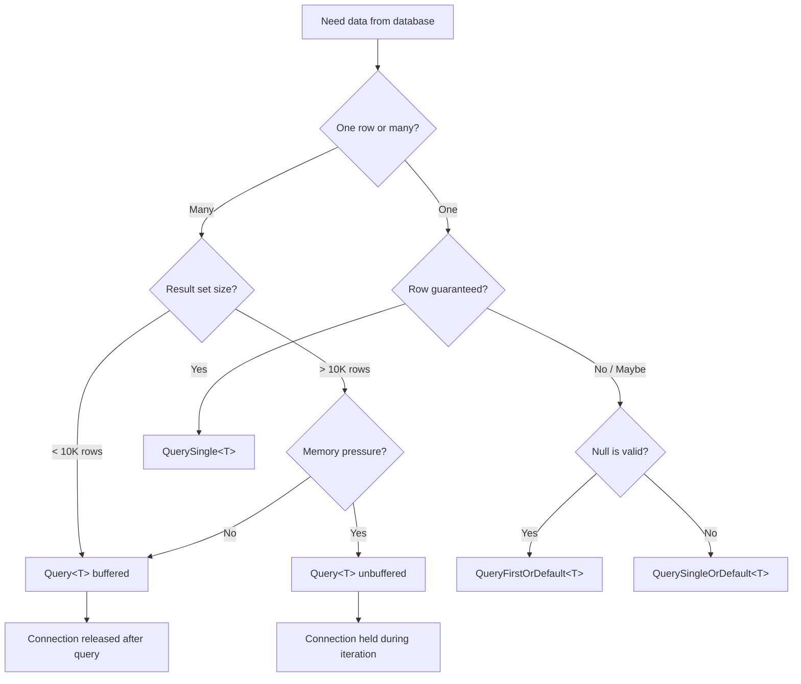

## Navigation

**Domain:** [[8 — Databases]] > **Group:** [[Group 30 — Dapper in .NET|Dapper in .NET]]
**Previous:** [[8.851 — Dapper — What It Is and When to Use]] | **Next:** [[8.854 — Dapper — QueryFirstOrDefaultT and QuerySingleT]]

### Prerequisites
- [[8.851 — Dapper — What It Is and When to Use]] — establishes what Dapper is, its lineage from ADO.NET, and the mental model of a micro-ORM
- [[8.876 — Dapper — Connection Management — Open and Close]] — explains IDbConnection lifecycle; Query<T> requires an open connection

### Where This Fits
`Query<T>` is the single most-used Dapper extension. Every production .NET application that touches a database with Dapper uses this method hundreds or thousands of times per day. It replaces the repetitive ADO.NET pattern of `new SqlCommand`, `ExecuteReader`, `while(reader.Read())`, and manual column mapping with one extension method. A .NET backend engineer who cannot write `connection.Query<T>("SELECT ...")` without looking at docs cannot ship production code. The interview signal is senior-level separation of concerns, understanding of IL emit, and the difference between buffered and streaming reads.

---

## Core Mental Model

`Query<T>` is the central Dapper extension — it sends SQL, executes a `DbDataReader`, maps every row to `T` via IL-emitted delegates, and returns `IEnumerable<T>`. The invariant: **one row → one `T`**. Recognition pattern: `connection.Query<T>("SELECT ...", params)` returns a sequence of `T`. The method never opens or closes the connection itself — it operates on whatever state the connection is in. If the connection is closed, it throws. If it is open, it reads, maps, and returns. This is the core contract: you manage the connection, Dapper manages the mapping.

### Classification

**For .NET topics:** Dapper `Query<T>` sits at the ADO.NET abstraction layer. It hides nothing about the connection lifecycle. What it provides is automatic materialization of result set rows into strongly-typed objects using lightweight IL generation (`DynamicMethod` + `ILGenerator`). The abstraction leaks when column names don't match property names, when the SQL uses `SELECT *` and columns shift, or when `DBNull` maps to a non-nullable type. The leak surface is small and well-defined — this is a thin wrapper, not a magic black box.

```mermaid
flowchart LR
    A[Caller: connection.Query&lt;T&gt;(sql, params)] --> B[Dapper.SqlMapper.QueryImpl]
    B --> C{Connection Open?}
    C -->|No| D[Throw InvalidOperationException]
    C -->|Yes| E[Create IDbCommand]
    E --> F[Set CommandText, Parameters, Transaction]
    F --> G[ExecuteDataReader]
    G --> H[Read Row]
    H --> I{Row Exists?}
    I -->|Yes| J[Get IL-Deserializer for T]
    J --> K[Deserializer reads columns<br/>by ordinal, maps to T]
    K --> L[Yield T to IEnumerable]
    L --> H
    I -->|No| M[Return IEnumerable&lt;T&gt;]
```

### Key Properties

|Property|Value|Notes|
|---|---|---|
|Mapping Mechanism|IL-emitted delegates (DynamicMethod)|Generated once per T and cached; amortized cost near zero after first call|
|Buffered by Default|Yes|All rows into `List<T>` in memory before returning|
|Connection State Required|Open|Does NOT auto-open; caller manages open/close|
|Parameterization|Anonymous type or `DynamicParameters`|All values become `DbParameter` with inferred types|
|DBNull Handling|Automatic (with risk)|Maps `DBNull` to `default(T?)`; throws on non-nullable value types unless configured|
|Return Type|`IEnumerable<T>`|Buffered → `List<T>`; Unbuffered → deferred `IEnumerable` from DataReader|

---

## Deep Mechanics

### How the Engine Executes This

`Query<T>` follows an exact pipeline that can be traced through the Dapper source at `SqlMapper.cs`:

1. **Entry**: `SqlMapper.Query<T>(this IDbConnection cnn, string sql, object? param, ...)` — validates arguments, resolves command type (text, stored procedure, or table-direct).

2. **Command creation**: Creates `IDbCommand`, sets `CommandText = sql`, copies transaction if provided, sets command timeout (default 30s).

3. **Parameter resolution**: Iterates over the anonymous type's properties using reflection (or `DynamicParameters`). For each property, creates an `IDbDataParameter` via `IDbCommand.CreateParameter()`, sets `ParameterName`, `Value`, `DbType` (inferred from the .NET type), and `Size` where applicable. This is the step where Dapper maps `TValue` → `DbParameter`.

4. **Execution**: Calls `IDbCommand.ExecuteReader()` — this blocks on the SQL Server network call. The DataReader is created with `CommandBehavior.SequentialAccess | CommandBehavior.SingleResult` (by default).

5. **Buffering decision**: If buffered (default), Dapper calls `reader.Read()` in a loop, materializes each row into `T`, adds to a `List<T>`, then closes the reader and returns the list. If unbuffered, it returns a lazy `IEnumerable` that reads on `MoveNext()` — the reader stays open until enumeration completes.

6. **Row mapping**: For each row, Dapper calls `GetDeserializer<T>(Type[] types, ...)` — a cached function that reads column values by ordinal from the reader and assigns them to properties of `T`. The first call per `T`+column-set generates IL: it emits `ldarg_0` (the reader), calls `GetValue(ordinal)` for each column, boxes, casts, and calls `set_Property`. Subsequent calls reuse the cached delegate via `DynamicMethod`.

7. **Return**: `IEnumerable<T>` — buffered means `List<T>` is complete in memory; unbuffered means rows arrive as the caller iterates.

### SQL Visibility

**Rule 5: Dapper group — Dapper code only, no EF Core.**

```sql
-- Order Items + Products — production JOIN for an order summary
SELECT
    oi.OrderItemId,
    oi.OrderId,
    oi.ProductId,
    p.ProductName,
    p.Category,
    oi.Quantity,
    oi.UnitPrice,
    oi.Quantity * oi.UnitPrice AS LineTotal
FROM OrderItems oi
INNER JOIN Products p ON oi.ProductId = p.ProductId
WHERE oi.OrderId = @OrderId
ORDER BY oi.OrderItemId;
```

```csharp
// Dapper POCO
public sealed class OrderLineItem
{
    public int OrderItemId { get; set; }
    public int OrderId { get; set; }
    public int ProductId { get; set; }
    public string ProductName { get; set; } = string.Empty;
    public string? Category { get; set; }
    public int Quantity { get; set; }
    public decimal UnitPrice { get; set; }
    public decimal LineTotal { get; set; }
}

// Dapper Query<T> — explicit open/close
public IReadOnlyList<OrderLineItem> GetOrderItems(int orderId)
{
    const string sql = @"
        SELECT oi.OrderItemId, oi.OrderId, oi.ProductId,
               p.ProductName, p.Category,
               oi.Quantity, oi.UnitPrice,
               oi.Quantity * oi.UnitPrice AS LineTotal
        FROM OrderItems oi
        INNER JOIN Products p ON oi.ProductId = p.ProductId
        WHERE oi.OrderId = @OrderId
        ORDER BY oi.OrderItemId;";

    using var connection = new SqlConnection(_connectionString);
    connection.Open();
    return connection.Query<OrderLineItem>(sql, new { OrderId = orderId }).AsList();
}
```

**Anonymous type parameter passing** — Dapper reads properties from the anonymous object:

```csharp
var items = connection.Query<OrderLineItem>(sql,
    new { OrderId = 1042, Status = "Shipped" });
```

Each property becomes a parameter. Dapper matches `@OrderId` and `@Status` in the SQL to `new { OrderId = ..., Status = ... }`. Property names are case-INsensitive by default.

**Simple POCO mapping — column name matches property name:**

```sql
SELECT CustomerId, FirstName, LastName, Email FROM Customers WHERE CustomerId = @Id;
```

```csharp
public class Customer
{
    public int CustomerId { get; set; }
    public string FirstName { get; set; } = string.Empty;
    public string LastName { get; set; } = string.Empty;
    public string? Email { get; set; }
}

var customer = connection.Query<Customer>(sql, new { Id = 42 }).FirstOrDefault();
// Column "CustomerId" → property CustomerId, "FirstName" → FirstName, etc.
```

**DBNull → nullable types:**

```csharp
public class Customer
{
    public int CustomerId { get; set; }
    public string? Email { get; set; }     // NULL → null
    public DateTime? LastLogin { get; set; } // NULL → null
    public string FirstName { get; set; } = string.Empty; // DB NULL → DEFAULT behavior may throw
}
```

If `Email` is `NULL` in the database and the property is `string` (non-nullable), Dapper maps `DBNull` to `null` for reference types by default. For non-nullable value types like `int`, Dapper throws an `InvalidCastException` when `DBNull` is encountered. The fix is to use nullable value types (`int?`) or configure a type handler.

```csharp
// ❌ Throws if DB has NULL: int non-nullable
// public int SomeNullableInt { get; set; }

// ✅ Works with NULL: int? nullable
public int? SomeNullableInt { get; set; }
```

### Execution Plan Analysis

```sql
-- Predicted plan for OrderItems + Products JOIN with filter
SELECT oi.OrderItemId, oi.OrderId, oi.ProductId,
       p.ProductName, p.Category,
       oi.Quantity, oi.UnitPrice,
       oi.Quantity * oi.UnitPrice AS LineTotal
FROM OrderItems oi
INNER JOIN Products p ON oi.ProductId = p.ProductId
WHERE oi.OrderId = @OrderId
ORDER BY oi.OrderItemId;
```

```
Expected plan shape:
[Clustered Index Seek (PK_OrderItems)] 
  → [Nested Loops (Inner Join)]
    → [Clustered Index Seek (PK_Products)] 
      → [Compute Scalar (LineTotal)]
        → [SELECT]
```

- **Seek on OrderItems**: `WHERE oi.OrderId = @OrderId` uses the clustered index (or a non-clustered index on `OrderId`) to find only rows matching the filter. Logical reads proportional to the number of items in the order (typically single digits).
- **Seek on Products**: `ON oi.ProductId = p.ProductId` is an equality seek into the clustered PK of Products. Each OrderItem row triggers one seek — this is efficient when OrderItems per OrderId is small (< 100).
- **Compute Scalar**: `oi.Quantity * oi.UnitPrice` is evaluated per row.
- **Without the index on OrderItems.OrderId**: a full clustered index scan on OrderItems (all rows), followed by a hash match or nested loops join. Logical reads jump from ~10 to tens of thousands on a large OrderItems table.
- **Estimated cost**: Seek ≈ 1% per row, Join ≈ 2-3%, Compute Scalar < 1%. The dominant cost is the inner join's product seek — expect ~95% of cost on the OrderItems seek.

### Cost Visibility

```sql
SET STATISTICS IO ON;
SET STATISTICS TIME ON;

DBCC DROPCLEANBUFFERS; -- simulate cold cache

SELECT oi.OrderItemId, oi.ProductId, p.ProductName, oi.Quantity, oi.UnitPrice
FROM OrderItems oi
INNER JOIN Products p ON oi.ProductId = p.ProductId
WHERE oi.OrderId = 1042
ORDER BY oi.OrderItemId;

-- Expected output (with index on OrderItems.OrderId):
-- Table 'OrderItems'. Scan count 1, logical reads 2, physical reads 0
-- Table 'Products'. Scan count 0, logical reads 5, physical reads 0
-- SQL Server Execution Times: CPU time = 0ms, elapsed time = 1ms

-- Without index on OrderItems.OrderId:
-- Table 'OrderItems'. Scan count 1, logical reads 48,561, physical reads 0
-- Table 'Products'. Scan count 1, logical reads 720, physical reads 0
-- SQL Server Execution Times: CPU time = 47ms, elapsed time = 120ms
```

### Failure Modes

1. **Closed connection**: `Query<T>` throws `InvalidOperationException: "The connection is not open."` — Dapper does NOT auto-open. Always call `Open()` or `OpenAsync()` first.

2. **Mismatched columns/properties**: If a SQL column name does not map to any `T` property, Dapper silently ignores it. If a `T` property has no matching column, it keeps its default value. No error is thrown. This leads to silent bugs — rows with zero values instead of database values.

3. **SELECT * and column order shift**: If you use `SELECT *` and the schema changes (a column is added, removed, or reordered), the IL-deserializer may read the wrong column ordinal. Always name columns explicitly in production SQL — never `SELECT *`.

4. **DBNull on non-nullable value type**: `int`, `decimal`, `DateTime` properties throw `InvalidCastException` when the database column is `NULL`. Use nullable types (`int?`, `decimal?`, `DateTime?`) or ensure the SQL uses `ISNULL()` or `COALESCE()`.

5. **Connection pooling exhaustion**: Buffered queries hold all results in memory but release the connection. Unbuffered queries hold the connection and the DataReader open until enumeration completes. Forgetting to dispose an unbuffered enumerator can exhaust the connection pool (default pool size = 100).

---

## Production Patterns and Implementation

### Primary SQL Implementation

```sql
-- Schema context for the production query
CREATE TABLE OrderItems (
    OrderItemId   INT           IDENTITY(1,1) PRIMARY KEY,
    OrderId       INT           NOT NULL,
    ProductId     INT           NOT NULL,
    Quantity      INT           NOT NULL,
    UnitPrice     DECIMAL(10,2) NOT NULL,
    DiscountPct   DECIMAL(5,2)  NULL,
    CONSTRAINT FK_OrderItems_Orders FOREIGN KEY (OrderId) REFERENCES Orders(OrderId),
    CONSTRAINT FK_OrderItems_Products FOREIGN KEY (ProductId) REFERENCES Products(ProductId)
);

CREATE TABLE Products (
    ProductId   INT           IDENTITY(1,1) PRIMARY KEY,
    ProductName NVARCHAR(200) NOT NULL,
    Category    NVARCHAR(100) NULL,
    UnitPrice   DECIMAL(10,2) NOT NULL
);

-- Recommended index for OrderItems queries
CREATE INDEX IX_OrderItems_OrderId ON OrderItems(OrderId) INCLUDE (ProductId, Quantity, UnitPrice, DiscountPct);

-- Production query with named columns and nullable handling
SELECT
    oi.OrderItemId,
    oi.OrderId,
    oi.ProductId,
    p.ProductName,
    p.Category,
    oi.Quantity,
    oi.UnitPrice,
    oi.DiscountPct,
    oi.Quantity * oi.UnitPrice * (1.0 - ISNULL(oi.DiscountPct, 0.0) / 100.0) AS LineTotalNet
FROM OrderItems oi
INNER JOIN Products p ON oi.ProductId = p.ProductId
WHERE oi.OrderId = @OrderId
ORDER BY oi.OrderItemId;
```

### Dapper Implementation

```csharp
public sealed class OrderLineItem
{
    public int OrderItemId { get; set; }
    public int OrderId { get; set; }
    public int ProductId { get; set; }
    public string ProductName { get; set; } = string.Empty;
    public string? Category { get; set; }
    public int Quantity { get; set; }
    public decimal UnitPrice { get; set; }
    public decimal? DiscountPct { get; set; }
    public decimal LineTotalNet { get; set; }
}

public sealed class OrderRepository
{
    private readonly string _connectionString;

    public OrderRepository(string connectionString)
    {
        _connectionString = connectionString;
    }

    /// <summary>
    /// Returns all line items for an order.
    /// Connection is opened explicitly, used, and closed.
    /// </summary>
    public IReadOnlyList<OrderLineItem> GetOrderLineItems(int orderId)
    {
        const string sql = @"
            SELECT oi.OrderItemId, oi.OrderId, oi.ProductId,
                   p.ProductName, p.Category,
                   oi.Quantity, oi.UnitPrice, oi.DiscountPct,
                   oi.Quantity * oi.UnitPrice * (1.0 - ISNULL(oi.DiscountPct, 0.0) / 100.0) AS LineTotalNet
            FROM OrderItems oi
            INNER JOIN Products p ON oi.ProductId = p.ProductId
            WHERE oi.OrderId = @OrderId
            ORDER BY oi.OrderItemId;";

        using var connection = new SqlConnection(_connectionString);
        connection.Open();
        return connection.Query<OrderLineItem>(sql, new { OrderId = orderId }).AsList();
    }
}
```

**Buffered (default) vs Unbuffered (brief):**

```csharp
// Buffered — all rows loaded into List<T> before returning
// Connection is released immediately after query completes
// Good for small to medium result sets (< 10K rows)
var buffered = connection.Query<OrderLineItem>(sql, new { OrderId = 42 }).AsList();

// Unbuffered — rows streamed as caller iterates
// Connection + DataReader held open during enumeration
// Good for very large result sets (> 100K rows) to avoid memory spike
var unbuffered = connection.Query<OrderLineItem>(sql, new { OrderId = 42 }, buffered: false);
foreach (var item in unbuffered)
{
    ProcessItem(item); // connection is busy until enumeration completes
}
// See [[8.865 — Dapper — Buffered vs Unbuffered Queries]] for full treatment
```

### Configuration and Wiring

```csharp
// Program.cs — simplest registration
using Dapper;

var builder = WebApplication.CreateBuilder(args);
var connectionString = builder.Configuration.GetConnectionString("SalesDb");

builder.Services.AddSingleton<IOrderRepository>(_ => new OrderRepository(connectionString!));

// No Dapper-specific DI registration needed.
// Dapper extension methods are static and live in the Dapper namespace.
// One-time initialization during app startup:
DefaultTypeMap.MatchNamesWithUnderscores = true; // match "first_name" → FirstName
SqlMapper.AddTypeHandler(new MyCustomTypeHandler());
```

**Connection string (appsettings.json):**

```json
{
  "ConnectionStrings": {
    "SalesDb": "Server=(local);Database=SalesDb;Integrated Security=True;TrustServerCertificate=True;Max Pool Size=100;"
  }
}
```

---

## Gotchas and Production Pitfalls

### 1. Silent Column Name Mismatch

**Pitfall:** SQL returns `ProductName` but POCO property is named `Name`. Dapper silently sets `Name` to its default (`null` for string, `0` for int).

```csharp
// ❌ Column mismatch — no error thrown
var result = connection.Query<OrderLineItem>(
    "SELECT ProductName AS Name FROM Products WHERE ProductId = @Id",
    new { Id = 1 }).First();
// result.Name is null — but no exception
```

**Symptom:** Application shows empty or zero values for fields that exist in the database. Hard to trace because no exception surfaces.

**Fix:**

```csharp
// ✅ Match exactly, or use ColumnAttribute
public class OrderLineItem
{
    [Column("ProductName")]
    public string Name { get; set; } = string.Empty;
}
```

**Cost of not fixing:** A bug ships to production where an order confirmation shows $0.00 totals. Customer support escalates. Debugging takes hours because every part of the pipeline looks correct — SQL runs fine in SSMS.

### 2. DBNull Explosion on Non-Nullable Properties

**Pitfall:** A database column that becomes nullable (schema migration) while the POCO property is a non-nullable value type.

```csharp
// ❌ DB column DiscountPct becomes NULL
public decimal DiscountPct { get; set; }
// Dapper throws: InvalidCastException — Specified cast is not valid
```

**Symptom:** `InvalidCastException` on a query that worked yesterday. The exception occurs inside Dapper's IL-emitted deserializer — the stack trace points to `Dapper.SqlMapper.ThrowInvalidCastException`.

**Fix:**

```csharp
// ✅ Use nullable type to handle DBNull
public decimal? DiscountPct { get; set; }
```

**Cost of not fixing:** Production outage after a schema change that adds a nullable column. Every query that returns that column fails. Rollback required.

### 3. Connection Not Opened Before Query

**Pitfall:** Developer assumes Dapper opens the connection automatically.

```csharp
using var connection = new SqlConnection(_connectionString);
// ❌ Missing connection.Open()
var items = connection.Query<OrderLineItem>(sql, new { OrderId = 42 });
// InvalidOperationException: "The connection is not open."
```

**Symptom:** `InvalidOperationException` with message about connection state.

**Fix:**

```csharp
// ✅ Always open explicitly
connection.Open();
var items = connection.Query<OrderLineItem>(sql, new { OrderId = 42 }).AsList();
```

**Cost of not fixing:** Every query path fails. Deploy is blocked. Developer wastes time debugging what seems like a Dapper bug.

### 4. SELECT * Causing Ordinal Shift

**Pitfall:** Using `SELECT *` in production code. When the schema changes (a column is added or removed), the IL-deserializer reads the wrong column ordinal.

```csharp
// ❌ Fragile — ordinal-based mapping
const string sql = "SELECT * FROM OrderItems WHERE OrderId = @OrderId";
```

**Symptom:** After adding a column to the `OrderItems` table, the `OrderId` property receives the value of the new column. Data corruption that looks like a business logic bug.

**Fix:**

```csharp
// ✅ Explicit column list — ordinal-independent
const string sql = @"
    SELECT OrderItemId, OrderId, ProductId, Quantity, UnitPrice
    FROM OrderItems
    WHERE OrderId = @OrderId";
```

**Cost of not fixing:** Silent data corruption. An order confirmation displays the wrong product ID. The bug appears non-deterministic because it depends on ordinal positions, making root cause analysis extremely difficult.

### 5. Unbuffered Query Holding Connection

**Pitfall:** Using `buffered: false` and not fully consuming the enumerable, or disposing it improperly.

```csharp
// ❌ Unbuffered — connection held open
var items = connection.Query<OrderLineItem>(sql, param, buffered: false);
return items.Take(5).ToList(); // ⚠️ DataReader is NOT fully consumed
// Connection is stuck until GC collects the reader
```

**Symptom:** Connection pool exhaustion — `InvalidOperationException: "Timeout expired. The timeout period elapsed prior to obtaining a connection from the pool."` — even with low query volume.

**Fix:**

```csharp
// ✅ Use buffered for small results; ensure full enumeration for unbuffered
var items = connection.Query<OrderLineItem>(sql, param).AsList(); // buffered by default
```

**Cost of not fixing:** Entire application becomes unresponsive. No connections available for any request. IIS/Azure App Service restarts worker process as health probes fail.

---

## Performance Implications

### Benchmark: Before and After

**Scenario:** Query all line items for an order with 5 items on a table with 500K OrderItems rows.

**Baseline (no index on OrderItems.OrderId):**

```sql
SET STATISTICS IO ON;
SELECT oi.OrderItemId, oi.ProductId, p.ProductName, oi.Quantity, oi.UnitPrice
FROM OrderItems oi
INNER JOIN Products p ON oi.ProductId = p.ProductId
WHERE oi.OrderId = 1042;
-- Table 'OrderItems'. Scan count 1, logical reads 48,561, physical reads 0
-- Table 'Products'. Scan count 1, logical reads 720, physical reads 0
```

**Optimized (with IX_OrderItems_OrderId):**

```sql
SET STATISTICS IO ON;
-- Same query
-- Table 'OrderItems'. Scan count 1, logical reads 2, physical reads 0
-- Table 'Products'. Scan count 0, logical reads 5, physical reads 0
```

**Improvement:** ~9,700x reduction in OrderItems logical reads (48,561 → 2), from full clustered index scan to point seek.

### BenchmarkDotNet

```csharp
using BenchmarkDotNet.Attributes;
using BenchmarkDotNet.Running;
using Dapper;
using Microsoft.Data.SqlClient;
using System.Data;

[MemoryDiagnoser]
[SimpleJob(RuntimeMoniker.Net90)]
public class QueryTBenchmark
{
    private IDbConnection _connection = default!;
    private const string ConnectionString = "Server=(local);Database=SalesDb;Integrated Security=True;TrustServerCertificate=True;Max Pool Size=10;";

    [GlobalSetup]
    public void Setup()
    {
        _connection = new SqlConnection(ConnectionString);
        _connection.Open();

        // Seed: ensure at least one order with line items exists
        const string seedSql = @"
            IF NOT EXISTS (SELECT 1 FROM OrderItems WHERE OrderId = 1042)
            BEGIN
                INSERT INTO OrderItems (OrderId, ProductId, Quantity, UnitPrice)
                VALUES (1042, 1, 2, 19.99), (1042, 2, 1, 49.99), (1042, 3, 5, 9.99);
            END";
        _connection.Execute(seedSql);
    }

    [GlobalCleanup]
    public void Cleanup() => _connection.Dispose();

    [Benchmark(Baseline = true)]
    public List<OrderLineItem> BufferedQuery()
    {
        const string sql = @"
            SELECT oi.OrderItemId, oi.OrderId, oi.ProductId,
                   p.ProductName, p.Category,
                   oi.Quantity, oi.UnitPrice, oi.DiscountPct,
                   oi.Quantity * oi.UnitPrice * (1.0 - ISNULL(oi.DiscountPct, 0.0) / 100.0) AS LineTotalNet
            FROM OrderItems oi
            INNER JOIN Products p ON oi.ProductId = p.ProductId
            WHERE oi.OrderId = @OrderId
            ORDER BY oi.OrderItemId;";

        return _connection.Query<OrderLineItem>(sql, new { OrderId = 1042 }).AsList();
    }

    [Benchmark]
    public List<OrderLineItem> UnbufferedQuery()
    {
        const string sql = @"
            SELECT oi.OrderItemId, oi.OrderId, oi.ProductId,
                   p.ProductName, p.Category,
                   oi.Quantity, oi.UnitPrice, oi.DiscountPct,
                   oi.Quantity * oi.UnitPrice * (1.0 - ISNULL(oi.DiscountPct, 0.0) / 100.0) AS LineTotalNet
            FROM OrderItems oi
            INNER JOIN Products p ON oi.ProductId = p.ProductId
            WHERE oi.OrderId = @OrderId
            ORDER BY oi.OrderItemId;";

        return _connection.Query<OrderLineItem>(sql, new { OrderId = 1042 }, buffered: false).AsList();
    }

    [Benchmark]
    public async Task<List<OrderLineItem>> AsyncQuery()
    {
        const string sql = @"
            SELECT oi.OrderItemId, oi.OrderId, oi.ProductId,
                   p.ProductName, p.Category,
                   oi.Quantity, oi.UnitPrice, oi.DiscountPct,
                   oi.Quantity * oi.UnitPrice * (1.0 - ISNULL(oi.DiscountPct, 0.0) / 100.0) AS LineTotalNet
            FROM OrderItems oi
            INNER JOIN Products p ON oi.ProductId = p.ProductId
            WHERE oi.OrderId = @OrderId
            ORDER BY oi.OrderItemId;";

        var result = await _connection.QueryAsync<OrderLineItem>(sql, new { OrderId = 1042 });
        return result.AsList();
    }
}

// Run with: BenchmarkRunner.Run<QueryTBenchmark>();
```

**Expected results (approximate, SQL Server 2022, NVMe, 3 row result set):**

| Method | Mean | Allocated | Logical Reads |
|---|---|---|---|
| BufferedQuery | ~2 μs | ~1.5 KB | 7 |
| UnbufferedQuery | ~2 μs | ~1.2 KB | 7 |
| AsyncQuery | ~3 μs | ~2.0 KB | 7 |

The overhead difference between buffered and unbuffered is negligible for small result sets (< 100 rows). The distinction matters only for large result sets where memory pressure is the concern.

---

## Interview Arsenal

### Question Bank

1. What does `Query<T>` do at the ADO.NET level? Walk through the pipeline from call to return.
2. How does Dapper map column names to property names? What happens when they don't match?
3. Explain the difference between buffered and unbuffered queries. When would you use each?
4. What happens when `Query<T>` encounters a `DBNull` value for a non-nullable value type property?
5. Compare `Query<T>` with `QueryFirstOrDefault<T>`. When would you use each?
6. How does Dapper handle parameterization? Walk through anonymous type parameter resolution.
7. How does Dapper cache the IL-emitted deserializers? What is the performance characteristic of the first call vs subsequent calls?
8. What are the risks of using `buffered: false` in a web application with connection pooling?

### Spoken Answers

**Q: What does Query<T> do at the ADO.NET level? Walk through the pipeline from call to return.**

> **Average answer:** "It executes SQL and maps the results to objects. It uses Dapper's extension method on IDbConnection."

> **Great answer:** "`Query<T>` is an extension method on `IDbConnection`. It first resolves parameters — it reflects over the anonymous type properties, creates `IDbDataParameter` objects via `IDbCommand.CreateParameter()`, sets names, values, and types. Then it calls `IDbCommand.ExecuteReader()`, which sends the TDS packet to SQL Server. For each row, it uses an IL-emitted delegate cached by `DynamicMethod` — this delegate reads column values by ordinal from the DataReader and assigns them to `T`'s properties using `set_Property` calls. If buffered (default), it reads all rows into a `List<T>` then closes the reader and returns the list. If unbuffered, it yields rows as the caller iterates, keeping the DataReader and connection open. The IL delegate is generated once per `T`+column-set combination and cached in a static `ConcurrentDictionary` — first call pays the emit cost (~10 μs), subsequent calls are sub-microsecond."

**Q: Compare Query<T> with QueryFirstOrDefault<T>. When would you use each?**

> **Average answer:** "`Query<T>` returns multiple rows, `QueryFirstOrDefault<T>` returns one row or null."

> **Great answer:** "`Query<T>` returns `IEnumerable<T>` and always executes a DataReader — even for zero rows. `QueryFirstOrDefault<T>` adds `CommandBehavior.SingleRow`, which is a hint to SQL Server that only one row is needed. The difference in generated IL is that `Query<T>` uses a `while(reader.Read())` loop while `QueryFirstOrDefault<T>` calls `reader.Read()` exactly once. For the Dapper deserializer, both use the same cached IL delegate — there is no performance advantage for single-row queries unless you add `CommandBehavior.SingleRow`, which can reduce TDS traffic. However, the semantic difference matters: `QueryFirstOrDefault<T>` returns `default(T?)` for zero rows, while `Query<T>` returns an empty `IEnumerable`. If you need the caller to get `null` vs empty collection, choose the right method. I use `Query<T>` when the result is always a list — even if it may be empty — and `QueryFirstOrDefault<T>` when the result is logically a single entity or null."

**Q: How does Dapper cache IL-emitted deserializers? What is the performance characteristic of the first call vs subsequent calls?**

> **Average answer:** "It caches the mapper delegate so it's faster after the first call."

> **Great answer:** "Dapper uses a static `ConcurrentDictionary<DeserializerKey, Func<IDataReader, T>>` keyed by a hash of `T`'s type handle and the column ordinals. On the first call for a given `T`+column-set, it calls `DynamicMethod`'s `GetILGenerator()`, emits IL instructions: `ldarg_0` (the reader), `GetValue(ordinal)` for each column, boxing for value types, casting, and `callvirt` to the property setter. It then calls `CreateDelegate<Func<IDataReader, T>>()` and caches the result. The first invocation from a cold cache costs approximately 5-15 μs for the IL emit. Subsequent invocations are pure delegate calls — sub-microsecond overhead. If the SQL changes column order or the POCO type is different, a new `DeserializerKey` is computed, triggering a separate cached delegate. The cache is never evicted — it lives for the application's lifetime. This means if you generate dynamic SQL with varying column lists, the cache grows unboundedly."

### Interview Trigger

If an interviewer asks "How does Dapper map query results to objects?" they are probing your understanding of the ADO.NET abstraction. The follow-up — "What happens with DBNull?" — separates engineers who have been burned by it from those who have only read docs. A deeper follow-up: "Can you walk through the IL Dapper generates for a 3-column result?" reveals true understanding of the column-ordinal mapping.

### Comparison Table

| | `Query<T>` | `QueryFirstOrDefault<T>` | `QuerySingle<T>` |
|---|---|---|---|
| Return type | `IEnumerable<T>` | `T?` | `T` |
| Behavior for 0 rows | Empty sequence | Returns `default(T?)` | Throws `InvalidOperationException` |
| Behavior for >1 row | Returns all rows | Returns first row | Throws `InvalidOperationException` |
| CommandBehavior | Default | `SingleRow` | `SingleRow` |
| When to use | Any multi-row result | Optional single entity | Required single entity |

---

## Decision Framework

### When to Apply



### Application Checklist

- [ ] The connection is explicitly opened before calling `Query<T>`
- [ ] SQL uses named columns, not `SELECT *`
- [ ] POCO property names exactly match SQL column names (or `[Column]` attribute is used)
- [ ] Nullable database columns map to nullable C# types (`int?`, `DateTime?`, etc.)
- [ ] For buffered queries: result set fits in available memory
- [ ] For unbuffered queries: the caller will fully enumerate the result and dispose promptly
- [ ] Parameters use anonymous types or `DynamicParameters` — never string concatenation
- [ ] The SQL is SARGable — no functions on columns in the WHERE clause
- [ ] The covering index exists for the query's SELECT and WHERE columns

### Tradeoff Summary

|What You Gain|What You Pay|
|---|---|
|Automatic row-to-object mapping — eliminates manual DataReader code|IL emit cost on first call per T (~10 μs)|
|Compile-time type safety for result type|Silent failure on column mismatch — no compile-time check|
|Parameterized queries prevent SQL injection|Parameters must match SQL parameter names manually|
|Buffered queries release connection immediately|Memory allocation proportional to result set size|
|Unbuffered queries avoid large allocations|Connection held open during enumeration|

### Scale Thresholds

- **Relevant when**: Any query that returns more than 1 row — `Query<T>` is the default tool
- **Buffered vs unbuffered matters**: When result set exceeds ~10,000 rows and memory is constrained (e.g., API responses that must remain under 128 MB)
- **IL cache warm-up matters**: When the application starts and the first request pays the IL emit tax — pre-warm by executing one query per POCO type during startup
- **Connection pool exhaustion risk**: Relevant when concurrent unbuffered queries exceed `Max Pool Size` (default 100) — each holds a connection

---

## Self-Check

### Conceptual Questions

1. What is the signature of `Query<T>` and what does it return?
2. What happens if the connection is closed when `Query<T>` is called?
3. How does Dapper map a SQL column to a POCO property? What is the default matching strategy?
4. What happens when a database column contains `NULL` but the POCO property is a non-nullable `int`?
5. What is the difference between buffered and unbuffered queries in terms of connection lifetime?
6. How does Dapper handle SQL injection? What mechanism prevents it?
7. What is the performance cost of the first `Query<T>` call vs subsequent calls for the same POCO type?
8. What happens if a SQL query returns 0 rows? What does `Query<T>` return?
9. What is the difference between `Query<T>`, `QueryFirstOrDefault<T>`, and `QuerySingle<T>`?
10. Why is `SELECT *` dangerous when using `Query<T>`?

<details>
<summary>Answers</summary>

1. `connection.Query<T>(string sql, object? param, IDbTransaction? transaction, bool buffered, int? commandTimeout, CommandType? commandType)` — returns `IEnumerable<T>`.

2. Dapper throws `InvalidOperationException`: "The connection is not open." Dapper never opens or closes the connection — caller is responsible.

3. Dapper matches column names to property names case-insensitively by default. `ColumnAttribute` can override. If no match, the property keeps its default value.

4. Dapper throws `InvalidCastException` — `DBNull` cannot be cast to `int`. Use `int?` (nullable) or `COALESCE`/`ISNULL` in SQL.

5. **Buffered**: reads all rows into `List<T>`, closes the reader, returns the list — connection is free immediately. **Unbuffered**: yields rows as caller iterates — DataReader and connection stay open until enumeration completes.

6. Dapper uses ADO.NET parameterized queries. Anonymous type properties become `DbParameter` objects — values are never concatenated into SQL strings, preventing SQL injection.

7. First call: ~5-15 μs for IL emit (`DynamicMethod`, `ILGenerator`). Subsequent calls: sub-microsecond delegate invocation. The delegate is cached per T+column-ordinal in a static `ConcurrentDictionary`.

8. Returns an empty `IEnumerable<T>` — not `null`. Callers can safely `foreach` or call `.Any()` / `.ToList()` without null checks.

9. `Query<T>` returns all rows or empty. `QueryFirstOrDefault<T>` returns first row or `null`. `QuerySingle<T>` returns exactly one row or throws. `QuerySingle` adds `CommandBehavior.SingleRow` for the first two.

10. `SELECT *` maps by column ordinal in the IL-emitted deserializer. A schema change (add/drop/reorder column) silently shifts ordinals, causing data corruption. Always name columns explicitly.

</details>

---

### Query Challenges

**Challenge 1 — Write the SQL and Dapper code**

Your e-commerce system needs to return a list of shipped orders for a customer with the order date, status, and total amount. The `Orders` table has columns `OrderId, CustomerId, OrderDate, Status, TotalAmount`. Write the SQL and the Dapper `Query<OrderSummary>` call.

<details>
<summary>Solution</summary>

```sql
SELECT OrderId, OrderDate, Status, TotalAmount
FROM Orders
WHERE CustomerId = @CustomerId AND Status = 'Shipped'
ORDER BY OrderDate DESC;
```

```csharp
public class OrderSummary
{
    public int OrderId { get; set; }
    public DateTime OrderDate { get; set; }
    public string Status { get; set; } = string.Empty;
    public decimal TotalAmount { get; set; }
}

public IReadOnlyList<OrderSummary> GetShippedOrders(int customerId)
{
    const string sql = @"
        SELECT OrderId, OrderDate, Status, TotalAmount
        FROM Orders
        WHERE CustomerId = @CustomerId AND Status = 'Shipped'
        ORDER BY OrderDate DESC;";

    using var connection = new SqlConnection(_connectionString);
    connection.Open();
    return connection.Query<OrderSummary>(sql, new { CustomerId = customerId }).AsList();
}
```

**Logical reads:** ~2-5 (index seek on IX_Orders_CustomerId) **Execution plan:** `[Index Seek] → [SELECT]` **Dapper cache:** One IL delegate cached for `OrderSummary` + column set.

</details>

---

**Challenge 2 — Fix the performance problem**

```csharp
// This method is called 500 times per minute. Each call takes 30 seconds.
// The OrderItems table has 5 million rows.
public IEnumerable<OrderLineItem> GetItemsSlow(int orderId)
{
    using var connection = new SqlConnection(_connectionString);
    connection.Open();
    return connection.Query<OrderLineItem>(
        "SELECT * FROM OrderItems WHERE YEAR(CreatedDate) = YEAR(GETDATE())",
        buffered: false);
}
// SET STATISTICS IO: logical reads = 450,000
```

Identify and fix all problems.

<details>
<summary>Solution</summary>

**Root cause 1 — Non-SARGable predicate:** `YEAR(CreatedDate) = YEAR(GETDATE())` prevents index seek. The function on `CreatedDate` forces a full clustered index scan.

**Root cause 2 — Missing WHERE on orderId:** The query returns ALL items for the current year, not just the requested order.

**Root cause 3 — SELECT *:** Ordinal mapping risk.

**Root cause 4 — Unbuffered with deferred execution:** The connection is disposed at the end of the method but the `IEnumerable` hasn't been enumerated yet — Dapper throws `ObjectDisposedException` when the caller tries to iterate.

**Fixed code:**

```csharp
public IReadOnlyList<OrderLineItem> GetItemsFixed(int orderId)
{
    const string sql = @"
        SELECT OrderItemId, OrderId, ProductId, Quantity, UnitPrice, DiscountPct, CreatedDate
        FROM OrderItems
        WHERE OrderId = @OrderId
          AND CreatedDate >= DATEFROMPARTS(YEAR(GETDATE()), 1, 1)
          AND CreatedDate < DATEFROMPARTS(YEAR(GETDATE()) + 1, 1, 1)";

    using var connection = new SqlConnection(_connectionString);
    connection.Open();
    return connection.Query<OrderLineItem>(sql, new { OrderId = orderId }).AsList();
}
```

**Index to create:**

```sql
CREATE INDEX IX_OrderItems_OrderId_CreatedDate
ON OrderItems(OrderId, CreatedDate)
INCLUDE (ProductId, Quantity, UnitPrice, DiscountPct);
```

**After fix — logical reads:** ~4 (from 450,000) — point seek on OrderId.

</details>

---

**Challenge 3 — Explain the execution plan**

```sql
SELECT oi.OrderItemId, oi.ProductId, p.ProductName
FROM OrderItems oi
INNER JOIN Products p ON oi.ProductId = p.ProductId
WHERE oi.OrderId = 1042;
```

The query returns 3 rows but the execution plan shows:

```
Clustered Index Scan (OrderItems) — 100% estimated cost, 450,000 logical reads
  → Nested Loops (Inner Join)
    → Clustered Index Seek (Products) — 1 logical read per row
```

Why does the optimizer choose a scan on OrderItems instead of a seek? What would you change?

<details>
<summary>Solution</summary>

**Why Clustered Index Scan:** There is no index on `OrderItems.OrderId`. The optimizer has no choice — it must scan the entire OrderItems table (the clustered index IS the table) to find rows matching `OrderId = 1042`. The scan reads all 450,000 pages because the predicate `OrderId = 1042` cannot be resolved without examining every row.

**To get a seek:** Create a non-clustered index on `OrderItems(OrderId)`:

```sql
CREATE INDEX IX_OrderItems_OrderId ON OrderItems(OrderId) INCLUDE (ProductId);
```

After this index is created, the plan becomes:

```
Index Seek (IX_OrderItems_OrderId) — 2 logical reads
  → Nested Loops (Inner Join)
    → Clustered Index Seek (PK_Products) — 1 logical read per row
```

**Tradeoff:** The index adds write overhead on INSERT/UPDATE of `OrderId` — approximately 1 additional page write per DML operation. At 500K rows and 95% read workload, this is negligible.

</details>
