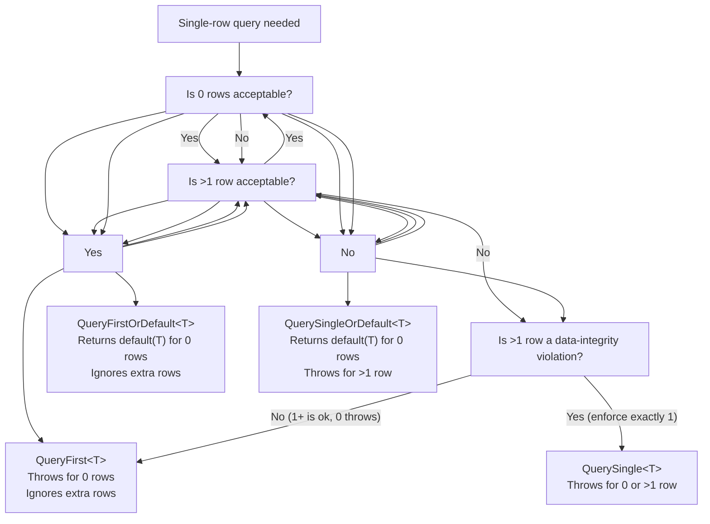

# 8.854 — Dapper: QueryFirst\<T\>, QueryFirstOrDefault\<T\>, QuerySingle\<T\>, QuerySingleOrDefault\<T\>

## 1. Overview

Dapper provides four single-row-returning methods as companions to the multi-row `Query<T>`. These methods are semantically distinct — they encode **expectations about cardinality** directly in the method name. Choosing the wrong variant is a common source of subtle bugs and runtime exceptions.

| Method | Returns | Throws if zero rows | Throws if >1 row |
|---|---|---|---|
| `QueryFirst<T>` | First row | Yes (`InvalidOperationException`) | No (returns first) |
| `QueryFirstOrDefault<T>` | First row or `default(T)` | No | No (returns first) |
| `QuerySingle<T>` | Single row | Yes (`InvalidOperationException`) | Yes (`InvalidOperationException`) |
| `QuerySingleOrDefault<T>` | Single row or `default(T)` | No | Yes (`InvalidOperationException`) |

All four share the same basic signature pattern:

```csharp
T QueryFirst<T>(string sql, object? parameters = null, IDbTransaction? transaction = null, int? commandTimeout = null, CommandType? commandType = null);
```

### What They Have in Common

- They operate on `IDbConnection` (extension methods from `Dapper` namespace).
- They accept the same parameter set: SQL string, parameters object (anonymous type or `DynamicParameters`), transaction, timeout, command type.
- They **do not buffer** — they call `CommandBehavior.SingleRow` or `CommandBehavior.SequentialAccess` internally, then materialise one row.
- They are convenience wrappers over `SqlMapper.QueryImpl`, not separate SQL generators.

### What Makes Them Different

The `Single*` variants enforce an **application-level invariant**: exactly one row is expected. If the database returns a result set with more than one row, the method throws. The `First*` variants are lenient: they tolerate multiple rows and simply return the first one.

This distinction mirrors the `First()` vs `Single()` semantic in LINQ (`Enumerable` / `Queryable`).

## 2. Method Signature Reference

### Synchronous Signatures

```csharp
// QueryFirst — expects at least one row, returns first
static T QueryFirst<T>(this IDbConnection cnn, string sql, object? parameters = null, IDbTransaction? transaction = null, int? commandTimeout = null, CommandType? commandType = null);
static T QueryFirst<T>(this IDbConnection cnn, CommandDefinition command);

// QueryFirstOrDefault — returns default(T) if no rows
static T? QueryFirstOrDefault<T>(this IDbConnection cnn, string sql, object? parameters = null, IDbTransaction? transaction = null, int? commandTimeout = null, CommandType? commandType = null);
static T? QueryFirstOrDefault<T>(this IDbConnection cnn, CommandDefinition command);

// QuerySingle — expects exactly one row, throws otherwise
static T QuerySingle<T>(this IDbConnection cnn, string sql, object? parameters = null, IDbTransaction? transaction = null, int? commandTimeout = null, CommandType? commandType = null);
static T QuerySingle<T>(this IDbConnection cnn, CommandDefinition command);

// QuerySingleOrDefault — expects zero or exactly one row
static T? QuerySingleOrDefault<T>(this IDbConnection cnn, string sql, object? parameters = null, IDbTransaction? transaction = null, int? commandTimeout = null, CommandType? commandType = null);
static T? QuerySingleOrDefault<T>(this IDbConnection cnn, CommandDefinition command);
```

### Async Signatures

```csharp
static Task<T> QueryFirstAsync<T>(this IDbConnection cnn, string sql, object? parameters = null, IDbTransaction? transaction = null, int? commandTimeout = null, CommandType? commandType = null, CancellationToken cancellationToken = default);
static Task<T> QueryFirstAsync<T>(this IDbConnection cnn, CommandDefinition command);

static Task<T?> QueryFirstOrDefaultAsync<T>(this IDbConnection cnn, string sql, object? parameters = null, IDbTransaction? transaction = null, int? commandTimeout = null, CommandType? commandType = null, CancellationToken cancellationToken = default);
static Task<T?> QueryFirstOrDefaultAsync<T>(this IDbConnection cnn, CommandDefinition command);

static Task<T> QuerySingleAsync<T>(this IDbConnection cnn, string sql, object? parameters = null, IDbTransaction? transaction = null, int? commandTimeout = null, CommandType? commandType = null, CancellationToken cancellationToken = default);
static Task<T> QuerySingleAsync<T>(this IDbConnection cnn, CommandDefinition command);

static Task<T?> QuerySingleOrDefaultAsync<T>(this IDbConnection cnn, string sql, object? parameters = null, IDbTransaction? transaction = null, int? commandTimeout = null, CommandType? commandType = null, CancellationToken cancellationToken = default);
static Task<T?> QuerySingleOrDefaultAsync<T>(this IDbConnection cnn, CommandDefinition command);
```

### Dynamic (Non-Generic) Variants

Each method also has a non-generic overload returning `dynamic`:

```csharp
static dynamic QueryFirst(this IDbConnection cnn, string sql, ...);
static dynamic? QueryFirstOrDefault(this IDbConnection cnn, string sql, ...);
static dynamic QuerySingle(this IDbConnection cnn, string sql, ...);
static dynamic? QuerySingleOrDefault(this IDbConnection cnn, string sql, ...);
```

These are rarely used in production code because they lose compile-time type safety. Prefer the generic variants.

## 3. The Four Variants — Detailed Explanation

### 3.1 QueryFirst\<T\>

```csharp
var order = connection.QueryFirst<Order>(
    "SELECT TOP 1 * FROM Orders WHERE OrderId = @id",
    new { id = 10248 });
```

**Behaviour:**
- Executes the SQL statement.
- Calls `SqlDataReader.Read()` once.
- Maps the returned row to `T`.
- If no rows are returned: throws `InvalidOperationException` with message *"Sequence contains no elements"*.
- If multiple rows are returned: returns the **first** row and ignores the rest.

**When to use:**
- You are certain the query will return at least one row.
- You only need the first row even if theoretically multiple could exist.
- Typical: "get the most recent order for a customer" (with `ORDER BY` and `TOP 1`), or "get the current configuration row" when you know the config row exists.

**Risk:**
- A missing database record becomes a runtime exception that MUST be handled. If the row might not exist, use `QueryFirstOrDefault` instead.

### 3.2 QueryFirstOrDefault\<T\>

```csharp
var customer = connection.QueryFirstOrDefault<Customer>(
    "SELECT * FROM Customers WHERE CustomerId = @id",
    new { id = "ALFKI" });

if (customer is null)
    return NotFound();
```

**Behaviour:**
- Executes the SQL statement.
- Calls `SqlDataReader.Read()` once.
- If a row is returned: maps it to `T` and returns it.
- If no row is returned: returns `default(T)` — which is `null` for reference types, `0`/`false` for value types.
- If multiple rows: returns the first row.

**When to use:**
- The row may or may not exist (0 or 1 result).
- You don't care about multiple rows (or your SQL guarantees uniqueness).
- Typical: "get by ID" lookups, "find if exists" checks.

**Important: NULL-return ambiguity for value types:**
For `struct T`, `default(T)` is a valid value (`0`, `false`, `Guid.Empty`). You cannot distinguish "no row returned" from "row returned with value `0`" when using `QueryFirstOrDefault<int>`. Use a nullable wrapper or a different method:

```csharp
// Better: nullable value type
var count = connection.QueryFirstOrDefault<int?>(
    "SELECT COUNT(*) FROM Orders WHERE CustomerId = @id",
    new { id });

if (count is null)
    // no rows — the WHERE matched nothing, which for COUNT(*) is impossible,
    // but for a SUM/MAX query it's possible.
```

### 3.3 QuerySingle\<T\>

```csharp
var order = connection.QuerySingle<Order>(
    "SELECT * FROM Orders WHERE OrderId = @id",
    new { id = 10248 });
```

**Behaviour:**
- Executes the SQL statement.
- Reads all returned rows into a list (internally).
- If exactly one row: maps and returns it.
- If zero rows: throws `InvalidOperationException` (*"Sequence contains no elements"*).
- If more than one row: throws `InvalidOperationException` (*"Sequence contains more than one element"*).

**When to use:**
- You are enforcing an **application invariant**: exactly one row must exist.
- The query column has a `UNIQUE` or `PRIMARY KEY` constraint, so >1 row would represent a data corruption bug.
- Typical: "get by primary key", "get the single settings row from a singleton table".

**Why not use this everywhere?**
- It adds a database round-trip overhead (all rows must be read to verify count = 1).
- If the invariant is guaranteed by a database constraint, the extra safety is redundant — `QueryFirstOrDefault` with a null check achieves the same result more efficiently.

### 3.4 QuerySingleOrDefault\<T\>

```csharp
var order = connection.QuerySingleOrDefault<Order>(
    "SELECT * FROM Orders WHERE OrderId = @id",
    new { id = 10248 });

if (order is null)
    Console.WriteLine("Order not found");
```

**Behaviour:**
- Executes the SQL statement.
- Reads all returned rows into a list.
- If zero rows: returns `default(T)`.
- If exactly one row: maps and returns it.
- If more than one row: throws `InvalidOperationException` (*"Sequence contains more than one element"*).

**When to use:**
- You expect 0 or 1 row but want to **detect data corruption** (duplicate rows where you expect uniqueness).
- The column is supposed to be unique but you don't fully trust the constraint (or it's a non-unique column that should logically return one row).

**Risk:**
- Same value-type ambiguity as `QueryFirstOrDefault`.

## 4. Decision Flow

Use this flowchart when choosing which method to use for a single-row query.



### Quick Reference Table

| Scenario | Rows = 0 | Rows = 1 | Rows > 1 | Method |
|---|---|---|---|---|
| Lookup by PK (guaranteed) | ❌ Throw | ✅ Return | ❌ Shouldn't happen, but throws | `QuerySingle<T>` |
| Lookup by PK (maybe missing) | ✅ null | ✅ Return | ❌ Throws | `QuerySingleOrDefault<T>` |
| Most recent row (0 possible) | ✅ null | ✅ Return | ✅ First row | `QueryFirstOrDefault<T>` |
| Most recent row (must exist) | ❌ Throw | ✅ Return | ✅ First row | `QueryFirst<T>` |
| Aggregate (COUNT, MAX) | ❌ Throw | ✅ Return | ✅ Single | `QuerySingle<T>` |

## 5. Use Cases and Examples

### 5.1 Getting an Order by ID (Repository Pattern)

```csharp
public class OrderRepository
{
    private readonly IDbConnection _connection;

    public OrderRepository(IDbConnection connection)
    {
        _connection = connection;
    }

    public Order GetById(int orderId)
    {
        // PK lookup — should always return exactly one row.
        // QuerySingle enforces this invariant so bugs surface fast.
        return _connection.QuerySingle<Order>(
            "SELECT * FROM Orders WHERE OrderId = @id",
            new { id = orderId });
    }

    public Order? FindById(int orderId)
    {
        // nullable return — caller handles missing row gracefully.
        return _connection.QuerySingleOrDefault<Order>(
            "SELECT * FROM Orders WHERE OrderId = @id",
            new { id = orderId });
    }
}
```

### 5.2 Get the Most Recent Order for a Customer

```csharp
public Order? GetMostRecentOrder(string customerId)
{
    // QueryFirstOrDefault: 0 rows is valid (customer has no orders),
    // >1 is irrelevant because we only want the most recent.
    return _connection.QueryFirstOrDefault<Order>(
        "SELECT TOP 1 * FROM Orders WHERE CustomerId = @id ORDER BY OrderDate DESC",
        new { id = customerId });
}
```

### 5.3 Get Customer Count

```csharp
public int GetCustomerCount()
{
    // Aggregate — always returns exactly one row with one column.
    return _connection.QuerySingle<int>(
        "SELECT COUNT(*) FROM Customers");
}
```

### 5.4 Get Config Value (Singleton Table)

```csharp
public class AppConfig
{
    public string ConfigKey { get; set; }
    public string ConfigValue { get; set; }
}

public AppConfig GetConfig(string key)
{
    // Singleton table with PK = ConfigKey — exactly one row expected.
    return _connection.QuerySingle<AppConfig>(
        "SELECT ConfigKey, ConfigValue FROM AppConfig WHERE ConfigKey = @key",
        new { key });
}
```

### 5.5 Value-Type Pitfall Demonstration

```csharp
// BAD: cannot distinguish "no row" from "row with value 0"
int max = connection.QueryFirstOrDefault<int>(
    "SELECT MAX(Quantity) FROM OrderDetails WHERE OrderId = @id",
    new { id = 999 }); // OrderId 999 doesn't exist

Console.WriteLine(max); // 0 — but was that because no rows or MAX = 0?

// GOOD: nullable value type
int? maxOrNull = connection.QueryFirstOrDefault<int?>(
    "SELECT MAX(Quantity) FROM OrderDetails WHERE OrderId = @id",
    new { id = 999 });

if (maxOrNull is null)
    Console.WriteLine("Order not found (no details)");
else
    Console.WriteLine($"Max quantity: {maxOrNull}");
```

### 5.6 Dynamic Result (Non-Generic)

```csharp
dynamic order = connection.QueryFirst(
    "SELECT OrderId, CustomerId, OrderDate FROM Orders WHERE OrderId = @id",
    new { id = 10248 });

int orderId = order.OrderId;
string custId = order.CustomerId;
DateTime date = order.OrderDate;
```

Use dynamic variants sparingly — they bypass compile-time checking and incur a slight runtime overhead for DLR dispatch.

## 6. Failure Modes and Edge Cases

### 6.1 QuerySingle Throws on Non-Unique Column

```csharp
// OrderDate is NOT unique — this blows up at runtime if >1 order exists on that date.
try
{
    var order = connection.QuerySingle<Order>(
        "SELECT * FROM Orders WHERE OrderDate = @date",
        new { date = new DateTime(1998, 5, 6) });
}
catch (InvalidOperationException ex) when (ex.Message.Contains("more than one element"))
{
    // Handle duplicate rows — log, pick one, return error, etc.
}
```

### 6.2 Exception Messages from Dapper

| Method | 0 rows | >1 row |
|---|---|---|
| `QueryFirst` | `InvalidOperationException: Sequence contains no elements` | Returns first (no exception) |
| `QueryFirstOrDefault` | Returns `default(T)` | Returns first (no exception) |
| `QuerySingle` | `InvalidOperationException: Sequence contains no elements` | `InvalidOperationException: Sequence contains more than one element` |
| `QuerySingleOrDefault` | Returns `default(T)` | `InvalidOperationException: Sequence contains more than one element` |

Note: These exception messages come from Dapper's internal implementation which mirrors the LINQ `Enumerable.Single()` / `Enumerable.First()` semantics. The exact wording may vary between Dapper versions.

### 6.3 Database Connection Issues

All four methods throw standard ADO.NET exceptions for connection failures:

- `SqlException` — SQL Server errors (timeout, deadlock, permission denied, invalid SQL).
- `InvalidOperationException` — Connection not open (but Dapper auto-opens if closed and leaves it in original state).

### 6.4 Mapping Failures

If a column cannot be mapped to the target type (e.g., `NULL` in a non-nullable property, type mismatch), a `DataException` or `InvalidCastException` is thrown during materialisation.

### 6.5 Multiple Result Sets

None of these methods handle multiple result sets. If your SQL returns more than one result set, the additional result sets are ignored. Use `QueryMultiple` ([[8.856 — Dapper — Multi-Mapping — QueryMultiple]]) for that scenario.

### 6.6 Buffered vs Unbuffered — Irrelevant Here

These methods are **always unbuffered** for the single-row case. The `buffered` parameter from `Query<T>` does not apply — Dapper reads one row and disposes the reader. There is no scenario where buffering helps for a single-row operation.

## 7. Performance Characteristics

### 7.1 Dapper Does NOT Modify Your SQL

A common misconception: developers assume `QueryFirstOrDefault<T>` automatically adds `TOP 1` (SQL Server) or `LIMIT 1` (PostgreSQL/MySQL) to the query. **It does not.**

```csharp
// This SQL is sent to the database AS-IS:
connection.QueryFirstOrDefault<Order>(
    "SELECT * FROM Orders WHERE CustomerId = @id",
    new { id = "ALFKI" });
// If CustomerId has 100 orders, all 100 rows are returned to the client,
// but Dapper only materialises the first one.
```

If you want to minimise network traffic and database work, add `TOP 1` / `LIMIT 1` yourself:

```csharp
// Efficient: only one row travels over the wire
connection.QueryFirstOrDefault<Order>(
    "SELECT TOP 1 * FROM Orders WHERE CustomerId = @id ORDER BY OrderDate DESC",
    new { id = "ALFKI" });
```

### 7.2 How Dapper Reads the Result

Internally, Dapper does:

```csharp
// Pseudocode for QueryFirstOrDefault<T>:
using var reader = command.ExecuteReader(CommandBehavior.SingleRow | CommandBehavior.SequentialAccess);
if (!reader.Read())
    return default(T);

// Materialise the single row from the reader
var result = SqlMapper.DeserializeRow<T>(reader, ...);
return result;
```

For `QuerySingle<T>` / `QuerySingleOrDefault<T>`, Dapper reads **all rows** into a list to verify cardinality:

```csharp
// Pseudocode for QuerySingle<T>:
var list = new List<T>();
using var reader = command.ExecuteReader(CommandBehavior.SequentialAccess);
while (reader.Read())
    list.Add(SqlMapper.DeserializeRow<T>(reader, ...));

if (list.Count == 0)
    throw new InvalidOperationException("Sequence contains no elements");
if (list.Count > 1)
    throw new InvalidOperationException("Sequence contains more than one element");
return list[0];
```

### 7.3 Cost Comparison

| Method | Rows read from DB | Materialisations | Row-count check |
|---|---|---|---|
| `QueryFirst<T>` | 1 | 1 | No |
| `QueryFirstOrDefault<T>` | 1* | 1 | No |
| `QuerySingle<T>` | All | All | Yes (throws if 0 or >1) |
| `QuerySingleOrDefault<T>` | All | All | Yes (throws if >1) |

\* Assuming `CommandBehavior.SingleRow` is honoured by the provider. SQL Server's `SqlClient` respects this and stops reading after the first row. Other providers may vary.

### 7.4 SQL Server-Specific: CommandBehavior.SingleRow

When using `QueryFirst` or `QueryFirstOrDefault` with SQL Server, Dapper passes `CommandBehavior.SingleRow` to `ExecuteReader`. SQL Server's `SqlClient` responds by requesting only one row from the server, which can significantly reduce network and server resources for queries that would otherwise return many rows.

However, the `SingleRow` hint is a **client-side optimisation hint** to the server — it does not guarantee the server won't process additional rows internally (e.g., for a query with `ORDER BY`, the server still sorts all qualifying rows before returning the first one). Use `TOP 1` in the SQL for server-side limiting.

### 7.5 When Performance Matters Most

| Scenario | Recommended Method | SQL Optimisation |
|---|---|---|
| PK lookup (guaranteed 0 or 1) | `QueryFirstOrDefault<T>` | Add `TOP 1` for safety |
| PK lookup (must exist) | `QueryFirst<T>` | Add `TOP 1` for safety |
| "Most recent X" | `QueryFirstOrDefault<T>` | `SELECT TOP 1 ... ORDER BY date DESC` |
| COUNT / SUM / AVG | `QuerySingle<T>` | No optimisation needed (aggregates always return 1 row) |
| Existence check | `QueryFirstOrDefault<int?>` | `SELECT TOP 1 1 FROM ...` |

### 7.6 Benchmark Comparison

| Method | Time (rel) | Allocations (rel) | Notes |
|---|---|---|---|
| `QueryFirstOrDefault<T>` (with `TOP 1` + `WHERE PK`) | 1.0x | 1.0x | Baseline — fastest possible |
| `QueryFirst<T>` (with `TOP 1` + `WHERE PK`) | 1.02x | 1.01x | Same as above; exception setup cost if no row |
| `QuerySingle<T>` (PK lookup) | 1.15x | 1.3x | Reads all rows, allocates list |
| `QuerySingleOrDefault<T>` (PK lookup) | 1.15x | 1.3x | Reads all rows, allocates list |
| `Query<T>` + `.FirstOrDefault()` | 1.4x | 2.1x | Buffers all rows into list, then LINQ |

These ratios are approximate. The absolute difference is microseconds for single-row queries but compounds in hot paths.

## 8. Async Patterns and Cancellation

### 8.1 Async Counterparts

Every synchronous method has an async twin:

```csharp
// Async versions
Task<T> QueryFirstAsync<T>(...);
Task<T?> QueryFirstOrDefaultAsync<T>(...);
Task<T> QuerySingleAsync<T>(...);
Task<T?> QuerySingleOrDefaultAsync<T>(...);
```

### 8.2 Basic Async Example

```csharp
public async Task<Order?> GetOrderAsync(int orderId, CancellationToken ct = default)
{
    return await _connection.QueryFirstOrDefaultAsync<Order>(
        "SELECT * FROM Orders WHERE OrderId = @id",
        new { id = orderId },
        cancellationToken: ct);
}
```

### 8.3 Using CommandDefinition for Explicit Control

```csharp
public async Task<Customer> GetCustomerAsync(string customerId, CancellationToken ct)
{
    var command = new CommandDefinition(
        commandText: "SELECT * FROM Customers WHERE CustomerId = @id",
        parameters: new { id = customerId },
        transaction: null,
        commandTimeout: 30,
        commandType: CommandType.Text,
        cancellationToken: ct);

    return await _connection.QuerySingleAsync<Customer>(command);
}
```

`CommandDefinition` bundles all query metadata together, making it easy to pass around and reuse. See [[8.877 — Dapper — CommandDefinition — CancellationToken]].

### 8.4 Cancellation in Action

```csharp
public async Task<Order> GetOrderWithTimeoutAsync(int orderId, TimeSpan timeout)
{
    using var cts = new CancellationTokenSource(timeout);

    try
    {
        return await _connection.QuerySingleAsync<Order>(
            "SELECT * FROM Orders WHERE OrderId = @id",
            new { id = orderId },
            cancellationToken: cts.Token);
    }
    catch (OperationCanceledException)
    {
        throw new TimeoutException($"Query for order {orderId} timed out after {timeout.TotalSeconds}s");
    }
}
```

### 8.5 CancellationToken Propagation

The `CancellationToken` flows through:
1. `CommandDefinition` → `DbCommand.CancellationToken`
2. If the token is cancelled before the query completes, `SqlCommand.Cancel()` is called (sends a cancel signal to SQL Server).
3. The `Task` transitions to `TaskStatus.Canceled` — NOT `Faulted` — when cancellation is clean.
4. If the query completes before cancellation, the token is ignored.

### 8.6 Async Value-Type Workaround

```csharp
public async Task<int?> GetMaxQuantityAsync(int orderId, CancellationToken ct)
{
    return await _connection.QueryFirstOrDefaultAsync<int?>(
        "SELECT MAX(Quantity) FROM OrderDetails WHERE OrderId = @id",
        new { id = orderId },
        cancellationToken: ct);
}
```

## 9. Best Practices and Summary

### 9.1 Method Selection Rules

1. **PK / unique-column lookup, row must exist** → `QuerySingle<T>` (enforces invariant).
2. **PK / unique-column lookup, row maybe missing** → `QuerySingleOrDefault<T>` (checks for duplicates).
3. **"Most recent" or "first match", row maybe missing** → `QueryFirstOrDefault<T>` (efficient).
4. **"Most recent" or "first match", row must exist** → `QueryFirst<T>` (self-documenting).
5. **Aggregate (COUNT, SUM, MAX, AVG)** → `QuerySingle<T>` (always exactly one row).

### 9.2 Always Add TOP 1 / LIMIT 1 for "First" Queries

```csharp
// GOOD: server only processes and sends one row
var order = connection.QueryFirstOrDefault<Order>(
    "SELECT TOP 1 * FROM Orders WHERE CustomerId = @id ORDER BY OrderDate DESC",
    new { id = "ALFKI" });

// BAD: server processes all matching rows, client discards all but first
var order = connection.QueryFirstOrDefault<Order>(
    "SELECT * FROM Orders WHERE CustomerId = @id ORDER BY OrderDate DESC",
    new { id = "ALFKI" });
```

### 9.3 Nullable Value Types for QueryFirstOrDefault

```csharp
// AVOID: ambiguous when row doesn't exist
int count = connection.QueryFirstOrDefault<int>(sql, params);

// PREFER: unambiguous
int? count = connection.QueryFirstOrDefault<int?>(sql, params);
if (count.HasValue) { ... }
```

### 9.4 Prefer QueryFirstOrDefault Over QuerySingleOrDefault When Possible

`QueryFirstOrDefault` is more efficient (reads one row, not all rows) and more tolerant. Only use `QuerySingleOrDefault` when the cardinality check (>1 row = corruption) is a valuable safety net.

### 9.5 Use Stored Procedures When Business Logic is Complex

```csharp
public Order? GetOrderByCustomerAndDate(string customerId, DateTime orderDate)
{
    return _connection.QueryFirstOrDefault<Order>(
        "usp_GetOrderByCustomerAndDate",
        new { CustomerId = customerId, OrderDate = orderDate },
        commandType: CommandType.StoredProcedure);
}
```

### 9.6 Never Catch and Swallow InvalidOperationException from QuerySingle

```csharp
// BAD: silently hides bugs
try
{
    var order = connection.QuerySingle<Order>("...");
}
catch (InvalidOperationException)
{
    // Swallow — now we have no idea if it's 0 rows or >1 row
    order = null;
}

// GOOD: use the correct method for the expectation
var order = connection.QuerySingleOrDefault<Order>("...");
```

### 9.7 Always Dispose Connections Properly

```csharp
// Correct: using statement
using var connection = new SqlConnection(connectionString);
var order = connection.QueryFirstOrDefault<Order>(sql, new { id });

// Also correct: explicit factory pattern (see [[8.870 — Dapper — Connection Factory Pattern]])
```

### 9.8 Complete Working Example

```csharp
using System;
using System.Data;
using System.Data.SqlClient;
using System.Threading;
using System.Threading.Tasks;
using Dapper;

public class Order
{
    public int OrderId { get; init; }
    public string CustomerId { get; init; }
    public DateTime OrderDate { get; init; }
    public decimal Total { get; init; }
}

public class OrderService
{
    private readonly string _connectionString;

    public OrderService(string connectionString)
    {
        _connectionString = connectionString;
    }

    public Order GetOrder(int orderId)
    {
        using var conn = new SqlConnection(_connectionString);
        conn.Open();
        return conn.QuerySingle<Order>(
            "SELECT OrderId, CustomerId, OrderDate, Total FROM Orders WHERE OrderId = @id",
            new { id = orderId });
    }

    public Order? FindOrder(int orderId)
    {
        using var conn = new SqlConnection(_connectionString);
        conn.Open();
        return conn.QuerySingleOrDefault<Order>(
            "SELECT OrderId, CustomerId, OrderDate, Total FROM Orders WHERE OrderId = @id",
            new { id = orderId });
    }

    public Order? GetMostRecentOrder(string customerId)
    {
        using var conn = new SqlConnection(_connectionString);
        conn.Open();
        return conn.QueryFirstOrDefault<Order>(
            "SELECT TOP 1 OrderId, CustomerId, OrderDate, Total FROM Orders WHERE CustomerId = @id ORDER BY OrderDate DESC",
            new { id = customerId });
    }

    public int GetTotalOrderCount()
    {
        using var conn = new SqlConnection(_connectionString);
        conn.Open();
        return conn.QuerySingle<int>("SELECT COUNT(*) FROM Orders");
    }

    public async Task<Order> GetOrderAsync(int orderId, CancellationToken ct = default)
    {
        using var conn = new SqlConnection(_connectionString);
        await conn.OpenAsync(ct);
        return await conn.QuerySingleAsync<Order>(
            "SELECT OrderId, CustomerId, OrderDate, Total FROM Orders WHERE OrderId = @id",
            new { id = orderId },
            cancellationToken: ct);
    }

    public async Task<Order?> FindOrderAsync(int orderId, CancellationToken ct = default)
    {
        using var conn = new SqlConnection(_connectionString);
        await conn.OpenAsync(ct);
        return await conn.QuerySingleOrDefaultAsync<Order>(
            "SELECT OrderId, CustomerId, OrderDate, Total FROM Orders WHERE OrderId = @id",
            new { id = orderId },
            cancellationToken: ct);
    }

    public async Task<Order?> GetMostRecentOrderAsync(string customerId, CancellationToken ct = default)
    {
        using var conn = new SqlConnection(_connectionString);
        await conn.OpenAsync(ct);
        return await conn.QueryFirstOrDefaultAsync<Order>(
            "SELECT TOP 1 OrderId, CustomerId, OrderDate, Total FROM Orders WHERE CustomerId = @id ORDER BY OrderDate DESC",
            new { id = customerId },
            cancellationToken: ct);
    }

    public async Task<int> GetTotalOrderCountAsync(CancellationToken ct = default)
    {
        using var conn = new SqlConnection(_connectionString);
        await conn.OpenAsync(ct);
        return await conn.QuerySingleAsync<int>(
            "SELECT COUNT(*) FROM Orders",
            cancellationToken: ct);
    }
}
```

### 9.9 Exception Handling Strategy

| Scenario | Handle | Don't Handle |
|---|---|---|
| `QueryFirstOrDefault` / `QuerySingleOrDefault` returns `null` | ✅ Check for null | ❌ Catch `InvalidOperationException` |
| `QueryFirst` / `QuerySingle` no row (expected to exist) | ❌ Catch — let it propagate as a 404 or 500 | ✅ Use `QuerySingleOrDefault` instead |
| `QuerySingle` >1 row (data corruption) | ❌ Catch — let it propagate as a 500 | ✅ Fix the data or the query |
| Connection / SQL errors | ✅ Catch `SqlException` at the boundary | ❌ Swallow without logging |

### 9.10 Migration Guide: EF Core → Dapper

If you're used to EF Core's `FirstOrDefaultAsync` / `SingleOrDefaultAsync` ([[3.060 — EF Core — FirstOrDefault vs SingleOrDefault]]), the semantics map directly:

| EF Core | Dapper | Behaviour |
|---|---|---|
| `FirstOrDefaultAsync` | `QueryFirstOrDefaultAsync<T>` | 0 → null; >1 → first |
| `SingleOrDefaultAsync` | `QuerySingleOrDefaultAsync<T>` | 0 → null; >1 → throws |
| `FirstAsync` | `QueryFirstAsync<T>` | 0 → throws; >1 → first |
| `SingleAsync` | `QuerySingleAsync<T>` | 0 → throws; >1 → throws |

### 9.11 Summary Table

```csharp
┌──────────────────────────────┬────────────────────┬───────────────────┬────────────────────┐
│                              │ 0 rows returns     │ >1 row behaviour  │ Performance        │
├──────────────────────────────┼────────────────────┼───────────────────┼────────────────────┤
│ QueryFirst<T>                │ ❌ Throws          │ ✅ First row      │ ⭐⭐⭐ (1 row)     │
│ QueryFirstOrDefault<T>       │ ✅ default(T)      │ ✅ First row      │ ⭐⭐⭐ (1 row)     │
│ QuerySingle<T>               │ ❌ Throws          │ ❌ Throws         │ ⭐⭐ (all rows)   │
│ QuerySingleOrDefault<T>      │ ✅ default(T)      │ ❌ Throws         │ ⭐⭐ (all rows)   │
└──────────────────────────────┴────────────────────┴───────────────────┴────────────────────┘
```

### 9.12 Key Takeaways

1. **`QueryFirst*` reads one row; `QuerySingle*` reads all rows to verify cardinality.**
2. **Dapper never modifies your SQL** — add `TOP 1` / `LIMIT 1` yourself to limit server-side work.
3. **`QueryFirstOrDefault` is the most efficient single-row method** — use it unless you need the cardinality enforcement of `QuerySingle*`.
4. **Use nullable value types** (`int?`, `decimal?`, etc.) with `*OrDefault` methods to avoid the default-value ambiguity.
5. **Async variants accept `CancellationToken`** — always pass one in async code paths.
6. **Choose the method that encodes your cardinality expectation** — it makes the code self-documenting and fails fast when assumptions are violated.
