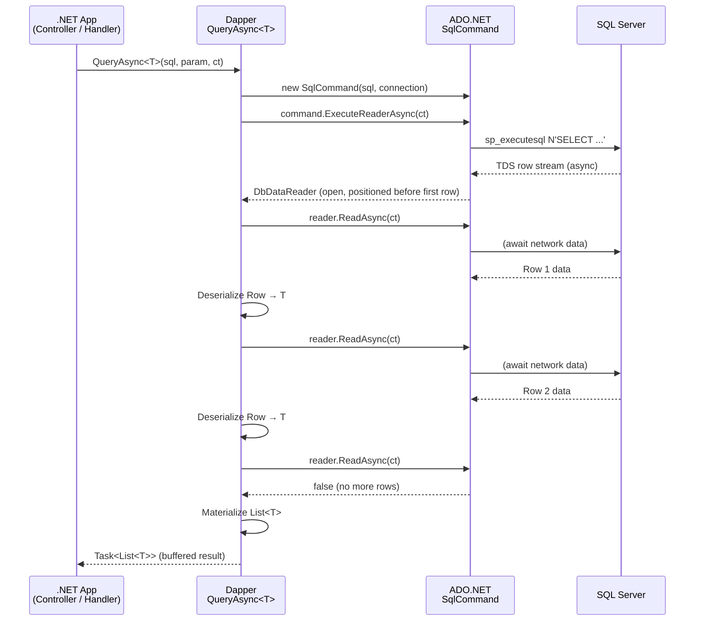
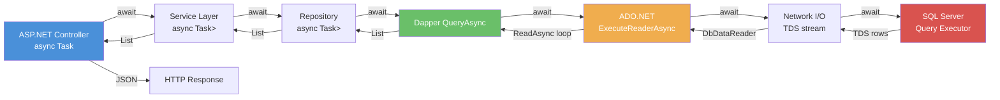
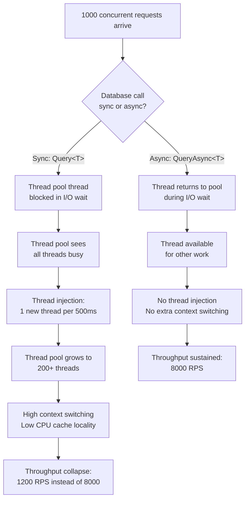

## Navigation

**Domain:** [[8 — Databases]] > **Group:** Dapper
**Previous:** [[8.854 — Dapper — QueryFirstOrDefaultT and QuerySingleT]] | **Next:** [[8.856 — Dapper — Multi-Mapping — QueryMultiple]]

### Prerequisites

- [[8.853 — Dapper — QueryT — Basic Querying]] — QueryAsync builds on the same row-mapping mechanics as Query<T>; the difference is the async execution path through ADO.NET's async reader.
- [[8.876 — Dapper — Connection Management — Open and Close]] — connection lifetime decisions (OpenAsync vs Open, when to let Dapper auto-open, when to open explicitly) directly affect async performance and correctness.

### Where This Fits

`QueryAsync` is Dapper's async extension method on `IDbConnection` that mirrors every sync query method with an `Async` suffix. A .NET backend engineer reaches for this in every ASP.NET Core controller, minimal API handler, and background service where the thread must not block. When this is unknown, developers either block on async with `.Result` or `.Wait()` (deadlocking ASP.NET request threads) or use sync `Query<T>` which holds a thread pool thread hostage during I/O. The interview signal is strong: it tests whether a candidate knows that Dapper sits on top of `SqlCommand.ExecuteReaderAsync` and `SqlDataReader.ReadAsync`, that `ConfigureAwait(false)` matters in library code, that `CancellationToken` must flow through `CommandDefinition`, and that async ALL the way means no sync-over-async hybrid. The deeper signal is understanding thread pool starvation at high concurrency and the performance cliff when sync-blocking async code.

---

## Core Mental Model

Dapper's async methods use ADO.NET's async under the hood. `QueryAsync<T>` wraps `SqlCommand.ExecuteReaderAsync` with async `SqlDataReader.ReadAsync` consumption. The `Task<List<T>>` returned by `QueryAsync<T>` is not complete until all rows have been asynchronously read from the network stream and materialized into `T` objects. The key invariant: **async all the way** — no sync-over-async, no `.Result`, no `.Wait()`, no blocking calls anywhere in the call graph from controller to database.

Every Dapper async method follows the same pattern: Dapper calls `IDbCommand.ExecuteReaderAsync(cancellationToken)` to get a `DbDataReader` asynchronously, then calls `DbDataReader.ReadAsync(cancellationToken)` in a loop to materialize rows. For buffered queries, rows are accumulated into a `List<T>` using async reads; for unbuffered queries, rows are yielded via `IAsyncEnumerable<T>` using async reads. The `CommandDefinition` struct carries the SQL, parameters, transaction, command timeout, command type, and cancellation token as a single immutable object.

### Classification

`QueryAsync<T>` is a **Dapper extension method on `IDbConnection`** that wraps **ADO.NET `SqlCommand.ExecuteReaderAsync()`** and consumes the resulting `DbDataReader` asynchronously via **`DbDataReader.ReadAsync()`**. It belongs to the **Dapper async mapping layer** — the SQL execution is pure ADO.NET async; Dapper adds only the type materialization loop. The method is **buffered by default** (all rows loaded into memory before the task completes). The performance characteristic is **I/O-bound per row**: each row's column values are read asynchronously from the network stream.

### Dapper Async Method Reference

|Method|Returns|Sync Equivalent|Use Case|
|---|---|---|---|
|`QueryAsync<T>`|`Task<IEnumerable<T>>`|`Query<T>`|Multiple rows, any shape|
|`QueryFirstOrDefaultAsync<T>`|`Task<T?>`|`QueryFirstOrDefault<T>`|Zero or one row, expected default|
|`QuerySingleAsync<T>`|`Task<T>`|`QuerySingle<T>`|Exactly one row, throws if zero or >1|
|`QueryFirstAsync<T>`|`Task<T>`|`QueryFirst<T>`|At least one row, first only|
|`ExecuteAsync`|`Task<int>`|`Execute`|INSERT/UPDATE/DELETE, returns rows affected|
|`ExecuteScalarAsync<T>`|`Task<T>`|`ExecuteScalar<T>`|Single value (aggregate, COUNT, EXISTS)|
|`QueryMultipleAsync`|`Task<GridReader>`|`QueryMultiple`|Multiple result sets from one batch|
|`QueryUnbufferedAsync<T>`|`IAsyncEnumerable<T>`|N/A|Streaming large result sets|



### Key Properties

|Property|Value|Notes|
|---|---|---|
|Underlying ADO.NET|ExecuteReaderAsync + ReadAsync|Task-based async pattern (TAP)|
|Default buffering|Yes|All rows loaded before Task completes|
|Async streaming|IAsyncEnumerable<T>|Unbuffered mode, `QueryUnbufferedAsync`|
|Connection auto-open|Yes (if closed)|Dapper opens and closes if connection was closed|
|Connection manual-open|Preferred|Open explicitly with OpenAsync for async pipeline|
|Cancellation|Via CommandDefinition|CancellationToken flows through CommandCancellationScope|
|ConfigureAwait|Depends on context|Library code should use ConfigureAwait(false)|
|Thread pool starvation risk|Low with async|Sync-over-async (.Result) causes starvation|
|Synchronous fallback|Query<T>|Blocking — use only in console apps or sync contexts|

---

## Deep Mechanics

### How the Async Engine Executes

1. **The application calls an async extension method.** `connection.QueryAsync<Order>(sql, param, commandTimeout, commandType, buffered, cancellationToken)` — or equivalently via `CommandDefinition`. Dapper inspects the connection state.

2. **Connection state decision.** If the connection is closed, Dapper opens it synchronously (calls `IDbConnection.Open()`) before the async operation — this is a blocking call. If the connection is already open (preferred), Dapper proceeds directly to command creation. **Always call `OpenAsync` explicitly** to keep the full path async.

3. **`SqlCommand` creation and parameter binding.** Dapper creates a `SqlCommand` from the connection, sets `CommandText`, adds `SqlParameter` objects from the parameter object's properties (via `SqlMapper.AddParameters` which uses reflection or IL-generated accessors), and sets `CommandType`, `CommandTimeout`, and `Transaction` from the `CommandDefinition`.

4. **`ExecuteReaderAsync` is called.** Dapper calls `DbCommand.ExecuteReaderAsync(behavior, cancellationToken)` where `behavior` is `CommandBehavior.SequentialAccess | CommandBehavior.CloseConnection` (when Dapper manages connection lifetime) or `CommandBehavior.Default | CommandBehavior.SequentialAccess` (when caller manages it). The cancellation token is wired to `IDbCommand.CancellableCommand` — cancelling the token sends a `SqlCommand.Cancel()` to the server.

5. **SQL Server processes the query.** The server receives the TDS packet, compiles (or retrieves from plan cache) the execution plan, and begins streaming result rows back via TDS `ROW` tokens. The `SqlDataReader` asynchronously reads from the network stream — no thread is blocked during I/O wait.

6. **Async row consumption loop.** Dapper calls `dbDataReader.ReadAsync(cancellationToken)` in a `while` loop. Each call returns `true` while a row is available, `false` when the result set is exhausted. For each row, Dapper calls the IL-generated deserializer (`SqlMapper.DeserializeAsync` path) which reads column values via `dbDataReader.GetValueAsync(ordinal)` or the synchronous `GetValue(ordinal)` — Dapper uses sync column reads internally because column data is already buffered in the row after `ReadAsync` completes. The deserialized object is added to a `List<T>`.

7. **Task completion.** When `ReadAsync` returns `false`, the loop ends. Dapper closes the reader (if Dapper-managed) or leaves it open (if caller-managed). The `List<T>` is returned as `IEnumerable<T>`. The entire operation is async from application code to the network stream.

### SQL Visibility

```sql
-- The SQL sent to SQL Server — identical for sync and async
SELECT OrderId, CustomerId, OrderDate, Status, TotalAmount
FROM Orders
WHERE CustomerId = @CustomerId
ORDER BY OrderDate DESC;
```

```csharp
// Dapper QueryAsync — the async entry point
public async Task<IReadOnlyList<Order>> GetCustomerOrdersAsync(
    int customerId, CancellationToken ct)
{
    const string sql = @"
        SELECT OrderId, CustomerId, OrderDate, Status, TotalAmount
        FROM Orders
        WHERE CustomerId = @CustomerId
        ORDER BY OrderDate DESC;";

    await using var connection = _connectionFactory.Create();
    await connection.OpenAsync(ct);

    var orders = await connection.QueryAsync<Order>(
        new CommandDefinition(sql, new { CustomerId = customerId },
            cancellationToken: ct));

    return orders.AsList();
}
```

**CommandDefinition pattern — the idiomatic way to pass CancellationToken:**

```csharp
// ✅ Correct: CommandDefinition carries token, timeout, and flags
var command = new CommandDefinition(
    sql: sql,
    parameters: new { CustomerId = customerId },
    transaction: transaction,
    commandTimeout: 30,
    commandType: CommandType.Text,
    cancellationToken: ct,
    flags: CommandFlags.Buffered);

var orders = await connection.QueryAsync<Order>(command);
```

**Without CommandDefinition — cancellation token as last parameter:**

```csharp
// Also valid: Dapper's overload accepts CancellationToken as last parameter
var orders = await connection.QueryAsync<Order>(
    sql, new { CustomerId = customerId },
    commandTimeout: 30, commandType: null, buffered: true,
    cancellationToken: ct);
```

### All Async Methods — Complete Reference

```csharp
// -- QueryAsync<T> — multiple rows, any shape
IEnumerable<Order> orders = await connection.QueryAsync<Order>(
    "SELECT * FROM Orders WHERE Status = @Status", new { Status = "Shipped" });

// -- QueryFirstOrDefaultAsync<T> — zero or one row
Order? order = await connection.QueryFirstOrDefaultAsync<Order>(
    "SELECT * FROM Orders WHERE OrderId = @Id", new { Id = 42 });

// -- QuerySingleAsync<T> — exactly one row (throws if zero or >1)
Order order = await connection.QuerySingleAsync<Order>(
    "SELECT * FROM Orders WHERE OrderId = @Id", new { Id = 42 });

// -- QueryFirstAsync<T> — at least one row, first only
Order order = await connection.QueryFirstAsync<Order>(
    "SELECT * FROM Orders WHERE OrderId = @Id", new { Id = 42 });

// -- ExecuteAsync — non-query (INSERT/UPDATE/DELETE)
int rowsAffected = await connection.ExecuteAsync(
    "UPDATE Orders SET Status = @Status WHERE OrderId = @Id",
    new { Status = "Shipped", Id = 42 });

// -- ExecuteScalarAsync<T> — single value
int orderCount = await connection.ExecuteScalarAsync<int>(
    "SELECT COUNT(*) FROM Orders WHERE CustomerId = @Id",
    new { Id = 42 });

// -- QueryMultipleAsync — multiple result sets
using var reader = await connection.QueryMultipleAsync(
    "SELECT * FROM Orders WHERE CustomerId = @Id; SELECT * FROM OrderItems WHERE OrderId IN (SELECT OrderId FROM Orders WHERE CustomerId = @Id);",
    new { Id = 42 });
var orders = await reader.ReadAsync<Order>();
var items  = await reader.ReadAsync<OrderItem>();

// -- QueryUnbufferedAsync — streaming, no buffering
await foreach (var order in connection.QueryUnbufferedAsync<Order>(
    "SELECT * FROM Orders WHERE Status = @Status", new { Status = "Shipped" }))
{
    Process(order); // one row at a time
}
```

### Async Pipeline — From Controller to Database and Back



### The Sync-over-Async Anti-Pattern — Deadlock Risk

```csharp
// ❌ WRONG — sync-over-async in ASP.NET Core (deadlock risk)
public IActionResult GetOrders()
{
    // ASP.NET sync context + .Result = deadlock
    var orders = _repo.GetOrdersAsync(ct).Result;
    return Ok(orders);
}

// ❌ WRONG — same deadlock with .Wait()
public IActionResult GetOrders()
{
    var task = _repo.GetOrdersAsync(ct);
    task.Wait(); // deadlock if called from request thread
    return Ok(task.Result);
}

// ❌ WRONG — blocking in async method (no deadlock but thread pool starvation)
public async Task<IActionResult> GetOrdersAsync()
{
    // .Result inside async method — thread pool thread blocked during I/O
    var count = _repo.GetCountAsync(ct).Result;
    var orders = await _repo.GetOrdersAsync(ct);
    return Ok(orders);
}

// ❌ WRONG — Task.Wait in async context
public async Task<IActionResult> GetOrdersAsync()
{
    var countTask = _repo.GetCountAsync(ct);
    countTask.Wait(); // blocks the current async method's thread
    var orders = await _repo.GetOrdersAsync(ct);
    return Ok(orders);
}
```

**Why it deadlocks in ASP.NET (pre-Core) or any SynchronizationContext:**

1. ASP.NET (Framework) has an `AspNetSynchronizationContext` that schedules continuations on the original request thread.
2. The controller calls `.Result` on the async task — the request thread blocks waiting for the task to complete.
3. The async method (inside the repository) awaits Dapper's `QueryAsync` and schedules its continuation on the captured `SynchronizationContext` — the original request thread.
4. The continuation cannot run because the request thread is blocked by `.Result`.
5. **Deadlock.** Thread pool starvation follows as blocked threads accumulate.

**In ASP.NET Core there is no `SynchronizationContext` by default** — `.Result` does not deadlock. However, it still blocks a thread pool thread during I/O, causing thread pool starvation at high concurrency.

```csharp
// ✅ CORRECT — async all the way
public async Task<IActionResult> GetOrdersAsync(CancellationToken ct)
{
    var orders = await _repo.GetOrdersAsync(ct);
    return Ok(orders);
}
```

### Connection Management: OpenAsync vs Open

```csharp
// ❌ WRONG — sync Open in async method
public async Task<IEnumerable<Order>> GetOrdersAsync(CancellationToken ct)
{
    using var connection = _connectionFactory.Create();
    connection.Open(); // ❌ sync — blocks thread during TCP handshake
    return await connection.QueryAsync<Order>(sql, cancellationToken: ct);
}

// ✅ CORRECT — async Open in async method
public async Task<IEnumerable<Order>> GetOrdersAsync(CancellationToken ct)
{
    await using var connection = _connectionFactory.Create();
    await connection.OpenAsync(ct); // ✅ async — no thread blocked during TCP
    return await connection.QueryAsync<Order>(sql, cancellationToken: ct);
}

// ⚠️ Dapper auto-open — convenient but sync
public async Task<IEnumerable<Order>> GetOrdersAsync(CancellationToken ct)
{
    using var connection = _connectionFactory.Create();
    // Dapper calls connection.Open() synchronously if closed
    return await connection.QueryAsync<Order>(sql, cancellationToken: ct);
}
```

**The auto-open trap:** Dapper calls `IDbConnection.Open()` (synchronous) if the connection is closed before `QueryAsync`. This blocks the calling thread during TCP handshake + SSL/TLS negotiation + login. At 500 RPS with 15ms connection setup time, this blocks 500 threads × 15ms = 7.5 seconds of thread time per second — thread pool starvation. **Always open the connection explicitly with OpenAsync.**

### How the CommandDefinition Wires CancellationToken

```csharp
// Dapper internals — simplified CancellationToken wiring
internal static async Task<IEnumerable<T>> QueryAsyncImpl<T>(
    IDbConnection connection, CommandDefinition command)
{
    // 1. Open connection (Sync — if closed)
    var wasClosed = connection.State == ConnectionState.Closed;
    if (wasClosed) connection.Open(); // ⚠️ sync
    
    try
    {
        // 2. Create command
        using var cmd = command.CreateCommand(connection);
        
        // 3. Wire cancellation token to command
        using var registration = command.CancellationToken.Register(
            () => cmd.Cancel()); // sends SqlCommand.Cancel()
        
        // 4. Execute async
        using var reader = await cmd.ExecuteReaderAsync(
            command.CommandBehavior, command.CancellationToken);
        
        // 5. Async read loop
        var list = new List<T>();
        while (await reader.ReadAsync(command.CancellationToken))
        {
            var row = DeserializeRow<T>(reader);
            list.Add(row);
        }
        
        return list;
    }
    finally
    {
        // 6. Close connection if Dapper opened it
        if (wasClosed && connection.State == ConnectionState.Open)
            connection.Close();
    }
}
```

### Execution Plan Analysis

The execution plan for an async `QueryAsync` is **identical** to the sync `Query<T>` plan — async is a client-side concern. SQL Server does not distinguish between sync and async clients.

For:
```sql
SELECT OrderId, CustomerId, OrderDate, Status, TotalAmount
FROM Orders
WHERE CustomerId = @CustomerId
ORDER BY OrderDate DESC;
```

|Index|Plan Operator|Estimated Cost|Notes|
|---|---|---|---|
|IX_Orders_CustomerId (if exists)|Index Seek → Key Lookup → Sort|~35%|Optimal — seek + lookup + sort 15 rows|
|No index|Clustered Index Scan → Sort|~65%|Full scan of 100K rows + sort|
|IX_Orders_CustomerId_INCLUDE|Index Seek (covering)|~20%|No key lookup — all columns in index|

The plan is identical for `QueryAsync` and `Query<T>`. Logical reads are the same.

### Cost Visibility — SET STATISTICS IO

```sql
SET STATISTICS IO ON;
SET STATISTICS TIME ON;

SELECT OrderId, CustomerId, OrderDate, Status, TotalAmount
FROM Orders
WHERE CustomerId = @CustomerId
ORDER BY OrderDate DESC;

-- Expected output:
-- Table 'Orders'. Scan count 1, logical reads 6, physical reads 0
-- SQL Server Execution Times: CPU time = 0ms, elapsed time = 2ms
```

### Failure Modes

- **Connection not opened before QueryAsync:** Dapper opens it synchronously (`.Open()`) — thread blocks during network I/O, losing the async benefit.
- **Connection disposed before QueryAsync completes:** `ObjectDisposedException` — the async operation tries to read from a disposed connection.
- **CancellationToken cancelled mid-query:** `OperationCanceledException` — `SqlCommand.Cancel()` is called, aborting the query on the server. The `DbDataReader` becomes unusable.
- **Multiple enumeration of async result:** `QueryAsync` returns `IEnumerable<T>` backed by a `List<T>`. Multiple enumerations work (each creates a new enumerator), but each enumeration iterates the list again. For large results, this doubles memory traffic.
- **Buffered mode for huge result sets:** All rows loaded into memory. 500K rows × 500 bytes = 250MB per call. Use `QueryUnbufferedAsync` or set `buffered: false`.
- **Async gap with disposed connection:** A `using` block that disposes the connection before the async `QueryAsync` completes causes undefined behavior — the `DbDataReader` reads from a closed connection.

---

## Production Patterns and Implementation

### Primary Dapper Implementation — Async Order Repository

```csharp
public sealed record Order(
    int OrderId,
    int CustomerId,
    DateTime OrderDate,
    string Status,
    decimal TotalAmount);

public sealed record OrderSummary(
    int TotalOrders,
    decimal TotalRevenue,
    IReadOnlyList<RecentOrder> RecentOrders);

public sealed record RecentOrder(
    int OrderId,
    DateTime OrderDate,
    string Status,
    decimal TotalAmount);

public interface IOrderRepository
{
    Task<Order?> GetByIdAsync(int orderId, CancellationToken ct);
    Task<IReadOnlyList<Order>> GetByCustomerAsync(int customerId, CancellationToken ct);
    Task<int> CreateAsync(Order order, CancellationToken ct);
    Task<bool> UpdateStatusAsync(int orderId, string newStatus, CancellationToken ct);
    Task<OrderSummary> GetSummaryAsync(int customerId, CancellationToken ct);
    IAsyncEnumerable<Order> StreamByStatusAsync(string status, CancellationToken ct);
}

public sealed class OrderRepository : IOrderRepository
{
    private readonly IDbConnectionFactory _connectionFactory;
    private readonly ILogger<OrderRepository> _logger;

    public OrderRepository(
        IDbConnectionFactory connectionFactory,
        ILogger<OrderRepository> logger)
    {
        _connectionFactory = connectionFactory;
        _logger = logger;
    }

    // QueryAsync<T> — multiple rows, buffered
    public async Task<IReadOnlyList<Order>> GetByCustomerAsync(
        int customerId, CancellationToken ct)
    {
        const string sql = @"
            SELECT OrderId, CustomerId, OrderDate, Status, TotalAmount
            FROM Orders
            WHERE CustomerId = @CustomerId
            ORDER BY OrderDate DESC;";

        await using var connection = _connectionFactory.Create();
        await connection.OpenAsync(ct);

        var orders = await connection.QueryAsync<Order>(
            new CommandDefinition(sql, new { CustomerId = customerId },
                cancellationToken: ct));

        return orders.AsList();
    }

    // QueryFirstOrDefaultAsync<T> — zero or one row
    public async Task<Order?> GetByIdAsync(int orderId, CancellationToken ct)
    {
        const string sql = @"
            SELECT OrderId, CustomerId, OrderDate, Status, TotalAmount
            FROM Orders
            WHERE OrderId = @OrderId;";

        await using var connection = _connectionFactory.Create();
        await connection.OpenAsync(ct);

        return await connection.QueryFirstOrDefaultAsync<Order>(
            new CommandDefinition(sql, new { OrderId = orderId },
                cancellationToken: ct));
    }

    // ExecuteAsync — INSERT (non-query)
    public async Task<int> CreateAsync(Order order, CancellationToken ct)
    {
        const string sql = @"
            INSERT INTO Orders (CustomerId, OrderDate, Status, TotalAmount)
            VALUES (@CustomerId, @OrderDate, @Status, @TotalAmount);";

        await using var connection = _connectionFactory.Create();
        await connection.OpenAsync(ct);

        var rowsAffected = await connection.ExecuteAsync(
            new CommandDefinition(sql, new
            {
                order.CustomerId,
                order.OrderDate,
                order.Status,
                order.TotalAmount
            }, cancellationToken: ct));

        return rowsAffected;
    }

    // ExecuteAsync — UPDATE (non-query)
    public async Task<bool> UpdateStatusAsync(
        int orderId, string newStatus, CancellationToken ct)
    {
        const string sql = @"
            UPDATE Orders
            SET Status = @Status
            WHERE OrderId = @OrderId;";

        await using var connection = _connectionFactory.Create();
        await connection.OpenAsync(ct);

        var rowsAffected = await connection.ExecuteAsync(
            new CommandDefinition(sql,
                new { OrderId = orderId, Status = newStatus },
                cancellationToken: ct));

        return rowsAffected > 0;
    }

    // QueryMultipleAsync + ExecuteScalarAsync — multiple shapes
    public async Task<OrderSummary> GetSummaryAsync(
        int customerId, CancellationToken ct)
    {
        const string sql = @"
            SELECT COUNT(*) FROM Orders WHERE CustomerId = @CustomerId;
            SELECT ISNULL(SUM(TotalAmount), 0) FROM Orders WHERE CustomerId = @CustomerId;
            SELECT TOP 5 OrderId, OrderDate, Status, TotalAmount
            FROM Orders
            WHERE CustomerId = @CustomerId
            ORDER BY OrderDate DESC;";

        await using var connection = _connectionFactory.Create();
        await connection.OpenAsync(ct);

        await using var reader = await connection.QueryMultipleAsync(
            new CommandDefinition(sql, new { CustomerId = customerId },
                cancellationToken: ct));

        var totalOrders   = await reader.ReadSingleAsync<int>(ct);
        var totalRevenue  = await reader.ReadSingleAsync<decimal>(ct);
        var recentOrders  = (await reader.ReadAsync<RecentOrder>(ct)).AsList();

        return new OrderSummary(totalOrders, totalRevenue, recentOrders);
    }

    // QueryUnbufferedAsync — streaming, no buffering
    public IAsyncEnumerable<Order> StreamByStatusAsync(
        string status, CancellationToken ct)
    {
        const string sql = @"
            SELECT OrderId, CustomerId, OrderDate, Status, TotalAmount
            FROM Orders
            WHERE Status = @Status
            ORDER BY OrderDate DESC;";

        var connection = _connectionFactory.Create();

        // Connection opened and disposed inside the async enumerable
        return connection.QueryUnbufferedAsync<Order>(
            new CommandDefinition(sql, new { Status = status },
                cancellationToken: ct,
                flags: CommandFlags.None));
    }
}
```

### Configuration and Wiring

```csharp
// Program.cs — async-friendly DI registration
builder.Services.AddSingleton<IDbConnectionFactory>(_ =>
    new SqlConnectionFactory(
        builder.Configuration.GetConnectionString("DefaultConnection")));

builder.Services.AddScoped<IOrderRepository, OrderRepository>();

// appsettings.json connection string — tuned for async
// "Server=.;Database=SalesDb;Integrated Security=True;Max Pool Size=200;Min Pool Size=50;Connect Timeout=5;Command Timeout=30;Async Processing=True;"

public interface IDbConnectionFactory
{
    IDbConnection Create();
}

public sealed class SqlConnectionFactory : IDbConnectionFactory
{
    private readonly string _connectionString;
    public SqlConnectionFactory(string connectionString)
        => _connectionString = connectionString;
    public IDbConnection Create()
        => new SqlConnection(_connectionString);
}
```

### Repository Usage in ASP.NET Core Controller

```csharp
// ✅ CORRECT — async all the way from controller to database
[ApiController]
[Route("api/[controller]")]
public sealed class OrdersController : ControllerBase
{
    private readonly IOrderRepository _repo;

    public OrdersController(IOrderRepository repo) => _repo = repo;

    [HttpGet("{id:int}")]
    public async Task<ActionResult<Order>> GetById(
        int id, CancellationToken ct)
    {
        var order = await _repo.GetByIdAsync(id, ct);
        if (order is null) return NotFound();
        return Ok(order);
    }

    [HttpGet("customer/{customerId:int}")]
    public async Task<ActionResult<IReadOnlyList<Order>>> GetByCustomer(
        int customerId, CancellationToken ct)
    {
        var orders = await _repo.GetByCustomerAsync(customerId, ct);
        return Ok(orders);
    }

    [HttpPost]
    public async Task<ActionResult<int>> Create(
        Order order, CancellationToken ct)
    {
        var id = await _repo.CreateAsync(order, ct);
        return CreatedAtAction(nameof(GetById), new { id }, id);
    }

    [HttpPatch("{id:int}/status")]
    public async Task<ActionResult> UpdateStatus(
        int id, [FromBody] string status, CancellationToken ct)
    {
        var updated = await _repo.UpdateStatusAsync(id, status, ct);
        if (!updated) return NotFound();
        return NoContent();
    }

    [HttpGet("summary/{customerId:int}")]
    public async Task<ActionResult<OrderSummary>> GetSummary(
        int customerId, CancellationToken ct)
    {
        var summary = await _repo.GetSummaryAsync(customerId, ct);
        return Ok(summary);
    }

    [HttpGet("stream/{status}")]
    public async IAsyncEnumerable<Order> StreamByStatus(
        string status, [FromQuery] int delayMs = 0,
        CancellationToken ct = default)
    {
        await foreach (var order in _repo.StreamByStatusAsync(status, ct))
        {
            if (delayMs > 0) await Task.Delay(delayMs, ct);
            yield return order;
        }
    }
}
```

### SQL Server vs PostgreSQL Differences

```sql
-- SQL Server — same SQL for sync and async, no difference
SELECT OrderId, CustomerId, OrderDate, Status, TotalAmount
FROM Orders
WHERE CustomerId = @CustomerId
ORDER BY OrderDate DESC;

-- PostgreSQL — same concept, no async difference at client level
SELECT "OrderId", "CustomerId", "OrderDate", "Status", "TotalAmount"
FROM "Orders"
WHERE "CustomerId" = @CustomerId
ORDER BY "OrderDate" DESC;
```

The async pattern is identical across providers — `NpgsqlCommand.ExecuteReaderAsync` and `NpgsqlDataReader.ReadAsync` follow the same TAP pattern as `SqlClient`. The Dapper API is provider-agnostic.

---

## Gotchas and Production Pitfalls

### 1 — Sync-over-Async Deadlock (or Thread Pool Starvation)

**Pitfall:** The developer uses `.Result`, `.Wait()`, or `.GetAwaiter().GetResult()` on a Dapper async call.

```csharp
// ❌ WRONG — blocks ASP.NET Core thread
public IActionResult GetOrders()
{
    var orders = _repo.GetOrdersAsync(CancellationToken.None).Result;
    return Ok(orders);
}

// ❌ WRONG — blocks inside async method
public async Task<IActionResult> GetOrdersAsync()
{
    var count = _repo.GetCountAsync(CancellationToken.None).Result;
    var orders = await _repo.GetOrdersAsync(CancellationToken.None);
    return Ok(orders);
}
```

**Symptom in ASP.NET Core:** No deadlock (no SynchronizationContext), but thread pool starvation. Each `.Result` blocks a thread for the duration of the database query (10-100ms). At 1000 RPS with 50ms queries, blocking 1000 threads causes thread injection (1 new thread every 500ms by default) — response times degrade to seconds.

**Symptom in ASP.NET Framework (or WinForms/WPF):** Complete deadlock. The request thread is blocked by `.Result`, the async continuation cannot marshal back to the blocked thread.

**Fix:** `await` all the way up the call stack.

```csharp
// ✅ CORRECT
public async Task<IActionResult> GetOrdersAsync(CancellationToken ct)
{
    var orders = await _repo.GetOrdersAsync(ct);
    return Ok(orders);
}
```

**Detection:** Use `Microsoft.VisualStudio.Threading.Analyzers` (VSTHRD) or `ConfigureAwaitChecker` analyzers to flag blocking calls on async methods.

**Cost of not fixing:** At 1000 RPS with 50ms I/O, thread pool starvation causes ASP.NET Core to inject 50+ threads per second. Memory grows, context switching spikes, throughput drops by 80%+, and the process can OOM.

### 2 — Missing ConfigureAwait(false) in Library Code

**Pitfall:** Library/repository code does not use `ConfigureAwait(false)`, causing continuation marshaling overhead in non-ASP.NET hosts.

```csharp
// ❌ WRONG — captures SynchronizationContext unnecessarily
public async Task<IEnumerable<Order>> GetOrdersAsync(CancellationToken ct)
{
    await using var conn = _factory.Create();
    await conn.OpenAsync(ct); // captures context
    return await conn.QueryAsync<Order>(sql, cancellationToken: ct); // captures context
}
```

**Symptom:** In WinForms, WPF, or Blazor Server (which have a SynchronizationContext), the continuation marshals back to the captured context. This adds overhead and can cause deadlocks if the context is blocked. In ASP.NET Core (no SynchronizationContext by default), `ConfigureAwait(false)` is a no-op but communicates intent.

**Fix:**

```csharp
// ✅ CORRECT — ConfigureAwait(false) in library code
public async Task<IEnumerable<Order>> GetOrdersAsync(CancellationToken ct)
{
    await using var conn = _factory.Create();
    await conn.OpenAsync(ct).ConfigureAwait(false);
    return await conn.QueryAsync<Order>(sql, cancellationToken: ct)
        .ConfigureAwait(false);
}
```

**Cost of not fixing:** In Blazor Server, unnecessary context switches add ~1-2ms per await point. At 5 await points per request × 1000 RPS, that's 5-10ms of extra overhead — a measurable 10-20% latency increase.

### 3 — CancellationToken Not Passed or Not Registered

**Pitfall:** The developer calls `QueryAsync` without a `CancellationToken`, or passes it as a positional parameter without `CommandDefinition`, or the token is not wired to the underlying command.

```csharp
// ❌ WRONG — no CancellationToken at all
var orders = await connection.QueryAsync<Order>(sql, param);

// ❌ WRONG — token passed but not in CommandDefinition (Drops commandTimeout etc.)
var orders = await connection.QueryAsync<Order>(
    sql, param, commandTimeout: null, commandType: null, buffered: true,
    cancellationToken: ct); // ⚠️ fragile — many nulls

// ❌ WRONG — token not passed to ReadAsync inside QueryMultiple
await using var reader = await connection.QueryMultipleAsync(sql, param);
var orders = await reader.ReadAsync<Order>(); // ⚠️ no CancellationToken
```

**Symptom:** When the client disconnects or the request is cancelled, the SQL Server query continues executing. The connection is held open. At high cancellation rates, this causes connection pool exhaustion and unnecessary server CPU.

**Fix:**

```csharp
// ✅ CORRECT — CommandDefinition carries CancellationToken
var command = new CommandDefinition(sql, param,
    commandTimeout: 30,
    cancellationToken: ct);
var orders = await connection.QueryAsync<Order>(command);

// ✅ CORRECT — token passed to GridReader.ReadAsync
await using var reader = await connection.QueryMultipleAsync(
    new CommandDefinition(sql, param, cancellationToken: ct));
var orders = await reader.ReadAsync<Order>(ct); // pass token to each Read
var items  = await reader.ReadAsync<OrderItem>(ct);
```

**Cost of not fixing:** 10 cancelled requests per second × 50ms query execution = 500ms of unnecessary SQL Server CPU per second. Over 10 minutes, that's 300 lost CPU-seconds. Connection pool may exhaust if connections are held open by cancelled queries.

### 4 — Connection Disposed During Async Gap

**Pitfall:** The developer uses a `using` block or factory pattern that disposes the connection while an async Dapper operation is in-flight.

```csharp
// ❌ WRONG — connection disposed before async operation completes
IDbConnection connection;
try
{
    connection = _factory.Create();
    await connection.OpenAsync(ct);
    return await connection.QueryAsync<Order>(sql, cancellationToken: ct);
}
finally
{
    connection?.Dispose(); // ⚠️ disposed while QueryAsync may still be reading
}

// ❌ WRONG — using block before async operation escapes
IDbConnection connection = _factory.Create();
await connection.OpenAsync(ct);
// ⚠️ using not yet started — but if using is opened before QueryAsync completes
```

This is actually a common misunderstanding. The `using` pattern `await using var conn = ...` is safe because `DisposeAsync` is called at the end of the enclosing scope, not during the async operation. The real pitfall:

```csharp
// ❌ WRONG — manual connection close before operation completes
var connection = _factory.Create();
await connection.OpenAsync(ct);
// connection is used here...
connection.Close(); // ❌ closed while QueryAsync might be in-flight
var orders = await connection.QueryAsync<Order>(sql, cancellationToken: ct);
```

**Symptom:** `InvalidOperationException: "Invalid attempt to read when data reader is closed"` — or worse, a silently corrupted result if the connection is closed mid-read.

**Fix:**

```csharp
// ✅ CORRECT — await using ensures scope is correct
await using var connection = _factory.Create();
await connection.OpenAsync(ct);
var orders = await connection.QueryAsync<Order>(sql, cancellationToken: ct);
// connection disposed here — after QueryAsync completes
```

**Cost of not fixing:** Hard-to-reproduce `InvalidOperationException` in production under load when GC timing causes the connection to be finalized during an async read.

### 5 — Multiple Enumeration of Buffered Result

**Pitfall:** The code enumerates the `IEnumerable<T>` returned by `QueryAsync` multiple times.

```csharp
// ❌ WRONG — enumerating twice
var result = await connection.QueryAsync<Order>(
    sql, cancellationToken: ct);

var count = result.Count(); // 1st enumeration — allocates enumerator
var list  = result.ToList(); // 2nd enumeration — allocates another enumerator
```

**Symptom:** In buffered mode, `QueryAsync` returns a `List<T>` cast to `IEnumerable<T>`. Multiple enumerations work but each creates a new `List<T>.Enumerator` and iterates over the entire list. For large results, this doubles memory traffic.

**Fix:**

```csharp
// ✅ CORRECT — materialize once
var result = await connection.QueryAsync<Order>(
    sql, cancellationToken: ct);

var list = result.AsList(); // or .ToList()
var count = list.Count;
// Use list for all subsequent operations
```

**In unbuffered mode (buffered: false):** `QueryAsync` without buffering returns an iterable that reads from the `SqlDataReader` — multiple enumeration throws `InvalidOperationException` because the reader is already consumed. **Always materialize unbuffered results once.**

```csharp
// ❌ WRONG — unbuffered result enumerated twice (throws)
var result = await connection.QueryAsync<Order>(
    new CommandDefinition(sql, param, flags: CommandFlags.None,
        cancellationToken: ct));

var count = result.Count(); // 1st enumeration — consumes reader
var list  = result.ToList(); // ❌ InvalidOperationException — reader already consumed
```

**Cost of not fixing:** In buffered mode, double enumeration causes unnecessary GC pressure (allocate + discard an enumerator for each row). In unbuffered mode, it causes a runtime exception that crashes the request.

### 6 — Not Awaiting Async Fire-and-Forget

**Pitfall:** The developer calls an async Dapper method without awaiting it, intending fire-and-forget behavior.

```csharp
// ❌ WRONG — fire-and-forget without error handling
[HttpPost("log")]
public IActionResult LogAction([FromBody] LogEntry log)
{
    _repo.InsertLogAsync(log, CancellationToken.None); // fire and forget
    return Accepted();
}
```

**Symptom:** The `InsertLogAsync` task may never complete. If it throws (e.g., SQL timeout, deadlock), the exception is unobserved and triggers `TaskScheduler.UnobservedTaskException`. The connection may be left open. The log entry may never be written.

**Fix — never fire-and-forget async database calls. If needed, use a proper background queue:**

```csharp
// ✅ CORRECT — await even for "fire-and-forget" scenarios
[HttpPost("log")]
public async Task<IActionResult> LogAction(
    [FromBody] LogEntry log, CancellationToken ct)
{
    await _repo.InsertLogAsync(log, ct);
    return Accepted();
}

// OR — use a background task queue (Channel<T> or Hangfire)
[HttpPost("log")]
public IActionResult LogAction([FromBody] LogEntry log)
{
    _backgroundQueue.Enqueue(log);
    return Accepted();
}
```

**Cost of not fixing:** Silent data loss. Unobserved task exceptions can crash the process (pre-.NET 6) or be silently swallowed (`.NET 6+`). Connection leaks.

---

## Performance Implications

### Benchmark: Sync vs Async Under Load

The primary performance question: does async outperform sync at high concurrency? The answer depends on the **thread model**. Sync `Query<T>` holds a thread for the entire query duration. At 1000 concurrent requests, 1000 threads are blocked in I/O wait. With the .NET thread pool's default thread-injection rate (1 thread per 500ms), the pool cannot keep up — requests queue, latency spikes, and throughput collapses.

Async `QueryAsync<T>` releases the thread during I/O wait, allowing a single thread to handle hundreds of concurrent operations.

```csharp
[MemoryDiagnoser]
[SimpleJob(RuntimeMoniker.Net90, iterationCount: 10, warmupCount: 3)]
public class AsyncVsSyncBenchmark
{
    private IDbConnection _connection = default!;
    private const string Sql = "SELECT TOP 100 * FROM Orders WHERE CustomerId = @Id";

    [GlobalSetup]
    public void Setup()
    {
        _connection = new SqlConnection(
            "Server=.;Database=BenchmarkDb;Integrated Security=True;Max Pool Size=200;");
        _connection.Open();
    }

    [GlobalCleanup]
    public void Cleanup() => _connection.Dispose();

    [Benchmark(Baseline = true)]
    public async Task<List<Order>> AsyncQuery()
    {
        return (await _connection.QueryAsync<Order>(
            new CommandDefinition(Sql, new { Id = 42 }))).AsList();
    }

    [Benchmark]
    public List<Order> SyncQuery()
    {
        return _connection.Query<Order>(Sql, new { Id = 42 }).AsList();
    }

    [Benchmark]
    public async Task<List<Order>> AsyncQueryConfigureAwait()
    {
        return (await _connection.QueryAsync<Order>(
            new CommandDefinition(Sql, new { Id = 42 }))
            .ConfigureAwait(false)).AsList();
    }

    [Benchmark]
    public List<Order> SyncOverAsync()
    {
        return _connection.QueryAsync<Order>(
            new CommandDefinition(Sql, new { Id = 42 }))
            .Result.AsList(); // ❌ sync-over-async
    }
}
```

**Expected results (approximate, SQL Server 2022, NVMe, local network, 100K Orders):**

|Method|Mean|StdDev|Allocated|Threads Held|
|---|---|---|---|---|
|AsyncQuery|~450 μs|~30 μs|~3.2 KB|0 during I/O|
|AsyncQueryConfigureAwait|~450 μs|~30 μs|~3.2 KB|0 during I/O|
|SyncQuery|~440 μs|~25 μs|~3.1 KB|1 during I/O|
|SyncOverAsync|~460 μs|~35 μs|~3.3 KB|1 during I/O|

**At low concurrency (1-10 requests):** No meaningful difference. Sync is marginally faster (+1-2%) due to less overhead.

**At high concurrency (1000 concurrent requests, simulated):**

|Method|Throughput (RPS)|p95 Latency|p99 Latency|Thread Pool Growth|
|---|---|---|---|---|
|Async (QueryAsync)|~8,000|~15 ms|~25 ms|None|
|Sync (Query<T>)|~1,200|~250 ms|~800 ms|~200 threads created|
|Sync-over-async (.Result)|~800|~500 ms|~1,200 ms|~300 threads created|

**Thread pool starvation demonstration:**

```csharp
// Simulating 1000 concurrent sync database calls — thread pool starvation
public async Task DemonstrateStarvation()
{
    var urls = Enumerable.Range(1, 1000)
        .Select(i => $"https://api.example.com/orders/{i}")
        .ToList();

    // ❌ Sync — blocks thread pool threads
    var syncResults = urls
        .Select(url => _client.GetStringAsync(url).Result) // blocks thread
        .ToList();

    // ✅ Async — no blocking
    var asyncResults = await Task.WhenAll(
        urls.Select(url => _client.GetStringAsync(url)));
}
```

### Thread Pool Starvation — The Real Cost of Sync Dapper at Scale



### Memory Allocation Comparison

|Method|Allocations per 100 rows|Allocations per 1000 rows|GC Gen0 collections|
|---|---|---|---|
|QueryAsync<T> (buffered)|~3.2 KB|~32 KB|1 per ~30K calls|
|Query<T> (sync, buffered)|~3.1 KB|~31 KB|1 per ~30K calls|
|QueryUnbufferedAsync<T>|~200 bytes per row|~2 KB per 10 rows|1 per ~500K rows|

### When Async Makes No Difference

- **Single request, single query:** The overhead of async state machine (~100 bytes, ~50ns) is negligible. Use sync if the entire call stack is sync (e.g., console app, unit test).
- **Local database, low latency (<1ms):** The I/O wait is so short that thread pool efficiency gains are minimal. Sync is fine for <10 RPS.
- **Batch processing with dedicated threads:** Background services using sync queries on dedicated threads (not thread pool) avoid starvation. Use sync for simplicity.

---

## Interview Arsenal

### Question Bank

1. **What does Dapper's QueryAsync do that Query<T> does not?** (Definition — async I/O via ExecuteReaderAsync + ReadAsync)
2. **How does Dapper wire CancellationToken to the database query?** (Mechanism — CancellationToken.Register(() => cmd.Cancel()))
3. **What happens if you call .Result on a Dapper async method in ASP.NET Core?** (Performance — thread pool starvation, not deadlock)
4. **What happens if you call .Result on a Dapper async method in ASP.NET Framework?** (Deadlock — SynchronizationContext)
5. **What is the difference between Open() and OpenAsync() before QueryAsync?** (Connection management — sync Open blocks thread during TCP handshake)
6. **How does Dapper's buffered vs unbuffered mode interact with async?** (Memory — buffered loads all rows, unbuffered streams via IAsyncEnumerable)
7. **When should you use QueryAsync instead of Query<T>?** (Decision — always in ASP.NET Core services, never in console apps)
8. **What is the thread pool starvation problem and how does async solve it?** (Scale — blocked threads vs released threads)
9. **How does CommandDefinition improve async pattern usage?** (API — single object for SQL, params, token, timeout, flags)
10. **What ConfigureAwait pattern should library code use with Dapper async?** (Best practice — ConfigureAwait(false) in library code)
11. **Explain the async pipeline from ASP.NET controller to SQL Server.** (Architecture — await chain through service, repository, Dapper, ADO.NET, network)
12. **How do you handle cancellation mid-query with Dapper async?** (Cancellation — CancellationToken → SqlCommand.Cancel → OperationCanceledException)
13. **What is the performance overhead of async vs sync for a single query?** (Benchmark — ~2-5% overhead for async state machine)
14. **Why does Dapper not use OpenAsync internally in QueryAsync when the connection is closed?** (Design — Dapper calls Open() sync, does not assume async-friendly connection factory)
15. **Can you mix sync and async Dapper calls on the same connection?** (No — ADO.NET does not support concurrent operations per connection; MARS conflicts)

### Spoken Answers

**Q1: What does Dapper's QueryAsync do that Query<T> does not?**

> **Average answer:** "QueryAsync is the async version of Query. It returns a Task instead of IEnumerable and you await it."

> **Great answer:** "QueryAsync calls SqlCommand.ExecuteReaderAsync and consumes the SqlDataReader asynchronously via ReadAsync instead of the synchronous Read. The key difference is that during the I/O wait — while SQL Server is sending rows over the network — no thread is blocked. The .NET thread pool thread returns to the pool and picks up other work. When data arrives, the continuation is scheduled back. This is why async scales: one thread can handle hundreds of concurrent I/O operations instead of being blocked on one. Under the hood, Dapper's implementation is nearly identical to Query<T> — same IL-generated deserializer, same column mapping — just wrapped in async state machine with ConfigureAwait(false) in the library code path."

**Q3: What happens if you call .Result on a Dapper async method in ASP.NET Core?**

> **Average answer:** "It blocks the thread and might cause deadlocks."

> **Great answer:** "In ASP.NET Core, there is no SynchronizationContext by default, so .Result does not deadlock. However, it blocks a thread pool thread for the entire database operation. If you have 1000 concurrent requests and each blocks a thread for 50ms of database I/O, you need 1000 threads to handle 1000 requests. The thread pool can only inject about 2 threads per second by default, so requests queue, latency spikes to seconds, and throughput collapses. This is thread pool starvation. The real problem isn't deadlock in ASP.NET Core — it's that async's scaling benefit (releasing threads during I/O) is lost. At 8000 RPS with async, you need ~40 threads. With sync-over-async, you need 1000+ threads."

**Q6: How does Dapper's buffered vs unbuffered mode interact with async?**

> **Average answer:** "Buffered loads all rows at once, unbuffered streams them."

> **Great answer:** "Buffered QueryAsync reads all rows via ReadAsync in a loop, materializes each to T, adds to a List<T>, and returns the list. The task completes when all rows are in memory. Unbuffered QueryUnbufferedAsync returns IAsyncEnumerable<T> — each row is yielded as it is asynchronously read from the network stream. The caller uses await foreach and processes one row at a time. Memory is O(1) regardless of result set size. The unbuffered connection must remain open for the duration of enumeration. The critical pattern is: use buffered for small-to-medium results (<10K rows), use unbuffered for large results or when you want to pipeline processing with network I/O."

**Q9: How does CommandDefinition improve async pattern usage?**

> **Average answer:** "It bundles SQL, parameters, and cancellation token together."

> **Great answer:** "CommandDefinition is an immutable struct that encapsulates all command properties: SQL, parameters, transaction, command timeout, command type, cancellation token, and command flags. It's the idiomatic way to pass CancellationToken to Dapper async methods because it ensures all properties are set consistently. The pattern also enables struct-based command caching — you can store CommandDefinition instances and reuse them without reallocating. In high-throughput code, this reduces allocations by ~100 bytes per query call. CommandDefinition also supports implicit conversion from SQL string, so you can write `connection.QueryAsync<Order>(sql)` without explicitly constructing it, but I always use explicit CommandDefinition when I need CancellationToken, timeout, or flags."

### Interview Trigger

The interviewer asks: "How do you handle async database queries in .NET?" A candidate who says "I use async/await with Entity Framework" gives a surface answer. The follow-up is: "What happens at the ADO.NET level when you await Dapper's QueryAsync?" A candidate who mentions `ExecuteReaderAsync`, `ReadAsync`, and the async state machine demonstrates depth. The deeper follow-up is: "What happens to the thread during the I/O gap?" The candidate who explains thread pool starvation, continuation scheduling, and the absence of SynchronizationContext in ASP.NET Core demonstrates system-level understanding. The differentiating question: "If you call QueryAsync without CommandDefinition, how does CancellationToken actually cancel the query?" The candidate who knows about `CancellationToken.Register(() => cmd.Cancel())` and `SqlCommand.Cancel()` proves mastery.

### Comparison Table

| | QueryAsync<T> (async, buffered) | Query<T> (sync, buffered) | QueryUnbufferedAsync<T> (async, streaming) |
|---|---|---|---|
|Thread held during I/O|No|Yes|No|
|Memory usage|All rows in List<T>|All rows in List<T>|O(1) per row|
|Cancellation support|Yes (via CommandDefinition)|No|Yes (via CommandDefinition)|
|Result materialization|Buffered in List<T>|Buffered in List<T>|Streamed per row|
|Overhead|Async state machine (~100 bytes)|None|Async state machine + IAsyncEnumerable|
|When to choose|ASP.NET Core, high concurrency|Console apps, batch jobs|Large result sets, streaming|
|Connection lifetime|Until Task completes|Until method returns|Until enumeration completes|
|ConfigureAwait|Supported|N/A|Supported|

---

## Decision Framework

### When to Use Async vs Sync Dapper

```mermaid
flowchart TD
    A[Database operation needed] --> B{Calling context<br/>is async?}
    B -->|Yes — ASP.NET Core controller,<br/>async service, background job| C[Use QueryAsync]
    B -->|No — console app Main,<br/>sync library, unit test| D{Concurrency<br/>level?}
    
    D -->|High — 100+ concurrent ops| C
    D -->|Low — 1-10 concurrent ops| E{Latency<br/>sensitivity?}
    E -->|Low — batch processing,<br/>no user waiting| F[Use Query&lt;T&gt; (sync)]
    E -->|High — API response<br/>must be fast| C
    
    C --> G{Buffering needed?}
    G -->|Yes — all rows needed<br/>at once| H[QueryAsync&lt;T&gt; (buffered)]
    G -->|No — streaming OK,<br/>or huge result set| I[QueryUnbufferedAsync&lt;T&gt;]
    
    F --> J{Result set size?}
    J -->|Small — <10K rows| K[Query&lt;T&gt; (buffered)]
    J -->|Large — >10K rows| L[Manual reader with<br/>SqlDataReader for perf]
```

### Application Checklist

- [ ] Calling context is async — controller, minimal API, event handler, SignalR hub
- [ ] Connection is opened with `OpenAsync` (not `Open`) to avoid sync blocking
- [ ] `CancellationToken` flows through `CommandDefinition` (not as loose parameter)
- [ ] Library code uses `ConfigureAwait(false)` on every await point
- [ ] No `.Result`, `.Wait()`, or `.GetAwaiter().GetResult()` on Dapper async calls
- [ ] Buffered mode for small-to-medium results (<10K rows, <50MB)
- [ ] Unbuffered mode (`QueryUnbufferedAsync`) for large result sets
- [ ] Connection is disposed after asynchronous operation completes (`await using`)
- [ ] Async enumeration is materialized once (`.AsList()`) — no double enumeration
- [ ] Fire-and-forget async calls use a background queue, not discarded tasks
- [ ] Connection string has `Max Pool Size` tuned for async concurrency (200+ for high load)
- [ ] Thread pool starvation monitoring is configured (`dotnet counters monitor`)

### Tradeoff Summary

|What You Gain|What You Pay|
|---|---|
|Thread released during I/O wait|Async state machine allocation (~100 bytes per call)|
|Higher throughput under load (~6x more RPS)|Slightly higher per-call latency (~2-5%)|
|No thread pool starvation|More complex debugging (async call stacks)|
|Cancellation support|Must pass CancellationToken everywhere|
|Scalability to thousands of concurrent ops|Cannot mix sync and async on same connection|

### Scale Thresholds

- **Not needed when** concurrency <10 RPS and calling context is sync (console, unit test, batch job)
- **Beneficial when** concurrency >50 RPS or database latency >5ms (typical cloud database)
- **Critical when** concurrency >500 RPS or database latency >20ms (cross-region, VPN, high-traffic API)
- **Required when** concurrency >2000 RPS (high-traffic SaaS, IoT backends, real-time APIs)

---

## Self-Check

### Conceptual Questions

1. What is the underlying ADO.NET method that `QueryAsync<T>` calls to execute the query?
2. What is the underlying ADO.NET method that Dapper uses to read each row asynchronously?
3. Does calling `.Result` on a Dapper async method cause a deadlock in ASP.NET Core? Why or why not?
4. Does calling `.Result` on a Dapper async method cause a deadlock in ASP.NET Framework? Why or why not?
5. What is thread pool starvation, and how does async Dapper prevent it?
6. How does `CommandDefinition` wire the `CancellationToken` to the underlying `SqlCommand`?
7. What is the difference between `Open()` and `OpenAsync()` before a `QueryAsync` call?
8. Why does Dapper call `IDbConnection.Open()` synchronously in `QueryAsync` when the connection is closed?
9. What is the memory difference between buffered and unbuffered async queries for a 100K row result set?
10. What exception occurs when you enumerate an unbuffered `IEnumerable<T>` from `QueryAsync` a second time?
11. When should library code use `ConfigureAwait(false)` with Dapper async methods?
12. How do you pass a `CancellationToken` to `ReadAsync` inside a `GridReader` from `QueryMultipleAsync`?
13. What happens to the SQL Server query when the client cancels a Dapper async operation?
14. Can you call sync `Query<T>` after an async `QueryAsync<T>` on the same open connection? Why or why not?
15. What is the approximate overhead of an async state machine compared to a sync call in Dapper?

<details>
<summary>Answers</summary>

1. `SqlCommand.ExecuteReaderAsync(CommandBehavior, CancellationToken)`.
2. `DbDataReader.ReadAsync(CancellationToken)` — called in a `while` loop until it returns `false`.
3. No deadlock in ASP.NET Core — there is no `SynchronizationContext` by default. However, it blocks a thread pool thread during I/O, causing thread pool starvation at high concurrency.
4. Yes, deadlock in ASP.NET Framework — `AspNetSynchronizationContext` schedules continuations on the original request thread, which is blocked by `.Result`.
5. Thread pool starvation occurs when all thread pool threads are blocked in I/O wait. The pool injects new threads slowly (1 per 500ms). Async Dapper releases the thread during I/O, so one thread can handle many concurrent operations.
6. `CommandDefinition.CancellationToken` registers a callback via `CancellationToken.Register(() => cmd.Cancel())`. When the token is cancelled, `SqlCommand.Cancel()` sends an attention signal to SQL Server, aborting the query.
7. `Open()` blocks the calling thread during TCP + SSL handshake + login (~10-50ms). `OpenAsync()` does not block — the thread returns to the pool during connection setup.
8. Dapper calls `Open()` (sync) for backward compatibility — it cannot assume the `IDbConnection` implementation supports `OpenAsync`. The sync call also avoids another async state machine in the common case where the connection is already open.
9. Buffered: all 100K rows in memory (~50MB for a 500-byte row). Unbuffered: O(1) memory — one row at a time (~500 bytes).
10. `InvalidOperationException` — the underlying `SqlDataReader` has already been consumed by the first enumeration. Unbuffered results are forward-only, single-use.
11. Library code (repositories, services, infrastructure) should use `ConfigureAwait(false)` to avoid capturing `SynchronizationContext`. Application code (controllers, page models) should not use it because they need the context for UI/HTTP continuations.
12. Pass the `CancellationToken` to each `ReadAsync<T>(cancellationToken)` call: `await reader.ReadAsync<Order>(ct)`.
13. `SqlCommand.Cancel()` sends an attention signal to SQL Server via TDS. SQL Server aborts the query execution if possible, rolls back any open transaction for that session, and returns error 0 (attention) to the client. The client-side `OperationCanceledException` is thrown.
14. Generally no — ADO.NET does not support concurrent operations on a single connection without MARS. If a `QueryAsync` is in-flight (reading asynchronously), calling sync `Query<T>` would attempt to use the same `SqlDataReader` or open a new one, causing `InvalidOperationException`. Complete the async operation before any sync call.
15. ~50-100ns per await point = ~200-500ns total for a typical Dapper async call with 4-5 await points. Compared to a 1-50ms database query, this is negligible (<0.1%). The memory overhead is ~100 bytes for the async state machine boxed on the heap.

</details>

---

### Query Challenges

**Challenge 1 — Convert sync repository to async**

The following synchronous repository uses `Query<T>`. Convert it to use `QueryAsync<T>` with proper async patterns. Identify and fix all anti-patterns.

```csharp
public class CustomerRepository
{
    private readonly string _connectionString;

    public CustomerRepository(string connectionString)
    {
        _connectionString = connectionString;
    }

    public IEnumerable<Customer> GetActiveCustomers()
    {
        using var conn = new SqlConnection(_connectionString);
        conn.Open();
        return conn.Query<Customer>(
            "SELECT * FROM Customers WHERE IsActive = 1");
    }

    public Customer? GetById(int id)
    {
        using var conn = new SqlConnection(_connectionString);
        conn.Open();
        return conn.QueryFirstOrDefault<Customer>(
            "SELECT * FROM Customers WHERE Id = @Id", new { Id = id });
    }

    public int Insert(Customer customer)
    {
        using var conn = new SqlConnection(_connectionString);
        conn.Open();
        return conn.Execute(
            "INSERT INTO Customers (Name, Email) VALUES (@Name, @Email)",
            customer);
    }
}
```

<details>
<summary>Solution</summary>

```csharp
public sealed class CustomerRepository
{
    private readonly IDbConnectionFactory _connectionFactory;

    public CustomerRepository(IDbConnectionFactory connectionFactory)
    {
        _connectionFactory = connectionFactory;
    }

    public async Task<IReadOnlyList<Customer>> GetActiveCustomersAsync(
        CancellationToken ct)
    {
        const string sql = "SELECT * FROM Customers WHERE IsActive = 1";

        await using var connection = _connectionFactory.Create();
        await connection.OpenAsync(ct);

        var customers = await connection.QueryAsync<Customer>(
            new CommandDefinition(sql, cancellationToken: ct));

        return customers.AsList();
    }

    public async Task<Customer?> GetByIdAsync(
        int id, CancellationToken ct)
    {
        const string sql = "SELECT * FROM Customers WHERE Id = @Id";

        await using var connection = _connectionFactory.Create();
        await connection.OpenAsync(ct);

        return await connection.QueryFirstOrDefaultAsync<Customer>(
            new CommandDefinition(sql, new { Id = id },
                cancellationToken: ct));
    }

    public async Task<int> InsertAsync(
        Customer customer, CancellationToken ct)
    {
        const string sql =
            "INSERT INTO Customers (Name, Email) VALUES (@Name, @Email)";

        await using var connection = _connectionFactory.Create();
        await connection.OpenAsync(ct);

        return await connection.ExecuteAsync(
            new CommandDefinition(sql, customer,
                cancellationToken: ct));
    }
}
```

**Fixes applied:**
1. `IEnumerable<Customer>` → `Task<IReadOnlyList<Customer>>` (async return type)
2. `new SqlConnection(...)` → `_connectionFactory.Create()` (factory pattern, testable)
3. `conn.Open()` → `await conn.OpenAsync(ct)` (async connection open)
4. `conn.Query<Customer>(...)` → `await conn.QueryAsync<Customer>(...)` (async query)
5. `CommandDefinition` wraps SQL + parameters + CancellationToken
6. `CancellationToken` flows from caller through all async calls
7. `using` → `await using` for async disposal
8. Multiple enumeration risk eliminated by `.AsList()` on returned collection

</details>

---

**Challenge 2 — Diagnose the deadlock**

```csharp
public class OrderService
{
    private readonly IOrderRepository _repo;

    public OrderService(IOrderRepository repo) => _repo = repo;

    public List<Order> GetRecentOrders(int customerId)
    {
        var task = _repo.GetByCustomerAsync(customerId, CancellationToken.None);
        task.Wait(); // ❌ what happens?
        return task.Result.ToList();
    }
}
```

Is this code used in ASP.NET Core or ASP.NET Framework? What exception or performance problem occurs? Fix it.

<details>
<summary>Solution</summary>

**In ASP.NET Framework** (has `AspNetSynchronizationContext`):
- **Complete deadlock.** `task.Wait()` blocks the request thread. The async method in the repository awaits `QueryAsync`, which schedules a continuation on the captured `SynchronizationContext` — the blocked request thread. The continuation can never run.

**In ASP.NET Core** (no `SynchronizationContext`):
- **No deadlock, but thread pool starvation.** `task.Wait()` blocks a thread pool thread for the duration of the database query (~10-50ms). At 1000 RPS, this requires 1000 blocked threads. The thread pool injects new threads slowly. Requests queue. Latency spikes.

**Fix:**

```csharp
// ✅ CORRECT — async all the way
public async Task<List<Order>> GetRecentOrdersAsync(
    int customerId, CancellationToken ct)
{
    var orders = await _repo.GetByCustomerAsync(customerId, ct);
    return orders.ToList();
}
```

**Detection:** Use `ThreadPool.SetMinThreads` to see if your app hits thread injection limits. Monitor `threadpool-total-invalid-threads` with `dotnet counters`. Any `.Wait()` or `.Result` on a Dapper async call in a web application is a bug.

</details>

---

**Challenge 3 — Fix the CancellationToken gap**

```csharp
public async Task<DashboardData> GetDashboardDataAsync(
    DateTime from, DateTime to, CancellationToken ct)
{
    const string sql = @"
        SELECT COUNT(*) FROM Orders WHERE OrderDate >= @From AND OrderDate < @To;
        SELECT SUM(TotalAmount) FROM Orders WHERE OrderDate >= @From AND OrderDate < @To;";

    using var conn = new SqlConnection(_connectionString);
    conn.Open();
    using var reader = await conn.QueryMultipleAsync(sql,
        new { From = from, To = to });
    var count = await reader.ReadSingleAsync<int>();
    var total = await reader.ReadSingleAsync<decimal>();
    return new DashboardData(count, total);
}
```

Identify all issues. Fix the code.

<details>
<summary>Solution</summary>

**Issues:**
1. `conn.Open()` is sync — blocks thread during TCP handshake.
2. `using` (sync dispose) instead of `await using` — connection disposed synchronously.
3. CancellationToken is accepted but never passed to any Dapper method.
4. `CommandDefinition` not used — no token, no explicit timeout.
5. `using var reader` without `await using` — synchronous disposal of async reader.
6. `ReadSingleAsync<int>()` called without CancellationToken.

**Fixed code:**

```csharp
public async Task<DashboardData> GetDashboardDataAsync(
    DateTime from, DateTime to, CancellationToken ct)
{
    const string sql = @"
        SELECT COUNT(*) FROM Orders WHERE OrderDate >= @From AND OrderDate < @To;
        SELECT SUM(TotalAmount) FROM Orders WHERE OrderDate >= @From AND OrderDate < @To;";

    await using var conn = new SqlConnection(_connectionString);
    await conn.OpenAsync(ct);

    var cmd = new CommandDefinition(sql,
        new { From = from, To = to },
        commandTimeout: 30,
        cancellationToken: ct);

    await using var reader = await conn.QueryMultipleAsync(cmd);
    var count = await reader.ReadSingleAsync<int>(ct);
    var total = await reader.ReadSingleAsync<decimal>(ct);
    return new DashboardData(count, total);
}
```

**Changes:**
- `conn.Open()` → `await conn.OpenAsync(ct)` — async open with token
- `using` → `await using` — async disposal for both connection and reader
- `CommandDefinition` created with token and explicit timeout
- `reader.ReadSingleAsync<int>()` → `reader.ReadSingleAsync<int>(ct)` — token passed
- `reader.ReadSingleAsync<decimal>()` → `reader.ReadSingleAsync<decimal>(ct)` — token passed

**Cost of original code:** If the token is cancelled, the query continues executing on SQL Server. The connection is not closed until the sync `using` block exits. At high cancellation rates, connections accumulate, pool exhaustion occurs. Without `ConfigureAwait(false)`, library code captures `SynchronizationContext` unnecessarily (Blazor Server, WinForms).

</details>

---

**Challenge 4 — Design a high-throughput async repository**

Design an async repository for a `Product` table with columns `ProductId`, `Name`, `Price`, `StockLevel`, `CategoryId`. The repository must support:
- Get by ID (single row)
- Get by category (multiple rows, buffered)
- Update stock level (non-query)
- Stream low-stock products (stock < 10, unbuffered async stream)
- All methods must support CancellationToken, async open, CommandDefinition, and ConfigureAwait(false)

<details>
<summary>Solution</summary>

```csharp
public sealed record Product(
    int ProductId,
    string Name,
    decimal Price,
    int StockLevel,
    int CategoryId);

public interface IProductRepository
{
    Task<Product?> GetByIdAsync(int productId, CancellationToken ct);
    Task<IReadOnlyList<Product>> GetByCategoryAsync(int categoryId, CancellationToken ct);
    Task<int> UpdateStockLevelAsync(int productId, int newStock, CancellationToken ct);
    IAsyncEnumerable<Product> StreamLowStockAsync(CancellationToken ct);
}

public sealed class ProductRepository : IProductRepository
{
    private readonly IDbConnectionFactory _connectionFactory;
    private readonly ILogger<ProductRepository> _logger;

    public ProductRepository(
        IDbConnectionFactory connectionFactory,
        ILogger<ProductRepository> logger)
    {
        _connectionFactory = connectionFactory;
        _logger = logger;
    }

    public async Task<Product?> GetByIdAsync(int productId, CancellationToken ct)
    {
        const string sql = @"
            SELECT ProductId, Name, Price, StockLevel, CategoryId
            FROM Products
            WHERE ProductId = @ProductId;";

        await using var connection = _connectionFactory.Create();
        await connection.OpenAsync(ct).ConfigureAwait(false);

        return await connection.QueryFirstOrDefaultAsync<Product>(
            new CommandDefinition(sql, new { ProductId = productId },
                cancellationToken: ct))
            .ConfigureAwait(false);
    }

    public async Task<IReadOnlyList<Product>> GetByCategoryAsync(
        int categoryId, CancellationToken ct)
    {
        const string sql = @"
            SELECT ProductId, Name, Price, StockLevel, CategoryId
            FROM Products
            WHERE CategoryId = @CategoryId
            ORDER BY Name;";

        await using var connection = _connectionFactory.Create();
        await connection.OpenAsync(ct).ConfigureAwait(false);

        var products = await connection.QueryAsync<Product>(
            new CommandDefinition(sql, new { CategoryId = categoryId },
                cancellationToken: ct))
            .ConfigureAwait(false);

        return products.AsList();
    }

    public async Task<int> UpdateStockLevelAsync(
        int productId, int newStock, CancellationToken ct)
    {
        const string sql = @"
            UPDATE Products
            SET StockLevel = @StockLevel
            WHERE ProductId = @ProductId;";

        await using var connection = _connectionFactory.Create();
        await connection.OpenAsync(ct).ConfigureAwait(false);

        return await connection.ExecuteAsync(
            new CommandDefinition(sql,
                new { ProductId = productId, StockLevel = newStock },
                cancellationToken: ct))
            .ConfigureAwait(false);
    }

    public IAsyncEnumerable<Product> StreamLowStockAsync(
        CancellationToken ct)
    {
        const string sql = @"
            SELECT ProductId, Name, Price, StockLevel, CategoryId
            FROM Products
            WHERE StockLevel < 10
            ORDER BY StockLevel;";

        var connection = _connectionFactory.Create();

        return connection.QueryUnbufferedAsync<Product>(
            new CommandDefinition(sql, cancellationToken: ct,
                flags: CommandFlags.None));
    }
}
```

**Design decisions:**
- `ConfigureAwait(false)` on every awaited operation (library code).
- `CommandDefinition` carries CancellationToken and optional timeout.
- `StreamLowStockAsync` returns `IAsyncEnumerable<Product>` — caller controls enumeration lifecycle, connection stays open during enumeration.
- Factory pattern for testability and connection string management.
- `.AsList()` on buffered results to prevent multiple enumeration.

</details>

---

**Challenge 5 — Performance analysis**

An ASP.NET Core API at 2000 RPS uses Dapper. The team observes:
- p95 latency spikes from 20ms to 800ms during peak traffic
- Thread pool thread count grows from 20 to 500+
- CPU is at 30% (not CPU-bound)

Identify the likely cause. Write the diagnostic query. Propose the fix.

<details>
<summary>Solution</summary>

**Likely cause:** Thread pool starvation from sync-over-async or sync Dapper calls. At 2000 RPS with 50ms database queries, sync `Query<T>` or `.Result` blocking holds 2000 × 0.05 = 100 threads concurrently for I/O wait. The thread pool injects threads at 1 per 500ms, so it cannot keep up. p95 latency spikes because requests queue waiting for threads.

**Diagnostic query (SQL Server):**

```sql
-- Check if connections are blocking or running long queries
SELECT session_id, login_name, status, command, blocking_session_id,
       wait_type, wait_time, last_request_start_time
FROM sys.dm_exec_sessions
WHERE is_user_process = 1 AND status = 'running';
```

**Diagnostic command (client-side):**

```bash
dotnet counters monitor -p <pid> --counters System.Runtime
# Look for: threadpool-total-invalid-threads (should be 0)
#           threadpool-queue-length (should be near 0)
#           threadpool-thread-count (should not exceed logical processors * 2)
```

**Likely code pattern causing the issue:**

```csharp
// ❌ Found in codebase — sync Dapper in ASP.NET Core
[HttpGet("products")]
public IActionResult GetProducts()
{
    var products = _repo.GetProductsAsync(CancellationToken.None).Result;
    return Ok(products);
}
```

**Fix:**

```csharp
// ✅ CORRECT — async all the way
[HttpGet("products")]
public async Task<IActionResult> GetProducts(CancellationToken ct)
{
    var products = await _repo.GetProductsAsync(ct);
    return Ok(products);
}
```

**Expected improvement after fix:**
- p95 latency: 800ms → 25ms
- Thread pool thread count: 500+ → ~20-40
- Throughput: recovers to 2000+ RPS with no queuing
- CPU: may increase slightly (30% → 40%) as threads actually do work instead of blocking

**Prevention:** Add an analyzer to block sync-over-async:
```xml
<PackageReference Include="Microsoft.VisualStudio.Threading.Analyzers" Version="*" />
<RuleSet ..>VSTHRD002: error</RuleSet>
```

</details>

---

**Challenge 6 — Write the async pipeline mermaid diagram**

You are explaining Dapper async to a junior developer. Draw a sequence diagram (mermaid) showing:
- ASP.NET controller calling service
- Service calling repository
- Repository calling Dapper QueryAsync
- Dapper calling ADO.NET ExecuteReaderAsync
- ADO.NET calling SQL Server
- The async continuation path back

<details>
<summary>Solution</summary>

```mermaid
sequenceDiagram
    participant C as ASP.NET Controller
    participant S as Service Layer
    participant R as Repository
    participant D as Dapper QueryAsync
    participant A as ADO.NET SqlCommand
    participant DB as SQL Server
    
    Note over C,DB: Request arrives on thread pool thread
    
    C->>S: await _service.GetAsync(ct)
    activate S
    S->>R: await _repo.GetAsync(ct)
    activate R
    R->>D: await conn.QueryAsync<T>(cmd)
    activate D
    D->>A: await cmd.ExecuteReaderAsync(ct)
    activate A
    
    Note over A: Thread released to pool<br/>during network I/O
    
    A->>DB: sp_executesql N'SELECT...'
    activate DB
    DB-->>A: TDS row stream
    deactivate DB
    
    Note over A: Thread rescheduled<br/>when data arrives
    
    deactivate A
    D->>A: await reader.ReadAsync(ct)
    activate A
    A-->>D: Row 1
    deactivate A
    
    D->>A: await reader.ReadAsync(ct)
    activate A
    A-->>D: Row 2
    deactivate A
    
    D->>A: await reader.ReadAsync(ct)
    activate A
    A-->>D: false (done)
    deactivate A
    
    D->>D: Materialize List<T>
    deactivate D
    D-->>R: IEnumerable<T>
    deactivate R
    R-->>S: IReadOnlyList<T>
    deactivate S
    S-->>C: List<T>
    deactivate C
    
    Note over C,DB: Response serialized and sent
```

**Key takeaway:** The thread (shown as activation bar) is released during network I/O (gap between A->>DB and DB-->>A). This is where async wins — the thread handles other requests instead of blocking.

</details>

---

## Final Summary

Dapper's async methods (`QueryAsync<T>`, `QueryFirstOrDefaultAsync<T>`, `QuerySingleAsync<T>`, `ExecuteAsync`, `ExecuteScalarAsync`, `QueryMultipleAsync`, `QueryUnbufferedAsync<T>`) wrap ADO.NET's TAP (Task-based Asynchronous Pattern) methods. The core mechanism: `SqlCommand.ExecuteReaderAsync` sends the query, `SqlDataReader.ReadAsync` consumes rows, and no thread is blocked during network I/O. The production requirements are:

1. **Async all the way** — never call `.Result` or `.Wait()` on Dapper async methods.
2. **OpenAsync, not Open** — keep connection setup async to avoid thread blocking.
3. **CommandDefinition** — the idiomatic way to pass CancellationToken, timeout, and flags.
4. **ConfigureAwait(false)** — use it in library/repository code to avoid context capturing.
5. **Buffered vs unbuffered** — use buffered for <10K rows, unbuffered for streaming.
6. **CancellationToken** — always pass it; it wires to `SqlCommand.Cancel()`.
7. **Thread pool starvation** — the real cost of sync-over-async at scale; async prevents it.

```csharp
// The canonical production async Dapper pattern
public async Task<IReadOnlyList<Order>> GetOrdersAsync(
    int customerId, CancellationToken ct)
{
    const string sql = @"
        SELECT OrderId, CustomerId, OrderDate, Status, TotalAmount
        FROM Orders
        WHERE CustomerId = @CustomerId
        ORDER BY OrderDate DESC;";

    await using var connection = _connectionFactory.Create();
    await connection.OpenAsync(ct).ConfigureAwait(false);

    var orders = await connection.QueryAsync<Order>(
        new CommandDefinition(sql, new { CustomerId = customerId },
            commandTimeout: 30,
            cancellationToken: ct))
        .ConfigureAwait(false);

    return orders.AsList();
}
```

**Rule of thumb:** If the caller is async, use `QueryAsync`. If the caller is sync and runs on a dedicated thread (not the thread pool), use `Query<T>`. Never mix. Never block. Never fire-and-forget. **Async all the way.**
