## Navigation

**Domain:** [[8 — Databases]] > **Group:** Dapper
**Previous:** [[8.856 — Dapper — Multi-Mapping — QueryMultiple]] | **Next:** [[8.858 — Dapper — Execute — INSERT, UPDATE, DELETE]]

### Prerequisites

- [[8.853 — Dapper — QueryT — Basic Querying]] — multi-mapping builds on the same Query<T> extension with additional type parameters.
- [[8.856 — Dapper — Multi-Mapping — QueryMultiple]] — understand the GridReader and multiple result set pattern before learning row-splitting multi-mapping.
- [[8.861 — Dapper — DynamicParameters — Dynamic SQL]] — complex multi-mapping queries often need DynamicParameters for optional filters.

### Where This Fits

Dapper's multi-mapping (the `Query<T1,T2,TReturn>` overload) lets you map a single SQL row to multiple C# objects by splitting on a column boundary — the `splitOn` parameter tells Dapper where one object's columns end and the next begins. A .NET backend engineer needs this when fetching a parent entity with its child collection (orders with line items, customers with addresses, products with categories) without the N+1 problem and without the column duplication that comes from manually splitting a JOIN result. When this is unknown, teams either: (a) execute N+1 queries (one for parent, one per child batch — slow), (b) materialize the JOIN into a flat list and group manually in application code (tedious, error-prone), or (c) use EF Core's `Include` which generates its own multi-query strategy. The interview signal is high: it tests whether a candidate understands that Dapper maps rows to objects column-by-column and that you can split a wide row into multiple domain objects with a single `splitOn` parameter.

---

## Core Mental Model

Dapper's multi-mapping takes a single SQL row produced by a JOIN and splits it into multiple C# objects at a column boundary defined by `splitOn`. The SQL query joins parent and child tables; each row contains all parent columns followed by all child columns. Dapper reads the row sequentially: it maps columns from index 0 up to (but not including) the `splitOn` column into the first type `T1`, then maps from the `splitOn` column to the end into the second type `T2`. The `mapFunc` lambda receives both partially populated objects and returns the combined result — typically by setting the child as a property of the parent. For one-to-many relationships, Dapper does NOT automatically group rows — you must group manually by the parent key after the query, or use a third-party library. The invariant: **every column before the splitOn column belongs to the first object; every column from splitOn onward belongs to the second object.** The recognition pattern: a JOIN query that selects `p.*, c.*` (parent columns then child columns), a `splitOn: "Id"` (or whichever column is the first column of the child), and a `mapFunc` that assigns the child to the parent.

### Classification

```mermaid
flowchart LR
    subgraph SQL["SQL JOIN Result (3 rows)"]
        R1["Row 1: P.Id=1, P.Name='Widget', C.Id=10, C.Name='Gadgets'"]
        R2["Row 2: P.Id=1, P.Name='Widget', C.Id=11, C.Name='Tools'"]
        R3["Row 3: P.Id=2, P.Name='Gizmo', C.Id=20, C.Name='Accessories'"]
    end

    subgraph DapperMapping["Dapper Multi-Mapping Process"]
        S1["splitOn: 'C.Id'<br/>Columns before → Product<br/>Columns from C.Id → Category"]
        M1["mapFunc:<br/>(product, category) => {<br/>    product.Category = category;<br/>    return product;<br/>}"]
    end

    SQL --> S1
    S1 --> M1

    subgraph Result["After Query — Raw List (3 items)"]
        L1["Product 1 → Category 10<br/>Product 1 → Category 11<br/>Product 2 → Category 20"]
    end

    M1 --> Result

    subgraph Grouped["After Manual Grouping<br/>One-to-Many Graph"]
        G1["Product 1<br/>├── Category 10<br/>└── Category 11"]
        G2["Product 2<br/>└── Category 20"]
    end

    Result == "GroupBy(P.Id)" ==> Grouped
```

Multi-mapping is a **Dapper deserialization feature** (not an ADO.NET feature) that operates during IL-generated row materialization. It belongs to the **Dapper mapping layer** above ADO.NET's `SqlDataReader`. The `splitOn` parameter defaults to `"Id"` — if the first column of the child type is named `Id`, you can omit `splitOn`. Multi-mapping supports 3+ types (`Query<T1,T2,T3,TReturn>`) with multiple `splitOn` values separated by commas. The feature is **not a substitute for proper ORM relationship mapping** — Dapper does not track changes, does not auto-populate navigation properties, and does not fix up object graphs. The performance characteristic is **single query, single pass through rows**, with application-level grouping.



### Key Properties

|Property|Value|Notes|
|---|---|---|
|Split methodology|Column index boundary|splitOn column name marks boundary|
|Default splitOn|"Id"|First column of child type named Id|
|Max types supported|7 (T1–T7)|Beyond that, use QueryMultiple or custom|
|Auto-grouping|No|Must group by parent key in application code|
|Change tracking|No|Raw object mapping only|
|EF Core equivalent|Include / ThenInclude|EF Core auto-groups and tracks changes|
|Map function|Required (lambda)|Receives partial objects, returns combined result|
|Row duplication|Yes (for one-to-many)|Parent columns repeat per child row|

---

## Deep Mechanics

### How the Engine Executes This

1. **Dapper receives `Query<Product, Category, Product>(sql, mapFunc, splitOn: "CategoryId")`.** The generic parameters tell Dapper: "I have a SQL row that starts with Product columns, then at the column named `CategoryId`, Category columns begin. Call mapFunc with each Product and Category pair."

2. **Dapper generates a deserializer for each type.** Using IL Emit (or expression trees in later versions), Dapper creates two fast deserializers: one that reads `Product` columns from the `SqlDataReader`, and one that reads `Category` columns starting from a given column offset.

3. **Dapper reads each row from the SqlDataReader.** For each row, Dapper runs the `Product` deserializer from column 0 to the `splitOn` column index, then runs the `Category` deserializer from the `splitOn` column index to the end of the row. Both objects are allocated from the row data.

4. **Dapper calls `mapFunc(product, category)`.** The lambda receives the two (or more) partially populated objects. The lambda returns the combined result — typically by setting `product.Category = category` and returning `product`.

5. **Dapper adds the returned object to the result list.** The process repeats for every row. Dapper does NOT check whether two consecutive rows have the same parent ID — each row produces a separate combined object.

6. **The developer groups manually.** After the query returns, the developer uses `GroupBy` on the parent's primary key to collapse duplicate parents into a dictionary or lookup, collecting child objects into each parent's collection property.

### SQL Visibility

```sql
-- Multi-mapping query: Product + Category (one-to-one + one-to-many)
SELECT p.ProductId, p.ProductName, p.Price, p.CategoryId,
       c.CategoryId, c.CategoryName, c.Description
FROM Products p
INNER JOIN ProductCategories c ON p.CategoryId = c.CategoryId
WHERE p.Active = 1
ORDER BY p.ProductId;
```

```csharp
// Dapper multi-mapping — one-to-one: Product has one Category
public async Task<IReadOnlyList<Product>> GetProductsWithCategoryAsync(CancellationToken ct)
{
    const string sql = @"
        SELECT p.ProductId, p.ProductName, p.Price, p.CategoryId,
               c.CategoryId, c.CategoryName, c.Description
        FROM Products p
        INNER JOIN ProductCategories c ON p.CategoryId = c.CategoryId
        WHERE p.Active = 1
        ORDER BY p.ProductId;";

    await using var connection = _connectionFactory.Create();
    await connection.OpenAsync(ct);

    var products = await connection.QueryAsync<Product, ProductCategory, Product>(
        new CommandDefinition(sql, cancellationToken: ct),
        map: (product, category) =>
        {
            product.Category = category;
            return product;
        },
        splitOn: "CategoryId");

    return products.AsList();
}

public class Product
{
    public int ProductId { get; set; }
    public string ProductName { get; set; } = string.Empty;
    public decimal Price { get; set; }
    public int CategoryId { get; set; }
    public ProductCategory? Category { get; set; }
}

public class ProductCategory
{
    public int CategoryId { get; set; } // This is the splitOn column
    public string CategoryName { get; set; } = string.Empty;
    public string? Description { get; set; }
}
```

**EF Core equivalent:**

```csharp
// EF Core — Include performs the JOIN and auto-groups results
var products = await dbContext.Products
    .Include(p => p.Category)
    .Where(p => p.Active)
    .OrderBy(p => p.ProductId)
    .ToListAsync(ct);
```

**Generated SQL (EF Core):**

```sql
SELECT [p].[ProductId], [p].[ProductName], [p].[Price], [p].[CategoryId],
       [c].[CategoryId], [c].[CategoryName], [c].[Description]
FROM [Products] AS [p]
INNER JOIN [ProductCategories] AS [c] ON [p].[CategoryId] = [c].[CategoryId]
WHERE [p].[Active] = 1
ORDER BY [p].[ProductId];
```

### One-to-Many Pattern: Manual Grouping

```csharp
// One-to-many: Order has multiple OrderItems
public async Task<IReadOnlyList<Order>> GetOrdersWithItemsAsync(
    int customerId, CancellationToken ct)
{
    const string sql = @"
        SELECT o.OrderId, o.CustomerId, o.OrderDate, o.TotalAmount,
               oi.OrderItemId, oi.ProductId, oi.Quantity, oi.UnitPrice
        FROM Orders o
        INNER JOIN OrderItems oi ON o.OrderId = oi.OrderId
        WHERE o.CustomerId = @CustomerId
        ORDER BY o.OrderId, oi.OrderItemId;";

    await using var connection = _connectionFactory.Create();
    await connection.OpenAsync(ct);

    var orderDict = new Dictionary<int, Order>();

    var results = await connection.QueryAsync<Order, OrderItem, Order>(
        new CommandDefinition(sql, new { CustomerId = customerId },
            cancellationToken: ct),
        map: (order, item) =>
        {
            if (!orderDict.TryGetValue(order.OrderId, out var existing))
            {
                orderDict[order.OrderId] = existing = order;
                existing.Items = new List<OrderItem>();
            }
            if (item is not null)
                existing.Items.Add(item);
            return existing;
        },
        splitOn: "OrderItemId");

    return orderDict.Values.AsList();
}

public class Order
{
    public int OrderId { get; set; }
    public int CustomerId { get; set; }
    public DateTime OrderDate { get; set; }
    public decimal TotalAmount { get; set; }
    public List<OrderItem> Items { get; set; } = new();
}

public class OrderItem
{
    public int OrderItemId { get; set; }
    public int ProductId { get; set; }
    public int Quantity { get; set; }
    public decimal UnitPrice { get; set; }
}
```

### Execution Plan Analysis

For the one-to-many query above:

- `[Clustered Index Scan on PK_Orders]` → `[Nested Loops]` → `[Clustered Index Seek on PK_OrderItems]` (or `[Index Seek on IX_OrderItems_OrderId]`)
- Estimated cost: ~60% for Orders scan, ~40% for OrderItems seek/scan
- Logical reads: ~10 for Orders (if CustomerId indexed), ~50 for OrderItems per customer

```
Plan shape:
  Index Seek (IX_Orders_CustomerId) → Nested Loops (Inner Join)
    → Index Seek (IX_OrderItems_OrderId)
  Estimated Cost: ~55% |  Logical Reads: ~25
```

**Without index on Orders.CustomerId:** Full clustered index scan on Orders — logical reads jump to ~500+ for 100K rows.

### Cost Visibility

```sql
SET STATISTICS IO ON;
SET STATISTICS TIME ON;

SELECT o.OrderId, o.CustomerId, o.OrderDate, o.TotalAmount,
       oi.OrderItemId, oi.ProductId, oi.Quantity, oi.UnitPrice
FROM Orders o
INNER JOIN OrderItems oi ON o.OrderId = oi.OrderId
WHERE o.CustomerId = 42
ORDER BY o.OrderId, oi.OrderItemId;

-- Expected output:
-- Table 'Orders'. Scan count 1, logical reads 6, physical reads 0
-- Table 'OrderItems'. Scan count 1, logical reads 24, physical reads 0
-- SQL Server Execution Times: CPU time = 0ms, elapsed time = 2ms
```

### Failure Modes

- **Wrong splitOn column:** If `splitOn` names a column that appears before the child columns, Dapper maps too many columns to `T1` and too few to `T2` — the child object gets wrong/partial data. If `splitOn` names a column after the child boundary, `T2` may be empty or have default values.
- **splitOn column not in SELECT:** Dapper cannot find the split point — throws `ArgumentException` saying the splitOn column does not exist in the result set.
- **Missing map function:** Multi-mapping overloads require a `map` parameter. Passing `null` throws `ArgumentNullException`.
- **Not grouping for one-to-many:** The raw result contains duplicate parent objects (one per child). Without grouping, the API returns duplicate parent records.
- **splitOn defaults to "Id" when omitted:** If both parent and child have an `Id` column and the first column of the child's data starts with a column named `Id`, the default works. But if the child's columns start with something else (like `CategoryId`), Dapper splits at the wrong column.

---

## Production Patterns and Implementation

### Primary Dapper Implementation — Orders with Items and Product Details

```csharp
public sealed class OrderDetail
{
    public int OrderId { get; init; }
    public int CustomerId { get; init; }
    public string CustomerName { get; init; } = string.Empty;
    public DateTime OrderDate { get; init; }
    public string Status { get; init; } = string.Empty;
    public decimal TotalAmount { get; init; }
    public List<OrderLineItem> Items { get; set; } = new();
}

public sealed class OrderLineItem
{
    public int OrderItemId { get; init; }
    public int ProductId { get; init; }
    public string ProductName { get; init; } = string.Empty;
    public int Quantity { get; init; }
    public decimal UnitPrice { get; init; }
    public decimal LineTotal { get; init; }
}

public interface IOrderRepository
{
    Task<IReadOnlyList<OrderDetail>> GetCustomerOrdersAsync(
        int customerId, CancellationToken ct);
}

public sealed class OrderRepository : IOrderRepository
{
    private readonly IDbConnectionFactory _connectionFactory;

    public OrderRepository(IDbConnectionFactory connectionFactory)
    {
        _connectionFactory = connectionFactory;
    }

    public async Task<IReadOnlyList<OrderDetail>> GetCustomerOrdersAsync(
        int customerId, CancellationToken ct)
    {
        const string sql = @"
            SELECT o.OrderId, o.CustomerId, c.FullName AS CustomerName,
                   o.OrderDate, o.Status, o.TotalAmount,
                   oi.OrderItemId, oi.ProductId, p.ProductName,
                   oi.Quantity, oi.UnitPrice,
                   (oi.Quantity * oi.UnitPrice) AS LineTotal
            FROM Orders o
            INNER JOIN Customers c ON o.CustomerId = c.CustomerId
            INNER JOIN OrderItems oi ON o.OrderId = oi.OrderId
            INNER JOIN Products p ON oi.ProductId = p.ProductId
            WHERE o.CustomerId = @CustomerId
            ORDER BY o.OrderDate DESC, oi.OrderItemId;";

        await using var connection = _connectionFactory.Create();
        await connection.OpenAsync(ct);

        var orderDict = new Dictionary<int, OrderDetail>();

        await connection.QueryAsync<OrderDetail, OrderLineItem, OrderDetail>(
            new CommandDefinition(sql, new { CustomerId = customerId },
                cancellationToken: ct),
            map: (order, item) =>
            {
                if (!orderDict.TryGetValue(order.OrderId, out var existing))
                {
                    orderDict[order.OrderId] = existing = order;
                    existing.Items = new List<OrderLineItem>();
                }
                if (item is not null)
                    existing.Items.Add(item);
                return existing;
            },
            splitOn: "OrderItemId");

        return orderDict.Values.AsList();
    }
}
```

### Three-Type Multi-Mapping

```csharp
// Query<T1,T2,T3,TReturn> — Order + Customer + PaymentMethod
public async Task<IReadOnlyList<Order>> GetOrdersFullAsync(CancellationToken ct)
{
    const string sql = @"
        SELECT o.OrderId, o.OrderDate, o.TotalAmount,
               c.CustomerId, c.FullName, c.Email,
               pm.PaymentMethodId, pm.MethodName
        FROM Orders o
        INNER JOIN Customers c ON o.CustomerId = c.CustomerId
        INNER JOIN PaymentMethods pm ON o.PaymentMethodId = pm.PaymentMethodId
        WHERE o.Status = 'Pending'
        ORDER BY o.OrderDate DESC;";

    await using var connection = _connectionFactory.Create();
    await connection.OpenAsync(ct);

    var orders = await connection.QueryAsync<Order, Customer, PaymentMethod, Order>(
        new CommandDefinition(sql, cancellationToken: ct),
        map: (order, customer, paymentMethod) =>
        {
            order.Customer = customer;
            order.PaymentMethod = paymentMethod;
            return order;
        },
        splitOn: "CustomerId, PaymentMethodId");

    return orders.AsList();
}
```

### Configuration and Wiring

```csharp
// Program.cs
builder.Services.AddSingleton<IDbConnectionFactory>(_ =>
    new SqlConnectionFactory(builder.Configuration.GetConnectionString("DefaultConnection")));
builder.Services.AddScoped<IOrderRepository, OrderRepository>();
```

### SQL Server vs PostgreSQL Differences

```sql
-- PostgreSQL equivalent — same JOIN pattern, same splitOn logic
SELECT o.OrderId, o.OrderDate, o.TotalAmount,
       c.CustomerId, c.FullName, c.Email,
       pm.PaymentMethodId, pm.MethodName
FROM Orders o
INNER JOIN Customers c ON o.CustomerId = c.CustomerId
INNER JOIN PaymentMethods pm ON o.PaymentMethodId = pm.PaymentMethodId
WHERE o.Status = 'Pending'
ORDER BY o.OrderDate DESC;
```

---

## Gotchas and Production Pitfalls

### 1 — Wrong splitOn Column Causes Silent Data Corruption

**Pitfall:** Developer uses the wrong column name for `splitOn`, causing Dapper to split at the wrong column index.

```csharp
// ❌ Wrong: splitOn defaults to "Id" — but child's first column is "CategoryId"
// Dapper splits at "Id" (Product.ProductId), leaving Category with no columns
var products = await connection.QueryAsync<Product, ProductCategory, Product>(
    sql, map: (p, c) => { p.Category = c; return p; });
// Category.CategoryId = 0, CategoryName = null — silent!

// Also wrong: specifying an ambiguous column name
// ❌ splitOn: "Id" when both Product and Category have "Id" columns
```

**Symptom:** Child objects are populated with default values (0, null, false). No exception is thrown. The application silently returns incomplete data.

**Fix:** Always specify `splitOn` explicitly with the column name just before the child object's columns. If both tables have a column named `Id`, the splitOn value refers to the **first occurrence** of that column name — which is the parent's `Id`. Add an alias to disambiguate:

```csharp
// ✅ Correct: specify the exact split column (the child's first column)
var products = await connection.QueryAsync<Product, ProductCategory, Product>(
    sql, map: (p, c) => { p.Category = c; return p; },
    splitOn: "CategoryId");

// ✅ If both have "Id", use SQL alias for the child's first column
// SQL: SELECT p.*, c.CategoryId AS CatId, c.CategoryName, ...
// Code: splitOn: "CatId"
```

**Cost of not fixing:** Shipping incorrect data to API consumers. Category lookups fail silently. Support tickets for "product shows no category." Time lost debugging.

### 2 — Not Grouping for One-to-Many — Duplicate Parents

**Pitfall:** The developer uses multi-mapping for a one-to-many relationship but does not group the results by parent key.

```csharp
// ❌ Wrong: no grouping — returns duplicate parent objects
var orders = await connection.QueryAsync<Order, OrderItem, Order>(
    sql, map: (order, item) =>
    {
        order.Items = new List<OrderItem> { item };
        return order;
    }, splitOn: "OrderItemId");

// Result: 3 Order objects for an order with 3 items — all identical except Items
return orders.AsList(); // API returns 3 orders when there should be 1
```

**Symptom:** API returns duplicated parent records. Client-side sees N orders when there should be 1. Pagination breaks. Counts are wrong.

**Fix:** Use a dictionary to group by parent primary key during mapping:

```csharp
// ✅ Correct: dictionary-based grouping
var orderDict = new Dictionary<int, Order>();
await connection.QueryAsync<Order, OrderItem, Order>(
    sql, map: (order, item) =>
    {
        if (!orderDict.TryGetValue(order.OrderId, out var existing))
        {
            orderDict[order.OrderId] = existing = order;
            existing.Items = new List<OrderItem>();
        }
        existing.Items.Add(item);
        return existing;
    }, splitOn: "OrderItemId");
return orderDict.Values.AsList();
```

**Cost of not fixing:** Data inconsistency — every consumer of the endpoint gets wrong cardinality. Downstream aggregations double-count parents.

### 3 — splitOn With More Than 2 Types — Comma-Separated Order

**Pitfall:** Developer provides splitOn columns in the wrong order for a 3+ type multi-mapping.

```csharp
// ❌ Wrong: splitOn order doesn't match column order in SELECT
// SELECT o.*, c.*, pm.*
// Columns: Order columns, then Customer columns (starting with CustomerId),
//           then PaymentMethod columns (starting with PaymentMethodId)
var orders = await connection.QueryAsync<Order, Customer, PaymentMethod, Order>(
    sql, map: ..., splitOn: "PaymentMethodId, CustomerId");
// ❌ Dapper splits at PaymentMethodId first — but it appears after CustomerId columns!
```

**Symptom:** Mapped objects have swapped or missing data. `Customer` object gets `PaymentMethod` columns and vice versa.

**Fix:** The splitOn columns must be in the same order as the types appear in the generic parameters. The first splitOn column marks the boundary between T1 and T2; the second splitOn column marks the boundary between T2 and T3:

```csharp
// ✅ Correct: splitOn matches column order
// T1 = Order (columns until first CustomerId)
// T2 = Customer (columns from CustomerId until PaymentMethodId)
// T3 = PaymentMethod (columns from PaymentMethodId onward)
splitOn: "CustomerId, PaymentMethodId"
```

**Cost of not fixing:** Cryptic mapping errors. Data corruption in domain objects. Hard to debug because some columns might coincidentally match.

### 4 — Null Child in LEFT JOIN — Map Function Must Handle Null

**Pitfall:** Using `LEFT JOIN` where a parent may have no children, and the map function doesn't handle null `T2`.

```csharp
// ❌ Wrong: map function assumes child is never null
var products = await connection.QueryAsync<Product, ProductCategory, Product>(
    @"SELECT p.*, c.CategoryId, c.CategoryName, c.Description
      FROM Products p
      LEFT JOIN ProductCategories c ON p.CategoryId = c.CategoryId",
    map: (product, category) =>
    {
        product.Category = category; // category is null for products without a category
        return product;
    },
    splitOn: "CategoryId");
```

**Symptom:** `NullReferenceException` when accessing `product.Category.Property`. Dapper actually handles this case — it passes `null` for all child objects when the splitOn column is `NULL` in a LEFT JOIN. But the developer may not guard against null.

**Fix:**

```csharp
// ✅ Correct: handle null child
map: (product, category) =>
{
    if (category is not null)
        product.Category = category;
    return product;
}
```

**Cost of not fixing:** `NullReferenceException` at runtime when product has no category. 500 errors in production. Support tickets.

### 5 — Performance: SplitOn Column Not Indexed

**Pitfall:** The splitOn column is not part of any index, causing unnecessary joins to be slow.

**Symptom:** The multi-mapping JOIN itself is already fast (indexed join columns), but no additional symptom — the splitOn column doesn't affect SQL performance; it only affects Dapper's client-side column offset logic. However, if the splitOn column is not in the SELECT, Dapper throws.

**Fix:** Ensure every column referenced in `splitOn` is present in the SELECT list and appears at the correct position (first column of the child object).

**Cost of not fixing:** `ArgumentException` at runtime: "The column 'XYZ' does not exist in the result set."

### 6 — Dapper Materializes Every Row — No De-duplication Built-in

**Pitfall:** Developer assumes Dapper automatically de-duplicates parent objects when multiple children exist, similar to EF Core's `Include`.

**Symptom:** Duplicate parent objects in the result list. Developer blames Dapper for a behavior that is by design.

**Fix:** Know that Dapper maps **each row** to a function call. EF Core's `Include` uses identity resolution (the EF Core identity map) to avoid duplicating parent entities — Dapper does not have this. If you want identity resolution, implement it via dictionary grouping as shown above.

**Cost of not fixing:** Parent objects are duplicated N times (where N = child count). Wasted memory, wrong API contract, broken client-side display.

---

## Performance Implications

### Benchmark: Dapper Multi-Mapping vs EF Core Include vs Manual N+1

```csharp
[MemoryDiagnoser]
[SimpleJob(RuntimeMoniker.Net90, iterationCount: 10, warmupCount: 3)]
public class MultiMappingBenchmark
{
    private IDbConnection _connection = default!;
    private ApplicationDbContext _context = default!;

    [GlobalSetup]
    public void Setup()
    {
        _connection = new SqlConnection("Server=.;Database=BenchmarkDb;Integrated Security=True;");
        _connection.Open();
        var options = new DbContextOptionsBuilder<ApplicationDbContext>()
            .UseSqlServer("Server=.;Database=BenchmarkDb;Integrated Security=True;")
            .Options;
        _context = new ApplicationDbContext(options);
    }

    [GlobalCleanup]
    public void Cleanup()
    {
        _connection.Dispose();
        _context.Dispose();
    }

    [Benchmark(Baseline = true)]
    public async Task<List<Order>> DapperMultiMapping()
    {
        const string sql = @"
            SELECT o.OrderId, o.CustomerId, o.OrderDate, o.TotalAmount,
                   oi.OrderItemId, oi.ProductId, oi.Quantity, oi.UnitPrice
            FROM Orders o
            INNER JOIN OrderItems oi ON o.OrderId = oi.OrderId
            WHERE o.CustomerId = 42
            ORDER BY o.OrderId, oi.OrderItemId;";

        var orderDict = new Dictionary<int, Order>();
        var _ = await _connection.QueryAsync<Order, OrderItem, Order>(
            sql, new { CustomerId = 42 },
            map: (order, item) =>
            {
                if (!orderDict.TryGetValue(order.OrderId, out var existing))
                {
                    orderDict[order.OrderId] = existing = order;
                    existing.Items = new List<OrderItem>();
                }
                existing.Items.Add(item);
                return existing;
            },
            splitOn: "OrderItemId");
        return orderDict.Values.ToList();
    }

    [Benchmark]
    public async Task<List<Order>> EfCoreInclude()
    {
        var orders = await _context.Orders
            .Include(o => o.Items)
            .Where(o => o.CustomerId == 42)
            .OrderBy(o => o.OrderId)
            .ThenBy(o => o.Items.Select(i => i.OrderItemId))
            .ToListAsync();
        return orders;
    }

    [Benchmark]
    public async Task<List<Order>> ManualNPlusOne()
    {
        var orders = (await _connection.QueryAsync<Order>(
            "SELECT * FROM Orders WHERE CustomerId = 42")).AsList();

        foreach (var order in orders)
        {
            order.Items = (await _connection.QueryAsync<OrderItem>(
                "SELECT * FROM OrderItems WHERE OrderId = @OrderId",
                new { order.OrderId })).AsList();
        }
        return orders;
    }
}
```

**Expected results (approximate, SQL Server 2022, NVMe, 100 customers, 5 items each):**

|Method|Mean|Allocated|Round Trips|
|---|---|---|---|
|DapperMultiMapping|~550 μs|~12 KB|1|
|EfCoreInclude|~900 μs|~45 KB|1 (split queries possible)|
|ManualNPlusOne|~1,800 μs|~35 KB|1 + N (6 total)|

**Improvement:** Dapper multi-mapping is ~2x faster than EF Core Include and ~3x faster than N+1 for this scenario. Memory allocation is lower because Dapper creates no change tracking proxies or identity map.

---

## Interview Arsenal

### Question Bank

1. **What is Dapper multi-mapping and what problem does it solve?** (Definition — split a SQL row into multiple C# objects)
2. **How does the splitOn parameter work at the column level?** (Mechanism — column index boundary marking)
3. **What is the performance difference between Dapper multi-mapping and EF Core Include?** (Performance — faster, no identity map)
4. **What happens when you forget to group for a one-to-many relationship?** (Gotcha — duplicate parent objects)
5. **How does Dapper multi-mapping compare to QueryMultiple for parent-child data?** (Comparison — JOIN vs separate result sets)
6. **What execution plan does a multi-mapping JOIN produce?** (Execution plan — Nested Loops or Hash Match depending on size)
7. **How does Dapper multi-mapping scale for a parent with 100 children?** (Scale — row duplication, memory pressure from dictionary)
8. **How do you implement one-to-many with Dapper multi-mapping and what are the alternatives?** (.NET integration — dictionary grouping pattern)

### Spoken Answers

**Q1: What is Dapper multi-mapping and what problem does it solve?**

> **Average answer:** "It's when you use Query with multiple types to map a JOIN result into different objects. You use splitOn to say where one object ends and another begins."

> **Great answer:** "Dapper multi-mapping is the `Query<T1,T2,TReturn>` overload that takes a SQL JOIN result row and splits it at a column boundary — the `splitOn` parameter — into two or more C# objects. The problem it solves is avoiding both the N+1 problem and the manual column-by-column mapping of JOIN results. Without it, you either run N+1 queries (terrible for latency) or you write tedious code that reads each column index from SqlDataReader and allocates objects manually. With multi-mapping, Dapper's IL-generated deserializers handle the column splitting and object allocation in one pass. The map function lets you reassemble the split objects — typically by setting the child as a property of the parent. The critical thing to know is that Dapper does NOT auto-group one-to-many results. Each row produces a separate parent object. You must use a Dictionary to collapse duplicates. EF Core's Include does this automatically via its identity map, but that comes with change-tracking overhead. Dapper's approach gives you full control and zero overhead."

**Q5: How does Dapper multi-mapping compare to QueryMultiple for parent-child data?**

> **Average answer:** "QueryMultiple is for different-shaped result sets. Multi-mapping is for JOINs."

> **Great answer:** "They solve different problems. QueryMultiple sends separate SELECT statements and returns separate result sets through a GridReader — ideal when parent and child data need different WHERE clauses or when you want to avoid JOIN duplication. Multi-mapping uses a single JOIN query with a splitOn column and produces one combined object per row — ideal when every parent row has the same filtering criteria and you want one round trip with no duplication of the WHERE clause. The key tradeoff is: QueryMultiple gives you clean result sets but requires manual mapping of parent-to-children across the GridReader read order. Multi-mapping gives you a single pass but duplicates parent columns on the wire. For a dashboard that needs aggregates (COUNT, SUM) plus detail rows, QueryMultiple is the right choice because aggregate and detail shapes are incompatible. For an orders-with-items page, multi-mapping is better because the row shape is uniform. In practice, I use multi-mapping for detail pages and QueryMultiple for dashboard summary endpoints."

**Q8: How do you implement one-to-many with Dapper multi-mapping?**

> **Average answer:** "You use Query with two types and a dictionary to group by parent ID."

> **Great answer:** "For one-to-many, the standard pattern is: (1) write a JOIN query that selects parent columns then child columns in order, (2) call QueryAsync with the parent type T1 and child type T2, (3) provide a splitOn parameter naming the first column of the child table (usually a column name like OrderItemId that doesn't exist in the parent), (4) use a Dictionary in the map function to track unique parent objects and append children to their Items collection. The dictionary is keyed by the parent's primary key. Each time the map function is called, it looks up the parent in the dictionary — if found, it adds the child to the existing parent's collection; if not found, it creates a new parent entry with a new collection. After the query, you return the dictionary's Values. This is a well-known production pattern. The alternatives are: (a) SqlMapper.GridReader with two separate result sets and manual matching, (b) a third-party library like Dapper.FastCRUD that adds relationship mapping, or (c) accepting EF Core's Include with its overhead if you need change tracking."

### Interview Trigger

The interviewer asks: "How do you load orders with their line items in a single database round trip with Dapper?" A candidate who describes a `JOIN` without mentioning `splitOn` or grouping reveals they don't know multi-mapping. The follow-up is: "What does `splitOn` default to and when does that break?" The next depth question: "If you have a LEFT JOIN and some orders have no items, what happens to the child object — is it null or an empty object?"

### Comparison Table

| | Dapper Multi-Mapping (splitOn) | EF Core Include | Manual N+1 |
|---|---|---|---|
| Round trips | 1 | 1 (or N with split queries) | 1 + N |
| Row duplication | Yes (parent columns repeat) | Yes (same) | No |
| Parent de-duplication | Manual (Dictionary) | Automatic (identity map) | N/A (separate queries) |
| Change tracking | No | Yes | No |
| Memory overhead | Low (no tracking) | Higher (tracking + proxies) | Medium (connection per child) |
| Compile-time safety | None (raw SQL) | Full (LINQ) | None |
| When to choose | Read-only, high-throughput | CRUD with tracking | Simple, small datasets |

---

## Decision Framework

### When to Apply Multi-Mapping

```mermaid
flowchart TD
    A[Need parent + child data from database] --> B{Is this a<br/>read-only operation?}
    B -->|Yes — read model, API response| C{Parent has many children<br/>(> 20 average)?}
    C -->|Yes| D{Does row duplication matter<br/>for network payload?}
    D -->|Yes — bandwidth sensitive| E[Use QueryMultiple<br/>— separate result sets]
    D -->|No — fine with duplication| F[Use multi-mapping with<br/>dictionary grouping]
    C -->|No — < 20 children| F

    B -->|No — need change tracking| G{Is this an update scenario?}
    G -->|Yes — will save changes| H[Use EF Core Include<br/>— change tracking needed]
    G -->|No — display only| F

    F --> I{Child can be null<br/>(LEFT JOIN)?}
    I -->|Yes| J[Handle null in mapFunc<br/>— guard check]
    I -->|No| K[Simpler mapFunc<br/>— direct assignment]

    J --> L[Return IReadOnlyList<br/>of parent objects with populated children]
    K --> L
```

### Application Checklist

- [ ] The SQL is a JOIN that returns parent + child columns from multiple tables
- [ ] The splitOn column is explicitly specified and present in the SELECT list
- [ ] The splitOn columns are listed in the same order as the generic type parameters
- [ ] For one-to-many: a Dictionary or Lookup is used to group by parent key
- [ ] For LEFT JOIN: the mapFunc handles null child objects
- [ ] The mapFunc does not have side effects (no mutation of shared state besides the group dictionary)
- [ ] The result is a read-only projection, not an EF Core entity that needs change tracking
- [ ] The JOIN columns are indexed (child table foreign key, parent table primary key)
- [ ] CancellationToken is passed through CommandDefinition
- [ ] The query returns all necessary columns for both parent and child

### Tradeoff Summary

|What You Gain|What You Pay|
|---|---|
|Single round trip with JOIN|Parent columns duplicated on wire for each child row|
|Fast IL-generated deserialization|Manual grouping code for one-to-many|
|No change tracking overhead|Cannot auto-detect changes for SaveChanges|
|Full control over SQL|No LINQ compile-time safety|

### Scale Thresholds

- **Relevant when** fetching parent-child data for read-only display (order detail, product list)
- **Critical when** the N+1 problem would cause >10 round trips per API request
- **Consider alternatives when** parent has >50 children on average (row duplication makes network payload significantly larger than QueryMultiple)
- **Not needed when** data is flat (no relationship) or when EF Core change tracking is required

---

## Self-Check

### Conceptual Questions

1. What does Dapper's `splitOn` parameter control, and what is its default value?
2. Under the hood, how does Dapper determine where to split a row during multi-mapping?
3. What is the primary performance advantage of multi-mapping over N+1 queries?
4. What happens if you omit the `splitOn` parameter and both parent and child have a column named `Id`?
5. Does EF Core's `Include` auto-group parent objects? Does Dapper?
6. How would you implement one-to-many with Dapper multi-mapping for `Order → OrderItem`?
7. What is the difference between `QueryMultiple` and multi-mapping for parent-child data?
8. At what average child count per parent does QueryMultiple become more efficient than multi-mapping?
9. What indexes support a multi-mapping JOIN between `Orders` and `OrderItems`?
10. Explain Dapper multi-mapping to a senior interviewer in 60 seconds.

<details>
<summary>Answers</summary>

1. `splitOn` tells Dapper the column name (or names for 3+ types) at which the first object's columns end and the next object's columns begin. Default: `"Id"`.

2. Dapper maps columns by index. It generates an IL deserializer for each type. For `T1`, it reads from column index 0 to the splitOn column index. For `T2`, it reads from the splitOn column index to the end (or the next splitOn for 3+ types). The splitOn column is included in the next object (not the previous one).

3. Single round trip instead of 1 + N. Dapper also avoids the per-row ADO.NET overhead of multiple SqlDataReader instances.

4. Dapper splits on the first occurrence of `Id` — which is the parent's `Id` column. The child object receives all columns from the parent's `Id` (index 0, so just the parent `Id`) onward — which is wrong if the child's data starts at a different column. The child gets partial/wrong data silently.

5. EF Core's `Include` uses the identity map to auto-group — it returns one parent per unique primary key with a populated collection. Dapper does NOT auto-group — each row produces a separate parent object; you must group manually with a Dictionary.

6. Write a JOIN query (SELECT o.*, oi.* FROM Orders o INNER JOIN OrderItems oi ON o.OrderId = oi.OrderId), call `QueryAsync<Order, OrderItem, Order>(sql, map, splitOn: "OrderItemId")`, use a `Dictionary<int, Order>` in the map function to collapse duplicate orders and accumulate OrderItems.

7. `QueryMultiple` sends separate SELECT statements and returns separate result sets — no column duplication, but requires GridReader and separate mapping. Multi-mapping sends one JOIN query and splits each row — parent columns duplicated per child, but simpler mapping with the mapFunc.

8. At ~10+ children per parent, QueryMultiple may be more network-efficient because parent columns are not duplicated. Below 10, multi-mapping is simpler and faster due to single query execution overhead.

9. `IX_OrderItems_OrderId` (non-clustered on `OrderId` INCLUDE covered columns) and `IX_Orders_CustomerId` (for the WHERE clause). The primary key indexes on both tables also support the JOIN.

10. "Dapper multi-mapping lets me take a SQL JOIN row and split it into multiple C# objects at a column boundary I specify with splitOn. It's implemented via IL-generated deserializers that read column ranges from the SqlDataReader. The mapFunc lets me reassemble the split objects — typically setting child on parent. Dapper does not auto-group one-to-many; I use a Dictionary in the mapFunc to collapse duplicate parents. This gives me one round trip, no N+1, and zero change-tracking overhead, at the cost of writing the grouping code myself."

</details>

---

### Query Challenges

**Challenge 1 — Write the multi-mapping code**

You have `Customers` (CustomerId, FullName, Email) and `Addresses` (AddressId, CustomerId, Street, City, Country). Each customer has multiple addresses. Write a Dapper query that returns `IReadOnlyList<Customer>` where each customer has a `List<Address> Items` populated in one round trip.

<details>
<summary>Solution</summary>

```csharp
public async Task<IReadOnlyList<Customer>> GetCustomersWithAddressesAsync(CancellationToken ct)
{
    const string sql = @"
        SELECT c.CustomerId, c.FullName, c.Email,
               a.AddressId, a.Street, a.City, a.Country
        FROM Customers c
        LEFT JOIN Addresses a ON c.CustomerId = a.CustomerId
        ORDER BY c.CustomerId, a.AddressId;";

    await using var connection = _connectionFactory.Create();
    await connection.OpenAsync(ct);

    var customerDict = new Dictionary<int, Customer>();

    await connection.QueryAsync<Customer, Address, Customer>(
        new CommandDefinition(sql, cancellationToken: ct),
        map: (customer, address) =>
        {
            if (!customerDict.TryGetValue(customer.CustomerId, out var existing))
            {
                customerDict[customer.CustomerId] = existing = customer;
                existing.Addresses = new List<Address>();
            }
            if (address is not null)
                existing.Addresses.Add(address);
            return existing;
        },
        splitOn: "AddressId");

    return customerDict.Values.AsList();
}
```

**Logical reads:** ~4 (1 seek on Customers PK, 1 seek on Addresses IX_CustomerId) \
**Execution plan:** [Clustered Index Scan on Customers] → [Nested Loops] → [Index Seek on Addresses by CustomerId] \
**EF Core equivalent:** `dbContext.Customers.Include(c => c.Addresses).ToListAsync(ct)`

</details>

---

**Challenge 2 — Fix the splitOn bug**

```csharp
const string sql = @"
    SELECT p.ProductId, p.ProductName, p.Price,
           c.CategoryId, c.CategoryName
    FROM Products p
    INNER JOIN Categories c ON p.CategoryId = c.CategoryId;";

var products = await connection.QueryAsync<Product, Category, Product>(
    sql, map: (p, c) => { p.Category = c; return p; });
```

The code returns only one Category per Product, ignoring `splitOn`. What is the bug? Fix it.

<details>
<summary>Solution</summary>

**Root cause:** The `splitOn` parameter is omitted, defaulting to `"Id"`. Neither `Products` nor `Categories` has an `Id` column — the primary keys are `ProductId` and `CategoryId`. Dapper cannot find the split column and throws or maps incorrectly.

**Fix:**

```csharp
// ✅ Correct: specify splitOn explicitly
var products = await connection.QueryAsync<Product, Category, Product>(
    sql, map: (p, c) => { p.Category = c; return p; },
    splitOn: "CategoryId");
```

**After fix — behavior:** Products are mapped correctly with their Category object populated. The `CategoryId` column in the SELECT is the first column of the Category object.

</details>

---

**Challenge 3 — Diagnose the duplicate order problem**

An API endpoint returns orders with items. The response contains duplicate orders (3 Order objects for a single order with 3 items). The code uses Dapper multi-mapping. What is the bug? What is the fix?

<details>
<summary>Solution</summary>

**Root cause:** The code does not group by parent key. Dapper returns one combined object per row — 3 rows from the JOIN produce 3 Order objects, each with one OrderItem.

```csharp
// ❌ Bug: no dictionary grouping
var orders = await connection.QueryAsync<Order, OrderItem, Order>(
    sql, map: (order, item) =>
    {
        order.Items = new List<OrderItem> { item };
        return order;
    }, splitOn: "OrderItemId");
```

**Fix:**

```csharp
// ✅ Correct: use dictionary to collapse duplicates
var orderDict = new Dictionary<int, Order>();
await connection.QueryAsync<Order, OrderItem, Order>(
    sql, map: (order, item) =>
    {
        if (!orderDict.TryGetValue(order.OrderId, out var existing))
        {
            orderDict[order.OrderId] = existing = order;
            existing.Items = new List<OrderItem>();
        }
        existing.Items.Add(item);
        return existing;
    }, splitOn: "OrderItemId");
return orderDict.Values.AsList();
```

**After fix — API response:** 1 order with 3 items, as expected.

</details>

---

**Challenge 4 — Performance: Multi-mapping vs QueryMultiple for 50 children per parent**

Compare the network payload size, logical reads, and client-side memory for fetching 10 orders each with 50 order items using (a) multi-mapping with JOIN and (b) QueryMultiple.

<details>
<summary>Solution</summary>

**Multi-mapping (JOIN approach):**
- SQL: `SELECT o.*, oi.* FROM Orders o INNER JOIN OrderItems oi ON o.OrderId = oi.OrderId WHERE o.CustomerId = @Id`
- Rows returned: 500 (10 orders × 50 items)
- Bytes on wire: ~20KB (assume 40 bytes per row — 8 bytes Order columns × 10 + 32 bytes OrderItem columns × 500)
- Client memory: Order columns duplicated 500 times (~4KB wasted)

**QueryMultiple approach:**
- SQL: `SELECT * FROM Orders WHERE CustomerId = @Id; SELECT * FROM OrderItems WHERE OrderId IN (SELECT OrderId FROM Orders WHERE CustomerId = @Id)`
- Rows returned: 10 + 500 = 510
- Bytes on wire: ~16.5KB (10 orders at ~30 bytes + 500 items at ~30 bytes)
- Client memory: No duplication

**Winner:** QueryMultiple by ~20% less network data and zero duplication.

**At 50 children per parent,** the duplication cost of multi-mapping is 30 bytes (order columns) × 500 rows = 15KB extra wire data. The grouping Dictionary also consumes ~4KB for identity map. QueryMultiple avoids both. However, QueryMultiple adds complexity: GridReader management and post-query parent-child matching.

**Break-even point:** ~10-15 children per parent. Below that, multi-mapping is simpler and fast enough. Above that, QueryMultiple is more efficient.

</details>

---

**Challenge 5 — Design the 7-type multi-mapping scenario**

You need a deeply nested object graph: `Order → Customer → Address → PaymentMethod → OrderItems → Product → ProductCategory`. Design the Dapper approach. What are the practical limits?

<details>
<summary>Solution</summary>

Dapper supports up to 7 types in multi-mapping (`Query<T1,T2,T3,T4,T5,T6,T7,TReturn>`). For 7 types, you need 6 comma-separated splitOn values.

```csharp
const string sql = @"
    SELECT o.OrderId, o.OrderDate, o.TotalAmount,
           c.CustomerId, c.FullName, c.Email,
           a.AddressId, a.Street, a.City, a.Country,
           pm.PaymentMethodId, pm.MethodName,
           oi.OrderItemId, oi.Quantity, oi.UnitPrice,
           p.ProductId, p.ProductName, p.Price,
           pc.CategoryId, pc.CategoryName
    FROM Orders o
    INNER JOIN Customers c ON o.CustomerId = c.CustomerId
    LEFT JOIN Addresses a ON c.CustomerId = a.CustomerId AND a.IsPrimary = 1
    INNER JOIN PaymentMethods pm ON o.PaymentMethodId = pm.PaymentMethodId
    INNER JOIN OrderItems oi ON o.OrderId = oi.OrderId
    INNER JOIN Products p ON oi.ProductId = p.ProductId
    INNER JOIN ProductCategories pc ON p.CategoryId = pc.CategoryId
    WHERE o.OrderId = @OrderId";

var results = await connection.QueryAsync<
    Order, Customer, Address, PaymentMethod,
    OrderItem, Product, ProductCategory, Order>(
    sql, new { OrderId = orderId },
    map: (order, customer, address, payment,
          item, product, category) =>
    {
        order.Customer = customer;
        customer.PrimaryAddress = address;
        order.PaymentMethod = payment;
        item.Product = product;
        product.Category = category;
        order.Items ??= new List<OrderItem>();
        order.Items.Add(item);
        return order;
    },
    splitOn: "CustomerId, AddressId, PaymentMethodId, OrderItemId, ProductId, CategoryId");
```

**Practical limits:**
- 7 types is the hard limit in Dapper's `QueryAsync` overloads
- Beyond 7 types: use `QueryMultiple` with multiple GridReader reads, or materialize to a flat DTO and post-process
- Readability suffers beyond 3-4 types — consider breaking into separate queries or using a View/Stored Procedure
- Column ordering must be exact — a mistake in any splitOn position corrupts all subsequent objects

**Recommended approach for >5 types:** Use a SQL View or Table-Valued Function that returns the flattened data, map to a flat DTO, then use AutoMapper or manual post-processing to build the object graph.

</details>
