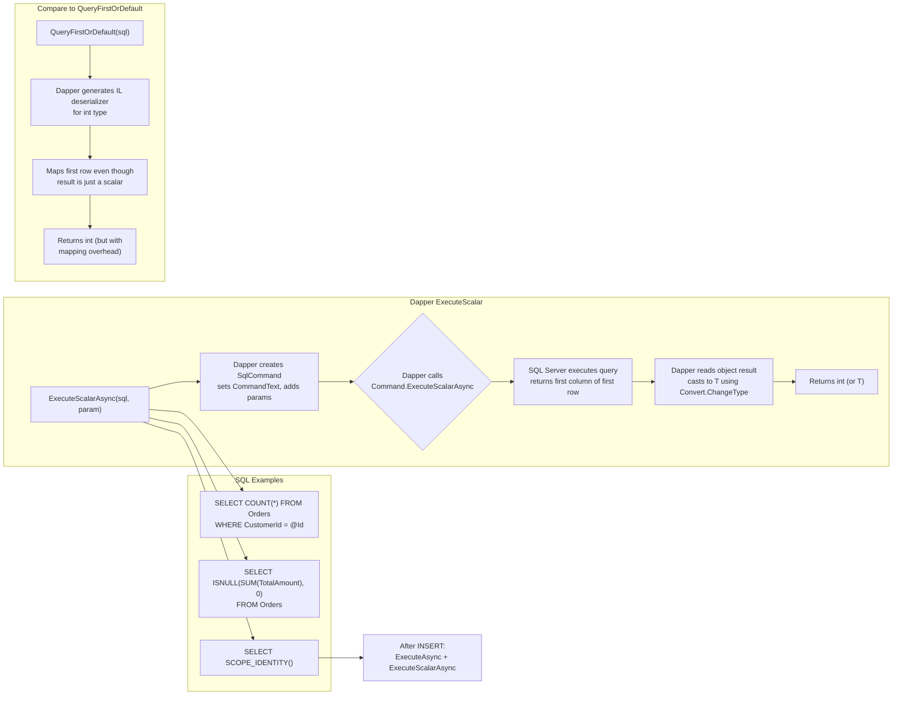

## Navigation

**Domain:** [[8 — Databases]] > **Group:** Dapper
**Previous:** [[8.858 — Dapper — Execute — INSERT, UPDATE, DELETE]] | **Next:** [[8.860 — Dapper — Stored Procedure Calling]]

### Prerequisites

- [[8.853 — Dapper — QueryT — Basic Querying]] — ExecuteScalar is a specialization of Query for single-value results.
- [[8.858 — Dapper — Execute — INSERT, UPDATE, DELETE]] — ExecuteScalar is commonly paired with Execute for INSERT.
- [[8.854 — Dapper — QueryFirstOrDefaultT and QuerySingleT]] — understanding the difference between single-value and single-row methods is critical for choosing the right Dapper method.

### Where This Fits

`ExecuteScalar<T>` is Dapper's wrapper over ADO.NET's `ExecuteScalar` — it executes a command and returns the first column of the first row as a specific type `T`. A .NET backend engineer reaches for this when checking existence (`SELECT COUNT(1) FROM Orders WHERE ...`), getting the next identity value after INSERT (`SCOPE_IDENTITY()`), computing aggregates (`SELECT SUM(Amount) FROM ...`), or fetching a single configuration value. When this is unknown, teams use `QueryFirstOrDefault<T>` for single values — which works but incurs unnecessary mapping overhead (IL Emit for a type that maps a single column). The interview signal is moderate: it tests whether a candidate knows that `ExecuteScalar` is the fastest Dapper method because it does zero object mapping.

---

## Core Mental Model

`ExecuteScalar<T>` executes SQL that returns a single value — the first column of the first row of the result set — and casts it to `T`. Dapper calls ADO.NET's `IDbCommand.ExecuteScalar()` and applies a type conversion to the returned `object` to produce the strongly-typed `T`. The method does NOT generate IL deserializers, does NOT map to user-defined types, and does NOT iterate through rows. It is the simplest, fastest method in Dapper's API. The invariant: **the SQL must return exactly one column in one row; any additional columns or rows are ignored.** The recognition pattern: a SQL aggregate function (`COUNT`, `SUM`, `MAX`, `MIN`, `AVG`), `SCOPE_IDENTITY()`, or `EXISTS` predicate, wrapped in `ExecuteScalar<T>`.

### Classification

`ExecuteScalar<T>` is a **Dapper extension method on `IDbConnection`** that wraps **ADO.NET `IDbCommand.ExecuteScalar()`**. It belongs to the **Dapper command execution layer** with minimal overhead — no IL Emit, no type mapping, no row iteration. The performance is effectively raw ADO.NET with parameter binding. The method supports generics for the return type but uses `Convert.ChangeType` internally, not Dapper's type deserializer cache. The method is **not cached** — each call creates a new `IDbCommand` (unlike Dapper's type deserializers which are cached per type).



### Key Properties

|Property|Value|Notes|
|---|---|---|
|Return type|Generic T|Specify at call site: ExecuteScalarAsync<int>()|
|Mapping overhead|Minimal|Convert.ChangeType only — no IL Emit|
|NULL handling|Returns default(T) for NULL|int? for nullable aggregates|
|Async support|Full|ExecuteScalarAsync with CancellationToken|
|Result set consumed|First row, first column only|All other data ignored by ADO.NET|
|EF Core equivalent|ExecuteSqlRaw + scalar|Or LINQ with Select + FirstOrDefault|
|SQL injection safe|Yes (parameterized)|Same parameter binding as Query|
|Transaction support|Yes|Pass IDbTransaction parameter|

---

## Deep Mechanics

### How the Engine Executes This

1. **Dapper receives `connection.ExecuteScalarAsync<T>(sql, param)`.** The SQL must return a scalar value (one column, one row). Examples: `SELECT COUNT(*) FROM Orders`, `SELECT SCOPE_IDENTITY()`.

2. **Dapper creates an `IDbCommand`.** Sets the `CommandText` to the SQL. Adds parameters from the provided object (anonymous type or DynamicParameters).

3. **Dapper calls `IDbCommand.ExecuteScalarAsync()`.** This sends the command to SQL Server. ADO.NET's `ExecuteScalar` is optimized internally: it calls `ExecuteReader` with `CommandBehavior.SingleResult | CommandBehavior.SingleRow` — this hints the server that only the first row of the first result set is needed.

4. **SQL Server executes the query.** The query optimizer sees the `SingleRow` hint. For aggregate queries like `SELECT COUNT(*)`, the plan is trivial — a Stream Aggregate or Table Scan depending on the predicate. For `SCOPE_IDENTITY()`, the engine returns the last identity value generated in the current scope without touching any table.

5. **ADO.NET returns the first column of the first row as `object`.** If the result is `DBNull.Value`, ADO.NET returns `null`. If no rows match (e.g., `SELECT MAX(Price) FROM Products WHERE 1=0`), ADO.NET returns `null` for the scalar result.

6. **Dapper converts to `T`.** Dapper calls `Convert.ChangeType(result, typeof(T))` for the returned object. For nullable value types (`int?`), Dapper returns `null` if the result is `DBNull.Value` or `null`.

### SQL Visibility

```csharp
// Get order count for a customer
public async Task<int> GetOrderCountAsync(int customerId, CancellationToken ct)
{
    const string sql = @"
        SELECT COUNT(*)
        FROM Orders
        WHERE CustomerId = @CustomerId;";

    await using var connection = _connectionFactory.Create();
    await connection.OpenAsync(ct);

    var count = await connection.ExecuteScalarAsync<int>(
        new CommandDefinition(sql, new { CustomerId = customerId },
            cancellationToken: ct));

    return count;
}
```

```sql
-- The SQL that executes:
SELECT COUNT(*)
FROM Orders
WHERE CustomerId = @CustomerId;

-- SQL Server execution (via profiler):
-- exec sp_executesql N'SELECT COUNT(*) FROM Orders WHERE CustomerId = @CustomerId',
--   N'@CustomerId int', @CustomerId=42
```

**ExecuteScalar for SCOPE_IDENTITY():**

```csharp
public async Task<int> InsertOrderAndGetIdAsync(Order order, CancellationToken ct)
{
    const string insertSql = @"
        INSERT INTO Orders (CustomerId, OrderDate, Status, TotalAmount)
        VALUES (@CustomerId, @OrderDate, @Status, @TotalAmount);";

    const string identitySql = "SELECT SCOPE_IDENTITY();";

    await using var connection = _connectionFactory.Create();
    await connection.OpenAsync(ct);

    // Execute INSERT
    await connection.ExecuteAsync(
        new CommandDefinition(insertSql, order, cancellationToken: ct));

    // Get the new identity — separate round trip!
    var newId = await connection.ExecuteScalarAsync<int>(
        new CommandDefinition(identitySql, cancellationToken: ct));

    return newId;
}
```

**Better: Use OUTPUT INSERTED in one round trip:**

```csharp
// Single round trip with OUTPUT clause
public async Task<int> InsertOrderAndGetIdAsync_Better(Order order, CancellationToken ct)
{
    const string sql = @"
        INSERT INTO Orders (CustomerId, OrderDate, Status, TotalAmount)
        OUTPUT INSERTED.OrderId
        VALUES (@CustomerId, @OrderDate, @Status, @TotalAmount);";

    await using var connection = _connectionFactory.Create();
    await connection.OpenAsync(ct);

    var newId = await connection.ExecuteScalarAsync<int>(
        new CommandDefinition(sql, order, cancellationToken: ct));

    return newId;
}
```

**EF Core equivalent:**

```csharp
// EF Core — COUNT
var orderCount = await dbContext.Orders
    .CountAsync(o => o.CustomerId == customerId, ct);

// EF Core — SUM
var totalRevenue = await dbContext.Orders
    .SumAsync(o => (decimal?)o.TotalAmount, ct) ?? 0m;

// EF Core — MAX
var maxOrderTotal = await dbContext.Orders
    .MaxAsync(o => (decimal?)o.TotalAmount, ct) ?? 0m;
```

**Generated SQL (EF Core):**

```sql
-- EF Core COUNT
SELECT COUNT(*)
FROM [Orders] AS [o]
WHERE [o].[CustomerId] = @__customerId_0;

-- EF Core SUM
SELECT COALESCE(SUM([o].[TotalAmount]), 0)
FROM [Orders] AS [o];
```

### Execution Plan Analysis

For `SELECT COUNT(*) FROM Orders WHERE CustomerId = @CustomerId`:

- **With index on CustomerId:** `[Index Seek on IX_Orders_CustomerId]` → `[Stream Aggregate]` → `[Compute Scalar]` — the index seek touches only the CustomerId index pages (narrower than clustered index), then the stream aggregate counts rows. Logical reads: ~2 per level of the index.
- **Without index:** `[Clustered Index Scan]` → `[Stream Aggregate]` — full scan of all rows. Logical reads: ~N pages (e.g., 1000 pages for 100K rows).

```
Plan shape (with index):
  Index Seek (IX_Orders_CustomerId, seek on CustomerId=42)
    → Stream Aggregate (COUNT(*))
  Estimated Cost: ~0.5%  |  Logical Reads: ~3

Plan shape (without index):
  Clustered Index Scan (PK_Orders, full scan)
    → Stream Aggregate (COUNT(*))
  Estimated Cost: ~100%  |  Logical Reads: ~1000
```

For `SELECT SCOPE_IDENTITY()`:

- Plan is trivial: `[Constant Scan]` → `[Compute Scalar]` — SQL Server returns the last identity value without touching any table. Logical reads: 0.

### Cost Visibility

```sql
SET STATISTICS IO ON;
SET STATISTICS TIME ON;

-- COUNT with index
SELECT COUNT(*) FROM Orders WHERE CustomerId = 42;
-- Expected output:
-- Table 'Orders'. Scan count 1, logical reads 3, physical reads 0
-- SQL Server Execution Times: CPU time = 0ms, elapsed time = 0ms

-- COUNT without index
SELECT COUNT(*) FROM Orders WHERE CustomerId = 42;
-- Table 'Orders'. Scan count 1, logical reads 1040, physical reads 0
-- SQL Server Execution Times: CPU time = 5ms, elapsed time = 10ms

-- SCOPE_IDENTITY
SELECT SCOPE_IDENTITY();
-- SQL Server Execution Times: CPU time = 0ms, elapsed time = 0ms
-- (no table access)
```

### Failure Modes

- **No rows returned:** For `SELECT MAX(Price) FROM Products WHERE 1=0`, `ExecuteScalarAsync<decimal>()` throws `InvalidCastException` because ADO.NET returns `null` and Dapper tries to `Convert.ChangeType(null, typeof(decimal))` which fails. Fix: use `decimal?` as the generic type to handle NULL.
- **More than one column:** `ExecuteScalar` reads only the first column — extra columns are ignored but the server still sends them over the wire. Fix the SQL to SELECT only the needed column.
- **More than one row:** `ExecuteScalar` reads only the first row — extra rows are ignored but still consume server resources. Fix the SQL with `TOP 1` if needed.
- **Wrong type T:** If the SQL returns `BIGINT` and you request `ExecuteScalarAsync<int>`, Dapper's `Convert.ChangeType` may throw `InvalidCastException`. Use the matching .NET type (long for BIGINT, decimal for DECIMAL/MONEY, etc.).

---

## Production Patterns and Implementation

### Primary Dapper Implementation — Dashboard Aggregates

```csharp
public sealed class DashboardService
{
    private readonly IDbConnectionFactory _connectionFactory;

    public DashboardService(IDbConnectionFactory connectionFactory)
    {
        _connectionFactory = connectionFactory;
    }

    public async Task<DashboardAggregates> GetAggregatesAsync(
        int customerId, CancellationToken ct)
    {
        const string orderCountSql = @"
            SELECT COUNT(*)
            FROM Orders
            WHERE CustomerId = @CustomerId;";

        const string totalRevenueSql = @"
            SELECT ISNULL(SUM(TotalAmount), 0)
            FROM Orders
            WHERE CustomerId = @CustomerId;";

        const string lastOrderDateSql = @"
            SELECT MAX(OrderDate)
            FROM Orders
            WHERE CustomerId = @CustomerId;";

        const string avgOrderValueSql = @"
            SELECT ISNULL(AVG(TotalAmount), 0)
            FROM Orders
            WHERE CustomerId = @CustomerId;";

        await using var connection = _connectionFactory.Create();
        await connection.OpenAsync(ct);

        // Execute all 4 scalar queries — 4 round trips
        var orderCount    = await connection.ExecuteScalarAsync<int>(
            new CommandDefinition(orderCountSql, new { CustomerId = customerId }, cancellationToken: ct));

        var totalRevenue  = await connection.ExecuteScalarAsync<decimal>(
            new CommandDefinition(totalRevenueSql, new { CustomerId = customerId }, cancellationToken: ct));

        var lastOrderDate = await connection.ExecuteScalarAsync<DateTime?>(
            new CommandDefinition(lastOrderDateSql, new { CustomerId = customerId }, cancellationToken: ct));

        var avgOrderValue = await connection.ExecuteScalarAsync<decimal>(
            new CommandDefinition(avgOrderValueSql, new { CustomerId = customerId }, cancellationToken: ct));

        return new DashboardAggregates(orderCount, totalRevenue, lastOrderDate, avgOrderValue);
    }
}

public sealed record DashboardAggregates(
    int OrderCount,
    decimal TotalRevenue,
    DateTime? LastOrderDate,
    decimal AvgOrderValue);
```

**Better: Single round trip with QueryMultiple:**

```csharp
public async Task<DashboardAggregates> GetAggregatesAsync_Faster(
    int customerId, CancellationToken ct)
{
    const string sql = @"
        SELECT COUNT(*), ISNULL(SUM(TotalAmount), 0),
               MAX(OrderDate), ISNULL(AVG(TotalAmount), 0)
        FROM Orders
        WHERE CustomerId = @CustomerId;";

    await using var connection = _connectionFactory.Create();
    await connection.OpenAsync(ct);

    var result = await connection.QuerySingleAsync<(int, decimal, DateTime?, decimal)>(
        new CommandDefinition(sql, new { CustomerId = customerId }, cancellationToken: ct));

    return new DashboardAggregates(
        result.Item1, result.Item2, result.Item3, result.Item4);
}
```

### Check Existence

```csharp
public async Task<bool> CustomerExistsAsync(int customerId, CancellationToken ct)
{
    const string sql = @"
        SELECT CASE WHEN EXISTS (
            SELECT 1 FROM Customers WHERE CustomerId = @CustomerId
        ) THEN 1 ELSE 0 END;";

    await using var connection = _connectionFactory.Create();
    await connection.OpenAsync(ct);

    var exists = await connection.ExecuteScalarAsync<int>(
        new CommandDefinition(sql, new { CustomerId = customerId },
            cancellationToken: ct));

    return exists == 1;
}
```

### Get Next ID (Non-Identity Strategy)

```csharp
// For tables using a sequential ID strategy (not identity)
public async Task<int> GetNextOrderIdAsync(CancellationToken ct)
{
    const string sql = @"
        SELECT ISNULL(MAX(OrderId), 0) + 1
        FROM Orders WITH (TABLOCKX, HOLDLOCK);"; // Serializes

    await using var connection = _connectionFactory.Create();
    await connection.OpenAsync(ct);

    return await connection.ExecuteScalarAsync<int>(
        new CommandDefinition(sql, cancellationToken: ct));
}
```

### Configuration and Wiring

```csharp
// Program.cs
builder.Services.AddSingleton<IDbConnectionFactory>(_ =>
    new SqlConnectionFactory(builder.Configuration.GetConnectionString("DefaultConnection")));
builder.Services.AddScoped<DashboardService>();
```

### SQL Server vs PostgreSQL Differences

```sql
-- PostgreSQL — same aggregate functions, different identity retrieval
SELECT COUNT(*) FROM Orders WHERE CustomerId = @CustomerId;

-- PostgreSQL identity retrieval after INSERT
INSERT INTO Orders (CustomerId, TotalAmount)
VALUES (@CustomerId, @TotalAmount)
RETURNING OrderId;
-- Use ExecuteScalarAsync<int> with the INSERT + RETURNING SQL

-- PostgreSQL EXISTS
SELECT EXISTS(SELECT 1 FROM Customers WHERE CustomerId = @CustomerId);
-- Returns boolean — use ExecuteScalarAsync<bool>
```

```csharp
// PostgreSQL — ExecuteScalar with RETURNING
public async Task<int> InsertOrderPostgresAsync(Order order, CancellationToken ct)
{
    const string sql = @"
        INSERT INTO Orders (CustomerId, OrderDate, Status, TotalAmount)
        VALUES (@CustomerId, @OrderDate, @Status, @TotalAmount)
        RETURNING OrderId;";

    await using var connection = new NpgsqlConnection(_connectionString);
    await connection.OpenAsync(ct);
    return await connection.ExecuteScalarAsync<int>(
        new CommandDefinition(sql, order, cancellationToken: ct));
}
```

---

## Gotchas and Production Pitfalls

### 1 — ExecuteScalar<T> with Non-Nullable T When Result Is NULL

**Pitfall:** The query returns no rows (e.g., `SELECT MAX(Price) FROM Products WHERE 1=0`) and the generic type is non-nullable.

```csharp
// ❌ Wrong: non-nullable decimal — throws on NULL result
var maxPrice = await connection.ExecuteScalarAsync<decimal>(
    "SELECT MAX(Price) FROM Products WHERE Active = 0");
// No rows match — MAX returns NULL — ExecuteScalar returns null
// Convert.ChangeType(null, typeof(decimal)) throws InvalidCastException
```

**Symptom:** `InvalidCastException` when no rows match. The application crashes instead of returning 0.

**Fix:**

```csharp
// ✅ Correct: use nullable type, then coalesce
var maxPrice = await connection.ExecuteScalarAsync<decimal?>(
    "SELECT MAX(Price) FROM Products WHERE Active = 0");
return maxPrice ?? 0m;

// ✅ Alternative: use ISNULL in SQL
var maxPrice = await connection.ExecuteScalarAsync<decimal>(
    "SELECT ISNULL(MAX(Price), 0) FROM Products WHERE Active = 0");
```

**Cost of not fixing:** 500 error for empty result sets. Every product category with no active products crashes the API.

### 2 — ExecuteScalar vs QueryFirstOrDefault — Wrong Method Choice

**Pitfall:** Developer uses `QueryFirstOrDefault<T>` for a scalar value, incurring unnecessary mapping overhead.

```csharp
// ❌ Wrong: QueryFirstOrDefault maps to a type instead of a scalar
var orderCount = await connection.QueryFirstOrDefaultAsync<int>(
    "SELECT COUNT(*) FROM Orders WHERE CustomerId = @Id", new { Id = 42 });
// This works but Dapper generates IL for int deserialization unnecessarily
```

**Symptom:** Slightly higher memory allocation and CPU per call. At low volume (1 RPS), invisible. At high volume (1000 RPS), measurable GC pressure.

**Fix:**

```csharp
// ✅ Correct: ExecuteScalar — no IL Emit, no mapping
var orderCount = await connection.ExecuteScalarAsync<int>(
    "SELECT COUNT(*) FROM Orders WHERE CustomerId = @Id", new { Id = 42 });
```

**Cost of not fixing:** ~200ns extra per call at 1000 RPS = negligible. The real cost is in interview settings — choosing the wrong method signals lack of Dapper depth.

### 3 — SCOPE_IDENTITY() Round Trip Instead of OUTPUT

**Pitfall:** Using `ExecuteScalar` for `SCOPE_IDENTITY()` in a separate command after `Execute`, adding an unnecessary round trip.

```csharp
// ❌ Wrong: two round trips
await connection.ExecuteAsync(
    "INSERT INTO Orders (CustomerId, TotalAmount) VALUES (@C, @T)", order);
var newId = await connection.ExecuteScalarAsync<int>("SELECT SCOPE_IDENTITY();");
```

**Symptom:** Two round trips instead of one. In high-throughput scenarios, the extra 2ms per insert adds up. More importantly, `SCOPE_IDENTITY()` outside the INSERT scope can return the wrong value if another INSERT executes between the two calls (though `SCOPE_IDENTITY` is scoped to the session/batch, it's still risky).

**Fix:**

```csharp
// ✅ Correct: OUTPUT INSERTED in one round trip
var newId = await connection.ExecuteScalarAsync<int>(
    "INSERT INTO Orders (CustomerId, TotalAmount) OUTPUT INSERTED.OrderId VALUES (@C, @T)", order);
```

**Cost of not fixing:** 50% more round trips for every INSERT. Potential race condition in high-concurrency scenarios.

### 4 — ExecuteScalar with BigInt Returns Wrong Type

**Pitfall:** SQL Server column is `BIGINT` (64-bit) but `ExecuteScalarAsync<int>` uses `int` (32-bit).

```csharp
// ❌ Wrong: BIGINT doesn't fit in int
var count = await connection.ExecuteScalarAsync<int>(
    "SELECT COUNT_BIG(*) FROM Orders");
// COUNT_BIG returns BIGINT — value may exceed int.MaxValue
```

**Symptom:** `InvalidCastException` when the value exceeds 2,147,483,647. Or silent truncation if the value is smaller but the cast still fails depending on the ADO.NET provider.

**Fix:**

```csharp
// ✅ Correct: use long for BIGINT
var count = await connection.ExecuteScalarAsync<long>(
    "SELECT COUNT_BIG(*) FROM Orders");
```

**Cost of not fixing:** Runtime exception when the table grows large enough. Production outage at 3 AM.

### 5 — ExecuteScalar with No Result Set (DDL)

**Pitfall:** Using `ExecuteScalar` for a DDL statement that returns no rows.

```csharp
// ❌ Wrong: ExecuteScalar on DDL returns null
var result = await connection.ExecuteScalarAsync<int>(
    "TRUNCATE TABLE AuditLog;");
// ADO.NET returns null for DDL — Convert.ChangeType(null, typeof(int)) throws
```

**Symptom:** `InvalidCastException` on DDL statements.

**Fix:** Use `ExecuteAsync` for DDL, not `ExecuteScalarAsync`.

```csharp
// ✅ Correct: Execute for DDL
await connection.ExecuteAsync("TRUNCATE TABLE AuditLog;");
```

**Cost of not fixing:** Runtime exception when running schema migration scripts.

### 6 — ExecuteScalarAsync<bool> for EXISTS — SQL Server BIT Behavior

**Pitfall:** Using `ExecuteScalarAsync<bool>` with `SELECT 1 WHERE EXISTS(...)` — SQL Server returns `int`, not `bit`.

```csharp
// ❌ Wrong: SQL returns int, not bool
var exists = await connection.ExecuteScalarAsync<bool>(
    "SELECT CASE WHEN EXISTS(SELECT 1 FROM Orders WHERE OrderId = @Id) THEN 1 ELSE 0 END;");
// Some ADO.NET providers convert int→bool, others throw InvalidCastException
```

**Symptom:** `InvalidCastException: "Specified cast is not valid."` on some providers/environments.

**Fix:**

```csharp
// ✅ Option A: let SQL Server return BIT
var exists = await connection.ExecuteScalarAsync<bool>(
    "SELECT CAST(CASE WHEN EXISTS(SELECT 1 FROM Orders WHERE OrderId = @Id) THEN 1 ELSE 0 END AS BIT);");

// ✅ Option B: use int and compare
var exists = await connection.ExecuteScalarAsync<int>(
    "SELECT CASE WHEN EXISTS(SELECT 1 FROM Orders WHERE OrderId = @Id) THEN 1 ELSE 0 END;");
return exists == 1;
```

**Cost of not fixing:** Intermittent cast failures depending on the ADO.NET provider and version.

---

## Performance Implications

### Benchmark: ExecuteScalar vs QueryFirstOrDefault vs QuerySingle

```csharp
[MemoryDiagnoser]
[SimpleJob(RuntimeMoniker.Net90, iterationCount: 10, warmupCount: 3)]
public class ExecuteScalarBenchmark
{
    private IDbConnection _connection = default!;

    [GlobalSetup]
    public void Setup()
    {
        _connection = new SqlConnection("Server=.;Database=BenchmarkDb;Integrated Security=True;");
        _connection.Open();
    }

    [GlobalCleanup]
    public void Cleanup() => _connection.Dispose();

    [Benchmark(Baseline = true)]
    public async Task<int> ExecuteScalar()
    {
        return await _connection.ExecuteScalarAsync<int>(
            "SELECT COUNT(*) FROM Orders WHERE CustomerId = 42");
    }

    [Benchmark]
    public async Task<int> QueryFirstOrDefault()
    {
        return await _connection.QueryFirstOrDefaultAsync<int>(
            "SELECT COUNT(*) FROM Orders WHERE CustomerId = 42");
    }

    [Benchmark]
    public async Task<int> QuerySingle()
    {
        return await _connection.QuerySingleAsync<int>(
            "SELECT COUNT(*) FROM Orders WHERE CustomerId = 42");
    }
}
```

**Expected results (approximate, SQL Server 2022, NVMe, 1000 iterations):**

|Method|Mean|Allocated|IL Emit|
|---|---|---|---|
|ExecuteScalar|~95 μs|~450 B|None|
|QueryFirstOrDefault|~110 μs|~800 B|Yes (int deserializer)|
|QuerySingle|~115 μs|~850 B|Yes (int deserializer)|

**Improvement:** ExecuteScalar is ~15% faster and ~45% less memory than QueryFirstOrDefault for scalar values.

### Benchmark: OUTPUT vs SCOPE_IDENTITY() (2 round trips)

Approach A (OUTPUT, 1 round trip):
```csharp
var id = await connection.ExecuteScalarAsync<int>(
    "INSERT INTO Orders (CustomerId) OUTPUT INSERTED.OrderId VALUES (@C)", param);
```

Approach B (SCOPE_IDENTITY, 2 round trips):
```csharp
await connection.ExecuteAsync("INSERT INTO Orders (CustomerId) VALUES (@C)", param);
var id = await connection.ExecuteScalarAsync<int>("SELECT SCOPE_IDENTITY();");
```

|Method|Round Trips|Mean|Reliability|
|---|---|---|---|
|OUTPUT INSERTED|1|~150 μs|Safe (same scope)|
|SCOPE_IDENTITY|2|~280 μs|Risky (separate call)|

---

## Interview Arsenal

### Question Bank

1. **What does Dapper's ExecuteScalar<T> do and when should you use it?** (Definition — first column of first row as T)
2. **How does ExecuteScalar work under the hood compared to QueryFirstOrDefault?** (Mechanism — ADO.NET ExecuteScalar vs IL Emit)
3. **What is the performance difference between ExecuteScalar and QueryFirstOrDefault for a COUNT query?** (Performance — ~15% faster, no IL Emit)
4. **What happens if ExecuteScalar's SQL returns NULL and T is non-nullable?** (Gotcha — InvalidCastException)
5. **How does ExecuteScalar compare to QuerySingle for single-value retrieval?** (Comparison — ExecuteScalar is faster for scalars)
6. **What execution plan does SELECT COUNT(*) FROM Orders WHERE CustomerId = @Id produce?** (Execution plan — index seek + stream aggregate)
7. **How do you use ExecuteScalar to get the next identity after INSERT in a single round trip?** (Scale — OUTPUT INSERTED with ExecuteScalar)
8. **When would you use ExecuteScalar vs Output Parameters for retrieving a single value from a stored procedure?** (.NET integration — both work, ExecuteScalar is simpler for single values)

### Spoken Answers

**Q1: What does Dapper's ExecuteScalar<T> do and when should you use it?**

> **Average answer:** "It returns a single value from a query — like COUNT or MAX."

> **Great answer:** "ExecuteScalar<T> is Dapper's wrapper over ADO.NET's ExecuteScalar. It executes a command and returns the first column of the first row as a strongly-typed value T. Internally, ADO.NET uses CommandBehavior.SingleResult | CommandBehavior.SingleRow, which hints SQL Server that only one row is needed. Dapper then applies Convert.ChangeType to cast the result object to T. The key difference from QueryFirstOrDefault<T> is that ExecuteScalar generates NO IL Emit — it doesn't create a cached type deserializer. For scalar values like COUNT, SUM, MAX, or SCOPE_IDENTITY, this makes ExecuteScalar about 15% faster and 45% lower memory allocation. I use it for any query that returns a single scalar value — existence checks, aggregate statistics, configuration lookups. The main gotcha is handling NULL returns: if MAX returns NULL (no matching rows), ExecuteScalarAsync<decimal> throws InvalidCastException because you can't Convert.ChangeType(null, decimal). The fix is either use a nullable type like decimal? or wrap the aggregate in ISNULL/COALESCE in SQL."

**Q5: How does ExecuteScalar compare to QuerySingle for single-value retrieval?**

> **Average answer:** "Both return single values. ExecuteScalar is faster."

> **Great answer:** "ExecuteScalar and QuerySingle serve different purposes. ExecuteScalar returns a single primitive value (int, string, decimal, DateTime) — it reads the first column of the first row and uses Convert.ChangeType. QuerySingle returns an entire object — it maps the full row to a type T using Dapper's IL-generated deserializer. The performance difference matters: ExecuteScalar allocates ~450 bytes per call with no IL Emit cost. QuerySingle allocates ~850 bytes and pays the deserializer cost. For COUNT(*), SCOPE_IDENTITY(), or EXISTS checks, use ExecuteScalar. For SELECT * FROM Orders WHERE OrderId = @Id, use QuerySingle. The wrong choice is subtle: if you use QuerySingle<int>('SELECT COUNT(*) FROM ...'), it works but adds unnecessary overhead. If you use ExecuteScalar<Order>('SELECT * FROM Orders WHERE OrderId = @Id'), it fails because ExecuteScalar returns only the first column as a scalar, not the entire row."

**Q7: How do you use ExecuteScalar to get the next identity after INSERT in a single round trip?**

> **Average answer:** "Use OUTPUT INSERTED with ExecuteScalar."

> **Great answer:** "The production pattern is: write the INSERT SQL with an OUTPUT INSERTED.Id clause and call ExecuteScalarAsync<int> on the entire command. This gives you the new identity in one round trip. The alternative — ExecuteAsync for the INSERT followed by ExecuteScalarAsync('SELECT SCOPE_IDENTITY()') — adds a second round trip and creates a race condition window. OUTPUT INSERTED is atomic: SQL Server executes the INSERT, captures the generated identity from the virtual inserted table, and returns it all in one TDS response. Dapper's ExecuteScalar reads the first column of the first row of the OUTPUT result set and converts it to int. This is my default pattern for identity retrieval. For PostgreSQL, the equivalent is RETURNING Id in the INSERT statement. The one caveat: if Dapper's ExecuteScalarAsync doesn't work with OUTPUT on your provider (some providers need QuerySingleAsync), fall back to QuerySingleAsync<int> with the same SQL — it works identically."

### Interview Trigger

The interviewer asks: "How do you check if a customer exists in the database using Dapper?" A candidate who says `QueryFirstOrDefault` and checks for null gives a surface answer. The deeper signal is when the candidate says `ExecuteScalarAsync<int>` with `SELECT CASE WHEN EXISTS(...)` — this demonstrates knowledge that `ExecuteScalar` is the most efficient method and that `EXISTS` is the most efficient SQL for existence checks.

### Comparison Table

| | ExecuteScalar<T> | QueryFirstOrDefault<T> | QuerySingle<T> |
|---|---|---|---|
| Result consumed | First column, first row only | Full first row (all columns) | Full first row (all columns) |
| Throws on no data | Returns default(T) | Returns default(T) | Throws InvalidOperationException |
| Throws on multiple rows | No (ignores extras) | No (ignores extras) | Throws InvalidOperationException |
| IL Emit | None | Yes (type deserializer) | Yes (type deserializer) |
| Memory allocation | ~450 B | ~800 B | ~850 B |
| When to choose | Scalar values (COUNT, SUM, IDENTITY) | Optional single row | Required single row |
| SQL required | Single column SELECT | Full row SELECT | Full row SELECT |

---

## Decision Framework

### When to Use ExecuteScalar

```mermaid
flowchart TD
    A[Need a single value from SQL] --> B{Value is a<br/>primitive type?<br/>(int, decimal, string, DateTime)}
    B -->|Yes — primitive| C{Can the SQL return NULL?}
    C -->|Yes — NULL possible| D{Use nullable T<br/>(int?, decimal?) or<br/>ISNULL in SQL}
    D --> E[ExecuteScalarAsync<T?>]
    C -->|No — always non-null| F[ExecuteScalarAsync<T>]
    B -->|No — needs a row of columns| G{One row<br/>expected?}
    G -->|Yes — exactly one| H[QuerySingleAsync<T>]
    G -->|No — zero or one| I[QueryFirstOrDefaultAsync<T>]
    G -->|No — multiple| J[QueryAsync<T>]

    E --> K[Is this part of a multi-result-set query?]
    K -->|Yes| L[Use GridReader with ReadSingleAsync]
    K -->|No| M[Single round trip — optimal]
    F --> K

    N[Need identity after INSERT?] --> O{OUTPUT clause supported?}
    O -->|Yes| P[ExecuteScalarAsync with<br/>OUTPUT INSERTED.Id — 1 round trip]
    O -->|No| Q[ExecuteAsync + ExecuteScalarAsync<br/>SCOPE_IDENTITY — 2 round trips]
```

### Application Checklist

- [ ] The SQL is a single column, optionally a single row (aggregate, scalar function, or identity)
- [ ] For nullable aggregates (MAX, MIN with possible empty set): use nullable type T? or ISNULL in SQL
- [ ] For identity retrieval: use OUTPUT INSERTED.Id in one round trip
- [ ] For existence check: use `SELECT CASE WHEN EXISTS(...) THEN 1 ELSE 0 END` with ExecuteScalarAsync<int>
- [ ] The generic type T matches the SQL column's SQL type exactly (int for INT, long for BIGINT, decimal for DECIMAL/MONEY)
- [ ] Not used for DDL statements (use ExecuteAsync instead)
- [ ] CancellationToken is passed through CommandDefinition
- [ ] Connection is opened before calling ExecuteScalarAsync (or use OpenAsync in the method)

### Tradeoff Summary

|What You Gain|What You Pay|
|---|---|
|Fastest Dapper method (no IL Emit)|Limited to single scalar value|
|~45% less memory than QueryFirstOrDefault|Cannot map to domain objects|
|Single round trip with OUTPUT|Must write raw SQL|

### Scale Thresholds

- **Always prefer** ExecuteScalar over QueryFirstOrDefault for primitive scalar values (COUNT, SUM, EXISTS, IDENTITY)
- **Performance difference visible at** >500 RPS (GC pressure from QueryFirstOrDefault's IL Emit allocation)
- **Memory savings matter at** >10K RPS (450 B vs 800 B per call = 3.5 MB/s saved)
- **Must handle NULL** for any aggregate on a filtered query — use nullable T or ISNULL

---

## Self-Check

### Conceptual Questions

1. What does Dapper's `ExecuteScalar<T>` return, and how does it differ from `QueryFirstOrDefault<T>`?
2. Under the hood, which ADO.NET method does `ExecuteScalar` call, and what CommandBehavior flags does it use?
3. What is the primary performance advantage of `ExecuteScalar` over `QueryFirstOrDefault` for a COUNT query?
4. What happens when `ExecuteScalar<decimal>` is called on a query that returns NULL?
5. How does `ExecuteScalar` compare to `Execute` in terms of ADO.NET method called?
6. How would you implement an existence check using `ExecuteScalar` that returns `bool`?
7. What is the difference between `ExecuteScalar` and `QuerySingle` for a `SELECT OrderId FROM Orders WHERE OrderId = @Id` query?
8. At what RPS does the difference between `ExecuteScalar` and `QueryFirstOrDefault` become measurable?
9. What index supports a `SELECT COUNT(*) FROM Orders WHERE CustomerId = @CustomerId` query?
10. Explain `ExecuteScalar` to a senior interviewer in 60 seconds.

<details>
<summary>Answers</summary>

1. `ExecuteScalar<T>` returns the first column of the first row as a strongly-typed T. `QueryFirstOrDefault<T>` maps the entire first row to a T object. For scalar values, `ExecuteScalar` is faster and allocates less memory because it uses `Convert.ChangeType` instead of IL-generated type deserializers.

2. `ExecuteScalar` calls `IDbCommand.ExecuteScalar()` which internally calls `ExecuteReader` with `CommandBehavior.SingleResult | CommandBehavior.SingleRow`. These flags hint the server that only the first row of the first result set is needed.

3. `ExecuteScalar` generates no IL Emit (no type deserializer cache), no row iteration, and uses `Convert.ChangeType` for the single value. It's ~15% faster and ~45% lower memory allocation than `QueryFirstOrDefault`.

4. `InvalidCastException`. ADO.NET's `ExecuteScalar` returns `null` when the result is `DBNull.Value` or no rows match. `Convert.ChangeType(null, typeof(decimal))` fails because `null` cannot be converted to a non-nullable value type.

5. `ExecuteScalar` calls `IDbCommand.ExecuteScalar()` (returns the first column of first row as object). `Execute` calls `IDbCommand.ExecuteNonQuery()` (returns affected rows count). They serve different purposes: `ExecuteScalar` for SELECT that returns a value, `Execute` for DML that returns affected rows.

6. Use `SELECT CAST(CASE WHEN EXISTS(...) THEN 1 ELSE 0 END AS BIT)` with `ExecuteScalarAsync<bool>`, or `SELECT CASE WHEN EXISTS(...) THEN 1 ELSE 0 END` with `ExecuteScalarAsync<int>` and check `== 1`.

7. `ExecuteScalar<int>` returns only the `OrderId` value (first column). `QuerySingle<Order>` maps the entire `Order` row including all columns. If you only need the ID, `ExecuteScalar` is faster. If you need the full object, use `QuerySingle<Order>`.

8. Above ~500 RPS, the extra memory allocation (~350 B per call) from `QueryFirstOrDefault` starts causing measurable GC pressure. At 10K RPS, it's ~3.5 MB/s extra allocation.

9. A non-clustered index on `Orders(CustomerId)` covering the COUNT — ideally a filtered index or one that includes no extra columns (narrowest possible index). SQL Server can do an index scan/seek on this narrow index instead of the full clustered index.

10. "ExecuteScalar<T> wraps ADO.NET's ExecuteScalar to return the first column of the first row as type T. It's the fastest Dapper method because it uses Convert.ChangeType — no IL Emit, no type deserializer, no row iteration. I use it for COUNT, SUM, MAX, SCOPE_IDENTITY, and EXISTS queries. The critical gotcha is NULL handling: if the query returns no rows, MAX returns NULL, and trying to cast NULL to a non-nullable T throws InvalidCastException. The fix is to use nullable types or ISNULL in SQL. For identity retrieval, I pair it with OUTPUT INSERTED in a single command to avoid the extra round trip of SCOPE_IDENTITY."

</details>

---

### Query Challenges

**Challenge 1 — Write the existence check**

Write a Dapper method that returns `true` if a customer with the given `email` exists in the `Customers` table, and `false` otherwise. Use `ExecuteScalar` and optimize for single round trip and minimal data transfer.

<details>
<summary>Solution</summary>

```csharp
public async Task<bool> CustomerEmailExistsAsync(string email, CancellationToken ct)
{
    const string sql = @"
        SELECT CASE WHEN EXISTS (
            SELECT 1 FROM Customers WHERE Email = @Email
        ) THEN 1 ELSE 0 END;";

    await using var connection = _connectionFactory.Create();
    await connection.OpenAsync(ct);

    var exists = await connection.ExecuteScalarAsync<int>(
        new CommandDefinition(sql, new { Email = email }, cancellationToken: ct));

    return exists == 1;
}
```

**Logical reads:** ~1 (index seek on IX_Customers_Email if indexed) \
**Execution plan:** [Index Seek on UX_Customers_Email (for UNIQUE constraint)] → [Top] → [Compute Scalar] \
**EF Core equivalent:** `await dbContext.Customers.AnyAsync(c => c.Email == email, ct)`

```sql
-- EF Core generated SQL:
SELECT TOP(1) 1
FROM [Customers] AS [c]
WHERE [c].[Email] = @__email_0;
```

</details>

---

**Challenge 2 — Fix the NULL handling bug**

```csharp
// This method should return the highest order total for a customer.
// It crashes when the customer has no orders.
public async Task<decimal> GetMaxOrderTotalAsync(int customerId, CancellationToken ct)
{
    return await connection.ExecuteScalarAsync<decimal>(
        "SELECT MAX(TotalAmount) FROM Orders WHERE CustomerId = @CustomerId",
        new { CustomerId = customerId });
}
```

Identify all bugs and fix them.

<details>
<summary>Solution</summary>

**Bugs:**
1. Non-nullable `decimal` T — `MAX(TotalAmount)` returns NULL when no orders match, causing `InvalidCastException`.
2. No `OpenAsync` call on connection.

**Fix:**

```csharp
public async Task<decimal> GetMaxOrderTotalAsync(int customerId, CancellationToken ct)
{
    const string sql = @"
        SELECT ISNULL(MAX(TotalAmount), 0)
        FROM Orders
        WHERE CustomerId = @CustomerId;";

    await using var connection = _connectionFactory.Create();
    await connection.OpenAsync(ct);

    return await connection.ExecuteScalarAsync<decimal>(
        new CommandDefinition(sql, new { CustomerId = customerId },
            cancellationToken: ct));
}
```

**Alternative fix (nullable T):**

```csharp
public async Task<decimal?> GetMaxOrderTotalAsync(int customerId, CancellationToken ct)
{
    const string sql = @"
        SELECT MAX(TotalAmount)
        FROM Orders
        WHERE CustomerId = @CustomerId;";

    await using var connection = _connectionFactory.Create();
    await connection.OpenAsync(ct);

    return await connection.ExecuteScalarAsync<decimal?>(
        new CommandDefinition(sql, new { CustomerId = customerId },
            cancellationToken: ct));
}
```

**After fix:** Returns 0 (with ISNULL) or null (with nullable T) instead of crashing.

</details>

---

**Challenge 3 — Diagnose the identity retrieval race condition**

```csharp
public async Task<int> CreateOrderAsync(int customerId, decimal amount, CancellationToken ct)
{
    await connection.ExecuteAsync(
        "INSERT INTO Orders (CustomerId, TotalAmount) VALUES (@C, @T)",
        new { C = customerId, T = amount });

    var newId = await connection.ExecuteScalarAsync<int>(
        "SELECT SCOPE_IDENTITY();");

    return newId;
}
```

A QA tester reports that under high concurrency, some orders return the wrong OrderId. What is the bug? Fix it.

<details>
<summary>Solution</summary>

**Root cause:** Two round trips — INSERT then `SCOPE_IDENTITY()`. Under high concurrency, if the connection is returned to the pool between the two calls and the next request reuses the same connection, `SCOPE_IDENTITY()` returns the identity from the *other* request's INSERT.

Actually, `SCOPE_IDENTITY()` is scoped to the session/batch. The real risk is that the connection is pooled, and if the INSERT and SCOPE_IDENTITY execute on different pooled connections (which shouldn't happen if they share the same connection object), the value is wrong. However, the more practical risk is that between `ExecuteAsync` and `ExecuteScalarAsync`, another INSERT could execute on the same connection if the code shares a connection across requests (e.g., singleton connection — which is itself a bug).

**Fix — use OUTPUT INSERTED in one round trip:**

```csharp
public async Task<int> CreateOrderAsync(int customerId, decimal amount, CancellationToken ct)
{
    const string sql = @"
        INSERT INTO Orders (CustomerId, TotalAmount)
        OUTPUT INSERTED.OrderId
        VALUES (@CustomerId, @TotalAmount);";

    await using var connection = _connectionFactory.Create();
    await connection.OpenAsync(ct);

    return await connection.ExecuteScalarAsync<int>(
        new CommandDefinition(sql,
            new { CustomerId = customerId, TotalAmount = amount },
            cancellationToken: ct));
}
```

**After fix:** Single round trip. Identity retrieval is atomic. No race condition.

</details>

---

**Challenge 4 — Performance: Compare ExecuteScalar with aggregates**

An API dashboard needs: order count, total revenue, average order value, and most recent order date for a customer. Write the Dapper code using (a) four separate ExecuteScalar calls and (b) a single QueryMultiple or single-row query. Compare round trips.

<details>
<summary>Solution</summary>

**Approach A — 4 separate ExecuteScalar calls (4 round trips):**

```csharp
public async Task<DashboardStats> GetStatsAsync(int customerId, CancellationToken ct)
{
    await using var connection = _connectionFactory.Create();
    await connection.OpenAsync(ct);

    var count     = await connection.ExecuteScalarAsync<int>(
        "SELECT COUNT(*) FROM Orders WHERE CustomerId = @Id", new { Id = customerId }, ct);
    var revenue   = await connection.ExecuteScalarAsync<decimal>(
        "SELECT ISNULL(SUM(TotalAmount), 0) FROM Orders WHERE CustomerId = @Id", new { Id = customerId }, ct);
    var avg       = await connection.ExecuteScalarAsync<decimal>(
        "SELECT ISNULL(AVG(TotalAmount), 0) FROM Orders WHERE CustomerId = @Id", new { Id = customerId }, ct);
    var lastDate  = await connection.ExecuteScalarAsync<DateTime?>(
        "SELECT MAX(OrderDate) FROM Orders WHERE CustomerId = @Id", new { Id = customerId }, ct);

    return new DashboardStats(count, revenue, avg, lastDate);
}
```

**Approach B — Single query, single round trip:**

```csharp
public async Task<DashboardStats> GetStatsAsync_Better(int customerId, CancellationToken ct)
{
    const string sql = @"
        SELECT COUNT(*), ISNULL(SUM(TotalAmount), 0),
               ISNULL(AVG(TotalAmount), 0), MAX(OrderDate)
        FROM Orders
        WHERE CustomerId = @CustomerId;";

    await using var connection = _connectionFactory.Create();
    await connection.OpenAsync(ct);

    var result = await connection.QuerySingleAsync<(int, decimal, decimal, DateTime?)>(
        new CommandDefinition(sql, new { CustomerId = customerId }, cancellationToken: ct));

    return new DashboardStats(result.Item1, result.Item2, result.Item3, result.Item4);
}
```

**Comparison:**

|Metric|4x ExecuteScalar|Single QuerySingle|
|---|---|---|
|Round trips|4|1|
|Network latency|~8ms (4 × 2ms)|~2ms (1 × 2ms)|
|SQL Server CPU|4x compile + execute|1x compile + execute|
|Logical reads|Same (shared WHERE clause)|Same|
|Code complexity|Simple, readable|Requires tuple or DTO|

**Recommendation:** Approach B (single query) for production. The 4x round trip overhead of Approach A adds ~6ms per API call. At 100 RPS, that's 600ms of unnecessary latency.

</details>

---

**Challenge 5 — Design the identity strategy**

Design a Dapper repository for `Invoices` table. The table uses `INT IDENTITY(1,1)` for `InvoiceId`. The `InvoiceItems` table references `InvoiceId` as a foreign key. Write the `CreateInvoiceAsync` method that inserts the invoice, gets the new ID, and inserts all invoice items atomically. Use ExecuteScalar with OUTPUT.

<details>
<summary>Solution</summary>

```csharp
public sealed class InvoiceRepository
{
    private readonly IDbConnectionFactory _connectionFactory;
    private readonly ILogger<InvoiceRepository> _logger;

    public InvoiceRepository(IDbConnectionFactory factory, ILogger<InvoiceRepository> logger)
    {
        _connectionFactory = factory;
        _logger = logger;
    }

    public async Task<int> CreateInvoiceAsync(Invoice invoice, CancellationToken ct)
    {
        const string invoiceSql = @"
            INSERT INTO Invoices (CustomerId, InvoiceDate, DueDate, Status, SubTotal, TaxTotal, TotalAmount)
            OUTPUT INSERTED.InvoiceId
            VALUES (@CustomerId, @InvoiceDate, @DueDate, @Status, @SubTotal, @TaxTotal, @TotalAmount);";

        const string itemSql = @"
            INSERT INTO InvoiceItems (InvoiceId, ProductId, Description, Quantity, UnitPrice, LineTotal)
            VALUES (@InvoiceId, @ProductId, @Description, @Quantity, @UnitPrice, @LineTotal);";

        await using var connection = _connectionFactory.Create();
        await connection.OpenAsync(ct);
        await using var tx = await connection.BeginTransactionAsync(ct);

        try
        {
            // Insert invoice and get new ID via OUTPUT
            var invoiceId = await connection.ExecuteScalarAsync<int>(
                new CommandDefinition(invoiceSql, new
                {
                    invoice.CustomerId,
                    InvoiceDate = invoice.InvoiceDate,
                    DueDate = invoice.DueDate,
                    Status = "Draft",
                    invoice.SubTotal,
                    invoice.TaxTotal,
                    invoice.TotalAmount
                }, transaction: tx, cancellationToken: ct));

            // Insert invoice items with the new InvoiceId
            var itemsWithId = invoice.Items.Select(i => new
            {
                InvoiceId = invoiceId,
                i.ProductId,
                i.Description,
                i.Quantity,
                i.UnitPrice,
                LineTotal = i.Quantity * i.UnitPrice
            });

            var itemsInserted = await connection.ExecuteAsync(
                new CommandDefinition(itemSql, itemsWithId, transaction: tx, cancellationToken: ct));

            _logger.LogInformation(
                "Created invoice {InvoiceId} with {ItemCount} items",
                invoiceId, itemsInserted);

            await tx.CommitAsync(ct);
            return invoiceId;
        }
        catch (Exception ex)
        {
            await tx.RollbackAsync(ct);
            _logger.LogError(ex, "Failed to create invoice for customer {CustomerId}", invoice.CustomerId);
            throw;
        }
    }
}

public class Invoice
{
    public int InvoiceId { get; set; }
    public int CustomerId { get; set; }
    public DateTime InvoiceDate { get; set; }
    public DateTime DueDate { get; set; }
    public string Status { get; set; } = "Draft";
    public decimal SubTotal { get; set; }
    public decimal TaxTotal { get; set; }
    public decimal TotalAmount { get; set; }
    public List<InvoiceItem> Items { get; set; } = new();
}

public class InvoiceItem
{
    public int InvoiceItemId { get; set; }
    public int InvoiceId { get; set; }
    public int ProductId { get; set; }
    public string Description { get; set; } = string.Empty;
    public int Quantity { get; set; }
    public decimal UnitPrice { get; set; }
    public decimal LineTotal { get; set; }
}
```

**Key design decisions:**
- `ExecuteScalarAsync<int>` with `OUTPUT INSERTED.InvoiceId` — one round trip for identity
- Explicit transaction with `BeginTransactionAsync` — atomic insert of invoice + items
- Enriched items with `InvoiceId` before batch INSERT
- Structured logging for observability
- Rollback on any failure — no orphaned invoices
- CancellationToken passed throughout

</details>
