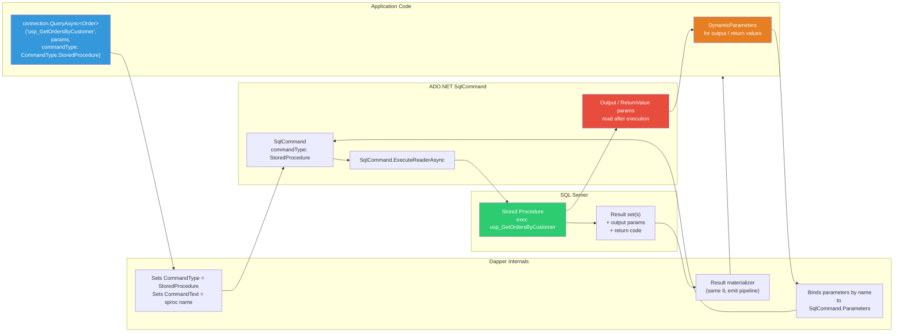
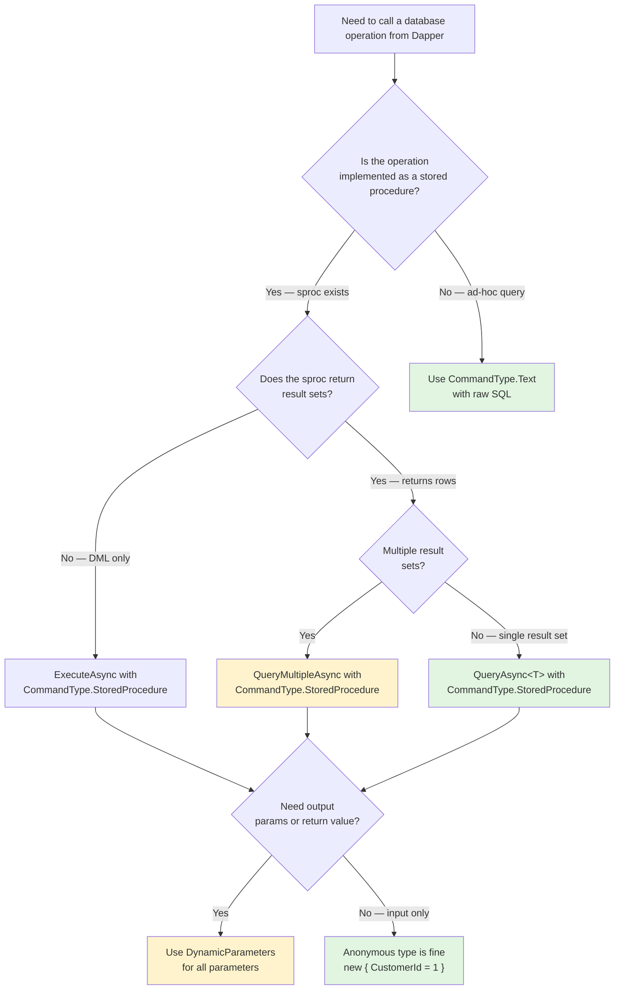

## Navigation

**Domain:** [[8 — Databases]] > **Group:** Dapper
**Previous:** [[8.859 — Dapper — ExecuteScalar — Single Value Return]] | **Next:** [[8.861 — Dapper — DynamicParameters — Dynamic SQL]]

### Prerequisites

- [[8.853 — Dapper — QueryT — Basic Querying]] — the fundamental Query/QueryAsync method patterns extend directly to stored procedure calls.
- [[8.855 — Dapper — QueryAsync — Async Patterns]] — async connection management and CommandDefinition apply identically to sproc calls.
- [[8.861 — Dapper — DynamicParameters — Dynamic SQL]] — stored procedures commonly require DynamicParameters for output parameters, return values, and explicit DbType control.

### Where This Fits

Stored procedure calling is one of Dapper's most compelling use cases in production .NET systems. When a team standardizes on stored procedures for data access (common in enterprise SQL Server shops), Dapper provides the thinnest possible mapping layer: you write `connection.QueryAsync<T>("sprocName", params, commandType: CommandType.StoredProcedure)`, and Dapper handles parameter binding and result materialization exactly as it does for raw SQL, but tells ADO.NET to use `CommandType.StoredProcedure`. This means Dapper does not parse or transform the sproc name — it sets `SqlCommand.CommandType = CommandType.StoredProcedure` and sets `CommandText` to the sproc name, letting SQL Server resolve the actual object. The invocation path is identical to raw ADO.NET `SqlCommand` with `CommandType.StoredProcedure`, differing only in how parameters and results are managed.

At the parameter level, Dapper binds input parameters identically for sprocs and raw SQL — the parameter name on the C# side must match the sproc parameter name. Output parameters, return values, and table-valued parameters require `DynamicParameters` because anonymous types cannot express direction or `DbType.Structured`. At the result level, a sproc that returns multiple result sets uses `QueryMultipleAsync` / `SqlMapper.GridReader`, exactly as with batched SQL queries. The Dapper mental model for sprocs: the sproc name becomes the `CommandText`, `CommandType` becomes `StoredProcedure`, and everything else — parameter binding, result mapping, output reading — follows the same rules as raw SQL queries.

This topic is essential for any production system that uses stored procedures with Dapper. The interview signal: a candidate who can explain how Dapper resolves sproc parameters, handles output parameters and return values, and manages multiple result sets from a single sproc demonstrates understanding of both Dapper's ADO.NET underpinnings and real-world sproc patterns.

---

## Core Mental Model

Dapper calls stored procedures by setting `SqlCommand.CommandType = CommandType.StoredProcedure` and passing the sproc name as `CommandText`. It then binds parameters to the sproc's formal parameters by name (not position — ADO.NET resolves by name), executes the command, and maps result sets using the same materializer pipeline as raw SQL queries. The invariant: Dapper does not parse the stored procedure body, does not inspect `sys.parameters`, and does not generate any SQL wrapping — it delegates entirely to ADO.NET's `SqlCommand.ExecuteReader` behavior with `CommandType.StoredProcedure`.

The recognition pattern: `commandType: CommandType.StoredProcedure` in a Dapper call tells Dapper to use `IDbCommand.CommandType = CommandType.StoredProcedure` and set `CommandText` to the sproc name, bypassing the default `CommandType.Text` behavior. Everything downstream — parameter creation, `ExecuteReader`, `IDataReader` consumption, `SqlMapper` materialization — is identical to a raw SQL query.

### Classification

**For .NET topics:** Stored procedure calling with Dapper lives at the boundary between application code and ADO.NET's `SqlCommand` execution model. Dapper's abstraction is a single `commandType` parameter — setting it to `CommandType.StoredProcedure` changes how `SqlCommand` sends the command text to SQL Server. The abstraction leaks when: (a) you need to inspect sproc return codes (`RETURN` values) which require `DynamicParameters` with `ParameterDirection.ReturnValue`; (b) you need multiple result sets from a sproc, which require `QueryMultiple` + `GridReader`; (c) you need to pass structured data (TVPs) which require `DynamicParameters` with `DbType.Structured`; or (d) you need to handle sproc-specific errors like `RAISERROR` / `THROW` which surface as `SqlException`.



### Key Properties

|Property|Value|Notes|
|---|---|---|
|CommandType|`StoredProcedure`|Set via `commandType: CommandType.StoredProcedure` in Dapper calls|
|Parameter binding|By name via ADO.NET|Parameter order in C# does NOT matter — only name matching matters|
|Input params|Anonymous object or DynamicParameters|Same as raw SQL — `new { CustomerId = 1 }` works for input-only sprocs|
|Output params|DynamicParameters only|Anonymous types cannot express `ParameterDirection.Output`|
|Return values|DynamicParameters + `ParameterDirection.ReturnValue`|RETURN code from sproc captured as a parameter|
|Multiple result sets|QueryMultiple / GridReader|Same as batch SQL — `ReadAsync<T>()` per result set|
|TVP support|DynamicParameters + `DbType.Structured`|Requires `AsTableValuedParameter()` extension|
|Plan caching|Cached per sproc + parameter combo|Sproc execution plans are cached separately from ad-hoc SQL plans|
|Permissions|EXECUTE on sproc required|Caller needs `EXECUTE` permission on the sproc, not underlying table access|

---

## Deep Mechanics

### How Dapper Resolves a Stored Procedure Call

When you call `connection.QueryAsync<Order>("usp_GetOrdersByCustomer", new { CustomerId = 1 }, commandType: CommandType.StoredProcedure)`:

1. Dapper creates an `IDbCommand` via `connection.CreateCommand()`.
2. Dapper sets `command.CommandType = CommandType.StoredProcedure`.
3. Dapper sets `command.CommandText = "usp_GetOrdersByCustomer"` — the sproc name, not a SQL string.
4. Dapper resolves parameters: if the parameter object is `DynamicParameters`, it calls `IDynamicParameters.AddParameters(cmd)`. If it is an anonymous type, Dapper reflects over its properties and creates `IDbDataParameter` objects, adding them to `cmd.Parameters`.
5. Dapper opens the connection if closed (but does not close it — caller owns lifetime).
6. Dapper calls `command.ExecuteReaderAsync(CommandBehavior)`.
7. ADO.NET sends the sproc execution request to SQL Server. SQL Server resolves `usp_GetOrdersByCustomer` in the current database context, matches parameters by name, compiles/executes the sproc body, and returns result sets + output parameter values.
8. Dapper reads the `IDataReader` result set using its IL-emitted materializer, mapping columns to `Order` properties.
9. After the reader is consumed, Dapper copies output parameter and return value data from `SqlCommand.Parameters` back into `DynamicParameters` if used.

### SQL Visibility: What SQL Server Actually Receives

```sql
-- When Dapper sets CommandType.StoredProcedure and CommandText = 'usp_GetOrdersByCustomer':
-- ADO.NET translates this to:
exec usp_GetOrdersByCustomer @CustomerId = 1;

-- This is NOT the same as:
-- exec sp_executesql N'exec usp_GetOrdersByCustomer @CustomerId = @CustomerId', N'@CustomerId int', @CustomerId = 1;
-- The latter would be CommandType.Text with "exec usp_..." as the SQL string.

-- With CommandType.StoredProcedure, SQL Server receives the RPC call directly:
-- (RPC event in SQL Server Profiler / Extended Events)
-- RPC:Completed | exec usp_GetOrdersByCustomer @CustomerId=@CustomerId
-- Parameter list: @CustomerId int = 1

-- With output parameters:
DECLARE @ReturnValue INT;
DECLARE @TotalCount INT;

EXEC @ReturnValue = usp_GetCustomerOrdersWithCount
    @CustomerId = 42,
    @TotalCount = @TotalCount OUTPUT;

SELECT @ReturnValue AS ReturnCode, @TotalCount AS TotalCount;
```

### Execution Plan Analysis

```sql
-- Stored procedure execution plans are cached separately from ad-hoc SQL plans.
-- Plan cache key includes: database_id, object_id, parameter types, set options.

-- Query to find cached plan for a sproc:
SELECT cp.objtype, cp.cacheobjtype, cp.usecounts,
       qt.text AS query_text, qp.query_plan
FROM sys.dm_exec_cached_plans cp
CROSS APPLY sys.dm_exec_sql_text(cp.plan_handle) qt
CROSS APPLY sys.dm_exec_query_plan(cp.plan_handle) qp
WHERE qt.text LIKE '%usp_GetOrdersByCustomer%'
    AND cp.objtype = 'Proc';
```

**Parameter sniffing with sprocs:** SQL Server caches the execution plan for a sproc based on the first call's parameter values. If you call `usp_GetOrdersByCustomer @CustomerId = 1` (a customer with 5 orders), SQL Server may generate a plan optimized for small result sets. When you then call it with `@CustomerId = 999` (a customer with 500,000 orders), the cached plan may perform poorly (e.g., using index seeks with key lookups instead of a full scan). This is the same parameter sniffing behavior that affects parameterized SQL queries, but with sprocs the plan is tied to the sproc object rather than a SQL text hash.

### Cost Visibility

```sql
SET STATISTICS IO ON;
SET STATISTICS TIME ON;

-- Dapper issues this as an RPC event:
exec usp_GetOrdersByCustomer @CustomerId = 42;

-- Output with index on CustomerId:
-- Table 'Orders'. Scan count 1, logical reads 4
-- SQL Server Execution Times: CPU time = 0ms, elapsed time = 1ms

-- Output without index:
-- Table 'Orders'. Scan count 1, logical reads 12500
-- SQL Server Execution Times: CPU time = 46ms, elapsed time = 43ms
```

### Failure Modes

**Sproc not found:** If the sproc name is misspelled or the user does not have `EXECUTE` permission, SQL Server raises `SqlException (2812): Could not find stored procedure 'usp_GetOrdersByCustomer'`. Dapper does not validate the sproc name before execution.

**Parameter mismatch:** If a parameter is provided in C# that the sproc does not declare, SQL Server raises `SqlException (8144): Procedure or function 'usp_GetOrdersByCustomer' has too many arguments specified`. If a required sproc parameter is missing, SQL Server raises `SqlException (201): Procedure or function 'usp_GetOrdersByCustomer' expects parameter '@CustomerId', which was not supplied`.

**Schema change recompilation:** If the sproc's underlying tables change (column added/dropped, index changes) or the sproc itself is altered via `ALTER PROCEDURE`, SQL Server invalidates the cached plan. The next execution recompiles. Dapper is unaware of this — it just sends the RPC call and receives the (recompiled) result.

**Deadlock:** If the sproc participates in a deadlock, `SqlException (1205)` is thrown. Dapper does not retry — the exception propagates to the caller. Use Polly with `SqlServerRetryOptions` for transient fault handling.

---

## Production Patterns and Implementation

### Primary Dapper Implementation

```csharp
public class OrderRepository
{
    private readonly IDbConnectionFactory _connectionFactory;

    public OrderRepository(IDbConnectionFactory connectionFactory)
    {
        _connectionFactory = connectionFactory;
    }

    // Pattern 1: Simple input-only sproc with anonymous type
    public async Task<IReadOnlyList<Order>> GetOrdersByCustomerAsync(
        int customerId, CancellationToken cancellationToken = default)
    {
        const string sproc = "usp_GetOrdersByCustomer";

        await using var connection = _connectionFactory.Create();
        var orders = await connection.QueryAsync<Order>(
            new CommandDefinition(sproc,
                new { CustomerId = customerId },
                commandType: CommandType.StoredProcedure,
                cancellationToken: cancellationToken));

        return orders.AsList();
    }

    // Pattern 2: Sproc with input and output parameters via DynamicParameters
    public async Task<(IReadOnlyList<Order> Orders, int TotalCount)> GetCustomerOrdersWithCountAsync(
        int customerId, CancellationToken cancellationToken = default)
    {
        const string sproc = "usp_GetCustomerOrdersWithCount";

        var p = new DynamicParameters();
        p.Add("@CustomerId", customerId, DbType.Int32);
        p.Add("@TotalCount", dbType: DbType.Int32,
            direction: ParameterDirection.Output);

        await using var connection = _connectionFactory.Create();
        var orders = await connection.QueryAsync<Order>(
            new CommandDefinition(sproc, p,
                commandType: CommandType.StoredProcedure,
                cancellationToken: cancellationToken));

        int totalCount = p.Get<int>("@TotalCount");
        return (orders.AsList(), totalCount);
    }

    // Pattern 3: Sproc with return value (RETURN code)
    public async Task<(IReadOnlyList<Order> Orders, int ReturnCode)> GetOrdersWithReturnCodeAsync(
        int customerId, CancellationToken cancellationToken = default)
    {
        const string sproc = "usp_GetOrdersByCustomerWithReturnCode";

        var p = new DynamicParameters();
        p.Add("@CustomerId", customerId, DbType.Int32);
        p.Add("@ReturnCode", dbType: DbType.Int32,
            direction: ParameterDirection.ReturnValue);

        await using var connection = _connectionFactory.Create();
        var orders = await connection.QueryAsync<Order>(
            new CommandDefinition(sproc, p,
                commandType: CommandType.StoredProcedure,
                cancellationToken: cancellationToken));

        int returnCode = p.Get<int>("@ReturnCode");
        return (orders.AsList(), returnCode);
    }

    // Pattern 4: Sproc with multiple result sets via QueryMultiple
    public async Task<(Customer Customer, IReadOnlyList<Order> Orders, int OrderCount)>
        GetCustomerWithOrdersAsync(int customerId,
            CancellationToken cancellationToken = default)
    {
        const string sproc = "usp_GetCustomerOrders";

        await using var connection = _connectionFactory.Create();
        await using var multi = await connection.QueryMultipleAsync(
            new CommandDefinition(sproc,
                new { CustomerId = customerId },
                commandType: CommandType.StoredProcedure,
                cancellationToken: cancellationToken));

        var customer = await multi.ReadSingleAsync<Customer>();
        var orders = (await multi.ReadAsync<Order>()).AsList();
        int orderCount = await multi.ReadSingleAsync<int>();

        return (customer, orders, orderCount);
    }

    // Pattern 5: Sproc with TVP (table-valued parameter) via DynamicParameters
    public async Task InsertOrdersBulkAsync(
        IEnumerable<Order> orders, CancellationToken cancellationToken = default)
    {
        const string sproc = "usp_InsertOrdersBulk";

        var dt = new DataTable();
        dt.Columns.Add("CustomerId", typeof(int));
        dt.Columns.Add("OrderDate", typeof(DateTime));
        dt.Columns.Add("TotalAmount", typeof(decimal));

        foreach (var order in orders)
        {
            dt.Rows.Add(order.CustomerId, order.OrderDate, order.TotalAmount);
        }

        var p = new DynamicParameters();
        p.Add("@Orders", dt.AsTableValuedParameter("dbo.OrderType"));

        await using var connection = _connectionFactory.Create();
        await connection.ExecuteAsync(
            new CommandDefinition(sproc, p,
                commandType: CommandType.StoredProcedure,
                cancellationToken: cancellationToken));
    }

    // Pattern 6: Sproc Execute (non-query) with output parameter
    public async Task<int> UpdateOrderStatusAsync(
        int orderId, string newStatus, CancellationToken cancellationToken = default)
    {
        const string sproc = "usp_UpdateOrderStatus";

        var p = new DynamicParameters();
        p.Add("@OrderId", orderId, DbType.Int32);
        p.Add("@NewStatus", newStatus, DbType.String, size: 20);
        p.Add("@RowsAffected", dbType: DbType.Int32,
            direction: ParameterDirection.Output);

        await using var connection = _connectionFactory.Create();
        await connection.ExecuteAsync(
            new CommandDefinition(sproc, p,
                commandType: CommandType.StoredProcedure,
                cancellationToken: cancellationToken));

        return p.Get<int>("@RowsAffected");
    }

    // Pattern 7: Sproc with full input/output/return value
    public async Task<OrderCreationResult> CreateOrderAsync(
        CreateOrderRequest request, CancellationToken cancellationToken = default)
    {
        const string sproc = "usp_CreateOrder";

        var p = new DynamicParameters();
        p.Add("@CustomerId", request.CustomerId, DbType.Int32);
        p.Add("@OrderDate", request.OrderDate, DbType.DateTime2);
        p.Add("@TotalAmount", request.TotalAmount, DbType.Decimal, precision: 18, scale: 2);
        p.Add("@Status", request.Status, DbType.String, size: 20);
        p.Add("@NewOrderId", dbType: DbType.Int32,
            direction: ParameterDirection.Output);
        p.Add("@ErrorMessage", dbType: DbType.String, size: 255,
            direction: ParameterDirection.Output);
        p.Add("@ReturnCode", dbType: DbType.Int32,
            direction: ParameterDirection.ReturnValue);

        await using var connection = _connectionFactory.Create();
        await connection.ExecuteAsync(
            new CommandDefinition(sproc, p,
                commandType: CommandType.StoredProcedure,
                commandTimeout: 30,
                cancellationToken: cancellationToken));

        return new OrderCreationResult
        {
            OrderId = p.Get<int>("@NewOrderId"),
            ErrorMessage = p.Get<string>("@ErrorMessage"),
            ReturnCode = p.Get<int>("@ReturnCode"),
            Success = p.Get<int>("@ReturnCode") == 0
        };
    }
}

// Supporting types
public class Order
{
    public int OrderId { get; set; }
    public int CustomerId { get; set; }
    public DateTime OrderDate { get; set; }
    public decimal TotalAmount { get; set; }
    public string Status { get; set; } = default!;
}

public class Customer
{
    public int CustomerId { get; set; }
    public string FirstName { get; set; } = default!;
    public string LastName { get; set; } = default!;
    public string Email { get; set; } = default!;
}

public class CreateOrderRequest
{
    public int CustomerId { get; set; }
    public DateTime OrderDate { get; set; }
    public decimal TotalAmount { get; set; }
    public string Status { get; set; } = default!;
}

public class OrderCreationResult
{
    public int OrderId { get; set; }
    public string? ErrorMessage { get; set; }
    public int ReturnCode { get; set; }
    public bool Success { get; set; }
}
```

### Realistic Stored Procedure Example

The following T-SQL creates the `usp_GetCustomerOrders` stored procedure used in Pattern 4 above. It demonstrates a multi-result-set sproc that returns customer details, their orders, and an order count — a common pattern in production systems.

```sql
CREATE OR ALTER PROCEDURE dbo.usp_GetCustomerOrders
    @CustomerId INT
AS
BEGIN
    SET NOCOUNT ON;

    -- Result set 1: Customer details (single row)
    SELECT CustomerId, FirstName, LastName, Email, CreatedDate
    FROM dbo.Customers
    WHERE CustomerId = @CustomerId;

    -- Result set 2: Orders for the customer (zero or more rows)
    SELECT OrderId, CustomerId, OrderDate, TotalAmount, Status
    FROM dbo.Orders
    WHERE CustomerId = @CustomerId
    ORDER BY OrderDate DESC;

    -- Result set 3: Order count (single row, single column)
    SELECT COUNT(*) AS OrderCount
    FROM dbo.Orders
    WHERE CustomerId = @CustomerId;
END;
GO

-- Grant execute permission
GRANT EXECUTE ON dbo.usp_GetCustomerOrders TO ApplicationUser;
GO
```

### Sproc with Output Parameters and Return Code

```sql
CREATE OR ALTER PROCEDURE dbo.usp_CreateOrder
    @CustomerId INT,
    @OrderDate DATETIME2,
    @TotalAmount DECIMAL(18, 2),
    @Status NVARCHAR(20),
    @NewOrderId INT OUTPUT,
    @ErrorMessage NVARCHAR(255) OUTPUT
AS
BEGIN
    SET NOCOUNT ON;

    BEGIN TRY
        -- Validate customer exists
        IF NOT EXISTS (SELECT 1 FROM dbo.Customers WHERE CustomerId = @CustomerId)
        BEGIN
            SET @ErrorMessage = 'Customer not found.';
            SET @NewOrderId = 0;
            RETURN 1; -- Error code
        END;

        -- Validate total amount
        IF @TotalAmount <= 0
        BEGIN
            SET @ErrorMessage = 'Total amount must be positive.';
            SET @NewOrderId = 0;
            RETURN 2; -- Error code
        END;

        -- Insert the order
        INSERT INTO dbo.Orders (CustomerId, OrderDate, TotalAmount, Status)
        VALUES (@CustomerId, @OrderDate, @TotalAmount, @Status);

        SET @NewOrderId = SCOPE_IDENTITY();
        SET @ErrorMessage = NULL;
        RETURN 0; -- Success
    END TRY
    BEGIN CATCH
        SET @ErrorMessage = ERROR_MESSAGE();
        SET @NewOrderId = 0;
        RETURN 3; -- Unexpected error
    END CATCH;
END;
GO
```

### Calling a Sproc with CommandDefinition

```csharp
// CommandDefinition is the recommended way to pass all Dapper options
// for stored procedures, including commandType, timeout, and cancellationToken.

public async Task<IReadOnlyList<Order>> GetOrdersByCustomerAsync(
    int customerId, int? commandTimeoutSeconds = null,
    CancellationToken cancellationToken = default)
{
    const string sproc = "usp_GetOrdersByCustomer";

    var cmdDef = new CommandDefinition(
        commandText: sproc,
        parameters: new { CustomerId = customerId },
        commandType: CommandType.StoredProcedure,
        commandTimeout: commandTimeoutSeconds,
        cancellationToken: cancellationToken);

    await using var connection = _connectionFactory.Create();
    var orders = await connection.QueryAsync<Order>(cmdDef);
    return orders.AsList();
}
```

### Sproc with DynamicParameters and VB.NET-Style Named Parameters

```csharp
// Dapper parameter names must match sproc parameter names exactly
// (case-insensitive for SQL Server).
// The @ prefix is optional in Dapper — it normalizes names.

// This works:
public async Task<IReadOnlyList<Order>> GetOrdersByCustomerAsync(
    int customerId, CancellationToken ct)
{
    const string sproc = "usp_GetOrdersByCustomer";
    await using var conn = _connectionFactory.Create();
    return (await conn.QueryAsync<Order>(
        new CommandDefinition(sproc,
            new { CustomerId = customerId },
            commandType: CommandType.StoredProcedure,
            cancellationToken: ct))).AsList();
}

// This also works (with @ prefix — Dapper strips it internally):
public async Task<IReadOnlyList<Order>> GetOrdersByCustomerWithAtAsync(
    int customerId, CancellationToken ct)
{
    const string sproc = "usp_GetOrdersByCustomer";
    await using var conn = _connectionFactory.Create();
    return (await conn.QueryAsync<Order>(
        new CommandDefinition(sproc,
            new { @CustomerId = customerId },
            commandType: CommandType.StoredProcedure,
            cancellationToken: ct))).AsList();
}
```

### Repository Pattern with Sproc Convention

```csharp
// A repository that consistently uses stored procedures with a naming convention.
// The sproc name is derived from the entity and operation.

public class CustomerRepository
{
    private readonly IDbConnectionFactory _connectionFactory;
    private const string SprocPrefix = "usp_";

    public CustomerRepository(IDbConnectionFactory connectionFactory)
    {
        _connectionFactory = connectionFactory;
    }

    private static string Sproc(string entity, string operation)
        => $"{SprocPrefix}{entity}_{operation}";

    public async Task<Customer?> GetByIdAsync(int customerId,
        CancellationToken cancellationToken = default)
    {
        const string sproc = "usp_Customer_GetById";
        await using var conn = _connectionFactory.Create();
        return await conn.QueryFirstOrDefaultAsync<Customer>(
            new CommandDefinition(sproc,
                new { CustomerId = customerId },
                commandType: CommandType.StoredProcedure,
                cancellationToken: cancellationToken));
    }

    public async Task<IReadOnlyList<Customer>> SearchAsync(
        string? name, string? email, int pageIndex, int pageSize,
        CancellationToken cancellationToken = default)
    {
        const string sproc = "usp_Customer_Search";

        var p = new DynamicParameters();
        p.Add("@Name", name, DbType.String, size: 100);
        p.Add("@Email", email, DbType.String, size: 255);
        p.Add("@PageIndex", pageIndex, DbType.Int32);
        p.Add("@PageSize", pageSize, DbType.Int32);
        p.Add("@TotalCount", dbType: DbType.Int32,
            direction: ParameterDirection.Output);

        await using var conn = _connectionFactory.Create();
        var results = await conn.QueryAsync<Customer>(
            new CommandDefinition(sproc, p,
                commandType: CommandType.StoredProcedure,
                cancellationToken: cancellationToken));

        return results.AsList();
    }

    public async Task<int> CreateAsync(Customer customer,
        CancellationToken cancellationToken = default)
    {
        const string sproc = "usp_Customer_Create";

        var p = new DynamicParameters();
        p.Add("@FirstName", customer.FirstName, DbType.String, size: 50);
        p.Add("@LastName", customer.LastName, DbType.String, size: 50);
        p.Add("@Email", customer.Email, DbType.String, size: 255);
        p.Add("@CustomerId", dbType: DbType.Int32,
            direction: ParameterDirection.Output);

        await using var conn = _connectionFactory.Create();
        await conn.ExecuteAsync(
            new CommandDefinition(sproc, p,
                commandType: CommandType.StoredProcedure,
                cancellationToken: cancellationToken));

        return p.Get<int>("@CustomerId");
    }

    public async Task<bool> DeleteAsync(int customerId,
        CancellationToken cancellationToken = default)
    {
        const string sproc = "usp_Customer_Delete";

        var p = new DynamicParameters();
        p.Add("@CustomerId", customerId, DbType.Int32);
        p.Add("@ReturnCode", dbType: DbType.Int32,
            direction: ParameterDirection.ReturnValue);

        await using var conn = _connectionFactory.Create();
        await conn.ExecuteAsync(
            new CommandDefinition(sproc, p,
                commandType: CommandType.StoredProcedure,
                cancellationToken: cancellationToken));

        return p.Get<int>("@ReturnCode") == 0;
    }
}
```

### Error Handling with Sproc Return Codes

```csharp
// Production pattern for handling sproc return codes and output error messages.
// The sproc uses RETURN for status codes and OUTPUT params for error details.

public async Task<ServiceResult<Order>> CreateOrderSafelyAsync(
    CreateOrderRequest request, CancellationToken cancellationToken = default)
{
    const string sproc = "usp_CreateOrder";

    var p = new DynamicParameters();
    p.Add("@CustomerId", request.CustomerId, DbType.Int32);
    p.Add("@OrderDate", request.OrderDate, DbType.DateTime2);
    p.Add("@TotalAmount", request.TotalAmount, DbType.Decimal, precision: 18, scale: 2);
    p.Add("@Status", request.Status, DbType.String, size: 20);
    p.Add("@NewOrderId", dbType: DbType.Int32, direction: ParameterDirection.Output);
    p.Add("@ErrorMessage", dbType: DbType.String, size: 255,
        direction: ParameterDirection.Output);
    p.Add("@ReturnCode", dbType: DbType.Int32,
        direction: ParameterDirection.ReturnValue);

    try
    {
        await using var connection = _connectionFactory.Create();
        await connection.ExecuteAsync(
            new CommandDefinition(sproc, p,
                commandType: CommandType.StoredProcedure,
                commandTimeout: 30,
                cancellationToken: cancellationToken));

        int returnCode = p.Get<int>("@ReturnCode");

        if (returnCode != 0)
        {
            return ServiceResult<Order>.Failure(
                p.Get<string>("@ErrorMessage") ?? $"Return code: {returnCode}");
        }

        var order = new Order
        {
            OrderId = p.Get<int>("@NewOrderId"),
            CustomerId = request.CustomerId,
            OrderDate = request.OrderDate,
            TotalAmount = request.TotalAmount,
            Status = request.Status
        };

        return ServiceResult<Order>.Success(order);
    }
    catch (SqlException ex) when (ex.Number == 1205) // Deadlock
    {
        // Log and retry at a higher level (Polly)
        return ServiceResult<Order>.Failure($"Deadlock: {ex.Message}");
    }
    catch (SqlException ex)
    {
        return ServiceResult<Order>.Failure($"Database error: {ex.Message}");
    }
}

public class ServiceResult<T>
{
    public bool IsSuccess { get; private set; }
    public string? ErrorMessage { get; private set; }
    public T? Data { get; private set; }

    public static ServiceResult<T> Success(T data)
        => new() { IsSuccess = true, Data = data };

    public static ServiceResult<T> Failure(string errorMessage)
        => new() { IsSuccess = false, ErrorMessage = errorMessage };
}
```

### Sproc Call with Multiple Output Parameters

```csharp
// A sproc that returns multiple scalar values as output parameters.
// Common for dashboard queries that return aggregated metrics.

public async Task<DashboardMetrics> GetDashboardMetricsAsync(
    CancellationToken cancellationToken = default)
{
    const string sproc = "usp_GetDashboardMetrics";

    var p = new DynamicParameters();
    p.Add("@TotalOrders", dbType: DbType.Int32, direction: ParameterDirection.Output);
    p.Add("@TotalRevenue", dbType: DbType.Decimal, precision: 18, scale: 2,
        direction: ParameterDirection.Output);
    p.Add("@ActiveCustomers", dbType: DbType.Int32, direction: ParameterDirection.Output);
    p.Add("@AvgOrderValue", dbType: DbType.Decimal, precision: 18, scale: 2,
        direction: ParameterDirection.Output);
    p.Add("@PeriodStart", DateTime.UtcNow.AddDays(-30), DbType.DateTime2);
    p.Add("@PeriodEnd", DateTime.UtcNow, DbType.DateTime2);

    await using var connection = _connectionFactory.Create();
    await connection.ExecuteAsync(
        new CommandDefinition(sproc, p,
            commandType: CommandType.StoredProcedure,
            commandTimeout: 60,
            cancellationToken: cancellationToken));

    return new DashboardMetrics
    {
        TotalOrders = p.Get<int>("@TotalOrders"),
        TotalRevenue = p.Get<decimal>("@TotalRevenue"),
        ActiveCustomers = p.Get<int>("@ActiveCustomers"),
        AvgOrderValue = p.Get<decimal>("@AvgOrderValue")
    };
}

public class DashboardMetrics
{
    public int TotalOrders { get; set; }
    public decimal TotalRevenue { get; set; }
    public int ActiveCustomers { get; set; }
    public decimal AvgOrderValue { get; set; }
}
```

### Mermaid: Sproc Execution Flow with Dapper

```mermaid
sequenceDiagram
    participant App as Application
    participant Dapper as Dapper
    participant ADO as ADO.NET SqlCommand
    participant SQL as SQL Server
    participant Sproc as Stored Procedure

    App->>Dapper: QueryAsync&lt;T&gt;(sprocName, params, CommandType.StoredProcedure)
    Dapper->>Dapper: Set commandType = StoredProcedure
    Dapper->>Dapper: Set commandText = sprocName
    Dapper->>Dapper: Resolve parameters (anonymous or DynamicParameters)
    Dapper->>ADO: cmd.ExecuteReaderAsync()
    ADO->>SQL: RPC: exec sprocName @param=value
    SQL->>Sproc: Execute procedure body
    Sproc-->>SQL: Result set + output params + return value
    SQL-->>ADO: IDataReader stream
    ADO-->>Dapper: IDataReader
    Dapper->>Dapper: Materialize rows via IL-emitted delegate
    Dapper-->>App: List&lt;T&gt;
    App->>Dapper: p.Get&lt;T&gt;("@OutputParam") (if DynamicParameters)
    Dapper-->>App: Output / return values
```

---

## Gotchas and Production Pitfalls

### 1. Parameter Order Does Not Matter — Only Names Matter

**Pitfall:** Developers coming from pure ADO.NET sometimes believe parameter order in the `SqlParameterCollection` must match sproc parameter order. With Dapper, parameters are bound by name only. ADO.NET's `SqlCommand` resolves sproc parameters by name regardless of the order they are added.

```csharp
// ❌ Unnecessary concern — parameter order is irrelevant
// These two calls produce identical behavior:
var p1 = new DynamicParameters();
p1.Add("@TotalAmount", 99.99m, DbType.Decimal, precision: 18, scale: 2);
p1.Add("@CustomerId", 42, DbType.Int32);
p1.Add("@OrderDate", DateTime.UtcNow, DbType.DateTime2);

var p2 = new DynamicParameters();
p2.Add("@CustomerId", 42, DbType.Int32);
p2.Add("@OrderDate", DateTime.UtcNow, DbType.DateTime2);
p2.Add("@TotalAmount", 99.99m, DbType.Decimal, precision: 18, scale: 2);

// Both send the same RPC call — ADO.NET matches by name
```

**Symptom:** No symptom — name-based binding always works correctly. But developers unfamiliar with ADO.NET sproc parameter binding may waste time "fixing" parameter order.

**Fix:** Understand that SQL Server sproc parameter binding is name-based, not ordinal-based. Dapper adds parameters to `SqlCommand.Parameters`, and ADO.NET maps them to sproc parameters by name.

**Cost of not fixing:** Wasted debugging time and unnecessary code churn.

### 2. Mixing CommandType.Text and CommandType.StoredProcedure with "exec"

**Pitfall:** Developers sometimes use `CommandType.Text` with `"exec sprocName @param = @param"` instead of setting `CommandType.StoredProcedure`. While both work, they produce different SQL Server behavior. `CommandType.Text` with `exec` sends a `sp_executesql` call; `CommandType.StoredProcedure` sends an RPC event.

```csharp
// ❌ Suboptimal — CommandType.Text with exec string
const string sql = "exec usp_GetOrdersByCustomer @CustomerId = @CustomerId";
var orders = await connection.QueryAsync<Order>(sql, new { CustomerId = 1 });
// SQL Server sees: exec sp_executesql N'exec usp_GetOrdersByCustomer @CustomerId = @CustomerId', N'@CustomerId int', @CustomerId=1

// ✅ Correct — CommandType.StoredProcedure
var orders = await connection.QueryAsync<Order>(
    "usp_GetOrdersByCustomer",
    new { CustomerId = 1 },
    commandType: CommandType.StoredProcedure);
// SQL Server sees: RPC event — exec usp_GetOrdersByCustomer @CustomerId=@CustomerId
```

**Symptom:** Both work, but `CommandType.Text` with `exec` may cause: (a) different plan cache behavior — the plan is cached under the `sp_executesql` hash rather than the sproc object; (b) inability to use output parameters directly — you must declare T-SQL variables and use `SELECT` to retrieve them; (c) slightly different parameter sniffing behavior.

**Fix:** Always use `commandType: CommandType.StoredProcedure` when calling stored procedures.

**Cost of not fixing:** Suboptimal plan caching, potential plan cache bloat, and confusing error messages when mixing output patterns.

### 3. Output Parameters Must Use DynamicParameters

**Pitfall:** Anonymous types cannot express `ParameterDirection.Output`. Attempting to capture an output parameter with an anonymous type results in the parameter being sent as `Input` — the output value is silently lost.

```csharp
// ❌ Wrong — output parameter is silently ignored
const string sproc = "usp_GetCustomerOrdersWithCount";
var result = await connection.QueryAsync<Order>(sproc,
    new { CustomerId = 1, TotalCount = 0 }, // TotalCount is sent as INPUT
    commandType: CommandType.StoredProcedure);
// TotalCount parameter is sent with direction=Input — sproc cannot set it
// After execution, TotalCount in C# is still 0

// ✅ Correct — use DynamicParameters for output
var p = new DynamicParameters();
p.Add("@CustomerId", 1, DbType.Int32);
p.Add("@TotalCount", dbType: DbType.Int32, direction: ParameterDirection.Output);
var orders = await connection.QueryAsync<Order>(sproc, p,
    commandType: CommandType.StoredProcedure);
int totalCount = p.Get<int>("@TotalCount");
```

**Symptom:** Output parameters remain at their default value (0 for `int`, null for string). No error is thrown — the data is silently wrong.

**Fix:** Always use `DynamicParameters` when any parameter has `Output`, `InputOutput`, or `ReturnValue` direction.

**Cost of not fixing:** Silent data corruption — the application uses uninitialized output values.

### 4. Return Value Requires ParameterDirection.ReturnValue

**Pitfall:** A sproc's `RETURN n` statement produces a return code that is NOT captured as a result set and NOT captured as an output parameter. It must be explicitly captured with `ParameterDirection.ReturnValue`.

```csharp
// ❌ Wrong — return code is not captured
const string sproc = "usp_SomeSprocWithReturn";
await connection.ExecuteAsync(sproc, new { CustomerId = 1 },
    commandType: CommandType.StoredProcedure);
// The sproc's RETURN 0 or RETURN 1 is ignored

// ✅ Correct — capture return code via DynamicParameters
var p = new DynamicParameters();
p.Add("@CustomerId", 1, DbType.Int32);
p.Add("@ReturnCode", dbType: DbType.Int32,
    direction: ParameterDirection.ReturnValue);
await connection.ExecuteAsync(sproc, p,
    commandType: CommandType.StoredProcedure);
int returnCode = p.Get<int>("@ReturnCode");
```

**Symptom:** The sproc executes but the application has no visibility into success/failure as indicated by the return code.

**Fix:** Add a `ParameterDirection.ReturnValue` parameter to `DynamicParameters` and read its value after execution.

**Cost of not fixing:** Application cannot distinguish between sproc success (`RETURN 0`) and failure (`RETURN 1`), leading to incorrect error handling.

### 5. Schema Changes Cause Sproc Recompilation but Dapper Is Unaffected

**Pitfall:** If the sproc's underlying tables or the sproc definition itself changes, SQL Server recompiles the sproc on next execution. Dapper does not need to change — it just sends the RPC call. But the result set shape may change (new column, dropped column, changed data type), which can break the Dapper materializer.

```sql
-- Day 1: sproc returns (OrderId, CustomerId, TotalAmount)
-- Dapper maps to Order { int OrderId, int CustomerId, decimal TotalAmount } — works

-- Day 2: ALTER TABLE Orders DROP COLUMN TotalAmount;
-- ALTER PROCEDURE to remove TotalAmount from SELECT
-- Now sproc returns (OrderId, CustomerId)
-- Dapper materializer for Order expects 3 columns — but only 2 are in the reader
-- Properties not in the result set keep default values (TotalAmount = 0)
```

**Symptom:** No error from Dapper — `TotalAmount` is silently 0 for all orders. This is the same silent column mismatch behavior as raw SQL queries with Dapper.

**Fix:** Add integration tests that execute the sproc and verify the result set shape matches the POCO. Use `SqlMapper.Settings.PadListExpansion` and similar settings defensively.

**Cost of not fixing:** Silent data corruption after schema changes that alter sproc result set shape.

### 6. Permissions — EXECUTE vs Data Access

**Pitfall:** A common security pattern is to grant users only `EXECUTE` on sprocs and deny direct table access. This works correctly with Dapper — Dapper does not need direct table access because it only sends RPC calls. But if someone later changes a Dapper call from sproc-based to raw SQL, the same user context may lack `SELECT`/`INSERT`/`UPDATE`/`DELETE` permissions.

```sql
-- Grant only EXECUTE — recommended security pattern
GRANT EXECUTE ON dbo.usp_GetOrdersByCustomer TO ApplicationUser;
DENY SELECT ON dbo.Orders TO ApplicationUser;
DENY SELECT ON dbo.Customers TO ApplicationUser;

-- Dapper call — works because EXECUTE is sufficient
await connection.QueryAsync<Order>("usp_GetOrdersByCustomer",
    new { CustomerId = 1 },
    commandType: CommandType.StoredProcedure);

-- Direct SQL — fails with permission error
await connection.QueryAsync<Order>(
    "SELECT * FROM Orders WHERE CustomerId = @CustomerId",
    new { CustomerId = 1 });
-- SqlException: SELECT permission denied on object 'Orders'
```

**Symptom:** `SqlException: SELECT permission denied` when switching from sproc to raw SQL, or when the sproc internally accesses objects the caller does not have permissions on (the sproc runs under owner permissions by default with `EXECUTE AS` considerations).

**Fix:** Ensure the sproc owner (`dbo` or schema owner) has the necessary permissions on underlying objects. Use `EXECUTE AS OWNER` or `EXECUTE AS CALLER` sproc clauses explicitly. When switching between sproc and raw SQL patterns, ensure the connection user has appropriate permissions.

**Cost of not fixing:** Production outages when permissions are misconfigured or when refactoring from sproc-based to raw-SQL data access.

### 7. QueryMultiple with Sprocs — Reader Must Be Fully Consumed

**Pitfall:** When using `QueryMultipleAsync` with a sproc that returns multiple result sets, ALL result sets must be read (consumed) before the `GridReader` is disposed. If a sproc returns 3 result sets but you only read 2, disposing the `GridReader` causes the underlying `SqlDataReader` to close, potentially leaving open transactions or causing `SqlException` about pending data.

```csharp
// ❌ Wrong — not consuming all result sets
await using var multi = await connection.QueryMultipleAsync(sproc,
    new { CustomerId = 1 },
    commandType: CommandType.StoredProcedure);

var customer = await multi.ReadSingleAsync<Customer>();
var orders = (await multi.ReadAsync<Order>()).AsList();
// multi is disposed here — but there are unread result sets
// SqlDataReader closes with pending results — may cause issues

// ✅ Correct — consume all result sets even if unused
await using var multi = await connection.QueryMultipleAsync(sproc,
    new { CustomerId = 1 },
    commandType: CommandType.StoredProcedure);

var customer = await multi.ReadSingleAsync<Customer>();
var orders = (await multi.ReadAsync<Order>()).AsList();
var orderCount = await multi.ReadSingleAsync<int>();
// All result sets consumed — clean dispose

// ✅ Also correct — consume and ignore
var customer = await multi.ReadSingleAsync<Customer>();
var orders = (await multi.ReadAsync<Order>()).AsList();
_ = await multi.ReadAsync(); // Consume remaining result sets
```

**Symptom:** `InvalidOperationException: There is already an open DataReader associated with this Command` when the connection is used within the same transaction, or MARS errors. Or silent transaction rollback.

**Fix:** Always read all result sets from a sproc when using `QueryMultiple`. If you do not need a result set, call `multi.ReadAsync()` and ignore the result.

**Cost of not fixing:** Connection errors, MARS exhaustion, and transaction rollbacks.

### 8. Sproc Name Collisions with Multiple Databases

**Pitfall:** If your application connects to multiple databases, and each has a sproc with the same name but different signatures, Dapper's default behavior uses the database in the connection string. There is no way to specify a fully-qualified sproc name with a different database in the `CommandText` — but you CAN use a three-part name as the `CommandText`.

```csharp
// ✅ Correct — fully qualify sproc name in CommandText
const string sproc = "WarehouseDB.dbo.usp_GetOrders";

// Dapper sets CommandText = "WarehouseDB.dbo.usp_GetOrders"
// ADO.NET sends: exec WarehouseDB.dbo.usp_GetOrders @param=value
await using var conn = _connectionFactory.Create(); // connects to SalesDB
var orders = await conn.QueryAsync<Order>(sproc,
    new { CustomerId = 1 },
    commandType: CommandType.StoredProcedure);
```

**Symptom:** If the connection's default database does not contain the sproc, SQL Server raises `SqlException (2812): Could not find stored procedure`.

**Fix:** Use three-part naming (`DatabaseName.SchemaName.SprocName`) in the `CommandText`. Ensure the login has permissions in the target database.

**Cost of not fixing:** Cross-database sproc calls fail with "not found" errors.

### 9. Sproc with SET NOCOUNT ON / OFF

**Pitfall:** If a sproc uses `SET NOCOUNT OFF` (the default) or has multiple `SET NOCOUNT ON/OFF` toggles, Dapper's `QueryAsync` may receive extra "rows affected" messages that do not correspond to actual result sets. Dapper handles this correctly — it ignores `DONE_IN_PROC` messages that carry only row count — but `ExecuteAsync` will return a different `rows affected` count if `SET NOCOUNT ON` is not used.

```sql
CREATE PROCEDURE dbo.usp_UpdateOrderStatus
    @OrderId INT,
    @NewStatus NVARCHAR(20)
AS
BEGIN
    -- SET NOCOUNT ON prevents "n rows affected" messages
    -- that would interfere with ExecuteAsync's return value
    SET NOCOUNT ON;

    UPDATE dbo.Orders
    SET Status = @NewStatus
    WHERE OrderId = @OrderId;

    -- Without SET NOCOUNT ON, ExecuteAsync would return
    -- the row count from this UPDATE
END;
```

**Symptom:** `ExecuteAsync` returns an unexpected row count or returns multiple counts if the sproc has multiple DML statements without `SET NOCOUNT ON`.

**Fix:** Always include `SET NOCOUNT ON` at the top of production sprocs that are called via Dapper. If you need the row count from a specific statement, use `@@ROWCOUNT` with an output parameter.

**Cost of not fixing:** Confusing `ExecuteAsync` return values — callers may misinterpret the affected row count.

### 10. Sproc with Temporary Tables

**Pitfall:** If a sproc creates a temporary table (`#temp`) and the result set shape depends on dynamic SQL or conditional logic within the sproc, the Dapper materializer may receive a different column layout on different executions. The materializer is generated for the first call's column layout and cached — subsequent calls with different column shapes may produce wrong mappings or exceptions.

```sql
CREATE PROCEDURE dbo.usp_GetDynamicReport
    @IncludeDetails BIT
AS
BEGIN
    SET NOCOUNT ON;

    CREATE TABLE #Results (Id INT, Name NVARCHAR(100));

    IF @IncludeDetails = 1
        ALTER TABLE #Results ADD DetailValue NVARCHAR(200); -- Changes column count!

    INSERT INTO #Results (Id, Name) VALUES (1, 'Test');

    SELECT * FROM #Results;
END;
```

**Symptom:** Dapper caches the materializer for 3 columns on the first call with `@IncludeDetails = 1`. On the next call with `@IncludeDetails = 0`, the sproc returns only 2 columns — Dapper's cached materializer tries to read a non-existent column, which may cause an `IndexOutOfRangeException` or silently map column 3 to the wrong property.

**Fix:** Ensure sprocs return a fixed result set shape regardless of parameters. Alternatively, use `dynamic` as the result type and handle column differences in application code.

**Cost of not fixing:** `IndexOutOfRangeException` or silent data corruption when sproc result set shape varies.

---

## Performance Implications

### Benchmark: Dapper Sproc Call vs Raw ADO.NET Sproc Call vs Dapper Raw SQL

```sql
-- All three approaches below execute the same sproc.
-- Dapper adds minimal overhead for parameter resolution + result materialization.
-- The sproc execution time itself dominates (>90% of total time).
```

### BenchmarkDotNet

```csharp
[MemoryDiagnoser]
[SimpleJob(RuntimeMoniker.Net90)]
public class SprocCallBenchmark
{
    private IDbConnection _connection = default!;
    private const string Sproc = "usp_GetOrdersByCustomer";

    [GlobalSetup]
    public void Setup()
    {
        _connection = new SqlConnection("Server=.;Database=BenchmarkDb;Trusted_Connection=True;");
        _connection.Open();
    }

    [GlobalCleanup]
    public void Cleanup() => _connection.Dispose();

    [Benchmark(Baseline = true)]
    public async Task<List<OrderSummary>> DapperSproc_AnonymousInput()
    {
        var result = await _connection.QueryAsync<OrderSummary>(Sproc,
            new { CustomerId = 42 },
            commandType: CommandType.StoredProcedure);
        return result.AsList();
    }

    [Benchmark]
    public async Task<List<OrderSummary>> DapperSproc_DynamicParameters()
    {
        var p = new DynamicParameters();
        p.Add("@CustomerId", 42, DbType.Int32);
        var result = await _connection.QueryAsync<OrderSummary>(Sproc, p,
            commandType: CommandType.StoredProcedure);
        return result.AsList();
    }

    [Benchmark]
    public async Task<List<OrderSummary>> DapperSproc_WithOutputParameter()
    {
        var p = new DynamicParameters();
        p.Add("@CustomerId", 42, DbType.Int32);
        p.Add("@TotalCount", dbType: DbType.Int32,
            direction: ParameterDirection.Output);
        var result = await _connection.QueryAsync<OrderSummary>(Sproc, p,
            commandType: CommandType.StoredProcedure);
        _ = p.Get<int>("@TotalCount");
        return result.AsList();
    }

    [Benchmark]
    public async Task<List<OrderSummary>> DapperRawSql_Text()
    {
        const string sql = "SELECT OrderId, CustomerId, OrderDate, TotalAmount FROM Orders WHERE CustomerId = @CustomerId ORDER BY OrderId";
        var result = await _connection.QueryAsync<OrderSummary>(sql,
            new { CustomerId = 42 });
        return result.AsList();
    }

    [Benchmark]
    public async Task<List<OrderSummary>> AdoNetSproc()
    {
        var orders = new List<OrderSummary>();
        await using var cmd = _connection.CreateCommand();
        cmd.CommandText = Sproc;
        cmd.CommandType = CommandType.StoredProcedure;

        var param = cmd.CreateParameter();
        param.ParameterName = "@CustomerId";
        param.Value = 42;
        param.DbType = DbType.Int32;
        cmd.Parameters.Add(param);

        await using var reader = await cmd.ExecuteReaderAsync();
        while (await reader.ReadAsync())
        {
            orders.Add(new OrderSummary
            {
                OrderId = reader.GetInt32(0),
                CustomerId = reader.GetInt32(1),
                OrderDate = reader.GetDateTime(2),
                TotalAmount = reader.GetDecimal(3)
            });
        }
        return orders;
    }
}

public class OrderSummary
{
    public int OrderId { get; set; }
    public int CustomerId { get; set; }
    public DateTime OrderDate { get; set; }
    public decimal TotalAmount { get; set; }
}
```

**Expected results (approximate, SQL Server 2022, 10K orders returned):**

|Method|Mean|Allocated|
|---|---|---|
|DapperSproc_AnonymousInput|~900μs|~2.5 KB|
|DapperSproc_DynamicParameters|~970μs|~3.5 KB|
|DapperSproc_WithOutputParameter|~1020μs|~4.5 KB|
|DapperRawSql_Text|~880μs|~2.5 KB|
|AdoNetSproc|~820μs|~1.5 KB|

**Key insight:** The overhead of Dapper vs raw ADO.NET for sproc calls is ~10% in execution time and ~1 KB in allocation per call. The sproc execution time itself (server-side) is typically the dominant factor — network I/O, query execution, and result serialization dwarf the client-side parameter binding cost.

### Memory Profile

```
Dapper with anonymous type:     ~2.5 KB per call (anonymous object + materializer overhead)
Dapper with DynamicParameters:  ~3.5 KB per call (+ DynamicParameters instance + Dictionary)
Dapper with output params:      ~4.5 KB per call (+ output SqlParameter capture)
Raw ADO.NET:                    ~1.5 KB per call (manual parameter + manual mapping)
```

### Sproc-Specific Performance Considerations

**Plan cache reuse:** Sproc plans are cached on `object_id` + parameter types. If you call the sproc with the same parameter types but different values, the plan is reused. If you change parameter types (e.g., `INT` vs `BIGINT`), a new plan is compiled. Dapper does not affect this — ADO.NET's `SqlCommand` with `CommandType.StoredProcedure` sends the parameter types to SQL Server.

**Parameter sniffing:** The sproc's first execution plans for the specific parameter values passed. If subsequent calls use different values that would benefit from a different plan, the cached plan may be suboptimal. Dapper has no mechanism to influence this. Mitigations include:
- `WITH RECOMPILE` on the sproc (prevents caching entirely)
- `OPTION (OPTIMIZE FOR UNKNOWN)` in the sproc body
- `OPTION (RECOMPILE)` for specific queries within the sproc
- Using local variables inside the sproc to mask sniffing

**Network round trips:** A Dapper sproc call is one round trip (RPC event). Multiple result sets from a sproc via `QueryMultiple` are still one round trip — the `GridReader` reads all result sets from the single `SqlDataReader` stream.

---

## Interview Arsenal

### Question Bank

1. **How do you call a stored procedure with Dapper, and what does `commandType: CommandType.StoredProcedure` actually do at the ADO.NET level?**
2. **When would you use anonymous types vs `DynamicParameters` for stored procedure parameters?**
3. **How do you capture a stored procedure's `RETURN` code in Dapper?**
4. **How do you capture output parameters from a stored procedure in Dapper?**
5. **How do you handle multiple result sets from a stored procedure with Dapper?**
6. **What is the difference between calling a sproc with `CommandType.StoredProcedure` vs `CommandType.Text` with `"exec sprocName"`?**
7. **Can you pass a table-valued parameter to a stored procedure in Dapper? How?**
8. **What happens if a stored procedure's result set column order changes — does Dapper fail gracefully?**
9. **How does Dapper handle `SET NOCOUNT ON` vs `SET NOCOUNT OFF` in stored procedures?**
10. **What is parameter sniffing, and how does it affect Dapper + sproc performance?**

### Spoken Answers

**Q1: How do you call a stored procedure with Dapper, and what does `commandType: CommandType.StoredProcedure` actually do at the ADO.NET level?**

> **Average answer:** "You pass the sproc name as the first argument and set `commandType: CommandType.StoredProcedure`. It tells Dapper to call the sproc instead of raw SQL."

> **Great answer:** "You call `connection.QueryAsync<T>(\"sprocName\", params, commandType: CommandType.StoredProcedure)`. At the ADO.NET level, Dapper creates an `IDbCommand`, sets `CommandType = CommandType.StoredProcedure` on it, and sets `CommandText` to the sproc name. When `ExecuteReader` is called, ADO.NET sends an RPC event to SQL Server — `exec sprocName @param=value` — instead of wrapping it in `sp_executesql`. The key difference is that with `CommandType.Text`, ADO.NET sends `sp_executesql N'exec sprocName ...'` which caches the plan under the SQL text hash; with `CommandType.StoredProcedure`, the plan is cached under the sproc's `object_id`. Both work, but `StoredProcedure` is the standard approach for sproc calls because it correctly handles output parameters, return values, and maintains proper plan cache linkage to the sproc object."

**Q3: How do you capture a stored procedure's `RETURN` code in Dapper?**

> **Average answer:** "Use `DynamicParameters` with `ParameterDirection.ReturnValue`."

> **Great answer:** "You add a parameter with `direction: ParameterDirection.ReturnValue` to a `DynamicParameters` instance. SQL Server maps the sproc's `RETURN n` statement to this parameter. After execution, you call `p.Get<int>(\"@ReturnCode\")` to read the value. The `ReturnValue` parameter must be added to the `DynamicParameters` before execution — ADO.NET's `SqlCommand` reserves the last `Parameters` slot for the return value. Dapper handles this transparently: it passes all `DynamicParameters` to the command, and ADO.NET recognizes the `ReturnValue` direction and populates it from the sproc's return code after execution. Note that you can have at most one `ReturnValue` parameter per command, and its name is arbitrary — convention is `@ReturnCode` or `@ret`."

**Q5: How do you handle multiple result sets from a stored procedure with Dapper?**

> **Average answer:** "Use `QueryMultipleAsync` and call `ReadAsync<T>()` for each result set."

> **Great answer:** "You call `QueryMultipleAsync` with the sproc name and `commandType: CommandType.StoredProcedure`. This returns a `SqlMapper.GridReader` that wraps the `SqlDataReader`. You consume each result set in order by calling `ReadAsync<T>()` (for multiple rows), `ReadSingleAsync<T>()` (for exactly one row), or `ReadFirstOrDefaultAsync<T>()` (for zero or one row). The critical requirement: you must consume ALL result sets before disposing the `GridReader`. If the sproc returns 3 result sets but you only read 2, the `SqlDataReader` closes with pending data, which can cause errors or leave open transactions. For unused result sets, call `await multi.ReadAsync()` and discard the result. The entire sproc call is a single round trip — all result sets come from one `ExecuteReader` call."

**Q6: What is the difference between calling a sproc with `CommandType.StoredProcedure` vs `CommandType.Text` with `"exec sprocName"`?**

> **Great answer:** "There are several differences. (1) **Plan caching:** `CommandType.StoredProcedure` caches the plan by the sproc's `object_id`; `CommandType.Text` with `exec` caches by the SQL text hash — the same sproc called from 5 different SQL strings produces 5 cached plans. (2) **RPC vs batch:** `StoredProcedure` sends an RPC event, which SQL Server handles more efficiently; `Text` sends a `sp_executesql` batch. (3) **Output parameters:** `StoredProcedure` maps output parameters directly; `Text` requires declaring T-SQL variables and `SELECT`ing them. (4) **Return values:** `StoredProcedure` supports `ParameterDirection.ReturnValue`; `Text` with `exec` requires `EXEC @ret = sprocName` and an output parameter. (5) **Permission model:** Both require `EXECUTE` permission on the sproc. The recommendation: always use `CommandType.StoredProcedure` for sproc calls — it is cleaner, more efficient, and correctly handles all parameter directions."

### Interview Trigger

If the interviewer asks "How do you call a stored procedure with Dapper?", they are probing whether you know the `commandType` parameter exists. The follow-up that separates senior candidates: "What's the difference between using `CommandType.StoredProcedure` and wrapping the call in `CommandType.Text` with `exec`?" — this tests whether you understand ADO.NET's `SqlCommand` execution model, plan caching, and RPC vs batch semantics. A follow-up that tests production depth: "How do you handle a sproc that returns both a result set and output parameters — what order do you read them?" — answer: you read the result set first (via `QueryAsync`), then read output parameters from `DynamicParameters.Get<T>()`.

### Comparison Table

|Feature|CommandType.StoredProcedure|CommandType.Text with exec|
|---|---|---|
|CommandText|Sproc name|`exec sprocName @p = @p`|
|Parameter binding|Name-based to sproc params|Name-based to SQL variables|
|Output parameters|Direct via DynamicParameters|Must use T-SQL DECLARE + SELECT|
|Return value|ParameterDirection.ReturnValue|`EXEC @ret = sprocName` pattern|
|Plan cache key|object_id|SQL text hash|
|RPC event|Yes — efficient|No — sp_executesql batch|
|Multiple result sets|Yes — QueryMultiple|Yes — QueryMultiple|
|SET NOCOUNT ON handling|Same|Same|
|Performance overhead|Minimal|Slightly more parsing on SQL Server|
|Best practice|✅ Always use this|❌ Avoid for sproc calls|

---

## Decision Framework

### When to Use Sproc vs Raw SQL with Dapper



### Application Checklist

- [ ] Is the operation best expressed as a stored procedure (complex logic, security boundary, or DBA mandate)? → Use `CommandType.StoredProcedure`
- [ ] Does the sproc return a single result set? → Use `QueryAsync<T>` with `commandType: CommandType.StoredProcedure`
- [ ] Does the sproc return multiple result sets? → Use `QueryMultipleAsync` + `GridReader`
- [ ] Does the sproc have output parameters? → Use `DynamicParameters` with `ParameterDirection.Output`
- [ ] Does the sproc return a return code (`RETURN n`)? → Use `DynamicParameters` with `ParameterDirection.ReturnValue`
- [ ] Does the sproc accept a TVP? → Use `DynamicParameters` + `.AsTableValuedParameter()`
- [ ] Are all parameters input-only? → Anonymous types are simpler and slightly faster
- [ ] Has `SET NOCOUNT ON` been applied in the sproc? → Prevents confusion with `ExecuteAsync` return counts
- [ ] Are all result sets consumed when using `QueryMultiple`? → Prevents `DataReader` errors
- [ ] Is the sproc name fully qualified for cross-database scenarios? → Use `Database.Schema.Sproc` syntax

### Tradeoff Summary

|What You Gain|What You Pay|
|---|---|
|Encapsulated database logic (sproc body)|Harder to version control sproc changes|
|Reduced network traffic (only param values sent)|Cannot read sproc logic from code — need SQL tools|
|Fixed interface (sproc params = contract)|More deployment coordination (ALTER PROCEDURE + app deploy)|
|Plan caching by object_id|Parameter sniffing tied to sproc, harder to mitigate|
|Security boundary (EXECUTE only, no direct table access)|Cannot easily refactor to raw SQL later|
|Dapper handles parameter binding and result mapping|~10% client-side overhead vs raw ADO.NET|

### Scale Thresholds

- **Relevant at any scale** when using stored procedures — Dapper's sproc support is the primary reason many teams adopt Dapper over EF Core in enterprise SQL Server environments.
- **Performance overhead of DynamicParameters vs anonymous types** matters at >5,000 calls/second — benchmark your specific sproc to determine if the ~50-100ns extra per call is significant.
- **Multiple result sets from sprocs** should be preferred over separate queries when latency matters — one round trip vs N round trips. At >1,000 requests/second, this is a significant savings.
- **Plan cache bloat from parameter size mismatches** becomes visible at >10,000 unique parameter type combinations — ensure consistent parameter `DbType` and `Size` across all calls.
- **TVP row count limit** for sproc parameters — SQL Server supports up to ~2,100 parameters total; a TVP counts as one parameter regardless of row count, but very large TVPs (>10,000 rows) may cause memory pressure on SQL Server.

---

## Self-Check

### Conceptual Questions

1. What ADO.NET property does `commandType: CommandType.StoredProcedure` set on the underlying `IDbCommand`?
2. How does Dapper resolve stored procedure parameters — by ordinal position or by name?
3. Why can anonymous types not capture output parameters or return values from stored procedures?
4. What is the difference between `ParameterDirection.Output` and `ParameterDirection.ReturnValue`?
5. How do you read a return code from a stored procedure called via Dapper?
6. What happens if you call `QueryMultipleAsync` with a sproc that returns 3 result sets but you only read 2?
7. What T-SQL statement prevents `ExecuteAsync` from returning unexpected row counts from a sproc?
8. What is the SQL Server plan cache difference between `CommandType.StoredProcedure` and `CommandType.Text` with `exec sprocName`?
9. Can you pass table-valued parameters to a stored procedure without `DynamicParameters`?
10. Does Dapper validate that a stored procedure exists before executing the call?

<details>
<summary>Answers</summary>

1. It sets `IDbCommand.CommandType = CommandType.StoredProcedure`. This tells ADO.NET's `SqlCommand` to send the `CommandText` as a stored procedure RPC call rather than a raw SQL batch.

2. By name — ADO.NET's `SqlCommand` maps `SqlParameter` objects to sproc parameters by matching the `ParameterName` to the sproc's formal parameter names. The order in which parameters are added to `SqlCommand.Parameters` is irrelevant.

3. Anonymous types are compile-time objects whose properties Dapper reads via reflection. Each property becomes an `IDbDataParameter` with the default `ParameterDirection.Input`. There is no mechanism in a C# anonymous type initializer to specify `ParameterDirection.Output` or any other direction — the type system does not encode parameter metadata.

4. `ParameterDirection.Output` captures values set via `SET @param = value` inside the sproc. `ParameterDirection.ReturnValue` captures the `RETURN n` statement's integer value. A sproc can have multiple output parameters but only one return value. Return values are always `INT` and are stored in the last output slot of the `SqlParameterCollection`.

5. Add a `DynamicParameters` entry with `direction: ParameterDirection.ReturnValue`. After calling `ExecuteAsync` or `QueryAsync`, read it with `p.Get<int>("@ReturnCode")`. The return value parameter name is arbitrary — it is mapped by direction, not by name.

6. The `GridReader` wraps a `SqlDataReader` that still has pending result sets. When the `GridReader` is disposed (via `await using`), the underlying `SqlDataReader` is closed with unconsumed results. This can cause `InvalidOperationException` on the connection, especially within transactions. Always consume all result sets from a sproc when using `QueryMultiple`.

7. `SET NOCOUNT ON;` — placed at the top of the sproc body, it prevents SQL Server from sending DONE_IN_PROC messages for each DML statement's row count. Without it, `ExecuteAsync` may return the aggregated count of all affected rows across multiple statements, which is rarely the expected behavior.

8. `CommandType.StoredProcedure`: the plan is cached under the sproc's `object_id` — any call to the same sproc with the same parameter types reuses the plan. `CommandType.Text` with `exec sprocName`: the plan is cached under the hash of the entire SQL string — the same sproc called from different SQL strings (different formatting, different parameter names, or different default values) produces separate cached plans.

9. No — TVPs require `DbType.Structured` and a type name. Anonymous types cannot express `DbType.Structured`. You must use `DynamicParameters.Add("@tvp", dt.AsTableValuedParameter("dbo.TypeName"))` or the underlying ADO.NET `SqlParameter` with `SqlDbType.Structured`.

10. No — Dapper does not validate the sproc name or parameters before execution. It simply sets `CommandText` and `CommandType` and calls `ExecuteReader`. If the sproc does not exist, SQL Server raises `SqlException (2812)`. If required parameters are missing, SQL Server raises `SqlException (201)`. If extra parameters are provided, SQL Server raises `SqlException (8144)`. All validation happens on SQL Server.

</details>

---

### Query Challenges

**Challenge 1 — Write a Dapper call for a sproc with output parameter**

You have a stored procedure `usp_GetProductCountByCategory` that accepts `@CategoryId INT` and returns `@ProductCount INT OUTPUT`. Write a Dapper method that calls this sproc and returns the product count.

<details>
<summary>Solution</summary>

```csharp
public async Task<int> GetProductCountByCategoryAsync(
    int categoryId, CancellationToken cancellationToken = default)
{
    const string sproc = "usp_GetProductCountByCategory";

    var p = new DynamicParameters();
    p.Add("@CategoryId", categoryId, DbType.Int32);
    p.Add("@ProductCount", dbType: DbType.Int32,
        direction: ParameterDirection.Output);

    await using var connection = _connectionFactory.Create();
    await connection.ExecuteAsync(
        new CommandDefinition(sproc, p,
            commandType: CommandType.StoredProcedure,
            cancellationToken: cancellationToken));

    return p.Get<int>("@ProductCount");
}
```

**Key points:**
- `DynamicParameters` is required for the output parameter
- `ExecuteAsync` is used because the sproc does not return a result set (only an output parameter)
- Output parameter is read with `p.Get<int>("@ProductCount")` after execution

</details>

---

**Challenge 2 — Multiple result sets from a sproc with error handling**

A stored procedure `usp_GetCategoryWithProducts` returns two result sets:
1. A single row with category details (`CategoryId`, `CategoryName`)
2. Zero or more rows of products (`ProductId`, `Name`, `Price`, `StockQuantity`)

The sproc also has a `@ReturnCode` return value (0 = success, 1 = category not found). Write a Dapper method that:
- Returns `null` if the category is not found (return code 1)
- Returns the category with its products on success

<details>
<summary>Solution</summary>

```csharp
public async Task<CategoryWithProducts?> GetCategoryWithProductsAsync(
    int categoryId, CancellationToken cancellationToken = default)
{
    const string sproc = "usp_GetCategoryWithProducts";

    var p = new DynamicParameters();
    p.Add("@CategoryId", categoryId, DbType.Int32);
    p.Add("@ReturnCode", dbType: DbType.Int32,
        direction: ParameterDirection.ReturnValue);

    await using var connection = _connectionFactory.Create();
    await using var multi = await connection.QueryMultipleAsync(
        new CommandDefinition(sproc, p,
            commandType: CommandType.StoredProcedure,
            cancellationToken: cancellationToken));

    // Read all result sets to avoid DataReader errors
    var category = await multi.ReadSingleOrDefaultAsync<Category>();
    var products = (await multi.ReadAsync<Product>()).AsList();

    // Check return code
    int returnCode = p.Get<int>("@ReturnCode");
    if (returnCode != 0 || category == null)
    {
        return null;
    }

    return new CategoryWithProducts
    {
        Category = category,
        Products = products
    };
}

public class CategoryWithProducts
{
    public Category Category { get; set; } = default!;
    public IReadOnlyList<Product> Products { get; set; }
        = Array.Empty<Product>();
}
```

**Key points:**
- `ReadSingleOrDefaultAsync` handles the case where the category may not exist (zero rows)
- All result sets are consumed before reading the return code
- Return code is checked after all results are read
- The method returns `null` to signal "not found" cleanly

</details>

---

**Challenge 3 — Fix the parameter direction bug**

The following code attempts to call a sproc that returns a new order ID via an output parameter. What is wrong, and how do you fix it?

```csharp
public async Task<int> CreateOrderAsync(int customerId, decimal totalAmount, CancellationToken ct)
{
    const string sproc = "usp_CreateOrder";

    var result = await connection.QuerySingleAsync<int>(sproc,
        new { CustomerId = customerId, TotalAmount = totalAmount, NewOrderId = 0 },
        commandType: CommandType.StoredProcedure);

    return result;
}
```

<details>
<summary>Solution</summary>

**Three problems:**

1. **`NewOrderId = 0` in the anonymous type is sent as `Input`, not `Output`.** Anonymous types cannot express `ParameterDirection.Output`. The sproc receives `@NewOrderId` as an input parameter with value 0, sets its output value, but Dapper never captures it back.

2. **`QuerySingleAsync<int>` expects exactly one result set with one row and one column.** If the sproc returns the new ID as a result set (`SELECT @NewOrderId AS NewOrderId`), this would work. But the sproc likely sets `@NewOrderId` as an output parameter and does not return a result set — meaning `QuerySingleAsync` would throw `InvalidOperationException (Sequence contains no elements)`.

3. **`connection` is not wrapped in `await using`** — potential connection leak.

**Fixed version:**

```csharp
public async Task<int> CreateOrderAsync(int customerId, decimal totalAmount, CancellationToken ct)
{
    const string sproc = "usp_CreateOrder";

    var p = new DynamicParameters();
    p.Add("@CustomerId", customerId, DbType.Int32);
    p.Add("@TotalAmount", totalAmount, DbType.Decimal, precision: 18, scale: 2);
    p.Add("@NewOrderId", dbType: DbType.Int32,
        direction: ParameterDirection.Output);

    await using var connection = _connectionFactory.Create();
    await connection.ExecuteAsync(
        new CommandDefinition(sproc, p,
            commandType: CommandType.StoredProcedure,
            cancellationToken: ct));

    return p.Get<int>("@NewOrderId");
}
```

**If the sproc returns the new ID as a result set instead of an output parameter:**

```csharp
public async Task<int> CreateOrderAsync(int customerId, decimal totalAmount, CancellationToken ct)
{
    const string sproc = "usp_CreateOrder";

    await using var connection = _connectionFactory.Create();
    var newOrderId = await connection.QuerySingleAsync<int>(
        new CommandDefinition(sproc,
            new { CustomerId = customerId, TotalAmount = totalAmount },
            commandType: CommandType.StoredProcedure,
            cancellationToken: ct));

    return newOrderId;
}
```

**Detection:** If you are unsure whether the sproc uses an output parameter or a result set, check the sproc definition:
- `@NewOrderId INT OUTPUT` followed by `SELECT @NewOrderId` → result set approach (use `QuerySingleAsync<int>`)
- `@NewOrderId INT OUTPUT` with no SELECT of the value → output parameter approach (use `DynamicParameters` + `ExecuteAsync`)

</details>

---

**Challenge 4 — Handle a sproc with mixed result sets, output parameters, and return codes**

A stored procedure `usp_ProcessOrderPayment` does the following:
- Accepts `@OrderId INT`, `@Amount DECIMAL(18,2)`, `@PaymentMethod NVARCHAR(50)`
- Returns `@TransactionId NVARCHAR(50)` as an output parameter
- Returns `@ErrorMessage NVARCHAR(255)` as an output parameter (NULL on success)
- Returns a result set with a single row: `(Success BIT, NewBalance DECIMAL(18,2))`
- Uses `RETURN 0` for success, `RETURN 1` for business rule failure, `RETURN 2` for system error

Write a complete Dapper method that calls this sproc and returns a strongly-typed result.

<details>
<summary>Solution</summary>

```csharp
public async Task<PaymentResult> ProcessOrderPaymentAsync(
    int orderId, decimal amount, string paymentMethod,
    CancellationToken cancellationToken = default)
{
    const string sproc = "usp_ProcessOrderPayment";

    var p = new DynamicParameters();
    p.Add("@OrderId", orderId, DbType.Int32);
    p.Add("@Amount", amount, DbType.Decimal, precision: 18, scale: 2);
    p.Add("@PaymentMethod", paymentMethod, DbType.String, size: 50);
    p.Add("@TransactionId", dbType: DbType.String, size: 50,
        direction: ParameterDirection.Output);
    p.Add("@ErrorMessage", dbType: DbType.String, size: 255,
        direction: ParameterDirection.Output);
    p.Add("@ReturnCode", dbType: DbType.Int32,
        direction: ParameterDirection.ReturnValue);

    await using var connection = _connectionFactory.Create();
    var paymentStatus = await connection.QuerySingleAsync<PaymentStatus>(
        new CommandDefinition(sproc, p,
            commandType: CommandType.StoredProcedure,
            commandTimeout: 30,
            cancellationToken: cancellationToken));

    return new PaymentResult
    {
        Success = paymentStatus.Success,
        NewBalance = paymentStatus.NewBalance,
        TransactionId = p.Get<string?>("@TransactionId"),
        ErrorMessage = p.Get<string?>("@ErrorMessage"),
        ReturnCode = p.Get<int>("@ReturnCode")
    };
}

public class PaymentStatus
{
    public bool Success { get; set; }
    public decimal NewBalance { get; set; }
}

public class PaymentResult
{
    public bool Success { get; set; }
    public decimal NewBalance { get; set; }
    public string? TransactionId { get; set; }
    public string? ErrorMessage { get; set; }
    public int ReturnCode { get; set; }
}
```

**Key points:**
- The result set is read first via `QuerySingleAsync<PaymentStatus>`
- Output parameters (`@TransactionId`, `@ErrorMessage`) are read via `p.Get<T>()` after the result set is consumed
- Return code is captured via `ParameterDirection.ReturnValue`
- `CommandTimeout` is set to 30 seconds — payment processing sprocs may involve external system calls
- The result type `PaymentResult` aggregates data from all three sources (result set, output params, return code)

</details>

---

**Challenge 5 — Refactor from raw SQL to stored procedure**

Refactor this Dapper raw SQL method to use a stored procedure. Assume a sproc `usp_SearchProducts` exists that takes `@SearchTerm`, `@MinPrice`, `@MaxPrice`, `@CategoryId` (nullable), `@PageIndex`, `@PageSize`, and returns `@TotalCount` as an output parameter plus a result set of products.

```csharp
public async Task<(IReadOnlyList<Product> Products, int TotalCount)> SearchProductsAsync(
    string? searchTerm, decimal? minPrice, decimal? maxPrice,
    int? categoryId, int pageIndex, int pageSize,
    CancellationToken ct)
{
    const string sql = @"
        SELECT p.ProductId, p.Name, p.Price, p.CategoryId, c.CategoryName,
               COUNT(*) OVER() AS TotalCount
        FROM Products p
        INNER JOIN Categories c ON p.CategoryId = c.CategoryId
        WHERE (@SearchTerm IS NULL OR p.Name LIKE '%' + @SearchTerm + '%')
            AND (@MinPrice IS NULL OR p.Price >= @MinPrice)
            AND (@MaxPrice IS NULL OR p.Price <= @MaxPrice)
            AND (@CategoryId IS NULL OR p.CategoryId = @CategoryId)
        ORDER BY p.Name
        OFFSET @Offset ROWS FETCH NEXT @PageSize ROWS ONLY";

    await using var conn = _connectionFactory.Create();
    var products = await conn.QueryAsync<ProductWithCount>(sql,
        new
        {
            SearchTerm = searchTerm,
            MinPrice = minPrice,
            MaxPrice = maxPrice,
            CategoryId = categoryId,
            Offset = pageIndex * pageSize,
            PageSize = pageSize
        }, cancellationToken: ct);

    var list = products.AsList();
    int totalCount = list.FirstOrDefault()?.TotalCount ?? 0;
    return (list, totalCount);
}

public class ProductWithCount : Product
{
    public int TotalCount { get; set; }
}
```

<details>
<summary>Solution</summary>

```csharp
public async Task<(IReadOnlyList<Product> Products, int TotalCount)> SearchProductsAsync(
    string? searchTerm, decimal? minPrice, decimal? maxPrice,
    int? categoryId, int pageIndex, int pageSize,
    CancellationToken ct)
{
    const string sproc = "usp_SearchProducts";

    var p = new DynamicParameters();
    p.Add("@SearchTerm", searchTerm, DbType.String, size: 200);
    p.Add("@MinPrice", minPrice, DbType.Decimal, precision: 18, scale: 2);
    p.Add("@MaxPrice", maxPrice, DbType.Decimal, precision: 18, scale: 2);
    p.Add("@CategoryId", categoryId, DbType.Int32);
    p.Add("@PageIndex", pageIndex, DbType.Int32);
    p.Add("@PageSize", pageSize, DbType.Int32);
    p.Add("@TotalCount", dbType: DbType.Int32,
        direction: ParameterDirection.Output);

    await using var conn = _connectionFactory.Create();
    var products = await conn.QueryAsync<Product>(
        new CommandDefinition(sproc, p,
            commandType: CommandType.StoredProcedure,
            cancellationToken: ct));

    int totalCount = p.Get<int>("@TotalCount");
    return (products.AsList(), totalCount);
}
```

**Key improvements over the raw SQL version:**
- `TotalCount` comes from an output parameter instead of being embedded in every row — avoids the `COUNT(*) OVER()` overhead and eliminates the need for `ProductWithCount` wrapper type
- `DynamicParameters` handles the nullable input parameters consistently
- The sproc encapsulates the complex search logic with `LIKE` and nullable parameter matching
- `PageIndex` and `PageSize` are passed directly — the sproc handles the `OFFSET` calculation internally
- No need to multiply `PageIndex * PageSize` in C# — that logic moves to the sproc

</details>
