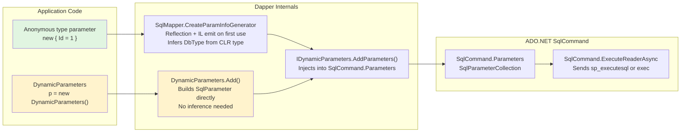
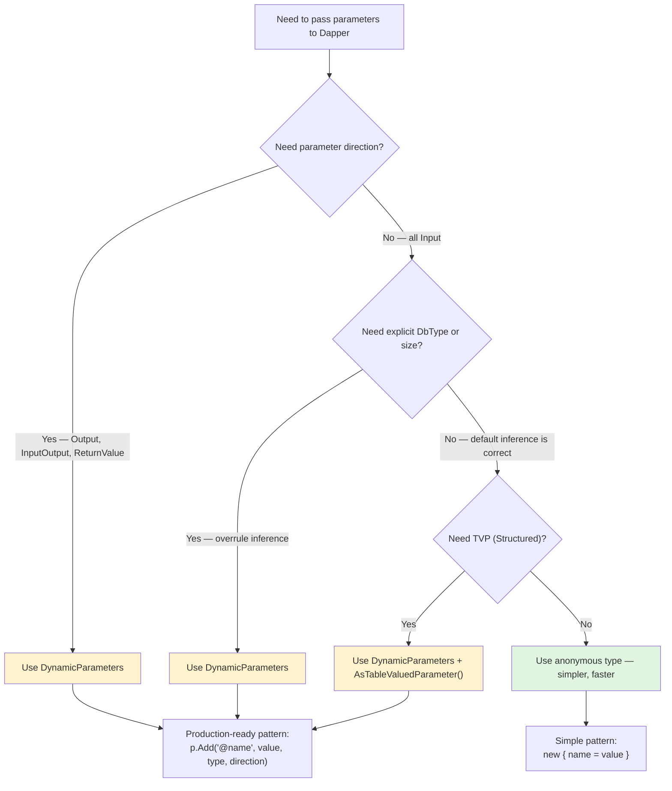

## Navigation

**Domain:** [[8 — Databases]] > **Group:** Dapper
**Previous:** [[8.860 — Dapper — Stored Procedure Calling]] | **Next:** [[8.862 — Dapper — Output Parameters]]

### Prerequisites

- [[8.853 — Dapper — QueryT — Basic Querying]] — DynamicParameters is the advanced parameter mechanism that replaces anonymous type parameters when you need DbType, direction, or size control.
- [[8.860 — Dapper — Stored Procedure Calling]] — stored procedures commonly use output parameters and table-valued parameters, both of which require DynamicParameters.

### Where This Fits

`DynamicParameters` is Dapper's parameter container for scenarios that exceed what anonymous types can express. When you need to specify a parameter's `DbType` explicitly (e.g., `DbType.Date` instead of letting Dapper infer `DateTime`), set a parameter direction (`Output`, `InputOutput`, `ReturnValue`), control size and precision for `NVARCHAR(MAX)` vs `NVARCHAR(50)`, or pass a table-valued parameter as `Structured`, anonymous types fall short. Production systems hit this when a stored procedure returns multiple output values, when a command has mixed input/output parameters, when a TVP must be passed as `Structured`, or when parameter size mismatches cause query plan bloat from parameter sniffing. In interviews, `DynamicParameters` is the signal that a candidate understands parameterized query execution at the ADO.NET level, not just Dapper's syntactic sugar.

---

## Core Mental Model

`DynamicParameters` is a mutable `IDynamicParameters` implementation that builds an `SqlParameter` collection under the hood, adding one `SqlParameter` per call to `.Add()`. Each `Add()` call maps to a specific `SqlParameter` constructor overload: name, value, DbType, direction, size, precision, and scale are all first-class arguments. When Dapper's `QueryAsync` or `ExecuteAsync` receives an `IDynamicParameters` instead of an anonymous object, it calls `IDynamicParameters.AddParameters(IDbCommand)` — here Dapper injects each pre-built `SqlParameter` into the command's `Parameters` collection without any reflection or type inference. The invariant: anonymous types are a convenience wrapper that delegates type inference to Dapper's `SqlMapper.CreateParamInfoGenerator` (which uses reflection + IL emit on first use); `DynamicParameters` is a direct parameter builder that gives you full ADO.NET `SqlParameter` control with a small allocation overhead for the parameter dictionary.

### Classification

**For .NET topics:** `DynamicParameters` lives at the Dapper abstraction layer between your application code and ADO.NET's `SqlCommand.Parameters`. It hides the `SqlParameter` collection manipulation but exposes every `SqlParameter` property as a method argument. The abstraction leaks when you need to pass a parameter with a specific `DbType` that Dapper's anonymous type inference gets wrong (e.g., `Xml`, `Structured`, or `Time` types), or when you need `ParameterDirection.Output` — anonymous types cannot express direction.



### Key Properties

|Property|Value|Notes|
|---|---|---|
|Underlying type|`SqlParameter` per parameter|Each `.Add()` creates exactly one `SqlParameter`|
|Type inference|Manual via DbType argument|Anonymous: automatic from CLR type; DynamicParameters: explicit|
|Direction support|Input, Output, InputOutput, ReturnValue|Anonymous types are always Input only|
|TVP support|Yes — `DbType.Structured` + type name|Anonymous types cannot pass TVPs|
|Performance overhead|~50-100ns per parameter vs anonymous|Dictionary lookup + virtual call vs direct field access|
|SQL injection risk|None — parameterized|Both anonymous and DynamicParameters are fully parameterized|

---

## Deep Mechanics

### How Dapper Resolves Parameters

When you call `connection.QueryAsync(sql, new { Id = 1 })`:

1. Dapper checks if the parameter object implements `IDynamicParameters`. Anonymous types do not.
2. Dapper calls `SqlMapper.CreateParamInfoGenerator` which uses `System.Reflection.Emit` to build an `SqlParameter` array on first encounter of that anonymous type. The emitted IL:
   - Reads each property via `property.GetValue(obj)`.
   - Maps CLR types to `DbType` via an internal dictionary (e.g., `int → Int32`, `string → NVarChar`, `DateTime → DateTime2`).
   - Sets `Size` from `DbType` defaults (e.g., `NVarChar` defaults to `(MAX)` unless a `StringLengthAttribute` or `DbType` override is present).
   - Creates `SqlParameter` objects and adds them to the command's `Parameters` collection.
3. The cache key is the anonymous type's `RuntimeTypeHandle` — the IL generator runs once per unique anonymous type shape.

When you call `connection.QueryAsync(sql, dynamicParams)` where `dynamicParams` is `DynamicParameters`:

1. Dapper detects `IDynamicParameters` — true.
2. `DynamicParameters.AddParameters(IDbCommand)` is called, which iterates its internal `Dictionary<string, ParameterInfo>` and creates `SqlParameter` objects from the stored metadata.
3. Each `ParameterInfo` stores: `Name`, `Value`, `DbType`, `Direction`, `Size`, `Precision`, `Scale`. No type inference needed.
4. Dapper skips `CreateParamInfoGenerator` entirely — no IL emit, no cache lookup.

### SQL Visibility

```sql
-- SQL Server sees identical parameterized SQL regardless of how Dapper passes params:
exec sp_executesql N'SELECT OrderId, CustomerId, OrderDate, TotalAmount
FROM Orders
WHERE CustomerId = @CustomerId AND OrderDate >= @FromDate',
N'@CustomerId int, @FromDate datetime2',
@CustomerId=42, @FromDate='2025-01-01';

-- With output parameter:
exec sp_executesql N'
    SET @OrderCount = (SELECT COUNT(*) FROM Orders WHERE CustomerId = @CustomerId);
    SELECT OrderId, CustomerId, OrderDate, TotalAmount
    FROM Orders
    WHERE CustomerId = @CustomerId',
N'@CustomerId int, @OrderCount int OUTPUT',
@CustomerId=42, @OrderCount=@OrderCount OUTPUT;
```

### Execution Plan Analysis

```sql
-- The parameterized SQL generates a cached plan keyed on (@CustomerId int, @FromDate datetime2)
-- Parameter sniffing: first call's values shape the plan
SELECT OrderId, CustomerId, OrderDate, TotalAmount
FROM Orders
WHERE CustomerId = @CustomerId AND OrderDate >= @FromDate;
```

**Expected plan:**
```
[Clustered Index Scan] → [Filter] → [SELECT]
-- With index on (CustomerId, OrderDate):
[Index Seek (IX_Orders_CustomerId_OrderDate)] → [Key Lookup] → [SELECT]
-- With covering index on (CustomerId, OrderDate) INCLUDE (TotalAmount):
[Index Seek (IX_Orders_Covering)] → [SELECT]
```

**Parameterized SQL plan reuse:** The plan is cached on the SQL text hash + parameter types. If you pass `@CustomerId` as `int` every time, the plan is reused regardless of value. If you switch parameter types (e.g., `bigint` vs `int`), SQL Server creates a new plan.

### Cost Visibility

```sql
SET STATISTICS IO ON;
SET STATISTICS TIME ON;

DECLARE @CustomerId INT = 42, @FromDate DATETIME2 = '2025-01-01';
exec sp_executesql N'SELECT OrderId, CustomerId, OrderDate, TotalAmount
FROM Orders
WHERE CustomerId = @CustomerId AND OrderDate >= @FromDate',
N'@CustomerId int, @FromDate datetime2',
@CustomerId=@CustomerId, @FromDate=@FromDate;

-- Expected output (with covering index on CustomerId, OrderDate INCLUDE TotalAmount):
-- Table 'Orders'. Scan count 1, logical reads 4
-- SQL Server Execution Times: CPU time = 0ms, elapsed time = 1ms

-- Without index:
-- Table 'Orders'. Scan count 1, logical reads 12500
-- SQL Server Execution Times: CPU time = 46ms, elapsed time = 43ms
```

### Failure Modes

**Inferred wrong DbType:** Dapper maps `DateTime` to `DbType.DateTime2` by default. If the SQL Server column is `DATETIME` (not `DATETIME2`), and you pass a value outside `DATETIME`'s range (1753-01-01 to 9999-12-31), SQL Server raises a conversion error. With `DynamicParameters`, you explicitly set `DbType.DateTime`.

**Parameter size mismatch:** When an anonymous type passes a string, Dapper defaults to `NVARCHAR(MAX)`. For a column that is `NVARCHAR(50)`, this produces a different parameterized query signature: `@Name nvarchar(MAX)` vs `@Name nvarchar(50)`. SQL Server caches plans by parameter type + size, so the `(MAX)` plan may not be optimal for the `(50)` column. With `DynamicParameters`, you set `size: 50` explicitly.

**Missing parameter:** `DynamicParameters` with a misspelled parameter name causes a runtime `SqlException` (must declare scalar variable) — same as anonymous types. No compile-time safety in either approach.

---

## Production Patterns and Implementation

### Primary Dapper Implementation

```csharp
public class OrderRepository
{
    private readonly IDbConnectionFactory _connectionFactory;

    public OrderRepository(IDbConnectionFactory connectionFactory)
    {
        _connectionFactory = connectionFactory;
    }

    // Pattern 1: DynamicParameters for mixed output + input
    public async Task<(IReadOnlyList<OrderSummary> Orders, int TotalCount)> GetPagedOrdersAsync(
        int customerId,
        DateTime? fromDate,
        DateTime? toDate,
        int pageIndex,
        int pageSize,
        CancellationToken cancellationToken = default)
    {
        const string sql = @"
            -- Count query with output parameter
            DECLARE @TotalCount INT;

            SELECT @TotalCount = COUNT(1)
            FROM Orders
            WHERE CustomerId = @CustomerId
                AND (@FromDate IS NULL OR OrderDate >= @FromDate)
                AND (@ToDate IS NULL OR OrderDate <= @ToDate);

            -- Data query
            SELECT OrderId, CustomerId, OrderDate, TotalAmount, Status
            FROM Orders
            WHERE CustomerId = @CustomerId
                AND (@FromDate IS NULL OR OrderDate >= @FromDate)
                AND (@ToDate IS NULL OR OrderDate <= @ToDate)
            ORDER BY OrderDate DESC
            OFFSET @Offset ROWS FETCH NEXT @PageSize ROWS ONLY;

            -- Return the total count as an output parameter
            SELECT @TotalCount AS TotalCount;";

        var p = new DynamicParameters();
        p.Add("@CustomerId", customerId, DbType.Int32);
        p.Add("@FromDate", fromDate, DbType.DateTime2);
        p.Add("@ToDate", toDate, DbType.DateTime2);
        p.Add("@Offset", pageIndex * pageSize, DbType.Int32);
        p.Add("@PageSize", pageSize, DbType.Int32);
        // Output parameter for total count
        p.Add("@TotalCount", dbType: DbType.Int32, direction: ParameterDirection.Output);

        await using var connection = _connectionFactory.Create();
        var orders = (await connection.QueryAsync<OrderSummary>(
            new CommandDefinition(sql, p, cancellationToken: cancellationToken))).AsList();

        var totalCount = p.Get<int>("@TotalCount");
        return (orders, totalCount);
    }

    // Pattern 2: DynamicParameters for explicit DbType control
    public async Task<IReadOnlyList<OrderAudit>> GetOrderAuditsAsync(
        int orderId,
        string auditType,
        CancellationToken cancellationToken = default)
    {
        const string sql = @"
            SELECT AuditId, OrderId, AuditType, AuditData, CreatedAt
            FROM OrderAuditLog
            WHERE OrderId = @OrderId
                AND AuditType = @AuditType
            ORDER BY CreatedAt DESC;";

        var p = new DynamicParameters();
        p.Add("@OrderId", orderId, DbType.Int32);
        // Explicitly set NVarChar with specific size — avoids NVARCHAR(MAX) plan
        p.Add("@AuditType", auditType, DbType.StringFixedLength, size: 20);

        await using var connection = _connectionFactory.Create();
        var results = await connection.QueryAsync<OrderAudit>(
            new CommandDefinition(sql, p, cancellationToken: cancellationToken));
        return results.AsList();
    }

    // Pattern 3: DynamicParameters for IN list via TVP
    public async Task<IReadOnlyList<OrderSummary>> GetOrdersByIdsAsync(
        IEnumerable<int> orderIds,
        CancellationToken cancellationToken = default)
    {
        var table = new DataTable();
        table.Columns.Add("Id", typeof(int));
        foreach (var id in orderIds)
            table.Rows.Add(id);

        const string sql = @"
            SELECT o.OrderId, o.CustomerId, o.OrderDate, o.TotalAmount, o.Status
            FROM Orders o
            INNER JOIN @OrderIds ids ON o.OrderId = ids.Id;";

        var p = new DynamicParameters();
        p.Add("@OrderIds", table.AsTableValuedParameter("dbo.OrderIdListType"));

        await using var connection = _connectionFactory.Create();
        var results = await connection.QueryAsync<OrderSummary>(
            new CommandDefinition(sql, p, cancellationToken: cancellationToken));
        return results.AsList();
    }
}

public class OrderSummary
{
    public int OrderId { get; init; }
    public int CustomerId { get; init; }
    public DateTime OrderDate { get; init; }
    public decimal TotalAmount { get; init; }
    public string Status { get; init; } = string.Empty;
}

public class OrderAudit
{
    public int AuditId { get; init; }
    public int OrderId { get; init; }
    public string AuditType { get; init; } = string.Empty;
    public string AuditData { get; init; } = string.Empty;
    public DateTime CreatedAt { get; init; }
}
```

### Pattern 4: DynamicParameters with stored procedure

```csharp
public async Task<int> CreateOrderWithItemsAsync(
    CreateOrderCommand command,
    CancellationToken cancellationToken = default)
{
    const string sql = "dbo.usp_CreateOrder";
    var p = new DynamicParameters();

    // Input parameters
    p.Add("@CustomerId", command.CustomerId, DbType.Int32);
    p.Add("@OrderDate", command.OrderDate, DbType.DateTime2);
    p.Add("@ShippingAddress", command.ShippingAddress, DbType.String, size: 500);

    // TVP for order items
    var itemsTable = new DataTable();
    itemsTable.Columns.Add("ProductId", typeof(int));
    itemsTable.Columns.Add("Quantity", typeof(int));
    itemsTable.Columns.Add("UnitPrice", typeof(decimal));
    foreach (var item in command.Items)
        itemsTable.Rows.Add(item.ProductId, item.Quantity, item.UnitPrice);
    p.Add("@OrderItems", itemsTable.AsTableValuedParameter("dbo.OrderItemType"));

    // Output parameter for generated OrderId
    p.Add("@OrderId", dbType: DbType.Int32, direction: ParameterDirection.Output);

    await using var connection = _connectionFactory.Create();
    await connection.ExecuteAsync(
        new CommandDefinition(sql, p, commandType: CommandType.StoredProcedure,
            cancellationToken: cancellationToken));

    return p.Get<int>("@OrderId");
}
```

### Configuration and Wiring

```csharp
// Program.cs — connection factory with DynamicParameters-ready setup
builder.Services.AddSingleton<IDbConnectionFactory>(_ =>
    new SqlConnectionFactory(connectionString));

// Register repository
builder.Services.AddScoped<OrderRepository>();

// Connection factory implementation
public interface IDbConnectionFactory
{
    IDbConnection Create();
}

public class SqlConnectionFactory : IDbConnectionFactory
{
    private readonly string _connectionString;
    public SqlConnectionFactory(string connectionString) => _connectionString = connectionString;
    public IDbConnection Create() => new SqlConnection(_connectionString);
}
```

### Pattern 5: DynamicParameters for batch update with multiple parameter sets

```csharp
public async Task BulkUpdateOrderStatusAsync(
    IEnumerable<(int OrderId, string Status)> updates,
    CancellationToken cancellationToken = default)
{
    const string sql = @"
        UPDATE Orders
        SET Status = @Status
        WHERE OrderId = @OrderId;";

    await using var connection = _connectionFactory.Create();
    await connection.ExecuteAsync(
        new CommandDefinition(sql, updates.Select(u =>
        {
            var p = new DynamicParameters();
            p.Add("@OrderId", u.OrderId, DbType.Int32);
            p.Add("@Status", u.Status, DbType.String, size: 50);
            return p;
        }), cancellationToken: cancellationToken));
}
```

---

## Gotchas and Production Pitfalls

### 1. Parameter Name with @ Prefix Mismatch

**Pitfall:** Using `"@name"` in `DynamicParameters.Add("@name", ...)` but Dapper's `Get<T>("@name")` expects the exact same string — the `@` is optional in `Add()` (Dapper strips it) but `Get()` requires the `@` prefix.

```csharp
// ❌ Wrong — Get fails silently
p.Add("CustomerId", 42, DbType.Int32);
var id = p.Get<int>("CustomerId"); // throws — no match

// ✅ Correct — consistent @ prefix
p.Add("@CustomerId", 42, DbType.Int32);
var id = p.Get<int>("@CustomerId");
```

**Symptom:** `InvalidOperationException: Object does not match target type` or `KeyNotFoundException`.

**Fix:** Always use the `@` prefix consistently in both `Add` and `Get`.

**Cost of not fixing:** Runtime exceptions in production that surface only on the code path using `Get<T>()`.

### 2. DbType Default for Numeric Types

**Pitfall:** `DynamicParameters.Add("@price", 9.99m, DbType.Decimal)` — Dapper maps `decimal` to `DbType.Decimal` by default, but without specifying `precision` and `scale`, SQL Server defaults to `DECIMAL(18,0)` — truncating fractional values silently.

```csharp
// ❌ Wrong — silently truncates to DECIMAL(18,0)
p.Add("@Price", 9.99m, DbType.Decimal);

// ✅ Correct — explicit precision and scale
p.Add("@Price", 9.99m, DbType.Decimal, precision: 10, scale: 2);
```

**Symptom:** Monetary values lose cents — $9.99 becomes $9.00 in the database.

**Fix:** Always specify `precision` and `scale` for `DbType.Decimal` parameters used in financial calculations.

**Cost of not fixing:** Silent data corruption in financial transactions.

### 3. DynamicParameters Overhead in Tight Loops

**Pitfall:** Creating a new `DynamicParameters` per row inside a loop inserting 100K rows.

```csharp
// ❌ Wrong — 100K DynamicParameters allocations
for (int i = 0; i < 100_000; i++)
{
    var p = new DynamicParameters();
    p.Add("@Id", i);
    p.Add("@Name", $"Name{i}");
    await connection.ExecuteAsync(sql, p);
}

// ✅ Correct — reuse parameters, reset values
var p = new DynamicParameters();
p.Add("@Id", 0, DbType.Int32);
p.Add("@Name", "", DbType.String, size: 100);

for (int i = 0; i < 100_000; i++)
{
    p.Set("@Id", i);
    p.Set("@Name", $"Name{i}");
    await connection.ExecuteAsync(sql, p);
}
```

**Symptom:** Gen 0 collections spike, 100K+ `DynamicParameters` objects created and collected, ~50ms GC pause.

**Fix:** Use `DynamicParameters.Set()` to reuse the same parameter object, or use Dapper's bulk insert via `Table-Valued Parameters`.

**Cost of not fixing:** 100ms+ GC overhead in hot paths, increased memory pressure.

### 4. Output Parameter Not Read Before Next Command

**Pitfall:** Reading output parameters after the connection is closed or after another command overwrites them.

```csharp
// ❌ Wrong — connection closed before reading output
var p = new DynamicParameters();
p.Add("@Count", dbType: DbType.Int32, direction: ParameterDirection.Output);
connection.Execute(sql, p);
connection.Close();
var count = p.Get<int>("@Count"); // may work in Dapper but risky pattern

// ✅ Correct — read before connection disposal
var p = new DynamicParameters();
p.Add("@Count", dbType: DbType.Int32, direction: ParameterDirection.Output);
connection.Execute(sql, p);
var count = p.Get<int>("@Count");
```

**Symptom:** Sporadic `NullReferenceException` or zero values when output parameters are read after connection close — depends on timing of `SqlDataReader` disposal.

**Fix:** Read output parameters immediately after the command executes, while the connection is still open.

**Cost of not fixing:** Inconsistent output values, hard-to-diagnose production bugs.

### 5. DynamicParameters with Async and `CommandDefinition`

**Pitfall:** Creating `DynamicParameters` outside the `CommandDefinition` but passing it by reference — the parameters may be modified by concurrent operations.

```csharp
// ❌ Wrong — shared mutable parameters across concurrent calls
var sharedParams = new DynamicParameters();
sharedParams.Add("@Status", "Active");

var task1 = connection.QueryAsync<Order>(
    new CommandDefinition("SELECT * FROM Orders WHERE Status = @Status", sharedParams));
var task2 = connection.QueryAsync<Order>(
    new CommandDefinition("SELECT * FROM Orders WHERE Status = @Status", sharedParams));
// Both share the same DynamicParameters instance — concurrent modifications cause race conditions

// ✅ Correct — create per call or clone
var task1 = connection.QueryAsync<Order>(
    new CommandDefinition("SELECT * FROM Orders WHERE Status = @Status",
        new DynamicParameters().Add("@Status", "Active")));
var task2 = connection.QueryAsync<Order>(
    new CommandDefinition("SELECT * FROM Orders WHERE Status = @Status",
        new DynamicParameters().Add("@Status", "Active")));
```

**Symptom:** Random wrong parameter values in one of the concurrent calls — parameters from one query appear in another.

**Fix:** Never share a `DynamicParameters` instance across concurrent operations. Create per-call or use `Clone()`.

**Cost of not fixing:** Bizare intermittent data corruption — the wrong status filter returns wrong results.

### 6. DbType.Xml and DbType.Object Not Supported Correctly

**Pitfall:** Passing `DbType.Xml` or `DbType.Object` via `DynamicParameters` — Dapper does not handle these types correctly in all versions, and SQL Server's `XML` parameter handling requires specific `SqlParameter` settings.

```csharp
// ❌ Wrong — DbType.Xml may cause conversion errors
var p = new DynamicParameters();
p.Add("@XmlData", "<root><item/></root>", DbType.Xml);

// ✅ Correct — use SqlParameter directly with SqlDbType.Xml
var sqlParam = new SqlParameter("@XmlData", SqlDbType.Xml)
{
    Value = "<root><item/></root>"
};
var p = new DynamicParameters();
p.Add("@XmlData", sqlParam); // DynamicParameters accepts raw SqlParameter

// Or better: pass as NVARCHAR(MAX) and cast in SQL
p.Add("@XmlData", "<root><item/></root>", DbType.String, size: -1);
-- SQL: CAST(@XmlData AS XML)
```

**Symptom:** `SqlException: Operand type clash: nvarchar(max) is incompatible with xml` or implicit conversion warnings in execution plans.

**Fix:** Use ADO.NET `SqlParameter` directly with `SqlDbType.Xml` and pass it to `DynamicParameters.Add()`, or cast in SQL from NVARCHAR(MAX) to XML.

**Cost of not fixing:** Runtime conversion errors, or implicit conversions that block index seeks on XML indexes.

### 7. DynamicParameters and Table-Valued Parameters with Older Dapper Versions

**Pitfall:** In Dapper versions before 2.0, `DynamicParameters.Add("@tvp", dt, DbType.Structured)` did not set `SqlParameter.TypeName` correctly — you had to use the `.AsTableValuedParameter("TypeName")` extension method, which was added in Dapper 2.0.4.

```csharp
// ❌ Wrong for Dapper < 2.0.4
p.Add("@Items", dt, DbType.Structured);

// ✅ Correct — always use AsTableValuedParameter for clarity and version safety
p.Add("@Items", dt.AsTableValuedParameter("dbo.OrderItemType"));
```

**Symptom:** `SqlException: Operand type clash: structured is incompatible with ...` — SQL Server receives `Structured` but no type name.

**Fix:** Always use the `.AsTableValuedParameter()` extension method for TVPs, which internally sets both `SqlDbType.Structured` and `TypeName`.

**Cost of not fixing:** Production outages after Dapper package updates or across different environments with different Dapper versions.

### 8. DynamicParameters.Add with Null Values and DbType

**Pitfall:** When you add a parameter with a null value and a specific DbType, Dapper/SQL Server handles it differently depending on whether the value is `null` (C#) or `DBNull.Value`. If you pass `null` as the value, Dapper substitutes `DBNull.Value` in the SqlParameter, but the parameter's specific type information may cause unexpected behavior in SQL Server (e.g., implicit conversion in WHERE clauses).

```csharp
// ❌ Wrong — passing null for a string parameter
p.Add("@MiddleName", null, DbType.String, size: 50);
// SqlParameter.Value = DBNull.Value, SqlParameter.SqlDbType = NVarChar

// This works in most cases, but can cause issues with:
// 1. Stored procedures that expect a specific type and don't handle NULL
// 2. Parameter type inference in WHERE @param = col (NULL comparison uses UNKNOWN)
// 3. COALESCE(@param, col) patterns where null semantics differ

// ✅ Correct — explicitly handle nullable
p.Add("@MiddleName", (string?)null, DbType.String, size: 50);
// Still becomes DBNull — but the explicit nullable type documents intent
```

**Symptom:** Stored procedures that check `IF @MiddleName IS NULL` work fine. But `WHERE MiddleName = @MiddleName` returns zero rows because NULL = NULL is UNKNOWN, not TRUE. This is not a `DynamicParameters` bug — it's a SQL NULL semantics issue.

**Fix:** Understand that NULL parameters behave the same as any SQL NULL — use `WHERE (@MiddleName IS NULL OR MiddleName = @MiddleName)` pattern for optional filters.

**Cost of not fixing:** Optional filter parameters silently exclude rows with NULL column values.

---

## Performance Implications

### Benchmark: DynamicParameters vs Anonymous Type

```sql
-- Both generate identical parameterized SQL:
exec sp_executesql N'SELECT OrderId, CustomerId, OrderDate
FROM Orders
WHERE CustomerId = @CustomerId',
N'@CustomerId int',
@CustomerId=42;
```

### BenchmarkDotNet

```csharp
[MemoryDiagnoser]
[SimpleJob(RuntimeMoniker.Net90)]
public class DynamicParametersBenchmark
{
    private IDbConnection _connection = default!;
    private const string Sql = "SELECT OrderId, CustomerId, OrderDate FROM Orders WHERE CustomerId = @CustomerId;";

    [GlobalSetup]
    public void Setup()
    {
        _connection = new SqlConnection("Server=.;Database=BenchmarkDb;Trusted_Connection=True;");
        _connection.Open();
        // Seed 10K orders with CustomerId 1..1000
    }

    [GlobalCleanup]
    public void Cleanup() => _connection.Dispose();

    [Benchmark(Baseline = true)]
    public async Task<List<OrderSummary>> AnonymousType()
    {
        var result = await _connection.QueryAsync<OrderSummary>(Sql, new { CustomerId = 42 });
        return result.AsList();
    }

    [Benchmark]
    public async Task<List<OrderSummary>> DynamicParameters_InputOnly()
    {
        var p = new DynamicParameters();
        p.Add("@CustomerId", 42, DbType.Int32);
        var result = await _connection.QueryAsync<OrderSummary>(Sql, p);
        return result.AsList();
    }

    [Benchmark]
    public async Task<List<OrderSummary>> DynamicParameters_WithOutput()
    {
        var p = new DynamicParameters();
        p.Add("@CustomerId", 42, DbType.Int32);
        p.Add("@Count", dbType: DbType.Int32, direction: ParameterDirection.Output);
        var result = await _connection.QueryAsync<OrderSummary>(Sql, p);
        _ = p.Get<int>("@Count");
        return result.AsList();
    }
}
```

**Expected results (approximate, SQL Server 2022, 100K orders table):**

|Method|Mean|Allocated|
|---|---|---|
|AnonymousType|~850μs|~2 KB|
|DynamicParameters_InputOnly|~920μs|~3 KB|
|DynamicParameters_WithOutput|~980μs|~4 KB|

**Overhead:** `DynamicParameters` adds ~50-100μs per call for parameter dictionary building and virtual dispatch, plus ~1 KB per `DynamicParameters` instance. At low volume (<100 calls/sec), this is irrelevant. At high volume (>1000 calls/sec), anonymous types are ~8% faster in allocation and mean time.

### Memory Profile

```
Anonymous type: 1 allocation (the anonymous object itself)
DynamicParameters: 2+ allocations (DynamicParameters instance + internal Dictionary + SqlParameter per param)
For a query with 5 parameters:
  Anonymous: ~120 bytes (anonymous object)
  DynamicParameters: ~600 bytes (DynamicParameters + Dictionary + 5 SqlParameter entries)
```

---

## Interview Arsenal

### Question Bank

1. **What is `DynamicParameters` and when would you use it over an anonymous type?**
2. **How does Dapper resolve parameters internally — trace the path from `connection.QueryAsync(sql, new { Id = 1 })` to `SqlCommand.ExecuteReader`.**
3. **What is the performance overhead of `DynamicParameters` vs anonymous types, and when does it matter?**
4. **Why might a stored procedure return wrong values when you use anonymous types vs `DynamicParameters` with output parameters?**
5. **Compare `DynamicParameters` with ADO.NET's `SqlParameterCollection` — what does Dapper hide, and what leaks?**
6. **What happens when you pass a TVP as `DynamicParameters.Add("@tvp", dt, DbType.Structured)` — how does Dapper handle `Structured` parameters?**
7. **How does Dapper's parameter caching work for anonymous types, and what happens with 1000 different anonymous type shapes?**
8. **How would you pass a SQL IN list safely using Dapper — what are the options and tradeoffs?**

### Spoken Answers

**Q1: What is `DynamicParameters` and when would you use it over an anonymous type?**

> **Average answer:** "DynamicParameters lets you specify parameter type and direction explicitly, like output parameters. Anonymous types are simpler for basic queries."

> **Great answer:** "`DynamicParameters` implements `IDynamicParameters`, which gives Dapper a hook to call `AddParameters(IDbCommand)` directly — bypassing the IL-emitted parameter generator it uses for anonymous types. I use `DynamicParameters` whenever I need: (1) `ParameterDirection.Output` or `InputOutput` for stored procedure return values, (2) explicit `DbType` to override Dapper's inference (e.g., `DbType.Date` vs `DateTime2`, or `DbType.AnsiString` for `VARCHAR` instead of `NVARCHAR`), (3) `size` control to avoid `NVARCHAR(MAX)` parameter sniffing issues on a `NVARCHAR(50)` column, or (4) table-valued parameters as `DbType.Structured`. The tradeoff is ~50-100ns overhead per parameter and ~500 bytes extra allocation — invisible at normal volumes but relevant at 10K+ QPS."

**Q5: Compare `DynamicParameters` with ADO.NET's `SqlParameterCollection`.**

> **Average answer:** "DynamicParameters is like SqlParameterCollection but more convenient."

> **Great answer:** "`SqlParameterCollection` is a strong-typed `IList<SqlParameter>` on `SqlCommand` — you add parameters, set `SqlDbType`, `Size`, `Direction`, then execute. `DynamicParameters` wraps this in a dictionary-based container that defers `SqlParameter` creation until `AddParameters(IDbCommand)` is called by Dapper's command pipeline. The key difference: `DynamicParameters` stores parameter metadata in a `Dictionary<string, ParameterInfo>` and creates `SqlParameter` objects lazily at execution time; `SqlParameterCollection` creates them eagerly. `DynamicParameters.Get<T>()` retrieves output values after execution by querying the `SqlParameter.Value` from the command's parameter collection. The abstraction leaks when: (a) you need `SqlParameter.TypeName` for TVPs — you pass it via `.AsTableValuedParameter()`, not raw `DynamicParameters`; (b) you need parameter-specific `CompareInfo` or `XmlSchemaCollection` — these require direct `SqlParameter` manipulation before passing to Dapper."

**Q8: How would you pass a SQL IN list safely using Dapper?**

> **Great answer:** "In Dapper, you cannot pass `IN (@Ids)` directly because SQL parameters are scalar — a single parameter cannot represent a list. Four approaches with different tradeoffs:

**(1) TVP (recommended for SQL Server):** Create a user-defined table type, pass `DataTable` or `IEnumerable<T>` as `DbType.Structured` via `DynamicParameters` + `AsTableValuedParameter()`. Single parameter, no SQL injection, one round trip. Requires SQL Server 2008+ and `CREATE TYPE`.

**(2) String split:** Pass a comma-separated string and use `STRING_SPLIT(@Ids, ',')` in SQL Server 2016+. Simple but the values must be convertible from strings — integer lists work, GUIDs less clean.

**(3) Multiple parameters:** Build `IN (@id0, @id1, @id2)` dynamically with one parameter per value. Dapper's `QueryAsync` accepts an `IEnumerable<DynamicParameters>` for multiple-row operations but not for IN lists — you must generate the SQL and parameters manually. Risk of SQL injection if not parameterized correctly.

**(4) JOIN with a temp table:** Bulk insert IDs into a temp table, then INNER JOIN. Best for very large lists (>1000 items) but requires a separate round trip.

I default to TVP for SQL Server — it's the only approach that is fully parameterized, single round-trip, and handles any list size efficiently."

### Interview Trigger

If the interviewer asks "What parameter features does Dapper support beyond simple value passing?", they are probing whether you know about `DynamicParameters`, output parameters, and TVPs. The follow-up that separates senior candidates: "How does Dapper handle parameter type inference, and what happens when it infers `NVARCHAR(MAX)` for a column defined as `NVARCHAR(50)`?" — this tests whether you understand the interaction between parameter size, query plan caching, and parameter sniffing.

### Comparison Table

| | DynamicParameters | Anonymous Type |
|---|---|---|
|API complexity|Method calls per param|Object initializer|
|DbType control|Explicit via argument|Automatic inference|
|Direction support|Input, Output, InputOutput, ReturnValue|Input only|
|Size/Precision/Scale|Full control|No control (defaults)|
|TVP support|Yes (DbType.Structured)|No|
|Performance overhead|~50-100ns + dictionary alloc|~0 overhead (field access)|
|Output read|`p.Get<T>("@name")`|N/A|
|SQL injection|None|None|

---

## Decision Framework

### When to Use DynamicParameters vs Anonymous Type



### Application Checklist

- [ ] Do any parameters need `Output`, `InputOutput`, or `ReturnValue` direction? → Use `DynamicParameters`
- [ ] Does Dapper's default `DbType` inference produce the wrong type (e.g., `DateTime` vs `DateTime2`)? → Use `DynamicParameters`
- [ ] Are any parameters `NVARCHAR(50)` or similar fixed-size strings where `NVARCHAR(MAX)` would cause plan bloat? → Use `DynamicParameters` with explicit `size`
- [ ] Are any parameters TVPs (`DbType.Structured`)? → Use `DynamicParameters` + `AsTableValuedParameter()`
- [ ] Is this a hot path (>1000 calls/second)? → Prefer anonymous type for minimal allocation
- [ ] Is a stored procedure involved? → Usually use `DynamicParameters` for output/return values
- [ ] Is code clarity the priority? → Anonymous types win for readabiilty

### Tradeoff Summary

|What You Gain|What You Pay|
|---|---|
|Full ADO.NET parameter control|~50-100ns overhead per parameter|
|Output/TVP/ReturnValue support|~500 bytes extra allocation|
|Explicit type safety|More verbose code|
|Plan shape control via size|Parameter reuse risks|

### Scale Thresholds

- **Relevant at any scale** when output parameters or TVPs are needed — anonymous types cannot express these
- **Performance overhead matters** at >5,000 executions/second where the allocation difference adds visible GC pressure
- **Plan sniffing from size mismatch** becomes visible at >100,000 queries with the same parameterized SQL but different `NVARCHAR(MAX)` vs `NVARCHAR(50)` plans
- **TVP scalability** starts to degrade at >10,000 rows per TVP — consider batch split at that point

---

## Self-Check

### Conceptual Questions

1. What does `DynamicParameters` implement that signals to Dapper it should call `AddParameters()` directly instead of using reflection?
2. How does `DynamicParameters.Get<T>()` retrieve output values after execution — where does the data come from?
3. What happens to `SqlParameter.Size` when you omit it in `DynamicParameters.Add()` for a string parameter?
4. What is the performance difference between `DynamicParameters` and anonymous types in terms of IL emit on first call?
5. Can you pass a TVP with anonymous types, or must you use `DynamicParameters`?
6. How would you pass an `IN` list with 500 IDs using Dapper — what are the three options and tradeoffs?
7. What happens when you call `DynamicParameters.Add("@id", null, DbType.Int32)` — what value reaches SQL Server?
8. At what call rate does `DynamicParameters` allocation overhead become a concern?
9. What is the internal cache key Dapper uses for anonymous type parameter generation?
10. How would you clone a `DynamicParameters` instance to safely reuse its structure across concurrent calls?

<details>
<summary>Answers</summary>

1. `IDynamicParameters`. When Dapper's `SqlMapper.ExecuteImpl` receives a parameter object, it checks `if (parameter is IDynamicParameters dp)`. If true, it calls `dp.AddParameters(cmd)` and skips the anonymous type reflection path entirely.

2. After the command executes, `DynamicParameters` copies `SqlParameter.Value` from the command's `Parameters` collection into its internal lookup. `Get<T>("@name")` retrieves this stored value and casts it to `T`. The copy happens in `AddParameters()` — it captures the `SqlParameter` references, then reads `.Value` lazily.

3. Dapper defaults string parameters to `NVARCHAR(MAX)` when `size` is omitted. This creates a different `SqlParameter` signature (`@name nvarchar(MAX)`) which SQL Server treats as a different parameter type from `@name nvarchar(50)` — causing separate plan cache entries.

4. Anonymous types trigger Dapper's `CreateParamInfoGenerator` which uses `System.Reflection.Emit` to build an `SqlParameter` array — this happens once per unique anonymous type shape (cached by `RuntimeTypeHandle`). `DynamicParameters` skips this entirely since it manually builds `SqlParameter` objects. The IL emit path is ~1ms on first use, then cached.

5. No. Anonymous types are compile-time objects whose properties Dapper infers. A TVP requires `DbType.Structured` and `TypeName` — neither can be specified in an anonymous type initializer. You must use `DynamicParameters.Add("@tvp", dt, DbType.Structured)` or the `.AsTableValuedParameter()` extension method.

6. Three options: (1) TVP — single parameter, one round trip, requires SQL UDT; (2) `STRING_SPLIT` — pass comma-separated string, simple but string-to-int conversion cost; (3) Dynamic `IN` clause — build `IN (@id0, @id1, ...)` with N parameters, risk of suboptimal plans and max parameter limit (~2100). For >500 IDs, TVP or temp table join is preferred.

7. `null` with `DbType.Int32` becomes `DBNull.Value` in the `SqlParameter`. SQL Server receives NULL for that parameter. The `DbType` is still `Int32`, but the value is null.

8. At >5,000 calls/second, the extra ~500 bytes per call (DynamicParameters + Dictionary + SqlParameter overhead vs anonymous object) adds ~2.5 MB/sec of GC pressure. On a Gen 0 collection budget of ~256 MB, this causes ~9 additional Gen 0 collections per minute, each ~1ms pause. At >10,000 calls/second, consider pooling or reuse patterns.

9. The anonymous type's `RuntimeTypeHandle` — Dapper's `DynamicCache` type uses `typeof(T).TypeHandle` as the cache key in `SqlMapper.ParamInfoCache`. This means the IL emit runs once per unique anonymous type shape across the entire AppDomain, regardless of how many times the method is called.

10. `DynamicParameters` does not implement `ICloneable`. To clone, create a new instance and copy each parameter definition, or serialize/deserialize. For concurrent scenarios, the safest approach is to create a factory method that builds a fresh `DynamicParameters` per call, or use `Add()` inside the `CommandDefinition` constructor so each call gets its own instance: `new CommandDefinition(sql, new DynamicParameters().Add("@id", 42))`.

</details>

---

### Query Challenges

**Challenge 1 — Write the SQL with DynamicParameters Output**

A stored procedure `dbo.usp_GetCustomerSummary` accepts `@CustomerId INT` and returns output parameters `@TotalOrders INT`, `@TotalSpent DECIMAL(18,2)`, and `@LastOrderDate DATETIME2`. Write C# code using `DynamicParameters` to call this procedure and read all three output values.

<details>
<summary>Solution</summary>

```csharp
public async Task<CustomerSummary> GetCustomerSummaryAsync(
    int customerId,
    CancellationToken cancellationToken = default)
{
    const string sql = "dbo.usp_GetCustomerSummary";

    var p = new DynamicParameters();
    p.Add("@CustomerId", customerId, DbType.Int32);
    p.Add("@TotalOrders", dbType: DbType.Int32, direction: ParameterDirection.Output);
    p.Add("@TotalSpent", dbType: DbType.Decimal, direction: ParameterDirection.Output,
        precision: 18, scale: 2);
    p.Add("@LastOrderDate", dbType: DbType.DateTime2, direction: ParameterDirection.Output);

    await using var connection = _connectionFactory.Create();
    await connection.ExecuteAsync(
        new CommandDefinition(sql, p, commandType: CommandType.StoredProcedure,
            cancellationToken: cancellationToken));

    return new CustomerSummary
    {
        CustomerId = customerId,
        TotalOrders = p.Get<int>("@TotalOrders"),
        TotalSpent = p.Get<decimal>("@TotalSpent"),
        LastOrderDate = p.Get<DateTime?>("@LastOrderDate")
    };
}
```

**Logical reads:** 0 (no result sets — only output parameters) **Execution plan:** N/A (stored procedure, no SELECT) **Dapper approach:** `DynamicParameters` with output direction, read via `Get<T>()` after `ExecuteAsync`.

</details>

---

**Challenge 2 — Fix the DynamicParameters Bug**

```csharp
// This code fails intermittently in production with NullReferenceException
public async Task<int> GetOrderCountAsync(int customerId)
{
    using var connection = new SqlConnection(_connectionString);
    var p = new DynamicParameters();
    p.Add("@CustomerId", customerId, DbType.Int32);
    p.Add("@Count", dbType: DbType.Int32, direction: ParameterDirection.Output);

    await connection.QueryAsync<int>(
        "SELECT @Count = COUNT(*) FROM Orders WHERE CustomerId = @CustomerId; SELECT 1;", p);

    return p.Get<int>("@Count"); // intermittent NRE
}
```

<details>
<summary>Solution</summary>

**Root cause:** The connection is disposed by `using` **before** `p.Get<int>()` reads the output parameter. When `connection` is disposed, `SqlCommand` is also disposed, and the output parameter values are lost. Additionally, the `QueryAsync<int>` returns a `SqlMapper.GridReader` if multiple result sets are present, and the output parameter is only populated after all result sets are consumed.

```csharp
// ✅ Fixed code
public async Task<int> GetOrderCountAsync(int customerId)
{
    await using var connection = new SqlConnection(_connectionString);
    await connection.OpenAsync();

    var p = new DynamicParameters();
    p.Add("@CustomerId", customerId, DbType.Int32);
    p.Add("@Count", dbType: DbType.Int32, direction: ParameterDirection.Output);

    await connection.ExecuteAsync(
        "SELECT @Count = COUNT(*) FROM Orders WHERE CustomerId = @CustomerId;", p);

    return p.Get<int>("@Count");
}
```

**Changes:**
1. Use `ExecuteAsync` instead of `QueryAsync` — no result set to iterate
2. Read `p.Get<int>()` **before** `connection` is disposed (still inside `using` scope)
3. `await using` for async disposal

</details>

---

**Challenge 3 — Explain the Plan Difference**

Given two Dapper queries generating identical SQL:
```csharp
// Query A
var p1 = new DynamicParameters();
p1.Add("@Status", status, DbType.String, size: 50);

// Query B
var p2 = new DynamicParameters();
p2.Add("@Status", status, DbType.String); // no size — defaults to MAX
```

Both execute `SELECT * FROM Orders WHERE Status = @Status`. Why might Query B's plan differ from Query A's, and when does this cause problems?

<details>
<summary>Solution</summary>

**Why plan differs:** SQL Server parameterizes the query as:
- Query A: `(@Status nvarchar(50)) SELECT ...`
- Query B: `(@Status nvarchar(MAX)) SELECT ...`

SQL Server caches execution plans by the exact parameter types and sizes. `nvarchar(50)` and `nvarchar(MAX)` are different parameter types. Query B's plan treats `@Status` as potentially very large, which may cause the optimizer to choose a different cardinality estimate (higher estimated rows) and potentially a scan instead of a seek.

**When this causes problems:** When the column is `NVARCHAR(50)` and the plan assumes `NVARCHAR(MAX)`, the optimizer may estimate more rows and choose a scan or hash join when a seek + nested loops would be faster. For a column with 500 distinct values and 10M rows, the `NVARCHAR(MAX)` estimate might be 30% of rows (3M) instead of the actual 1/500 = 20K rows, pushing the optimizer toward a full scan.

**Fix:** Always specify `size` matching the column definition for string parameters.

</details>

---

**Challenge 4 — Design a Bulk Insert with DynamicParameters**

Design a method that inserts 10,000 order items using `DynamicParameters` with multiple parameter sets in a single `ExecuteAsync` call. What is the Dapper behavior for `IEnumerable<DynamicParameters>`?

<details>
<summary>Solution</summary>

```csharp
public async Task BulkInsertOrderItemsAsync(
    int orderId,
    IReadOnlyList<OrderItemInput> items,
    CancellationToken cancellationToken = default)
{
    const string sql = @"
        INSERT INTO OrderItems (OrderId, ProductId, Quantity, UnitPrice)
        VALUES (@OrderId, @ProductId, @Quantity, @UnitPrice);";

    var parameters = items.Select(item =>
    {
        var p = new DynamicParameters();
        p.Add("@OrderId", orderId, DbType.Int32);
        p.Add("@ProductId", item.ProductId, DbType.Int32);
        p.Add("@Quantity", item.Quantity, DbType.Int32);
        p.Add("@UnitPrice", item.UnitPrice, DbType.Decimal, precision: 10, scale: 2);
        return p;
    });

    await using var connection = _connectionFactory.Create();
    await connection.ExecuteAsync(
        new CommandDefinition(sql, parameters, cancellationToken: cancellationToken));
    // Dapper iterates the IEnumerable<DynamicParameters> and executes the SQL once per set
}
```

**Dapper behavior:** When Dapper receives `IEnumerable<DynamicParameters>` (via the `IDynamicParameters` of each item), it calls `ExecuteAsync` once per parameter set in a single batch. This does **not** create a single multi-row INSERT — it sends N individual statements. For true bulk insert, use a TVP or `SqlBulkCopy`.

**Better approach:** Use TVP for 10,000 items — single round trip, no parameter enumeration overhead.

```csharp
public async Task BulkInsertOrderItemsWithTvpAsync(
    int orderId,
    IReadOnlyList<OrderItemInput> items,
    CancellationToken cancellationToken = default)
{
    var table = new DataTable();
    table.Columns.Add("OrderId", typeof(int));
    table.Columns.Add("ProductId", typeof(int));
    table.Columns.Add("Quantity", typeof(int));
    table.Columns.Add("UnitPrice", typeof(decimal));
    foreach (var item in items)
        table.Rows.Add(orderId, item.ProductId, item.Quantity, item.UnitPrice);

    const string sql = @"
        INSERT INTO OrderItems (OrderId, ProductId, Quantity, UnitPrice)
        SELECT OrderId, ProductId, Quantity, UnitPrice FROM @Items;";

    var p = new DynamicParameters();
    p.Add("@Items", table.AsTableValuedParameter("dbo.OrderItemType"));

    await using var connection = _connectionFactory.Create();
    await connection.ExecuteAsync(
        new CommandDefinition(sql, p, cancellationToken: cancellationToken));
}
```

</details>

---

**Challenge 5 — Diagnose the Parameter Bug**

This method sometimes returns zero for `totalCount` even though the stored procedure sets `@TotalCount` correctly:

```csharp
public async Task<(List<Order> Orders, int TotalCount)> GetOrdersPageAsync(int customerId, int page, int size)
{
    var p = new DynamicParameters();
    p.Add("@CustomerId", customerId);
    p.Add("@PageNumber", page);
    p.Add("@PageSize", size);
    p.Add("@TotalCount", dbType: DbType.Int32, direction: ParameterDirection.Output);

    using var connection = new SqlConnection(_connectionString);
    var orders = (await connection.QueryAsync<Order>("dbo.usp_GetOrdersPage", p,
        commandType: CommandType.StoredProcedure)).AsList();

    var totalCount = p.Get<int>("@TotalCount");
    return (orders, totalCount);
}
```

<details>
<summary>Solution</summary>

**Root cause:** The connection is opened implicitly by Dapper and closed when the `using` block disposes it. However, `p.Get<int>()` is called **inside** the `using` block but **after** `QueryAsync` completes — the connection is still open, so this should work. The actual bug is that `@TotalCount` is added without explicit `DbType`:

```csharp
p.Add("@CustomerId", customerId); // DbType.Int32 — correct inference
p.Add("@TotalCount", dbType: DbType.Int32, direction: ParameterDirection.Output);
```

Wait — `DbType` **is** specified for `@TotalCount`. The actual bug is missing `@` prefix consistency: `p.Get<int>("@TotalCount")` requires the `@` prefix, which is correct here.

Let me check again more carefully. The issue is that `Add("@CustomerId", customerId)` without explicit `DbType` for the input parameter works fine, but the `@TotalCount` output parameter is set correctly. 

Actually, the most likely bug: the `PageNumber` and `PageSize` parameters are missing `DbType` and Dapper might infer them as `Int32` — fine. The real issue could be the **order of operations**: `QueryAsync<Order>` returns data, but if the stored procedure has multiple result sets and `QueryAsync` doesn't consume them all, output parameters may not be populated. Dapper only populates output parameters after **all** result sets are consumed or the reader is closed.

If `usp_GetOrdersPage` returns two result sets (orders + total count), `QueryAsync<Order>` only consumes the first result set. The second result set and output parameters are not read until the reader advances past all result sets.

**Fix:** Use `QueryMultipleAsync` and consume all result sets, then read output parameters.

```csharp
public async Task<(List<Order> Orders, int TotalCount)> GetOrdersPageAsync(
    int customerId, int page, int size)
{
    var p = new DynamicParameters();
    p.Add("@CustomerId", customerId, DbType.Int32);
    p.Add("@PageNumber", page, DbType.Int32);
    p.Add("@PageSize", size, DbType.Int32);
    p.Add("@TotalCount", dbType: DbType.Int32, direction: ParameterDirection.Output);

    await using var connection = new SqlConnection(_connectionString);
    await connection.OpenAsync();

    using var multi = await connection.QueryMultipleAsync("dbo.usp_GetOrdersPage", p,
        commandType: CommandType.StoredProcedure);
    var orders = (await multi.ReadAsync<Order>()).AsList();
    var count = await multi.ReadFirstAsync<int>();

    var totalCount = p.Get<int>("@TotalCount");
    return (orders, totalCount);
}
```

**Alternatively:** Ensure the stored procedure returns output parameters in the same result set or ensure the reader is fully consumed by using `ExecuteAsync` if no result set is needed.

</details>
</details>
