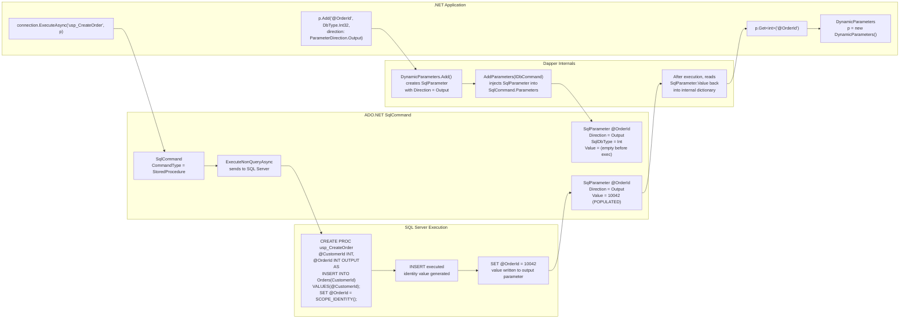
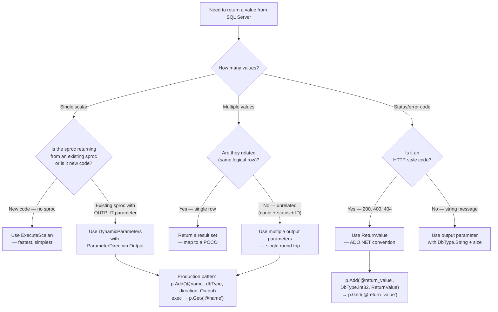

## Navigation

**Domain:** [[8 — Databases]] > **Group:** Dapper
**Previous:** [[8.861 — Dapper — DynamicParameters — Dynamic SQL]] | **Next:** [[8.863 — Dapper — Table-Valued Parameters]]

### Prerequisites

- [[8.861 — Dapper — DynamicParameters — Dynamic SQL]] — Output parameters are defined using `DynamicParameters.Add()` with `ParameterDirection.Output` or `ParameterDirection.InputOutput`; without `DynamicParameters`, anonymous types cannot express parameter direction.
- [[8.860 — Dapper — Stored Procedure Calling]] — output parameters are most commonly used with stored procedures that return scalar values through `OUTPUT` parameters rather than result sets.

### Where This Fits

Output parameters are the ADO.NET mechanism for a stored procedure to return scalar values to the caller without a result set. Dapper exposes them through `DynamicParameters` — you add a parameter with `ParameterDirection.Output`, execute the command, then read the value via `parameters.Get<T>("@name")`. A .NET backend engineer reaches for output parameters when a stored procedure needs to return multiple unrelated values (total count + status code + generated ID), when a return value convention is needed (stored procedure return codes), or when a scalar output is more natural than a single-row result set (e.g., an `IDENTITY` value from an `INSERT`). When this is unknown, teams either use multiple round trips to get the same data, or use `ExecuteScalar` for single values and miss the sproc's `OUTPUT` parameters entirely — silently getting default values. The interview signal is moderate: it tests whether a candidate understands ADO.NET parameter direction and Dapper's `DynamicParameters.Get<T>()` semantics.

---

## Core Mental Model

A stored procedure's output parameter is an ADO.NET `SqlParameter` with `Direction = ParameterDirection.Output`. When SQL Server executes the procedure, it writes a value into that parameter's memory location. After `SqlCommand.ExecuteNonQuery` (or any execution method) completes, the client reads `SqlParameter.Value`. Dapper wraps this in `DynamicParameters`: you declare an output parameter by calling `.Add("@name", dbType, direction: ParameterDirection.Output)`, execute the command via `QueryAsync` / `ExecuteAsync`, and retrieve the populated value with `.Get<T>("@name")`.

The invariant: **output parameters exist on the `SqlCommand` side — they are not part of the result set.** The stored procedure sets them with `SET @param = value` or `SELECT @param = value FROM ...`. After execution, Dapper's `DynamicParameters` captures `SqlParameter.Value` from each output parameter and makes it available via the `Get<T>()` method. The `ReturnValue` direction is a special case — it captures the stored procedure's `RETURN` statement value (an integer), which SQL Server maps to the `RETURN_VALUE` parameter with index -1.

### Classification

Output parameters are an **ADO.NET `SqlParameter` direction feature** exposed through **Dapper's `DynamicParameters` abstraction**. They belong to the **parameter direction layer** — they are not a Dapper-specific concept, but Dapper makes them accessible without writing ADO.NET plumbing. The abstraction leaks when: (a) you must read output parameters before the connection is disposed (Dapper does not auto-capture them), (b) you need to read output parameters from a `QueryMultiple` scenario where the reader must be fully consumed first, (c) the `ReturnValue` parameter requires a fixed parameter name convention but Dapper accepts any name with `ParameterDirection.ReturnValue`.



### Key Properties

|Property|Value|Notes|
|---|---|---|
|Prerequisite type|`DynamicParameters`|Anonymous types cannot express `ParameterDirection`|
|Directions available|`Output`, `InputOutput`, `ReturnValue`|`InputOutput` is an input that can also be overwritten|
|Reading output|`p.Get<T>("@name")`|Must call before connection is disposed|
|Return value name|Convention: `"@return_value"` or any name with `ReturnValue` direction|SQL Server uses parameter index -1 for return values|
|Null output|Returns `default(T)` or `DBNull` depending on type|Use nullable types (`int?`) when sproc may return NULL|
|Multiple output params|Supported — one `Add()` per parameter|No limit beyond ADO.NET's 2100 parameter limit|
|Result set interaction|Output params populated only after all result sets consumed|Critical with `QueryMultiple` — reader must advance past all results|
|Async support|Full|`Get<T>()` is synchronous (in-memory read of captured value)|
|MVCC concern|None|Output parameters are about parameter passing, not concurrency|

---

## Deep Mechanics

### How Dapper Populates Output Parameters

1. You call `p.Add("@OrderId", dbType: DbType.Int32, direction: ParameterDirection.Output)` — `DynamicParameters` stores a `ParameterInfo` record with `Name = "@OrderId"`, `DbType = Int32`, `Direction = Output`, `Size = null` (default for int).

2. You pass `p` to `connection.ExecuteAsync(sql, p)` — Dapper's `ExecuteImpl` detects `IDynamicParameters`, calls `p.AddParameters(cmd)`.

3. `AddParameters` iterates the internal `Dictionary<string, ParameterInfo>`, creates a `SqlParameter` for each entry:
   - `ParameterName = "@OrderId"`
   - `SqlDbType = Int` (mapped from `DbType.Int32`)
   - `Direction = ParameterDirection.Output`
   - `Value = DBNull.Value` (initial value for output params)
   - Added to `cmd.Parameters`

4. Dapper calls `cmd.ExecuteNonQueryAsync()` (or `ExecuteReaderAsync`). SQL Server executes the stored procedure. The procedure's `SET @OrderId = SCOPE_IDENTITY()` writes the identity value into the output parameter's memory on the server side.

5. On the client, after `ExecuteNonQueryAsync` returns, `SqlParameter.Value` now contains the identity value (e.g., `10042`). Dapper's `AddParameters` method already stored a reference to each `SqlParameter` — it does **not** copy the value eagerly. The value is read lazily when you call `p.Get<int>("@OrderId")`.

6. `p.Get<int>("@OrderId")` looks up the `ParameterInfo` by name, accesses the referenced `SqlParameter.Value`, and casts it to `int`. If `Value` is `DBNull`, it returns `default(int)` (0) — or throws if the type is non-nullable and `DBNull` is not convertible.

### ReturnValue Direction — The Hidden Parameter

SQL Server maps a stored procedure's `RETURN` statement to a special parameter at index -1. ADO.NET exposes this via `SqlParameter.Direction = ParameterDirection.ReturnValue`. The convention:

```csharp
// Convention: name it "@return_value" — SQL Server's SSMS-generated parameter name
p.Add("@return_value", dbType: DbType.Int32, direction: ParameterDirection.ReturnValue);

// Any name works — Dapper assigns Direction = ReturnValue
p.Add("@Result", dbType: DbType.Int32, direction: ParameterDirection.ReturnValue);
```

When you add a `ReturnValue` parameter, Dapper adds a `SqlParameter` to the command with `Direction = ReturnValue`. SQL Server does not require a corresponding `@return_value` parameter in the T-SQL — it's an ADO.NET convention. After execution, `SqlParameter.Value` holds the integer returned by `RETURN n`.

```csharp
-- SQL Server stored procedure:
CREATE PROCEDURE dbo.usp_ValidateOrder
    @OrderId INT
AS
BEGIN
    IF NOT EXISTS (SELECT 1 FROM Orders WHERE OrderId = @OrderId)
        RETURN 404;  -- Not found
    IF (SELECT Status FROM Orders WHERE OrderId = @OrderId) = 'Cancelled'
        RETURN 410;  -- Gone
    RETURN 200;  -- OK
END;
```

### SQL Visibility

```sql
-- Dapper generates this ADO.NET command:
exec dbo.usp_CreateOrder
    @CustomerId = @CustomerId,
    @OrderId = @OrderId OUTPUT;

-- SQL Profiler sees:
declare @p3 int
set @p3 = NULL
exec dbo.usp_CreateOrder @CustomerId=42, @OrderId=@p3 output
select @p3 as N'@OrderId'
-- Output: @p3 = 10042
```

### Cost Visibility

Output parameters add negligible cost — they are scalar values written by the sproc and read by ADO.NET. The cost is:
- **Network:** ~8 bytes for an `INT` output parameter in the TDS stream (negligible)
- **CPU:** One dictionary lookup in `DynamicParameters.Get<T>()` (~50ns)
- **Memory:** One `SqlParameter` object per output parameter (~200 bytes)

```sql
SET STATISTICS TIME ON;
SET STATISTICS IO ON;

DECLARE @OrderId INT;
EXEC dbo.usp_CreateOrder @CustomerId = 42, @OrderId = @OrderId OUTPUT;
SELECT @OrderId AS NewOrderId;

-- Table 'Orders'. Scan count 0, logical reads 1
-- SQL Server Execution Times: CPU time = 0ms, elapsed time = 2ms
```

### Failure Modes

**Output parameter not read:** If you dispose the `SqlConnection` before calling `p.Get<T>()`, the `SqlParameter` objects are disposed and their values lost. Dapper does not copy output parameter values eagerly — it holds a reference to the `SqlParameter` and reads `.Value` lazily.

**Multiple result sets not consumed:** When a stored procedure returns both result sets and output parameters, the output parameters are only populated after `SqlDataReader` has read past all result sets. If you call `QueryAsync<T>` and the sproc returns multiple result sets, `QueryAsync` only reads the first result set and closes the reader — but output parameters are populated when the reader is closed. This works for `QueryAsync` (it closes the reader), but fails for `QueryMultipleAsync` if you do not consume all result sets before reading output params.

**ReturnValue with output parameters:** When a sproc has both `RETURN` and `OUTPUT` parameters, the `ReturnValue` parameter is populated at the same time as output parameters — after all result sets are consumed. Reading it too early gives `DBNull` or 0.

**DbType mismatch:** If you declare an output parameter as `DbType.Int32` but the sproc writes a `BIGINT`, the cast in `Get<T>()` throws `InvalidCastException`.

---

## Production Patterns and Implementation

### Primary Dapper Implementation

```csharp
public class OrderRepository
{
    private readonly IDbConnectionFactory _connectionFactory;

    public OrderRepository(IDbConnectionFactory connectionFactory)
    {
        _connectionFactory = connectionFactory;
    }

    // Pattern 1: Single output parameter — generated identity
    public async Task<int> CreateOrderAsync(
        int customerId,
        CancellationToken cancellationToken = default)
    {
        const string sql = "dbo.usp_CreateOrder";

        var p = new DynamicParameters();
        p.Add("@CustomerId", customerId, DbType.Int32);
        p.Add("@OrderId", dbType: DbType.Int32, direction: ParameterDirection.Output);

        await using var connection = _connectionFactory.Create();
        await connection.ExecuteAsync(
            new CommandDefinition(sql, p, commandType: CommandType.StoredProcedure,
                cancellationToken: cancellationToken));

        return p.Get<int>("@OrderId");
    }

    // Pattern 2: Multiple output parameters — summary values
    public async Task<CustomerSummary> GetCustomerSummaryAsync(
        int customerId,
        CancellationToken cancellationToken = default)
    {
        const string sql = "dbo.usp_GetCustomerSummary";

        var p = new DynamicParameters();
        p.Add("@CustomerId", customerId, DbType.Int32);
        p.Add("@TotalOrders", dbType: DbType.Int32, direction: ParameterDirection.Output);
        p.Add("@TotalSpent", dbType: DbType.Decimal, direction: ParameterDirection.Output,
            precision: 18, scale: 2);
        p.Add("@LastOrderDate", dbType: DbType.DateTime2, direction: ParameterDirection.Output);

        await using var connection = _connectionFactory.Create();
        await connection.ExecuteAsync(
            new CommandDefinition(sql, p, commandType: CommandType.StoredProcedure,
                cancellationToken: cancellationToken));

        return new CustomerSummary
        {
            CustomerId = customerId,
            TotalOrders = p.Get<int>("@TotalOrders"),
            TotalSpent = p.Get<decimal>("@TotalSpent"),
            LastOrderDate = p.Get<DateTime?>("@LastOrderDate")
        };
    }

    // Pattern 3: Return value capture via ParameterDirection.ReturnValue
    public async Task<(int OrderId, int StatusCode)> CreateOrderWithReturnValueAsync(
        CreateOrderCommand command,
        CancellationToken cancellationToken = default)
    {
        const string sql = "dbo.usp_CreateOrderWithValidation";

        var p = new DynamicParameters();
        p.Add("@CustomerId", command.CustomerId, DbType.Int32);
        p.Add("@OrderDate", command.OrderDate, DbType.DateTime2);
        p.Add("@ShippingAddress", command.ShippingAddress, DbType.String, size: 500);
        p.Add("@OrderId", dbType: DbType.Int32, direction: ParameterDirection.Output);
        p.Add("@return_value", dbType: DbType.Int32, direction: ParameterDirection.ReturnValue);

        await using var connection = _connectionFactory.Create();
        await connection.ExecuteAsync(
            new CommandDefinition(sql, p, commandType: CommandType.StoredProcedure,
                cancellationToken: cancellationToken));

        var orderId = p.Get<int>("@OrderId");
        var statusCode = p.Get<int>("@return_value");

        return (orderId, statusCode);
    }

    // Pattern 4: Output parameter with data query (mixed)
    public async Task<(List<Order> Orders, int TotalCount)> GetPagedOrdersWithOutputAsync(
        int customerId,
        int pageIndex,
        int pageSize,
        CancellationToken cancellationToken = default)
    {
        const string sql = @"
            SELECT OrderId, CustomerId, OrderDate, TotalAmount, Status
            FROM Orders
            WHERE CustomerId = @CustomerId
            ORDER BY OrderDate DESC
            OFFSET @Offset ROWS FETCH NEXT @PageSize ROWS ONLY;

            SELECT @TotalCount = COUNT(*)
            FROM Orders
            WHERE CustomerId = @CustomerId;";

        var p = new DynamicParameters();
        p.Add("@CustomerId", customerId, DbType.Int32);
        p.Add("@Offset", pageIndex * pageSize, DbType.Int32);
        p.Add("@PageSize", pageSize, DbType.Int32);
        p.Add("@TotalCount", dbType: DbType.Int32, direction: ParameterDirection.Output);

        await using var connection = _connectionFactory.Create();
        var orders = (await connection.QueryAsync<Order>(
            new CommandDefinition(sql, p, cancellationToken: cancellationToken))).AsList();

        var totalCount = p.Get<int>("@TotalCount");
        return (orders, totalCount);
    }

    // Pattern 5: InputOutput parameter — update and reflect
    public async Task<int> AdjustInventoryAsync(
        int productId,
        int adjustment,
        CancellationToken cancellationToken = default)
    {
        const string sql = "dbo.usp_AdjustInventory";

        var p = new DynamicParameters();
        p.Add("@ProductId", productId, DbType.Int32);
        p.Add("@Adjustment", adjustment, DbType.Int32);
        p.Add("@NewQuantity", dbType: DbType.Int32,
            direction: ParameterDirection.InputOutput);
        // InputOutput: set initial value, sproc may use it and overwrite
        p.Set("@NewQuantity", 0);

        await using var connection = _connectionFactory.Create();
        await connection.ExecuteAsync(
            new CommandDefinition(sql, p, commandType: CommandType.StoredProcedure,
                cancellationToken: cancellationToken));

        return p.Get<int>("@NewQuantity");
    }

    // Pattern 6: Output parameter with string output (status message)
    public async Task<(bool Success, string Message)> ValidateOrderAsync(
        int orderId,
        CancellationToken cancellationToken = default)
    {
        const string sql = "dbo.usp_ValidateOrder";

        var p = new DynamicParameters();
        p.Add("@OrderId", orderId, DbType.Int32);
        p.Add("@IsValid", dbType: DbType.Boolean, direction: ParameterDirection.Output);
        p.Add("@Message", dbType: DbType.String, direction: ParameterDirection.Output,
            size: 500);

        await using var connection = _connectionFactory.Create();
        await connection.ExecuteAsync(
            new CommandDefinition(sql, p, commandType: CommandType.StoredProcedure,
                cancellationToken: cancellationToken));

        var isValid = p.Get<bool>("@IsValid");
        var message = p.Get<string>("@Message") ?? string.Empty;

        return (isValid, message);
    }

    // Pattern 7: ReturnValue as error code convention
    public async Task<(int OrderId, int ReturnCode)> CreateOrderWithErrorCodeAsync(
        CreateOrderCommand command,
        CancellationToken cancellationToken = default)
    {
        const string sql = "dbo.usp_CreateOrderWithErrorCode";

        var p = new DynamicParameters();
        p.Add("@CustomerId", command.CustomerId, DbType.Int32);
        p.Add("@OrderDate", command.OrderDate, DbType.DateTime2);
        p.Add("@OrderId", dbType: DbType.Int32, direction: ParameterDirection.Output);
        // ReturnValue captures the sproc's RETURN n statement
        p.Add("@Result", dbType: DbType.Int32, direction: ParameterDirection.ReturnValue);

        await using var connection = _connectionFactory.Create();
        await connection.ExecuteAsync(
            new CommandDefinition(sql, p, commandType: CommandType.StoredProcedure,
                cancellationToken: cancellationToken));

        var orderId = p.Get<int>("@OrderId");
        var returnCode = p.Get<int>("@Result");

        return (orderId, returnCode);
    }
}

public class CustomerSummary
{
    public int CustomerId { get; init; }
    public int TotalOrders { get; init; }
    public decimal TotalSpent { get; init; }
    public DateTime? LastOrderDate { get; init; }
}

public class Order
{
    public int OrderId { get; init; }
    public int CustomerId { get; init; }
    public DateTime OrderDate { get; init; }
    public decimal TotalAmount { get; init; }
    public string Status { get; init; } = string.Empty;
}

public class CreateOrderCommand
{
    public int CustomerId { get; init; }
    public DateTime OrderDate { get; init; }
    public string ShippingAddress { get; init; } = string.Empty;
    public List<OrderItemInput> Items { get; init; } = [];
}

public class OrderItemInput
{
    public int ProductId { get; init; }
    public int Quantity { get; init; }
    public decimal UnitPrice { get; init; }
}
```

### Configuration and Wiring

```csharp
// Program.cs
builder.Services.AddSingleton<IDbConnectionFactory>(_ =>
    new SqlConnectionFactory(connectionString));
builder.Services.AddScoped<OrderRepository>();

// Connection factory
public interface IDbConnectionFactory
{
    IDbConnection Create();
}

public class SqlConnectionFactory : IDbConnectionFactory
{
    private readonly string _connectionString;
    public SqlConnectionFactory(string connectionString) => _connectionString = connectionString;
    public IDbConnection Create() => new SqlConnection(_connectionString);
}
```

### Stored Procedure Definitions (SQL Server)

```sql
-- usp_CreateOrder — single output parameter for identity
CREATE OR ALTER PROCEDURE dbo.usp_CreateOrder
    @CustomerId INT,
    @OrderId INT OUTPUT
AS
BEGIN
    SET NOCOUNT ON;

    INSERT INTO dbo.Orders (CustomerId, OrderDate, Status)
    VALUES (@CustomerId, SYSDATETIME(), 'Pending');

    SET @OrderId = SCOPE_IDENTITY();
END;
GO

-- usp_GetCustomerSummary — multiple output parameters
CREATE OR ALTER PROCEDURE dbo.usp_GetCustomerSummary
    @CustomerId INT,
    @TotalOrders INT OUTPUT,
    @TotalSpent DECIMAL(18,2) OUTPUT,
    @LastOrderDate DATETIME2 OUTPUT
AS
BEGIN
    SET NOCOUNT ON;

    SELECT @TotalOrders = COUNT(*),
           @TotalSpent = ISNULL(SUM(TotalAmount), 0),
           @LastOrderDate = MAX(OrderDate)
    FROM dbo.Orders
    WHERE CustomerId = @CustomerId;
END;
GO

-- usp_CreateOrderWithValidation — output + return value
CREATE OR ALTER PROCEDURE dbo.usp_CreateOrderWithValidation
    @CustomerId INT,
    @OrderDate DATETIME2,
    @ShippingAddress NVARCHAR(500),
    @OrderId INT OUTPUT
AS
BEGIN
    SET NOCOUNT ON;

    IF NOT EXISTS (SELECT 1 FROM dbo.Customers WHERE CustomerId = @CustomerId)
    BEGIN
        SET @OrderId = 0;
        RETURN 400;  -- Bad Request
    END;

    INSERT INTO dbo.Orders (CustomerId, OrderDate, ShippingAddress, Status)
    VALUES (@CustomerId, @OrderDate, @ShippingAddress, 'Pending');

    SET @OrderId = SCOPE_IDENTITY();
    RETURN 200;  -- OK
END;
GO

-- usp_ValidateOrder — string + boolean output parameters
CREATE OR ALTER PROCEDURE dbo.usp_ValidateOrder
    @OrderId INT,
    @IsValid BIT OUTPUT,
    @Message NVARCHAR(500) OUTPUT
AS
BEGIN
    SET NOCOUNT ON;

    IF NOT EXISTS (SELECT 1 FROM dbo.Orders WHERE OrderId = @OrderId)
    BEGIN
        SET @IsValid = 0;
        SET @Message = 'Order not found.';
        RETURN;
    END;

    IF EXISTS (SELECT 1 FROM dbo.Orders WHERE OrderId = @OrderId AND Status = 'Cancelled')
    BEGIN
        SET @IsValid = 0;
        SET @Message = 'Order has been cancelled.';
        RETURN;
    END;

    SET @IsValid = 1;
    SET @Message = 'Order is valid.';
END;
GO
```

### Realistic Usage: Batch Order Creation with Status Tracking

```csharp
public class BatchOrderProcessor
{
    private readonly OrderRepository _orderRepository;
    private readonly ILogger<BatchOrderProcessor> _logger;

    public BatchOrderProcessor(
        OrderRepository orderRepository,
        ILogger<BatchOrderProcessor> logger)
    {
        _orderRepository = orderRepository;
        _logger = logger;
    }

    public async Task ProcessOrdersAsync(
        List<CreateOrderCommand> commands,
        CancellationToken cancellationToken = default)
    {
        var results = new List<(int OrderId, int StatusCode)>();

        foreach (var command in commands)
        {
            var result = await _orderRepository.CreateOrderWithReturnValueAsync(
                command, cancellationToken);

            results.Add(result);

            if (result.StatusCode != 200)
            {
                _logger.LogWarning(
                    "Order creation for Customer {CustomerId} returned status {StatusCode}",
                    command.CustomerId, result.StatusCode);
            }
        }

        _logger.LogInformation(
            "Processed {Count} orders. Successful: {Success}",
            results.Count,
            results.Count(r => r.StatusCode == 200));
    }
}
```

---

## Gotchas and Production Pitfalls

### 1. Reading Output Parameters After Connection Disposal

**Pitfall:** The most common output parameter bug — calling `p.Get<T>()` after the `SqlConnection` is closed or disposed. Dapper does **not** eagerly copy output parameter values from `SqlParameter` into `DynamicParameters`. The `Get<T>()` method reads `SqlParameter.Value` lazily. When the connection is disposed, the `SqlCommand` and its `SqlParameter` collection are also disposed, and `SqlParameter.Value` reverts to `DBNull`.

```csharp
// ❌ Wrong — connection disposed before reading output
public int GetOrderCount_Wrong(int customerId)
{
    using var connection = new SqlConnection(_connectionString);
    var p = new DynamicParameters();
    p.Add("@CustomerId", customerId, DbType.Int32);
    p.Add("@Count", dbType: DbType.Int32, direction: ParameterDirection.Output);
    connection.Execute("SELECT @Count = COUNT(*) FROM Orders WHERE CustomerId = @CustomerId", p);
    // connection is disposed here by 'using'
    return p.Get<int>("@Count"); // ⚠️ may return 0 or throw
}

// ✅ Correct — read before disposal
public int GetOrderCount_Correct(int customerId)
{
    using var connection = new SqlConnection(_connectionString);
    var p = new DynamicParameters();
    p.Add("@CustomerId", customerId, DbType.Int32);
    p.Add("@Count", dbType: DbType.Int32, direction: ParameterDirection.Output);
    connection.Execute("SELECT @Count = COUNT(*) FROM Orders WHERE CustomerId = @CustomerId", p);
    var count = p.Get<int>("@Count"); // ✅ read while connection is open
    return count;
}
```

**Symptom:** Intermittent `NullReferenceException`, `InvalidCastException`, or output value always 0. The behavior depends on the timing of garbage collection — sometimes `SqlParameter` is still alive, sometimes not.

**Fix:** Always read output parameters in the same scope as the command execution, before the connection is disposed.

**Cost of not fixing:** Hard-to-reproduce bugs that surface in production under load when GC pressure is higher. The output value sometimes works, sometimes returns 0 — leading to incorrect business logic.

### 2. Output Parameters with QueryMultiple — Unconsumed Result Sets

**Pitfall:** When a stored procedure returns multiple result sets AND output parameters, the output parameters are only populated after `SqlDataReader` consumes **all** result sets. If you use `QueryMultipleAsync` and only read some result sets before reading output parameters, the output values are `DBNull`.

```csharp
// ❌ Wrong — output params not populated if reader not fully consumed
public async Task<(List<Order> Orders, int TotalCount)> GetOrders_Wrong(
    int customerId, CancellationToken ct = default)
{
    var p = new DynamicParameters();
    p.Add("@CustomerId", customerId, DbType.Int32);
    p.Add("@TotalCount", dbType: DbType.Int32, direction: ParameterDirection.Output);

    await using var connection = new SqlConnection(_connectionString);
    await connection.OpenAsync(ct);

    using var multi = await connection.QueryMultipleAsync(
        "dbo.usp_GetOrdersWithCount", p,
        commandType: CommandType.StoredProcedure);

    var orders = (await multi.ReadAsync<Order>(ct)).AsList();
    // ⚠️ Second result set NOT consumed — output params NOT populated yet
    var totalCount = p.Get<int>("@TotalCount"); // 0 or DBNull!

    return (orders, totalCount);
}

// ✅ Correct — consume all result sets first
public async Task<(List<Order> Orders, int TotalCount)> GetOrders_Correct(
    int customerId, CancellationToken ct = default)
{
    var p = new DynamicParameters();
    p.Add("@CustomerId", customerId, DbType.Int32);
    p.Add("@TotalCount", dbType: DbType.Int32, direction: ParameterDirection.Output);

    await using var connection = new SqlConnection(_connectionString);
    await connection.OpenAsync(ct);

    using var multi = await connection.QueryMultipleAsync(
        "dbo.usp_GetOrdersWithCount", p,
        commandType: CommandType.StoredProcedure);

    var orders = (await multi.ReadAsync<Order>(ct)).AsList();
    var count = await multi.ReadFirstAsync<int>(ct); // ✅ consumes second result set
    // NOW output parameters are populated
    var totalCount = p.Get<int>("@TotalCount");

    return (orders, totalCount);
}
```

**Symptom:** Output parameters return 0 or `DBNull` even though the stored procedure correctly sets them. This happens only when the procedure returns multiple result sets.

**Fix:** Consume all result sets via `QueryMultiple` before reading output parameters, or use `ExecuteAsync` if no result sets are needed.

**Cost of not fixing:** Silent data corruption — the total count or other output values are always 0, leading to incorrect paging, wrong business decisions, or failed validation.

### 3. ReturnValue Parameter Name Convention

**Pitfall:** The `ReturnValue` parameter requires a specific ADO.NET convention. If you name the parameter anything other than the conventional name, ADO.NET may not map it correctly in some providers, or the parameter may not be populated.

```csharp
// ✅ Conventional name — matches SSMS-generated scripts
p.Add("@return_value", dbType: DbType.Int32, direction: ParameterDirection.ReturnValue);

// ✅ Also works — any name with ReturnValue direction
p.Add("@ResultCode", dbType: DbType.Int32, direction: ParameterDirection.ReturnValue);

// ❌ Wrong — missing direction, defaults to Input
p.Add("@return_value", dbType: DbType.Int32);
// The sproc's RETURN 200 is ignored — no parameter captures it
```

**Symptom:** `p.Get<int>("@return_value")` returns 0 even though the stored procedure has `RETURN 200`. The `ReturnValue` parameter was never added to the command with the correct direction.

**Fix:** Always use both `dbType: DbType.Int32` and `direction: ParameterDirection.ReturnValue` for return value capture.

**Cost of not fixing:** The return code is silently lost. If you use return values for error handling (HTTP-style status codes), the calling code sees status 0 (success) for all calls.

### 4. Size Mismatch for VARCHAR(N) Output Parameters

**Pitfall:** When declaring an output parameter of type `DbType.String` or `DbType.AnsiString` without an explicit `size`, Dapper defaults to `NVARCHAR(MAX)` or `VARCHAR(MAX)`. SQL Server handles this correctly for output parameters (it truncates to the actual value length), but the plan cache sees a different parameter signature.

```csharp
// ❌ Wrong — no size, defaults to MAX
p.Add("@Message", dbType: DbType.String, direction: ParameterDirection.Output);

// ✅ Correct — match the sproc's NVARCHAR(500) parameter
p.Add("@Message", dbType: DbType.String, direction: ParameterDirection.Output, size: 500);
```

**More importantly:** If the output parameter's `SqlParameter.Size` is smaller than the actual value SQL Server tries to write, the value is **silently truncated**. SQL Server does not raise an error for output parameter truncation — it just cuts the string.

```sql
-- SQL Server silently truncates to @Message NVARCHAR(50)
CREATE PROCEDURE dbo.usp_GetErrorMessage
    @ErrorId INT,
    @Message NVARCHAR(50) OUTPUT  -- ← only 50 chars!
AS
BEGIN
    SELECT @Message = ErrorMessage  -- ← might be 200+ chars
    FROM dbo.Errors
    WHERE ErrorId = @ErrorId;
END;
```

```csharp
// C# reads truncated string — no error, no warning
var message = p.Get<string>("@Message"); // Got only first 50 characters
```

**Symptom:** Output string values are silently truncated. The length matches the `size` parameter in `DynamicParameters.Add()`, not the actual data length.

**Fix:** Set `size` in `DynamicParameters.Add()` to match the stored procedure parameter definition. If the sproc uses `NVARCHAR(MAX)` or `VARCHAR(MAX)`, use `size: -1` (the ADO.NET convention for MAX).

**Cost of not fixing:** Silent data loss — error messages, log entries, or status descriptions are truncated without notification.

### 5. Reading Output Parameters Before Execution Completes

**Pitfall:** Calling `p.Get<T>()` before the command executes returns `DBNull` or `default(T)` because the output parameter has not been populated yet.

```csharp
var p = new DynamicParameters();
p.Add("@Count", dbType: DbType.Int32, direction: ParameterDirection.Output);

// ❌ Wrong — read before execute
var count = p.Get<int>("@Count"); // 0 — not executed yet!

await connection.ExecuteAsync("SELECT @Count = COUNT(*) FROM Orders", p);

// ✅ Correct — read after execute
var count = p.Get<int>("@Count");
```

**Symptom:** Output values are always 0 or null regardless of what the sproc does.

**Fix:** Ensure `Get<T>()` is called only after the command execution completes.

**Cost of not fixing:** Obvious once spotted, but can slip into production if the code is refactored and the `Get<T>()` call is accidentally moved before the execution.

### 6. DbType.Default for Output Parameters

**Pitfall:** Using `DbType = DbType.Default` or omitting `dbType` for output parameters. Dapper cannot infer the type from a `null` value (the initial value of an output parameter is always `DBNull`), so the `SqlParameter` is created with an incorrect or ambiguous type.

```csharp
// ❌ Wrong — Dapper cannot infer type from null
p.Add("@TotalCount", direction: ParameterDirection.Output);
// SqlParameter created with DbType = Object, Value = DBNull
// SQL Server may raise: Operand type clash: nvarchar is incompatible with int

// ✅ Correct — explicit DbType
p.Add("@TotalCount", dbType: DbType.Int32, direction: ParameterDirection.Output);

// ❌ Wrong — value: 0 with direction Output
// The initial value is provided but output direction means SQL Server may ignore it
p.Add("@TotalCount", 0, DbType.Int32, ParameterDirection.Output);
// The 0 is sent to SQL Server as the initial value — sproc may read it (InputOutput behavior)

// ✅ Correct — Output: no value, just DbType and Direction
p.Add("@TotalCount", dbType: DbType.Int32, direction: ParameterDirection.Output);
```

**Symptom:** `SqlException: Operand type clash: int is incompatible with nvarchar` or similar type mismatch errors. The `SqlParameter` was created with the wrong `DbType` because Dapper could not infer it.

**Fix:** Always specify `dbType` explicitly for output parameters. Never rely on type inference from a null value.

**Cost of not fixing:** Runtime SQL exceptions that prevent the command from executing at all.

### 7. InputOutput Parameter Semantics Confusion

**Pitfall:** Confusing `InputOutput` with `Output`. An `InputOutput` parameter sends an initial value to SQL Server AND receives a value back. An `Output` parameter only receives a value. If the sproc expects an input value but you declare `Output`, the sproc sees `NULL` for that parameter.

```csharp
// usp_AdjustInventory @Adjustment INT, @NewQuantity INT OUTPUT
-- sproc: SET @NewQuantity = (SELECT Quantity FROM Inventory WHERE ProductId = @ProductId) + @Adjustment

// ✅ Correct — Output only (sproc does not read @NewQuantity on input)
p.Add("@NewQuantity", dbType: DbType.Int32, direction: ParameterDirection.Output);

// usp_UpsertInventory @ProductId INT, @Quantity INT INPUT OUTPUT
-- sproc: IF EXISTS (SELECT 1 FROM Inventory WHERE ProductId = @ProductId)
--            UPDATE Inventory SET Quantity = @Quantity
--         ELSE
--            INSERT INTO Inventory (ProductId, Quantity) VALUES (@ProductId, @Quantity)
--         SELECT @Quantity = Quantity FROM Inventory WHERE ProductId = @ProductId;

// ✅ Correct — InputOutput (sproc reads initial value, writes updated value)
p.Add("@Quantity", 10, DbType.Int32, ParameterDirection.InputOutput);
// Sproc receives 10, writes back the actual quantity after upsert

// ❌ Wrong — Output instead of InputOutput
p.Add("@Quantity", dbType: DbType.Int32, direction: ParameterDirection.Output);
// Sproc receives NULL for @Quantity — INSERT fails with NULL violation
```

**Symptom:** Stored procedure fails with `Cannot insert the value NULL into column 'Quantity'` or the output value is not what the sproc computed.

**Fix:** Understand the sproc's parameter direction. If the sproc reads the parameter on input, use `InputOutput` and provide an initial value. If the sproc only writes to it, use `Output` and omit the initial value.

**Cost of not fixing:** Incorrect data written to the database, or stored procedure execution failures.

### 8. Output Parameters with Buffered vs Unbuffered Queries

**Pitfall:** When using `QueryAsync` with `buffered: false`, Dapper returns a lazy `IEnumerable<T>` backed by an open `SqlDataReader`. The output parameters are NOT populated until the reader is fully enumerated (all rows read and reader closed).

```csharp
// ❌ Wrong — unbuffered query, reader still open
var p = new DynamicParameters();
p.Add("@Count", dbType: DbType.Int32, direction: ParameterDirection.Output);

var results = connection.Query<Order>(
    "SELECT * FROM Orders; SELECT @Count = COUNT(*) FROM Orders;", p,
    buffered: false);

// Output parameter NOT populated yet — reader is still open
var count = p.Get<int>("@Count"); // ⚠️ 0 or DBNull

foreach (var order in results)
{
    // Processing each row keeps the reader open
}
// NOW the reader is closed, output parameter is populated

// ✅ Correct — materialize before reading output
var results = connection.Query<Order>(
    "SELECT * FROM Orders; SELECT @Count = COUNT(*) FROM Orders;", p,
    buffered: false);

var materialized = results.ToList(); // ✅ forces reader to close
var count = p.Get<int>("@Count");    // ✅ output populated
```

**Symptom:** Output parameters are 0 or `DBNull` when using `buffered: false`, but work correctly with `buffered: true` (the default).

**Fix:** Materialize the result set (`.ToList()` or `.AsList()`) before reading output parameters when using unbuffered queries.

**Cost of not fixing:** Intermittent zero output values that only fail when processing large result sets (exactly when unbuffered queries are used).

### 9. ReturnValue Requires CommandType.StoredProcedure

**Pitfall:** The `ReturnValue` direction only works correctly when the command type is `CommandType.StoredProcedure`. If you use an ad-hoc SQL batch with `RETURN`, the `ReturnValue` parameter is not populated.

```csharp
// ❌ Wrong — ad-hoc SQL with RETURN, ReturnValue ignored
var p = new DynamicParameters();
p.Add("@return_value", dbType: DbType.Int32, direction: ParameterDirection.ReturnValue);

connection.Execute(@"
    IF EXISTS (SELECT 1 FROM Orders)
        RETURN 1
    ELSE
        RETURN 0", p);

var result = p.Get<int>("@return_value"); // 0 — not populated!

// ✅ Correct — ReturnValue only works with stored procedures
var p = new DynamicParameters();
p.Add("@return_value", dbType: DbType.Int32, direction: ParameterDirection.ReturnValue);

connection.Execute("dbo.usp_CheckOrdersExists", p,
    commandType: CommandType.StoredProcedure);

var result = p.Get<int>("@return_value"); // ✅ populated with sproc's RETURN value
```

**Symptom:** `ReturnValue` is always 0 for ad-hoc SQL batches.

**Fix:** Only use `ReturnValue` with `CommandType.StoredProcedure`. For ad-hoc SQL, use an output parameter instead.

**Cost of not fixing:** Silent failure — the return code is lost and the code defaults to 0 (which often means "success" in return-value conventions).

### 10. Multiple ReturnValue Parameters

**Pitfall:** Adding multiple parameters with `ParameterDirection.ReturnValue`. ADO.NET and SQL Server only support one return value per command. Adding a second `ReturnValue` parameter causes an `SqlException` or undefined behavior.

```csharp
// ❌ Wrong — multiple ReturnValue parameters
p.Add("@return_value1", dbType: DbType.Int32, direction: ParameterDirection.ReturnValue);
p.Add("@return_value2", dbType: DbType.Int32, direction: ParameterDirection.ReturnValue);
// SqlException: A parameter with Direction ReturnValue is already specified

// ✅ Correct — one ReturnValue parameter
p.Add("@return_value", dbType: DbType.Int32, direction: ParameterDirection.ReturnValue);
```

**Symptom:** `ArgumentException: A parameter with Direction ReturnValue is already specified` or `SqlException`.

**Fix:** Use exactly one `ReturnValue` parameter per command. If you need multiple status codes, use output parameters instead.

**Cost of not fixing:** Command execution fails entirely.

---

## Performance Implications

### Benchmark: Output Parameters vs ExecuteScalar vs Result Set

```csharp
[MemoryDiagnoser]
[SimpleJob(RuntimeMoniker.Net90)]
public class OutputParametersBenchmark
{
    private IDbConnection _connection = default!;
    private const string Sproc = "dbo.usp_GetOrderCount";

    [GlobalSetup]
    public void Setup()
    {
        _connection = new SqlConnection("Server=.;Database=BenchmarkDb;Trusted_Connection=True;");
        _connection.Open();
        // Seed 100K orders
    }

    [GlobalCleanup]
    public void Cleanup() => _connection.Dispose();

    [Benchmark(Baseline = true)]
    public int ExecuteScalar_Count()
    {
        return _connection.ExecuteScalar<int>(
            "SELECT COUNT(*) FROM Orders WHERE CustomerId = @Id",
            new { Id = 42 });
    }

    [Benchmark]
    public int OutputParameter_Count()
    {
        var p = new DynamicParameters();
        p.Add("@CustomerId", 42, DbType.Int32);
        p.Add("@Count", dbType: DbType.Int32, direction: ParameterDirection.Output);
        _connection.Execute(
            "SELECT @Count = COUNT(*) FROM Orders WHERE CustomerId = @CustomerId", p);
        return p.Get<int>("@Count");
    }

    [Benchmark]
    public int SprocOutputParameter()
    {
        var p = new DynamicParameters();
        p.Add("@CustomerId", 42, DbType.Int32);
        p.Add("@Count", dbType: DbType.Int32, direction: ParameterDirection.Output);
        _connection.Execute("dbo.usp_GetOrderCount", p,
            commandType: CommandType.StoredProcedure);
        return p.Get<int>("@Count");
    }

    [Benchmark]
    public int OutputParameter_WithReturnValue()
    {
        var p = new DynamicParameters();
        p.Add("@CustomerId", 42, DbType.Int32);
        p.Add("@Count", dbType: DbType.Int32, direction: ParameterDirection.Output);
        p.Add("@return_value", dbType: DbType.Int32, direction: ParameterDirection.ReturnValue);
        _connection.Execute("dbo.usp_GetOrderCountWithReturn", p,
            commandType: CommandType.StoredProcedure);
        return p.Get<int>("@Count");
    }
}
```

**Expected results (approximate, SQL Server 2022, 100K orders table):**

|Method|Mean|Allocated|
|---|---|---|
|ExecuteScalar_Count|~320μs|~1.5 KB|
|OutputParameter_Count|~380μs|~2.5 KB|
|SprocOutputParameter|~410μs|~2.8 KB|
|OutputParameter_WithReturnValue|~430μs|~3.2 KB|

**Overhead:** Output parameters add ~50-80μs vs `ExecuteScalar` due to the `DynamicParameters` object creation and `p.Get<T>()` lookup. The stored procedure variant adds an additional ~30μs for the sproc invocation overhead. The `ReturnValue` parameter adds ~20μs for the extra parameter.

### Memory Profile

```
ExecuteScalar: 1 anonymous object + no DynamicParameters
Output parameter: 1 DynamicParameters instance + 1 SqlParameter + internal Dictionary entry
Sproc with output: same as above + CommandType resolution
With ReturnValue: same + 1 extra SqlParameter for return value

For a procedure with 3 output parameters:
  DynamicParameters: ~400 bytes
  3 SqlParameter objects: ~600 bytes (200 each)
  Internal ParameterInfo: ~300 bytes (100 each)
  Total: ~1.3 KB per call
```

### When to Choose Each Approach

|Scenario|Recommended Method|Why|
|---|---|---|
|Single scalar return (e.g., `COUNT(*)`)|`ExecuteScalar<T>`|Fastest, simplest, no DynamicParameters overhead|
|Single identity after INSERT|`ExecuteScalar<T>` with `SELECT SCOPE_IDENTITY()`|Direct, no output parameter plumbing needed|
|Multiple scalar returns from sproc|Output parameters|Single round-trip, no result set overhead|
|Sproc with result set + scalar count|Output parameter|Avoids extra result set for the count|
|Error code from sproc|`ReturnValue`|ADO.NET convention, standard pattern|
|Mixed input/output (read + write)|`InputOutput`|Single parameter serves both directions|
|String output (error message)|Output parameter with `size`|Avoids parsing result set for a message|

---

## Interview Arsenal

### Question Bank

1. **How does Dapper handle output parameters internally — trace the flow from `DynamicParameters.Add()` to `p.Get<T>()`.**
2. **What is the difference between `ParameterDirection.Output`, `InputOutput`, and `ReturnValue`? When would you use each?**
3. **Why might `p.Get<int>("@Count")` return 0 even though the stored procedure correctly sets `@Count`? List three possible causes.**
4. **How does `ReturnValue` work at the ADO.NET level — what is the parameter index convention?**
5. **Can you read output parameters from a `QueryMultipleAsync` before consuming all result sets? Why or why not?**
6. **What happens if you omit `dbType` when adding an output parameter to `DynamicParameters`?**
7. **What is the `size` parameter significance for output parameters of type string?**
8. **How would you design a stored procedure that returns both a result set AND multiple output parameters — what must the calling code do to read both correctly?**
9. **Compare output parameters vs `ExecuteScalar` vs a single-row result set for returning a scalar value from SQL Server.**
10. **What is the `@` prefix convention for `DynamicParameters.Get<T>()` — what happens if you omit it?**

### Spoken Answers

**Q1: How does Dapper handle output parameters internally?**

> **Average answer:** "You add a parameter with Output direction and use Get to read it after execution."

> **Great answer:** "When you call `DynamicParameters.Add("@id", dbType: DbType.Int32, direction: ParameterDirection.Output)`, Dapper stores a `ParameterInfo` record with the name, type, direction, and a null initial value. When the command executes, Dapper's `AddParameters(IDbCommand)` creates an `SqlParameter` from each `ParameterInfo` and injects it into `SqlCommand.Parameters`. After `ExecuteNonQueryAsync` returns, the `SqlParameter.Value` field has been populated by ADO.NET with the value SQL Server wrote via `SET @param = ...`. Dapper does NOT copy this value eagerly — it keeps a reference to the `SqlParameter`. When you call `p.Get<int>("@id")`, Dapper looks up the `ParameterInfo` by name, accesses the referenced `SqlParameter.Value`, and casts it to `T`. This lazy-read design means the `SqlConnection` must still be open when `Get<T>()` is called — disposing the connection disposes the `SqlCommand` and all its `SqlParameter` objects, losing the output values."

**Q3: Why might p.Get<int>() return 0 — three possible causes?**

> **Great answer:** "Three common causes:

> 1. **Connection disposed before `Get<T>()`:** The `using` block for `SqlConnection` ends before `p.Get<int>()`. When the connection is disposed, the `SqlCommand` is disposed, and `SqlParameter.Value` reverts to `DBNull`. `DynamicParameters.Get<int>()` tries to cast `DBNull` to `int` — `Convert.ChangeType` returns `default(int)` = 0 for `DBNull`.

> 2. **Multiple result sets not consumed:** The stored procedure returns both a result set and output parameters. You used `QueryMultipleAsync` but only called `ReadAsync<T>()` for the first result set — the second result set and output parameters are not populated until the reader advances past all results. The output parameter reads as 0 because the `SqlDataReader` has not finished processing.

> 3. **Missing dbType for output parameter:** You called `p.Add("@Count", direction: ParameterDirection.Output)` without `dbType`. Dapper creates the `SqlParameter` with `DbType = Object` because it cannot infer the type from a null initial value. SQL Server may reject the parameter type or silently fail to write the value. The parameter stays `DBNull` and `Get<int>()` returns 0."

**Q6: What happens if you omit `dbType` when adding an output parameter?**

> **Great answer:** "If you call `p.Add("@Count", direction: ParameterDirection.Output)` without specifying `dbType`, Dapper sees `value` is null (the default for output parameters). It creates a `SqlParameter` with `DbType = Object` and `Value = DBNull.Value`. SQL Server receives a parameter of type `sql_variant` (the ADO.NET `Object` mapping), which may cause a type clash: `Operand type clash: int is incompatible with sql_variant` when the sproc tries to `SET @Count = COUNT(*)`. The fix is always provide `dbType` for output parameters — there is no value from which Dapper can infer the type."

### Interview Trigger

If the interviewer asks "How would you return multiple values from a stored procedure using Dapper?", they want to hear about output parameters and the `DynamicParameters.Get<T>()` pattern. The follow-up that separates senior candidates: "What happens if you read the output parameter after the connection is closed, and how does Dapper's lazy evaluation model affect this?" — this tests understanding of ADO.NET's `SqlParameter.Value` lifecycle.

### Comparison Table

| | Output Parameter | ReturnValue | ExecuteScalar<T> | Single-Row Result Set |
|---|---|---|---|---|
|Return type|Any (DbType-controlled)|`int` only|Any (generic T)|Any mapped type|
|ADO.NET mechanism|`SqlParameter.Direction = Output`|`SqlParameter.Direction = ReturnValue`|`ExecuteScalar()`|`ExecuteReader()` + deserialization|
|Dapper read|`p.Get<T>("@name")`|`p.Get<int>("@return_value")`|Method return value|First row of result set|
|Requires DynamicParameters|Yes|Yes|No (anonymous type)|No|
|SQL syntax|`SET @param = value`|`RETURN n`|`SELECT value`|`SELECT col1, col2`|
|Multiple values|Multiple params|Single int|Single value|Multiple columns|
|NULL handling|`p.Get<int?>()` for nullable|Always int (0 for NULL)|`default(T)` for NULL|Nullable properties|
|Performance|~50μs overhead|~20μs extra|Baseline (fastest)|Higher (mapping overhead)|
|Round trips|1|1|1|1|

---

## Decision Framework

### When to Use Output Parameters vs Alternatives



### Application Checklist

- [ ] Does the stored procedure return scalar values via `OUTPUT` parameters? → Use `DynamicParameters` with `ParameterDirection.Output`
- [ ] Does the sproc use `RETURN n` for status codes? → Add a `ReturnValue` parameter with `ParameterDirection.ReturnValue`
- [ ] Does the sproc read AND write a parameter? → Use `ParameterDirection.InputOutput`
- [ ] Could the sproc return multiple result sets? → Use `QueryMultipleAsync` and consume ALL result sets before reading output parameters
- [ ] Is the output parameter a string type? → Specify `size` matching the sproc parameter definition
- [ ] Is the output parameter a decimal? → Specify `precision` and `scale`
- [ ] Am I reading output parameters in the same scope as the command? → Must happen before connection disposal
- [ ] Am I using `buffered: false`? → Materialize results before reading output parameters
- [ ] Does the sproc return NULL for the output parameter? → Use nullable type in `Get<T?>()`

### Tradeoff Summary

|What You Gain|What You Pay|
|---|---|
|Multiple scalar returns, single round trip|~50μs DynamicParameters overhead|
|No result set parsing for scalar values|Must read before connection disposal|
|ADO.NET-native pattern|Requires knowledge of parameter direction|
|Works with any DbType|Must specify DbType explicitly (no inference)|
|Return value capture|Only int, must use stored procedure|

### Scale Thresholds

- **Relevant at any scale** when using stored procedures with `OUTPUT` parameters — there is no alternative within Dapper
- **Performance overhead matters** at >5,000 executions/second where `DynamicParameters` allocation adds ~1.3 KB per call
- **ReturnValue is free** — a single `int` parameter adds negligible cost regardless of call volume
- **Output string parameters** become expensive at >1,000 calls/second if `size` is large (e.g., `NVARCHAR(4000)`) — the entire string is sent back in the TDS response

---

## Self-Check

### Conceptual Questions

1. What Dapper interface must a parameter object implement to support output parameters, and why can't anonymous types do this?
2. How does `DynamicParameters.Get<T>("@name")` retrieve the output value — what ADO.NET object does it read from?
3. Why must output parameters be read before the connection is disposed, and how does Dapper's lazy evaluation model cause this?
4. What is the difference between `ParameterDirection.Output` and `ParameterDirection.InputOutput`? When would you use each?
5. How does `ParameterDirection.ReturnValue` work at the ADO.NET level — what is the parameter index?
6. What happens to output parameters when a stored procedure returns multiple result sets and you use `QueryMultipleAsync`?
7. What `DbType` and `size` should you use for an output parameter that returns `NVARCHAR(MAX)`?
8. How does Dapper handle output parameter type inference when you omit `dbType` in `Add()`?
9. Can you have multiple `ReturnValue` parameters in a single command? What happens if you try?
10. How do unbuffered queries (`buffered: false`) affect when output parameters are populated?

<details>
<summary>Answers</summary>

1. `IDynamicParameters`. Anonymous types are plain objects — Dapper uses reflection to read their properties and creates all parameters as `Input`. `DynamicParameters` implements `IDynamicParameters`, which gives Dapper a hook to call `AddParameters(IDbCommand)` — this is where output/inputoutput/returnvalue direction is applied.

2. `DynamicParameters.Get<T>()` accesses the `SqlParameter` object that was added to `SqlCommand.Parameters` during `AddParameters()`. It reads `SqlParameter.Value` and casts it to `T`. The `SqlParameter` reference is stored in `DynamicParameters._parameters` dictionary.

3. Dapper captures a reference to each `SqlParameter` during `AddParameters()` but does NOT copy `SqlParameter.Value` eagerly. The value is read lazily when `Get<T>()` is called. When `SqlConnection` is disposed, `SqlCommand` is disposed, and `SqlParameter` objects are disposed — their `.Value` property reverts to `DBNull`. Reading after disposal returns `DBNull` → cast to `int` returns 0.

4. `Output`: the parameter is sent to SQL Server with an initial NULL value; SQL Server may write a value to it, but the initial value is ignored by the sproc unless SELECTed. `InputOutput`: the parameter sends an initial value TO SQL Server (the sproc can read it), AND the sproc can overwrite it. Use `Output` when the sproc only writes the parameter; `InputOutput` when the sproc reads the parameter on input AND writes a new value on output.

5. ADO.NET assigns `ReturnValue` parameters an internal parameter index of -1. When SQL Server executes `RETURN n`, it writes `n` to the parameter at index -1. This is a fixed ADO.NET convention — you cannot have multiple `ReturnValue` parameters. Dapper adds the `ReturnValue` parameter to `SqlCommand.Parameters`, and ADO.NET maps it to index -1 automatically.

6. Output parameters are only populated after `SqlDataReader` consumes ALL result sets. With `QueryMultipleAsync`, you must call `ReadAsync<T>()` for each result set AND advance the reader past all of them. Only then does `SqlCommand` populate the output parameter values. Reading `p.Get<T>()` before consuming all result sets returns `DBNull`.

7. Use `dbType: DbType.String, size: -1`. The `-1` is ADO.NET's convention for `MAX` types (equivalent to `NVARCHAR(MAX)`). Without `size: -1`, Dapper defaults to `NVARCHAR(255)` for `DbType.String`, which silently truncates the output.

8. When `dbType` is omitted and `value` is null (the default for output parameters), Dapper creates a `SqlParameter` with `DbType = Object`. This maps to SQL Server's `sql_variant` type, which is incompatible with most operations. The sproc's `SET @param = COUNT(*)` fails with `Operand type clash: int is incompatible with sql_variant`. Always specify `dbType` explicitly for output parameters.

9. No. ADO.NET throws `ArgumentException: A parameter with Direction ReturnValue is already specified` if you add a second `ReturnValue` parameter. SQL Server only supports one return value per procedure. Use exactly one `ReturnValue` parameter — additional status codes must use `Output` parameters.

10. With `buffered: false`, Dapper returns an `IEnumerable<T>` backed by an open `SqlDataReader`. The output parameters are NOT populated until the reader is closed (all rows enumerated). Reading `p.Get<T>()` before materializing the results returns `DBNull`. Always call `.ToList()` on unbuffered results before reading output parameters.

</details>

### Query Challenges

**Challenge 1 — Write Dapper Code for a Stored Procedure with Output Parameters**

Given this stored procedure:

```sql
CREATE PROCEDURE dbo.usp_CreateProduct
    @ProductName NVARCHAR(100),
    @CategoryId INT,
    @Price DECIMAL(10,2),
    @ProductId INT OUTPUT,
    @CreatedAt DATETIME2 OUTPUT
AS
BEGIN
    SET NOCOUNT ON;
    INSERT INTO dbo.Products (ProductName, CategoryId, Price, CreatedAt)
    VALUES (@ProductName, @CategoryId, @Price, SYSDATETIME());
    SET @ProductId = SCOPE_IDENTITY();
    SET @CreatedAt = SYSDATETIME();
END;
```

Write C# Dapper code that calls `usp_CreateProduct`, reads both output parameters, and returns them.

<details>
<summary>Solution</summary>

```csharp
public async Task<(int ProductId, DateTime CreatedAt)> CreateProductAsync(
    string productName,
    int categoryId,
    decimal price,
    CancellationToken cancellationToken = default)
{
    const string sql = "dbo.usp_CreateProduct";

    var p = new DynamicParameters();
    p.Add("@ProductName", productName, DbType.String, size: 100);
    p.Add("@CategoryId", categoryId, DbType.Int32);
    p.Add("@Price", price, DbType.Decimal, precision: 10, scale: 2);
    p.Add("@ProductId", dbType: DbType.Int32, direction: ParameterDirection.Output);
    p.Add("@CreatedAt", dbType: DbType.DateTime2, direction: ParameterDirection.Output);

    await using var connection = new SqlConnection(_connectionString);
    await connection.OpenAsync(cancellationToken);
    await connection.ExecuteAsync(
        new CommandDefinition(sql, p, commandType: CommandType.StoredProcedure,
            cancellationToken: cancellationToken));

    var productId = p.Get<int>("@ProductId");
    var createdAt = p.Get<DateTime>("@CreatedAt");

    return (productId, createdAt);
}
```

**Key points:**
- `@ProductName` and `@Price` specify explicit `size`, `precision`, `scale` to match the sproc definition
- Output parameters omit `value` (no initial value needed) but require `dbType` and `direction`
- `p.Get<T>()` called before connection disposal (inside `using` scope)
- Both output parameters read after single `ExecuteAsync`

</details>

---

**Challenge 2 — Fix the Output Parameter Bug**

```csharp
// This method intermittently returns totalCount = 0
public async Task<(List<OrderSummary> Orders, int TotalCount)> GetOrdersAsync(
    int customerId, CancellationToken ct = default)
{
    var p = new DynamicParameters();
    p.Add("@CustomerId", customerId, DbType.Int32);
    p.Add("@TotalCount", dbType: DbType.Int32, direction: ParameterDirection.Output);

    using var connection = new SqlConnection(_connectionString);
    await connection.OpenAsync(ct);

    using var multi = await connection.QueryMultipleAsync(
        "dbo.usp_GetCustomerOrders", p,
        commandType: CommandType.StoredProcedure, cancellationToken: ct);

    var orders = (await multi.ReadAsync<OrderSummary>(ct)).AsList();
    // BUG: output parameter read before consuming second result set
    var totalCount = p.Get<int>("@TotalCount");

    return (orders, totalCount);
}
```

Identify and fix the bug.

<details>
<summary>Solution</summary>

**Root cause:** The stored procedure returns two result sets (orders data + total count), but the code reads the output parameter `@TotalCount` after consuming only the **first** result set. Output parameters are only populated after ALL result sets are consumed.

**Fix:**

```csharp
public async Task<(List<OrderSummary> Orders, int TotalCount)> GetOrdersAsync(
    int customerId, CancellationToken ct = default)
{
    var p = new DynamicParameters();
    p.Add("@CustomerId", customerId, DbType.Int32);
    p.Add("@TotalCount", dbType: DbType.Int32, direction: ParameterDirection.Output);

    await using var connection = new SqlConnection(_connectionString);
    await connection.OpenAsync(ct);

    using var multi = await connection.QueryMultipleAsync(
        "dbo.usp_GetCustomerOrders", p,
        commandType: CommandType.StoredProcedure, cancellationToken: ct);

    var orders = (await multi.ReadAsync<OrderSummary>(ct)).AsList();
    // ✅ Consume the second result set first
    var count = await multi.ReadFirstAsync<int>(ct);

    // ✅ NOW output parameter is populated
    var totalCount = p.Get<int>("@TotalCount");

    return (orders, totalCount);
}
```

**Alternative fix without QueryMultiple:** If the sproc is under your control, change it to use an output parameter for the count and return only one result set:

```sql
CREATE PROCEDURE dbo.usp_GetCustomerOrders
    @CustomerId INT,
    @TotalCount INT OUTPUT
AS
BEGIN
    SET NOCOUNT ON;

    SELECT OrderId, CustomerId, OrderDate, TotalAmount, Status
    FROM Orders
    WHERE CustomerId = @CustomerId
    ORDER BY OrderDate DESC;

    SELECT @TotalCount = COUNT(*)
    FROM Orders
    WHERE CustomerId = @CustomerId;
END;
```

Then use a single `QueryAsync<OrderSummary>` and read the output parameter after — `QueryAsync` closes the reader after processing the single result set, which triggers output parameter population.

</details>

---

**Challenge 3 — Design a Sproc with Return Value and Output Parameters**

Design a stored procedure `usp_ProcessPayment` that:

1. Takes `@OrderId INT`, `@Amount DECIMAL(10,2)`, `@PaymentMethod NVARCHAR(50)`
2. Returns `@TransactionId NVARCHAR(100)` as output parameter
3. Returns `@ProcessedAt DATETIME2` as output parameter
4. Uses `RETURN` for status: 200 (success), 400 (bad request — invalid amount), 404 (order not found), 409 (already paid)
5. Write the C# Dapper code that calls this procedure and reads all three outputs

<details>
<summary>Solution</summary>

```sql
CREATE PROCEDURE dbo.usp_ProcessPayment
    @OrderId INT,
    @Amount DECIMAL(10,2),
    @PaymentMethod NVARCHAR(50),
    @TransactionId NVARCHAR(100) OUTPUT,
    @ProcessedAt DATETIME2 OUTPUT
AS
BEGIN
    SET NOCOUNT ON;

    IF NOT EXISTS (SELECT 1 FROM Orders WHERE OrderId = @OrderId)
    BEGIN
        SET @TransactionId = NULL;
        SET @ProcessedAt = NULL;
        RETURN 404;
    END;

    IF @Amount <= 0
    BEGIN
        SET @TransactionId = NULL;
        SET @ProcessedAt = NULL;
        RETURN 400;
    END;

    IF EXISTS (SELECT 1 FROM Payments WHERE OrderId = @OrderId)
    BEGIN
        SET @TransactionId = NULL;
        SET @ProcessedAt = NULL;
        RETURN 409;
    END;

    SET @TransactionId = NEWID();
    SET @ProcessedAt = SYSDATETIME();

    INSERT INTO Payments (OrderId, Amount, PaymentMethod, TransactionId, ProcessedAt)
    VALUES (@OrderId, @Amount, @PaymentMethod, @TransactionId, @ProcessedAt);

    RETURN 200;
END;
```

```csharp
public async Task<(int StatusCode, string? TransactionId, DateTime? ProcessedAt)> ProcessPaymentAsync(
    int orderId,
    decimal amount,
    string paymentMethod,
    CancellationToken cancellationToken = default)
{
    const string sql = "dbo.usp_ProcessPayment";

    var p = new DynamicParameters();
    p.Add("@OrderId", orderId, DbType.Int32);
    p.Add("@Amount", amount, DbType.Decimal, precision: 10, scale: 2);
    p.Add("@PaymentMethod", paymentMethod, DbType.String, size: 50);
    p.Add("@TransactionId", dbType: DbType.String, direction: ParameterDirection.Output,
        size: 100);
    p.Add("@ProcessedAt", dbType: DbType.DateTime2, direction: ParameterDirection.Output);
    p.Add("@return_value", dbType: DbType.Int32, direction: ParameterDirection.ReturnValue);

    await using var connection = new SqlConnection(_connectionString);
    await connection.OpenAsync(cancellationToken);
    await connection.ExecuteAsync(
        new CommandDefinition(sql, p, commandType: CommandType.StoredProcedure,
            cancellationToken: cancellationToken));

    var statusCode = p.Get<int>("@return_value");
    var transactionId = p.Get<string?>("@TransactionId");
    var processedAt = p.Get<DateTime?>("@ProcessedAt");

    return (statusCode, transactionId, processedAt);
}
```

**Key design decisions:**
- `@TransactionId` uses `DbType.String` with `size: 100` — matches `NVARCHAR(100)` in the sproc
- `@return_value` captures the `RETURN n` status code
- Nullable types (`string?`, `DateTime?`) handle the error cases where the sproc sets output params to NULL
- All three reads happen before `connection` is disposed

</details>

---

**Challenge 4 — Diagnose the Silent Truncation**

A team reports that their stored procedure's error messages are truncated to 50 characters. The procedure:

```sql
CREATE PROCEDURE dbo.usp_GetErrorInfo
    @ErrorId INT,
    @ErrorMessage NVARCHAR(4000) OUTPUT,
    @ErrorCode INT OUTPUT
AS
BEGIN
    SELECT @ErrorMessage = [Message], @ErrorCode = [Code]
    FROM dbo.Errors
    WHERE ErrorId = @ErrorId;
END;
```

Their Dapper code:

```csharp
var p = new DynamicParameters();
p.Add("@ErrorId", errorId, DbType.Int32);
p.Add("@ErrorMessage", dbType: DbType.String, direction: ParameterDirection.Output, size: 50);
p.Add("@ErrorCode", dbType: DbType.Int32, direction: ParameterDirection.Output);

connection.Execute("dbo.usp_GetErrorInfo", p, commandType: CommandType.StoredProcedure);
var message = p.Get<string>("@ErrorMessage");
```

Identify the problem and fix it.

<details>
<summary>Solution</summary>

**Root cause:** The `size: 50` in `p.Add("@ErrorMessage", dbType: DbType.String, direction: ParameterDirection.Output, size: 50)` limits the output buffer to 50 characters. The `SqlParameter` is created with `Size = 50`, and ADO.NET's `SqlParameter.Size` property controls the maximum data that can be written to/from the parameter. When SQL Server writes a 4000-character message, ADO.NET silently truncates it to 50 characters.

**Fix:** Change `size: 50` to `size: 4000` (matching the sproc's `NVARCHAR(4000)`):

```csharp
p.Add("@ErrorMessage", dbType: DbType.String, direction: ParameterDirection.Output, size: 4000);
// OR use MAX equivalent:
p.Add("@ErrorMessage", dbType: DbType.String, direction: ParameterDirection.Output, size: -1);
```

**Better:** Use `size: -1` for MAX types when the exact size is unknown, or pull the size from configuration/metadata.

**Why this happens silently:** SQL Server truncates output string parameters without raising a truncation warning (unlike `INSERT` truncation which raises an error). The ADO.NET `SqlParameter` has a `Size` property that is documented: "Gets or sets the maximum size, in bytes, of the data within the column." When set to 50, the buffer provided to receive the output data is 50 bytes — any data beyond that is discarded.

</details>

---

**Challenge 5 — Output Parameter vs Return Value vs ExecuteScalar Tradeoffs**

You need to create a method that inserts a new customer and returns the generated `CustomerId`. The existing stored procedure is:

```sql
CREATE PROCEDURE dbo.usp_CreateCustomer
    @Name NVARCHAR(200),
    @Email NVARCHAR(200),
    @CustomerId INT OUTPUT
AS
BEGIN
    INSERT INTO Customers (Name, Email) VALUES (@Name, @Email);
    SET @CustomerId = SCOPE_IDENTITY();
END;
```

Compare three approaches:

- Approach A: Output parameter (as designed)
- Approach B: Change sproc to `SELECT SCOPE_IDENTITY()` and use `ExecuteScalar<int>`
- Approach C: Change sproc to `RETURN SCOPE_IDENTITY()` and use `ReturnValue`

Which would you choose and why?

<details>
<summary>Solution</summary>

**Approach A — Output parameter (original):** Works correctly. Requires `DynamicParameters`, ~50μs overhead. Reads via `p.Get<int>("@CustomerId")`.

**Approach B — ExecuteScalar (recommended):** Requires changing the sproc to `SELECT SCOPE_IDENTITY() AS CustomerId;` — no output parameter needed. Simpler Dapper code: `connection.ExecuteScalar<int>(sql, new { Name, Email })`. No `DynamicParameters` overhead. Faster (~320μs vs ~380μs). Cleaner API.

**Approach C — ReturnValue (not recommended):** `RETURN` values are limited to `int` and are conventionally used for error codes, not data. `SCOPE_IDENTITY()` returns a `BIGINT` which may overflow `int` for large tables. Using `RETURN` for data values is an anti-pattern — tools and ORMs treat return values as status codes.

**Recommendation: Approach B** — `ExecuteScalar<int>` with `SELECT SCOPE_IDENTITY()`. Reasons:
1. Fastest Dapper method — no DynamicParameters, no type mapping
2. Works with anonymous types — simpler code
3. `SCOPE_IDENTITY()` returns `DECIMAL(38,0)` — no overflow issues for `int` or `long`
4. Single-line Dapper call vs 10-line DynamicParameters setup

**If the sproc cannot be changed (legacy):** Use Approach A — output parameters are the correct ADO.NET pattern for the existing sproc.

</details>

</details>
