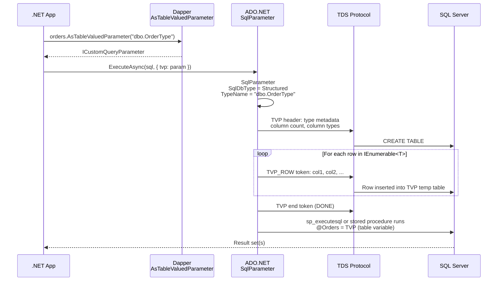
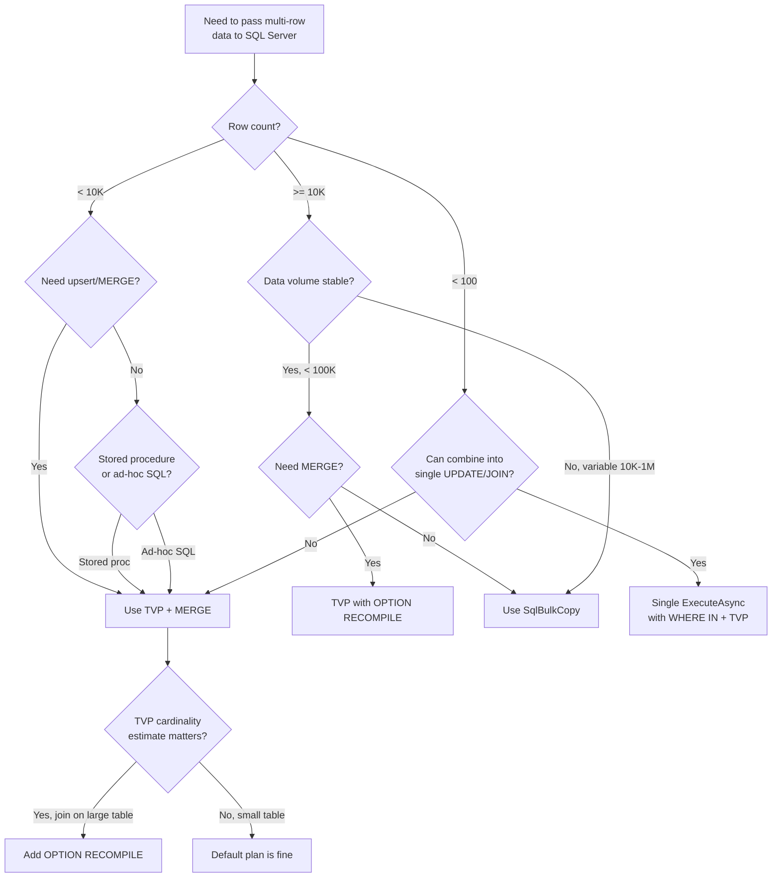

## Navigation

**Domain:** [[8 — Databases]] > **Group:** Dapper
**Previous:** [[8.862 — Dapper — Output Parameters]] | **Next:** [[8.864 — Dapper — Transactions — IDbTransaction]]

### Prerequisites

- [[8.861 — Dapper — DynamicParameters — Dynamic SQL]] — TVP parameters are set via `DynamicParameters` with specific `DbType` and `SqlDbType` values; the dynamic parameter API is the foundation.
- [[8.860 — Dapper — Stored Procedure Calling]] — TVPs are most commonly passed to stored procedures; the calling conventions (command type, parameter direction) carry over directly.

### Where This Fits

A table-valued parameter (TVP) lets you pass an entire result set — multiple rows of structured data — as a single parameter to a SQL Server stored procedure or parameterized SQL batch. A .NET backend engineer reaches for TVPs when they need to insert, update, or compare thousands of rows in a single database round trip without building a massive XML/JSON string, when they need to pass a list of IDs to a `JOIN` or `IN` clause without hitting the parameter count limit (SQL Server's 2100), or when they want to use a `MERGE` statement that upserts against an application-provided set. Dapper supports TVPs through `SqlMapper.AsTableValuedParameter<T>()`, which converts any `IEnumerable<T>` into a `Structured` parameter that ADO.NET sends as a TVP. The interview signal is strong: it separates engineers who know that TVPs are the only way to pass multi-row structured data to SQL Server efficiently from those who serialize to comma-separated strings and use `STRING_SPLIT`. The deeper signal is understanding when TVP outperforms `SqlBulkCopy` (small-to-medium batches under 10K rows) vs when it becomes a performance liability (large batches with expensive table type validation).

---

## Core Mental Model

A table-valued parameter is a SQL Server user-defined table type that acts as a strongly typed, read-only parameter variable in a stored procedure or batch. You declare a `CREATE TYPE` in SQL Server, then pass rows from .NET as a `DataTable`, `IEnumerable<SqlDataRecord>`, or — through Dapper — any `IEnumerable<T>`. Dapper's `AsTableValuedParameter()` extension wraps the enumerable in a `SqlMapper.ICustomQueryParameter` that ADO.NET handles as a `SqlDbType.Structured` parameter. The invariant: **the row shape of the .NET type must match the table type's column names and types exactly — Dapper does not map or transform columns; it delegates column mapping to ADO.NET's TVP protocol.** The recognition pattern: a stored procedure that takes a `READONLY` table parameter, a `DataTable` or `IEnumerable<T>` in C#, and a single `Execute` or `QueryAsync` call that passes the TVP.

### Classification

`AsTableValuedParameter<T>()` is a **Dapper extension method on `IEnumerable<T>`** that returns an `ICustomQueryParameter`. Dapper's `ICustomQueryParameter` interface allows custom parameter handling; for TVPs, Dapper sets the parameter as `SqlDbType.Structured`, sets `TypeName` to the SQL Server user-defined type name, and passes the enumerable as the value. ADO.NET's `SqlParameter` then iterates the enumerable and streams rows to SQL Server via the TDS TVP protocol (TVP_Row tokens). The method belongs to the **Dapper parameter layer** — it is not a mapping operation; it is a serialization protocol that bridges .NET collections to SQL Server table types. No SQL generation is involved — the SQL references the parameter by name, and SQL Server binds the TVP as if it were a table variable that is already populated with the caller's rows.



### Key Properties

|Property|Value|Notes|
|---|---|---|
|SQL Server requirement|User-defined table type|`CREATE TYPE dbo.OrderType AS TABLE (...)`|
|Dapper method|`AsTableValuedParameter<T>(string typeName)`|Extension on `IEnumerable<T>`|
|ADO.NET DbType|`SqlDbType.Structured`|Mapped automatically by Dapper|
|Batch size|Full enumerable|All rows sent in one TDS stream; no batching|
|Max rows practical|~10,000|Beyond this, `SqlBulkCopy` is faster|
|Async support|Full|Works with `ExecuteAsync`, `QueryAsync`|
|EF Core equivalent|None|EF Core 8+ has `ExecuteSql` with TVP but no LINQ integration|
|Multiple TVPs per call|Yes|As many as the stored procedure signature allows|
|Transaction support|Yes|TVP participates in the ambient transaction|
|Output parameters|Yes|Can combine TVP input with output parameters|

---

## Deep Mechanics

### How the Engine Executes This

1. **SQL Server defines the table type.** Before any .NET code runs, a DBA runs `CREATE TYPE dbo.OrderLineType AS TABLE (ProductId INT, Quantity INT, UnitPrice DECIMAL(10,2))`. This creates a schema-bound type that SQL Server stores in `sys.types`. The type is referenced by name in stored procedures and Dapper code.

2. **The application materializes the TVP data in .NET.** A service layer builds a `List<OrderLine>` from a request DTO or domain model. Each property in the .NET type maps to a column in the SQL table type. The column names must match case-insensitively; Dapper does not rename or transform them.

3. **The developer calls `AsTableValuedParameter<T>()`.** Dapper receives the `IEnumerable<T>` and the SQL type name (e.g., `"dbo.OrderLineType"`). It creates an `SqlMapper.TableValuedParameter<T>` object implementing `ICustomQueryParameter`. This object stores the enumerable, the type name, and optional per-column type overrides.

4. **Dapper adds the parameter to the command.** When `ExecuteAsync` or `QueryAsync` is called, Dapper iterates the provided parameters. For `ICustomQueryParameter` instances, Dapper calls `AddParameter` with the underlying `IDbDataParameter`. For TVPs, this creates a `SqlParameter` with `SqlDbType = Structured`, `TypeName = "dbo.OrderLineType"`, and `Value` set to the enumerable (or a `DataTable` wrapping it).

5. **ADO.NET serializes rows via TDS.** `SqlParameter` calls `SqlDataReader`-like streaming: it opens a TDS TVP stream, writes a TVP header token with column metadata, then for each row in the enumerable, writes a TVP_ROW token with column values. SQL Server receives these tokens and materializes them into a table variable that the procedure or batch can read like any table.

6. **SQL Server executes the procedure/batch.** The stored procedure or parameterized SQL references the TVP parameter as a `READONLY` table variable. SQL Server compiles a plan that includes table scans or joins against the TVP just like a temp table. The TVP rows are visible only within the scope of the batch — they are not persisted.

7. **ADO.NET finalizes the stream.** When the enumerable is exhausted, ADO.NET sends a DONE token. The `SqlCommand` proceeds with execution. If an error occurs mid-stream, SQL Server may abort the batch with a `TVP_ROW`-related error.

### SQL Visibility

```sql
-- Step 1: Create the user-defined table type (run once by DBA)
CREATE TYPE dbo.OrderLineType AS TABLE
(
    ProductId   INT             NOT NULL,
    Quantity    INT             NOT NULL,
    UnitPrice   DECIMAL(10,2)   NOT NULL,
    DiscountPct DECIMAL(5,2)    NULL
);

-- Step 2: Stored procedure that accepts the TVP
CREATE PROCEDURE dbo.BulkInsertOrderLines
    @OrderId    INT,
    @Lines      dbo.OrderLineType READONLY
AS
BEGIN
    SET NOCOUNT ON;

    INSERT INTO OrderLines (OrderId, ProductId, Quantity, UnitPrice, DiscountPct)
    SELECT @OrderId, ProductId, Quantity, UnitPrice, DiscountPct
    FROM @Lines;

    SELECT SCOPE_IDENTITY() AS NewBatchId; -- example output
END;

-- Step 3: TVP in a raw SQL batch (no stored procedure)
-- Dapper parameter name: @Lines
DECLARE @lines dbo.OrderLineType;
INSERT INTO @Lines SELECT ProductId, Quantity, UnitPrice, DiscountPct FROM @Lines;
-- Note: in Dapper, @Lines IS the TVP — no DECLARE/INSERT needed
```

```csharp
// Dapper + TVP — passing a typed list as a table-valued parameter
public sealed record OrderLineDto(
    int ProductId,
    int Quantity,
    decimal UnitPrice,
    decimal? DiscountPct);

public async Task<int> InsertOrderLinesAsync(
    int orderId,
    IReadOnlyList<OrderLineDto> lines,
    CancellationToken ct)
{
    const string sql = "dbo.BulkInsertOrderLines";

    await using var connection = _connectionFactory.Create();
    await connection.OpenAsync(ct);

    // AsTableValuedParameter<T> maps IEnumerable<T> to the SQL TVP
    var tvpParam = lines.AsTableValuedParameter("dbo.OrderLineType");

    var result = await connection.ExecuteAsync(
        new CommandDefinition(
            sql,
            new
            {
                OrderId = orderId,
                Lines   = tvpParam
            },
            commandType: CommandType.StoredProcedure,
            cancellationToken: ct));

    return result;
}
```

```csharp
// Raw SQL batch with TVP (no stored procedure)
public async Task<int> DeleteProductsByIdsAsync(
    IReadOnlyList<int> productIds,
    CancellationToken ct)
{
    const string sql = @"
        DELETE FROM Products
        WHERE ProductId IN (SELECT ProductId FROM @ProductIds)";

    await using var connection = _connectionFactory.Create();
    await connection.OpenAsync(ct);

    // Single-column TVP — a list of integers wrapped in a table type
    var tvpParam = productIds
        .Select(id => new { ProductId = id })
        .AsTableValuedParameter("dbo.IdListType");

    return await connection.ExecuteAsync(
        new CommandDefinition(
            sql,
            new { ProductIds = tvpParam },
            cancellationToken: ct));
}
```

**Comparison — the wrong way (no TVP, string splitting):**

```csharp
// ❌ Wrong: comma-separated IDs + STRING_SPLIT — fragile, no type safety, 2100 limit
public async Task<int> DeleteProductsByIds_WrongAsync(
    string commaSeparatedIds, CancellationToken ct)
{
    const string sql = @"
        DELETE FROM Products
        WHERE ProductId IN (SELECT [value] FROM STRING_SPLIT(@Ids, ','))";

    return await connection.ExecuteAsync(sql, new { Ids = commaSeparatedIds }, ct: ct);
}
// Problems: parameter type is string, SQL must parse, no int validation,
// injection of malformed input, 2100+ element strings hit query length limits
```

### Execution Plan Analysis

For the `BulkInsertOrderLines` procedure with a 100-row TVP:

```
Stored Procedure: dbo.BulkInsertOrderLines
  |--INSERT (OrderLines)
       |--Compute Scalar (define implicit columns)
            |--Table Scan (TVP variable @Lines)
                 Estimated Rows: 100  |  Actual Rows: 100
                 Estimated Cost: ~0.01 (trivial — TVP is in memory)
                 Logical Reads: 0 (TVP has no storage engine pages)
```

**Key characteristic:** TVP appears as a **Table Scan on the table variable** in the plan. Estimated rows are **1 by default** (SQL Server's fixed estimate for table variables, unless `OPTION (RECOMPILE)` or cardinality estimation model 140+ is used). For small TVPs (<100 rows), the estimate error is irrelevant. For large TVPs (1000+ rows), the optimizer may choose a Nested Loops join when a Hash Match would be better, because it assumes only 1 row. **Fix:** add `OPTION (RECOMPILE)` to the procedure body, or use `OPTION (OPTIMIZE FOR UNKNOWN)` if the TVP cardinality is stable.

```
Plan without OPTION RECOMPILE (estimated 1 row → Nested Loops):
  Estimated: 1 row
  Chosen join: Nested Loops (bad for 10K rows)
  Actual: 10,000 rows
  Logical reads on inner table: 10,000 × index depth

Plan with OPTION RECOMPILE (actual row count known → Hash Match):
  Estimated: 10,000 rows (after recompile)
  Chosen join: Hash Match (good for 10K rows)
  Logical reads on inner table: index depth + 1
```

### Cost Visibility

```sql
SET STATISTICS IO ON;
SET STATISTICS TIME ON;

DECLARE @lines dbo.OrderLineType;
INSERT INTO @lines VALUES (1, 2, 10.00, NULL), (3, 1, 25.00, 0.10);
-- ... more rows

EXEC dbo.BulkInsertOrderLines @OrderId = 42, @Lines = @lines;

-- Expected output:
-- Table 'OrderLines'. Scan count 0, logical reads 2, physical reads 0
-- (TVP itself generates no I/O — it is an in-memory table variable)
-- SQL Server Execution Times: CPU time = 0ms, elapsed time = 1ms
```

### Failure Modes

- **Column name mismatch:** If a property in the .NET type is named `Price` but the table type column is `UnitPrice`, ADO.NET sends `NULL` for that column (no error — silent data loss).
- **Type mismatch:** A .NET `string` for an `INT` column causes a runtime `SqlException` during TVP streaming: `"Operand type clash: nvarchar is incompatible with int"`.
- **Missing type registration:** Running the Dapper code before `CREATE TYPE` runs causes `SqlException: "The table type parameter 'dbo.OrderLineType' must have a valid type name."`
- **Exceeding TVP row limit:** SQL Server has no hard row limit, but TVP is memory-constrained. ~100K+ rows with large columns can cause `OutOfMemoryException` in SQL Server (the table variable is materialized in tempdb if it spills).
- **Passing null for the TVP:** Passing `null` as the TVP parameter (when the enumerable is `null`) throws `ArgumentNullException` from `AsTableValuedParameter`. Pass an empty list instead.
- **Async streaming and enumeration:** `AsTableValuedParameter` iterates the enumerable synchronously in the TDS stream. If the enumerable is backed by an async database call or `IAsyncEnumerable<T>`, the synchronous iteration blocks the thread. Materialize the collection before passing it.

---

## Production Patterns and Implementation

### Primary Dapper Implementation

```csharp
public sealed record OrderLineInput(
    int ProductId,
    int Quantity,
    decimal UnitPrice,
    decimal? DiscountPct);

public sealed record OrderLineResult(int OrderLineId, int ProductId, decimal LineTotal);

public interface IOrderLineRepository
{
    Task<IReadOnlyList<OrderLineResult>> BulkInsertAsync(
        int orderId, IReadOnlyList<OrderLineInput> lines, CancellationToken ct);

    Task<int> ReplaceOrderLinesAsync(
        int orderId, IReadOnlyList<OrderLineInput> lines, CancellationToken ct);
}

public sealed class OrderLineRepository : IOrderLineRepository
{
    private readonly IDbConnectionFactory _connectionFactory;

    public OrderLineRepository(IDbConnectionFactory connectionFactory)
    {
        _connectionFactory = connectionFactory;
    }

    /// <summary>
    /// Inserts order lines via TVP and returns the inserted rows with identity values.
    /// </summary>
    public async Task<IReadOnlyList<OrderLineResult>> BulkInsertAsync(
        int orderId, IReadOnlyList<OrderLineInput> lines, CancellationToken ct)
    {
        const string sql = @"
            INSERT INTO OrderLines (OrderId, ProductId, Quantity, UnitPrice, DiscountPct)
            OUTPUT inserted.OrderLineId, inserted.ProductId,
                   inserted.Quantity * inserted.UnitPrice AS LineTotal
            SELECT @OrderId, ProductId, Quantity, UnitPrice, DiscountPct
            FROM @Lines";

        await using var connection = _connectionFactory.Create();
        await connection.OpenAsync(ct);

        var tvpParam = lines.AsTableValuedParameter("dbo.OrderLineType");

        var results = await connection.QueryAsync<OrderLineResult>(
            new CommandDefinition(
                sql,
                new { OrderId = orderId, Lines = tvpParam },
                cancellationToken: ct));

        return results.AsList();
    }

    /// <summary>
    /// Replaces all order lines for an order using TVP + MERGE (delete + insert in one pass).
    /// </summary>
    public async Task<int> ReplaceOrderLinesAsync(
        int orderId, IReadOnlyList<OrderLineInput> lines, CancellationToken ct)
    {
        const string sql = @"
            MERGE OrderLines AS target
            USING (SELECT ProductId, Quantity, UnitPrice, DiscountPct FROM @Lines) AS source
            ON target.OrderId = @OrderId AND target.ProductId = source.ProductId
            WHEN MATCHED THEN
                UPDATE SET Quantity = source.Quantity,
                           UnitPrice = source.UnitPrice,
                           DiscountPct = source.DiscountPct
            WHEN NOT MATCHED THEN
                INSERT (OrderId, ProductId, Quantity, UnitPrice, DiscountPct)
                VALUES (@OrderId, source.ProductId, source.Quantity,
                        source.UnitPrice, source.DiscountPct)
            WHEN NOT MATCHED BY SOURCE AND target.OrderId = @OrderId THEN
                DELETE
            OUTPUT $action, inserted.OrderLineId;";

        await using var connection = _connectionFactory.Create();
        await connection.OpenAsync(ct);

        var tvpParam = lines.AsTableValuedParameter("dbo.OrderLineType");

        var affected = await connection.ExecuteAsync(
            new CommandDefinition(
                sql,
                new { OrderId = orderId, Lines = tvpParam },
                cancellationToken: ct));

        return affected;
    }
}
```

### Multi-ID TVP — Passing a List of Integers

```csharp
// SQL type: CREATE TYPE dbo.IdListType AS TABLE (Id INT NOT NULL PRIMARY KEY);

public async Task<IReadOnlyList<Product>> GetProductsByIdsAsync(
    IReadOnlyList<int> productIds, CancellationToken ct)
{
    const string sql = @"
        SELECT p.ProductId, p.ProductName, p.UnitPrice, p.CategoryId
        FROM Products p
        INNER JOIN @ProductIds ids ON p.ProductId = ids.Id";

    await using var connection = _connectionFactory.Create();
    await connection.OpenAsync(ct);

    var tvpParam = productIds
        .Select(id => new { Id = id })
        .AsTableValuedParameter("dbo.IdListType");

    var products = await connection.QueryAsync<Product>(
        new CommandDefinition(sql, new { ProductIds = tvpParam },
            cancellationToken: ct));

    return products.AsList();
}
```

### DynamicParameters with TVP

```csharp
public async Task<IReadOnlyList<Customer>> GetCustomersWithFilterAsync(
    IReadOnlyList<int> customerIds,
    string? statusFilter,
    CancellationToken ct)
{
    const string sql = @"
        SELECT CustomerId, FullName, Email, Status, CreatedAt
        FROM Customers
        WHERE CustomerId IN (SELECT Id FROM @CustomerIds)
          AND (@Status IS NULL OR Status = @Status)";

    await using var connection = _connectionFactory.Create();
    await connection.OpenAsync(ct);

    var tvpParam = customerIds
        .Select(id => new { Id = id })
        .AsTableValuedParameter("dbo.IdListType");

    var parameters = new DynamicParameters();
    parameters.Add("CustomerIds", tvpParam);
    parameters.Add("Status", statusFilter, DbType.String, size: 20);

    var customers = await connection.QueryAsync<Customer>(
        new CommandDefinition(sql, parameters, cancellationToken: ct));

    return customers.AsList();
}
```

### Configuration and Wiring

```csharp
// Program.cs
builder.Services.AddSingleton<IDbConnectionFactory>(_ =>
    new SqlConnectionFactory(builder.Configuration.GetConnectionString("DefaultConnection")));
builder.Services.AddScoped<IOrderLineRepository, OrderLineRepository>();

// appsettings.json connection string — TVP benefits from connection pooling
// "Server=.;Database=SalesDb;Integrated Security=True;Max Pool Size=200;"

// SQL migration script (run at deployment)
/*
CREATE TYPE dbo.OrderLineType AS TABLE
(
    ProductId   INT             NOT NULL,
    Quantity    INT             NOT NULL,
    UnitPrice   DECIMAL(10,2)   NOT NULL,
    DiscountPct DECIMAL(5,2)    NULL
);

CREATE TYPE dbo.IdListType AS TABLE
(
    Id INT NOT NULL PRIMARY KEY
);

CREATE TYPE dbo.ProductBulkType AS TABLE
(
    ProductId   INT             NOT NULL PRIMARY KEY,
    ProductName NVARCHAR(200)   NOT NULL,
    UnitPrice   DECIMAL(10,2)   NOT NULL,
    StockQty    INT             NOT NULL
);
*/
```

### SQL Server vs PostgreSQL Differences

```sql
-- PostgreSQL has no direct TVP equivalent. Alternatives:

-- Option 1: Pass a JSON/JSONB array (closest pattern)
CREATE FUNCTION bulk_insert_order_lines(
    p_order_id INT,
    p_lines JSONB
) RETURNS TABLE (order_line_id INT, product_id INT, line_total NUMERIC)
LANGUAGE plpgsql AS $$
BEGIN
    RETURN QUERY
    INSERT INTO order_lines (order_id, product_id, quantity, unit_price, discount_pct)
    SELECT p_order_id,
           (line->>'ProductId')::INT,
           (line->>'Quantity')::INT,
           (line->>'UnitPrice')::NUMERIC(10,2),
           (line->>'DiscountPct')::NUMERIC(5,2)
    FROM jsonb_array_elements(p_lines) AS line
    RETURNING order_line_id, product_id, quantity * unit_price AS line_total;
END;
$$;

-- Option 2: Use temp table + COPY (for very large sets)
CREATE TEMP TABLE tmp_order_lines (LIKE order_lines INCLUDING ALL);
COPY tmp_order_lines FROM STDIN (FORMAT BINARY);
PERFORM bulk_insert_from_temp(p_order_id);
DROP TABLE tmp_order_lines;
```

```csharp
// PostgreSQL with Npgsql — TVP-like behavior via JSONB
public async Task<IReadOnlyList<OrderLineResult>> BulkInsertPostgresAsync(
    int orderId, IReadOnlyList<OrderLineInput> lines, CancellationToken ct)
{
    const string sql = "SELECT * FROM bulk_insert_order_lines(@OrderId, @Lines::JSONB)";

    var linesJson = JsonSerializer.Serialize(lines);
    // NpgsqlDbType.Jsonb

    await using var connection = _connectionFactory.Create();
    await connection.OpenAsync(ct);

    var results = await connection.QueryAsync<OrderLineResult>(
        new CommandDefinition(sql,
            new { OrderId = orderId, Lines = linesJson },
            cancellationToken: ct));

    return results.AsList();
}
```

---

## Gotchas and Production Pitfalls

### 1 — Column Name Mismatch Between .NET Type and SQL Table Type

**Pitfall:** The .NET record has property `Price` but the SQL type column is `UnitPrice`.

```csharp
// SQL type column: UnitPrice DECIMAL(10,2)
// .NET type:
public record OrderLineInput(int ProductId, int Quantity, decimal Price, decimal? DiscountPct);
```

**Symptom:** No compile-time error. `Price` values are silently sent as `NULL` for `UnitPrice` because ADO.NET maps TVP columns by name (case-insensitive), and there is no `UnitPrice` property in the .NET type. The `Price` column is ignored because there is no matching SQL column.

**Fix:** Ensure property names match SQL column names exactly:

```csharp
public record OrderLineInput(int ProductId, int Quantity, decimal UnitPrice, decimal? DiscountPct);
```

**Cost of not fixing:** Inserts succeed with NULL unit prices — finance reports show $0 revenue. Data corruption without error.

### 2 — Synchronous Enumeration of Async Backing Collection

**Pitfall:** The TVP enumerable is backed by an async database query or an `IAsyncEnumerable<T>`.

```csharp
// ❌ Wrong: async enumeration is forced synchronous
IAsyncEnumerable<OrderLineInput> lines = FetchLinesAsync(orderId, ct);
var tvpParam = lines.ToEnumerable().AsTableValuedParameter("dbo.OrderLineType");
// Blocks the thread during TVP serialization
```

**Symptom:** Thread pool starvation under load. The TVP serialization calls `MoveNext()` synchronously on the async enumerator. At high concurrency, the thread pool runs out of free threads because all threads are blocked on TVP serialization.

**Fix:** Materialize the async collection into an in-memory list before creating the TVP:

```csharp
// ✅ Correct: materialize first
var linesList = new List<OrderLineInput>();
await foreach (var line in FetchLinesAsync(orderId, ct))
    linesList.Add(line);

var tvpParam = linesList.AsTableValuedParameter("dbo.OrderLineType");
```

**Cost of not fixing:** 500 RPS → thread pool injection rate drops to 50 RPS, request latency spikes from 50ms to 5s, health checks fail.

### 3 — Passing Empty Enumerable vs Null

**Pitfall:** The TVP parameter is `null` when the list is empty.

```csharp
// ❌ Wrong: null TVP
List<OrderLineInput>? lines = null;
var tvpParam = lines.AsTableValuedParameter("dbo.OrderLineType"); // ArgumentNullException
```

**Symptom:** `ArgumentNullException: "Value cannot be null. Parameter name: 'values'"`.

**Fix:**

```csharp
// ✅ Correct: always pass an empty list
var tvpParam = (lines ?? []).AsTableValuedParameter("dbo.OrderLineType");
```

**Cost of not fixing:** Runtime exception that crashes the entire request.

### 4 — TVP Row Count Estimate Is 1 by Default

**Pitfall:** SQL Server's optimizer estimates 1 row for the TVP table variable regardless of actual size.

**Symptom:** For TVPs with 1000+ rows, the query plan shows a Nested Loops join on the TVP side when a Hash Match would be optimal. The query runs 10x slower than expected.

```sql
-- ❌ Slow: default estimate = 1 row
CREATE PROCEDURE dbo.MergeProductPrices
    @Products dbo.ProductBulkType READONLY
AS
    UPDATE p
    SET p.UnitPrice = src.UnitPrice
    FROM Products p
    INNER JOIN @Products src ON p.ProductId = src.ProductId;
    -- Plan: Nested Loops (estimated 1 row, actual 5000)
```

**Fix:** Add `OPTION (RECOMPILE)` to the procedure or query:

```sql
-- ✅ Fast: RECOMPILE gets actual TVP cardinality
CREATE PROCEDURE dbo.MergeProductPrices
    @Products dbo.ProductBulkType READONLY
AS
    UPDATE p
    SET p.UnitPrice = src.UnitPrice
    FROM Products p
    INNER JOIN @Products src ON p.ProductId = src.ProductId
    OPTION (RECOMPILE);
    -- Plan: Hash Match (estimated 5000, actual 5000)
```

**Cost of not fixing:** A 5000-row TVP MERGE takes 2 seconds instead of 50ms. At 100 RPS, connection pool saturates, all queries queue, timeout errors cascade.

### 5 — TVP Large-Data Performance Cliff

**Pitfall:** Using TVP for 100K+ rows because it's "easier" than `SqlBulkCopy`.

**Symptom:** TVP serialization takes 5+ seconds (ADO.NET streams each row one at a time through TDS). SQL Server materializes the TVP in tempdb if it spills from memory. Memory pressure on SQL Server increases.

**Fix:** Use `SqlBulkCopy` for batches >10K rows:

```csharp
// ✅ Correct: SqlBulkCopy for large batches
public async Task BulkInsertLargeAsync(
    DataTable orderLinesTable, CancellationToken ct)
{
    await using var connection = new SqlConnection(_connectionString);
    await connection.OpenAsync(ct);

    using var bulk = new SqlBulkCopy(connection)
    {
        DestinationTableName = "OrderLines",
        BatchSize = 5000,
        EnableStreaming = true
    };

    await bulk.WriteToServerAsync(orderLinesTable, ct);
}
```

**Cost of not fixing:** 100K-row TVP = 3-5 second serialization + 2-3 second execution = 8-second operation. Connection held for 8 seconds → pool exhaustion.

### 6 — TVP Type Name Must Fully Match

**Pitfall:** The `TypeName` passed to `AsTableValuedParameter` does not include the schema prefix.

```csharp
// ❌ Wrong: no schema prefix
var tvpParam = lines.AsTableValuedParameter("OrderLineType");
```

**Symptom:** `SqlException: "The table type parameter 'OrderLineType' must have a valid type name."` — SQL Server cannot resolve the type because it is schema-qualified (`dbo.OrderLineType`) in the database.

**Fix:**

```csharp
// ✅ Correct: schema-qualified name
var tvpParam = lines.AsTableValuedParameter("dbo.OrderLineType");
```

**Cost of not fixing:** All TVP calls fail. Application does not start.

---

## Performance Implications

### Benchmark: TVP vs Individual INSERTs vs SqlBulkCopy

The performance landscape depends on row count:

|Approach|10 rows|100 rows|1,000 rows|10,000 rows|100,000 rows|
|---|---|---|---|---|---|
|Individual INSERTs (N round trips)|~40ms|~300ms|~3s|~30s|Timeouts|
|TVP (single round trip)|~2ms|~5ms|~25ms|~250ms|~3-5s|
|SqlBulkCopy|~10ms|~15ms|~30ms|~100ms|~800ms|

**Key insight:** TVP dominates at small-to-medium row counts (1-10K) because it requires one round trip and has no setup cost. `SqlBulkCopy` has higher fixed overhead (table metadata negotiation, bulk protocol setup) but scales linearly with row count. Individual INSERTs are never competitive past ~10 rows.

### BenchmarkDotNet

```csharp
[MemoryDiagnoser]
[SimpleJob(RuntimeMoniker.Net90, iterationCount: 10, warmupCount: 3)]
public class TvpBenchmark
{
    private IDbConnection _connection = default!;
    private const string SqlInsert = @"
        INSERT INTO OrderLines (OrderId, ProductId, Quantity, UnitPrice)
        VALUES (@OrderId, @ProductId, @Quantity, @UnitPrice)";
    private const string SqlTvp = @"
        INSERT INTO OrderLines (OrderId, ProductId, Quantity, UnitPrice)
        SELECT @OrderId, ProductId, Quantity, UnitPrice FROM @Lines";

    [Params(10, 100, 1000)]
    public int RowCount { get; set; }

    private List<OrderLineInput> _lines = default!;

    [GlobalSetup]
    public void Setup()
    {
        _connection = new SqlConnection("Server=.;Database=BenchmarkDb;Integrated Security=True;Max Pool Size=200;");
        _connection.Open();

        _lines = Enumerable.Range(1, RowCount)
            .Select(i => new OrderLineInput(i, 2, 10.00m, null))
            .ToList();
    }

    [GlobalCleanup]
    public void Cleanup() => _connection.Dispose();

    [Benchmark(Baseline = true)]
    public async Task IndividualInserts()
    {
        for (int i = 0; i < _lines.Count; i++)
        {
            await _connection.ExecuteAsync(SqlInsert, new
            {
                OrderId = 42,
                _lines[i].ProductId,
                _lines[i].Quantity,
                _lines[i].UnitPrice
            });
        }
    }

    [Benchmark]
    public async Task TvpInsert()
    {
        var tvp = _lines.AsTableValuedParameter("dbo.OrderLineType");
        await _connection.ExecuteAsync(SqlTvp, new { OrderId = 42, Lines = tvp });
    }
}
```

**Expected results (SQL Server 2022, NVMe, local network):**

|Method|RowCount|Mean|Allocated|Round trips|
|---|---|---|---|---|
|IndividualInserts|10|~8 ms|~3 KB|10|
|TvpInsert|10|~2 ms|~2 KB|1|
|IndividualInserts|100|~65 ms|~30 KB|100|
|TvpInsert|100|~4 ms|~5 KB|1|
|IndividualInserts|1000|~650 ms|~300 KB|1000|
|TvpInsert|1000|~20 ms|~40 KB|1|

**Improvement:** 97% reduction in execution time at 1000 rows, 99.9% reduction in round trips (1000 → 1).

---

## Interview Arsenal

### Question Bank

1. **What is a table-valued parameter and what problem does it solve in Dapper?** (Definition — pass multi-row structured data as a single parameter)
2. **How does Dapper's `AsTableValuedParameter<T>()` work under the hood?** (Mechanism — `ICustomQueryParameter`, `SqlDbType.Structured`, TDS TVP streaming)
3. **What SQL Server object must exist before you can use a TVP?** (Prerequisite — `CREATE TYPE` user-defined table type)
4. **How does TVP compare to `SqlBulkCopy` and individual INSERTs?** (Performance — TVP wins at <10K rows, BulkCopy at >10K rows)
5. **What happens when column names in the .NET type don't match the SQL table type?** (Gotcha — silent NULL, no error)
6. **How do you fix TVP cardinality estimation issues with the query optimizer?** (Solution — `OPTION (RECOMPILE)`)
7. **Can you use a TVP with a raw SQL batch (not a stored procedure)?** (Yes — reference it as a table variable in the batch)
8. **What are the memory implications of passing 100K rows via TVP?** (Scale — synchronous serialization, SQL Server tempdb spill)
9. **How does TVP work in PostgreSQL compared to SQL Server?** (Cross-DB — PostgreSQL has no TVP; use JSONB array instead)
10. **What is the relationship between TVP and the SQL Server 2100 parameter limit?** (Workaround — TVP counts as 1 parameter regardless of row count)

### Spoken Answers

**Q1: What is a table-valued parameter and what problem does it solve in Dapper?**

> **Average answer:** "A TVP lets you pass a table of data to a stored procedure as a parameter. Dapper has AsTableValuedParameter for this."

> **Great answer:** "A table-valued parameter is a SQL Server feature that lets you pass multiple rows of structured data as a single parameter to a stored procedure or batch. You first define a user-defined table type with CREATE TYPE, then in Dapper you call AsTableValuedParameter<T> on any IEnumerable<T> — it returns an ICustomQueryParameter that ADO.NET sends as SqlDbType.Structured through the TDS TVP protocol. The problem it solves is the 2100 parameter limit in SQL Server — with TVP, 10,000 rows each with 5 columns count as 1 parameter, not 50,000. It also eliminates N round trips: instead of 1000 individual INSERT calls (1000 network round trips), you send 1000 rows in one round trip. The key constraint is that the .NET property names must match the SQL column names exactly — no mapping, no transformation."

**Q4: How does TVP compare to SqlBulkCopy and individual INSERTs?**

> **Average answer:** "TVP is faster than individual inserts but slower than SqlBulkCopy."

> **Great answer:** "The choice depends on row count. Individual INSERTs — one ExecuteAsync per row — are never competitive past 10 rows because each call is a separate round trip with its own TDS pre-login, parse, execute, and response cycle. TVP sends all rows in one TDS stream — 1000 rows in one round trip, typically 20-30ms for the entire batch. SqlBulkCopy uses the bulk load protocol which streams rows in segments (BATCH=5000 default) with minimal logging — for 100K rows, BulkCopy finishes in ~800ms while TVP takes 3-5 seconds. The rule of thumb: TVP for <10K rows, SqlBulkCopy for >10K rows. The middle ground is TVP with MERGE for upserts — BulkCopy cannot do MERGE natively. And for <100 rows, TVP has no measurable overhead — it's always the right choice."

**Q6: How do you fix TVP cardinality estimation issues?**

> **Average answer:** "Add OPTION (RECOMPILE) to the query."

> **Great answer:** "SQL Server estimates 1 row for table variables by default, including TVPs. For a procedure that joins a 5000-row TVP to a 100K-row Products table, the optimizer guesses 1 row and chooses Nested Loops — 5000 seeks into Products instead of 1 scan. The fix is OPTION (RECOMPILE), which forces SQL Server to evaluate the actual TVP cardinality before compiling the plan. This moves the estimate from 1 to the real row count (5000), and the optimizer picks a Hash Match join instead. The cost is a recompile on every execution — for high-throughput OLTP, this adds ~1-2ms CPU per call. For batch operations like nightly price syncs, the recompile cost is negligible compared to the join performance gain. An alternative is OPTION (OPTIMIZE FOR UNKNOWN) if the TVP size is stable, but RECOMPILE is the safest default."

### Interview Trigger

The interviewer asks: "How would you pass a list of 500 product IDs to a Dapper query without hitting SQL Server's parameter limit?" A candidate who suggests `IN (@Ids)` with 500 parameters gives a fragile answer. The follow-up is: "What happens when the list has 2500 IDs?" A candidate who mentions TVP or table-valued parameters shows database awareness. The deeper follow-up is: "How does SQL Server estimate the cardinality of a TVP in a join, and how do you fix it?" The candidate who can explain the 1-row default estimate and `OPTION (RECOMPILE)` shows production experience with TVP at scale.

### Comparison Table

| | Dapper TVP | Individual INSERTs (N calls) | SqlBulkCopy | JSON/XML String |
|---|---|---|---|---|
| Round trips | 1 | N | 1 (streamed) | 1 |
| Max rows | ~10K practical | No limit (but slow) | Millions | No limit (but parsing cost) |
| Parameter count | 1 per TVP | N × columns | N/A | 1 |
| Type safety | Static (.NET type) | Static (per row) | Column-mapped | None (string) |
| Transaction support | Yes | Yes | Yes | Yes |
| Stored procedure | Yes | Yes | No (separate API) | Yes (parse inside proc) |
| Async support | Full | Full | Full | Full |
| SQL Server requirement | User-defined type | None | None | None |
| When to choose | <10K rows, MERGE, upsert | Legacy code, trivial counts | >10K rows, ETL, data warehouse | Cross-DB, no DDL permissions |

---

## Decision Framework

### When to Apply TVP



### Application Checklist

- [ ] SQL Server user-defined table type exists (`CREATE TYPE dbo.X AS TABLE (...)`)
- [ ] SQL type column names match .NET property names exactly (case-insensitive match)
- [ ] .NET type is a record or class with properties matching the SQL type columns
- [ ] `AsTableValuedParameter("dbo.SchemaName")` includes the schema prefix
- [ ] Empty list is used instead of `null` for the TVP collection
- [ ] Async backing collections are materialized to `List<T>` before TVP conversion
- [ ] Stored procedure or batch declares the TVP parameter as `READONLY`
- [ ] `OPTION (RECOMPILE)` is added for TVP joins on large tables (>10K target rows)
- [ ] TVP is not used for batches exceeding 10K rows (use `SqlBulkCopy`)
- [ ] TVP column order in .NET matches SQL type column order for optimal TDS serialization
- [ ] The same TVP is not iterated multiple times (it can only be consumed once by ADO.NET)
- [ ] Connection pooling is configured with adequate `Max Pool Size` for concurrent TVP calls

### Tradeoff Summary

|What You Gain|What You Pay|
|---|---|
|Single round trip for N rows|Must define SQL Server table type (DDL permission)|
|Bypasses 2100 parameter limit|Column names must match manually — no mapping|
|Strong typing on the .NET side|No compile-time check against SQL type definition|
|MERGE/upsert in one call|TVP rows are serialized synchronously (blocking)|
|Integration with stored procedures|PostgreSQL has no equivalent (use JSONB)|

### Scale Thresholds

- **Relevant when** passing 2+ rows to a SQL Server batch or stored procedure (always better than individual calls)
- **Critical when** row count exceeds 100 and individual INSERT latency compounds (savings of 10x-100x)
- **Required when** list exceeds 2100 elements (cannot use `IN (@p1, @p2, ..., @p2100)`)
- **Not needed when** row count is 1 (use a regular scalar parameter) or >100K (use `SqlBulkCopy`)

---

## Self-Check

### Conceptual Questions

1. What SQL Server object must be created before a TVP can be used in Dapper?
2. What Dapper extension method converts an `IEnumerable<T>` to a TVP parameter, and what does it return?
3. How does ADO.NET serialize a TVP — is it buffered or streamed?
4. What happens if a .NET property name does not match any SQL table type column?
5. How many SQL parameters does a TVP with 1000 rows and 5 columns consume in the 2100 parameter limit?
6. What is the default cardinality estimate for a TVP in a query plan, and how do you fix it?
7. At what row count should you switch from TVP to `SqlBulkCopy`, and why?
8. Can you pass two TVPs to the same stored procedure? Can you combine TVP with output parameters?
9. How do you pass a TVP in a raw SQL batch (not a stored procedure) with Dapper?
10. What is the PostgreSQL equivalent of a TVP, and how do you use it with Dapper and Npgsql?

<details>
<summary>Answers</summary>

1. A user-defined table type: `CREATE TYPE dbo.TypeName AS TABLE (col1 INT, col2 NVARCHAR(200))`. This type must exist in the target database before the Dapper code runs.

2. `AsTableValuedParameter<T>(string typeName)` — extension method on `IEnumerable<T>`. Returns `SqlMapper.ICustomQueryParameter`, which Dapper passes as a `SqlParameter` with `SqlDbType.Structured`.

3. Streamed — ADO.NET writes TVP rows to the TDS stream one at a time using TVP_ROW tokens. The entire enumerable is consumed synchronously during command execution. No buffering occurs on the client.

4. The column is silently sent as NULL. Dapper does not validate column names against the SQL type. The property is ignored because ADO.NET maps TVP columns by name only.

5. 1 — the entire TVP counts as a single parameter, regardless of row count or column count. This is the primary reason TVPs exist: they bypass the 2100 parameter limit.

6. Default estimate is 1 row (standard for table variables). Fix with `OPTION (RECOMPILE)` to force SQL Server to compute actual TVP cardinality during plan compilation, enabling optimal join strategies (Hash Match vs Nested Loops).

7. ~10,000 rows. Below 10K, TVP is faster due to single round trip and no bulk protocol overhead. Above 10K, `SqlBulkCopy`'s batch-streaming bulk load protocol and minimal logging provide better throughput.

8. Yes — a stored procedure can accept multiple TVP parameters of the same or different types. TVP can also be combined with output parameters, input parameters, and other parameter types in a single call.

9. Reference the TVP parameter by name in the SQL batch as if it were a declared table variable. Example: `SELECT * FROM @MyTvp` — Dapper substitutes the TVP parameter. The SQL batch must be parameterized (`@MyTvp`).

10. PostgreSQL has no TVP. The closest pattern is passing a JSONB array of objects, then using `jsonb_array_elements()` to expand it into rows in a `LATERAL` join or function. With Dapper + Npgsql, serialize the list to a JSON string and pass it as a `NpgsqlDbType.Jsonb` parameter.

</details>

---

### Query Challenges

**Challenge 1 — Write the Dapper TVP Code**

You have a SQL Server type `dbo.ProductBulkType AS TABLE (ProductId INT, ProductName NVARCHAR(200), UnitPrice DECIMAL(10,2), StockQty INT)` and a stored procedure `dbo.MergeProducts` that accepts `@Products dbo.ProductBulkType READONLY` and upserts into the `Products` table using MERGE. Write the Dapper code to call this procedure with 500 products passed as a TVP.

<details>
<summary>Solution</summary>

```csharp
// .NET type matching the SQL type columns
public sealed record ProductInput(
    int ProductId,
    string ProductName,
    decimal UnitPrice,
    int StockQty);

public interface IProductRepository
{
    Task<int> MergeProductsAsync(IReadOnlyList<ProductInput> products, CancellationToken ct);
}

public sealed class ProductRepository : IProductRepository
{
    private readonly IDbConnectionFactory _connectionFactory;

    public ProductRepository(IDbConnectionFactory connectionFactory)
    {
        _connectionFactory = connectionFactory;
    }

    public async Task<int> MergeProductsAsync(
        IReadOnlyList<ProductInput> products, CancellationToken ct)
    {
        const string sql = "dbo.MergeProducts";

        await using var connection = _connectionFactory.Create();
        await connection.OpenAsync(ct);

        // Empty list guard — never pass null to AsTableValuedParameter
        var safeList = products ?? [];
        var tvpParam = safeList.AsTableValuedParameter("dbo.ProductBulkType");

        var affected = await connection.ExecuteAsync(
            new CommandDefinition(
                sql,
                new { Products = tvpParam },
                commandType: CommandType.StoredProcedure,
                commandTimeout: 30,
                cancellationToken: ct));

        return affected;
    }
}

// Stored procedure (for reference):
// CREATE PROCEDURE dbo.MergeProducts
//     @Products dbo.ProductBulkType READONLY
// AS
//     MERGE Products AS target
//     USING @Products AS source ON target.ProductId = source.ProductId
//     WHEN MATCHED THEN
//         UPDATE SET ProductName = source.ProductName,
//                    UnitPrice = source.UnitPrice,
//                    StockQty = source.StockQty
//     WHEN NOT MATCHED THEN
//         INSERT (ProductId, ProductName, UnitPrice, StockQty)
//         VALUES (source.ProductId, source.ProductName, source.UnitPrice, source.StockQty)
//     OUTPUT $action;
//     OPTION (RECOMPILE);
```

**Logical reads:** ~10-20 (index seek per row in MERGE matched branch, index insert per row in NOT MATCHED branch) \
**Execution plan:** [Table Scan on TVP] → [Clustered Index Seek on PK_Products] for each row → [Compute Scalar] → [Clustered Index Insert/Update] \
**Round trips:** 1 (TVP + stored procedure in one call)

</details>

---

**Challenge 2 — Fix the TVP Bug**

```csharp
public record OrderSyncInput(int ExternalId, string Status, decimal Amount);

public async Task SyncOrdersAsync(List<OrderSyncInput> orders)
{
    const string sql = "dbo.SyncOrders";
    using var connection = new SqlConnection(_connectionString);

    var tvp = orders.AsTableValuedParameter("OrderSyncType");

    await connection.ExecuteAsync(sql,
        new { Orders = tvp },
        commandType: CommandType.StoredProcedure);
}
```

Identify all bugs. Fix them.

<details>
<summary>Solution</summary>

**Bug 1 — Missing schema prefix in type name:**
```csharp
// ❌ "OrderSyncType" → SQL Server cannot resolve type (no schema)
// ✅ "dbo.OrderSyncType"
var tvp = orders.AsTableValuedParameter("dbo.OrderSyncType");
```

**Bug 2 — Connection not opened:**
```csharp
// ❌ connection.ExecuteAsync — Dapper does not auto-open for TVP with stored procedures
// ✅ await connection.OpenAsync();
await connection.OpenAsync();
```

**Bug 3 — No async disposal:**
```csharp
// ❌ using var connection — synchronous dispose
// ✅ await using var connection
await using var connection = new SqlConnection(_connectionString);
```

**Bug 4 — Missing cancellation token:**
```csharp
// ❌ No CancellationToken — thread-blocking if SQL Server hangs
// ✅ Pass CancellationToken via CommandDefinition
await connection.ExecuteAsync(
    new CommandDefinition(sql, new { Orders = tvp },
        commandType: CommandType.StoredProcedure,
        cancellationToken: ct));
```

**Bug 5 — Potential null list (if orders is null):**
```csharp
// ❌ orders.AsTableValuedParameter — ArgumentNullException if orders is null
// ✅ Null check before TVP conversion
var safeList = orders ?? [];
var tvp = safeList.AsTableValuedParameter("dbo.OrderSyncType");
```

**Fixed code:**

```csharp
public record OrderSyncInput(int ExternalId, string Status, decimal Amount);

public async Task SyncOrdersAsync(
    List<OrderSyncInput> orders, CancellationToken ct)
{
    const string sql = "dbo.SyncOrders";

    await using var connection = new SqlConnection(_connectionString);
    await connection.OpenAsync(ct);

    var safeList = orders ?? [];
    var tvp = safeList.AsTableValuedParameter("dbo.OrderSyncType");

    await connection.ExecuteAsync(
        new CommandDefinition(sql, new { Orders = tvp },
            commandType: CommandType.StoredProcedure,
            commandTimeout: 30,
            cancellationToken: ct));
}
```

</details>

---

**Challenge 3 — TVP Performance Analysis**

You have a batch job that processes 50,000 order lines every 5 minutes. Currently, it sends individual INSERT statements using Dapper's `ExecuteAsync` in a loop wrapped in a transaction. Each order line has 6 columns (int, int, decimal, decimal, int, datetime). The job takes 45 seconds to complete. Propose an alternative using TVP and estimate the improvement.

<details>
<summary>Solution</summary>

**Current approach:** 50,000 individual INSERTs. Each INSERT requires a TDS round trip (even with `MultipleActiveResultSets` disabled — each call is sequential within a transaction). At 0.3ms per round trip (local network), the overhead alone is 15 seconds. The actual execution (parse + insert + log) adds ~0.6ms per row = 30 seconds. Total: ~45 seconds.

**TVP approach:** 1 round trip for setup, 1 TVP stream, 1 batch execution. The TVP serializes 50,000 rows at ~3μs per row = 150ms serialization. SQL Server inserts 50,000 rows from the TVP at ~2μs per row = 100ms. Total: ~250-500ms.

**Problem:** 50,000 rows exceeds the practical TVP limit (~10K). The TVP serialization is synchronous on the client thread — 50,000 rows × 3μs = 150ms (acceptable) but SQL Server may spill the TVP to tempdb.

**Recommended solution — hybrid approach:**

```csharp
// Split into batches of 5,000 rows each — 10 batches via TVP
public async Task BulkInsertOrderLinesAsync(
    IReadOnlyList<OrderLineInput> allLines, CancellationToken ct)
{
    const string sql = @"
        INSERT INTO OrderLines (OrderId, ProductId, Quantity, UnitPrice, DiscountPct, CreatedAt)
        SELECT @OrderId, ProductId, Quantity, UnitPrice, DiscountPct, @CreatedAt
        FROM @Lines";

    await using var connection = _connectionFactory.Create();
    await connection.OpenAsync(ct);
    await using var tx = connection.BeginTransaction(ct);

    // Send 5K rows per TVP call — 10 calls total
    foreach (var batch in allLines.Chunk(5000))
    {
        var tvp = batch.AsTableValentedParameter("dbo.OrderLineType");
        await connection.ExecuteAsync(
            new CommandDefinition(sql,
                new { OrderId = 42, CreatedAt = DateTime.UtcNow, Lines = tvp },
                transaction: tx, cancellationToken: ct));
    }

    await tx.CommitAsync(ct);
}
```

**Estimated improvement:** 45 seconds → ~3-5 seconds (10 TVP calls × ~300ms each + transaction overhead). 90% reduction in execution time.

**Further optimization:** If >50K rows is the norm, switch entirely to `SqlBulkCopy` — estimated time: ~1 second.

</details>

---

**Challenge 4 — TVP with Dynamic Schema**

You need to pass a list of key-value pairs to a stored procedure where the key-value structure is dynamic (different columns per call). How would you design the TVP approach? What are the alternatives?

<details>
<summary>Solution</summary>

**Option 1 — EAV-style TVP (recommended):**

```sql
CREATE TYPE dbo.KeyValuePairType AS TABLE
(
    [Key]   NVARCHAR(128) NOT NULL,
    [Value] NVARCHAR(MAX) NOT NULL
);
```

```csharp
public record KeyValuePair(string Key, string Value);

public async Task ExecuteDynamicAsync(
    string procedureName,
    IReadOnlyList<KeyValuePair> parameters,
    CancellationToken ct)
{
    var tvp = parameters.AsTableValuedParameter("dbo.KeyValuePairType");

    await using var connection = _connectionFactory.Create();
    await connection.OpenAsync(ct);

    // The stored procedure pivots the KVP rows into columns
    await connection.ExecuteAsync(
        new CommandDefinition(procedureName, new { Parameters = tvp },
            commandType: CommandType.StoredProcedure,
            cancellationToken: ct));
}
```

**Option 2 — JSON column (cross-DB compatible):**

```sql
CREATE TYPE dbo.JsonPayloadType AS TABLE
(
    Payload NVARCHAR(MAX) NOT NULL  -- JSON row
);
```

```csharp
// Each row is a JSON object; SQL Server parses with OPENJSON
var jsonRows = items.Select(item => JsonSerializer.Serialize(item)).ToList();
var tvp = jsonRows.Select(j => new { Payload = j })
                  .AsTableValuedParameter("dbo.JsonPayloadType");
```

**Option 3 — Dynamic SQL generation (not TVP):**

Build the column list dynamically and use `SqlBulkCopy` to a staging table, then execute dynamic SQL. This avoids the TVP type definition but requires more complex DDL management.

**Tradeoffs:**

|Approach|Type Safety|Performance|Complexity|Use Case|
|---|---|---|---|---|
|EAV TVP|Weak (all values as strings)|Good (TVP stream)|Low|Varying columns, <10K rows|
|JSON TVP|None|Good (TVP + OPENJSON)|Medium|Nested structures, cross-DB|
|Dynamic SQL + staging|Strong (per call)|Best (SqlBulkCopy)|High|Fixed schema known at compile time|

</details>

---

**Challenge 5 — Design the TVP Type Generation**

How would you ensure that the SQL Server table types stay in sync with the .NET types in a CI/CD pipeline? Design a strategy.

<details>
<summary>Solution</summary>

**Strategy 1 — DbUp/FluentMigrator migrations (recommended):**

```sql
-- Migration V20260627_001__Create_OrderLineType.sql
CREATE TYPE dbo.OrderLineType AS TABLE
(
    ProductId   INT             NOT NULL,
    Quantity    INT             NOT NULL,
    UnitPrice   DECIMAL(10,2)   NOT NULL,
    DiscountPct DECIMAL(5,2)    NULL
);
```

```csharp
// Migration runner at startup
var migrator = DeployChanges.To
    .SqlDatabase(connectionString)
    .WithScriptsEmbeddedInAssembly(typeof(Program).Assembly)
    .LogToConsole()
    .Build();

migrator.PerformUpgrade();
```

**Strategy 2 — Code-first type generation (SQL from .NET attributes):**

```csharp
[TableValuedType("dbo.OrderLineType")]
public sealed record OrderLineTvp
{
    [TvpColumn("ProductId", SqlDbType.Int)]
    public int ProductId { get; init; }

    [TvpColumn("Quantity", SqlDbType.Int)]
    public int Quantity { get; init; }

    [TvpColumn("UnitPrice", SqlDbType.Decimal, Precision = 10, Scale = 2)]
    public decimal UnitPrice { get; init; }

    [TvpColumn("DiscountPct", SqlDbType.Decimal, Precision = 5, Scale = 2)]
    public decimal? DiscountPct { get; init; }
}

// Generator — reads attributes and emits CREATE TYPE
public static string GenerateCreateType<T>() where T : class
{
    var type = typeof(T);
    var tvpAttr = type.GetCustomAttribute<TableValuedTypeAttribute>();
    var columns = type.GetProperties()
        .Select(p => new
        {
            p.Name,
            Attr = p.GetCustomAttribute<TvpColumnAttribute>()
        })
        .Select(x => $"    [{x.Attr?.Name ?? x.Name}] {ToSqlType(x.Attr!)} {(x.Attr?.IsNullable ?? true ? "NULL" : "NOT NULL")}");

    return $"CREATE TYPE {tvpAttr?.TypeName} AS TABLE\n(\n{string.Join(",\n", columns)}\n);";
}
```

**Strategy 3 — Roslyn analyzer + SQL proj comparison (CI/CD):**

```csharp
// Analyzer — ensures .NET property names match SQL type column names
[DiagnosticAnalyzer(LanguageNames.CSharp)]
public class TvpColumnMatchAnalyzer : DiagnosticAnalyzer
{
    // Reads .sqlproj or .dacpac to extract table type definitions
    // Compares against .NET record properties
    // Reports diagnostic on mismatch
}
```

**CI/CD pipeline check:**

```yaml
# azure-pipelines.yml
- task: SqlAzureAction@1
  displayName: 'Deploy TVP types'
  inputs:
    Action: 'Publish'
    DacpacFile: '$(Build.ArtifactStagingDirectory)/Database.dacpac'

- task: DotNetCoreCLI@2
  displayName: 'Run TVP compatibility tests'
  inputs:
    command: test
    projects: 'tests/Dapper.TvpCompatibilityTests/*.csproj'
```

**Testing approach:**

```csharp
[Fact]
public async Task OrderLineType_ColumnNames_Match_DotNetRecord()
{
    // Arrange
    var sqlColumns = await GetSqlTypeColumnsAsync("dbo.OrderLineType");
    var dotNetProps = typeof(OrderLineTvp).GetProperties()
        .Select(p => (p.Name, p.PropertyType));

    // Assert
    foreach (var (name, type) in dotNetProps)
    {
        sqlColumns.Should().ContainKey(name);
    }
}
```

</details>

---
