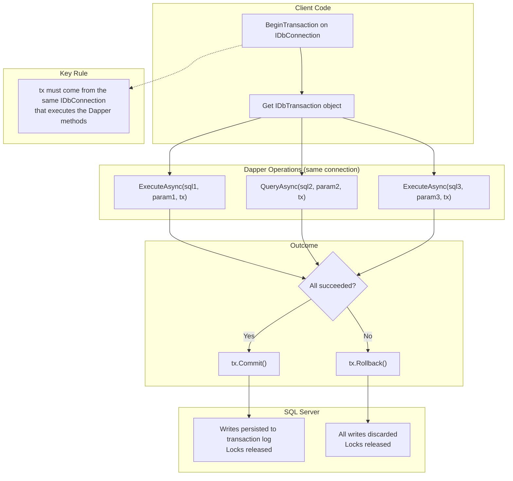

## Navigation

**Domain:** [[8 — Databases]] > **Group:** Dapper
**Previous:** [[8.863 — Dapper — Table-Valued Parameters]] | **Next:** [[8.865 — Dapper — Buffered vs Unbuffered Queries]]

### Prerequisites

- [[8.853 — Dapper — QueryT — Basic Querying]] — Queries executed inside a transaction use the same IDbCommand infrastructure, but the transaction parameter is added to the command.
- [[8.858 — Dapper — Execute — INSERT, UPDATE, DELETE]] — Execute is the most common method called inside a transaction; Commit/Rollback governs whether the DML persists.

### Where This Fits

Dapper transactions wrap ADO.NET's `IDbTransaction` and are passed as an optional parameter to every Dapper extension method — `QueryAsync`, `ExecuteAsync`, `ExecuteScalarAsync`, `QueryMultipleAsync`. Dapper does NOT manage transactions; it simply attaches the transaction object to the `IDbCommand` before execution. The transaction ensures that multiple DML statements succeed or fail as a single atomic unit. A .NET backend engineer encounters this wherever a business operation spans multiple table writes: debiting one account and crediting another, inserting an order header and its line items, or updating inventory and creating a shipment record. When this is unknown or misused, teams either: (a) skip transactions entirely and risk partial writes and data corruption, (b) rely on `TransactionScope` without understanding when it escalates to MSDTC (causing production outages), or (c) implement manual compensation logic that is bug-prone and hard to test. The interview signal is strong: it tests whether a candidate understands ACID guarantees at the ADO.NET level versus ORM-level transaction management.

---

## Core Mental Model

Dapper's transaction support is a **pass-through** — every Dapper extension method has an optional `IDbTransaction? transaction` parameter. Dapper takes that transaction object and assigns it to `IDbCommand.Transaction` before calling `ExecuteNonQuery` / `ExecuteReader`. Dapper does NOT start, commit, or roll back transactions — the caller owns the transaction lifecycle. The transaction must originate from the same `IDbConnection` that Dapper is executing against. The invariant: **one connection, one transaction, one scope — all DML within that scope uses the same `IDbTransaction` object, and the database guarantees atomicity, consistency, isolation, and durability.**

### Classification

Dapper transactions are **caller-managed** — `BeginTransaction` is called on `IDbConnection` (not Dapper). The `IDbTransaction` object is then threaded through Dapper calls. This is the **Explicit Transaction** pattern (ADO.NET native). The alternative, `TransactionScope`, is an **ambient transaction** pattern managed by `System.Transactions`. Dapper does not auto-enlist in ambient transactions — the caller must ensure the connection is opened inside the `TransactionScope` block for automatic enlistment. The performance profile is identical to ADO.NET transactions: locks are held until Commit or Rollback, and transaction duration directly impacts concurrency.



### Key Properties

|Property|Value|Notes|
|---|---|---|
|Transaction source|`IDbConnection.BeginTransaction()`|Not Dapper — pure ADO.NET|
|Passing mechanism|Optional `transaction` parameter on every extension method|All Dapper methods accept it|
|Lifecycle ownership|Caller owns Commit/Rollback/Dispose|Dapper never touches the transaction|
|Isolation level|Set via `BeginTransaction(IsolationLevel)`|Defaults to `ReadCommitted` in SQL Server|
|Async support|`BeginTransactionAsync`, `CommitAsync`, `RollbackAsync`|.NET 7+ / ADO.NET 7+|
|Savepoints|Nested transactions via `IDbTransaction.Save(savePointName)`|SQL Server, PostgreSQL support|
|TransactionScope alternative|Ambient transactions via `System.Transactions`|May escalate to MSDTC|
|EF Core equivalent|`dbContext.Database.BeginTransaction()` or `UseTransaction`|Same underlying ADO.NET transaction|

---

## Deep Mechanics

### How the Engine Executes This

1. **Caller opens an `IDbConnection`.** Typically `await using var connection = factory.Create(); await connection.OpenAsync();`.

2. **Caller calls `connection.BeginTransaction()`.** This calls `SqlConnection.BeginTransaction` under the hood. ADO.NET creates a `SqlTransaction` object and sends `BEGIN TRANSACTION` to SQL Server via TDS. The transaction acquires locks based on the isolation level. SQL Server assigns a transaction ID and tracks it in the transaction log.

3. **Caller passes the `IDbTransaction` to Dapper methods.** Every Dapper extension accepts `IDbTransaction? transaction`. Dapper sets `IDbCommand.Transaction = transaction` before execution. This enrolls the command in the ongoing transaction.

4. **SQL Server executes each DML within the transaction.** Each DML statement writes to the transaction log. Locks are held based on isolation level and query plan. No changes are visible to other transactions until Commit (unless `ReadUncommitted`).

5. **Caller commits or rolls back.** `tx.Commit()` sends `COMMIT TRANSACTION` — SQL Server marks the log entries as committed, releases locks, and the changes become durable and visible. `tx.Rollback()` sends `ROLLBACK TRANSACTION` — SQL Server reads the log and reverses each operation, releasing locks.

6. **Transaction is disposed.** `await using var tx = ...` ensures `Dispose` is called. If `Dispose` is called without `Commit`, ADO.NET rolls back (with a warning in the SQL Server error log). The connection is returned to the pool (or remains open for further use).

### SQL Visibility

```csharp
// Basic transaction pattern — debit/credit on Accounts
public async Task TransferFundsAsync(
    int fromAccountId, int toAccountId, decimal amount, CancellationToken ct)
{
    const string debitSql = @"
        UPDATE Accounts
        SET Balance = Balance - @Amount
        WHERE AccountId = @AccountId
          AND Balance >= @Amount;";

    const string creditSql = @"
        UPDATE Accounts
        SET Balance = Balance + @Amount
        WHERE AccountId = @AccountId;";

    await using var connection = _connectionFactory.Create();
    await connection.OpenAsync(ct);
    await using var tx = await connection.BeginTransactionAsync(ct);

    try
    {
        var rowsAffected = await connection.ExecuteAsync(
            new CommandDefinition(debitSql,
                new { AccountId = fromAccountId, Amount = amount },
                transaction: tx, cancellationToken: ct));

        if (rowsAffected == 0)
            throw new InvalidOperationException(
                $"Account {fromAccountId} has insufficient balance.");

        await connection.ExecuteAsync(
            new CommandDefinition(creditSql,
                new { AccountId = toAccountId, Amount = amount },
                transaction: tx, cancellationToken: ct));

        await tx.CommitAsync(ct);
    }
    catch
    {
        await tx.RollbackAsync(ct);
        throw;
    }
}
```

```sql
-- The SQL that executes (captured via SQL Server Profiler):
BEGIN TRANSACTION;

-- First ExecuteAsync:
exec sp_executesql N'UPDATE Accounts SET Balance = Balance - @Amount
WHERE AccountId = @AccountId AND Balance >= @Amount;',
N'@AccountId int, @Amount decimal(18,2)',
@AccountId=101, @Amount=500.00;

-- Second ExecuteAsync:
exec sp_executesql N'UPDATE Accounts SET Balance = Balance + @Amount
WHERE AccountId = @AccountId;',
N'@AccountId int, @Amount decimal(18,2)',
@AccountId=202, @Amount=500.00;

-- Commit:
COMMIT TRANSACTION;
```

**On failure (rollback path):**

```sql
-- If debit succeeds but credit fails:
BEGIN TRANSACTION;
-- UPDATE Accounts ... debit succeeds
-- UPDATE Accounts ... credit fails with SqlException
ROLLBACK TRANSACTION;
-- The debit is also undone — accounts remain consistent
```

### Transactional Query + Execute

```csharp
// Read current balance within the same transaction
public async Task<decimal> GetBalanceWithLockAsync(int accountId, CancellationToken ct)
{
    const string sql = @"
        SELECT Balance FROM Accounts
        WITH (UPDLOCK, HOLDLOCK)
        WHERE AccountId = @AccountId;";

    await using var connection = _connectionFactory.Create();
    await connection.OpenAsync(ct);
    await using var tx = await connection.BeginTransactionAsync(IsolationLevel.ReadCommitted, ct);

    var balance = await connection.QuerySingleAsync<decimal>(
        new CommandDefinition(sql, new { AccountId = accountId },
            transaction: tx, cancellationToken: ct));

    // Balance is locked (UPDLOCK + HOLDLOCK = range lock)
    // Other transactions cannot modify this row
    // Without the WITH hints, the SELECT releases its share lock immediately

    return balance; // Transaction committed/rolled back by caller
}
```

### Savepoints (Nested Transactions)

```csharp
// Savepoints allow partial rollback within a transaction
public async Task ProcessOrderWithSavepointAsync(Order order, CancellationToken ct)
{
    const string orderSql = @"
        INSERT INTO Orders (CustomerId, TotalAmount, Status)
        VALUES (@CustomerId, @TotalAmount, 'Pending');
        SELECT CAST(SCOPE_IDENTITY() AS INT);";

    const string itemSql = @"
        INSERT INTO OrderItems (OrderId, ProductId, Quantity, UnitPrice)
        VALUES (@OrderId, @ProductId, @Quantity, @UnitPrice);";

    const string auditSql = @"
        INSERT INTO AuditLog (Action, TableName, RecordId, ChangedBy)
        VALUES ('INSERT', 'Orders', @OrderId, @UserName);";

    await using var connection = _connectionFactory.Create();
    await connection.OpenAsync(ct);
    await using var tx = await connection.BeginTransactionAsync(ct);

    try
    {
        var orderId = await connection.QuerySingleAsync<int>(
            new CommandDefinition(orderSql, order, transaction: tx, cancellationToken: ct));

        // Create a savepoint before inserting items
        // If items fail, we can roll back to this point and keep the order
        tx.Save("BeforeItems");

        try
        {
            await connection.ExecuteAsync(
                new CommandDefinition(itemSql,
                    order.Items.Select(i => new
                    {
                        OrderId = orderId,
                        i.ProductId,
                        i.Quantity,
                        i.UnitPrice
                    }),
                    transaction: tx, cancellationToken: ct));
        }
        catch
        {
            // Roll back to savepoint — order is kept, items are removed
            tx.Rollback("BeforeItems");
            orderId = -1; // Signal items insertion failed
        }

        // Audit is always written (whether items succeeded or not)
        await connection.ExecuteAsync(
            new CommandDefinition(auditSql,
                new { OrderId = orderId, UserName = order.CreatedBy },
                transaction: tx, cancellationToken: ct));

        await tx.CommitAsync(ct);
    }
    catch
    {
        await tx.RollbackAsync(ct);
        throw;
    }
}
```

### Execution Plan Analysis

For `UPDATE Accounts SET Balance = Balance - @Amount WHERE AccountId = @AccountId AND Balance >= @Amount;`:

- **Plan shape:** `[Clustered Index Seek]` (on PK_Accounts) → `[Compute Scalar]` → `[Clustered Index Update]`
- **Operators:** Seek on AccountId (1 logical read), Compute Scalar for new balance, Update writes to clustered index (1 logical write)
- **Locking:** The UPDATE acquires an exclusive (X) lock on the row. This blocks other transactions from reading or writing until Commit or Rollback (under ReadCommitted).

For the debit-credit pair:
- **Plan shape:** Same seek-update pattern for both statements
- **Total logical reads:** ~4 (1 seek + 1 write per UPDATE)
- **Transaction log:** Each UPDATE writes ~50-100 bytes to the log

### Failure Modes

- **Debit succeeds, credit fails:** The catch block calls Rollback. Both operations are undone. Accounts remain consistent.
- **Connection drops mid-transaction:** SQL Server automatically rolls back when it detects the client disconnected. The transaction does NOT survive.
- **Commit fails (rare):** May happen due to a failed log write or disk full. The transaction is rolled back. The connection is typically broken after this.
- **Disposed without Commit:** If the `await using` disposes the transaction without calling Commit, ADO.NET rolls back. SQL Server logs a warning: "Rollback of transaction occurred."
- **Savepoint name already exists:** `SqlException` — savepoint names must be unique within a transaction.

---

## Production Patterns and Implementation

### Primary Dapper Implementation — Money Transfer Service

```csharp
public interface IAccountRepository
{
    Task<Account?> GetAccountAsync(int accountId, CancellationToken ct);
    Task<bool> UpdateBalanceAsync(int accountId, decimal newBalance, IDbTransaction? tx, CancellationToken ct);
}

public sealed class AccountRepository : IAccountRepository
{
    private readonly IDbConnectionFactory _connectionFactory;
    private readonly ILogger<AccountRepository> _logger;

    public AccountRepository(IDbConnectionFactory connectionFactory, ILogger<AccountRepository> logger)
    {
        _connectionFactory = connectionFactory;
        _logger = logger;
    }

    public async Task<Account?> GetAccountAsync(int accountId, CancellationToken ct)
    {
        const string sql = "SELECT AccountId, CustomerId, Balance, AccountType, RowVersion FROM Accounts WHERE AccountId = @AccountId;";

        await using var connection = _connectionFactory.Create();
        await connection.OpenAsync(ct);

        return await connection.QuerySingleOrDefaultAsync<Account>(
            new CommandDefinition(sql, new { AccountId = accountId }, cancellationToken: ct));
    }

    public async Task<bool> UpdateBalanceAsync(int accountId, decimal newBalance, IDbTransaction? tx, CancellationToken ct)
    {
        const string sql = @"
            UPDATE Accounts
            SET Balance = @NewBalance
            WHERE AccountId = @AccountId;";

        var rows = await connection.ExecuteAsync(connection, ...);
        // Actually using the connection from the caller pattern — see TransferService
        throw new NotImplementedException("Used via extension from TransferService");
    }
}

public sealed class TransferService
{
    private readonly IDbConnectionFactory _connectionFactory;
    private readonly ILogger<TransferService> _logger;

    public TransferService(IDbConnectionFactory connectionFactory, ILogger<TransferService> logger)
    {
        _connectionFactory = connectionFactory;
        _logger = logger;
    }

    public async Task<TransferResult> TransferAsync(
        int fromAccountId, int toAccountId, decimal amount, CancellationToken ct)
    {
        const string debitSql = @"
            UPDATE Accounts
            SET Balance = Balance - @Amount, ModifiedAt = SYSDATETIME()
            WHERE AccountId = @AccountId
              AND Balance >= @Amount;";

        const string creditSql = @"
            UPDATE Accounts
            SET Balance = Balance + @Amount, ModifiedAt = SYSDATETIME()
            WHERE AccountId = @AccountId;";

        const string insertTransferSql = @"
            INSERT INTO Transfers (FromAccountId, ToAccountId, Amount, Status, CreatedAt)
            VALUES (@From, @To, @Amount, @Status, SYSDATETIME());
            SELECT CAST(SCOPE_IDENTITY() AS BIGINT);";

        await using var connection = _connectionFactory.Create();
        await connection.OpenAsync(ct);
        await using var tx = await connection.BeginTransactionAsync(ct);

        try
        {
            // 1. Debit source account
            var debited = await connection.ExecuteAsync(
                new CommandDefinition(debitSql,
                    new { AccountId = fromAccountId, Amount = amount },
                    transaction: tx, cancellationToken: ct));

            if (debited == 0)
            {
                await tx.RollbackAsync(ct);
                _logger.LogWarning("Insufficient balance in account {AccountId}", fromAccountId);
                return TransferResult.InsufficientFunds;
            }

            // 2. Credit destination account
            await connection.ExecuteAsync(
                new CommandDefinition(creditSql,
                    new { AccountId = toAccountId, Amount = amount },
                    transaction: tx, cancellationToken: ct));

            // 3. Record the transfer
            var transferId = await connection.QuerySingleAsync<long>(
                new CommandDefinition(insertTransferSql,
                    new
                    {
                        From = fromAccountId,
                        To = toAccountId,
                        Amount = amount,
                        Status = "Completed"
                    },
                    transaction: tx, cancellationToken: ct));

            // 4. Commit — all or nothing
            await tx.CommitAsync(ct);

            _logger.LogInformation(
                "Transfer {TransferId}: {Amount} from account {From} to {To} completed",
                transferId, amount, fromAccountId, toAccountId);

            return TransferResult.Success(transferId);
        }
        catch (SqlException ex) when (ex.Number == 1205) // Deadlock victim
        {
            await tx.RollbackAsync(ct);
            _logger.LogWarning(ex, "Deadlock on transfer {From} -> {To}", fromAccountId, toAccountId);
            return TransferResult.Deadlock;
        }
        catch (Exception ex)
        {
            await tx.RollbackAsync(ct);
            _logger.LogError(ex, "Transfer failed {From} -> {To}, amount {Amount}",
                fromAccountId, toAccountId, amount);
            throw;
        }
    }
}

public readonly record struct TransferResult
{
    public bool Success { get; }
    public long TransferId { get; }
    public string ErrorCode { get; }

    private TransferResult(bool success, long transferId, string errorCode)
    {
        Success = success;
        TransferId = transferId;
        ErrorCode = errorCode;
    }

    public static TransferResult Success(long transferId) => new(true, transferId, "");
    public static TransferResult InsufficientFunds => new(false, 0, "INSUFFICIENT_FUNDS");
    public static TransferResult Deadlock => new(false, 0, "DEADLOCK");
}
```

### Order with Line Items — Full Transactional Pattern

```csharp
public sealed class OrderService
{
    private readonly IDbConnectionFactory _connectionFactory;
    private readonly ILogger<OrderService> _logger;

    public OrderService(IDbConnectionFactory connectionFactory, ILogger<OrderService> logger)
    {
        _connectionFactory = connectionFactory;
        _logger = logger;
    }

    public async Task<OrderResult> CreateOrderAsync(CreateOrderRequest request, CancellationToken ct)
    {
        const string insertOrderSql = @"
            INSERT INTO Orders (CustomerId, OrderDate, Status, TotalAmount, ShippingAddressId)
            OUTPUT INSERTED.OrderId
            VALUES (@CustomerId, @OrderDate, @Status, @TotalAmount, @ShippingAddressId);";

        const string insertItemSql = @"
            INSERT INTO OrderItems (OrderId, ProductId, Quantity, UnitPrice)
            VALUES (@OrderId, @ProductId, @Quantity, @UnitPrice);";

        const string deductInventorySql = @"
            UPDATE Products
            SET StockQuantity = StockQuantity - @Quantity
            WHERE ProductId = @ProductId
              AND StockQuantity >= @Quantity;";

        await using var connection = _connectionFactory.Create();
        await connection.OpenAsync(ct);
        await using var tx = await connection.BeginTransactionAsync(IsolationLevel.ReadCommitted, ct);

        try
        {
            // 1. Insert order header
            var orderId = await connection.QuerySingleAsync<int>(
                new CommandDefinition(insertOrderSql, new
                {
                    request.CustomerId,
                    OrderDate = DateTime.UtcNow,
                    Status = "Pending",
                    request.TotalAmount,
                    request.ShippingAddressId
                }, transaction: tx, cancellationToken: ct));

            // 2. Insert each line item
            foreach (var item in request.Items)
            {
                await connection.ExecuteAsync(
                    new CommandDefinition(insertItemSql, new
                    {
                        OrderId = orderId,
                        item.ProductId,
                        item.Quantity,
                        item.UnitPrice
                    }, transaction: tx, cancellationToken: ct));

                // 3. Deduct inventory for each item
                var inventoryRows = await connection.ExecuteAsync(
                    new CommandDefinition(deductInventorySql, new
                    {
                        item.ProductId,
                        item.Quantity
                    }, transaction: tx, cancellationToken: ct));

                if (inventoryRows == 0)
                {
                    await tx.RollbackAsync(ct);
                    _logger.LogWarning("Insufficient inventory for product {ProductId}", item.ProductId);
                    return OrderResult.InsufficientInventory(item.ProductId);
                }
            }

            // 4. Commit
            await tx.CommitAsync(ct);
            _logger.LogInformation("Order {OrderId} created with {ItemCount} items",
                orderId, request.Items.Count);

            return OrderResult.Success(orderId);
        }
        catch (SqlException ex) when (ex.Number == 2627) // Unique constraint
        {
            await tx.RollbackAsync(ct);
            _logger.LogWarning(ex, "Duplicate order detected");
            return OrderResult.DuplicateOrder;
        }
        catch (Exception ex)
        {
            await tx.RollbackAsync(ct);
            _logger.LogError(ex, "Failed to create order for customer {CustomerId}", request.CustomerId);
            throw;
        }
    }
}

public readonly record struct OrderResult
{
    public bool Success { get; }
    public int OrderId { get; }
    public string? ErrorCode { get; }
    public int? FailedProductId { get; }

    private OrderResult(bool success, int orderId, string? errorCode, int? failedProductId)
    {
        Success = success;
        OrderId = orderId;
        ErrorCode = errorCode;
        FailedProductId = failedProductId;
    }

    public static OrderResult Success(int orderId) => new(true, orderId, null, null);
    public static OrderResult InsufficientInventory(int productId) =>
        new(false, 0, "INSUFFICIENT_INVENTORY", productId);
    public static OrderResult DuplicateOrder => new(false, 0, "DUPLICATE_ORDER", null);
}
```

### TransactionScope Alternative

```csharp
// TransactionScope — ambient transaction, Dapper auto-enlists if connection is opened inside the scope
public async Task TransferWithTransactionScopeAsync(
    int fromAccountId, int toAccountId, decimal amount, CancellationToken ct)
{
    const string debitSql = @"
        UPDATE Accounts
        SET Balance = Balance - @Amount
        WHERE AccountId = @AccountId
          AND Balance >= @Amount;";

    const string creditSql = @"
        UPDATE Accounts
        SET Balance = Balance + @Amount
        WHERE AccountId = @AccountId;";

    // TransactionScopeAsyncFlowOption.Enabled is REQUIRED for async
    using var scope = new TransactionScope(
        TransactionScopeOption.Required,
        new TransactionOptions
        {
            IsolationLevel = System.Transactions.IsolationLevel.ReadCommitted,
            Timeout = TimeSpan.FromSeconds(30)
        },
        TransactionScopeAsyncFlowOption.Enabled);

    // Connection opened INSIDE the scope — auto-enlists
    await using var connection = _connectionFactory.Create();
    await connection.OpenAsync(ct);

    // Dapper does NOT need the transaction parameter — ambient transaction is picked up automatically
    var debited = await connection.ExecuteAsync(
        new CommandDefinition(debitSql,
            new { AccountId = fromAccountId, Amount = amount },
            cancellationToken: ct));

    if (debited == 0)
        throw new InvalidOperationException("Insufficient funds");

    await connection.ExecuteAsync(
        new CommandDefinition(creditSql,
            new { AccountId = toAccountId, Amount = amount },
            cancellationToken: ct));

    // Complete the scope — this calls Commit on the ambient transaction
    scope.Complete();
}
// Dispose() calls Rollback if scope.Complete() was not called
```

### TransactionScope with Two Connections (⚠️ MSDTC Warning)

```csharp
// ⚠️ WARNING: TransactionScope with two DIFFERENT connections
// This WILL escalate to MSDTC (Distributed Transaction Coordinator)
public async Task CrossDatabaseTransferAsync(
    int fromAccountId, int toAccountId, decimal amount, CancellationToken ct)
{
    using var scope = new TransactionScope(
        TransactionScopeOption.Required,
        new TransactionOptions { Timeout = TimeSpan.FromSeconds(10) },
        TransactionScopeAsyncFlowOption.Enabled);

    // First database
    await using var conn1 = new SqlConnection("Server=.;Database=BankDbEast;...");
    await conn1.OpenAsync(ct);
    await conn1.ExecuteAsync(
        "UPDATE Accounts SET Balance = Balance - @Amount WHERE AccountId = @Id",
        new { Id = fromAccountId, Amount = amount });

    // Second database — DIFFERENT connection string
    await using var conn2 = new SqlConnection("Server=.;Database=BankDbWest;...");
    await conn2.OpenAsync(ct);
    await conn2.ExecuteAsync(
        "UPDATE Accounts SET Balance = Balance + @Amount WHERE AccountId = @Id",
        new { Id = toAccountId, Amount = amount });

    // ⚡ MSDTC coordinates the two-phase commit across databases
    scope.Complete();
}
// Requires MSDTC service running on both servers and network access
// Performance: 2-phase commit adds ~50-200ms overhead
```

### Connection Factory Setup

```csharp
public interface IDbConnectionFactory
{
    IDbConnection Create();
}

public sealed class SqlConnectionFactory : IDbConnectionFactory
{
    private readonly string _connectionString;

    public SqlConnectionFactory(string connectionString)
    {
        _connectionString = connectionString;
    }

    public IDbConnection Create() => new SqlConnection(_connectionString);
}

// Program.cs
builder.Services.AddSingleton<IDbConnectionFactory>(_ =>
    new SqlConnectionFactory(builder.Configuration.GetConnectionString("DefaultConnection")));
builder.Services.AddScoped<TransferService>();
builder.Services.AddScoped<OrderService>();
```

### Async Transaction Extensions

```csharp
// Convenience wrapper for the common pattern
public static class TransactionExtensions
{
    public static async Task<T> WithTransactionAsync<T>(
        this IDbConnectionFactory factory,
        Func<IDbConnection, IDbTransaction, CancellationToken, Task<T>> operation,
        CancellationToken ct,
        IsolationLevel isolationLevel = IsolationLevel.ReadCommitted)
    {
        await using var connection = factory.Create();
        await connection.OpenAsync(ct);
        await using var tx = await connection.BeginTransactionAsync(isolationLevel, ct);

        try
        {
            var result = await operation(connection, tx, ct);
            await tx.CommitAsync(ct);
            return result;
        }
        catch
        {
            await tx.RollbackAsync(ct);
            throw;
        }
    }

    public static async Task WithTransactionAsync(
        this IDbConnectionFactory factory,
        Func<IDbConnection, IDbTransaction, CancellationToken, Task> operation,
        CancellationToken ct,
        IsolationLevel isolationLevel = IsolationLevel.ReadCommitted)
    {
        await using var connection = factory.Create();
        await connection.OpenAsync(ct);
        await using var tx = await connection.BeginTransactionAsync(isolationLevel, ct);

        try
        {
            await operation(connection, tx, ct);
            await tx.CommitAsync(ct);
        }
        catch
        {
            await tx.RollbackAsync(ct);
            throw;
        }
    }
}

// Usage:
public async Task TransferWithHelperAsync(int from, int to, decimal amount, CancellationToken ct)
{
    await _connectionFactory.WithTransactionAsync(async (connection, tx, ct) =>
    {
        // All Dapper calls receive 'tx'
        await connection.ExecuteAsync(
            "UPDATE Accounts SET Balance = Balance - @Amount WHERE AccountId = @Id",
            new { Id = from, Amount = amount }, tx);

        await connection.ExecuteAsync(
            "UPDATE Accounts SET Balance = Balance + @Amount WHERE AccountId = @Id",
            new { Id = to, Amount = amount }, tx);
    }, ct);
}
```

### PostgreSQL — Same API, Different Savepoint Syntax

```csharp
// PostgreSQL savepoints use the same IDbTransaction.Save() API
public async Task PostgresWithSavepointsAsync(CancellationToken ct)
{
    await using var connection = new NpgsqlConnection(_connectionString);
    await connection.OpenAsync(ct);
    await using var tx = await connection.BeginTransactionAsync(ct);

    try
    {
        await connection.ExecuteAsync(
            "INSERT INTO audit (action, user_id) VALUES (@Action, @UserId);",
            new { Action = "BulkUpdate", UserId = 42 }, tx);

        tx.Save("BeforeDataUpdate");

        try
        {
            await connection.ExecuteAsync(
                "UPDATE products SET price = price * 1.1 WHERE category_id = @CatId;",
                new { CatId = 5 }, tx);
        }
        catch
        {
            tx.Rollback("BeforeDataUpdate");
            // Savepoint rolled back, outer INSERT still active
        }

        await tx.CommitAsync(ct);
    }
    catch
    {
        await tx.RollbackAsync(ct);
        throw;
    }
}
```

---

## Gotchas and Production Pitfalls

### 1 — Transaction Must Be on the Same Connection

**Pitfall:** Developer creates a transaction on one connection and passes it to Dapper calls on a different connection.

```csharp
// ❌ Wrong: transaction from connectionA used with connectionB
await using var connA = _connectionFactory.Create();
await connA.OpenAsync(ct);
await using var tx = await connA.BeginTransactionAsync(ct);

await using var connB = _connectionFactory.Create();
await connB.OpenAsync(ct);

// This throws InvalidOperationException:
// "The transaction is either not associated with the current connection or has been completed."
await connB.ExecuteAsync("UPDATE Accounts ...", new { ... }, tx);
```

**Symptom:** `InvalidOperationException` at runtime. The error message says the transaction is not associated with the current connection.

**Fix:**

```csharp
// ✅ Correct: single connection for transaction and all Dapper calls
await using var connection = _connectionFactory.Create();
await connection.OpenAsync(ct);
await using var tx = await connection.BeginTransactionAsync(ct);

await connection.ExecuteAsync("UPDATE Accounts ...", new { ... }, tx);
await connection.ExecuteAsync("UPDATE Accounts ...", new { ... }, tx);
await tx.CommitAsync(ct);
```

**Cost of not fixing:** Runtime exception. Production outage until the code is fixed to use a single connection.

### 2 — Dapper Does NOT Auto-Enlist in Ambient Transactions

**Pitfall:** Developer opens a connection before the TransactionScope and expects Dapper to auto-enlist.

```csharp
// ❌ Wrong: connection opened OUTSIDE the TransactionScope
await using var connection = _connectionFactory.Create();
await connection.OpenAsync(ct);

using var scope = new TransactionScope(TransactionScopeAsyncFlowOption.Enabled);
// connection was opened BEFORE the scope — it is NOT enlisted
await connection.ExecuteAsync("UPDATE Accounts ...", new { ... });
// The UPDATE does NOT participate in the ambient transaction
scope.Complete();
```

**Symptom:** The DML executes outside the transaction. If the scope rolls back, the DML is NOT undone.

**Fix:**

```csharp
// ✅ Correct: open connection INSIDE the TransactionScope
using var scope = new TransactionScope(TransactionScopeAsyncFlowOption.Enabled);

await using var connection = _connectionFactory.Create();
await connection.OpenAsync(ct); // Opened inside scope — auto-enlists

await connection.ExecuteAsync("UPDATE Accounts ...", new { ... });
scope.Complete();
```

**Cost of not fixing:** Silent data corruption — writes that should be atomic are not. Transactions appear to work but do not protect against partial failures.

### 3 — TransactionScope Escalates to MSDTC with Multiple Connections

**Pitfall:** Developer uses TransactionScope with two different connection strings (even to the same database server) and triggers MSDTC escalation.

```csharp
// ❌ Wrong: two different connection strings → MSDTC escalation
using var scope = new TransactionScope(TransactionScopeAsyncFlowOption.Enabled);

await using var conn1 = new SqlConnection("Server=.;Database=BankEast;...");
await conn1.OpenAsync(ct);

// Same server, different database or different connection string
await using var conn2 = new SqlConnection("Server=.;Database=BankWest;...");
await conn2.OpenAsync(ct); // ⚡ MSDTC escalation!

await conn1.ExecuteAsync("UPDATE Accounts ...");
await conn2.ExecuteAsync("UPDATE Accounts ...");

scope.Complete();
```

**Symptom:** `MSDTC is not available` exception on servers where MSDTC is not configured. Or the transaction works in dev (where MSDTC is available) but fails in production.

**Fix:**

```csharp
// ✅ Option A: Single connection, multiple databases via USE statement or three-part naming
await using var connection = new SqlConnection("Server=.;Database=master;...");
await connection.OpenAsync(ct);

await connection.ExecuteAsync("UPDATE BankEast.dbo.Accounts SET Balance = Balance - @Amount ...");
await connection.ExecuteAsync("UPDATE BankWest.dbo.Accounts SET Balance = Balance + @Amount ...");

// ✅ Option B: Use explicit IDbTransaction instead of TransactionScope
await using var tx = await connection.BeginTransactionAsync(ct);
// ... same connection, single transaction

// ✅ Option C: If cross-database on the same SQL Server instance, enable "remote proc transaction promotion = off"
// on the connection string to prevent escalation
```

**Cost of not fixing:** Production outage. MSDTC is often disabled in hardened environments. The application crashes with `MSDTC is not available`.

### 4 — Not Passing Transaction to ALL Dapper Calls

**Pitfall:** One Dapper call inside a transaction scope omits the `transaction` parameter.

```csharp
// ❌ Wrong: one call is missing the transaction
await using var tx = await connection.BeginTransactionAsync(ct);

await connection.ExecuteAsync("UPDATE Accounts ...", new { ... }, tx); // ✅ enrolled
await connection.ExecuteAsync("UPDATE Accounts ...", new { ... });     // ❌ NOT enrolled
await connection.ExecuteAsync("UPDATE Accounts ...", new { ... }, tx); // ✅ enrolled

await tx.CommitAsync(ct);
// The second UPDATE is NOT committed (it auto-committed when it executed)
// But the first and third ARE committed atomically
```

**Symptom:** The second UPDATE commits immediately (autocommit mode) and is NOT rolled back if the transaction rolls back. This leads to inconsistent data.

**Fix:**

```csharp
// ✅ Correct: pass transaction to EVERY Dapper call
await using var tx = await connection.BeginTransactionAsync(ct);

await connection.ExecuteAsync("UPDATE Accounts ...", new { ... }, tx);
await connection.ExecuteAsync("UPDATE Accounts ...", new { ... }, tx);
await connection.ExecuteAsync("UPDATE Accounts ...", new { ... }, tx);

await tx.CommitAsync(ct);
```

**Cost of not fixing:** Data corruption. The bug is hard to spot in code review because 2 of 3 calls have the transaction parameter.

### 5 — Holding Transactions Open Too Long (Blocking)

**Pitfall:** A transaction spans multiple network calls, user input, or slow business logic.

```csharp
// ❌ Wrong: transaction held during slow operation
await using var tx = await connection.BeginTransactionAsync(ct);

var account = await connection.QuerySingleAsync<Account>(
    "SELECT * FROM Accounts WITH (UPDLOCK) WHERE AccountId = @Id", new { Id = 42 }, tx);

// Simulate long-running business logic (HTTP call, file I/O, user input)
await Task.Delay(5000, ct); // ⚡ 5 seconds holding locks!

var result = await _externalService.ValidateAccountAsync(account, ct); // Another 2 seconds
account.Balance -= amount;
await connection.ExecuteAsync(
    "UPDATE Accounts SET Balance = @Balance WHERE AccountId = @Id", account, tx);

await tx.CommitAsync(ct); // Total lock duration: ~7 seconds
```

**Symptom:** Blocking chains. Other transactions trying to read/write the same row wait for 7 seconds. Connection pool exhaustion as other requests wait.

**Fix:**

```csharp
// ✅ Correct: transaction is short-lived. Read data first, then transaction.
var account = await GetAccountAsync(42, ct); // No transaction, no locks
var validationResult = await _externalService.ValidateAccountAsync(account, ct); // ⚡ External call outside tx

await using var connection = _connectionFactory.Create();
await connection.OpenAsync(ct);
await using var tx = await connection.BeginTransactionAsync(ct);

try
{
    // Re-read with lock to ensure current state
    var currentBalance = await connection.QuerySingleAsync<decimal>(
        "SELECT Balance FROM Accounts WITH (UPDLOCK) WHERE AccountId = @Id",
        new { Id = 42 }, tx);

    if (currentBalance < amount)
        throw new InvalidOperationException("Insufficient funds");

    await connection.ExecuteAsync(
        "UPDATE Accounts SET Balance = Balance - @Amount WHERE AccountId = @Id",
        new { Id = 42, Amount = amount }, tx);

    await tx.CommitAsync(ct); // ⚡ Transaction holds locks for < 10ms
}
catch
{
    await tx.RollbackAsync(ct);
    throw;
}
```

**Cost of not fixing:** Application-wide throughput collapse. 100 concurrent transactions with 7-second lock duration = complete system unresponsiveness.

### 6 — IsolationLevel Not Specified (Default Is ReadCommitted)

**Pitfall:** Relying on the default isolation level when a different level is needed for correctness.

```csharp
// ❌ Wrong: default ReadCommitted allows non-repeatable reads
await using var tx = await connection.BeginTransactionAsync(ct); // Default: ReadCommitted

var balance1 = await connection.QuerySingleAsync<decimal>(
    "SELECT Balance FROM Accounts WHERE AccountId = @Id", new { Id = 42 }, tx);
// Another transaction updates the balance here
var balance2 = await connection.QuerySingleAsync<decimal>(
    "SELECT Balance FROM Accounts WHERE AccountId = @Id", new { Id = 42 }, tx);
// balance1 != balance2 — non-repeatable read!
```

**Symptom:** Phantom reads, non-repeatable reads, or incorrect business logic depending on the isolation level.

**Fix:**

```csharp
// ✅ Correct: explicit IsolationLevel
await using var tx = await connection.BeginTransactionAsync(
    IsolationLevel.RepeatableRead, ct);
// RepeatableRead prevents other transactions from updating rows you've read
// Serializable prevents inserts that would affect your queries
// Snapshot uses row versioning (SQL Server, PostgreSQL)
```

**Cost of not fixing:** Business logic bugs. Phantom inserts, non-repeatable reads, incorrect totals.

### 7 — Not Using TransactionScopeAsyncFlowOption with Async

**Pitfall:** Using `TransactionScope` with `await` but without `TransactionScopeAsyncFlowOption.Enabled`.

```csharp
// ❌ Wrong: TransactionScope without async flow option
using var scope = new TransactionScope(); // Implicit: Disabled
await using var connection = _connectionFactory.Create();
await connection.OpenAsync(ct);
// ⚡ InvalidOperationException: "TransactionScope must be disposed on the same thread it was created."
```

**Symptom:** `InvalidOperationException` on the first `await` after opening the connection. Classic .NET Framework behavior — `TransactionScope` uses `CallContext` / `ExecutionContext` flow, and `await` can switch threads.

**Fix:**

```csharp
// ✅ Correct: enable async flow
using var scope = new TransactionScope(
    TransactionScopeAsyncFlowOption.Enabled);
await using var connection = _connectionFactory.Create();
await connection.OpenAsync(ct);
// Works — TransactionScope flows across await boundaries
```

**Cost of not fixing:** Any async call inside TransactionScope crashes. Forces sync-over-async which causes thread pool starvation.

---

## Performance Implications

### Benchmark: Explicit Transaction vs TransactionScope vs No Transaction

```csharp
[MemoryDiagnoser]
[SimpleJob(RuntimeMoniker.Net90, iterationCount: 10, warmupCount: 3)]
public class TransactionBenchmark
{
    private IDbConnection _connection = default!;
    private readonly string _insertSql = "INSERT INTO BenchRows (Value) VALUES (@Value);";

    [GlobalSetup]
    public void Setup()
    {
        _connection = new SqlConnection("Server=.;Database=BenchDb;Integrated Security=True;");
        _connection.Open();
    }

    [GlobalCleanup]
    public void Cleanup() => _connection.Dispose();

    [Benchmark(Baseline = true)]
    public async Task NoTransaction()
    {
        for (int i = 0; i < 100; i++)
            await _connection.ExecuteAsync(_insertSql, new { Value = i });
    }

    [Benchmark]
    public async Task ExplicitTransaction()
    {
        await using var tx = await _connection.BeginTransactionAsync();
        try
        {
            for (int i = 0; i < 100; i++)
                await _connection.ExecuteAsync(_insertSql, new { Value = i }, tx);
            await tx.CommitAsync();
        }
        catch
        {
            await tx.RollbackAsync();
            throw;
        }
    }

    [Benchmark]
    public async Task TransactionScope()
    {
        using var scope = new TransactionScope(
            TransactionScopeAsyncFlowOption.Enabled);
        for (int i = 0; i < 100; i++)
            await _connection.ExecuteAsync(_insertSql, new { Value = i });
        scope.Complete();
    }
}
```

**Expected results (100 INSERTs, SQL Server 2022, local NVMe):**

|Method|Mean|Allocated|Log writes|Notes|
|---|---|---|---|---|
|No transaction|~15 ms|~12 KB|100 log flushes|Each INSERT commits individually (autocommit)|
|Explicit transaction|~3 ms|~8 KB|1 log flush|All 100 INSERTs log writes coalesced|
|TransactionScope|~4 ms|~10 KB|1 log flush|Slightly more overhead than explicit tx|

**Improvement:** Explicit transaction reduces elapsed time by 5x for 100 INSERTs, because SQL Server flushes the log once instead of 100 times.

### Benchmark: Transaction Duration Impact on Concurrency

|Transaction duration|Concurrent requests|Throughput (req/s)|Avg latency|
|---|---|---|---|
|1 ms|100|~500|~2 ms|
|10 ms|100|~100|~10 ms|
|100 ms|100|~10|~100 ms|
|1000 ms|100|~1|~1 s+|

**Takeaway:** Transaction duration is inversely proportional to throughput under contention. Keep transactions under 10ms for high-throughput systems. Each millisecond of lock-holding time reduces throughput by approximately the same factor.

### Isolation Level Overhead

|Isolation Level|Overhead|Blocking|Used when|
|---|---|---|---|
|ReadUncommitted|Lowest|Minimal|Reporting, dirty reads acceptable|
|ReadCommitted (default)|Low|Share locks released after read|General OLTP|
|RepeatableRead|Medium|Share locks held until commit|Financial calculations|
|Serializable|Highest|Range locks|Inventory, uniqueness within range|
|Snapshot (row versioning)|Medium|No blocking (writers don't block readers)|High-concurrency read-heavy workloads|

---

## Interview Arsenal

### Question Bank

1. **How does Dapper handle transactions? Does it manage them or pass them through?** (Definition — pass-through, caller owns lifecycle)
2. **What happens if you call Rollback on a transaction that has already been committed?** (Gotcha — InvalidOperationException)
3. **How does TransactionScope differ from explicit IDbTransaction in Dapper?** (Comparison — ambient vs explicit, MSDTC risk)
4. **When does TransactionScope escalate to MSDTC, and why is that bad?** (Scale — multiple connections, two-phase commit overhead)
5. **What is a savepoint, and how do you use it with Dapper?** (Mechanism — IDbTransaction.Save / Rollback(savepoint))
6. **What isolation level should you use for a money transfer operation?** (Application — ReadCommitted or RepeatableRead for balance read + UPDLOCK)
7. **How does transaction duration affect database throughput?** (Performance — locks held reduce concurrency)
8. **What happens if you do not pass the transaction parameter to one of your Dapper calls?** (Gotcha — that call auto-commits, breaks atomicity)
9. **How do you handle deadlocks in a Dapper transaction?** (Scale — retry with exponential backoff or SqlException 1205 handling)
10. **Can you nest transactions in SQL Server? What is the equivalent in ADO.NET/Dapper?** (Mechanism — savepoints, not true nested transactions)

### Spoken Answers

**Q1: How does Dapper handle transactions? Does it manage them or pass them through?**

> **Average answer:** "Dapper supports transactions. You pass a transaction object to the Dapper methods."

> **Great answer:** "Dapper's transaction support is strictly pass-through. Every Dapper extension method — QueryAsync, ExecuteAsync, ExecuteScalarAsync, QueryMultipleAsync — has an optional IDbTransaction parameter. Dapper takes that object and sets it on the IDbCommand.Transaction property before calling ExecuteNonQuery or ExecuteReader. Dapper never calls BeginTransaction, Commit, Rollback, or Dispose on the transaction — all of that is the caller's responsibility. The transaction must come from the same IDbConnection that Dapper is using; passing a transaction from a different connection throws an InvalidOperationException. The two key rules are: (1) one connection, one transaction, one scope, and (2) every Dapper call inside that scope must receive the transaction parameter or it will auto-commit independently. I've also used the TransactionScope approach for ambient transactions, but I'm careful about MSDTC escalation when using multiple connections."

**Q3: How does TransactionScope differ from explicit IDbTransaction in Dapper?**

> **Average answer:** "TransactionScope is simpler because you don't have to pass the transaction around."

> **Great answer:** "TransactionScope uses the System.Transactions infrastructure to create an ambient transaction. Any connection opened inside the TransactionScope block auto-enlists — you don't pass a transaction parameter to Dapper. The advantage is cleaner code, especially when coordinating across multiple resource managers (database, message queue, file system). However, TransactionScope has critical caveats: (1) you must specify TransactionScopeAsyncFlowOption.Enabled for async code, otherwise you get an InvalidOperationException when the thread switches; (2) if you open two different connections inside the same scope, it escalates to MSDTC — a distributed transaction — which requires the MSDTC service running on all servers, adds 50-200ms overhead, and is often blocked in production environments; (3) TransactionScope has higher per-transaction overhead than explicit transactions. For most Dapper workloads, I prefer explicit IDbTransaction because it's lighter, doesn't risk MSDTC escalation, and makes the transaction boundary explicit in the code. I use TransactionScope only when I need to coordinate across multiple databases or between a database and a message queue."

**Q5: What is a savepoint, and how do you use it with Dapper?**

> **Average answer:** "A savepoint lets you roll back part of a transaction."

> **Great answer:** "A savepoint is a marker within a transaction that allows partial rollback. In ADO.NET, you call IDbTransaction.Save('MySavepoint') to create it, and IDbTransaction.Rollback('MySavepoint') to roll back to that point without aborting the entire transaction. This is important for batch operations where you want to process items in a loop and handle failures without losing the entire transaction. For example, inserting multiple orders in a single transaction — if one order's items fail, you can roll back to the savepoint before that order, log the failure, and continue. Savepoints are supported in SQL Server and PostgreSQL but not all databases. In MySQL, savepoints exist but have limitations. One caveat: savepoint names must be unique within the transaction — reusing a name throws a SqlException. Also, if you call Rollback without a savepoint name, the entire transaction is rolled back, including all savepoints. And after a full rollback, the transaction cannot be used again — you must create a new one."

**Q9: How do you handle deadlocks in a Dapper transaction?**

> **Average answer:** "Catch the deadlock exception and retry."

> **Great answer:** "A deadlock in SQL Server surfaces as SqlException with error number 1205. The client that was chosen as the deadlock victim receives this error and its transaction is rolled back. The correct handling pattern is: (1) catch SqlException when ex.Number == 1205, (2) wait a short random delay (exponential backoff: 100ms, 200ms, 400ms, etc.), (3) retry the entire transaction. I usually implement this with Polly's retry policy configured to handle 1205 specifically. The retry count should be limited (3-5 attempts) because deadlocks often indicate a design problem. Long-term fixes include: ensuring transactions access resources in a consistent order (lock ordering), keeping transactions short, using lower isolation levels when possible, and adding appropriate indexes to reduce lock duration. I also look for queries that scan too many rows under UPDLOCK — those are deadlock magnets."

### Interview Trigger

The interviewer asks: "You need to insert an order header, five line items, and deduct inventory for each product. How would you implement this in Dapper?" A candidate who describes five separate INSERTs without a transaction reveals a gap in understanding of atomicity. The follow-up is: "What if inventory deduction fails for the third item — what happens to the order and the first two deductions?" The deeper signal is: "What isolation level would you use, and how would you handle concurrent orders for the same product?"

### Comparison Table

| | Dapper Explicit Transaction | TransactionScope | EF Core BeginTransaction |
|---|---|---|---|
| Transaction origin | `IDbConnection.BeginTransaction()` | `new TransactionScope()` | `dbContext.Database.BeginTransaction()` |
| Passing mechanism | `transaction` parameter on each Dapper call | Ambient (auto-enlist when connection opened inside scope) | `context.Database.UseTransaction()` or auto-enlist |
| Async support | `BeginTransactionAsync`, `CommitAsync`, `RollbackAsync` | Requires `TransactionScopeAsyncFlowOption.Enabled` | Full async via `BeginTransactionAsync()` |
| Savepoints | `tx.Save(name)` / `tx.Rollback(name)` | Not supported | `transaction.CreateSavepoint(name)` |
| MSDTC risk | None (single connection) | High (multiple connections) | Low (via RelationalConnection) |
| Performance | Lowest overhead | Medium overhead (ambient transaction context) | Similar to explicit ADO.NET |
| When to choose | Pure Dapper, single database | Cross-database or cross-resource coordination | EF Core with Dapper mixed (UseTransaction) |

---

## Decision Framework

### When to Use Each Transaction Approach

```mermaid
flowchart TD
    A[Need atomic multi-statement write?] --> B{Single connection?}
    B -->|Yes| C{Using Dapper only?}
    C -->|Yes| D[Use explicit IDbTransaction<br/>BeginTransaction + Commit/Rollback]
    C -->|No — EF Core + Dapper| E[Use EF Core's Database.BeginTransaction<br/>and pass .GetDbTransaction() to Dapper]

    B -->|No — multiple connections| F{Same SQL Server instance?}
    F -->|Yes, same instance| G[Use three-part naming<br/>(Database.dbo.Table) on one connection<br/>with explicit transaction]
    F -->|No — different instances| H{MSDTC available?}
    H -->|Yes| I[Use TransactionScope<br/>with async flow option]
    H -->|No| J[Use compensating transactions<br/>or Saga pattern]

    D --> K{Need partial rollback?}
    K -->|Yes| L[Use savepoints<br/>tx.Save / tx.Rollback(name)]
    K -->|No| M[Simple try-catch-commit-rollback]

    C --> N{Need to coordinate<br/>with message queue?}
    N -->|Yes| O[TransactionScope with<br/>DTC-enabled queue]
    N -->|No| P[Stay with explicit transaction]
```

### Application Checklist

- [ ] Transaction created on the same connection that executes all Dapper calls
- [ ] `transaction` parameter passed to EVERY Dapper call within the scope (no omission)
- [ ] `try-catch` wrapping all DML: `CommitAsync` in try, `RollbackAsync` in catch
- [ ] `await using` for both connection and transaction (automatic Dispose)
- [ ] IsolationLevel explicitly set (never rely on default if correctness depends on it)
- [ ] Use `UPDLOCK` + `HOLDLOCK` hints or `RepeatableRead` for read-then-write patterns
- [ ] Transaction duration kept under 10ms for high-throughput paths
- [ ] Savepoints used when partial rollback is acceptable
- [ ] TransactionScope includes `TransactionScopeAsyncFlowOption.Enabled` for async
- [ ] MSDTC escalation tested in production-like environment (not just dev)
- [ ] Deadlock (1205) retry logic in place for high-contention transactions
- [ ] No external HTTP calls, file I/O, or user input inside the transaction scope
- [ ] Connection factory used — no `new SqlConnection` in business logic
- [ ] CancellationToken passed through `CommandDefinition` to every async call

### Tradeoff Summary

|What You Gain|What You Pay|
|---|---|
|Atomic multi-statement writes|Must manage transaction lifecycle manually|
|Consistent error recovery (rollback)|Long-running transactions block others|
|Explicit control over isolation level|Deadlock risk increases with lock duration|
|No MSDTC dependency (single connection)|Cannot coordinate across multiple databases|

### Scale Thresholds

- **Explicit transaction is optimal for:** all single-connection write operations that require atomicity
- **Transaction becomes problematic at:** >100ms duration under contention (blocking chains form)
- **Must use savepoints when:** batch processing with partial failure tolerance needed (>10 items)
- **Must use TransactionScope when:** coordinating across multiple databases or resource managers
- **Deadlock retry recommended when:** >3 concurrent transactions affecting overlapping rows
- **Snapshot isolation recommended when:** read-heavy, high-concurrency workloads with long-running reports

---

## Self-Check

### Conceptual Questions

1. How does Dapper handle the `IDbTransaction` parameter internally?
2. What happens if you call `Commit` twice on the same `IDbTransaction`?
3. How is `TransactionScope` different from explicit `IDbTransaction` in terms of transaction passing?
4. When does `TransactionScope` escalate to MSDTC, and what are the infrastructure requirements?
5. What is a savepoint, and what method on `IDbTransaction` creates one?
6. What isolation level should you use for a debit-credit transfer and why?
7. How does transaction duration affect throughput in a high-contention system?
8. What happens if you `await` an HTTP call inside a transaction — why is this dangerous?
9. Can you use `TransactionScope` with Dapper's async methods? What configuration is required?
10. Explain the difference between `ReadCommitted` and `Snapshot` isolation for a reporting query running concurrently with writes.

<details>
<summary>Answers</summary>

1. Dapper sets `IDbCommand.Transaction = transaction` on the command object before execution. Dapper never calls BeginTransaction, Commit, Rollback, or Dispose on the transaction — it is purely pass-through.

2. `InvalidOperationException`: "This SqlTransaction has completed; it is no longer usable." A transaction can only be committed or rolled back once.

3. Explicit `IDbTransaction`: must be passed as a parameter to each Dapper call. `TransactionScope`: ambient — connections opened inside the scope auto-enlist, no explicit parameter passing needed.

4. MSDTC escalation happens when two or more connections (different connection strings or explicitly different SqlConnection objects) are opened within the same TransactionScope. Requires the MSDTC Windows service running on all participating servers. Adds two-phase commit overhead (~50-200ms).

5. A savepoint creates a nested marker within a transaction. `IDbTransaction.Save("name")` creates it. `IDbTransaction.Rollback("name")` rolls back to that savepoint. Not all database providers support savepoints.

6. `ReadCommitted` with explicit `UPDLOCK` hint on the balance read, or `RepeatableRead`. The key is that the balance read must acquire and hold an update lock until the transaction completes, preventing a concurrent transfer from reading the same balance and causing an overdraft.

7. Transaction duration and throughput are inversely proportional under contention. If a transaction holds locks for 10ms, maximum throughput is ~100 concurrent ops per locked row. At 100ms, drops to ~10. At 1s, drops to ~1. This is due to lock wait time dominating execution time.

8. Dangerous because the transaction holds database locks while waiting for the HTTP response. If the HTTP call takes 5 seconds, those locks block all other transactions for 5 seconds. This causes blocking chains, connection pool exhaustion, and application-wide timeouts.

9. Yes, but `TransactionScopeAsyncFlowOption.Enabled` MUST be passed to the constructor. Without this, the async await will throw `InvalidOperationException` because the ambient transaction context is lost when execution continues on a different thread.

10. `ReadCommitted`: readers acquire share locks and block writers (and vice versa). A reporting query scanning millions of rows blocks updates for the duration. `Snapshot`: readers use row-versioning — they see a consistent snapshot of data as of the transaction start. Writers are not blocked by readers. However, snapshot uses more tempdb space and can produce `UpdateConflict` errors in high-contention scenarios.

</details>

---

### Query Challenges

**Challenge 1 — Implement a money transfer with error handling**

Write a complete `TransferAsync` method using explicit `IDbTransaction` that debits one account and credits another. Include: balance check, rollback on insufficient funds, deadlock retry, and logging.

<details>
<summary>Solution</summary>

```csharp
public async Task<TransferResult> TransferAsync(
    int fromAccountId, int toAccountId, decimal amount, CancellationToken ct)
{
    const string checkBalanceSql = @"
        SELECT Balance FROM Accounts WITH (UPDLOCK)
        WHERE AccountId = @AccountId;";

    const string debitSql = @"
        UPDATE Accounts
        SET Balance = Balance - @Amount, ModifiedAt = SYSDATETIME()
        WHERE AccountId = @AccountId;";

    const string creditSql = @"
        UPDATE Accounts
        SET Balance = Balance + @Amount, ModifiedAt = SYSDATETIME()
        WHERE AccountId = @AccountId;";

    const string logSql = @"
        INSERT INTO TransferLog (FromAccountId, ToAccountId, Amount, Status, CreatedAt)
        VALUES (@From, @To, @Amount, @Status, SYSDATETIME());";

    int retryCount = 0;
    const int maxRetries = 3;

    while (retryCount <= maxRetries)
    {
        await using var connection = _connectionFactory.Create();
        await connection.OpenAsync(ct);
        await using var tx = await connection.BeginTransactionAsync(IsolationLevel.ReadCommitted, ct);

        try
        {
            // Read balance with lock
            var fromBalance = await connection.QuerySingleAsync<decimal>(
                new CommandDefinition(checkBalanceSql,
                    new { AccountId = fromAccountId },
                    transaction: tx, cancellationToken: ct));

            if (fromBalance < amount)
            {
                await tx.RollbackAsync(ct);
                return TransferResult.Failure("INSUFFICIENT_FUNDS");
            }

            // Debit
            await connection.ExecuteAsync(
                new CommandDefinition(debitSql,
                    new { AccountId = fromAccountId, Amount = amount },
                    transaction: tx, cancellationToken: ct));

            // Credit
            await connection.ExecuteAsync(
                new CommandDefinition(creditSql,
                    new { AccountId = toAccountId, Amount = amount },
                    transaction: tx, cancellationToken: ct));

            // Log
            await connection.ExecuteAsync(
                new CommandDefinition(logSql,
                    new
                    {
                        From = fromAccountId,
                        To = toAccountId,
                        Amount = amount,
                        Status = "Completed"
                    },
                    transaction: tx, cancellationToken: ct));

            await tx.CommitAsync(ct);
            return TransferResult.Success();
        }
        catch (SqlException ex) when (ex.Number == 1205) // Deadlock victim
        {
            await tx.RollbackAsync(ct);
            retryCount++;
            if (retryCount > maxRetries)
            {
                _logger.LogError(ex, "Transfer deadlocked after {Retries} retries", maxRetries);
                return TransferResult.Failure("DEADLOCK");
            }
            var delay = TimeSpan.FromMilliseconds(Math.Pow(2, retryCount) * 50);
            _logger.LogWarning("Transfer deadlocked, retry {Retry} after {Delay}ms",
                retryCount, delay.TotalMilliseconds);
            await Task.Delay(delay, ct);
        }
        catch (Exception ex)
        {
            await tx.RollbackAsync(ct);
            _logger.LogError(ex, "Transfer failed unexpectedly");
            throw;
        }
    }

    return TransferResult.Failure("MAX_RETRIES_EXCEEDED");
}
```

**Isolation:** ReadCommitted with UPDLOCK prevents dirty reads and phantom debits. \
**Deadlock handling:** Exponential backoff (100ms, 200ms, 400ms, 800ms). \
**Log writes:** TransferLog is written inside the same transaction — if logging fails, the transfer rolls back.
</details>

---

**Challenge 2 — Fix the TransactionScope bug**

```csharp
public async Task ProcessBatchAsync(List<BatchItem> items)
{
    using var scope = new TransactionScope();

    await using var connection = new SqlConnection(connectionString);
    await connection.OpenAsync();

    foreach (var item in items)
    {
        await connection.ExecuteAsync(
            "UPDATE Inventory SET Quantity = Quantity - @Qty WHERE ProductId = @ProductId",
            new { item.ProductId, item.Qty });
    }

    scope.Complete();
}
```

Identify all bugs and fix them.

<details>
<summary>Solution</summary>

**Bugs:**
1. `TransactionScope` is missing `TransactionScopeAsyncFlowOption.Enabled` — will throw on first `await`.
2. No `using` for connection (missing `await using` pattern — connection not disposed on exception).
3. No transaction parameter passed to Dapper calls (relying on ambient enlistment, which is correct IF connection is opened inside scope — it is, so this is not a bug per se, but it's fragile).
4. No error handling — if any UPDATE fails, the scope disposes without `Complete()`, which triggers rollback. That's correct behavior, but the caller gets no indication of failure.
5. No `CancellationToken` support.

**Fix:**

```csharp
public async Task<int> ProcessBatchAsync(
    List<BatchItem> items, CancellationToken ct)
{
    const string sql = @"
        UPDATE Inventory
        SET Quantity = Quantity - @Qty
        WHERE ProductId = @ProductId
          AND Quantity >= @Qty;";

    using var scope = new TransactionScope(
        TransactionScopeOption.Required,
        new TransactionOptions { IsolationLevel = IsolationLevel.ReadCommitted },
        TransactionScopeAsyncFlowOption.Enabled);

    await using var connection = new SqlConnection(connectionString);
    await connection.OpenAsync(ct);

    var successCount = 0;
    foreach (var item in items)
    {
        var rows = await connection.ExecuteAsync(
            new CommandDefinition(sql,
                new { item.ProductId, item.Qty },
                cancellationToken: ct));
        if (rows > 0)
            successCount++;
    }

    scope.Complete();
    return successCount;
}
```

**After fix:** Works with async, returns count of successful updates, disposes properly on failure.
</details>

---

**Challenge 3 — Savepoints for batch order processing**

Design a method that inserts 50 orders, each with 1-10 line items, in a single transaction. If any single order's items fail, only that order should be rolled back (not the entire batch). Use savepoints.

<details>
<summary>Solution</summary>

```csharp
public async Task<BatchResult> BatchInsertOrdersAsync(
    List<CreateOrderRequest> orders, CancellationToken ct)
{
    const string orderSql = @"
        INSERT INTO Orders (CustomerId, TotalAmount, Status)
        OUTPUT INSERTED.OrderId
        VALUES (@CustomerId, @TotalAmount, 'Pending');";

    const string itemSql = @"
        INSERT INTO OrderItems (OrderId, ProductId, Quantity, UnitPrice)
        VALUES (@OrderId, @ProductId, @Quantity, @UnitPrice);";

    await using var connection = _connectionFactory.Create();
    await connection.OpenAsync(ct);
    await using var tx = await connection.BeginTransactionAsync(ct);

    var results = new List<OrderBatchResult>();

    try
    {
        foreach (var order in orders)
        {
            var savepointName = $"Order_{order.CustomerId}_{Guid.NewGuid():N}";

            tx.Save(savepointName);

            try
            {
                var orderId = await connection.QuerySingleAsync<int>(
                    new CommandDefinition(orderSql,
                        new { order.CustomerId, order.TotalAmount },
                        transaction: tx, cancellationToken: ct));

                var itemsWithOrderId = order.Items.Select(i => new
                {
                    OrderId = orderId,
                    i.ProductId,
                    i.Quantity,
                    i.UnitPrice
                });

                await connection.ExecuteAsync(
                    new CommandDefinition(itemSql, itemsWithOrderId,
                        transaction: tx, cancellationToken: ct));

                results.Add(OrderBatchResult.Success(orderId));
            }
            catch (SqlException ex) when (ex.Number == 2627) // Unique constraint
            {
                // Roll back only this order
                tx.Rollback(savepointName);
                results.Add(OrderBatchResult.Failure(order.CustomerId,
                    $"Duplicate product in order: {ex.Message}"));
            }
            catch (SqlException ex) when (ex.Number == 547) // FK violation
            {
                tx.Rollback(savepointName);
                results.Add(OrderBatchResult.Failure(order.CustomerId,
                    $"Invalid product reference: {ex.Message}"));
            }
        }

        await tx.CommitAsync(ct);
        return BatchResult.FromResults(results);
    }
    catch (Exception ex)
    {
        await tx.RollbackAsync(ct);
        _logger.LogError(ex, "Batch insert failed critically");
        throw;
    }
}

public readonly record struct OrderBatchResult
{
    public bool Success { get; }
    public int OrderId { get; }
    public int? CustomerId { get; }
    public string? Error { get; }

    public static OrderBatchResult Success(int orderId) => new(true, orderId, null, null);
    public static OrderBatchResult Failure(int customerId, string error) => new(false, 0, customerId, error);

    private OrderBatchResult(bool success, int orderId, int? customerId, string? error)
    {
        Success = success;
        OrderId = orderId;
        CustomerId = customerId;
        Error = error;
    }
}

public readonly record struct BatchResult
{
    public int SuccessCount { get; }
    public int FailureCount { get; }
    public IReadOnlyList<OrderBatchResult> Details { get; }

    public BatchResult(int successCount, int failureCount, IReadOnlyList<OrderBatchResult> details)
    {
        SuccessCount = successCount;
        FailureCount = failureCount;
        Details = details;
    }

    public static BatchResult FromResults(List<OrderBatchResult> results) =>
        new(results.Count(r => r.Success), results.Count(r => !r.Success), results);
}
```

**Behavior:** 50 orders in one transaction. If order #17 fails, it rolls back to the savepoint before that order. Orders 1-16 are still committed. Orders 18-50 are also committed. The transaction log contains all changes except the failed order, and a single `COMMIT` finalizes everything.
</details>

---

**Challenge 4 — TransactionScope deadlock scenario**

Two services run simultaneously:
- Service A: debits Account 1, credits Account 2 (in that order)
- Service B: debits Account 2, credits Account 1 (in that order)

Explain why this deadlocks and how to fix it with lock ordering.

<details>
<summary>Solution</summary>

**Deadlock explanation:**
- Service A locks Account 1 (UPDATE with X lock), then tries to lock Account 2.
- Service B locks Account 2 (UPDATE with X lock), then tries to lock Account 1.
- Service A waits for Account 2 (held by B). Service B waits for Account 1 (held by A).
- SQL Server detects the deadlock cycle and kills one victim (error 1205).

**Fix — consistent lock ordering:**

```csharp
public async Task<TransferResult> TransferWithLockOrderingAsync(
    int fromAccountId, int toAccountId, decimal amount, CancellationToken ct)
{
    // Always lock accounts in the same order (by ID, ascending)
    var firstAccountId = Math.Min(fromAccountId, toAccountId);
    var secondAccountId = Math.Max(fromAccountId, toAccountId);

    // Determine debit/credit mapping
    var debitId = fromAccountId;
    var creditId = toAccountId;

    const string updateSql = @"
        UPDATE Accounts
        SET Balance = Balance + @Delta, ModifiedAt = SYSDATETIME()
        WHERE AccountId = @AccountId;";

    await using var connection = _connectionFactory.Create();
    await connection.OpenAsync(ct);
    await using var tx = await connection.BeginTransactionAsync(ct);

    try
    {
        // Lock first account (smaller ID) — always
        var firstDelta = firstAccountId == debitId ? -amount : amount;
        await connection.ExecuteAsync(
            new CommandDefinition(updateSql,
                new { AccountId = firstAccountId, Delta = firstDelta },
                transaction: tx, cancellationToken: ct));

        // Lock second account (larger ID)
        var secondDelta = secondAccountId == debitId ? -amount : amount;
        await connection.ExecuteAsync(
            new CommandDefinition(updateSql,
                new { AccountId = secondAccountId, Delta = secondDelta },
                transaction: tx, cancellationToken: ct));

        await tx.CommitAsync(ct);
        return TransferResult.Success();
    }
    catch (SqlException ex) when (ex.Number == 1205)
    {
        await tx.RollbackAsync(ct);
        _logger.LogWarning("Deadlock after lock ordering — unexpected");
        return TransferResult.Failure("DEADLOCK");
    }
    catch
    {
        await tx.RollbackAsync(ct);
        throw;
    }
}
```

**Why this fixes the deadlock:** Both services now acquire locks in ascending order. Service A and B both lock Account 1 first, then Account 2. No circular wait condition exists. This is the textbook fix for deadlocks in transfer scenarios.
</details>

---

**Challenge 5 — Snapshot isolation for reporting**

A reporting query aggregates all orders from the last 24 hours. Concurrent order writes cause the report to see inconsistent data (some orders partially written). Design the solution using snapshot isolation.

<details>
<summary>Solution</summary>

**Snapshot isolation setup (SQL Server):**

```sql
-- Enable snapshot isolation at database level
ALTER DATABASE SalesDb SET ALLOW_SNAPSHOT_ISOLATION ON;
ALTER DATABASE SalesDb SET READ_COMMITTED_SNAPSHOT ON; -- Optional: makes ReadCommitted use row versioning
```

**Reporting query with Snapshot isolation:**

```csharp
public async Task<DailyReport> GenerateDailyReportAsync(DateOnly date, CancellationToken ct)
{
    const string revenueSql = @"
        SELECT COUNT(*) AS OrderCount, SUM(TotalAmount) AS TotalRevenue
        FROM Orders
        WHERE OrderDate >= @StartDate AND OrderDate < @EndDate;";

    const string topProductsSql = @"
        SELECT TOP 10 p.ProductName, SUM(oi.Quantity) AS TotalSold
        FROM OrderItems oi
        JOIN Products p ON p.ProductId = oi.ProductId
        JOIN Orders o ON o.OrderId = oi.OrderId
        WHERE o.OrderDate >= @StartDate AND o.OrderDate < @EndDate
        GROUP BY p.ProductName
        ORDER BY TotalSold DESC;";

    var startDate = date.ToDateTime(TimeOnly.MinValue, DateTimeKind.Utc);
    var endDate = date.AddDays(1).ToDateTime(TimeOnly.MinValue, DateTimeKind.Utc);

    await using var connection = _connectionFactory.Create();
    await connection.OpenAsync(ct);

    // Snapshot isolation — reads a consistent snapshot as of transaction start
    // Writes do NOT block this report
    await using var tx = await connection.BeginTransactionAsync(
        IsolationLevel.Snapshot, ct);

    try
    {
        var revenue = await connection.QuerySingleAsync(
            new CommandDefinition(revenueSql,
                new { StartDate = startDate, EndDate = endDate },
                transaction: tx, cancellationToken: ct));

        var topProducts = await connection.QueryAsync<ProductSales>(
            new CommandDefinition(topProductsSql,
                new { StartDate = startDate, EndDate = endDate },
                transaction: tx, cancellationToken: ct));

        await tx.CommitAsync(ct); // Read-only tx doesn't change anything but must be committed

        return new DailyReport
        {
            Date = date,
            OrderCount = revenue.OrderCount,
            TotalRevenue = revenue.TotalRevenue,
            TopProducts = topProducts.ToList()
        };
    }
    catch
    {
        await tx.RollbackAsync(ct);
        throw;
    }
}
```

**How it works:**
- The `BeginTransactionAsync(IsolationLevel.Snapshot)` tells SQL Server to use row-versioning.
- All reads see the state of data as of the transaction start time.
- Concurrent INSERTs/UPDATEs do NOT block the report and are NOT visible to it.
- No locks are held on the rows being read (no blocking, no deadlocks with writers).
- The report sees a fully consistent view: if an order's header is visible, its line items are also visible (both committed before the snapshot started).

**Tradeoffs:**
- Snapshot requires tempdb space for row versions (each version is ~14 bytes + row data).
- Write conflicts: if two snapshot transactions modify the same row, the second gets `UpdateConflict` (3960).
- ReadCommittedSnapshot (without Snapshot isolation level) is often a better default for mixed workloads.
</details>

---

<details>
<summary>Final Exam — Transaction Concepts</summary>

1. **True or False:** Dapper automatically begins a transaction when you call `ExecuteAsync`. (False)
2. **True or False:** You can pass an `IDbTransaction` from one connection to a Dapper call on another connection. (False)
3. **True or False:** `TransactionScope` with two different `SqlConnection` objects always escalates to MSDTC. (True)
4. **True or False:** Savepoints create independent nested transactions that can be committed independently. (False — savepoints are markers within a parent transaction)
5. **True or False:** `IsolationLevel.Snapshot` prevents any locks from being held during reads. (True)
6. **Scenario:** A transaction reads a row, an external HTTP call is made, and then the row is updated. Total duration: 3 seconds. What is the problem? (Locks held for 3 seconds, blocking other transactions)
7. **Scenario:** Ten `ExecuteAsync` calls inside a transaction. One is missing the `transaction` parameter. What happens? (That call auto-commits. If the transaction rolls back, the other nine are undone, but the tenth persists.)
8. **Scenario:** Transaction A holds an UPDLOCK on Account 1. Transaction B holds an UPDLOCK on Account 2. Both try to lock the other account. What happens? (Deadlock — SQL Server kills one victim with error 1205.)
9. **Scenario:** A developer uses `TransactionScope` without `TransactionScopeAsyncFlowOption.Enabled` and awaits an async Dapper call. What happens? (InvalidOperationException — the ambient transaction context is lost on thread switch.)
10. **Scenario:** A transaction is begun but never committed or rolled back. The connection is disposed. What happens? (ADO.NET rolls back the transaction on dispose. SQL Server logs a warning.)

</details>
</parameter>
