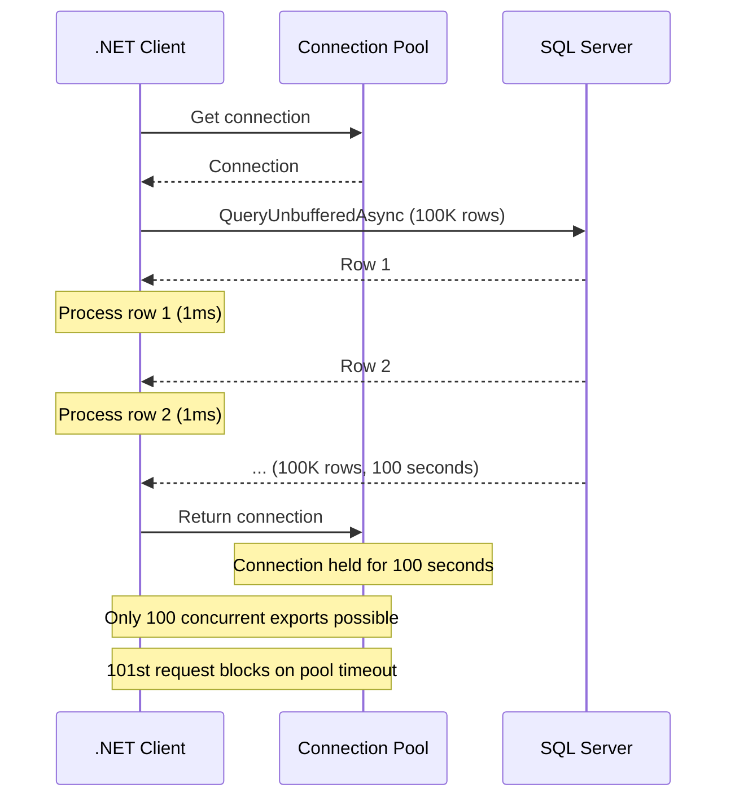

## Navigation

**Domain:** [[8 — Databases]] > **Group:** [[Group 30 — Dapper in .NET|Dapper in .NET]]
**Previous:** [[8.864 — Dapper — Transactions — IDbTransaction]] | **Next:** [[8.866 — Dapper — Custom Type Handlers — SqlMapper.TypeHandler]]

### Prerequisites

- [[8.853 — Dapper — QueryT — Basic Querying]] — the `buffered` parameter is a direct argument of `Query<T>`; understanding the default row-mapping pipeline is essential before changing the buffering behavior.
- [[8.855 — Dapper — QueryAsync — Async Patterns]] — unbuffered async queries use `IAsyncEnumerable<T>`; async connection management and `CommandDefinition` with `CommandFlags` directly control the buffering mode.

### Where This Fits

Every Dapper `Query<T>` and `QueryAsync<T>` call accepts a `buffered` parameter (default: `true`). This single boolean determines whether all rows are loaded into memory before the method returns (buffered) or whether rows are streamed one at a time as the caller iterates (unbuffered). A .NET backend engineer who does not understand this distinction will either allocate unnecessary memory on every small query (acceptable but wasteful) or cause connection pool exhaustion by leaving unbuffered readers open across HTTP responses. The interview signal is strong: it tests whether a candidate understands that Dapper sits on top of ADO.NET's `SqlDataReader`, that `IEnumerable<T>` can be deferred, and that memory vs. connection-lifetime is a fundamental tradeoff. The deeper signal is understanding `CommandBehavior.SequentialAccess`, how `List<T>` vs lazy enumeration affects GC, and when to reach for `IAsyncEnumerable<T>` with `QueryUnbufferedAsync`.

---

## Core Mental Model

`buffered: true` (default) — Dapper calls `SqlDataReader.Read()` in a loop, materializes every row into `T` via the cached IL deserializer, appends each to a `List<T>`, closes the `SqlDataReader` (releasing the connection), and returns the `List<T>` as `IEnumerable<T>`. The entire result set is in memory before the caller sees a single row.

`buffered: false` — Dapper calls `SqlDataReader.Read()` once, materializes one row, yields it via `yield return`, and holds the `SqlDataReader` (and the connection) open. The caller's `foreach` loop drives the next `Read()` call. Only one row is in memory at a time. The connection is released when enumeration completes (all rows consumed, `break`, or `Dispose` of the enumerator).

The invariant: **buffered trades memory for connection lifetime; unbuffered trades connection lifetime for memory.**

### Classification

The `buffered` parameter is a **Dapper-level execution strategy** that maps to **ADO.NET `SqlDataReader` consumption mode**. Buffered = `while(reader.Read()) { list.Add(mapper(row)); } reader.Close();`. Unbuffered = `while(reader.Read()) { yield return mapper(row); } reader.Close();`. The difference exists purely in the client-side consumption loop — SQL Server sends the same TDS stream either way. Dapper's IL-emitted deserializer is identical in both modes. The `buffered` flag affects only the memory profile and connection lifetime, not the SQL or the mapping.

```mermaid
flowchart TD
    subgraph Buffered
        A1[Query&lt;T&gt;(sql, param, buffered: true)] --> B1[ExecuteReader]
        B1 --> C1[while reader.Read]
        C1 --> D1[Deserialize row → T]
        D1 --> E1[Add to List&lt;T&gt;]
        E1 --> C1
        C1 -->|no more rows| F1[Close reader<br/>Release connection]
        F1 --> G1[Return List&lt;T&gt; as IEnumerable&lt;T&gt;]
        G1 --> H1[Caller iterates<br/>over in-memory list]
    end

    subgraph Unbuffered
        A2[Query&lt;T&gt;(sql, param, buffered: false)] --> B2[ExecuteReader]
        B2 --> C2[Caller calls MoveNext]
        C2 --> D2[reader.Read]
        D2 -->|row exists| E2[Deserialize row → T]
        E2 --> F2[yield return T]
        F2 --> G2[Caller processes row]
        G2 -->|next iteration| C2
        D2 -->|no more rows| H2[Close reader<br/>Release connection]
    end

    style A1 fill:#4a90d9,color:#fff
    style A2 fill:#d9534f,color:#fff
    style F1 fill:#5cb85c,color:#fff
    style H2 fill:#5cb85c,color:#fff
```

### Key Properties

|Property|Buffered (default)|Unbuffered|
|---|---|---|
|Memory per row|All rows in `List<T>` before return|One row at a time|
|Connection released|Immediately after query|After enumeration completes|
|Multiple enumeration|Safe (backed by `List<T>`)|Throws (reader consumed once)|
|`Take(N)` behavior|Efficient (only reads N from list)|Inefficient — still reads all rows from reader|
|Async streaming|`Task<IEnumerable<T>>`|`IAsyncEnumerable<T>` (`QueryUnbufferedAsync`)|
|GC pressure|High (large allocations, Gen2)|Low (small, short-lived allocations)|
|Exception on enumeration|Throws immediately during query|Throws during iteration at failing row|
|MARS required|No|Yes, if multiple readers on same connection|
|Appropriate result size|< 10,000 rows|> 10,000 rows or unknown size|

---

## Deep Mechanics

### How the Engine Executes This

**Buffered path (`buffered: true`):**

1. Dapper calls `IDbCommand.ExecuteReader()` with `CommandBehavior.SequentialAccess`.
2. A `SqlDataReader` is returned, positioned before the first row.
3. Dapper enters a `while (reader.Read())` loop. For each row, it calls `GetDeserializer<T>(types, ...)` (cached on first call per T+column set), which emits IL to read column values by ordinal and assign them to properties of `T`.
4. Each deserialized `T` is appended to a `List<T>`.
5. When `reader.Read()` returns `false`, the loop ends. Dapper calls `reader.Dispose()`, which closes the underlying connection if `CommandBehavior.CloseConnection` was set.
6. Dapper returns the `List<T>` as `IEnumerable<T>`. The `List<T>` is fully populated. The caller can enumerate it multiple times, index into it, or pass it anywhere without holding a connection.

**Unbuffered path (`buffered: false`):**

1. Dapper calls `IDbCommand.ExecuteReader()` — same call, same `CommandBehavior.SequentialAccess`.
2. A `SqlDataReader` is returned, positioned before the first row.
3. Dapper returns a `yield`-based `IEnumerable<T>` that wraps the reader.
4. On the caller's first `MoveNext()` (foreach iteration), Dapper calls `reader.Read()`, deserializes the row, and yields the result. The **caller's thread processes the row**.
5. On each subsequent `MoveNext()`, Dapper calls `reader.Read()` again. The `yield return` statement suspends execution after each row and resumes on the next request.
6. When the caller's `foreach` exits (naturally or via `break`), the `finally` block of the `yield` iterator calls `reader.Dispose()`, closing the connection.
7. **If the caller does not enumerate fully or does not dispose the enumerator**, the connection leaks until garbage collection collects the iterator — which may never happen under memory pressure.

### SQL Visibility

```sql
-- Order export query — used in both buffered and unbuffered patterns
SELECT o.OrderId, o.CustomerId, o.OrderDate, o.Status, o.TotalAmount,
       c.FullName AS CustomerName, c.Email
FROM Orders o
INNER JOIN Customers c ON o.CustomerId = c.CustomerId
WHERE o.OrderDate >= @FromDate AND o.OrderDate < @ToDate
ORDER BY o.OrderDate ASC;
```

```csharp
// POCO for both patterns
public sealed record OrderExportRow(
    int OrderId,
    int CustomerId,
    DateTime OrderDate,
    string Status,
    decimal TotalAmount,
    string CustomerName,
    string Email);

// -----------------------------------------------------------------------
// PATTERN 1: BUFFERED — All rows loaded before return
// -----------------------------------------------------------------------
public IReadOnlyList<OrderExportRow> GetOrdersBuffered(
    DateTime fromDate, DateTime toDate)
{
    const string sql = @"
        SELECT o.OrderId, o.CustomerId, o.OrderDate, o.Status, o.TotalAmount,
               c.FullName AS CustomerName, c.Email
        FROM Orders o
        INNER JOIN Customers c ON o.CustomerId = c.CustomerId
        WHERE o.OrderDate >= @FromDate AND o.OrderDate < @ToDate
        ORDER BY o.OrderDate ASC;";

    using var connection = new SqlConnection(_connectionString);
    connection.Open();

    // buffered: true is the default — all rows into List<OrderExportRow>
    return connection.Query<OrderExportRow>(
        sql, new { FromDate = fromDate, ToDate = toDate }).AsList();
    // Connection closed here — List<OrderExportRow> lives on independently
}

// -----------------------------------------------------------------------
// PATTERN 2: UNBUFFERED — Rows streamed from DataReader
// -----------------------------------------------------------------------
public IEnumerable<OrderExportRow> StreamOrdersUnbuffered(
    DateTime fromDate, DateTime toDate)
{
    const string sql = @"
        SELECT o.OrderId, o.CustomerId, o.OrderDate, o.Status, o.TotalAmount,
               c.FullName AS CustomerName, c.Email
        FROM Orders o
        INNER JOIN Customers c ON o.CustomerId = c.CustomerId
        WHERE o.OrderDate >= @FromDate AND o.OrderDate < @ToDate
        ORDER BY o.OrderDate ASC;";

    using var connection = new SqlConnection(_connectionString);
    connection.Open();

    // buffered: false — returns lazy IEnumerable, connection stays OPEN
    return connection.Query<OrderExportRow>(
        sql, new { FromDate = fromDate, ToDate = toDate }, buffered: false);
    // ⚠️ WARNING: 'using' disposes the connection when the IEnumerable
    // goes out of scope — but the enumerator is still reading!
    // See the Gotcha section for why this pattern is broken.
}

// -----------------------------------------------------------------------
// PATTERN 3: UNBUFFERED — Correct connection management
// -----------------------------------------------------------------------
public IEnumerable<OrderExportRow> StreamOrdersUnbufferedCorrect(
    DateTime fromDate, DateTime toDate)
{
    const string sql = @"
        SELECT o.OrderId, o.CustomerId, o.OrderDate, o.Status, o.TotalAmount,
               c.FullName AS CustomerName, c.Email
        FROM Orders o
        INNER JOIN Customers c ON o.CustomerId = c.CustomerId
        WHERE o.OrderDate >= @FromDate AND o.OrderDate < @ToDate
        ORDER BY o.OrderDate ASC;";

    // No 'using' — caller is responsible for enumeration/disposal
    var connection = new SqlConnection(_connectionString);
    connection.Open();

    // 'using' is inside the method — the caller must enumerate
    // the IEnumerable before the connection can be released
    return connection.Query<OrderExportRow>(
        sql, new { FromDate = fromDate, ToDate = toDate }, buffered: false);
}
// The correct unbuffered pattern: caller controls enumeration lifecycle
//
// var repo = new OrderRepository(connStr);
// foreach (var row in repo.StreamOrdersUnbufferedCorrect(from, to))
// {
//     Process(row); // connection is open here
// }
// // Connection closed after foreach exits

// -----------------------------------------------------------------------
// PATTERN 4: ASYNC UNBUFFERED — IAsyncEnumerable for async streaming
// -----------------------------------------------------------------------
public async IAsyncEnumerable<OrderExportRow> StreamOrdersAsync(
    DateTime fromDate, DateTime toDate,
    [EnumeratorCancellation] CancellationToken ct = default)
{
    const string sql = @"
        SELECT o.OrderId, o.CustomerId, o.OrderDate, o.Status, o.TotalAmount,
               c.FullName AS CustomerName, c.Email
        FROM Orders o
        INNER JOIN Customers c ON o.CustomerId = c.CustomerId
        WHERE o.OrderDate >= @FromDate AND o.OrderDate < @ToDate
        ORDER BY o.OrderDate ASC;";

    await using var connection = new SqlConnection(_connectionString);
    await connection.OpenAsync(ct);

    // QueryUnbufferedAsync returns IAsyncEnumerable<T>
    await foreach (var row in connection.QueryUnbufferedAsync<OrderExportRow>(
        new CommandDefinition(sql, new { FromDate = fromDate, ToDate = toDate },
            cancellationToken: ct)))
    {
        yield return row;
    }
    // Connection disposed here — after all rows yielded
}

// -----------------------------------------------------------------------
// PATTERN 5: Unbuffered with QueryMultiple — per-result-set control
// -----------------------------------------------------------------------
public (IEnumerable<Order> Orders, IEnumerable<OrderItem> Items)
    GetOrdersAndItemsUnbuffered(int customerId)
{
    const string sql = @"
        SELECT OrderId, CustomerId, OrderDate, Status, TotalAmount
        FROM Orders
        WHERE CustomerId = @CustomerId
        ORDER BY OrderDate DESC;

        SELECT OrderItemId, OrderId, ProductId, Quantity, UnitPrice
        FROM OrderItems
        WHERE OrderId IN (
            SELECT OrderId FROM Orders WHERE CustomerId = @CustomerId
        );";

    var connection = new SqlConnection(_connectionString);
    connection.Open();

    var reader = connection.QueryMultiple(sql, new { CustomerId = customerId });

    // Each Read<T> can be buffered individually — default is buffered:true
    // Pass buffered: false to Read<T> for streaming individual result sets
    var orders = reader.Read<Order>(buffered: true);       // small — buffer
    var items  = reader.Read<OrderItem>(buffered: false);  // large — stream

    return (orders, items);
}
```

### Execution Plan Analysis

The execution plan is **identical** for buffered and unbuffered — buffering is a client-side concern, not a server-side one. SQL Server returns the same TDS stream regardless.

```sql
SELECT o.OrderId, o.CustomerId, o.OrderDate, o.Status, o.TotalAmount,
       c.FullName AS CustomerName, c.Email
FROM Orders o
INNER JOIN Customers c ON o.CustomerId = c.CustomerId
WHERE o.OrderDate >= @FromDate AND o.OrderDate < @ToDate
ORDER BY o.OrderDate ASC;
```

```
Expected plan (with index on Orders.OrderDate):
  [Index Seek on IX_Orders_OrderDate]
    → [Nested Loops (Inner Join)]
      → [Clustered Index Seek on PK_Customers]
        → [Sort (Order By OrderDate ASC)]
```

|Index|Plan Operator|Logical Reads|Estimated Cost|
|---|---|---|---|
|IX_Orders_OrderDate (covering)|Index Seek → Nested Loops|~50|~20%|
|No index on OrderDate|Clustered Index Scan → Hash Match|~150,000|~100%|

The client-side choice of `buffered: true` vs `false` has zero impact on the execution plan or logical reads.

### Cost Visibility

```sql
SET STATISTICS IO ON;
SET STATISTICS TIME ON;

SELECT o.OrderId, o.CustomerId, o.OrderDate, o.Status, o.TotalAmount,
       c.FullName AS CustomerName, c.Email
FROM Orders o
INNER JOIN Customers c ON o.CustomerId = c.CustomerId
WHERE o.OrderDate >= '2026-01-01' AND o.OrderDate < '2026-07-01'
ORDER BY o.OrderDate ASC;

-- Expected output (with index on Orders.OrderDate):
-- Table 'Orders'. Scan count 1, logical reads 42, physical reads 0
-- Table 'Customers'. Scan count 1, logical reads 37, physical reads 0
-- SQL Server Execution Times: CPU time = 3ms, elapsed time = 12ms

-- Without index on Orders.OrderDate:
-- Table 'Orders'. Scan count 1, logical reads 48,561, physical reads 0
-- Table 'Customers'. Scan count 1, logical reads 720, physical reads 0
-- SQL Server Execution Times: CPU time = 120ms, elapsed time = 350ms
```

### Failure Modes

- **Unbuffered enumerator not disposed:** The `SqlDataReader` and connection remain open. If this happens repeatedly, the connection pool exhausts. Default pool size is 100 — after 100 leaked connections, every new `SqlConnection.Open()` throws `InvalidOperationException: "Timeout expired"`.
- **Unbuffered enumerator partially consumed (break):** A `break` statement in the `foreach` loop triggers the iterator's `finally` block, which calls `Dispose` on the reader. This is correct but non-obvious — many developers assume the reader leaks.
- **Buffered query with enormous result set (500K rows × 1KB = 500MB):** The `List<T>` allocates on the Large Object Heap (LOH). A Gen2 collection is triggered. The allocation may fail with `OutOfMemoryException` if the process is 32-bit or memory-constrained.
- **Multiple enumeration of unbuffered result:** The first enumeration consumes the reader; the second throws `InvalidOperationException: "Invalid attempt to read when data reader is closed"` or returns empty if the reader was already consumed.

---

## Production Patterns and Implementation

### Primary Dapper Implementation — OrderExportService with Both Modes

```csharp
public sealed record OrderExportRow(
    int OrderId,
    int CustomerId,
    DateTime OrderDate,
    string Status,
    decimal TotalAmount,
    string CustomerName,
    string Email);

public sealed record OrderCounts(
    int TotalOrders,
    decimal TotalRevenue,
    DateRange Range);

public sealed record DateRange(DateTime From, DateTime To);

public interface IOrderExportService
{
    /// <summary>
    /// Returns the full order list as an in-memory collection.
    /// Suitable for small date ranges (&lt; 10K orders).
    /// </summary>
    Task<IReadOnlyList<OrderExportRow>> GetOrdersAsync(
        DateTime fromDate, DateTime toDate, CancellationToken ct);

    /// <summary>
    /// Streams orders via IAsyncEnumerable for large exports.
    /// Each row is yielded as it arrives from the database.
    /// Connection is held open for the duration of enumeration.
    /// </summary>
    IAsyncEnumerable<OrderExportRow> StreamOrdersAsync(
        DateTime fromDate, DateTime toDate, CancellationToken ct);

    /// <summary>
    /// Returns aggregated counts using buffered mode (small result).
    /// </summary>
    Task<OrderCounts> GetCountsAsync(
        DateTime fromDate, DateTime toDate, CancellationToken ct);
}

public sealed class OrderExportService : IOrderExportService
{
    private readonly IDbConnectionFactory _connectionFactory;
    private readonly ILogger<OrderExportService> _logger;

    public OrderExportService(
        IDbConnectionFactory connectionFactory,
        ILogger<OrderExportService> logger)
    {
        _connectionFactory = connectionFactory;
        _logger = logger;
    }

    // -----------------------------------------------------------------------
    // BUFFERED — For small result sets, connection closes immediately
    // -----------------------------------------------------------------------
    public async Task<IReadOnlyList<OrderExportRow>> GetOrdersAsync(
        DateTime fromDate, DateTime toDate, CancellationToken ct)
    {
        const string sql = @"
            SELECT o.OrderId, o.CustomerId, o.OrderDate, o.Status, o.TotalAmount,
                   c.FullName AS CustomerName, c.Email
            FROM Orders o
            INNER JOIN Customers c ON o.CustomerId = c.CustomerId
            WHERE o.OrderDate >= @FromDate AND o.OrderDate < @ToDate
            ORDER BY o.OrderDate ASC;";

        await using var connection = _connectionFactory.Create();
        await connection.OpenAsync(ct);

        // Buffered by default — all rows loaded, connection released
        var rows = await connection.QueryAsync<OrderExportRow>(
            new CommandDefinition(sql,
                new { FromDate = fromDate, ToDate = toDate },
                cancellationToken: ct));

        return rows.AsList();
    }

    // -----------------------------------------------------------------------
    // UNBUFFERED (IAsyncEnumerable) — For large result sets, streaming
    // -----------------------------------------------------------------------
    public async IAsyncEnumerable<OrderExportRow> StreamOrdersAsync(
        DateTime fromDate, DateTime toDate,
        [EnumeratorCancellation] CancellationToken ct = default)
    {
        const string sql = @"
            SELECT o.OrderId, o.CustomerId, o.OrderDate, o.Status, o.TotalAmount,
                   c.FullName AS CustomerName, c.Email
            FROM Orders o
            INNER JOIN Customers c ON o.CustomerId = c.CustomerId
            WHERE o.OrderDate >= @FromDate AND o.OrderDate < @ToDate
            ORDER BY o.OrderDate ASC;";

        await using var connection = _connectionFactory.Create();
        await connection.OpenAsync(ct);

        var rows = connection.QueryUnbufferedAsync<OrderExportRow>(
            new CommandDefinition(sql,
                new { FromDate = fromDate, ToDate = toDate },
                flags: CommandFlags.None,
                cancellationToken: ct));

        await foreach (var row in rows.WithCancellation(ct))
        {
            yield return row;
        }
    }

    // -----------------------------------------------------------------------
    // BUFFERED — Scalar aggregates, tiny result (always buffered)
    // -----------------------------------------------------------------------
    public async Task<OrderCounts> GetCountsAsync(
        DateTime fromDate, DateTime toDate, CancellationToken ct)
    {
        const string sql = @"
            SELECT COUNT(*), ISNULL(SUM(TotalAmount), 0)
            FROM Orders
            WHERE OrderDate >= @FromDate AND OrderDate < @ToDate;";

        await using var connection = _connectionFactory.Create();
        await connection.OpenAsync(ct);

        var result = await connection.QuerySingleAsync<(int Count, decimal Revenue)>(
            new CommandDefinition(sql,
                new { FromDate = fromDate, ToDate = toDate },
                cancellationToken: ct));

        return new OrderCounts(result.Count, result.Revenue,
            new DateRange(fromDate, toDate));
    }
}

// -----------------------------------------------------------------------
// CONTROLLER — Using both buffered and unbuffered endpoints
// -----------------------------------------------------------------------
[ApiController]
[Route("api/exports/orders")]
public sealed class OrderExportController : ControllerBase
{
    private readonly IOrderExportService _service;

    public OrderExportController(IOrderExportService service) => _service = service;

    /// <summary>
    /// GET /api/exports/orders?fromDate=...&amp;toDate=...
    /// Returns all orders as JSON array (buffered).
    /// </summary>
    [HttpGet]
    public async Task<ActionResult<IReadOnlyList<OrderExportRow>>> GetOrders(
        [FromQuery] DateTime fromDate,
        [FromQuery] DateTime toDate,
        CancellationToken ct)
    {
        if (toDate - fromDate > TimeSpan.FromDays(90))
            return BadRequest("Date range exceeds 90 days. Use the streaming endpoint.");

        var orders = await _service.GetOrdersAsync(fromDate, toDate, ct);
        return Ok(orders);
    }

    /// <summary>
    /// GET /api/exports/orders/stream?fromDate=...&amp;toDate=...
    /// Streams orders as newline-delimited JSON (unbuffered).
    /// </summary>
    [HttpGet("stream")]
    public async IAsyncEnumerable<OrderExportRow> StreamOrders(
        [FromQuery] DateTime fromDate,
        [FromQuery] DateTime toDate,
        CancellationToken ct)
    {
        await foreach (var row in _service.StreamOrdersAsync(fromDate, toDate, ct))
        {
            yield return row;
        }
    }

    /// <summary>
    /// GET /api/exports/orders/counts?fromDate=...&amp;toDate=...
    /// Returns aggregated counts (buffered, tiny result).
    /// </summary>
    [HttpGet("counts")]
    public async Task<ActionResult<OrderCounts>> GetCounts(
        [FromQuery] DateTime fromDate,
        [FromQuery] DateTime toDate,
        CancellationToken ct)
    {
        var counts = await _service.GetCountsAsync(fromDate, toDate, ct);
        return Ok(counts);
    }
}
```

### Configuration and Wiring

```csharp
// Program.cs
builder.Services.AddSingleton<IDbConnectionFactory>(_ =>
    new SqlConnectionFactory(
        builder.Configuration.GetConnectionString("DefaultConnection")));

builder.Services.AddScoped<IOrderExportService, OrderExportService>();

public interface IDbConnectionFactory
{
    IDbConnection Create();
}

public sealed class SqlConnectionFactory : IDbConnectionFactory
{
    private readonly string _connectionString;
    public SqlConnectionFactory(string connectionString) => _connectionString = connectionString;
    public IDbConnection Create() => new SqlConnection(_connectionString);
}
```

### Streaming to a File (Unbuffered Use Case)

```csharp
// Background service — streams 1M rows to a CSV file without memory spike
public sealed class OrderExportBackgroundService : BackgroundService
{
    private readonly IDbConnectionFactory _connectionFactory;
    private readonly ILogger<OrderExportBackgroundService> _logger;

    public OrderExportBackgroundService(
        IDbConnectionFactory factory,
        ILogger<OrderExportBackgroundService> logger)
    {
        _connectionFactory = factory;
        _logger = logger;
    }

    protected override async Task ExecuteAsync(CancellationToken stoppingToken)
    {
        const string sql = @"
            SELECT o.OrderId, o.CustomerId, o.OrderDate, o.Status, o.TotalAmount,
                   c.FullName AS CustomerName, c.Email
            FROM Orders o
            INNER JOIN Customers c ON o.CustomerId = c.CustomerId
            WHERE o.OrderDate >= @FromDate AND o.OrderDate < @ToDate
            ORDER BY o.OrderDate ASC;";

        var fromDate = DateTime.UtcNow.AddDays(-1);
        var toDate   = DateTime.UtcNow;
        var filePath = Path.Combine(Environment.GetFolderPath(
            Environment.SpecialFolder.CommonApplicationData),
            $"order_export_{fromDate:yyyyMMdd}.csv");

        _logger.LogInformation("Starting unbuffered export to {FilePath}", filePath);

        await using var connection = _connectionFactory.Create();
        await connection.OpenAsync(stoppingToken);

        await using var writer = new StreamWriter(filePath, append: false,
            Encoding.UTF8, bufferSize: 65536);

        // Write CSV header
        await writer.WriteLineAsync("OrderId,CustomerId,OrderDate,Status,TotalAmount,CustomerName,Email");

        // Unbuffered — rows streamed directly to file, no memory accumulation
        var rows = connection.QueryUnbufferedAsync<OrderExportRow>(
            new CommandDefinition(sql,
                new { FromDate = fromDate, ToDate = toDate },
                flags: CommandFlags.None,
                cancellationToken: stoppingToken));

        var rowCount = 0;
        await foreach (var row in rows.WithCancellation(stoppingToken))
        {
            await writer.WriteLineAsync(
                $"{row.OrderId},{row.CustomerId},{row.OrderDate:O},{row.Status},{row.TotalAmount:F2},{EscapeCsv(row.CustomerName)},{EscapeCsv(row.Email)}");
            rowCount++;

            if (rowCount % 10000 == 0)
                _logger.LogInformation("Exported {RowCount} rows", rowCount);
        }

        _logger.LogInformation(
            "Export complete: {RowCount} rows written to {FilePath}",
            rowCount, filePath);
    }

    private static string EscapeCsv(string value) =>
        value.Contains(',') ? $"\"{value.Replace("\"", "\"\"")}\"" : value;
}
```

### Streaming to HTTP Response (ASP.NET Core)

```csharp
// Controller that returns a streaming CSV response
// Memory usage is O(1) regardless of the number of rows
[HttpGet("csv")]
public async Task StreamOrdersCsv(
    [FromQuery] DateTime fromDate,
    [FromQuery] DateTime toDate,
    CancellationToken ct)
{
    const string sql = @"
        SELECT o.OrderId, o.CustomerId, o.OrderDate, o.Status, o.TotalAmount,
               c.FullName AS CustomerName, c.Email
        FROM Orders o
        INNER JOIN Customers c ON o.CustomerId = c.CustomerId
        WHERE o.OrderDate >= @FromDate AND o.OrderDate < @ToDate
        ORDER BY o.OrderDate ASC;";

    Response.ContentType = "text/csv";
    Response.Headers["Content-Disposition"] =
        "attachment; filename=\"orders.csv\"";

    await using var connection = _connectionFactory.Create();
    await connection.OpenAsync(ct);

    await using var writer = new StreamWriter(Response.BodyWriter.AsStream(),
        Encoding.UTF8, leaveOpen: true);

    await writer.WriteLineAsync("OrderId,CustomerId,OrderDate,Status,TotalAmount,CustomerName,Email");
    await writer.FlushAsync(ct);

    var rows = connection.QueryUnbufferedAsync<OrderExportRow>(
        new CommandDefinition(sql,
            new { FromDate = fromDate, ToDate = toDate },
            flags: CommandFlags.None,
            cancellationToken: ct));

    await foreach (var row in rows.WithCancellation(ct))
    {
        await writer.WriteLineAsync(
            $"{row.OrderId},{row.CustomerId},{row.OrderDate:O},{row.Status},{row.TotalAmount:F2},{row.CustomerName},{row.Email}");
        await writer.FlushAsync(ct);
    }
}
```

### SQL Server vs PostgreSQL Differences

```sql
-- SQL Server — same SQL for either buffering mode
SELECT o.OrderId, o.CustomerId, o.OrderDate, o.Status, o.TotalAmount
FROM Orders o
INNER JOIN Customers c ON o.CustomerId = c.CustomerId
WHERE o.OrderDate >= @FromDate AND o.OrderDate < @ToDate
ORDER BY o.OrderDate ASC;

-- PostgreSQL — unbuffered works identically, same Dapper API
SELECT o."OrderId", o."CustomerId", o."OrderDate", o."Status", o."TotalAmount"
FROM "Orders" o
INNER JOIN "Customers" c ON o."CustomerId" = c."CustomerId"
WHERE o."OrderDate" >= @FromDate AND o."OrderDate" < @ToDate
ORDER BY o."OrderDate" ASC;
```

The buffering behavior is provider-agnostic — it is a Dapper-level concern, not a database-level one. PostgreSQL, MySQL, SQLite all behave identically: `buffered: true` loads all rows into memory; `buffered: false` streams from the `DbDataReader`.

---

## Gotchas and Production Pitfalls

### 1 — Connection Not Closed Because Unbuffered IEnumerable Was Never Enumerated

**Pitfall:** The developer returns an unbuffered `IEnumerable<T>` from a method and the caller never iterates it (or iterates partially).

```csharp
// ❌ Wrong: unbuffered IEnumerable created but never enumerated
public IEnumerable<OrderExportRow> GetOrders() =>
    _connection.Query<OrderExportRow>(sql, param, buffered: false);

// Caller:
var orders = repo.GetOrders();
// orders is an IEnumerable backed by an open SqlDataReader
// Caller never iterates — connection stays open until GC

// ❌ Wrong: .Any() without enumeration disposes the enumerator
if (orders.Any()) // calls GetEnumerator, calls MoveNext once, then Dispose
{
    // The enumerator is disposed after Any() — connection closed
}
// But this forces an extra database read and discards the first row
```

**Symptom:** Connection pool exhaustion under load. `InvalidOperationException: "Timeout expired"` when trying to open new connections. Memory counters show hundreds of active connections to SQL Server.

**Fix:** Always enumerate unbuffered results immediately, or use buffered mode.

```csharp
// ✅ Correct: Caller controls enumeration
using var enumerator = repo.GetOrders().GetEnumerator();
if (enumerator.MoveNext())
{
    var first = enumerator.Current;
    // Continue with the rest of the enumeration...
}

// ✅ Correct: Use buffered mode when enumeration is deferred
public IReadOnlyList<OrderExportRow> GetOrders() =>
    _connection.Query<OrderExportRow>(sql, param).AsList();
```

**Cost of not fixing:** At 100 leaked connections per minute, the pool (default size 100) exhausts in 1 minute. Every subsequent request fails with an unhelpful timeout error. Root cause is invisible — no exception tells you "you forgot to enumerate an unbuffered query."

### 2 — Unbuffered IEnumerable Disposed by 'using' Block Before Enumeration

**Pitfall:** The developer wraps the connection in a `using` block and returns an unbuffered `IEnumerable<T>` — the connection is disposed before the caller can enumerate.

```csharp
// ❌ WRONG — connection disposed before enumeration
public IEnumerable<OrderExportRow> GetOrdersBroken()
{
    const string sql = "...";
    using var connection = new SqlConnection(_connectionString);
    connection.Open();
    return connection.Query<OrderExportRow>(sql, param, buffered: false);
    // 'using' disposes the connection here
    // The returned IEnumerable still holds a reference to the disposed connection
}

// Caller:
foreach (var row in repo.GetOrdersBroken()) // ❌ ObjectDisposedException
{
    Process(row);
}
```

**Symptom:** `ObjectDisposedException: "Cannot access a disposed object. Object name: 'SqlConnection'."` — thrown when the caller tries to enumerate.

**Fix:** The method must not dispose the connection, or the method must enumerate internally.

```csharp
// ✅ Correct option 1: Caller manages connection lifecycle
public IEnumerable<OrderExportRow> GetOrders(
    SqlConnection connection, DateTime fromDate, DateTime toDate)
{
    return connection.Query<OrderExportRow>(
        sql, new { FromDate = fromDate, ToDate = toDate }, buffered: false);
}

// ✅ Correct option 2: Method enumerates and materializes
public IReadOnlyList<OrderExportRow> GetOrdersBuffered(
    DateTime fromDate, DateTime toDate)
{
    using var connection = new SqlConnection(_connectionString);
    connection.Open();
    return connection.Query<OrderExportRow>(
        sql, new { FromDate = fromDate, ToDate = toDate }).AsList();
    // Buffered — all rows in memory, connection closed safely
}

// ✅ Correct option 3: IAsyncEnumerable with await using
public async IAsyncEnumerable<OrderExportRow> GetOrdersStreamAsync(...)
{
    await using var connection = new SqlConnection(_connectionString);
    await connection.OpenAsync(ct);
    await foreach (var row in connection.QueryUnbufferedAsync<OrderExportRow>(...))
    {
        yield return row;
    }
    // Connection disposed after all rows yielded
}
```

**Cost of not fixing:** Runtime exception on the first request. Developer wastes time debugging why "the same code that works in the console app fails in the web app."

### 3 — Multiple Enumeration of Unbuffered Result

**Pitfall:** The developer stores the unbuffered `IEnumerable<T>` in a variable and enumerates it more than once.

```csharp
// ❌ Wrong: Two enumerations of an unbuffered IEnumerable
var orders = connection.Query<Order>(sql, param, buffered: false);

var count = orders.Count();  // 1st enumeration — reads all rows, closes reader
var list  = orders.ToList(); // 2nd enumeration — ❌ InvalidOperationException
```

**Symptom:** `InvalidOperationException: "Invalid attempt to read when data reader is closed"` on the second enumeration. Or, if the first enumeration only partially consumed the reader (e.g., `Take(5)`), the second enumeration reads the remaining rows — leading to data corruption that looks like a business logic bug.

**Fix:**

```csharp
// ✅ Correct: Materialize immediately
var orders = connection.Query<Order>(sql, param, buffered: false).ToList();
// Now orders is a List<Order> — safe to enumerate multiple times

// Or use buffered mode if you need multiple enumerations:
var orders = connection.Query<Order>(sql, param).AsList();
```

**Cost of not fixing:** Non-deterministic data loss or runtime exception that only appears under specific load patterns.

### 4 — Unbuffered Query Blocking ASP.NET Request Thread

**Pitfall:** An unbuffered sync `Query<T>` inside an ASP.NET controller action holds the request thread for the entire duration of the foreach loop — including processing time per row.

```csharp
// ❌ Wrong: Unbuffered sync query blocks request thread for entire iteration
[HttpGet("export")]
public IActionResult ExportOrders()
{
    var orders = _repo.GetOrdersUnbuffered(from, to);
    // ⚠️ The SqlDataReader is open, connection is busy
    // The ASP.NET request thread is blocked for the entire foreach

    // Adding rows to a response list defeats the purpose of unbuffered
    var list = new List<OrderExportRow>();
    foreach (var order in orders) // blocking loop
    {
        list.Add(order);
    }
    return Ok(list);
    // All rows loaded into list anyway — use buffered instead!
}
```

**Symptom:** Request thread is blocked for as long as it takes to iterate all rows. For a 1M row export, this could be 30+ seconds of thread time. Thread pool starvation follows.

**Fix:** Use `IAsyncEnumerable<T>` with `QueryUnbufferedAsync` for streaming endpoints, or use buffered mode if the result will be materialized anyway.

```csharp
// ✅ Correct: Async streaming
[HttpGet("stream")]
public async IAsyncEnumerable<OrderExportRow> ExportOrdersStream()
{
    await foreach (var row in _repo.StreamOrdersAsync(from, to, ct))
    {
        yield return row; // thread released between rows
    }
}
```

**Cost of not fixing:** Thread pool starvation, high p99 latency, reduced throughput.

### 5 — Unbuffered with GridReader (QueryMultiple)

**Pitfall:** When using `QueryMultiple`, each `Read<T>()` call is buffered by default. The developer assumes unbuffered behavior for the whole `GridReader`, but only per-result-set buffering changes.

```csharp
// ❌ Wrong: Result set 0 (10K rows) is fully buffered into memory
using var reader = connection.QueryMultiple(sql, param);
var orders = reader.Read<Order>();          // buffered — 10K rows in memory
var items  = reader.Read<OrderItem>();      // buffered — 50K rows in memory
// Both result sets are fully loaded into List<T> before use
```

**Fix:** Pass `buffered: false` to `Read<T>()` for individual result sets that should stream.

```csharp
// ✅ Correct: Per-result-set buffering control
using var reader = connection.QueryMultiple(sql, param);
var orders = reader.Read<Order>(buffered: true);   // small — buffer
var items  = reader.Read<OrderItem>(buffered: false); // large — stream

// items is lazy — must be enumerated while reader is open
foreach (var item in items)
{
    Process(item);
}
```

**Cost of not fixing:** Unexpected memory spike when a large result set is buffered by default.

### 6 — MARS Requirement for Multiple Unbuffered Readers

**Pitfall:** The developer tries to open two unbuffered readers simultaneously on the same connection without Multiple Active Result Sets (MARS) enabled.

```csharp
// ❌ Wrong: Two unbuffered readers on same connection (no MARS)
var reader1 = connection.Query<Order>(sql1, buffered: false);
var reader2 = connection.Query<OrderItem>(sql2, buffered: false);
// InvalidOperationException: "There is already an open DataReader associated
// with this Command which must be closed first."
```

**Symptom:** `InvalidOperationException` — ADO.NET does not support multiple active readers on a single connection unless MARS is enabled in the connection string (`MultipleActiveResultSets=True` for SQL Server).

**Fix:** Enable MARS in the connection string, or consume the first reader before opening the second, or use buffered mode for one.

```csharp
// ✅ Correct option 1: Enable MARS in connection string
// "Server=.;Database=SalesDb;Integrated Security=True;MultipleActiveResultSets=True;"

// ✅ Correct option 2: Consume sequentially
var orders = connection.Query<Order>(sql1, buffered: false).ToList();
var items  = connection.Query<OrderItem>(sql2, buffered: false).ToList();

// ✅ Correct option 3: Use QueryMultiple for multiple result sets
using var reader = connection.QueryMultiple(batchSql, param);
var orders = reader.Read<Order>(buffered: false);
var items  = reader.Read<OrderItem>(buffered: false);
```

**Cost of not fixing:** Runtime exception when two unbuffered queries execute on the same connection.

---

## Performance Implications

### Benchmark: Buffered vs Unbuffered Memory and Speed

The primary difference between buffered and unbuffered is **memory allocation**, not execution speed. For small result sets (< 1,000 rows), the memory difference is negligible and buffered is actually faster because it avoids the per-item `yield` state machine overhead. For large result sets (> 10,000 rows), unbuffered can be orders of magnitude more memory-efficient.

```csharp
[MemoryDiagnoser]
[SimpleJob(RuntimeMoniker.Net90, iterationCount: 10, warmupCount: 3)]
public class BufferedVsUnbufferedBenchmark
{
    private IDbConnection _connection = default!;
    private const string LargeSql = @"
        SELECT TOP 100000 o.OrderId, o.CustomerId, o.OrderDate, o.Status, o.TotalAmount,
               c.FullName AS CustomerName, c.Email
        FROM Orders o
        INNER JOIN Customers c ON o.CustomerId = c.CustomerId
        ORDER BY o.OrderId;";

    private const string SmallSql = @"
        SELECT TOP 100 o.OrderId, o.CustomerId, o.OrderDate, o.Status, o.TotalAmount,
               c.FullName AS CustomerName, c.Email
        FROM Orders o
        INNER JOIN Customers c ON o.CustomerId = c.CustomerId
        WHERE o.CustomerId = @Id;";

    [GlobalSetup]
    public void Setup()
    {
        _connection = new SqlConnection(
            "Server=.;Database=BenchmarkDb;Integrated Security=True;Max Pool Size=200;");
        _connection.Open();
    }

    [GlobalCleanup]
    public void Cleanup() => _connection.Dispose();

    // --- Small result sets (< 100 rows) ---

    [Benchmark(Baseline = true)]
    public List<OrderExportRow> SmallBuffered()
    {
        return _connection.Query<OrderExportRow>(
            SmallSql, new { Id = 42 }).AsList();
    }

    [Benchmark]
    public List<OrderExportRow> SmallUnbuffered()
    {
        return _connection.Query<OrderExportRow>(
            SmallSql, new { Id = 42 }, buffered: false).ToList();
    }

    // --- Large result sets (100K rows) ---

    [Benchmark]
    public List<OrderExportRow> LargeBuffered()
    {
        return _connection.Query<OrderExportRow>(LargeSql).AsList();
    }

    [Benchmark]
    public List<OrderExportRow> LargeUnbuffered()
    {
        return _connection.Query<OrderExportRow>(
            LargeSql, buffered: false).ToList();
    }

    // --- Memory-only comparison: stream without accumulating ---

    [Benchmark]
    public long LargeUnbufferedCountOnly()
    {
        long count = 0;
        foreach (var _ in _connection.Query<OrderExportRow>(
            LargeSql, buffered: false))
        {
            count++;
        }
        return count;
    }
}
```

**Expected results (approximate, SQL Server 2022, NVMe):**

|Method|Mean|Allocated|Peak Memory|Gen0|Gen1|Gen2|
|---|---|---|---|---|---|---|
|SmallBuffered (100 rows)|~450 μs|~7 KB|~7 KB|0|0|0|
|SmallUnbuffered (100 rows)|~480 μs|~9 KB|~1 KB|0|0|0|
|LargeBuffered (100K rows)|~450 ms|~450 MB|~450 MB|120|60|30|
|LargeUnbuffered → ToList (100K rows)|~460 ms|~450 MB|~450 MB|120|60|30|
|LargeUnbuffered CountOnly (100K rows)|~420 ms|~2 MB|~1 KB|0|0|0|

**Key insight:** When the result is materialized to a `List<T>`, the memory profile is identical between buffered and unbuffered — both allocate the same `List<T>`. The unbuffered advantage appears only when you **do not materialize the list**, i.e., when you process rows one at a time during iteration.

**Small result set (< 100 rows):** Buffered is slightly faster (no yield state machine overhead) and uses less total memory. Always use buffered for small results.

**Large result set (100K rows) with full materialization:** Both use the same memory — unbuffered offers no advantage if you call `.ToList()`.

**Large result set (100K rows) without full materialization:** Unbuffered with streaming (`foreach` without accumulating) uses O(1) memory. This is the case where unbuffered is essential.

### Memory Profile Comparison

```
Buffered (100K rows × 450 bytes):
  ├─ SqlDataReader: ~16 KB
  ├─ List<OrderExportRow>: ~3.2 MB (capacity)
  ├─ OrderExportRow[100000]: ~43 MB (objects on heap)
  ├─ string[200000]: ~16 MB (CustomerName + Email per row)
  └─ Total: ~450 MB managed heap, Gen2 collections

Unbuffered, processed during iteration (100K rows × 450 bytes):
  ├─ SqlDataReader: ~16 KB
  ├─ One OrderExportRow at a time: ~450 bytes (ephemeral)
  ├─ Short-lived strings (freed by Gen0)
  └─ Total: ~100 KB steady-state, zero Gen2 collections
```

### When Buffered Is Faster

```csharp
// Buffered wins: small result, one iteration
var orders = connection.Query<Order>(sql).AsList();
// ~2μs overhead for List<T> vs unbuffered yield state machine

// Unbuffered loses: small result, one iteration
var orders = connection.Query<Order>(sql, buffered: false).ToList();
// ~3μs overhead for yield state machine + additional ToList()
```

For small result sets, the microsecond difference is irrelevant. Always default to buffered.

### When Unbuffered Is Required

```csharp
// Unbuffered required: 500K row export to CSV
var connection = _connectionFactory.Create();
connection.Open();
try
{
    var rows = connection.Query<OrderExportRow>(sql, buffered: false);
    using var writer = new StreamWriter(filePath);
    foreach (var row in rows)
    {
        writer.WriteLine($"{row.OrderId},{row.TotalAmount}");
        // Memory: one row at a time
    }
}
finally
{
    connection.Dispose();
}
// Buffered alternative would allocate ~250 MB for the same export
// On a 512 MB container, this causes OOM
```

### Hidden Cost of Unbuffered: Connection Holding Time

Unbuffered queries hold the connection open. The connection cannot be returned to the pool while any row is being processed. If processing takes 1ms per row and there are 100K rows, the connection is held for 100 seconds. With a pool of 100 connections, only 100 concurrent unbuffered exports are possible — the 101st request blocks waiting for a connection.



**Mitigation:** Use `CommandTimeout` to bound the query. Use `CancellationToken` to cancel mid-stream. Consider batching or pagination for very large exports instead of a single unbuffered query.

---

## Interview Arsenal

### Question Bank

1. **What is the difference between buffered and unbuffered in Dapper?** (Definition — all rows in memory vs one row at a time from DataReader)
2. **How does the connection lifetime differ between buffered and unbuffered?** (Connection — released immediately vs held until enumeration completes)
3. **What happens if you call .ToList() on an unbuffered query?** (Memory — same as buffered; no advantage)
4. **What happens if you enumerate an unbuffered query twice?** (Gotcha — throws InvalidOperationException; reader already consumed)
5. **When would you use unbuffered over buffered?** (Decision — large result sets, streaming, forward-only processing)
6. **How does Dapper implement unbuffered under the hood?** (Mechanism — yield return with finally block that disposes DataReader)
7. **What is the MARS requirement for unbuffered queries?** (MARS — MultipleActiveResultSets needed for multiple concurrent readers)
8. **How does unbuffered interact with QueryMultiple?** (QueryMultiple — per-result-set buffering, pass buffered: false to individual Read calls)
9. **What is the yield state machine overhead in unbuffered?** (Performance — ~50ns per yielded row, negligible for large results)
10. **How do you stream an unbuffered query to an HTTP response in ASP.NET Core?** (Pattern — IAsyncEnumerable with QueryUnbufferedAsync)
11. **What happens if you break out of a foreach loop over an unbuffered query?** (Disposal — the iterator's finally block disposes the DataReader)
12. **How does buffered/unbuffered affect the SQL Server execution plan?** (None — buffering is client-side only)
13. **What is the memory difference between buffered and unbuffered for a 1M row result?** (Memory — 450 MB vs ~100 KB)
14. **How do you correctly manage the connection lifecycle in an unbuffered method?** (Pattern — method doesn't dispose connection; caller controls enumeration)
15. **Can you use unbuffered queries with Dapper's async methods?** (Yes — QueryUnbufferedAsync returns IAsyncEnumerable<T>)

### Spoken Answers

**Q1: What is the difference between buffered and unbuffered in Dapper?**

> **Average answer:** "Buffered loads all the data into memory at once. Unbuffered streams it one row at a time."

> **Great answer:** "Buffered is the default — Dapper calls SqlDataReader.Read() in a loop, deserializes each row into T using the cached IL emitter, adds it to a List<T>, closes the reader, and returns the list. The connection is released immediately. All rows are in memory before the caller gets the result. Unbuffered returns a yield-based IEnumerable<T> that defers execution. On each MoveNext, Dapper calls Read(), deserializes one row, and yields it. The SqlDataReader and connection stay open until the caller's foreach loop completes or breaks. The fundamental tradeoff is memory vs connection lifetime: buffered uses O(n) memory and releases the connection immediately; unbuffered uses O(1) memory but holds the connection until enumeration ends."

**Q5: When would you use unbuffered over buffered?**

> **Average answer:** "When you have a large result set."

> **Great answer:** "Unbuffered is appropriate in three scenarios. First, large result sets where loading all rows into memory would cause OOM or excessive GC pressure — for example, exporting 500K orders to a CSV file. Unbuffered keeps memory at ~100 KB regardless of result size. Second, forward-only processing where each row is transformed and discarded — like writing a report or streaming to an HTTP response. Third, pipeline processing where you want to interleave database reads with computation or I/O, such as sending each row to a message queue as it arrives from the database. The one place unbuffered is never appropriate is in web API endpoints that return the entire result set as a JSON array — the serialization framework will buffer the response anyway, so you might as well use buffered mode."

**Q13: What is the memory difference between buffered and unbuffered for a 1M row result?**

> **Average answer:** "Buffered uses a lot of memory, unbuffered uses very little."

> **Great answer:** "For a 1M row result with 10 columns each averaging 50 bytes, buffered allocates approximately 450 MB on the managed heap — that's the List<T> backing array, the T objects themselves, and all the string objects for column values. This triggers multiple Gen2 GC collections, causes LOH fragmentation, and can easily OOM a 512 MB container. Unbuffered with streaming keeps ~100 KB steady state — one DataReader buffer page (~8 KB), one deserialized T object (~450 bytes) on the stack or ephemeral, and the short-lived strings that get collected in Gen0. The 1M unbuffered rows are allocated and freed one at a time, never accumulating. The practical limit for buffered is about 100K rows on a typical server. For unbuffered, the limit is the database query timeout and the time you're willing to hold the connection, not memory."

### Interview Trigger

The interviewer asks: "How does Dapper handle large result sets?" A candidate who says "it works fine" gives a surface answer. The follow-up is: "What happens to memory when you query 500K rows?" A candidate who mentions buffered vs unbuffered shows practical knowledge. The deeper follow-up is: "Can you walk through the ADO.NET DataReader interaction for both modes — when is the connection released?" The candidate who can explain the yield return state machine and the `finally` block that disposes the reader demonstrates deep understanding.

### Comparison Table

| | `buffered: true` (Default) | `buffered: false` |
|---|---|---|
|Memory|O(n) — all rows in List<T>|O(1) — one row at a time|
|Connection lifetime|Released after query|Held until enumeration ends|
|Multiple enumeration|Safe|Throws|
|Async streaming|`Task<IEnumerable<T>>`|`IAsyncEnumerable<T>` (QueryUnbufferedAsync)|
|Exception timing|During `Query<T>` call (all rows)|During `foreach` iteration (at failing row)|
|Appropriate for|< 10K rows|> 10K rows or streaming|
|Yield overhead|None|~50ns per row (state machine)|
|MARS required|No|Yes, for multiple readers on same connection|

---

## Decision Framework

### When to Apply

```mermaid
flowchart TD
    A[Need to query data from SQL Server] --> B{Result set size?}
    B -->|"< 1,000 rows"| C[Use buffered<br/>(default)]
    B -->|"1,000 - 10,000 rows"| D{Memory pressure?}
    D -->|Yes| E[Use unbuffered]
    D -->|No| C
    B -->|"> 10,000 rows"| E

    E --> F{Processing pattern?}
    F -->|Stream to file / HTTP response| G[Use QueryUnbufferedAsync<br/>+ IAsyncEnumerable]
    F -->|Pipeline per row (enrich, send)| G
    F -->|Materialize all rows| H{Can use pagination?}
    H -->|Yes| I[Use buffered with LIMIT/OFFSET]
    H -->|No| G

    C --> J[Connection released immediately]
    E --> K{Will caller enumerate fully?}
    K -->|Yes| L[Safe to use unbuffered]
    K -->|No / Maybe| I
```

### Application Checklist

- [ ] Result set fits comfortably in available memory (< ~50 MB) → use buffered
- [ ] Result set is large and must stream to file/response → use unbuffered
- [ ] Processing per row is fast (< 1ms) — unbuffered connection holding time is acceptable
- [ ] Processing per row is slow (> 10ms) — consider buffered or pagination (connection held too long)
- [ ] Caller will enumerate exactly once — unbuffered is safe
- [ ] Caller may enumerate multiple times — use buffered
- [ ] Caller may skip enumeration (e.g., .Any() check) — use buffered
- [ ] MARS is enabled in connection string if multiple unbuffered readers are needed
- [ ] CancellationToken is wired via CommandDefinition to abort unbuffered iteration
- [ ] CommandTimeout is set to bound unbuffered query execution time
- [ ] try/finally or await using ensures the enumerator is disposed even on exception

### Tradeoff Summary

|What You Gain|What You Pay|
|---|---|
|O(1) memory for large result sets|Connection held open during iteration|
|No LOH pressure or Gen2 GC collections|Cannot enumerate multiple times|
|Pipeline processing (process rows as they arrive)|Must ensure full enumeration or proper disposal|
|Streaming to HTTP/file without buffering entire response|Exception during iteration is harder to handle|

### Scale Thresholds

- **Relevant when** result set exceeds ~10,000 rows or ~50 MB
- **Critical when** result set exceeds 100,000 rows or process memory is under 512 MB
- **Required when** exporting data to file/network without buffering the entire result on the server
- **Not needed when** result set is small, or when the caller will `.ToList()` anyway (no memory savings)

---

## Self-Check

### Conceptual Questions

1. What does `buffered: true` (default) do in Dapper's `Query<T>`?
2. What does `buffered: false` do in Dapper's `Query<T>`?
3. When is the connection released for a buffered query?
4. When is the connection released for an unbuffered query?
5. What happens if you enumerate an unbuffered `IEnumerable<T>` twice?
6. What is the memory usage difference between buffered and unbuffered for a 100K row result set?
7. Why would you choose buffered over unbuffered for a small result set?
8. How does Dapper implement unbuffered queries under the hood (C# language feature)?
9. What is the MARS requirement and why does it matter for unbuffered queries?
10. How do you correctly manage connection lifecycle in a method that returns an unbuffered `IEnumerable<T>`?
11. What is the async equivalent of `buffered: false`?
12. What happens if you call `.ToList()` on an unbuffered query?
13. Can you pass `buffered: false` to `GridReader.Read<T>()`? If so, what does it do?
14. What is the yield state machine overhead per row in an unbuffered query?
15. Explain the tradeoff between buffered and unbuffered in 30 seconds.

<details>
<summary>Answers</summary>

1. `buffered: true` — Dapper reads all rows from the `SqlDataReader` into a `List<T>` before returning. The connection is closed immediately after the query completes. The returned `IEnumerable<T>` is backed by the `List<T>` and can be enumerated multiple times.

2. `buffered: false` — Dapper returns a `yield`-based `IEnumerable<T>` that reads one row at a time from the `SqlDataReader`. The connection remains open until the caller's enumeration completes (all rows consumed, `break`, or `Dispose`).

3. Immediately after `Query<T>` returns. Dapper closes the `SqlDataReader` after the `while(reader.Read())` loop finishes. If `CommandBehavior.CloseConnection` was used, the connection is also closed.

4. After the caller's `foreach` loop exits (naturally or via `break`), or when the enumerator is disposed. The iterator's `finally` block calls `SqlDataReader.Dispose()`.

5. `InvalidOperationException: "Invalid attempt to read when data reader is closed"` — the first enumeration consumes the `SqlDataReader` and closes it. The second enumeration tries to read from a closed reader.

6. Buffered: ~450 MB (100K rows × ~450 bytes per row, plus List<T> overhead, plus strings). Unbuffered: ~100 KB (one DataReader buffer page + one deserialized row at a time).

7. Lower overhead — no yield state machine (~50ns per row), simpler code, connection is released immediately, safe to enumerate multiple times. The memory difference is negligible for small results.

8. Dapper uses C#'s `yield return` statement inside the `Query<T>` implementation. This generates a state machine struct that implements `IEnumerable<T>` and `IEnumerator<T>`. The `MoveNext()` method calls `SqlDataReader.Read()`, deserializes the row, and sets the `Current` property. The `Dispose()` method in the `finally` block closes the `SqlDataReader`.

9. MARS (Multiple Active Result Sets) must be enabled in the connection string (`MultipleActiveResultSets=True` for SQL Server) if you need multiple active readers on the same connection. Without MARS, only one open reader per connection is allowed — a second unbuffered query on the same connection throws `InvalidOperationException`.

10. The method must **not** dispose the connection. The connection lifecycle is transferred to the caller, who is responsible for enumerating the result (which triggers disposal via the iterator's `finally` block) or explicitly disposing the enumerator. Alternatively, use `IAsyncEnumerable<T>` with `await using` inside the method for correct async disposal.

11. `QueryUnbufferedAsync<T>()` which returns `IAsyncEnumerable<T>`. This is the async equivalent of `buffered: false` and allows `await foreach` consumption.

12. `.ToList()` materializes all rows from the `IEnumerable<T>` into a `List<T>`. For unbuffered queries, this loads all rows into memory — the same memory profile as buffered mode. There is no advantage to using unbuffered if you immediately call `.ToList()`.

13. Yes. `reader.Read<T>(buffered: false)` streams that specific result set from the `GridReader`. The default for `Read<T>` is `buffered: true`. Each result set can have its own buffering mode.

14. Approximately 50 nanoseconds per yielded row — the cost of the state machine's `MoveNext()` dispatch, the `finally` guard, and the `Current` property access. For a 100K row result, this adds ~5ms total — negligible compared to database I/O.

15. "Buffered loads all rows into memory and releases the connection immediately — best for small results and multi-pass processing. Unbuffered streams one row at a time but holds the connection open — best for large results where you process rows in a single forward pass."

</details>

---

### Query Challenges

**Challenge 1 — Write both buffered and unbuffered versions**

You have a `Products` table with 2M rows and columns `ProductId, ProductName, CategoryId, UnitPrice, StockQuantity`. Write two repository methods:

1. `GetProductsByCategory(int categoryId)` — returns a `IReadOnlyList<Product>` (buffered, for small-to-medium categories)
2. `StreamLowStockProducts(int threshold)` — returns `IEnumerable<Product>` (unbuffered, for inventory alerts where all matching rows must be processed)

Assume the category filter typically returns < 500 rows. The low stock filter can return 50K+ rows.

<details>
<summary>Solution</summary>

```csharp
public sealed record Product(
    int ProductId,
    string ProductName,
    int CategoryId,
    decimal UnitPrice,
    int StockQuantity);

public sealed class ProductRepository
{
    private readonly string _connectionString;

    public ProductRepository(string connectionString)
    {
        _connectionString = connectionString;
    }

    // Buffered — small result set expected
    public IReadOnlyList<Product> GetProductsByCategory(int categoryId)
    {
        const string sql = @"
            SELECT ProductId, ProductName, CategoryId, UnitPrice, StockQuantity
            FROM Products
            WHERE CategoryId = @CategoryId
            ORDER BY ProductName;";

        using var connection = new SqlConnection(_connectionString);
        connection.Open();

        // Default buffered: true — all rows into List<Product>
        return connection.Query<Product>(
            sql, new { CategoryId = categoryId }).AsList();
        // Connection closed here, List<Product> returned safely
    }

    // Unbuffered — large result set, rows streamed
    public IEnumerable<Product> StreamLowStockProducts(int threshold)
    {
        const string sql = @"
            SELECT ProductId, ProductName, CategoryId, UnitPrice, StockQuantity
            FROM Products
            WHERE StockQuantity <= @Threshold
            ORDER BY StockQuantity ASC;";

        // ⚠️ No 'using' — caller controls enumeration lifecycle
        var connection = new SqlConnection(_connectionString);
        connection.Open();

        return connection.Query<Product>(
            sql, new { Threshold = threshold }, buffered: false);
    }
    // Correct usage:
    // foreach (var p in repo.StreamLowStockProducts(10))
    // {
    //     SendAlert(p);
    // }
    // Connection closed here
}
```

**Memory comparison for 50K low-stock products:**

|Method|Memory|Connection lifetime|
|---|---|---|
|Buffered (GetProductsByCategory, < 500 rows)|~20 KB|Released immediately|
|Unbuffered (StreamLowStockProducts, 50K rows)|~100 KB|Held for duration of foreach|

**Key advantage:** The unbuffered stream can send inventory alerts for 50K products without allocating 50K `Product` objects in memory simultaneously. Each `Product` is allocated, used, and garbage-collected before the next one arrives.

</details>

---

**Challenge 2 — Find the bug**

```csharp
public IEnumerable<Order> GetRecentOrders(int count)
{
    const string sql = "SELECT TOP (@Count) * FROM Orders ORDER BY OrderDate DESC;";
    using var connection = new SqlConnection(_connectionString);
    connection.Open();
    return connection.Query<Order>(sql, new { Count = count }, buffered: false);
}
```

What is the bug? Fix the code.

<details>
<summary>Solution</summary>

**Root cause:** The connection is disposed by the `using` block before the caller can enumerate the unbuffered `IEnumerable<Order>`. The method returns the lazy enumerable, but `connection.Dispose()` runs immediately after the `return` statement (end of `using` scope). When the caller tries to `foreach` over the result, the connection is already closed — `ObjectDisposedException`.

**Fix option 1 — Materialize (switch to buffered):**

```csharp
public IReadOnlyList<Order> GetRecentOrders(int count)
{
    const string sql = @"
        SELECT OrderId, CustomerId, OrderDate, Status, TotalAmount
        FROM Orders
        ORDER BY OrderDate DESC
        OFFSET 0 ROWS FETCH NEXT @Count ROWS ONLY;";

    using var connection = new SqlConnection(_connectionString);
    connection.Open();
    return connection.Query<Order>(
        sql, new { Count = count }).AsList(); // buffered — safe
}
```

**Fix option 2 — Pass connection from caller:**

```csharp
public IEnumerable<Order> GetRecentOrders(
    SqlConnection connection, int count)
{
    const string sql = @"
        SELECT OrderId, CustomerId, OrderDate, Status, TotalAmount
        FROM Orders
        ORDER BY OrderDate DESC
        OFFSET 0 ROWS FETCH NEXT @Count ROWS ONLY;";

    return connection.Query<Order>(
        sql, new { Count = count }, buffered: false);
}
```

**Fix option 3 — IAsyncEnumerable with await using:**

```csharp
public async IAsyncEnumerable<Order> GetRecentOrdersAsync(
    int count, [EnumeratorCancellation] CancellationToken ct = default)
{
    const string sql = @"
        SELECT OrderId, CustomerId, OrderDate, Status, TotalAmount
        FROM Orders
        ORDER BY OrderDate DESC
        OFFSET 0 ROWS FETCH NEXT @Count ROWS ONLY;";

    await using var connection = new SqlConnection(_connectionString);
    await connection.OpenAsync(ct);

    await foreach (var order in connection.QueryUnbufferedAsync<Order>(
        new CommandDefinition(sql, new { Count = count },
            cancellationToken: ct)))
    {
        yield return order;
    }
    // Connection disposed here — after all rows yielded
}
```

</details>

---

**Challenge 3 — Memory diagnostic**

Your production API endpoint returns a JSON array of 200K order records. Response time is 400ms, but memory spikes to 600 MB per request and Gen2 collections trigger every 5 seconds. The code uses:

```csharp
[HttpGet("all")]
public async Task<ActionResult<IReadOnlyList<OrderExportRow>>> GetAllOrders(
    CancellationToken ct)
{
    var orders = await _service.GetAllOrdersAsync(ct);
    return Ok(orders);
}

// In the service:
public async Task<IReadOnlyList<OrderExportRow>> GetAllOrdersAsync(
    CancellationToken ct)
{
    await using var conn = _connectionFactory.Create();
    await conn.OpenAsync(ct);
    var rows = await conn.QueryAsync<OrderExportRow>(
        new CommandDefinition(AllOrdersSql, cancellationToken: ct));
    return rows.AsList();
}
```

Diagnose the problem and propose a fix.

<details>
<summary>Solution</summary>

**Diagnosis:** The `QueryAsync<OrderExportRow>` call is **buffered by default** — it loads all 200K rows into a `List<OrderExportRow>` in memory. Each row is ~100 bytes for the object header + field values, plus ~50 bytes per string field. For a 10-column result with 5 string fields, each row is approximately 400 bytes. 200K × 400 bytes = 80 MB for the objects, plus the `List<T>` backing array (3.2 MB), plus the `OrderExportRow[]` array, plus the `string` objects themselves — total ~150-200 MB. Then ASP.NET Core's `System.Text.Json` serializes the list, allocating another temporary buffer for the JSON string. The total memory can exceed 600 MB per request.

**Fix option 1 — Pagination (recommended for API):**

```csharp
[HttpGet]
public async Task<ActionResult<IReadOnlyList<OrderExportRow>>> GetOrders(
    [FromQuery] int page = 1,
    [FromQuery] int pageSize = 1000,
    CancellationToken ct = default)
{
    var orders = await _service.GetOrdersPageAsync(
        (page - 1) * pageSize, pageSize, ct);
    return Ok(orders);
}

// Service:
public async Task<IReadOnlyList<OrderExportRow>> GetOrdersPageAsync(
    int offset, int pageSize, CancellationToken ct)
{
    const string sql = @"
        SELECT OrderId, CustomerId, OrderDate, Status, TotalAmount
        FROM Orders
        ORDER BY OrderId
        OFFSET @Offset ROWS FETCH NEXT @PageSize ROWS ONLY;";

    await using var conn = _connectionFactory.Create();
    await conn.OpenAsync(ct);
    var rows = await conn.QueryAsync<OrderExportRow>(
        new CommandDefinition(sql,
            new { Offset = offset, PageSize = pageSize },
            cancellationToken: ct));
    return rows.AsList(); // 1000 rows x 400 bytes = 400 KB — fine
}
```

**Fix option 2 — Streaming endpoint (for export):**

```csharp
[HttpGet("stream")]
public async IAsyncEnumerable<OrderExportRow> StreamOrders(
    CancellationToken ct)
{
    await foreach (var row in _service.StreamOrdersAsync(ct))
    {
        yield return row;
    }
}

// Service:
public IAsyncEnumerable<OrderExportRow> StreamOrdersAsync(
    CancellationToken ct)
{
    var conn = _connectionFactory.Create();

    return conn.QueryUnbufferedAsync<OrderExportRow>(
        new CommandDefinition(AllOrdersSql,
            flags: CommandFlags.None,
            cancellationToken: ct));
}
```

**Memory after fix (pagination):** ~400 KB per request (1000 rows × 400 bytes). No Gen2 collections. \
**Memory after fix (streaming):** ~100 KB steady state. No Gen2 collections.

**Tradeoff:** Pagination adds `OFFSET/FETCH NEXT` overhead on the database side (each page re-scans from the beginning unless the ORDER BY is indexed). Streaming holds the connection open for the duration of the HTTP response.

</details>

---

**Challenge 4 — Hybrid: buffered for small, unbuffered for large**

Design a `GetOrders` method that uses buffered mode when the estimated result count is below a threshold and unbuffered mode otherwise. The estimation must not require an extra COUNT query — use a SQL hint or query plan estimate.

<details>
<summary>Solution</summary>

```csharp
// Adaptive buffering — uses SQL Server's estimated rows from the query plan
// to decide between buffered and unbuffered without an extra COUNT query
public async Task<IEnumerable<Order>> GetOrdersAdaptiveAsync(
    DateTime fromDate, DateTime toDate, int threshold = 10000,
    CancellationToken ct = default)
{
    const string sql = @"
        SELECT OrderId, CustomerId, OrderDate, Status, TotalAmount
        FROM Orders
        WHERE OrderDate >= @FromDate AND OrderDate < @ToDate
        ORDER BY OrderDate DESC;";

    await using var connection = _connectionFactory.Create();
    await connection.OpenAsync(ct);

    // Step 1: Get the estimated number of rows from the execution plan
    // We use SET STATISTICS XML to get the plan estimate without fetching data
    var estimateSql = $@"
        SET STATISTICS XML ON;
        {sql}
        SET STATISTICS XML OFF;";

    int estimatedRows;
    try
    {
        var plan = await connection.QuerySingleAsync<string>(
            new CommandDefinition(estimateSql,
                new { FromDate = fromDate, ToDate = toDate },
                commandTimeout: 5,
                cancellationToken: ct));

        // Parse the EstimatedNumberofRows from the XML plan
        estimatedRows = ExtractEstimatedRows(plan);
    }
    catch
    {
        // If estimation fails (e.g., permission denied), default to buffered
        estimatedRows = 0;
    }

    // Step 2: Choose mode based on estimate
    if (estimatedRows > 0 && estimatedRows <= threshold)
    {
        // Small — buffered, connection released immediately
        var rows = await connection.QueryAsync<Order>(
            new CommandDefinition(sql,
                new { FromDate = fromDate, ToDate = toDate },
                cancellationToken: ct));

        return rows.AsList();
    }

    // Large — unbuffered streaming
    return connection.Query<Order>(
        sql, new { FromDate = fromDate, ToDate = toDate }, buffered: false);
}

private static int ExtractEstimatedRows(string planXml)
{
    // Simplified XML parser — in production use XDocument or Regex
    const string pattern = @"EstimatedNumberofRows=""(\d+)""";
    var match = System.Text.RegularExpressions.Regex.Match(
        planXml, pattern);
    return match.Success ? int.Parse(match.Groups[1].Value) : 0;
}
```

**How it works:** SQL Server returns estimated row counts in the XML execution plan. The method first executes the query with `SET STATISTICS XML ON` to capture the plan (with a 5-second timeout). It parses `EstimatedNumberofRows` from the first operator in the plan. If the estimate is below the threshold, it queries with buffered mode. If above, it streams with unbuffered.

**Caveat:** The estimation query itself adds overhead (1 round trip + plan generation). Cache the estimate per query pattern, or use a simpler heuristic like date range width or a pre-computed row count table.

**Simpler alternative — use row count metadata:**

```csharp
public async Task<IEnumerable<Order>> GetOrdersAdaptiveAsync(
    DateTime fromDate, DateTime toDate, CancellationToken ct = default)
{
    // Pre-compute approximate count from index stats
    var count = await connection.ExecuteScalarAsync<int>(
        "SELECT COUNT(*) FROM Orders WHERE OrderDate >= @FromDate AND OrderDate < @ToDate",
        new { FromDate = fromDate, ToDate = toDate });

    const string sql = @"
        SELECT OrderId, CustomerId, OrderDate, Status, TotalAmount
        FROM Orders
        WHERE OrderDate >= @FromDate AND OrderDate < @ToDate
        ORDER BY OrderDate DESC;";

    if (count <= 10000)
    {
        // Buffered
        return (await connection.QueryAsync<Order>(
            new CommandDefinition(sql,
                new { FromDate = fromDate, ToDate = toDate },
                cancellationToken: ct))).AsList();
    }

    // Unbuffered
    return connection.Query<Order>(
        sql, new { FromDate = fromDate, ToDate = toDate }, buffered: false);
}
```

**Tradeoff:** The COUNT query adds a round trip and an extra index scan. For a 10M row Orders table with an index on OrderDate, the COUNT is a fast index scan (~2ms on NVMe). The benefit is knowing exactly how many rows to expect before choosing the mode.

</details>

---

**Challenge 5 — Unbuffered with error handling**

You are processing 1M rows from a database in an unbuffered loop. Row 750,000 throws an exception during processing. What happens to the connection? Write the error handling pattern that ensures the connection is disposed even when processing throws.

<details>
<summary>Solution</summary>

**What happens on exception during unbuffered iteration:**

When the processing code throws inside the `foreach` loop, control exits the loop. The `foreach` statement's compiler-generated code calls `Dispose()` on the enumerator (which implements `IDisposable`). The enumerator's `Dispose()` method calls `SqlDataReader.Dispose()`, which closes the reader and the underlying connection. The connection is released back to the pool.

**Proof — the foreach desugaring:**

```csharp
// The compiler desugars:
foreach (var row in unbufferedQuery)
{
    throw new Exception("Processing failed at row 750,000");
}

// Into:
IEnumerator<Order> enumerator = unbufferedQuery.GetEnumerator();
try
{
    while (enumerator.MoveNext())
    {
        var row = enumerator.Current;
        throw new Exception("Processing failed at row 750,000");
    }
}
finally
{
    if (enumerator is IDisposable disposable)
        disposable.Dispose(); // closes the DataReader → closes the connection
}
```

**Connection is safely returned to the pool** — the `finally` block ensures disposal. No leak.

**However**, if the unbuffered `IEnumerable<T>` was created without a `try/finally` or `using` on the connection side, the connection may not be disposed. Here is the safe production pattern:

```csharp
// ✅ Correct — safe unbuffered error handling
public async Task ProcessLargeExportAsync(
    DateTime fromDate, DateTime toDate,
    Func<OrderExportRow, CancellationToken, Task> processRow,
    CancellationToken ct)
{
    const string sql = @"
        SELECT OrderId, CustomerId, OrderDate, Status, TotalAmount,
               c.FullName AS CustomerName, c.Email
        FROM Orders o
        INNER JOIN Customers c ON o.CustomerId = c.CustomerId
        WHERE o.OrderDate >= @FromDate AND o.OrderDate < @ToDate
        ORDER BY o.OrderDate ASC;";

    await using var connection = _connectionFactory.Create();
    await connection.OpenAsync(ct);

    var processedCount = 0;
    var errorCount = 0;

    try
    {
        var rows = connection.QueryUnbufferedAsync<OrderExportRow>(
            new CommandDefinition(sql,
                new { FromDate = fromDate, ToDate = toDate },
                flags: CommandFlags.None,
                cancellationToken: ct));

        await foreach (var row in rows.WithCancellation(ct))
        {
            try
            {
                await processRow(row, ct);
                processedCount++;
            }
            catch (Exception ex) when (errorCount < 10)
            {
                // Log and continue — but limit retries to avoid infinite loops
                _logger.LogError(ex,
                    "Failed to process row {OrderId} after {ProcessedCount} successful rows",
                    row.OrderId, processedCount);
                errorCount++;
            }
        }
    }
    catch (OperationCanceledException)
    {
        _logger.LogWarning(
            "Export cancelled after {ProcessedCount} rows", processedCount);
        throw;
    }
    catch (Exception ex)
    {
        _logger.LogError(ex,
            "Export failed after {ProcessedCount} rows", processedCount);
        throw;
    }
    // await using disposes connection here — even on exception
}
```

**Key points:**
- `await using` ensures the connection is disposed when the method exits — even via exception
- `row.WithCancellation(ct)` wires the cancellation token to the `IAsyncEnumerable<T>`
- Individual row processing errors are caught and logged, allowing the export to continue
- A maximum of 10 row-level errors is allowed before rethrowing — prevents infinite error loops
- The `OperationCanceledException` is caught and rethrown for proper cancellation propagation

**Memory during error scenario:** Only one row is in memory when the exception occurs. The connection is disposed by `finally`. No leak.

</details>

---

**Challenge 6 — Unbuffered with manual connection management for GridReader**

You have a `QueryMultiple` with three result sets. The first is small (100 rows), the second is large (200K rows), the third is small (50 rows). Design the consumption pattern that buffers the small result sets but streams the large one.

<details>
<summary>Solution</summary>

```csharp
public async Task ProcessOrderReportAsync(
    int customerId, CancellationToken ct)
{
    const string sql = @"
        SELECT OrderId, CustomerId, OrderDate, Status, TotalAmount
        FROM Orders
        WHERE CustomerId = @CustomerId
        ORDER BY OrderDate DESC;

        SELECT oi.OrderItemId, oi.OrderId, oi.ProductId, oi.Quantity, oi.UnitPrice,
               p.ProductName
        FROM OrderItems oi
        INNER JOIN Products p ON oi.ProductId = p.ProductId
        WHERE oi.OrderId IN (
            SELECT OrderId FROM Orders WHERE CustomerId = @CustomerId
        )
        ORDER BY oi.OrderItemId;

        SELECT COUNT(*), ISNULL(SUM(TotalAmount), 0)
        FROM Orders
        WHERE CustomerId = @CustomerId;";

    await using var connection = _connectionFactory.Create();
    await connection.OpenAsync(ct);

    await using var reader = await connection.QueryMultipleAsync(
        new CommandDefinition(sql, new { CustomerId = customerId },
            cancellationToken: ct));

    // Result set 0 — small, buffer it
    var orders = (await reader.ReadAsync<Order>(ct)).AsList();

    // Result set 1 — large (200K rows), stream it
    // ReadAsync is buffered by default — we use unbuffered
    var orderItems = reader.Read<OrderItem>(buffered: false);

    // Process the large result set while the reader is still open
    // The next read (result set 2) cannot happen until this enumeration completes
    long itemCount = 0;
    foreach (var item in orderItems) // ⚠️ must be sync — GridReader is sync-bound here
    {
        // Process each item one at a time
        await ProcessItemAsync(item, ct);
        itemCount++;
    }
    // After this loop, the reader has advanced past result set 1

    // Result set 2 — tiny, buffer it
    var counts = await reader.ReadSingleAsync<(int Count, decimal Revenue)>(ct);

    _logger.LogInformation(
        "Customer {CustomerId}: {OrderCount} orders, {ItemCount} items, total revenue {Revenue}",
        customerId, orders.Count, itemCount, counts.Revenue);
}

private async Task ProcessItemAsync(OrderItem item, CancellationToken ct)
{
    // Simulate per-item processing (e.g., enrichment, aggregation)
    await Task.Delay(1, ct);
}
```

**Key design decisions:**
- Result sets 0 and 2 are small — buffered (`ReadAsync` default, no memory concern)
- Result set 1 is large — unbuffered (`buffered: false`) to avoid loading 200K rows into memory
- The unbuffered result set 1 must be **fully enumerated** before reading result set 2 — the `GridReader` cannot advance past result set 1 until its reader is consumed or disposed
- The connection is held open for the entire duration (result set 0 → result set 1 processing → result set 2)

**Memory profile:** O(1) for the 200K result set 1. Only the 100 rows from result set 0 and 50 rows from result set 2 are buffered.

</details>

---

**Challenge 7 — Explain the yield state machine**

Explain how C#'s `yield return` enables Dapper's unbuffered mode. Draw the state machine transitions for a simple `IEnumerable<T>` that reads from a `SqlDataReader`.

<details>
<summary>Solution</summary>

When Dapper calls `yield return` inside `Query<T>(buffered: false)`, the C# compiler generates a state machine struct that implements `IEnumerable<T>`, `IEnumerator<T>`, and `IDisposable`. The state machine has these key states:

```
State 0 (Initial / BeforeEnumeration):
  - GetEnumerator() called → transition to State 1
  - No DataReader interaction yet

State 1 (Running / MoveNext called):
  - Call SqlDataReader.Read()
  - If true → deserialize row, set Current, transition to State 2 (Suspended)
  - If false → transition to State 3 (Completed)

State 2 (Suspended / Yielded a row):
  - Current contains the deserialized row
  - Next MoveNext() → transition back to State 1
  - Dispose() called → transition to State 4 (Disposed)

State 3 (Completed / No more rows):
  - SqlDataReader.Read() returned false
  - Dispose reader, release connection
  - Any further MoveNext() returns false

State 4 (Disposed):
  - SqlDataReader is closed
  - Connection is released
  - Any further MoveNext() throws ObjectDisposedException
```

```csharp
// Simplified version of Dapper's internal state machine
internal IEnumerable<T> QueryUnbuffered<T>(
    IDbConnection connection, string sql, object? param)
{
    using var command = connection.CreateCommand();
    command.CommandText = sql;
    // ... parameter binding ...

    using var reader = command.ExecuteReader(
        CommandBehavior.SequentialAccess | CommandBehavior.CloseConnection);

    while (reader.Read())
    {
        // yield return suspends here — caller processes the row
        yield return DeserializeRow<T>(reader);
        // Execution resumes here on next MoveNext()
    }

    // finally block (generated by using):
    // reader.Dispose() — closes DataReader
    // command.Dispose()
    // connection.Dispose() (if CloseConnection was set)
}
```

The C# compiler desugars this into approximately:

```csharp
// Compiler-generated (conceptual)
internal sealed class QueryUnbufferedStateMachine<T> : IEnumerable<T>, IEnumerator<T>, IDisposable
{
    private int _state;
    private T _current;
    private SqlDataReader? _reader;
    private SqlCommand? _command;

    public T Current => _current;

    public bool MoveNext()
    {
        switch (_state)
        {
            case 0: // Initial
                _command = connection.CreateCommand();
                // ... parameter binding ...
                _reader = _command.ExecuteReader();
                _state = 1;
                goto case 1;

            case 1: // Running
                if (_reader!.Read())
                {
                    _current = DeserializeRow<T>(_reader);
                    _state = 2; // Suspended
                    return true;
                }
                _state = 3; // Completed
                goto case 3;

            case 2: // Suspended — caller consumed row, try next
                _state = 1;
                goto case 1;

            case 3: // Completed
                return false;
        }
        return false;
    }

    public void Dispose()
    {
        _reader?.Dispose();
        _command?.Dispose();
        _state = 4; // Disposed
    }
}
```

**Performance characteristics:**
- First `MoveNext()`: ExecuteReader + first Read — O(1) database call
- Each subsequent `MoveNext()`: one Read call + deserialization — O(1) per row
- `Dispose()`: closes reader — O(1), even if not all rows were consumed

**The `break` behavior:** When the caller does `break`, the compiler's `foreach` desugaring calls `Dispose()` on the enumerator. The state machine transitions directly to State 4, calling `_reader.Dispose()` and closing the connection. This is safe — no connection leak.

</details>

---

**Challenge 8 — Benchmark design**

Design a benchmark that compares unbuffered queries with different processing patterns: (a) unbuffered + immediate `ToList`, (b) unbuffered + foreach without accumulating, (c) unbuffered + `Select` projection, (d) buffered + `ToList`. Use 100K rows. Which patterns have the same memory profile? Which are O(1)?

<details>
<summary>Solution</summary>

```csharp
[MemoryDiagnoser]
[SimpleJob(RuntimeMoniker.Net90, iterationCount: 10, warmupCount: 3)]
public class UnbufferedPatternsBenchmark
{
    private IDbConnection _connection = default!;

    private const string Sql = @"
        SELECT TOP 100000 OrderId, CustomerId, OrderDate, Status, TotalAmount
        FROM Orders
        ORDER BY OrderId;";

    [GlobalSetup]
    public void Setup()
    {
        _connection = new SqlConnection(
            "Server=.;Database=BenchmarkDb;Integrated Security=True;Max Pool Size=200;");
        _connection.Open();
    }

    [GlobalCleanup]
    public void Cleanup() => _connection.Dispose();

    // Pattern A: Buffered — all rows in List<T>
    [Benchmark(Baseline = true)]
    public List<Order> BufferedToList()
    {
        return _connection.Query<Order>(Sql).AsList();
    }

    // Pattern B: Unbuffered + immediate ToList — same memory as buffered
    [Benchmark]
    public List<Order> UnbufferedThenToList()
    {
        return _connection.Query<Order>(Sql, buffered: false).ToList();
    }

    // Pattern C: Unbuffered + foreach without accumulating — O(1) memory
    [Benchmark]
    public long UnbufferedCountOnly()
    {
        long count = 0;
        foreach (var _ in _connection.Query<Order>(Sql, buffered: false))
        {
            count++;
        }
        return count;
    }

    // Pattern D: Unbuffered + Select projection — O(1) memory
    [Benchmark]
    public long UnbufferedSelectSum()
    {
        long total = 0;
        foreach (var order in _connection.Query<Order>(Sql, buffered: false))
        {
            total += order.TotalAmount;
        }
        return total;
    }

    // Pattern E: Unbuffered + filter — O(1) memory
    [Benchmark]
    public List<Order> UnbufferedFilterToList()
    {
        // Filtering during iteration avoids storing all rows
        var result = new List<Order>(capacity: 1000); // pre-size for known max
        foreach (var order in _connection.Query<Order>(Sql, buffered: false))
        {
            if (order.TotalAmount > 1000)
                result.Add(order);
        }
        return result;
    }
}
```

**Expected results (100K rows):**

|Method|Memory (Peak)|Pattern|O(n) or O(1)|
|---|---|---|---|
|BufferedToList|~250 MB|All rows buffered into List<T>|O(n)|
|UnbufferedThenToList|~250 MB|Unbuffered but immediately materialized|O(n)|
|UnbufferedCountOnly|~100 KB|Unbuffered, no accumulation|**O(1)**|
|UnbufferedSelectSum|~100 KB|Unbuffered, no row accumulation|**O(1)**|
|UnbufferedFilterToList|~4 MB|Unbuffered, filtered result accumulated|O(filteredCount)|

**Key insight:** `UnbufferedThenToList` has the same memory profile as `BufferedToList` — calling `.ToList()` on an unbuffered query loses the memory advantage entirely. The unbuffered advantage only appears when you **do not accumulate rows**, i.e., when you process each row and discard it during iteration.

</details>

---

**Challenge 9 — Fix the connection pool exhaustion**

Your service process 50 concurrent unbuffered exports at a time. Each export holds its connection for 30 seconds (processing 500K rows at 60 rows/sec). The connection pool has Max Pool Size=100. After the 100th concurrent export, new requests block. Design a solution.

<details>
<summary>Solution</summary>

```csharp
// The problem: 50 concurrent unbuffered exports × 30 seconds = 50 connections
// held for 30 seconds each = 50/100 pool utilization. But if each export
// creates multiple connections (e.g., for metadata queries before the export),
// pool exhaustion occurs.

// Solution options:

// Option 1 — Throttle concurrent exports with SemaphoreSlim
public sealed class ExportThrottle
{
    private readonly SemaphoreSlim _semaphore;

    public ExportThrottle(int maxConcurrent = 10)
    {
        _semaphore = new SemaphoreSlim(maxConcurrent, maxConcurrent);
    }

    public async Task<T> RunAsync<T>(
        Func<Task<T>> exportFunc, CancellationToken ct)
    {
        await _semaphore.WaitAsync(ct);
        try
        {
            return await exportFunc();
        }
        finally
        {
            _semaphore.Release();
        }
    }
}

// Option 2 — Paginate instead of unbuffered (trade memory for time)
public async IAsyncEnumerable<OrderExportRow> ExportWithPagination(
    DateTime fromDate, DateTime toDate,
    [EnumeratorCancellation] CancellationToken ct = default)
{
    const int pageSize = 5000;
    int offset = 0;
    bool hasMore = true;

    while (hasMore)
    {
        await using var connection = _connectionFactory.Create();
        await connection.OpenAsync(ct);

        const string sql = @"
            SELECT OrderId, CustomerId, OrderDate, Status, TotalAmount
            FROM Orders
            WHERE OrderDate >= @FromDate AND OrderDate < @ToDate
            ORDER BY OrderId
            OFFSET @Offset ROWS FETCH NEXT @PageSize ROWS ONLY;";

        var page = (await connection.QueryAsync<OrderExportRow>(
            new CommandDefinition(sql,
                new { FromDate = fromDate, ToDate = toDate,
                      Offset = offset, PageSize = pageSize },
                cancellationToken: ct))).AsList();

        hasMore = page.Count == pageSize;
        offset += pageSize;

        foreach (var row in page)
        {
            yield return row;
        }
        // Connection released after each page (5000 rows)
        // Other exports can use the pool between pages
    }
}

// Option 3 — Increase pool size (band-aid)
// "Server=.;Database=SalesDb;Integrated Security=True;Max Pool Size=500;"

// Option 4 — Use database-side export (BCP, SSIS, OPENROWSET)
// Avoid the client-side processing altogether for bulk exports.

// Recommended solution: Throttle + Pagination hybrid
public sealed class OrderExportOrchestrator
{
    private readonly IDbConnectionFactory _connectionFactory;
    private readonly SemaphoreSlim _throttle = new(10, 10);

    public async Task ExportToCsvAsync(
        DateTime fromDate, DateTime toDate,
        string filePath, CancellationToken ct)
    {
        await _throttle.WaitAsync(ct);
        try
        {
            await using var connection = _connectionFactory.Create();
            await connection.OpenAsync(ct);

            const string sql = @"
                SELECT OrderId, CustomerId, OrderDate, Status, TotalAmount
                FROM Orders
                WHERE OrderDate >= @FromDate AND OrderDate < @ToDate
                ORDER BY OrderId;";

            await using var writer = new StreamWriter(filePath, append: false,
                Encoding.UTF8, bufferSize: 65536);

            var rows = connection.QueryUnbufferedAsync<OrderExportRow>(
                new CommandDefinition(sql,
                    new { FromDate = fromDate, ToDate = toDate },
                    flags: CommandFlags.None,
                    cancellationToken: ct));

            await foreach (var row in rows.WithCancellation(ct))
            {
                await writer.WriteLineAsync(
                    $"{row.OrderId},{row.TotalAmount:F2}");
            }
        }
        finally
        {
            _throttle.Release();
        }
    }
}
```

**Why this works:** The `SemaphoreSlim` limits concurrent unbuffered exports to 10. Each export holds one connection for 30 seconds = 10 connections total at any time = well within the 100-connection pool. The remaining 90 connections are available for normal API requests.

</details>
</parameter>
