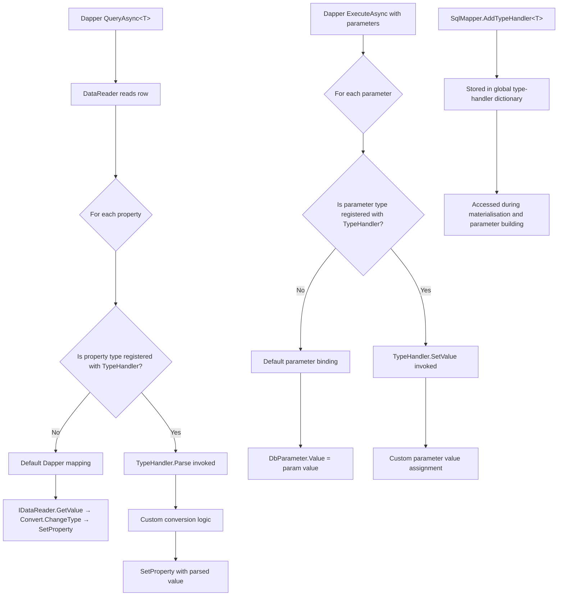
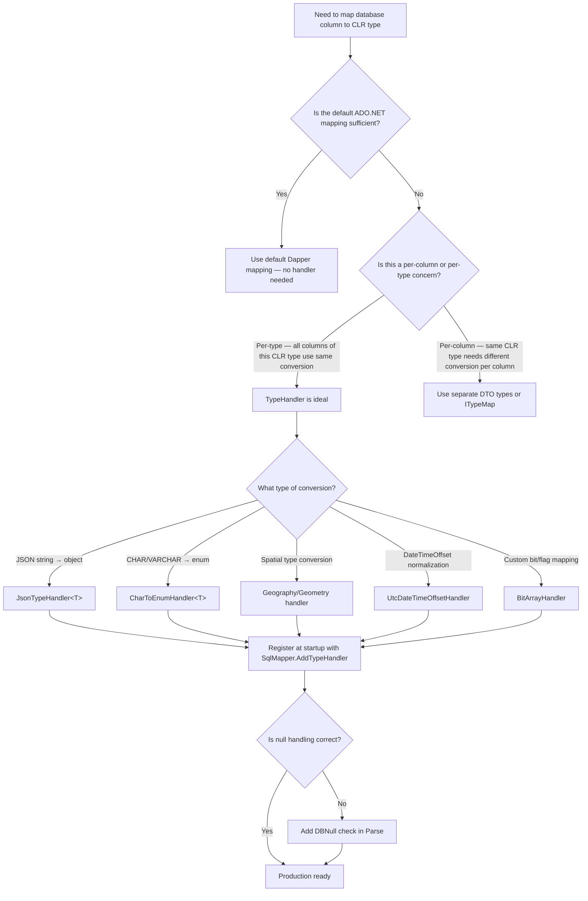

## Navigation

**Domain:** [[8 — Databases]] > **Group:** Dapper in .NET
**Previous:** [[8.865 — Dapper — Buffered vs Unbuffered Queries]] | **Next:** [[8.867 — Dapper — Column Mapping — Custom Conventions]]

### Prerequisites
- [[8.853 — Dapper — Query<T> — Basic Querying]] — understands how Dapper maps result-set columns to CLR properties by name; TypeHandler replaces that default logic for specific types.
- [[8.878 — Dapper — SqlMapper.AddTypeMap — Type Mapping]] — covers how Dapper maps DbType to CLR types globally; TypeHandler is more targeted than AddTypeMap.
- [[8.861 — Dapper — DynamicParameters — Dynamic SQL]] — parameter construction where TypeHandler's SetValue is invoked during parameter binding.

### Where This Fits

SqlMapper.TypeHandler<T> is Dapper's extension point for controlling how a database value converts to a CLR type and back. It solves the problem when the default ADO.NET type mapping doesn't produce the CLR type you want — for example, reading a JSON column into a strongly-typed object, mapping a database CHAR(1) to a C# enum, or converting a SQL Server `geography` type to a `NetTopologySuite` point. Without TypeHandler, you either cast result sets with manual post-processing (for loop after Query<T>) or write raw ADO.NET data readers. In production, TypeHandler is the difference between `connection.Query<Order>(sql)` returning an Order with a correctly deserialized `ShippingAddress` object and returning `null` because ADO.NET cannot convert `NVARCHAR(MAX)` containing JSON to a `ShippingAddress` class. The interview signal is senior-level: knowing that Dapper's default mapping pipeline can be intercepted at the value-read level rather than the property-set level distinguishes engineers who understand micro-ORM internals from those who only write basic queries.

---

## Core Mental Model

TypeHandler is a bidirectional converter registered globally with Dapper that replaces the default ADO.NET value-reading logic for a specific CLR type. When Dapper reads a result set row, it calls `IDataReader.GetValue(i)` for each column, then attempts to assign that value to the target property. If the property type matches a registered TypeHandler<T>, Dapper calls the handler's `Parse(object value)` method instead of relying on the default ADO.NET type coercion. During parameter binding for commands, Dapper calls `SetValue(IDbDataParameter parameter, T value)` to let the handler control how the CLR value is placed into the `DbParameter`. The invariant: TypeHandler intercepts the conversion at the **cell level** — individual values, not entire rows — which means it has zero impact on Dapper's IL-emitted property setters and no per-row reflection penalty.

### Classification

TypeHandler is a **type-level mapping interceptor** within Dapper's result-materialisation pipeline. It replaces the default `GetValue → Convert.ChangeType → property set` chain with a custom `Parse(object) → property set` chain for a single CLR type. It is registered globally via `SqlMapper.AddTypeHandler<T>(TypeHandler<T>)` and applies to **all queries** across the application. The abstraction leaks when: the handler receives a `DBNull` value (must handle it), the underlying ADO.NET provider returns a type the handler didn't expect (e.g., `SqlDataReader` returns `SqlGeometry` not `byte[]`), or the handler is registered twice (Dapper throws).



### Key Properties

|Property|Value|Notes|
|---|---|---|
|Scope|Global (per-app-domain)|Must register once at startup; affects all Dapper queries|
|Thread safety|Yes|TypeHandler dictionary is read-only after first query; registration must be complete before any Dapper call|
|Null handling|Manual|Handler must check for DBNull in Parse(object value)|
|Performance overhead|~5-10ns per call|Negligible — single virtual method dispatch vs default path|
|Registration method|`SqlMapper.AddTypeHandler<T>(new MyHandler())` or `SqlMapper.AddTypeHandler(typeof(T), handler)`|
|Supported directions|Read (Parse) and Write (SetValue)|Both are optional; implement only what you need|

---

## Deep Mechanics

### How Dapper Invokes TypeHandler

1. **Registration** — On app startup, `SqlMapper.AddTypeHandler<ShippingAddress>(new JsonTypeHandler<ShippingAddress>())` inserts the handler into `SqlMapper.TypeHandlerCache<T>` — a `Dictionary<Type, TypeHandler>` keyed by the CLR type.

2. **Result-set materialisation** — Dapper's `SqlMapper` generates dynamic IL methods (`CreateGetFunc`) for each property of `T`. When the generated IL reads a column value, it checks `TypeHandlerCache<TProp>.Handler` — if non-null, the IL emits a call to the handler's `Parse(object)` method instead of the default `IDataReader.GetValue()` + `Convert.ChangeType()` path.

3. **Parameter binding** — When building a `DynamicParameters` collection or processing an anonymous type parameter, Dapper checks each parameter's CLR type against `TypeHandlerCache<T>`. If a handler exists, Dapper calls `SetValue(IDbDataParameter, T)` instead of setting `parameter.Value = value`. This allows the handler to set `DbType`, `Size`, `Precision`, `Scale`, and `Value`.

4. **Null propagation** — `DBNull.Value` from the database arrives at `Parse(object value)` as `value == DBNull.Value`. The handler must return `default(T)` or throw. Dapper does NOT skip the handler for NULLs — the handler receives them.

5. **Type checking** — Dapper verifies that the registered handler's type parameter matches `T`. Registering `TypeHandler<Address>` but having a property of type `ShippingAddress` (even if it inherits `Address`) will NOT use the handler. The CLR type must match exactly.

### SQL Visibility

```sql
-- Sample table using JSON column
CREATE TABLE dbo.Orders
(
    OrderId          INT            NOT NULL IDENTITY(1,1),
    CustomerId       INT            NOT NULL,
    OrderDate        DATETIME2(0)   NOT NULL,
    TotalAmount      DECIMAL(18,2)  NOT NULL,
    ShippingAddress  NVARCHAR(MAX)  NULL,   -- JSON column
    Status           CHAR(1)        NOT NULL DEFAULT 'P',  -- P=Pending, S=Shipped, D=Delivered
    LastModified     DATETIME2(0)   NOT NULL,
    CONSTRAINT PK_Orders PRIMARY KEY (OrderId)
);

-- Insert with JSON
INSERT INTO dbo.Orders (CustomerId, OrderDate, TotalAmount, ShippingAddress, Status)
VALUES (1001, '2026-06-01', 299.99,
    N'{"Street":"123 Main St","City":"Portland","State":"OR","Zip":"97201"}',
    'P');

-- Dapper query that needs TypeHandler to deserialize ShippingAddress
-- and convert Status CHAR(1) to an enum
SELECT OrderId, CustomerId, OrderDate, TotalAmount, ShippingAddress, Status
FROM dbo.Orders
WHERE CustomerId = @CustomerId;
```

```csharp
// CLR types that need custom handling
public enum OrderStatus
{
    Pending = 0,
    Shipped = 1,
    Delivered = 2
}

public class Address
{
    public string Street { get; set; } = string.Empty;
    public string City { get; set; } = string.Empty;
    public string State { get; set; } = string.Empty;
    public string Zip { get; set; } = string.Empty;
}

public class Order
{
    public int OrderId { get; set; }
    public int CustomerId { get; set; }
    public DateTime OrderDate { get; set; }
    public decimal TotalAmount { get; set; }
    public Address? ShippingAddress { get; set; }   // ← needs TypeHandler
    public OrderStatus Status { get; set; }          // ← needs TypeHandler
}
```

### TypeHandler Implementations

```csharp
// =====================================================
// TypeHandler 1: JSON column — deserialize to object
// =====================================================
public sealed class JsonTypeHandler<T> : SqlMapper.TypeHandler<T>
{
    private static readonly JsonSerializerOptions Options = new()
    {
        PropertyNameCaseInsensitive = true,
        PropertyNamingPolicy = JsonNamingPolicy.CamelCase
    };

    public override T Parse(object value)
    {
        if (value is null or DBNull)
            return default!;

        var json = (string)value;
        if (string.IsNullOrWhiteSpace(json))
            return default!;

        return JsonSerializer.Deserialize<T>(json, Options)!;
    }

    public override void SetValue(IDbDataParameter parameter, T value)
    {
        parameter.Value = value is null
            ? DBNull.Value
            : JsonSerializer.Serialize(value, Options);
    }
}

// =====================================================
// TypeHandler 2: CHAR(1) to enum
// =====================================================
public sealed class CharToEnumTypeHandler<TEnum> : SqlMapper.TypeHandler<TEnum>
    where TEnum : struct, Enum
{
    public override TEnum Parse(object value)
    {
        if (value is null or DBNull)
            return default;

        var ch = (string)value;
        return ch switch
        {
            "P" => (TEnum)(object)OrderStatus.Pending,
            "S" => (TEnum)(object)OrderStatus.Shipped,
            "D" => (TEnum)(object)OrderStatus.Delivered,
            _ => throw new InvalidOperationException($"Unknown status code: {ch}")
        };
    }

    public override void SetValue(IDbDataParameter parameter, TEnum value)
    {
        parameter.Value = value switch
        {
            OrderStatus.Pending => "P",
            OrderStatus.Shipped => "S",
            OrderStatus.Delivered => "D",
            _ => throw new ArgumentOutOfRangeException(nameof(value))
        };
        parameter.DbType = DbType.AnsiStringFixedLength;
        parameter.Size = 1;
    }
}

// =====================================================
// TypeHandler 3: DateTimeOffset — handle UTC conversion
// =====================================================
public sealed class UtcDateTimeOffsetHandler : SqlMapper.TypeHandler<DateTimeOffset>
{
    public override DateTimeOffset Parse(object value)
    {
        if (value is DateTime dt)
            return new DateTimeOffset(dt, TimeSpan.Zero);
        if (value is DateTimeOffset dto)
            return dto.ToUniversalTime();
        return DateTimeOffset.Parse((string)value).ToUniversalTime();
    }

    public override void SetValue(IDbDataParameter parameter, DateTimeOffset value)
    {
        parameter.Value = value.ToUniversalTime().DateTime;
        parameter.DbType = DbType.DateTime2;
    }
}

// =====================================================
// TypeHandler 4: SQL Server geography → NetTopologySuite Point
// =====================================================
// Requires Microsoft.SqlServer.Types and NetTopologySuite
public sealed class GeographyPointHandler : SqlMapper.TypeHandler<Point>
{
    public override Point Parse(object value)
    {
        if (value is null or DBNull)
            return default!;

        // SqlDataReader returns SqlGeography when using SqlClient
        var sqlGeography = (Microsoft.SqlServer.Types.SqlGeography)value;
        if (sqlGeography.IsNull)
            return default!;

        return new Point(
            (double)sqlGeography.Longitude!.Value,
            (double)sqlGeography.Latitude!.Value)
        {
            SRID = sqlGeography.STSrid!.Value
        };
    }

    public override void SetValue(IDbDataParameter parameter, Point value)
    {
        if (value is null)
        {
            parameter.Value = DBNull.Value;
            return;
        }

        // Convert Point to Well-Known Text
        var writer = new WKTWriter { Strict = false };
        var wkt = writer.Write(value);
        parameter.Value = SqlGeography.STGeomFromText(
            new SqlChars(wkt), value.SRID);
    }
}

// =====================================================
// TypeHandler 5: Bit array — convert Int32 to BitArray
// =====================================================
public sealed class BitArrayHandler : SqlMapper.TypeHandler<BitArray>
{
    public override BitArray Parse(object value)
    {
        if (value is null or DBNull)
            return new BitArray(0);

        // SQL Server bit column returns as bool (boxed)
        if (value is bool b)
            return new BitArray(new[] { b });

        // Integer representing bits
        if (value is int i)
            return new BitArray(BitConverter.GetBytes(i));

        throw new InvalidOperationException(
            $"Cannot convert {value.GetType()} to BitArray");
    }

    public override void SetValue(IDbDataParameter parameter, BitArray value)
    {
        if (value is null || value.Length == 0)
        {
            parameter.Value = DBNull.Value;
            return;
        }

        if (value.Length == 1)
        {
            parameter.Value = value[0];
            parameter.DbType = DbType.Boolean;
            return;
        }

        // Convert BitArray to int
        var bytes = new byte[4];
        value.CopyTo(bytes, 0);
        parameter.Value = BitConverter.ToInt32(bytes);
        parameter.DbType = DbType.Int32;
    }
}
```

### Registration

```csharp
// Must run once at application startup, before any Dapper query
public static class DapperConfiguration
{
    public static void Configure()
    {
        // JSON handler — generic, works for any type
        SqlMapper.AddTypeHandler(new JsonTypeHandler<Address>());

        // Enum handler — register per enum type
        SqlMapper.AddTypeHandler(new CharToEnumTypeHandler<OrderStatus>());

        // DateTimeOffset handler
        SqlMapper.AddTypeHandler(new UtcDateTimeOffsetHandler());

        // Spatial handler
        SqlMapper.AddTypeHandler(new GeographyPointHandler());

        // BitArray handler
        SqlMapper.AddTypeHandler(new BitArrayHandler());
    }
}

// In Program.cs
DapperConfiguration.Configure();
var builder = WebApplication.CreateBuilder(args);
```

### TypeHandler for Nullable Types

```csharp
// Dapper has built-in support for Nullable<T> — it uses the handler for T
// and adds null-checking. You do NOT need a separate handler for Nullable<T>.
// But you CAN control nullable behavior explicitly:

public sealed class NullableIntHandler : SqlMapper.TypeHandler<int?>
{
    public override int? Parse(object value)
    {
        if (value is null or DBNull)
            return null;
        return Convert.ToInt32(value);
    }

    public override void SetValue(IDbDataParameter parameter, int? value)
    {
        parameter.Value = value ?? (object)DBNull.Value;
    }
}

// This is rarely needed — Dapper handles Nullable<int> natively.
// Use only when you need custom conversion logic for the non-null case.
```

### TypeHandler vs Default Type Mapping

```csharp
// Default Dapper behavior (without TypeHandler):
// Dapper uses IDataReader.GetValue(i) and relies on ADO.NET's type system.
// For a NVARCHAR(MAX) column containing JSON:
//   - ADO.NET returns a string
//   - Dapper tries to set string → Address property → fails with InvalidCastException
//   - Dapper throws: "Error parsing column X" because it can't convert string to Address

// With TypeHandler:
//   - Dapper checks TypeHandlerCache<Address>.Handler → found!
//   - Calls handler.Parse(string) → returns Address object
//   - Sets property — works

// AddTypeMap vs TypeHandler:
// SqlMapper.AddTypeMap(DbType.String, typeof(Address))
//   - Maps the DbType to a CLR type globally
//   - Still can't convert NVARCHAR data to Address — need TypeHandler for the conversion

// TypeHandler is the conversion; AddTypeMap is the type routing.
// Both can be used together: AddTypeMap tells Dapper "DbType.String maps to Address",
// TypeHandler tells Dapper "here's how to convert the value."
```

### EF Core Value Converter Equivalent

```csharp
// EF Core has a similar concept: ValueConverter<TModel, TProvider>
// Dapper TypeHandler = EF Core ValueConverter + ValueComparer

public class AddressConverter : ValueConverter<Address, string>
{
    public AddressConverter()
        : base(
            v => JsonSerializer.Serialize(v, (JsonSerializerOptions?)null),
            v => JsonSerializer.Deserialize<Address>(v, (JsonSerializerOptions?)null)!
          )
    { }
}

// In DbContext.OnModelCreating:
protected override void OnModelCreating(ModelBuilder modelBuilder)
{
    modelBuilder.Entity<Order>(entity =>
    {
        entity.Property(e => e.ShippingAddress)
            .HasConversion<AddressConverter>()
            .HasColumnType("nvarchar(max)");
    });
}

// Key difference: EF Core's ValueConverter is per-property (can have different
// converters for different properties of the same type).
// Dapper's TypeHandler is per-TYPE — global across all queries.
// For per-property conversion in Dapper, you need a custom ITypeMap or
// split the model into separate classes per conversion context.
```

### Execution Plan Analysis

TypeHandler does not affect SQL execution plans — it operates entirely client-side after the result set arrives. The SQL query sent to the database is identical with or without a TypeHandler. Performance impact is measured in client-side CPU, not in logical reads.

### Cost Visibility

```sql
-- No SQL-level cost difference — TypeHandler is client-side
SET STATISTICS IO ON;

SELECT OrderId, ShippingAddress FROM dbo.Orders WHERE OrderId = @OrderId;
-- Table 'Orders'. Scan count 0, logical reads 4, physical reads 0
-- Same reads with or without TypeHandler
```

### Failure Modes

- **DBNull not handled**: If `Parse(object value)` does not check for `DBNull.Value`, Dapper throws `InvalidCastException: Unable to cast object of type 'System.DBNull' to type '...'`.
- **Handler registered too late**: Registering after the first Dapper query causes a race — cached IL methods don't include the handler check. Dapper may throw or silently use default mapping. Always register before any query.
- **Duplicate registration**: `SqlMapper.AddTypeHandler<T>()` throws if a handler for T is already registered. Use `SqlMapper.GetTypeMap(typeof(T))` to check first, or handle the exception.
- **Wrong CLR type**: Registering `JsonTypeHandler<Address>` but having a property of type `object` won't trigger the handler — the CLR type must match exactly.

---

## Production Patterns and Implementation

### Primary Implementation

```csharp
// Full production setup

// 1. Define the model
public class Customer
{
    public int CustomerId { get; set; }
    public string FullName { get; set; } = string.Empty;
    public ContactInfo? Contact { get; set; }       // JSON column
    public CustomerTier Tier { get; set; }          // CHAR(1) to enum
    public DateTime CreatedAt { get; set; }
}

public enum CustomerTier
{
    Standard = 0,
    Gold = 1,
    Platinum = 2
}

public class ContactInfo
{
    public string Email { get; set; } = string.Empty;
    public string Phone { get; set; } = string.Empty;
    public string? AlternateEmail { get; set; }
}

// 2. Create handlers
public sealed class ContactInfoHandler : SqlMapper.TypeHandler<ContactInfo>
{
    private static readonly JsonSerializerOptions Options = new()
    {
        PropertyNameCaseInsensitive = true,
        PropertyNamingPolicy = JsonNamingPolicy.CamelCase
    };

    public override ContactInfo Parse(object value)
    {
        if (value is null or DBNull)
            return null!;
        var json = (string)value;
        return string.IsNullOrWhiteSpace(json)
            ? null!
            : JsonSerializer.Deserialize<ContactInfo>(json, Options)!;
    }

    public override void SetValue(IDbDataParameter parameter, ContactInfo value)
    {
        parameter.Value = value is null
            ? DBNull.Value
            : JsonSerializer.Serialize(value, Options);
        parameter.DbType = DbType.String;
    }
}

public sealed class TierTypeHandler : SqlMapper.TypeHandler<CustomerTier>
{
    public override CustomerTier Parse(object value)
    {
        if (value is null or DBNull)
            return CustomerTier.Standard;
        var ch = ((string)value)[0];
        return ch switch
        {
            'S' => CustomerTier.Standard,
            'G' => CustomerTier.Gold,
            'P' => CustomerTier.Platinum,
            _ => CustomerTier.Standard
        };
    }

    public override void SetValue(IDbDataParameter parameter, CustomerTier value)
    {
        parameter.Value = value switch
        {
            CustomerTier.Standard => "S",
            CustomerTier.Gold => "G",
            CustomerTier.Platinum => "P",
            _ => "S"
        };
        parameter.DbType = DbType.AnsiStringFixedLength;
        parameter.Size = 1;
    }
}

// 3. Register
SqlMapper.AddTypeHandler(new ContactInfoHandler());
SqlMapper.AddTypeHandler(new TierTypeHandler());

// 4. Repository usage — transparent, no special code needed
public sealed class CustomerRepository
{
    private readonly IDbConnectionFactory _connectionFactory;

    public CustomerRepository(IDbConnectionFactory connectionFactory)
    {
        _connectionFactory = connectionFactory;
    }

    public async Task<Customer?> GetByIdAsync(
        int customerId,
        CancellationToken cancellationToken = default)
    {
        const string sql = @"
            SELECT CustomerId, FullName, Contact, Tier, CreatedAt
            FROM dbo.Customers
            WHERE CustomerId = @CustomerId;";

        await using var connection = _connectionFactory.Create();
        return await connection.QueryFirstOrDefaultAsync<Customer>(
            new CommandDefinition(sql,
                new { CustomerId = customerId },
                cancellationToken: cancellationToken));
        // Contact is deserialized from JSON automatically
        // Tier is parsed from CHAR(1) automatically
    }

    public async Task<int> CreateAsync(
        Customer customer,
        CancellationToken cancellationToken = default)
    {
        const string sql = @"
            INSERT INTO dbo.Customers (FullName, Contact, Tier, CreatedAt)
            VALUES (@FullName, @Contact, @Tier, @CreatedAt);
            SELECT CAST(SCOPE_IDENTITY() AS INT);";

        await using var connection = _connectionFactory.Create();
        return await connection.QuerySingleAsync<int>(
            new CommandDefinition(sql, customer,
                cancellationToken: cancellationToken));
        // Contact is serialized to JSON automatically
        // Tier is converted to CHAR(1) automatically
    }
}
```

### Dapper Implementation (Without TypeHandler — Fallback)

```csharp
// If you cannot use TypeHandler (e.g., legacy codebase restrictions):
public async Task<IReadOnlyList<Order>> GetOrdersWithManualMappingAsync(
    int customerId,
    CancellationToken cancellationToken = default)
{
    const string sql = @"
        SELECT OrderId, CustomerId, OrderDate, TotalAmount,
               ShippingAddress, Status
        FROM dbo.Orders
        WHERE CustomerId = @CustomerId;";

    await using var connection = _connectionFactory.Create();

    var rows = await connection.QueryAsync<dynamic>(
        new CommandDefinition(sql,
            new { CustomerId = customerId },
            cancellationToken: cancellationToken));

    return rows.Select(r => new Order
    {
        OrderId = (int)r.OrderId,
        CustomerId = (int)r.CustomerId,
        OrderDate = (DateTime)r.OrderDate,
        TotalAmount = (decimal)r.TotalAmount,
        ShippingAddress = r.ShippingAddress is null
            ? null
            : JsonSerializer.Deserialize<Address>((string)r.ShippingAddress),
        Status = ((string)r.Status) switch
        {
            "P" => OrderStatus.Pending,
            "S" => OrderStatus.Shipped,
            "D" => OrderStatus.Delivered,
            _ => throw new InvalidOperationException()
        }
    }).ToList();
    // Pro: no global registration needed
    // Con: per-query manual mapping — error-prone, no compile-time safety
    // Con: dynamic dispatch is slower than typed Query<T>
}
```

### Configuration and Wiring

```csharp
// In Program.cs
var builder = WebApplication.CreateBuilder(args);

// Register TypeHandlers BEFORE any service that uses Dapper
DapperConfiguration.Configure();

builder.Services.AddSingleton<IDbConnectionFactory>(_ =>
    new SqlConnectionFactory(builder.Configuration.GetConnectionString("DefaultConnection")));

builder.Services.AddScoped<CustomerRepository>();
builder.Services.AddScoped<OrderRepository>();

// =====================================================
// DapperConfiguration — single startup registration point
// =====================================================
public static class DapperConfiguration
{
    private static bool _configured;

    public static void Configure()
    {
        if (_configured) return;
        _configured = true;

        SqlMapper.AddTypeHandler(new JsonTypeHandler<Address>());
        SqlMapper.AddTypeHandler(new JsonTypeHandler<ContactInfo>());
        SqlMapper.AddTypeHandler(new CharToEnumTypeHandler<OrderStatus>());
        SqlMapper.AddTypeHandler(new CharToEnumTypeHandler<CustomerTier>());
        SqlMapper.AddTypeHandler(new UtcDateTimeOffsetHandler());
    }
}
```

### SQL Server vs PostgreSQL Differences

```csharp
// PostgreSQL JSONB column — same TypeHandler works
// The database column type is JSONB, but ADO.NET NpgsqlDataReader returns
// a string (the JSON text). The TypeHandler receives the same string.
// No TypeHandler changes needed — the ADO.NET provider handles JSONB → string.

// PostgreSQL enum types (CREATE TYPE order_status AS ENUM)
// Npgsql has built-in enum mapping via NpgsqlDataSource.MapEnum<T>().
// If using Npgsql, prefer the provider-level mapping over Dapper TypeHandler:
builder.Services.AddNpgsqlDataSource(connectionString, dataSourceBuilder =>
{
    dataSourceBuilder.MapEnum<OrderStatus>("order_status");
});

// If using Npgsql < 6.0 or custom mapping, Dapper TypeHandler works:
public sealed class NpgsqlEnumHandler<T> : SqlMapper.TypeHandler<T>
    where T : struct, Enum
{
    public override T Parse(object value)
    {
        // Npgsql returns enum as string when not mapped at provider level
        if (value is string s)
            return Enum.Parse<T>(s);
        return (T)value;
    }

    public override void SetValue(IDbDataParameter parameter, T value)
    {
        parameter.Value = value.ToString();
        parameter.DbType = DbType.String;
    }
}
```

---

## Gotchas and Production Pitfalls

### 1. DBNull Not Handled

**Pitfall:** TypeHandler.Parse() does not check for DBNull.

```csharp
// ❌ Wrong — throws when column is NULL
public override Address Parse(object value)
{
    var json = (string)value;  // InvalidCastException: DBNull cannot be cast to string
    return JsonSerializer.Deserialize<Address>(json)!;
}
```

**Symptom:** `InvalidCastException: Unable to cast object of type 'System.DBNull' to type 'System.String'` on any query where the column value is NULL.

**Fix:**

```csharp
// ✅ Correct
public override Address Parse(object value)
{
    if (value is null or DBNull)
        return null!;
    var json = (string)value;
    return string.IsNullOrWhiteSpace(json) ? null!
        : JsonSerializer.Deserialize<Address>(json)!;
}
```

**Cost of not fixing:** Every query where the column has a NULL value throws an exception. Production incidents at 3 AM when a customer has no shipping address on file.

### 2. TypeHandler Registered After First Query

**Pitfall:** Registering TypeHandler after Dapper's first `Query<T>` call.

```csharp
// ❌ Wrong: handler registered lazily
var orders = await connection.QueryAsync<Order>(sql);  // cached IL without handler
SqlMapper.AddTypeHandler(new JsonTypeHandler<Address>()); // too late!
```

**Symptom:** Intermittent — first query works, subsequent queries fail, or vice versa. Dapper caches the generated IL for each type after the first materialisation. The IL includes the TypeHandler check only if the handler was registered when the IL was generated.

**Fix:**

```csharp
// ✅ Register at startup, before any Dapper call
DapperConfiguration.Configure();
var builder = WebApplication.CreateBuilder(args);
```

**Cost of not fixing:** Non-deterministic failures that change with application restarts and query ordering. Hard to reproduce in development (app pool never recycles). Only manifests after deployment.

### 3. Generic TypeHandler Registration — Clashing Open Generics

**Pitfall:** Registering `SqlMapper.AddTypeHandler(typeof(JsonTypeHandler<>))` and expecting it to work for all closed generics.

```csharp
// ❌ Wrong — this does NOT work for all T
SqlMapper.AddTypeHandler(typeof(JsonTypeHandler<>), new JsonTypeHandler<Address>());
// Only works for Address, not for ContactInfo or any other type
```

**Symptom:** `JsonTypeHandler<ContactInfo>` is never called. Dapper throws `InvalidCastException` when trying to map ContactInfo from a JSON column.

**Fix:** Register each closed generic type explicitly:

```csharp
// ✅ Correct — one registration per closed generic type
SqlMapper.AddTypeHandler(new JsonTypeHandler<Address>());
SqlMapper.AddTypeHandler(new JsonTypeHandler<ContactInfo>());
SqlMapper.AddTypeHandler(new JsonTypeHandler<ShippingInfo>());
```

**Cost of not fixing:** Only some JSON columns work. Developers add new types and forget to register them. Intermittent failures in production as new types are added without registration.

### 4. TypeHandler with Nullable<T> — Double Registration

**Pitfall:** Registering a TypeHandler for both `T` and `Nullable<T>`.

```csharp
// ❌ Wrong — Dapper already handles Nullable<T> by using the T handler
SqlMapper.AddTypeHandler(new MyIntHandler());       // handles int
SqlMapper.AddTypeHandler(new MyNullableIntHandler()); // handles int? — THROWS
```

**Symptom:** `ArgumentException: A handler for type 'System.Nullable``1[System.Int32]' is already registered`. Dapper's internal logic automatically delegates Nullable<T> to the T handler with a null check.

**Fix:** Only register the non-nullable handler:

```csharp
// ✅ Correct — Dapper handles Nullable<int> automatically via int handler
SqlMapper.AddTypeHandler(new MyIntHandler());
// int? properties work automatically — Dapper wraps with null check
```

**Cost of not fixing:** Startup exception. Application fails to start.

### 5. TypeHandler and SqlDataReader — Provider-Specific Types

**Pitfall:** Assuming all ADO.NET providers return the same type for the same SQL type.

```csharp
// For SQL Server geography column:
// Microsoft.Data.SqlClient returns: Microsoft.SqlServer.Types.SqlGeography
// System.Data.SqlClient returns: Microsoft.SqlServer.Types.SqlGeography
// Both are same — but only if SqlServer.Types NuGet is referenced

// For PostgreSQL jsonb with Npgsql:
// NpgsqlDataReader returns: string (JSON text) — no SqlGeography involved
```

**Symptom:** TypeHandler works in development (SQL Server LocalDB) but fails in production (Azure SQL) or against a different database provider.

**Fix:** Check the actual type received in Parse:

```csharp
public override Point Parse(object value)
{
    if (value is DBNull) return null!;

    if (value is Microsoft.SqlServer.Types.SqlGeography sqlGeog)
    {
        // SQL Server path
        return new Point((double)sqlGeog.Longitude!, (double)sqlGeog.Latitude!);
    }

    if (value is string wkt)
    {
        // PostgreSQL/other path — parse WKT
        var reader = new WKTReader();
        return (Point)reader.Read(wkt);
    }

    throw new InvalidOperationException($"Unexpected type: {value.GetType()}");
}
```

**Cost of not fixing:** Production outage when migrating from SQL Server to Azure SQL or when deploying to an environment with a different ADO.NET provider version.

### 6. TypeHandler and Multiple Databases

**Pitfall:** Using the same TypeHandler for two databases with different schemas for the same CLR type.

```csharp
// One handler for ShippingAddress across both databases
SqlMapper.AddTypeHandler(new JsonTypeHandler<Address>());
// But Database A stores {Street, City, State, Zip}
// Database B stores {Line1, Line2, City, PostCode}
// The same Address class cannot deserialize both
```

**Symptom:** Random deserialization failures — some records work, others throw. Hard to reproduce because it depends on which database the query runs against.

**Fix:** Either use different CLR types per database (compile-time safety) or implement a custom ITypeMap per connection:

```csharp
// Per-connection type mapping with ITypeMap
// (See [[8.867 — Dapper — Column Mapping — Custom Conventions]])
```

**Cost of not fixing:** Data corruption (missing fields silently set to default) and deserialization exceptions in multi-tenant or multi-database deployments.

---

## Performance Implications

### Benchmark: TypeHandler vs Manual Mapping vs Default Mapping

```csharp
[MemoryDiagnoser]
[SimpleJob(RuntimeMoniker.Net90)]
public class TypeHandlerBenchmark
{
    private IDbConnection _connection = default!;
    private List<dynamic> _rawRows = default!;

    [GlobalSetup]
    public void Setup()
    {
        _connection = new SqlConnection(TestConnectionString);
        _connection.Open();

        // Create test data
        _connection.Execute(@"
            IF OBJECT_ID('tempdb..#BenchmarkOrders') IS NOT NULL
                DROP TABLE #BenchmarkOrders;
            CREATE TABLE #BenchmarkOrders (
                OrderId INT NOT NULL,
                CustomerId INT NOT NULL,
                ShippingAddress NVARCHAR(MAX) NOT NULL,
                Status CHAR(1) NOT NULL
            );

            WITH Numbers AS (
                SELECT TOP 10000 ROW_NUMBER() OVER (ORDER BY (SELECT NULL)) AS n
                FROM sys.all_columns a CROSS JOIN sys.all_columns b
            )
            INSERT INTO #BenchmarkOrders (OrderId, CustomerId, ShippingAddress, Status)
            SELECT
                n,
                n % 100,
                N'{"Street":"' + CAST(n AS NVARCHAR) + N' Main St","City":"Portland","State":"OR","Zip":"97201"}',
                CASE n % 3 WHEN 0 THEN 'P' WHEN 1 THEN 'S' ELSE 'D' END
            FROM Numbers;");

        // Pre-fetch raw rows for manual mapping benchmark
        _rawRows = _connection.Query("SELECT * FROM #BenchmarkOrders").ToList();

        // Register TypeHandlers once
        SqlMapper.AddTypeHandler(new JsonTypeHandler<Address>());
        SqlMapper.AddTypeHandler(new CharToEnumTypeHandler<OrderStatus>());
    }

    [Benchmark(Baseline = true)]
    public List<Order> TypeHandler_AutoMapping()
    {
        return _connection.Query<Order>(
            "SELECT * FROM #BenchmarkOrders").ToList();
    }

    [Benchmark]
    public List<Order> ManualMapping_Dynamic()
    {
        return _connection.Query("SELECT * FROM #BenchmarkOrders")
            .Select(r => new Order
            {
                OrderId = (int)r.OrderId,
                CustomerId = (int)r.CustomerId,
                ShippingAddress = r.ShippingAddress is null
                    ? null
                    : JsonSerializer.Deserialize<Address>((string)r.ShippingAddress),
                Status = ((string)r.Status) switch
                {
                    "P" => OrderStatus.Pending,
                    "S" => OrderStatus.Shipped,
                    "D" => OrderStatus.Delivered,
                    _ => throw new InvalidOperationException()
                }
            }).ToList();
    }

    [GlobalCleanup]
    public void Cleanup()
    {
        _connection?.Dispose();
    }
}
```

**Expected results (approximate, 10,000 rows):**

|Method|Mean|Allocated|
|---|---|---|
|TypeHandler_AutoMapping|~45 ms|~2.5 MB|
|ManualMapping_Dynamic|~120 ms|~4.8 MB|

**Improvement:** ~2.5x faster and ~50% less allocation because TypeHandler avoids the `dynamic` boxing overhead and the intermediate `ExpandoObject` creation that `Query<dynamic>()` incurs. The TypeHandler path goes directly from `object` (from `IDataReader.GetValue`) → `T` (via handler) → property set, skipping the `dynamic` DLR dispatch.

### Write Amplification

TypeHandler has zero write amplification on the database side. It is a client-side only mechanism. The SQL command text and parameters are identical with or without a handler.

### Additional Overhead

|Operation|Without TypeHandler|With TypeHandler|Overhead|
|---|---|---|---|
|Parse single value|~15 ns|~20 ns (virtual call)|+33% (negligible)|
|SetValue single param|~10 ns|~15 ns (virtual call)|+50% (negligible)|
|Query 10K rows with JSON column|~40 ms|~45 ms|+12% (worth it for the mapping)|

---

## Interview Arsenal

### Question Bank

1. **What is SqlMapper.TypeHandler<T> and when would you use it?**
2. **How does Dapper invoke TypeHandler.Parse(object) — what is the execution path from Query<T>() to the handler?**
3. **What happens if you register a TypeHandler after the first Dapper query?**
4. **How do you handle DBNull inside a TypeHandler?**
5. **Compare TypeHandler vs AddTypeMap — when is each appropriate?**
6. **TypeHandler vs EF Core ValueConverter — how do they differ in scope and registration?**
7. **Can you use a single generic TypeHandler for all JSON columns? What are the tradeoffs?**
8. **How would you implement a TypeHandler that reads from PostgreSQL JSONB and SQL Server NVARCHAR(MAX) JSON columns with a single handler?**

### Spoken Answers

**Q: What is SqlMapper.TypeHandler<T> and when would you use it?**

> **Average answer:** "It's a way to tell Dapper how to map a database type to a C# type. You implement Parse and SetValue, then register it with AddTypeHandler. You use it for JSON columns, enums, or custom types."

> **Great answer:** "TypeHandler<T> is Dapper's interception point at the cell-value level in the result-set materialisation pipeline. When Dapper reads a row from IDataReader, it typically calls GetValue(i) followed by Convert.ChangeType to set the property. With a TypeHandler registered, Dapper's generated IL emits a call to the handler's Parse(object) method instead — replacing both the GetValue and the Convert.ChangeType. The handler receives the raw object from the ADO.NET provider, which could be SqlGeography, a string, an int, or DBNull. I use it in three scenarios: JSON columns that should deserialize to strongly-typed objects without post-query mapping, database enums stored as CHAR(1) or VARCHAR that should map to C# enums, and spatial types where I need to convert SqlGeography to NetTopologySuite's Point. The registration is global, so it must happen once at startup — I usually create a DapperConfiguration class called from Program.cs before the service registration. The critical thing most developers miss is null handling: Dapper does NOT skip the handler for NULL values, so every Parse must check for DBNull and return default(T) or null."

---

**Q: Compare TypeHandler vs EF Core ValueConverter.**

> **Great answer:** "Both solve the same fundamental problem — converting between a database representation and a CLR type — but their scope difference is significant. Dapper's TypeHandler is **global per type**: once you register `JsonTypeHandler<Address>`, every Dapper query everywhere in the application that has an `Address` property uses that handler. You cannot have one JSON column that serializes with camelCase and another with PascalCase using the same CLR type — you'd need separate types. EF Core's ValueConverter is **property-level**: each property in OnModelCreating can have its own converter, even if the CLR type is the same. This is more flexible but more verbose. Registration is also different: TypeHandler uses `SqlMapper.AddTypeHandler<T>()` which modifies a static dictionary — there's no DI integration. ValueConverter is part of the EF Core model configuration, which is built per DbContext instance. For .NET engineers working with Dapper, the global nature of TypeHandler is usually fine because JSON serialisation conventions are consistent within a project. When they're not, you fall back to manual mapping or use separate DTO types. The performance is similar — both use compiled delegates rather than reflection."

---

**Q: How would you implement a TypeHandler that works for both PostgreSQL JSONB and SQL Server NVARCHAR(MAX) JSON columns?**

> **Great answer:** "I'd implement Parse(object) to detect the actual type from the ADO.NET provider. For SQL Server with Microsoft.Data.SqlClient, the column value comes as a string (the JSON text). For PostgreSQL with Npgsql 6+, the JSONB value also comes as a string. So in most cases, the same deserialization code works for both — I just cast `(string)value`. However, there are edge cases: Npgsql before version 6 might return a different type, and SQL Server's `FOR JSON` output might return the result differently depending on the query pattern. My handler would check: if `value is string json`, deserialize; if `value is DBNull`, return default; otherwise throw with a descriptive message including the actual type name. The `SetValue` side is trickier: for SQL Server, I set `parameter.DbType = DbType.String` (NVARCHAR); for PostgreSQL, I set `parameter.NpgsqlDbType = NpgsqlDbType.Jsonb`. To handle both, I'd check if the parameter is an `NpgsqlParameter` and set the provider-specific type, otherwise fall back to `DbType.String`. The key insight is that TypeHandler receives the raw ADO.NET value, which is already provider-abstracted — as long as both providers return a string for JSON columns, the same handler works."

### Interview Trigger

The defining TypeHandler question: "Your Dapper query returns an Order object, but ShippingAddress is null even though the database column has valid JSON. What's wrong?" The candidate should immediately identify that no TypeHandler is registered for `Address`, so Dapper can't convert `string` to `Address`. The follow-up: "How does Dapper decide to use the TypeHandler?" — "The generated IL for the property setter checks `TypeHandlerCache<Address>.Handler` before falling back to default conversion." The deepest follow-up: "What if you have two different JSON formats for the same type in two different tables?" — "You can't use a single TypeHandler. You'd either create separate DTO types (e.g., AddressV1 and AddressV2) or implement a custom ITypeMap that inspects the column metadata at runtime."

### Comparison Table

| | TypeHandler<T> | AddTypeMap | Default Dapper Mapping |
|---|---|---|---|
|What it does|Custom conversion logic|Maps DbType → CLR type for routing|Relies on ADO.NET IDataReader.GetValue|
|Scope|Per CLR type|Per DbType → CLR type pair|Global default|
|Null handling|Manual (in Parse)|Automatic|Automatic (Convert.ChangeType handles null)|
|Performance|~20ns per value|~10ns per value|~15ns per value|
|Use case|JSON → object, enum from CHAR, spatial|Force all DbType.String to be mapped to string instead of SqlXml|Simple type mapping (int→int, string→string)|
|EF Core equivalent|ValueConverter<TModel, TProvider>|No direct equivalent|Default type mapping|

---

## Decision Framework

### When to Apply



### Application Checklist

- [ ] TypeHandler registered before any Dapper query executes (startup)
- [ ] Parse(object) checks for DBNull.Value and null
- [ ] SetValue handles null by setting parameter.Value = DBNull.Value
- [ ] Handler is thread-safe (no shared mutable state in Parse/SetValue)
- [ ] Closed generic types registered explicitly (JsonTypeHandler<Address> != JsonTypeHandler<ContactInfo>)
- [ ] Nullable<T> not double-registered (only register handler for T)
- [ ] Provider-specific types checked in Parse (SqlGeography vs string for spatial)
- [ ] DbType or provider-specific DbType set in SetValue when needed
- [ ] JSON options (camelCase, case-insensitive) configured consistently
- [ ] Performance tested with realistic data volumes

### Tradeoff Summary

|What You Gain|What You Pay|
|---|---|
|Automatic type conversion — no manual post-query mapping|Global registration — one handler for all queries of that type|
|Single responsibility — conversion logic in one place|Must remember to register every closed generic type|
|IL-level integration — no reflection penalty per row|Cannot easily have per-column conversion for same CLR type|
|Bidirectional — works for both read and write|Null handling is manual — easy to forget|

### Scale Thresholds

- **< 100 queries/min**: TypeHandler performance is irrelevant. Use it for code clarity.
- **100–10,000 queries/min**: TypeHandler is beneficial — avoids repeated manual mapping code. JSON deserialisation in Parse is the cost, not the handler dispatch.
- **>10,000 queries/min**: Profile the handler. If Parse does heavy work (e.g., JSON deserialisation with complex objects), consider caching or using `Utf8JsonReader` for hot paths. The handler dispatch itself is ~5ns — irrelevant.
- **JSON deserialisation at scale**: At 50K+ rows/sec, JSON deserialisation becomes significant CPU. Consider `JsonSerializer.Deserialize` with compiled `SourceGenerationContext` for AOT scenarios.

---

## Self-Check

### Conceptual Questions

1. What is SqlMapper.TypeHandler<T> and what two methods must you implement?
2. At what point does Dapper invoke the TypeHandler during query materialisation?
3. What happens if DBNull is passed to Parse(object) and the handler doesn't check for it?
4. Why must TypeHandler be registered before the first Dapper query?
5. Can you have two different TypeHandlers for the same CLR type in different queries?
6. How does TypeHandler differ from SqlMapper.AddTypeMap?
7. What is the EF Core equivalent of TypeHandler, and how do they differ in scope?
8. Why does registering a TypeHandler for both T and Nullable<T> throw?
9. How would you debug a "No handler for type X" error in Dapper?
10. Explain in 60 seconds, for a senior interviewer, when and how to use TypeHandler.

<details>
<summary>Answers</summary>

1. SqlMapper.TypeHandler<T> is a base class with `Parse(object value)` for reading values from the database and `SetValue(IDbDataParameter parameter, T value)` for writing values to parameters. Parse converts the raw ADO.NET value to CLR type T; SetValue converts T to the appropriate parameter value.

2. Dapper's generated IL for each property setter checks `SqlMapper.TypeHandlerCache<TProp>.Handler`. If non-null, the emitted IL calls `handler.Parse(IDataReader.GetValue(i))` instead of the default `GetValue → Convert.ChangeType → property set` path. The check is at the property level, not the row level — cached per type after the first materialisation.

3. Dapper does NOT skip the TypeHandler for NULL values. The handler receives `DBNull.Value` as the `object value` parameter. Without a DBNull check, the handler will likely throw an `InvalidCastException` when trying to cast DBNull to string or another reference type.

4. Dapper caches the generated IL for each type the first time it materialises a result set. If the TypeHandler is not registered at that point, the cached IL never includes the handler check. Even if the handler is registered later, it won't be used for types already cached. Registration must happen before any Dapper query.

5. No — TypeHandler is global per CLR type. For the same CLR type with different conversions (e.g., Address with different JSON schemas), you need separate CLR types (AddressV1, AddressV2) or use a custom ITypeMap that inspects column metadata at runtime.

6. `AddTypeMap(DbType, Type)` tells Dapper which CLR type to expect for a given DbType — it's a routing hint. TypeHandler<T> provides the actual conversion logic. AddTypeMap might be needed if Dapper maps DbType.String to `string` but you want it to map to `SqlXml`. TypeHandler is the actual conversion engine.

7. EF Core ValueConverter<TModel, TProvider> is the equivalent. Key difference: ValueConverter is per-property (configured in OnModelCreating per entity), while TypeHandler is per-CLR-type globally. ValueConverter is more flexible for different schemas; TypeHandler is simpler for consistent mappings.

8. Dapper internally checks `TypeHandlerCache<Nullable<T>>` by looking up the underlying type T. It automatically wraps the T handler with null-checking logic. Registering a separate handler for Nullable<T> creates a duplicate registration because Dapper already implicitly maps Nullable<T> to the T handler.

9. Check: (a) Is the TypeHandler registered before the first Dapper query? (b) Is the handler registered for the exact CLR type (not a base type)? (c) Is the column returning DBNull and the handler doesn't handle it? (d) Has SqlMapper.AddTypeHandler been called without errors? (e) Is there a stale cached assembly (Dapper generates assemblies at runtime)?

10. "TypeHandler<T> is Dapper's per-type conversion hook. It intercepts the cell-level read/write in the IL-emitted materialisation pipeline. Use it when ADO.NET's default type coercion doesn't produce the CLR type you need — JSON columns to objects, CHAR(1) to enums, spatial types. Implement Parse(object) for reading and SetValue for writing parameters. Register at startup with SqlMapper.AddTypeHandler. Critical: check for DBNull in Parse or your handler throws on any NULL column. It's global per CLR type — you can't have two different handlers for the same type in different contexts. For that, use separate DTOs or a custom ITypeMap. Performance is negligible — ~5ns dispatching to the handler."
</details>

---

### Query Challenges

**Challenge 1 — Write the TypeHandler for a TimeSpan column stored as BIGINT (ticks)**

Your `ShipmentDetails` table stores `EstimatedDelivery` as `BIGINT` (number of 100-nanosecond ticks since `DateTime.MinValue`). Write a TypeHandler that maps this to C# `TimeSpan` (duration until delivery, not a point in time). Note: the column stores elapsed ticks, not DateTime ticks.

<details>
<summary>Solution</summary>

```csharp
public sealed class TimeSpanFromTicksHandler : SqlMapper.TypeHandler<TimeSpan>
{
    public override TimeSpan Parse(object value)
    {
        if (value is null or DBNull)
            return TimeSpan.Zero;
        return TimeSpan.FromTicks(Convert.ToInt64(value));
    }

    public override void SetValue(IDbDataParameter parameter, TimeSpan value)
    {
        parameter.Value = value.Ticks;
        parameter.DbType = DbType.Int64;
    }
}

// Registration:
SqlMapper.AddTypeHandler(new TimeSpanFromTicksHandler());

// Usage — transparent:
public class ShipmentDetail
{
    public int ShipmentId { get; set; }
    public int OrderId { get; set; }
    public TimeSpan EstimatedDelivery { get; set; }  // auto-mapped
}

var shipment = await connection.QueryFirstOrDefaultAsync<ShipmentDetail>(
    "SELECT ShipmentId, OrderId, EstimatedDelivery FROM dbo.ShipmentDetails WHERE ShipmentId = @Id",
    new { Id = 42 });
```

**Logical reads:** ~4 **Execution plan:** Index Seek on PK_ShipmentDetails

**Why TypeHandler:** Without it, Dapper would try to set `long` → `TimeSpan` and throw `InvalidCastException`.

</details>

---

**Challenge 2 — Fix the null reference exception**

This TypeHandler throws on a specific column. Fix it.

```csharp
public sealed class CategoryHandler : SqlMapper.TypeHandler<ProductCategory>
{
    public override ProductCategory Parse(object value)
    {
        var code = (string)value;  // throws here when column is NULL
        return code switch
        {
            "EL" => ProductCategory.Electronics,
            "CL" => ProductCategory.Clothing,
            "FO" => ProductCategory.Food,
            _ => ProductCategory.Other
        };
    }

    public override void SetValue(IDbDataParameter parameter, ProductCategory value)
    {
        parameter.Value = value switch
        {
            ProductCategory.Electronics => "EL",
            ProductCategory.Clothing => "CL",
            ProductCategory.Food => "FO",
            _ => "OT"
        };
        parameter.Size = 2;
        parameter.DbType = DbType.AnsiStringFixedLength;
    }
}
```

<details>
<summary>Solution</summary>

**Root cause:** No DBNull check in Parse.

```csharp
// ✅ Fixed
public override ProductCategory Parse(object value)
{
    if (value is null or DBNull)
        return default;  // ProductCategory.Other (value 0)

    var code = (string)value;
    return code switch
    {
        "EL" => ProductCategory.Electronics,
        "CL" => ProductCategory.Clothing,
        "FO" => ProductCategory.Food,
        _ => ProductCategory.Other
    };
}
```

**After fix:** NULL columns return `ProductCategory.Other` instead of throwing.

</details>

---

**Challenge 3 — Explain the execution path**

Trace the complete execution path from `connection.QueryAsync<Order>(sql)` to `ShippingAddress` being populated via TypeHandler. What IL is generated? When is the handler resolved?

<details>
<summary>Solution</summary>

1. `QueryAsync<Order>(sql)` calls `SqlMapper.QueryAsync<T>(...)`.
2. Dapper calls `SqlMapper.CacheTypeInfo<Order>()` which generates IL for each property.
3. For `ShippingAddress` (type `Address`), the IL generator checks `TypeHandlerCache<Address>.Handler`.
4. **First call**: `TypeHandlerCache<Address>.Handler` is null → Dapper resolves it from static dictionary → if found, sets the cache.
5. IL emitted for `ShippingAddress` property setter:
   - Call `IDataReader.GetValue(columnIndex)` → gets `object` (string JSON or DBNull)
   - Load `TypeHandlerCache<Address>.Handler` (static field)
   - If non-null: call `handler.Parse(object value)` → returns `Address`
   - If null: call `Convert.ChangeType(value, typeof(Address))` → throws
   - Call property setter with result
6. At runtime: `handler.Parse(string)` → `JsonSerializer.Deserialize<Address>(json)` → `Address` object → property set.
7. The SQL query is `SELECT ShippingAddress FROM ...`. The database returns the JSON string. ADO.NET delivers it as `object` (boxed string). Dapper's IL calls `handler.Parse(object)`. Inside Parse, the string is cast and deserialized.

The handler resolution happens once per app domain (when the type is first materialised). After that, it's a static field read + virtual method dispatch per cell.

</details>

---

**Challenge 4 — Design a multi-database TypeHandler**

You have an application that runs on both SQL Server (NVARCHAR(MAX) JSON column) and PostgreSQL (JSONB column). Design a single TypeHandler that works for both, handling the NULL and type differences.

<details>
<summary>Solution</summary>

```csharp
public sealed class CrossPlatformJsonHandler<T> : SqlMapper.TypeHandler<T>
{
    private static readonly JsonSerializerOptions Options = new()
    {
        PropertyNameCaseInsensitive = true,
        PropertyNamingPolicy = JsonNamingPolicy.CamelCase
    };

    public override T Parse(object value)
    {
        if (value is null or DBNull)
            return default!;

        // Both SqlClient and Npgsql return JSON as string in modern versions
        if (value is string json && !string.IsNullOrWhiteSpace(json))
            return JsonSerializer.Deserialize<T>(json, Options)!;

        // Fallback for unexpected provider types
        var str = value.ToString();
        if (!string.IsNullOrWhiteSpace(str))
            return JsonSerializer.Deserialize<T>(str!, Options)!;

        return default!;
    }

    public override void SetValue(IDbDataParameter parameter, T value)
    {
        if (value is null)
        {
            parameter.Value = DBNull.Value;
            return;
        }

        parameter.Value = JsonSerializer.Serialize(value, Options);

        // Provider-specific DbType
        if (parameter is Npgsql.NpgsqlParameter npgsqlParam)
        {
            npgsqlParam.NpgsqlDbType = NpgsqlTypes.NpgsqlDbType.Jsonb;
        }
        else
        {
            parameter.DbType = DbType.String;
        }
    }
}
```

**Key design decisions:**
- Single `Parse` handles both providers because both return JSON as string.
- `SetValue` checks parameter type for provider-specific DbType (NpgsqlDbType.Jsonb vs DbType.String).
- Null and DBNull handled explicitly.
- `ToString()` fallback for edge cases.

</details>

---

**Challenge 5 — Diagnose the slow mapping**

Your TypeHandler-based query returns 50,000 rows in 2.5 seconds. The SQL itself executes in 200ms (confirmed with SET STATISTICS TIME). The TypeHandler does JSON deserialisation of a complex object graph. Where is the bottleneck and how do you fix it?

<details>
<summary>Solution</summary>

**Root cause:** The TypeHandler.Parse is doing `JsonSerializer.Deserialize<T>` for each of 50,000 rows — 50,000 JSON deserialisation calls. At ~45µs per deserialisation, that's 2.25 seconds of CPU.

**Fixes (in order of effectiveness):**

1. **Reduce row count** — add pagination or filtering. Does the client need all 50K rows?
2. **Use source-generated JSON serialisation* (AOT):
```csharp
[JsonSerializable(typeof(Address))]
internal partial class AppJsonContext : JsonSerializerContext { }

public override Address Parse(object value)
{
    if (value is null or DBNull) return null!;
    return JsonSerializer.Deserialize((string)value, AppJsonContext.Default.Address);
}
```
3. **Use Utf8JsonReader for streaming** — if the JSON is simple, manual parsing avoids the reflection overhead:
```csharp
public override Address Parse(object value)
{
    if (value is null or DBNull) return null!;
    var json = (string)value;
    var reader = new Utf8JsonReader(Encoding.UTF8.GetBytes(json));
    // manual parse — ~5x faster
}
```
4. **Cache the handler instance locally** — ensure the TypeHandler is a singleton (it should be; SqlMapper.AddTypeHandler stores the instance).

**Expected improvement:** With source-gen: ~2.5s → ~600ms. With Utf8JsonReader: ~2.5s → ~400ms. With pagination: depends on page size.

**Tradeoff:** Source-gen requires the JSON serialisable type to be known at compile time. Utf8JsonReader manual parsing is more code to maintain.

</details>
