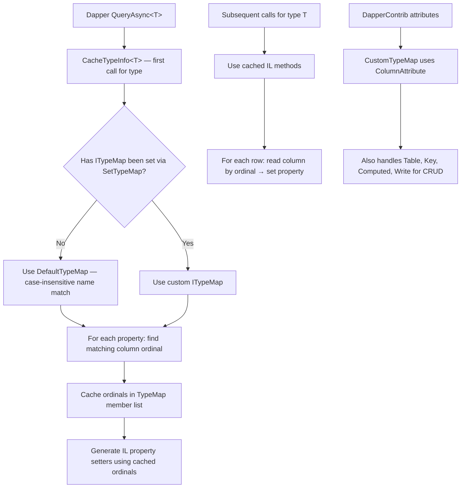
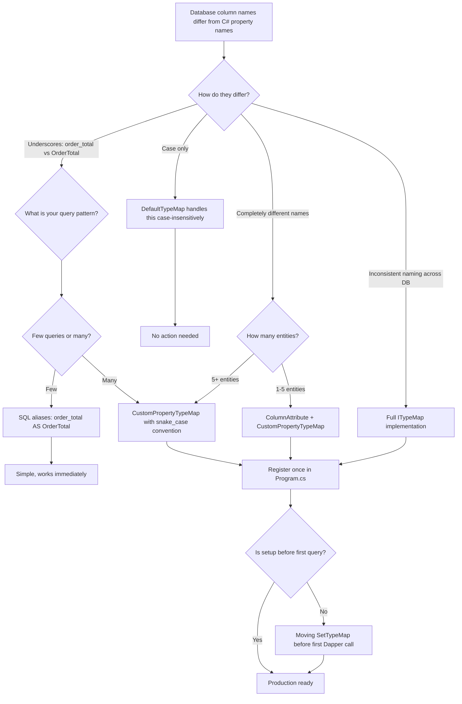

## Navigation

**Domain:** [[8 — Databases]] > **Group:** Dapper in .NET
**Previous:** [[8.866 — Dapper — Custom Type Handlers — SqlMapper.TypeHandler]] | **Next:** [[8.868 — Dapper — Grid Reader — Multiple Result Sets]]

### Prerequisites
- [[8.853 — Dapper — Query<T> — Basic Querying]] — understands the default case-insensitive property-name-to-column-name mapping that custom conventions replace.
- [[8.866 — Dapper — Custom Type Handlers — SqlMapper.TypeHandler]] — column mapping and type handlers are complementary; TypeHandler controls value conversion while TypeMap controls name resolution.
- [[8.874 — Dapper — Contrib — CRUD Extensions]] — DapperContrib provides [Table], [Key], [ExplicitKey], [Computed], [Write] attributes that participate in column mapping.

### Where This Fits

Column mapping in Dapper determines how result-set column names map to .NET object property names. The default convention is simple: column name equals property name, case-insensitive. This breaks when database naming conventions differ from C# conventions — snake_case database columns (`order_total`) need mapping to PascalCase properties (`OrderTotal`). Without custom mapping, engineers either alias every SQL column (`SELECT order_total AS OrderTotal`) which is error-prone and repetitive, or use dynamic queries and lose compile-time safety. The [[8.874 — Dapper — Contrib — CRUD Extensions]] library adds attribute-based mapping ([Column], [Table], [Key]), while `SqlMapper.SetTypeMap` enables full programmatic control via `ITypeMap` implementations. In production, custom column mapping prevents a class of bugs where renamed database columns silently produce `default(T)` properties instead of throwing compile errors. The interview signal is mid-to-senior: understanding that Dapper caches the mapping per type (first call generates IL) and that changing mapping at runtime requires cache eviction.

---

## Core Mental Model

Dapper's column mapping resolves which column name from a `IDataReader` result set corresponds to which property on a CLR object. The default `DefaultTypeMap` performs a case-insensitive ordinal lookup: given a property `OrderTotal`, it searches the reader's column names for "ORDERTOTAL" (uppercased). If found, the column ordinal is cached and used in the generated IL property setter. Custom mapping replaces this lookup strategy — either per-type via `SqlMapper.SetTypeMap<T>(ITypeMap)` or globally via `SqlMapper.SetTypeMap(typeof(T), typeMap)`. The invariant: column mapping only affects **name resolution** — it does not affect type conversion (that's `TypeHandler`'s job) or value reading (`GetValue` is still ADO.NET). The mapping decision is made once per type per app domain and the result (column ordinal index) is baked into dynamically generated IL methods.

### Classification

Column mapping is a **type-materialisation configuration** within Dapper's result-set processing pipeline. It operates before value reading — during the "bind columns to properties" phase of `CacheTypeInfo<T>()`. The default is case-insensitive name matching (poor man's convention). Custom implementations can do: ordinal mapping, snake-case-to-Pascal-case conversion, attribute-guided mapping (`[Column("order_total")]`), or completely arbitrary column-to-property mappings. The abstraction leaks when: a column exists in the result set but isn't mapped (property stays default), a column is missing from the result set (Dapper doesn't throw by default — it just doesn't set the property), or the ITypeMap throws during resolution.



### Key Properties

|Property|Value|Notes|
|---|---|---|
|Default convention|Case-insensitive name match|`OrderTotal` matches `ORDERTOTAL`, `ordertotal`, `OrderTotal`|
|Customization|`SqlMapper.SetTypeMap<T>(ITypeMap)`|Per-type or global, must call before querying that type|
|Caching|Per type, per app domain|Generated IL cached forever — Map.Clear() clears cache|
|DapperContrib attributes|[Column], [Table], [Key], [Write], [Computed]|Auto-wired by `SqlMapperExtensions` in Contrib|
|Performance overhead|~0 (compile time)|Name resolution happens once; per-row cost is IL call with ordinal|
|Case sensitivity|Case-insensitive by default|SQL Server is case-insensitive by default; change for case-sensitive collations|

---

## Deep Mechanics

### How Dapper Resolves Column-Property Mapping

1. **`SqlMapper.CacheTypeInfo<T>()`** is called the first time `T` is materialised. It checks if a `TypeMap` has been set via `SqlMapper.SetTypeMap<T>()`.

2. **No custom TypeMap** → `DefaultTypeMap` is used. For each property of `T` (using `TypeDescriptor.GetProperties`), it iterates the `IDataReader`'s column names (from `GetSchemaTable` or `FieldCount`-based iteration) and finds the first case-insensitive match.

3. **Custom TypeMap via `SetTypeMap<T>()`** → the custom `ITypeMap` is used. `SqlMapper.SetTypeMap<T>(typeMap)` stores the map in a static `Dictionary<Type, ITypeMap>`. The custom map receives the property's `PropertyInfo` and returns a `MemberInfo` (property itself or a field) and a column name. Dapper then resolves the column name to an ordinal from the reader.

4. **DapperContrib path** — `SqlMapperExtensions` in DapperContrib uses `GetTableName<T>()` and `GetColumnName<T>()` which read `[Table]`, `[Column]`, `[Key]` attributes. It also sets a custom `ITypeMap` via `SqlMapper.SetTypeMap<T>(new CustomPropertyTypeMap(typeof(T), callback))`.

5. **Ordinal caching** — Once a property is matched to a column ordinal, that ordinal is stored in the `TypeMap`'s member list. The IL generated for the property setter loads the reader, calls `GetValue(ordinal)`, converts, and sets the property — no string lookup per row.

6. **IL generation** — The `SqlMapper` uses `System.Reflection.Emit` to create `Func<IDataReader, T>` delegates. For each mapped property, the IL:
   - Loads the `IDataReader`
   - Pushes the ordinal (int constant)
   - Calls `IDataReader.get_Item(Int32)` (indexer)
   - Converts value to property type (or calls TypeHandler)
   - Calls property setter

### Default TypeMap — Case-Insensitive Matching

```csharp
// What DefaultTypeMap does internally:
public class DefaultTypeMap : ITypeMap
{
    private readonly IReadOnlyDictionary<string, int> _columnNames;

    public DefaultTypeMap(IDataReader reader)
    {
        // Build case-insensitive dictionary from reader columns
        _columnNames = Enumerable.Range(0, reader.FieldCount)
            .ToDictionary(
                i => reader.GetName(i).ToUpperInvariant(),  // uppercase key
                i => i,
                StringComparer.OrdinalIgnoreCase);          // case-insensitive
    }

    public MemberInfo GetMember(string columnName)
    {
        // Called for each property — but actually Dapper uses
        // FindExplicitPropertyByName which iterates properties
        // and looks up uppercase name in _columnNames
        // ...
    }
}
```

### Column Attribute — Simplest Custom Mapping

```sql
-- Database table with different naming
CREATE TABLE dbo.order_details
(
    detail_id       INT             NOT NULL IDENTITY(1,1),
    order_id        INT             NOT NULL,
    product_code    VARCHAR(20)     NOT NULL,
    quantity        INT             NOT NULL,
    unit_price      DECIMAL(18,2)   NOT NULL,
    line_total      AS (quantity * unit_price),  -- computed column
    created_at      DATETIME2(0)    NOT NULL DEFAULT GETUTCDATE(),
    CONSTRAINT PK_order_details PRIMARY KEY (detail_id)
);
```

```csharp
// CLR type with Column attributes to match snake_case database
public class OrderDetail
{
    [Column("detail_id")]
    public int DetailId { get; set; }

    [Column("order_id")]
    public int OrderId { get; set; }

    [Column("product_code")]
    public string ProductCode { get; set; } = string.Empty;

    [Column("quantity")]
    public int Quantity { get; set; }

    [Column("unit_price")]
    public decimal UnitPrice { get; set; }

    // No Column attribute — uses default name matching (LineTotal → LINETOTAL)
    // If database has line_total — won't match!
    // Must add: [Column("line_total")]
    public decimal LineTotal { get; set; }

    [Column("created_at")]
    public DateTime CreatedAt { get; set; }
}

// =====================================================
// With DapperContrib — ColumnAttribute is auto-respected
// =====================================================
// DapperContrib's SqlMapperExtensions auto-wires ColumnAttribute
// but only for its CRUD methods (Insert, Update, Delete, Get).
// For Query<T> you must also set the type map:

// SetTypeMap with CustomPropertyTypeMap
SqlMapper.SetTypeMap(typeof(OrderDetail), new CustomPropertyTypeMap(
    typeof(OrderDetail),
    (type, columnName) => type.GetProperties()
        .FirstOrDefault(p =>
            p.GetCustomAttributes(false)
                .OfType<ColumnAttribute>()
                .Any(a => a.Name == columnName))
            ?? type.GetProperty(columnName, BindingFlags.Public | BindingFlags.Instance | BindingFlags.IgnoreCase)
));
```

### DapperContrib Attributes — Full CRUD Mapping

```csharp
using Dapper.Contrib.Extensions;

[Table("order_details")]  // DapperContrib: table name for CRUD
public class OrderDetail
{
    [Key]                    // Auto-increment identity column
    [Column("detail_id")]
    public int DetailId { get; set; }

    [Column("order_id")]
    public int OrderId { get; set; }

    [ExplicitKey]            // Key that is NOT auto-generated (GUID, etc.)
    [Column("external_id")]
    public Guid ExternalId { get; set; }

    [Column("product_code")]
    public string ProductCode { get; set; } = string.Empty;

    [Write(false)]           // Skip on INSERT/UPDATE
    [Computed]               // Computed column — never write
    [Column("line_total")]
    public decimal LineTotal { get; set; }

    [Write(true)]
    [Column("created_at")]
    public DateTime CreatedAt { get; set; }
}

// Usage with DapperContrib — no manual SQL
public async Task<OrderDetail?> GetDetailAsync(int detailId)
{
    await using var connection = _connectionFactory.Create();
    return await connection.GetAsync<OrderDetail>(detailId);
    // Generates: SELECT * FROM order_details WHERE detail_id = @detail_id
}

public async Task<int> InsertDetailAsync(OrderDetail detail)
{
    await using var connection = _connectionFactory.Create();
    return await connection.InsertAsync(detail);
    // Generates: INSERT INTO order_details (...) VALUES (...)
    // Respects [Key] for identity, [Write(false)], [Computed]
}
```

### Custom ITypeMap — Snake_case to PascalCase

```csharp
// Full custom TypeMap for snake_case → PascalCase convention
public sealed class SnakeCaseTypeMap<T> : SqlMapper.ITypeMap
{
    private readonly IReadOnlyDictionary<string, int> _columnOrdinals;

    public SnakeCaseTypeMap(IDataReader reader)
    {
        _columnOrdinals = Enumerable.Range(0, reader.FieldCount)
            .ToDictionary(i => reader.GetName(i).ToUpperInvariant(), i => i);
    }

    public ConstructorInfo? FindConstructor(
        string[] names, Type[] types)
    {
        // Default constructor matching — use parameterless constructor
        return typeof(T).GetConstructor(Type.EmptyTypes);
    }

    public ConstructorInfo? FindExplicitConstructor()
    {
        return typeof(T).GetConstructor(Type.EmptyTypes);
    }

    public IMemberMap? GetConstructorParameter(
        ConstructorInfo constructor, string columnName)
    {
        // For parameterised constructors — not used with default constructor
        return null;
    }

    public IMemberMap? GetMember(string columnName)
    {
        // This is the core method: map column name to property

        // Convert snake_case to PascalCase
        // e.g., "order_total" → "orderTotal" → "OrderTotal"
        var propertyName = ToPascalCase(columnName);

        var property = typeof(T).GetProperty(
            propertyName,
            BindingFlags.Public | BindingFlags.Instance | BindingFlags.IgnoreCase);

        if (property is null)
            return null;

        // Try to find the column ordinal from the original column name
        if (!_columnOrdinals.TryGetValue(columnName.ToUpperInvariant(), out var ordinal))
            return null;

        return new SimpleMemberMap(columnName, property, property.PropertyType, ordinal);
    }

    private static string ToPascalCase(string snakeCase)
    {
        if (string.IsNullOrEmpty(snakeCase))
            return snakeCase;

        return string.Join("",
            snakeCase.Split('_', StringSplitOptions.RemoveEmptyEntries)
                .Select(part =>
                    char.ToUpperInvariant(part[0]) +
                    part.Substring(1).ToLowerInvariant()));
    }
}

// Registration — must be per-type or set globally
public static class DapperMappingConfig
{
    public static void Configure()
    {
        // Per-type registration
        SqlMapper.SetTypeMap(typeof(OrderDetail),
            new SnakeCaseTypeMap<OrderDetail>(null!));
        // Problem: SnakeCaseTypeMap requires IDataReader for column ordinals
        // This pattern is called "late-binding" — see next section.

        // Alternative: global CustomPropertyTypeMap with lambda
        SqlMapper.SetTypeMap(typeof(OrderDetail),
            new CustomPropertyTypeMap(
                typeof(OrderDetail),
                (type, columnName) =>
                {
                    var propName = ToPascalCase(columnName);
                    return type.GetProperty(propName,
                        BindingFlags.Public | BindingFlags.Instance | BindingFlags.IgnoreCase);
                }));
    }

    private static string ToPascalCase(string columnName)
    {
        return string.Join("",
            columnName.Split('_')
                .Select(w => char.ToUpper(w[0]) + w.Substring(1).ToLower()));
    }
}
```

### Caching and Cache Eviction

```csharp
// Dapper caches type maps in SqlMapper.TypeMapProvider — a static dictionary.
// Once a type is cached, SetTypeMap after the fact has no effect on existing queries.

// To force re-cache:
SqlMapper.TypeMapProvider = null;  // Reset the provider
// This clears all cached type maps — use with extreme caution.

// Better approach: ensure all SetTypeMap calls happen before any Query<T> call.
// Recommended: call mapping configuration in Program.cs at startup.

public static class DapperMappingConfig
{
    public static void Configure()
    {
        // Must happen BEFORE any Dapper query
        SqlMapper.SetTypeMap(typeof(OrderDetail),
            new CustomPropertyTypeMap(typeof(OrderDetail),
                (type, colName) =>
                {
                    var prop = type.GetProperty(
                        colName,
                        BindingFlags.Public | BindingFlags.Instance | BindingFlags.IgnoreCase);
                    return prop;
                }));
    }
}

// In Program.cs
DapperMappingConfig.Configure();  // Before any service that uses Dapper
var builder = WebApplication.CreateBuilder(args);
```

### Column Mapping Performance

```csharp
[MemoryDiagnoser]
[SimpleJob(RuntimeMoniker.Net90)]
public class ColumnMappingBenchmark
{
    private IDbConnection _connection = default!;

    [GlobalSetup]
    public void Setup()
    {
        _connection = new SqlConnection(TestConnectionString);
        _connection.Open();

        // Create test table and seed data
        _connection.Execute(@"
            IF OBJECT_ID('tempdb..#Orders') IS NOT NULL DROP TABLE #Orders;
            CREATE TABLE #Orders (
                OrderId INT NOT NULL,
                CustomerId INT NOT NULL,
                OrderTotal DECIMAL(18,2) NOT NULL,
                OrderDate DATETIME2(0) NOT NULL
            );
            WITH Numbers AS (
                SELECT TOP 50000 ROW_NUMBER() OVER (ORDER BY (SELECT NULL)) AS n
                FROM sys.all_columns a CROSS JOIN sys.all_columns b
            )
            INSERT INTO #Orders (OrderId, CustomerId, OrderTotal, OrderDate)
            SELECT n, n % 1000, n * 1.5, DATEADD(DAY, n, '2025-01-01')
            FROM Numbers;");
    }

    [Benchmark(Baseline = true)]
    public List<CustomerOrder> DefaultMapping()
    {
        return _connection.Query<CustomerOrder>(
            "SELECT OrderId, CustomerId, OrderTotal, OrderDate FROM #Orders").ToList();
    }

    [Benchmark]
    public List<CustomerOrder> WithAliasMapping()
    {
        // SQL aliases to match PascalCase — works without custom TypeMap
        return _connection.Query<CustomerOrder>(@"
            SELECT OrderId, CustomerId, OrderTotal, OrderDate
            FROM #Orders").ToList();
    }

    [GlobalCleanup]
    public void Cleanup()
    {
        _connection?.Dispose();
    }
}

public class CustomerOrder
{
    public int OrderId { get; set; }
    public int CustomerId { get; set; }
    public decimal OrderTotal { get; set; }
    public DateTime OrderDate { get; set; }
}
```

**Expected results (approximate, 50,000 rows):**

|Method|Mean|Allocated|
|---|---|---|
|DefaultMapping (names match)|~35 ms|~2.1 MB|
|WithAliasMapping|~35 ms|~2.1 MB|

The performance is identical because column mapping resolution happens once per type, not per row. The per-row cost is an indexed array access by ordinal.

### EF Core Equivalent

```csharp
// EF Core column mapping via Fluent API — property-level, not per-type global

public class ApplicationDbContext : DbContext
{
    public DbSet<OrderDetail> OrderDetails => Set<OrderDetail>();

    protected override void OnModelCreating(ModelBuilder modelBuilder)
    {
        modelBuilder.Entity<OrderDetail>(entity =>
        {
            entity.ToTable("order_details");

            entity.Property(e => e.DetailId)
                .HasColumnName("detail_id");

            entity.Property(e => e.OrderId)
                .HasColumnName("order_id");

            entity.Property(e => e.ProductCode)
                .HasColumnName("product_code")
                .HasMaxLength(20)
                .IsRequired();

            entity.Property(e => e.Quantity)
                .HasColumnName("quantity");

            entity.Property(e => e.UnitPrice)
                .HasColumnName("unit_price")
                .HasPrecision(18, 2);

            entity.Property(e => e.LineTotal)
                .HasColumnName("line_total")
                .HasComputedColumnSql("(quantity * unit_price)");

            entity.Property(e => e.CreatedAt)
                .HasColumnName("created_at");
        });
    }
}

// EF Core also supports conventions (for column naming):
protected override void ConfigureConventions(ModelConfigurationBuilder configurationBuilder)
{
    configurationBuilder.Properties<string>()
        .HaveColumnName(c => $"col_{c.Name}");  // Global prefix convention
}
```

---

## Production Patterns and Implementation

### Primary Pattern: CustomPropertyTypeMap for Snake_case

```csharp
// Production-ready snake_case column mapping
// Place this in a static configuration file

public static class DapperMapping
{
    private static bool _configured;

    public static void Configure()
    {
        if (_configured) return;
        _configured = true;

        // Register mapping for each entity type
        RegisterSnakeCaseMapping<Order>();
        RegisterSnakeCaseMapping<OrderDetail>();
        RegisterSnakeCaseMapping<Customer>();
        RegisterSnakeCaseMapping<Product>();
    }

    private static void RegisterSnakeCaseMapping<T>()
    {
        SqlMapper.SetTypeMap(typeof(T), new CustomPropertyTypeMap(
            typeof(T),
            (type, columnName) =>
            {
                var pascalName = SnakeToPascal(columnName);
                var prop = type.GetProperty(
                    pascalName,
                    BindingFlags.Public | BindingFlags.Instance | BindingFlags.IgnoreCase);
                return prop ?? throw new InvalidOperationException(
                    $"Could not find property '{pascalName}' on '{type.Name}' " +
                    $"for column '{columnName}'.");
            }));
    }

    public static string SnakeToPascal(string snakeCase)
    {
        if (string.IsNullOrEmpty(snakeCase))
            return snakeCase;

        return string.Concat(
            snakeCase.Split('_', StringSplitOptions.RemoveEmptyEntries)
                .Select(part =>
                    part.Length > 0
                        ? char.ToUpperInvariant(part[0]) + part[1..].ToLowerInvariant()
                        : part));
    }
}

// In Program.cs
DapperMapping.Configure();
```

### With DapperContrib — Full CRUD + Custom Mapping

```csharp
using Dapper.Contrib.Extensions;

[Table("orders")]
public class Order
{
    [Key]
    [Column("order_id")]
    public int OrderId { get; set; }

    [Column("customer_id")]
    public int CustomerId { get; set; }

    [Column("order_total")]
    public decimal OrderTotal { get; set; }

    [Column("order_date")]
    public DateTime OrderDate { get; set; }

    [Column("shipped_date")]
    [Write(false)]  // Only set via database
    public DateTime? ShippedDate { get; set; }

    [Computed]
    [Column("is_completed")]
    public bool IsCompleted => ShippedDate.HasValue;
}

// Repository — mixed DapperContrib CRUD + Dapper queries
public sealed class OrderRepository
{
    private readonly IDbConnectionFactory _connectionFactory;

    public OrderRepository(IDbConnectionFactory connectionFactory)
    {
        _connectionFactory = connectionFactory;
    }

    // DapperContrib GetAsync
    public async Task<Order?> GetByIdAsync(int orderId)
    {
        await using var connection = _connectionFactory.Create();
        return await connection.GetAsync<Order>(orderId);
        // Generated SQL: SELECT * FROM orders WHERE order_id = @order_id
    }

    // DapperContrib InsertAsync — respects [Key] identity
    public async Task<int> CreateAsync(Order order)
    {
        await using var connection = _connectionFactory.Create();
        return await connection.InsertAsync(order);
        // Generated: INSERT INTO orders (customer_id, order_total, order_date)
        // VALUES (@customer_id, @order_total, @order_date);
        // SELECT CAST(SCOPE_IDENTITY() AS INT)
    }

    // DapperContrib UpdateAsync — respects [Write(false)], [Computed]
    public async Task<bool> UpdateAsync(Order order)
    {
        await using var connection = _connectionFactory.Create();
        return await connection.UpdateAsync(order);
        // UPDATE orders SET customer_id=@customer_id, ...
        // WHERE order_id = @order_id
    }

    // DapperContrib DeleteAsync
    public async Task<bool> DeleteAsync(int orderId)
    {
        await using var connection = _connectionFactory.Create();
        return await connection.DeleteAsync(
            new Order { OrderId = orderId });
    }

    // DapperContrib GetAllAsync
    public async Task<IReadOnlyList<Order>> GetAllAsync()
    {
        await using var connection = _connectionFactory.Create();
        var results = await connection.GetAllAsync<Order>();
        return results.AsList();
        // SELECT * FROM orders
    }

    // Custom Dapper Query with manual alias (works with DefaultTypeMap)
    public async Task<IReadOnlyList<OrderSummary>> GetSummariesAsync(
        int customerId)
    {
        const string sql = @"
            SELECT
                order_id          AS OrderId,
                customer_id        AS CustomerId,
                order_total        AS OrderTotal,
                order_date         AS OrderDate
            FROM orders
            WHERE customer_id = @CustomerId;";

        await using var connection = _connectionFactory.Create();
        var results = await connection.QueryAsync<OrderSummary>(
            new CommandDefinition(sql, new { CustomerId = customerId }));
        return results.AsList();
    }
}

public class OrderSummary
{
    public int OrderId { get; set; }
    public int CustomerId { get; set; }
    public decimal OrderTotal { get; set; }
    public DateTime OrderDate { get; set; }
}
```

### Custom ITypeMap — Full Implementation for Legacy Database

```csharp
// Scenario: Legacy database with inconsistent naming
// Some columns are "OrderID", some are "order_id", some are "OrderId"
// Custom TypeMap that tries multiple strategies

public sealed class FlexibleTypeMap<T> : SqlMapper.ITypeMap
{
    private readonly Dictionary<string, int> _columnOrdinals;
    private readonly Dictionary<string, PropertyInfo> _propertyCache;

    public FlexibleTypeMap(IDataReader reader)
    {
        // Build ordinals from reader
        _columnOrdinals = new Dictionary<string, int>(
            StringComparer.OrdinalIgnoreCase);
        for (int i = 0; i < reader.FieldCount; i++)
        {
            _columnOrdinals[reader.GetName(i)] = i;
        }

        // Cache properties for fast lookup
        _propertyCache = typeof(T)
            .GetProperties(BindingFlags.Public | BindingFlags.Instance)
            .ToDictionary(p => p.Name, StringComparer.OrdinalIgnoreCase);
    }

    public ConstructorInfo? FindConstructor(string[] names, Type[] types)
        => typeof(T).GetConstructor(Type.EmptyTypes);

    public ConstructorInfo? FindExplicitConstructor()
        => typeof(T).GetConstructor(Type.EmptyTypes);

    public IMemberMap? GetConstructorParameter(
        ConstructorInfo constructor, string columnName)
        => null;

    public IMemberMap? GetMember(string columnName)
    {
        if (columnName is null) return null;

        // Try 1: Exact match (column name = property name)
        if (_propertyCache.TryGetValue(columnName, out var prop))
        {
            if (_columnOrdinals.TryGetValue(columnName, out var ordinal))
                return new SimpleMemberMap(columnName, prop, prop.PropertyType, ordinal);
        }

        // Try 2: Strip prefix (tbl_order_id → OrderId)
        var stripped = StripPrefix(columnName);
        if (stripped != columnName && _propertyCache.TryGetValue(stripped, out prop))
        {
            if (_columnOrdinals.TryGetValue(columnName, out var ordinal))
                return new SimpleMemberMap(columnName, prop, prop.PropertyType, ordinal);
        }

        // Try 3: Snake_case to PascalCase
        var pascal = SnakeToPascal(columnName);
        if (pascal != columnName && _propertyCache.TryGetValue(pascal, out prop))
        {
            if (_columnOrdinals.TryGetValue(columnName, out var ordinal))
                return new SimpleMemberMap(columnName, prop, prop.PropertyType, ordinal);
        }

        // Try 4: Case-insensitive contains
        prop = _propertyCache.Values.FirstOrDefault(p =>
            p.Name.Equals(columnName, StringComparison.OrdinalIgnoreCase));
        if (prop is not null)
        {
            if (_columnOrdinals.TryGetValue(columnName, out var ordinal))
                return new SimpleMemberMap(columnName, prop, prop.PropertyType, ordinal);
        }

        return null;  // No mapping found — property stays default
    }

    private static string StripPrefix(string name)
    {
        var prefixes = new[] { "tbl_", "col_", "fld_" };
        foreach (var prefix in prefixes)
        {
            if (name.StartsWith(prefix, StringComparison.OrdinalIgnoreCase))
                return name.Substring(prefix.Length);
        }
        return name;
    }

    private static string SnakeToPascal(string snakeCase)
    {
        return string.Concat(
            snakeCase.Split('_', StringSplitOptions.RemoveEmptyEntries)
                .Select(w => char.ToUpper(w[0]) + w.Substring(1).ToLower()));
    }
}
```

### Dapper vs EF Core Column Mapping Comparison

```csharp
// ===========================================
// Dapper approaches to column mapping:
// ===========================================

// Approach 1: SQL aliases (simplest, no config)
// "SELECT customer_id AS CustomerId, order_total AS OrderTotal FROM ..."

// Approach 2: ColumnAttribute (requires DapperContrib or custom TypeMap)
[Column("order_total")]
public decimal OrderTotal { get; set; }

// Approach 3: CustomPropertyTypeMap (programmatic)
SqlMapper.SetTypeMap(typeof(Order), new CustomPropertyTypeMap(...));

// Approach 4: Full ITypeMap implementation (maximum control)
SqlMapper.SetTypeMap(typeof(Order), new FlexibleTypeMap<Order>(null!));

// Approach 5: DapperContrib auto-mapping (CRUD only)
connection.GetAsync<Order>(id);

// ===========================================
// EF Core approaches:
// ===========================================

// Data Annotations:
[Table("orders")]
public class Order
{
    [Column("order_id")]
    public int OrderId { get; set; }
}

// Fluent API (OnModelCreating):
modelBuilder.Entity<Order>(entity =>
{
    entity.ToTable("orders");
    entity.Property(e => e.OrderId).HasColumnName("order_id");
});

// Convention-based (EF Core 6+):
configurationBuilder.Properties<string>()
    .HaveColumnName(c => $"col_{c.Name}");

// Global convention (custom IConvention):
public class SnakeCaseConvention : IModelFinalizingConvention
{
    public void ProcessModelFinalizing(
        IConventionModelBuilder modelBuilder,
        IConventionContext<IConventionModelBuilder> context)
    {
        foreach (var entity in modelBuilder.Metadata.GetEntityTypes())
        {
            foreach (var property in entity.GetProperties())
            {
                property.SetColumnName(
                    ToSnakeCase(property.Name));
            }
        }
    }
}
```

### Configuration and Wiring

```csharp
// Program.cs — complete setup
var builder = WebApplication.CreateBuilder(args);

// 1. Configure Dapper mappings — BEFORE querying
DapperMapping.Configure();

// 2. Register DapperContrib (optional, for CRUD)
// No extra registration needed — just add using Dapper.Contrib.Extensions;

// 3. Connection factory
builder.Services.AddSingleton<IDbConnectionFactory>(_ =>
    new SqlConnectionFactory(
        builder.Configuration.GetConnectionString("DefaultConnection")));

// 4. Repositories
builder.Services.AddScoped<OrderRepository>();
builder.Services.AddScoped<CustomerRepository>();

var app = builder.Build();
```

### SQL Server vs PostgreSQL Differences

```csharp
// SQL Server column names are case-insensitive by default:
// "OrderTotal" = "ORDERTOTAL" = "ordertotal"
// DefaultTypeMap works fine regardless of case.

// PostgreSQL column names are case-folded to lowercase by default:
// Unless quoted, "OrderTotal" becomes "ordertotal"
// SELECT OrderTotal FROM Orders → reads column "ordertotal"

// If using quoted identifiers (e.g., DapperContrib generates them):
// Npgsql includes quotes for case-sensitive names
// The IDataReader.GetName() returns the quoted name including case

// For PostgreSQL compatibility:
// - Use snake_case column names (PostgreSQL convention)
// - Use SnakeCaseTypeMap to map to PascalCase properties
// - Or always alias in SQL: SELECT order_total AS OrderTotal
```

---

## Gotchas and Production Pitfalls

### 1. SetTypeMap Called After First Query

**Pitfall:** Calling `SqlMapper.SetTypeMap<T>()` after a `Query<T>()` for the same type has no effect.

```csharp
// ❌ Wrong — SetTypeMap after first query is ignored
var order = await connection.QueryFirstOrDefaultAsync<Order>(sql);
SqlMapper.SetTypeMap(typeof(Order), new CustomPropertyTypeMap(...)); // TOO LATE!
```

**Symptom:** Custom mapping never applies. Dapper still uses the default case-insensitive mapping. No error — just silently wrong behavior.

**Fix:** Set all type maps before any Dapper query — at application startup:

```csharp
// ✅ Correct — before any Dapper call
DapperMapping.Configure();
var builder = WebApplication.CreateBuilder(args);
```

**Cost of not fixing:** Developers add new entity types, register the mapping, and it doesn't work. Hours of debugging to discover the registration order issue.

### 2. Missing Column Doesn't Throw

**Pitfall:** A column in the result set doesn't match any property, or a property doesn't match any column.

```csharp
// SELECT order_total FROM orders → property is OrderTotal → works
// SELECT total FROM orders → property is OrderTotal → FAILS SILENTLY

var order = await connection.QueryFirstOrDefaultAsync<Order>(
    "SELECT order_id, total FROM orders WHERE order_id = @Id", new { Id = 1 });
// Order.OrderTotal = 0 (default decimal) — no error!
```

**Symptom:** Properties are `default(T)` — zero for int, null for string, false for bool. No exception from Dapper. Business logic calculates wrong totals.

**Fix:** Enable strict mapping by checking in your TypeMap or use a base class that asserts all properties are set:

```csharp
// Option 1: TypeMap that throws
SqlMapper.SetTypeMap(typeof(Order), new CustomPropertyTypeMap(
    typeof(Order),
    (type, columnName) =>
    {
        var property = type.GetProperty(columnName,
            BindingFlags.Public | BindingFlags.Instance | BindingFlags.IgnoreCase);
        return property ?? throw new InvalidOperationException(
            $"No property '{columnName}' on '{type.Name}'.");
    }));

// Option 2: Assert after query (defensive)
var order = await connection.QueryFirstOrDefaultAsync<Order>(sql);
Debug.Assert(order.OrderTotal != 0 || order.OrderId == 0,
    "OrderTotal was not mapped from query");
```

**Cost of not fixing:** Silent data corruption. Financial calculations using unmapped properties produce $0 values. Hard to detect — only caught when downstream systems validate.

### 3. ColumnAttribute Ignored Without Proper TypeMap

**Pitfall:** Adding `[Column("order_total")]` without also setting up a TypeMap that reads it.

```csharp
[Column("order_total")]  // ← This alone does NOTHING for Query<T>
public decimal OrderTotal { get; set; }

// The [Column] attribute is ONLY read by:
// 1. DapperContrib's CRUD methods (Insert, Update, Get, Delete)
// 2. CustomPropertyTypeMap if you configure it to read ColumnAttribute
// 3. System.ComponentModel.DataAnnotations.Schema.ColumnAttribute

// For plain Dapper Query<T>, the attribute is ignored.
// You still need:
SqlMapper.SetTypeMap(typeof(Order), new CustomPropertyTypeMap(
    typeof(Order),
    (type, columnName) =>
    {
        var prop = type.GetProperties()
            .FirstOrDefault(p => p.GetCustomAttribute<ColumnAttribute>()?.Name == columnName);
        return prop ?? type.GetProperty(columnName,
            BindingFlags.Public | BindingFlags.Instance | BindingFlags.IgnoreCase);
    }));
```

**Symptom:** DapperContrib CRUD methods respect the attribute; Dapper `Query<T>` does not. Confusing because it works sometimes.

**Fix:** See above — register a CustomPropertyTypeMap that reads ColumnAttribute, OR always alias SQL columns.

**Cost of not fixing:** Inconsistent behavior between CRUD and query methods. Engineers add ColumnAttribute thinking it works everywhere, then Query<T> fails with unexpected defaults.

### 4. DapperContrib [Write(false)] on Non-Computed Column Causes UPDATE Failure

**Pitfall:** Marking a column `[Write(false)]` that is NOT computed, expecting it to be excluded from INSERT/UPDATE.

```csharp
[Write(false)]
[Column("shipped_date")]
public DateTime? ShippedDate { get; set; }
// Now this column is NEVER written — not even when you explicitly set it.
```

**Symptom:** `UpdateAsync(order)` never sets `shipped_date`. The `shipped_date` remains NULL even after calling UpdateAsync with a non-null value. The developer thinks the update didn't work.

**Fix:** Use `[Write(false)]` only for columns that should truly never be written (audit timestamps, computed columns). For conditional writes, use explicit Dapper commands:

```csharp
// ✅ For conditional writes — use explicit SQL
public async Task MarkShippedAsync(int orderId, DateTime shippedDate)
{
    const string sql = @"
        UPDATE orders
        SET shipped_date = @ShippedDate
        WHERE order_id = @OrderId;";

    await using var connection = _connectionFactory.Create();
    await connection.ExecuteAsync(sql,
        new { OrderId = orderId, ShippedDate = shippedDate });
}
```

**Cost of not fixing:** Business logic failures — orders never marked as shipped, inventory never updated. Only caught when customers complain.

### 5. Case-Sensitive Collation on SQL Server

**Pitfall:** DefaultTypeMap is case-insensitive, but the database has a case-sensitive collation (e.g., `Latin1_General_CS_AS`).

```csharp
// DefaultTypeMap's uppercase normalization has no problem with case sensitivity
// because it normalizes to uppercase regardless of collation.
// BUT: the SQL query itself must handle column name case.

// If you wrote: SELECT OrderTotal FROM orders
// And the column is actually named "ORDERTOTAL":
// - Case-insensitive collation: SQL Server finds it
// - Case-sensitive collation: SQL Server throws "Invalid column name"
```

**Symptom:** SQL error: `Invalid column name 'OrderTotal'`. The query never reaches Dapper's mapping.

**Fix:** Always use consistent column naming in SQL. If the database schema is out of your control, use aliases:

```csharp
const string sql = @"SELECT ORDERTOTAL AS OrderTotal FROM orders";
```

**Cost of not fixing:** Application fails to start against case-sensitive databases. Only found when deploying to a new environment with a different collation.

### 6. DapperContrib [Key] vs [ExplicitKey] Confusion

**Pitfall:** Using `[Key]` on a non-identity GUID primary key.

```csharp
[Key]                    // DapperContrib assumes DB auto-generates this!
[Column("external_id")]
public Guid ExternalId { get; set; }
```

**Symptom:** `InsertAsync()` expects the database to generate the key value. For a GUID column with no default, the INSERT fails or inserts NULL. For a sequence-based key, the INSERT's `SCOPE_IDENTITY()` returns a value that DapperContrib assigns to the property, overwriting the GUID you set.

**Fix:** Use `[ExplicitKey]` for keys the application sets:

```csharp
[ExplicitKey]            // DapperContrib knows the app provides this value
[Column("external_id")]
public Guid ExternalId { get; set; }
```

**Cost of not fixing:** Missing or overwritten primary keys. Data integrity violations. Duplicate key exceptions on subsequent inserts.

---

## Performance Implications

### Benchmark: TypeMap Resolution Cost

```csharp
[MemoryDiagnoser]
[SimpleJob(RuntimeMoniker.Net90)]
public class TypeMapBenchmark
{
    private IDbConnection _connection = default!;

    [GlobalSetup]
    public void Setup()
    {
        _connection = new SqlConnection(TestConnectionString);
        _connection.Open();

        _connection.Execute(@"
            IF OBJECT_ID('tempdb..#MappingBench') IS NOT NULL DROP TABLE #MappingBench;
            CREATE TABLE #MappingBench (
                order_id INT NOT NULL,
                customer_id INT NOT NULL,
                order_total DECIMAL(18,2) NOT NULL,
                order_date DATETIME2(0) NOT NULL
            );
            WITH Numbers AS (
                SELECT TOP 50000 ROW_NUMBER() OVER (ORDER BY (SELECT NULL)) AS n
                FROM sys.all_columns
            )
            INSERT INTO #MappingBench (order_id, customer_id, order_total, order_date)
            SELECT n, n % 1000, n * 1.5, DATEADD(DAY, n, '2025-01-01') FROM Numbers;");
    }

    [Benchmark(Baseline = true)]
    public List<DefaultMappedOrder> DefaultMapping()
    {
        // SQL aliases to PascalCase — no custom TypeMap needed
        return _connection.Query<DefaultMappedOrder>(@"
            SELECT order_id AS OrderId, customer_id AS CustomerId,
                   order_total AS OrderTotal, order_date AS OrderDate
            FROM #MappingBench").ToList();
    }

    [Benchmark]
    public List<SnakeCaseMappedOrder> CustomTypeMap()
    {
        // Custom TypeMap handles snake_case → PascalCase
        return _connection.Query<SnakeCaseMappedOrder>(@"
            SELECT order_id, customer_id, order_total, order_date
            FROM #MappingBench").ToList();
    }

    [GlobalCleanup]
    public void Cleanup()
    {
        _connection?.Dispose();
    }
}

public class DefaultMappedOrder
{
    public int OrderId { get; set; }
    public int CustomerId { get; set; }
    public decimal OrderTotal { get; set; }
    public DateTime OrderDate { get; set; }
}

// Register TypeMap in Setup
```

**Expected results (approximate, 50,000 rows):**

|Method|Mean|Allocated|
|---|---|---|
|DefaultMapping (SQL aliases)|~35 ms|~2.1 MB|
|CustomTypeMap (snake_case)|~36 ms|~2.1 MB|

**Improvement:** Negligible difference — the TypeMap is evaluated once per type, not per row. The per-row cost is identical (ordinal-based property set).

### Write Amplification

Column mapping has zero impact on write performance. It only affects how result-set columns map to object properties on read. Write operations (Execute, ExecuteAsync) accept parameter objects directly and bypass TypeMap entirely.

---

## Interview Arsenal

### Question Bank

1. **How does Dapper map result-set column names to object properties by default?**
2. **What is SqlMapper.SetTypeMap<T>() and how does it differ from the default mapping?**
3. **How do you configure Dapper to map snake_case database columns to PascalCase C# properties?**
4. **What happens if a column in the result set has no matching property — does Dapper throw?**
5. **Compare Dapper column mapping via SQL aliases vs CustomPropertyTypeMap vs full ITypeMap.**
6. **How does DapperContrib's ColumnAttribute interact with Dapper's Query<T>?**
7. **What is the performance impact of custom TypeMaps — does it affect per-row throughput?**
8. **How does Dapper column mapping compare to EF Core's column mapping (data annotations vs fluent API vs conventions)?**

### Spoken Answers

**Q: How does Dapper map result-set column names to object properties by default?**

> **Average answer:** "Dapper matches column names to property names. It's case-insensitive by default."

> **Great answer:** "Dapper's default TypeMap, `DefaultTypeMap`, builds a dictionary of column names from the IDataReader's `GetName()` method, uppercasing each key for case-insensitive comparison. For each public property on the target type, it looks up the property name (also uppercased) in this dictionary. If found, the column ordinal is cached. If not found, the property is left at its default value — Dapper does NOT throw for missing columns. This entire resolution happens once per type in `CacheTypeInfo<T>()`, and the resulting column ordinals are baked into dynamically generated IL methods. The per-row cost is just `IDataReader.GetValue(ordinal)` plus a type conversion — zero string comparison. The key insight is that the column-property binding is **compile-time in the IL** for the lifetime of the app domain — no per-row reflection."

---

**Q: Compare Dapper column mapping via SQL aliases vs CustomPropertyTypeMap vs full ITypeMap.**

> **Great answer:** "Three approaches, each with different tradeoffs. **SQL aliases** are the simplest: `SELECT order_total AS OrderTotal`. Zero configuration needed, works with any TypeMap, and each query can have different column names. The downside is repetition — you write the same aliases in every query, and renaming a column requires updating all queries. **CustomPropertyTypeMap** is Dapper's built-in lambda-based TypeMap: you provide a `Func<Type, string, PropertyInfo?>` that receives the column name and returns the property. It's clean for simple conventions like snake_case-to-PascalCase conversion or reading ColumnAttribute. **Full ITypeMap** gives you complete control over constructor selection, parameter binding, and member mapping. You implement `FindConstructor`, `GetConstructorParameter`, and `GetMember`. This is necessary for types with parameterised constructors (immutable types, record types) or when you need to inspect the actual IDataReader to make mapping decisions. My recommendation: start with SQL aliases for ad-hoc queries, use CustomPropertyTypeMap for a project-wide snake_case convention, and reserve full ITypeMap for edge cases like legacy schemas with inconsistent naming or immutable DTOs."

---

**Q: How does Dapper column mapping compare to EF Core's column mapping?**

> **Great answer:** "Both solve the same problem but at different levels of granularity. Dapper's TypeMap is **per-type and global** — once set, every Query<Order> uses that mapping. You can't have Order mapped differently in two different queries without creating separate DTO types. EF Core's column mapping is **property-level** via data annotations or Fluent API — each entity property is configured individually in OnModelCreating. This is more granular and flexible but also more verbose. EF Core 6+ added `ConfigureConventions()` for global naming conventions like snake_case — closer to Dapper's CustomPropertyTypeMap pattern. The other major difference is that EF Core validates the mapping at model build time — if a column name doesn't match, you get an exception at startup. Dapper silently leaves the property at default. For .NET projects, I use Dapper's CustomPropertyTypeMap with a convention-based approach (snake_case) and always add a unit test that verifies all properties are mapped for critical entity types."

### Interview Trigger

The defining column mapping question: "Your Dapper query returns an Order where OrderTotal is 0 even though the database has valid values. No exception. What would you check?" The answer should lead to: "Check that the column name in the result set matches the property name — `order_total` vs `OrderTotal`. I'd verify by looking at the actual SQL output and checking column names. Dapper doesn't throw for unmapped columns — it just doesn't set the property." Follow-up: "How would you prevent this from happening silently?" — "I'd either alias the SQL column, set a custom TypeMap that throws on unmapped columns, or add a validation step after the query."

### Comparison Table

| | SQL Aliases | CustomPropertyTypeMap | Full ITypeMap | EF Core Fluent API |
|---|---|---|---|---|
|Setup effort|Per-query|One-time global|One-time global|Per-property in OnModelCreating|
|Flexibility|Column-level|Convention-based|Maximum|Per-property|
|Performance|Identical|Identical|Identical|Identical (compile-time)|
|Error on missing|Silent default|Configurable|Configurable|Startup exception|
|Complexity|None|Low|Medium|Medium|
|Best for|Ad-hoc queries|Project-wide conventions|Legacy/inconsistent schemas|EF Core projects|

---

## Decision Framework

### When to Apply



### Application Checklist

- [ ] Custom TypeMap registered in `Program.cs` before any Dapper query
- [ ] Snake_case-to-PascalCase convention tested with all entity types
- [ ] Missing columns handled (throws? defaults? — decision documented)
- [ ] ColumnAttribute respected for DapperContrib CRUD methods
- [ ] Key vs ExplicitKey correct for primary key types
- [ ] Write(false) and Computed applied correctly for non-written columns
- [ ] Table attribute set for non-default table names
- [ ] Case sensitivity verified against target database collation
- [ ] Unit test that validates all properties map successfully
- [ ] Cache cleared if TypeMap changes at runtime (or ensure startup-only registration)

### Tradeoff Summary

|What You Gain|What You Pay|
|---|---|
|Transparent mapping — no SQL aliases needed|One-time setup cost per entity type|
|Compile-time property names in C#|Must remember to register new types|
|Consistent naming convention across all queries|Custom TypeMap is global — can't vary per query|
|DapperContrib CRUD works automatically|Attribute pollution on domain objects|

### Scale Thresholds

- **< 10 entity types**: SQL aliases or individual ColumnAttribute setup is fine. Custom TypeMap is over-engineering.
- **10–50 entity types**: CustomPropertyTypeMap with convention (snake_case) saves significant boilerplate.
- **> 50 entity types**: Convention-based mapping is essential. Invest in full ITypeMap if schema is inconsistent. Add automated mapping verification tests.
- **Multiple databases**: Each connection factory might need different TypeMaps. Use `SqlMapper.SetTypeMap` before each connection's first query, or manage per-connection mapping state.

---

## Self-Check

### Conceptual Questions

1. What is the default column mapping convention in Dapper, and how does it compare column names?
2. What does SqlMapper.SetTypeMap<T>() do, and when must it be called relative to the first Query<T>?
3. What happens if a column in the result set has no matching property on the target type?
4. How would you implement a custom TypeMap for snake_case → PascalCase?
5. What is the difference between [Key] and [ExplicitKey] in DapperContrib?
6. How do you make Dapper's Query<T> respect the [Column] data annotation attribute?
7. What is the performance difference between default mapping and custom TypeMap for a 50,000-row query?
8. How does Dapper's per-type caching affect TypeMap changes at runtime?
9. What happens if you call SetTypeMap for a type that was already queried?
10. Explain in 60 seconds, for a senior interviewer, the complete column mapping story in Dapper.

<details>
<summary>Answers</summary>

1. The default is `DefaultTypeMap` which performs case-insensitive name matching. It builds a dictionary of column names from the reader (uppercased), then for each property (also uppercased), finds the matching column ordinal. The resolution is cached in IL — no per-row string comparison.

2. `SqlMapper.SetTypeMap<T>(ITypeMap typeMap)` stores a custom mapping strategy in a static dictionary keyed by `typeof(T)`. It must be called before the first `Query<T>()` execution, because `CacheTypeInfo<T>()` checks the dictionary once and caches the result in generated IL. Calling after the first query has no effect.

3. Dapper does NOT throw. The property is left at its CLR default value (null for reference types, zero for numeric types, false for bool). This is a common source of silent bugs — developers assume the column was mapped when it actually wasn't.

4. Implement a `CustomPropertyTypeMap`:
```csharp
SqlMapper.SetTypeMap(typeof(Order), new CustomPropertyTypeMap(
    typeof(Order),
    (type, columnName) =>
    {
        var pascalName = string.Concat(columnName.Split('_')
            .Select(w => char.ToUpper(w[0]) + w.Substring(1).ToLower()));
        return type.GetProperty(pascalName,
            BindingFlags.Public | BindingFlags.Instance | BindingFlags.IgnoreCase);
    }));
```

5. `[Key]` tells DapperContrib the database auto-generates the key value (identity column). DapperContrib calls `SCOPE_IDENTITY()` after INSERT and sets the property. `[ExplicitKey]` tells DapperContrib the application provides the key value before INSERT — no SCOPE_IDENTITY is fetched. Use `[ExplicitKey]` for GUID, manual-assigned int, or natural keys.

6. DapperContrib CRUD methods respect `[Column]` automatically. For Dapper `Query<T>`, you must register a `CustomPropertyTypeMap` that reads the attribute:
```csharp
SqlMapper.SetTypeMap(typeof(Order), new CustomPropertyTypeMap(
    typeof(Order),
    (type, columnName) =>
    {
        return type.GetProperties()
            .FirstOrDefault(p =>
                p.GetCustomAttribute<ColumnAttribute>()?.Name == columnName)
            ?? type.GetProperty(columnName, BindingFlags.IgnoreCase | BindingFlags.Public | BindingFlags.Instance);
    }));
```

7. Negligible — the TypeMap resolution is a one-time cost per type per app domain (~microseconds). The per-row cost is identical because both default and custom TypeMaps produce IL that accesses the column by ordinal. The 50,000-row query time is the same within measurement error.

8. Dapper caches the TypeMap in `SqlMapper.TypeMapProvider` — a static dictionary of `Type → ITypeMap`. Once a type is cached, changing the dictionary entry does NOT update the cached IL. You must clear the entire provider (`SqlMapper.TypeMapProvider = null`) which forces regeneration on the next query — but this is not thread-safe and not recommended.

9. Nothing visible — the `SetTypeMap` call updates the dictionary, but the cached IL for the type (generated during the first query) already baked in the old mapping. All subsequent queries still use the old mapping. No error or warning is produced.

10. "Dapper's column mapping resolves which column from the IDataReader corresponds to each CLR property. The default is `DefaultTypeMap` — case-insensitive name matching, cached in IL. If no match is found, the property stays at default — Dapper doesn't throw. Custom mapping is via `SqlMapper.SetTypeMap<T>(ITypeMap)`, which must be called before the first Query<T> for that type. The simplest custom approach is `CustomPropertyTypeMap` with a lambda. For full control, implement the `ITypeMap` interface. DapperContrib adds `[Column]`, `[Table]`, `[Key]`, and `[Write]` attributes for its CRUD methods. The performance impact is zero — mapping resolution is a one-time cost, and the per-row path is just an ordinal-based property set via generated IL."
</details>

---

### Query Challenges

**Challenge 1 — Map the inconsistent schema**

Your legacy database has columns like "CUSTOMER_ID", "customer_name", "CustomerEmail", and "cust_Status". Write a CustomPropertyTypeMap that maps all of these to PascalCase properties: CustomerId, CustomerName, CustomerEmail, CustomerStatus.

<details>
<summary>Solution</summary>

```csharp
SqlMapper.SetTypeMap(typeof(Customer), new CustomPropertyTypeMap(
    typeof(Customer),
    (type, columnName) =>
    {
        // Remove common prefixes
        var cleaned = columnName switch
        {
            _ when columnName.StartsWith("cust_", StringComparison.OrdinalIgnoreCase)
                => columnName.Substring(5),
            _ => columnName
        };

        // Convert whatever remains to PascalCase
        var pascal = string.Concat(
            cleaned.Split('_', StringSplitOptions.RemoveEmptyEntries)
                .Select(w => char.ToUpper(w[0]) + w.Substring(1).ToLower()));

        // Try exact match first
        var prop = type.GetProperty(pascal,
            BindingFlags.Public | BindingFlags.Instance | BindingFlags.IgnoreCase);
        if (prop is not null) return prop;

        // Fallback: strip non-alphanumeric and try again
        var alphanumeric = new string(pascal.Where(char.IsLetterOrDigit).ToArray());
        return type.GetProperty(alphanumeric,
            BindingFlags.Public | BindingFlags.Instance | BindingFlags.IgnoreCase);
    }));
```

**Test cases:**
- "CUSTOMER_ID" → cleaned: "CUSTOMER_ID" → pascal: "CustomerId"
- "customer_name" → cleaned: "customer_name" → pascal: "CustomerName"
- "CustomerEmail" → no underscores → pascal: "CustomerEmail"
- "cust_Status" → cleaned: "Status" → pascal: "Status" → matches CustomerStatus? No — need mapping.

To handle "cust_Status" → "CustomerStatus":
```csharp
var pascal = "Customer" + string.Concat(
    cleaned.Split('_').Select(w => char.ToUpper(w[0]) + w.Substring(1).ToLower()));
// "Status" → "CustomerStatus"
```

**Dapper query:** `SELECT CUSTOMER_ID, customer_name, CustomerEmail, cust_Status FROM customers`

</details>

---

**Challenge 2 — Fix the DapperContrib insertion failure**

You have this entity and call `InsertAsync(order)`. The INSERT fails with `Cannot insert explicit value for identity column`. Why?

```csharp
[Table("orders")]
public class Order
{
    [Key]
    [Column("order_id")]
    public int OrderId { get; set; }

    [Column("customer_id")]
    public int CustomerId { get; set; }

    [Column("order_total")]
    public decimal OrderTotal { get; set; }
}

// The database column order_id is an IDENTITY(1,1) column.

await connection.InsertAsync(new Order
{
    OrderId = 0,      // identity column — should be 0 or not set
    CustomerId = 1001,
    OrderTotal = 299.99M
});
```

<details>
<summary>Solution</summary>

**Root cause:** `[Key]` tells DapperContrib the column is auto-generated by the database (identity). But DapperContrib also checks the model for `SET IDENTITY_INSERT ON/OFF` based on the key value. When `OrderId = 0` (the default for int), DapperContrib treats it as "not set" and leaves it for the database to generate.

The issue here is likely that `[Key]` is set correctly for an identity column. The INSERT should work with `OrderId = 0`. If the error is `Cannot insert explicit value for identity column`, it means DapperContrib is explicitly sending the value.

**Fix:** Ensure the identity value is `0` (default) — which signals to DapperContrib to skip it. If the value is explicitly set to a non-zero value, DapperContrib assumes you want to insert that specific value and tries `SET IDENTITY_INSERT ON`.

```csharp
// ✅ Correct — let identity column auto-generate
await connection.InsertAsync(new Order
{
    OrderId = 0,    // default — signals "let DB generate it"
    CustomerId = 1001,
    OrderTotal = 299.99M
});

// If you actually need to insert a specific OrderId:
await connection.InsertAsync(new Order
{
    OrderId = 5000, // non-zero — triggers IDENTITY_INSERT
    CustomerId = 1001,
    OrderTotal = 299.99M
});
// Note: Requires SET IDENTITY_INSERT ON permission — not available in all environments.
```

</details>

---

**Challenge 3 — Explain the execution plan for column mapping**

You have a `QueryAsync<Order>(sql)` that returns 10,000 rows. Trace the complete execution path from the C# call to the property being set. Where does column mapping fit in the IL-generated code?

<details>
<summary>Solution</summary>

1. `QueryAsync<Order>(sql)` → `SqlMapper.QueryAsyncImpl<Order>(...)`.
2. Dapper calls `GetCacheInfo(typeof(Order))` → checks `TypeMapProvider[typeof(Order)]`.
3. If no cached TypeMap, checks `SqlMapper._typeMaps[typeof(Order)]` (SetTypeMap dictionary) → if found, uses it. If not, creates `DefaultTypeMap`.
4. `CacheTypeInfo<Order>` iterates `TypeDescriptor.GetProperties(typeof(Order))` (properties).
5. For each property `OrderTotal`, calls `TypeMap.GetMember("OrderTotal")` — returns `IMemberMap` with column name, property info, type, **column ordinal**.
6. The ordinal (e.g., `2`) is embedded as a constant in the IL.
7. IL for property setter (pseudo IL):
   ```
   ldarg.1              // IDataReader
   ldc.i4.2             // ordinal = 2
   callvirt IDataReader.get_Item(Int32)  // GetValue(2)
   unbox.any decimal    // convert to decimal
   callvirt Order.set_OrderTotal(decimal) // set property
   ```
8. `SqlMapper` generates `Func<IDataReader, Order>` delegate from this IL and caches it in `DeserializeCache`.
9. For each of 10,000 rows, Dapper calls the cached delegate, passing the reader positioned at the current row. The IL reads column by ordinal — no string comparison, no reflection per row.
10. **Performance:** One-time TypeMap resolution (~5µs). Per-row cost: IL call + GetValue + unbox + property set (~50ns per row for 4 properties = ~200ns per row, total ~2ms for 10K rows).

**Column mapping is the "compile phase" (step 3-7).** It has zero impact on the "runtime phase" (step 9).

</details>

---

**Challenge 4 — Design the mapping for a multi-tenant database**

You have a multi-tenant SQL Server database where each tenant has the same tables but different column naming conventions. Tenant A uses `OrderTotal`, Tenant B uses `order_total`, Tenant C uses `ORDER_TOTAL`. How would you configure Dapper to handle all three without modifying the code per tenant?

<details>
<summary>Solution</summary>

**Design:** Connection factory that provides a TypeMap based on tenant ID.

```csharp
public class TenantAwareTypeMap<T> : SqlMapper.ITypeMap
{
    private readonly IDataReader _reader;
    private readonly string _tenantId;
    private readonly Dictionary<string, int> _ordinals;

    public TenantAwareTypeMap(IDataReader reader, string tenantId)
    {
        _reader = reader;
        _tenantId = tenantId;
        _ordinals = new Dictionary<string, int>(StringComparer.OrdinalIgnoreCase);
        for (int i = 0; i < reader.FieldCount; i++)
            _ordinals[reader.GetName(i)] = i;
    }

    public IMemberMap? GetMember(string columnName)
    {
        var propertyName = _tenantId switch
        {
            "tenant_a" => columnName,                              // OrderTotal → OrderTotal
            "tenant_b" => ToPascalCase(columnName),                 // order_total → OrderTotal
            "tenant_c" => char.ToUpper(columnName[0]) +            // ORDER_TOTAL → OrderTotal
                          columnName.Substring(1).ToLower()
                              .Replace("_", ""),
            _ => columnName
        };

        var prop = typeof(T).GetProperty(propertyName,
            BindingFlags.Public | BindingFlags.Instance | BindingFlags.IgnoreCase);
        if (prop is null) return null;

        if (!_ordinals.TryGetValue(columnName, out var ordinal))
            return null;

        return new SimpleMemberMap(columnName, prop, prop.PropertyType, ordinal);
    }

    // Other interface methods...

    private static string ToPascalCase(string snake) =>
        string.Concat(snake.Split('_')
            .Select(w => char.ToUpper(w[0]) + w.Substring(1).ToLower()));
}

// Usage — pass tenant ID via connection factory:
public class TenantConnectionFactory
{
    private readonly string _tenantId;

    public IDbConnection Create()
    {
        var conn = new SqlConnection(_connectionString);
        conn.Open();

        // Intercept mapping
        SqlMapper.SetTypeMap(typeof(Order),
            new TenantAwareTypeMap<Order>(
                conn.CreateCommand().ExecuteReader(CommandBehavior.SchemaOnly),
                _tenantId));

        return conn;
    }
}
```

**Tradeoff:** TypeMap is set per connection — but Dapper caches globally. This approach only works if each tenant connection sets the map before querying. In practice, separate databases per tenant (one connection string per tenant) is simpler — just use one TypeMap per database.

</details>

---

**Challenge 5 — Diagnose the silent default**

This query returns orders where `order_total` is always 0, but the database has non-zero values.

```csharp
public class OrderDto
{
    public int Id { get; set; }
    public decimal Total { get; set; }  // "Total" — no match for "order_total"
}

var orders = await connection.QueryAsync<OrderDto>(
    "SELECT order_id AS Id, order_total FROM orders").ToListAsync();
```

What should be in the SQL aliases or the TypeMap to fix this?

<details>
<summary>Solution</summary>

**Root cause:** The query has `order_total` but the property is named `Total`. Dapper's default TypeMap looks for `order_total` → `ORDERTOTAL` matches nothing because the property is `Total` → "TOTAL". No match found → `Total` stays `0`.

**Fix options:**

**Option 1 — SQL alias:**
```sql
SELECT order_id AS Id, order_total AS Total FROM orders
```

**Option 2 — Data annotation with TypeMap:**
```csharp
public class OrderDto
{
    public int Id { get; set; }

    [Column("order_total")]
    public decimal Total { get; set; }
}

// With CustomPropertyTypeMap that reads ColumnAttribute:
SqlMapper.SetTypeMap(typeof(OrderDto), new CustomPropertyTypeMap(
    typeof(OrderDto),
    (type, colName) => type.GetProperties()
        .FirstOrDefault(p =>
            p.GetCustomAttribute<ColumnAttribute>()?.Name == colName)
        ?? type.GetProperty(colName, BindingFlags.IgnoreCase | BindingFlags.Public | BindingFlags.Instance)
));
```

**Option 3 — Custom TypeMap with explicit mapping dictionary:**
```csharp
public class ExplicitMap<T> : SqlMapper.ITypeMap
{
    private readonly Dictionary<string, string> _mapping;

    public ExplicitMap(Dictionary<string, string> columnToProperty)
    {
        _mapping = columnToProperty;
    }

    public IMemberMap? GetMember(string columnName)
    {
        if (!_mapping.TryGetValue(columnName, out var propName))
            return null;

        var prop = typeof(T).GetProperty(propName,
            BindingFlags.Public | BindingFlags.Instance);
        if (prop is null) return null;

        return new SimpleMemberMap(columnName, prop, prop.PropertyType, 0);
    }
}

// Registration:
SqlMapper.SetTypeMap(typeof(OrderDto), new ExplicitMap<OrderDto>(
    new Dictionary<string, string>
    {
        ["order_id"] = "Id",
        ["order_total"] = "Total"
    }));
```

**Option 1 is simplest; Option 2 is best for maintainability; Option 3 for maximum control.**

</details>
