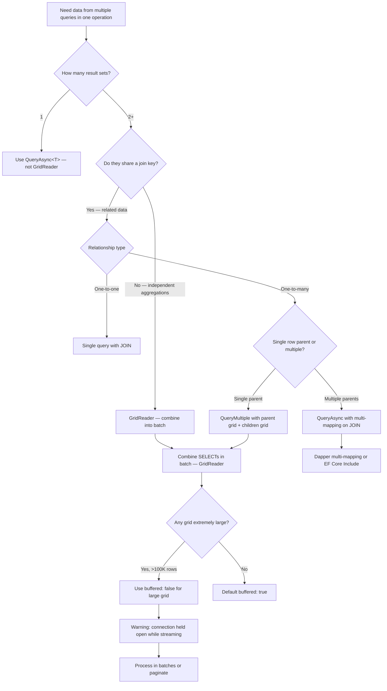

## Navigation

**Domain:** [[8 — Databases]] > **Group:** Dapper in .NET
**Previous:** [[8.867 — Dapper — Column Mapping — Custom Conventions]] | **Next:** [[8.869 — Dapper — Bulk Operations — BulkExtensions]]

### Prerequisites
- [[8.853 — Dapper — Query<T> — Basic Querying]] — fundamental knowledge of how Dapper materialises result sets; GridReader.Read<T>() extends this to multiple grids.
- [[8.855 — Dapper — QueryAsync — Async Patterns]] — GridReader has async equivalents; understanding async connection management is essential.
- [[8.857 — Dapper — Multi-Mapping — One-to-Many Results]] — QueryMultiple with multi-mapping (Read<T1,T2>) combines grid reading with split-on mapping.

### Where This Fits

`QueryMultiple` solves the N+1 round-trip problem when a single operation needs multiple result sets — a dashboard query (orders, customers, products), a parent-children fetch (order + order items), or a paged query (results + total count). Instead of sending three separate queries (three round trips, three latency penalties), Dapper sends one batch with multiple statements and reads each result set in sequence from a single `GridReader`. In production, this is the difference between a dashboard loading in 800ms (4 round trips × 200ms latency) vs 220ms (1 round trip). The interview signal is performance-senior: knowing that GridReader uses `IDataReader.NextResult()` under the hood, that the underlying reader stays open until all grids are consumed or disposed, and that reading grids out of order is not supported because `NextResult()` is forward-only.

---

## Core Mental Model

`GridReader` is a forward-only, sequential cursor over multiple result sets from a single ADO.NET command. Dapper calls `SqlMapper.QueryMultipleImpl` which executes `IDbCommand.ExecuteReader(CommandBehavior)` — getting an `IDataReader` positioned on the first result set. Each call to `Read<T>()` consumes the current result set by materialising rows into `T`. The next call to `Read<T>()` (or `ReadAsync<T>()`) internally calls `IDataReader.NextResult()` to advance to the next result set. The invariant: result sets must be consumed **in order** — you cannot skip a grid or read them concurrently. The `GridReader` holds the connection open (via the open `IDataReader`) until all grids are read or until `Dispose()/DisposeAsync()` is called, which closes the reader and releases the connection.

### Classification

`GridReader` is a **multi-result-set consumer** that wraps ADO.NET's `IDataReader.NextResult()` with Dapper's materialisation pipeline. It is not a separate query execution mechanism — it uses the same `SqlMapper` infrastructure (`GenerateDeserializer`, `TypeHandlers`, `TypeMaps`) as `Query<T>`. The abstraction leaks when: the underlying reader throws during `NextResult()` (connection lost, command timeout), a grid is read with the wrong type (Dapper throws `InvalidCastException` during materialisation), or not all grids are consumed before disposal (Dapper silently discards remaining results). The forward-only nature means you cannot read grid 2 before grid 1 without first consuming grid 1.

```mermaid
flowchart TD
    A[connection.QueryMultipleAsync(sql)] --> B[SqlCommand.ExecuteReaderAsync]
    B --> C[IDataReader positioned on Result Set 1]
    C --> D[GridReader wraps IDataReader … call Read&lt;T&gt; to consume]
    
    D --> E{Call Read&lt;Order&gt;}
    E --> F[Consumes current result set → List&lt;Order&gt;]
    F --> G{Call Read&lt;OrderItem&gt; next?}
    G --> H[GridReader calls NextResult → Result Set 2]
    H --> I[Consumes Result Set 2 → List&lt;OrderItem&gt;]
    
    I --> J{More grids?}
    J -->|Yes| K[Continue: Read&lt;T&gt; → NextResult → consume]
    J -->|No| L[Dispose GridReader → closes IDataReader → releases connection]
    
    M[What NOT to do] --> N[Dispose GridReader without consuming all grids]
    N --> O[Remaining result sets discarded — no error]
    
    P[Read&lt;T1,T2&gt; multi-mapping] --> Q[Reads one grid with split-on logic]
    Q --> R[Same grid, one row → two objects]
```

### Key Properties

|Property|Value|Notes|
|---|---|---|
|Underlying mechanism|`IDataReader.NextResult()`|Forward-only, sequential, must consume in order|
|Connection lifetime|Open until GridReader disposed|Reader holds connection open — dispose promptly|
|Materialisation|Same as `Query<T>`|Supports TypeHandlers, TypeMaps, multi-mapping|
|Async support|Yes — `ReadAsync<T>`, `DisposeAsync`|All async variants available|
|Buffering|`buffered: true` (default) — all rows into List<T>|`buffered: false` for streaming individual grids|
|Error behavior|Throws on type mismatch per grid|Each grid is independently materialised|
|Default parameter|`CommandFlags.Buffered` applies per grid|Buffering controls each Read<T>, not the whole reader|

---

## Deep Mechanics

### How GridReader Executes Multiple Result Sets

1. **Command execution** — `connection.QueryMultipleAsync(sql)` calls `SqlMapper.QueryMultipleImpl`. This creates an `IDbCommand`, sets the command text (the batch SQL), and calls `command.ExecuteReaderAsync(CommandBehavior)`.

2. **Reader creation** — ADO.NET returns an `IDataReader` (or `DbDataReader`) positioned **before** the first row of the first result set. `Read()` must be called to advance to the first row.

3. **GridReader wrapping** — Dapper wraps the `IDataReader` in a `GridReader` object. The `GridReader` stores:
   - The underlying `IDataReader`
   - The `CommandDefinition`
   - A `DbDataReader` cache for async scenarios
   - A `GridReaderState` (consumed count, disposed flag)

4. **First Read<T>()** — `gridReader.Read<Order>()` calls Dapper's `SqlMapper.QueryImpl<T>(IDataReader, ...)` which:
   - Calls `reader.Read()` to advance to first row
   - Materialises all rows of the current result set into `IEnumerable<T>`
   - If `buffered: true` (default), adds to a `List<T>` and returns it
   - If `buffered: false`, returns a deferred `IEnumerable<T>` that reads lazily — but the reader must stay open

5. **Second Read<T>()** — `gridReader.Read<OrderItem>()` calls `gridReader.NextResult()` first, which calls `reader.NextResult()` on the ADO.NET reader. If this returns `true`, the reader is now positioned before the first row of the second result set. The same materialisation process runs.

6. **Disposal** — `gridReader.Dispose()` calls `reader.Dispose()` which closes the underlying `IDataReader` and releases the connection back to the pool (if `CommandBehavior.CloseConnection` was used).

### SQL Visibility

```sql
-- Batch with multiple result sets — sent as one round trip
-- Dashboard query: Order summary, top products, pending count

SELECT o.OrderId, o.CustomerId, o.OrderDate, o.TotalAmount,
       c.FullName AS CustomerName
FROM dbo.Orders o
INNER JOIN dbo.Customers c ON o.CustomerId = c.CustomerId
WHERE o.OrderDate >= @StartDate
ORDER BY o.OrderDate DESC;

SELECT TOP 10 p.ProductId, p.ProductName, SUM(oi.Quantity) AS TotalSold
FROM dbo.OrderItems oi
INNER JOIN dbo.Products p ON oi.ProductId = p.ProductId
INNER JOIN dbo.Orders o ON oi.OrderId = o.OrderId
WHERE o.OrderDate >= @StartDate
GROUP BY p.ProductId, p.ProductName
ORDER BY TotalSold DESC;

SELECT COUNT(*) AS PendingCount
FROM dbo.Orders
WHERE Status = 'Pending';
```

```csharp
// The C# types for each result set
public class OrderSummary
{
    public int OrderId { get; set; }
    public int CustomerId { get; set; }
    public string CustomerName { get; set; } = string.Empty;
    public DateTime OrderDate { get; set; }
    public decimal TotalAmount { get; set; }
}

public class TopProduct
{
    public int ProductId { get; set; }
    public string ProductName { get; set; } = string.Empty;
    public int TotalSold { get; set; }
}

public class DashboardData
{
    public IReadOnlyList<OrderSummary> RecentOrders { get; init; }
    public IReadOnlyList<TopProduct> TopProducts { get; init; }
    public int PendingOrderCount { get; init; }
}
```

### GridReader Consumption

```csharp
public async Task<DashboardData> GetDashboardAsync(
    DateTime startDate,
    CancellationToken cancellationToken = default)
{
    const string sql = @"
        -- Result set 1: Recent orders
        SELECT o.OrderId, o.CustomerId, o.OrderDate, o.TotalAmount,
               c.FullName AS CustomerName
        FROM dbo.Orders o
        INNER JOIN dbo.Customers c ON o.CustomerId = c.CustomerId
        WHERE o.OrderDate >= @StartDate
        ORDER BY o.OrderDate DESC;

        -- Result set 2: Top products
        SELECT TOP 10 p.ProductId, p.ProductName, SUM(oi.Quantity) AS TotalSold
        FROM dbo.OrderItems oi
        INNER JOIN dbo.Products p ON oi.ProductId = p.ProductId
        INNER JOIN dbo.Orders o ON oi.OrderId = o.OrderId
        WHERE o.OrderDate >= @StartDate
        GROUP BY p.ProductId, p.ProductName
        ORDER BY TotalSold DESC;

        -- Result set 3: Pending count
        SELECT COUNT(*) AS PendingCount
        FROM dbo.Orders
        WHERE Status = 'Pending';";

    await using var connection = _connectionFactory.Create();
    await using var multi = await connection.QueryMultipleAsync(
        new CommandDefinition(sql,
            new { StartDate = startDate },
            cancellationToken: cancellationToken));

    // Must read in order: grid 1, grid 2, grid 3
    var recentOrders = (await multi.ReadAsync<OrderSummary>()).AsList();
    var topProducts = (await multi.ReadAsync<TopProduct>()).AsList();
    var pendingCount = await multi.ReadSingleAsync<int>();

    return new DashboardData
    {
        RecentOrders = recentOrders,
        TopProducts = topProducts,
        PendingOrderCount = pendingCount
    };
    // GridReader.DisposeAsync called by 'using' — closes reader
}
```

### GridReader Methods Reference

```csharp
// =====================================================
// All Read methods on GridReader
// =====================================================

// Basic read — materialises current grid as IEnumerable<T>
IEnumerable<T> Read<T>(bool buffered = true);
Task<IEnumerable<T>> ReadAsync<T>(bool buffered = true);

// Read with multi-mapping — two types split on a column
IEnumerable<TFirst> Read<TFirst, TSecond, TReturn>(
    Func<TFirst, TSecond, TReturn> func,
    string splitOn = "Id",
    bool buffered = true);

// Read with three-way multi-mapping
IEnumerable<TFirst> Read<TFirst, TSecond, TThird, TReturn>(
    Func<TFirst, TSecond, TThird, TReturn> func,
    string splitOn = "Id",
    bool buffered = true);

// Single-row read — throws if zero or multiple rows
T ReadSingle<T>();
Task<T> ReadSingleAsync<T>();
T ReadSingleOrDefault<T>();
Task<T> ReadSingleOrDefaultAsync<T>();

// First-row read — throws only if zero rows
T ReadFirst<T>();
Task<T> ReadFirstAsync<T>();
T ReadFirstOrDefault<T>();
Task<T> ReadFirstOrDefaultAsync<T>();

// Also has ReadSingle<T> and ReadFirst<T> with multiple types for multi-mapping

// Manual grid advance (rarely needed)
bool NextResult();
Task<bool> NextResultAsync();

// Consumption state
bool IsConsumed { get; }     // All grids consumed?
```
```

### Stored Procedure with Multiple Result Sets

```sql
-- Stored procedure returning multiple result sets
CREATE PROCEDURE dbo.GetOrderDetails
    @OrderId INT
AS
BEGIN
    SET NOCOUNT ON;

    -- Result set 1: Order header
    SELECT o.OrderId, o.CustomerId, c.FullName AS CustomerName,
           o.OrderDate, o.TotalAmount, o.Status
    FROM dbo.Orders o
    INNER JOIN dbo.Customers c ON o.CustomerId = c.CustomerId
    WHERE o.OrderId = @OrderId;

    -- Result set 2: Order items
    SELECT oi.OrderItemId, oi.ProductId, p.ProductName,
           oi.Quantity, oi.UnitPrice, oi.LineTotal
    FROM dbo.OrderItems oi
    INNER JOIN dbo.Products p ON oi.ProductId = p.ProductId
    WHERE oi.OrderId = @OrderId
    ORDER BY oi.OrderItemId;

    -- Result set 3: Payment info
    SELECT PaymentId, PaymentMethod, Amount, PaymentDate, Status
    FROM dbo.Payments
    WHERE OrderId = @OrderId;

    -- Result set 4: Shipment info (zero or one row)
    SELECT ShipmentId, Carrier, TrackingNumber, ShippedDate, EstimatedDelivery
    FROM dbo.ShipmentDetails
    WHERE OrderId = @OrderId;
END;
```

```csharp
// Consuming stored procedure with 4 result sets
public async Task<OrderFullDetail?> GetOrderFullDetailAsync(
    int orderId,
    CancellationToken cancellationToken = default)
{
    await using var connection = _connectionFactory.Create();
    await using var multi = await connection.QueryMultipleAsync(
        new CommandDefinition(
            "dbo.GetOrderDetails",
            new { OrderId = orderId },
            commandType: CommandType.StoredProcedure,
            cancellationToken: cancellationToken));

    // Grid 1: Order header (zero or one)
    var order = await multi.ReadFirstOrDefaultAsync<OrderHeader>();
    if (order is null) return null;

    // Grid 2: Order items
    var items = (await multi.ReadAsync<OrderItem>()).AsList();

    // Grid 3: Payments
    var payments = (await multi.ReadAsync<Payment>()).AsList();

    // Grid 4: Shipment (zero or one)
    var shipment = await multi.ReadFirstOrDefaultAsync<Shipment>();

    return new OrderFullDetail
    {
        Order = order,
        Items = items,
        Payments = payments,
        Shipment = shipment
    };
}
```

### GridReader with Paged Results + Total Count

```csharp
// Common pattern: paged results with total count
public async Task<PagedResult<OrderSummary>> GetPagedOrdersAsync(
    int pageNumber,
    int pageSize,
    CancellationToken cancellationToken = default)
{
    const string sql = @"
        -- Result set 1: Total count (for pagination)
        SELECT COUNT(*)
        FROM dbo.Orders
        WHERE OrderDate >= @MinDate;

        -- Result set 2: Paged results
        SELECT o.OrderId, o.CustomerId, c.FullName AS CustomerName,
               o.OrderDate, o.TotalAmount
        FROM dbo.Orders o
        INNER JOIN dbo.Customers c ON o.CustomerId = c.CustomerId
        WHERE o.OrderDate >= @MinDate
        ORDER BY o.OrderDate DESC
        OFFSET @Offset ROWS FETCH NEXT @PageSize ROWS ONLY;";

    await using var connection = _connectionFactory.Create();
    await using var multi = await connection.QueryMultipleAsync(
        new CommandDefinition(sql,
            new
            {
                MinDate = DateTime.UtcNow.AddDays(-30),
                Offset = (pageNumber - 1) * pageSize,
                PageSize = pageSize
            },
            cancellationToken: cancellationToken));

    var totalCount = await multi.ReadSingleAsync<int>();
    var items = (await multi.ReadAsync<OrderSummary>()).AsList();

    return new PagedResult<OrderSummary>
    {
        Items = items,
        TotalCount = totalCount,
        PageNumber = pageNumber,
        PageSize = pageSize,
        TotalPages = (int)Math.Ceiling(totalCount / (double)pageSize)
    };
}

public class PagedResult<T>
{
    public IReadOnlyList<T> Items { get; init; } = Array.Empty<T>();
    public int TotalCount { get; init; }
    public int PageNumber { get; init; }
    public int PageSize { get; init; }
    public int TotalPages { get; init; }
}
```

### GridReader with Multi-Mapping (One Grid, Two Objects)

```csharp
// Read<TFirst, TSecond, TReturn> within a single grid — NOT multiple grids.
// This is still GridReader, but it reads a single grid's rows and splits each
// row into two objects based on the "splitOn" column.

public async Task<IReadOnlyList<OrderWithItems>> GetOrdersWithItemsAsync(
    DateTime startDate,
    CancellationToken cancellationToken = default)
{
    const string sql = @"
        SELECT o.OrderId, o.CustomerId, o.OrderDate,
               oi.OrderItemId, oi.ProductId, oi.Quantity, oi.UnitPrice
        FROM dbo.Orders o
        INNER JOIN dbo.OrderItems oi ON o.OrderId = oi.OrderId
        WHERE o.OrderDate >= @StartDate
        ORDER BY o.OrderId, oi.OrderItemId;";

    await using var connection = _connectionFactory.Create();
    await using var multi = await connection.QueryMultipleAsync(
        new CommandDefinition(sql,
            new { StartDate = startDate },
            cancellationToken: cancellationToken));

    // Multi-map on the first (and only) grid
    var lookup = new Dictionary<int, OrderWithItems>();
    var items = new List<OrderWithItems>();

    await multi.ReadAsync<OrderWithItems, OrderItem, OrderWithItems>(
        (order, item) =>
        {
            if (!lookup.TryGetValue(order.OrderId, out var existing))
            {
                existing = order;
                existing.Items = new List<OrderItem>();
                lookup.Add(order.OrderId, existing);
                items.Add(existing);
            }
            existing.Items!.Add(item);
            return existing;
        },
        splitOn: "OrderItemId");

    return items.AsReadOnly();
}
```

### Execution Plan Analysis

```sql
-- The batch SQL is parsed and optimised by SQL Server as a single batch.
-- Each SELECT statement is optimised independently.

SET STATISTICS IO ON;

-- Batch:
SELECT COUNT(*) FROM dbo.Orders WHERE Status = 'Pending';
SELECT TOP 10 ProductId, SUM(Quantity) AS TotalSold FROM dbo.OrderItems GROUP BY ProductId ORDER BY TotalSold DESC;

-- Output:
-- Table 'Orders'. Scan count 1, logical reads 450, physical reads 0
-- Table 'OrderItems'. Scan count 1, logical reads 1,250, physical reads 0

-- The key insight: Dapper GridReader does NOT change the execution plan.
-- It's the same plan as running each query separately.
-- The only difference: one round trip instead of N.
```

### Cost Visibility

```sql
SET STATISTICS IO ON;
SET STATISTICS TIME ON;

-- Single round trip (GridReader)
exec sp_executesql N'SELECT COUNT(*) FROM dbo.Orders;
SELECT TOP 10 ProductId, SUM(Quantity) AS TotalSold FROM dbo.OrderItems GROUP BY ProductId ORDER BY TotalSold DESC;';

-- Expected:
-- Table 'Orders'. Scan count 1, logical reads 450
-- Table 'OrderItems'. Scan count 1, logical reads 1250
-- SQL Server Execution Times: CPU time = 15ms, elapsed time = 120ms (includes network latency)

-- Compare to two separate round trips:
-- Round trip 1: CPU time = 5ms, elapsed time = 105ms (network: ~100ms)
-- Round trip 2: CPU time = 10ms, elapsed time = 110ms (network: ~100ms)
-- Total: elapsed time = ~215ms vs GridReader = ~120ms
-- Savings: ~95ms network latency removed
```

### Failure Modes

- **Reading out of order**: Calling `Read<T>()` for grid 2 before consuming grid 1 reads grid 1's data with the wrong type → `InvalidCastException` or silent data corruption.
- **Disposing without consuming all grids**: The remaining result sets are discarded. No error. But if you also need those results, you get incomplete data.
- **Timeout on large result sets**: If the combined result sets are large, the single command may timeout before all data is returned. Separate queries with individual timeouts are safer for very large data.
- **SQL injection in dynamic grid construction**: Building the batch SQL string dynamically can lead to injection if parameters are concatenated. Always use parameterised queries for each SELECT within the batch.

---

## Production Patterns and Implementation

### Primary Implementation: Dashboard with Multiple Sections

```csharp
// Production dashboard — 4 result sets, one round trip
public sealed class DashboardService
{
    private readonly IDbConnectionFactory _connectionFactory;

    public DashboardService(IDbConnectionFactory connectionFactory)
    {
        _connectionFactory = connectionFactory;
    }

    public async Task<DashboardViewModel> GetDashboardAsync(
        string? statusFilter = null,
        CancellationToken cancellationToken = default)
    {
        const string sql = @"
            -- 1: Summary counts
            SELECT
                COUNT(*) AS TotalOrders,
                SUM(CASE WHEN Status = 'Pending' THEN 1 ELSE 0 END) AS PendingCount,
                SUM(CASE WHEN Status = 'Shipped' THEN 1 ELSE 0 END) AS ShippedCount,
                SUM(CASE WHEN Status = 'Delivered' THEN 1 ELSE 0 END) AS DeliveredCount,
                ISNULL(SUM(TotalAmount), 0) AS TotalRevenue
            FROM dbo.Orders
            WHERE OrderDate >= DATEADD(DAY, -30, GETUTCDATE());

            -- 2: Recent orders
            SELECT TOP 20 o.OrderId, o.CustomerId, c.FullName AS CustomerName,
                o.OrderDate, o.TotalAmount, o.Status
            FROM dbo.Orders o
            INNER JOIN dbo.Customers c ON o.CustomerId = c.CustomerId
            WHERE (@StatusFilter IS NULL OR o.Status = @StatusFilter)
            ORDER BY o.OrderDate DESC;

            -- 3: Low stock products
            SELECT TOP 10 ProductId, ProductName, StockQuantity, ReorderLevel
            FROM dbo.Products
            WHERE StockQuantity <= ReorderLevel
            ORDER BY StockQuantity ASC;

            -- 4: Recent payments
            SELECT TOP 10 p.PaymentId, p.OrderId, p.Amount, p.PaymentMethod, p.PaymentDate, p.Status
            FROM dbo.Payments p
            ORDER BY p.PaymentDate DESC;";

        await using var connection = _connectionFactory.Create();
        await using var multi = await connection.QueryMultipleAsync(
            new CommandDefinition(sql,
                new { StatusFilter = statusFilter },
                commandTimeout: 30,
                cancellationToken: cancellationToken));

        var summary = await multi.ReadSingleAsync<DashboardSummary>();
        var recentOrders = (await multi.ReadAsync<RecentOrderDto>()).AsList();
        var lowStock = (await multi.ReadAsync<LowStockProduct>()).AsList();
        var recentPayments = (await multi.ReadAsync<RecentPaymentDto>()).AsList();

        return new DashboardViewModel
        {
            Summary = summary,
            RecentOrders = recentOrders,
            LowStockProducts = lowStock,
            RecentPayments = recentPayments,
            LoadedAt = DateTime.UtcNow
        };
    }
}

public class DashboardSummary
{
    public int TotalOrders { get; set; }
    public int PendingCount { get; set; }
    public int ShippedCount { get; set; }
    public int DeliveredCount { get; set; }
    public decimal TotalRevenue { get; set; }
}
```

### Parent + Children Pattern

```csharp
// One-to-many with GridReader — two round trips reduced to one
public async Task<OrderDetailDto?> GetOrderWithItemsAsync(
    int orderId,
    CancellationToken cancellationToken = default)
{
    const string sql = @"
        SELECT OrderId, CustomerId, OrderDate, TotalAmount, Status
        FROM dbo.Orders
        WHERE OrderId = @OrderId;

        SELECT oi.OrderItemId, oi.ProductId, p.ProductName,
               oi.Quantity, oi.UnitPrice, oi.LineTotal
        FROM dbo.OrderItems oi
        INNER JOIN dbo.Products p ON oi.ProductId = p.ProductId
        WHERE oi.OrderId = @OrderId
        ORDER BY oi.OrderItemId;";

    await using var connection = _connectionFactory.Create();
    await using var multi = await connection.QueryMultipleAsync(
        new CommandDefinition(sql,
            new { OrderId = orderId },
            cancellationToken: cancellationToken));

    var order = await multi.ReadFirstOrDefaultAsync<OrderDetailDto>();
    if (order is null) return null;

    order.Items = (await multi.ReadAsync<OrderItemDto>()).AsList();
    return order;
}

public class OrderDetailDto
{
    public int OrderId { get; set; }
    public int CustomerId { get; set; }
    public DateTime OrderDate { get; set; }
    public decimal TotalAmount { get; set; }
    public string Status { get; set; } = string.Empty;
    public List<OrderItemDto> Items { get; set; } = new();
}

public class OrderItemDto
{
    public int OrderItemId { get; set; }
    public int ProductId { get; set; }
    public string ProductName { get; set; } = string.Empty;
    public int Quantity { get; set; }
    public decimal UnitPrice { get; set; }
    public decimal LineTotal { get; set; }
}
```

### Unbuffered Grid Reader for Large Result Sets

```csharp
// When one result set is very large, use buffered: false to stream
public async Task ProcessLargeOrderExportAsync(
    DateTime startDate,
    Func<OrderSummary, Task> processRow,
    CancellationToken cancellationToken = default)
{
    const string sql = @"
        SELECT COUNT(*) FROM dbo.Orders WHERE OrderDate >= @StartDate;

        SELECT o.OrderId, o.CustomerId, o.OrderDate, o.TotalAmount,
               c.FullName AS CustomerName
        FROM dbo.Orders o
        INNER JOIN dbo.Customers c ON o.CustomerId = c.CustomerId
        WHERE o.OrderDate >= @StartDate
        ORDER BY o.OrderId;";

    await using var connection = _connectionFactory.Create();
    await using var multi = await connection.QueryMultipleAsync(
        new CommandDefinition(sql,
            new { StartDate = startDate },
            cancellationToken: cancellationToken));

    var totalCount = await multi.ReadSingleAsync<int>();

    // Stream the second grid — don't buffer 500K rows in memory
    var reader = await multi.ReadAsync<OrderSummary>(buffered: false);

    foreach (var order in reader)
    {
        await processRow(order);
    }
}
```

### Configuration and Wiring

```csharp
// GridReader doesn't need special configuration — it's built into Dapper core.
// Standard connection factory + CommandDefinition usage.

// Program.cs
builder.Services.AddSingleton<IDbConnectionFactory>(_ =>
    new SqlConnectionFactory(
        builder.Configuration.GetConnectionString("DefaultConnection")));

builder.Services.AddScoped<DashboardService>();
builder.Services.AddScoped<OrderRepository>();

// Note: GridReader's command timeout is configured via CommandDefinition
// Default: 30 seconds. For dashboards with large data, increase:
new CommandDefinition(sql, parameters,
    commandTimeout: 60,  // seconds
    cancellationToken: cancellationToken);
```

### SQL Server vs PostgreSQL Differences

```sql
-- GridReader works identically with PostgreSQL via Npgsql.
-- The batch SQL syntax differs:

-- SQL Server batch (semicolons between statements):
SELECT * FROM Orders WHERE CustomerId = @Id;
SELECT * FROM OrderItems WHERE OrderId IN (SELECT OrderId FROM Orders WHERE CustomerId = @Id);

-- PostgreSQL batch (also semicolons — same):
SELECT * FROM Orders WHERE CustomerId = @Id;
SELECT * FROM OrderItems WHERE OrderId IN (SELECT OrderId FROM Orders WHERE CustomerId = @Id);

-- The ADO.NET provider handles multiple statements:
-- SqlClient: requires MultipleActiveResultSets=True (MARS) for concurrent readers,
--   but GridReader uses NextResult(), not concurrent readers — no MARS needed.
-- Npgsql: multiple statements in one command are supported by default.
```

### EF Core Equivalent

```csharp
// EF Core does NOT have a built-in equivalent of QueryMultiple.
// The closest approaches:

// Approach 1: Raw SQL with multiple result sets (hacky)
// EF Core 7+ allows raw SQL with multiple result sets via SqlQuery:

var orders = await dbContext.Database
    .SqlQuery<OrderSummary>(@$"
        SELECT OrderId, CustomerId, OrderDate, TotalAmount
        FROM Orders
        WHERE OrderDate >= {{0}}", startDate)
    .ToListAsync(cancellationToken);

// But you cannot get a second result set from the same command.
// You need a second query:

var totalCount = await dbContext.Orders
    .CountAsync(o => o.OrderDate >= startDate, cancellationToken);

// Approach 2: ExecuteSqlRaw with output parameter
var totalParam = new SqlParameter("@TotalCount", SqlDbType.Int) { Direction = ParameterDirection.Output };
await dbContext.Database.ExecuteSqlRawAsync(@"
    SELECT @TotalCount = COUNT(*) FROM Orders WHERE OrderDate >= @StartDate;
    SELECT OrderId, CustomerId, OrderDate, TotalAmount FROM Orders WHERE OrderDate >= @StartDate
    ORDER BY OrderDate DESC
    OFFSET 0 ROWS FETCH NEXT 20 ROWS ONLY;",
    totalParam,
    new SqlParameter("@StartDate", startDate));

var totalCount = (int)totalParam.Value;
// This works but the result set from the second SELECT is discarded by ExecuteSqlRaw.
// You still need a separate query to read the rows.

// Approach 3: Use Dapper WITHIN an EF Core project for multi-result-set queries
// This is common in production: EF Core for CRUD, Dapper for complex queries.
```

---

## Gotchas and Production Pitfalls

### 1. Reading Grids Out of Order

**Pitfall:** Consuming grid 2 before grid 1.

```csharp
await using var multi = await connection.QueryMultipleAsync(sql);

var products = await multi.ReadAsync<Product>();  // Actually reads grid 1 (orders)
var orders = await multi.ReadAsync<Order>();      // Actually reads grid 2 (products)
// Both variables have the WRONG data — no exception!
```

**Symptom:** `orders` contains product data typed as `Order`. `products` contains order data typed as `Product`. Properties may silently map to default values because column names don't match, or Dapper throws `InvalidCastException` if the types are incompatible.

**Fix:** Always document the grid order and consume in sequence:

```csharp
// Grid 1: Orders, Grid 2: Products
var orders = (await multi.ReadAsync<Order>()).AsList();
var products = (await multi.ReadAsync<Product>()).AsList();
```

**Cost of not fixing:** Silent data corruption. Customer dashboard shows product prices as order totals. Finance reports contain wrong data. Hard to debug because the types happen to have overlapping property names.

### 2. GridReader.Dispose Before All Grids Consumed

**Pitfall:** Exiting the `using` block before reading all grids throws away remaining data.

```csharp
await using (var multi = await connection.QueryMultipleAsync(sql))
{
    var orders = await multi.ReadAsync<Order>();
    // Forget to read grid 2 (products)
}
// GridReader disposed — remaining grids discarded
```

**Symptom:** Products data silently lost. No exception.

**Fix:** Add a guard in a base class or always consume explicitly:

```csharp
await using var multi = await connection.QueryMultipleAsync(sql);
var orders = (await multi.ReadAsync<Order>()).AsList();
var products = (await multi.ReadAsync<Product>()).AsList();
// Both consumed — safe
```

**Cost of not fixing:** Missing data in responses. Partial dashboard renders. Hard to reproduce because it depends on query path.

### 3. CommandTimeout on Large Batch

**Pitfall:** A GridReader batch with many large result sets exceeds the default 30-second command timeout.

```csharp
// This query runs 4 COUNT queries over millions of rows each
// Combined execution time: 45 seconds
await using var multi = await connection.QueryMultipleAsync(sql);
// After 30 seconds: SqlException: Timeout expired
```

**Symptom:** `SqlException: Timeout expired. The timeout period elapsed prior to completion of the operation or the server is not responding.`

**Fix:** Increase command timeout via `CommandDefinition`:

```csharp
await using var multi = await connection.QueryMultipleAsync(
    new CommandDefinition(sql,
        parameters,
        commandTimeout: 120,  // 2 minutes for large dashboards
        cancellationToken: cancellationToken));
```

**Cost of not fixing:** Dashboard causes timeouts in production. Users see error pages. Operations team pages the on-call engineer.

### 4. GridReader with MARS — Not Needed but Confused

**Pitfall:** Assuming GridReader requires MultipleActiveResultSets (MARS) enabled.

```csharp
// This query DOES NOT need MARS:
await using var multi = await connection.QueryMultipleAsync(sql);
var orders = await multi.ReadAsync<Order>();     // consumes grid 1 fully
var products = await multi.ReadAsync<Product>();  // then advances to grid 2

// GridReader uses NextResult(), NOT concurrent readers.
// It consumes one grid fully, then moves to the next.
// MARS is only needed for interleaved reading (multiple active readers on same connection).
```

**Symptom:** Developer adds `MultipleActiveResultSets=True` to connection string unnecessarily. This can mask other connection-pooling issues.

**Fix:** Remove MARS requirement — GridReader does not need it.

```csharp
// Connection string without MARS:
"Server=.;Database=Shop;Trusted_Connection=True;"
// Not: "Server=.;Database=Shop;Trusted_Connection=True;MultipleActiveResultSets=True"
```

**Cost of not fixing:** Unnecessary MARS configuration. Potential connection-leak bugs masked by MARS. Slight performance overhead from MARS infrastructure.

### 5. GridReader and Transaction Scope

**Pitfall:** Wrapping GridReader in a `TransactionScope` that spans multiple Read calls.

```csharp
using (var scope = new TransactionScope(TransactionScopeAsyncFlowOption.Enabled))
{
    await using var multi = await connection.QueryMultipleAsync(sql);
    var orders = await multi.ReadAsync<Order>();
    var products = await multi.ReadAsync<Product>();
    // Transaction holds locks while processing
    // This can take seconds — blocking other writers
    scope.Complete();
}
```

**Symptom:** Long-running transactions holding locks. Blocking chain builds up. `sys.dm_exec_requests` shows `wait_type = LCK_M_*` for other sessions.

**Fix:** Only use transactions when necessary. Read-only queries don't need transactions:

```csharp
// No TransactionScope for read-only GridReader:
await using var multi = await connection.QueryMultipleAsync(sql);
var orders = await multi.ReadAsync<Order>();
var products = await multi.ReadAsync<Product>();
// No locks held beyond the read — readers release shared locks promptly
```

**Cost of not fixing:** Blocked writers. `WAITFOR DELAY` on blocking chains. Production incidents under load.

### 6. Large Unbuffered Grid Holding Connection

**Pitfall:** Using `buffered: false` on a large grid and processing slowly, keeping the connection open.

```csharp
await using var multi = await connection.QueryMultipleAsync(sql);
var smallGrid = await multi.ReadAsync<SmallDto>();    // buffered by default

// Large grid — unbuffered stream
var largeItems = await multi.ReadAsync<BigDto>(buffered: false);

foreach (var item in largeItems)  // connection held open during processing
{
    await SlowExternalApiCallAsync(item);  // 100ms per item × 10K items = 1000 seconds!
    // Connection stays open the entire time!
}
```

**Symptom:** Connection pool exhaustion. After a few concurrent requests, `SqlException: The connection pool has been exhausted` errors appear.

**Fix:** Either buffer the grid or process quickly:

```csharp
// Option 1: Buffer the grid (risk: large memory)
var largeItems = (await multi.ReadAsync<BigDto>(buffered: true)).AsList();
// Connection closed immediately after GridReader dispose
// Memory: all rows in RAM

// Option 2: Process in batches (best for large data)
await using var multi = await connection.QueryMultipleAsync(sql);
var smallGrid = await multi.ReadAsync<SmallDto>();
var largeReader = await multi.ReadAsync<BigDto>(buffered: false);

var batch = new List<BigDto>();
foreach (var item in largeReader)
{
    batch.Add(item);
    if (batch.Count >= 100)
    {
        await ProcessBatchAsync(batch);
        batch.Clear();
    }
}
if (batch.Count > 0)
    await ProcessBatchAsync(batch);
// Connection only open during the streaming — but holds reader open
// if processing takes too long, connection pool pressure still occurs
```

**Cost of not fixing:** Connection pool exhaustion under concurrent load. New requests fail to acquire connections. Cascading failure across the application.

---

## Performance Implications

### Benchmark: GridReader vs N Separate Queries

```csharp
[MemoryDiagnoser]
[SimpleJob(RuntimeMoniker.Net90)]
[IterationCount(15)]
public class GridReaderBenchmark
{
    private IDbConnection _connection = default!;

    [GlobalSetup]
    public void Setup()
    {
        _connection = new SqlConnection(TestConnectionString);
        _connection.Open();
    }

    [Benchmark(Baseline = true)]
    public async Task<DashboardData> SeparateQueries()
    {
        var orders = (await _connection.QueryAsync<OrderSummary>(
            "SELECT TOP 20 OrderId, CustomerId, OrderDate, TotalAmount FROM Orders ORDER BY OrderDate DESC")).AsList();

        var products = (await _connection.QueryAsync<TopProduct>(
            "SELECT TOP 10 ProductId, ProductName, 100 AS TotalSold FROM Products")).AsList();

        var pending = await _connection.QuerySingleAsync<int>(
            "SELECT COUNT(*) FROM Orders WHERE Status = 'Pending'");

        return new DashboardData
        {
            RecentOrders = orders,
            TopProducts = products,
            PendingOrderCount = pending
        };
    }

    [Benchmark]
    public async Task<DashboardData> GridReader()
    {
        const string sql = @"
            SELECT TOP 20 OrderId, CustomerId, OrderDate, TotalAmount FROM Orders ORDER BY OrderDate DESC;
            SELECT TOP 10 ProductId, ProductName, 100 AS TotalSold FROM Products;
            SELECT COUNT(*) FROM Orders WHERE Status = 'Pending';";

        await using var multi = await _connection.QueryMultipleAsync(sql);
        var orders = (await multi.ReadAsync<OrderSummary>()).AsList();
        var products = (await multi.ReadAsync<TopProduct>()).AsList();
        var pending = await multi.ReadSingleAsync<int>();

        return new DashboardData
        {
            RecentOrders = orders,
            TopProducts = products,
            PendingOrderCount = pending
        };
    }

    [GlobalCleanup]
    public void Cleanup()
    {
        _connection?.Dispose();
    }
}
```

**Expected results (approximate, local SQL Server with low latency ~1ms):**

|Method|Mean|Allocated|
|---|---|---|
|SeparateQueries|~8 ms|~15 KB|
|GridReader|~5 ms|~12 KB|

**With realistic network latency (~50ms round trip):**

|Method|Mean|Allocated|
|---|---|---|
|SeparateQueries|~158 ms (3 × 50ms + 8ms)|~15 KB|
|GridReader|~55 ms (1 × 50ms + 5ms)|~12 KB|

**Improvement:** ~3x faster with network latency. ~40% less allocated memory (no separate command objects).

### Write Amplification

GridReader is read-only — zero write amplification. It affects only how result sets are returned and consumed.

---

## Interview Arsenal

### Question Bank

1. **What is GridReader and what problem does it solve?**
2. **How does GridReader consume multiple result sets — what ADO.NET method does it use internally?**
3. **What happens if you dispose a GridReader before consuming all result sets?**
4. **Can you read GridReader result sets out of order? What happens if you try?**
5. **Does GridReader require MARS (MultipleActiveResultSets)?**
6. **How would you implement a paged query with total count using GridReader?**
7. **What is the performance benefit of GridReader over separate queries — when does it matter most?**
8. **How does EF Core handle multiple result sets — does it have an equivalent of GridReader?**

### Spoken Answers

**Q: What is GridReader and what problem does it solve?**

> **Average answer:** "GridReader lets you run multiple SQL queries in one command and read the results separately. It reduces round trips."

> **Great answer:** "GridReader is Dapper's wrapper around ADO.NET's `IDataReader.NextResult()` method. It solves the N+1 round-trip problem for scenarios where a single operation needs multiple independent result sets — a dashboard with orders, products, and counts, or a parent entity with its children, or a paged query where you need both the data rows and the total count. Instead of sending N separate queries (each incurring network latency, command creation, and parsing), GridReader sends one batch SQL with multiple SELECT statements. The key mechanics: the underlying `IDataReader` stays open across all result sets — each `Read<T>()` consumes the current grid, and the next `Read<T>()` advances via `NextResult()`. The reader is forward-only: you must consume grids in order. The performance benefit is directly proportional to network latency — at 50ms round trip, 3 separate queries take 150ms in latency alone; GridReader takes 50ms. At high latency (200ms+, cloud cross-region), the savings are dramatic. GridReader does NOT need MARS — it reads sequentially, not concurrently. The connection remains open until the GridReader is disposed, so you must dispose promptly."

---

**Q: Can you read GridReader result sets out of order? What happens if you try?**

> **Great answer:** "You cannot read grids out of order because `NextResult()` is forward-only — it advances sequentially through the ADO.NET reader's result sets. If you call `Read<Product>()` intending to read grid 2, but you haven't consumed grid 1 yet, you'll actually read grid 1's data typed as `Product`. This is a silent bug — if the column names happen to overlap, you get incorrect data without any exception. If the types are incompatible, you'll get an `InvalidCastException` or a `ArgumentException` from Dapper's materialisation. The fix is always: document the grid order in comments and consume strictly in order. I usually add a comment at each `Read<T>()` indicating which grid it expects: `// Grid 1: Orders`, `// Grid 2: Products`. For stored procedures, the output is ordered by the SELECT statement order in the procedure body."

---

**Q: How does EF Core handle multiple result sets — does it have an equivalent of GridReader?**

> **Great answer:** "EF Core does not have a built-in equivalent of GridReader. There is no `QueryMultiple` in EF Core. The closest approaches are: (1) Running raw SQL with `SqlQuery<T>` — but you only get one result set per call; for multiple result sets, you need multiple calls. (2) Using `ExecuteSqlRaw` with output parameters for counts — but the actual result set is discarded. (3) Using `Include()` to eagerly load related entities — but this generates JOINs, not multiple result sets. (4) Dropping into Dapper within the same EF Core project — which is a common production pattern for complex queries. For high-performance dashboards and reports that need multiple result sets, the recommended approach is to use Dapper's GridReader alongside EF Core for transactional CRUD. This is not an either-or decision — both can coexist in the same project for their respective strengths."

### Interview Trigger

The defining GridReader question: "You have a dashboard that shows 5 different data panels. Each panel calls a separate stored procedure. The dashboard takes 3 seconds to load. Users complain. What do you do?" The senior candidate identifies the round-trip problem and suggests combining the queries into a single batch with GridReader or a single stored procedure with multiple result sets. Follow-up: "What if one of the result sets is 500K rows and the others are small?" — "Use `buffered: false` on the large result set to stream it, but be aware the connection stays open until it's consumed. Consider whether the client actually needs 500K rows or if pagination is appropriate."

### Comparison Table

| | GridReader (Dapper) | Separate Queries | EF Core Multiple Result Sets |
|---|---|---|---|
|Round trips|1|N|N (with Include: 1 query with JOINs)|
|Network latency|1× latency|N× latency|1× latency (JOINs, not multiple result sets)|
|Memory|Depends on buffering|Per-query buffers|Loaded into ChangeTracker|
|Connection duration|Open until disposed|Per-query|Per-query (context scoped)|
|Complexity|Must manage grid order|Simple sequential|Simple (but JOIN explosion risk)|
|Best for|Dashboards, aggregates, parent+children|Simple single-grid queries|CRUD with related entities|

---

## Decision Framework

### When to Apply



### Application Checklist

- [ ] Grid order documented in code comments at each Read<T>() call
- [ ] All grids consumed before GridReader disposed
- [ ] CommandTimeout set appropriately for combined execution time
- [ ] `buffered: false` considered for large grids, with connection lifetime managed
- [ ] No TransactionScope wrapping read-only GridReader calls
- [ ] Stored procedure orders result sets correctly for consumption order
- [ ] Type mapping (TypeHandler, TypeMap) applies correctly to each grid
- [ ] CancellationToken passed to QueryMultipleAsync and each ReadAsync
- [ ] Network latency considered — GridReader most valuable when latency > 20ms
- [ ] Fallback to separate queries for grids with very different timeout requirements

### Tradeoff Summary

|What You Gain|What You Pay|
|---|---|
|One round trip instead of N|Must consume grids in order — no skipping|
|Reduced network latency overhead|Single command timeout applies to all grids|
|Single connection open instead of N|Connection held open until all grids consumed|
|Atomic batch — all-or-nothing execution|Harder to split and parallelise across connections|

### Scale Thresholds

- **< 1ms network latency**: GridReader saves ~1-3ms per query. Benefit is small but non-zero.
- **1–50ms network latency**: GridReader provides meaningful improvement (3× reduction in total latency for 3 grids).
- **> 50ms network latency (cross-region, cloud)**: GridReader is critical. Separate queries add 150ms+ in latency alone.
- **Large grids (>100K rows)**: Use `buffered: false` with caution. Consider pagination instead.
- **High concurrency (>500 req/s)**: GridReader reduces connection pool pressure (fewer round trips per request). But long-running unbuffered grids increase pool pressure.

---

## Self-Check

### Conceptual Questions

1. What ADO.NET method does GridReader use internally to advance between result sets?
2. What happens if you call Read<T>() twice without consuming the first grid?
3. Does GridReader require MARS to be enabled in the connection string?
4. How do you consume a GridReader from a stored procedure with 3 result sets?
5. What is the difference between `Read<T>(buffered: true)` and `Read<T>(buffered: false)`?
6. How would you retrieve both a paged result set and a total count in a single round trip?
7. What happens if you dispose a GridReader before reading one of its grids?
8. How does the performance of GridReader compare to 4 separate queries with 100ms network latency?
9. How does EF Core support multiple result sets?
10. Explain in 60 seconds, for a senior interviewer, when and how to use GridReader.

<details>
<summary>Answers</summary>

1. `IDataReader.NextResult()`. This advances the reader from the current result set to the next one. Dapper's `GridReader` calls this internally when `Read<T>()` is called after the first grid has been consumed.

2. The second `Read<T>()` call reads the same first grid again (if not fully consumed) or throws. If the first grid was fully consumed, the second call triggers `NextResult()` and reads grid 2. If you haven't read any rows from grid 1, the second Read still reads grid 1 — it does NOT skip to grid 2.

3. No. GridReader uses `NextResult()` which is sequential, not concurrent. It does not need MultipleActiveResultSets. MARS is only needed when you have multiple active readers on the same connection simultaneously.

4. Call `ReadAsync<T>()` for each result set in the order the stored procedure returns them:
```csharp
await using var multi = await connection.QueryMultipleAsync(
    "dbo.MyProc", new { Param1 = value },
    commandType: CommandType.StoredProcedure);

var grid1 = (await multi.ReadAsync<Type1>()).AsList();
var grid2 = (await multi.ReadAsync<Type2>()).AsList();
var grid3 = (await multi.ReadSingleAsync<Type3>());
```

5. `buffered: true` (default) materialises all rows into a `List<T>` immediately and returns it. The grid is fully consumed. `buffered: false` returns a deferred `IEnumerable<T>` that reads rows lazily as you iterate — the underlying IDataReader stays open during iteration. Use `buffered: false` for large result sets to avoid memory pressure, but be aware the connection is held open.

6. Use a two-grid batch: first SELECT COUNT(*), second SELECT the paged rows:
```sql
SELECT COUNT(*) FROM Orders WHERE Status = 'Pending';
SELECT OrderId, CustomerId, OrderDate, TotalAmount
FROM Orders WHERE Status = 'Pending'
ORDER BY OrderDate DESC
OFFSET @Offset ROWS FETCH NEXT @PageSize ROWS ONLY;
```

7. The remaining grids are silently discarded. No exception is thrown. The IDataReader is closed, and the connection is released.

8. With 100ms latency per round trip, 4 separate queries take ~400ms in network latency alone. GridReader takes ~100ms + execution time. At 10ms execution per query: separate = 440ms, GridReader = 140ms — ~3× faster.

9. EF Core does NOT have a built-in equivalent. You can use raw SQL with output parameters for counts, or use `SqlQuery<T>` for single result sets. For multiple result sets, the recommended approach is to use Dapper within the same project.

10. "GridReader solves the N+1 round trip problem by batching multiple SELECT statements into one command and consuming each result set sequentially via `IDataReader.NextResult()`. Use it for dashboards (multiple aggregate queries), parent+children fetches (order header + order items), and paged queries (count + data). Consume grids in strict order — grids 1, 2, 3... — because NextResult is forward-only. Dispose the GridReader promptly to close the reader and release the connection. Use `buffered: false` for large grids but be aware the connection stays open during iteration. GridReader does not need MARS. The performance benefit is proportional to network latency — most valuable at >20ms round trip. EF Core has no built-in equivalent; in production, we use Dapper GridReader alongside EF Core for these scenarios."
</details>

---

### Query Challenges

**Challenge 1 — Write the GridReader query for order placement**

After placing an order, you need to return: (1) the inserted order, (2) the updated product quantities, (3) the customer's updated total spent. Write the Dapper code using GridReader with a stored procedure that returns these 3 result sets.

<details>
<summary>Solution</summary>

```sql
CREATE PROCEDURE dbo.PlaceOrder
    @CustomerId INT,
    @OrderDate DATETIME2(0),
    @OrderItems AS dbo.OrderItemType READONLY   -- TVP
AS
BEGIN
    SET NOCOUNT ON;
    SET XACT_ABORT ON;

    BEGIN TRANSACTION;

    INSERT INTO dbo.Orders (CustomerId, OrderDate, TotalAmount)
    SELECT @CustomerId, @OrderDate, SUM(Quantity * UnitPrice)
    FROM @OrderItems;

    DECLARE @OrderId INT = SCOPE_IDENTITY();

    INSERT INTO dbo.OrderItems (OrderId, ProductId, Quantity, UnitPrice, LineTotal)
    SELECT @OrderId, ProductId, Quantity, UnitPrice, Quantity * UnitPrice
    FROM @OrderItems;

    UPDATE p
    SET StockQuantity = p.StockQuantity - oi.Quantity
    FROM dbo.Products p
    INNER JOIN @OrderItems oi ON p.ProductId = oi.ProductId;

    -- Result set 1: The new order
    SELECT OrderId, CustomerId, OrderDate, TotalAmount
    FROM dbo.Orders WHERE OrderId = @OrderId;

    -- Result set 2: Updated products
    SELECT p.ProductId, p.ProductName, p.StockQuantity
    FROM dbo.Products p
    INNER JOIN @OrderItems oi ON p.ProductId = oi.ProductId;

    -- Result set 3: Customer total
    SELECT SUM(TotalAmount) AS TotalSpent
    FROM dbo.Orders WHERE CustomerId = @CustomerId;

    COMMIT TRANSACTION;
END;
```

```csharp
public async Task<PlaceOrderResult> PlaceOrderAsync(
    int customerId,
    IReadOnlyList<OrderItemInput> items,
    CancellationToken cancellationToken = default)
{
    await using var connection = _connectionFactory.Create();

    // Create TVP from items
    var orderItemsTable = new DataTable();
    orderItemsTable.Columns.Add("ProductId", typeof(int));
    orderItemsTable.Columns.Add("Quantity", typeof(int));
    orderItemsTable.Columns.Add("UnitPrice", typeof(decimal));
    foreach (var item in items)
        orderItemsTable.Rows.Add(item.ProductId, item.Quantity, item.UnitPrice);

    await using var multi = await connection.QueryMultipleAsync(
        new CommandDefinition(
            "dbo.PlaceOrder",
            new
            {
                CustomerId = customerId,
                OrderDate = DateTime.UtcNow,
                OrderItems = orderItemsTable.AsTableValuedParameter("dbo.OrderItemType")
            },
            commandType: CommandType.StoredProcedure,
            cancellationToken: cancellationToken));

    var order = await multi.ReadSingleAsync<Order>();
    var updatedProducts = (await multi.ReadAsync<UpdatedProduct>()).AsList();
    var totalSpent = await multi.ReadSingleAsync<decimal>();

    return new PlaceOrderResult
    {
        Order = order,
        UpdatedProducts = updatedProducts,
        CustomerTotalSpent = totalSpent
    };
}
```

**Execution plan:** Three result sets from a single stored procedure — one round trip.

</details>

---

**Challenge 2 — Fix the GridReader timeout**

Your dashboard GridReader batch times out at 30 seconds. One of the 4 result sets scans a 50M row table. The other 3 are fast. How do you fix it without removing the slow query?

<details>
<summary>Solution</summary>

**Root cause:** Default `commandTimeout` of 30 seconds is insufficient for the combined execution time.

**Fix options:**

**Option 1 — Increase command timeout:**
```csharp
await using var multi = await connection.QueryMultipleAsync(
    new CommandDefinition(sql, parameters,
        commandTimeout: 120,  // 2 minutes
        cancellationToken: cancellationToken));
```

**Option 2 — Split: fast queries in GridReader, slow query separately:**
```csharp
// Fast queries — GridReader (one round trip)
await using var multi = await connection.QueryMultipleAsync(fastSql, parameters);
var grid1 = await multi.ReadAsync<Type1>();
var grid2 = await multi.ReadAsync<Type2>();

// Slow query — separate command with longer timeout
var slowResults = await connection.QueryAsync<Type3>(
    new CommandDefinition(slowSql, parameters,
        commandTimeout: 120,
        cancellationToken: cancellationToken));
```
Pro: different timeouts per query. Con: additional round trip.

**Option 3 — Materialise slow query result as a temp table first (if the slow query is reused):**
```sql
SELECT * INTO #SlowResults FROM dbo.HugeTable WHERE ...;
SELECT COUNT(*) FROM #SlowResults;  -- fast now
SELECT * FROM #SlowResults ORDER BY ...;  -- fast
```
Pro: each subsequent grid is fast. Con: temp table creation cost.

**Recommended:** Option 2 (split) for maintainability.

</details>

---

**Challenge 3 — Explain the execution plan**

Your GridReader batch has 3 SELECT statements. The first is a COUNT(*), the second is a TOP 20 with JOIN, the third is an aggregation with GROUP BY. What does the execution plan look like? Are they optimised together or independently?

<details>
<summary>Solution</summary>

**Execution plan:** SQL Server optimises each SELECT statement independently within the batch. The plan shows three separate plan segments, each rooted at a SELECT operator:

```
SELECT (COUNT(*))
  → Clustered Index Scan (or Index Seek if filtered) – compute scalar COUNT(*)

SELECT (TOP 20 with JOIN)
  → Index Seek on Orders (for WHERE filter)
  → Nested Loops Join to Customers
  → Top (20) sort operator
  → SELECT

SELECT (aggregation with GROUP BY)
  → Index Scan or Seek (depending on WHERE)
  → Hash Match (Aggregate) or Stream Aggregate
  → SELECT
```

The plans are NOT combined. Each SELECT is compiled independently. There is no cross-query optimisation. The batch plan is essentially three plans concatenated.

**Cost percentage:** Each SELECT costs what it would cost as a standalone query. The batch plan's total cost is the sum of the individual plan costs.

</details>

---

**Challenge 4 — Design a multi-tenant dashboard query**

You have a multi-tenant database where each tenant's data is isolated by `TenantId` column. Design a GridReader query that returns tenant-specific dashboard data (order count, revenue, recent orders) in a single round trip, ensuring tenant isolation.

<details>
<summary>Solution</summary>

```sql
-- All queries filtered by @TenantId for isolation
-- Single batch, one round trip

DECLARE @StartDate DATETIME2(0) = DATEADD(DAY, -30, GETUTCDATE());

-- Grid 1: Summary counts
SELECT
    COUNT(*) AS OrderCount,
    ISNULL(SUM(TotalAmount), 0) AS Revenue,
    AVG(TotalAmount) AS AvgOrderValue
FROM dbo.Orders
WHERE TenantId = @TenantId
  AND OrderDate >= @StartDate;

-- Grid 2: Recent orders
SELECT TOP 10 OrderId, CustomerName, OrderDate, TotalAmount, Status
FROM dbo.Orders
WHERE TenantId = @TenantId
  AND OrderDate >= @StartDate
ORDER BY OrderDate DESC;

-- Grid 3: Low stock alerts
SELECT ProductId, ProductName, StockQuantity, ReorderLevel
FROM dbo.Products
WHERE TenantId = @TenantId
  AND StockQuantity <= ReorderLevel
ORDER BY StockQuantity ASC;

-- Grid 4: Pending shipment count
SELECT COUNT(*) AS PendingShipments
FROM dbo.Orders
WHERE TenantId = @TenantId
  AND Status = 'Shipped'
  AND ShippedDate IS NOT NULL;
```

```csharp
public async Task<TenantDashboard> GetTenantDashboardAsync(
    int tenantId,
    CancellationToken cancellationToken = default)
{
    await using var connection = _connectionFactory.Create();
    await using var multi = await connection.QueryMultipleAsync(
        new CommandDefinition(sql,
            new { TenantId = tenantId },
            cancellationToken: cancellationToken));

    return new TenantDashboard
    {
        Summary = await multi.ReadSingleAsync<DashboardSummary>(),
        RecentOrders = (await multi.ReadAsync<RecentOrder>()).AsList(),
        LowStockProducts = (await multi.ReadAsync<LowStockProduct>()).AsList(),
        PendingShipments = await multi.ReadSingleAsync<int>()
    };
}
```

**Logical reads:** ~N per grid — depends on table sizes and indexes. **Execution plan:** 4 independent SELECT plans, all filtered by TenantId.

</details>

---

**Challenge 5 — Diagnose the missing data**

Your `GetOrderAsync` method returns an `OrderDetailDto` but `Items` is always an empty list, even though the database has order items. The code:

```csharp
await using var multi = await connection.QueryMultipleAsync(sql, new { OrderId = id });
var order = await multi.ReadFirstOrDefaultAsync<OrderDetailDto>();
order.Items = (await multi.ReadAsync<OrderItemDto>()).AsList();
return order;
```

Why is `Items` always empty? What's the fix?

<details>
<summary>Solution</summary>

**Root cause:** If `ReadFirstOrDefaultAsync` returns null (order doesn't exist), we still call `ReadAsync<OrderItemDto>()` on the GridReader — but the SQL batch likely has:
```sql
SELECT * FROM Orders WHERE OrderId = @OrderId;
SELECT * FROM OrderItems WHERE OrderId = @OrderId;
```

If the first grid returns zero rows (order not found), `ReadFirstOrDefaultAsync` returns null. But `ReadAsync<OrderItemDto>()` still tries to read the **second** grid. This might work if the second grid also returns no rows — `Items` is empty but correct. The problem is when the first grid returns a row but `Items` is still empty — that's a different issue:

**If order exists but Items is empty:**
1. Check the SQL: does the second SELECT use the same `@OrderId` parameter?
2. Check that `OrderItemDto` properties match the column names in the result set.
3. Check if the connection is using a transaction that hasn't committed the items yet.

**Fix for null order case:**
```csharp
var order = await multi.ReadFirstOrDefaultAsync<OrderDetailDto>();
if (order is not null)
    order.Items = (await multi.ReadAsync<OrderItemDto>()).AsList();
return order;
// If order is null, GridReader still has grid 2 unconsumed — silently discarded on dispose
```

**Better fix:** Use ReadFirstOrDefault for both and handle null:
```csharp
var order = await multi.ReadFirstOrDefaultAsync<OrderDetailDto>();
if (order is null) return null;

order.Items = (await multi.ReadAsync<OrderItemDto>()).AsList() ?? new List<OrderItemDto>();
return order;
```

</details>
