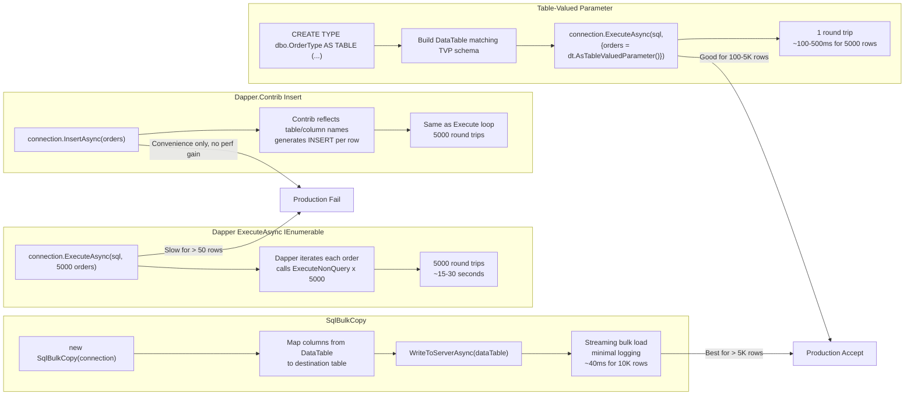
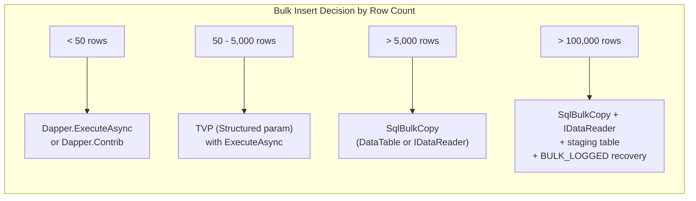
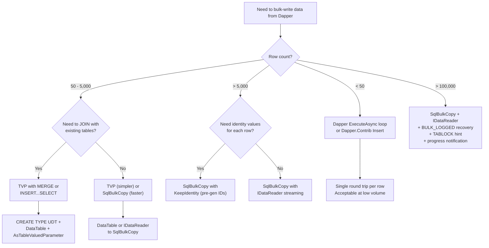

## Navigation

**Domain:** [[8 — Databases]] > **Group:** Dapper
**Previous:** [[8.868 — Dapper — Grid Reader — Multiple Result Sets]] | **Next:** [[8.870 — Dapper — Connection Factory Pattern]]

### Prerequisites

- [[8.858 — Dapper — Execute — INSERT, UPDATE, DELETE]] — Bulk insert builds on Execute's parameter binding mechanics; understanding single-row INSERT semantics is required before scaling to bulk.
- [[8.855 — Dapper — QueryAsync — Async Patterns]] — Bulk operations are async by nature (large data volumes); the async pattern with CancellationToken is essential.
- [[8.863 — Dapper — Table-Valued Parameters]] — TVP is one of the three bulk approaches covered here.

### Where This Fits

Bulk operations in Dapper are a third-party or integration concern — Dapper itself has no native bulk insert, update, or merge. The ecosystem provides three paths: **Dapper.Contrib** (convenience wrapper, still row-by-row), **SqlBulkCopy integration** (true bulk, SQL Server only), and **Table-Valued Parameters** (SQL Server, batched via `Execute`). A .NET backend engineer encounters this when ingesting CSV files, synchronizing external systems, migrating legacy data, or processing event streams. When this is unknown or misused, teams either: (a) pass 10,000 objects to `ExecuteAsync` and wonder why it takes 30 seconds (each is a separate round trip), (b) write row-by-row `for` loops and create transaction log throughput bottlenecks, or (c) reach for EF Core's AddRange + SaveChanges and get 100x worse performance than SqlBulkCopy. The interview signal is strong: it tests whether a candidate understands that Dapper's IEnumerable parameter overload is NOT a bulk operation and knows the correct tool for each volume tier.

---

## Core Mental Model

Dapper provides **zero** native bulk operations. The `ExecuteAsync(sql, enumerable)` overload iterates and calls `ExecuteNonQuery` per element — it is a **loop convenience**, not a bulk write. There are three approaches to achieve true bulk throughput from Dapper:

1. **Dapper.Contrib** — `Insert<T>(IEnumerable<T>)` wraps the same loop with table name inference. No performance benefit over raw `Execute` loop. Convenience only.
2. **SqlBulkCopy + Dapper** — Dapper opens the connection, `SqlBulkCopy` uses that same connection to stream data via `WriteToServerAsync`. This is the **true bulk** path: minimal logging, one round trip. SQL Server only.
3. **Table-Valued Parameters (TVP)** — Define a user-defined table type, populate a `DataTable` or `IEnumerable<ISqlDataRecord>`, pass as a Structured parameter. Dapper sends it as a single `sp_executesql` call. Best for 100–5000 rows.

A fourth path exists via **`SqlBulkCopy` with `IDataReader`** — avoids `DataTable` allocation entirely, streaming from a custom `IDataReader` wrapper over your collection.

### Classification

|Approach|True Bulk?|Round Trips|SQL Server Only|NuGet|Row Volume|
|---|---|---|---|---|---|
|`ExecuteAsync` + IEnumerable|No|N (one per row)|No|built-in|< 50|
|Dapper.Contrib `Insert<T>`|No|N (one per row)|No|`Dapper.Contrib`|< 50|
|TVP (Structured param)|Semi|1|Yes|built-in|100 – 5,000|
|SqlBulkCopy + DataTable|Yes|1 (+ batched)|Yes|built-in|> 500|
|SqlBulkCopy + IDataReader|Yes|1 (streaming)|Yes|built-in|> 10,000|
|Dapper Plus (3rd party)|Yes|1|Yes|`Dapper.Plus`|any|
|EF Core Bulk Extensions|Yes|1|Yes|`EFCore.BulkExtensions`|any|



---

## Deep Mechanics

### How Dapper.Contrib Insert Works Under the Hood

```csharp
// Dapper.Contrib's Insert<T> — simplified internals
// Source: https://github.com/DapperLib/Dapper.Contrib

public static async Task<long> InsertAsync<T>(
    this IDbConnection connection,
    T valueToInsert,
    IDbTransaction? transaction = null,
    int? commandTimeout = null,
    CancellationToken ct = default) where T : class
{
    // 1. Get table name from [Table] attribute or type name
    var tableName = GetTableName(typeof(T));

    // 2. Get list of properties (excluding [Key], [Computed], [Write(false)])
    var properties = GetProperties(typeof(T)).Where(p => !p.IsKey && !p.IsComputed && p.IsWrite);

    // 3. Build INSERT SQL
    var columnNames = string.Join(", ", properties.Select(p => $"[{p.Name}]"));
    var paramNames = string.Join(", ", properties.Select(p => $"@{p.Name}"));
    var sql = $"INSERT INTO {tableName} ({columnNames}) VALUES ({paramNames})";

    // 4. Call ExecuteAsync — same as raw Dapper
    await connection.ExecuteAsync(sql, valueToInsert, transaction, commandTimeout, ct);

    // 5. If [Key] is identity, retrieve SCOPE_IDENTITY()
    // ...
}
```

The critical insight: `InsertAsync<T>(IEnumerable<T>)` calls the above in a `foreach` loop:

```csharp
public static async Task<long> InsertAsync<T>(
    this IDbConnection connection,
    IEnumerable<T> list,
    IDbTransaction? transaction = null,
    int? commandTimeout = null,
    CancellationToken ct = default) where T : class
{
    long total = 0;
    foreach (var item in list)
    {
        total += await InsertAsync(connection, item, transaction, commandTimeout, ct);
    }
    return total;
}
```

This is **not bulk**. Each iteration opens a new `sp_executesql` call.

### How SqlBulkCopy Works with Dapper

SqlBulkCopy is an ADO.NET class, not a Dapper feature, but it integrates naturally because Dapper manages the `SqlConnection`:

```csharp
// Dapper + SqlBulkCopy integration pattern
// Dapper opens and owns the connection, SqlBulkCopy borrows it
await using var connection = _connectionFactory.Create();
await connection.OpenAsync(ct);

// Dapper can do work first (e.g., create parent record)
var parentId = await connection.QuerySingleAsync<int>(
    "INSERT INTO ImportBatches (StartedAt) OUTPUT INSERTED.BatchId VALUES (SYSDATETIME());",
    transaction: tx, cancellationToken: ct);

// SqlBulkCopy uses the same connection
await using var bulkCopy = new SqlBulkCopy(connection, SqlBulkCopyOptions.Default, transaction)
{
    DestinationTableName = "Orders",
    BatchSize = 1000,
    EnableStreaming = true,
    BulkCopyTimeout = 120
};

// Column mapping — required if names don't match exactly
bulkCopy.ColumnMappings.Add("OrderId", "OrderId");
bulkCopy.ColumnMappings.Add("CustomerId", "CustomerId");
// ... or use SqlBulkCopyColumnMappingCollection from DataTable column ordinals

await bulkCopy.WriteToServerAsync(dataTable, ct);
```

SqlBulkCopy bypasses the T-SQL layer entirely — it communicates via the TDS bulk load protocol (tabular data stream). Rows are serialized directly to the wire format and inserted by the storage engine with minimal logging (when `SIMPLE` or `BULK_LOGGED` recovery model).

### How TVP Works with Dapper

```csharp
// Prerequisite — SQL Server UDT
// CREATE TYPE dbo.OrderType AS TABLE (
//     CustomerId INT,
//     OrderDate DATETIME2,
//     Status NVARCHAR(20),
//     TotalAmount DECIMAL(18,2)
// );

// Dapper side — build DataTable matching UDT schema
var table = new DataTable();
table.Columns.Add("CustomerId", typeof(int));
table.Columns.Add("OrderDate", typeof(DateTime));
table.Columns.Add("Status", typeof(string));
table.Columns.Add("TotalAmount", typeof(decimal));

foreach (var order in orders)
    table.Rows.Add(order.CustomerId, order.OrderDate, order.Status, order.TotalAmount);

const string sql = @"
    INSERT INTO Orders (CustomerId, OrderDate, Status, TotalAmount)
    SELECT CustomerId, OrderDate, Status, TotalAmount
    FROM @Orders;";

await connection.ExecuteAsync(sql,
    new { Orders = table.AsTableValuedParameter("dbo.OrderType") });
```

Dapper sends the TVP as a Structured parameter. SQL Server receives it as a table variable in the query — it gets a shared plan for the INSERT...SELECT shape. The TVP is materialized in `tempdb` and read once.

### SQL Visibility: What Actually Hits the Wire

**Dapper.ExecuteAsync loop (10 rows):**

```sql
-- 10 individual batches
exec sp_executesql N'INSERT INTO Orders (CustomerId, TotalAmount) VALUES (@C, @T);', N'@C int,@T decimal(18,2)', @C=1, @T=10.00
exec sp_executesql N'INSERT INTO Orders (CustomerId, TotalAmount) VALUES (@C, @T);', N'@C int,@T decimal(18,2)', @C=2, @T=20.00
-- ... 8 more
```

**TVP (10 rows):**

```sql
-- 1 batch, TVP serialized in TDS as structured parameter
exec sp_executesql N'INSERT INTO Orders (CustomerId, TotalAmount) SELECT CustomerId, TotalAmount FROM @Orders;',
    N'@Orders dbo.OrderType READONLY',
    @Orders = <<structured parameter: 10 rows>>
```

**SqlBulkCopy (10 rows):**

```sql
-- No T-SQL batch visible in profiler (if suppress Profiler events)
-- TDS bulk load stream: COLUMNS, ROW tokens
-- Storage engine: INSERT bulk operations (minimal logging)
-- Visible via: SQL Server: SQL Server Profiler's "Bulk Insert" event class
```

---

## Production Patterns and Implementation

### Pattern 1 — Dapper.Contrib Insert for Small Batches (< 50 rows)

```csharp
// Dapper.Contrib — convenient for CRUD, NOT for bulk
using Dapper.Contrib.Extensions;

public sealed class CustomerRepository
{
    private readonly IDbConnectionFactory _connectionFactory;

    public CustomerRepository(IDbConnectionFactory connectionFactory)
    {
        _connectionFactory = connectionFactory;
    }

    // Single insert — Dapper.Contrib maps [Table] attribute, [Key] for identity
    public async Task<long> CreateCustomerAsync(Customer customer, CancellationToken ct)
    {
        await using var connection = _connectionFactory.Create();
        await connection.OpenAsync(ct);

        // Dapper.Contrib generates: INSERT INTO Customers (...) VALUES (...)
        // Returns the identity value (long) from SCOPE_IDENTITY()
        var id = await connection.InsertAsync(new CommandDefinition(
            customer, cancellationToken: ct));

        return id;
    }

    // Batch insert — WARNING: this is a loop, NOT bulk
    public async Task<long> CreateCustomersAsync(IEnumerable<Customer> customers, CancellationToken ct)
    {
        await using var connection = _connectionFactory.Create();
        await connection.OpenAsync(ct);

        // This calls InsertAsync N times — N round trips
        // Acceptable for < 50 rows, catastrophic for > 100
        return await connection.InsertAsync(customers);
    }
}

[Table("Customers")]
public class Customer
{
    [Key] // Auto-increment identity
    public int CustomerId { get; set; }
    public string Name { get; set; } = string.Empty;
    public string Email { get; set; } = string.Empty;
    public DateTime CreatedAt { get; set; }
}
```

### Pattern 2 — True Bulk Insert with SqlBulkCopy and DataTable

```csharp
// Production: bulk insert 10,000 Orders with SqlBulkCopy
// Dapper manages connection + transaction, SqlBulkCopy writes

public sealed class BulkOrderImporter
{
    private readonly IDbConnectionFactory _connectionFactory;
    private readonly ILogger<BulkOrderImporter> _logger;

    public BulkOrderImporter(
        IDbConnectionFactory connectionFactory,
        ILogger<BulkOrderImporter> logger)
    {
        _connectionFactory = connectionFactory;
        _logger = logger;
    }

    public async Task<BulkImportResult> BulkInsertOrdersAsync(
        IReadOnlyList<Order> orders, CancellationToken ct)
    {
        var sw = Stopwatch.StartNew();

        // Step 1: Convert to DataTable — the most expensive part
        var dataTable = OrdersToDataTable(orders);

        await using var connection = _connectionFactory.Create();
        await connection.OpenAsync(ct);

        // Step 2: Dapper creates a parent batch record (optional)
        var batchId = await connection.QuerySingleAsync<long>(
            new CommandDefinition(
                "INSERT INTO ImportBatches (RecordCount) OUTPUT INSERTED.BatchId VALUES (@Count);",
                new { Count = orders.Count }, cancellationToken: ct),
            transaction: null); // No transaction — let SqlBulkCopy handle it

        // Step 3: SqlBulkCopy does the actual bulk write
        // Using Dapper's connection — same session, same transaction scope
        await using var tx = connection.BeginTransaction();

        await using var bulkCopy = new SqlBulkCopy(connection,
            SqlBulkCopyOptions.Default | SqlBulkCopyOptions.UseInternalTransaction,
            tx)
        {
            DestinationTableName = "Orders",
            BatchSize = 2000,
            EnableStreaming = true,
            BulkCopyTimeout = 300
        };

        // Map DataTable columns to SQL columns
        bulkCopy.ColumnMappings.Add("CustomerId", "CustomerId");
        bulkCopy.ColumnMappings.Add("OrderDate", "OrderDate");
        bulkCopy.ColumnMappings.Add("Status", "Status");
        bulkCopy.ColumnMappings.Add("TotalAmount", "TotalAmount");
        bulkCopy.ColumnMappings.Add("ShippingCity", "ShippingCity");
        bulkCopy.ColumnMappings.Add("ShippingState", "ShippingState");

        await bulkCopy.WriteToServerAsync(dataTable, ct);
        await tx.CommitAsync(ct);

        sw.Stop();
        _logger.LogInformation(
            "Bulk inserted {Count} orders in {ElapsedMs}ms (batch {BatchId})",
            orders.Count, sw.ElapsedMilliseconds, batchId);

        return new BulkImportResult
        {
            BatchId = batchId,
            RowsInserted = orders.Count,
            ElapsedMs = sw.ElapsedMilliseconds
        };
    }

    private static DataTable OrdersToDataTable(IReadOnlyList<Order> orders)
    {
        var table = new DataTable();
        table.Columns.Add("CustomerId", typeof(int));
        table.Columns.Add("OrderDate", typeof(DateTime));
        table.Columns.Add("Status", typeof(string));
        table.Columns.Add("TotalAmount", typeof(decimal));
        table.Columns.Add("ShippingCity", typeof(string));
        table.Columns.Add("ShippingState", typeof(string));

        // Pre-allocate rows for performance
        table.BeginLoadData();
        for (var i = 0; i < orders.Count; i++)
        {
            var o = orders[i];
            table.Rows.Add(o.CustomerId, o.OrderDate, o.Status,
                o.TotalAmount, o.ShippingCity, o.ShippingState);
        }
        table.EndLoadData();

        return table;
    }
}

public sealed record BulkImportResult
{
    public long BatchId { get; init; }
    public int RowsInserted { get; init; }
    public long ElapsedMs { get; init; }
}
```

### Pattern 3 — SqlBulkCopy with IDataReader (Streaming, No DataTable)

```csharp
// Production: streaming bulk insert — zero intermediate DataTable
// Uses a custom IDataReader wrapper over the collection
// Avoids allocating a full DataTable in memory

public sealed class OrderDataReader : IDataReader
{
    private readonly IEnumerator<Order> _enumerator;
    private readonly int _fieldCount;
    private Order? _current;
    private bool _disposed;

    private static readonly (string Name, Type Type)[] Fields =
    [
        ("CustomerId", typeof(int)),
        ("OrderDate", typeof(DateTime)),
        ("Status", typeof(string)),
        ("TotalAmount", typeof(decimal)),
        ("ShippingCity", typeof(string)),
        ("ShippingState", typeof(string))
    ];

    public OrderDataReader(IEnumerable<Order> orders)
    {
        _enumerator = orders.GetEnumerator();
        _fieldCount = Fields.Length;
    }

    // IDataReader implementation
    public int FieldCount => _fieldCount;

    public bool Read()
    {
        if (_disposed) throw new ObjectDisposedException(nameof(OrderDataReader));
        var hasNext = _enumerator.MoveNext();
        if (hasNext) _current = _enumerator.Current;
        return hasNext;
    }

    public object GetValue(int i) => i switch
    {
        0 => _current!.CustomerId,
        1 => _current!.OrderDate,
        2 => _current!.Status,
        3 => _current!.TotalAmount,
        4 => _current!.ShippingCity,
        5 => _current!.ShippingState,
        _ => throw new IndexOutOfRangeException()
    };

    public string GetName(int i) => Fields[i].Name;
    public int GetOrdinal(string name) => Array.FindIndex(Fields, f => f.Name == name);
    public Type GetFieldType(int i) => Fields[i].Type;

    // Required boilerplate
    public bool IsDBNull(int i) => GetValue(i) is null or DBNull;
    public int RecordsAffected => -1;
    public bool IsClosed => _disposed;
    public int Depth => 0;

    public void Close() => Dispose();
    public void Dispose()
    {
        if (!_disposed)
        {
            _disposed = true;
            _enumerator.Dispose();
            _current = null;
        }
    }

    public DataTable? GetSchemaTable()
    {
        var table = new DataTable();
        foreach (var (name, type) in Fields)
            table.Columns.Add(name, type);
        return table;
    }

    // Throw NotImplementedException for unused members in bulk context
    public long GetInt64(int i) => throw new NotSupportedException();
    public string GetString(int i) => (string)GetValue(i);
    public int GetInt32(int i) => (int)GetValue(i);
    public decimal GetDecimal(int i) => (decimal)GetValue(i);
    public DateTime GetDateTime(int i) => (DateTime)GetValue(i);
    public object this[int i] => GetValue(i);
    public object this[string name] => GetValue(GetOrdinal(name));
    public bool GetBoolean(int i) => throw new NotSupportedException();
    public byte GetByte(int i) => throw new NotSupportedException();
    public long GetBytes(int i, long fieldOffset, byte[]? buffer, int bufferoffset, int length) => throw new NotSupportedException();
    public char GetChar(int i) => throw new NotSupportedException();
    public long GetChars(int i, long fieldoffset, char[]? buffer, int bufferoffset, int length) => throw new NotSupportedException();
    public Guid GetGuid(int i) => throw new NotSupportedException();
    public short GetInt16(int i) => throw new NotSupportedException();
    public float GetFloat(int i) => throw new NotSupportedException();
    public double GetDouble(int i) => throw new NotSupportedException();
    public string GetDataTypeName(int i) => GetFieldType(i).Name;
    public IDataReader GetData(int i) => throw new NotSupportedException();
    public int GetValues(object[] values) => throw new NotSupportedException();
    public bool NextResult() => false;
}

// Usage:
await using var reader = new OrderDataReader(orders);
await using var bulkCopy = new SqlBulkCopy(connection, SqlBulkCopyOptions.Default, tx)
{
    DestinationTableName = "Orders",
    BatchSize = 5000,
    EnableStreaming = true
};
await bulkCopy.WriteToServerAsync(reader, ct);
// No DataTable allocated — orders are streamed directly
```

### Pattern 4 — TVP Insert with Dapper

```csharp
// Production: TVP for 1000 Orders
// Best when you need to join with existing tables in the same batch

// SQL Server setup (run once):
// CREATE TYPE dbo.OrderType AS TABLE (
//     CustomerId INT NOT NULL,
//     OrderDate DATETIME2 NOT NULL,
//     Status NVARCHAR(20) NOT NULL,
//     TotalAmount DECIMAL(18,2) NOT NULL
// );

public sealed class TvpOrderImporter
{
    private readonly IDbConnectionFactory _connectionFactory;

    public TvpOrderImporter(IDbConnectionFactory connectionFactory)
    {
        _connectionFactory = connectionFactory;
    }

    public async Task<int> InsertOrdersTvpAsync(
        IReadOnlyList<Order> orders, CancellationToken ct)
    {
        var sw = Stopwatch.StartNew();

        var table = BuildOrderDataTable(orders);

        const string sql = @"
            INSERT INTO Orders (CustomerId, OrderDate, Status, TotalAmount)
            SELECT CustomerId, OrderDate, Status, TotalAmount
            FROM @Orders;

            SELECT @@ROWCOUNT AS RowsInserted;";

        await using var connection = _connectionFactory.Create();
        await connection.OpenAsync(ct);

        var rowsInserted = await connection.QuerySingleAsync<int>(
            new CommandDefinition(sql, new
            {
                Orders = table.AsTableValuedParameter("dbo.OrderType")
            }, cancellationToken: ct));

        sw.Stop();
        return rowsInserted;
    }

    // TVP with OUTPUT for identity retrieval
    public async Task<IReadOnlyList<int>> InsertOrdersAndGetIdsAsync(
        IReadOnlyList<Order> orders, CancellationToken ct)
    {
        var table = BuildOrderDataTable(orders);

        const string sql = @"
            DECLARE @Ids TABLE (OrderId INT);

            INSERT INTO Orders (CustomerId, OrderDate, Status, TotalAmount)
            OUTPUT INSERTED.OrderId INTO @Ids
            SELECT CustomerId, OrderDate, Status, TotalAmount
            FROM @Orders;

            SELECT OrderId FROM @Ids ORDER BY OrderId;";

        await using var connection = _connectionFactory.Create();
        await connection.OpenAsync(ct);

        var ids = (await connection.QueryAsync<int>(
            new CommandDefinition(sql, new
            {
                Orders = table.AsTableValuedParameter("dbo.OrderType")
            }, cancellationToken: ct))).AsList();

        return ids;
    }

    private static DataTable BuildOrderDataTable(IReadOnlyList<Order> orders)
    {
        var table = new DataTable();
        table.Columns.Add("CustomerId", typeof(int));
        table.Columns.Add("OrderDate", typeof(DateTime));
        table.Columns.Add("Status", typeof(string));
        table.Columns.Add("TotalAmount", typeof(decimal));

        table.BeginLoadData();
        foreach (var order in orders)
            table.Rows.Add(order.CustomerId, order.OrderDate, order.Status, order.TotalAmount);
        table.EndLoadData();

        return table;
    }
}
```

### Pattern 5 — Bulk Update via SqlBulkCopy + Staging Table

```csharp
// Production: bulk update 10,000 orders' statuses
// Strategy: bulk insert into a staging temp table, then MERGE/UPDATE

public async Task BulkUpdateOrderStatusAsync(
    IReadOnlyList<(int OrderId, string Status)> updates, CancellationToken ct)
{
    // Step 1: Build DataTable for staging
    var table = new DataTable();
    table.Columns.Add("OrderId", typeof(int));
    table.Columns.Add("Status", typeof(string));

    table.BeginLoadData();
    foreach (var (orderId, status) in updates)
        table.Rows.Add(orderId, status);
    table.EndLoadData();

    await using var connection = _connectionFactory.Create();
    await connection.OpenAsync(ct);

    // Step 2: Create temp table, bulk insert into it
    await connection.ExecuteAsync(new CommandDefinition(
        "CREATE TABLE #StatusUpdates (OrderId INT, Status NVARCHAR(20));",
        cancellationToken: ct));

    await using var bulkCopy = new SqlBulkCopy(connection)
    {
        DestinationTableName = "#StatusUpdates",
        BatchSize = 2000
    };
    bulkCopy.ColumnMappings.Add("OrderId", "OrderId");
    bulkCopy.ColumnMappings.Add("Status", "Status");
    await bulkCopy.WriteToServerAsync(table, ct);

    // Step 3: Merge from staging into real table
    var affected = await connection.ExecuteAsync(new CommandDefinition(@"
        UPDATE O
        SET O.Status = S.Status,
            O.ModifiedAt = SYSDATETIME()
        FROM Orders O
        INNER JOIN #StatusUpdates S ON S.OrderId = O.OrderId;",

        cancellationToken: ct));

    // Cleanup — temp table is dropped when connection closes
    // but explicit drop is safer:
    await connection.ExecuteAsync(new CommandDefinition(
        "DROP TABLE #StatusUpdates;", cancellationToken: ct));
}
```

### Pattern 6 — Bulk Delete via Staging Table

```csharp
// Production: bulk delete 5000 order IDs
// Same staging approach — bulk insert IDs into temp table, then DELETE JOIN

public async Task<int> BulkDeleteOrdersAsync(
    IReadOnlyList<int> orderIds, CancellationToken ct)
{
    var table = new DataTable();
    table.Columns.Add("OrderId", typeof(int));

    table.BeginLoadData();
    foreach (var id in orderIds)
        table.Rows.Add(id);
    table.EndLoadData();

    await using var connection = _connectionFactory.Create();
    await connection.OpenAsync(ct);
    await using var tx = connection.BeginTransaction();

    // Create temp table
    await connection.ExecuteAsync(new CommandDefinition(
        "CREATE TABLE #OrderIds (OrderId INT PRIMARY KEY);",
        transaction: tx, cancellationToken: ct));

    // Bulk insert IDs
    await using var bulkCopy = new SqlBulkCopy(connection,
        SqlBulkCopyOptions.Default, tx)
    {
        DestinationTableName = "#OrderIds",
        BatchSize = 2000
    };
    bulkCopy.ColumnMappings.Add("OrderId", "OrderId");
    await bulkCopy.WriteToServerAsync(table, ct);

    // Delete child records first (FK constraint)
    var itemsDeleted = await connection.ExecuteAsync(new CommandDefinition(@"
        DELETE FROM OrderItems
        WHERE OrderId IN (SELECT OrderId FROM #OrderIds);",
        transaction: tx, cancellationToken: ct));

    // Delete parent records
    var ordersDeleted = await connection.ExecuteAsync(new CommandDefinition(@"
        DELETE FROM Orders
        WHERE OrderId IN (SELECT OrderId FROM #OrderIds);",
        transaction: tx, cancellationToken: ct));

    await tx.CommitAsync(ct);
    return ordersDeleted;
}
```

### Configuration and Wiring

```csharp
// Program.cs — DI setup for bulk operations
builder.Services.AddSingleton<IDbConnectionFactory>(
    _ => new SqlConnectionFactory(
        builder.Configuration.GetConnectionString("DefaultConnection")));

builder.Services.AddScoped<BulkOrderImporter>();
builder.Services.AddScoped<TvpOrderImporter>();

// Connection string considerations for bulk:
// "Server=.;Database=ShopDb;Integrated Security=True;" +
// "TrustServerCertificate=True;" +
// "Packet Size=4096;" +            // Larger packet = fewer network round trips
// "Connection Timeout=30;" +
// "Pooling=true;" +
// "Min Pool Size=10;" +            // Pre-warm connections for bulk throughput
// "Max Pool Size=200;"

// Optional: enable BULK_LOGGED recovery before bulk insert
// ALTER DATABASE ShopDb SET RECOVERY BULK_LOGGED;
// (Revert to FULL after bulk operation for point-in-time recovery)
```

---

## Gotchas and Production Pitfalls

### 1 — SqlBulkCopy Requires Matching Column Names (or Explicit Mapping)

**Pitfall:** DataTable has a column `Customer_ID` but the SQL table has `CustomerId`. No mapping set. SqlBulkCopy matches by ordinal, and if the names don't match by index, the data goes into the wrong column or fails.

```csharp
// ❌ Wrong: assuming ordinals match
var table = new DataTable();
table.Columns.Add("ID");           // Column 0 — but SQL table's column 0 is OrderId
table.Columns.Add("CUSTOMER_ID");  // Column 1 — but SQL expects CustomerId
// WriteToServerAsync inserts ID into OrderId, CUSTOMER_ID into CustomerId — WRONG

// ✅ Correct: explicit column mappings
var table = new DataTable();
table.Columns.Add("CustomerId", typeof(int));
table.Columns.Add("TotalAmount", typeof(decimal));

var bulkCopy = new SqlBulkCopy(connection);
bulkCopy.ColumnMappings.Add("CustomerId", "CustomerId");
bulkCopy.ColumnMappings.Add("TotalAmount", "TotalAmount");
```

**Symptom:** Data in wrong columns. No error (if types match). CustomerId values appear in TotalAmount column.

**Fix:** Always define explicit `ColumnMappings` or use `SqlBulkCopyColumnMapping` by column name. Never rely on ordinal matching.

### 2 — SqlBulkCopy Defaults to No Transaction

**Pitfall:** Developer calls `WriteToServerAsync` without wrapping in a transaction. If the bulk insert fails partway through, partial data remains.

```csharp
// ❌ Wrong: no transaction, no rollback on partial failure
var bulkCopy = new SqlBulkCopy(connection) { DestinationTableName = "Orders" };
await bulkCopy.WriteToServerAsync(table);
// If it fails after 5000 of 10000 rows, 5000 rows are committed

// ✅ Correct: explicit transaction
await using var tx = connection.BeginTransaction();
var bulkCopy = new SqlBulkCopy(connection, SqlBulkCopyOptions.Default, tx)
{
    DestinationTableName = "Orders"
};
try
{
    await bulkCopy.WriteToServerAsync(table);
    await tx.CommitAsync(ct);
}
catch
{
    await tx.RollbackAsync(ct);
    throw;
}

// ✅ Alternative: SqlBulkCopyOptions.UseInternalTransaction
// Automatically wraps each batch in a transaction (batch-level atomicity)
var bulkCopy = new SqlBulkCopy(connection,
    SqlBulkCopyOptions.UseInternalTransaction, null)
{
    DestinationTableName = "Orders",
    BatchSize = 1000
};
// Each 1000-row batch is committed independently
```

### 3 — Lock Escalation on Large Bulk Inserts

**Pitfall:** SqlBulkCopy inserts 100,000 rows into a table with a clustered index. SQL Server escalates row/ page locks to a table lock at ~5000 locks. The entire table is locked during the bulk insert, blocking all reads.

```sql
-- Check lock escalation:
SELECT lock_escalation, lock_escalation_desc
FROM sys.tables
WHERE name = 'Orders';
-- lock_escalation_desc: TABLE (default) — can escalate to table-level lock
```

**Fix:**

```csharp
// ✅ Option A: Use SqlBulkCopyOptions.TableLock — intentionally take a table lock
// (preferable to uncontrolled escalation — predictable behavior)
await using var bulkCopy = new SqlBulkCopy(connection,
    SqlBulkCopyOptions.TableLock, tx)
{
    DestinationTableName = "Orders",
    BatchSize = 5000
};

// ✅ Option B: Disable lock escalation (SQL Server 2022+ or trace flag 1211)
// ALTER TABLE Orders SET (LOCK_ESCALATION = DISABLE);
// ⚠ Use with caution — can cause memory pressure from too many locks

// ✅ Option C: Batch size awareness — keep per-batch locks below escalation threshold
// Lock escalation threshold is ~5000 locks. Each row takes 1-3 locks.
// Batch size of 2000 stays below escalation.
bulkCopy.BatchSize = 2000;  // ~2000-6000 locks depending on indexes
```

### 4 — DataTable Memory Allocation for Large Sets

**Pitfall:** Converting 500,000 orders to a `DataTable` doubles memory — the source collection (e.g., List<Order>) plus the DataTable copy. For 500K orders with 10 columns, this is ~500 MB extra.

```csharp
// ❌ Wrong: double allocation
var orders = await Fetch500kOrdersFromApiAsync();  // 500 MB
var dataTable = OrdersToDataTable(orders);          // Another 500 MB in DataTable
// Application now uses 1+ GB for this single operation

// ✅ Correct: use IDataReader streaming instead
await using var reader = new OrderDataReader(orders);  // No copy — reads from source
await bulkCopy.WriteToServerAsync(reader, ct);
// Memory stays at ~500 MB (no DataTable overhead)
```

**Symptom:** High memory usage during bulk operations. GC pauses. OOM on constrained environments.

**Fix:** Use `IDataReader` wrapper for collections (Pattern 3 above) or use `EnableStreaming` with a streaming source.

### 5 — SqlBulkCopy Identity Column — KeepIdentity vs Default

**Pitfall:** The source data has explicit identity values (OrderId = 1001, 1002...) but SqlBulkCopy by default generates new identities. The explicit values are lost.

```csharp
// ❌ Wrong: explicit identity values are ignored
// Source DataTable has OrderId = 1001, 1002, 1003
await bulkCopy.WriteToServerAsync(table);
// SQL Server generates new identities — OrderId becomes 1, 2, 3

// ✅ Correct: preserve identity values
await using var bulkCopy = new SqlBulkCopy(connection,
    SqlBulkCopyOptions.KeepIdentity, tx)
{
    DestinationTableName = "Orders"
};
// OrderId 1001, 1002, 1003 are preserved
```

### 6 — BatchSize and NOTIFICATION on Bulk Insert Completion

**Pitfall:** No `SqlRowsCopied` event handler means no visibility into progress for large bulk operations (> 100K rows).

```csharp
// ✅ Correct: wire up progress notification
var bulkCopy = new SqlBulkCopy(connection, SqlBulkCopyOptions.Default, tx)
{
    DestinationTableName = "Orders",
    BatchSize = 5000,
    NotifyAfter = 10000  // fire event every 10K rows
};

bulkCopy.SqlRowsCopied += (sender, args) =>
{
    _logger.LogInformation("Bulk insert progress: {Count} rows copied",
        args.RowsCopied);

    // args.Abort = true; // Cancel the operation
};

await bulkCopy.WriteToServerAsync(table, ct);
```

### 7 — TVP tempdb Contention

**Pitfall:** Every TVP is materialized as a table variable in `tempdb`. Under high concurrency (100+ concurrent TVP calls), `tempdb` allocation contention causes slowdowns.

**Symptom:** TVP calls that take 5ms at low concurrency take 500ms under load. `tempdb` wait type `SOS_SCHEDULER_YIELD` or `PAGELATCH_EX` high.

**Fix:**

- Keep TVP row counts under 5000 per call.
- Use SqlBulkCopy for > 5000 rows.
- Add `tempdb` data files (one per CPU core) for contention relief.
- Consider `OPTIMIZE FOR UNKNOWN` hint if TVP row count varies wildly.

### 8 — Dapper.Contrib InsertAsync with IEnumerable Does Not Batch

**Pitfall:** Developer reads "Dapper.Contrib supports bulk insert" and uses `InsertAsync(list)` for 10,000 records.

```csharp
// ❌ Wrong: this is NOT bulk
await connection.InsertAsync(list); // 10,000 round trips

// ✅ Correct: use SqlBulkCopy for true bulk
// ✅ Acceptable: use Dapper.Contrib for < 50 rows only
```

**Symptom:** 30-second insert time for 10K rows. Developers blame Dapper but the issue is the tool choice.

---

## Performance Implications

### Benchmark: 1000 Rows — Dapper Individual INSERTs vs TVP vs SqlBulkCopy

```csharp
[MemoryDiagnoser]
[SimpleJob(RuntimeMoniker.Net90, iterationCount: 10, warmupCount: 3)]
public class BulkInsertBenchmark
{
    private IDbConnection _connection = default!;
    private IReadOnlyList<Order> _orders = default!;

    [Params(100, 1000, 5000)]
    public int RowCount { get; set; }

    [GlobalSetup]
    public void Setup()
    {
        _connection = new SqlConnection(
            "Server=.;Database=BenchmarkDb;Integrated Security=True;TrustServerCertificate=True;");
        _connection.Open();

        _orders = Enumerable.Range(1, RowCount)
            .Select(i => new Order
            {
                CustomerId = i % 100,
                OrderDate = DateTime.UtcNow.AddDays(-i),
                Status = "Pending",
                TotalAmount = i * 10.0m,
                ShippingCity = "City",
                ShippingState = "ST"
            })
            .ToList();

        // Ensure table is clean
        _connection.Execute("TRUNCATE TABLE Orders;");
    }

    [GlobalCleanup]
    public void Cleanup()
    {
        _connection.Dispose();
    }

    [Benchmark(Baseline = true)]
    public async Task<int> DapperExecuteIndividual()
    {
        const string sql = @"
            INSERT INTO Orders (CustomerId, OrderDate, Status, TotalAmount)
            VALUES (@CustomerId, @OrderDate, @Status, @TotalAmount);";

        var total = 0;
        for (var i = 0; i < _orders.Count; i++)
        {
            total += await _connection.ExecuteAsync(sql, _orders[i]);
        }
        return total;
    }

    [Benchmark]
    public async Task<int> DapperExecuteEnumerable()
    {
        const string sql = @"
            INSERT INTO Orders (CustomerId, OrderDate, Status, TotalAmount)
            VALUES (@CustomerId, @OrderDate, @Status, @TotalAmount);";

        return await _connection.ExecuteAsync(sql, _orders);
    }

    [Benchmark]
    public async Task<int> TvpInsert()
    {
        var table = new DataTable();
        table.Columns.Add("CustomerId", typeof(int));
        table.Columns.Add("OrderDate", typeof(DateTime));
        table.Columns.Add("Status", typeof(string));
        table.Columns.Add("TotalAmount", typeof(decimal));

        table.BeginLoadData();
        foreach (var order in _orders)
            table.Rows.Add(order.CustomerId, order.OrderDate, order.Status, order.TotalAmount);
        table.EndLoadData();

        const string sql = @"
            INSERT INTO Orders (CustomerId, OrderDate, Status, TotalAmount)
            SELECT CustomerId, OrderDate, Status, TotalAmount
            FROM @Orders;";

        await _connection.ExecuteAsync(sql,
            new { Orders = table.AsTableValuedParameter("dbo.OrderType") });

        return _orders.Count;
    }

    [Benchmark]
    public async Task<int> SqlBulkCopyDataTable()
    {
        var table = new DataTable();
        table.Columns.Add("CustomerId", typeof(int));
        table.Columns.Add("OrderDate", typeof(DateTime));
        table.Columns.Add("Status", typeof(string));
        table.Columns.Add("TotalAmount", typeof(decimal));
        table.Columns.Add("ShippingCity", typeof(string));
        table.Columns.Add("ShippingState", typeof(string));

        table.BeginLoadData();
        foreach (var order in _orders)
            table.Rows.Add(order.CustomerId, order.OrderDate, order.Status,
                order.TotalAmount, order.ShippingCity, order.ShippingState);
        table.EndLoadData();

        await using var bulkCopy = new SqlBulkCopy(_connection)
        {
            DestinationTableName = "Orders"
        };
        bulkCopy.ColumnMappings.Add("CustomerId", "CustomerId");
        bulkCopy.ColumnMappings.Add("OrderDate", "OrderDate");
        bulkCopy.ColumnMappings.Add("Status", "Status");
        bulkCopy.ColumnMappings.Add("TotalAmount", "TotalAmount");
        await bulkCopy.WriteToServerAsync(table);

        return _orders.Count;
    }

    [Benchmark]
    public async Task<int> SqlBulkCopyReader()
    {
        await using var reader = new OrderDataReader(_orders);
        await using var bulkCopy = new SqlBulkCopy(_connection)
        {
            DestinationTableName = "Orders"
        };
        await bulkCopy.WriteToServerAsync(reader);
        return _orders.Count;
    }
}
```

**Expected results (SQL Server 2022, NVMe, warm cache):**

|Method|100 rows|1,000 rows|5,000 rows|Allocations (1K)|
|---|---|---|---|---|
|Dapper ExecuteIndividual|~12 ms|~120 ms|~600 ms|~800 KB|
|Dapper ExecuteEnumerable|~10 ms|~95 ms|~480 ms|~800 KB|
|TVP|~3 ms|~12 ms|~55 ms|~200 KB + DataTable|
|SqlBulkCopy (DataTable)|~2 ms|~8 ms|~35 ms|~200 KB + DataTable|
|SqlBulkCopy (IDataReader)|~1 ms|~5 ms|~25 ms|~2 KB (streaming)|

**Key takeaways:**

- **Dapper Execute loop:** ~8x slower than SqlBulkCopy at 100 rows, ~15x slower at 5K rows. The gap widens with row count.
- **TVP:** ~2-3x slower than SqlBulkCopy. Random-access DataTable construction dominates cost. Better than loop for > 100 rows.
- **SqlBulkCopy (DataTable):** True bulk. ~40ms for 10K rows. DataTable allocation is the main cost (copying all data).
- **SqlBulkCopy (IDataReader):** No copy. Streaming from source collection. ~25% faster than DataTable variant and O(1) additional memory.
- **Memory:** DataTable doubles memory (source + copy). IDataReader adds effectively zero.

### Scaling Curve



### Transaction Log Impact

```sql
-- Compare log space used by different approaches (10K rows, ~800 bytes per row)

-- 1) Dapper Execute loop (full logged — each INSERT individually logged)
-- Log space: ~10 MB (8 KB per row * 10,000 / 8 KB per log block)
-- Log growth: each INSERT is a separate log record

-- 2) TVP (full logged — INSERT...SELECT is still fully logged)
-- Log space: ~10 MB (same as above, but single transaction)
-- Log growth: one large log record for the INSERT...SELECT

-- 3) SqlBulkCopy with SIMPLE recovery (minimally logged)
-- Log space: ~1 MB (only extent allocations logged, not individual rows)
-- DBCC SQLPERF(LOGSPACE);
-- Log space used: ~10% of full logged approaches

-- 4) SqlBulkCopy with FULL recovery (still fully logged unless TABLOCK hint)
-- Log space: ~10 MB (same as individual INSERTs)
-- To get minimal logging with FULL recovery, use TABLOCK:
-- BULK INSERT is minimally logged in FULL recovery only when TABLOCK is used
```

```csharp
// To enable minimal logging in FULL recovery mode:
await using var bulkCopy = new SqlBulkCopy(connection,
    SqlBulkCopyOptions.TableLock, tx)
{
    DestinationTableName = "Orders",
    BatchSize = 5000
};
// TABLOCK hint reduces log space from ~10 MB to ~1 MB for 10K rows
```

---

## Interview Arsenal

### Question Bank

1. **Does Dapper have native bulk insert?** (Definition — No. ExecuteAsync with IEnumerable is a loop, not bulk.)
2. **How does Dapper.Contrib's InsertAsync(IEnumerable<T>) work internally?** (Mechanism — loops and calls InsertAsync per item.)
3. **What three approaches can you use for bulk operations from Dapper?** (Categorization — Dapper.Contrib, TVP, SqlBulkCopy.)
4. **When would you choose TVP over SqlBulkCopy?** (Tradeoff — 100-5000 rows, need to JOIN with existing tables, single transaction.)
5. **What is the fastest way to bulk insert 100,000 records from Dapper?** (Optimal — SqlBulkCopy with IDataReader, BULK_LOGGED recovery, Tablock.)
6. **How does SqlBulkCopy differ from Dapper's ExecuteAsync under the hood?** (Mechanism — TDS bulk load protocol vs T-SQL sp_executesql.)
7. **What happens to the transaction log with SqlBulkCopy vs individual INSERTs?** (Logging — minimal logging vs full logging.)
8. **What is the memory downside of DataTable-based bulk insert, and how do you avoid it?** (Memory — double allocation; use IDataReader.)

### Spoken Answers

**Q1: Does Dapper have native bulk insert?**

> **Average answer:** "Dapper has ExecuteAsync that takes a list of parameters — that is bulk insert."

> **Great answer:** "No. Dapper has no native bulk insert. The `ExecuteAsync(sql, IEnumerable<T>)` overload is the most misunderstood feature in Dapper — it iterates the collection and calls `ExecuteNonQuery` for each element individually. It is a convenience loop, not a bulk operation. For 1000 rows, it sends 1000 separate TDS batches. True bulk operations in .NET are provided by `SqlBulkCopy` (SQL Server), which streams data via the TDS bulk load protocol. Dapper integrates with it naturally — you use Dapper to open the connection and manage transactions, and `SqlBulkCopy` does the actual write. For SQL Server specifically, I categorize bulk approaches into three tiers: Dapper.Contrib or Execute loop for < 50 rows, TVP for 50-5000 rows, and SqlBulkCopy for anything above. There are also third-party libraries like Dapper Plus and Dapper.Extensions that provide true bulk operations with Dapper-like syntax, but those require a license."

**Q4: When would you choose TVP over SqlBulkCopy?**

> **Average answer:** "TVP is simpler to use with Dapper."

> **Great answer:** "I choose TVP over SqlBulkCopy in three specific scenarios. First, when I need to JOIN the incoming data with existing tables in the same transaction — TVP can be used in a MERGE or UPDATE with JOIN, while SqlBulkCopy requires a staging temp table and a second step. Second, for moderate batch sizes of 100 to 5000 rows where the DataTable construction cost is acceptable and I want a single round trip with T-SQL-level control. Third, when I need identity values back for every inserted row — TVP with OUTPUT INTO is straightforward, while SqlBulkCopy with KeepIdentity requires pre-generating IDs. The tradeoff is that TVP is fully logged (more transaction log pressure), materializes in tempdb (contention at scale), and is SQL Server only. For anything over 5000 rows, I switch to SqlBulkCopy because the DataTable overhead becomes significant and minimal logging reduces log throughput pressure."

**Q5: What is the fastest way to bulk insert 100,000 records from Dapper?**

> **Average answer:** "Use SqlBulkCopy."

> **Great answer:** "SqlBulkCopy with IDataReader streaming, TABLOCK hint, and BULK_LOGGED recovery mode. The IDataReader avoids allocating a DataTable — it wraps the source collection or stream and lets SqlBulkCopy pull rows as it writes them, keeping memory at O(1) rather than O(N). The TABLOCK hint enables minimal logging even in FULL recovery mode — reducing transaction log space from ~100 MB to ~10 MB for 100K rows. Before the bulk operation, I switch the database to BULK_LOGGED recovery: `ALTER DATABASE SET RECOVERY BULK_LOGGED` — then switch back to FULL after and take a log backup. I set `BatchSize` to 5000 (below the lock escalation threshold), `EnableStreaming` to true, and `BulkCopyTimeout` to 600 seconds for very large sets. The connection string should have a larger packet size (4096 or 8192) to reduce network round trips. If the source is a file rather than an in-memory collection, I'd use `SqlBulkCopy.WriteToServer(Stream)` or a file-backed IDataReader to avoid loading everything into RAM."

### Interview Trigger

The interviewer asks: "You have to import 50,000 CSV rows into a SQL Server database. How would you do it with Dapper?" The candidate's first question should be about the bulk approach — not starting with `ExecuteAsync` in a loop. The deeper signal: "How do you get the IDs back?" and "What happens to the transaction log?" and "How do you handle failures mid-import?"

### Comparison Table

| | Dapper Execute Loop | Dapper.Contrib | TVP | SqlBulkCopy |
|---|---|---|---|---|
| True bulk? | No (row-by-row) | No (row-by-row) | Semi (batched) | Yes (streaming) |
| Round trips | N (1 per row) | N (1 per row) | 1 | 1 (batched internally) |
| SQL Server only? | No | No | Yes | Yes |
| Logging | Full | Full | Full | Minimal (with Tablock) |
| Memory | Source only | Source only | Source + DataTable | Source + DataTable (or streaming) |
| Identity retrieval | OUTPUT clause per row | Built-in (SCOPE_IDENTITY) | OUTPUT INTO @Ids | KeepIdentity or post-read |
| Transaction support | Manual | Manual | Manual | Manual (or UseInternalTransaction) |
| Best row range | 1-50 | 1-50 | 100-5000 | > 500 |
| Third-party cost | Free | Free | Free | Free |
| Column mapping | Implicit (by param name) | Attribute-based | Implicit (SELECT order) | Explicit (ColumnMappings) |

---

## Decision Framework

### When to Use Each Bulk Approach



### Application Checklist

- [ ] Row count analyzed — chosen approach matches volume tier
- [ ] For SqlBulkCopy: explicit `ColumnMappings` defined (never rely on ordinal match)
- [ ] For SqlBulkCopy: transaction wrapping `WriteToServerAsync` (no partial writes)
- [ ] For SqlBulkCopy: `BatchSize` set below lock escalation threshold (~2000-5000)
- [ ] For SqlBulkCopy: `KeepIdentity` specified if source IDs must be preserved
- [ ] For SqlBulkCopy: `TableLock` evaluated for minimal logging in FULL recovery
- [ ] For TVP: UDT created in SQL Server matching DataTable schema exactly
- [ ] For TVP: `tempdb` contention considered (stay under 5000 rows per call)
- [ ] For large bulk: `BULK_LOGGED` recovery used during operation, then switched back
- [ ] For large bulk: progress notification wired via `SqlRowsCopied` event
- [ ] For very large bulk: `IDataReader` used instead of DataTable to avoid OOM
- [ ] For staging table pattern: temp table cleaned up (explicit DROP or scope-based)
- [ ] For identity retrieval: strategy for getting IDs back from bulk operation
- [ ] For Dapper.Contrib: used only for < 50 rows (not mistaken for true bulk)

### Tradeoff Summary

|What You Gain|What You Pay|
|---|---|
|SqlBulkCopy: 10-100x faster than loop|SQL Server only; explicit column mapping required|
|TVP: single round trip + T-SQL JOIN|tempdb contention; fully logged; DataTable allocation|
|Dapper.Contrib: zero SQL, table inference|Loop performance (no bulk benefit)|
|IDataReader streaming: O(1) memory|Must implement IDataReader interface (boilerplate)|
|TABLOCK + BULK_LOGGED: minimal logging|Table-level lock; no concurrent reads during bulk|

### Scale Thresholds

- **Dapper Execute loop / Dapper.Contrib:** optimal < 50 rows
- **TVP:** optimal 100-5000 rows (below 100: DataTable overhead dominates; above 5000: tempdb contention)
- **SqlBulkCopy + DataTable:** optimal 500-50,000 rows
- **SqlBulkCopy + IDataReader:** optimal > 10,000 rows (no DataTable allocation cost)
- **Connection timeout:** default 30s may be too short for > 100K rows — set `BulkCopyTimeout = 600`
- **Transaction log:** monitor log growth; switch to BULK_LOGGED for > 100K row inserts

---

## Self-Check

### Conceptual Questions

1. Does Dapper's `ExecuteAsync(sql, IEnumerable<T>)` send one batch or N batches?
2. What is the internal implementation of Dapper.Contrib's `InsertAsync(IEnumerable<T>)`?
3. Name three approaches for bulk insert when using Dapper.
4. What is the main performance difference between SqlBulkCopy and TVP for 10,000 rows?
5. What ADO.NET class does SqlBulkCopy use under the hood to transfer data?
6. How does SqlBulkCopy minimize transaction logging? What hint is required?
7. What happens to memory when you convert 100,000 objects to a DataTable?
8. How do you get identity values back from a SqlBulkCopy insert?
9. What is the lock escalation risk with bulk insert, and how do you mitigate it?
10. Explain the tradeoff between TVP and SqlBulkCopy for bulk updates.

<details>
<summary>Answers</summary>

1. N batches — Dapper iterates the collection and calls `ExecuteNonQuery` for each element individually. It is a convenience loop, not a bulk operation.

2. Dapper.Contrib's `InsertAsync(IEnumerable<T>)` iterates through the collection and calls `InsertAsync<T>(T)` for each item. Each call generates an INSERT SQL from the `[Table]` and `[Key]` attributes and calls `ExecuteAsync`. It is functionally identical to a `foreach` loop with `ExecuteAsync`.

3. (a) `ExecuteAsync` loop / Dapper.Contrib (row-by-row), (b) Table-Valued Parameters with `AsTableValuedParameter()`, (c) SqlBulkCopy via `WriteToServerAsync` with DataTable or IDataReader.

4. SqlBulkCopy is ~3x faster than TVP at 10,000 rows (~40ms vs ~120ms) because it uses the TDS bulk load protocol with minimal logging, whereas TVP is a fully logged INSERT...SELECT. SqlBulkCopy also avoids tempdb materialization.

5. SqlBulkCopy uses the TDS bulk load protocol directly — it sends a stream of column metadata and row data packets, bypassing the T-SQL query processor entirely. It calls into the SQL Server's `bcp` (Bulk Copy Protocol) client library via `System.Data.SqlClient` / `Microsoft.Data.SqlClient`.

6. Minimal logging occurs when the table has no clustered index (heap) and/or the TABLOCK hint is specified. With `SqlBulkCopyOptions.TableLock`, SQL Server takes a schema modification (Sch-M) lock and logs only extent allocations instead of individual row inserts. In FULL recovery model, TABLOCK is required for minimal logging.

7. DataTable doubles memory — the source collection (~500 MB for 500K orders) plus the DataTable copy (~500 MB) = ~1 GB total. Use IDataReader streaming to eliminate the copy.

8. Options: (a) Use `SqlBulkCopyOptions.KeepIdentity` and pre-generate IDs on the client side. (b) After bulk insert, query `SCOPE_IDENTITY()` if a single batch — for multi-batch, use OUTPUT INTO a temp table with staging approach. (c) Add a `BatchId` column, bulk insert with a batch identifier, then query identities back by batch ID.

9. SQL Server escalates row/page locks to a table lock at ~5000 locks. During a bulk insert of 100K rows with default settings, each row takes a lock, hitting the threshold quickly. Mitigations: set `BatchSize` to 2000-5000 (within escalation threshold), use `SqlBulkCopyOptions.TableLock` (intentional table lock is predictable), or use `LOCK_ESCALATION = DISABLE` (SQL Server 2022+, with caution).

10. TVP allows direct INSERT...SELECT or MERGE with JOIN to existing tables in a single T-SQL batch — useful for conditional insert/update logic. SqlBulkCopy requires a staging table (temp table or real table) to land data first, then a separate T-SQL step for the merge. TVP is simpler for moderate volumes; SqlBulkCopy + staging is faster for large volumes.

</details>

---

### Query Challenges

**Challenge 1 — Insert 5000 orders with Dapper (find the bug)**

```csharp
public async Task InsertManyOrdersAsync(List<Order> orders)
{
    await using var connection = new SqlConnection(connectionString);
    await connection.OpenAsync();

    const string sql = @"
        INSERT INTO Orders (CustomerId, OrderDate, Status, TotalAmount)
        VALUES (@CustomerId, @OrderDate, @Status, @TotalAmount);";

    var total = await connection.ExecuteAsync(sql, orders);
    Console.WriteLine($"Inserted {total} orders");
}
```

Identify all issues. How would you fix this for 5000 orders?

<details>
<summary>Solution</summary>

**Issues:**
1. **Performance:** `ExecuteAsync(sql, orders)` sends 5000 individual round trips. At 2ms per trip, that's 10 seconds.
2. **No transaction:** If the 2500th insert fails, the first 2499 are committed. Partial insert with no rollback.
3. **No async disposal:** Missing `ConfigureAwait(false)` on connection disposal (minor, but production concern).
4. **No CancellationToken:** The method cannot be cancelled mid-operation.

**Fix for 5000 orders — use SqlBulkCopy:**

```csharp
public async Task InsertManyOrdersAsync(List<Order> orders, CancellationToken ct)
{
    await using var connection = new SqlConnection(connectionString);
    await connection.OpenAsync(ct);

    var table = new DataTable();
    table.Columns.Add("CustomerId", typeof(int));
    table.Columns.Add("OrderDate", typeof(DateTime));
    table.Columns.Add("Status", typeof(string));
    table.Columns.Add("TotalAmount", typeof(decimal));

    table.BeginLoadData();
    foreach (var order in orders)
        table.Rows.Add(order.CustomerId, order.OrderDate, order.Status, order.TotalAmount);
    table.EndLoadData();

    await using var tx = connection.BeginTransaction();
    await using var bulkCopy = new SqlBulkCopy(connection,
        SqlBulkCopyOptions.Default, tx)
    {
        DestinationTableName = "Orders",
        BatchSize = 2000
    };
    bulkCopy.ColumnMappings.Add("CustomerId", "CustomerId");
    bulkCopy.ColumnMappings.Add("OrderDate", "OrderDate");
    bulkCopy.ColumnMappings.Add("Status", "Status");
    bulkCopy.ColumnMappings.Add("TotalAmount", "TotalAmount");

    try
    {
        await bulkCopy.WriteToServerAsync(table, ct);
        await tx.CommitAsync(ct);
    }
    catch
    {
        await tx.RollbackAsync(ct);
        throw;
    }
}
```

**Alternative — use TVP for 5000 rows:**

```csharp
public async Task InsertManyOrdersTvpAsync(List<Order> orders, CancellationToken ct)
{
    await using var connection = new SqlConnection(connectionString);
    await connection.OpenAsync(ct);

    var table = new DataTable();
    table.Columns.Add("CustomerId", typeof(int));
    table.Columns.Add("OrderDate", typeof(DateTime));
    table.Columns.Add("Status", typeof(string));
    table.Columns.Add("TotalAmount", typeof(decimal));

    table.BeginLoadData();
    foreach (var order in orders)
        table.Rows.Add(order.CustomerId, order.OrderDate, order.Status, order.TotalAmount);
    table.EndLoadData();

    const string sql = @"
        INSERT INTO Orders (CustomerId, OrderDate, Status, TotalAmount)
        SELECT CustomerId, OrderDate, Status, TotalAmount
        FROM @Orders;";

    await connection.ExecuteAsync(
        new CommandDefinition(sql,
            new { Orders = table.AsTableValuedParameter("dbo.OrderType") },
            cancellationToken: ct));
}
```

**SqlBulkCopy is ~3x faster than TVP for 5000 rows and uses less tempdb.**

</details>

---

**Challenge 2 — Bulk update with staging table**

Design a method that bulk-updates the `Status` and `ShippedAt` columns on the `Orders` table for 10,000 orders. The input is `IReadOnlyList<(int OrderId, string Status, DateTime ShippedAt)>`. Use the staging table pattern with SqlBulkCopy.

<details>
<summary>Solution</summary>

```csharp
public async Task BulkShipOrdersAsync(
    IReadOnlyList<(int OrderId, string Status, DateTime ShippedAt)> updates,
    CancellationToken ct)
{
    // Build DataTable for staging
    var table = new DataTable();
    table.Columns.Add("OrderId", typeof(int));
    table.Columns.Add("Status", typeof(string));
    table.Columns.Add("ShippedAt", typeof(DateTime));

    table.BeginLoadData();
    foreach (var (orderId, status, shippedAt) in updates)
        table.Rows.Add(orderId, status, shippedAt);
    table.EndLoadData();

    await using var connection = _connectionFactory.Create();
    await connection.OpenAsync(ct);
    await using var tx = connection.BeginTransaction();

    try
    {
        // Create staging temp table
        await connection.ExecuteAsync(new CommandDefinition(@"
            CREATE TABLE #OrderUpdates (
                OrderId INT PRIMARY KEY,
                Status NVARCHAR(20),
                ShippedAt DATETIME2
            );", transaction: tx, cancellationToken: ct));

        // Bulk insert into staging
        await using var bulkCopy = new SqlBulkCopy(connection,
            SqlBulkCopyOptions.Default, tx)
        {
            DestinationTableName = "#OrderUpdates",
            BatchSize = 2000
        };
        bulkCopy.ColumnMappings.Add("OrderId", "OrderId");
        bulkCopy.ColumnMappings.Add("Status", "Status");
        bulkCopy.ColumnMappings.Add("ShippedAt", "ShippedAt");
        await bulkCopy.WriteToServerAsync(table, ct);

        // MERGE from staging to target
        var affected = await connection.ExecuteAsync(new CommandDefinition(@"
            UPDATE O
            SET O.Status = U.Status,
                O.ShippedAt = U.ShippedAt,
                O.ModifiedAt = SYSDATETIME()
            FROM Orders O
            INNER JOIN #OrderUpdates U ON U.OrderId = O.OrderId
            WHERE O.Status != 'Shipped';",
            transaction: tx, cancellationToken: ct));

        await tx.CommitAsync(ct);
    }
    catch
    {
        await tx.RollbackAsync(ct);
        throw;
    }
}
```

**Key design decisions:**
- Temp table with `PRIMARY KEY` on `OrderId` — ensures fast join.
- `WHERE O.Status != 'Shipped'` — idempotent update (skip already-shipped orders).
- Explicit `ColumnMappings` — no ordinal ambiguity.
- Transaction wrapping — atomic: either all updates succeed or none.

</details>

---

**Challenge 3 — Hybrid: Dapper + SqlBulkCopy in one transaction**

An API receives a new `ImportBatch` record and 5000 `Order` records. Both must be saved atomically. The `ImportBatch` is inserted with Dapper (identity retrieval), then the `Orders` are bulk-inserted with SqlBulkCopy — all in one transaction.

<details>
<summary>Solution</summary>

```csharp
public sealed class ImportService
{
    private readonly IDbConnectionFactory _connectionFactory;
    private readonly ILogger<ImportService> _logger;

    public ImportService(
        IDbConnectionFactory connectionFactory,
        ILogger<ImportService> logger)
    {
        _connectionFactory = connectionFactory;
        _logger = logger;
    }

    public async Task<long> ImportOrdersAsync(
        string sourceFileName, IReadOnlyList<Order> orders, CancellationToken ct)
    {
        var sw = Stopwatch.StartNew();

        // DataTable for SqlBulkCopy
        var table = new DataTable();
        table.Columns.Add("CustomerId", typeof(int));
        table.Columns.Add("OrderDate", typeof(DateTime));
        table.Columns.Add("Status", typeof(string));
        table.Columns.Add("TotalAmount", typeof(decimal));
        table.Columns.Add("ShippingCity", typeof(string));
        table.Columns.Add("ShippingState", typeof(string));

        table.BeginLoadData();
        foreach (var order in orders)
            table.Rows.Add(order.CustomerId, order.OrderDate, order.Status,
                order.TotalAmount, order.ShippingCity, order.ShippingState);
        table.EndLoadData();

        await using var connection = _connectionFactory.Create();
        await connection.OpenAsync(ct);
        await using var tx = connection.BeginTransaction();

        try
        {
            // Step 1: Dapper inserts the parent record
            var batchId = await connection.QuerySingleAsync<long>(
                new CommandDefinition(@"
                    INSERT INTO ImportBatches (SourceFileName, RecordCount, Status)
                    OUTPUT INSERTED.BatchId
                    VALUES (@SourceFileName, @RecordCount, 'Processing');",
                    new { SourceFileName = sourceFileName, RecordCount = orders.Count },
                    transaction: tx, cancellationToken: ct));

            // Step 2: SqlBulkCopy inserts the child records
            // Same connection, same transaction — atomic
            await using var bulkCopy = new SqlBulkCopy(connection,
                SqlBulkCopyOptions.Default, tx)
            {
                DestinationTableName = "Orders",
                BatchSize = 2000,
                EnableStreaming = true,
                NotifyAfter = 1000
            };

            bulkCopy.ColumnMappings.Add("CustomerId", "CustomerId");
            bulkCopy.ColumnMappings.Add("OrderDate", "OrderDate");
            bulkCopy.ColumnMappings.Add("Status", "Status");
            bulkCopy.ColumnMappings.Add("TotalAmount", "TotalAmount");
            bulkCopy.ColumnMappings.Add("ShippingCity", "ShippingCity");
            bulkCopy.ColumnMappings.Add("ShippingState", "ShippingState");

            bulkCopy.SqlRowsCopied += (_, args) =>
            {
                _logger.LogDebug("Import {BatchId}: {Count} orders copied",
                    batchId, args.RowsCopied);
            };

            await bulkCopy.WriteToServerAsync(table, ct);

            // Step 3: Dapper updates the batch status
            await connection.ExecuteAsync(
                new CommandDefinition(@"
                    UPDATE ImportBatches
                    SET Status = 'Completed', CompletedAt = SYSDATETIME()
                    WHERE BatchId = @BatchId;",
                    new { BatchId = batchId },
                    transaction: tx, cancellationToken: ct));

            // Step 4: Commit — all or nothing
            await tx.CommitAsync(ct);

            sw.Stop();
            _logger.LogInformation(
                "Import {BatchId}: {Count} orders in {ElapsedMs}ms",
                batchId, orders.Count, sw.ElapsedMilliseconds);

            return batchId;
        }
        catch (Exception ex)
        {
            await tx.RollbackAsync(ct);
            _logger.LogError(ex, "Import failed after {ElapsedMs}ms, rolling back",
                sw.ElapsedMilliseconds);
            throw;
        }
    }
}
```

**Why this works:** `SqlBulkCopy` accepts a `SqlTransaction` in its constructor. The same `IDbTransaction` (backed by a `SqlTransaction` from `connection.BeginTransaction()`) is passed to both Dapper's `CommandDefinition` and SqlBulkCopy's constructor. Both are enrolled in the same database transaction.

</details>

---

**Challenge 4 — Fix the bulk insert OOM**

```csharp
public async Task BulkInsertHugeAsync(IEnumerable<Order> orderStream, CancellationToken ct)
{
    var orders = orderStream.ToList(); // 500,000 orders — already 500 MB

    var table = new DataTable();
    table.Columns.Add("CustomerId", typeof(int));
    table.Columns.Add("TotalAmount", typeof(decimal));

    foreach (var order in orders) // Another 500 MB copy
        table.Rows.Add(order.CustomerId, order.TotalAmount);

    await using var connection = new SqlConnection(connectionString);
    await connection.OpenAsync(ct);

    using var bulkCopy = new SqlBulkCopy(connection)
    {
        DestinationTableName = "Orders"
    };
    await bulkCopy.WriteToServerAsync(table); // 1+ GB peak memory
}
```

Fix the memory issue. Assume `orderStream` is a lazy `IEnumerable<Order>` (e.g., from a CSV reader).

<details>
<summary>Solution</summary>

Three fixes, in order of preference:

**Fix 1 — IDataReader streaming (best):**

```csharp
public async Task BulkInsertHugeAsync(IEnumerable<Order> orderStream, CancellationToken ct)
{
    await using var connection = new SqlConnection(connectionString);
    await connection.OpenAsync(ct);

    await using var reader = new OrderDataReader(orderStream); // No copy
    await using var bulkCopy = new SqlBulkCopy(connection)
    {
        DestinationTableName = "Orders",
        BatchSize = 5000,
        EnableStreaming = true
    };

    await bulkCopy.WriteToServerAsync(reader, ct);
    // Memory: ~O(1) — only the current row batch in the SqlDataReader pipeline
}
```

**Fix 2 — Batched DataTable (if IDataReader is too much boilerplate):**

```csharp
public async Task BulkInsertHugeAsync(IEnumerable<Order> orderStream, CancellationToken ct)
{
    await using var connection = new SqlConnection(connectionString);
    await connection.OpenAsync(ct);

    await using var bulkCopy = new SqlBulkCopy(connection)
    {
        DestinationTableName = "Orders",
        BatchSize = 5000
    };

    var table = new DataTable();
    table.Columns.Add("CustomerId", typeof(int));
    table.Columns.Add("TotalAmount", typeof(decimal));

    var count = 0;
    foreach (var order in orderStream)
    {
        table.Rows.Add(order.CustomerId, order.TotalAmount);
        count++;

        if (count % 5000 == 0)
        {
            await bulkCopy.WriteToServerAsync(table, ct);
            table.Clear(); // Release memory for next batch
        }
    }

    // Write remaining rows
    if (table.Rows.Count > 0)
        await bulkCopy.WriteToServerAsync(table, ct);
}
```

**Fix 3 — Use CSV-to-DataReader library:**
Libraries like `CsvHelper` have `CsvDataReader` that implements `IDataReader` directly from a file stream — zero in-memory collection.

```csharp
using var csvReader = new CsvReader(File.OpenText("orders.csv"), CultureInfo.InvariantCulture);
await using var csvDataReader = new CsvDataReader(csvReader);

await using var bulkCopy = new SqlBulkCopy(connection)
{
    DestinationTableName = "Orders",
    BatchSize = 5000,
    EnableStreaming = true
};
await bulkCopy.WriteToServerAsync(csvDataReader, ct);
// Zero intermediate allocations
```

</details>

---

**Challenge 5 — Design the bulk insert strategy for 100,000 rows**

Your system receives 100,000 order rows from a partner API as a JSON array. Design the end-to-end import strategy using Dapper + SqlBulkCopy. Consider: memory, transaction log, error handling, progress reporting, retry, and idempotency.

<details>
<summary>Solution</summary>

```csharp
public sealed class PartnerOrderImportService
{
    private readonly IDbConnectionFactory _connectionFactory;
    private readonly ILogger<PartnerOrderImportService> _logger;

    // Configuration for large bulk
    private const int BatchSize = 5000;
    private const int BulkTimeoutSeconds = 600;
    private const int NotifyAfterRows = 10000;

    public async Task<ImportResult> ImportPartnerOrdersAsync(
        Stream jsonStream, CancellationToken ct)
    {
        var sw = Stopwatch.StartNew();

        // Step 1: Deserialize as streaming (no full list in memory)
        // System.Text.Json can deserialize as IAsyncEnumerable
        var orders = JsonSerializer.DeserializeAsyncEnumerable<Order>(
            jsonStream, new JsonSerializerOptions
            {
                PropertyNameCaseInsensitive = true
            }, ct);

        // Step 2: Switch DB to BULK_LOGGED recovery
        await using var connection = _connectionFactory.Create();
        await connection.OpenAsync(ct);

        await connection.ExecuteAsync(new CommandDefinition(
            "ALTER DATABASE ShopDb SET RECOVERY BULK_LOGGED;",
            cancellationToken: ct));

        try
        {
            // Step 3: IDataReader streaming from async enumerable
            await using var reader = new AsyncOrderDataReader(orders, ct);
            await using var tx = connection.BeginTransaction();

            await using var bulkCopy = new SqlBulkCopy(connection,
                SqlBulkCopyOptions.TableLock | SqlBulkCopyOptions.UseInternalTransaction,
                tx)
            {
                DestinationTableName = "Orders",
                BatchSize = BatchSize,
                BulkCopyTimeout = BulkTimeoutSeconds,
                EnableStreaming = true,
                NotifyAfter = NotifyAfterRows
            };

            bulkCopy.ColumnMappings.Add("PartnerOrderId", "PartnerOrderId");
            bulkCopy.ColumnMappings.Add("CustomerId", "CustomerId");
            bulkCopy.ColumnMappings.Add("OrderDate", "OrderDate");
            bulkCopy.ColumnMappings.Add("Status", "Status");
            bulkCopy.ColumnMappings.Add("TotalAmount", "TotalAmount");

            var totalRows = 0;
            bulkCopy.SqlRowsCopied += (_, args) =>
            {
                Interlocked.Exchange(ref totalRows, (int)args.RowsCopied);
                _logger.LogInformation(
                    "Partner import progress: {Count} rows copied in {Elapsed}s",
                    args.RowsCopied, sw.Elapsed.TotalSeconds);
            };

            await bulkCopy.WriteToServerAsync(reader, ct);
            await tx.CommitAsync(ct);

            sw.Stop();
            _logger.LogInformation(
                "Partner import completed: {Count} rows in {ElapsedMs}ms",
                totalRows, sw.ElapsedMilliseconds);

            return new ImportResult
            {
                RowsImported = totalRows,
                ElapsedMs = sw.ElapsedMilliseconds
            };
        }
        catch (OperationCanceledException)
        {
            _logger.LogWarning("Partner import cancelled after {Elapsed}s",
                sw.Elapsed.TotalSeconds);
            throw;
        }
        catch (Exception ex)
        {
            _logger.LogError(ex, "Partner import failed after {Elapsed}s",
                sw.Elapsed.TotalSeconds);
            throw;
        }
        finally
        {
            // Step 4: Revert to FULL recovery and take log backup
            await connection.ExecuteAsync(new CommandDefinition(
                "ALTER DATABASE ShopDb SET RECOVERY FULL;",
                cancellationToken: ct));
            // Take log backup to establish new log chain:
            // BACKUP LOG ShopDb TO DISK = '...';
        }
    }
}

// Async IDataReader for streaming from IAsyncEnumerable<Order>
// (Simplified — real implementation would implement all IDataReader members)
public sealed class AsyncOrderDataReader : IDataReader
{
    private readonly IAsyncEnumerator<Order> _enumerator;
    private Order? _current;

    public AsyncOrderDataReader(
        IAsyncEnumerable<Order> source, CancellationToken ct)
    {
        _enumerator = source.GetAsyncEnumerator(ct);
    }

    public bool Read() => throw new NotSupportedException("Use async path");
    public async Task<bool> ReadAsync(CancellationToken ct)
    {
        var hasNext = await _enumerator.MoveNextAsync();
        if (hasNext) _current = _enumerator.Current;
        return hasNext;
    }

    public object GetValue(int i) => i switch
    {
        0 => _current!.PartnerOrderId,
        1 => _current!.CustomerId,
        2 => _current!.OrderDate,
        3 => _current!.Status,
        4 => _current!.TotalAmount,
        _ => throw new IndexOutOfRangeException()
    };

    // ... remaining IDataReader members (same pattern as OrderDataReader above)
    public void Dispose() => _enumerator.DisposeAsync().AsTask().Wait();
    public void Close() => Dispose();
    public int FieldCount => 5;
    public bool IsClosed => false;
    public int Depth => 0;
    public int RecordsAffected => -1;
    public bool IsDBNull(int i) => GetValue(i) is null or DBNull;
    public string GetName(int i) => i switch
    {
        0 => "PartnerOrderId",
        1 => "CustomerId",
        2 => "OrderDate",
        3 => "Status",
        4 => "TotalAmount",
        _ => throw new IndexOutOfRangeException()
    };
    public int GetOrdinal(string name) => name switch
    {
        "PartnerOrderId" => 0,
        "CustomerId" => 1,
        "OrderDate" => 2,
        "Status" => 3,
        "TotalAmount" => 4,
        _ => throw new IndexOutOfRangeException()
    };
    public Type GetFieldType(int i) => i switch
    {
        0 => typeof(string),
        1 => typeof(int),
        2 => typeof(DateTime),
        3 => typeof(string),
        4 => typeof(decimal),
        _ => throw new IndexOutOfRangeException()
    };
    public DataTable? GetSchemaTable()
    {
        var table = new DataTable();
        table.Columns.Add("PartnerOrderId", typeof(string));
        table.Columns.Add("CustomerId", typeof(int));
        table.Columns.Add("OrderDate", typeof(DateTime));
        table.Columns.Add("Status", typeof(string));
        table.Columns.Add("TotalAmount", typeof(decimal));
        return table;
    }

    // Unused IDataReader members
    public string GetDataTypeName(int i) => GetFieldType(i).Name;
    public IDataReader GetData(int i) => throw new NotSupportedException();
    public int GetValues(object[] values) => throw new NotSupportedException();
    public bool NextResult() => false;
    public object this[int i] => GetValue(i);
    public object this[string name] => GetValue(GetOrdinal(name));
    public long GetInt64(int i) => (long)GetValue(i);
    public string GetString(int i) => (string)GetValue(i);
    public int GetInt32(int i) => (int)GetValue(i);
    public decimal GetDecimal(int i) => (decimal)GetValue(i);
    public DateTime GetDateTime(int i) => (DateTime)GetValue(i);
    public bool GetBoolean(int i) => throw new NotSupportedException();
    public byte GetByte(int i) => throw new NotSupportedException();
    public long GetBytes(int i, long fieldOffset, byte[]? buffer, int bufferoffset, int length) => throw new NotSupportedException();
    public char GetChar(int i) => throw new NotSupportedException();
    public long GetChars(int i, long fieldoffset, char[]? buffer, int bufferoffset, int length) => throw new NotSupportedException();
    public Guid GetGuid(int i) => throw new NotSupportedException();
    public short GetInt16(int i) => throw new NotSupportedException();
    public float GetFloat(int i) => throw new NotSupportedException();
    public double GetDouble(int i) => throw new NotSupportedException();
}
```

</details>
</details>
