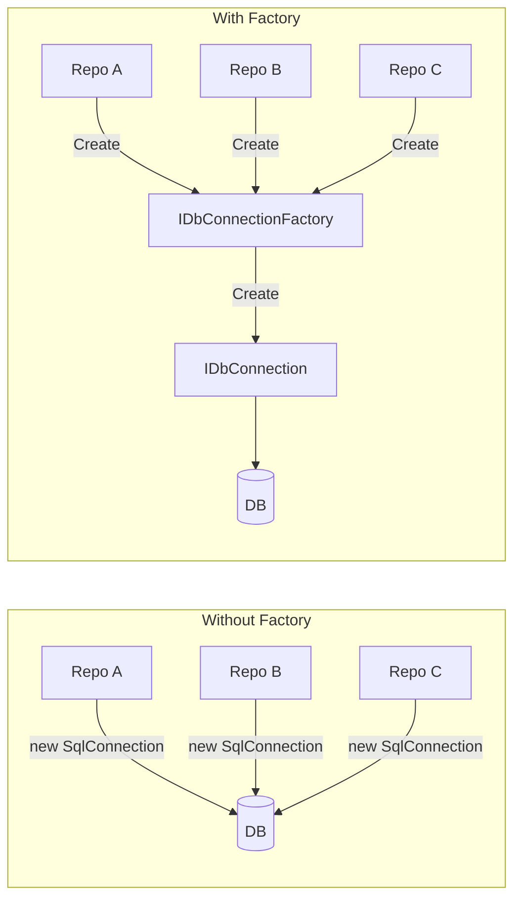
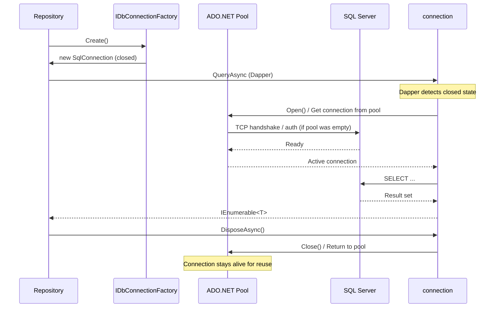
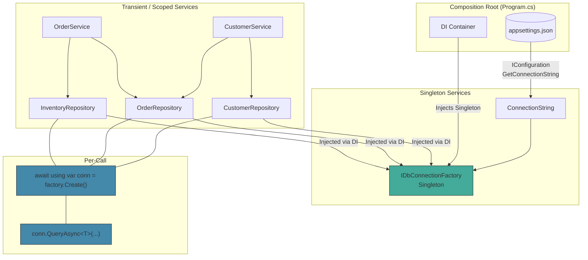

# Dapper — Connection Factory Pattern

## Table of Contents

1. [Why a Connection Factory?](#why-a-connection-factory)
2. [Core Interface](#core-interface)
3. [Basic Implementation](#basic-implementation)
4. [Dependency Injection Registration](#dependency-injection-registration)
5. [Async Disposal and Lifetime](#async-disposal-and-lifetime)
6. [Mermaid: Architecture Flow](#mermaid-architecture-flow)
7. [Comparison: Connection Factory vs. DbContext](#comparison-connection-factory-vs-dbcontext)
8. [Production Example — Full DI Pipeline](#production-example--full-di-pipeline)
9. [Gotchas and Pitfalls](#gotchas-and-pitfalls)
10. [Variations and Extensions](#variations-and-extensions)
11. [Testing with Connection Factory](#testing-with-connection-factory)
12. [Multiple Database Support](#multiple-database-support)
13. [Transaction Support with Factory](#transaction-support-with-factory)
14. [Connection Factory with Unit of Work](#connection-factory-with-unit-of-work)

---

## Why a Connection Factory?

Dapper extends `IDbConnection` with methods like `Query`, `Execute`, `QueryAsync`, etc. But Dapper **does not create, manage, or dispose connections** for you. You are entirely responsible for:

- Creating an `IDbConnection` instance.
- Opening it (or letting Dapper auto-open on first command).
- Disposing it when done.

If you scatter `new SqlConnection(connectionString)` across every repository, service, or handler, you introduce:

- **Duplication** — every caller must know the connection string and provider type.
- **Tight coupling** — callers depend on `SqlConnection` concretely instead of `IDbConnection`.
- **Testability friction** — you cannot substitute a different connection (e.g., for integration tests against a real database or for unit tests with a mock).
- **Configuration fragility** — changing the connection string or switching to a different ADO.NET provider requires touching every usage site.

The **Connection Factory pattern** centralises connection creation behind a single, testable, injectable abstraction.



**Key principle**: *The factory is a single source of truth for how connections are made.*

---

## Core Interface

The factory interface should be minimal — a single method:

```csharp
namespace DataAccess.Abstractions;

public interface IDbConnectionFactory
{
    IDbConnection Create();
}
```

Variations you will see in production:

| Variant | Description |
|---------|-------------|
| `IDbConnection Create()` | Synchronous creation (most common). |
| `Task<IDbConnection> CreateAsync(CancellationToken ct)` | Async creation for providers that need async initialisation (e.g., `SqlConnection.OpenAsync`). |
| `IDbConnection Create(string connectionString)` | Parameterised factory for multi-tenant scenarios. |
| `IDbConnection Create(string connectionString, string providerName)` | Full factory for dynamic provider selection. |

The simplest form — parameterless `Create()` — is sufficient for the vast majority of single-database applications.

### Generic Variant (Optional)

Some codebases introduce a generic marker to scope the factory to a specific database:

```csharp
public interface IDbConnectionFactory<TDatabase> : IDbConnectionFactory
{
}

// Usage:
public class OrderRepository
{
    private readonly IDbConnectionFactory<OrdersDb> _factory;

    public OrderRepository(IDbConnectionFactory<OrdersDb> factory)
    {
        _factory = factory;
    }
}
```

This uses the type parameter `TDatabase` as a **brand** — it prevents accidentally injecting the wrong factory when multiple databases are in play. No additional methods are needed on the generic interface; it inherits `Create()` from the base.

---

## Basic Implementation

### SqlConnectionFactory (Single Provider)

```csharp
using System.Data;
using Microsoft.Data.SqlClient;

namespace DataAccess.Sql;

public sealed class SqlConnectionFactory : IDbConnectionFactory
{
    private readonly string _connectionString;

    public SqlConnectionFactory(string connectionString)
    {
        _connectionString = connectionString
            ?? throw new ArgumentNullException(nameof(connectionString));
    }

    public IDbConnection Create()
    {
        var connection = new SqlConnection(_connectionString);

        // Connection starts closed. ADO.NET pool handles actual TCP
        // connections internally. Opening is deferred to the caller
        // (or to Dapper's auto-open behaviour).
        return connection;
    }
}
```

Key points:

- The factory **returns a closed connection**. The caller (or Dapper) opens it.
- The factory does **not** pool connections — ADO.NET's built-in connection pool does that transparently.
- The factory is **stateless** — it can be safely registered as a Singleton.
- The factory is **immutable** — once constructed, the connection string never changes.

### NpgsqlConnectionFactory (PostgreSQL)

```csharp
using System.Data;
using Npgsql;

namespace DataAccess.Postgres;

public sealed class NpgsqlConnectionFactory : IDbConnectionFactory
{
    private readonly string _connectionString;

    public NpgsqlConnectionFactory(string connectionString)
    {
        ArgumentNullException.ThrowIfNull(connectionString);
        _connectionString = connectionString;
    }

    public IDbConnection Create()
    {
        return new NpgsqlConnection(_connectionString);
    }
}
```

### MySqlConnectionFactory (MySQL / MariaDB)

```csharp
using System.Data;
using MySqlConnector;

namespace DataAccess.MySql;

public sealed class MySqlConnectionFactory : IDbConnectionFactory
{
    private readonly string _connectionString;

    public MySqlConnectionFactory(string connectionString)
    {
        ArgumentNullException.ThrowIfNull(connectionString);
        _connectionString = connectionString;
    }

    public IDbConnection Create()
    {
        return new MySqlConnection(_connectionString);
    }
}
```

### Minimal-Allocation Factory (.NET 6+)

For hot-path code where allocations matter, you can cache the `SqlConnection` type and constructor:

```csharp
using System.Data;
using System.Reflection;
using Microsoft.Data.SqlClient;

public sealed class FastSqlConnectionFactory : IDbConnectionFactory
{
    private static readonly Func<string, SqlConnection> _factory;

    static FastSqlConnectionFactory()
    {
        // Compile a delegate that calls new SqlConnection(string)
        // using expression trees or the cached constructor.
        var ctor = typeof(SqlConnection)
            .GetConstructor(BindingFlags.Instance | BindingFlags.Public, null,
                [typeof(string)], null);

        if (ctor is null)
            throw new InvalidOperationException(
                "SqlConnection(string) constructor not found.");

        var param = Expression.Parameter(typeof(string), "cs");
        var body = Expression.New(ctor, param);
        _factory = Expression.Lambda<Func<string, SqlConnection>>(body, param)
            .Compile();
    }

    private readonly string _connectionString;

    public FastSqlConnectionFactory(string connectionString)
    {
        _connectionString = connectionString;
    }

    public IDbConnection Create()
    {
        return _factory(_connectionString);
    }
}
```

> **Note**: In practice, the standard `new SqlConnection(...)` is already extremely fast (~200 ns). The reflection-based approach is only relevant for sub-microsecond optimisation targets and is **not recommended** unless profiling proves it matters.

---

## Dependency Injection Registration

The factory is typically **Singleton** because it is stateless — it holds only a connection string and returns a **new** connection instance each call.

### Microsoft.Extensions.DependencyInjection

```csharp
using Microsoft.Extensions.DependencyInjection;

// Startup / Program.cs
services.AddSingleton<IDbConnectionFactory>(_ =>
    new SqlConnectionFactory(connectionString));
```

If using `IConfiguration`:

```csharp
var cs = configuration.GetConnectionString("DefaultConnection");
services.AddSingleton<IDbConnectionFactory>(_ =>
    new SqlConnectionFactory(cs));
```

### With IOptions\<ConnectionStrings\>

```csharp
services.Configure<ConnectionStrings>(
    configuration.GetSection("ConnectionStrings"));

services.AddSingleton<IDbConnectionFactory>(sp =>
{
    var options = sp.GetRequiredService<IOptions<ConnectionStrings>>();
    return new SqlConnectionFactory(
        options.Value.DefaultConnection
            ?? throw new InvalidOperationException(
                "DefaultConnection is not configured."));
});
```

### Lifetime Comparison

| Lifetime | Factory Behaviour | Connection Behaviour | When to Use |
|----------|------------------|---------------------|-------------|
| **Singleton** | Created once | `Create()` returns new `SqlConnection` each call | Standard choice. Factory has no per-request state. |
| **Scoped** | Created per HTTP request / scope | Same as above (each `Create()` call still returns a new connection) | Rarely needed. Use only if the factory itself carries scoped state (e.g., per-tenant connection string resolved from `HttpContext`). |
| **Transient** | Created every injection | Same | Never useful. No benefit over Singleton. |

### Per-Tenant Factory (Multi-Tenant)

```csharp
services.AddScoped<IDbConnectionFactory>(sp =>
{
    var httpContext = sp.GetRequiredService<IHttpContextAccessor>();
    var tenantProvider = sp.GetRequiredService<ITenantProvider>();
    var tenant = tenantProvider.GetCurrentTenant(httpContext.HttpContext!);

    return new SqlConnectionFactory(tenant.ConnectionString);
});
```

Here the factory **must** be Scoped because the connection string changes per request.

---

## Async Disposal and Lifetime

### The `await using` Pattern

Since `IDbConnection` implements `IDisposable` (and `IAsyncDisposable` via `SqlConnection`), consume the factory with `await using`:

```csharp
await using var connection = _factory.Create();

var orders = await connection.QueryAsync<Order>(
    "SELECT * FROM Orders WHERE CustomerId = @Id",
    new { Id = customerId });
```

The `await using` ensures:

1. The connection is disposed when the block exits.
2. If the connection is open, it is closed and returned to the ADO.NET pool.
3. Dapper's async methods play nicely with the connection lifecycle.

### What Happens Under the Hood



### Dapper's Auto-Open Behaviour

Dapper automatically opens a closed connection when you call `Query`, `Execute`, `QueryAsync`, etc. It does **not** close it afterward — that remains your responsibility. This means:

```csharp
// These are equivalent — both work because Dapper auto-opens:

// Option A: Explicit open
await using var conn = _factory.Create();
conn.Open();
var items = await conn.QueryAsync<Item>(sql);

// Option B: Let Dapper open (preferred — fewer moving parts)
await using var conn = _factory.Create();
var items = await conn.QueryAsync<Item>(sql);
```

**Prefer Option B** — it reduces boilerplate and eliminates one failure point (forgetting to open).

### Handling Connection Leaks

Always use `await using` or `using`. A connection factory that returns `new SqlConnection(...)` each call **will** leak connections if callers forget to dispose. There is no safety net.

```csharp
// BAD — connection is never disposed, pool exhausts connections
public IEnumerable<Order> GetOrders()
{
    var conn = _factory.Create();
    return conn.Query<Order>("SELECT * FROM Orders");
}
```

```csharp
// GOOD — safe disposal
public IEnumerable<Order> GetOrders()
{
    using var conn = _factory.Create();
    return conn.Query<Order>("SELECT * FROM Orders");
}
```

---

## Mermaid: Architecture Flow

### Full Application Flow



### Repository Call Sequence

```mermaid
sequenceDiagram
    participant Client as Controller / Service
    participant Repo as Repository
    participant Factory as IDbConnectionFactory (Singleton)
    participant Conn as IDbConnection (transient per call)
    participant Dapper as Dapper Extensions
    participant Pool as ADO.NET Connection Pool
    participant DB as Database Server

    Client->>Repo: GetCustomerById(id)
    Repo->>Factory: Create()
    Factory-->>Repo: new SqlConnection(closed)

    Repo->>Conn: await using var conn = ...

    Repo->>Dapper: conn.QueryFirstOrDefaultAsync&lt;Customer&gt;(sql, param)
    Dapper->>Conn: conn.State == Closed → Open()
    Conn->>Pool: Get connection from pool
    Pool->>DB: TDS / protocol handshake
    DB-->>Pool: Session established
    Pool-->>Conn: Ready
    Dapper->>DB: EXEC sp_executesql @sql, @params
    DB-->>Dapper: Result set
    Dapper-->>Repo: Customer? (or null)

    Repo-->>Client: Customer?

    Note over Conn: End of await using block
    Conn->>Pool: Dispose → Close → Return to pool
```

---

## Comparison: Connection Factory vs. DbContext

### Entity Framework Core's DbContext

```csharp
public class AppDbContext : DbContext
{
    public DbSet<Customer> Customers => Set<Customer>();
    public DbSet<Order> Orders => Set<Order>();
}

// DI registration (Scoped per request)
services.AddDbContext<AppDbContext>(options =>
    options.UseSqlServer(connectionString));
```

### Dapper with Connection Factory

```csharp
services.AddSingleton<IDbConnectionFactory>(
    _ => new SqlConnectionFactory(connectionString));

public class CustomerRepository
{
    private readonly IDbConnectionFactory _factory;
    // ...
}
```

### Key Differences

| Aspect | EF Core DbContext | Dapper + Connection Factory |
|--------|------------------|-----------------------------|
| **Lifetime** | Scoped (normally per HTTP request) | Factory is Singleton; connections are per-call (created & disposed inside each method). |
| **Connection management** | Framework manages open/close per query | Caller manages via `await using`. |
| **Unit of Work** | Built-in (ChangeTracker, SaveChanges) | No built-in UoW — you implement it manually (see [[8.871 — Dapper — Repository Pattern Implementation]]). |
| **Transaction scope** | `context.Database.BeginTransaction()` | `connection.BeginTransaction()` or `TransactionScope`. |
| **Lazy loading** | Supported (with proxies) | Not supported. |
| **Change tracking** | Automatic | None. |
| **Connection reuse** | Same connection reused within a scope | Each factory call creates a new `SqlConnection` (pooled under the hood). |
| **Testing** | In-memory provider or SQLite | Mock `IDbConnection` or use `SqliteConnection` (see testing section below). |

### When Does Each Shine?

- **Connection Factory + Dapper**: High-performance reads, write-heavy CQRS, microservices where you want per-query control, legacy databases with complex SQL, teams that prefer SQL over LINQ.
- **DbContext + EF Core**: CRUD-heavy apps with moderate complexity, teams that want auto-migrations, change tracking, and LINQ projections.

### Hybrid Approach

Some codebases use **both** — EF Core for complex CRUD with change tracking, and Dapper + connection factory for read-only queries and reporting:

```csharp
public class OrderController
{
    private readonly AppDbContext _db;
    private readonly IDbConnectionFactory _factory;

    // EF Core for writes (with change tracking)
    public async Task<IActionResult> Create(OrderDto dto)
    {
        var order = new Order { /* ... */ };
        _db.Orders.Add(order);
        await _db.SaveChangesAsync();
        return Ok(order.Id);
    }

    // Dapper for high-performance reads
    public async Task<IActionResult> GetReport(int year)
    {
        await using var conn = _factory.Create();
        var rows = await conn.QueryAsync<SalesReport>(
            ReportingQueries.AnnualSalesByRegion,
            new { Year = year });
        return Ok(rows);
    }
}
```

This is a valid pattern known as **CQRS-lite** — separate read and write models without introducing a full CQRS framework.

---

## Production Example — Full DI Pipeline

### 1. Configuration Binding

```csharp
// appsettings.json
{
  "ConnectionStrings": {
    "DefaultConnection": "Server=(localdb)\\mssqllocaldb;Database=ShopDb;Trusted_Connection=true;TrustServerCertificate=true;"
  },
  "DatabaseSettings": {
    "CommandTimeoutSeconds": 30,
    "RetryCount": 3,
    "RetryBaseDelayMs": 100
  }
}
```

```csharp
public class ConnectionStrings
{
    public const string SectionName = "ConnectionStrings";
    public string DefaultConnection { get; set; } = string.Empty;
}

public class DatabaseSettings
{
    public const string SectionName = "DatabaseSettings";
    public int CommandTimeoutSeconds { get; set; } = 30;
    public int RetryCount { get; set; } = 3;
    public int RetryBaseDelayMs { get; set; } = 100;
}
```

### 2. Enhanced Factory with Options

```csharp
using System.Data;
using Microsoft.Data.SqlClient;
using Microsoft.Extensions.Options;

namespace DataAccess.Sql;

public sealed class SqlConnectionFactory : IDbConnectionFactory
{
    private readonly string _connectionString;
    private readonly int _commandTimeoutSeconds;

    public SqlConnectionFactory(
        IOptions<ConnectionStrings> connectionStrings,
        IOptions<DatabaseSettings> databaseSettings)
    {
        ArgumentNullException.ThrowIfNull(connectionStrings?.Value);
        ArgumentNullException.ThrowIfNull(databaseSettings?.Value);

        _connectionString = connectionStrings.Value.DefaultConnection
            ?? throw new InvalidOperationException(
                "DefaultConnection string is not configured.");

        _commandTimeoutSeconds = databaseSettings.Value.CommandTimeoutSeconds;

        if (string.IsNullOrWhiteSpace(_connectionString))
            throw new InvalidOperationException(
                "DefaultConnection string is empty.");
    }

    /// <summary>
    /// Creates a new <see cref="SqlConnection"/>.
    /// The connection is returned in the closed state.
    /// </summary>
    public IDbConnection Create()
    {
        return new SqlConnection(_connectionString);
    }

    /// <summary>
    /// Creates a connection and sets the default command timeout.
    /// Usage: await using var conn = factory.Create();
    ///        conn.QueryAsync(sql, ...) // inherits timeout
    /// </summary>
    public IDbConnection CreateWithTimeout()
    {
        var conn = new SqlConnection(_connectionString);
        // SqlConnection doesn't have a direct CommandTimeout property;
        // instead set it per command or use SqlCommand.
        return conn;
    }
}
```

### 3. Registration in Program.cs

```csharp
using DataAccess.Abstractions;
using DataAccess.Sql;
using Microsoft.Extensions.DependencyInjection;

var builder = WebApplication.CreateBuilder(args);

// Bind configuration
builder.Services
    .Configure<ConnectionStrings>(
        builder.Configuration.GetSection(ConnectionStrings.SectionName))
    .Configure<DatabaseSettings>(
        builder.Configuration.GetSection(DatabaseSettings.SectionName));

// Register factory as Singleton
builder.Services.AddSingleton<IDbConnectionFactory, SqlConnectionFactory>();

// Register repositories
builder.Services.AddScoped<ICustomerRepository, CustomerRepository>();
builder.Services.AddScoped<IOrderRepository, OrderRepository>();
builder.Services.AddScoped<IInventoryRepository, InventoryRepository>();

// Register services
builder.Services.AddScoped<ICustomerService, CustomerService>();
builder.Services.AddScoped<IOrderService, OrderService>();

var app = builder.Build();

// ... middleware pipeline
```

### 4. Repository Consuming the Factory

```csharp
using System.Data;
using Dapper;
using DataAccess.Abstractions;

namespace DataAccess.Repositories;

public sealed class CustomerRepository : ICustomerRepository
{
    private readonly IDbConnectionFactory _factory;

    public CustomerRepository(IDbConnectionFactory factory)
    {
        _factory = factory
            ?? throw new ArgumentNullException(nameof(factory));
    }

    public async Task<Customer?> GetByIdAsync(int id)
    {
        await using var conn = _factory.Create();
        return await conn.QueryFirstOrDefaultAsync<Customer>(
            "SELECT * FROM Customers WHERE Id = @Id",
            new { Id = id });
    }

    public async Task<IReadOnlyList<Customer>> GetAllAsync()
    {
        await using var conn = _factory.Create();
        var rows = await conn.QueryAsync<Customer>(
            "SELECT * FROM Customers ORDER BY Name");
        return rows.AsList();
    }

    public async Task<int> CreateAsync(Customer customer)
    {
        await using var conn = _factory.Create();
        return await conn.ExecuteAsync(
            "INSERT INTO Customers (Name, Email) VALUES (@Name, @Email); SELECT CAST(SCOPE_IDENTITY() AS INT);",
            new { customer.Name, customer.Email });
    }

    public async Task<bool> UpdateAsync(Customer customer)
    {
        await using var conn = _factory.Create();
        var affected = await conn.ExecuteAsync(
            "UPDATE Customers SET Name = @Name, Email = @Email WHERE Id = @Id",
            new { customer.Name, customer.Email, customer.Id });
        return affected > 0;
    }

    public async Task<bool> DeleteAsync(int id)
    {
        await using var conn = _factory.Create();
        var affected = await conn.ExecuteAsync(
            "DELETE FROM Customers WHERE Id = @Id",
            new { Id = id });
        return affected > 0;
    }
}
```

### 5. Service Layer

```csharp
using DataAccess.Abstractions;

namespace BusinessLogic.Services;

public sealed class CustomerService : ICustomerService
{
    private readonly ICustomerRepository _repo;

    public CustomerService(ICustomerRepository repo)
    {
        _repo = repo;
    }

    public async Task<CustomerDto?> GetCustomerAsync(int id)
    {
        var customer = await _repo.GetByIdAsync(id);
        if (customer is null) return null;

        return new CustomerDto
        {
            Id = customer.Id,
            Name = customer.Name,
            Email = customer.Email
        };
    }

    public async Task<IReadOnlyList<CustomerDto>> GetAllCustomersAsync()
    {
        var customers = await _repo.GetAllAsync();
        return customers
            .Select(c => new CustomerDto
            {
                Id = c.Id,
                Name = c.Name,
                Email = c.Email
            })
            .ToList();
    }

    public async Task<int> CreateCustomerAsync(CreateCustomerRequest request)
    {
        var customer = new Customer
        {
            Name = request.Name,
            Email = request.Email
        };

        var id = await _repo.CreateAsync(customer);
        return id;
    }
}
```

### 6. Controller

```csharp
using Microsoft.AspNetCore.Mvc;
using BusinessLogic.Abstractions;

[ApiController]
[Route("api/[controller]")]
public sealed class CustomersController : ControllerBase
{
    private readonly ICustomerService _service;

    public CustomersController(ICustomerService service)
    {
        _service = service;
    }

    [HttpGet("{id:int}")]
    public async Task<ActionResult<CustomerDto>> Get(int id)
    {
        var customer = await _service.GetCustomerAsync(id);
        if (customer is null)
            return NotFound();
        return Ok(customer);
    }

    [HttpGet]
    public async Task<ActionResult<IReadOnlyList<CustomerDto>>> GetAll()
    {
        var customers = await _service.GetAllCustomersAsync();
        return Ok(customers);
    }

    [HttpPost]
    public async Task<ActionResult<int>> Create(CreateCustomerRequest request)
    {
        var id = await _service.CreateCustomerAsync(request);
        return CreatedAtAction(nameof(Get), new { id }, id);
    }
}
```

### 7. Models and DTOs

```csharp
// Domain model
public sealed class Customer
{
    public int Id { get; set; }
    public string Name { get; set; } = string.Empty;
    public string Email { get; set; } = string.Empty;
}

// DTOs
public sealed class CustomerDto
{
    public int Id { get; set; }
    public string Name { get; set; } = string.Empty;
    public string Email { get; set; } = string.Empty;
}

public sealed class CreateCustomerRequest
{
    public string Name { get; set; } = string.Empty;
    public string Email { get; set; } = string.Empty;
}
```

---

## Gotchas and Pitfalls

### 1. Factory Returns a **Closed** Connection

The factory must return a **closed** connection. Callers (or Dapper) open it. Returning a pre-opened connection is almost always wrong — you'd have to coordinate open/close lifecycle with the caller, defeating the purpose of `await using`.

```csharp
// WRONG — factory opens the connection
public IDbConnection Create()
{
    var conn = new SqlConnection(_cs);
    conn.Open();  // <-- BAD
    return conn;
}

// RIGHT — factory creates closed connection
public IDbConnection Create()
{
    return new SqlConnection(_cs);  // closed
}
```

**Why it matters**: If the factory opens the connection and the caller also calls `Open()`, ADO.NET throws `InvalidOperationException: The connection is already open`.

### 2. Factory Does **Not** Pool Connections

The factory returns a **new** `SqlConnection` object each call. It does **not** maintain a pool of connection objects.

**Connection pooling happens at a lower layer** — inside `SqlConnection` / ADO.NET. When you `Open()` a `SqlConnection`, ADO.NET checks the pool for a matching connection string and either pulls an existing TCP connection or creates a new one. When you `Close()` / `Dispose()`, the underlying TCP connection is returned to the pool — it is **not** destroyed.

```csharp
// This does NOT create a new TCP connection each time
// (after the first few calls, the pool reuses TCP sockets):
for (int i = 0; i < 1000; i++)
{
    await using var conn = _factory.Create();
    await conn.OpenAsync();
    // ... query ...
    // Dispose → Close → return to pool
}
```

### 3. Disposing a Connection Returns It to the Pool

When you dispose a `SqlConnection`, ADO.NET **does not** destroy the underlying TCP socket. It resets the session and returns the connection to the pool. This is fast and efficient.

```csharp
await using var conn = _factory.Create();
// conn is returned to the pool at the end of this block
```

**Leak scenario**: If you never dispose the connection (you lose the reference or don't use `using`/`await using`), the underlying TCP connection remains open until:

- The `SqlConnection` is garbage collected (non-deterministic).
- The pool reaches `Max Pool Size` (default = 100) and blocks new connections.
- The connection's `Connection Lifetime` (if set) expires.

**Symptoms of a leak**: `System.InvalidOperationException: Timeout expired. The timeout period elapsed prior to obtaining a connection from the pool. This may have occurred because all pooled connections were in use and max pool size was reached.`

### 4. Connection String in the Factory is Immutable

Once the factory is constructed, the connection string should not change. If you need per-request connection strings (multi-tenant, sharding), you need either:

- A **Scoped** factory that reads the connection string from a per-request provider.
- A factory method that accepts a connection string parameter.

### 5. Thread Safety

`Create()` is thread-safe by default — it only reads `_connectionString` and calls `new SqlConnection(...)`, which is a thread-safe operation. No locking needed.

However, if the factory **or** the connection held shared state (e.g., a shared transaction object), you would have thread-safety issues. The whole point of the factory pattern is that each call gets its own connection instance, so this is naturally safe.

### 6. Forgetting `await using` in Async Code

In synchronous code, `using` is sufficient. In async code, **always use `await using`** to ensure proper async disposal:

```csharp
// WRONG — synchronous Dispose on an async path
public async Task<IEnumerable<Order>> GetOrdersAsync()
{
    using var conn = _factory.Create();  // <-- Dispose is synchronous
    return await conn.QueryAsync<Order>(sql);
}
```

```csharp
// RIGHT — async Dispose
public async Task<IEnumerable<Order>> GetOrdersAsync()
{
    await using var conn = _factory.Create();  // <-- DisposeAsync
    return await conn.QueryAsync<Order>(sql);
}
```

`SqlConnection` implements `IAsyncDisposable` starting from `Microsoft.Data.SqlClient`. The synchronous `Dispose()` can block the thread while the pool release happens. Always prefer `await using` in async methods.

### 7. Multiple Enumerations

Dapper's `QueryAsync` returns `IEnumerable<T>` backed by a `SqlDataReader`. If you enumerate it twice, the reader is already closed:

```csharp
await using var conn = _factory.Create();
var results = await conn.QueryAsync<Order>(sql);

// First enumeration — OK
var list1 = results.ToList();

// Second enumeration — BROKEN (reader is closed)
var list2 = results.ToList();
```

**Fix**: Materialise immediately with `.AsList()` or `.ToList()`.

### 8. TransactionScope with Connection Factory

If you use `TransactionScope`, the connection must be opened **inside** the transaction scope:

```csharp
using var scope = new TransactionScope(TransactionScopeAsyncFlowOption.Enabled);
await using var conn = _factory.Create();

// Connection must be OPEN before any Dapper call inside the scope
await conn.OpenAsync();

await conn.ExecuteAsync("UPDATE ...");
await conn.ExecuteAsync("UPDATE ...");

scope.Complete();
```

`TransactionScope` ambiently enlists connections opened within its scope. If the connection is opened outside the scope (or before `TransactionScope` is created), it won't participate.

---

## Variations and Extensions

### 1. Async Factory

Some ADO.NET providers benefit from async initialisation. An async factory variant:

```csharp
public interface IAsyncDbConnectionFactory
{
    Task<IDbConnection> CreateAsync(CancellationToken ct = default);
}

public sealed class SqlAsyncConnectionFactory : IAsyncDbConnectionFactory
{
    private readonly string _connectionString;

    public SqlAsyncConnectionFactory(string connectionString)
    {
        _connectionString = connectionString;
    }

    public async Task<IDbConnection> CreateAsync(CancellationToken ct = default)
    {
        var connection = new SqlConnection(_connectionString);
        await connection.OpenAsync(ct);
        return connection;
    }
}
```

**Trade-off**: The factory now returns an **open** connection. This shifts the open/close responsibility differently — the connection is already open when the caller receives it. The caller still disposes it.

### 2. Decorated Factory (Logging, Metrics)

```csharp
public sealed class LoggingConnectionFactory : IDbConnectionFactory
{
    private readonly IDbConnectionFactory _inner;
    private readonly ILogger _logger;

    public LoggingConnectionFactory(IDbConnectionFactory inner, ILogger logger)
    {
        _inner = inner;
        _logger = logger;
    }

    public IDbConnection Create()
    {
        var connection = _inner.Create();
        _logger.LogDebug(
            "Created connection {ConnectionId} of type {ConnectionType}",
            connection.GetHashCode(),
            connection.GetType().Name);
        return connection;
    }
}

// Registration with decorator
services.AddSingleton<IDbConnectionFactory>(sp =>
{
    var inner = new SqlConnectionFactory(connectionString);
    var logger = sp.GetRequiredService<ILogger<LoggingConnectionFactory>>();
    return new LoggingConnectionFactory(inner, logger);
});
```

### 3. Connection String Rotation Factory

For scenarios where connection strings need rotation (e.g., read replicas, Azure SQL failover groups):

```csharp
public sealed class RotatingConnectionFactory : IDbConnectionFactory
{
    private readonly string[] _connectionStrings;
    private int _index;

    public RotatingConnectionFactory(params string[] connectionStrings)
    {
        _connectionStrings = connectionStrings;
    }

    public IDbConnection Create()
    {
        var index = Interlocked.Increment(ref _index);
        var cs = _connectionStrings[
            Math.Abs(index % _connectionStrings.Length)];
        return new SqlConnection(cs);
    }
}
```

### 4. Read-Write Splitting Factory

```csharp
public interface IDbConnectionFactory
{
    IDbConnection Create();
    IDbConnection CreateReadOnly();
}

public sealed class ReadWriteConnectionFactory : IDbConnectionFactory
{
    private readonly string _writeConnectionString;
    private readonly string _readConnectionString;

    public ReadWriteConnectionFactory(
        string writeConnectionString,
        string readConnectionString)
    {
        _writeConnectionString = writeConnectionString;
        _readConnectionString = readConnectionString;
    }

    public IDbConnection Create()
        => new SqlConnection(_writeConnectionString);

    public IDbConnection CreateReadOnly()
        => new SqlConnection(_readConnectionString);
}
```

Repositories then choose:

```csharp
public class ReadOnlyRepository<T> where T : class
{
    private readonly IDbConnectionFactory _factory;

    public async Task<IEnumerable<T>> GetAllAsync()
    {
        await using var conn = _factory.CreateReadOnly();
        return await conn.QueryAsync<T>(/* ... */);
    }
}
```

---

## Testing with Connection Factory

### Unit Testing with Mock

```csharp
using System.Data;
using Moq;
using DataAccess.Abstractions;

[Fact]
public async Task GetByIdAsync_Returns_Customer_When_Found()
{
    // Arrange
    var mockConn = new Mock<IDbConnection>();
    var mockFactory = new Mock<IDbConnectionFactory>();

    mockFactory
        .Setup(f => f.Create())
        .Returns(mockConn.Object);

    // Mock Dapper's behaviour
    mockConn
        .Setup(c => c.QueryFirstOrDefaultAsync<Customer>(
            It.IsAny<string>(),
            It.IsAny<object>(),
            null, null, null))
        .ReturnsAsync(new Customer { Id = 1, Name = "Test" });

    var repo = new CustomerRepository(mockFactory.Object);

    // Act
    var result = await repo.GetByIdAsync(1);

    // Assert
    Assert.NotNull(result);
    Assert.Equal(1, result!.Id);
    Assert.Equal("Test", result.Name);
}
```

### Integration Testing with LocalDB or Testcontainers

```csharp
using Testcontainers.MsSql;

public sealed class CustomerRepositoryTests : IAsyncLifetime
{
    private readonly MsSqlContainer _container = new MsSqlBuilder()
        .WithImage("mcr.microsoft.com/mssql/server:2022-latest")
        .Build();

    private IDbConnectionFactory _factory = null!;

    public async Task InitializeAsync()
    {
        await _container.StartAsync();
        _factory = new SqlConnectionFactory(_container.GetConnectionString());

        // Seed schema
        await using var conn = _factory.Create();
        await conn.ExecuteAsync(@"
            CREATE TABLE Customers (
                Id INT IDENTITY(1,1) PRIMARY KEY,
                Name NVARCHAR(100) NOT NULL,
                Email NVARCHAR(200) NOT NULL
            );");
    }

    [Fact]
    public async Task CreateAsync_Inserts_Row_And_Returns_Id()
    {
        var repo = new CustomerRepository(_factory);
        var id = await repo.CreateAsync(new Customer
        {
            Name = "Jane Doe",
            Email = "jane@example.com"
        });

        Assert.True(id > 0);
    }

    public async Task DisposeAsync()
    {
        await _container.DisposeAsync();
    }
}
```

### Using SQLite as a Test Double

For in-memory testing without a real SQL Server, use `Microsoft.Data.Sqlite`:

```csharp
using Microsoft.Data.Sqlite;

public sealed class SqliteConnectionFactory : IDbConnectionFactory
{
    private readonly string _connectionString;

    public SqliteConnectionFactory(string connectionString = "DataSource=:memory:")
    {
        _connectionString = connectionString;
    }

    public IDbConnection Create()
    {
        var conn = new SqliteConnection(_connectionString);
        conn.Open(); // SQLite in-memory requires Open to keep the DB alive
        return conn;
    }
}

// Register in test setup:
var factory = new SqliteConnectionFactory();
// For in-memory, keep the connection alive for the test's duration:
await using var seedConn = factory.Create();
await seedConn.ExecuteAsync("CREATE TABLE Customers (...)"); 
```

> **Warning**: `DataSource=:memory:` creates a new database **per connection** unless you keep the first connection open (which shares the in-memory DB with subsequent connections opened on the same `SqliteConnection`). For shared in-memory databases, use `DataSource=:memory:;Cache=Shared`.

---

## Multiple Database Support

### Multiple Factories

When your application talks to multiple databases, register each factory with a distinct interface or key:

```csharp
// Interface segregation
public interface IOrderDbConnectionFactory : IDbConnectionFactory { }
public interface IReportingDbConnectionFactory : IDbConnectionFactory { }

public sealed class OrderDbConnectionFactory : IOrderDbConnectionFactory
{
    private readonly string _cs;
    public OrderDbConnectionFactory(string cs) => _cs = cs;
    public IDbConnection Create() => new SqlConnection(_cs);
}

public sealed class ReportingDbConnectionFactory : IReportingDbConnectionFactory
{
    private readonly string _cs;
    public ReportingDbConnectionFactory(string cs) => _cs = cs;
    public IDbConnection Create() => new SqlConnection(_cs);
}

// Registration
services.AddSingleton<IOrderDbConnectionFactory>(_ =>
    new OrderDbConnectionFactory(cs["OrdersDb"]));
services.AddSingleton<IReportingDbConnectionFactory>(_ =>
    new ReportingDbConnectionFactory(cs["ReportingDb"]));

// Usage
public class OrderRepository
{
    private readonly IOrderDbConnectionFactory _factory;
    public OrderRepository(IOrderDbConnectionFactory factory)
        => _factory = factory;
}
```

### Named Factories (Keyed DI — .NET 8+)

```csharp
// .NET 8 Keyed DI
services.AddKeyedSingleton<IDbConnectionFactory>(
    "Orders", _ => new SqlConnectionFactory(cs["OrdersDb"]));
services.AddKeyedSingleton<IDbConnectionFactory>(
    "Reporting", _ => new SqlConnectionFactory(cs["ReportingDb"]));

public class OrderRepository
{
    private readonly IDbConnectionFactory _factory;
    public OrderRepository(
        [FromKeyedServices("Orders")] IDbConnectionFactory factory)
        => _factory = factory;
}
```

### Connection String Resolution per Request Type

```csharp
public sealed class TenantAwareConnectionFactory : IDbConnectionFactory
{
    private readonly ITenantProvider _tenant;
    private readonly Dictionary<string, string> _connectionStrings;

    public TenantAwareConnectionFactory(
        ITenantProvider tenant,
        IConfiguration configuration)
    {
        _tenant = tenant;
        _connectionStrings = configuration
            .GetSection("Tenants")
            .GetChildren()
            .ToDictionary(
                section => section.Key,
                section => section["ConnectionString"]!);
    }

    public IDbConnection Create()
    {
        var tenantId = _tenant.GetCurrentTenant();
        if (!_connectionStrings.TryGetValue(tenantId, out var cs))
            throw new InvalidOperationException(
                $"No connection string configured for tenant '{tenantId}'.");
        return new SqlConnection(cs);
    }
}
```

---

## Transaction Support with Factory

### Basic Transaction

```csharp
public async Task TransferFundsAsync(
    int fromAccountId, int toAccountId, decimal amount)
{
    await using var conn = _factory.Create();
    await conn.OpenAsync(); // Required before BeginTransaction

    await using var tx = await conn.BeginTransactionAsync();

    try
    {
        var fromBalance = await conn.QuerySingleAsync<decimal>(
            "SELECT Balance FROM Accounts WHERE Id = @Id",
            new { Id = fromAccountId },
            transaction: tx);

        if (fromBalance < amount)
            throw new InvalidOperationException("Insufficient funds.");

        await conn.ExecuteAsync(
            "UPDATE Accounts SET Balance = Balance - @Amount WHERE Id = @Id",
            new { Amount = amount, Id = fromAccountId },
            transaction: tx);

        await conn.ExecuteAsync(
            "UPDATE Accounts SET Balance = Balance + @Amount WHERE Id = @Id",
            new { Amount = amount, Id = toAccountId },
            transaction: tx);

        await tx.CommitAsync();
    }
    catch
    {
        await tx.RollbackAsync();
        throw;
    }
}
```

### Transaction per Method or per Service?

The connection factory gives **per-call** connections. If you need a transaction spanning multiple repository calls, you must manage the connection + transaction at the **service** level:

```csharp
// Service owns the transaction
public class TransferService
{
    private readonly IDbConnectionFactory _factory;
    private readonly IAccountRepository _accounts;

    public TransferService(
        IDbConnectionFactory factory, IAccountRepository accounts)
    {
        _factory = factory;
        _accounts = accounts;
    }

    public async Task TransferAsync(int from, int to, decimal amount)
    {
        await using var conn = _factory.Create();
        await conn.OpenAsync();
        await using var tx = await conn.BeginTransactionAsync();

        // Pass connection and transaction to repositories
        var fromBalance = await _accounts.GetBalanceAsync(
            from, conn, tx);
        if (fromBalance < amount)
            throw new InvalidOperationException("Insufficient funds.");

        await _accounts.DebitAsync(from, amount, conn, tx);
        await _accounts.CreditAsync(to, amount, conn, tx);

        await tx.CommitAsync();
    }
}
```

This pattern is expanded in [[8.871 — Dapper — Repository Pattern Implementation]] and [[8.876 — Dapper — Connection Management — Open and Close]].

---

## Connection Factory with Unit of Work

For a more structured approach to transactions, combine the factory with a Unit of Work. This is covered in depth in the related notes, but the factory interaction looks like:

```csharp
public interface IUnitOfWork : IDisposable
{
    IDbConnection Connection { get; }
    IDbTransaction? Transaction { get; }
    void BeginTransaction();
    void Commit();
    void Rollback();
}

public sealed class UnitOfWork : IUnitOfWork
{
    private readonly IDbConnectionFactory _factory;
    private IDbConnection _connection = null!;
    private IDbTransaction _transaction = null!;

    public UnitOfWork(IDbConnectionFactory factory)
    {
        _factory = factory;
    }

    public IDbConnection Connection =>
        _connection ??= _factory.Create();

    public IDbTransaction? Transaction => _transaction;

    public void BeginTransaction()
    {
        if (_connection is null)
        {
            _connection = _factory.Create();
            _connection.Open();
        }
        _transaction = _connection.BeginTransaction();
    }

    public void Commit()
    {
        _transaction?.Commit();
        _transaction?.Dispose();
        _transaction = null!;
    }

    public void Rollback()
    {
        _transaction?.Rollback();
        _transaction?.Dispose();
        _transaction = null!;
    }

    public void Dispose()
    {
        _transaction?.Dispose();
        _connection?.Dispose();
    }
}
```

The factory's only role here is `Create()` — the UoW takes ownership of the connection and its lifecycle.

---

## Best Practices Summary

| # | Practice | Rationale |
|---|----------|-----------|
| 1 | **Register factory as Singleton** | Stateless — holds only the connection string. |
| 2 | **Return closed connections** | Let the caller (or Dapper) control open state. |
| 3 | **Always use `await using` in async methods** | Ensures proper async disposal and non-blocking pool return. |
| 4 | **Materialise Dapper results immediately** | Avoids double-enumeration issues with `SqlDataReader`. |
| 5 | **Keep the interface minimal** | `IDbConnection Create()` is sufficient for most apps. |
| 6 | **Inject factory into repositories, not services** | Services should not know about connections. Repositories manage data access. |
| 7 | **Use `IOptions<T>` for configuration** | Enables strong typing and hot-reload (with `IOptionsSnapshot` or `IOptionsMonitor`). |
| 8 | **Test with mocks or light databases** | Mock `IDbConnectionFactory` for unit tests; use `SqliteConnectionFactory` or Testcontainers for integration tests. |
| 9 | **Do not cache connections in the factory** | Let ADO.NET pooling handle reuse. Caching connections in the factory causes stale connections and leaks. |
| 10 | **Document the connection string source** | Make it obvious where the connection string comes from (appsettings, environment variables, Key Vault). |

---

## Common Questions

### Q: Should I open the connection before passing it to Dapper?

**A**: No. Dapper opens a closed connection automatically on the first query executed against it. Opening manually is redundant unless you need to call `BeginTransaction()` or set connection-specific properties.

### Q: Is the factory thread-safe?

**A**: Yes. Reading a connection string and calling `new SqlConnection(...)` is thread-safe. The returned connection object is **not** thread-safe — it should be used by one thread at a time and disposed before another call to `Create()`.

### Q: One factory per database or one factory with a parameter?

**A**: Prefer **one factory per database** (via separate interfaces or keyed DI). This makes the dependency explicit and avoids accidental cross-database queries.

### Q: How do I handle connection strings that change at runtime?

**A**: Use a **Scoped** factory that resolves the connection string from a per-request service (e.g., `ITenantProvider`). Do not mutate a Singleton factory's connection string — it's a race condition.

### Q: What about using `Dapper.Transaction`?

**A**: The `Dapper.Transaction` NuGet package extends `IDbTransaction` with Dapper methods. It does **not** replace the connection factory. You still create connections via the factory and then call `BeginTransaction()` on the connection.

---

## References

- [[8.851 — Dapper — What It Is and When to Use]]
- [[8.853 — Dapper — QueryT — Basic Querying]]
- [[8.855 — Dapper — QueryAsync — Async Patterns]]
- [[8.871 — Dapper — Repository Pattern Implementation]]
- [[8.876 — Dapper — Connection Management — Open and Close]]
- [[8.879 — Dapper — Anti-Patterns and Gotchas]]
- [[8.881 — Repository Pattern — Interface and Implementation]]
- [Microsoft.Data.SqlClient Documentation](https://learn.microsoft.com/en-us/sql/connect/ado-net/microsoft-ado-net-sql-server)

---

> **Summary**: The Connection Factory pattern is the cornerstone of Dapper-based data access in .NET. It centralises connection creation behind a minimal, testable interface, keeps connection management explicit and predictable, and integrates cleanly with DI containers. Combined with `await using` for disposal and ADO.NET's built-in pooling, it gives you per-call control over database connections with minimal overhead. Master this pattern before moving on to repositories, transactions, and unit of work.
