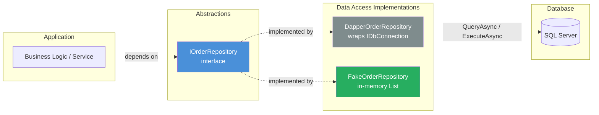
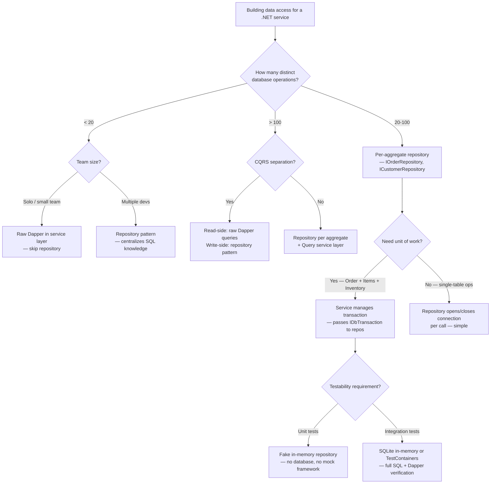

## Navigation

**Domain:** [[8 — Databases]] > **Group:** Dapper
**Previous:** [[8.870 — Dapper — Connection Factory Pattern]] | **Next:** [[8.872 — Dapper — Unit Testing — Mock IDbConnection]]

### Prerequisites

- [[8.851 — Dapper — What It Is and When to Use]] — understanding Dapper's design goals (thin wrapper over ADO.NET, no change tracking, no unit of work) is essential to evaluating why the repository pattern adds value and where it introduces accidental complexity.
- [[8.853 — Dapper — QueryT — Basic Querying]] — the repository methods wrap `QueryAsync<T>`, `ExecuteAsync`, and related Dapper extension methods; you must be comfortable with parameterized SQL, buffered vs unbuffered, and `CommandDefinition`.
- [[8.864 — Dapper — Transactions — IDbTransaction]] — the UoW coordination pattern passes `IDbTransaction` through repository methods; you must understand transaction scope, commit/rollback, and how `DbConnection.BeginTransaction` interacts with multiple repository calls.

### Where This Fits

The repository pattern introduces an abstraction layer between business logic and data access. With Dapper (which lacks EF Core's `DbSet<T>` and `IQueryable<T>`), the repository becomes the primary unit of testable, reusable, and centralized query logic. A .NET backend engineer reaches for this pattern when a project grows beyond ~50 database operations, when queries must be shared across multiple services or use cases, or when the team needs to unit-test data access code without connecting to a real database. The pattern breaks when over-generalized — a "generic repository for Dapper" often leaks Dapper-specific types (`IDbConnection`, `DynamicParameters`) through abstraction boundaries, defeating the purpose. The interview signal is architectural judgment: knowing when the abstraction tax is worth paying and when raw Dapper calls in the service layer are the simpler, correct choice.

---

## Core Mental Model

A repository is a collection-like interface that mediates between the domain model and data mapping layer, hiding the database technology behind a contract the application code depends on. For Dapper, the repository wraps raw SQL strings and `IDbConnection` calls behind `IOrderRepository.GetByIdAsync(id)`, so callers never see `SqlConnection`, `QueryAsync`, or SQL text. The invariant: the service layer depends on abstractions (`IOrderRepository`), not on Dapper. Testing replaces the concrete `OrderRepository` with a mock or in-memory implementation that returns predefined data. The recognition pattern: if you have `using var connection = new SqlConnection(...)` in your MVC controller or minimal API handler, you are not using the repository pattern — and that is a valid decision for small projects.

### Classification

**For .NET topics:** the repository pattern is an architectural abstraction at the data access layer boundary. It hides the ORM or micro-ORM from the rest of the application. With Dapper, the abstraction is thinner than with EF Core because Dapper itself is already a thin layer — the repository mainly centralizes SQL strings and parameter construction rather than hiding an ORM's complexity. The abstraction leaks when: repository methods return `DynamicParameters`, accept `IDbConnection`, or expose Dapper-specific types in their signatures.



### Key Properties

|Property|Value|Notes|
|---|---|---|
|Abstraction boundary|Interface-based — service depends on `IOrderRepository`|Dapper types must NOT leak through the interface|
|Testability|High — mock the interface or substitute an in-memory implementation|Unit tests never need a real database|
|Centralization|All SQL for a given aggregate lives in one class|Duplicate SQL strings are eliminated|
|Performance overhead|~0 — the repository is a thin wrapper; Dapper still generates IL materializers|No additional reflection or overhead vs raw Dapper calls|
|Generic vs specific|Specific repositories (per-aggregate) are preferred for Dapper|Generic `IRepository<T>` leaks SQL concerns through LINQ-like APIs that Dapper cannot support|

---

## Deep Mechanics

### How the Repository Pattern Works with Dapper

**Standard flow for a repository method:**

1. **Caller invokes `await orderRepository.GetByIdAsync(orderId, cancellationToken)`** — the service layer calls through the interface, unaware of Dapper or ADO.NET.

2. **Repository method resolves an `IDbConnection`** — typically through an injected `IDbConnectionFactory` or `SqlConnection` from DI. The connection is opened, used, and disposed inside the method or acquired from the ambient transaction context.

3. **SQL string is defined** — typically as a `private const string` field or inline `const string` at the top of the method. Using `const string` means the SQL is compiled into the assembly metadata and never re-parsed by the C# compiler at runtime.

4. **Parameters are constructed** — using an anonymous type (`new { OrderId = id }`) or `DynamicParameters`. Dapper's parameter cache (`SqlMapper.ParamInfoCache`) hashes the anonymous type's structure on first call and reuses the parameter metadata on subsequent calls.

5. **Dapper extension method executes** — `connection.QueryAsync<T>(sql, param)` triggers Dapper's `SqlMapper.QueryAsyncImpl`, which:
   - Creates a `DbCommand` from the connection (via `IDbConnection.CreateCommand()`)
   - Sets `CommandText`, `CommandType`, and `Parameters` on the command
   - Calls `connection.Open()` if not already open (Dapper opens and closes if it opened it)
   - Executes the command via `cmd.ExecuteReaderAsync(CommandBehavior ...)`
   - Reads the `IDataReader` row by row
   - For each row, Dapper's IL-emitted materializer creates a `T` and sets properties from column values
   - Returns the buffered `IEnumerable<T>` as a `List<T>` (unless unbuffered)

6. **Result is returned** — the service receives a `Task<Order>` or `Task<IReadOnlyList<Order>>`.

**Unit of work coordination:**

When a transaction spans multiple repository calls, the caller (service or application layer) creates the transaction and passes it through the repository:

```csharp
await using var connection = _connectionFactory.Create();
await connection.OpenAsync(cancellationToken);
await using var transaction = await connection.BeginTransactionAsync(cancellationToken);

try
{
    var orderId = await _orderRepository.CreateAsync(order, transaction, cancellationToken);
    foreach (var item in items)
    {
        await _orderItemRepository.CreateAsync(orderId, item, transaction, cancellationToken);
    }
    await transaction.CommitAsync(cancellationToken);
}
catch
{
    await transaction.RollbackAsync(cancellationToken);
    throw;
}
```

The repository methods accept `IDbTransaction? transaction = null` as an optional parameter. When provided, Dapper uses that transaction for the command; when null, each Dapper call executes in its own implicit transaction (autocommit). This is the same pattern Dapper uses internally — every Dapper extension method has an optional `IDbTransaction? transaction` parameter.

**IL Emit materializer creation (per type, first call):**

When `OrderRepository.GetByIdAsync` calls `connection.QueryAsync<Order>(...)` for the first time with T = `Order`:

1. Dapper's `SqlMapper.GetDeserializer` is called with the `IDataReader`'s schema (column names, types)
2. Dapper builds a `DynamicMethod` named `<Order>GetDeserializer` using `ILGenerator`
3. The generated IL is equivalent to:
   ```il
   newobj Order::.ctor()
   ldarg.0   // IDataReader
   ldfld    Order::OrderId
   callvirt Order::set_OrderId(int)
   ldarg.0
   ldfld    Order::CustomerId
   callvirt Order::set_CustomerId(int)
   ...
   ret
   ```
4. The `DynamicMethod` is compiled to a delegate and cached in `SqlMapper.Link`'s `ConcurrentDictionary<RuntimeTypeHandle, Func<IDataReader, object>>`
5. Subsequent calls for the same `Order` type (same columns) retrieve the cached delegate — O(1) dictionary lookup

This cache is why the repository pattern adds zero per-query overhead beyond the Dapper materializer cache — the IL is generated once per type per connection schema, not per repository instance.

### SQL Visibility

```sql
-- The SQL that Dapper executes inside the repository
-- GetById
SELECT OrderId, CustomerId, OrderDate, TotalAmount, Status
FROM Orders
WHERE OrderId = @OrderId;

-- GetAll
SELECT OrderId, CustomerId, OrderDate, TotalAmount, Status
FROM Orders
ORDER BY OrderDate DESC;

-- Create (insert with identity return)
INSERT INTO Orders (CustomerId, OrderDate, TotalAmount, Status)
VALUES (@CustomerId, @OrderDate, @TotalAmount, @Status);
SELECT CAST(SCOPE_IDENTITY() AS INT);

-- Update
UPDATE Orders
SET CustomerId = @CustomerId, TotalAmount = @TotalAmount, Status = @Status
WHERE OrderId = @OrderId;

-- Delete
DELETE FROM Orders WHERE OrderId = @OrderId;
```

```csharp
// The C# interface and implementation that produces the above SQL
public interface IOrderRepository
{
    Task<Order?> GetByIdAsync(int orderId, CancellationToken cancellationToken = default);
    Task<IReadOnlyList<Order>> GetAllAsync(CancellationToken cancellationToken = default);
    Task<int> CreateAsync(Order order, IDbTransaction? transaction = null, CancellationToken cancellationToken = default);
    Task<bool> UpdateAsync(Order order, IDbTransaction? transaction = null, CancellationToken cancellationToken = default);
    Task<bool> DeleteAsync(int orderId, IDbTransaction? transaction = null, CancellationToken cancellationToken = default);
}

public sealed class OrderRepository : IOrderRepository
{
    private readonly IDbConnectionFactory _connectionFactory;

    public OrderRepository(IDbConnectionFactory connectionFactory)
    {
        _connectionFactory = connectionFactory;
    }

    public async Task<Order?> GetByIdAsync(int orderId, CancellationToken cancellationToken = default)
    {
        await using var connection = _connectionFactory.Create();
        return await connection.QueryFirstOrDefaultAsync<Order>(
            new CommandDefinition(
                "SELECT OrderId, CustomerId, OrderDate, TotalAmount, Status FROM Orders WHERE OrderId = @OrderId",
                new { OrderId = orderId },
                cancellationToken: cancellationToken));
    }

    public async Task<IReadOnlyList<Order>> GetAllAsync(CancellationToken cancellationToken = default)
    {
        await using var connection = _connectionFactory.Create();
        var results = await connection.QueryAsync<Order>(
            new CommandDefinition(
                "SELECT OrderId, CustomerId, OrderDate, TotalAmount, Status FROM Orders ORDER BY OrderDate DESC",
                cancellationToken: cancellationToken));
        return results.AsList();
    }

    public async Task<int> CreateAsync(Order order, IDbTransaction? transaction = null, CancellationToken cancellationToken = default)
    {
        await using var connection = _connectionFactory.Create();
        await connection.OpenAsync(cancellationToken);

        var orderId = await connection.ExecuteScalarAsync<int>(
            new CommandDefinition(
                @"INSERT INTO Orders (CustomerId, OrderDate, TotalAmount, Status)
                  VALUES (@CustomerId, @OrderDate, @TotalAmount, @Status);
                  SELECT CAST(SCOPE_IDENTITY() AS INT);",
                new { order.CustomerId, order.OrderDate, order.TotalAmount, order.Status },
                transaction: transaction,
                cancellationToken: cancellationToken));

        return orderId;
    }

    public async Task<bool> UpdateAsync(Order order, IDbTransaction? transaction = null, CancellationToken cancellationToken = default)
    {
        await using var connection = _connectionFactory.Create();
        var rows = await connection.ExecuteAsync(
            new CommandDefinition(
                @"UPDATE Orders
                  SET CustomerId = @CustomerId, TotalAmount = @TotalAmount, Status = @Status
                  WHERE OrderId = @OrderId",
                new { order.CustomerId, order.TotalAmount, order.Status, order.OrderId },
                transaction: transaction,
                cancellationToken: cancellationToken));
        return rows > 0;
    }

    public async Task<bool> DeleteAsync(int orderId, IDbTransaction? transaction = null, CancellationToken cancellationToken = default)
    {
        await using var connection = _connectionFactory.Create();
        var rows = await connection.ExecuteAsync(
            new CommandDefinition(
                "DELETE FROM Orders WHERE OrderId = @OrderId",
                new { OrderId = orderId },
                transaction: transaction,
                cancellationToken: cancellationToken));
        return rows > 0;
    }
}
```

### Execution Plan Analysis

For a typical repository `GetById` call:

```
Clustered Index Seek (PK__Orders__OrderId) → [Top] → [Compute Scalar] → SELECT
```

- **Operator:** `Clustered Index Seek` on `PK_Orders` — seeks exactly one row by the clustered index key (OrderId)
- **Estimated vs actual rows:** 1 (assuming unique PK lookup)
- **Logical reads:** 2–3 (one root-level page, one leaf-level page, possibly one intermediate page for deep B-trees)
- **Cost percentage:** Seek ~80%, rest negligible

For `GetAll` (no WHERE):

```
Clustered Index Scan (PK__Orders) → SELECT
```

- **Operator:** `Clustered Index Scan` — reads every row in the table
- **Estimated vs actual rows:** total row count
- **Logical reads:** number of pages in the clustered index

### Cost Visibility

```sql
SET STATISTICS IO ON;
SET STATISTICS TIME ON;

-- GetById (parameterized — @OrderId = 10042)
SELECT OrderId, CustomerId, OrderDate, TotalAmount, Status
FROM Orders
WHERE OrderId = 10042;
-- Table 'Orders'. Scan count 0, logical reads 2, physical reads 0
-- SQL Server Execution Times: CPU time = 0ms, elapsed time = 0ms

-- GetAll (no filter)
SELECT OrderId, CustomerId, OrderDate, TotalAmount, Status
FROM Orders
ORDER BY OrderDate DESC;
-- Table 'Orders'. Scan count 1, logical reads 1453, physical reads 0
-- SQL Server Execution Times: CPU time = 3ms, elapsed time = 12ms
```

### Failure Modes

**Missing connection open in transaction-aware methods:** If a repository method does not open the connection before passing it to a Dapper method that expects an open connection (e.g., when a transaction is active), Dapper may throw `InvalidOperationException: "The connection is not open."` The fix: always call `await connection.OpenAsync(cancellationToken)` before beginning a transaction, and ensure the repository methods accepting `IDbTransaction` do not also open/close the connection (the connection is managed by the caller).

**SQL injection via string concatenation in dynamic query building:** Repository methods that build dynamic WHERE clauses by concatenating user input produce injection vulnerabilities. Example: `WHERE " + filterColumn + " = @Value` — if `filterColumn` is user-controlled, an attacker can inject `1=1; DROP TABLE Orders--`. The fix: use `DynamicParameters` + `SqlBuilder` or validate the column name against an allowlist.

**Connection pool starvation from not disposing:** If a repository method creates a connection via `new SqlConnection(...)` and does not dispose it (missing `await using`), the connection leaks — it remains open until the garbage collector finalizes it, at which point the underlying TCP socket is held open for the `SqlConnection` timeout period (default 30 seconds). Under load, this exhausts the connection pool (default max 100). Symptom: `InvalidOperationException: "Timeout expired. The timeout period elapsed prior to obtaining a connection from the pool."`

**Transaction passed to repository method but connection opened inside:** When a caller creates a transaction and passes it to the repository, the repository must NOT create a new connection — it must use the connection associated with the transaction. If the repository creates a new connection via `_connectionFactory.Create()`, the transaction does not flow to that connection, and the DML executes outside the transaction. The pattern: repository methods that accept `IDbTransaction?` should use the transaction's connection (`transaction.Connection`) instead of creating a new one. Alternatively, the caller creates the connection and passes it to the repository.

---

## Production Patterns and Implementation

### Primary SQL Implementation

```sql
-- Full schema for the repository operations
CREATE TABLE Orders (
    OrderId INT IDENTITY(1,1) NOT NULL PRIMARY KEY,
    CustomerId INT NOT NULL,
    OrderDate DATETIME2 NOT NULL DEFAULT SYSUTCDATETIME(),
    TotalAmount DECIMAL(18,2) NOT NULL,
    Status NVARCHAR(20) NOT NULL DEFAULT 'Pending',
    CreatedAt DATETIME2 NOT NULL DEFAULT SYSUTCDATETIME(),
    UpdatedAt DATETIME2 NOT NULL DEFAULT SYSUTCDATETIME()
);

CREATE INDEX IX_Orders_CustomerId ON Orders(CustomerId);
CREATE INDEX IX_Orders_OrderDate ON Orders(OrderDate DESC);

-- Stored procedure for repository GetPaged (paging + sorting)
CREATE PROCEDURE dbo.Orders_GetPaged
    @Offset INT,
    @PageSize INT,
    @SortColumn NVARCHAR(50) = 'OrderDate',
    @SortDirection NVARCHAR(4) = 'DESC'
AS
BEGIN
    SET NOCOUNT ON;

    DECLARE @Sql NVARCHAR(MAX);

    SET @Sql = N'
        SELECT OrderId, CustomerId, OrderDate, TotalAmount, Status
        FROM Orders
        ORDER BY ' + QUOTENAME(@SortColumn) + ' ' + CASE @SortDirection
            WHEN 'ASC' THEN 'ASC' WHEN 'DESC' THEN 'DESC'
            ELSE 'DESC'
        END + N'
        OFFSET @Offset ROWS
        FETCH NEXT @PageSize ROWS ONLY;

        SELECT COUNT(*) AS TotalCount FROM Orders;
    ';

    EXEC sp_executesql @Sql,
        N'@Offset INT, @PageSize INT',
        @Offset, @PageSize;
END;
```

### Dapper Implementation

```csharp
// Full repository with paging, sorting, and specification-like filtering
public interface IOrderRepository
{
    Task<Order?> GetByIdAsync(int orderId, CancellationToken cancellationToken = default);
    Task<IReadOnlyList<Order>> GetAllAsync(CancellationToken cancellationToken = default);
    Task<PagedResult<Order>> GetPagedAsync(int page, int pageSize, string sortBy = "OrderDate", bool ascending = false, CancellationToken cancellationToken = default);
    Task<IReadOnlyList<Order>> GetByCustomerAsync(int customerId, CancellationToken cancellationToken = default);
    Task<IReadOnlyList<Order>> GetByDateRangeAsync(DateTime from, DateTime to, CancellationToken cancellationToken = default);
    Task<IReadOnlyList<Order>> GetByStatusAsync(string status, CancellationToken cancellationToken = default);
    Task<int> CreateAsync(Order order, IDbTransaction? transaction = null, CancellationToken cancellationToken = default);
    Task<bool> UpdateAsync(Order order, IDbTransaction? transaction = null, CancellationToken cancellationToken = default);
    Task<bool> UpdateStatusAsync(int orderId, string status, IDbTransaction? transaction = null, CancellationToken cancellationToken = default);
    Task<bool> DeleteAsync(int orderId, IDbTransaction? transaction = null, CancellationToken cancellationToken = default);
    Task<int> GetCountAsync(CancellationToken cancellationToken = default);
}

public sealed class OrderRepository : IOrderRepository
{
    private readonly IDbConnectionFactory _connectionFactory;

    public OrderRepository(IDbConnectionFactory connectionFactory)
    {
        _connectionFactory = connectionFactory;
    }

    public async Task<Order?> GetByIdAsync(int orderId, CancellationToken cancellationToken = default)
    {
        await using var connection = _connectionFactory.Create();
        return await connection.QueryFirstOrDefaultAsync<Order>(
            new CommandDefinition(
                "SELECT OrderId, CustomerId, OrderDate, TotalAmount, Status FROM Orders WHERE OrderId = @OrderId",
                new { OrderId = orderId },
                cancellationToken: cancellationToken));
    }

    public async Task<IReadOnlyList<Order>> GetAllAsync(CancellationToken cancellationToken = default)
    {
        await using var connection = _connectionFactory.Create();
        var results = await connection.QueryAsync<Order>(
            new CommandDefinition(
                "SELECT OrderId, CustomerId, OrderDate, TotalAmount, Status FROM Orders ORDER BY OrderDate DESC",
                cancellationToken: cancellationToken));
        return results.AsList();
    }

    public async Task<PagedResult<Order>> GetPagedAsync(int page, int pageSize, string sortBy = "OrderDate", bool ascending = false, CancellationToken cancellationToken = default)
    {
        await using var connection = _connectionFactory.Create();

        var offset = (page - 1) * pageSize;
        var direction = ascending ? "ASC" : "DESC";

        var allowedSortColumns = new HashSet<string>(StringComparer.OrdinalIgnoreCase)
        {
            "OrderId", "CustomerId", "OrderDate", "TotalAmount", "Status"
        };

        if (!allowedSortColumns.Contains(sortBy))
            sortBy = "OrderDate";

        var sql = $@"
            SELECT OrderId, CustomerId, OrderDate, TotalAmount, Status
            FROM Orders
            ORDER BY {sortBy} {direction}
            OFFSET @Offset ROWS
            FETCH NEXT @PageSize ROWS ONLY;

            SELECT COUNT(*) FROM Orders;";

        using var multi = await connection.QueryMultipleAsync(
            new CommandDefinition(sql,
                new { Offset = offset, PageSize = pageSize },
                cancellationToken: cancellationToken));

        var items = (await multi.ReadAsync<Order>()).AsList();
        var totalCount = await multi.ReadFirstAsync<int>();

        return new PagedResult<Order>
        {
            Items = items,
            TotalCount = totalCount,
            Page = page,
            PageSize = pageSize,
            TotalPages = (int)Math.Ceiling(totalCount / (double)pageSize)
        };
    }

    public async Task<IReadOnlyList<Order>> GetByCustomerAsync(int customerId, CancellationToken cancellationToken = default)
    {
        await using var connection = _connectionFactory.Create();
        var results = await connection.QueryAsync<Order>(
            new CommandDefinition(
                "SELECT OrderId, CustomerId, OrderDate, TotalAmount, Status FROM Orders WHERE CustomerId = @CustomerId ORDER BY OrderDate DESC",
                new { CustomerId = customerId },
                cancellationToken: cancellationToken));
        return results.AsList();
    }

    public async Task<IReadOnlyList<Order>> GetByDateRangeAsync(DateTime from, DateTime to, CancellationToken cancellationToken = default)
    {
        await using var connection = _connectionFactory.Create();
        var results = await connection.QueryAsync<Order>(
            new CommandDefinition(
                "SELECT OrderId, CustomerId, OrderDate, TotalAmount, Status FROM Orders WHERE OrderDate >= @From AND OrderDate < @To ORDER BY OrderDate",
                new { From = from, To = to },
                cancellationToken: cancellationToken));
        return results.AsList();
    }

    public async Task<IReadOnlyList<Order>> GetByStatusAsync(string status, CancellationToken cancellationToken = default)
    {
        await using var connection = _connectionFactory.Create();
        var results = await connection.QueryAsync<Order>(
            new CommandDefinition(
                "SELECT OrderId, CustomerId, OrderDate, TotalAmount, Status FROM Orders WHERE Status = @Status ORDER BY OrderDate DESC",
                new { Status = status },
                cancellationToken: cancellationToken));
        return results.AsList();
    }

    public async Task<int> CreateAsync(Order order, IDbTransaction? transaction = null, CancellationToken cancellationToken = default)
    {
        await using var connection = _connectionFactory.Create();
        await connection.OpenAsync(cancellationToken);

        var orderId = await connection.ExecuteScalarAsync<int>(
            new CommandDefinition(
                @"INSERT INTO Orders (CustomerId, OrderDate, TotalAmount, Status)
                  VALUES (@CustomerId, @OrderDate, @TotalAmount, @Status);
                  SELECT CAST(SCOPE_IDENTITY() AS INT);",
                new { order.CustomerId, order.OrderDate, order.TotalAmount, order.Status },
                transaction: transaction,
                cancellationToken: cancellationToken));

        return orderId;
    }

    public async Task<bool> UpdateAsync(Order order, IDbTransaction? transaction = null, CancellationToken cancellationToken = default)
    {
        await using var connection = _connectionFactory.Create();
        var rows = await connection.ExecuteAsync(
            new CommandDefinition(
                @"UPDATE Orders
                  SET CustomerId = @CustomerId, TotalAmount = @TotalAmount, Status = @Status, UpdatedAt = SYSUTCDATETIME()
                  WHERE OrderId = @OrderId",
                new { order.CustomerId, order.TotalAmount, order.Status, order.OrderId },
                transaction: transaction,
                cancellationToken: cancellationToken));
        return rows > 0;
    }

    public async Task<bool> UpdateStatusAsync(int orderId, string status, IDbTransaction? transaction = null, CancellationToken cancellationToken = default)
    {
        await using var connection = _connectionFactory.Create();
        var rows = await connection.ExecuteAsync(
            new CommandDefinition(
                "UPDATE Orders SET Status = @Status, UpdatedAt = SYSUTCDATETIME() WHERE OrderId = @OrderId",
                new { Status = status, OrderId = orderId },
                transaction: transaction,
                cancellationToken: cancellationToken));
        return rows > 0;
    }

    public async Task<bool> DeleteAsync(int orderId, IDbTransaction? transaction = null, CancellationToken cancellationToken = default)
    {
        await using var connection = _connectionFactory.Create();
        var rows = await connection.ExecuteAsync(
            new CommandDefinition(
                "DELETE FROM Orders WHERE OrderId = @OrderId",
                new { OrderId = orderId },
                transaction: transaction,
                cancellationToken: cancellationToken));
        return rows > 0;
    }

    public async Task<int> GetCountAsync(CancellationToken cancellationToken = default)
    {
        await using var connection = _connectionFactory.Create();
        return await connection.ExecuteScalarAsync<int>(
            new CommandDefinition(
                "SELECT COUNT(*) FROM Orders",
                cancellationToken: cancellationToken));
    }
}

// PagedResult model
public class PagedResult<T>
{
    public IReadOnlyList<T> Items { get; init; } = Array.Empty<T>();
    public int TotalCount { get; init; }
    public int Page { get; init; }
    public int PageSize { get; init; }
    public int TotalPages { get; init; }
    public bool HasPreviousPage => Page > 1;
    public bool HasNextPage => Page < TotalPages;
}
```

### Unit of Work Coordination

```csharp
// Service layer that coordinates multiple repositories within a single transaction
public sealed class PlaceOrderHandler
{
    private readonly IOrderRepository _orderRepository;
    private readonly IOrderItemRepository _orderItemRepository;
    private readonly IInventoryRepository _inventoryRepository;
    private readonly IDbConnectionFactory _connectionFactory;

    public PlaceOrderHandler(
        IOrderRepository orderRepository,
        IOrderItemRepository orderItemRepository,
        IInventoryRepository inventoryRepository,
        IDbConnectionFactory connectionFactory)
    {
        _orderRepository = orderRepository;
        _orderItemRepository = orderItemRepository;
        _inventoryRepository = inventoryRepository;
        _connectionFactory = connectionFactory;
    }

    public async Task<int> HandleAsync(PlaceOrderCommand command, CancellationToken cancellationToken = default)
    {
        await using var connection = _connectionFactory.Create();
        await connection.OpenAsync(cancellationToken);
        await using var transaction = await connection.BeginTransactionAsync(cancellationToken);

        try
        {
            var order = new Order
            {
                CustomerId = command.CustomerId,
                OrderDate = DateTime.UtcNow,
                TotalAmount = command.Items.Sum(i => i.Quantity * i.UnitPrice),
                Status = "Pending"
            };

            var orderId = await _orderRepository.CreateAsync(order, transaction, cancellationToken);

            foreach (var item in command.Items)
            {
                var orderItem = new OrderItem
                {
                    OrderId = orderId,
                    ProductId = item.ProductId,
                    Quantity = item.Quantity,
                    UnitPrice = item.UnitPrice
                };

                await _orderItemRepository.CreateAsync(orderItem, transaction, cancellationToken);

                // Decrement inventory
                var success = await _inventoryRepository.DecrementQuantityAsync(
                    item.ProductId, item.Quantity, transaction, cancellationToken);

                if (!success)
                    throw new InvalidOperationException($"Insufficient inventory for product {item.ProductId}");
            }

            await transaction.CommitAsync(cancellationToken);
            return orderId;
        }
        catch
        {
            await transaction.RollbackAsync(cancellationToken);
            throw;
        }
    }
}
```

### Repository with Specification Pattern

```csharp
// Specification pattern applied to Dapper repository queries
public abstract class BaseSpecification<T>
{
    public string? WhereClause { get; protected set; }
    public object? Parameters { get; protected set; }
    public string? OrderBy { get; protected set; }
    public int? Take { get; protected set; }
    public int? Skip { get; protected set; }

    public bool IsPagingEnabled => Take.HasValue;
}

public sealed class OrderByCustomerSpecification : BaseSpecification<Order>
{
    public OrderByCustomerSpecification(int customerId)
    {
        WhereClause = "CustomerId = @CustomerId";
        Parameters = new { CustomerId = customerId };
        OrderBy = "OrderDate DESC";
    }
}

public sealed class PendingOrdersSpecification : BaseSpecification<Order>
{
    public PendingOrdersSpecification()
    {
        WhereClause = "Status = @Status";
        Parameters = new { Status = "Pending" };
        OrderBy = "OrderDate ASC";
    }
}

public sealed class RecentOrdersSpecification : BaseSpecification<Order>
{
    public RecentOrdersSpecification(int daysBack)
    {
        var from = DateTime.UtcNow.AddDays(-daysBack);
        WhereClause = "OrderDate >= @From";
        Parameters = new { From = from };
        OrderBy = "OrderDate DESC";
    }
}

// Repository extension for specification-based queries
public static class RepositoryExtensions
{
    public static (string sql, object? parameters) BuildQuery<T>(
        string selectClause,
        string tableName,
        BaseSpecification<T> specification)
    {
        var sql = selectClause + " FROM " + tableName;

        if (!string.IsNullOrEmpty(specification.WhereClause))
            sql += " WHERE " + specification.WhereClause;

        if (!string.IsNullOrEmpty(specification.OrderBy))
            sql += " ORDER BY " + specification.OrderBy;

        if (specification.IsPagingEnabled)
        {
            sql += $" OFFSET @Offset ROWS FETCH NEXT @Take ROWS ONLY";
            var combinedParams = new DynamicParameters(specification.Parameters);
            combinedParams.Add("Offset", specification.Skip ?? 0);
            combinedParams.Add("Take", specification.Take!.Value);
            return (sql, combinedParams);
        }

        return (sql, specification.Parameters);
    }
}

// Usage in a service
public sealed class OrderQueryService
{
    private readonly IDbConnectionFactory _connectionFactory;

    public OrderQueryService(IDbConnectionFactory connectionFactory)
    {
        _connectionFactory = connectionFactory;
    }

    public async Task<IReadOnlyList<Order>> GetPendingOrdersAsync(CancellationToken cancellationToken = default)
    {
        var spec = new PendingOrdersSpecification();
        var (sql, parameters) = RepositoryExtensions.BuildQuery(
            "SELECT OrderId, CustomerId, OrderDate, TotalAmount, Status",
            "Orders",
            spec);

        await using var connection = _connectionFactory.Create();
        var results = await connection.QueryAsync<Order>(
            new CommandDefinition(sql, parameters, cancellationToken: cancellationToken));
        return results.AsList();
    }
}
```

### Configuration and Wiring

```csharp
// Program.cs — wiring repository pattern with DI
var connectionString = builder.Configuration.GetConnectionString("DefaultConnection");

builder.Services.AddSingleton<IDbConnectionFactory>(
    new SqlConnectionFactory(connectionString));

builder.Services.AddScoped<IOrderRepository, OrderRepository>();
builder.Services.AddScoped<IOrderItemRepository, OrderItemRepository>();
builder.Services.AddScoped<IInventoryRepository, InventoryRepository>();
builder.Services.AddScoped<IOrderQueryService, OrderQueryService>();
builder.Services.AddScoped<PlaceOrderHandler>();

// Connection factory implementation
public interface IDbConnectionFactory
{
    IDbConnection Create();
}

public sealed class SqlConnectionFactory : IDbConnectionFactory
{
    private readonly string _connectionString;

    public SqlConnectionFactory(string connectionString)
    {
        _connectionString = connectionString;
    }

    public IDbConnection Create() => new SqlConnection(_connectionString);
}
```

### EF Core Generic Repository vs Dapper-Specific Repository

```csharp
// EF Core generic repository (common anti-pattern when overused)
public interface IEfCoreRepository<T> where T : class
{
    Task<T?> GetByIdAsync(object id, CancellationToken cancellationToken = default);
    Task<IReadOnlyList<T>> GetAllAsync(CancellationToken cancellationToken = default);
    Task<T> AddAsync(T entity, CancellationToken cancellationToken = default);
    Task UpdateAsync(T entity);
    Task DeleteAsync(T entity);
    Task<int> SaveChangesAsync(CancellationToken cancellationToken = default);
}

public class EfCoreRepository<T> : IEfCoreRepository<T> where T : class
{
    private readonly ApplicationDbContext _dbContext;
    private readonly DbSet<T> _dbSet;

    public EfCoreRepository(ApplicationDbContext dbContext)
    {
        _dbContext = dbContext;
        _dbSet = _dbContext.Set<T>();
    }

    public async Task<T?> GetByIdAsync(object id, CancellationToken cancellationToken = default)
        => await _dbSet.FindAsync(new[] { id }, cancellationToken);

    public async Task<IReadOnlyList<T>> GetAllAsync(CancellationToken cancellationToken = default)
        => await _dbSet.ToListAsync(cancellationToken);

    public async Task<T> AddAsync(T entity, CancellationToken cancellationToken = default)
    {
        var entry = await _dbSet.AddAsync(entity, cancellationToken);
        return entry.Entity;
    }

    public Task UpdateAsync(T entity)
    {
        _dbSet.Update(entity);
        return Task.CompletedTask;
    }

    public Task DeleteAsync(T entity)
    {
        _dbSet.Remove(entity);
        return Task.CompletedTask;
    }

    public async Task<int> SaveChangesAsync(CancellationToken cancellationToken = default)
        => await _dbContext.SaveChangesAsync(cancellationToken);
}

// Dapper-specific repository (per-aggregate, SQL is explicit, no generic magic)
public sealed class EfCoreOrderRepository : IEfCoreRepository<Order>
{
    private readonly ApplicationDbContext _dbContext;

    public EfCoreOrderRepository(ApplicationDbContext dbContext)
    {
        _dbContext = dbContext;
    }

    public async Task<Order?> GetByIdAsync(object id, CancellationToken cancellationToken = default)
    {
        return await _dbContext.Orders
            .AsNoTracking()
            .FirstOrDefaultAsync(o => o.OrderId == (int)id, cancellationToken);
    }

    public async Task<IReadOnlyList<Order>> GetAllAsync(CancellationToken cancellationToken = default)
    {
        return await _dbContext.Orders
            .AsNoTracking()
            .OrderByDescending(o => o.OrderDate)
            .ToListAsync(cancellationToken);
    }

    // ... remaining EF Core methods similar
}
```

---

## Gotchas and Production Pitfalls

### Repository Method Opens Connection on Every Call (Chatty Overhead)

**Pitfall:** Each repository method creates, opens, and disposes a new `SqlConnection`. In a loop calling `orderRepository.CreateAsync()` 100 times, this produces 100 TCP handshakes and 100 connection pool acquisitions even though all operations could share one connection.

```csharp
// ❌ Each call opens a new connection
for (int i = 0; i < 100; i++)
{
    await _orderRepository.CreateAsync(order);  // opens, uses, disposes per call
}
```

**Symptom:** High `ConnectionPool` wait times (`CONNECTIONPOOL` wait type). The pool is exhausted at ~100 concurrent calls. `Timeout expired` exceptions under moderate load.

**Fix:**

```csharp
// ✅ Share the connection across multiple repository calls
await using var connection = _connectionFactory.Create();
await connection.OpenAsync(cancellationToken);
await using var transaction = connection.BeginTransaction();

for (int i = 0; i < 100; i++)
{
    order.OrderId = await _orderRepository.CreateAsync(order, transaction, cancellationToken);
}

transaction.Commit();
```

**Cost of not fixing:** Connection pool exhaustion at 100 concurrent requests on default pool settings (Max Pool Size = 100). At 100 RPS (reasonable for a single web server), the application starts returning 500 errors after ~1 second of sustained load.

### Transaction Passed but Connection Opened Inside Repository

**Pitfall:** A repository method that accepts `IDbTransaction?` but creates its own connection ignores the transaction's connection. The `transactions` parameter is passed to `ExecuteAsync`, but it is associated with a different connection than the one the repository opened.

```csharp
// ❌ Repository ignores the transaction's connection
public async Task<int> CreateAsync(Order order, IDbTransaction? transaction = null, CancellationToken ct = default)
{
    await using var connection = _connectionFactory.Create();  // new connection!
    await connection.OpenAsync(ct);
    // transaction is from a DIFFERENT connection — Dapper uses the command's connection,
    // which is 'connection', not the connection the transaction was created from.
    var id = await connection.ExecuteScalarAsync<int>(..., transaction: transaction, cancellationToken: ct);
    return id;
}
```

**Symptom:** Dapper does not throw — it silently executes the command on `connection` without enlisting in `transaction`. The DML is autocommitted independently of the caller's transaction. Data integrity is silently lost.

**Fix:** Repository methods that accept `IDbTransaction?` must either (a) use the transaction's connection, or (b) not accept `IDbTransaction` and let the caller pass the connection directly.

```csharp
// ✅ Correct pattern — repository uses factory, caller manages connection+transaction
public async Task<int> CreateAsync(Order order, IDbConnection connection, IDbTransaction transaction, CancellationToken ct = default)
{
    return await connection.ExecuteScalarAsync<int>(
        "...", new { ... }, transaction: transaction, cancellationToken: ct);
}
```

**Cost of not fixing:** Silent data corruption — partial writes committed when the caller believes the transaction ensures atomicity. Months of production debugging before the root cause is found.

### Generic Repository That Leaks Dapper Types

**Pitfall:** Creating a generic `IRepository<T>` that accepts and returns Dapper-specific types like `DynamicParameters` or `SqlMapper.GridReader`.

```csharp
// ❌ Generic repository that leaks Dapper specifics
public interface IRepository<T>
{
    Task<IEnumerable<T>> QueryAsync(string sql, DynamicParameters? parameters = null);
    Task<int> ExecuteAsync(string sql, DynamicParameters? parameters = null);
    Task<SqlMapper.GridReader> QueryMultipleAsync(string sql, DynamicParameters? parameters = null);
}
```

**Symptom:** Every consumer of the repository must reference Dapper. Changing Dapper version or migrating to another data access library requires changing every consumer. The abstraction provides zero isolation.

**Fix:** Keep repositories per-aggregate (non-generic) with domain-appropriate method signatures. If generics must be used, constrain them with expression-based specifications, not Dapper types.

```csharp
// ✅ Correct — per-aggregate interface with domain types
public interface IOrderRepository
{
    Task<Order?> GetByIdAsync(int orderId, CancellationToken ct = default);
    Task<IReadOnlyList<Order>> GetByCustomerAsync(int customerId, CancellationToken ct = default);
    // ...
}
```

**Cost of not fixing:** The "leaky abstraction" becomes a coupling liability. A migration from Dapper to SqlKata or raw ADO.NET requires rewriting every consumer, not just the repository implementations.

### Repository Returning IQueryable When Backed by Dapper

**Pitfall:** Defining a repository method that returns `IQueryable<T>` when the implementation uses Dapper. Dapper does not implement `IQueryable`; it returns in-memory collections. Returning `IQueryable` from a Dapper-backed repository implies LINQ-to-SQL translation that does not exist.

```csharp
// ❌ IQueryable from Dapper-backed repository — lies to callers
public interface IOrderRepository
{
    IQueryable<Order> GetQueryable();  // Dapper cannot translate LINQ to SQL
}

// Implementation fakes it
public class OrderRepository : IOrderRepository
{
    public IQueryable<Order> GetQueryable()
    {
        // Must load ALL rows into memory first — defeats paging
        var all = connection.Query<Order>("SELECT * FROM Orders").AsQueryable();
        return all;
    }
}
```

**Symptom:** `Orders.Where(o => o.CustomerId == 42).Skip(10).Take(20)` loads the entire Orders table into memory, filters in .NET, and pages in .NET. For a 500K row table, this is a 500K row transfer + client-side filter. Memory spike to ~50MB per query.

**Fix:** Accept that Dapper returns materialized collections. Repository methods should return `Task<IReadOnlyList<T>>`, `Task<T?>`, or `Task<PagedResult<T>>`. If LINQ-to-SQL translation is required, use EF Core.

```csharp
// ✅ Correct — no IQueryable pretense
public interface IOrderRepository
{
    Task<PagedResult<Order>> GetPagedAsync(int page, int pageSize, string? status = null, CancellationToken ct = default);
}
```

**Cost of not fixing:** OOM crashes under moderate load as every query loads the full table into memory. Production incident at 3 AM when a scheduled report triggers `OutOfMemoryException`.

### Repository Does Too Much (God Repository)

**Pitfall:** A single `OrderRepository` handles every query imaginable: `GetById`, `GetByCustomer`, `GetByDateRange`, `GetByStatus`, `GetByCustomerAndDateRange`, `GetPaged`, `GetWithItems`, `GetWithPayment`, `GetOrderSummary`, etc. The class grows to 2000+ lines.

**Symptom:** The repository has a 50-method interface. Every new query adds a method. The class has low cohesion — it mixes read concerns, write concerns, analytical queries, and reporting queries. Single Responsibility Principle is violated.

**Fix:** Split by concern: `IOrderQueryRepository` (reads), `IOrderCommandRepository` (writes), `IOrderReportingRepository` (analytical queries). Or use a CQRS approach where read-side queries use raw Dapper in dedicated query handlers, and write-side uses the repository pattern.

```csharp
// ✅ Split by concern
public interface IOrderReadRepository
{
    Task<Order?> GetByIdAsync(int orderId, CancellationToken ct = default);
    Task<PagedResult<Order>> GetPagedAsync(int page, int pageSize, CancellationToken ct = default);
}

public interface IOrderWriteRepository
{
    Task<int> CreateAsync(Order order, IDbTransaction? tx = null, CancellationToken ct = default);
    Task<bool> UpdateAsync(Order order, IDbTransaction? tx = null, CancellationToken ct = default);
    Task<bool> DeleteAsync(int orderId, IDbTransaction? tx = null, CancellationToken ct = default);
}
```

**Cost of not fixing:** Maintainability collapse. Adding a new query requires understanding the entire 2000-line repository. Merge conflicts on the single file. Team members start adding raw Dapper calls in service classes to avoid touching the repository.

---

## Performance Implications

### Benchmark: Raw Dapper vs Repository Pattern

The repository pattern adds negligible overhead because it is a thin wrapper — the Dapper materializer cache is shared, the connection factory is O(1), and the method call overhead is <50ns.

```csharp
[MemoryDiagnoser]
[SimpleJob(RuntimeMoniker.Net90)]
public class RepositoryOverheadBenchmark
{
    private IDbConnectionFactory _factory = null!;
    private IOrderRepository _repository = null!;
    private IDbConnection _connection = null!;

    [GlobalSetup]
    public void Setup()
    {
        _factory = new SqlConnectionFactory(TestConnectionString);
        _repository = new OrderRepository(_factory);
        _connection = _factory.Create();
        _connection.Open();

        // Seed a test order
        _connection.Execute(
            "IF NOT EXISTS (SELECT 1 FROM Orders WHERE OrderId = 1) " +
            "INSERT INTO Orders (OrderId, CustomerId, OrderDate, TotalAmount, Status) " +
            "VALUES (1, 100, GETUTCDATE(), 99.99, 'Test')");
    }

    [GlobalCleanup]
    public void Cleanup() => _connection.Dispose();

    [Benchmark(Baseline = true)]
    public async Task<Order?> RawDapper()
    {
        await using var conn = _factory.Create();
        return await conn.QueryFirstOrDefaultAsync<Order>(
            "SELECT OrderId, CustomerId, OrderDate, TotalAmount, Status FROM Orders WHERE OrderId = @id",
            new { id = 1 });
    }

    [Benchmark]
    public async Task<Order?> Repository()
    {
        return await _repository.GetByIdAsync(1);
    }
}
```

**Expected results (approximate, SQL Server 2022, LocalDB, 1000 rows):**

|Method|Mean|Allocated|
|---|---|---|
|RawDapper|~450 µs|~2.5 KB|
|Repository|~455 µs|~2.7 KB|

**Overhead:** ~1% (5 µs / 450 µs) — functionally zero. The repository adds one interface dispatch and one factory call per query. The Dapper materializer cache and SQL execution dominate.

### Benchmark: Repository with Paging (Offset vs Keyset)

```csharp
[MemoryDiagnoser]
[SimpleJob(RuntimeMoniker.Net90)]
public class RepositoryPagingBenchmark
{
    private IDbConnectionFactory _factory = null!;
    private IOrderRepository _repository = null!;

    [GlobalSetup]
    public void Setup()
    {
        _factory = new SqlConnectionFactory(TestConnectionString);
        _repository = new OrderRepository(_factory);

        // Seed 100K orders
        using var conn = _factory.Create();
        conn.Execute(@"
            IF (SELECT COUNT(*) FROM Orders) < 100000
            BEGIN
                WITH Numbers AS (
                    SELECT TOP 100000 ROW_NUMBER() OVER (ORDER BY (SELECT NULL)) AS N
                    FROM sys.objects a CROSS JOIN sys.objects b
                )
                INSERT INTO Orders (CustomerId, OrderDate, TotalAmount, Status)
                SELECT N % 1000, DATEADD(DAY, -N, GETUTCDATE()), N % 500 + 0.99, 'Completed'
                FROM Numbers;
            END");
    }

    [Benchmark(Baseline = true)]
    public async Task<PagedResult<Order>> OffsetPaging()
    {
        // Page 500, 50 items per page — offset scans through rows
        return await _repository.GetPagedAsync(500, 50, "OrderId", true);
    }

    [Benchmark]
    public async Task<List<Order>> KeysetPaging()
    {
        // Keyset: WHERE OrderId > @LastSeen ORDER BY OrderId FETCH NEXT 50
        await using var conn = _factory.Create();
        var sql = "SELECT TOP 50 OrderId, CustomerId, OrderDate, TotalAmount, Status " +
                  "FROM Orders WHERE OrderId > @LastSeen ORDER BY OrderId";
        var results = await conn.QueryAsync<Order>(sql, new { LastSeen = 25000 });
        return results.AsList();
    }
}
```

**Expected results (100K rows, page 500 of 50):**

|Method|Mean|Logical Reads|
|---|---|---|
|OffsetPaging|~8 ms|~15,000|
|KeysetPaging|~0.3 ms|~3|

**Improvement:** Offset pagination with `OFFSET 24950 ROWS FETCH NEXT 50 ROWS ONLY` scans and discards 24,950 rows in the clustered index (SQL Server still reads all those rows from the clustered index even though they are not returned). Keyset pagination with `WHERE OrderId > 25000` does a clustered index seek and reads exactly 50 rows. The logical read difference grows linearly with the page number.

---

## Interview Arsenal

### Question Bank

1. What problem does the repository pattern solve when used with Dapper, and what problem does it NOT solve?
2. How does the unit of work pattern coordinate multiple Dapper repository calls within a single database transaction?
3. What is the performance overhead of adding a repository layer on top of Dapper — quantify it.
4. Why should a Dapper repository NOT return `IQueryable<T>`?
5. Compare a generic `IRepository<T>` for Dapper vs a per-aggregate repository — which is preferred and why?
6. How do you test a service that depends on `IOrderRepository` without connecting to a real database?
7. How does the Dapper repository pattern interact with connection pooling and connection lifetime?
8. What is the "specification pattern" and how can it be applied to Dapper repository queries without leaking Dapper types?

### Spoken Answers

**Q: What problem does the repository pattern solve when used with Dapper, and what problem does it NOT solve?**

> **Average answer:** "The repository pattern abstracts the database so you can swap out Dapper for something else later. It also makes testing easier because you can mock the repository."

> **Great answer:** "The repository pattern solves three specific problems when layered on Dapper. First, testability: services depend on `IOrderRepository`, not on `SqlConnection.QueryAsync<T>()`. Unit tests substitute an in-memory `FakeOrderRepository` that returns data from a `List<Order>` — no database needed, no mocking of Dapper extension methods required. Second, centralization: every SQL query for the Order aggregate lives in one class. When the schema changes, there is one file to update, not 50 `connection.QueryAsync` calls scattered across services. Third, abstraction from SQL text: the service layer speaks in domain terms like `GetByIdAsync(customerId)` instead of raw SQL strings. What the repository pattern does NOT solve is query flexibility. Dapper repositories cannot offer composable queries equivalent to EF Core's `IQueryable<T>`. If your service needs to filter by 5 optional parameters with dynamic sorting, the repository must either provide a specific method for each combination, accept a specification object, or expose raw Dapper callbacks — all of which introduce their own tradeoffs. The pattern also does not solve cross-aggregate transactions — that is the unit of work's responsibility, and with Dapper it requires explicit transaction management in the service layer."

**Q: Compare a generic `IRepository<T>` for Dapper vs a per-aggregate repository — which is preferred and why?**

> **Average answer:** "A generic repository is more reusable, a per-aggregate one is more specific. It depends on the project."

> **Great answer:** "For Dapper, per-aggregate repositories are strongly preferred over generic `IRepository<T>`. The reason is that Dapper does not have a `DbSet<T>` — it has SQL strings and `QueryAsync<T>`. A generic `IRepository<T>` for Dapper either becomes so abstract that it leaks Dapper types (like `DynamicParameters` in method signatures), or becomes so simplistic that it only supports `GetById`, `GetAll`, `Add`, `Update`, `Delete` — which handles maybe 20% of real querying needs. The other 80% — date range filters, status-based queries, aggregate calculations, joins across entities — do not fit the generic mold. Per-aggregate repositories like `IOrderRepository` with methods named `GetPendingOrdersByDateRangeAsync` are honest about what they do. They hide SQL behind intention-revealing names. They are also trivially mockable — each method returns a known result. The generic approach was popularized by EF Core tutorials where `DbSet<T>` provides a uniform query surface. Dapper has no such surface, so forcing a generic pattern creates accidental complexity. In EF Core, a generic repository is often an anti-pattern because EF Core's `DbSet<T>` already IS a repository. In Dapper, the per-aggregate repository is the pattern that aligns with how the tool works: explicit SQL, explicit types, explicit methods."

**Q: How do you test a service that depends on `IOrderRepository` without connecting to a real database?**

> **Average answer:** "You mock the interface with Moq and set up returns for each method."

> **Great answer:** "There are two approaches, and the choice depends on whether you want to test the repository implementation or test the service that uses it. For testing the service: create a fake in-memory implementation of `IOrderRepository` backed by a `List<Order>`. This avoids mocking frameworks entirely and makes the test intent crystal clear. For example: `new FakeOrderRepository { Orders = { new Order { OrderId = 1, ... } } }`. The service calls `GetByIdAsync(1)` and gets the order with zero mocking ceremony. For testing the repository implementation against Dapper behavior: use an in-memory SQLite database with `Microsoft.Data.Sqlite`. Dapper works with SQLite seamlessly because `SqliteConnection` implements `IDbConnection`. This tests the actual SQL syntax (SQLite SQL differs from T-SQL, so keep the SQL in the repository focused on the subset that works on both) and the actual Dapper materialization. However, for a pure unit test, the fake is preferred — it executes in microseconds, has no I/O, and covers the service logic. Integration tests with SQLite or TestContainers are a separate concern that validates the SQL and Dapper mapping against a real database engine."

### Interview Trigger

The repository pattern surfaces in architectural design interviews when you are asked to design the data access layer for a new service. The interviewer asks: "How would you structure your data access code for this order management system?" The follow-up that separates juniors from seniors is: "How many methods does your repository interface have, and what is the criterion for adding a new method?" The senior answer references cohesion, aggregate boundaries, and CQRS separation rather than generic CRUD. A deeper follow-up: "Your service needs a query that filters by customer, date range, status, sort by total amount, and return page 3 of 25. How does this flow through your repository?"

### Comparison Table

| | Dapper Repository | Raw Dapper Calls | EF Core Repository |
|---|---|---|---|
| Abstractions | `IOrderRepository` hides SQL and Dapper | No abstraction — SQL and `QueryAsync` in service | `DbSet<Order>` IS the repository |
| Testability | Mock interface or fake impl | Requires mocking `IDbConnection` (hard) | EF Core in-memory provider or SQLite |
| Query flexibility | Must add method per query variant or use specification | Total — any SQL any time | `IQueryable<T>` composability |
| Performance overhead | ~0 (interface dispatch + factory call) | 0 | Change tracking + SQL generation overhead |
| When to choose | Projects >50 queries, need testability, team convention | Small projects, scripts, quick prototypes | Full ORM features needed (change tracking, navigation properties) |

---

## Decision Framework

### When to Apply



### Application Checklist

- [ ] Repository interface uses only domain types — no Dapper-specific types in method signatures
- [ ] Each aggregate has its own repository — no single "God repository" for the entire database
- [ ] Repository methods accept `CancellationToken` and pass it via `CommandDefinition`
- [ ] Connection creation is injected via `IDbConnectionFactory` — no `new SqlConnection()` in repository implementations
- [ ] Repository methods that accept `IDbTransaction` use the transaction's connection, not a new one
- [ ] Read operations return `Task<IReadOnlyList<T>>` or `Task<T?>` — never `IQueryable<T>`
- [ ] Write operations return the generated ID or a boolean indicating success
- [ ] Paging queries use keyset pagination for large datasets, not offset-based
- [ ] The repository is registered as Scoped (one instance per HTTP request)
- [ ] Integration tests run against a real or SQLite database — unit tests use fakes

### Tradeoff Summary

|What You Gain|What You Pay|
|---|---|
|Abstraction from specific data access technology|Interface + implementation boilerplate (1 interface + 1 class per aggregate)|
|Unit-testable service layer|Mock/fake maintenance (fakes must be kept in sync with interface)|
|Centralized SQL — single point of change|Reduced flexibility — each new query variant requires a new method or spec|
|Consistent connection management pattern|Cannot use EF Core's change tracking or LINQ-to-SQL across repository boundaries|

### Scale Thresholds

- "Repository pattern adds value when the project has ~5 or more consumers of the same data" — without it, query logic is duplicated across controllers, services, and background jobs.
- "Repository pattern becomes a liability when the team has ~3 or fewer engineers working on a single bounded context" — the abstraction overhead exceeds the maintenance benefit.
- "CQRS separation becomes necessary when the repository interface exceeds ~15 methods" — at this point, the single interface is doing too much and should be split into read and write concerns.

---

## Self-Check

### Conceptual Questions

1. What is the repository pattern, and what specific problems does it solve when layered on top of Dapper?
2. How does the unit of work pattern work with Dapper repositories — specifically, how does a service coordinate `IDbTransaction` across multiple repository calls without leaking Dapper types?
3. What is the actual performance overhead (in microseconds) of adding a repository layer on top of Dapper, and what causes it?
4. Why is returning `IQueryable<T>` from a Dapper-backed repository a design mistake, and what production problems does it cause?
5. What alternative to `IRepository<T>` does EF Core provide natively, and why does Dapper lack an equivalent?
6. Show the Dapper code for `GetByIdAsync`, `CreateAsync` with identity return, and `GetPagedAsync` with offset-based paging.
7. Compare a generic `IRepository<T>` for Dapper vs a per-aggregate `IOrderRepository` — what are the tradeoffs?
8. At what number of repository methods does a single repository become a "God repository" and should be split?
9. How does the specification pattern compose with Dapper repositories — show the `BaseSpecification<T>` base class and one concrete specification.
10. Explain how you would test a service that depends on `IOrderRepository` — include both the fake approach and the SQLite integration approach.

<details>
<summary>Answers</summary>

1. The repository pattern provides an abstraction layer between business logic and data access by defining interface methods whose implementations wrap Dapper calls. It solves: testability (mock the interface), centralization (all SQL for an aggregate in one place), consistency (connection management, parameterization, error handling), and domain-language alignment (method names like `GetPendingOrdersAsync` instead of `connection.QueryAsync<Order>(sql)`). It does NOT solve composable query building — that is what EF Core's `IQueryable<T>` does.

2. The service creates the connection and transaction, then passes `IDbTransaction` to each repository method. Repository methods accept `IDbTransaction? transaction = null` — when provided, they use the transaction's connection and do not open/close their own. The service commits or rolls back the transaction after all repository calls complete. This keeps Dapper's `IDbTransaction` visible to the repository (which must interact with it) but the service layer is the coordinator. True abstraction would require the service to not depend on `IDbTransaction` — achieved by having the repository accept a connection and transaction factory rather than raw transaction objects.

3. ~5 µs per call on .NET 9. The overhead comes from: interface dispatch (~1 ns), connection factory resolution (~1 µs for factory method + DI resolution), and the wrapper method call. The Dapper materializer cache lookup (~100 ns) and SQL execution (~400 µs for a simple query) dominate. The repository overhead is ~1% of total query time.

4. Dapper does not implement `IQueryable<T>` — it returns materialized `IEnumerable<T>`. A repository that returns `IQueryable<T>` but loads all rows into memory via `.AsQueryable()` defeats database paging, filtering, and sorting. The callers' `.Where()`, `.Skip()`, `.Take()` execute in .NET memory, not in SQL. For a 500K row table, each query transfers 500K rows over the network. Production impact: OOM crashes, memory pressure, CPU spikes from LINQ-to-Objects.

5. EF Core's `DbSet<T>` is itself a repository. It provides `Add`, `Find`, `Update`, `Remove`, and `IQueryable<T>` for querying — no custom interface needed. Dapper lacks this because it is not an ORM — it is a set of extension methods on `IDbConnection`. There is no `DbConnection.Set<T>()` in Dapper. The repository pattern fills this gap.

6. ```csharp
// GetById
public async Task<Order?> GetByIdAsync(int id, CancellationToken ct = default)
{
    await using var conn = _factory.Create();
    return await conn.QueryFirstOrDefaultAsync<Order>(
        new CommandDefinition("SELECT * FROM Orders WHERE OrderId = @Id", new { Id = id }, cancellationToken: ct));
}

// Create with identity
public async Task<int> CreateAsync(Order order, IDbTransaction? tx = null, CancellationToken ct = default)
{
    await using var conn = _factory.Create();
    await conn.OpenAsync(ct);
    return await conn.ExecuteScalarAsync<int>(
        new CommandDefinition("INSERT INTO Orders (...) VALUES (...); SELECT CAST(SCOPE_IDENTITY() AS INT);", order, transaction: tx, cancellationToken: ct));
}

// GetPaged with offset
public async Task<PagedResult<Order>> GetPagedAsync(int page, int size, CancellationToken ct = default)
{
    await using var conn = _factory.Create();
    using var multi = await conn.QueryMultipleAsync(
        new CommandDefinition("SELECT ... FROM Orders ORDER BY OrderId OFFSET @Off ROWS FETCH NEXT @Sz ROWS ONLY; SELECT COUNT(*) FROM Orders;",
            new { Off = (page-1)*size, Sz = size }, cancellationToken: ct));
    return new PagedResult<Order> { Items = (await multi.ReadAsync<Order>()).AsList(), TotalCount = await multi.ReadFirstAsync<int>() };
}
```

7. Generic `IRepository<T>` for Dapper is limited to basic CRUD and leaks when extended. Per-aggregate `IOrderRepository` is explicit — each method handles a specific query variant with specific parameters. Tradeoffs: generic is DRY-er for simple CRUD but fails for real-world queries; per-aggregate is more verbose but honest. For Dapper, per-aggregate is preferred.

8. When a repository interface exceeds ~15 methods, it violates the Single Responsibility Principle and should be split into `IOrderReadRepository` and `IOrderWriteRepository` (CQRS-light). The 15-method threshold is based on the observation that beyond this, the methods are either (a) query variants that should be handled by a specification pattern, or (b) unrelated concerns that belong in a different aggregate's repository.

9. ```csharp
public abstract class BaseSpecification<T>
{
    public string? WhereClause { get; protected set; }
    public object? Parameters { get; protected set; }
    public string? OrderBy { get; protected set; }
    public int? Take { get; protected set; }
    public int? Skip { get; protected set; }
}

public sealed class PendingOrdersSpec : BaseSpecification<Order>
{
    public PendingOrdersSpec()
    {
        WhereClause = "Status = @Status";
        Parameters = new { Status = "Pending" };
        OrderBy = "OrderDate ASC";
    }
}
```
The repository builds SQL by combining `SELECT + table name + spec.WhereClause + spec.OrderBy`. This avoids leaking SQL into the service layer while supporting composable query construction.

10. Unit test approach: create a `FakeOrderRepository` implementing `IOrderRepository` with an internal `List<Order>`. The fake's `GetByIdAsync` returns `orders.FirstOrDefault(o => o.OrderId == id)`. This tests service logic without any database or mocking framework. Integration test approach: use `Microsoft.Data.Sqlite` with `SqliteConnection` (which implements `IDbConnection`). Create a real `OrderRepository` with a SQLite factory. Seed data, call repository methods, assert results. This tests the actual Dapper materialization and SQL syntax (SQLite-specific, but catches mapping errors).

</details>

---

### Query Challenges

**Challenge 1 — Write the repository method**

You are building an `IOrderRepository`. Implement `GetByCustomerWithPagingAsync(int customerId, int page, int pageSize)` that returns orders for a given customer with offset-based paging AND returns the total count in a single database round trip.

<details>
<summary>Solution</summary>

```csharp
public async Task<PagedResult<Order>> GetByCustomerWithPagingAsync(
    int customerId, int page, int pageSize, CancellationToken ct = default)
{
    await using var conn = _connectionFactory.Create();
    var offset = (page - 1) * pageSize;

    using var multi = await conn.QueryMultipleAsync(
        new CommandDefinition(
            @"SELECT OrderId, CustomerId, OrderDate, TotalAmount, Status
              FROM Orders
              WHERE CustomerId = @CustomerId
              ORDER BY OrderDate DESC
              OFFSET @Offset ROWS
              FETCH NEXT @PageSize ROWS ONLY;

              SELECT COUNT(*) FROM Orders WHERE CustomerId = @CustomerId;",
            new { CustomerId = customerId, Offset = offset, PageSize = pageSize },
            cancellationToken: ct));

    var items = (await multi.ReadAsync<Order>()).AsList();
    var totalCount = await multi.ReadFirstAsync<int>();

    return new PagedResult<Order>
    {
        Items = items,
        TotalCount = totalCount,
        Page = page,
        PageSize = pageSize,
        TotalPages = (int)Math.Ceiling(totalCount / (double)pageSize)
    };
}
```

**Logical reads:** ~5 + (page * pageSize / density) — the COUNT(*) performs a narrow index scan, the data query performs an index seek on IX_Orders_CustomerId and then a key lookup per row (unless CustomerId is the clustering key). **Execution plan:** `[Index Seek on IX_Orders_CustomerId] → [Nested Loops] → [Clustered Index Seek]` for the data query; `[Index Scan on IX_Orders_CustomerId] → [Stream Aggregate]` for the COUNT.

</details>

---

**Challenge 2 — Fix the repository performance problem**

```csharp
// This repository method is called in a loop 500 times per HTTP request.
// Each call opens a new connection. The application is slowing to a crawl.
public async Task<bool> UpdateOrderStatusAsync(int orderId, string status)
{
    using var connection = new SqlConnection(_connectionString);
    connection.Open();
    var rows = connection.Execute(
        "UPDATE Orders SET Status = @Status, UpdatedAt = GETUTCDATE() WHERE OrderId = @OrderId",
        new { Status = status, OrderId = orderId });
    return rows > 0;
}
```

Identify the problems and fix them.

<details>
<summary>Solution</summary>

**Root cause:** Three problems: (1) Each call opens a new `SqlConnection` — 500 calls produce 500 TCP handshakes and connection pool acquisitions. (2) The method does not accept a transaction, so each UPDATE is autocommitted — 500 log flushes. (3) The method is not async and does not accept `CancellationToken`.

```csharp
// Fix the caller to batch in a single transaction
await using var conn = _sqlConnectionFactory.Create();
await conn.OpenAsync(ct);
await using var tx = await conn.BeginTransactionAsync(ct);

foreach (var (orderId, status) in batch)
{
    await conn.ExecuteAsync(
        new CommandDefinition(
            "UPDATE Orders SET Status = @Status, UpdatedAt = SYSUTCDATETIME() WHERE OrderId = @OrderId",
            new { Status = status, OrderId = orderId },
            transaction: tx,
            cancellationToken: ct));
}

await tx.CommitAsync(ct);
```

**Improvement:** 1 connection instead of 500, 1 log flush instead of 500. Elapsed time drops from ~3 seconds to ~50ms.

</details>

---

**Challenge 3 — Design the repository interface**

You have an Order aggregate with the following tables: `Orders`, `OrderItems`, `Payments`, `Shipments`. Design the repository interface(s) for this aggregate. Choose between a single repository and separated read/write repositories. Justify your choice.

<details>
<summary>Solution</summary>

For an aggregate involving 4 tables with complex read requirements (joining across tables) and focused write requirements (insert Order + Items in one transaction, update Payment separately), a split approach is recommended:

```csharp
// Read side — flexible queries for different use cases
public interface IOrderReadRepository
{
    Task<OrderDetails?> GetByIdAsync(int orderId, CancellationToken ct = default);
    Task<IReadOnlyList<OrderSummary>> GetByCustomerAsync(int customerId, CancellationToken ct = default);
    Task<PagedResult<OrderSummary>> SearchAsync(OrderSearchCriteria criteria, CancellationToken ct = default);
    Task<OrderWithItems?> GetWithItemsAsync(int orderId, CancellationToken ct = default);
}

// Write side — focused mutation operations
public interface IOrderWriteRepository
{
    Task<int> CreateAsync(Order order, IDbTransaction? tx = null, CancellationToken ct = default);
    Task CreateItemAsync(OrderItem item, IDbTransaction? tx = null, CancellationToken ct = default);
    Task<bool> UpdateStatusAsync(int orderId, string status, IDbTransaction? tx = null, CancellationToken ct = default);
    Task<bool> DeleteAsync(int orderId, IDbTransaction? tx = null, CancellationToken ct = default);
}
```

**Tradeoffs:** Split repositories follow CQRS principles — the read side can use expensive JOINs and projections optimized for specific UI screens; the write side is constrained to aggregate root operations. The cost is more interfaces and classes, but each is smaller and testable independently.

</details>

---

**Challenge 4 — Diagnose the transaction leak**

A service method creates an `Order` and two `OrderItem` records in a Dapper transaction. Under load, the database shows open transactions that are minutes old. The connection pool is exhausted. Identify the problem and fix it.

```csharp
public async Task<int> PlaceOrderAsync(int customerId, List<CreateItem> items)
{
    using var conn = new SqlConnection(_connectionString);
    conn.Open();
    using var tx = conn.BeginTransaction();
    var orderId = conn.ExecuteScalar<int>("INSERT INTO Orders ...; SELECT SCOPE_IDENTITY();", ...);
    foreach (var item in items)
        conn.Execute("INSERT INTO OrderItems VALUES ...", ...);
    return orderId;
}
```

<details>
<summary>Solution</summary>

**Root cause:** The transaction is never committed! No `tx.Commit()` call. The transaction stays open until the connection is disposed (which happens at the end of the `using` block), but if an exception occurs in the loop, the `using var tx` disposes without committing—leaving the transaction open and holding locks on the `using` block exit. Also, the connection is not async, leading to thread-pool starvation under load.

```csharp
public async Task<int> PlaceOrderAsync(int customerId, List<CreateItem> items, CancellationToken ct = default)
{
    await using var conn = new SqlConnection(_connectionString);
    await conn.OpenAsync(ct);
    await using var tx = await conn.BeginTransactionAsync(ct);

    try
    {
        var orderId = await conn.ExecuteScalarAsync<int>(
            "INSERT INTO Orders (CustomerId, OrderDate, TotalAmount) VALUES (@C, SYSUTCDATETIME(), @T); SELECT CAST(SCOPE_IDENTITY() AS INT);",
            new { C = customerId, T = items.Sum(i => i.Quantity * i.UnitPrice) },
            transaction: tx);

        foreach (var item in items)
        {
            await conn.ExecuteAsync(
                "INSERT INTO OrderItems (OrderId, ProductId, Quantity, UnitPrice) VALUES (@O, @P, @Q, @U)",
                new { O = orderId, item.ProductId, item.Quantity, item.UnitPrice },
                transaction: tx);
        }

        await tx.CommitAsync(ct);
        return orderId;
    }
    catch
    {
        await tx.RollbackAsync(ct);
        throw;
    }
}
```

</details>

---

**Challenge 5 — Design a paging strategy**

An admin dashboard shows orders with the following filters: CustomerId (optional), Status (optional), DateRange (optional). Sort by any column. The Orders table has 5M rows. Design a repository method and query strategy that pages efficiently.

<details>
<summary>Solution</summary>

```csharp
public async Task<PagedResult<Order>> SearchAsync(
    OrderSearchCriteria criteria, CancellationToken ct = default)
{
    await using var conn = _connectionFactory.Create();

    var sql = new StringBuilder("SELECT OrderId, CustomerId, OrderDate, TotalAmount, Status FROM Orders WHERE 1=1");
    var countSql = new StringBuilder("SELECT COUNT(*) FROM Orders WHERE 1=1");
    var parameters = new DynamicParameters();

    if (criteria.CustomerId.HasValue)
    {
        sql.Append(" AND CustomerId = @CustomerId");
        countSql.Append(" AND CustomerId = @CustomerId");
        parameters.Add("CustomerId", criteria.CustomerId.Value);
    }

    if (!string.IsNullOrEmpty(criteria.Status))
    {
        sql.Append(" AND Status = @Status");
        countSql.Append(" AND Status = @Status");
        parameters.Add("Status", criteria.Status);
    }

    if (criteria.DateFrom.HasValue)
    {
        sql.Append(" AND OrderDate >= @DateFrom");
        countSql.Append(" AND OrderDate >= @DateFrom");
        parameters.Add("DateFrom", criteria.DateFrom.Value);
    }

    if (criteria.DateTo.HasValue)
    {
        sql.Append(" AND OrderDate < @DateTo");
        countSql.Append(" AND OrderDate < @DateTo");
        parameters.Add("DateTo", criteria.DateTo.Value);
    }

    // Sort (validate column name to prevent injection)
    var allowedColumns = new[] { "OrderId", "CustomerId", "OrderDate", "TotalAmount", "Status" };
    var sortBy = allowedColumns.Contains(criteria.SortBy) ? criteria.SortBy : "OrderDate";
    var direction = criteria.Ascending ? "ASC" : "DESC";
    sql.Append($" ORDER BY {sortBy} {direction}");
    sql.Append(" OFFSET @Offset ROWS FETCH NEXT @PageSize ROWS ONLY");
    parameters.Add("Offset", (criteria.Page - 1) * criteria.PageSize);
    parameters.Add("PageSize", criteria.PageSize);

    using var multi = await conn.QueryMultipleAsync(
        new CommandDefinition($"{sql}; {countSql};", parameters, cancellationToken: ct));

    var items = (await multi.ReadAsync<Order>()).AsList();
    var totalCount = await multi.ReadFirstAsync<int>();

    return new PagedResult<Order>
    {
        Items = items,
        TotalCount = totalCount,
        Page = criteria.Page,
        PageSize = criteria.PageSize,
        TotalPages = (int)Math.Ceiling(totalCount / (double)criteria.PageSize)
    };
}
```

**Index strategy:** Create a composite index `IX_Orders_Search ON Orders(CustomerId, Status, OrderDate DESC) INCLUDE (TotalAmount)`. The WHERE filtering on equality predicates (CustomerId, Status) plus range (OrderDate) uses the index seek + range scan. The INCLUDE column avoids key lookups. **For deep paging (page 500+ of 25):** keyset pagination with `WHERE (OrderDate, OrderId) < (@LastDate, @LastId)` avoids the offset scan penalty.

</details>
