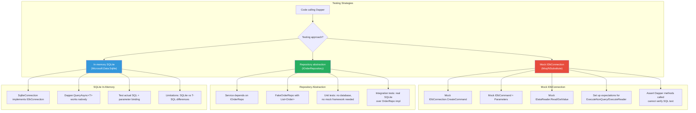
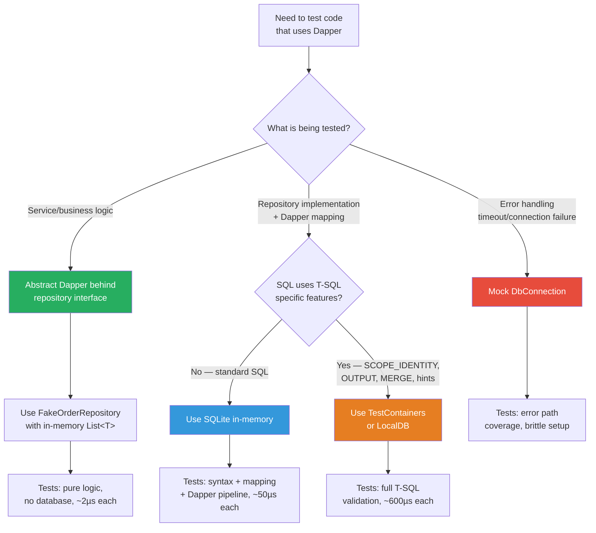

## Navigation

**Domain:** [[8 — Databases]] > **Group:** Dapper
**Previous:** [[8.871 — Dapper — Repository Pattern Implementation]] | **Next:** [[8.873 — Dapper — Performance — IL Emit Internals]]

### Prerequisites

- [[8.851 — Dapper — What It Is and When to Use]] — understanding that Dapper is a set of extension methods on `IDbConnection` is critical: you cannot mock extension methods directly; you must mock the underlying ADO.NET contract.
- [[8.853 — Dapper — QueryT — Basic Querying]] — familiarity with `QueryAsync<T>`, `ExecuteAsync`, `CommandDefinition`, and how Dapper opens/closes connections internally is required to design test doubles that behave correctly.
- [[8.942 — Unit Testing — Repository Mocks]] — the companion note on testing repository abstractions; this note focuses on the Dapper-specific challenge of mocking the `IDbConnection` surface itself.

### Where This Fits

Unit testing Dapper code is uniquely challenging because Dapper's methods are extension methods on `IDbConnection` — you cannot mock or stub a static extension method with standard mocking frameworks. Every `QueryAsync<T>` call internally creates a `DbCommand`, opens the connection, executes the reader, and materializes objects. Testing strategies exist on a spectrum: mock the ADO.NET surface (complex, brittle), abstract Dapper behind a repository interface (preferred, but pushes Dapper down), or use an in-memory SQLite database (pragmatic, tests real Dapper behavior). A .NET backend engineer needs this skill because Dapper is used in high-performance paths where correctness of SQL strings and parameter mappings is critical — and those are exactly the queries that benefit most from automated verification. The interview signal is practical understanding of how extension methods interact with mocking infrastructure and when to choose each testing strategy.

---

## Core Mental Model

Dapper extension methods (`QueryAsync<T>`, `ExecuteAsync`, etc.) are static methods on the `SqlMapper` class — they cannot be mocked, overridden, or intercepted by standard .NET mocking libraries (Moq, NSubstitute, FakeItEasy). To test code that calls Dapper directly, you must mock the ADO.NET objects that Dapper consumes internally: `IDbConnection` (which must return a mocked `IDbCommand`, which returns a mocked `IDataReader`, etc.). This produces deeply nested Arrange code that mirrors the ADO.NET object hierarchy. The alternative — and the recommended approach for most production code — is to abstract Dapper behind a repository interface (`IOrderRepository`) so that tests replace the entire repository instead of mocking the database connection. The invariant: Dapper's extension methods are untestable by mock; they must be tested by integration. Accept this and design the test strategy accordingly.

### Classification

**For .NET topics:** Dapper testing spans three strategies with distinct tradeoffs. (1) **Mock IDbConnection**: mock the ADO.NET contract — requires creating `Mock<IDbConnection>` that returns `Mock<IDbCommand>` that returns `Mock<IDataReader>` with predefined result sets. Fragile, verbose, and tests mock setup, not actual SQL. (2) **Abstract behind interface**: wrap Dapper calls in a repository interface; test against a fake in-memory collection or a real SQLite database. Tests service logic without touching ADO.NET mocking. (3) **Integration with real/minimal database**: use `Microsoft.Data.Sqlite` (in-memory SQLite) which implements `IDbConnection` — Dapper maps to it natively. Tests the actual SQL text and parameter binding against a real SQL engine, but SQLite SQL differs from T-SQL in edge cases.



### Key Properties

|Property|Value|Notes|
|---|---|---|
|Dapper method type|Static extension methods on `IDbConnection`|Cannot be mocked — `Mock.Of<IDbConnection>()` does NOT intercept `QueryAsync<T>`|
|Mock surface|`IDbConnection.CreateCommand()`, `IDbCommand.ExecuteReader()`|ADO.NET object hierarchy must be mocked — fragile, verbose|
|Recommended approach|Abstract Dapper behind repository interface|Service tests use fakes; integration tests use SQLite or real DB|
|SQLite compatibility|Dapper works with `SqliteConnection`|Same `QueryAsync<T>`, `ExecuteAsync` — identical C# code, different SQL dialect|
|Async testing|`QueryAsync` requires `IDbCommand` that returns `Task<IDataReader>`|Mocking async ADO.NET is more complex than sync|
|Fixture management|Respawn or `DELETE FROM` for state reset|Per-test database isolation is critical for reliable tests|

---

## Deep Mechanics

### How Dapper Interacts with ADO.NET Internally

To understand why mocking is difficult, trace Dapper's `QueryAsync<T>` call through the ADO.NET pipeline:

1. **Dapper calls `IDbConnection.QueryAsync<T>(cmdDef)`** — the extension method receives the connection and `CommandDefinition`.

2. **Dapper calls `IDbConnection.CreateCommand()`** — gets an `IDbCommand`. If the connection is not open, Dapper opens it (and will close it when done unless the caller manages the connection state).

3. **Dapper sets properties on the command:**
   - `IDbCommand.CommandText = cmdDef.CommandText` (the SQL string)
   - `IDbCommand.CommandType = cmdDef.CommandType` (usually `CommandType.Text`)
   - `IDbCommand.CommandTimeout = cmdDef.CommandTimeout`

4. **Dapper enumerates parameters** — for an anonymous type parameter like `new { CustomerId = 42 }`, Dapper uses reflection to discover the property name (`CustomerId`), creates a `DbParameter` via `IDbCommand.CreateParameter()`, sets `ParameterName`, `Value`, `DbType`, and adds it to `IDbCommand.Parameters`.

5. **Dapper calls `IDbCommand.ExecuteReaderAsync(CommandBehavior)`** — this returns `Task<IDataReader>`. The specific `CommandBehavior` flags include `Default`, `SingleRow`, `SingleResult`, `CloseConnection`.

6. **If the connection was closed before Dapper opened it**, after the reader completes, Dapper closes the connection.

7. **Dapper reads each row from the IDataReader:**
   - Calls `IDataReader.ReadAsync()` in a loop
   - For each row, calls `IDataReader.GetValue(ordinal)` for each column
   - Uses the IL-emitted materializer to create `T` and set properties

8. **Dapper materializes the result** — buffered mode reads all rows into a `List<T>`; unbuffered mode returns an iterator that reads on demand.

### Why Mocking Fails for Extension Methods

```csharp
// Dapper extension method definition (simplified):
public static class SqlMapper
{
    public static async Task<IEnumerable<T>> QueryAsync<T>(
        this IDbConnection connection,
        string sql,
        object? parameters = null,
        IDbTransaction? transaction = null,
        int? commandTimeout = null,
        CommandType? commandType = null)
    {
        // This is a static method in SqlMapper.
        // It is NOT a virtual method on IDbConnection.
        // Moq's Mock<IDbConnection> cannot intercept it.
    }
}
```

Because `QueryAsync<T>` is a static extension method, Moq cannot intercept it. When you write `connection.QueryAsync<Order>("SELECT ...")`, the compiler resolves this to `SqlMapper.QueryAsync<Order>(connection, "SELECT ...")` — a direct static call. The only way to influence the behavior is to control what `IDbConnection.CreateCommand()` returns and what that command's `ExecuteReaderAsync` returns.

### Mocking the Full ADO.NET Hierarchy

```csharp
// Minimal mock setup for a Dapper QueryAsync<int> returning { 42 }
// This is the MOST COMPLEX mock you will write with Dapper.
// It is shown here to demonstrate WHY this approach is rarely worth it.

using Moq;

public static class DapperMockHelper
{
    public static Mock<IDbConnection> CreateMockConnection()
    {
        var connectionMock = new Mock<IDbConnection>();
        var commandMock = new Mock<IDbCommand>();
        var dataReaderMock = new Mock<IDataReader>();
        var parametersMock = new Mock<IDataParameterCollection>();
        var parameterMock = new Mock<IDbDataParameter>();

        // Setup parameter collection
        parametersMock.Setup(p => p.Add(It.IsAny<IDbDataParameter>())).Returns(0);
        parametersMock.Setup(p => p.Count).Returns(0);

        // Setup command parameters
        commandMock.Setup(c => c.Parameters).Returns(parametersMock.Object);
        commandMock.Setup(c => c.CreateParameter()).Returns(parameterMock.Object);

        // Setup connection.CreateCommand() to return our command mock
        connectionMock.Setup(c => c.CreateCommand()).Returns(commandMock.Object);

        // Setup connection state
        connectionMock.Setup(c => c.State).Returns(ConnectionState.Closed);

        return connectionMock;
    }

    public static Mock<IDataReader> CreateDataReader<T>(List<T> data)
    {
        var readerMock = new Mock<IDataReader>();
        var enumerator = data.GetEnumerator();
        var currentIndex = -1;

        // Setup Read() — returns true as long as there are rows
        readerMock.Setup(r => r.Read()).Returns(() =>
        {
            currentIndex++;
            return currentIndex < data.Count;
        });

        // Setup FieldCount
        if (data.Count > 0 && data[0] is not null)
        {
            var props = typeof(T).GetProperties();
            readerMock.Setup(r => r.FieldCount).Returns(props.Length);

            for (int i = 0; i < props.Length; i++)
            {
                var idx = i; // capture for closure
                var prop = props[idx];
                readerMock.Setup(r => r.GetName(idx)).Returns(prop.Name);
                readerMock.Setup(r => r.GetValue(idx)).Returns(() =>
                {
                    var item = enumerator.Current ?? data[currentIndex];
                    return prop.GetValue(item)!;
                });
                readerMock.Setup(r => r.IsDBNull(idx)).Returns(false);
            }
        }

        return readerMock;
    }
}

// Usage in a test:
[Fact]
public void Mock_Dapper_Query_Example()
{
    var connectionMock = DapperMockHelper.CreateMockConnection();
    var dataReaderMock = DapperMockHelper.CreateDataReader(new List<Order>
    {
        new() { OrderId = 1, CustomerId = 42, TotalAmount = 99.99m }
    });

    var commandMock = new Mock<IDbCommand>();
    commandMock.Setup(c => c.ExecuteReader(It.IsAny<CommandBehavior>()))
               .Returns(dataReaderMock.Object);
    connectionMock.Setup(c => c.CreateCommand()).Returns(commandMock.Object);

    // However, this test calls IDbCommand.ExecuteReader directly.
    // Dapper calls the extension method QueryAsync<Order> on the connection,
    // which internally calls ExecuteReaderAsync (or ExecuteReader for sync).
    // The mock above ONLY tests ADO.NET, NOT Dapper.
    // To actually test Dapper, you need to call connection.QueryAsync<Order>(sql),
    // which calls command.ExecuteReaderAsync internally — but that requires
    // mocking ExecuteReaderAsync (not ExecuteReader) AND handling the async flow.
}
```

The mock setup above does not actually test Dapper's extension method. It tests ADO.NET. This is the fundamental problem: to mock Dapper, you are not mocking Dapper — you are mocking the ADO.NET objects that Dapper uses internally. The test knows about `DbCommand`, `IDataReader`, `CommandBehavior`, `IDataParameter` — details that should be irrelevant to the test.

### Approach: Abstract DbConnection

```csharp
// An alternative that provides more control: create a test double
// that extends DbConnection (abstract class) instead of mocking IDbConnection.
// DbConnection implements IDbConnection, so Dapper works with it.
// You override the abstract members to control behavior.

public class FakeDbConnection : DbConnection
{
    private readonly DbConnectionStringBuilder _connectionStringBuilder = new();
    private ConnectionState _state = ConnectionState.Closed;

    public override string ConnectionString
    {
        get => _connectionStringBuilder.ConnectionString;
        set => _connectionStringBuilder.ConnectionString = value;
    }

    public override string Database => "TestDatabase";
    public override string DataSource => ":memory:";
    public override string ServerVersion => "0.0.0";
    public override ConnectionState State => _state;

    public override void ChangeDatabase(string databaseName) { }

    public override void Open() => _state = ConnectionState.Open;
    public override void Close() => _state = ConnectionState.Closed;

    protected override DbCommand CreateDbCommand()
    {
        // Return a fake command that returns predefined results
        return new FakeDbCommand();
    }
}

public class FakeDbCommand : DbCommand
{
    public override string CommandText { get; set; } = "";
    public override int CommandTimeout { get; set; }
    public override CommandType CommandType { get; set; }
    public override UpdateRowSource UpdatedRowSource { get; set; }
    public override bool DesignTimeVisible { get; set; }

    protected override DbConnection? DbConnection { get; set; }
    protected override DbParameterCollection DbParameterCollection { get; }
        = new FakeDbParameterCollection();

    public override void Cancel() { }

    public override int ExecuteNonQuery() => 1;

    public override object? ExecuteScalar() => 42;

    public override void Prepare() { }

    protected override DbDataReader ExecuteDbDataReader(CommandBehavior behavior)
    {
        return new FakeDbDataReader();
    }
}

// Even this approach is limiting — you must implement every abstract
// member of DbConnection (OpenAsync, BeginDbTransaction, etc.)
// and the fake DbDataReader must support all the column access patterns
// that Dapper's IL materializer uses.
```

### Preferred Approach: In-Memory SQLite

```csharp
// The pragmatic middle ground: use Microsoft.Data.Sqlite.
// SQLite implements IDbConnection. Dapper works with it natively.
// Test the actual SQL and parameter binding against a real engine.

using Microsoft.Data.Sqlite;

public class OrderRepositoryTests
{
    private SqliteConnection _connection = null!;

    [Fact]
    public async Task GetById_ReturnsOrder_WhenOrderExists()
    {
        // Arrange
        var repository = new OrderRepository(new SqliteConnectionFactory(CreateInMemoryConnection()));

        // Act
        var order = await repository.GetByIdAsync(1);

        // Assert
        Assert.NotNull(order);
        Assert.Equal(1, order.OrderId);
        Assert.Equal(99.99m, order.TotalAmount);
    }

    private static SqliteConnection CreateInMemoryConnection()
    {
        var connection = new SqliteConnection("Data Source=:memory:");
        connection.Open();

        // Create schema
        using var cmd = connection.CreateCommand();
        cmd.CommandText = @"
            CREATE TABLE Orders (
                OrderId INTEGER PRIMARY KEY AUTOINCREMENT,
                CustomerId INTEGER NOT NULL,
                OrderDate TEXT NOT NULL,
                TotalAmount REAL NOT NULL,
                Status TEXT NOT NULL DEFAULT 'Pending'
            );

            INSERT INTO Orders (OrderId, CustomerId, OrderDate, TotalAmount, Status)
            VALUES (1, 42, '2026-06-25T10:00:00', 99.99, 'Pending');

            INSERT INTO Orders (OrderId, CustomerId, OrderDate, TotalAmount, Status)
            VALUES (2, 42, '2026-06-24T10:00:00', 49.99, 'Shipped');
        ";
        cmd.ExecuteNonQuery();

        return connection;
    }
}

// Factory for DI
public class SqliteConnectionFactory : IDbConnectionFactory
{
    private readonly SqliteConnection _connection;

    public SqliteConnectionFactory(SqliteConnection connection)
    {
        _connection = connection;
    }

    public IDbConnection Create() => _connection;
}
```

### Approach: Repository Abstraction (Recommended for Service Tests)

```csharp
// Service depends on IOrderRepository — test with a fake in-memory implementation
public interface IOrderRepository
{
    Task<Order?> GetByIdAsync(int orderId, CancellationToken ct = default);
    Task<IReadOnlyList<Order>> GetByCustomerAsync(int customerId, CancellationToken ct = default);
    Task<int> CreateAsync(Order order, IDbTransaction? tx = null, CancellationToken ct = default);
}

// Fake implementation for unit tests — backed by List<Order>
public class FakeOrderRepository : IOrderRepository
{
    public List<Order> Orders { get; init; } = new();

    public Task<Order?> GetByIdAsync(int orderId, CancellationToken ct = default)
        => Task.FromResult(Orders.FirstOrDefault(o => o.OrderId == orderId));

    public Task<IReadOnlyList<Order>> GetByCustomerAsync(int customerId, CancellationToken ct = default)
        => Task.FromResult<IReadOnlyList<Order>>(
            Orders.Where(o => o.CustomerId == customerId).ToList());

    public Task<int> CreateAsync(Order order, IDbTransaction? tx = null, CancellationToken ct = default)
    {
        var id = Orders.Count > 0 ? Orders.Max(o => o.OrderId) + 1 : 1;
        order.OrderId = id;
        Orders.Add(order);
        return Task.FromResult(id);
    }
}

// Unit test of service logic — no database, no mocking framework
[Fact]
public async Task PlaceOrderService_CreatesOrder_WhenCommandIsValid()
{
    var orderRepo = new FakeOrderRepository();
    var itemRepo = new FakeOrderItemRepository();
    var service = new PlaceOrderService(orderRepo, itemRepo);

    var result = await service.PlaceOrderAsync(new CreateOrderCommand
    {
        CustomerId = 42,
        Items = new List<CreateOrderItem>
        {
            new() { ProductId = 1, Quantity = 2, UnitPrice = 49.99m }
        }
    });

    Assert.True(result > 0);
    Assert.Single(orderRepo.Orders);
    Assert.Equal(42, orderRepo.Orders[0].CustomerId);
}
```

### SQL Visibility

```sql
-- SQL that Dapper sends to SQLite when running in-memory tests:
-- (same SQL as production, but SQLite has different syntax for some features)

-- Dapper's QueryAsync<Order>(conn, "SELECT * FROM Orders WHERE OrderId = @Id", new { Id = 1 })
-- produces this SQL on SQLite:
SELECT * FROM Orders WHERE OrderId = @Id;
-- On SQL Server, parameter prefix is @Id or @id.
-- On SQLite, @Id is also supported (named parameters).
-- But SQLite does NOT support:
--   SCOPE_IDENTITY() — use SELECT last_insert_rowid();
--   GETUTCDATE() — use datetime('now');
--   OFFSET/FETCH — use LIMIT @PageSize OFFSET @Offset
--   CAST(SCOPE_IDENTITY() AS INT) — use last_insert_rowid()
```

```csharp
// Dapper code that runs against both SQLite and SQL Server
public async Task<Order?> GetByIdAsync(int orderId, CancellationToken ct = default)
{
    await using var conn = _connectionFactory.Create();
    return await conn.QueryFirstOrDefaultAsync<Order>(
        new CommandDefinition(
            "SELECT OrderId, CustomerId, OrderDate, TotalAmount, Status FROM Orders WHERE OrderId = @OrderId",
            new { OrderId = orderId },
            cancellationToken: ct));
}
```

### Execution Plan Analysis

SQLite in-memory has no query optimizer with execution plans comparable to SQL Server. SQLite produces a bytecode program (VDBE) instead of a physical operator tree. For the purpose of testing, SQLite tests validate:
- Correct SQL syntax (SQLite parser catches syntax errors that SQL Server would catch)
- Correct parameter binding (SQLite parameter count mismatch throws)
- Correct result materialization (Dapper's IL materializer maps columns to properties)

What SQLite tests do NOT validate:
- SQL Server-specific query optimization (index seeks vs scans, join strategies)
- Locking behavior, isolation levels, deadlocks
- T-SQL features like `OUTPUT`, `MERGE`, `OPTION (RECOMPILE)`, table hints
- SQLCLR, spatial types, hierarchyid, full-text search
- `SCOPE_IDENTITY()` vs `last_insert_rowid()` behavior

### Cost Visibility

```sql
-- In SQLite, you can measure query performance with EXPLAIN or .timer:
EXPLAIN QUERY PLAN
SELECT OrderId, CustomerId, OrderDate, TotalAmount, Status
FROM Orders
WHERE OrderId = 1;
-- SQLite output:
-- SEARCH Orders USING INDEX sqlite_autoindex_Orders_1 (OrderId=?)
```

```csharp
// For SQL Server performance testing, use a real SQL Server or LocalDB
// The test setup should include SET STATISTICS IO capture:
using var conn = new SqlConnection(TestConnectionString);
await conn.OpenAsync();

// Enable statistics capture
await conn.ExecuteAsync("SET STATISTICS IO ON; SET STATISTICS TIME ON;");

var results = await conn.QueryAsync<Order>("SELECT * FROM Orders WHERE OrderId = @Id", new { Id = 1 });

// Read STATISTICS output via SqlConnection.InfoMessage event or
// use sys.dm_exec_query_stats for programmatic capture.
```

### Failure Modes

**SQLite-specific SQL breaks in production:** A repository developed and tested against SQLite may use `last_insert_rowid()` in SQL strings. When deployed against SQL Server, the SQL fails with `'last_insert_rowid' is not a recognized built-in function name.` The fix: keep SQL Server-specific functions behind a provider abstraction, or use Dapper's `SCOPE_IDENTITY()` pattern consistently and test insert operations against a real SQL Server in integration tests.

**SQLite in-memory database is per-connection:** Each `SqliteConnection("Data Source=:memory:")` creates a new private in-memory database. Data inserted in one connection is NOT visible to another connection. If the repository factory creates new connections per call, each test method's setup data is lost. The fix: use a single open connection for the entire test class (shared fixture) or use `DataSource=:memory:;Cache=Shared` for cross-connection access.

**ASCII string vs Unicode differences:** SQLite uses TEXT type for both N/VARCHAR and doesn't distinguish. SQL Server treats `varchar` (ASCII) and `nvarchar` (Unicode) differently — index key length limits, comparison semantics, implicit conversions. A query that returns correct results on SQLite may produce different sort order or conversion errors on SQL Server.

**Mocking `QueryMultipleAsync` requires separate mock setup:** The `QueryMultipleAsync` method internally reads multiple result sets from `IDataReader.NextResult()`. Mocking this requires the `IDataReader` mock to support `NextResult()` returning true/false and different column schemas per result set. This is significantly more complex than mocking `QueryAsync<T>`.

---

## Production Patterns and Implementation

### Primary Test Implementation: SQLite Integration

```csharp
// Complete test fixture for Dapper repository testing with SQLite
// Uses xUnit IClassFixture for shared database setup

public class DatabaseFixture : IAsyncLifetime
{
    private SqliteConnection? _connection;
    private readonly IServiceProvider _serviceProvider;

    public DatabaseFixture()
    {
        var services = new ServiceCollection();

        // Create a shared in-memory SQLite connection
        _connection = new SqliteConnection("Data Source=:memory:;Cache=Shared");
        _connection.Open();

        services.AddSingleton<IDbConnectionFactory>(
            new SqliteConnectionFactory(_connection));

        _serviceProvider = services.BuildServiceProvider();

        // Initialize schema and seed data
        InitializeDatabase();
    }

    private void InitializeDatabase()
    {
        using var cmd = _connection!.CreateCommand();
        cmd.CommandText = @"
            CREATE TABLE IF NOT EXISTS Orders (
                OrderId INTEGER PRIMARY KEY AUTOINCREMENT,
                CustomerId INTEGER NOT NULL,
                OrderDate TEXT NOT NULL DEFAULT (datetime('now')),
                TotalAmount REAL NOT NULL,
                Status TEXT NOT NULL DEFAULT 'Pending'
            );

            CREATE TABLE IF NOT EXISTS OrderItems (
                OrderItemId INTEGER PRIMARY KEY AUTOINCREMENT,
                OrderId INTEGER NOT NULL,
                ProductId INTEGER NOT NULL,
                Quantity INTEGER NOT NULL,
                UnitPrice REAL NOT NULL,
                FOREIGN KEY (OrderId) REFERENCES Orders(OrderId)
            );

            CREATE TABLE IF NOT EXISTS Customers (
                CustomerId INTEGER PRIMARY KEY AUTOINCREMENT,
                Name TEXT NOT NULL,
                Email TEXT NOT NULL
            );

            -- Seed data
            INSERT INTO Customers (CustomerId, Name, Email) VALUES (1, 'Alice', 'alice@example.com');
            INSERT INTO Customers (CustomerId, Name, Email) VALUES (2, 'Bob', 'bob@example.com');

            INSERT INTO Orders (OrderId, CustomerId, OrderDate, TotalAmount, Status)
            VALUES (1, 1, '2026-06-01T10:00:00', 199.99, 'Completed');

            INSERT INTO Orders (OrderId, CustomerId, OrderDate, TotalAmount, Status)
            VALUES (2, 1, '2026-06-15T10:00:00', 49.99, 'Pending');

            INSERT INTO Orders (OrderId, CustomerId, OrderDate, TotalAmount, Status)
            VALUES (3, 2, '2026-06-20T10:00:00', 299.99, 'Shipped');

            INSERT INTO OrderItems (OrderItemId, OrderId, ProductId, Quantity, UnitPrice)
            VALUES (1, 1, 101, 1, 199.99);

            INSERT INTO OrderItems (OrderItemId, OrderId, ProductId, Quantity, UnitPrice)
            VALUES (2, 2, 102, 2, 24.99);
        ";
        cmd.ExecuteNonQuery();
    }

    public IDbConnectionFactory ConnectionFactory =>
        _serviceProvider.GetRequiredService<IDbConnectionFactory>();

    public async Task InitializeAsync()
    {
        // Called by xUnit before test class runs
        await Task.CompletedTask;
    }

    public async Task DisposeAsync()
    {
        _connection?.Close();
        _connection?.Dispose();
    }
}

// Collection definition for shared database across test classes
[CollectionDefinition("DatabaseTests")]
public class DatabaseTestCollection : ICollectionFixture<DatabaseFixture> { }

// Test class using the shared database fixture
[Collection("DatabaseTests")]
public class OrderRepositorySqliteTests
{
    private readonly DatabaseFixture _fixture;
    private readonly OrderRepository _repository;

    public OrderRepositorySqliteTests(DatabaseFixture fixture)
    {
        _fixture = fixture;
        _repository = new OrderRepository(fixture.ConnectionFactory);
    }

    [Fact]
    public async Task GetByIdAsync_ReturnsNull_WhenOrderDoesNotExist()
    {
        var result = await _repository.GetByIdAsync(999);
        Assert.Null(result);
    }

    [Fact]
    public async Task GetByIdAsync_ReturnsOrder_WhenOrderExists()
    {
        var result = await _repository.GetByIdAsync(1);
        Assert.NotNull(result);
        Assert.Equal(1, result.OrderId);
        Assert.Equal("Completed", result.Status);
    }

    [Fact]
    public async Task GetAllAsync_ReturnsAllOrders()
    {
        var results = await _repository.GetAllAsync();
        Assert.Equal(3, results.Count);
    }

    [Fact]
    public async Task GetByCustomerAsync_ReturnsCustomerOrders()
    {
        var results = await _repository.GetByCustomerAsync(1);
        Assert.Equal(2, results.Count);
        Assert.All(results, o => Assert.Equal(1, o.CustomerId));
    }

    [Fact]
    public async Task CreateAsync_InsertsAndReturnsIdentity()
    {
        var order = new Order
        {
            CustomerId = 1,
            OrderDate = DateTime.UtcNow,
            TotalAmount = 150.00m,
            Status = "Pending"
        };

        var orderId = await _repository.CreateAsync(order);

        Assert.True(orderId > 0);

        // Verify the order was actually inserted
        var inserted = await _repository.GetByIdAsync(orderId);
        Assert.NotNull(inserted);
        Assert.Equal(150.00m, inserted.TotalAmount);
    }

    [Fact]
    public async Task UpdateAsync_ReturnsTrue_WhenOrderExists()
    {
        var order = await _repository.GetByIdAsync(1);
        Assert.NotNull(order);

        order!.Status = "Shipped";
        var success = await _repository.UpdateAsync(order);

        Assert.True(success);

        var updated = await _repository.GetByIdAsync(1);
        Assert.Equal("Shipped", updated!.Status);
    }

    [Fact]
    public async Task DeleteAsync_RemovesOrder()
    {
        var success = await _repository.DeleteAsync(3);
        Assert.True(success);

        var deleted = await _repository.GetByIdAsync(3);
        Assert.Null(deleted);
    }

    [Fact]
    public async Task GetByStatusAsync_ReturnsFilteredOrders()
    {
        var results = await _repository.GetByStatusAsync("Pending");
        var order = Assert.Single(results);
        Assert.Equal("Pending", order.Status);
    }
}
```

### Mocking QueryAsync with Moq (for Async Tests)

```csharp
// When you absolutely MUST mock Dapper directly (not recommended),
// this pattern shows how to handle async Dapper methods with Moq.

using Moq;
using Moq.Protected;

public class DapperAsyncMockTests
{
    [Fact]
    public async Task Mock_Dapper_QueryAsync_With_Moq()
    {
        // Arrange: create a mock DbConnection (abstract class, not IDbConnection)
        var mockConnection = new Mock<DbConnection>();

        // Create a mock DbCommand
        var mockCommand = new Mock<DbCommand>();

        // Create a mock DbDataReader with results
        var mockReader = new Mock<DbDataReader>();

        var testData = new List<Order>
        {
            new() { OrderId = 1, CustomerId = 42, OrderDate = DateTime.UtcNow, TotalAmount = 99.99m, Status = "Pending" },
            new() { OrderId = 2, CustomerId = 42, OrderDate = DateTime.UtcNow, TotalAmount = 49.99m, Status = "Shipped" }
        };

        var currentIndex = -1;

        // Setup reader to simulate row enumeration
        mockReader.Setup(r => r.ReadAsync(It.IsAny<CancellationToken>()))
                  .ReturnsAsync(() =>
                  {
                      currentIndex++;
                      return currentIndex < testData.Count;
                  });

        mockReader.Setup(r => r.FieldCount).Returns(5);
        mockReader.Setup(r => r.GetName(0)).Returns("OrderId");
        mockReader.Setup(r => r.GetName(1)).Returns("CustomerId");
        mockReader.Setup(r => r.GetName(2)).Returns("OrderDate");
        mockReader.Setup(r => r.GetName(3)).Returns("TotalAmount");
        mockReader.Setup(r => r.GetName(4)).Returns("Status");

        mockReader.Setup(r => r.GetValue(0)).Returns(() => testData[currentIndex].OrderId);
        mockReader.Setup(r => r.GetValue(1)).Returns(() => testData[currentIndex].CustomerId);
        mockReader.Setup(r => r.GetValue(2)).Returns(() => testData[currentIndex].OrderDate.ToString("O"));
        mockReader.Setup(r => r.GetValue(3)).Returns(() => testData[currentIndex].TotalAmount);
        mockReader.Setup(r => r.GetValue(4)).Returns(() => testData[currentIndex].Status);

        // Setup mock command to return the mock reader
        mockCommand.Protected()
            .Setup<Task<DbDataReader>>("ExecuteDbDataReaderAsync", ItExpr.IsAny<CommandBehavior>(), ItExpr.IsAny<CancellationToken>())
            .ReturnsAsync(mockReader.Object);

        mockCommand.Setup(c => c.ExecuteScalarAsync(It.IsAny<CancellationToken>()))
                   .ReturnsAsync(42);

        // Setup mock connection to return the mock command
        mockConnection.Protected()
            .Setup<DbCommand>("CreateDbCommand")
            .Returns(mockCommand.Object);

        mockConnection.Setup(c => c.State).Returns(ConnectionState.Open);

        // Act — this actually calls Dapper's QueryAsync<Order> on our mock connection
        var results = await mockConnection.Object.QueryAsync<Order>(
            new CommandDefinition("SELECT * FROM Orders WHERE CustomerId = @Id",
                new { Id = 42 }));

        // Assert
        var orders = results.ToList();
        Assert.Equal(2, orders.Count);
        Assert.Equal(1, orders[0].OrderId);
        Assert.Equal(2, orders[1].OrderId);
    }
}
```

### Test Data Setup and Teardown with Respawn

```csharp
// For integration tests against a real SQL Server, use Respawn
// to reset the database state between test classes.

using Respawn;

public class SqlServerIntegrationFixture : IAsyncLifetime
{
    private readonly string _connectionString;
    private SqlConnection? _connection;
    private Respawner? _respawner;

    public SqlServerIntegrationFixture()
    {
        _connectionString = "Server=localhost;Database=TestDb;Trusted_Connection=True;TrustServerCertificate=True;";
    }

    public async Task InitializeAsync()
    {
        _connection = new SqlConnection(_connectionString);
        await _connection.OpenAsync();

        // Configure Respawn to exclude schema tables and reference data
        _respawner = await Respawner.CreateAsync(_connection, new RespawnerOptions
        {
            DbAdapter = DbAdapter.SqlServer,
            SchemasToInclude = new[] { "dbo" },
            TablesToIgnore = new[]
            {
                // System/schema tables
                "__EFMigrationsHistory",
                "sysdiagrams",
                // Reference/seed data tables
                "ProductCategories",
                "Countries"
            }
        });
    }

    public async Task DisposeAsync()
    {
        // Reset database between test classes
        if (_respawner is not null && _connection is not null)
        {
            await _respawner.ResetAsync(_connection);
        }

        _connection?.Dispose();
    }
}

// Usage:
public class OrderRepositoryIntegrationTests : IClassFixture<SqlServerIntegrationFixture>
{
    private readonly SqlServerIntegrationFixture _fixture;

    public OrderRepositoryIntegrationTests(SqlServerIntegrationFixture fixture)
    {
        _fixture = fixture;
    }

    [Fact]
    public async Task GetByIdAsync_IntegrationTest()
    {
        using var conn = new SqlConnection(_fixture.ConnectionString);
        var repo = new OrderRepository(new SqlConnectionFactory(_fixture.ConnectionString));
        var order = await repo.GetByIdAsync(1);
        Assert.NotNull(order);
    }
}
```

### Custom Test Scripts for Setup/Teardown

```csharp
// Manual database state management without Respawn
// Useful when Respawn is not an option (e.g., no CREATE permissions)

public class DatabaseTestScope : IAsyncDisposable
{
    private readonly IDbConnection _connection;

    public DatabaseTestScope(string connectionString)
    {
        _connection = new SqlConnection(connectionString);
        _connection.Open();
    }

    public async Task SeedAsync(string scriptPath)
    {
        var script = await File.ReadAllTextAsync(scriptPath);
        using var cmd = _connection.CreateCommand();
        cmd.CommandText = script;
        await cmd.ExecuteNonQueryAsync();
    }

    public async ValueTask DisposeAsync()
    {
        // Clean up all test data
        using var cmd = _connection.CreateCommand();
        cmd.CommandText = @"
            DELETE FROM OrderItems;
            DELETE FROM Orders;
            DELETE FROM Customers;
            DELETE FROM Products;
        ";
        await cmd.ExecuteNonQueryAsync();
        _connection.Dispose();
    }
}
```

### EF Core In-Memory vs Dapper Testing Comparison

```csharp
// EF Core in-memory provider
public class EfCoreInMemoryTests
{
    [Fact]
    public async Task EfCore_InMemory_Test()
    {
        var options = new DbContextOptionsBuilder<AppDbContext>()
            .UseInMemoryDatabase(databaseName: Guid.NewGuid().ToString())
            .Options;

        await using var context = new AppDbContext(options);
        context.Orders.Add(new Order { OrderId = 1, CustomerId = 42, TotalAmount = 99.99m });
        await context.SaveChangesAsync();

        var order = await context.Orders.FindAsync(1);
        Assert.NotNull(order);
    }
}

// Dapper SQLite in-memory test (equivalent)
public class DapperSqliteTests
{
    [Fact]
    public async Task Dapper_SQLite_Test()
    {
        await using var connection = new SqliteConnection("Data Source=:memory:");
        await connection.OpenAsync();

        // Create schema
        await connection.ExecuteAsync(
            "CREATE TABLE Orders (OrderId INTEGER PRIMARY KEY AUTOINCREMENT, CustomerId INTEGER, TotalAmount REAL)");

        // Seed data
        await connection.ExecuteAsync(
            "INSERT INTO Orders (CustomerId, TotalAmount) VALUES (@CustomerId, @TotalAmount)",
            new { CustomerId = 42, TotalAmount = 99.99m });

        // Query
        var order = await connection.QueryFirstOrDefaultAsync<Order>(
            "SELECT * FROM Orders WHERE CustomerId = @CustomerId",
            new { CustomerId = 42 });

        Assert.NotNull(order);
        Assert.Equal(99.99m, order.TotalAmount);
    }
}
```

### Configuration and Wiring

```csharp
// Program.cs — configure DI for testability
// Use IConnectionFactory (interface) to allow test substitution
builder.Services.AddSingleton<IDbConnectionFactory>(sp =>
{
    var configuration = sp.GetRequiredService<IConfiguration>();
    var connectionString = configuration.GetConnectionString("DefaultConnection")!;
    return new SqlConnectionFactory(connectionString);
});

builder.Services.AddScoped<IOrderRepository, OrderRepository>();

// In integration tests, override the connection factory:
public class TestStartup
{
    public void ConfigureServices(IServiceCollection services)
    {
        var connection = new SqliteConnection("Data Source=:memory:");
        connection.Open();

        // Override the production connection factory with SQLite
        services.AddSingleton<IDbConnectionFactory>(
            new SqliteConnectionFactory(connection));

        // Keep the same repository implementation
        services.AddScoped<IOrderRepository, OrderRepository>();
    }
}
```

---

## Gotchas and Production Pitfalls

### Mocking IDbConnection Does Not Test SQL

**Pitfall:** Writing a test that mocks `IDbConnection` and `IDbCommand` and asserting that the mock was called, believing this tests the Dapper query.

```csharp
// ❌ This test passes but tells you nothing about whether the SQL is correct
[Fact]
public void Mock_Does_Not_Test_SQL()
{
    var mockConn = new Mock<IDbConnection>();
    var mockCmd = new Mock<IDbCommand>();
    mockConn.Setup(c => c.CreateCommand()).Returns(mockCmd.Object);

    // This does NOT actually call QueryAsync<Order> through Dapper
    // because QueryAsync is an extension method that the mock cannot intercept.
    // The test only verifies that CreateCommand was called.
}
```

**Symptom:** All mock-based tests pass. Deploy to production. The SQL has a syntax error (`SCOPE_IDENTITY` misspelled as `SCOPE_IDENTITIY`), a missing column, or an incorrect table name. The test suite did not catch it because no SQL was actually executed against a database engine.

**Fix:** Use SQLite in-memory for tests that validate SQL correctness. If SQL Server-specific features are needed, run integration tests against a real SQL Server instance (LocalDB, Docker TestContainers).

```csharp
// ✅ Test actually executes SQL against SQLite — catches syntax errors
[Fact]
public async Task Sqlite_Test_Catches_SQL_Errors()
{
    await using var conn = new SqliteConnection("Data Source=:memory:");
    await conn.OpenAsync();
    await conn.ExecuteAsync("CREATE TABLE Orders (OrderId INTEGER PRIMARY KEY, ...)");

    // This will throw if SQL is invalid
    var ex = await Record.ExceptionAsync(() =>
        conn.QueryAsync<Order>("SELECT * FROM NonExistentTable"));

    Assert.NotNull(ex); // SQLite will throw "no such table: NonExistentTable"
}
```

**Cost of not fixing:** SQL syntax errors discovered only in production. A stored procedure rename that is not reflected in the Dapper SQL causes a runtime error during peak traffic.

### SQLite In-Memory Database Isolation Surprise

**Pitfall:** Each `new SqliteConnection("Data Source=:memory:")` creates a distinct, private in-memory database. Test data seeded in one connection is invisible to another.

```csharp
// ❌ Data inserted in conn1 is not visible to conn2
[Fact]
public async Task Sqlite_Isolation_Problem()
{
    var conn1 = new SqliteConnection("Data Source=:memory:");
    await conn1.OpenAsync();
    await conn1.ExecuteAsync("CREATE TABLE T (Id INT); INSERT INTO T VALUES (1);");

    var conn2 = new SqliteConnection("Data Source=:memory:");
    await conn2.OpenAsync();
    // conn2 is a DIFFERENT database — T does not exist here
    var count = await conn2.ExecuteScalarAsync<int>("SELECT COUNT(*) FROM T"); // 💥 throws
}
```

**Symptom:** Tests that pass in isolation fail when run in parallel. Each test fixture creates its own schema and seed data, but if multiple test methods share a fixture class, they must share the same connection instance.

**Fix:** Use `Data Source=:memory:;Cache=Shared` or keep a single open connection for the entire test fixture and pass it to all repository instances.

```csharp
// ✅ Correct — share connection across the test class
public class SharedConnectionFixture : IDisposable
{
    public SqliteConnection Connection { get; }

    public SharedConnectionFixture()
    {
        Connection = new SqliteConnection("Data Source=:memory:;Cache=Shared");
        Connection.Open();
        // Create schema and seed once
    }

    public void Dispose() => Connection.Dispose();
}
```

**Cost of not fixing:** Flaky test suite — tests that depend on state set up by other tests pass or fail non-deterministically. Wasted debugging time chasing phantom failures.

### Dapper's Connection Auto-Open/Close Interferes with Moq

**Pitfall:** Dapper internally opens the connection if it is closed and closes it when the query completes. When mocking, the mock connection's `State` property and `Open()`/`Close()` methods must behave consistently, or Dapper throws.

```csharp
// ❌ Mock connection state is inconsistent — Dapper opens and closes
var mockConn = new Mock<IDbConnection>();
var state = ConnectionState.Closed;

mockConn.Setup(c => c.State).Returns(() => state);
mockConn.Setup(c => c.Open()).Callback(() => state = ConnectionState.Open);
mockConn.Setup(c => c.Close()).Callback(() => state = ConnectionState.Closed);

// Dapper calls Open(), sees State is now Open, proceeds to CreateCommand().
// But if mock connection does not track state correctly, Dapper may
// throw "The connection was not closed. The connection's current state is open."
```

**Symptom:** `InvalidOperationException: "The connection was not closed. The connection's current state is open."` or `"The connection is not open."` thrown from deep inside Dapper's internal logic, not from user code.

**Fix:** Use `DbConnection` (abstract class) instead of `IDbConnection` for mocking — `DbConnection` has concrete implementations for `State` tracking. Better yet, use SQLite where the real connection handles all of this correctly.

```csharp
// ✅ Use abstract DbConnection for proper state management
var mockConn = new Mock<DbConnection>();
mockConn.Protected().Setup<DbCommand>("CreateDbCommand").Returns(mockCommand.Object);
// DbConnection base class handles State, Open, Close correctly
```

**Cost of not fixing:** Unfixable test infrastructure — the mock-based approach requires constant maintenance as Dapper internals change. The SQLite approach never has this issue.

### Mocking QueryMultipleAsync Requires Multi-Schema Readers

**Pitfall:** `QueryMultipleAsync` reads multiple result sets from a single query. To mock it, the `IDataReader` must support `NextResult()` returning to different schemas for each result set.

```csharp
// ❌ Mocking QueryMultipleAsync is 2-3x more complex than QueryAsync
// Most developers give up and only test single-result-set queries

var readerMock = new Mock<IDataReader>();
readerMock.SetupSequence(r => r.Read())
    .Returns(true)  // first result set: order data
    .Returns(true)
    .Returns(false) // end of first result set
    .Returns(true)  // second result set: count
    .Returns(false);

readerMock.Setup(r => r.NextResult()).Returns(true).Returns(false);

// Each result set may have different column schemas
readerMock.SetupSequence(r => r.FieldCount)
    .Returns(5)  // Order columns
    .Returns(1); // COUNT column
```

**Symptom:** Tests for multi-result-set queries (`QueryMultipleAsync`) are never written because the mock setup is too complex. The repository methods that use `QueryMultipleAsync` (paging, aggregate queries) are untested.

**Fix:** Use SQLite where `QueryMultipleAsync` works natively — no mocking required.

**Cost of not fixing:** Critical query paths (paging, multi-aggregate queries) have zero test coverage. A regression in these queries silently reaches production.

### Test Speed: SQLite vs Real Database

**Pitfall:** Running thousands of tests against a real SQL Server instance (even LocalDB) takes minutes instead of seconds. Engineers avoid running the full test suite, and regressions are introduced.

**Symptom:** CI pipeline takes 15 minutes for database tests. Developers skip running tests locally before push. Tests are disabled in CI to unblock deployments.

**Fix:** Use SQLite in-memory for the majority of tests (microseconds per test, no I/O). Reserve real SQL Server tests for a small subset that validates T-SQL-specific features (SCOPE_IDENTITY, OUTPUT, MERGE, CTE, table hints). Use a test categorization system.

```csharp
// Categorize tests by database backend
[Trait("Category", "SqliteCompatible")]
public class OrderRepositorySqliteTests { /* 40 tests — 0.5 seconds */ }

[Trait("Category", "SqlServerOnly")]
public class OrderRepositoryIntegrationTests { /* 5 tests — 30 seconds */ }
```

**Cost of not fixing:** Slow test suites lead to test rot — tests are disabled, ignored, or deleted because the feedback cycle is too long. Coverage drops. Production bugs increase.

---

## Performance Implications

### Benchmark: Test Execution Speed by Approach

```csharp
[MemoryDiagnoser]
[SimpleJob(RuntimeMoniker.Net90)]
public class DapperTestSpeedBenchmark
{
    private readonly OrderRepository _sqliteRepo;
    private readonly OrderRepository _sqlServerRepo;
    private readonly FakeOrderRepository _fakeRepo;

    [GlobalSetup]
    public void Setup()
    {
        // SQLite in-memory setup
        var sqliteConn = new SqliteConnection("Data Source=:memory:");
        sqliteConn.Open();
        SeedSqlite(sqliteConn);
        _sqliteRepo = new OrderRepository(new SqliteConnectionFactory(sqliteConn));

        // SQL Server LocalDB setup (slow, requires LocalDB installed)
        if (CanConnectToLocalDb())
        {
            _sqlServerRepo = new OrderRepository(new SqlConnectionFactory(LocalDbConnectionString));
        }

        // Fake in-memory setup
        _fakeRepo = new FakeOrderRepository
        {
            Orders = new List<Order>
            {
                new() { OrderId = 1, CustomerId = 42, TotalAmount = 99.99m, Status = "Pending" }
            }
        };
    }

    [Benchmark]
    public async Task<Order?> FakeRepository_GetById()
    {
        return await _fakeRepo.GetByIdAsync(1);
    }

    [Benchmark]
    public async Task<Order?> SqliteRepository_GetById()
    {
        return await _sqliteRepo.GetByIdAsync(1);
    }

    [Benchmark]
    public async Task<Order?> SqlServerRepository_GetById()
    {
        if (_sqlServerRepo is null) return null;
        return await _sqlServerRepo.GetByIdAsync(1);
    }
}
```

**Expected results:**

|Method|Mean|Allocated|
|---|---|---|
|FakeRepository_GetById|~2 µs|~200 B|
|SqliteRepository_GetById|~50 µs|~1.5 KB|
|SqlServerRepository_GetById|~600 µs|~3 KB|

**Improvement tradeoff:** Fakes are 300x faster than SQL Server, but test only the service logic. SQLite is 12x faster than SQL Server, tests actual Dapper materialization, but has SQL dialect differences. SQL Server is the gold standard for query correctness but is 1–2 orders of magnitude slower per test.

### Benchmark: Mock vs SQLite Test Complexity

|Metric|Mock IDbConnection|SQLite In-Memory|Fake Repository|
|---|---|---|---|
|Setup lines of code|~50–100|~10–20|~3–5|
|Time to write|~30 min|~5 min|~2 min|
|Tests actual SQL?|No|Yes (SQLite dialect)|No|
|Catches syntax errors?|No|Yes (SQLite parser)|No|
|Catches Dapper mapping errors?|No|Yes (IL materializer runs)|No|
|Brittleness|High — ADO.NET internals|Low — real ADO.NET impl|Low — in-memory list|
|Async support|Very complex mock setup|Native|Trivial|

---

## Interview Arsenal

### Question Bank

1. Why can't you mock Dapper's `QueryAsync<T>` with a standard `Mock<IDbConnection>`?
2. What are the three main strategies for testing code that uses Dapper, and what are the tradeoffs of each?
3. How does in-memory SQLite test Dapper differently from mocking ADO.NET, and what does each approach miss?
4. What is the recommended approach for testing a service that uses Dapper — a mock, a fake repository, or a SQLite database?
5. How do you test a Dapper `QueryMultipleAsync` call (multiple result sets) — show the test setup.
6. What SQL Server-specific features cannot be tested with SQLite, and how do you test them?
7. How does Dapper's auto-open/close behavior affect test setup when using `Mock<IDbConnection>`?
8. Compare EF Core's `UseInMemoryDatabase` for testing vs Dapper with SQLite — what are the analogous risks?

### Spoken Answers

**Q: Why can't you mock Dapper's `QueryAsync<T>` with a standard `Mock<IDbConnection>`?**

> **Average answer:** "Dapper uses extension methods, and Moq can't mock static extension methods."

> **Great answer:** "Dapper's `QueryAsync<T>` and `ExecuteAsync` are defined as static extension methods in the `SqlMapper` class. In C#, extension methods are resolved at compile time to static calls: `connection.QueryAsync<T>(sql)` becomes `SqlMapper.QueryAsync<T>(connection, sql)`. Mocking frameworks like Moq and NSubstitute work by creating a proxy subclass that overrides virtual or abstract methods. They cannot intercept static method calls. The only way to influence what Dapper does is to mock the underlying ADO.NET contract — `IDbConnection`, `IDbCommand`, `IDataReader` — and configure their interactions so that Dapper's internal code path reads from your mocks. This is extremely fragile: you must mock `CreateCommand()`, the command's `Parameters` collection, `ExecuteReaderAsync`, `ReadAsync`, `GetValue`, and so on — about 50–100 lines of setup for a simple query. Even then, you are testing that your mock setup matches Dapper's expectations, not that the SQL string is valid or that the mapping works. The SQL string you pass to `QueryAsync<T>` is never parsed — it is just a string stored in `CommandText`. A typo in the SQL will not be caught by the mock. This is why the best practice is to either (a) abstract Dapper behind a repository interface and test with fakes, or (b) use SQLite in-memory where Dapper executes against a real database engine."

**Q: What are the three main strategies for testing code that uses Dapper, and what are the tradeoffs of each?**

> **Average answer:** "You can mock IDbConnection, use an in-memory database, or use a real database. Mocking is hard, in-memory is easier, real database is slowest but most accurate."

> **Great answer:** "Strategy one: mock the ADO.NET hierarchy — `Mock<IDbConnection>`, `Mock<IDbCommand>`, `Mock<IDataReader>`. This is complex (50–100 lines per test), brittle (depends on Dapper's internal pattern for creating commands and reading readers), provides zero validation of SQL correctness or parameter binding, and requires deep understanding of both Dapper internals and the mocking framework. I reserve this approach for cases where I need to test edge cases in Dapper's error handling — like simulating a connection timeout — that cannot be reproduced with a real database. Strategy two: use in-memory SQLite with `Microsoft.Data.Sqlite`. Since `SqliteConnection` implements `IDbConnection`, Dapper works with it unchanged. This validates the actual SQL syntax (SQLite parser catches syntax errors, missing columns, parameter mismatches), the actual Dapper materialization pipeline (IL Emit runs against real IDataReader columns), and the parameter binding. It runs in ~50µs per query — fast enough for a test suite with hundreds of tests. The limitation is SQL dialect: SQLite does not support `SCOPE_IDENTITY()`, `GETUTCDATE()`, `OUTPUT`, `OFFSET/FETCH`, or table-valued parameters. For features tested against SQLite, you must use portable SQL. Strategy three: test against a real SQL Server instance — LocalDB for local development, Docker TestContainers for CI. This is the only approach that validates T-SQL-specific behavior. The tradeoff is speed: ~600µs per query minimum, plus schema creation time. The sweet spot is: 80% of tests using SQLite (fast, tests Dapper integration), 15% using fakes (testing service logic, no database), and 5% against real SQL Server (validating T-SQL-specific features)."

**Q: Compare EF Core's `UseInMemoryDatabase` for testing vs Dapper with SQLite — what are the analogous risks?**

> **Average answer:** "EF Core in-memory is not a real database, so it misses some things. SQLite is more real because it actually processes SQL."

> **Great answer:** "Both approaches trade database fidelity for test speed, but the risks are different. EF Core's `UseInMemoryDatabase` is a LINQ provider that works on in-memory collections — it does NOT execute SQL. It will pass a query that generates invalid SQL on a real database, or that has a different execution plan because the in-memory provider has different query translation rules. Transaction behavior, constraint enforcement, and concurrency are not tested. EF Core in-memory is therefore suitable only for testing that the `DbContext` configuration compiles and that `SaveChanges` produces the correct change tracker entries — not for testing query behavior. Dapper with SQLite executes real SQL against a real database engine (the SQLite VDBE bytecode engine). This is strictly more realistic than EF Core in-memory because SQL is actually parsed, compiled, and executed. However, SQLite's SQL dialect is a subset of T-SQL. It does not support `SCOPE_IDENTITY` (use `last_insert_rowid()`), `GETUTCDATE()` (use `datetime('now')`), `OUTPUT`, CTE with multiple modifications, `MERGE`, table hints, `OPTION`, or `APPLY`. It also handles types differently — SQLite has only 5 storage classes (NULL, INTEGER, REAL, TEXT, BLOB), while SQL Server has ~30 types. A `DateTime` property mapped to a `datetime2` column works on both, but a `TimeSpan` property requires a custom type handler in SQLite. The bottom line: SQLite tests catch syntax errors, parameter mismatches, and mapping errors that EF Core in-memory would miss. But neither approach replaces the need for a small set of targeted integration tests against the actual target database."

### Interview Trigger

Dapper testing questions surface in architecture interviews when discussing test strategy and in debugging interviews when discussing how to diagnose a production query failure that tests did not catch. The follow-up: "Your CI pipeline runs SQLite tests. Deploy to production with SQL Server. A query that passed all SQLite tests fails in production. What would you check?" The answer identifies SQL dialect differences (`SCOPE_IDENTITY()` vs `last_insert_rowid()`, `LIMIT` vs `OFFSET/FETCH`, `GETUTCDATE()` vs `datetime('now')`). A deeper follow-up: "If you cannot use SQLite in your test environment because the SQL uses SQL Server-specific features extensively, how do you structure your tests to maintain speed without sacrificing coverage?"

### Comparison Table

| | Mock IDbConnection | SQLite In-Memory | Fake Repository | Real SQL Server |
|---|---|---|---|---|
| Setup complexity | High (50-100 lines) | Low (10-20 lines) | Very low (3-5 lines) | Medium (Docker/LocalDB) |
| Tests SQL syntax? | No | Yes (SQLite dialect) | No | Yes (T-SQL) |
| Tests Dapper materializer? | Partial | Yes | No | Yes |
| Speed per test | ~100 µs | ~50 µs | ~2 µs | ~600 µs |
| Async support | Very complex | Native | Trivial | Native |
| Brittleness | High | Low | Low | Low |
| Best for | Error simulation, edge cases | 80%+ of Dapper tests | Service logic tests | T-SQL specific validation |

---

## Decision Framework

### When to Apply



### Application Checklist

- [ ] Dapper code is either abstracted behind a repository interface or tested with SQLite — never tested via `Mock<IDbConnection>` alone
- [ ] SQLite in-memory connections use `Cache=Shared` or a single shared connection for cross-test data visibility
- [ ] T-SQL-specific SQL (`SCOPE_IDENTITY`, `OUTPUT`, `OFFSET/FETCH`) is isolated in a separate test suite that runs against real SQL Server
- [ ] Test cleanup restores database state between tests (Respawn, `DELETE FROM`, or transaction rollback)
- [ ] Fake repository implementations are kept in sync with the interface contract
- [ ] Tests verify both the "happy path" and the "not found" path (null returned when no data matches)
- [ ] Async tests use `CancellationToken.None` or a test-appropriate token
- [ ] Test data is deterministic — each test seeds its own data or uses a shared fixture with known state
- [ ] No test relies on `DateTime.UtcNow` for data comparisons — use fixed dates in seed data
- [ ] Integration tests that hit a real database are marked with `[Trait]` or `[Category]` to separate fast from slow tests

### Tradeoff Summary

|What You Gain|What You Pay|
|---|---|
|SQLite tests: fast (~50µs), test real Dapper pipeline, catch syntax errors|SQLite dialect differences may hide T-SQL-specific bugs|
|Fake repositories: fastest (~2µs), test service logic only|Zero validation of SQL or Dapper mapping|
|Real SQL Server: most accurate, tests actual query behavior|~600µs per test, infrastructure setup (Docker/LocalDB), CI complexity|
|Mock IDbConnection: can simulate rare errors (timeout, deadlock)|Extremely brittle, complex setup, does not validate SQL|

### Scale Thresholds

- "SQLite in-memory tests become insufficient when the project reaches ~50+ Dapper queries that use SQL Server-specific features" — at this point, a separate SQL Server integration test suite is required.
- "Mock-based Dapper tests should be eliminated from the codebase once the team exceeds ~5 engineers" — the maintenance cost of brittle mock setups outweighs any benefit.
- "The fake repository approach scales best for test volume — a project with 5,000+ tests should use fakes for service tests and SQLite for repository tests, reserving real SQL Server for <100 critical integration tests."

---

## Self-Check

### Conceptual Questions

1. Why are Dapper's extension methods impossible to mock with standard .NET mocking frameworks?
2. What ADO.NET objects would you need to mock to fake a Dapper `QueryAsync<T>` call — list the full hierarchy.
3. What is the smallest SQLite connection string that creates a unique in-memory database, and what happens when you open a second connection with the same string?
4. How does `QueryMultipleAsync` test setup differ from `QueryAsync<T>` test setup when using SQLite (which approach is easier and why)?
5. What SQL Server function for returning the last inserted identity value does NOT work on SQLite, and what is the SQLite equivalent?
6. Show the code for a `FakeOrderRepository` that implements `IOrderRepository` and supports `GetByIdAsync` and `CreateAsync` with identity generation.
7. Compare the test isolation of SQLite's `Data Source=:memory:` with `Data Source=file.db` — when does each make sense?
8. What is the key limitation of EF Core's `UseInMemoryDatabase` that Dapper-with-SQLite does not share?
9. If a query uses `OUTPUT INSERTED.OrderId` in SQL Server, how would you test it with SQLite, and what alternative syntax would work on both platforms?
10. Explain the "fake repository" testing strategy for Dapper code and when it should be your default approach.

<details>
<summary>Answers</summary>

1. Extension methods are static methods resolved at compile time. Moq, NSubstitute, and FakeItEasy create proxy subclasses that override virtual/abstract members. They cannot intercept static calls. `connection.QueryAsync<T>(sql)` compiles to `SqlMapper.QueryAsync<T>(connection, sql)` — a direct static call that no mocking framework can intercept.

2. The full mock hierarchy: `IDbConnection` (mocked to return `Open`/`Close`/`State`/`CreateCommand`) → `IDbCommand` (mocked for `CommandText`, `CommandType`, `Parameters`, `CreateParameter`, `ExecuteReaderAsync`) → `IDataParameterCollection` (mocked for `Add`) → `IDbDataParameter` (mocked for `ParameterName`, `Value`, `DbType`) → `IDataReader` (mocked for `Read`, `GetValue`, `GetName`, `FieldCount`, `IsDBNull`, `NextResult` for multi-result queries). Each mock must interact correctly with Dapper's internal expectations — a fragile and version-sensitive setup.

3. `"Data Source=:memory:"` creates a private in-memory database per connection. A second connection with the same string creates a SECOND, distinct database — data is not shared. Use `"Data Source=:memory:;Cache=Shared"` for shared in-memory databases, or pass the same open `SqliteConnection` instance to all consumers.

4. With SQLite, `QueryMultipleAsync` works identically to production — no special setup needed. With mocks, you must configure `IDataReader.NextResult()` to return `true`/`false` in sequence, and the reader must provide different column schemas per result set. SQLite is dramatically simpler — the complexity of mock setup for multi-result queries is one of the strongest arguments against the mocking approach.

5. `SCOPE_IDENTITY()` is SQL Server-specific. SQLite uses `last_insert_rowid()`. For portable SQL, use `SELECT last_insert_rowid()` in SQLite and `SELECT CAST(SCOPE_IDENTITY() AS INT)` in SQL Server, abstracted behind a provider or SQL dialect factory.

6. ```csharp
public class FakeOrderRepository : IOrderRepository
{
    public List<Order> Orders { get; init; } = new();
    public Task<Order?> GetByIdAsync(int id, CancellationToken ct = default)
        => Task.FromResult(Orders.FirstOrDefault(o => o.OrderId == id));
    public Task<int> CreateAsync(Order order, IDbTransaction? tx = null, CancellationToken ct = default)
    {
        order.OrderId = Orders.Count > 0 ? Orders.Max(o => o.OrderId) + 1 : 1;
        Orders.Add(order);
        return Task.FromResult(order.OrderId);
    }
}
```

7. `Data Source=:memory:` is per-connection, isolated, and data is discarded when the connection closes. Best for parallel test isolation — each test method gets a clean database. `Data Source=test.db` persists to disk and can be shared across connections and processes. Best for multi-process test scenarios or when you need to inspect the database after a test failure. `:memory:` with `Cache=Shared` provides a middle ground: shared in-memory across connections within the same process.

8. EF Core's `UseInMemoryDatabase` does not execute SQL — it is a LINQ-to-objects provider. It will pass queries that generate invalid SQL against a real database. Dapper with SQLite executes real SQL through a real database engine — SQLite parses, compiles, and runs the query. SQLite tests catch syntax errors and parameter mismatches that EF Core in-memory tests cannot detect.

9. `OUTPUT INSERTED.OrderId` is not supported in SQLite. For portable SQL that works on both: use `INSERT INTO Orders (... ) VALUES (...); SELECT last_insert_rowid();` (SQLite) and `INSERT INTO Orders (...) OUTPUT INSERTED.OrderId;` (SQL Server). To maintain a single SQL codebase, use `SCOPE_IDENTITY()` on SQL Server (with Dapper's `ExecuteScalarAsync<int>`) and `last_insert_rowid()` on SQLite, selecting based on a connection string or a `DbProviderFactory` abstraction.

10. The fake repository strategy places Dapper calls behind an interface (`IOrderRepository`). The production implementation wraps Dapper calls; the test implementation (`FakeOrderRepository`) stores data in an in-memory `List<T>`. This is the default approach because: (a) it tests service logic without any database setup or mocking framework ceremony, (b) tests execute in microseconds and are trivially thread-safe, (c) the interface isolates the entire codebase from Dapper-specific concerns. The sole risk is that the fake may deviate from production behavior — integration tests against SQLite or real SQL Server validate that the production repository implementation matches the fake's contract.

</details>

---

### Query Challenges

**Challenge 1 — Design a test for a Dapper `GetPagedAsync` method**

The repository method executes two queries in a single round trip via `QueryMultipleAsync`: the first selects a page of results, the second returns the total count. Write a SQLite integration test for this method. Include schema creation and seed data with 5 orders across 2 customers.

<details>
<summary>Solution</summary>

```csharp
public class GetPagedAsyncTests
{
    [Fact]
    public async Task GetPagedAsync_ReturnsCorrectPage()
    {
        // Arrange
        await using var conn = new SqliteConnection("Data Source=:memory:;Cache=Shared");
        await conn.OpenAsync();

        // Create schema and seed 5 orders
        await conn.ExecuteAsync(@"
            CREATE TABLE Orders (
                OrderId INTEGER PRIMARY KEY AUTOINCREMENT,
                CustomerId INTEGER NOT NULL,
                OrderDate TEXT NOT NULL,
                TotalAmount REAL NOT NULL,
                Status TEXT NOT NULL DEFAULT 'Pending'
            );

            INSERT INTO Orders (CustomerId, OrderDate, TotalAmount, Status) VALUES (1, '2026-01-01', 100, 'Completed');
            INSERT INTO Orders (CustomerId, OrderDate, TotalAmount, Status) VALUES (1, '2026-01-02', 200, 'Completed');
            INSERT INTO Orders (CustomerId, OrderDate, TotalAmount, Status) VALUES (2, '2026-01-03', 150, 'Pending');
            INSERT INTO Orders (CustomerId, OrderDate, TotalAmount, Status) VALUES (2, '2026-01-04', 300, 'Shipped');
            INSERT INTO Orders (CustomerId, OrderDate, TotalAmount, Status) VALUES (1, '2026-01-05', 250, 'Pending');
        ");

        var factory = new SqliteConnectionFactory(conn);
        var repository = new OrderRepository(factory);

        // Act — get page 2 of 2 (page size = 3, orders sorted by OrderDate DESC)
        var result = await repository.GetPagedAsync(2, 3, "OrderDate", false);

        // Assert
        Assert.Equal(2, result.Items.Count); // rows 4, 5 of 5
        Assert.Equal(5, result.TotalCount);
        Assert.Equal(2, result.Page);
        Assert.Equal(3, result.PageSize);
        Assert.Equal(2, result.TotalPages);
        Assert.True(result.HasNextPage == false);
    }
}
```

**Key points:** The SQLite `CREATE TABLE` uses `INTEGER PRIMARY KEY` for auto-increment (equivalent to SQL Server's `IDENTITY`). The sort order `ORDER BY OrderDate DESC` with `LIMIT 3 OFFSET 3` on SQLite is equivalent to `OFFSET 3 ROWS FETCH NEXT 3 ROWS ONLY` on SQL Server. The test validates both the data page and the total count.

</details>

---

**Challenge 2 — Fix the slow test suite**

A team has 200 integration tests that all connect to a SQL Server LocalDB instance. The test suite takes 12 minutes to run. The tests follow this pattern for every test method:

```csharp
[Fact]
public async Task Test_With_SqlServer()
{
    using var conn = new SqlConnection(LocalDbConnectionString);
    await conn.OpenAsync();
    await conn.ExecuteAsync("DELETE FROM Orders; DELETE FROM OrderItems;");
    await conn.ExecuteAsync("INSERT INTO Orders ...");
    // ... test logic
}
```

Diagnose the performance problems and redesign the test suite.

<details>
<summary>Solution</summary>

**Root causes:** (1) Each test creates a new TCP connection to LocalDB (~10ms overhead), (2) each test issues `DELETE` statements against referenced tables (~5ms overhead), (3) no parallelism — all 200 tests run sequentially against the same database instance, (4) LocalDB itself has startup cost.

**Redesign:**

```csharp
// 1. Use SQLite in-memory for 180 of the 200 tests — identical C# code, 50µs per test instead of 600ms
// 2. Keep only 20 critical tests against real SQL Server -> categorize as [Trait("Category", "SqlServerOnly")]
// 3. Use a shared fixture for SQL Server tests — create schema once per class, not per test
// 4. Use transaction rollback for isolation instead of DELETE

[Collection("SqlServerTests")]
public class CriticalSqlServerTests : IClassFixture<SqlServerFixture>
{
    private readonly SqlServerFixture _fixture;

    [Fact]
    public async Task ScopeIdentity_ReturnsCorrectValue()
    {
        using var tx = _fixture.Connection.BeginTransaction();
        var id = await _fixture.Connection.ExecuteScalarAsync<int>(
            "INSERT INTO Orders (CustomerId) VALUES (1); SELECT CAST(SCOPE_IDENTITY() AS INT);",
            transaction: tx);
        Assert.True(id > 0);
        tx.Rollback(); // Rollback isolates without DELETE overhead
    }
}
```

**Expected improvement:** 12 minutes → ~20 seconds (180 SQLite tests at 50µs each = 9ms, plus 20 SQL Server tests at 600ms each = 12 seconds, plus fixture overhead).

</details>

---

**Challenge 3 — Mock vs SQLite comparison**

Given the following repository method:

```csharp
public async Task<PagedResult<OrderSummary>> GetOrderSummariesAsync(
    int customerId, int page, int pageSize, CancellationToken ct = default)
{
    await using var conn = _connectionFactory.Create();
    var offset = (page - 1) * pageSize;
    using var multi = await conn.QueryMultipleAsync(
        new CommandDefinition(@"
            SELECT o.OrderId, o.OrderDate, o.TotalAmount, o.Status, c.Name AS CustomerName
            FROM Orders o
            INNER JOIN Customers c ON o.CustomerId = c.CustomerId
            WHERE o.CustomerId = @CustomerId
            ORDER BY o.OrderDate DESC
            OFFSET @Offset ROWS FETCH NEXT @PageSize ROWS ONLY;

            SELECT COUNT(*) FROM Orders WHERE CustomerId = @CustomerId;",
            new { CustomerId = customerId, Offset = offset, PageSize = pageSize },
            cancellationToken: ct));

    var items = (await multi.ReadAsync<OrderSummary>()).AsList();
    var totalCount = await multi.ReadFirstAsync<int>();
    return new PagedResult<OrderSummary> { Items = items, TotalCount = totalCount, ... };
}
```

Explain why this method is unsuitable for mocking the ADO.NET hierarchy and why SQLite testing is the correct approach.

<details>
<summary>Solution</summary>

**Mocking problems:** (1) `QueryMultipleAsync` requires the mocked `IDataReader` to support `NextResult()` returning true/false with DIFFERENT column schemas per result set — `OrderSummary` has 5 columns (from the JOIN), `COUNT(*)` has 1 column. The mock must switch schemas mid-stream. (2) The JOIN provides different column results than a single-table query — the `CustomerName` column is only present in the first result set. (3) `OFFSET...FETCH` syntax is validated by SQL Server — a mock ignores the SQL text entirely, so a syntax error here is silent. (4) The method returns `PagedResult<OrderSummary>` with complex properties — the mock must correctly set all properties.

**SQLite approach:** Create the `Orders` and `Customers` tables in SQLite, seed them, call the method. The test validates:
- The JOIN SQL is syntactically correct
- The `WHERE` clause correctly filters by `CustomerId`
- The `OFFSET...FETCH` (or `LIMIT...OFFSET` for SQLite) returns the correct page
- The `COUNT(*)` returns the correct total
- Dapper materializes the `OrderSummary` with the `CustomerName` from the JOIN

This is 15 lines of test setup vs 100+ lines of mock setup, and it tests actual behavior rather than mock expectations.

</details>

---

**Challenge 4 — Diagnose a flaky test**

A test suite using SQLite in-memory has a test that passes when run in isolation but fails when run as part of the full suite:

```csharp
[Fact]
public async Task CustomerRepository_GetById_ReturnsCustomer()
{
    var customer = await _customerRepo.GetByIdAsync(1);
    Assert.NotNull(customer);
    Assert.Equal("Alice", customer.Name);
}
```

The failure is: `Customer with Id 1 not found`. The test runner is xUnit, tests are run in parallel, and the fixture class shares a single `SqliteConnection` across all tests. Identify and fix the problem.

<details>
<summary>Solution</summary>

**Root cause:** The shared `SqliteConnection` with `Data Source=:memory:;Cache=Shared` is being shared across tests that run in parallel. Test A deletes all customers and inserts fresh data. Test B (running in parallel on a different thread) queries customer 1 between Test A's delete and insert. The data is temporarily missing.

**Fix options:**

Option 1 — disable parallelization for this test collection:
```csharp
[CollectionDefinition("DatabaseTests", DisableParallelization = true)]
public class DatabaseTestCollection : ICollectionFixture<DatabaseFixture> { }
```

Option 2 — use a fresh in-memory database per test (no sharing):
```csharp
public class PerTestFixture
{
    public SqliteConnection CreateConnection()
    {
        var conn = new SqliteConnection("Data Source=:memory:");
        conn.Open();
        Seed(conn);
        return conn;
    }
}
```

Option 3 — use transaction rollback isolation per test:
```csharp
[Fact]
public async Task Test_Isolated()
{
    await _connection.ExecuteAsync("BEGIN");
    // test logic
    await _connection.ExecuteAsync("ROLLBACK"); // undoes any test data changes
}
```

**Recommendation:** Disable parallelization for the shared database fixture class (Option 1) — simplest, preserves shared schema setup. For more advanced isolation, use per-test databases (Option 2) with a lightweight schema creation script.

</details>

---

**Challenge 5 — Design the test infrastructure for a Dapper-heavy project**

A project has 15 repositories, each with ~10-15 methods. The team needs fast, reliable tests for CI. Design the test infrastructure: which framework for which layer, how many tests per layer, parallelization strategy, and data management.

<details>
<summary>Solution</summary>

**Test infrastructure design:**

```
Test Layer 1 — Service/Handler Tests (~800 tests)
  - Use: FakeRepository for each interface (15 fakes)
  - Speed: ~2µs per test, ~1.6ms total
  - Parallel: Full parallelism (xUnit default)
  - Data: Hardcoded in fake constructors

Test Layer 2 — Repository Integration Tests (~300 tests)
  - Use: SQLite in-memory with shared connection per test class
  - Speed: ~50µs per test, ~15ms total
  - Parallel: Sequential per collection (shared schema), parallel across collections
  - Data: Each test class seeds its own data in [CollectionFixture].InitializeAsync

Test Layer 3 — T-SQL Specific Tests (~30 tests)
  - Use: TestContainers with SQL Server in Docker
  - Speed: ~600ms per test, ~18s total
  - Parallel: Sequential (single SQL Server instance)
  - Data: Respawn for state reset between test classes

Total: ~1,130 tests, ~35 seconds in CI
```

**CI configuration:**
- Layer 1 and 2 run on every push (~17ms + ~15ms ≈ negligible)
- Layer 3 runs on PR merge to main (~18s) or nightly
- SQL Server container is cached between test runs (Docker layer caching)

</details>
