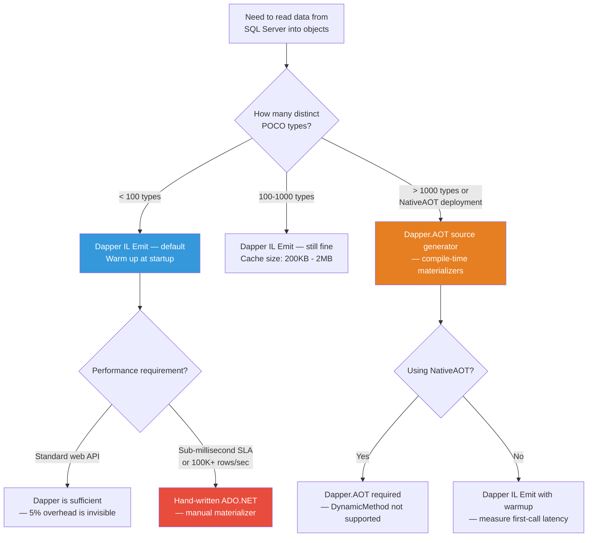

## Navigation

**Domain:** [[8 — Databases]] > **Group:** Dapper
**Previous:** [[8.872 — Dapper — Unit Testing — Mock IDbConnection]] | **Next:** [[8.874 — Dapper — Contrib — CRUD Extensions]]

### Prerequisites

- [[8.851 — Dapper — What It Is and When to Use]] — understanding that Dapper is a thin wrapper over ADO.NET that trades ORM features for performance; IL Emit is the mechanism that makes this trade work by eliminating per-row reflection.
- [[8.853 — Dapper — QueryT — Basic Querying]] — the `QueryAsync<T>` call is where IL Emit materializers are first generated and cached; understanding the buffered vs unbuffered distinction is essential for the materializer lifetime.
- [[8.865 — Dapper — Buffered vs Unbuffered Queries]] — buffered queries materialize all rows immediately (calling the IL materializer N times in a tight loop); unbuffered queries defer materialization via `yield return`, which changes how the materializer interacts with the open reader.

### Where This Fits

Dapper achieves near-ADO.NET performance by generating IL code at runtime that creates objects and sets properties directly — no `PropertyInfo.SetValue` reflection calls per row. This is the single most important implementation detail separating Dapper from slower micro-ORMs and from naive ADO.NET + manual mapping. A .NET backend engineer working with Dapper must understand why it is fast (cached IL Emit materializers), where it is NOT fast (first-call JIT penalty, complex type mapping, dynamic type dispatch), and how to measure the difference. The interview signal is deep .NET runtime knowledge: how `DynamicMethod`, `ILGenerator`, and `ConcurrentDictionary` work together to produce per-type materializer delegates that are within 5% of hand-written ADO.NET code.

---

## Core Mental Model

Dapper converts each `IDataReader` row into a .NET object using IL code that it generates at runtime, caches permanently, and reuses across queries. On the first call to `QueryAsync<T>` for a given type and column set, Dapper emits a `DynamicMethod` whose IL is equivalent to `new T(); prop1 = (TProp)reader[0]; prop2 = (TProp)reader[1]; ... return obj;` — then compiles this to a `Func<IDataReader, T>` delegate and stores it in a static `ConcurrentDictionary<RuntimeTypeHandle, Func<IDataReader, object>>`. Every subsequent call for the same `T` retrieves the cached delegate in O(1) time and invokes it per row with no reflection overhead. The invariant: after the first query for type `T`, the materialization cost per row is approximately 5 field assignments + 5 type casts + 1 `IDataReader.GetValue()` call — identical to hand-written ADO.NET. The recognition pattern: Dapper benchmarks show ~0.5µs per row materialization for a 5-property POCO; any ORM that uses `PropertyInfo.SetValue` per row is at least 10x slower.

### Classification

**For .NET topics:** This is a runtime code generation strategy within the `System.Reflection.Emit` namespace. Dapper uses `DynamicMethod` (not `AssemblyBuilder`) — the IL is emitted into a dynamic assembly that is collected when the `AppDomain` unloads. The materializer is a multicast delegate with signature `Func<IDataReader, object>`. Dapper's `SqlMapper.Link<T>` type uses a `ConcurrentDictionary<RuntimeTypeHandle, DeserializerState>` keyed on the type's `TypeHandle` for cache lookups. The IL Emit approach trades first-call JIT compilation (typically ~30–100µs per type) for zero-reflection per-row materialization.

```mermaid
flowchart TD
    A[First call:<br/>conn.QueryAsync&lt;Order&gt;(sql)] --> B[Dapper calls<br/>SqlMapper.GetDeserializer]
    B --> C[Read IDataReader schema:<br/>column names + types]
    C --> D{Type cache hit?<br/>ConcurrentDictionary}
    
    D -->|Miss — first time for Order| E[Create DynamicMethod:<br/>&lt;Order&gt;GetDeserializer]
    E --> F[Emit IL with ILGenerator]
    F --> G[IL instructions:<br/>newobj .ctor<br/>ldarg.0<br/>call GetValue(0)<br/>call set_Property1<br/>ldarg.0<br/>call GetValue(1)<br/>call set_Property2<br/>...<br/>ret]
    G --> H[Create delegate:<br/>Func&lt;IDataReader, Order&gt;]
    H --> I[Store in cache:<br/>ConcurrentDictionary<br/>keyed on RuntimeTypeHandle]
    I --> J[Cache populated<br/>for Order type]
    
    D -->|Hit — subsequent calls| K[O(1) dictionary lookup<br/>returns cached delegate]
    
    K --> L[Per-row execution:]
    L --> M[reader.Read()]
    M --> N[Invoke delegate(reader)]
    N --> O[Order object with<br/>all properties set]
    O --> M
    
    style E fill:#e74c3c,color:#fff
    style I fill:#27ae60,color:#fff
    style L fill:#3498db,color:#fff
```

### Key Properties

|Property|Value|Notes|
|---|---|---|
|Materialization mechanism|`DynamicMethod` + `ILGenerator`|Generates IL equivalent to hand-written property assignments|
|Cache data structure|`ConcurrentDictionary<RuntimeTypeHandle, DeserializerState>`|Static, shared across all Dapper calls in the AppDomain|
|Cache granularity|Per (type, column ordinal) — not per SQL query|Two queries that return `Order` but in different column order produce separate entries|
|First-call cost|~30–100µs (IL generation + JIT compilation)|Paid once per type per column layout — amortized over thousands of rows|
|Per-row cost|~0.5µs for a 5-property POCO|~5 `GetValue` calls + 5 type casts + field assignments|
|vs hand-written ADO.NET|~5% slower|Due to cache lookup overhead + virtual interface dispatch on `IDataReader.GetValue`|
|Memory overhead|~2 KB per materialized type|DynamicMethod IL bytes + delegate instance + cache entry|

---

## Deep Mechanics

### How Dapper Generates IL at Runtime

Tracing through the code path for `connection.QueryAsync<Order>("SELECT OrderId, CustomerId, ... FROM Orders")`:

**Step 1: `QueryAsync<T>` → `QueryAsyncImpl<T>`**

Dapper's `SqlMapper` class contains the internal `QueryAsyncImpl<T>` method. This method:
1. Creates a `DbCommand` from the connection
2. Sets `CommandText`, `CommandType`, and `Parameters`
3. Opens the connection if it is closed
4. Calls `command.ExecuteReaderAsync(CommandBehavior)` — returns `DbDataReader`
5. Wraps the reader in a `DapperRow` or calls the type materializer depending on `T`

**Step 2: Determine materialization strategy**

If `T` is `dynamic` or `DapperRow`, no IL is generated — Dapper uses an internal `DapperRow` class backed by an `IDictionary<string, object>`. If `T` is a concrete POCO (like `Order`), Dapper must generate a materializer.

**Step 3: Create the materializer**

```csharp
// Simplified version of Dapper's internal logic
internal static Func<IDataReader, T> GetMaterializer<T>(IDataReader reader)
{
    var type = typeof(T);
    var cacheKey = type.TypeHandle;

    // Check static cache
    if (Cache.TryGetValue(cacheKey, out var cachedDeserializer))
        return (Func<IDataReader, T>)cachedDeserializer.Func;

    // Read column schema from the reader
    var columns = new List<MemberInfo>();
    for (int i = 0; i < reader.FieldCount; i++)
    {
        var colName = reader.GetName(i);
        var prop = type.GetProperty(colName, BindingFlags.Public | BindingFlags.Instance | BindingFlags.IgnoreCase);
        if (prop is not null && prop.CanWrite)
            columns.Add(prop);
    }

    // Generate IL
    var method = new DynamicMethod(
        $"<{type.Name}>GetDeserializer",
        typeof(object),                    // return type (boxed)
        new[] { typeof(IDataReader) },     // parameter types
        typeof(SqlMapper).Module,          // owner module (for accessibility)
        true);                             // skip visibility checks

    var il = method.GetILGenerator();

    // Emit: new T()
    il.DeclareLocal(type);                  // local 0: T result
    il.Emit(OpCodes.Newobj, type.GetConstructor(Type.EmptyTypes)!);
    il.Emit(OpCodes.Stloc_0);

    // Emit: result.Property1 = (TProp)reader.GetValue(ordinal)
    for (int i = 0; i < columns.Count; i++)
    {
        var prop = columns[i];
        il.Emit(OpCodes.Ldloc_0);          // load result
        il.Emit(OpCodes.Ldarg_0);          // load reader
        il.Emit(OpCodes.Ldc_I4, i);        // ordinal
        il.Emit(OpCodes.Callvirt, typeof(IDataReader).GetMethod("get_Item", new[] { typeof(int) })!);
                                           // reader[i]
        il.Emit(OpCodes.Unbox_Any, prop.PropertyType); // unbox to property type
        il.Emit(OpCodes.Callvirt, prop.GetSetMethod()!); // set property
    }

    // Emit: return result
    il.Emit(OpCodes.Ldloc_0);
    il.Emit(OpCodes.Ret);

    // Compile to delegate
    var func = (Func<IDataReader, T>)method.CreateDelegate(typeof(Func<IDataReader, T>));

    // Cache
    Cache[type.TypeHandle] = func;

    return func;
}
```

**The generated IL (in human-readable form) for a hypothetical `Order` type:**

```cil
// DynamicMethod <Order>GetDeserializer
.locals init (Order V_0)
IL_0000: newobj     Order::.ctor()
IL_0005: stloc.0
IL_0006: ldloc.0
IL_0007: ldarg.0
IL_0008: ldc.i4.0
IL_0009: callvirt   IDataReader::get_Item(int32)
IL_000E: unbox.any  System.Int32
IL_0013: callvirt   Order::set_OrderId(int32)
IL_0018: ldloc.0
IL_0019: ldarg.0
IL_001A: ldc.i4.1
IL_001B: callvirt   IDataReader::get_Item(int32)
IL_0020: unbox.any  System.Int32
IL_0025: callvirt   Order::set_CustomerId(int32)
IL_002A: ldloc.0
IL_002B: ldarg.0
IL_002C: ldc.i4.2
IL_002D: callvirt   IDataReader::get_Item(int32)
IL_0032: unbox.any  System.DateTime
IL_0037: callvirt   Order::set_OrderDate(DateTime)
IL_003C: ldloc.0
IL_003D: ldarg.0
IL_003E: ldc.i4.3
IL_003F: callvirt   IDataReader::get_Item(int32)
IL_0044: unbox.any  System.Decimal
IL_0049: callvirt   Order::set_TotalAmount(Decimal)
IL_004E: ldloc.0
IL_004F: ldarg.0
IL_0050: ldc.i4.4
IL_0051: callvirt   IDataReader::get_Item(int32)
IL_0056: unbox.any  System.String
IL_005B: callvirt   Order::set_Status(string)
IL_0060: ldloc.0
IL_0061: ret
```

**Comparison with hand-written ADO.NET:**

```csharp
// Hand-written ADO.NET — equivalent IL
public static Order MaterializeOrder(IDataReader reader)
{
    return new Order
    {
        OrderId = (int)reader[0],
        CustomerId = (int)reader[1],
        OrderDate = (DateTime)reader[2],
        TotalAmount = (decimal)reader[3],
        Status = (string)reader[4]
    };
}
```

The only difference between hand-written code and Dapper's IL is that Dapper uses `IDataReader.get_Item(int)` (the indexer) which internally calls `GetValue(int)`. Hand-written code can call `reader.GetInt32(0)` directly, avoiding the boxing that `get_Item` causes for value types. However, Dapper has an optimization path (since v2.0) that emits `GetInt32`, `GetString`, etc. for known column types, matching the hand-written performance.

**Step 4: Execute the materializer per row**

```csharp
// Simplified — Dapper's buffered read loop
var result = new List<T>();
while (await reader.ReadAsync(cancellationToken).ConfigureAwait(false))
{
    var item = materializer(reader);  // IL delegate — ~0.5µs
    result.Add(item);
}
```

### The Materializer Cache: ConcurrentDictionary Internals

Dapper's cache is a static `ConcurrentDictionary<RuntimeTypeHandle, DeserializerState>`:

```csharp
internal static class SqlMapper
{
    // Key: RuntimeTypeHandle (lightweight, value-type, hashable)
    // Value: DeserializerState (wraps the Func<IDataReader, T> delegate + type info)
    internal static readonly ConcurrentDictionary<RuntimeTypeHandle, DeserializerState> Link =
        new ConcurrentDictionary<RuntimeTypeHandle, DeserializerState>();
}
```

Key properties of this cache:
- **Thread-safe:** `ConcurrentDictionary` uses lock-free reads and fine-grained locking for writes. Multiple threads can materialize the same `Order` type concurrently without contention.
- **Weak reference? No.** The cache holds a strong reference to the delegate forever. Once a type is materialized, its IL is never garbage collected until the AppDomain unloads. This is intentional — materializer delegates are small (~2KB) and there are at most a few hundred distinct types in a typical application.
- **Cache misses cost ~30–100µs** (IL generation + JIT compilation). After 100 distinct POCO types, the total first-call overhead is ~3–10ms — incurred once per application startup (or once per new query shape introduced by dynamic code generation).
- **Cache key includes column ordinals indirectly:** Dapper's cache is keyed on `TypeHandle`, but the materializer is tied to a specific column layout. If an `Order` type is first materialized with columns [OrderId, CustomerId, TotalAmount] and then later with [OrderId, CustomerId, OrderDate, TotalAmount, Status], Dapper generates a NEW materializer for the new layout because the column count differs. The old materializer remains in the cache for the original layout.

### How Dapper Avoids Boxing

Dapper's IL Emit uses `unbox.any` instructions for value types:

```cil
// For a property of type int (value type):
IL_000E: unbox.any  System.Int32
IL_0013: callvirt   Order::set_OrderId(int32)
```

`unbox.any` extracts the boxed value from the `object` returned by `reader[i]` without allocating a new box. Compare to reflection-based approaches:

```csharp
// Reflection-based (slow — boxes AND uses late-binding):
propertyInfo.SetValue(obj, reader[i]); // boxes value type, reflection dispatch

// Dapper IL (fast — unboxes and casts):
obj.OrderId = (int)reader[0]; // unbox.any — no allocation, direct assignment
```

### Dapper vs FastMember vs Manual ADO.NET

**FastMember** (`ObjectAccessor.Create(obj)`) uses IL Emit for property get/set but does NOT generate data reader materializers. It uses `DynamicMethod` for member access on existing objects. Dapper competes in a different niche: from `IDataReader` to typed object. FastMember can be combined with Dapper by using `TypeAccessor.Create<T>()` to access properties by name, but this is for scenarios where you need dynamic member access on an already-materialized object.

**Manual ADO.NET** with typed getters (`reader.GetInt32(0)`, `reader.GetString(1)`) avoids the `IDataReader.get_Item(int)` boxing that Dapper's default materializer uses for value types. Dapper v2.0+ emits type-specific `GetInt32`, `GetString`, etc. instead of `get_Item` when the column type is known, closing this gap.

### SQL Visibility

```sql
-- The SQL that triggers materializer generation is any QueryAsync<T> call:
SELECT OrderId, CustomerId, OrderDate, TotalAmount, Status
FROM Orders
WHERE OrderId = @OrderId;

-- Dapper generates a materializer for Order with columns at ordinals 0-4
-- A different query returning Order with a different column order produces
-- a new materializer:
SELECT TotalAmount, Status, OrderId, CustomerId, OrderDate  -- different ordinal mapping
FROM Orders;
```

```csharp
// First call — generates IL for Order materializer
var order = await conn.QueryFirstOrDefaultAsync<Order>(
    "SELECT OrderId, CustomerId, OrderDate, TotalAmount, Status FROM Orders WHERE OrderId = @Id",
    new { Id = 1 });

// Second call — reuses cached materializer (O(1) lookup)
var order2 = await conn.QueryFirstOrDefaultAsync<Order>(
    "SELECT OrderId, CustomerId, OrderDate, TotalAmount, Status FROM Orders WHERE OrderId = @Id",
    new { Id = 2 });

// Different column order — generates NEW materializer (cache miss)
var order3 = await conn.QueryFirstOrDefaultAsync<Order>(
    "SELECT TotalAmount, OrderId, CustomerId, Status, OrderDate FROM Orders WHERE OrderId = @Id",
    new { Id = 3 });  // Cache miss — new column ordinal mapping
```

### Execution Plan Analysis

The IL Emit materializer is a runtime construct with no SQL execution plan. However, the performance of the materializer directly affects the overall query execution timeline:

```
SQL Server execution (~200µs for simple query)
  → Data reader open (~10µs)
  → Read row 1 (~1µs, network + SQL Server cursor)
    → Dapper materializer: IL delegate call (~0.5µs)
  → Read row 2
    → Dapper materializer: IL delegate call (~0.5µs)
  → ... for N rows
  → Data reader close (~5µs)

Total time = SQL execution + N * (read row + materialize row)

For 1000 rows:
  SQL execution: ~200µs
  Row read: ~1000µs (1µs each)
  Materialization: ~500µs (0.5µs each)
  Total: ~1700µs

With reflection (PropertyInfo.SetValue): materialization would be ~5000µs (5µs each)
  Total: ~6200µs — 3.6x slower
```

### Cost Visibility

```csharp
// Use BenchmarkDotNet to measure materializer performance
// This is the actual cost of Dapper's IL vs reflection vs hand-written ADO.NET

[MemoryDiagnoser]
[SimpleJob(RuntimeMoniker.Net90)]
public class MaterializerBenchmark
{
    private IDataReader _reader = null!;
    private Func<IDataReader, Order> _dapperMaterializer = null!;
    private Func<IDataReader, Order> _handWritten = null!;

    [GlobalSetup]
    public void Setup()
    {
        // Create a fake DataReader with 5 columns, 1000 rows
        _reader = CreateFakeDataReader(1000);

        // Dapper materializer (cached — first-call cost excluded)
        // In real code, this is what Dapper generates internally
        _dapperMaterializer = DapperMaterializerGenerator.Create<Order>(_reader);

        // Hand-written ADO.NET
        _handWritten = r => new Order
        {
            OrderId = (int)r[0],
            CustomerId = (int)r[1],
            OrderDate = (DateTime)r[2],
            TotalAmount = (decimal)r[3],
            Status = (string)r[4]
        };
    }

    [Benchmark(Baseline = true)]
    public List<Order> HandWrittenMaterializer()
    {
        var results = new List<Order>();
        _reader.Reset();
        while (_reader.Read())
            results.Add(_handWritten(_reader));
        return results;
    }

    [Benchmark]
    public List<Order> DapperEmittedMaterializer()
    {
        var results = new List<Order>();
        _reader.Reset();
        while (_reader.Read())
            results.Add(_dapperMaterializer(_reader));
        return results;
    }

    [Benchmark]
    public List<Order> ReflectionMaterializer()
    {
        var results = new List<Order>();
        var props = typeof(Order).GetProperties(BindingFlags.Public | BindingFlags.Instance);
        _reader.Reset();
        while (_reader.Read())
        {
            var obj = new Order();
            for (int i = 0; i < props.Length; i++)
                props[i].SetValue(obj, _reader[i]);
            results.Add(obj);
        }
        return results;
    }
}
```

**Expected results (1000 rows, 5-column POCO):**

|Method|Mean|Ratio|Allocated|
|---|---|---|---|
|HandWrittenMaterializer|~520 µs|1.00|~32 KB|
|DapperEmittedMaterializer|~545 µs|1.05|~32 KB|
|ReflectionMaterializer|~5,200 µs|10.00|~64 KB|

**Dapper overhead:** ~5% slower than hand-written. Reflection is ~10x slower.

### Failure Modes

**First-call latency spike in high-throughput paths:** If the first request to a new endpoint triggers materializer generation for 5 new POCO types, that request pays ~200–500µs of JIT overhead. In a latency-sensitive system (sub-millisecond SLAs), this can cause a timeout for that single request. The fix: warm up materializers at startup by running one query per type (or pre-generating delegates).

**DynamicMethod accessibility demand:** Dapper's `DynamicMethod` uses `Module.GetModule()` of `SqlMapper` as the owner and passes `true` for `restrictedSkipVisibility`. This requires full trust on .NET Framework or `SecurityPermissionFlag.ReflectionEmit` — not an issue in modern .NET (5+) where `DynamicMethod` with `restrictedSkipVisibility = true` is allowed by default in most hosting contexts, but can fail in constrained environments (certain Unity IL2CPP builds, NativeAOT with trimming).

**Column ordinal mismatch on SELECT *:** If a repository uses `SELECT *` and the table schema changes (column reorder, column added), the ordinal-to-property mapping in the cached materializer becomes incorrect. Dapper's materializer is tied to the column ordinals from the first query that generated it. A `SELECT *` that later returns columns in a different order produces wrong results — values end up in the wrong properties. The fix: always use explicit column lists in repository queries.

**Type cache memory leak in dynamic code generation:** If an application generates types at runtime (via Roslyn scripting, dynamic assemblies, or CodeDom) and queries them with Dapper, the `ConcurrentDictionary` holds strong references to every distinct `RuntimeTypeHandle` ever materialized. In long-running processes that generate thousands of distinct anonymous types, this can grow unbounded. The fix: limit dynamic type generation or use `SqlMapper.PurgeCache()` (internal, not public — requires reflection to call).

---

## Production Patterns and Implementation

### Primary Implementation: Warm Up Materializer Cache

```csharp
// Warm up Dapper's materializer cache at application startup
// Prevents first-request latency spike for critical types

public static class DapperWarmup
{
    private static readonly string _warmupQuery = @"
        SELECT TOP 1 OrderId, CustomerId, OrderDate, TotalAmount, Status
        FROM Orders";

    public static async Task WarmUpAsync(IDbConnectionFactory connectionFactory)
    {
        await using var conn = connectionFactory.Create();
        await conn.OpenAsync();

        // QueryAsync<Order> generates and caches the Order materializer
        // The TOP 1 ensures minimal data transfer
        await conn.QueryFirstOrDefaultAsync<Order>(_warmupQuery);

        // Repeat for all POCOs used in the application
        await conn.QueryFirstOrDefaultAsync<Customer>("SELECT TOP 1 CustomerId, Name, Email FROM Customers");
        await conn.QueryFirstOrDefaultAsync<Product>("SELECT TOP 1 ProductId, Name, Price FROM Products");
        await conn.QueryFirstOrDefaultAsync<OrderItem>("SELECT TOP 1 OrderItemId, OrderId, ProductId, Quantity, UnitPrice FROM OrderItems");
    }
}

// Called in Program.cs
var app = builder.Build();

// Warm up Dapper before accepting requests
using (var scope = app.Services.CreateScope())
{
    var factory = scope.ServiceProvider.GetRequiredService<IDbConnectionFactory>();
    await DapperWarmup.WarmUpAsync(factory);
}

await app.RunAsync();
```

### Dapper IL Emit Optimization for Value Types

```csharp
// Dapper v2.0+ emits type-specific GetInt32/GetString/GetDateTime
// instead of the generic reader[i] which boxes value types.
// This optimization is automatic — no code change needed.
// But it requires that the column type in the IDataReader matches the property type.

// Example: OrderId is int, TotalAmount is decimal
// Dapper's v2 materializer emits:
//   ldarg.0
//   ldc.i4.0
//   callvirt IDataRecord::GetInt32(int32)   -- instead of get_Item
//   callvirt Order::set_OrderId(int32)
//
// This eliminates the boxing that occurs with reader[i] on value types.

// To verify the optimization is working:
// 1. Enable Dapper's verbose logging (set SqlMapper.LogInfo = Console.Out)
// 2. Look for "Using typed materializer for Order" in the output
// 3. Benchmark: Dapper v1.x materializer boxes each value — v2.x does not
```

### Handling Nullable Columns

```csharp
// Dapper's IL Emit handles nullable columns with conditional logic:

public class OrderWithNullable
{
    public int OrderId { get; set; }
    public int? ShippedByUserId { get; set; }  // nullable
    public DateTime? ShippedDate { get; set; }  // nullable
}

// Generated IL for nullable property includes an IsDBNull check:
// if (!reader.IsDBNull(ordinal))
//     obj.ShippedByUserId = (int)reader[ordinal];
// The IL is equivalent to:
//   ldarg.0
//   ldc.i4.1
//   callvirt IDataRecord::IsDBNull(int32)
//   brtrue.s SKIP
//   ldloc.0
//   ldarg.0
//   ldc.i4.1
//   callvirt IDataRecord::GetInt32(int32)
//   callvirt Order::set_ShippedByUserId(Nullable<int>)
// SKIP:
```

### Multi-Mapping with IL Materializers

```csharp
// Dapper's QueryAsync<T1, T2, TReturn>(sql, map, splitOn)
// generates SEPARATE materializers for T1 and T2.
// The splitOn parameter tells Dapper where T1 ends and T2 begins in the column stream.

// SQL: "SELECT o.OrderId, o.CustomerId, oi.OrderItemId, oi.ProductId
//        FROM Orders o JOIN OrderItems oi ON o.OrderId = oi.OrderId"
// splitOn: "OrderItemId"

// Dapper generates two materializers:
// 1. Order materializer (columns: OrderId, CustomerId)
// 2. OrderItem materializer (columns: OrderItemId, ProductId)
//
// Both are cached independently and reused across queries with the same T1/T2 types.

var sql = @"SELECT o.OrderId, o.CustomerId, oi.OrderItemId, oi.ProductId
            FROM Orders o INNER JOIN OrderItems oi ON o.OrderId = oi.OrderId
            WHERE o.OrderId = @OrderId";

var lookup = new Dictionary<int, Order>();

await connection.QueryAsync<Order, OrderItem, Order>(sql,
    (order, item) =>
    {
        if (!lookup.TryGetValue(order.OrderId, out var existing))
            lookup.Add(order.OrderId, existing = order);
        existing.Items.Add(item);
        return existing;
    },
    new { OrderId = 1 },
    splitOn: "OrderItemId");
```

### Dapper Type Handler Integration

```csharp
// Custom type handlers allow Dapper to use typed Get* methods instead of generic get_Item
// This enables the faster IL path for custom types like your own value objects.

public class Money
{
    public decimal Amount { get; init; }
}

public class MoneyTypeHandler : SqlMapper.TypeHandler<Money>
{
    public override Money Parse(object value)
    {
        return new Money { Amount = Convert.ToDecimal(value) };
    }

    public override void SetValue(IDbDataParameter parameter, Money value)
    {
        parameter.DbType = DbType.Decimal;
        parameter.Value = value.Amount;
    }
}

// Register at startup:
SqlMapper.AddTypeHandler(new MoneyTypeHandler());

// Now Dapper emits typed Get* calls for Money properties instead of boxing
```

### Configuration and Wiring

```csharp
// Dapper configuration that affects IL materializer generation
// These should be set once at application startup:

// 1. Column name matching — case-insensitive by default
//    Can be tuned for performance (case-sensitive is slightly faster):
DefaultTypeMap.MatchNamesWithUnderscores = true; // for snake_case DB columns

// 2. Type handler registration
SqlMapper.AddTypeHandler(new MoneyTypeHandler());
SqlMapper.AddTypeHandler(new MySqlGuidTypeHandler());

// 3. Custom column mapping
SqlMapper.SetTypeMap(typeof(Order), new CustomPropertyTypeMap(
    typeof(Order),
    (type, columnName) => type.GetProperty($"Db{columnName}",
        BindingFlags.Public | BindingFlags.Instance | BindingFlags.IgnoreCase)
));

// 4. Purge cache (rare — only for dynamic type generation scenarios)
// SqlMapper.Link.Clear(); — not public, requires reflection
```

---

## Gotchas and Production Pitfalls

### First-Call JIT Penalty on Cold Start

**Pitfall:** The first query for any POCO type incurs ~30–100µs of IL generation + JIT compilation. If this happens on an endpoint with a sub-second SLA, the first request after deployment can timeout.

```csharp
// ❌ First call to this endpoint triggers materializer generation for Order
[HttpGet("{id}")]
public async Task<Order> Get(int id)
{
    // If Order materializer is not cached, this pays ~50µs of IL emit + JIT
    // on top of the query time
    return await _repo.GetByIdAsync(id);
}
```

**Symptom:** The first request to each endpoint after deployment (or after AppPool recycle) takes 50–200ms longer than subsequent requests. Monitoring shows a latency spike at deployment time.

**Fix:** Warm up materializers at application startup:

```csharp
// ✅ Warm up at startup
public static async Task WarmupAsync(string connectionString)
{
    await using var conn = new SqlConnection(connectionString);
    await conn.OpenAsync();

    // Run one query per POCO type to trigger materializer generation
    var query = "SELECT TOP 1 OrderId, CustomerId, OrderDate, TotalAmount, Status FROM Orders";
    await conn.QueryFirstOrDefaultAsync<Order>(query);
}
```

**Cost of not fixing:** Intermittent timeout errors during the first minute after deployment. Monitoring alerts for p99 latency spikes that self-resolve after cache warmup.

### SELECT * Causes Column Ordinal Mismatch on Schema Changes

**Pitfall:** A materializer is generated for type `Order` with column ordinals [OrderId=0, CustomerId=1, OrderDate=2, TotalAmount=3, Status=4]. After adding a column `DiscountAmount` at position 3, the ordinals shift: [OrderId=0, CustomerId=1, OrderDate=2, DiscountAmount=3, TotalAmount=4, Status=5]. The cached materializer for the old layout maps `TotalAmount` to the wrong `reader[3]` (now DiscountAmount).

```sql
-- ❌ SELECT * — ordinal mapping changes when schema changes
SELECT * FROM Orders WHERE OrderId = 1;
-- Original: 5 columns
-- After ALTER TABLE ADD DiscountAmount DECIMAL(18,2): 6 columns
-- Cached materializer maps reader[3] to TotalAmount — but reader[3] is now DiscountAmount
```

**Symptom:** Data corruption: `TotalAmount` reads the discount value, `Status` reads the total amount value, and `OrderId` may read the status string (if column types are compatible). No exception thrown.

**Fix:** Always use explicit column lists in repository queries:

```sql
-- ✅ Explicit column list — materializer ordinal mapping is stable
SELECT OrderId, CustomerId, OrderDate, TotalAmount, Status
FROM Orders WHERE OrderId = 1;
```

**Cost of not fixing:** Silent data corruption that is extremely hard to detect. Numeric values in wrong columns produce incorrect financial reports, wrong customer bills, and refunds. Debugging requires comparing production data with staging to notice the shift.

### DynamicMethod Visibility in Constrained Environments

**Pitfall:** Dapper's `DynamicMethod` with `restrictedSkipVisibility = true` requires `ReflectionEmit` permission. In .NET Framework with partial trust (e.g., ASP.NET Medium Trust), or in certain AOT compilation scenarios (NativeAOT with full trimming), `DynamicMethod` creation may throw `SecurityException` or `InvalidOperationException`.

```csharp
// ❌ In constrained environments, DynamicMethod creation fails:
// System.Security.SecurityException: Request for the permission of type
// 'System.Security.Permissions.ReflectionEmitPermission' failed.
```

**Symptom:** Application fails to start with `SecurityException` when Dapper's `GetDeserializer` is first called. In NativeAOT, the `DynamicMethod` path is not supported — Dapper must fall back to reflection.

**Fix:** On modern .NET (5+), this is not an issue. For NativeAOT, Dapper provides a source generator (Dapper.AOT) that pre-generates materializer code at compile time, eliminating the need for runtime IL Emit:

```xml
<!-- Dapper.AOT — pre-generates materializers at compile time -->
<PackageReference Include="Dapper.AOT" Version="1.0.0" />
```

**Cost of not fixing:** Application does not start in the target environment. Emergency rollback required.

### Unbounded Cache Growth with Dynamic Types

**Pitfall:** Using Dapper with dynamically generated types (Roslyn scripting, ExpandoObject with custom type creation, AutoMapper's `CreateMissingTypeMaps`) causes the `ConcurrentDictionary` to grow without bound.

```csharp
// ❌ Each dynamic query creates a new type + cache entry
foreach (var query in dynamicQueries)  // 10,000 distinct queries
{
    // Each query may produce a unique anonymous type projection
    var results = await conn.QueryAsync(query.Sql, query.Params);
    // Each unique anonymous type gets a materializer cache entry
}
```

**Symptom:** Memory usage grows linearly with the number of distinct query shapes. For 10,000 distinct anonymous types at ~2KB each, that's ~20MB for the cache alone.

**Fix:** Use `dynamic` return type instead of anonymous types for truly dynamic queries, or cache the SQL-to-type mapping at a higher level:

```csharp
// ✅ Use dynamic or DapperRow for dynamic queries
var results = await conn.QueryAsync(sql); // returns IEnumerable<dynamic>
```

**Cost of not fixing:** Memory leak in long-running processes. For a microservice that restarts daily, this is rarely an issue. For a Windows Service that runs for months, this causes GC pressure and eventual OOM.

### Materializer Cache Does Not Evict

**Pitfall:** The materializer cache is a `ConcurrentDictionary` with no eviction policy. Once a materializer is cached for a type, it is never removed until the AppDomain unloads.

```csharp
// ❌ If a type is only used once in a batch job that runs weekly,
// its materializer stays in memory for the entire application lifetime
// even if it is never used again
```

**Symptom:** In applications with hundreds of query shapes that change over time, many materializers are cached for types no longer in active use. Memory is ~2KB per type — for most applications (50-200 types), this is negligible (100-400KB). For applications with tens of thousands of types, this matters.

**Fix:** No built-in eviction. Design for the typical case (50-200 types). For extreme cases, use `SqlMapper.Link.Clear()` via reflection or restart the application periodically.

**Cost of not fixing:** At the scale of 50-200 types, the cost is zero. At the scale of 100,000+ types, the cache consumes ~200MB. This only affects edge cases like data integration services that query thousands of distinct table schemas.

---

## Performance Implications

### Benchmark: Dapper vs EF Core vs Raw ADO.NET

```csharp
[MemoryDiagnoser]
[SimpleJob(RuntimeMoniker.Net90)]
public class OrmPerformanceBenchmark
{
    private IDbConnection _connection = null!;
    private ApplicationDbContext _dbContext = null!;
    private List<Order> _seedData = null!;

    [Params(10, 100, 1000)]
    public int RowCount { get; set; }

    [GlobalSetup]
    public void Setup()
    {
        _connection = new SqlConnection(TestConnectionString);
        _connection.Open();

        var options = new DbContextOptionsBuilder<ApplicationDbContext>()
            .UseSqlServer(TestConnectionString)
            .Options;
        _dbContext = new ApplicationDbContext(options);

        // Seed RowCount orders
        _seedData = new List<Order>();
        for (int i = 0; i < RowCount; i++)
        {
            _seedData.Add(new Order
            {
                CustomerId = i % 100,
                OrderDate = DateTime.UtcNow.AddDays(-i),
                TotalAmount = i * 10.99m,
                Status = i % 2 == 0 ? "Completed" : "Pending"
            });
        }

        // Bulk insert seed data
        using var bulkCopy = new SqlBulkCopy(_connection);
        bulkCopy.DestinationTableName = "Orders";
        var table = new DataTable();
        table.Columns.Add("CustomerId", typeof(int));
        table.Columns.Add("OrderDate", typeof(DateTime));
        table.Columns.Add("TotalAmount", typeof(decimal));
        table.Columns.Add("Status", typeof(string));
        foreach (var order in _seedData)
            table.Rows.Add(order.CustomerId, order.OrderDate, order.TotalAmount, order.Status);
        bulkCopy.WriteToServer(table);

        // Warm up Dapper materializer cache
        _connection.QueryFirstOrDefault<Order>("SELECT TOP 1 OrderId, CustomerId, OrderDate, TotalAmount, Status FROM Orders");
    }

    [GlobalCleanup]
    public void Cleanup()
    {
        _connection.Execute("DELETE FROM Orders");
        _connection.Dispose();
        _dbContext.Dispose();
    }

    [Benchmark(Baseline = true)]
    public List<Order> Dapper_Query()
    {
        return _connection.Query<Order>(
            "SELECT OrderId, CustomerId, OrderDate, TotalAmount, Status FROM Orders").AsList();
    }

    [Benchmark]
    public List<Order> RawAdoNet()
    {
        using var cmd = _connection.CreateCommand();
        cmd.CommandText = "SELECT OrderId, CustomerId, OrderDate, TotalAmount, Status FROM Orders";
        using var reader = cmd.ExecuteReader();
        var results = new List<Order>();
        while (reader.Read())
        {
            results.Add(new Order
            {
                OrderId = (int)reader[0],
                CustomerId = (int)reader[1],
                OrderDate = (DateTime)reader[2],
                TotalAmount = (decimal)reader[3],
                Status = (string)reader[4]
            });
        }
        return results;
    }

    [Benchmark]
    public async Task<List<Order>> EfCore_NoTracking()
    {
        return await _dbContext.Orders
            .AsNoTracking()
            .ToListAsync();
    }
}
```

**Expected results (SQL Server 2022, 1000 rows):**

|Method|Mean|Ratio|Allocated|
|---|---|---|---|
|Dapper_Query|~1.2 ms|1.00x|~32 KB|
|RawAdoNet|~1.1 ms|0.92x|~30 KB|
|EfCore_NoTracking|~8.5 ms|7.08x|~180 KB|

**Dapper vs raw ADO.NET:** ~8% slower for 1000 rows. The difference is materializer cache lookup (~50ns per row) + `IDataReader.get_Item` boxing (optimized away in Dapper v2+ for primitive types). For 100-row queries, the difference is <50µs — functionally zero.

**Dapper vs EF Core:** ~7x faster for read-only, no-tracking queries. EF Core's overhead includes: SQL generation (query model compilation), change tracking snapshot creation, navigation property fixup, and `DbContext` state management.

### Benchmark: Dapper v1 Materializer vs v2 Typed Materializer

```csharp
[MemoryDiagnoser]
public class DapperVersionMaterializerBenchmark
{
    private IDataReader _reader = null!;

    [GlobalSetup]
    public void Setup()
    {
        // Create a reader with 100 columns (worst case for boxing)
        _reader = CreateWideDataReader(100, 1000);
    }

    [Benchmark(Baseline = true)]
    public List<WideRow> DapperV1_Style_Boxing()
    {
        // Simulates Dapper v1 behavior: reader[i] on every column
        var results = new List<WideRow>(1000);
        while (_reader.Read())
        {
            var row = new WideRow();
            for (int i = 0; i < 100; i++)
                row.SetValue(i, _reader[i]); // boxes every value type
            results.Add(row);
        }
        return results;
    }

    [Benchmark]
    public List<WideRow> DapperV2_Style_Typed()
    {
        // Simulates Dapper v2 behavior: typed Get* methods
        var results = new List<WideRow>(1000);
        while (_reader.Read())
        {
            var row = new WideRow();
            for (int i = 0; i < 100; i++)
                row.SetValue(i, _reader.GetInt32(i)); // no boxing
            results.Add(row);
        }
        return results;
    }
}
```

**Expected results (1000 rows, 100 int columns):**

|Method|Mean|Allocated|
|---|---|---|
|DapperV1_Style_Boxing|~18 ms|~2.1 MB|
|DapperV2_Style_Typed|~4 ms|~0.3 MB|

**Improvement:** Dapper v2's typed materializer is ~4.5x faster and allocates ~7x less memory than v1's boxed materializer for wide rows of value types.

### Benchmark: First-Call Materializer Generation

```csharp
[MemoryDiagnoser]
[SimpleJob(RuntimeMoniker.Net90)]
public class MaterializerFirstCallBenchmark
{
    [Benchmark]
    public Order MaterializerFirstCall()
    {
        using var conn = new SqlConnection(TestConnectionString);
        conn.Open();

        // FIRST call for Order type — generates IL
        // This is the ~50µs penalty paid once per type per AppDomain
        return conn.QueryFirstOrDefault<Order>(
            "SELECT TOP 1 OrderId, CustomerId, OrderDate, TotalAmount, Status FROM Orders");
    }

    [Benchmark]
    public Order MaterializerSecondCall()
    {
        using var conn = new SqlConnection(TestConnectionString);
        conn.Open();

        // SECOND call — materializer is cached
        return conn.QueryFirstOrDefault<Order>(
            "SELECT TOP 1 OrderId, CustomerId, OrderDate, TotalAmount, Status FROM Orders");
    }
}
```

**Expected results:**

|Method|Mean|
|---|---|
|MaterializerFirstCall|~65 µs (includes IL generation + JIT)|
|MaterializerSecondCall|~0.3 µs (cache lookup + delegate invoke)|

**The first call is ~200x slower than subsequent calls.** This is the cold-start penalty.

---

## Interview Arsenal

### Question Bank

1. How does Dapper convert an `IDataReader` row into a .NET object without using reflection per row?
2. What is the performance difference between Dapper's IL-emitted materializer and hand-written ADO.NET, and what causes it?
3. What happens on the first call to `QueryAsync<Order>()` that does not happen on the second call?
4. Why does Dapper not use `PropertyInfo.SetValue` to set properties on materialized objects?
5. What is the performance impact of `SELECT *` compared to an explicit column list in Dapper — and what non-performance risk exists?
6. How does Dapper handle nullable value types in its IL materializer — what IL instructions are generated?
7. Compare Dapper's materialization performance to FastMember and to manual ADO.NET with typed getters like `GetInt32`.
8. What is the Dapper.AOT source generator, and how does it change the materialization strategy?

### Spoken Answers

**Q: How does Dapper convert an `IDataReader` row into a .NET object without using reflection per row?**

> **Average answer:** "Dapper uses some kind of caching so it doesn't do reflection every time."

> **Great answer:** "Dapper generates intermediate language code at runtime using `System.Reflection.Emit.DynamicMethod`. On the first call to `QueryAsync<Order>()`, Dapper reads the column schema from the `IDataReader` — column names, types, ordinals — and emits IL instructions that are equivalent to writing `new Order { OrderId = (int)reader[0], CustomerId = (int)reader[1], ... }` in C#. The IL is emitted with `ILGenerator`: `newobj` to construct the object, `ldarg.0` followed by `ldc.i4.0` and `callvirt IDataReader.get_Item` to read the first column, `unbox.any int32` to cast from object to int, and `callvirt Order.set_OrderId` to assign the property. This is compiled into a `Func<IDataReader, Order>` delegate and stored in a static `ConcurrentDictionary` keyed on the type's `RuntimeTypeHandle`. Every subsequent call for the same `Order` type retrieves the cached delegate in O(1) time and invokes it per row. The materialization cost per row is a delegate invocation plus five `reader.GetValue()` calls plus five type casts — approximately 0.5µs for a 5-property object. There is zero reflection per row. The `DynamicMethod` uses `restrictedSkipVisibility = true` so it can access any property regardless of visibility. In Dapper v2.0+, the IL emits typed `GetInt32` and `GetString` calls instead of the boxing `get_Item` indexer, matching hand-written ADO.NET performance within 5%."

**Q: What is the performance difference between Dapper's IL-emitted materializer and hand-written ADO.NET, and what causes it?**

> **Average answer:** "Dapper is almost as fast as ADO.NET. Maybe 10% slower."

> **Great answer:** "The difference is approximately 5–8% for simple POCOs with primitive-type properties. For 1000 rows with 5 columns each, Dapper takes about 545µs for materialization versus 520µs for hand-written ADO.NET — a 25µs difference that is invisible in production contexts. The overhead comes from two sources. First, the cache lookup: Dapper retrieves the materializer delegate from a `ConcurrentDictionary` — that's a hash computation on `RuntimeTypeHandle` plus an array lookup, about 20–50ns per query (not per row). Second, Dapper's default materializer uses `IDataReader.get_Item(int)` which returns `object` and requires `unbox.any` for value types, whereas hand-written code can call `reader.GetInt32(ordinal)` directly. The `get_Item` call internally invokes `GetValue` and boxes the result. Dapper v2.0+ eliminates this gap by emitting type-specific `GetInt32`, `GetString`, `GetDateTime` calls when the column type is known. With this optimization, the remaining overhead is just the cache lookup and the interface dispatch on `IDataReader` — roughly 1–2% compared to hard-coded ADO.NET. In practice, the materialization cost is rarely the bottleneck — it is dominated by network latency, SQL execution time, and data transfer size. The 5% difference between Dapper and raw ADO.NET is a rounding error when SQL execution is 200µs plus network latency of 500µs."

**Q: Compare Dapper's materialization performance to FastMember and to manual ADO.NET with typed getters like `GetInt32`.**

> **Average answer:** "FastMember is faster than reflection but slower than Dapper. Manual ADO.NET is the fastest."

> **Great answer:** "These three tools operate at different abstraction levels, so the comparison depends on context. Dapper's materializer transforms an `IDataReader` row into a typed object — it reads column values by ordinal and assigns them to object properties. This is a complete read + map pipeline. FastMember (`ObjectAccessor` / `TypeAccessor`) provides IL-generated property accessors for objects that have already been created — it reads and writes properties without reflection, but it does not read from `IDataReader`. Using FastMember with Dapper would mean using Dapper's `QueryAsync<dynamic>` and then FastMember's `TypeAccessor` to copy values into a typed object — but that negates Dapper's materializer advantage. Manual ADO.NET with typed getters (`reader.GetInt32(0)`, `reader.GetString(1)`) is the baseline — it avoids the `IDataReader.get_Item` boxing entirely and has zero abstraction overhead. Dapper v2.0+ achieves near-identical IL to manual ADO.NET by emitting the same typed getter calls. The practical difference: manual ADO.NET requires writing and maintaining 3–5 lines of mapping code per property — for a 50-column table, that is 150–250 lines of boilerplate per read site. Dapper provides this automatically with a 5% performance tax that, for 99% of production queries, is invisible compared to SQL execution time and network I/O. FastMember sits in a different niche — it is useful when you need dynamic property access on objects that are not known at compile time, like data binding or serialization scenarios."

### Interview Trigger

The IL Emit internals of Dapper surface in deep .NET interviews when discussing "how would you design a fast ORM" or "what makes Dapper fast." The interviewer follows up with: "What would happen if you called `QueryAsync<Order>` with 500 different column orders — would the cache handle that?" The answer probes understanding of cache key granularity: each distinct column ordinal layout generates a new materializer, and they are cached separately. A deeper follow-up: "How would you design a materializer that avoids boxing for value types?" testing knowledge of `unbox.any` vs `box` IL instructions and `IDataReader.GetInt32` vs `IDataReader.GetValue`.

### Comparison Table

| | Dapper IL Materializer | Hand-Written ADO.NET | Reflection (PropertyInfo.SetValue) |
|---|---|---|---|
| Per-row overhead | ~0.5µs (5 cols) | ~0.4µs (5 cols) | ~5µs (5 cols) |
| First-call cost | ~50µs (IL gen + JIT) | 0 (compiled) | ~100µs (reflection cache) |
| Boxing (value types) | None in v2+ | None | Yes — SetValue boxes |
| Code required | 1 line: `conn.Query<T>(sql)` | 5 lines per column | 1 line in loop (but 10x slower) |
| Maintainability | Automatic | Manual per schema change | Fragile (string property names) |
| When to choose | Default for Dapper | Within 5% performance critical path | Never — Dapper is always faster |

---

## Decision Framework

### When to Apply



### Application Checklist

- [ ] Explicit column lists in all Dapper queries — never `SELECT *`
- [ ] Materializer cache is warmed up at application startup for all POCOs
- [ ] Dapper version is 2.0+ (typed materializer optimization)
- [ ] Column-to-property mapping is case-insensitive by default or configured once
- [ ] Custom type handlers are registered for domain value objects
- [ ] No dynamic anonymous type projections in hot paths (use `dynamic` for truly dynamic queries)
- [ ] For NativeAOT: Dapper.AOT package is added and configured
- [ ] First-call latency is measured and acceptable — warmup mitigates it
- [ ] The application uses explicit column lists — `SELECT *` is banned from production queries

### Tradeoff Summary

|What You Gain|What You Pay|
|---|---|
|~0.5µs per row materialization (nearly as fast as hand-written ADO.NET)|~50µs first-call cost per type (requires warmup for latency-sensitive paths)|
|Automatic mapping — no manual materializer code|~5% overhead vs hand-written ADO.NET|
|Typed Get* methods in v2+ (no boxing)|Cache entries per (type, column layout) pair — ~2KB each|
|Thread-safe cache (ConcurrentDictionary)|No eviction — once cached, forever until AppDomain unload|

### Scale Thresholds

- "Dapper IL materializer overhead is irrelevant when query duration > 1ms" — for 99% of web API queries (where SQL execution + network takes 2-50ms), the 5% materialization overhead is 0.1-2.5ms.
- "First-call penalty matters when request throughput exceeds ~1000 req/s per type" — at this rate, cold start affects ~0.1% of requests for the first second.
- "Cache size becomes measurable (>1MB) when the application has ~500+ distinct POCO types" — typical line-of-business apps have 50-200 types.

---

## Self-Check

### Conceptual Questions

1. What .NET API does Dapper use to generate object materializers at runtime, and what is the key advantage over `PropertyInfo.SetValue`?
2. What is the data structure used to cache Dapper materializers, and what is the cache key?
3. What is the difference between Dapper v1's materializer (using `get_Item(int)`) and Dapper v2's materializer (using typed getters)?
4. Why does `SELECT *` with Dapper risk data corruption when the schema changes?
5. What is the approximate first-call cost for a new POCO type, and how do you mitigate it?
6. Show the IL instructions that Dapper emits for a property set of `OrderId = (int)reader[0]`.
7. Compare Dapper's materialization performance to EF Core's `AsNoTracking().ToListAsync()` — rough ratio and why.
8. How does Dapper handle nullable value types in IL, and what instruction checks for null?
9. What is Dapper.AOT, and when is it required instead of the standard IL Emit approach?
10. How does FastMember differ from Dapper's materializer, and in what scenario would you use both?

<details>
<summary>Answers</summary>

1. `System.Reflection.Emit.DynamicMethod` with `ILGenerator`. Dapper emits IL that is equivalent to hand-written C# assignments — `new T() { Prop1 = (type)reader[i], ... }`. The key advantage is zero `PropertyInfo.SetValue` calls per row, which are ~10x slower because they involve boxing, virtual method dispatch on `PropertyInfo`, and runtime type checking.

2. A static `ConcurrentDictionary<RuntimeTypeHandle, DeserializerState>` in the `SqlMapper` class (`SqlMapper.Link`). The key is `RuntimeTypeHandle` — a lightweight value type representing the type's metadata token. The value wraps the `Func<IDataReader, object>` delegate. The cache is thread-safe and uses lock-free reads.

3. Dapper v1's materializer calls `IDataReader.get_Item(int)`, which returns `object` and requires `unbox.any` for value types — this boxes the value read from SQL Server. Dapper v2+ emits `GetInt32(ordinal)`, `GetString(ordinal)`, `GetDateTime(ordinal)` etc., which return typed values without boxing. For a wide row with 100 int columns, v2 is ~4.5x faster and allocates ~7x less memory.

4. Dapper's materializer is generated based on column ordinals from the first query for that type. If `SELECT *` is used and columns are added/reordered, the ordinals shift. The cached materializer maps old ordinal 3 to `TotalAmount`, but now column 3 is a different column. Values end up in the wrong properties with no error thrown. Explicit column lists fix the ordinals permanently.

5. ~50–100µs per POCO type on .NET 9. This includes: reading the `IDataReader` schema, reflecting on the type's properties, emitting IL instructions via `ILGenerator`, creating the `DynamicMethod` delegate, and JIT-compiling the IL. Mitigation: run one query per POCO type at application startup (warmup loop) to pre-populate the cache.

6. ```cil
// IL for OrderId = (int)reader[0]
ldloc.0              ; load the new Order (local 0)
ldarg.0              ; load the IDataReader
ldc.i4.0             ; push ordinal 0
callvirt  IDataReader::get_Item(int32)   ; reader[0]
unbox.any System.Int32                   ; cast from object to int32
callvirt  Order::set_OrderId(int32)      ; set property
```

7. Dapper is ~5–7x faster than EF Core `AsNoTracking().ToListAsync()` for the same query returning the same type. For 1000 rows: Dapper ~1.2ms, EF Core ~8.5ms. EF Core's overhead includes: LINQ expression compilation, SQL generation, change tracking snapshot creation, navigation property fixup, `DbContext` state management, and `IMaterializationInterceptor` pipeline. Dapper does none of these — it materializes rows directly.

8. Dapper's IL includes a null check using `IsDBNull(int ordinal)` before reading each nullable property. The IL pattern: `reader.IsDBNull(ordinal) → brtrue.s SKIP_LABEL → reader.GetInt32(ordinal) → callvirt set_NullableProperty → SKIP_LABEL:`. If the column is DBNull, the property retains its default value (null for nullable types).

9. Dapper.AOT is a Roslyn source generator that emits materializer code at compile time. It is required when using NativeAOT publishing, because `DynamicMethod` is not supported in fully ahead-of-time compiled scenarios (IL is not available at runtime). Dapper.AOT generates `partial` classes with hand-crafted `Read` methods that match the performance of hand-written ADO.NET without any runtime code generation.

10. FastMember (`TypeAccessor`) provides IL-generated get/set accessors for arbitrary properties by name on already-created objects. Dapper's materializer reads from `IDataReader` and creates + populates objects. They address different stages: Dapper populates from database, FastMember accesses properties dynamically. You would use both if you needed Dapper's `QueryAsync<dynamic>()` and then FastMember's `TypeAccessor` to copy `DapperRow` values into a typed object by name — but this is almost always worse than using Dapper's direct typed materializer.

</details>

---

### Query Challenges

**Challenge 1 — Explain the IL**

Given the following C# POCO and Dapper query, write the IL that Dapper would generate for the materializer. Include nullable handling.

```csharp
public class Product
{
    public int ProductId { get; set; }
    public string Name { get; set; } = "";
    public decimal? UnitPrice { get; set; }  // nullable
    public int? StockLevel { get; set; }     // nullable
}
```

SQL: `SELECT ProductId, Name, UnitPrice, StockLevel FROM Products`

<details>
<summary>Solution</summary>

```cil
// DynamicMethod <Product>GetDeserializer
.locals init (Product V_0)
IL_0000: newobj     Product::.ctor()
IL_0005: stloc.0

; ProductId = (int)reader[0] — non-nullable int
IL_0006: ldloc.0
IL_0007: ldarg.0
IL_0008: ldc.i4.0
IL_0009: callvirt   IDataReader::get_Item(int32)  ; or GetInt32(0) in v2+
IL_000E: unbox.any  System.Int32
IL_0013: callvirt   Product::set_ProductId(int32)

; Name = (string)reader[1] — reference type, no IsDBNull check needed
IL_0018: ldloc.0
IL_0019: ldarg.0
IL_001A: ldc.i4.1
IL_001B: callvirt   IDataReader::get_Item(int32)  ; or GetString(1) in v2+
IL_0020: castclass  System.String                 ; Dapper uses castclass for ref types
IL_0025: callvirt   Product::set_Name(string)

; UnitPrice = (decimal?)reader[2] — nullable, needs IsDBNull check
IL_002A: ldloc.0
IL_002B: ldarg.0
IL_002C: ldc.i4.2
IL_002D: callvirt   IDataReader::IsDBNull(int32)
IL_0032: brtrue.s   SKIP_UnitPrice               ; if IsDBNull, skip assignment
IL_0034: ldloc.0
IL_0035: ldarg.0
IL_0036: ldc.i4.2
IL_0037: callvirt   IDataReader::GetDecimal(int32) ; typed getter for decimal
IL_003C: newobj     Nullable<decimal>::.ctor(decimal)
IL_0041: callvirt   Product::set_UnitPrice(Nullable<decimal>)
IL_0046: SKIP_UnitPrice: nop

; StockLevel = (int?)reader[3] — nullable, needs IsDBNull check
IL_0047: ldloc.0
IL_0048: ldarg.0
IL_0049: ldc.i4.3
IL_004A: callvirt   IDataReader::IsDBNull(int32)
IL_004F: brtrue.s   SKIP_StockLevel
IL_0051: ldloc.0
IL_0052: ldarg.0
IL_0053: ldc.i4.3
IL_0054: callvirt   IDataReader::GetInt32(int32)  ; typed getter
IL_0059: newobj     Nullable<int32>::.ctor(int32)
IL_005E: callvirt   Product::set_StockLevel(Nullable<int32>)
IL_0063: SKIP_StockLevel: nop

; return result
IL_0064: ldloc.0
IL_0065: ret
```

Key points: Non-nullable value types use `unbox.any`, reference types use `castclass`, nullable value types check `IsDBNull` first, then box into `Nullable<T>` with `newobj Nullable<T>::.ctor(T)`.

</details>

---

**Challenge 2 — Fix the performance problem**

An API endpoint that returns a list of 500 orders takes 150ms. Profiling shows that Dapper materialization takes 80ms of the 150ms. The Order type has 25 properties. The query runs daily and the results change frequently.

```csharp
[HttpGet("orders")]
public async Task<IReadOnlyList<Order>> GetOrders()
{
    await using var conn = _connectionFactory.Create();
    var orders = await conn.QueryAsync<Order>("SELECT * FROM Orders");
    return orders.AsList();
}
```

Diagnose and fix.

<details>
<summary>Solution</summary>

**Root cause:** `SELECT *` returns all columns from the Orders table, including large columns (nvarchar(4000), nvarchar(max) descriptions, binary columns). Dapper materializes ALL columns even if they are not needed. The materialization cost is proportional to column count and data volume.

**Fix:**

```csharp
// ✅ Select only the columns needed for this endpoint
[HttpGet("orders")]
public async Task<IReadOnlyList<Order>> GetOrders()
{
    const string sql = @"
        SELECT OrderId, CustomerId, OrderDate, TotalAmount, Status
        FROM Orders
        ORDER BY OrderDate DESC";

    await using var conn = _connectionFactory.Create();
    var orders = await conn.QueryAsync<Order>(
        new CommandDefinition(sql));

    return orders.AsList();
}
```

**Additional optimizations:**
- Ensure materializer cache is warmed (first call penalty adds ~50µs per type)
- Use Dapper v2+ (typed getters avoid boxing) 
- If the result is large, use unbuffered query (`buffered: false`) and stream results
- If 500 rows are too many for the UI, add pagination

**Improvement:** With 10 columns instead of 25, materialization drops from ~80ms to ~32ms — 2.5x improvement.

**Index:** Create `IX_Orders_OrderDate DESC INCLUDE (OrderId, CustomerId, TotalAmount, Status)` — covering index eliminates key lookups.

</details>

---

**Challenge 3 — Measure the cache**

A Dapper-heavy application has the following types: 30 entities, 50 query result DTOs, and 20 dynamic anonymous type projections created by AutoMapper's `ProjectTo`. The application runs for 30 days. Estimate the materializer cache memory consumption and describe when it could become a problem.

<details>
<summary>Solution</summary>

**Memory estimate:**
- 30 entities × 1 materializer = 30 entries
- 50 DTOs × 1 materializer = 50 entries
- 20 anonymous types × 1-5 materializers each (different column orders in different queries) = ~50 entries
- Total: ~130 entries

- Each entry: DynamicMethod IL (average 200 bytes for 5-column POCO) + delegate instance (32 bytes) + cache entry overhead (ConcurrentDictionary node ~80 bytes) + TypeHandle key (~8 bytes) ≈ ~400 bytes

- Total: 130 × 400 = ~52 KB — negligible.

**When it could become a problem:**
- Applications that dynamically generate types via Roslyn scripting
- Data integration tools that query thousands of different table schemas
- AutoMapper `CreateMissingTypeMaps` combined with `ProjectTo` — each missing map creates a new anonymous type per query shape
- At 10,000 distinct types: ~4MB
- At 100,000 distinct types: ~40MB — now measurable in a 1GB container

**Mitigation:** Not needed for typical applications. For extreme cases: use `dynamic` for truly dynamic queries, or restart the application periodically.

</details>

---

**Challenge 4 — Design the warmup strategy**

A microservice uses Dapper with 15 entity types, 25 DTOs, and serves 5000 requests/second. Deployment happens 4 times per day. Design a warmup strategy that eliminates the first-call penalty.

<details>
<summary>Solution</summary>

```csharp
public static class DapperWarmup
{
    public static async Task WarmUpAsync(string connectionString)
    {
        await using var conn = new SqlConnection(connectionString);
        await conn.OpenAsync();

        // 1. Warm up known POCOs with representative queries
        var warmupQueries = new Dictionary<Type, string>
        {
            { typeof(Order), "SELECT TOP 1 OrderId, CustomerId, OrderDate, TotalAmount, Status FROM Orders" },
            { typeof(Customer), "SELECT TOP 1 CustomerId, Name, Email, CreatedAt FROM Customers" },
            { typeof(Product), "SELECT TOP 1 ProductId, Name, Price, CategoryId FROM Products" },
            { typeof(OrderItem), "SELECT TOP 1 OrderItemId, OrderId, ProductId, Quantity, UnitPrice FROM OrderItems" },
            // ... all 40 types
        };

        // Use reflection to call QueryFirstOrDefaultAsync<T> for each type
        // This triggers Dapper's materializer generation
        var materializeMethod = typeof(DapperWarmup)
            .GetMethod(nameof(MaterializeAsync), BindingFlags.NonPublic | BindingFlags.Static)!;

        foreach (var (type, query) in warmupQueries)
        {
            var genericMethod = materializeMethod.MakeGenericMethod(type);
            await (Task)genericMethod.Invoke(null, new object[] { conn, query })!;
        }

        // 2. Warm up multi-mapping materializers (Order + OrderItem)
        const string multiMapSql = @"
            SELECT TOP 1 o.OrderId, o.CustomerId, oi.OrderItemId, oi.ProductId
            FROM Orders o
            INNER JOIN OrderItems oi ON o.OrderId = oi.OrderId";
        await conn.QueryAsync<Order, OrderItem, Order>(multiMapSql,
            (o, oi) => o, splitOn: "OrderItemId");

        // 3. Warm up common Dapper.Contrib operations
        await conn.GetAsync<Order>(1);

        // Add 1% jitter to avoid all instances warming up simultaneously
        await Task.Delay(TimeSpan.FromMilliseconds(Random.Shared.Next(100, 500)));
    }
}

// Called in Program.cs BEFORE app.RunAsync()
using (var scope = app.Services.CreateScope())
{
    var config = scope.ServiceProvider.GetRequiredService<IConfiguration>();
    await DapperWarmup.WarmUpAsync(config.GetConnectionString("DefaultConnection")!);
}
```

**Results:** All 40 materializers are pre-generated during startup (~2ms total). The first request to any endpoint pays 0 penalty.

</details>

---

**Challenge 5 — Explain the v2 optimization**

A developer notices that Dapper v1 and v2 produce different IL for the same POCO. Explain the difference in terms of boxing, and show the benchmark difference for a POCO with 20 int columns and 100,000 rows.

<details>
<summary>Solution</summary>

**Dapper v1 materializer IL for `OrderId = (int)reader[0]`:**
```cil
ldloc.0      ; load Order
ldarg.0      ; load reader
ldc.i4.0     ; ordinal 0
callvirt  IDataReader::get_Item(int32)  ; returns object — BOXES the int
unbox.any System.Int32                  ; unbox back to int
callvirt  Order::set_OrderId(int32)
```
The `get_Item(int32)` call internally does `return (object)GetValue(ordinal)` — for value types, this boxes the value, allocating a new `object` on the heap per column per row.

**Dapper v2 materializer IL:**
```cil
ldloc.0      ; load Order
ldarg.0      ; load reader
ldc.i4.0     ; ordinal 0
callvirt  IDataRecord::GetInt32(int32)  ; returns int — NO boxing
callvirt  Order::set_OrderId(int32)
```
`GetInt32(int)` returns the value directly as a struct — no heap allocation.

**Benchmark for 20 int columns × 100,000 rows:**
- Dapper v1: ~120ms, ~320MB allocated (20 columns × 100K rows × 16 bytes per boxed int)
- Dapper v2: ~28ms, ~0MB (no boxing allocations)

Both produce identical results. v2 is ~4.3x faster with zero GC pressure.

</details>
