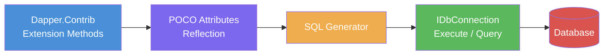

# Dapper.Contrib — CRUD Extensions

## Overview

Dapper.Contrib is an optional companion library that extends `IDbConnection` with a set of **generic CRUD helpers**: `Get<T>`, `Insert<T>`, `Update<T>`, `Delete<T>`. Instead of writing SQL strings by hand (as with `Query<T>` / `Execute`), Contrib reads **POCO attributes** to infer table names, key columns, and write permissions — then **auto-generates the SQL** for you.

```
┌─────────────────────────────────────────────────────────────┐
│                    Dapper.Contrib                           │
│                                                             │
│  IDbConnection.Get<T>(id)       → SELECT ... WHERE Id = @id│
│  IDbConnection.Insert<T>(obj)   → INSERT INTO ... VALUES   │
│  IDbConnection.Update<T>(obj)   → UPDATE ... SET ...       │
│  IDbConnection.Delete<T>(obj)   → DELETE FROM ... WHERE    │
│                                                             │
│  ↓ reads POCO attributes ↓                                  │
│  [Table], [Key], [ExplicitKey], [Write], [Computed]        │
│                                                             │
│  ↓ generates + executes SQL ↓                               │
│  ADO.NET IDbCommand                                            │
└─────────────────────────────────────────────────────────────┘
```



---

## Installation

```bash
dotnet add package Dapper.Contrib
```

Or via Package Manager Console:

```powershell
Install-Package Dapper.Contrib
```

---

## POCO Attributes Reference

| Attribute       | Target        | Purpose                                               |
| --------------- | ------------- | ----------------------------------------------------- |
| `[Table("..")]` | Class         | Explicit table name (optional; otherwise uses class name with pluralizer). |
| `[Key]`         | Property      | **Auto-increment** primary key. Excluded from INSERT, value read back after insert. |
| `[ExplicitKey]` | Property      | **Manually assigned** primary key. Included in INSERT. |
| `[Write(true)]`<br/>`[Write(false)]` | Property | Whether the property participates in INSERT/UPDATE. |
| `[Computed]`    | Property      | Computed column (e.g., `GETDATE()`, `NEWID()`). Excluded from INSERT/UPDATE. |
| `[NotMapped]`   | Property      | Excluded entirely (Contrib-specific alias for `[Write(false)]`). |

---

## CRUD Operations

All methods are extension methods on `IDbConnection`.

### Get\<T\> — Retrieve by Id

```csharp
using Dapper.Contrib.Extensions;

public class OrderRepository
{
    private readonly IDbConnection _db;

    public OrderRepository(IDbConnection db)
    {
        _db = db;
    }

    // Single entity by primary key
    public Order? GetById(int id)
    {
        return _db.Get<Order>(id);
    }

    // Get all rows
    public IEnumerable<Order> GetAll()
    {
        return _db.GetAll<Order>();
    }
}
```

**Generated SQL:**

```sql
-- Get<Order>(1)
SELECT * FROM Orders WHERE Id = @Id

-- GetAll<Order>()
SELECT * FROM Orders
```

### Insert\<T\> — Create

```csharp
public long Insert(Order order)
{
    // Returns the auto-generated identity value
    return _db.Insert(order);
}

public long InsertBatch(IEnumerable<Order> orders)
{
    // Also accepts a collection
    return _db.Insert(orders);
}
```

**Generated SQL:**

```sql
INSERT INTO Orders (CustomerName, TotalAmount, OrderDate)
VALUES (@CustomerName, @TotalAmount, @OrderDate);
-- SELECT CAST(SCOPE_IDENTITY() AS INT)  -- only if [Key] property exists
```

### Update\<T\> — Modify

```csharp
public bool Update(Order order)
{
    // Returns true if at least one row was affected
    return _db.Update(order);
}

public bool UpdateBatch(IEnumerable<Order> orders)
{
    return _db.Update(orders);
}
```

**Generated SQL:**

```sql
UPDATE Orders
SET CustomerName = @CustomerName,
    TotalAmount  = @TotalAmount,
    OrderDate    = @OrderDate
WHERE Id = @Id
```

### Delete\<T\> — Remove

```csharp
public bool Delete(Order order)
{
    return _db.Delete(order);
}

public bool DeleteById(int id)
{
    // Delete by passing the entity (Contrib requires entity, not raw id)
    var order = _db.Get<Order>(id);
    if (order != null)
        return _db.Delete(order);
    return false;
}

public bool DeleteAll()
{
    return _db.DeleteAll<Order>();
}
```

**Generated SQL:**

```sql
DELETE FROM Orders WHERE Id = @Id
```

---

## Full Entity Example

```csharp
using Dapper.Contrib.Extensions;

[Table("Orders")]
public class Order
{
    [Key]                              // Auto-increment identity
    public int Id { get; set; }

    [Required]
    public string CustomerName { get; set; } = string.Empty;

    [Write(true)]
    public decimal TotalAmount { get; set; }

    [Computed]                         // Database-computed column
    public DateTime CreatedAt { get; set; }

    [Computed]
    public string? OrderNumber { get; set; }

    [Write(false)]                     // Never written to DB
    public string? InternalNotes { get; set; }
}
```

### Entity with Explicit Key (GUID / manual key)

```csharp
[Table("Products")]
public class Product
{
    [ExplicitKey]                      // Manually assigned GUID
    public Guid ProductId { get; set; }

    public string Name { get; set; } = string.Empty;

    [Computed]
    public DateTime ModifiedAt { get; set; }
}
```

### Entity with Composite Key Workaround

Contrib does **not** natively support composite keys. A common workaround is to expose a surrogate `[Key]` property and add a unique constraint at the DB level:

```csharp
[Table("OrderItems")]
public class OrderItem
{
    [Key]                              // Surrogate auto-increment
    public int Id { get; set; }

    // Composite uniqueness enforced by DB unique constraint
    public int OrderId { get; set; }
    public int ProductId { get; set; }
    public int Quantity { get; set; }
}
```

---

## Production — OrderService with Full CRUD

```csharp
using System.Data;
using Dapper.Contrib.Extensions;

public interface IOrderService
{
    Task<Order?> GetOrderAsync(int id);
    Task<IEnumerable<Order>> GetAllOrdersAsync();
    Task<int> CreateOrderAsync(Order order);
    Task<bool> UpdateOrderAsync(Order order);
    Task<bool> DeleteOrderAsync(int id);
}

public class OrderService : IOrderService
{
    private readonly IDbConnection _db;
    private readonly ILogger<OrderService> _logger;

    public OrderService(IDbConnection db, ILogger<OrderService> logger)
    {
        _db = db ?? throw new ArgumentNullException(nameof(db));
        _logger = logger ?? throw new ArgumentNullException(nameof(logger));
    }

    public async Task<Order?> GetOrderAsync(int id)
    {
        _logger.LogDebug("Fetching order {OrderId}", id);
        return await _db.GetAsync<Order>(id);
    }

    public async Task<IEnumerable<Order>> GetAllOrdersAsync()
    {
        _logger.LogDebug("Fetching all orders");
        return await _db.GetAllAsync<Order>();
    }

    public async Task<int> CreateOrderAsync(Order order)
    {
        if (order == null)
            throw new ArgumentNullException(nameof(order));

        _logger.LogDebug("Creating order for {Customer}", order.CustomerName);

        // Returns the new identity value
        var id = await _db.InsertAsync(order);
        order.Id = (int)id;       // Refresh the entity

        _logger.LogInformation("Order {OrderId} created for {Customer}",
            order.Id, order.CustomerName);

        return order.Id;
    }

    public async Task<bool> UpdateOrderAsync(Order order)
    {
        if (order == null)
            throw new ArgumentNullException(nameof(order));

        _logger.LogDebug("Updating order {OrderId}", order.Id);

        var success = await _db.UpdateAsync(order);

        if (success)
            _logger.LogInformation("Order {OrderId} updated", order.Id);
        else
            _logger.LogWarning("Order {OrderId} not found for update", order.Id);

        return success;
    }

    public async Task<bool> DeleteOrderAsync(int id)
    {
        _logger.LogDebug("Deleting order {OrderId}", id);

        var order = await _db.GetAsync<Order>(id);
        if (order == null)
        {
            _logger.LogWarning("Order {OrderId} not found for deletion", id);
            return false;
        }

        var success = await _db.DeleteAsync(order);

        if (success)
            _logger.LogInformation("Order {OrderId} deleted", id);

        return success;
    }
}
```

### Integration with DI

```csharp
// Program.cs — .NET 6+ / 8+

using System.Data;
using System.Data.SqlClient;
using Dapper.Contrib.Extensions;

var builder = WebApplication.CreateBuilder(args);

builder.Services.AddScoped<IDbConnection>(sp =>
{
    var connStr = sp.GetRequiredService<IConfiguration>()
        .GetConnectionString("DefaultConnection");
    return new SqlConnection(connStr);
});

builder.Services.AddScoped<IOrderService, OrderService>();

var app = builder.Build();

// Minimal API endpoint example
app.MapGet("/orders/{id:int}", async (int id, IOrderService svc) =>
{
    var order = await svc.GetOrderAsync(id);
    return order is not null ? Results.Ok(order) : Results.NotFound();
});

app.MapPost("/orders", async (Order order, IOrderService svc) =>
{
    var id = await svc.CreateOrderAsync(order);
    return Results.Created($"/orders/{id}", order);
});

app.MapPut("/orders/{id:int}", async (int id, Order input, IOrderService svc) =>
{
    if (id != input.Id)
        return Results.BadRequest("Id mismatch");

    var success = await svc.UpdateOrderAsync(input);
    return success ? Results.NoContent() : Results.NotFound();
});

app.MapDelete("/orders/{id:int}", async (int id, IOrderService svc) =>
{
    var success = await svc.DeleteOrderAsync(id);
    return success ? Results.NoContent() : Results.NotFound();
});

app.Run();
```

---

## Comparison: Raw Dapper vs. Contrib

### Raw Dapper (hand-written SQL)

```csharp
public async Task<Order?> GetByIdRawAsync(int id)
{
    const string sql = "SELECT * FROM Orders WHERE Id = @Id";
    return await _db.QuerySingleOrDefaultAsync<Order>(sql, new { Id = id });
}

public async Task<int> InsertRawAsync(Order order)
{
    const string sql = @"
        INSERT INTO Orders (CustomerName, TotalAmount, OrderDate)
        VALUES (@CustomerName, @TotalAmount, @OrderDate);
        SELECT CAST(SCOPE_IDENTITY() AS INT);";

    return await _db.QuerySingleAsync<int>(sql, order);
}

public async Task<bool> UpdateRawAsync(Order order)
{
    const string sql = @"
        UPDATE Orders
        SET CustomerName = @CustomerName,
            TotalAmount  = @TotalAmount,
            OrderDate    = @OrderDate
        WHERE Id = @Id";

    var rows = await _db.ExecuteAsync(sql, order);
    return rows > 0;
}

public async Task<bool> DeleteRawAsync(int id)
{
    const string sql = "DELETE FROM Orders WHERE Id = @Id";
    var rows = await _db.ExecuteAsync(sql, new { Id = id });
    return rows > 0;
}
```

### Dapper.Contrib (attribute-driven)

```csharp
public async Task<Order?> GetByIdContribAsync(int id)
    => await _db.GetAsync<Order>(id);

public async Task<int> InsertContribAsync(Order order)
    => (int)await _db.InsertAsync(order);

public async Task<bool> UpdateContribAsync(Order order)
    => await _db.UpdateAsync(order);

public async Task<bool> DeleteContribAsync(int id)
    => await _db.DeleteAsync(await _db.GetAsync<Order>(id));
```

| Aspect                | Raw Dapper Query<T> / Execute     | Dapper.Contrib               |
| --------------------- | --------------------------------- | ---------------------------- |
| SQL control           | Full control                      | Auto-generated               |
| Lines of code per op  | 3–8                               | 1–2                          |
| Table name            | Hard-coded in SQL string          | `[Table]` attribute or inferred |
| Key handling          | Manual WHERE clause               | `[Key]` / `[ExplicitKey]`    |
| Identity retrieval    | Explicit `SCOPE_IDENTITY()`       | Automatic via `[Key]`        |
| Async                 | Manual                            | `Async` suffix methods       |
| Batch operations      | Custom loop / TVP                 | Built-in collection overloads |
| Composite keys        | Full support (write WHERE manually) | **Not supported**          |
| Computed columns      | Handled in SELECT list            | `[Computed]` attribute       |

---

## Gotchas & Caveats

### 1. [Key] vs. [ExplicitKey] Confusion

```csharp
// ❌ Wrong — will not insert the Id value; INSERT excludes it
public class Category
{
    [Key]
    public string CategoryCode { get; set; } = string.Empty;  // manually assigned string
}

// ✅ Correct — [ExplicitKey] tells Contrib to include it in INSERT
public class Category
{
    [ExplicitKey]
    public string CategoryCode { get; set; } = string.Empty;
}
```

| Scenario                          | Attribute       | Included in INSERT? | Value after Insert |
| --------------------------------- | --------------- | ------------------- | ------------------ |
| Auto-increment int/long           | `[Key]`         | No                  | DB-generated       |
| GUID / string / manual value      | `[ExplicitKey]` | Yes                 | Unchanged          |
| No attribute on single property   | *(none)*        | Yes                 | —                  |

### 2. Table Name Inference

If no `[Table]` attribute is present, Dapper.Contrib uses the class name **pluralized** via `PluralizedTableNameConvention`. The default pluralizer simply appends `s`:

```csharp
public class Order    → "Orders"
public class Category → "Categorys"     // ❌ not "Categories"
```

**Fix:** Always add `[Table]` for non-standard pluralizations:

```csharp
[Table("Categories")]
public class Category { ... }
```

You can also replace the pluralizer globally:

```csharp
Dapper.Contrib.Extensions.SqlMapperExtensions.TableNameMapper = (type) =>
{
    // Custom logic: e.g., use type.Name as-is, or a dictionary
    return type.Name;
};
```

### 3. No Native Composite Key Support

Contrib assumes a **single** primary key column. For tables with composite primary keys:

- **Workaround 1:** Add a surrogate `[Key] int Id` column.
- **Workaround 2:** Fall back to raw `Query<T>` / `Execute` for that entity.
- **Workaround 3:** Use the `[ExplicitKey]` on one part and manage the WHERE manually.

```csharp
// This will NOT work:
[Table("OrderDetails")]
public class OrderDetail
{
    [Key] public int OrderId { get; set; }   // ❌ Only one key allowed
    [Key] public int ProductId { get; set; } // ❌ Ignored or error
}
```

### 4. Async Support in Older Versions

`GetAsync<T>`, `InsertAsync<T>`, `UpdateAsync<T>`, `DeleteAsync<T>` were added in **Dapper.Contrib 2.x**. If targeting an older version, you must use the synchronous counterparts.

| Version | Sync           | Async          |
| ------- | -------------- | -------------- |
| 1.x     | `Get<T>`       | ❌ Not available |
| 2.x+    | `Get<T>`       | `GetAsync<T>`  |

### 5. [Computed] Columns Are Never Written

Properties marked `[Computed]` are excluded from INSERT and UPDATE, but **always included in SELECT**. This is correct for:

- `GETDATE()` / `SYSDATETIME()` defaults
- `NEWID()` / `NEWSEQUENTIALID()`
- Computed / generated columns
- Trigger-populated columns (e.g., `LastModified`)

```csharp
[Table("AuditLog")]
public class AuditLog
{
    [Key]
    public int Id { get; set; }

    public string Action { get; set; } = string.Empty;

    [Computed]
    public DateTime CreatedAt { get; set; }   // DB default GETDATE()

    [Computed]
    public string? EventId { get; set; }      // DB computed column
}
```

### 6. InsertAsync Return Value

`InsertAsync<T>` returns `object` (not `long` directly) in some versions. Cast carefully:

```csharp
var result = await _db.InsertAsync(order);

// Safe cast
long newId = Convert.ToInt64(result);
int newIdInt = Convert.ToInt32(result);
```

### 7. No Change Tracking

Contrib performs a **full UPDATE** of all `[Write(true)]` columns — there is no change tracking or dirty checking. Every call to `Update<T>` overwrites every mapped column, regardless of which properties actually changed.

---

## Advanced Usage

### Custom Table Name Mapper

```csharp
// Remove all pluralization, use class name as-is
SqlMapperExtensions.TableNameMapper = (type) =>
{
    return type.Name;
};

// Or use a consistent prefix
SqlMapperExtensions.TableNameMapper = (type) =>
{
    return $"tbl_{type.Name}";
};
```

### Tracking Inserted Identities

```csharp
public async Task<int> InsertAndTrackAsync(Order order)
{
    using var transaction = _db.BeginTransaction();

    try
    {
        var newId = await _db.InsertAsync(order, transaction);
        order.Id = Convert.ToInt32(newId);

        var audit = new AuditLog
        {
            Action  = $"Order {order.Id} created",
            Details = $"Customer: {order.CustomerName}, Amount: {order.TotalAmount}"
        };
        await _db.InsertAsync(audit, transaction);

        transaction.Commit();
        return order.Id;
    }
    catch
    {
        transaction.Rollback();
        throw;
    }
}
```

### Working with Multiple Databases

```csharp
// PostgreSQL — same Contrib API, different provider
public class User
{
    [Key]
    public int Id { get; set; }

    public string Email { get; set; } = string.Empty;

    [Computed]
    public DateTime CreatedAt { get; set; }
}

// Usage with Npgsql
await using var pg = new NpgsqlConnection(connectionString);
var user = await pg.GetAsync<User>(42);
```

### Bulk Insert with Async

```csharp
public async Task InsertManyAsync(IEnumerable<Order> orders)
{
    await _db.InsertAsync(orders);
    // SQL generated for each entity, sent individually
    // For true bulk, see [[8.869 — Dapper — Bulk Operations — BulkExtensions]]
}
```

---

## Complete Reference — Code-Only Dump

```csharp
// ============================================================
// Dapper.Contrib — Complete CRUD Reference
// All code below uses Dapper.Contrib.Extensions
// ============================================================

using System.Data;
using Dapper;
using Dapper.Contrib.Extensions;

#region Entity Definitions

[Table("Orders")]
public class Order
{
    [Key]
    public int Id { get; set; }

    public string CustomerName { get; set; } = string.Empty;

    public decimal TotalAmount { get; set; }

    [Computed]
    public DateTime CreatedAt { get; set; }

    [Write(false)]
    public string? InternalNotes { get; set; }
}

[Table("Products")]
public class Product
{
    [ExplicitKey]
    public Guid ProductId { get; set; }

    public string Name { get; set; } = string.Empty;

    public decimal Price { get; set; }

    [Computed]
    public DateTime ModifiedAt { get; set; }
}

[Table("Categories")]
public class Category
{
    [ExplicitKey]
    public string CategoryCode { get; set; } = string.Empty;

    public string DisplayName { get; set; } = string.Empty;
}

[Table("Inventory")]
public class InventoryItem
{
    [Key]
    public int Id { get; set; }

    public string Sku { get; set; } = string.Empty;

    public int QuantityOnHand { get; set; }

    [Computed]
    public DateTime LastRestocked { get; set; }
}

#endregion

#region Repository Pattern

public interface IRepository<T> where T : class
{
    Task<T?> GetByIdAsync(int id);
    Task<IEnumerable<T>> GetAllAsync();
    Task<int> InsertAsync(T entity);
    Task<bool> UpdateAsync(T entity);
    Task<bool> DeleteAsync(T entity);
}

public class Repository<T> : IRepository<T> where T : class
{
    private readonly IDbConnection _db;

    public Repository(IDbConnection db)
    {
        _db = db;
    }

    public async Task<T?> GetByIdAsync(int id)
        => await _db.GetAsync<T>(id);

    public async Task<IEnumerable<T>> GetAllAsync()
        => await _db.GetAllAsync<T>();

    public async Task<int> InsertAsync(T entity)
        => Convert.ToInt32(await _db.InsertAsync(entity));

    public async Task<bool> UpdateAsync(T entity)
        => await _db.UpdateAsync(entity);

    public async Task<bool> DeleteAsync(T entity)
        => await _db.DeleteAsync(entity);
}

#endregion

#region Unit of Work (Transaction Scope)

public class OrderUnitOfWork : IDisposable
{
    private readonly IDbConnection _db;
    private IDbTransaction? _txn;
    private bool _committed;

    public OrderUnitOfWork(IDbConnection db)
    {
        _db = db;
        _db.Open();
        _txn = _db.BeginTransaction();
    }

    public async Task<int> InsertOrderAsync(Order order)
    {
        var id = await _db.InsertAsync(order, _txn);
        return Convert.ToInt32(id);
    }

    public async Task<bool> UpdateOrderAsync(Order order)
        => await _db.UpdateAsync(order, _txn);

    public async Task<bool> DeleteOrderAsync(Order order)
        => await _db.DeleteAsync(order, _txn);

    public void Commit()
    {
        _txn?.Commit();
        _committed = true;
    }

    public void Dispose()
    {
        if (!_committed)
            _txn?.Rollback();
        _txn?.Dispose();
        _db.Close();
    }
}

#endregion

#region Sync CRUD — All Operations

public class SyncOrderRepository
{
    private readonly IDbConnection _db;

    public SyncOrderRepository(IDbConnection db) => _db = db;

    public Order? Get(int id)            => _db.Get<Order>(id);
    public IEnumerable<Order> GetAll()   => _db.GetAll<Order>();
    public long Insert(Order order)      => _db.Insert(order);
    public long InsertMany(IEnumerable<Order> orders) => _db.Insert(orders);
    public bool Update(Order order)      => _db.Update(order);
    public bool UpdateMany(IEnumerable<Order> orders) => _db.Update(orders);
    public bool Delete(Order order)      => _db.Delete(order);
    public bool DeleteAll()              => _db.DeleteAll<Order>();
}

#endregion

#region Async CRUD — All Operations

public class AsyncOrderRepository
{
    private readonly IDbConnection _db;

    public AsyncOrderRepository(IDbConnection db) => _db = db;

    public async Task<Order?> GetAsync(int id)
        => await _db.GetAsync<Order>(id);

    public async Task<IEnumerable<Order>> GetAllAsync()
        => await _db.GetAllAsync<Order>();

    public async Task<long> InsertAsync(Order order)
        => await _db.InsertAsync(order);

    public async Task<long> InsertManyAsync(IEnumerable<Order> orders)
        => await _db.InsertAsync(orders);

    public async Task<bool> UpdateAsync(Order order)
        => await _db.UpdateAsync(order);

    public async Task<bool> UpdateManyAsync(IEnumerable<Order> orders)
        => await _db.UpdateAsync(orders);

    public async Task<bool> DeleteAsync(Order order)
        => await _db.DeleteAsync(order);

    public async Task<bool> DeleteAllAsync()
        => await _db.DeleteAllAsync<Order>();
}

#endregion

#region Transactional Operations

public class TransactionalOrderService
{
    private readonly IDbConnection _db;

    public TransactionalOrderService(IDbConnection db) => _db = db;

    public async Task<bool> TransferOrderAsync(int fromId, int toId)
    {
        using var txn = _db.BeginTransaction();

        try
        {
            var from = await _db.GetAsync<Order>(fromId);
            var to   = await _db.GetAsync<Order>(toId);

            if (from is null || to is null)
                return false;

            from.CustomerName = "TRANSFERRED";
            to.CustomerName   = "TRANSFERRED";

            await _db.UpdateAsync(from, txn);
            await _db.UpdateAsync(to, txn);

            txn.Commit();
            return true;
        }
        catch
        {
            txn.Rollback();
            throw;
        }
    }
}

#endregion

#region Helper — Exists Check (via raw Dapper)

public static class ContribHelpers
{
    public static async Task<bool> ExistsAsync<T>(this IDbConnection db, int id)
        where T : class
    {
        var entity = await db.GetAsync<T>(id);
        return entity is not null;
    }

    public static async Task<int> InsertOrUpdateAsync<T>(this IDbConnection db, T entity, int id)
        where T : class
    {
        var existing = await db.GetAsync<T>(id);
        if (existing is null)
        {
            return Convert.ToInt32(await db.InsertAsync(entity));
        }
        else
        {
            await db.UpdateAsync(entity);
            return id;
        }
    }

    public static async Task<bool> TryDeleteAsync<T>(this IDbConnection db, int id)
        where T : class
    {
        var entity = await db.GetAsync<T>(id);
        if (entity is null)
            return false;
        return await db.DeleteAsync(entity);
    }
}

#endregion

#region DI Registration — .NET Host

/*
  // Program.cs

  using Dapper.Contrib.Extensions;
  using System.Data;
  using System.Data.SqlClient;

  var builder = WebApplication.CreateBuilder(args);

  builder.Services.AddScoped<IDbConnection>(sp =>
  {
      var config = sp.GetRequiredService<IConfiguration>();
      return new SqlConnection(
          config.GetConnectionString("DefaultConnection"));
  });

  builder.Services.AddScoped(typeof(IRepository<>), typeof(Repository<>));
  builder.Services.AddScoped<IOrderService, OrderService>();

  var app = builder.Build();
  app.Run();
*/

#endregion

#region Example — In-Memory Usage Pattern

public class ContribDemo
{
    public static async Task RunAsync(IDbConnection db)
    {
        // CREATE
        var order = new Order
        {
            CustomerName = "Acme Corp",
            TotalAmount  = 299.99m
        };
        var orderId = Convert.ToInt32(await db.InsertAsync(order));
        Console.WriteLine($"Inserted Order #{orderId}");

        // READ
        var fetched = await db.GetAsync<Order>(orderId);
        Console.WriteLine($"  Customer: {fetched?.CustomerName}");

        // READ ALL
        var all = await db.GetAllAsync<Order>();
        Console.WriteLine($"  Total orders: {all.Count()}");

        // UPDATE
        fetched!.TotalAmount = 349.99m;
        var updated = await db.UpdateAsync(fetched);
        Console.WriteLine($"  Updated: {updated}");

        // DELETE
        var deleted = await db.DeleteAsync(fetched);
        Console.WriteLine($"  Deleted: {deleted}");
    }
}

#endregion

#region Strongly-Typed Id Workaround

// When you need composite-key-like behavior, combine Contrib with raw SQL:

public class OrderItemRepository
{
    private readonly IDbConnection _db;

    public OrderItemRepository(IDbConnection db) => _db = db;

    public async Task<IEnumerable<OrderItem>> GetByOrderIdAsync(int orderId)
    {
        var sql = "SELECT * FROM OrderItems WHERE OrderId = @OrderId";
        return await _db.QueryAsync<OrderItem>(sql, new { OrderId = orderId });
    }

    public async Task<bool> DeleteByCompositeKeyAsync(int orderId, int productId)
    {
        var sql = "DELETE FROM OrderItems WHERE OrderId = @OrderId AND ProductId = @ProductId";
        var rows = await _db.ExecuteAsync(sql, new { OrderId = orderId, ProductId = productId });
        return rows > 0;
    }
}

#endregion
```

---

## Summary

| Operation | Sync Method            | Async Method               | Generated SQL                              |
| --------- | ---------------------- | -------------------------- | ------------------------------------------ |
| Get by PK | `Get<T>(id)`           | `GetAsync<T>(id)`          | `SELECT * FROM Table WHERE Id = @Id`       |
| Get all   | `GetAll<T>()`          | `GetAllAsync<T>()`         | `SELECT * FROM Table`                      |
| Insert    | `Insert<T>(entity)`    | `InsertAsync<T>(entity)`   | `INSERT INTO Table (...) VALUES (...)`     |
| Update    | `Update<T>(entity)`    | `UpdateAsync<T>(entity)`   | `UPDATE Table SET ... WHERE Id = @Id`      |
| Delete    | `Delete<T>(entity)`    | `DeleteAsync<T>(entity)`   | `DELETE FROM Table WHERE Id = @Id`         |
| Delete all| `DeleteAll<T>()`       | `DeleteAllAsync<T>()`      | `DELETE FROM Table`                        |

Dapper.Contrib is best suited for **simple entities with single-column keys** where you want to eliminate boilerplate SQL. For complex queries, composite keys, or fine-grained SQL control, fall back to raw Dapper `Query<T>` / `Execute`.

**See also:**
- [[8.853 — Dapper — QueryT — Basic Querying]]
- [[8.858 — Dapper — Execute — INSERT, UPDATE, DELETE]]
- [[8.879 — Dapper — Anti-Patterns and Gotchas]]
- [[8.869 — Dapper — Bulk Operations — BulkExtensions]]
- [Dapper.Contrib GitHub](https://github.com/DapperLib/Dapper.Contrib)
