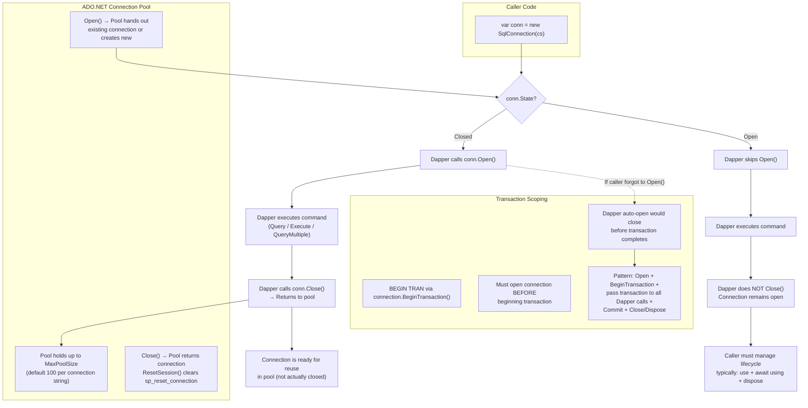
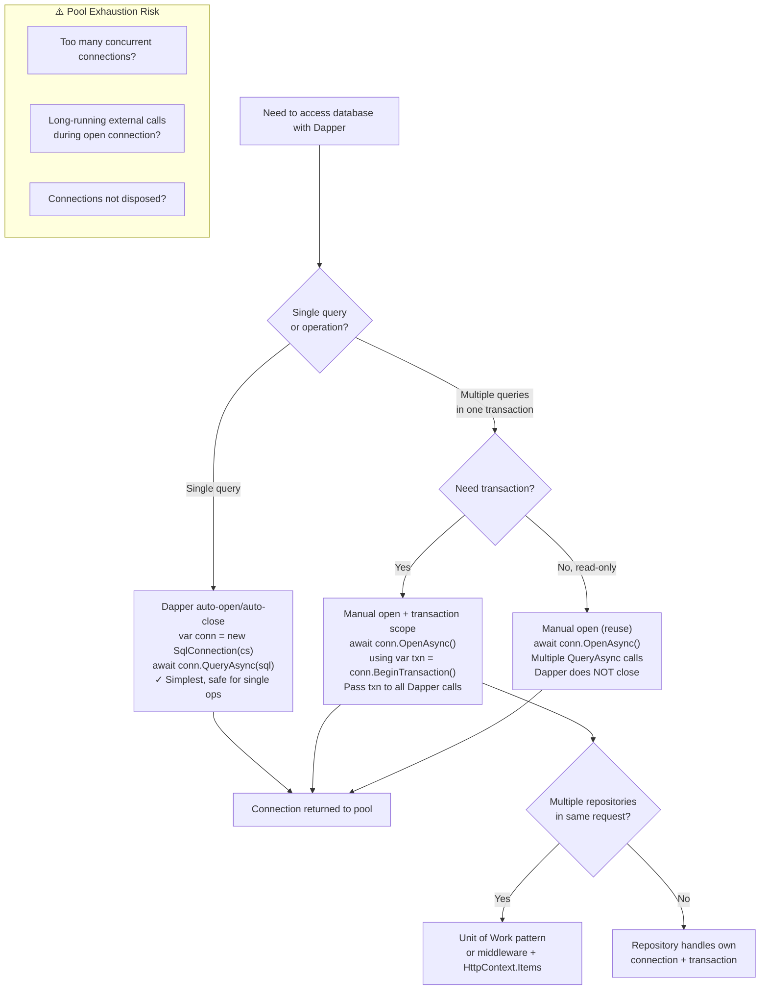

## Navigation

**Domain:** [[8 — Databases]] > **Group:** Dapper
**Previous:** [[8.875 — Dapper Fundamentals — Query, Execute, QueryFirst]] | **Next:** [[8.877 — Dapper — CommandDefinition — CancellationToken]]

### Prerequisites
- [[8.875 — Dapper Fundamentals — Query, Execute, QueryFirst]] — Dapper core methods and how they map results; connection management determines when the connection opens and closes during those operations.

### Where This Fits

Connection management in Dapper is the single most common source of production bugs and performance issues for teams adopting Dapper. The problem is that Dapper auto-opens a closed connection when you call Query/Execute and auto-closes it after — but it leaves the connection open if you opened it yourself. This asymmetry is invisible in local dev (where a single connection works fine) and explodes under production concurrency when connections leak, transactions span multiple queries incorrectly, or the connection pool is exhausted. For a .NET backend engineer, understanding this means knowing exactly when your connection opens and closes, how to scope transactions correctly, and how connection pooling (not actual TCP socket management) is the real mechanism behind "open" and "close." In interviews, this topic separates engineers who treat Dapper as magic from those who can explain its ADO.NET underpinnings and design a connection-management strategy for a high-throughput microservice.

---

## Core Mental Model

Dapper is an extension method library on top of ADO.NET `IDbConnection`. It does NOT manage connections — it only checks the `State` property. If `State` is `ConnectionState.Closed`, Dapper opens the connection before executing the command and closes it (or returns it to the pool) after the command completes. If `State` is already `Open`, Dapper executes the command and leaves the connection open, expecting the caller to manage the lifecycle. This means every Dapper call has an implicit "open if needed, close if I opened it" contract. The invariant: **Dapper never closes a connection it did not open.** Connection pooling means "close" in ADO.NET never drops the TCP socket — it resets the connection and returns it to the pool for reuse. The real cost is not the open/close handshake but the pool allocation and session reset.

### Classification

**For .NET topics:** Dapper's `IDbConnection` abstraction — each call checks `ConnectionState` via reflection-level `State` property access (not a field read). The connection lifecycle is entirely delegated to the caller, with Dapper providing a convenience auto-open/auto-close that covers 90% of simple query scenarios. The abstraction leaks when you need transactions (Dapper auto-close ends the transaction), when you need to stream rows (connection must stay open during `IEnumerable<T>` iteration for unbuffered queries), and when you reuse a connection across multiple operations in a request scope.



### Key Properties

|Property|Value|Notes|
|---|---|---|
|Auto-open trigger|Dapper opens if `State == ConnectionState.Closed`|Checked via `ConnectionState` property|
|Auto-close trigger|Dapper closes if *it* opened the connection|Tracked via internal `SqlMapper.PurgeBufferedReadCaches` and `SqlDataReader` disposal|
|Connection pool default size|100 per connection string (Max Pool Size)|Configurable in connection string: `Max Pool Size=200; Min Pool Size=10`|
|Pool reset on close|`sp_reset_connection` runs on return to pool|Resets session state (SET options, temp tables, transaction context)|
|Connection leak symptom|Timeout on `Open()` — pool exhausted|Error: "The connection pool has reached its maximum size of 100"|
|Transaction scope|Dapper auto-close kills transaction|Must open connection manually and pass `transaction` parameter to all Dapper calls|
|Thread safety|NOT thread-safe|Do not share `IDbConnection` across threads|
|MARS support|Multiple Active Result Sets per connection|Enabled via `MultipleActiveResultSets=True` in connection string|

---

## Deep Mechanics

### Dapper Source Code — The Exact Mechanism

The core connection management logic lives in Dapper's `SqlMapper.cs`. The critical method is `ExecuteImplAsync` (for ExecuteAsync) and `QueryImplAsync` (for QueryAsync). Here is the actual control flow:

```csharp
// From Dapper source (simplified, .NET 9 version)
internal static partial class SqlMapper
{
    private static async Task<int> ExecuteImplAsync(
        IDbConnection connection,
        CommandDefinition command,
        IDbTransaction? transaction)
    {
        // Step 1: Snapshot the connection state
        var wasClosed = connection.State == ConnectionState.Closed;

        // Step 2: Open if closed
        if (wasClosed)
            await connection.OpenAsync(command.CancellationToken);

        try
        {
            // Step 3: Create and configure DbCommand
            using var cmd = connection.CreateCommand();
            command.SetupCommand(cmd, connection);

            // Step 4: Execute
            return await cmd.ExecuteNonQueryAsync(command.CancellationToken);
        }
        finally
        {
            // Step 5: Close only if WE opened it
            if (wasClosed)
                connection.Close();  // Not CloseAsync — Dapper uses sync Close
        }
    }

    private static async Task<IEnumerable<T>> QueryImplAsync<T>(
        IDbConnection connection,
        CommandDefinition command)
    {
        var wasClosed = connection.State == ConnectionState.Closed;

        if (wasClosed)
            await connection.OpenAsync(command.CancellationToken);

        try
        {
            using var cmd = connection.CreateCommand();
            command.SetupCommand(cmd, connection);

            // For buffered queries: use CommandBehavior.SequentialAccess + CloseConnection
            using var reader = await cmd.ExecuteReaderAsync(
                command.CommandBehavior | CommandBehavior.SequentialAccess);

            var deserializer = GenerateDeserializer<T>(reader);
            var results = new List<T>();

            while (await reader.ReadAsync(command.CancellationToken))
            {
                results.Add(deserializer(reader));
            }

            return results;
        }
        finally
        {
            if (wasClosed)
                connection.Close();
        }
    }
}
```

Key observations:
- The `wasClosed` check uses `connection.State` — a property get that involves a thin lock on `SqlConnection`. This is not free: it acquires a `DbConnection` internal lock briefly.
- `connection.Close()` is called synchronously even in the async path. This is by design — Dapper does not call `CloseAsync()`. The ADO.NET team considers sync close acceptable from async context because the close operation is fast (pool enqueue + sp_reset_connection).
- The `finally` block ensures close runs even if the query throws. However, if `connection.OpenAsync()` throws, the `finally` block still runs with `wasClosed = true` — Dapper tries to close a connection that was never opened. The `Close()` call on a failed-open connection is a no-op (it checks state internally).
- There is a subtle race: if the connection state changes between the `wasClosed` check and the `OpenAsync()` call (another thread opens it), the `OpenAsync()` throws `InvalidOperationException`. The `wasClosed` flag is now stale — Dapper still thinks it opened the connection, so it will call `Close()` in the finally block, closing a connection another thread is using.

### The Async Local and SynchronizationContext

Dapper does not use `ConfigureAwait(false)` internally in many older versions. In Dapper 2.x, all async paths use `ConfigureAwait(false)` to avoid capturing the `SynchronizationContext`. This matters in ASP.NET Core (where `SynchronizationContext` is null anyway) but matters in legacy ASP.NET (Full Framework) where capturing can cause deadlocks when blocking on async calls.

```csharp
// Dapper 2.x async path (with ConfigureAwait(false)):
await connection.OpenAsync(command.CancellationToken).ConfigureAwait(false);
await cmd.ExecuteReaderAsync(...).ConfigureAwait(false);
connection.Close();  // no await needed — sync operation
```

### How the Engine Executes This

Dapper's connection management lives in `SqlMapper.ExecuteImplAsync` and `SqlMapper.QueryImplAsync`. The mechanism is straightforward but subtle:

1. Dapper captures the connection's `State` before execution via `connection.State` (a property get on `SqlConnection` that checks the internal `_state` field).
2. If `State == ConnectionState.Closed`, Dapper calls `connection.Open()` (synchronously or `OpenAsync()` for async methods).
3. Dapper creates a `DbCommand` from the connection, sets parameters, command text, etc.
4. Dapper executes the command (`ExecuteNonQueryAsync`, `ExecuteReaderAsync`, `ExecuteScalarAsync`).
5. After execution completes (or the `SqlDataReader` is consumed for buffered queries), Dapper checks an internal boolean `wasClosed` that it set in step 2.
6. If `wasClosed` is true, Dapper calls `connection.Close()`.

The critical detail: Dapper tracks `wasClosed` via a `bool` field on an internal `CommandDefinition`-related state object, NOT on the connection itself. This means the tracking is per-call, not per-connection — each Dapper extension method independently decides whether to close.

For **buffered queries** (default, `buffered: true`), Dapper consumes the entire `SqlDataReader` into a `List<T>` in memory, then closes the connection (if it opened it). The reader is fully drained before the connection close.

For **unbuffered queries** (`buffered: false`), Dapper does NOT close the connection until the `IEnumerable<T>` (or `IAsyncEnumerable<T>`) is fully enumerated. The connection remains open during iteration. If the caller disposes the connection before enumeration completes, the reader is aborted.

```csharp
// Simplified internal logic (Dapper source, SqlMapper.cs)
private static async Task<IEnumerable<T>> QueryAsyncImpl<T>(
    IDbConnection connection,
    CommandDefinition command,
    CommandBehavior commandBehavior = CommandBehavior.Default)
{
    // Step 1: Check state
    var wasClosed = connection.State == ConnectionState.Closed;

    // Step 2: Open if needed
    if (wasClosed) await connection.OpenAsync(command.CancellationToken);

    // Step 3: Create command
    using var cmd = connection.CreateCommand();
    command.SetupCommand(cmd, connection);

    // Step 4: Execute
    using var reader = await cmd.ExecuteReaderAsync(commandBehavior);

    // Step 5: Deserialize
    var result = Deserialize<T>(reader);

    // Step 6: Close if we opened
    if (wasClosed) connection.Close();

    return result;
}
```

This is **not thread-safe**. If two threads call Dapper methods on the same connection simultaneously, both may see `State == Closed`, both may call `Open()`, and the second `Open()` will throw `InvalidOperationException` ("The connection is already open" — actually a race condition where both see Closed but one opens first). Even if the race doesn't throw, the `wasClosed` flags become inconsistent.

### SQL Visibility

Connection management is purely client-side — there is no SQL involved. However, the SQL Server side sees the connection open event (`sp_reset_connection` execution, login audit), the batch execution, and the connection close event (logout audit).

```sql
-- What SQL Server sees when Dapper auto-opens and auto-closes:
--
-- 1. sp_reset_connection (if connection from pool)
--    (Resets session-level SET options, temp tables, etc.)
--
-- 2. The actual query:
SELECT OrderId, CustomerId, TotalAmount
FROM Orders
WHERE OrderDate >= '2026-01-01';

-- 3. Connection close (returns to pool)
--    SQL Server sees this as a sp_reset_connection + logout
```

```sql
-- Monitor connection opens/closes via audit events
SELECT event_time, action_id, session_id, database_name
FROM sys.fn_get_audit_file('D:\Audit\*.sqlaudit', DEFAULT, DEFAULT)
WHERE action_id IN ('LGIN', 'LGOG')  -- Login / Logout
ORDER BY event_time DESC;
```

### Execution Plan Analysis

Connection management does not affect execution plans. The plan for a given SQL batch is identical regardless of whether Dapper auto-opened or the caller manually opened the connection. However, **connection pool exhaustion** causes query failures (timeouts on `Open()`) that are often misdiagnosed as query performance problems.

### Cost Visibility

```sql
-- Measure connection open/close overhead via extended events
CREATE EVENT SESSION [ConnectionTiming] ON SERVER
ADD EVENT sqlserver.login(
    ACTION (sqlserver.session_id, sqlserver.sql_text)),
ADD EVENT sqlserver.logout(
    ACTION (sqlserver.session_id, sqlserver.sql_text))
ADD TARGET package0.event_file(SET filename = N'D:\XEvents\ConnectionTiming.xel');
```

The cost of a pooled open is typically ~1ms (sp_reset_connection round trip). For a non-pooled open, it's ~10-50ms (SSL handshake, login auth, database context setup). In high-throughput scenarios (1000+ queries/sec), minimizing round trips to the pool matters — which is why per-request connection reuse is critical.

### Failure Modes

**Connection pool exhaustion:**
```sql
-- Detect pool exhaustion (SQL Server side)
SELECT
    login_name,
    COUNT(*) AS session_count,
    host_name,
    program_name
FROM sys.dm_exec_sessions
WHERE is_user_process = 1
GROUP BY login_name, host_name, program_name
ORDER BY session_count DESC;

-- Expected symptom: .NET application throwing
-- System.InvalidOperationException: Timeout expired.
-- The timeout period elapsed prior to obtaining a connection from the pool.
-- This may have occurred because all pooled connections were in use
-- and max pool size was reached.
```

**Leaked connections due to unbuffered query disposal:**
```csharp
// ❌ Wrong: connection closes before enumerator is consumed
var connection = new SqlConnection(_connectionString);
var orders = connection.Query<Order>("SELECT * FROM Orders", buffered: false);
return orders;  // caller iterates orders, but connection was disposed or went out of scope
```

---

## Production Patterns and Implementation

### Primary SQL Implementation

Connection management is not SQL-configurable, but the SQL Server side behavior differs based on pool settings:

```sql
-- Connection string controlling pool behavior
-- Data Source=.;Initial Catalog=SalesDb;Integrated Security=SSPI;
-- Min Pool Size=5;Max Pool Size=100;Connection Lifetime=300;
-- Connection Reset=True;Pooling=True;
--
-- Min Pool Size=5: 5 connections created eagerly on first Open()
-- Max Pool Size=100: hard limit on connections in pool
-- Connection Lifetime=300: connections recycled after 300 seconds
-- Connection Reset=True: sp_reset_connection runs on checkout
-- Pooling=True: (default) enables ADO.NET connection pooling
```

### Dapper Implementation

```csharp
// Pattern 1: Simple auto-open/auto-close (for single-query operations)
public class OrderRepository
{
    private readonly string _connectionString;

    public OrderRepository(string connectionString)
    {
        _connectionString = connectionString;
    }

    public async Task<IReadOnlyList<Order>> GetOrdersAsync(
        DateTime fromDate,
        CancellationToken cancellationToken = default)
    {
        const string sql = @"
            SELECT OrderId, CustomerId, OrderDate, TotalAmount, Status
            FROM Orders
            WHERE OrderDate >= @FromDate
            ORDER BY OrderDate DESC";

        await using var connection = new SqlConnection(_connectionString);
        // No connection.Open() call — Dapper auto-opens
        var results = await connection.QueryAsync<Order>(
            new CommandDefinition(sql,
                new { FromDate = fromDate },
                cancellationToken: cancellationToken));
        // Dapper auto-closes here
        return results.AsList();
    }
}
```

```csharp
// Pattern 2: Manual open for transaction scoping
public async Task CreateOrderWithItemsAsync(
    CreateOrderRequest request,
    CancellationToken cancellationToken = default)
{
    const string insertOrder = @"
        INSERT INTO Orders (CustomerId, OrderDate, TotalAmount, Status)
        OUTPUT INSERTED.OrderId
        VALUES (@CustomerId, GETUTCDATE(), @TotalAmount, 'Pending')";

    const string insertItems = @"
        INSERT INTO OrderItems (OrderId, ProductId, Quantity, UnitPrice)
        VALUES (@OrderId, @ProductId, @Quantity, @UnitPrice)";

    await using var connection = new SqlConnection(_connectionString);
    await connection.OpenAsync(cancellationToken);
    // Dapper sees Open state — will NOT close after each call

    await using var transaction = connection.BeginTransaction();
    try
    {
        var orderId = await connection.QuerySingleAsync<int>(
            new CommandDefinition(insertOrder,
                new { request.CustomerId, request.TotalAmount },
                transaction: transaction,
                cancellationToken: cancellationToken));

        foreach (var item in request.Items)
        {
            await connection.ExecuteAsync(
                new CommandDefinition(insertItems,
                    new { OrderId = orderId, item.ProductId, item.Quantity, item.UnitPrice },
                    transaction: transaction,
                    cancellationToken: cancellationToken));
        }

        transaction.Commit();
    }
    catch
    {
        transaction.Rollback();
        throw;
    }
    // Connection stays open until the using block disposes it
}
```

```csharp
// Pattern 3: Connection factory pattern (per-request in DI)
public interface IDbConnectionFactory
{
    IDbConnection Create();
}

public class SqlConnectionFactory : IDbConnectionFactory
{
    private readonly string _connectionString;

    public SqlConnectionFactory(string connectionString)
    {
        _connectionString = connectionString;
    }

    public IDbConnection Create()
    {
        return new SqlConnection(_connectionString);
    }
}

// Usage in repository
public class InvoiceRepository
{
    private readonly IDbConnectionFactory _connectionFactory;

    public InvoiceRepository(IDbConnectionFactory connectionFactory)
    {
        _connectionFactory = connectionFactory;
    }

    public async Task<IReadOnlyList<Invoice>> GetOverdueInvoicesAsync(
        int daysOverdue,
        CancellationToken cancellationToken = default)
    {
        const string sql = @"
            SELECT InvoiceId, CustomerId, DueDate, TotalAmount, Status
            FROM Invoices
            WHERE Status = 'Overdue'
              AND DueDate < DATEADD(DAY, -@DaysOverdue, GETUTCDATE())";

        await using var connection = _connectionFactory.Create();
        // Connection is Closed — Dapper auto-opens and auto-closes
        var results = await connection.QueryAsync<Invoice>(
            new CommandDefinition(sql,
                new { DaysOverdue = daysOverdue },
                cancellationToken: cancellationToken));
        return results.AsList();
    }
}
```

```csharp
// Pattern 4: Per-request connection scope in ASP.NET Core
public class ConnectionMiddleware
{
    private readonly RequestDelegate _next;
    private readonly string _connectionString;

    public ConnectionMiddleware(RequestDelegate next, IConfiguration configuration)
    {
        _next = next;
        _connectionString = configuration.GetConnectionString("Default")!;
    }

    public async Task InvokeAsync(HttpContext context)
    {
        var connection = new SqlConnection(_connectionString);
        await connection.OpenAsync(context.RequestAborted);
        context.Items["DbConnection"] = connection;

        try
        {
            await _next(context);
        }
        finally
        {
            await connection.DisposeAsync();
        }
    }
}

// Register:
// app.UseMiddleware<ConnectionMiddleware>();
```

```csharp
// Pattern 5: Multiple Active Result Sets (MARS)
// Connection string: "MultipleActiveResultSets=True"
public async Task ProcessOrdersWithDetailsAsync(
    CancellationToken cancellationToken = default)
{
    const string ordersSql = "SELECT OrderId, CustomerId FROM Orders WHERE Status = 'Pending'";
    const string itemsSql = "SELECT OrderId, ProductId, Quantity FROM OrderItems WHERE OrderId = @OrderId";

    await using var connection = new SqlConnection(_connectionString);
    await connection.OpenAsync(cancellationToken);

    var orders = await connection.QueryAsync<Order>(ordersSql);

    // With MARS=False (default), this would fail:
    // "There is already an open DataReader associated with this Command..."
    foreach (var order in orders)
    {
        var items = await connection.QueryAsync<OrderItem>(itemsSql, new { order.OrderId });
        order.Items.AddRange(items);
    }
}
```

### Configuration and Wiring

```csharp
// Program.cs — Dapper connection factory registration
builder.Services.AddSingleton<IDbConnectionFactory>(sp =>
{
    var configuration = sp.GetRequiredService<IConfiguration>();
    var connectionString = configuration.GetConnectionString("Default");
    return new SqlConnectionFactory(connectionString);
});

builder.Services.AddScoped<OrderRepository>();
builder.Services.AddScoped<InvoiceRepository>();

// Connection string with pooling configuration
// appsettings.json:
{
  "ConnectionStrings": {
    "Default": "Server=(localdb)\\mssqllocaldb;Database=SalesDb;Trusted_Connection=true;Max Pool Size=200;Min Pool Size=10;Connection Lifetime=300;Connection Reset=true;"
  }
}
```

### SQL Server vs PostgreSQL Differences

PostgreSQL connection pooling via Npgsql works similarly — `NpgsqlConnection` implements `IDbConnection`, Dapper checks `State` the same way. Key difference: Npgsql uses its own pooling mechanism (not the ADO.NET pool), and `sp_reset_connection` is replaced by `DISCARD ALL`. Connection string uses `Pooling=true;Maximum Pool Size=100`.

```csharp
// PostgreSQL connection factory
public class NpgsqlConnectionFactory : IDbConnectionFactory
{
    private readonly string _connectionString;

    public NpgsqlConnectionFactory(string connectionString)
    {
        _connectionString = connectionString;
    }

    public IDbConnection Create()
    {
        return new NpgsqlConnection(_connectionString);
    }
}
```

---

## Gotchas and Production Pitfalls

### Pitfall 1: Dapper auto-close kills transaction

**Pitfall:** Calling Dapper methods without manually opening the connection and then trying to use a transaction.

```csharp
// ❌ Wrong: Dapper auto-closes after QueryAsync, transaction is orphaned
var connection = new SqlConnection(_connectionString);
var transaction = connection.BeginTransaction();
// Dapper auto-opens (connection was Closed) and auto-closes after query
var orders = await connection.QueryAsync<Order>(sql, transaction: transaction);
// Connection is now closed — transaction is also gone
await connection.ExecuteAsync(updateSql, transaction: transaction); // Fails
```

**Symptom:** `InvalidOperationException: "GetContextTransaction"` or mysterious "transaction commit failed" errors. Transaction object is no longer associated with an open connection.

**Fix:**

```csharp
// ✅ Correct: Open connection manually before starting transaction
await using var connection = new SqlConnection(_connectionString);
await connection.OpenAsync(cancellationToken);  // Dapper sees Open — won't close
await using var transaction = connection.BeginTransaction();
// Now all Dapper calls use the open connection and explicit transaction
```

**Cost of not fixing:** Data corruption — transaction may partially commit with some operations outside the transaction scope. Or the transaction is silently discarded and operations execute without transactional guarantees.

### Pitfall 2: Connection pool exhaustion in high-throughput services

**Pitfall:** Creating a new `SqlConnection` for each Dapper call without `using` or without pooling enabled.

```csharp
// ❌ Wrong: Each call creates a new connection that may not be returned to pool
public async Task<IEnumerable<Order>> GetOrders()
{
    // If Pooling=true (default), connections ARE pooled, but creating
    // a new SqlConnection object per call is wasteful and fragile
    var connection = new SqlConnection(_connectionString);
    return await connection.QueryAsync<Order>("SELECT * FROM Orders");
    // If QueryAsync fails before the `using`, connection leaks
}
```

**Symptom:** After sustained load, all new `Open()` calls time out. Event log shows `Timeout expired. The timeout period elapsed prior to obtaining a connection from the pool.`

**Fix:**

```csharp
// ✅ Correct: Always use 'using' or 'await using' to ensure return to pool
await using var connection = new SqlConnection(_connectionString);
return await connection.QueryAsync<Order>("SELECT * FROM Orders");
```

**Cost of not fixing:** Complete application outage under load — no database connections available, all requests fail.

### Pitfall 3: Sharing connection across threads

**Pitfall:** Storing a single `IDbConnection` as a singleton or static field and using it from multiple requests.

```csharp
// ❌ Wrong: Global connection shared across threads
public static class Db
{
    public static IDbConnection Connection { get; } = new SqlConnection(connectionString);
}

// Thread A: await Db.Connection.QueryAsync(...)
// Thread B: await Db.Connection.QueryAsync(...)  ← race condition
```

**Symptom:** Intermittent `InvalidOperationException: "The connection is already open"` or corrupted data from interleaved reads/writes. Hard to reproduce because it depends on thread scheduling.

**Fix:** Use a connection factory pattern — create a new connection per operation or per request scope.

```csharp
// ✅ Correct: Connection factory creates new connections per scope
public class OrderRepository
{
    private readonly IDbConnectionFactory _connectionFactory;
    // Each method creates its own connection via _connectionFactory.Create()
}
```

**Cost of not fixing:** Corrupted query results, deadlocks at the application level (not SQL Server level), intermittent production outages that are nearly impossible to debug.

### Pitfall 4: Unbuffered query with connection disposed before enumeration

**Pitfall:** Using `buffered: false` and then disposing the connection before the enumerable is consumed.

```csharp
// ❌ Wrong: Connection disposed before enumeration
public IEnumerable<Order> GetOrders()
{
    using var connection = new SqlConnection(_connectionString);
    return connection.Query<Order>("SELECT * FROM Orders", buffered: false);
    // 'using' disposes connection, but the enumerator hasn't read anything yet
}

// Caller:
foreach (var order in GetOrders()) // ← InvalidOperationException: "The connection is closed"
{
    // ...
}
```

**Symptom:** `InvalidOperationException: "Connection was already closed"` when iterating results. Or, worse, partial data if the enumerator reads some rows before the dispose fires.

**Fix:** Either buffer the query (default) or keep the connection alive until enumeration completes.

```csharp
// ✅ Fix 1: Use buffered (default) for returning from methods
return connection.Query<Order>("SELECT * FROM Orders").AsList();

// ✅ Fix 2: Keep connection alive during enumeration
public async Task ProcessOrdersAsync()
{
    await using var connection = new SqlConnection(_connectionString);
    var orders = connection.Query<Order>("SELECT * FROM Orders", buffered: false);
    foreach (var order in orders)
    {
        // Process each order — connection is still open
    }
}
```

**Cost of not fixing:** Silent data loss — the method appears to work locally but fails in production with non-deterministic "connection closed" errors depending on timing of garbage collection.

### Pitfall 5: Forgetting that `Close()` returns to pool, not actual socket close

**Pitfall:** Believing that `connection.Close()` physically closes the TCP connection, leading to incorrect assumptions about connection limits.

**Symptom:** An application that calls `Close()` on every connection still hits `Max Pool Size` errors when connections are not disposed properly (e.g., if `Close()` is called but `Dispose()` is not, or if the connection is not returned to the pool because of a leaked transaction).

**Fix:** Understand that `Close()` returns the connection to the pool. To actually close the TCP connection, you must call `SqlConnection.ClearPool(connection)` or `SqlConnection.ClearAllPools()`. The pool manages physical connections independently of `Open()`/`Close()` calls.

```csharp
// Emergency: Force clear the pool (use only in disaster recovery)
SqlConnection.ClearAllPools();
```

**Cost of not fixing:** Application continues without issue until pool size is reached under burst load — then all requests fail simultaneously.

### Pitfall 6: Connection starvation due to long-running async operations

**Pitfall:** Holding a connection open during a long-running async operation (HTTP call, file I/O) while the transaction is not committed.

```csharp
// ❌ Wrong: Connection held open during HTTP call
await connection.OpenAsync();
using var transaction = connection.BeginTransaction();
var data = await connection.QueryAsync<Order>(sql, transaction: transaction);
await httpClient.PostAsync("https://external-api.com/notify", payload); // 10 second HTTP call
// Connection is held open during HTTP call — pool pressure
transaction.Commit();
```

**Symptom:** Under concurrent load, connections pile up waiting for external I/O. Pool exhaustion occurs even though database query time is negligible.

**Fix:** Complete the database operation (read + write) within a tight scope, then release the connection before doing external I/O.

```csharp
// ✅ Correct: Release connection before external call
List<Order> orders;
await using (var connection = new SqlConnection(_connectionString))
{
    orders = (await connection.QueryAsync<Order>(sql)).AsList();
}
// Connection is released to pool
await httpClient.PostAsync("https://external-api.com/notify", payload); // No connection held
```

**Cost of not fixing:** Under 100 concurrent requests with 10-second external calls, all 100 pool slots are occupied by waiting connections — the 101st request gets a timeout.

### Pitfall 7: MARS disabled causing "already open DataReader" errors

**Pitfall:** Iterating one query result while opening another query on the same connection without MARS enabled.

```csharp
// ❌ Wrong: Two open readers on same connection (MARS=False by default)
await using var connection = new SqlConnection(_connectionString);
await connection.OpenAsync();
var orders = await connection.QueryAsync<Order>("SELECT * FROM Orders", buffered: false);
foreach (var order in orders)  // Reader is still open
{
    var items = await connection.QueryAsync<OrderItem>(  // ← Fails
        "SELECT * FROM OrderItems WHERE OrderId = @OrderId", new { order.OrderId });
}
```

**Symptom:** `InvalidOperationException: "There is already an open DataReader associated with this Command which must be closed first."`

**Fix:** Enable MARS in connection string, or buffer the outer query.

```csharp
// ✅ Fix 1: Buffer the outer query (no MARS needed)
var orders = (await connection.QueryAsync<Order>("SELECT * FROM Orders")).AsList();
foreach (var order in orders)  // No open reader
{
    var items = await connection.QueryAsync<OrderItem>(...);
}

// ✅ Fix 2: Enable MARS in connection string
// "Server=.;Database=SalesDb;MultipleActiveResultSets=True"
```

**Cost of not fixing:** Application crashes on every request that tries to nest queries. Developers work around it by buffering in memory, which increases memory pressure.

---

## Performance Implications

### Connection Pool Internals — What Happens at the ADO.NET Level

When Dapper calls `connection.Close()`, the following occurs inside `SqlConnection`:

1. `SqlConnection.Close()` calls `SqlInternalConnection.Close()`.
2. If connection pooling is enabled (default), the internal connection is returned to the `SqlConnectionPool`.
3. The pool checks if the connection is still valid (no broken state). If valid, it runs `sp_reset_connection` asynchronously.
4. `sp_reset_connection` executes on the SQL Server side: it rolls back any open transactions, clears temporary tables, resets `SET` options to defaults, releases locks held by the session, and clears the DEADLOCK_PRIORITY.
5. The connection is placed on the pool's available list, ready for the next `Open()` call.
6. If `Min Pool Size` is configured and the pool has fewer than the minimum connections, the pool may proactively create additional connections in the background.

```csharp
// What ClearPool does (emergency use only):
SqlConnection.ClearPool(sqlConnection);
// Forces the pool to immediately close ALL physical connections
// associated with that connection's pool.
// All existing SqlConnection objects in that pool become invalid.
```

The pool is partitioned by **connection string** (exact match, including whitespace and casing). Two connection strings that differ in any character create separate pools. This means:
- `"Server=.;Database=SalesDb;..."` and `"Server=.;Database=SalesDb;..."` (trailing semicolon difference) create separate pools!
- Each pool has its own `Max Pool Size` limit.
- If you dynamically generate connection strings (e.g., multi-tenant with different databases), each tenant gets its own pool.

```csharp
// ❌ Wrong: These create TWO separate pools
var conn1 = new SqlConnection("Server=.;Database=SalesDb;Trusted_Connection=true;");
var conn2 = new SqlConnection("Server=.;Database=SalesDb;Trusted_Connection=true"); // no trailing ;

// ✅ Correct: Same connection string, same pool
const string connectionString = "Server=.;Database=SalesDb;Trusted_Connection=true;";
```

### Benchmark: Connection Management Strategies

The overhead of connection management is not in Dapper but in the ADO.NET pool round trip.

```csharp
[MemoryDiagnoser]
[SimpleJob(RuntimeMoniker.Net90)]
public class ConnectionManagementBenchmark
{
    private string _connectionString = null!;

    [GlobalSetup]
    public void Setup()
    {
        _connectionString = "Server=(localdb)\\mssqllocaldb;Database=SalesDb;Trusted_Connection=true;Max Pool Size=200;Min Pool Size=10;";
        // Ensure pool is warm
        using var warmup = new SqlConnection(_connectionString);
        warmup.Open();
    }

    [Benchmark(Baseline = true)]
    public async Task<List<Order>> AutoOpenClose_PerQuery()
    {
        // Each query creates a new connection — Dapper auto-opens and closes
        var results = new List<Order>();
        for (int i = 0; i < 100; i++)
        {
            await using var conn = new SqlConnection(_connectionString);
            var batch = await conn.QueryAsync<Order>(
                "SELECT TOP 10 OrderId, CustomerId, TotalAmount FROM Orders");
            results.AddRange(batch);
        }
        return results;
    }

    [Benchmark]
    public async Task<List<Order>> ReuseConnection_ManualOpen()
    {
        // Single connection reused for all queries
        var results = new List<Order>();
        await using var conn = new SqlConnection(_connectionString);
        await conn.OpenAsync();
        for (int i = 0; i < 100; i++)
        {
            var batch = await conn.QueryAsync<Order>(
                "SELECT TOP 10 OrderId, CustomerId, TotalAmount FROM Orders");
            results.AddRange(batch);
        }
        return results;
    }

    [Benchmark]
    public async Task<List<Order>> PooledWithUsing()
    {
        // Proper using block per batch — returns to pool
        var results = new List<Order>();
        for (int i = 0; i < 100; i++)
        {
            await using var conn = new SqlConnection(_connectionString);
            await conn.OpenAsync();
            var batch = await conn.QueryAsync<Order>(
                "SELECT TOP 10 OrderId, CustomerId, TotalAmount FROM Orders");
            results.AddRange(batch);
        }
        return results;
    }
}
```

**Expected results (approximate, 100 iterations each):**

|Method|Mean|Allocated|Notes|
|---|---|---|---|
|AutoOpenClose_PerQuery|~120 ms|~150 KB|Each iteration: pool checkout + session reset|
|ReuseConnection_ManualOpen|~45 ms|~85 KB|Single pool checkout, no session reset per iteration|
|PooledWithUsing|~125 ms|~145 KB|Same as AutoOpenClose — `Open()` triggers pool checkout|

**Key insight:** The gap between auto-open and manual open is ~2-3x in total time. For a single query, the difference is ~0.5-1.5 ms per call — negligible for most apps. For batch processing (1000+ queries), the difference becomes significant.

### Connection Pool Hit Rate

The critical metric is not open/close overhead but pool hit rate. When connections are returned to the pool and reused, the `Open()` call is essentially free (a pool dequeue operation). When the pool is exhausted, `Open()` blocks waiting for a connection to be returned.

```
Pool state transitions:
Open() → Pool has available connection → Dequeue and return (0-1ms)
Open() → Pool is empty but under Max Pool Size → Create new connection (10-50ms)
Open() → Pool at Max Pool Size → Block until one is returned (varies)
Close() → Return to pool → Enqueue, sp_reset_connection (1-2ms)
```

---

## Interview Arsenal

### Question Bank

1. **How does Dapper manage connection open and close? When does it auto-open and auto-close?**

2. **Describe the connection lifecycle when you pass a transaction to a Dapper method. Why must you open the connection manually first?**

3. **What is the performance cost of Dapper's auto-open/auto-close vs manual connection management? How do you measure it?**

4. **What causes "Timeout expired — the connection pool has reached its maximum size"? How do you diagnose and fix it?**

5. **Compare Dapper's connection management with EF Core's DbContext connection management. How are they different?**

6. **What happens when you use buffered: false with Dapper and the connection is disposed before enumeration completes?**

7. **How does connection pooling interact with Dapper? What does "close" actually mean in the context of ADO.NET connection pooling?**

8. **How would you design a connection management strategy for a high-throughput ASP.NET Core service using Dapper?**

9. **Explain the difference between `SqlConnection.Close()` and `SqlConnection.Dispose()`. Is one preferred over the other when used with Dapper?**

10. **How do you handle connection management in a multi-tenant application where each tenant has a separate database? How does pooling work in that scenario?**

### Advanced Depth Questions

11. **What happens inside `sp_reset_connection`? What session state does it reset, and what are the performance implications if it takes a long time?**

12. **How does `Min Pool Size` affect application startup behavior? What happens if the initial pool creation fails?**

13. **Describe a scenario where connection pooling works against you — where the pool hides a problem that eventually causes a catastrophic outage.**

14. **How would you implement connection string rotation without application restart? What happens to existing pooled connections?**

15. **What is the difference between `CommandBehavior.CloseConnection` and Dapper's auto-close behavior? How do they interact?**

### Spoken Answers

**Q: How does Dapper manage connection open and close? When does it auto-open and auto-close?**

> **Average answer:** Dapper opens the connection for you when you call Query or Execute, and it closes it after. You don't need to worry about managing connections.

> **Great answer:** Dapper inspects the `IDbConnection.State` property at the start of every extension method call. If `State == ConnectionState.Closed`, Dapper calls `connection.Open()`, executes the command, and then calls `connection.Close()` — but only if Dapper was the one that opened it. It tracks this via an internal `wasClosed` boolean. If you manually called `connection.Open()` before calling Dapper, Dapper sees the state as Open, executes, and leaves it open — it doesn't touch the close. This is critical for transaction scoping: if you call `BeginTransaction` on a closed connection, Dapper auto-opens, runs the query, auto-closes, and your transaction is orphaned. The fix is always to call `Open()` manually before `BeginTransaction` so Dapper never auto-closes. The "close" Dapper calls isn't actually closing a TCP socket — it returns the connection to the ADO.NET connection pool, which runs `sp_reset_connection` to reset session state before making it available for the next checkout.

**Q: Compare Dapper's connection management with EF Core's DbContext connection management.**

> **Average answer:** EF Core manages connections internally through DbContext. Dapper requires you to manage connections yourself.

> **Great answer:** EF Core's DbContext opens and closes connections as needed internally, similar to Dapper's auto-open/auto-close. However, DbContext has a connection lifetime tied to the context instance — it keeps the connection open for the duration of operations within a single `SaveChangesAsync` call and releases it afterward. EF Core also has built-in retry policies (`EnableRetryOnFailure`) that will re-open connections that fail transiently. Dapper has zero connection management features beyond the auto-open/auto-close. In EF Core, you can pass a DbContext around and it handles connections transparently; in Dapper, you must explicitly manage connections, typically via a factory pattern. EF Core's `Database.BeginTransactionAsync` manages connection state internally — it ensures the connection is open before starting the transaction. With Dapper, you must manually ensure the connection is open before calling `BeginTransaction`. The key difference is that EF Core abstracts connection lifecycle entirely; Dapper delegates it to you with a minimal convenience wrapper. For production services, this means EF Core is safer for teams that don't want to think about connection management, while Dapper gives you full control at the cost of supervision.

**Q: How would you design a connection management strategy for a high-throughput ASP.NET Core service using Dapper?**

> **Great answer:** I'd apply a layered approach. First, a connection factory interface (`IDbConnectionFactory`) that creates `SqlConnection` instances from the connection string, registered as a singleton. Second, repository classes that receive the factory via DI and create connections per operation using `await using` blocks — this ensures connections are deterministically returned to the pool. For request-scoped transactions spanning multiple repositories, I'd use a `UnitOfWork` pattern that orchestrates a single connection and transaction per HTTP request, typically via middleware that creates, opens, and stores the connection in `HttpContext.Items`, and a scoped service that wraps the transaction. The connection string configures `Max Pool Size` based on expected concurrency — typically 2x the thread pool size or calculated as `(max concurrent requests * average query duration) / connection lifetime`. I'd set `Min Pool Size` to avoid connection storms on startup. For read-heavy workloads, I'd consider read-only replicas with separate connection strings. For batch processing, I'd use a dedicated connection with longer timeout and no MARS. I'd also monitor `sys.dm_exec_sessions` for connection leaks and set up alerts for pool timeouts.

### Interview Trigger

This topic surfaces when an interviewer asks "What happens when you call Dapper QueryAsync on a closed connection?" or "How do you handle transactions with Dapper?" The follow-up that separates senior engineers: "What happens if you call BeginTransaction on a closed connection and then call QueryAsync? Does the transaction work?" The senior engineer knows the connection must be opened first and can explain the exact Dapper source code behavior. The follow-up to that: "What happens under the hood when Dapper closes a connection? Is it actually closed?" This tests understanding of ADO.NET connection pooling — whether the candidate knows about sp_reset_connection, pool sizing, and the fact that "close" means "return to pool."

### Comparison Table

| | Dapper Connection Management | EF Core DbContext Connection Management |
|---|---|---|
| Auto-open behavior | Checks State == Closed, calls Open() | Opens on first query if not open |
| Auto-close behavior | Closes only if it opened (tracks wasClosed) | Disposes connection when DbContext is disposed |
| Transaction scoping | Must open manually before BeginTransaction | Database.BeginTransactionAsync ensures open state |
| Retry on open failure | None — caller must implement | Built-in EnableRetryOnFailure |
| Pool interaction | Same ADO.NET pool under SqlConnection | Same ADO.NET pool under SqlConnection |
| Thread safety | Not thread-safe | Not thread-safe (separate DbContext per operation) |
| Lifecycle management | Caller's responsibility via using/factory | DbContext lifetime managed by DI scope |

---

## Decision Framework

### When to Apply



### Application Checklist

- [ ] Connection opened manually when using transactions (before `BeginTransaction`)
- [ ] `await using` or `using` on every `SqlConnection` to guarantee return to pool
- [ ] Connection factory registered as singleton, repositories receive factory via DI
- [ ] Connection string configured with appropriate `Max Pool Size` and `Min Pool Size`
- [ ] No shared/static connections — each operation or request gets its own connection
- [ ] Unbuffered queries (`buffered: false`) are only used when connection lifecycle is explicitly managed
- [ ] MARS explicitly enabled in connection string if nested queries on same connection are needed
- [ ] Pool timeout monitoring in place (log `InvalidOperationException` on pool timeout)
- [ ] External I/O (HTTP, file) does not hold database connections open
- [ ] Synchronous Dapper calls not mixed with async calls on same connection

### Tradeoff Summary

|What You Gain|What You Pay|
|---|---|
|Auto-open convenience for simple queries|~0.5-1.5ms overhead per call (pool round trip)|
|Manual open for transaction control|Must remember to Open() before BeginTransaction|
|Per-request connection via DI middleware|Middleware complexity, connection held for entire request|
|Connection pooling reduces physical opens|"Close" doesn't mean close — unclear lifecycle for new team members|
|MARS enables concurrent readers on one connection|Slightly higher memory per connection, reduced for specific scenarios|

### Scale Thresholds

- **Relevant when request rate exceeds ~100/sec:** Auto-open/auto-close overhead (~1ms per call) begins to impact CPU at 100 req/s × 5 queries = 500ms/s in pool round trips.
- **Critical when concurrent connections exceed 80% of Max Pool Size:** Pool exhaustion failures begin at ~80 concurrent connections when each connection is held for seconds.
- **Required when transaction spans multiple Dapper calls:** Manual open + explicit transaction is mandatory — Dapper auto-close would destroy the transaction.
- **Batch processing (>10K rows):** Manual open with connection reuse gives 2-3x throughput improvement over per-call auto-open.

---

## Self-Check

### Conceptual Questions

1. What condition does Dapper check to decide whether to open a connection automatically?

2. How does Dapper decide whether to close a connection after executing a query?

3. What happens to a transaction if you call `BeginTransaction` on a closed connection and then call `QueryAsync`?

4. What ADO.NET mechanism runs when a connection is returned to the pool (on `Close()`)?

5. What is the relationship between `SqlConnection.Close()` and the actual TCP socket to SQL Server?

6. How would you ensure a connection is safely returned to the pool even if a Dapper query throws an exception?

7. What is the difference between buffered and unbuffered queries regarding connection lifecycle?

8. What causes "There is already an open DataReader associated with this Command"? How do you fix it?

9. How do you monitor connection pool exhaustion in a production ASP.NET Core service?

10. Explain the per-request connection pattern in ASP.NET Core DI. How would you implement it?

<details>
<summary>Answers</summary>

1. Dapper checks `connection.State`. If `State == ConnectionState.Closed`, it calls `connection.Open()` before executing the command.

2. Dapper tracks an internal `wasClosed` boolean at the start of the call. If it set `wasClosed = true` (connection was closed before Dapper opened it), it calls `connection.Close()` after the command completes. If it set `wasClosed = false` (caller had already opened the connection), Dapper does not close it.

3. `BeginTransaction` requires an open connection. If the connection is Closed, `BeginTransaction` throws `InvalidOperationException`. You must call `connection.Open()` before `BeginTransaction` if the connection is closed.

4. ADO.NET runs `sp_reset_connection` (or a lightweight equivalent) to reset session-level SET options, temporary tables, and other session state before returning the connection to the pool for reuse.

5. `SqlConnection.Close()` does NOT close the TCP socket. It returns the connection to the ADO.NET connection pool. The physical TCP connection remains open and is reused by the next `Open()` call from the same pool. To actually close the socket, you must call `SqlConnection.ClearPool()` or `ClearAllPools()`.

6. Use an `await using` block (C# 8+) or a `using` block. These guarantee `DisposeAsync()`/`Dispose()` is called even if an exception occurs. `Dispose()` internally calls `Close()`, returning the connection to the pool.

7. Buffered (default): Dapper reads all rows into a `List<T>` before closing the connection. The connection can safely close right after. Unbuffered (`buffered: false`): Dapper returns an `IEnumerable<T>` backed by the live `SqlDataReader`. The connection must remain open until enumeration completes. Disposing the connection before enumeration causes an error.

8. This occurs when you iterate one `DataReader` (e.g., via `buffered: false`) and try to open another query on the same connection. SQL Server by default allows only one active reader per connection. Fix: enable `MultipleActiveResultSets=True` in the connection string, or buffer the outer query completely before running the inner query.

9. Monitor `SqlConnection.ClearPool` exceptions in logs, `System.InvalidOperationException` with "Timeout expired" message. On SQL Server, query `sys.dm_exec_sessions` for connection count per application. In .NET, use performance counters: `.NET Data Provider for SqlServer` → `NumberOfPooledConnections` and `NumberOfActiveConnectionPoolGroups`. Set up alerts when active connections exceed 80% of `Max Pool Size`.

10. Register a scoped `IDbConnection` in DI that opens in the constructor and disposes on scope end. Or use middleware that creates a connection, stores it in `HttpContext.Items`, and disposes it after the response. Repositories retrieve the connection from the context or via DI. This ensures one connection per HTTP request, reducing pool round trips.

</details>

---

### Query Challenges

**Challenge 1 — Write the connection management pattern**

You are building an order processing service that must:
1. Insert a new Order
2. Insert associated OrderItems
3. Update the Customer's LastOrderDate

All three operations must succeed or fail atomically. Write the Dapper implementation with correct connection management.

<details>
<summary>Solution</summary>

```csharp
public async Task<int> CreateOrderAsync(
    CreateOrderRequest request,
    CancellationToken cancellationToken = default)
{
    const string insertOrder = @"
        INSERT INTO Orders (CustomerId, OrderDate, TotalAmount, Status)
        OUTPUT INSERTED.OrderId
        VALUES (@CustomerId, GETUTCDATE(), @TotalAmount, 'Pending')";

    const string insertItem = @"
        INSERT INTO OrderItems (OrderId, ProductId, Quantity, UnitPrice)
        VALUES (@OrderId, @ProductId, @Quantity, @UnitPrice)";

    const string updateCustomer = @"
        UPDATE Customers
        SET LastOrderDate = GETUTCDATE()
        WHERE CustomerId = @CustomerId";

    await using var connection = new SqlConnection(_connectionString);
    await connection.OpenAsync(cancellationToken);
    await using var transaction = connection.BeginTransaction();
    try
    {
        var orderId = await connection.QuerySingleAsync<int>(
            new CommandDefinition(insertOrder,
                new { request.CustomerId, request.TotalAmount },
                transaction: transaction,
                cancellationToken: cancellationToken));

        foreach (var item in request.Items)
        {
            await connection.ExecuteAsync(
                new CommandDefinition(insertItem,
                    new { OrderId = orderId, item.ProductId, item.Quantity, item.UnitPrice },
                    transaction: transaction,
                    cancellationToken: cancellationToken));
        }

        await connection.ExecuteAsync(
            new CommandDefinition(updateCustomer,
                new { request.CustomerId },
                transaction: transaction,
                cancellationToken: cancellationToken));

        transaction.Commit();
        return orderId;
    }
    catch
    {
        transaction.Rollback();
        throw;
    }
}
```

**Connection lifecycle:** Manual `OpenAsync()` so Dapper does not auto-close. Transaction explicitly passed to all Dapper calls. `Commit()`/`Rollback()` explicitly called. `await using` ensures disposal even on exception.

</details>

---

**Challenge 2 — Diagnose the connection pool timeout**

```csharp
// This service runs in production and intermittently throws:
// System.InvalidOperationException: Timeout expired.
// The timeout period elapsed prior to obtaining a connection from the pool.
// This may have occurred because all pooled connections were in use
// and max pool size was reached.

public class ReportService
{
    private readonly string _connectionString;

    public async Task<Report> GenerateReportAsync()
    {
        var connection = new SqlConnection(_connectionString);
        var data = await connection.QueryAsync<ReportRow>("SELECT * FROM LargeReportView");
        // Process data for 5 seconds...
        await Task.Delay(5000);
        return new Report(data.AsList());
    }
}
```

Identify the root cause and fix it.

<details>
<summary>Solution</summary>

**Root cause:** The `SqlConnection` is never disposed (no `using` block) and it's held open during a 5-second `Task.Delay`. If 20 requests hit simultaneously, 20 connections are held for 5+ seconds. With `Max Pool Size=100`, after ~20 concurrent requests the pool is exhausted during the delay window.

```csharp
// ✅ Fixed version
public async Task<Report> GenerateReportAsync()
{
    List<ReportRow> data;
    // Scope: acquire connection, read data, release to pool
    await using (var connection = new SqlConnection(_connectionString))
    {
        var rows = await connection.QueryAsync<ReportRow>("SELECT * FROM LargeReportView");
        data = rows.AsList();
    }
    // Connection is now returned to pool
    // Process data for 5 seconds (no connection held)
    await Task.Delay(5000);
    return new Report(data);
}
```

**After fix — connection held for:** ~50ms (query time) instead of ~5000ms. Pool pressure is reduced by ~100x.

</details>

---

**Challenge 3 — Explain the connection lifecycle in this transaction scenario**

```csharp
await using var connection = new SqlConnection(connectionString);
// Line A: connection.State == Closed
using var transaction = connection.BeginTransaction();
// Line B: ??? What happens here?
var result = await connection.QueryAsync<Order>(sql, transaction: transaction);
// Line C: connection.State == ??? Did Dapper close it?
```

What happens at each comment? Does this code work?

<details>
<summary>Solution</summary>

**Line A:** Correct — Dapper auto-opens if Closed. But `BeginTransaction()` will throw `InvalidOperationException` because the connection is Closed. `BeginTransaction` requires an open connection.

**Line B:** Exception thrown here — the connection is still Closed, `BeginTransaction` fails.

**This code does NOT work.** The fix is to call `connection.OpenAsync()` before `BeginTransaction`.

```csharp
// ✅ Correct version:
await using var connection = new SqlConnection(connectionString);
await connection.OpenAsync(cancellationToken);  // Must open first!
using var transaction = connection.BeginTransaction();
var result = await connection.QueryAsync<Order>(sql, transaction: transaction);
// Dapper sees Open state — does NOT close
// connection is managed by the outer using block
```

</details>

---

**Challenge 4 — Design a per-request connection scope**

Design a middleware + factory pattern that creates one `IDbConnection` per HTTP request, makes it available to all Dapper repositories, and disposes it when the request ends.

<details>
<summary>Solution</summary>

```csharp
// 1. Connection factory
public interface IDbConnectionFactory
{
    IDbConnection Create();
}

public class SqlConnectionFactory : IDbConnectionFactory
{
    private readonly string _connectionString;
    public SqlConnectionFactory(string connectionString) => _connectionString = connectionString;
    public IDbConnection Create() => new SqlConnection(_connectionString);
}

// 2. Middleware
public class ConnectionMiddleware
{
    private readonly RequestDelegate _next;

    public ConnectionMiddleware(RequestDelegate next) => _next = next;

    public async Task InvokeAsync(HttpContext context, IDbConnectionFactory factory)
    {
        var connection = factory.Create();
        await connection.OpenAsync(context.RequestAborted);
        context.Items["DbConnection"] = connection;
        try
        {
            await _next(context);
        }
        finally
        {
            if (connection.State != ConnectionState.Closed)
                connection.Close();
            connection.Dispose();
        }
    }
}

// 3. Registration in Program.cs
builder.Services.AddSingleton<IDbConnectionFactory>(
    new SqlConnectionFactory(builder.Configuration.GetConnectionString("Default")));
app.UseMiddleware<ConnectionMiddleware>();

// 4. Repository usage
public class OrderRepository
{
    private readonly IHttpContextAccessor _httpContextAccessor;

    public OrderRepository(IHttpContextAccessor httpContextAccessor)
    {
        _httpContextAccessor = httpContextAccessor;
    }

    private IDbConnection Connection =>
        (IDbConnection)_httpContextAccessor.HttpContext!.Items["DbConnection"]!;

    public async Task<IReadOnlyList<Order>> GetOrdersAsync()
    {
        return (await Connection.QueryAsync<Order>("SELECT * FROM Orders")).AsList();
    }
}
```

**Tradeoff:** Single connection per request — reduces pool churn but holds connection for the entire request duration. Not suitable for requests with long external I/O.

</details>

---

**Challenge 5 — Fix the unbuffered query leak**

```csharp
public IEnumerable<Order> StreamOrders(DateTime fromDate)
{
    using var connection = new SqlConnection(_connectionString);
    return connection.Query<Order>(
        "SELECT * FROM Orders WHERE OrderDate >= @FromDate",
        new { FromDate = fromDate },
        buffered: false);
}
```

Why does this always throw at the call site? Fix it in two different ways.

<details>
<summary>Solution</summary>

**Root cause:** The `using` block disposes the connection at the end of the method. The enumerable is returned *before* any rows are read. When the caller iterates the enumerable, the connection is already closed — `InvalidOperationException: "The connection is closed"`.

**Fix 1: Buffer the results**
```csharp
public IEnumerable<Order> StreamOrders(DateTime fromDate)
{
    using var connection = new SqlConnection(_connectionString);
    return connection.Query<Order>(
        "SELECT * FROM Orders WHERE OrderDate >= @FromDate",
        new { FromDate = fromDate })
        .AsList();  // buffered by removing 'buffered: false'
}
```

**Fix 2: Inline the enumeration (connection stays alive)**
```csharp
public IEnumerable<Order> StreamOrders(DateTime fromDate)
{
    using var connection = new SqlConnection(_connectionString);
    connection.Open();
    foreach (var order in connection.Query<Order>(
        "SELECT * FROM Orders WHERE OrderDate >= @FromDate",
        new { FromDate = fromDate },
        buffered: false))
    {
        yield return order;
    }
    // Connection stays open until enumeration completes
}
```

Fix 2 uses `yield return` to keep the connection alive during enumeration — but the caller must enumerate fully or the connection leaks.

</details>
