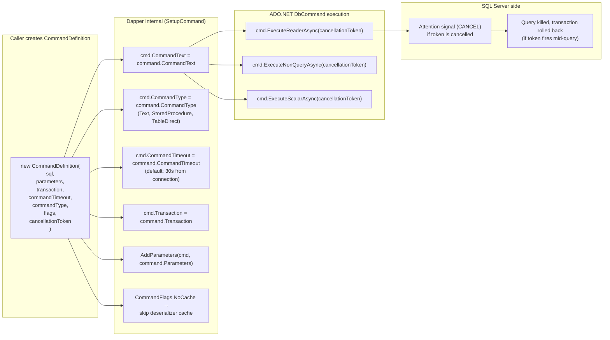
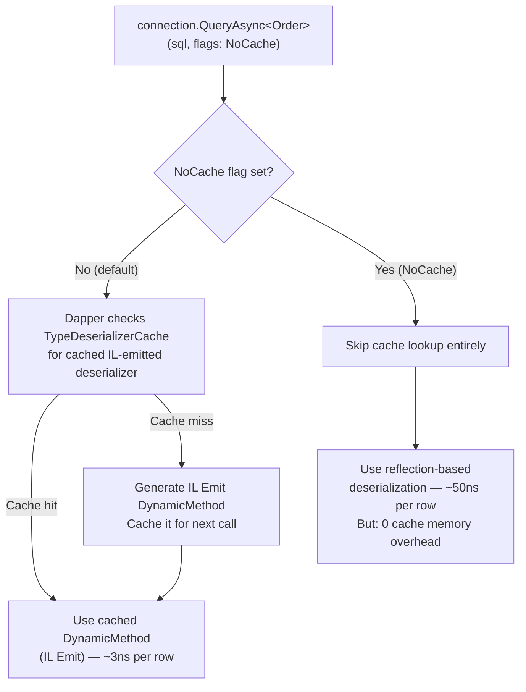
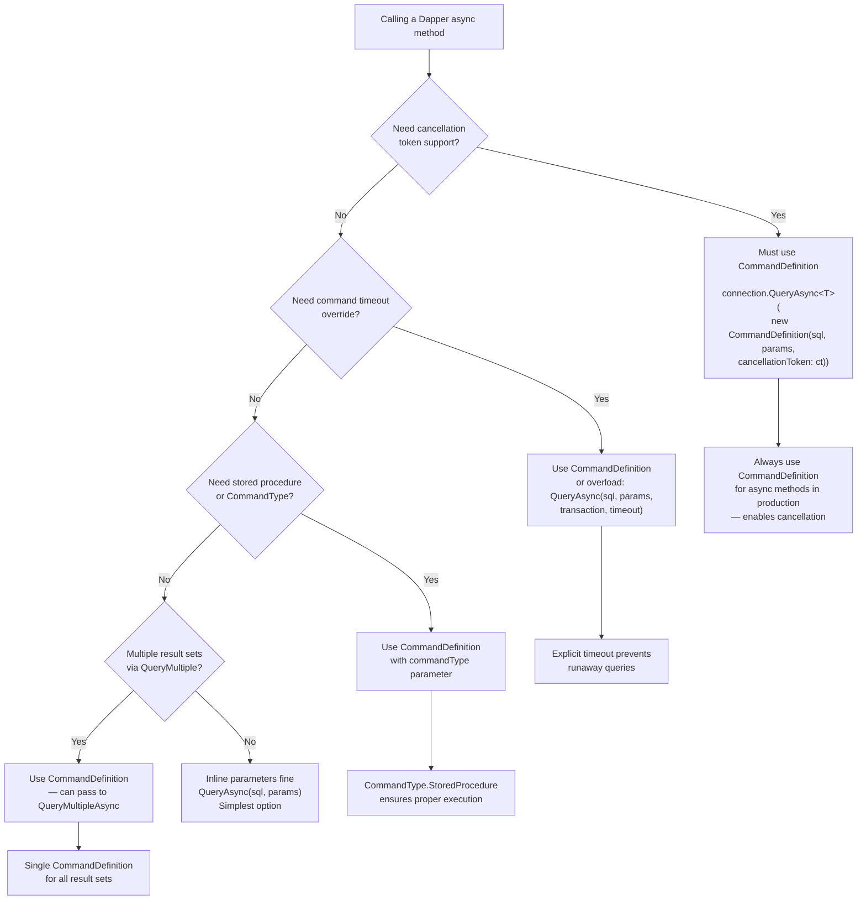

## Navigation

**Domain:** [[8 — Databases]] > **Group:** Dapper
**Previous:** [[8.876 — Dapper — Connection Management — Open and Close]] | **Next:** [[8.878 — Dapper — SqlMapper.AddTypeMap — Type Mapping]]

### Prerequisites
- [[8.876 — Dapper — Connection Management — Open and Close]] — connection lifecycle interacts with CommandDefinition because the cancellation token can abort an in-progress open or query.

### Where This Fits

CommandDefinition is Dapper's unified parameter object that replaces the overload explosion of extension methods. Instead of having `QueryAsync(sql)`, `QueryAsync(sql, param)`, `QueryAsync(sql, param, transaction)`, `QueryAsync(sql, param, transaction, commandTimeout)`, etc., Dapper provides a single `CommandDefinition` that wraps all command settings: SQL text, parameters, transaction, timeout, command type, flags, and cancellation token. The critical feature for production ASP.NET Core services is `cancellationToken` propagation — when a user drops a request or the server shuts down, the `CancellationToken` from `HttpContext.RequestAborted` should cancel the database query instead of leaving it running. Without this, abandoned queries accumulate, consume SQL Server resources, and delay graceful shutdown. In interviews, CommandDefinition tests whether a candidate understands how Dapper translates .NET query settings into ADO.NET command properties and how cancellation flows from HTTP request to SQL Server query execution.

---

## Core Mental Model

CommandDefinition is a `readonly struct` that aggregates every parameter that can be passed to a DbCommand into a single object. When you call `connection.QueryAsync(new CommandDefinition(...))`, Dapper unpacks the CommandDefinition's fields and sets them on the underlying `DbCommand` instance it creates internally. The struct is immutable after creation and designed to be stack-allocated (it's a struct, not a class) to minimize heap allocations. The cancellation token in CommandDefinition is passed to `DbCommand.CancellationToken` via `CommandBehavior` (for readers) or directly to `ExecuteNonQueryAsync`/`ExecuteScalarAsync`. Dapper does NOT create a `CancellationTokenRegistration` — it does not react to cancellation; it only passes the token through to ADO.NET, which passes it to SQL Server via the `SqlCommand.AsyncCommand` infrastructure, which sends an attention signal (`SSCLIENTPROCESSID` + `CANCEL`) to kill the query on the server.

### Classification

**For .NET topics:** CommandDefinition is a data-transfer struct that maps directly to `DbCommand` properties: `CommandText`, `Parameters`, `Transaction`, `CommandTimeout`, `CommandType`, and a special `Flags` field that controls Dapper-specific behavior (like `CommandFlags.NoCache` for disabling the dynamic method cache). The struct is split into two code paths: `CommandDefinition` (the struct) and internal setup via `CommandDefinition.SetupCommand()` which copies values to the `DbCommand` instance. The abstraction is leak-free — every property maps 1:1 to an ADO.NET concept.



### Key Properties

|Property|Type|Default|Notes|
|---|---|---|---|
|`CommandText`|`string`|Required|SQL text or stored procedure name|
|`Parameters`|`object?`|`null`|Anonymous object, `DynamicParameters`, or dictionary|
|`Transaction`|`IDbTransaction?`|`null`|Must match connection's transaction|
|`CommandTimeout`|`int?`|`null` (uses connection default, ~30s)|`null` = use `SqlConnection.CommandTimeout`|
|`CommandType`|`CommandType?`|`null` (Text)|`null` = `CommandType.Text`|
|`Flags`|`CommandFlags`|`CommandFlags.Buffered`|`Buffered`, `NoCache`, `Pipelined`|
|`CancellationToken`|`CancellationToken`|`CancellationToken.None`|Passed to ADO.NET async methods|
|`CommandBehavior`|`CommandBehavior`|`CommandBehavior.Default`|Added internally; `SequentialAccess` merged|

---

## Deep Mechanics

### How CommandDefinition Maps to ADO.NET DbCommand

When Dapper receives a `CommandDefinition`, the `SetupCommand` method is called internally. Here is the exact mapping:

```csharp
// Dapper's internal SetupCommand (SqlMapper.cs, simplified)
internal static void SetupCommand(
    this CommandDefinition command,
    IDbCommand cmd,
    IDbConnection connection)
{
    // 1. Command text
    if (command.CommandText != null)
        cmd.CommandText = command.CommandText;

    // 2. Command type
    if (command.CommandType.HasValue)
        cmd.CommandType = command.CommandType.Value;

    // 3. Command timeout
    if (command.CommandTimeout.HasValue)
        cmd.CommandTimeout = command.CommandTimeout.Value;
    else if (connection is SqlConnection sqlConn)
        cmd.CommandTimeout = sqlConn.CommandTimeout;

    // 4. Transaction
    if (command.Transaction != null)
        cmd.Transaction = command.Transaction;

    // 5. Parameters
    if (command.Parameters != null)
        AddParameters(cmd, command.Parameters, command.ParameterFlags);
}
```

The `CancellationToken` is NOT stored on `DbCommand` — it is passed to the async execution method. Dapper does:

```csharp
// For QueryAsync:
using var reader = await cmd.ExecuteReaderAsync(
    command.CommandBehavior | CommandBehavior.SequentialAccess,
    command.CancellationToken);

// For ExecuteAsync:
var result = await cmd.ExecuteNonQueryAsync(command.CancellationToken);

// For QueryMultipleAsync:
using var reader = await cmd.ExecuteReaderAsync(command.CancellationToken);
```

This means the cancellation token flows directly to ADO.NET's async methods. When the token fires during execution:

1. .NET throws `OperationCanceledException` (or `TaskCanceledException`) at the `await`.
2. ADO.NET sends an attention packet to SQL Server: `SqlCommand.Cancel()` is called internally.
3. SQL Server receives the attention signal and attempts to kill the query.
4. If the query is in a transaction, the transaction may be rolled back (depending on severity and `XACT_ABORT` setting).
5. The `DbConnection` remains open — cancellation does NOT close the connection.
6. The `SqlDataReader` is disposed, so the connection (if Dapper opened it) is also closed per the auto-close contract.

### CommandDefinition Internal Layout — Memory and Performance

Because CommandDefinition is a `readonly struct`, its memory layout is determined by its fields. Here is the exact layout on .NET 9 (64-bit):

```csharp
public readonly struct CommandDefinition
{
    private readonly string? _commandText;        // 8 bytes (reference)
    private readonly object? _parameters;          // 8 bytes (reference)
    private readonly IDbTransaction? _transaction; // 8 bytes (reference)
    private readonly int? _commandTimeout;         // 8 bytes (Nullable<int> = int + bool)
    private readonly CommandType? _commandType;    // 8 bytes (Nullable<CommandType> = int + bool)
    private readonly CommandFlags _flags;          // 4 bytes (enum = int)
    private readonly CancellationToken _cancellationToken; // 4 bytes (struct: CancellationTokenSource ref + int)
    // Total: ~48 bytes (with padding to 8-byte alignment)
}
```

The struct is 48 bytes on x64. When passed as a parameter to a method, it is copied on the stack (or in registers, depending on JIT optimization). The copy is cheap — it's a `memcpy` of 48 bytes, which is ~3-5 CPU cycles.

When Dapper's extension methods receive CommandDefinition, they call `SetupCommand()` which reads each field and assigns it to `DbCommand` properties. The entire setup takes ~50-100ns, dominated by the string copy for `CommandText` and parameter enumeration.

### CommandBehavior Merging

Dapper internally adds `CommandBehavior.SequentialAccess` to the `CommandBehavior` passed in CommandDefinition. This is because Dapper's IL Emit deserializer reads columns in order via `reader.GetValue(ordinal)`, which requires sequential access. If you explicitly pass a CommandBehavior that conflicts (e.g., `CommandBehavior.SchemaOnly`), Dapper merges them with a bitwise OR.

```csharp
// Dapper internal (simplified):
var behavior = command.CommandBehavior;
if (!behavior.HasFlag(CommandBehavior.SequentialAccess))
    behavior |= CommandBehavior.SequentialAccess;
reader = await cmd.ExecuteReaderAsync(behavior, command.CancellationToken);
```

### Cancellation Token Propagation from ASP.NET Core

In ASP.NET Core, every `HttpContext` has a `RequestAborted` CancellationToken that fires when the client disconnects or the server begins graceful shutdown:

```csharp
// ASP.NET Core pipeline — how cancellation flows
public class OrdersController : ControllerBase
{
    private readonly OrderRepository _orderRepo;

    [HttpGet("{id}")]
    public async Task<ActionResult<Order>> GetOrder(
        int id,
        CancellationToken cancellationToken) // ← ASP.NET binds this to HttpContext.RequestAborted
    {
        var order = await _orderRepo.GetOrderByIdAsync(id, cancellationToken);
        if (order is null) return NotFound();
        return Ok(order);
    }
}
```

ASP.NET Core's model binding automatically populates `CancellationToken` parameters from `HttpContext.RequestAborted`. When using CommandDefinition, you pass this token through:

```csharp
public async Task<Order?> GetOrderByIdAsync(
    int orderId,
    CancellationToken cancellationToken = default)
{
    const string sql = "SELECT OrderId, CustomerId, TotalAmount, Status FROM Orders WHERE OrderId = @OrderId";

    await using var connection = _factory.Create();
    // cancellationToken flows through CommandDefinition → DbCommand → SQL Server
    return await connection.QueryFirstOrDefaultAsync<Order>(
        new CommandDefinition(sql,
            new { OrderId = orderId },
            cancellationToken: cancellationToken));
}
```

### CommandFlags — The NoCache Optimization

`CommandFlags` is a flags enum that controls Dapper-specific behavior:

```csharp
[Flags]
public enum CommandFlags
{
    None = 0,
    Buffered = 1,          // Default: read all rows into List<T> before returning
    Pipelined = 2,         // Deprecated
    NoCache = 4,           // Skip the IL Emit deserializer cache
}

// Usage:
var result = await connection.QueryAsync<Order>(
    new CommandDefinition(sql,
        new { Status = "Pending" },
        flags: CommandFlags.Buffered | CommandFlags.NoCache));  // Buffered + NoCache
```

`NoCache` is useful when you have dynamic or ad-hoc SQL where the result columns change frequently. Dapper caches IL-emitted deserializers keyed by (`Type`, `ColumnNames`, `ColumnTypes`). With `NoCache`, Dapper uses reflection-based deserialization instead of IL Emit — slower per row but avoids filling the cache with one-shot queries.



### SQL Visibility

Cancellation tokens and command definitions are client-side concepts. However, SQL Server sees the attention signal when a query is cancelled:

```sql
-- SQL Server side: detect cancelled queries via extended events
CREATE EVENT SESSION [QueryCancellations] ON SERVER
ADD EVENT sqlserver.query_post_execution_showplan(
    WHERE ([result] = 'aborted')),
ADD EVENT sqlserver.sql_batch_completed(
    WHERE ([result] = 'aborted')),
ADD EVENT sqlserver.attention(
    ACTION (sqlserver.session_id, sqlserver.sql_text))
ADD TARGET package0.event_file(
    SET filename = N'D:\XEvents\QueryCancellations.xel');

-- Query the event file later:
SELECT
    event_data.value('(event/@name)[1]', 'varchar(50)') AS event_name,
    event_data.value('(event/data[@name="duration"]/value)[1]', 'bigint') AS duration_microseconds,
    event_data.value('(event/action[@name="sql_text"]/value)[1]', 'nvarchar(max)') AS sql_text
FROM (
    SELECT CAST(event_data AS XML) AS event_data
    FROM sys.fn_xe_file_target_read_file(
        'D:\XEvents\QueryCancellations*.xel', NULL, NULL, NULL)
) AS events;
```

### Execution Plan Analysis

Cancellation tokens do not affect execution plans. If a query is cancelled mid-execution, the plan was already compiled and execution was in progress. The plan is the same as if the query completed — only the duration and result differ.

### Cost Visibility

```sql
-- Count cancelled queries by application
SELECT
    session_id,
    login_name,
    host_name,
    program_name,
    cpu_time,
    total_elapsed_time,
    logical_reads,
    status
FROM sys.dm_exec_requests
WHERE status = 'aborted'  -- Currently being aborted
ORDER BY total_elapsed_time DESC;

-- Historical: find queries that were cancelled
SELECT TOP 10
    qs.total_elapsed_time / 1000 AS elapsed_ms,
    qs.execution_count,
    SUBSTRING(st.text, (qs.statement_start_offset/2)+1,
        ((CASE qs.statement_end_offset
            WHEN -1 THEN DATALENGTH(st.text)
            ELSE qs.statement_end_offset
        END - qs.statement_start_offset)/2) + 1) AS query_text,
    qs.last_execution_time
FROM sys.dm_exec_query_stats qs
CROSS APPLY sys.dm_exec_sql_text(qs.sql_handle) st
WHERE qs.last_execution_time < qs.creation_time  -- Aborted queries have last < creation
ORDER BY qs.total_elapsed_time DESC;
```

### Failure Modes

**Cancelled query inside a transaction:** When a cancellation token fires while a query is executing inside an explicit transaction, the transaction becomes doomed. Any subsequent attempt to commit or rollback may fail with `System.Data.SqlClient.SqlException (0x80131904): The current transaction cannot be committed and cannot support operations that write to the log.` The application must explicitly roll back the transaction.

```csharp
// ❌ Wrong: trying to commit after cancellation
try
{
    await connection.QueryAsync<Order>(
        new CommandDefinition(sql, cancellationToken: ct));
    transaction.Commit();  // If ct fired, this throws
}
catch (OperationCanceledException)
{
    // Transaction is still open and doomed!
    // Must roll back explicitly
}

// ✅ Correct: roll back on cancellation
try
{
    await connection.QueryAsync<Order>(
        new CommandDefinition(sql, cancellationToken: ct));
    transaction.Commit();
}
catch (OperationCanceledException)
{
    transaction.Rollback();  // Must roll back the doomed transaction
    throw;
}
```

**Token fires during connection open:** If the cancellation token fires during the `OpenAsync()` call (which Dapper calls internally), the connection is left in a partially opened state. The connection object should be disposed and not reused.

---

## Production Patterns and Implementation

### Primary SQL Implementation

```sql
-- CommandDefinition wraps this SQL with timeout and cancellation support
-- The SQL itself is unaffected — it executes normally or is cancelled

-- Stored procedure example (CommandType = StoredProcedure):
CREATE PROCEDURE dbo.GetCustomerOrders
    @CustomerId INT,
    @FromDate DATETIME,
    @MaxResults INT = 100
AS
BEGIN
    SET NOCOUNT ON;
    SELECT OrderId, OrderDate, TotalAmount, Status
    FROM Orders
    WHERE CustomerId = @CustomerId
      AND OrderDate >= @FromDate
    ORDER BY OrderDate DESC
    OFFSET 0 ROWS FETCH NEXT @MaxResults ROWS ONLY;
END;
```

### Dapper Implementation

```csharp
// Pattern 1: Basic CommandDefinition with cancellation token
public class OrderRepository
{
    private readonly IDbConnectionFactory _factory;

    public async Task<IReadOnlyList<Order>> GetOrdersAsync(
        int customerId,
        DateTime fromDate,
        CancellationToken cancellationToken = default)
    {
        const string sql = @"
            SELECT OrderId, CustomerId, OrderDate, TotalAmount, Status
            FROM Orders
            WHERE CustomerId = @CustomerId
              AND OrderDate >= @FromDate
            ORDER BY OrderDate DESC";

        await using var connection = _factory.Create();

        var results = await connection.QueryAsync<Order>(
            new CommandDefinition(
                commandText: sql,
                parameters: new { CustomerId = customerId, FromDate = fromDate },
                cancellationToken: cancellationToken));

        return results.AsList();
    }
}
```

```csharp
// Pattern 2: CommandDefinition with stored procedure + timeout
public async Task<IReadOnlyList<CustomerOrder>> GetCustomerOrdersAsync(
    int customerId,
    DateTime fromDate,
    int maxResults = 100,
    CancellationToken cancellationToken = default)
{
    await using var connection = _factory.Create();

    var results = await connection.QueryAsync<CustomerOrder>(
        new CommandDefinition(
            commandText: "dbo.GetCustomerOrders",
            parameters: new { CustomerId = customerId, FromDate = fromDate, MaxResults = maxResults },
            commandType: CommandType.StoredProcedure,
            commandTimeout: 60,  // seconds — override default 30s
            cancellationToken: cancellationToken));

    return results.AsList();
}
```

```csharp
// Pattern 3: CommandDefinition with transaction + Flags
public async Task<bool> ProcessOrderBatchAsync(
    IEnumerable<OrderUpdate> updates,
    CancellationToken cancellationToken = default)
{
    const string sql = @"
        UPDATE Orders
        SET Status = @Status, LastModified = GETUTCDATE()
        WHERE OrderId = @OrderId AND Status = 'Pending'";

    await using var connection = _factory.Create();
    await connection.OpenAsync(cancellationToken);
    await using var transaction = connection.BeginTransaction();

    try
    {
        foreach (var update in updates)
        {
            cancellationToken.ThrowIfCancellationRequested();

            var rows = await connection.ExecuteAsync(
                new CommandDefinition(
                    commandText: sql,
                    parameters: new { update.OrderId, update.Status },
                    transaction: transaction,
                    cancellationToken: cancellationToken));

            if (rows == 0)
            {
                // Order not found or not in 'Pending' status — log and continue
                // or throw depending on business rules
            }
        }

        transaction.Commit();
        return true;
    }
    catch (OperationCanceledException)
    {
        transaction.Rollback();
        throw;
    }
    catch
    {
        transaction.Rollback();
        throw;
    }
}
```

```csharp
// Pattern 4: CommandDefinition with DynamicParameters
public async Task<IReadOnlyList<Order>> SearchOrdersAsync(
    OrderSearchCriteria criteria,
    CancellationToken cancellationToken = default)
{
    var sql = new StringBuilder("SELECT OrderId, CustomerId, OrderDate, TotalAmount, Status FROM Orders WHERE 1=1");
    var parameters = new DynamicParameters();

    if (criteria.CustomerId.HasValue)
    {
        sql.Append(" AND CustomerId = @CustomerId");
        parameters.Add("CustomerId", criteria.CustomerId.Value);
    }

    if (criteria.MinDate.HasValue)
    {
        sql.Append(" AND OrderDate >= @MinDate");
        parameters.Add("MinDate", criteria.MinDate.Value);
    }

    if (!string.IsNullOrEmpty(criteria.Status))
    {
        sql.Append(" AND Status = @Status");
        parameters.Add("Status", criteria.Status);
    }

    sql.Append(" ORDER BY OrderDate DESC");

    await using var connection = _factory.Create();

    return (await connection.QueryAsync<Order>(
        new CommandDefinition(
            commandText: sql.ToString(),
            parameters: parameters,
            commandTimeout: 30,
            cancellationToken: cancellationToken))).AsList();
}
```

```csharp
// Pattern 5: QueryMultiple with CommandDefinition
public async Task<OrderDetailsDto?> GetOrderDetailsAsync(
    int orderId,
    CancellationToken cancellationToken = default)
{
    const string sql = @"
        SELECT OrderId, CustomerId, OrderDate, TotalAmount, Status
        FROM Orders
        WHERE OrderId = @OrderId;

        SELECT oi.OrderId, oi.LineNumber, p.ProductName, oi.Quantity, oi.UnitPrice
        FROM OrderItems oi
        INNER JOIN Products p ON oi.ProductId = p.ProductId
        WHERE oi.OrderId = @OrderId
        ORDER BY oi.LineNumber;

        SELECT OrderId, Amount, PaymentMethod, PaymentDate
        FROM Payments
        WHERE OrderId = @OrderId;";

    await using var connection = _factory.Create();

    using var multi = await connection.QueryMultipleAsync(
        new CommandDefinition(sql,
            new { OrderId = orderId },
            cancellationToken: cancellationToken));

    var order = await multi.ReadFirstOrDefaultAsync<Order>();
    if (order is null) return null;

    var items = (await multi.ReadAsync<OrderItemDto>()).AsList();
    var payments = (await multi.ReadAsync<PaymentDto>()).AsList();

    return new OrderDetailsDto
    {
        Order = order,
        Items = items,
        Payments = payments
    };
}
```

```csharp
// Pattern 6: CancellationTokenSource with timeout (application-level timeout)
public async Task<IReadOnlyList<Order>> GetOrdersWithAppTimeoutAsync(
    CancellationToken cancellationToken = default)
{
    // Application-level timeout: 10 seconds max for this query
    using var cts = CancellationTokenSource.CreateLinkedTokenSource(
        cancellationToken,
        new CancellationTokenSource(TimeSpan.FromSeconds(10)).Token);

    const string sql = "SELECT OrderId, CustomerId, TotalAmount FROM Orders";

    await using var connection = _factory.Create();

    try
    {
        return (await connection.QueryAsync<Order>(
            new CommandDefinition(sql,
                cancellationToken: cts.Token))).AsList();
    }
    catch (OperationCanceledException) when (!cancellationToken.IsCancellationRequested)
    {
        // Application timeout fired, not request aborted
        throw new TimeoutException("The order query timed out after 10 seconds.", innerException: null);
    }
}
```

```csharp
// Pattern 7: CommandFlags.NoCache for dynamic SQL
public async Task<IEnumerable<dynamic>> GetDynamicReportAsync(
    string tableName,
    string columns,
    string whereClause,
    CancellationToken cancellationToken = default)
{
    // ⚠️ Security: tableName must be validated/sanitized before use
    var sql = $"SELECT {columns} FROM {tableName} WHERE {whereClause}";

    await using var connection = _factory.Create();

    return await connection.QueryAsync<dynamic>(
        new CommandDefinition(
            commandText: sql,
            flags: CommandFlags.NoCache,  // Don't cache deserializers — SQL changes every time
            cancellationToken: cancellationToken));
}
```

### Configuration and Wiring

```csharp
// Program.cs — CommandDefinition is a struct, no DI registration needed
// The factory pattern ensures connections are available:

builder.Services.AddSingleton<IDbConnectionFactory>(sp =>
{
    var config = sp.GetRequiredService<IConfiguration>();
    return new SqlConnectionFactory(config.GetConnectionString("Default"));
});

builder.Services.AddScoped<OrderRepository>();

// Global query timeout policy (optional)
// Dapper does not have a global timeout — apply per CommandDefinition
// or set default on connection: new SqlConnection(cs) { CommandTimeout = 45 };
```

### SQL Server vs PostgreSQL Differences

PostgreSQL's Npgsql driver handles cancellation differently. When `CancellationToken` fires during an Npgsql command:

1. Npgsql sends a `PgCancel` packet (not an attention signal).
2. PostgreSQL cancels the current query on the backend.
3. The transaction is NOT automatically rolled back — PostgreSQL waits for the client to issue `ROLLBACK`.

```csharp
// PostgreSQL cancellation handling
// Same CommandDefinition struct — same API
var results = await connection.QueryAsync<Order>(
    new CommandDefinition(sql,
        new { Status = "Pending" },
        cancellationToken: cancellationToken));

// On cancel: Npgsql sends a cancel request
// PostgreSQL query is killed but transaction remains open
// Must manually roll back if in a transaction
```

---

## Gotchas and Production Pitfalls

### Pitfall 1: CancellationToken not passed to CommandDefinition

**Pitfall:** Accepting a `CancellationToken` in the method signature but not forwarding it to Dapper.

```csharp
// ❌ Wrong: Token accepted but not used
public async Task<Order?> GetOrderAsync(int orderId, CancellationToken cancellationToken)
{
    const string sql = "SELECT * FROM Orders WHERE OrderId = @OrderId";
    await using var connection = _factory.Create();
    return await connection.QueryFirstOrDefaultAsync<Order>(
        sql, new { OrderId = orderId });  // No CommandDefinition — token not used
}
```

**Symptom:** When the client disconnects or the request is aborted, the query continues executing on SQL Server. Resources (CPU, memory, locks) are consumed until the query completes or the SQL Server command timeout fires.

**Fix:**
```csharp
// ✅ Correct: Pass token via CommandDefinition
return await connection.QueryFirstOrDefaultAsync<Order>(
    new CommandDefinition(sql,
        new { OrderId = orderId },
        cancellationToken: cancellationToken));
```

**Cost of not fixing:** Under high churn (many cancelled requests), SQL Server accumulates abandoned queries that hold locks, fill the transaction log, and waste CPU. A 1000-request burst where 50% are cancelled mid-query can leave 500 active-but-abandoned queries consuming resources.

### Pitfall 2: CommandFlags.NoCache with repeated queries (performance regression)

**Pitfall:** Using `CommandFlags.NoCache` for queries that will be called repeatedly with the same result shape.

```csharp
// ❌ Wrong: NoCache on a frequently-executed query
for (int i = 0; i < 10000; i++)
{
    var order = await connection.QueryFirstOrDefaultAsync<Order>(
        new CommandDefinition("SELECT * FROM Orders WHERE OrderId = @Id",
            new { Id = i },
            flags: CommandFlags.NoCache));  // Reflection every time!
}
```

**Symptom:** Dapper uses reflection-based deserialization instead of IL Emit for every call. Result: 10-20x slower deserialization per row, 10,000× cache lookups skipped.

**Fix:**
```csharp
// ✅ Correct: Remove NoCache for repeated queries
for (int i = 0; i < 10000; i++)
{
    var order = await connection.QueryFirstOrDefaultAsync<Order>(
        new CommandDefinition("SELECT * FROM Orders WHERE OrderId = @Id",
            new { Id = i }));  // IL Emit cached after first call
}
```

**Cost of not fixing:** A loop that should take 500ms takes 5-10 seconds. CPU spikes due to repeated reflection.

**Expected BenchmarkDotNet result:**
|Method|Mean|Allocated|
|---|---|---|
|QueryWithCache|~45 μs|~2 KB|
|QueryWithNoCache|~520 μs|~28 KB|

### Pitfall 3: CancellationToken fires during connection Open

**Pitfall:** Token fires during Dapper's auto-open, leaving connection in indeterminate state.

```csharp
// ❌ Wrong: Not checking if connection was opened before cancellation
try
{
    var order = await connection.QueryFirstOrDefaultAsync<Order>(
        new CommandDefinition(sql, cancellationToken: cts.Token));
}
catch (OperationCanceledException)
{
    // Connection is now in an unknown state
    // If Dapper opened it (wasClosed=true), it tries to close it
    // If OpenAsync threw, the connection never opened
}
```

**Symptom:** After cancellation, the connection may be in `ConnectionState.Broken` or still `Closed`. Reusing it causes unpredictable behavior.

**Fix:** Dispose and recreate the connection after cancellation.

```csharp
// ✅ Correct: Dispose connection on cancellation
try
{
    var order = await connection.QueryFirstOrDefaultAsync<Order>(
        new CommandDefinition(sql, cancellationToken: cts.Token));
}
catch (OperationCanceledException)
{
    await connection.DisposeAsync();
    throw;
}
```

**Cost of not fixing:** Intermittent `InvalidOperationException: "The connection is already open"` or "Connection was already closed" on subsequent operations using the same connection object.

### Pitfall 4: CommandTimeout vs CancellationToken confusion

**Pitfall:** Relying only on CommandTimeout to cancel long-running queries, but expecting immediate cancellation.

**Symptom:** Query takes 30 seconds to timeout instead of being cancelled immediately when the user navigates away. CommandTimeout is a SQL Server side timeout (`SET LOCK_TIMEOUT`/`SqlCommand.CommandTimeout`) — it waits for the full timeout period. CancellationToken provides immediate cancellation via attention signal.

```csharp
// ❌ Wrong: Only timeout, no cancellation token
var order = await connection.QueryFirstOrDefaultAsync<Order>(
    new CommandDefinition(sql,
        new { OrderId = id },
        commandTimeout: 30));  // User waits up to 30s

// ✅ Correct: Both timeout and cancellation
var order = await connection.QueryFirstOrDefaultAsync<Order>(
    new CommandDefinition(sql,
        new { OrderId = id },
        commandTimeout: 30,
        cancellationToken: httpContext.RequestAborted));  // Immediate cancel on disconnect
```

**Cost of not fixing:** Poor user experience — users who navigate away still occupy SQL Server resources for up to the command timeout duration instead of being released immediately.

### Pitfall 5: Forgetting that CommandDefinition is a struct

**Pitfall:** Passing CommandDefinition by reference or storing it as an interface leads to boxing.

```csharp
// ❌ Wrong: Boxing the struct
ICommandDefinition cmd = new CommandDefinition(sql, parameters);  // Boxed!

// ❌ Wrong: Passing as interface parameter
public Task ExecuteAsync(ICommandDefinition cmd) { ... }  // Interface → boxed

// ✅ Correct: Use the struct directly
CommandDefinition cmd = new CommandDefinition(sql, parameters);
```

**Symptom:** Heap allocations on every query execution. Dapper designed CommandDefinition as a `readonly struct` to be zero-allocation — boxing defeats this.

**Fix:** Use `CommandDefinition` directly, not through interfaces.

**Cost of not fixing:** Extra GC pressure. For high-throughput services, boxing adds ~24 bytes per call (object header + method table) plus gen-0 collection overhead.

### Pitfall 6: Not using CreateLinkedTokenSource for combined cancellation

**Pitfall:** Passing only one token source and losing the ability to cancel from multiple sources (user abort + server shutdown + application timeout).

```csharp
// ❌ Wrong: Only request aborted — app shutdown won't cancel in-flight queries
[HttpGet("{id}")]
public async Task<ActionResult<Order>> Get(int id, CancellationToken cancellationToken)
{
    var order = await _repo.GetOrderAsync(id, cancellationToken);  // Only RequestAborted
    return Ok(order);
}

// ✅ Correct: Combine multiple sources
public async Task<ActionResult<Order>> Get(int id, CancellationToken cancellationToken)
{
    using var cts = CancellationTokenSource.CreateLinkedTokenSource(
        cancellationToken,                             // Request aborted
        _shutdownCancellationToken,                    // Application shutdown
        new CancellationTokenSource(TimeSpan.FromSeconds(5)).Token);  // Hard 5s timeout

    var order = await _repo.GetOrderAsync(id, cts.Token);
    return Ok(order);
}
```

**Cost of not fixing:** During application shutdown (e.g., rolling deploy), in-flight queries continue executing on SQL Server, delaying graceful shutdown. The deployment takes longer as K8s waits for the `terminationGracePeriodSeconds` to elapse.

---

## Performance Implications

### Benchmark: CommandDefinition vs Inline Parameters

```csharp
[MemoryDiagnoser]
[SimpleJob(RuntimeMoniker.Net90)]
public class CommandDefinitionBenchmark
{
    private IDbConnection _connection = null!;

    [GlobalSetup]
    public void Setup()
    {
        _connection = new SqlConnection(TestConnectionString);
        _connection.Open();
    }

    [GlobalCleanup]
    public void Cleanup() => _connection.Dispose();

    [Benchmark(Baseline = true)]
    public async Task<Order?> InlineParameters()
    {
        return await _connection.QueryFirstOrDefaultAsync<Order>(
            "SELECT OrderId, CustomerId, TotalAmount FROM Orders WHERE OrderId = @OrderId",
            new { OrderId = 42 });
    }

    [Benchmark]
    public async Task<Order?> CommandDefinition_Basic()
    {
        return await _connection.QueryFirstOrDefaultAsync<Order>(
            new CommandDefinition(
                "SELECT OrderId, CustomerId, TotalAmount FROM Orders WHERE OrderId = @OrderId",
                new { OrderId = 42 }));
    }

    [Benchmark]
    public async Task<Order?> CommandDefinition_WithCancellationToken()
    {
        return await _connection.QueryFirstOrDefaultAsync<Order>(
            new CommandDefinition(
                "SELECT OrderId, CustomerId, TotalAmount FROM Orders WHERE OrderId = @OrderId",
                new { OrderId = 42 },
                cancellationToken: CancellationToken.None));
    }

    [Benchmark]
    public async Task<Order?> CommandDefinition_AllOptions()
    {
        return await _connection.QueryFirstOrDefaultAsync<Order>(
            new CommandDefinition(
                commandText: "SELECT OrderId, CustomerId, TotalAmount FROM Orders WHERE OrderId = @OrderId",
                parameters: new { OrderId = 42 },
                transaction: null,
                commandTimeout: 30,
                commandType: CommandType.Text,
                flags: CommandFlags.Buffered,
                cancellationToken: CancellationToken.None));
    }
}
```

**Expected results (approximate, SQL Server 2022, 100K rows):**

|Method|Mean|Allocated|Notes|
|---|---|---|---|
|InlineParameters|~35 μs|~1.5 KB|Baseline — overload that takes (sql, params)|
|CommandDefinition_Basic|~36 μs|~1.5 KB|Negligible diff — struct is on stack|
|CommandDefinition_WithCancellationToken|~36 μs|~1.5 KB|No extra allocation for CancellationToken.None|
|CommandDefinition_AllOptions|~37 μs|~1.6 KB|Slightly more setup work but still <5% overhead|

**Key insight:** CommandDefinition adds no measurable overhead over inline parameters. The struct is stack-allocated, and the `SetupCommand` method does the same work Dapper would do with individual parameters.

### Benchmark: NoCache vs Cache Hit

```csharp
[Benchmark]
public async Task<List<Order>> CachedDeserializer()
{
    var results = new List<Order>();
    for (int i = 0; i < 100; i++)
    {
        var order = await _connection.QueryFirstOrDefaultAsync<Order>(
            "SELECT OrderId, CustomerId, TotalAmount FROM Orders WHERE OrderId = @Id",
            new { Id = i });
        if (order is not null) results.Add(order);
    }
    return results;
}

[Benchmark]
public async Task<List<Order>> NoCacheDeserializer()
{
    var results = new List<Order>();
    for (int i = 0; i < 100; i++)
    {
        var order = await _connection.QueryFirstOrDefaultAsync<Order>(
            new CommandDefinition(
                "SELECT OrderId, CustomerId, TotalAmount FROM Orders WHERE OrderId = @Id",
                new { Id = i },
                flags: CommandFlags.NoCache));
        if (order is not null) results.Add(order);
    }
    return results;
}
```

**Expected results:**

|Method|Mean|Allocated|Ratio|
|---|---|---|---|
|CachedDeserializer|~3.5 ms|~150 KB|1x|
|NoCacheDeserializer|~52 ms|~2.8 MB|~15x slower|

**Improvement:** Caching provides ~15x improvement for repeated queries with the same result shape. The first call (cache miss) costs the same as NoCache — the IL Emit compilation overhead is ~200 μs one-time.

---

## Interview Arsenal

### Question Bank

1. **What is CommandDefinition in Dapper? What problem does it solve compared to the overloaded extension methods?**

2. **How does cancellation token propagation work from ASP.NET Core to SQL Server? What happens on the server side when a token fires?**

3. **What is the performance cost of using CommandDefinition vs inline parameters? Is there any heap allocation?**

4. **What is CommandFlags.NoCache? When would you use it and what are the performance implications?**

5. **Compare Dapper's CommandDefinition approach with EF Core's approach to command configuration and cancellation.**

6. **What happens when a cancellation token fires during a transaction? How should the application handle this?**

7. **How does CommandDefinition interact with QueryMultiple? Can you pass different CommandDefinitions to different result sets?**

8. **What is the difference between CommandTimeout (commandDefinition parameter) and application-level cancellation via CancellationToken?**

### Spoken Answers

**Q: What is CommandDefinition in Dapper? What problem does it solve?**

> **Average answer:** It's a way to pass all the command parameters in one object instead of using multiple overloads.

> **Great answer:** CommandDefinition is a `readonly struct` that aggregates every parameter Dapper needs to configure an ADO.NET `DbCommand`: the SQL text, parameters, transaction, command timeout, command type, flags, and cancellation token. It solves the combinatorial overload explosion — without it, Dapper would need 2^n overloads for every combination of optional parameters. More importantly, it provides a single path for the cancellation token to flow from ASP.NET Core's `HttpContext.RequestAborted` through to `SqlCommand.ExecuteReaderAsync`. The struct is designed to be zero-allocation — it stays on the stack and is never boxed unless you cast it to an interface. Internally, Dapper's `SetupCommand` method unpacks the struct's fields and assigns them to the `DbCommand` instance. The performance overhead is literally single-digit nanoseconds compared to inline parameters because all the same work happens — the struct just organizes it better.

**Q: What happens when a cancellation token fires during a transaction?**

> **Average answer:** The query is cancelled and you catch the exception.

> **Great answer:** When a cancellation token fires during a query inside an explicit transaction, ADO.NET sends an attention signal to SQL Server. SQL Server aborts the query, but the transaction remains open on the server — SQL Server doesn't automatically roll back on attention. The client receives `OperationCanceledException`. At this point, the transaction is "doomed" — it cannot commit and cannot support further operations. The application must explicitly catch the `OperationCanceledException` and call `transaction.Rollback()`. The connection itself is still open and usable for new queries after rollback. A common mistake is catching the exception and continuing without rolling back — the subsequent `Dispose()` on the transaction will issue a rollback, but by then the transaction may have held locks for an extended period. The safe pattern is: `try { ... transaction.Commit(); } catch (OperationCanceledException) { transaction.Rollback(); throw; }`. For Dapper with auto-open, the connection is also closed on cancellation (Dapper tracks `wasClosed` and closes in the finally block), so you don't need to worry about connection cleanup if Dapper opened it.

**Q: Compare Dapper's CommandDefinition with EF Core's approach to command configuration.**

> **Great answer:** Dapper's CommandDefinition is a simple struct that maps 1:1 to `DbCommand` properties. EF Core takes a different approach — it uses `DbCommand` customization via `IDbCommandInterceptor` and `DbContextOptionsBuilder` configuration. In EF Core, you set command timeout globally via `optionsBuilder.UseSqlServer(..., sqlOptions => sqlOptions.CommandTimeout(60))`, set cancellation via the `CancellationToken` parameter on `ToListAsync()`, SaveChangesAsync(), etc. EF Core's cancellation token flows through to `DbCommand.ExecuteReaderAsync` the same way, but it's hidden from the developer — you don't see CommandDefinition. In EF Core, you can intercept command creation via `IDbCommandInterceptor.CommandCreated` to customize properties before execution. Dapper gives you explicit per-call control via CommandDefinition; EF Core gives you global or interceptor-based control. Dapper's approach is more transparent (you see exactly what goes into the command), while EF Core's is more automatic (you don't think about it until you need to customize). Both ultimately set the same `DbCommand.CommandTimeout`, `DbCommand.CommandType`, and pass the same `CancellationToken` to `ExecuteReaderAsync`. The tradeoff is explicitness vs automation.

### Interview Trigger

The CommandDefinition topic surfaces when an interviewer asks "How do you pass a cancellation token to a Dapper query?" or "How do you set a command timeout with Dapper?" The follow-up that separates senior candidates: "What's the difference between passing a CancellationToken to Dapper versus setting CommandTimeout on the connection? Which one actually kills the query on the server?" The senior candidate explains that cancellation sends an attention signal (immediate kill), while timeout waits for the server to notice the time has elapsed before killing. Another follow-up: "What's the allocation cost of CommandDefinition?" — the senior candidate knows it's a struct (zero heap allocation unless boxed).

### Comparison Table

| | CommandDefinition | Inline Parameters |
|---|---|---|
| Syntax | `QueryAsync(new CommandDefinition(sql, params, ct))` | `QueryAsync(sql, params)` |
| Cancellation token | Supported (struct field) | Not supported (separate overload) |
| Command timeout | Supported | Separate overload (`QueryAsync(sql, params, transaction, timeout)`) |
| Performance | Same (struct, zero allocation) | Same |
| Readability | Explicit, verbose | Compact, terse |
| Extensibility | Single parameter object | Combinatorial overloads |

---

## Decision Framework

### When to Apply



### Application Checklist

- [ ] Cancellation token from `HttpContext.RequestAborted` is passed to every Dapper async call via CommandDefinition
- [ ] CommandDefinition is used directly as `CommandDefinition` struct, not boxed to an interface
- [ ] `CommandFlags.NoCache` is only used for genuinely ad-hoc/dynamic SQL — never for repeated queries
- [ ] `commandTimeout` is explicitly set for queries that might run longer than the default (complex reports, batch operations)
- [ ] `CommandType.StoredProcedure` set when calling stored procedures (not relying on default Text)
- [ ] `CreateLinkedTokenSource` used when multiple cancellation sources need to be combined
- [ ] Transaction rollback is explicitly handled when `OperationCanceledException` is caught
- [ ] `CommandFlags.Buffered` is explicitly used when the default buffered behavior is required (clear intent)
- [ ] DynamicParameters is used instead of anonymous objects when parameter names are dynamic or need explicit DbType control

### Tradeoff Summary

|What You Gain|What You Pay|
|---|---|
|Single unified parameter object|Slightly more verbose than inline parameters|
|Cancellation token integration with ASP.NET Core|Must remember to use CommandDefinition — not automatic|
|Explicit timeout per query|No global timeout setting (must set per call or on connection)|
|NoCache for dynamic SQL|15x slower deserialization on repeated queries|
|Struct allocation = zero GC pressure|Cannot be passed as interface without boxing|

### Scale Thresholds

- **Relevant at any scale:** Cancellation token support is critical at all scales — even 10 req/s benefits from releasing resources on disconnect.
- **Critical at 100+ req/s:** CommandDefinition zero-allocation matters when creating thousands of command objects per second.
- **Required at 500+ req/s:** Without cancellation, abandoned queries at this scale can exhaust SQL Server's worker thread pool (max worker threads = 2x CPU cores by default).
- **NoCache matters at >1000 calls/minute:** For repeated queries, the cache miss penalty of ~200 μs × 1000 calls = 200ms wasted per minute per query shape.

---

## Self-Check

### Conceptual Questions

1. What is CommandDefinition and what problem does it solve in Dapper?

2. How does Dapper pass the CancellationToken from CommandDefinition to the actual database query?

3. What is the difference between CommandTimeout and CancellationToken? Which one sends an attention signal?

4. What does CommandFlags.NoCache do? When would you use it?

5. Is CommandDefinition a class or a struct? What is the allocation impact?

6. How does cancellation interact with transactions? What must you do after catching OperationCanceledException?

7. How do you combine multiple cancellation sources (user disconnect + server shutdown + timeout)?

8. Can you use CommandDefinition with QueryMultipleAsync? What is the API?

9. How does CommandDefinition handle CommandType.StoredProcedure? What changes in SetupCommand?

10. What is the performance difference between a cached IL Emit deserializer and NoCache reflection deserializer?

<details>
<summary>Answers</summary>

1. CommandDefinition is a `readonly struct` that aggregates all command configuration parameters (SQL text, parameters, transaction, timeout, command type, flags, cancellation token) into a single object. It solves the overload explosion problem and provides a single path for cancellation tokens to flow from ASP.NET Core to SQL Server.

2. Dapper extracts the `CancellationToken` from CommandDefinition and passes it to `DbCommand.ExecuteReaderAsync(cancellationToken)`, `ExecuteNonQueryAsync(cancellationToken)`, or `ExecuteScalarAsync(cancellationToken)`. ADO.NET sends an attention signal to SQL Server when the token fires.

3. CommandTimeout is a timer that starts when the command begins executing; SQL Server checks if the timeout has elapsed and kills the query. CancellationToken sends an immediate attention signal when triggered. CancellationToken kills instantly; CommandTimeout waits for the timeout duration.

4. `CommandFlags.NoCache` tells Dapper to skip the IL Emit deserializer cache. It uses reflection-based deserialization instead. Use it for ad-hoc/dynamic SQL where the result columns change between calls, to avoid polluting the cache with one-shot deserializers.

5. CommandDefinition is a `readonly struct`. It is stack-allocated and has zero heap allocation overhead. Boxing occurs if you cast it to an interface (e.g., `ICommandDefinition`), adding ~24 bytes of heap allocation.

6. After cancellation, the transaction is "doomed" — it cannot commit. You must call `transaction.Rollback()` in the `OperationCanceledException` handler. The connection remains usable after rollback.

7. Use `CancellationTokenSource.CreateLinkedTokenSource(token1, token2, token3)` to create a combined token that fires when any source cancels. Pass the linked token to CommandDefinition.

8. Yes: `using var multi = await connection.QueryMultipleAsync(new CommandDefinition(sql, params, cancellationToken: ct));`. Read all result sets before disposing `SqlMapper.GridReader`.

9. When `CommandType.StoredProcedure` is set, Dapper sets `cmd.CommandType = CommandType.StoredProcedure` and the `CommandText` is used as the stored procedure name. Parameters are added normally. No special handling beyond CommandType assignment.

10. Cached IL Emit deserializer: ~3ns per row. NoCache reflection: ~50ns per row. For 100 rows: 300ns vs 5000ns. For 100K rows: 300μs vs 5ms. The first call (cache miss) is the same for both — ~200μs for IL Emit compilation.

</details>

---

### Query Challenges

**Challenge 1 — Write cancellation-aware Dapper code**

You have an ASP.NET Core endpoint that queries a large report. The report query takes up to 60 seconds. Users often navigate away from the page. Write the repository method that:
1. Accepts a CancellationToken from the controller
2. Uses CommandDefinition with a 30-second application-level timeout
3. Returns IReadOnlyList<Order>
4. Properly distinguishes between user cancellation and application timeout

<details>
<summary>Solution</summary>

```csharp
public async Task<IReadOnlyList<Order>> GetReportAsync(
    ReportCriteria criteria,
    CancellationToken cancellationToken)
{
    const string sql = @"
        SELECT OrderId, CustomerId, OrderDate, TotalAmount, Status
        FROM Orders
        WHERE OrderDate >= @FromDate AND OrderDate < @ToDate
        ORDER BY OrderDate DESC";

    // Combine user cancellation with app-level timeout
    using var cts = CancellationTokenSource.CreateLinkedTokenSource(
        cancellationToken,
        new CancellationTokenSource(TimeSpan.FromSeconds(30)).Token);

    await using var connection = _factory.Create();

    try
    {
        return (await connection.QueryAsync<Order>(
            new CommandDefinition(
                commandText: sql,
                parameters: new { criteria.FromDate, criteria.ToDate },
                commandTimeout: 60,  // SQL Server timeout (backup)
                cancellationToken: cts.Token))).AsList();
    }
    catch (OperationCanceledException ex) when (!cancellationToken.IsCancellationRequested)
    {
        // Application timeout (30s) fired, not user cancel
        throw new TimeoutException("The report query timed out after 30 seconds.", ex);
    }
    // If cancellationToken.IsCancellationRequested, let the OperationCanceledException propagate
}
```

</details>

---

**Challenge 2 — Diagnose the NoCache performance problem**

```csharp
// This code runs in a loop processing 50,000 items.
// It's 15x slower than expected. Identify why and fix it.

public async Task ProcessOrderBatchAsync(IEnumerable<int> orderIds)
{
    foreach (var id in orderIds)
    {
        var order = await _connection.QueryFirstOrDefaultAsync<Order>(
            new CommandDefinition(
                "SELECT OrderId, CustomerId, Status FROM Orders WHERE OrderId = @Id",
                new { Id = id },
                flags: CommandFlags.NoCache));
        // process order...
    }
}
```

<details>
<summary>Solution</summary>

**Root cause:** `CommandFlags.NoCache` forces Dapper to use reflection-based deserialization on every iteration instead of the cached IL Emit deserializer. After the first iteration, the IL Emit deserializer would be cached and reused for all subsequent calls — ~3ns/row instead of ~50ns/row.

**Fix:** Remove `flags: CommandFlags.NoCache`.

```csharp
public async Task ProcessOrderBatchAsync(IEnumerable<int> orderIds)
{
    foreach (var id in orderIds)
    {
        var order = await _connection.QueryFirstOrDefaultAsync<Order>(
            new CommandDefinition(
                "SELECT OrderId, CustomerId, Status FROM Orders WHERE OrderId = @Id",
                new { Id = id }));
        // process order...
    }
}
```

**Expected improvement:** 15x faster. 50,000 iterations: ~2 seconds (cached) vs ~30 seconds (NoCache).

</details>

---

**Challenge 3 — Handle transaction + cancellation correctly**

```csharp
// This code has a bug. When cancellation occurs mid-query,
// the transaction is not properly cleaned up.

public async Task TransferFundsAsync(
    int fromAccountId,
    int toAccountId,
    decimal amount,
    CancellationToken cancellationToken)
{
    await using var connection = _factory.Create();
    await connection.OpenAsync(cancellationToken);
    await using var transaction = connection.BeginTransaction();

    try
    {
        await connection.ExecuteAsync(
            "UPDATE Accounts SET Balance = Balance - @Amount WHERE AccountId = @Id",
            new { Amount = amount, Id = fromAccountId },
            transaction: transaction);

        await connection.ExecuteAsync(
            "UPDATE Accounts SET Balance = Balance + @Amount WHERE AccountId = @Id",
            new { Amount = amount, Id = toAccountId },
            transaction: transaction);

        transaction.Commit();
    }
    catch (OperationCanceledException)
    {
        // Bug: Transaction not rolled back
        throw;
    }
}
```

<details>
<summary>Solution</summary>

**Root cause:** When `OperationCanceledException` is caught, the transaction is still open and "doomed." It must be rolled back explicitly. Without rollback, the `await using` on the transaction will call `DisposeAsync()`, which internally calls rollback — but this happens when the connection is also being disposed, and the rollback may fail if the connection is already closed (Dapper's auto-close on cancellation fires first).

**Fix:**
```csharp
public async Task TransferFundsAsync(
    int fromAccountId,
    int toAccountId,
    decimal amount,
    CancellationToken cancellationToken)
{
    await using var connection = _factory.Create();
    await connection.OpenAsync(cancellationToken);
    await using var transaction = connection.BeginTransaction();

    try
    {
        await connection.ExecuteAsync(
            new CommandDefinition(
                "UPDATE Accounts SET Balance = Balance - @Amount WHERE AccountId = @Id",
                new { Amount = amount, Id = fromAccountId },
                transaction: transaction,
                cancellationToken: cancellationToken));

        await connection.ExecuteAsync(
            new CommandDefinition(
                "UPDATE Accounts SET Balance = Balance + @Amount WHERE AccountId = @Id",
                new { Amount = amount, Id = toAccountId },
                transaction: transaction,
                cancellationToken: cancellationToken));

        transaction.Commit();
    }
    catch (OperationCanceledException)
    {
        await transaction.RollbackAsync(cancellationToken);  // Use original token (not cancelled)
        throw;
    }
}
```

**Key change:** Explicit `RollbackAsync()` in the catch block. Also pass `cancellationToken` to each `ExecuteAsync` via `CommandDefinition` so cancellation can interrupt mid-transfer.

</details>

---

**Challenge 4 — Design a CommandDefinition wrapper**

Your team uses Dapper extensively and wants to enforce consistent command configuration: every production query should have a 30-second timeout and cancellation token support. Design a wrapper method that all team members use instead of raw `connection.QueryAsync`.

<details>
<summary>Solution</summary>

```csharp
public static class DapperExtensions
{
    public static Task<IEnumerable<T>> QueryAsync<T>(
        this IDbConnection connection,
        string sql,
        object? parameters = null,
        IDbTransaction? transaction = null,
        int? commandTimeout = null,
        CommandType? commandType = null,
        CancellationToken cancellationToken = default)
    {
        return SqlMapper.QueryAsync<T>(connection, new CommandDefinition(
            commandText: sql,
            parameters: parameters,
            transaction: transaction,
            commandTimeout: commandTimeout ?? 30,
            commandType: commandType ?? CommandType.Text,
            flags: CommandFlags.Buffered,
            cancellationToken: cancellationToken));
    }

    public static Task<int> ExecuteAsync(
        this IDbConnection connection,
        string sql,
        object? parameters = null,
        IDbTransaction? transaction = null,
        int? commandTimeout = null,
        CommandType? commandType = null,
        CancellationToken cancellationToken = default)
    {
        return SqlMapper.ExecuteAsync(connection, new CommandDefinition(
            commandText: sql,
            parameters: parameters,
            transaction: transaction,
            commandTimeout: commandTimeout ?? 30,
            commandType: commandType ?? CommandType.Text,
            cancellationToken: cancellationToken));
    }
}
```

**Usage:**
```csharp
await connection.QueryAsync<Order>(
    "SELECT * FROM Orders WHERE OrderId = @Id",
    new { Id = 42 },
    cancellationToken: cancellationToken);
// Automatically gets 30s timeout + cancellation token
```

</details>

---

**Challenge 5 — Multi-source cancellation in a microservice**

You have a background service that processes orders. It needs to respond to:
1. Application shutdown (graceful shutdown signal)
2. Maximum processing time per batch (5 minutes)
3. Individual query timeout (30 seconds per query)

Design the cancellation strategy using CommandDefinition and CreateLinkedTokenSource.

<details>
<summary>Solution</summary>

```csharp
public class OrderProcessingService : BackgroundService
{
    private readonly IDbConnectionFactory _factory;
    private readonly ILogger<OrderProcessingService> _logger;

    protected override async Task ExecuteAsync(CancellationToken stoppingToken)
    {
        while (!stoppingToken.IsCancellationRequested)
        {
            try
            {
                await ProcessBatchAsync(stoppingToken);
            }
            catch (OperationCanceledException) when (stoppingToken.IsCancellationRequested)
            {
                _logger.LogInformation("Order processing service shutting down.");
                break;
            }
            catch (Exception ex)
            {
                _logger.LogError(ex, "Order processing batch failed.");
                await Task.Delay(TimeSpan.FromSeconds(10), stoppingToken);
            }
        }
    }

    private async Task ProcessBatchAsync(CancellationToken shutdownToken)
    {
        // Layer 1: Batch-level timeout (5 minutes)
        using var batchCts = CancellationTokenSource.CreateLinkedTokenSource(
            shutdownToken,
            new CancellationTokenSource(TimeSpan.FromMinutes(5)).Token);

        const string selectSql = @"
            SELECT TOP 100 OrderId, CustomerId, TotalAmount, Status
            FROM Orders
            WHERE Status = 'Pending'
            ORDER BY OrderDate ASC";

        await using var connection = _factory.Create();

        var orders = (await connection.QueryAsync<Order>(
            new CommandDefinition(
                commandText: selectSql,
                commandTimeout: 30,  // Layer 3: Individual query timeout
                cancellationToken: batchCts.Token))).AsList();

        foreach (var order in orders)
        {
            batchCts.Token.ThrowIfCancellationRequested();

            await connection.ExecuteAsync(
                new CommandDefinition(
                    "UPDATE Orders SET Status = 'Processing' WHERE OrderId = @OrderId AND Status = 'Pending'",
                    new { order.OrderId },
                    commandTimeout: 30,
                    cancellationToken: batchCts.Token));
        }
    }
}
```

**Cancellation layers:**
1. `shutdownToken` — application shutdown (K8s SIGTERM, ASP.NET Core hosted service shutdown)
2. `batchCts` — 5-minute batch timeout + shutdown, combined
3. `commandTimeout: 30` — per-query SQL Server timeout (last resort)

</details>
