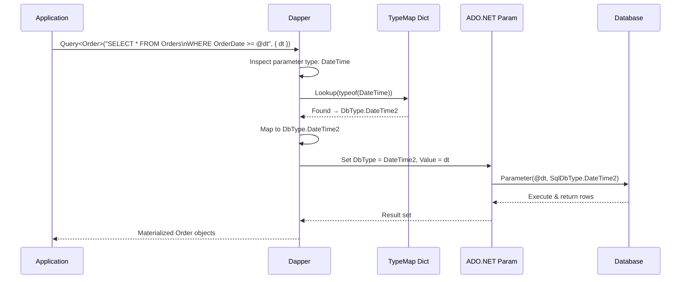
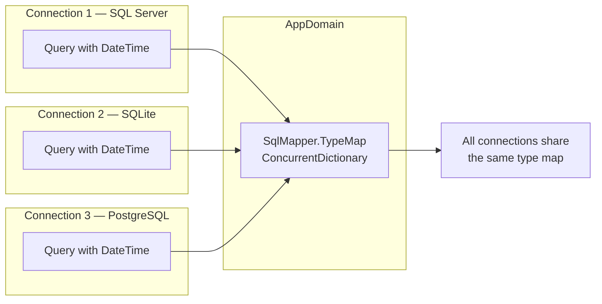
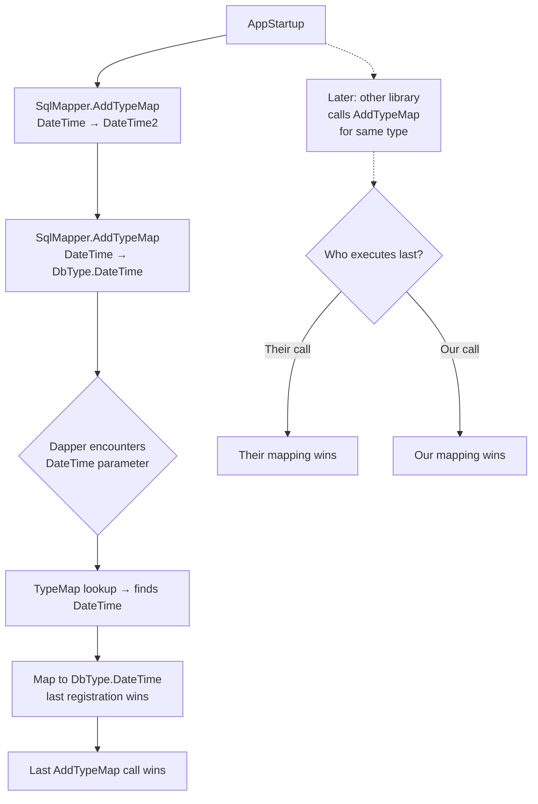

# Dapper — SqlMapper.AddTypeMap — Type Mapping

## Table of Contents

1. [Overview](#overview)
2. [Method Signature](#method-signature)
3. [How Type Mapping Works Internally](#how-type-mapping-works-internally)
4. [Default Type Maps](#default-type-maps)
5. [Common Custom Mappings](#common-custom-mappings)
6. [DateTime Handling Deep Dive](#datetime-handling-deep-dive)
7. [String and Numeric Precision](#string-and-numeric-precision)
8. [Custom CLR Type Example: Uri](#custom-clr-type-example-uri)
9. [Custom CLR Type Example: PhoneNumber](#custom-clr-type-example-phonenumber)
10. [Custom CLR Type Example: EmailAddress](#custom-clr-type-example-emailaddress)
11. [Custom CLR Type Example: Money](#custom-clr-type-example-money)
12. [Mermaid: Type Map Resolution Flow](#mermaid-type-map-resolution-flow)
13. [Mermaid: Query Execution with AddTypeMap](#mermaid-query-execution-with-addtypemap)
14. [Mermaid: Global Type Map Registry](#mermaid-global-type-map-registry)
15. [Mermaid: Conflict & Override Resolution](#mermaid-conflict--override-resolution)
16. [Production Configuration Strategies](#production-configuration-strategies)
17. [Integration with SqlMapper.PurgeTypeMap](#integration-with-sqlmapperpurgetypemap)
18. [Async and Connection Lifetimes](#async-and-connection-lifetimes)
19. [Testing Type Mappings](#testing-type-mappings)
20. [Comparison: AddTypeMap vs TypeHandler vs AddTypeHandler](#comparison-addtypemap-vs-typehandler-vs-addtypehandler)
21. [Comparison: AddTypeMap vs Dapper.FluentMap](#comparison-addtypemap-vs-dapperfluentmap)
22. [Performance Considerations](#performance-considerations)
23. [AddTypeMap with Oracle](#addtypemap-with-oracle)
24. [AddTypeMap with PostgreSQL (Npgsql)](#addtypemap-with-postgresql-npgsql)
25. [AddTypeMap with SQLite](#addtypemap-with-sqlite)
26. [AddTypeMap with MySQL](#addtypemap-with-mysql)
27. [AddTypeMap and Enum Mapping](#addtypemap-and-enum-mapping)
28. [AddTypeMap and Nullable Types](#addtypemap-and-nullable-types)
29. [Gotchas and Anti-Patterns](#gotchas-and-anti-patterns)
30. [Diagnostics and Debugging](#diagnostics-and-debugging)
31. [Source Code Walkthrough](#source-code-walkthrough)
32. [Complete Working Example](#complete-working-example)
33. [Migration Guide: Legacy to Modern Mappings](#migration-guide-legacy-to-modern-mappings)
34. [FAQ](#faq)
35. [Related Cards](#related-cards)

---

## Overview

`SqlMapper.AddTypeMap` is a static method on Dapper's `SqlMapper` class that registers a **global** mapping between a .NET CLR type and an ADO.NET `DbType`. Once registered, every parameter of that CLR type that Dapper encounters during query or command execution is automatically assigned the specified `DbType`, bypassing Dapper's built-in type inference.

This is distinct from `SqlMapper.AddTypeHandler`, which provides full control over serialization/deserialization (both parameter value setting and result-set materialization). `AddTypeMap` only controls the *parameter `DbType` hint* that Dapper sends to the ADO.NET provider. The actual value conversion still uses Dapper's default mechanisms.

### When to Use AddTypeMap

| Scenario | Recommended Approach |
|---|---|
| Change `DbType` for a built-in .NET type (e.g. `DateTime → DbType.DateTime2`) | `AddTypeMap` |
| Map a custom CLR type (e.g. `Uri`, `PhoneNumber`) to a primitive `DbType` | `AddTypeMap` (simple) or `TypeHandler` (full control) |
| Control how a type is read from a result set | `TypeHandler` |
| Map columns by name convention | `Dapper.FluentMap` or `ColumnAttribute` |
| Override mapping for enum types | `AddTypeMap` or `TypeHandler` |

---

## Method Signature

```csharp
namespace Dapper
{
    public static class SqlMapper
    {
        public static void AddTypeMap(Type type, DbType dbType);
    }
}
```

### Parameters

| Parameter | Type | Description |
|---|---|---|
| `type` | `System.Type` | The CLR type to register. Can be nullable, enum, or any reference or value type. |
| `dbType` | `System.Data.DbType` | The ADO.NET `DbType` to map to. |

### Remarks

- The mapping is stored in a **static, concurrent dictionary** keyed by `Type`.
- The same CLR type can only have **one** `DbType` mapping at a time. Calling `AddTypeMap` a second time for the same type **overwrites** the previous mapping.
- There is **no `RemoveTypeMap`** public API, but `PurgeTypeMap` clears all custom mappings.
- The mapping applies globally — across all connections, all threads, and all Dapper operations within the same `AppDomain`.
- Dapper checks the custom type map **first**; if no match is found it falls back to its internal default mapping table.

### Thread Safety

`AddTypeMap` is thread-safe. The underlying backing store is a `ConcurrentDictionary<Type, DbType>`. However, because the mapping is global, concurrent callers should coordinate startup — typically via a static constructor or a module initializer — to avoid a race between one thread setting a mapping and another thread executing a query before the mapping is registered.

---

## How Type Mapping Works Internally

Dapper's parameter-binding pipeline follows these steps when it encounters a parameter value:

1. **Inspect** the CLR type of the parameter value (or the declared type from the POCO property / `DynamicParameters`).
2. **Check custom type map** (`SqlMapper.TypeMap` dictionary) — if a mapping was registered via `AddTypeMap`, use that `DbType`.
3. **Check custom type handlers** (`SqlMapper.TypeHandler` dictionary) — if a handler was registered via `AddTypeHandler`, delegate parameter setup and value materialization to the handler.
4. **Fall back to default mapping table** — Dapper maintains a hard-coded `LookupDbType` method that maps from `Type` to `DbType` using a `Dictionary<Type, DbType>` and a set of special-case rules.
5. **Set `IDbDataParameter.DbType`** — Dapper assigns the resolved `DbType` to the parameter before executing the command.

```csharp
// Simplified internal logic (Dapper source, SqlMapper.cs)
internal static DbType LookupDbType(Type type, string name, bool allowNull, out DbType? handlerType)
{
    // 1. Check custom type map (user-registered via AddTypeMap)
    if (TypeMap.ContainsKey(type))
    {
        handlerType = TypeMap[type];
        return handlerType.Value;
    }

    // 2. Check custom type handlers
    if (TypeHandlerCache.ContainsKey(type))
    {
        // handler knows its DbType
        handlerType = TypeHandlerCache[type].DbType;
        return handlerType.Value;
    }

    // 3. Fallback to default mapping logic
    // ...
    if (type == typeof(DateTime))
        return DbType.DateTime;
    if (type == typeof(int))
        return DbType.Int32;
    // ... many more
}
```

> **Note:** The exact internal implementation may vary across Dapper versions. The key takeaway is the priority order: custom maps > custom handlers > default maps.

---

## Default Type Maps

Dapper's default type-to-DbType mappings are hard-coded. Here is the complete reference:

| .NET CLR Type | Default DbType | Notes |
|---|---|---|
| `bool` | `DbType.Boolean` | |
| `byte` | `DbType.Byte` | |
| `sbyte` | `DbType.SByte` | |
| `short` | `DbType.Int16` | |
| `ushort` | `DbType.UInt16` | |
| `int` | `DbType.Int32` | |
| `uint` | `DbType.UInt32` | |
| `long` | `DbType.Int64` | |
| `ulong` | `DbType.UInt64` | |
| `float` | `DbType.Single` | |
| `double` | `DbType.Double` | |
| `decimal` | `DbType.Decimal` | |
| `string` | `DbType.String` | Default length; see note below |
| `char` | `DbType.StringFixedLength` | Fixed-length character |
| `DateTime` | `DbType.DateTime` | **Common source of issues** |
| `DateTimeOffset` | `DbType.DateTimeOffset` | |
| `TimeSpan` | `DbType.Time` | SQL Server 2008+ |
| `Guid` | `DbType.Guid` | |
| `byte[]` | `DbType.Binary` | |
| `object` | `DbType.Object` | |
| `Enum` subtypes | `DbType.Int32` | By default, enums map to their underlying integer |

### String Defaults Caveat

When `DbType.String` or `DbType.StringFixedLength` is used, ADO.NET providers often require a `Size` property. Dapper sets `Size` to `-1` (unbounded / `MAX`) by default unless the parameter value has an explicit `DbType` override or `DynamicParameters` specifies a size.

This behavior is **not** controlled by `AddTypeMap`. To control string size, use `DynamicParameters` or a custom `TypeHandler`.

---

## Common Custom Mappings

The following mappings are widely used in production to align Dapper's default behavior with modern database practices:

```csharp
// ──────────────────────────────────────────────
// Modern .NET → Database Type Mappings
// ──────────────────────────────────────────────

// DateTime → DateTime2 (SQL Server 2008+)
// DateTime2 has superior range (0001-9999 vs 1753-9999)
// and better precision (100ns vs ~3.33ms)
SqlMapper.AddTypeMap(typeof(DateTime), DbType.DateTime2);

// DateTime? → DateTime2 (nullable)
SqlMapper.AddTypeMap(typeof(DateTime?), DbType.DateTime2);

// TimeSpan → Time (SQL Server 2008+)
SqlMapper.AddTypeMap(typeof(TimeSpan), DbType.Time);
SqlMapper.AddTypeMap(typeof(TimeSpan?), DbType.Time);

// bool → Boolean (explicit, matches default but clarifies intent)
SqlMapper.AddTypeMap(typeof(bool), DbType.Boolean);
SqlMapper.AddTypeMap(typeof(bool?), DbType.Boolean);

// Guid → UniqueIdentifier (explicit, matches default)
SqlMapper.AddTypeMap(typeof(Guid), DbType.Guid);
SqlMapper.AddTypeMap(typeof(Guid?), DbType.Guid);

// byte → Byte (explicit)
SqlMapper.AddTypeMap(typeof(byte), DbType.Byte);
SqlMapper.AddTypeMap(typeof(byte?), DbType.Byte);
```

### Why These Mappings Are Common

| Mapping | Reason |
|---|---|
| `DateTime → DateTime2` | Wider date range, better precision, matches SQL Server's recommended type |
| `TimeSpan → Time` | Dapper already does this correctly but making it explicit avoids confusion |
| `bool → Boolean` | Some legacy providers map `bool` to `DbType.Int16` or `DbType.Char`; explicit mapping prevents surprises |

---

## DateTime Handling Deep Dive

The `DateTime → DbType.DateTime` vs `DbType.DateTime2` distinction is one of the most common Dapper configurations, especially on SQL Server.

### Date Range Comparison

| Type | Min | Max | Precision |
|---|---|---|---|
| `DbType.DateTime` | 1753-01-01 | 9999-12-31 | ~3.33 ms (ticks) |
| `DbType.DateTime2` | 0001-01-01 | 9999-12-31 | 100 ns |
| `.NET DateTime` | 0001-01-01 | 9999-12-31 | 100 ns |

The default `DbType.DateTime` will throw a `SqlDbType` overflow exception if you try to insert a `DateTime` before 1753-01-01, such as a birth date for historical figures or a "min date" sentinel value (`DateTime.MinValue` = 0001-01-01).

### AddTypeMap for DateTime2

```csharp
// In your startup / static constructor:
SqlMapper.AddTypeMap(typeof(DateTime), DbType.DateTime2);
SqlMapper.AddTypeMap(typeof(DateTime?), DbType.DateTime2);
```

After this registration, every Dapper query involving a `DateTime` parameter uses `SqlDbType.DateTime2` on SQL Server. This is equivalent to `SqlParameter.SqlDbType = SqlDbType.DateTime2`.

### Impact on WHERE Clauses

A subtle issue: changing the mapped `DbType` can affect query plan generation.

```sql
-- DbType.DateTime sends:
@date_param DateTime

-- DbType.DateTime2 sends:
@date_param DateTime2
```

If the indexed column is `DATETIME` (not `DATETIME2`), using `DateTime2` parameter type may cause a **type conversion** that prevents efficient index seeks. In rare cases, the optimizer might scan instead of seeking.

```sql
-- Can cause index scan if column is DATETIME:
WHERE OrderDate >= @date_param  -- @date_param is DateTime2

-- Use explicit CAST or ensure column matches:
WHERE OrderDate >= CAST(@date_param AS DATETIME)
```

**Recommendation:** Use `DateTime2` mapping if your table columns are `DATETIME2`. If your columns are `DATETIME`, consider per-query `DynamicParameters` instead of a global mapping.

### DateTimeOffset

`DateTimeOffset` maps to `DbType.DateTimeOffset` by default, which translates to `SqlDbType.DateTimeOffset` in SQL Server. No special handling is required unless you want to store it as `DATETIME2` (not recommended — you lose offset information).

```csharp
// Storing DateTimeOffset as DateTime2 (NOT RECOMMENDED — loses offset)
SqlMapper.AddTypeMap(typeof(DateTimeOffset), DbType.DateTime2);
```

---

## String and Numeric Precision

### String Length Control

`AddTypeMap` **cannot** control the string `Size` parameter. For string parameters, Dapper defaults to `Size = -1` (unbounded / `MAX`). This can cause:

- Performance degradation (SQL Server may not optimize queries with `NVARCHAR(MAX)` parameters)
- Index usage issues (indexes on `NVARCHAR(50)` columns may not be used efficiently)
- Implicit conversions in query plans

```csharp
// AddTypeMap does NOT help here:
SqlMapper.AddTypeMap(typeof(string), DbType.String); // useless — this is already the default

// Use DynamicParameters instead:
connection.Query<User>("SELECT * FROM Users WHERE Email = @Email",
    new { Email = new DbString { Value = email, IsAnsi = false, Length = 256 } });

// Or use a custom TypeHandler:
public class VarcharHandler : SqlMapper.TypeHandler<string>
{
    private readonly int _length;
    public VarcharHandler(int length) => _length = length;
    public override void SetValue(IDbDataParameter parameter, string value)
    {
        parameter.DbType = DbType.String;
        parameter.Size = _length;
        parameter.Value = value;
    }
    public override string Parse(object value) => (string)value;
}
```

### Decimal Precision

Similarly, `AddTypeMap(typeof(decimal), DbType.Decimal)` does not control `Scale` and `Precision`. ADO.NET providers often infer these from the value itself, but some scenarios need explicit control:

```csharp
// Forcing decimal(18,4) via DynamicParameters:
var p = new DynamicParameters();
p.Add("@Amount", amount, DbType.Decimal, Precision = 18, Scale = 4);

// Or via a custom TypeHandler:
public class Decimal4Handler : SqlMapper.TypeHandler<decimal>
{
    public override void SetValue(IDbDataParameter parameter, decimal value)
    {
        parameter.DbType = DbType.Decimal;
        parameter.Precision = 18;
        parameter.Scale = 4;
        parameter.Value = value;
    }
    public override decimal Parse(object value) => (decimal)value;
}
```

---

## Custom CLR Type Example: Uri

`Uri` is a common CLR type with no direct `DbType` counterpart. Without any mapping, Dapper falls through to its default logic which may treat it as `DbType.Object` or fail.

```csharp
public class Product
{
    public int Id { get; set; }
    public string Name { get; set; }
    public Uri ProductUrl { get; set; }   // stored as NVARCHAR in DB
    public Uri ImageUrl { get; set; }     // stored as NVARCHAR in DB
}

// Startup / static ctor:
SqlMapper.AddTypeMap(typeof(Uri), DbType.String);

// Usage — Dapper automatically converts Uri to string for the parameter:
var products = connection.Query<Product>(
    "SELECT * FROM Products WHERE ProductUrl = @url",
    new { url = new Uri("https://example.com/product/123") });
```

### How It Works

- When Dapper sees parameter type `Uri`, it consults `TypeMap`, finds `DbType.String`.
- Dapper sets `IDbDataParameter.Value = uri.ToString()` (the default `IConvertible` fallback for types it doesn't know about).
- On output (result materialization), Dapper does **not** automatically convert the string back to `Uri`. The result set column returns a string, and Dapper tries to assign it to the `Uri` property. This works because Dapper uses `Convert.ChangeType` which, for `Uri`, has a `TypeConverter` that accepts a string.

> **Caveat:** Round-tripping works with `Uri` because .NET provides a `TypeConverter` from `string → Uri`. For custom types without a `TypeConverter`, you must use `TypeHandler` for two-way conversion.

---

## Custom CLR Type Example: PhoneNumber

```csharp
public class PhoneNumber
{
    public string CountryCode { get; set; }
    public string Number { get; set; }
    public string Extension { get; set; }

    public override string ToString()
        => $"+{CountryCode}.{Number}{(Extension != null ? $"x{Extension}" : "")}";

    public static PhoneNumber Parse(string s)
    {
        // Parsing logic omitted for brevity
        return new PhoneNumber();
    }
}

// Simple approach — store as string:
SqlMapper.AddTypeMap(typeof(PhoneNumber), DbType.String);

// This works if Dapper can convert PhoneNumber → string for parameter values.
// Dapper's default parameter handling calls .ToString() on unknown types.
```

However, for proper round-tripping, a `TypeHandler` is better:

```csharp
public class PhoneNumberHandler : SqlMapper.TypeHandler<PhoneNumber>
{
    public override void SetValue(IDbDataParameter parameter, PhoneNumber value)
    {
        parameter.DbType = DbType.String;
        parameter.Value = value?.ToString();
    }

    public override PhoneNumber Parse(object value)
        => PhoneNumber.Parse((string)value);
}

// Register the handler instead of (or alongside) AddTypeMap:
SqlMapper.AddTypeHandler(new PhoneNumberHandler());
```

---

## Custom CLR Type Example: EmailAddress

```csharp
public record EmailAddress
{
    public string LocalPart { get; init; }
    public string Domain { get; init; }
    public string Full => $"{LocalPart}@{Domain}";

    public static EmailAddress Parse(string full)
    {
        var parts = full.Split('@');
        return new EmailAddress { LocalPart = parts[0], Domain = parts[1] };
    }
}

// Simple storage as string:
SqlMapper.AddTypeMap(typeof(EmailAddress), DbType.String);
// Parameter value will be set to email.Full via .ToString()
// Read-back: Dapper will try Convert.ChangeType(string → EmailAddress)
// This works if EmailAddress has a TypeConverter or implicit conversion.
```

**Recommended:** Use `TypeHandler` for custom types to guarantee correctness:

```csharp
public class EmailAddressHandler : SqlMapper.TypeHandler<EmailAddress>
{
    public override void SetValue(IDbDataParameter parameter, EmailAddress value)
    {
        parameter.DbType = DbType.AnsiString;
        parameter.Size = 320; // max email length per RFC 5321
        parameter.Value = value.Full;
    }

    public override EmailAddress Parse(object value)
        => EmailAddress.Parse((string)value);
}
```

---

## Custom CLR Type Example: Money

Some applications use a `Money` value object to avoid floating-point precision issues:

```csharp
public readonly record struct Money(decimal Amount, string CurrencyCode)
{
    public override string ToString() => $"{Amount:F2} {CurrencyCode}";
}

// Store as decimal (losing currency code) — each column maps separately:
SqlMapper.AddTypeMap(typeof(Money), DbType.Decimal);

// Better: store only Amount, keep CurrencyCode as separate column.
// Or serialize as JSON string via TypeHandler.
```

---

## Mermaid: Type Map Resolution Flow

```mermaid
flowchart TD
    A[Dapper encounters\nparameter value] --> B{Check TypeMap\n(custom dictionary)}
    B -->|Found| C[Use registered DbType]
    B -->|Not Found| D{Check TypeHandler\nregistrations}
    D -->|Found| E[Delegate to\nTypeHandler.SetValue]
    D -->|Not Found| F[Fall back to\nLookupDbType defaults]
    C --> G[Set IDbDataParameter.DbType]
    E --> G
    F --> G
    G --> H[Execute command]
```

---

## Mermaid: Query Execution with AddTypeMap



---

## Mermaid: Global Type Map Registry



> **Critical insight:** Because the type map is global, mapping `DateTime → DateTime2` affects **every** connection, including non-SQL-Server providers. Some providers (e.g., SQLite, MySQL) may not support `DbType.DateTime2` and will throw an error or silently degrade behavior.

---

## Mermaid: Conflict & Override Resolution



> **Lesson:** `AddTypeMap` is not additive. Calling it for the same type overwrites. The last call wins. If multiple libraries or modules independently call `AddTypeMap`, they may silently override each other.

---

## Production Configuration Strategies

### 1. Static Constructor on DbContext or Repository

```csharp
public class DapperTypeMappings
{
    public static void Initialize()
    {
        SqlMapper.AddTypeMap(typeof(DateTime), DbType.DateTime2);
        SqlMapper.AddTypeMap(typeof(DateTime?), DbType.DateTime2);
        SqlMapper.AddTypeMap(typeof(TimeSpan), DbType.Time);
        SqlMapper.AddTypeMap(typeof(TimeSpan?), DbType.Time);
        SqlMapper.AddTypeMap(typeof(bool), DbType.Boolean);
        SqlMapper.AddTypeMap(typeof(bool?), DbType.Boolean);
        SqlMapper.AddTypeMap(typeof(Uri), DbType.String);
        SqlMapper.AddTypeMap(typeof(Guid), DbType.Guid);
        SqlMapper.AddTypeMap(typeof(Guid?), DbType.Guid);
    }
}
```

### 2. Module Initializer (C# 9+)

```csharp
// In any class in the assembly:
[module: System.Runtime.CompilerServices.ModuleInitializer]
internal static class DapperMappingsModuleInitializer
{
    public static void Initialize()
    {
        SqlMapper.AddTypeMap(typeof(DateTime), DbType.DateTime2);
        SqlMapper.AddTypeMap(typeof(DateTime?), DbType.DateTime2);
        // ... etc
    }
}
```

The module initializer runs automatically when the assembly loads, before any type is accessed or any method is called.

### 3. Application Startup (ASP.NET Core)

```csharp
// Program.cs
var builder = WebApplication.CreateBuilder(args);

// Before any Dapper query:
SqlMapper.AddTypeMap(typeof(DateTime), DbType.DateTime2);
SqlMapper.AddTypeMap(typeof(DateTime?), DbType.DateTime2);
SqlMapper.AddTypeMap(typeof(TimeSpan), DbType.Time);

var app = builder.Build();
// ...
app.Run();
```

### 4. Lazy Initialization with Double-Check

```csharp
public static class DapperConfig
{
    private static bool _initialized = false;
    private static readonly object _lock = new();

    public static void EnsureInitialized()
    {
        if (_initialized) return;
        lock (_lock)
        {
            if (_initialized) return;
            SqlMapper.AddTypeMap(typeof(DateTime), DbType.DateTime2);
            SqlMapper.AddTypeMap(typeof(DateTime?), DbType.DateTime2);
            _initialized = true;
        }
    }
}

// Called at the start of every top-level Dapper operation:
DapperConfig.EnsureInitialized();
```

### 5. Configuration-Driven Mappings

```csharp
// appsettings.json
// {
//   "Dapper": {
//     "TypeMaps": {
//       "System.DateTime": "DateTime2",
//       "System.TimeSpan": "Time"
//     }
//   }
// }

public static class DapperConfig
{
    public static void InitializeFromConfiguration(IConfiguration config)
    {
        var mappings = config.GetSection("Dapper:TypeMaps").Get<Dictionary<string, string>>();
        if (mappings == null) return;

        foreach (var (typeName, dbTypeName) in mappings)
        {
            var type = Type.GetType(typeName, throwIfMissing: true);
            var dbType = Enum.Parse<DbType>(dbTypeName);
            SqlMapper.AddTypeMap(type, dbType);
        }
    }
}
```

---

## Integration with SqlMapper.PurgeTypeMap

`SqlMapper.PurgeTypeMap()` removes **all** custom type map entries. This is useful in:

- Unit test teardowns to reset state between tests
- Dynamic module loading/unloading scenarios
- **Disaster recovery** if a misconfigured mapping is detected at runtime

```csharp
// Test teardown:
[TestCleanup]
public void Cleanup()
{
    // Remove all custom type maps to avoid test pollution
    SqlMapper.PurgeTypeMap();
}
```

### Pitfall: No Selective Removal

There is no public `SqlMapper.RemoveTypeMap(Type)` method. If you need to remove a single mapping, you must either:

1. Call `PurgeTypeMap()` (removes all custom mappings)
2. Override with a different `DbType` via `AddTypeMap`
3. Use reflection (private field `SqlMapper.TypeMap`):

```csharp
// NOT RECOMMENDED — reflection on internals:
var field = typeof(SqlMapper).GetField("TypeMap",
    BindingFlags.Static | BindingFlags.NonPublic);
var dict = (IDictionary)field.GetValue(null);
dict.Remove(typeof(DateTime));
```

---

## Async and Connection Lifetimes

`AddTypeMap` is connection-agnostic. It does not matter whether you use `QueryAsync`, `ExecuteAsync`, `QueryMultipleAsync`, or synchronous methods — the same global type map applies.

```csharp
// Async usage — same mapping applies:
await connection.QueryAsync<Order>(
    "SELECT * FROM Orders WHERE OrderDate >= @dt",
    new { dt = DateTime.UtcNow });  // → DbType.DateTime2 if registered
```

There is no per-command or per-connection override for `AddTypeMap`. If you need a per-query `DbType`, use `DynamicParameters`:

```csharp
var p = new DynamicParameters();
p.Add("@dt", DateTime.UtcNow, DbType.DateTime, size: null, direction: ParameterDirection.Input);
await connection.QueryAsync<Order>("SELECT * FROM Orders WHERE OrderDate >= @dt", p);
```

---

## Testing Type Mappings

### Unit Tests

```csharp
[TestClass]
public class AddTypeMapTests
{
    [TestInitialize]
    public void Setup()
    {
        // Ensure clean state before each test
        SqlMapper.PurgeTypeMap();
    }

    [TestCleanup]
    public void Cleanup()
    {
        SqlMapper.PurgeTypeMap();
    }

    [TestMethod]
    public void AddTypeMap_DateTimeToDateTime2_ResolvesCorrectly()
    {
        SqlMapper.AddTypeMap(typeof(DateTime), DbType.DateTime2);

        // Use an in-memory SQLite database to verify actual parameter behavior
        using var connection = new SqliteConnection("Data Source=:memory:");
        connection.Open();

        // Create a table and insert with the mapped type
        connection.Execute("CREATE TABLE Test (Value DATETIME2)");
        var dt = new DateTime(2024, 1, 15, 10, 30, 0);
        connection.Execute("INSERT INTO Test (Value) VALUES (@dt)", new { dt });

        var result = connection.QuerySingle<DateTime>("SELECT Value FROM Test");
        Assert.AreEqual(dt, result);
    }

    [TestMethod]
    public void AddTypeMap_UriToString_StoresAsString()
    {
        SqlMapper.AddTypeMap(typeof(Uri), DbType.String);

        using var connection = new SqliteConnection("Data Source=:memory:");
        connection.Open();

        connection.Execute("CREATE TABLE Links (Url TEXT)");
        var uri = new Uri("https://example.com/test");
        connection.Execute("INSERT INTO Links (Url) VALUES (@url)", new { url = uri });

        var result = connection.QuerySingle<string>("SELECT Url FROM Links");
        Assert.AreEqual("https://example.com/test", result);
    }
}
```

### Integration Tests

For integration testing against a real database, consider each provider separately:

```csharp
// SQL Server-specific test
[TestMethod]
public void AddTypeMap_DateTime2_SqlServer_NoOverflow()
{
    SqlMapper.AddTypeMap(typeof(DateTime), DbType.DateTime2);

    using var connection = new SqlConnection(TestConnectionStrings.SqlServer);
    var minDate = new DateTime(1752, 1, 1); // would fail with DbType.DateTime
    connection.Execute("CREATE TABLE #t (D DATETIME2)");
    connection.Execute("INSERT INTO #t (D) VALUES (@d)", new { d = minDate });
    var result = connection.QuerySingle<DateTime>("SELECT D FROM #t");
    Assert.AreEqual(minDate, result);
}
```

---

## Comparison: AddTypeMap vs TypeHandler vs AddTypeHandler

| Feature | `AddTypeMap` | `AddTypeHandler` | `AddTypeHandler<T>` |
|---|---|---|---|
| Scope | DbType only | Full parameter & result | Full parameter & result (generic) |
| Controls parameter `DbType` | Yes | Yes (via `SetValue`) | Yes (via `SetValue`) |
| Controls parameter `Size` | No | Yes | Yes |
| Controls parameter `Precision`/`Scale` | No | Yes | Yes |
| Controls result materialization | No | Yes (via `Parse`) | Yes (via `Parse`) |
| Custom types | Works if `TypeConverter` exists | Required for complex types | Required for complex types |
| Global | Yes | Yes | Yes |
| Conflicting registrations | Last `AddTypeMap` wins | Last `AddTypeHandler` wins | Last `AddTypeHandler` wins |
| Performance overhead | Minimal (dictionary lookup) | Slight (virtual method call) | Slight (generic instantiation) |

### When to Use Which

```csharp
// AddTypeMap: Simple, no custom conversion needed
SqlMapper.AddTypeMap(typeof(DateTime), DbType.DateTime2);

// TypeHandler: Custom conversion logic needed
SqlMapper.AddTypeHandler(new UriHandler());

// TypeHandler (non-generic): Mixed or unknown types at registration time
SqlMapper.AddTypeHandler(typeof(MyCustomType), new MyCustomTypeHandler());
```

---

## Comparison: AddTypeMap vs Dapper.FluentMap

[Dapper.FluentMap](https://github.com/henkmollema/Dapper.FluentMap) is a separate library for **column name mapping** (entity → database column). It does **not** control `DbType` mappings.

| Feature | `AddTypeMap` | `Dapper.FluentMap` |
|---|---|---|
| Purpose | DbType resolution | Column name mapping |
| Global | Yes | Yes |
| Per-entity | No | Yes (per entity type) |
| Overrides | All connections | All connections |

They are orthogonal — you can (and often do) use both.

```csharp
// Dapper.FluentMap — column mapping:
public class ProductMap : EntityMap<Product>
{
    public ProductMap()
    {
        Map(p => p.Id).ToColumn("ProductID");
        Map(p => p.Name).ToColumn("ProductName");
    }
}

FluentMapper.Initialize(cfg => cfg.AddMap(new ProductMap()));

// AddTypeMap — type mapping:
SqlMapper.AddTypeMap(typeof(DateTime), DbType.DateTime2);
```

---

## Performance Considerations

### Overhead of AddTypeMap

The performance impact of `AddTypeMap` is negligible:

- The lookup is a `ConcurrentDictionary.TryGetValue` — O(1) amortized.
- The dictionary is read during parameter setup, which is already a fast path in Dapper.
- No allocations are introduced beyond the initial registration.

### IL Emit Interaction

Dapper's high-performance path uses **IL Emit** to create and populate `IDbDataParameter` objects. When a custom type map is found, the emitted IL includes a branch to set `DbType` to the mapped value. This is still extremely fast — the generated IL is comparable to hand-written parameter assignment code.

```csharp
// Dapper's IL Emit generates code equivalent to:
// if (param.DbType != DbType.DateTime2)
//     param.DbType = DbType.DateTime2;
```

### TypeMap and Caching

Dapper caches the parameter setup strategy per type. Once a type (e.g., `Order`) is used in a query, the IL for its parameter binding is generated and cached. Adding a `TypeMap` entry for `DateTime` **after** the `Order` type was already cached will not affect already-cached IL. The new mapping only takes effect for **new** types or when the cache is cleared.

```csharp
// Initial call caches the parameter strategy for Order:
connection.Query<Order>("...", new { dt = DateTime.Now });
// → Cached parameter setup for Order uses the current TypeMap state

// Later AddTypeMap — does NOT invalidate existing cache:
SqlMapper.AddTypeMap(typeof(DateTime), DbType.DateTime2);
// → Already-cached Order parameter setup still uses old mapping

// Next call with Order still uses the cached (old) mapping:
connection.Query<Order>("...", new { dt = DateTime.Now });
```

This caching behavior is a **subtle gotcha**. In production, always register `AddTypeMap` **before** any Dapper query executes.

### PurgeTypeMap and Cache

`PurgeTypeMap` removes custom map entries but does **not** clear Dapper's IL cache. The cache is per-type and is only cleared by restarting the application domain.

```csharp
SqlMapper.PurgeTypeMap();
// → TypeMap dictionary is cleared
// → IL cache is NOT cleared
// → Cached types still use whatever DbType was set when they were first cached
```

---

## AddTypeMap with Oracle

Oracle's `System.Data.OracleClient` (legacy) and Oracle Managed Driver (`Oracle.ManagedDataAccess`) have different `DbType` mappings.

### Oracle Managed Driver

```csharp
// Oracle manages DateTime differently:
// Default DbType.DateTime maps to OracleDbType.Date (date only, no time)
// To include time, map to DbType.DateTime2 → OracleDbType.TimeStamp

SqlMapper.AddTypeMap(typeof(DateTime), DbType.DateTime2);
// → Parameter uses OracleDbType.TimeStamp (includes date + time)

// For date-only columns:
SqlMapper.AddTypeMap(typeof(DateOnly), DbType.Date);
// → Parameter uses OracleDbType.Date
```

### Oracle CLOB / NCLOB for Strings

Oracle treats `DbType.String` as `NVARCHAR2` by default. For large strings, you may need `DbType.Xml` or explicit `OracleDbType.Clob` via a `TypeHandler`:

```csharp
// AddTypeMap cannot handle LOB types directly:
// SqlMapper.AddTypeMap(typeof(string), DbType.String); // default

// Use TypeHandler for CLOB:
public class ClobHandler : SqlMapper.TypeHandler<string>
{
    public override void SetValue(IDbDataParameter parameter, string value)
    {
        parameter.DbType = DbType.String;
        parameter.Size = int.MaxValue; // triggers CLOB behavior
        parameter.Value = value;
    }
    public override string Parse(object value) => (string)value;
}
```

---

## AddTypeMap with PostgreSQL (Npgsql)

Npgsql (the .NET PostgreSQL driver) has its own type mapping system. Dapper's `AddTypeMap` works through the standard ADO.NET `DbType` enumeration, which Npgsql translates to its internal `NpgsqlDbType`.

### Common PostgreSQL Mappings

```csharp
// DateTime → Timestamp (default in Npgsql)
// No AddTypeMap needed for basic usage.

// TimeSpan → Interval (default in Npgsql)
// Maps to PostgreSQL INTERVAL type.

// bool → Boolean (default)
// Maps to PostgreSQL BOOLEAN.

// Guid → Uuid (default)
// Maps to PostgreSQL UUID.

// string → Text (default)
// Maps to PostgreSQL TEXT.
```

### Npgsql Special Considerations

Npgsql maps `DbType.DateTime` to `timestamp without time zone` and `DbType.DateTimeOffset` to `timestamp with time zone` (`timestamptz`). If you want `DateTime` to map to `timestamptz`:

```csharp
SqlMapper.AddTypeMap(typeof(DateTime), DbType.DateTimeOffset);
// → Npgsql receives DbType.DateTimeOffset → maps to timestamptz
```

However, this changes the semantics: Dapper will treat your `DateTime` value as if it had offset information. This is generally not recommended.

### JSON in PostgreSQL

For PostgreSQL's native JSON/JSONB support, use Npgsql's built-in mapping or a custom `TypeHandler`:

```csharp
// Npgsql 6.0+ natively maps System.Text.Json.JsonDocument / JsonElement
// No AddTypeMap needed.

// For string-based JSON columns, AddTypeMap(typeof(string), DbType.String) works as default.
```

---

## AddTypeMap with SQLite

SQLite is dynamically typed. The `DbType` hint is less impactful because SQLite does not enforce strict column types.

```csharp
// SQLite with Microsoft.Data.Sqlite:
SqlMapper.AddTypeMap(typeof(DateTime), DbType.DateTime2);
// → SQLite receives "DbType.DateTime2" → stores as TEXT (ISO 8601) or REAL (Julian day)
//   depending on the connection's DateTimeKind setting.
```

### SQLite No-Op Mappings

Some `DbType` values are not supported by the SQLite provider:

```csharp
// These will likely throw or be ignored:
SqlMapper.AddTypeMap(typeof(TimeSpan), DbType.Time);
// → SQLite does not have a TIME type; may fall back to TEXT or throw.

SqlMapper.AddTypeMap(typeof(byte[]), DbType.Binary);
// → Maps to SQLite BLOB — this one works correctly.
```

**Best practice for SQLite:** Avoid exotic `DbType` mappings. Stick with `DbType.String`, `DbType.Int32`, `DbType.Double`, `DbType.Boolean`, and `DbType.Binary`.

---

## AddTypeMap with MySQL

MySQL Connector/NET (MySqlConnector) translates `DbType` values to MySQL types.

```csharp
// MySQL defaults:
// DbType.DateTime → DATETIME (range: 1000-01-01 to 9999-12-31)
// DbType.DateTime2 → DATETIME (same as DateTime for MySQL)
// DbType.Time → TIME
// DbType.String → VARCHAR/NVARCHAR depending on encoding
```

### MySQL Fractional Seconds

MySQL 5.6+ supports fractional seconds (`DATETIME(6)`). The precision is controlled by the column definition, not the `DbType` hint:

```csharp
// AddTypeMap does NOT control fractional precision:
SqlMapper.AddTypeMap(typeof(DateTime), DbType.DateTime2);
// → Column must be defined as DATETIME(6) or similar for microsecond precision.
```

### MySqlConnector Special

[MySqlConnector](https://mysqlconnector.net/) (the newer, high-performance MySQL driver) handles `DbType.DateTime` and `DbType.DateTime2` identically. `AddTypeMap(typeof(DateTime), DbType.DateTime2)` has no effect over the default.

---

## AddTypeMap and Enum Mapping

### Default Enum Handling

By default, Dapper maps enum parameters as their underlying integer (`int`):

```csharp
public enum OrderStatus { Pending = 0, Shipped = 1, Delivered = 2 }

// Query:
connection.Query<Order>(
    "SELECT * FROM Orders WHERE Status = @status",
    new { status = OrderStatus.Shipped });
// → Parameter is sent as DbType.Int32 with value 1
```

### Changing Enum DbType

If your database stores enums as strings:

```csharp
SqlMapper.AddTypeMap(typeof(OrderStatus), DbType.String);
// → Dapper sets DbType.String and calls .ToString() on the enum
//   Parameter value becomes "Shipped" as a string
```

### Bulk Enum Registration via Reflection

```csharp
public static void RegisterAllEnumsAsStrings(Assembly assembly)
{
    var enumTypes = assembly.GetTypes().Where(t => t.IsEnum);
    foreach (var enumType in enumTypes)
    {
        SqlMapper.AddTypeMap(enumType, DbType.String);
    }
}
```

### Nullable Enum Variants

Each enum's nullable counterpart must be registered separately:

```csharp
SqlMapper.AddTypeMap(typeof(OrderStatus), DbType.String);
SqlMapper.AddTypeMap(typeof(OrderStatus?), DbType.String); // separate registration
```

### Generic Helper

```csharp
public static class DapperExtensions
{
    public static void MapEnumAsString<TEnum>() where TEnum : struct, Enum
    {
        SqlMapper.AddTypeMap(typeof(TEnum), DbType.String);
        SqlMapper.AddTypeMap(typeof(TEnum?), DbType.String);
    }
}

// Usage:
DapperExtensions.MapEnumAsString<OrderStatus>();
DapperExtensions.MapEnumAsString<PaymentMethod>();
```

---

## AddTypeMap and Nullable Types

Nullable types (`T?`) are distinct CLR types from their non-nullable counterparts (`Nullable<T>`).

```csharp
SqlMapper.AddTypeMap(typeof(DateTime), DbType.DateTime2);
// → Does NOT affect DateTime?

SqlMapper.AddTypeMap(typeof(DateTime?), DbType.DateTime2);
// → Required for nullable DateTime
```

### Why Dapper Requires Both

Dapper's parameter inspection examines the **exact** CLR type of the property or parameter. If a POCO has a `DateTime?` property, the type is `Nullable<DateTime>`, not `DateTime`. The `TypeMap` lookup would fail for `DateTime` because the dictionary key does not match.

### Helper for Both Variants

```csharp
public static void AddTypeMapWithNullable(Type type, DbType dbType)
{
    SqlMapper.AddTypeMap(type, dbType);
    if (type.IsValueType)
    {
        var nullableType = typeof(Nullable<>).MakeGenericType(type);
        SqlMapper.AddTypeMap(nullableType, dbType);
    }
}

// Usage:
AddTypeMapWithNullable(typeof(DateTime), DbType.DateTime2);
AddTypeMapWithNullable(typeof(Guid), DbType.Guid);
AddTypeMapWithNullable(typeof(bool), DbType.Boolean);
```

---

## Gotchas and Anti-Patterns

### Gotcha 1: Global Mutation

`AddTypeMap` modifies a static global dictionary. Any code in the process can overwrite your mapping.

```csharp
// Library A sets:
SqlMapper.AddTypeMap(typeof(DateTime), DbType.DateTime2);

// Library B (loaded later) sets:
SqlMapper.AddTypeMap(typeof(DateTime), DbType.DateTime);
// → Library B's mapping wins. Library A's queries now use DbType.DateTime.
```

**Mitigation:** Use a module initializer that runs last. Audit third-party libraries for `AddTypeMap` calls.

### Gotcha 2: Provider Mismatch

```csharp
SqlMapper.AddTypeMap(typeof(DateTime), DbType.DateTime2);
// Works with SQL Server (SqlDbType.DateTime2)
// May fail with SQLite (throws NotSupportedException)
// May be ignored with MySQL (MySqlConnector treats both as DATETIME)
```

**Mitigation:** Only register provider-specific mappings if you use a single database provider. For multi-provider applications, configure mappings per provider at connection time (not possible with `AddTypeMap` alone — use `DynamicParameters`).

### Gotcha 3: Caching Race

```csharp
// In a high-traffic async startup, this could happen:
// Thread 1: calls AddTypeMap(DateTime, DateTime2)
// Thread 2: executes Query<Order> — caches parameter setup
// Thread 3: calls AddTypeMap(DateTime, DateTime) — too late
// Thread 2's cached setup uses DateTime2. New types use DateTime.
```

**Mitigation:** Register all mappings before any Dapper operation, ideally in a module initializer or `Program.Main` before building the host.

### Gotcha 4: AddTypeMap Does Not Affect Output

```csharp
SqlMapper.AddTypeMap(typeof(DateTime), DbType.DateTime2);
// → Parameter input is affected.
// → Result set deserialization is NOT affected.
// → Dapper reads DateTime from the result set using IDataReader.GetDateTime().
// → No conversion to DateTime2 happens on the output side.
```

### Gotcha 5: Forgetting Nullable Types

```csharp
SqlMapper.AddTypeMap(typeof(DateTime), DbType.DateTime2);
// DateTime? properties still use DbType.DateTime (the default).
// If you have a mix of DateTime and DateTime? properties, both must be registered.
```

### Gotcha 6: AddTypeMap Does Not Affect Already-Cached Parameter Strategies

```csharp
// First call — caches parameter setup for Order:
connection.Query<Order>("...", new { dt = DateTime.UtcNow });

// This mapping is registered too late:
SqlMapper.AddTypeMap(typeof(DateTime), DbType.DateTime2);

// Next call — still uses cached setup (DbType.DateTime):
connection.Query<Order>("...", new { dt = DateTime.UtcNow });
```

### Gotcha 7: No Way to Remove a Single Mapping

```csharp
// You can only:
SqlMapper.PurgeTypeMap(); // removes ALL custom mappings
// Or overwrite:
SqlMapper.AddTypeMap(typeof(DateTime), DbType.DateTime); // revert to default
```

There is no `SqlMapper.RemoveTypeMap(typeof(DateTime))` API.

### Gotcha 8: Confusion with SqlMapper.AddTypeHandler

`AddTypeMap` and `AddTypeHandler` serve different purposes. They can conflict:

```csharp
SqlMapper.AddTypeMap(typeof(Uri), DbType.String);
SqlMapper.AddTypeHandler(new UriHandler()); // also handles Uri

// Which wins?
// → TypeMap is checked first (see resolution flow above).
// → AddTypeMap mapping takes precedence over AddTypeHandler for DbType.
// → But TypeHandler's SetValue method is never called if TypeMap matched.
```

If you register a `TypeHandler`, you generally should **not** also register an `AddTypeMap` for the same type, unless you specifically want the `TypeMap` `DbType` override but still want the handler's value logic.

### Anti-Pattern 1: Per-Query AddTypeMap

```csharp
public IEnumerable<Order> GetOrders(DateTime since)
{
    SqlMapper.AddTypeMap(typeof(DateTime), DbType.DateTime2); // BAD
    return connection.Query<Order>("SELECT * FROM Orders WHERE Date >= @since",
        new { since });
}
```

This mutates global state on every method call. Other concurrent callers are affected.

### Anti-Pattern 2: Silent Catch of Registration

```csharp
try
{
    SqlMapper.AddTypeMap(typeof(Uri), DbType.String);
}
catch { } // BAD — swallow errors
```

If `AddTypeMap` fails (it rarely does, but theoretically could with `TypeInitializationException`), you will have unpredictable parameter behavior. Let it throw at startup so you know immediately.

### Anti-Pattern 3: Over-Mapping Built-in Types

```csharp
// Unnecessary — these are already the defaults:
SqlMapper.AddTypeMap(typeof(int), DbType.Int32);
SqlMapper.AddTypeMap(typeof(string), DbType.String);
SqlMapper.AddTypeMap(typeof(bool), DbType.Boolean);
```

Adds no value and wastes a dictionary slot. Only register when you need to **change** the default.

### Anti-Pattern 4: Mapping to Unsupported DbType

```csharp
// SQL Server does not have DbType.UInt32:
SqlMapper.AddTypeMap(typeof(uint), DbType.UInt32);
// → May cause provider-level exception or silent conversion.
```

Always verify that the target database provider supports the chosen `DbType`.

### Anti-Pattern 5: Relying on AddTypeMap for Security

```csharp
SqlMapper.AddTypeMap(typeof(string), DbType.AnsiString);
// Believeing this prevents SQL injection via Unicode — WRONG
// SQL injection is prevented by parameterization itself, not DbType choice.
```

---

## Diagnostics and Debugging

### Checking Active Mappings

```csharp
// Reflection-based inspection:
var typeMapField = typeof(SqlMapper).GetField("TypeMap",
    BindingFlags.Static | BindingFlags.NonPublic);
var typeMap = (IDictionary)typeMapField?.GetValue(null);

if (typeMap != null)
{
    foreach (DictionaryEntry entry in typeMap)
    {
        Console.WriteLine($"{entry.Key} → {entry.Value}");
    }
}
```

### Logging Dapper Parameter Setup

Dapper does not natively log parameter DbType assignments. To inspect what `DbType` is actually being sent:

```csharp
// Approach: Use an interceptor / decorator around IDbConnection
// Or enable provider-level logging:
// SQL Server: System.Data.SqlClient.SqlClientFactory.Instance
// Npgsql:    NpgsqlLogManager.IsLoggingEnabled = true;
// MySqlConnector: MySqlConnectorLogManager.Provider = new ConsoleLoggerProvider();

// Or use a profiling mini-profiler like MiniProfiler or Seq.
```

### Verifying the Mapping

```csharp
// Quick smoke test:
public static void VerifyMapping()
{
    using var conn = new SqlConnection(TestConnectionString);
    conn.Open();

    var cmd = conn.CreateCommand();
    cmd.CommandText = "SELECT @p";

    var p = cmd.CreateParameter();
    p.ParameterName = "@p";
    p.Value = DateTime.UtcNow;

    // Before AddTypeMap → p.DbType == DbType.DateTime
    // After AddTypeMap  → p.DbType == DbType.DateTime2

    Dapper.SqlMapper.AddTypeMap(typeof(DateTime), DbType.DateTime2);
    // But Dapper's parameter setup only runs during Query/Execute,
    // not when creating a SqlParameter directly.

    // Instead, run an actual Dapper query and inspect with SQL Profiler:
    var result = conn.QuerySingle<DateTime>("SELECT @p", new { p = DateTime.UtcNow });
    // Check SQL Server Profiler or extended events for the actual SqlDbType.
}
```

---

## Source Code Walkthrough

The following is a simplified reconstruction of Dapper's internal type mapping logic based on the open-source source code (file `SqlMapper.cs`).

### TypeMap Dictionary

```csharp
// Dapper source (SqlMapper.cs — simplified)
internal static readonly ConcurrentDictionary<Type, DbType> TypeMap
    = new ConcurrentDictionary<Type, DbType>();
```

### AddTypeMap Implementation

```csharp
public static void AddTypeMap(Type type, DbType dbType)
{
    // Uses AddOrUpdate to ensure thread safety:
    TypeMap[type] = dbType;
    // The indexer on ConcurrentDictionary is equivalent to:
    // TypeMap.AddOrUpdate(type, dbType, (key, oldValue) => dbType);
}
```

### LookupDbType (Simplified)

```csharp
internal static DbType LookupDbType(Type type, string name, bool allowNull, out DbType? handlerType)
{
    // 1. Handle nullable types
    var underlyingType = Nullable.GetUnderlyingType(type);
    if (underlyingType != null)
    {
        // Recursively resolve the underlying type
        var result = LookupDbType(underlyingType, name, allowNull, out handlerType);
        handlerType = result;
        return result;
    }

    handlerType = null;

    // 2. Check custom TypeMap
    if (TypeMap.TryGetValue(type, out var dbType))
    {
        handlerType = dbType;
        return dbType;
    }

    // 3. Check TypeHandler cache
    if (TypeHandlerCache.TryGetValue(type, out var handler))
    {
        handlerType = handler.DbType;
        return handler.DbType;
    }

    // 4. Check known type map
    if (type == typeof(byte[]) || type == typeof(Binary))
        return DbType.Binary;
    if (type == typeof(byte) || type == typeof(sbyte?))
        return DbType.Byte;
    // ... ~50 hard-coded mappings follow ...
    if (type == typeof(DateTime))
        return DbType.DateTime;
    // ... more ...

    // 5. Fallback — special cases
    if (type.IsEnum)
    {
        // Default enum handling: map to underlying type
        return LookupDbType(Enum.GetUnderlyingType(type), name, allowNull, out handlerType);
    }

    // 6. Last resort
    return DbType.Object;
}
```

### SqlDataParameter Setup (IL Emit Target)

```csharp
// The IL Emit generates code that effectively does:
// void SetParam(IDbDataParameter param, object value)
// {
//     param.Value = value;
//     if (TypeMap.TryGetValue(typeof(value), out var dbType))
//         param.DbType = dbType;
// }
```

---

## Complete Working Example

The following is a self-contained console application demonstrating `AddTypeMap`:

```csharp
using System;
using System.Data;
using System.Data.SqlClient;
using Dapper;

// ──────────────────────────────────────────────
// Register custom type mapping at app startup
// ──────────────────────────────────────────────
public static class DapperStartup
{
    public static void Initialize()
    {
        // Map DateTime → DateTime2 (SQL Server 2008+)
        SqlMapper.AddTypeMap(typeof(DateTime), DbType.DateTime2);
        SqlMapper.AddTypeMap(typeof(DateTime?), DbType.DateTime2);

        // Map TimeSpan → Time
        SqlMapper.AddTypeMap(typeof(TimeSpan), DbType.Time);
        SqlMapper.AddTypeMap(typeof(TimeSpan?), DbType.Time);

        // Map custom Uri → string
        SqlMapper.AddTypeMap(typeof(Uri), DbType.String);
    }
}

// ──────────────────────────────────────────────
// POCOs
// ──────────────────────────────────────────────
public class Order
{
    public int Id { get; set; }
    public string Product { get; set; }
    public int Quantity { get; set; }
    public decimal Price { get; set; }
    public DateTime OrderDate { get; set; }
    public DateTime? ShipDate { get; set; }
    public TimeSpan? DeliveryWindow { get; set; }
    public Uri ProductUrl { get; set; }
}

public class OrderSummary
{
    public int Id { get; set; }
    public DateTime OrderDate { get; set; }
    public decimal Total { get; set; }
}

// ──────────────────────────────────────────────
// Repository
// ──────────────────────────────────────────────
public class OrderRepository
{
    private readonly string _connectionString;

    public OrderRepository(string connectionString)
    {
        _connectionString = connectionString;
    }

    public async Task<Order> GetOrderAsync(int id)
    {
        using var connection = new SqlConnection(_connectionString);
        return await connection.QueryFirstOrDefaultAsync<Order>(
            "SELECT * FROM Orders WHERE Id = @Id",
            new { Id = id });
    }

    public async Task<IEnumerable<OrderSummary>> GetOrdersByDateAsync(DateTime from, DateTime to)
    {
        using var connection = new SqlConnection(_connectionString);
        // Both 'from' and 'to' will use DbType.DateTime2 (registered via AddTypeMap)
        return await connection.QueryAsync<OrderSummary>(
            @"SELECT Id, OrderDate, Quantity * Price AS Total
              FROM Orders
              WHERE OrderDate BETWEEN @From AND @To",
            new { From = from, To = to });
    }

    public async Task<int> CreateOrderAsync(Order order)
    {
        using var connection = new SqlConnection(_connectionString);
        return await connection.ExecuteAsync(
            @"INSERT INTO Orders (Product, Quantity, Price, OrderDate, ShipDate, DeliveryWindow, ProductUrl)
              VALUES (@Product, @Quantity, @Price, @OrderDate, @ShipDate, @DeliveryWindow, @ProductUrl)",
            order);
    }

    public async Task<IEnumerable<Order>> GetOrdersByProductUrlAsync(Uri productUrl)
    {
        using var connection = new SqlConnection(_connectionString);
        return await connection.QueryAsync<Order>(
            "SELECT * FROM Orders WHERE ProductUrl = @ProductUrl",
            new { ProductUrl = productUrl });
    }
}

// ──────────────────────────────────────────────
// Program
// ──────────────────────────────────────────────
public class Program
{
    public static async Task Main(string[] args)
    {
        // Initialize global Dapper type mappings BEFORE any query
        DapperStartup.Initialize();

        const string connectionString = "Server=.;Database=Shop;Trusted_Connection=true;";

        var repo = new OrderRepository(connectionString);

        // Create test data
        var newOrder = new Order
        {
            Product = "Widget",
            Quantity = 5,
            Price = 9.99m,
            OrderDate = DateTime.UtcNow,
            ShipDate = null,
            DeliveryWindow = TimeSpan.FromHours(2),
            ProductUrl = new Uri("https://shop.example.com/widget")
        };

        var id = await repo.CreateOrderAsync(newOrder);
        Console.WriteLine($"Created order #{id}");

        // Query by date range
        var orders = await repo.GetOrdersByDateAsync(
            DateTime.UtcNow.AddDays(-1),
            DateTime.UtcNow.AddDays(1));

        foreach (var o in orders)
        {
            Console.WriteLine($"Order #{o.Id}: {o.OrderDate:O} — ${o.Total:F2}");
        }

        // Query by URI
        var uriOrders = await repo.GetOrdersByProductUrlAsync(
            new Uri("https://shop.example.com/widget"));
        Console.WriteLine($"Found {uriOrders.Count()} order(s) for that URL");
    }
}
```

### SQL Schema

```sql
CREATE TABLE Orders (
    Id INT IDENTITY PRIMARY KEY,
    Product NVARCHAR(200) NOT NULL,
    Quantity INT NOT NULL,
    Price DECIMAL(18,2) NOT NULL,
    OrderDate DATETIME2 NOT NULL,
    ShipDate DATETIME2 NULL,
    DeliveryWindow TIME NULL,
    ProductUrl NVARCHAR(2048) NULL
);
```

---

## Migration Guide: Legacy to Modern Mappings

### Step 1: Audit Current Default Behavior

Run a diagnostic query against your database to check which `DbType` values Dapper is currently sending:

```csharp
// If using SQL Server, enable SQL Server Profiler or extended events
// and filter on the application name. Look at the RPC:Completed event
// to see @paramname=@paramname type=datetime(2) etc.
```

### Step 2: Identify Breaking Changes

| Default (Legacy) | Custom (Modern) | Breaking? |
|---|---|---|
| `DateTime → DateTime` | `DateTime → DateTime2` | **YES** — if column is `DATETIME`, index seeks may degrade |
| `TimeSpan → Time` | `TimeSpan → Time` | Same (no change) |
| `string → String` | `string → StringFixedLength` | **YES** — pads strings |
| `enum → Int32` | `enum → String` | **YES** — changes SQL parameter value |

### Step 3: Roll Out Gradually

Because `AddTypeMap` is global, you cannot do a gradual per-query rollout. Options:

1. **Shadow deploy:** Run a second application instance with new mappings alongside the old one.
2. **Feature flag:** Conditionally enable mappings based on configuration and roll back if issues arise.
3. **Per-query override:** Use `DynamicParameters` for new code paths, leaving old code with defaults.

```csharp
// Configuration-driven:
if (config.GetValue<bool>("Dapper:UseDateTime2"))
{
    SqlMapper.AddTypeMap(typeof(DateTime), DbType.DateTime2);
}
```

### Step 4: Test

```csharp
// Regression test suite:
[TestMethod]
public void AllDateTimeMappings_UseDateTime2()
{
    // Capture ADO.NET commands via an interceptor
    // Verify all DateTime parameters have SqlDbType.DateTime2
}
```

### Step 5: Monitor

Deploy and monitor for:

- Deadlock or timeout increases (index scan regressions)
- SQL Server error logs for implicit conversion warnings
- Application-level exceptions for unmappable types

---

## FAQ

**Q: Can I use AddTypeMap for multiple database providers simultaneously?**

A: Yes, but the same mapping applies to all providers. If a provider doesn't support the mapped `DbType`, it throws or ignores. Consider using `DbType.Object` as a safe fallback for cross-provider scenarios.

**Q: Does AddTypeMap affect Dapper's multi-mapping (QueryMultiple, multi-result)?**

A: Yes. The type map applies to all Dapper operations that create `IDbDataParameter` objects — single row, multiple rows, multi-result, stored procedures, etc.

**Q: Can I map a type to a custom, non-standard DbType?**

A: No. `DbType` is a fixed `System.Enum`. You cannot add new values. For provider-specific types (like `SqlDbType.Structured` for table-valued parameters), use `DynamicParameters` with explicit `SqlDbType`.

**Q: Does AddTypeMap work with Dapper's AOT / source generators?**

A: Dapper v2 (Dapper.AOT) has its own type mapping infrastructure. `AddTypeMap` is not relevant in AOT mode because parameters are set up via generated code rather than runtime reflection.

**Q: What happens if I add a type map for `int`?**

A: You can, but it's unnecessary. Dapper already maps `int → DbType.Int32`. Overriding it (e.g., `int → DbType.Int16`) will affect all `int` parameters across all queries, potentially causing truncation or overflow.

**Q: Can I use AddTypeMap in a multi-tenant application?**

A: Yes, but it's global to the process. If different tenants use different database providers, you cannot have per-tenant type mappings with `AddTypeMap` alone. Use per-tenant `DynamicParameters` or separate application instances.

**Q: Does AddTypeMap survive AppDomain restarts?**

A: No. It's an in-memory static dictionary. On application restart, all mappings must be re-registered.

**Q: Why does my AddTypeMap not seem to work in unit tests?**

A: Common reasons:
1. You registered the mapping after the first Dapper call (cache already populated).
2. You forgot to register nullable variant (`DateTime?`).
3. Your test framework runs tests in parallel and another test called `PurgeTypeMap()` in cleanup.
4. You're using a different `DbType` than what the provider expects.

**Q: How do I check what AddTypeMap registrations are active?**

A: Use reflection to inspect `SqlMapper.TypeMap` (private static field). See the Diagnostics section above.

**Q: Can AddTypeMap be used with DbString?**

A: `DbString` is a Dapper helper that implements `SqlMapper.ICustomQueryParameter`. It bypasses the type map and sets its own `DbType` and `Size` directly. `AddTypeMap` has no effect on `DbString`.

**Q: Does AddTypeMap affect output parameters?**

A: Yes, if the output parameter's CLR type matches a registered mapping. However, for output parameters, Dapper reads the `DbType` from the parameter after execution, so the mapping only matters if the stored procedure expects a specific `DbType`.

**Q: Can I use AddTypeMap to map to DbType.Xml?**

A: Yes:
```csharp
SqlMapper.AddTypeMap(typeof(string), DbType.Xml);
```
But this applies to ALL string parameters, which will likely break most queries. Better to use a `TypeHandler` or `DynamicParameters` for selective XML mapping.

**Q: Is there a way to make AddTypeMap per-connection or per-command?**

A: No, not with `AddTypeMap` alone. For per-command granularity, use `DynamicParameters`. For per-connection, consider wrapping connections with a custom `IDbConnection` that overrides parameter creation.

---

## Related Cards

- **[[8.853 — Dapper — QueryT — Basic Querying]]** — Foundation: how `Query<T>` resolves type information.
- **[[8.866 — Dapper — Custom Type Handlers — SqlMapper.TypeHandler]]** — Full control over type conversion vs. `AddTypeMap`'s `DbType`-only approach.
- **[[8.867 — Dapper — Column Mapping — Custom Conventions]]** — Column-level mapping (orthogonal to `AddTypeMap`).
- **[[8.879 — Dapper — Anti-Patterns and Gotchas]]** — Includes anti-patterns for global state mutation.
- **[[8.873 — Dapper — Performance — IL Emit Internals]]** — How Dapper caches parameter setup strategies and the interaction with `AddTypeMap`.

---

> **Key Takeaway:** `SqlMapper.AddTypeMap` is a simple, global mechanism to override the ADO.NET `DbType` that Dapper assigns to a CLR type. It is best used for well-understood, provider-specific adjustments (e.g., `DateTime → DateTime2` on SQL Server) and should be registered once at application startup before any Dapper query executes. For complex conversion logic (read/write), use `SqlMapper.AddTypeHandler` instead. Always register both nullable and non-nullable variants, and be aware that the mapping is global, last-call-wins, and interacts with Dapper's IL Emit cache.
