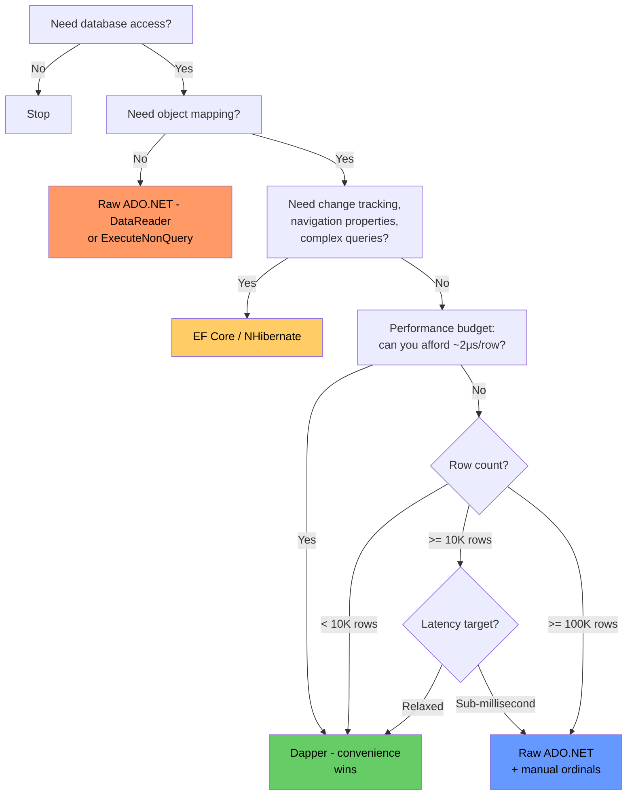

# 8.880 Dapper — vs ADO.NET Raw — When to Go Lower

## Overview

Dapper is a micro-ORM that layers on top of ADO.NET. At its core, it calls `SqlDataReader`, reads column values by name, and uses **IL Emit** to generate property-setter delegates at runtime so it can hydrate POCOs without reflection. This convenience costs roughly **2 microseconds per row** compared to raw ADO.NET with manual column-ordinal mapping.

For most applications that overhead is invisible — a 100-row result set adds 0.2 ms. But at **100 000+ rows**, in **real-time streaming pipelines**, or inside **sub-millisecond API endpoints**, the difference becomes material. This note explains exactly when and how to drop down to raw ADO.NET, and what you lose when you do.

---

## Anatomy of the Overhead

### 1. Dapper's Pipeline (per query)

| Step | Cost (approx) |
|------|---------------|
| Cache check for type + SQL key | ~0.1 μs |
| Dynamic method creation (first call only) | ~10 μs |
| Column-name-to-ordinal resolution | ~0.5 μs |
| Per-row: invoke IL-emit setter | ~1–2 μs |
| Per-row: boxing/value-type handling | ~0.5 μs |

### 2. Raw ADO.NET Pipeline (per query)

| Step | Cost (approx) |
|------|---------------|
| `SqlDataReader.Read()` | same |
| `reader.GetInt32(0)`, `reader.GetString(1)` | ~0.1 μs each |
| Manual `new T{...}` or field assign | ~0.1–0.3 μs |
| Total per row (5-column POCO) | **~0.5–1 μs** |

Dapper adds **~2× overhead per row** for the convenience of property mapping.

---

## Same Query — Dapper vs Raw ADO.NET

### Dapper (convenient)

```csharp
public class Product
{
    public int Id { get; set; }
    public string Name { get; set; }
    public decimal Price { get; set; }
    public string Category { get; set; }
    public DateTime CreatedAt { get; set; }
}

public async Task<IReadOnlyList<Product>> GetProductsDapperAsync(
    IDbConnection conn, int categoryId)
{
    const string sql = """
        SELECT Id, Name, Price, Category, CreatedAt
        FROM Products
        WHERE CategoryId = @CategoryId
        """;

    return (await conn.QueryAsync<Product>(sql, new { CategoryId = categoryId })).AsList();
}
```

### Raw ADO.NET (fast, verbose)

```csharp
public async Task<IReadOnlyList<Product>> GetProductsRawAsync(
    SqlConnection conn, int categoryId)
{
    const string sql = """
        SELECT Id, Name, Price, Category, CreatedAt
        FROM Products
        WHERE CategoryId = @CategoryId
        """;

    // Column ordinal constants — resolved once, used per row
    const int ordId = 0;
    const int ordName = 1;
    const int ordPrice = 2;
    const int ordCategory = 3;
    const int ordCreatedAt = 4;

    var results = new List<Product>(capacity: 256);

    await using var cmd = new SqlCommand(sql, conn);
    cmd.Parameters.AddWithValue("@CategoryId", categoryId);

    await using var reader = await cmd.ExecuteReaderAsync();
    while (await reader.ReadAsync())
    {
        results.Add(new Product
        {
            Id = reader.GetInt32(ordId),
            Name = reader.GetString(ordName),
            Price = reader.GetDecimal(ordPrice),
            Category = reader.GetString(ordCategory),
            CreatedAt = reader.GetDateTime(ordCreatedAt)
        });
    }

    return results;
}
```

**Difference:** 5 lines vs ~25. The raw version is error-prone (wrong ordinal → `IndexOutOfRangeException`), but it eliminates every microsecond of Dapper's abstraction.

---

## When the Overhead Matters

### 1. High-Volume Batch Processing (100 000+ rows)

```csharp
// Processing 500K rows from an ETL export — raw ADO.NET saves ~1 second
public async Task ProcessOrdersBulkAsync(SqlConnection conn, DateTime date)
{
    const string sql = "SELECT OrderId, Amount, Status FROM Orders WHERE OrderDate = @Date";

    const int ordId = 0, ordAmount = 1, ordStatus = 2;

    await using var cmd = new SqlCommand(sql, conn);
    cmd.Parameters.AddWithValue("@Date", date);
    await using var reader = await cmd.ExecuteReaderAsync();

    var buffer = new List<Order>(capacity: 10000);
    while (await reader.ReadAsync())
    {
        buffer.Add(new Order
        {
            OrderId = reader.GetInt32(ordId),
            Amount = reader.GetDecimal(ordAmount),
            Status = reader.GetString(ordStatus)
        });

        if (buffer.Count == 10000)
        {
            await BulkInsertAsync(conn, buffer);
            buffer.Clear();
        }
    }

    if (buffer.Count > 0)
        await BulkInsertAsync(conn, buffer);
}
```

**Impact:** Raw saves **~1–2 μs × 500 000 = 0.5–1 second**.

### 2. Real-Time / Streaming Data

```csharp
// WebSocket feed — every microsecond of CPU competes with network I/O
public async IAsyncEnumerable<PriceTick> StreamTicksRawAsync(
    SqlConnection conn, int instrumentId,
    [EnumeratorCancellation] CancellationToken ct)
{
    const string sql = "SELECT TickTime, Bid, Ask, Volume FROM Ticks WHERE InstrumentId = @Id";

    const int ordTime = 0, ordBid = 1, ordAsk = 2, ordVol = 3;

    await using var cmd = new SqlCommand(sql, conn);
    cmd.Parameters.AddWithValue("@Id", instrumentId);
    await using var reader = await cmd.ExecuteReaderAsync();

    while (await reader.ReadAsync(ct))
    {
        yield return new PriceTick
        {
            TickTime = reader.GetDateTime(ordTime),
            Bid = reader.GetDouble(ordBid),
            Ask = reader.GetDouble(ordAsk),
            Volume = reader.GetInt64(ordVol)
        };
    }
}
```

**Impact:** In a real-time feed processing 10 000 ticks/second, raw saves **~20 ms of CPU per second** — leaving headroom for signal processing.

### 3. Sub-Millisecond API Endpoints

```csharp
// Cache-hit path — every microsecond counts toward P99 latency
public async Task<Product?> GetCachedProductRawAsync(
    SqlConnection conn, int productId)
{
    const string sql = "SELECT Id, Name, Price, Category, CreatedAt FROM Products WHERE Id = @Id";
    const int ordId = 0, ordName = 1, ordPrice = 2, ordCategory = 3, ordCreatedAt = 4;

    await using var cmd = new SqlCommand(sql, conn);
    cmd.Parameters.AddWithValue("@Id", productId);
    await using var reader = await cmd.ExecuteReaderAsync();

    if (!await reader.ReadAsync())
        return null;

    return new Product
    {
        Id = reader.GetInt32(ordId),
        Name = reader.GetString(ordName),
        Price = reader.GetDecimal(ordPrice),
        Category = reader.GetString(ordCategory),
        CreatedAt = reader.GetDateTime(ordCreatedAt)
    };
}
```

**Impact:** Raw shaves **~2–4 μs** off a ~200 μs endpoint — 1–2 % improvement. Worth it only when every endpoint in the hot path does this.

---

## Dapper's IL Emit Cache

Dapper generates a dynamic method the **first time** it maps a given type from a given result-set shape. This first call pays a **~10 μs penalty** for `DynamicMethod` creation and IL generation.

```csharp
// First call: ~10 μs to emit + cache the mapper
var products = await conn.QueryAsync<Product>(sql, new { CategoryId = 1 });

// Subsequent calls with the same type/SQL shape: ~2 μs per row (cached)
var more = await conn.QueryAsync<Product>(sql, new { CategoryId = 2 });
```

If your application only calls each query once (e.g., short-lived console tool), the IL emit cost dominates. Raw ADO.NET has **no first-call penalty**.

```csharp
// In a warm server, the cache hits — overhead is only the per-row ~2 μs
// In a cold-start lambda or short-lived function, first-call penalty is ~10 μs
```

---

## Decision Flow



---

## Production Pattern — Raw ADO.NET DataReader

### Template with Column Ordinal Constants

```csharp
public static class OrderQueries
{
    // SQL — kept as a const alongside the ordinals
    private const string GetOrdersSql = """
        SELECT o.Id, o.CustomerName, o.OrderDate, o.TotalAmount, o.Status,
               o.ShippingAddress, o.CreatedAt
        FROM Orders o
        WHERE o.CustomerId = @CustomerId
        ORDER BY o.OrderDate DESC
        """;

    // Ordinal constants — single source of truth
    // Must match SELECT column order exactly
    private const int OrdId = 0;
    private const int OrdCustomerName = 1;
    private const int OrdOrderDate = 2;
    private const int OrdTotalAmount = 3;
    private const int OrdStatus = 4;
    private const int OrdShippingAddress = 5;
    private const int OrdCreatedAt = 6;

    public async Task<IReadOnlyList<Order>> GetByCustomerAsync(
        SqlConnection conn, int customerId)
    {
        await using var cmd = new SqlCommand(GetOrdersSql, conn);
        cmd.Parameters.AddWithValue("@CustomerId", customerId);

        await using var reader = await cmd.ExecuteReaderAsync();

        // Pre-size collection — you often know the upper bound
        var results = new List<Order>(capacity: 50);

        while (await reader.ReadAsync())
        {
            results.Add(MapOrder(reader));
        }

        return results;
    }

    // Separate mapping method — reusable, testable
    private static Order MapOrder(SqlDataReader reader)
    {
        return new Order
        {
            Id = reader.GetInt32(OrdId),
            CustomerName = reader.GetString(OrdCustomerName),
            OrderDate = reader.GetDateTime(OrdOrderDate),
            TotalAmount = reader.GetDecimal(OrdTotalAmount),
            Status = reader.GetString(OrdStatus),
            ShippingAddress = reader.IsDBNull(OrdShippingAddress)
                ? null
                : reader.GetString(OrdShippingAddress),
            CreatedAt = reader.GetDateTime(OrdCreatedAt)
        };
    }
}
```

### Handling Nulls Explicitly

Dapper handles `DBNull` → nullable automatically. Raw ADO.NET requires explicit checks:

```csharp
// Dapper
public DateTime? ShippedDate { get; set; }

// Raw ADO.NET
private static DateTime? MapShippedDate(SqlDataReader reader, int ordinal)
{
    return reader.IsDBNull(ordinal)
        ? (DateTime?)null
        : reader.GetDateTime(ordinal);
}
```

---

## Performance — Raw ADO.NET vs Dapper vs EF Core

Benchmark: Query 5-column `Product` table, materialize full list. Hardware: modern x64, SQL Server LocalDB, warm cache.

### Results (approximate, relative)

| Rows | Raw ADO.NET | Dapper | EF Core (Tracked) | EF Core (NoTracking) |
|------|-------------|--------|-------------------|----------------------|
| 10   | 0.03 ms     | 0.05 ms| 0.8 ms            | 0.4 ms |
| 100  | 0.15 ms     | 0.35 ms| 6 ms              | 3 ms   |
| 1 000| 1.2 ms      | 3.1 ms | 55 ms             | 28 ms  |
| 10 000| 11 ms      | 31 ms  | 520 ms            | 260 ms |

### Observations

- **Raw ADO.NET is ~2.5× faster than Dapper** across all row counts.
- **EF Core is 10–50× slower** than raw ADO.NET — the overhead of change tracking and expression trees dominates.
- **Dapper's advantage is convenience, not speed.** The gap is constant per row, not exponential.
- **The absolute difference only matters at scale.** At 100 rows, raw saves 0.2 ms — irrelevant for a web request.

### Micro-Benchmark Code (BenchmarkDotNet)

```csharp
[MemoryDiagnoser]
public class QueryBenchmarks
{
    private SqlConnection _conn;

    [GlobalSetup]
    public void Setup()
    {
        _conn = new SqlConnection("Server=(localdb)\\MSSQLLocalDB;Database=PerfTest;...");
        _conn.Open();
    }

    [Benchmark(Baseline = true)]
    public async Task<List<Product>> RawAdoNet()
    {
        const string sql = "SELECT Id, Name, Price, Category, CreatedAt FROM Products";
        const int ordId = 0, ordName = 1, ordPrice = 2, ordCategory = 3, ordCreatedAt = 4;

        await using var cmd = new SqlCommand(sql, _conn);
        await using var reader = await cmd.ExecuteReaderAsync();
        var list = new List<Product>();
        while (await reader.ReadAsync())
        {
            list.Add(new Product
            {
                Id = reader.GetInt32(ordId),
                Name = reader.GetString(ordName),
                Price = reader.GetDecimal(ordPrice),
                Category = reader.GetString(ordCategory),
                CreatedAt = reader.GetDateTime(ordCreatedAt)
            });
        }
        return list;
    }

    [Benchmark]
    public async Task<List<Product>> Dapper()
    {
        var list = (await _conn.QueryAsync<Product>(
            "SELECT Id, Name, Price, Category, CreatedAt FROM Products")).AsList();
        return list;
    }
}
```

---

## Gotchas — What You Lose with Raw ADO.NET

### 1. Parameterization Convenience

Dapper turns `new { Id = 5 }` into a `SqlParameter` collection automatically. Raw ADO.NET requires manual `cmd.Parameters.AddWithValue(...)` or `cmd.Parameters.Add(...)` for every parameter. This is both verbose and error-prone — mismatched `SqlDbType` or missing parameters produce runtime errors.

### 2. Type Mapping

Dapper handles implicit conversions — `int` → `long`, `string` → `char?`, `DateTime` → `DateTimeOffset`. Raw ADO.NET forces exact `Get*` calls. A `GetDecimal` on a column that SQL Server returns as `float` throws `InvalidCastException`.

**Mitigation:** Use `reader.GetFieldValue<T>(ordinal)` for generic access, though it boxes value types.

```csharp
// Generic fallback — slightly slower but more resilient
var id = reader.GetFieldValue<int>(OrdId);
```

### 3. Multi-Result Sets

Dapper's `QueryMultiple` handles multiple `SELECT` statements and advances through result grids cleanly:

```csharp
using var multi = await conn.QueryMultipleAsync(sql, new { Id });
var orders = await multi.ReadAsync<Order>();
var items = await multi.ReadAsync<OrderItem>();
```

Raw ADO.NET requires manual `reader.NextResult()` calls and careful ordinal management per result set.

### 4. Async vs Sync Consistency

Dapper provides `QueryAsync`, `QueryFirstAsync`, etc. for every pattern. Raw ADO.NET has both sync and async methods — it's easy to accidentally call the sync version and block a thread-pool thread.

### 5. Query Building / Composition

Dapper integrates with tools like `SqlBuilder` or raw string interpolation for optional filters, pagination, and includes. Raw ADO.NET forces manual string concatenation or a dedicated query builder.

### 6. Testing

Dapper accepts any `IDbConnection`, making it trivial to mock or swap to an in-memory database. Raw ADO.NET coupled to `SqlConnection`/`SqlCommand` is harder to unit test without integration tests.

---

## Hybrid Strategy — Best of Both

Don't choose one for the entire project. Use a **layered approach**:

```csharp
// 1. Dapper for 95% of queries (convenience wins)
public async Task<IReadOnlyList<Customer>> GetCustomersAsync(
    IDbConnection conn, string region)
{
    return (await conn.QueryAsync<Customer>(
        "SELECT * FROM Customers WHERE Region = @Region",
        new { Region = region })).AsList();
}

// 2. Raw ADO.NET for hot paths only
public async Task ProcessHighVolumeTradesAsync(
    SqlConnection conn, DateTime date)
{
    const string sql = """
        SELECT TradeId, Price, Volume, TradeTime, Symbol
        FROM Trades
        WHERE TradeDate = @Date
        """;

    const int ordId = 0, ordPrice = 1, ordVolume = 2,
              ordTime = 3, ordSymbol = 4;

    await using var cmd = new SqlCommand(sql, conn);
    cmd.Parameters.AddWithValue("@Date", date);
    await using var reader = await cmd.ExecuteReaderAsync();

    while (await reader.ReadAsync())
    {
        ProcessTrade(
            reader.GetInt64(ordId),
            reader.GetDecimal(ordPrice),
            reader.GetInt32(ordVolume),
            reader.GetDateTime(ordTime),
            reader.GetString(ordSymbol));
    }
}
```

**Decision rule:** Start with Dapper. Profile. If a specific query shows up in the top 5 CPU consumers and processes 10 000+ rows, rewrite that query in raw ADO.NET.

---

## When to Never Use Raw ADO.NET

| Situation | Reason |
|-----------|--------|
| Prototype / MVP | Development speed matters more than 2 μs |
| Admin / reporting pages | Low traffic, low row count |
| API with < 1 000 req/s | Dapper's overhead is lost in network latency |
| Complex result mappings | Multi-type, multi-result, or nested objects |
| Testability required | `IDbConnection` mocking is far easier |
| Team unfamiliar with ADO.NET | Risk of SQL injection, connection leaks, ordinal bugs |

---

## Summary

- **Dapper adds ~2 μs per row** over raw ADO.NET for the IL-emit property mapping.
- **Raw ADO.NET** with column-ordinal constants is the fastest way to read data in .NET — ~2.5× faster than Dapper, ~10–50× faster than EF Core.
- The difference **only matters** at 10 000+ rows, sub-millisecond endpoints, or real-time streaming.
- **Raw ADO.NET costs**: no automatic parameterization, no multi-result-set handling, fragile ordinals, harder testing.
- **Hybrid approach**: use Dapper by default, drop to raw ADO.NET for identified hot paths.
- First-call IL emit penalty (~10 μs) matters in cold-start scenarios (Functions, short-lived tools).
- Always measure before optimizing — most applications will never see the difference.

---

## Related Notes

- [[8.851 — Dapper — What It Is and When to Use]]
- [[8.852 — Dapper vs EF Core — Decision Framework]]
- [[8.873 — Dapper — Performance — IL Emit Internals]]
- [[8.879 — Dapper — Anti-Patterns and Gotchas]]
- [[8.869 — Dapper — Bulk Operations — BulkExtensions]]
