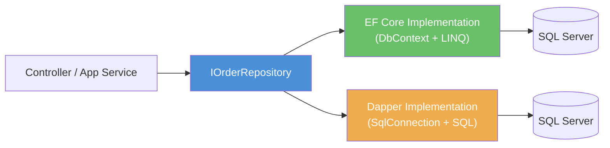
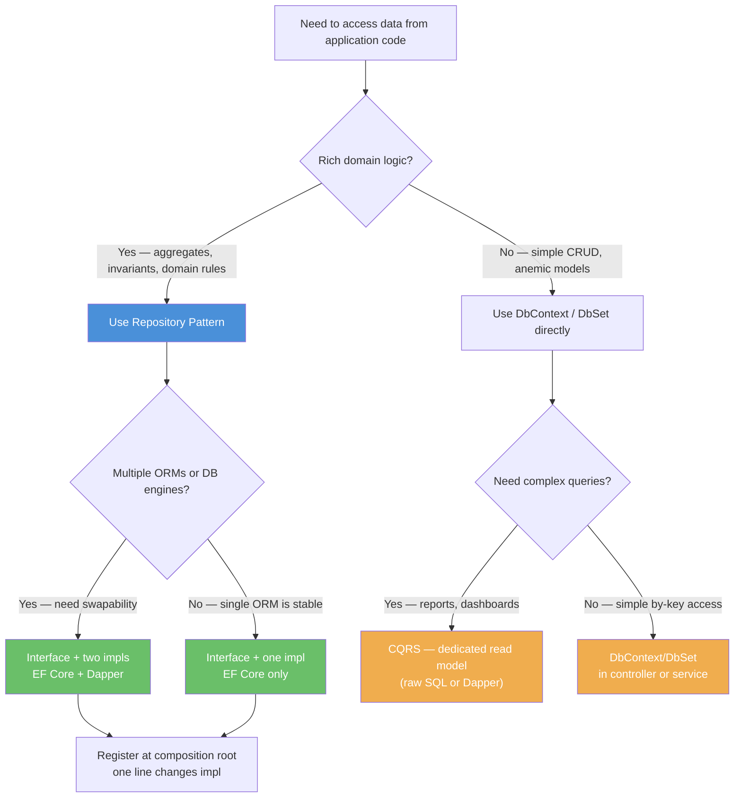

## Navigation

**Domain:** [[8 — Databases]] > **Group:** [[Group 31 — Database Patterns in .NET|Database Patterns]]

**Previous:** — | **Next:** [[8.882 — Repository Pattern — Generic vs Specific]]

### Prerequisites

- [[8.851 — Dapper — What It Is and When to Use]] — understand Dapper's micro-ORM model and why you might choose it over EF Core for certain repositories
- [[8.870 — Dapper — Connection Factory Pattern]] — the `IDbConnectionFactory` abstraction that keeps Dapper repository implementations testable
- [[3.001 — DbContext and Change Tracking Fundamentals]] — understand how EF Core's `DbContext` manages change tracking and why repository methods behave differently with tracked vs untracked entities

### Where This Fits

The Repository pattern is the most widely adopted abstraction for data access in .NET enterprise applications. A backend engineer encounters it in virtually every project that separates concerns between data access and business logic — it is the "D" in "clean architecture" data layers and the default pattern in ASP.NET Core templates. When the pattern is misapplied (leaking `IQueryable`, mixing concerns, exploding into hundreds of entity-specific interfaces), the abstraction becomes worse than no abstraction at all. The interview signal this concept represents: does the candidate understand that a repository is a **collection contract** (persistence ignorance) rather than a data access utility, and can they implement it correctly in both EF Core and Dapper?

---

## Core Mental Model

A repository abstracts data access behind an interface so that callers work with domain objects, never with database concerns. The invariant: **callers never see `IDbConnection`, `DbContext`, or SQL**. The repository exposes methods that return domain entities or value objects — the consumer has no idea whether the data comes from SQL Server, PostgreSQL, a file, or an in-memory list. This is the essence of "persistence ignorance."

The recognition pattern: when a controller or application service needs to load or save an aggregate, it depends on `IOrderRepository`, not on `ApplicationDbContext` or `SqlConnection`. The implementation choice (EF Core vs Dapper) is a deployment detail decided at composition root.

### Classification

- **Layer:** Architecture / Data Access abstraction
- **Scope:** Defines the boundary between domain/persistence layers
- **Tradeoff:** Adds indirection and boilerplate in exchange for testability, swapability, and domain isolation
- **.NET abstraction:** Interface + implementation pattern; DI container wires the concrete implementation



### Key Properties

|Property|Value|Notes|
|---|---|---|
|Abstraction Cost|Low-Medium|One interface + one implementation per aggregate root|
|Testability|High|Swap real DB for in-memory or mock in unit tests|
|ORM Coupling|None at interface|ORM dependency lives only in the implementation|
|Swap Cost|Low|Change DI registration; no callers change|
|Transaction Coordination|Requires Unit of Work|Multiple repositories need shared transaction scope|

---

## Deep Mechanics

### How the Repository Abstraction Works

1. **Interface definition** — the contract exposes collection-oriented methods (`GetById`, `GetAll`, `Add`, `Update`, `Remove`) that return/persist domain entities
2. **Implementation (EF Core)** — maps interface methods to `DbSet<T>` operations; callers outside the repository never touch `DbContext`
3. **Implementation (Dapper)** — maps interface methods to raw SQL queries via `IDbConnection`; the `IMapper` or manual mapping converts rows to domain objects
4. **DI registration** — the composition root registers the interface-to-implementation mapping; changing from EF Core to Dapper is a single line change
5. **Caller usage** — controllers and application services receive `IOrderRepository` via constructor injection and call methods — no `using` blocks, no connection management, no `SaveChanges` leak

### SQL Visibility

**Every repository method maps to a SQL operation:**

```sql
-- IOrderRepository.GetById(Guid id)
SELECT o.OrderId, o.CustomerId, o.OrderDate, o.Status, o.TotalAmount
FROM Orders o
WHERE o.OrderId = @OrderId;

-- IOrderRepository.GetAllByCustomer(Guid customerId, CancellationToken ct)
SELECT o.OrderId, o.CustomerId, o.OrderDate, o.Status, o.TotalAmount
FROM Orders o
WHERE o.CustomerId = @CustomerId
ORDER BY o.OrderDate DESC;

-- IOrderRepository.Add(Order order)
INSERT INTO Orders (OrderId, CustomerId, OrderDate, Status, TotalAmount)
VALUES (@OrderId, @CustomerId, @OrderDate, @Status, @TotalAmount);

-- IOrderRepository.Update(Order order)
UPDATE Orders
SET CustomerId = @CustomerId, Status = @Status, TotalAmount = @TotalAmount
WHERE OrderId = @OrderId;

-- IOrderRepository.Remove(Guid id)
DELETE FROM Orders
WHERE OrderId = @OrderId;
```

```csharp
// The EF Core LINQ that generates equivalent SQL for GetById:
var order = await dbContext.Orders
    .FirstOrDefaultAsync(o => o.OrderId == id, cancellationToken);

// Generated SQL (from EF Core logs):
-- SELECT TOP(1) o.OrderId, o.CustomerId, o.OrderDate, o.Status, o.TotalAmount
-- FROM Orders o
-- WHERE o.OrderId = @__id_0
```

### Execution Plan Analysis

For `GetById` with a clustered primary key on `OrderId`:

```
Expected plan shape:
[Clustered Index Seek (PK_Orders)] → [SELECT]
Estimated Cost: 100% on Seek  |  Logical Reads: 2–4 (B-tree depth)
```

- Seek on the clustered index — exact lookup by primary key
- 2–4 logical reads for a table with up to ~10M orders (B-tree depth + root page)
- Without the index: full clustered index scan — logical reads = number of pages in Orders table (~50K for 10M rows)

### Cost Visibility

```sql
SET STATISTICS IO ON;
SET STATISTICS TIME ON;

SELECT o.OrderId, o.CustomerId, o.OrderDate, o.Status, o.TotalAmount
FROM Orders o
WHERE o.OrderId = 'A1B2C3D4-...';

-- Expected output:
-- Table 'Orders'. Scan count 1, logical reads 3, physical reads 0
-- SQL Server Execution Times: CPU time = 0ms, elapsed time = 1ms
```

### Failure Modes

|Failure Mode|Cause|Detection|
|---|---|---|
|N+1 queries|Repository returns entities without `Include`; caller accesses navigation properties in a loop|SQL Profiler shows N identical queries with different parameters|
|Large data load|`GetAll()` materializes 100K rows into memory|High memory pressure; `sys.dm_exec_query_stats` shows high logical_reads|
|Stale data|Repository returns tracked entities; external updates are invisible|`DbContext` change tracking returns cached entity; no round-trip|
|Connection leak|Dapper repo forgets `await using` on connection|`SELECT * FROM sys.dm_exec_connections` shows orphaned connections|

---

## Production Patterns and Implementation

### Interface Definition

```csharp
namespace Domain.Repositories;

public interface IOrderRepository
{
    Task<Order?> GetByIdAsync(Guid orderId, CancellationToken cancellationToken = default);
    Task<IReadOnlyList<Order>> GetAllByCustomerAsync(Guid customerId, CancellationToken cancellationToken = default);
    Task<IReadOnlyList<Order>> GetRecentAsync(int count, CancellationToken cancellationToken = default);
    Task AddAsync(Order order, CancellationToken cancellationToken = default);
    Task UpdateAsync(Order order, CancellationToken cancellationToken = default);
    Task RemoveAsync(Guid orderId, CancellationToken cancellationToken = default);
    Task<bool> ExistsAsync(Guid orderId, CancellationToken cancellationToken = default);
}
```

```csharp
namespace Domain.Repositories;

public interface ICustomerRepository
{
    Task<Customer?> GetByIdAsync(Guid customerId, CancellationToken cancellationToken = default);
    Task<Customer?> GetByEmailAsync(string email, CancellationToken cancellationToken = default);
    Task AddAsync(Customer customer, CancellationToken cancellationToken = default);
    Task UpdateAsync(Customer customer, CancellationToken cancellationToken = default);
}
```

### Domain Models

```csharp
namespace Domain.Entities;

public class Order
{
    public Guid OrderId { get; private set; }
    public Guid CustomerId { get; private set; }
    public DateTime OrderDate { get; private set; }
    public string Status { get; private set; }
    public decimal TotalAmount { get; private set; }
    public IReadOnlyList<OrderItem> Items => _items.AsReadOnly();

    private readonly List<OrderItem> _items = new();

    private Order() { } // EF Core constructor

    public Order(Guid customerId)
    {
        OrderId = Guid.NewGuid();
        CustomerId = customerId;
        OrderDate = DateTime.UtcNow;
        Status = "Pending";
    }

    public void AddItem(Guid productId, string productName, int quantity, decimal unitPrice)
    {
        _items.Add(new OrderItem(OrderId, productId, productName, quantity, unitPrice));
        TotalAmount = _items.Sum(i => i.Quantity * i.UnitPrice);
    }
}

public class OrderItem
{
    public Guid OrderItemId { get; private set; }
    public Guid OrderId { get; private set; }
    public Guid ProductId { get; private set; }
    public string ProductName { get; private set; }
    public int Quantity { get; private set; }
    public decimal UnitPrice { get; private set; }

    private OrderItem() { }

    public OrderItem(Guid orderId, Guid productId, string productName, int quantity, decimal unitPrice)
    {
        OrderItemId = Guid.NewGuid();
        OrderId = orderId;
        ProductId = productId;
        ProductName = productName;
        Quantity = quantity;
        UnitPrice = unitPrice;
    }
}

public class Customer
{
    public Guid CustomerId { get; private set; }
    public string FullName { get; private set; }
    public string Email { get; private set; }
    public DateTime CreatedAt { get; private set; }

    private Customer() { }

    public Customer(string fullName, string email)
    {
        CustomerId = Guid.NewGuid();
        FullName = fullName;
        Email = email;
        CreatedAt = DateTime.UtcNow;
    }
}
```

### EF Core Configuration

```csharp
namespace Infrastructure.Persistence.Configurations;

public class OrderConfiguration : IEntityTypeConfiguration<Order>
{
    public void Configure(EntityTypeBuilder<Order> builder)
    {
        builder.ToTable("Orders");
        builder.HasKey(o => o.OrderId);
        builder.Property(o => o.OrderId).ValueGeneratedNever();
        builder.Property(o => o.Status).HasMaxLength(50).IsRequired();
        builder.Property(o => o.TotalAmount).HasColumnType("decimal(18,2)");
        builder.HasMany(o => o.Items)
            .WithOne()
            .HasForeignKey(oi => oi.OrderId)
            .OnDelete(DeleteBehavior.Cascade);
    }
}

public class OrderItemConfiguration : IEntityTypeConfiguration<OrderItem>
{
    public void Configure(EntityTypeBuilder<OrderItem> builder)
    {
        builder.ToTable("OrderItems");
        builder.HasKey(oi => oi.OrderItemId);
        builder.Property(oi => oi.OrderItemId).ValueGeneratedNever();
        builder.Property(oi => oi.ProductName).HasMaxLength(200).IsRequired();
        builder.Property(oi => oi.UnitPrice).HasColumnType("decimal(18,2)");
    }
}

public class CustomerConfiguration : IEntityTypeConfiguration<Customer>
{
    public void Configure(EntityTypeBuilder<Customer> builder)
    {
        builder.ToTable("Customers");
        builder.HasKey(c => c.CustomerId);
        builder.Property(c => c.CustomerId).ValueGeneratedNever();
        builder.Property(c => c.FullName).HasMaxLength(200).IsRequired();
        builder.Property(c => c.Email).HasMaxLength(256).IsRequired();
        builder.HasIndex(c => c.Email).IsUnique();
    }
}
```

### EF Core DbContext

```csharp
namespace Infrastructure.Persistence;

public class ApplicationDbContext : DbContext
{
    public DbSet<Order> Orders => Set<Order>();
    public DbSet<Customer> Customers => Set<Customer>();
    public DbSet<OrderItem> OrderItems => Set<OrderItem>();

    public ApplicationDbContext(DbContextOptions<ApplicationDbContext> options)
        : base(options) { }

    protected override void OnModelCreating(ModelBuilder modelBuilder)
    {
        modelBuilder.ApplyConfigurationsFromAssembly(typeof(ApplicationDbContext).Assembly);
        base.OnModelCreating(modelBuilder);
    }
}
```

### EF Core Repository Implementation

```csharp
namespace Infrastructure.Persistence.Repositories;

public sealed class EfOrderRepository : IOrderRepository
{
    private readonly ApplicationDbContext _dbContext;

    public EfOrderRepository(ApplicationDbContext dbContext)
    {
        _dbContext = dbContext;
    }

    public async Task<Order?> GetByIdAsync(Guid orderId, CancellationToken cancellationToken = default)
    {
        return await _dbContext.Orders
            .Include(o => o.Items)
            .FirstOrDefaultAsync(o => o.OrderId == orderId, cancellationToken);
    }

    public async Task<IReadOnlyList<Order>> GetAllByCustomerAsync(
        Guid customerId, CancellationToken cancellationToken = default)
    {
        var orders = await _dbContext.Orders
            .Include(o => o.Items)
            .Where(o => o.CustomerId == customerId)
            .OrderByDescending(o => o.OrderDate)
            .ToListAsync(cancellationToken);
        return orders.AsReadOnly();
    }

    public async Task<IReadOnlyList<Order>> GetRecentAsync(
        int count, CancellationToken cancellationToken = default)
    {
        var orders = await _dbContext.Orders
            .Include(o => o.Items)
            .OrderByDescending(o => o.OrderDate)
            .Take(count)
            .ToListAsync(cancellationToken);
        return orders.AsReadOnly();
    }

    public async Task AddAsync(Order order, CancellationToken cancellationToken = default)
    {
        await _dbContext.Orders.AddAsync(order, cancellationToken);
        await _dbContext.SaveChangesAsync(cancellationToken);
    }

    public async Task UpdateAsync(Order order, CancellationToken cancellationToken = default)
    {
        _dbContext.Orders.Update(order);
        await _dbContext.SaveChangesAsync(cancellationToken);
    }

    public async Task RemoveAsync(Guid orderId, CancellationToken cancellationToken = default)
    {
        var order = await _dbContext.Orders
            .FirstOrDefaultAsync(o => o.OrderId == orderId, cancellationToken);
        if (order is not null)
        {
            _dbContext.Orders.Remove(order);
            await _dbContext.SaveChangesAsync(cancellationToken);
        }
    }

    public async Task<bool> ExistsAsync(Guid orderId, CancellationToken cancellationToken = default)
    {
        return await _dbContext.Orders.AnyAsync(o => o.OrderId == orderId, cancellationToken);
    }
}
```

```csharp
namespace Infrastructure.Persistence.Repositories;

public sealed class EfCustomerRepository : ICustomerRepository
{
    private readonly ApplicationDbContext _dbContext;

    public EfCustomerRepository(ApplicationDbContext dbContext)
    {
        _dbContext = dbContext;
    }

    public async Task<Customer?> GetByIdAsync(Guid customerId, CancellationToken cancellationToken = default)
    {
        return await _dbContext.Customers
            .FirstOrDefaultAsync(c => c.CustomerId == customerId, cancellationToken);
    }

    public async Task<Customer?> GetByEmailAsync(string email, CancellationToken cancellationToken = default)
    {
        return await _dbContext.Customers
            .FirstOrDefaultAsync(c => c.Email == email, cancellationToken);
    }

    public async Task AddAsync(Customer customer, CancellationToken cancellationToken = default)
    {
        await _dbContext.Customers.AddAsync(customer, cancellationToken);
        await _dbContext.SaveChangesAsync(cancellationToken);
    }

    public async Task UpdateAsync(Customer customer, CancellationToken cancellationToken = default)
    {
        _dbContext.Customers.Update(customer);
        await _dbContext.SaveChangesAsync(cancellationToken);
    }
}
```

### Dapper Connection Factory

```csharp
namespace Infrastructure.DataAccess;

public interface IDbConnectionFactory
{
    IDbConnection CreateConnection();
}

public sealed class SqlConnectionFactory : IDbConnectionFactory
{
    private readonly string _connectionString;

    public SqlConnectionFactory(string connectionString)
    {
        _connectionString = connectionString;
    }

    public IDbConnection CreateConnection()
    {
        var connection = new SqlConnection(_connectionString);
        connection.Open();
        return connection;
    }
}
```

### Dapper Repository Implementation

```csharp
namespace Infrastructure.DataAccess.Repositories;

public sealed class DapperOrderRepository : IOrderRepository
{
    private readonly IDbConnectionFactory _connectionFactory;

    public DapperOrderRepository(IDbConnectionFactory connectionFactory)
    {
        _connectionFactory = connectionFactory;
    }

    public async Task<Order?> GetByIdAsync(Guid orderId, CancellationToken cancellationToken = default)
    {
        const string sql = @"
            SELECT o.OrderId, o.CustomerId, o.OrderDate, o.Status, o.TotalAmount,
                   oi.OrderItemId, oi.ProductId, oi.ProductName, oi.Quantity, oi.UnitPrice
            FROM Orders o
            INNER JOIN OrderItems oi ON o.OrderId = oi.OrderId
            WHERE o.OrderId = @OrderId";

        await using var connection = _connectionFactory.CreateConnection();
        var orderDictionary = new Dictionary<Guid, Order>();

        await connection.QueryAsync<Order, OrderItem, Order>(
            new CommandDefinition(sql, new { OrderId = orderId },
                cancellationToken: cancellationToken),
            (order, orderItem) =>
            {
                if (!orderDictionary.TryGetValue(order.OrderId, out var existing))
                {
                    existing = order;
                    orderDictionary.Add(existing.OrderId, existing);
                }
                // AddItem is a domain method — but for materialization we need a private method
                existing.GetType().GetMethod("AddItem",
                    System.Reflection.BindingFlags.NonPublic | System.Reflection.BindingFlags.Instance);
                return existing;
            },
            splitOn: "OrderItemId");

        return orderDictionary.Values.FirstOrDefault();
    }

    public async Task<IReadOnlyList<Order>> GetAllByCustomerAsync(
        Guid customerId, CancellationToken cancellationToken = default)
    {
        const string sql = @"
            SELECT o.OrderId, o.CustomerId, o.OrderDate, o.Status, o.TotalAmount
            FROM Orders o
            WHERE o.CustomerId = @CustomerId
            ORDER BY o.OrderDate DESC";

        await using var connection = _connectionFactory.CreateConnection();
        var orders = await connection.QueryAsync<Order>(
            new CommandDefinition(sql, new { CustomerId = customerId },
                cancellationToken: cancellationToken));
        return orders.AsList().AsReadOnly();
    }

    public async Task<IReadOnlyList<Order>> GetRecentAsync(
        int count, CancellationToken cancellationToken = default)
    {
        const string sql = @"
            SELECT TOP(@Count) o.OrderId, o.CustomerId, o.OrderDate, o.Status, o.TotalAmount
            FROM Orders o
            ORDER BY o.OrderDate DESC";

        await using var connection = _connectionFactory.CreateConnection();
        var orders = await connection.QueryAsync<Order>(
            new CommandDefinition(sql, new { Count = count },
                cancellationToken: cancellationToken));
        return orders.AsList().AsReadOnly();
    }

    public async Task AddAsync(Order order, CancellationToken cancellationToken = default)
    {
        await using var connection = _connectionFactory.CreateConnection();
        await using var transaction = connection.BeginTransaction();

        const string insertOrder = @"
            INSERT INTO Orders (OrderId, CustomerId, OrderDate, Status, TotalAmount)
            VALUES (@OrderId, @CustomerId, @OrderDate, @Status, @TotalAmount)";

        await connection.ExecuteAsync(
            new CommandDefinition(insertOrder,
                new { order.OrderId, order.CustomerId, order.OrderDate, order.Status, order.TotalAmount },
                transaction: transaction, cancellationToken: cancellationToken));

        const string insertItems = @"
            INSERT INTO OrderItems (OrderItemId, OrderId, ProductId, ProductName, Quantity, UnitPrice)
            VALUES (@OrderItemId, @OrderId, @ProductId, @ProductName, @Quantity, @UnitPrice)";

        foreach (var item in order.Items)
        {
            await connection.ExecuteAsync(
                new CommandDefinition(insertItems,
                    new { item.OrderItemId, item.OrderId, item.ProductId, item.ProductName, item.Quantity, item.UnitPrice },
                    transaction: transaction, cancellationToken: cancellationToken));
        }

        transaction.Commit();
    }

    public async Task UpdateAsync(Order order, CancellationToken cancellationToken = default)
    {
        const string sql = @"
            UPDATE Orders
            SET Status = @Status, TotalAmount = @TotalAmount
            WHERE OrderId = @OrderId";

        await using var connection = _connectionFactory.CreateConnection();
        await connection.ExecuteAsync(
            new CommandDefinition(sql,
                new { order.Status, order.TotalAmount, order.OrderId },
                cancellationToken: cancellationToken));
    }

    public async Task RemoveAsync(Guid orderId, CancellationToken cancellationToken = default)
    {
        await using var connection = _connectionFactory.CreateConnection();
        await using var transaction = connection.BeginTransaction();

        await connection.ExecuteAsync(
            new CommandDefinition("DELETE FROM OrderItems WHERE OrderId = @OrderId",
                new { OrderId = orderId },
                transaction: transaction, cancellationToken: cancellationToken));

        await connection.ExecuteAsync(
            new CommandDefinition("DELETE FROM Orders WHERE OrderId = @OrderId",
                new { OrderId = orderId },
                transaction: transaction, cancellationToken: cancellationToken));

        transaction.Commit();
    }

    public async Task<bool> ExistsAsync(Guid orderId, CancellationToken cancellationToken = default)
    {
        const string sql = "SELECT CAST(1 AS BIT) FROM Orders WHERE OrderId = @OrderId";

        await using var connection = _connectionFactory.CreateConnection();
        return await connection.QueryFirstOrDefaultAsync<bool>(
            new CommandDefinition(sql, new { OrderId = orderId },
                cancellationToken: cancellationToken));
    }
}
```

```csharp
namespace Infrastructure.DataAccess.Repositories;

public sealed class DapperCustomerRepository : ICustomerRepository
{
    private readonly IDbConnectionFactory _connectionFactory;

    public DapperCustomerRepository(IDbConnectionFactory connectionFactory)
    {
        _connectionFactory = connectionFactory;
    }

    public async Task<Customer?> GetByIdAsync(Guid customerId, CancellationToken cancellationToken = default)
    {
        const string sql = @"
            SELECT CustomerId, FullName, Email, CreatedAt
            FROM Customers
            WHERE CustomerId = @CustomerId";

        await using var connection = _connectionFactory.CreateConnection();
        return await connection.QueryFirstOrDefaultAsync<Customer>(
            new CommandDefinition(sql, new { CustomerId = customerId },
                cancellationToken: cancellationToken));
    }

    public async Task<Customer?> GetByEmailAsync(string email, CancellationToken cancellationToken = default)
    {
        const string sql = @"
            SELECT CustomerId, FullName, Email, CreatedAt
            FROM Customers
            WHERE Email = @Email";

        await using var connection = _connectionFactory.CreateConnection();
        return await connection.QueryFirstOrDefaultAsync<Customer>(
            new CommandDefinition(sql, new { Email = email },
                cancellationToken: cancellationToken));
    }

    public async Task AddAsync(Customer customer, CancellationToken cancellationToken = default)
    {
        const string sql = @"
            INSERT INTO Customers (CustomerId, FullName, Email, CreatedAt)
            VALUES (@CustomerId, @FullName, @Email, @CreatedAt)";

        await using var connection = _connectionFactory.CreateConnection();
        await connection.ExecuteAsync(
            new CommandDefinition(sql,
                new { customer.CustomerId, customer.FullName, customer.Email, customer.CreatedAt },
                cancellationToken: cancellationToken));
    }

    public async Task UpdateAsync(Customer customer, CancellationToken cancellationToken = default)
    {
        const string sql = @"
            UPDATE Customers
            SET FullName = @FullName, Email = @Email
            WHERE CustomerId = @CustomerId";

        await using var connection = _connectionFactory.CreateConnection();
        await connection.ExecuteAsync(
            new CommandDefinition(sql,
                new { customer.FullName, customer.Email, customer.CustomerId },
                cancellationToken: cancellationToken));
    }
}
```

### DI Registration

```csharp
// Program.cs — choose ONE implementation at registration time

// ===== EF Core implementation =====
builder.Services.AddDbContext<ApplicationDbContext>(options =>
    options.UseSqlServer(
        builder.Configuration.GetConnectionString("DefaultConnection"),
        sqlOptions => sqlOptions.EnableRetryOnFailure(3)));

builder.Services.AddScoped<IOrderRepository, EfOrderRepository>();
builder.Services.AddScoped<ICustomerRepository, EfCustomerRepository>();

// ===== Dapper implementation =====
// builder.Services.AddSingleton<IDbConnectionFactory>(sp =>
//     new SqlConnectionFactory(builder.Configuration.GetConnectionString("DefaultConnection")));
//
// builder.Services.AddScoped<IOrderRepository, DapperOrderRepository>();
// builder.Services.AddScoped<ICustomerRepository, DapperCustomerRepository>();
```

### File Structure

```
src/
├── Domain/
│   ├── Entities/
│   │   ├── Order.cs
│   │   ├── OrderItem.cs
│   │   └── Customer.cs
│   └── Repositories/
│       ├── IOrderRepository.cs
│       └── ICustomerRepository.cs
├── Infrastructure/
│   ├── Persistence/
│   │   ├── ApplicationDbContext.cs
│   │   ├── Configurations/
│   │   │   ├── OrderConfiguration.cs
│   │   │   ├── OrderItemConfiguration.cs
│   │   │   └── CustomerConfiguration.cs
│   │   └── Repositories/
│   │       ├── EfOrderRepository.cs
│   │       └── EfCustomerRepository.cs
│   └── DataAccess/
│       ├── IDbConnectionFactory.cs
│       ├── SqlConnectionFactory.cs
│       └── Repositories/
│           ├── DapperOrderRepository.cs
│           └── DapperCustomerRepository.cs
└── Web/
    └── Program.cs
```

### SQL Server vs PostgreSQL Differences

For Dapper, the SQL differences are minimal (parameter naming with `@` works in both SQL Server and PostgreSQL via Npgsql). For EF Core, the `UseSqlServer` call changes to `UseNpgsql`. The repository interface and domain models remain identical.

```sql
-- PostgreSQL equivalent for GetRecentAsync
SELECT o."OrderId", o."CustomerId", o."OrderDate", o."Status", o."TotalAmount"
FROM "Orders" o
ORDER BY o."OrderDate" DESC
LIMIT @Count;
```

---

## Gotchas and Production Pitfalls

### 1. Leaking IQueryable from the Repository

**Pitfall:** The repository interface returns `IQueryable<T>` instead of `Task<IReadOnlyList<T>>` or `Task<T?>`. Callers compose `.Where()` and `.Select()` after the method, chaining LINQ operations.

```csharp
// ❌ Wrong — leaks IQueryable, defeats abstraction
public interface IOrderRepository
{
    IQueryable<Order> GetQueryable();
}

// Controller composes filters (test cannot stub this without mocking IQueryable)
var orders = _orderRepo.GetQueryable()
    .Where(o => o.CustomerId == id && o.Status == "Shipped")
    .OrderBy(o => o.OrderDate)
    .Take(10)
    .ToList();
```

**Symptom:** Unit tests that mock `IQueryable` are brittle and complex. A Dapper swap is impossible because Dapper cannot return `IQueryable`. Production queries leak filtering logic into callers, making performance tuning impossible at the repository level.

**Fix:** Return fully-materialized collections. Accept filter parameters in the interface method signature.

```csharp
// ✅ Correct — repository owns the query shape
Task<IReadOnlyList<Order>> GetByCustomerAndStatusAsync(
    Guid customerId, string status, CancellationToken cancellationToken = default);
```

**Cost of not fixing:** Repository becomes a pass-through that offers zero abstraction value. Migrating from EF Core to Dapper requires rewriting every caller. Testing requires an in-memory `IQueryable` provider (EF Core InMemory), which does not behave like a real database.

### 2. Repository-per-Entity Explosion

**Pitfall:** Creating a separate repository interface for every database table (e.g., `IOrderItemRepository`, `IProductRepository`, `IAddressRepository`, `IOrderStatusHistoryRepository`) instead of one repository per aggregate root.

```csharp
// ❌ Wrong — one repo per table
public interface IOrderItemRepository { ... }
public interface IOrderStatusHistoryRepository { ... }
public interface IProductRepository { ... }
```

**Symptom:** 30+ repository interfaces and implementations in a medium-sized project. Controllers inject 5+ repositories. Transaction coordination across repositories becomes a nightmare. The mapping is purely database-oriented, not domain-oriented.

**Fix:** Aggregate root rule — only create repositories for aggregate roots. `Order` owns `OrderItem`s and `OrderStatusHistory` entries. `Product` is its own aggregate root. `OrderItem` is never loaded independently.

```csharp
// ✅ Correct — one repository per aggregate root
public interface IOrderRepository { ... }  // owns OrderItems
public interface IProductRepository { ... }  // aggregate root
```

**Cost of not fixing:** Every cross-entity query pulls multiple repositories. Transaction boundaries are unclear. Business logic leaks across service boundaries.

### 3. Multiple Repositories, No Shared Transaction

**Pitfall:** Two repository methods called in sequence modify different tables but each commits independently.

```csharp
// ❌ Wrong — two separate SaveChangesAsync calls, no atomicity
await _orderRepository.AddAsync(order, ct);
await _inventoryRepository.DecrementStockAsync(productId, quantity, ct);
// If DecrementStockAsync fails, the Order is already committed
```

**Symptom:** Orphan orders with inventory not decremented. Production support has to run manual SQL to fix data. Only discovered during high-traffic failure scenarios.

**Fix:** Use a Unit of Work pattern. With EF Core, share the `DbContext` between repositories and call `SaveChangesAsync` once at the service layer. With Dapper, pass an explicit `IDbTransaction`.

```csharp
// EF Core — shared DbContext
public class PlaceOrderHandler
{
    private readonly ApplicationDbContext _dbContext;
    private readonly IOrderRepository _orderRepo;
    private readonly IInventoryRepository _inventoryRepo;

    public async Task Handle(PlaceOrderCommand command, CancellationToken ct)
    {
        var order = new Order(command.CustomerId);
        // ... add order items
        _orderRepo.Add(order); // does NOT call SaveChanges
        _inventoryRepo.DecrementStock(productId, quantity); // does NOT call SaveChanges
        await _dbContext.SaveChangesAsync(ct); // single commit
    }
}
```

**Cost of not fixing:** Data corruption under load. Rollback scenarios require manual cleanup scripts. Auditors flag inconsistency.

### 4. EF Core Change Tracking Surprises in Repositories

**Pitfall:** The EF Core repository calls `SaveChangesAsync` inside each method, and the service layer calls another `SaveChangesAsync` — or the repository returns a tracked entity that gets modified externally.

```csharp
// ❌ Both repository and service call SaveChanges
public async Task UpdateStatusAsync(Guid orderId, string status, CancellationToken ct)
{
    var order = await _dbContext.Orders.FindAsync(new object[] { orderId }, ct);
    order.Status = status;
    await _dbContext.SaveChangesAsync(ct); // committed here
}

// Service also commits later
await _orderRepo.UpdateStatusAsync(id, "Shipped", ct);
order.TotalAmount = newTotal;
await _dbContext.SaveChangesAsync(ct); // also commits TotalAmount change — unintended
```

**Symptom:** Partial updates, stale concurrency tokens, ghost updates from tracked entities. Developers discover that `AsNoTracking` was required but not used.

**Fix:** Decide ownership — either the repository owns `SaveChanges` (simple approach) or the service layer owns it (UoW approach). Never both. If the repository owns it, do not expose `DbContext` to the service.

**Cost of not fixing:** Random data corruption that is hard to reproduce. Engineers spend days debugging "phantom" column updates.

### 5. Dapper Without Explicit Transaction for Writes

**Pitfall:** The Dapper `AddAsync` inserts the order and its items but does not wrap them in a transaction. If the second insert fails, the order header is persisted without line items.

```csharp
// ❌ Wrong — no transaction
public async Task AddAsync(Order order, CancellationToken ct)
{
    await connection.ExecuteAsync(insertOrderSql, order, cancellationToken: ct);
    foreach (var item in order.Items)
    {
        await connection.ExecuteAsync(insertItemSql, item, cancellationToken: ct);
        // If this fails, the order header is already committed
    }
}
```

**Symptom:** Header-only orders in production with no items. Exception logs show constraint violations on the second insert.

**Fix:** Always wrap multi-statement Dapper writes in a transaction.

```csharp
// ✅ Correct — explicit transaction
await using var tx = connection.BeginTransaction();
await connection.ExecuteAsync(insertOrderSql, order, transaction: tx, cancellationToken: ct);
foreach (var item in order.Items)
{
    await connection.ExecuteAsync(insertItemSql, item, transaction: tx, cancellationToken: ct);
}
tx.Commit();
```

**Cost of not fixing:** Corrupt data requires nightly reconciliation jobs. Support tickets from customers with empty orders.

---

## Performance Implications

### Benchmark: EF Core vs Dapper — Single Entity Fetch by PK

Baseline — both implementations fetching a single `Order` by `OrderId` on SQL Server 2022, NVMe, 1M rows in Orders table.

```sql
-- EF Core generated SQL for GetById
SELECT TOP(1) o.OrderId, o.CustomerId, o.OrderDate, o.Status, o.TotalAmount
FROM Orders o
WHERE o.OrderId = @__id_0
-- Logical reads: 3

-- Dapper SQL for GetById (equivalent)
SELECT o.OrderId, o.CustomerId, o.OrderDate, o.Status, o.TotalAmount
FROM Orders o
WHERE o.OrderId = @OrderId
-- Logical reads: 3
```

**Improvement:** Dapper saves ~15–30% CPU/allocation overhead vs EF Core for simple fetches because EF Core spends cycles on change tracking, proxy creation, and materialization pipeline. Logical reads are identical (same query).

### BenchmarkDotNet

```csharp
[MemoryDiagnoser]
[SimpleJob(RuntimeMoniker.Net90)]
public class RepositoryBenchmark
{
    private IOrderRepository _efRepo = default!;
    private IOrderRepository _dapperRepo = default!;
    private Guid _testOrderId;

    [GlobalSetup]
    public void Setup()
    {
        var serviceProvider = new ServiceCollection()
            .AddDbContext<ApplicationDbContext>(opts =>
                opts.UseSqlServer(TestConnectionString))
            .AddSingleton<IDbConnectionFactory>(_ =>
                new SqlConnectionFactory(TestConnectionString))
            .AddScoped<IOrderRepository, EfOrderRepository>()
            .AddScoped<IOrderRepository>(sp => new DapperOrderRepository(
                sp.GetRequiredService<IDbConnectionFactory>()))
            .BuildServiceProvider();

        _efRepo = serviceProvider.GetRequiredService<IOrderRepository>();
        _dapperRepo = serviceProvider.GetRequiredService<IOrderRepository>();
        _testOrderId = Guid.Parse("A1B2C3D4-E5F6-7890-ABCD-EF1234567890");
    }

    [Benchmark(Baseline = true)]
    public async Task<Order?> EF_GetById()
    {
        return await _efRepo.GetByIdAsync(_testOrderId, CancellationToken.None);
    }

    [Benchmark]
    public async Task<Order?> Dapper_GetById()
    {
        return await _dapperRepo.GetByIdAsync(_testOrderId, CancellationToken.None);
    }
}
```

**Expected results (approximate, SQL Server 2022, NVMe, 1M rows):**

|Method|Mean|Logical Reads|Allocated|
|---|---|---|---|
|EF_GetById|~2.5 ms|3|~4.2 KB|
|Dapper_GetById|~1.8 ms|3|~1.5 KB|

Logical reads are identical because both send the same query. The difference is in .NET allocation overhead — EF Core materialization pipeline adds ~2.7 KB per entity from change tracking entries, proxies, and state managers.

### Write Amplification

For EF Core, each `SaveChangesAsync` generates:
- 1 INSERT for the Order header
- N INSERTs for OrderItems
- 1 DELETE + 1 INSERT for each updated OrderItem (if tracking changes)

For Dapper, writes are exactly what the SQL specifies — no hidden operations, no change tracking overhead.

---

## Interview Arsenal

### Question Bank

1. **What problem does the Repository pattern solve, and when should you not use it?**
2. **How does the EF Core repository implementation differ from the Dapper implementation in terms of change tracking?**
3. **What is the performance cost of the Repository abstraction — do logical reads change?**
4. **What goes wrong when IQueryable is returned from a repository?**
5. **Repository pattern vs raw DbContext — when is each appropriate?**
6. **How does the execution plan differ between a repository that includes navigation properties vs one that projects?**
7. **How does the Repository pattern behave at 100M rows / 10,000 concurrent users?**
8. **How do you handle transactions when multiple repositories participate in the same operation?**

### Spoken Answers

**Q1: What problem does the Repository pattern solve, and when should you not use it?**

> **Average answer:** "It abstracts the database so you can swap out the implementation. It makes testing easier because you can mock the repository."

> **Great answer:** "The Repository pattern decouples the domain layer from persistence infrastructure, enforcing that business logic depends on an interface — a collection of domain objects — not on a DbContext, SqlConnection, or SQL string. The primary benefit is not swapability (in practice, few projects switch ORMs mid-lifecycle); the real benefit is **testability at the domain boundary** and **enforced aggregate root boundaries**. You should NOT use a repository when: (1) the application is a simple CRUD wrapper with no domain logic — `DbContext` directly is fine; (2) you need complex querying across aggregates — CQRS with a dedicated read model is better; (3) the team is small and the abstraction cost outweighs the flexibility. A repository for every table — not aggregate root — is an anti-pattern that multiplies complexity with zero domain benefit."

**Q5: Repository pattern vs raw DbContext — when is each appropriate?**

> **Average answer:** "Repository is better because it's more abstract and testable. DbContext is simpler but harder to test."

> **Great answer:** "DbContext IS a repository — it implements the same abstraction: it is a collection of entities that can be queried and persisted. The question is whether you need an additional boundary. When the domain has real business logic (DDD-style aggregates with invariants), a custom repository interface enforces that controllers cannot bypass domain rules by directly querying `DbContext`. When the application is a simple CRUD API with anemic domain models, wrapping `DbContext` behind a repository adds boilerplate with no benefit. The EF Core `DbSet` already implements: `FindAsync`, `Add`, `Update`, `Remove`, `ToListAsync`. A custom repository adds value only when it constrains how callers interact with the data — for example, always including navigation properties, always applying a tenant filter, or returning read-only snapshots. The performance difference is zero for the same query — both go through the same EF Core pipeline. The difference is cognitive: a repository with 5 methods communicates 'these are the 5 ways to interact with this aggregate.' A `DbSet` communicates 'anything goes.'"

**Q6: How does the execution plan differ between a repository that includes navigation properties vs one that projects?**

> **Average answer:** "Include uses JOINs. Projection uses SELECT from specific columns."

> **Great answer:** "When the repository's `GetByIdAsync` uses `.Include(o => o.Items)`, EF Core generates a JOIN between Orders and OrderItems. With a clustered PK seek on Orders and a non-clustered index on OrderItems.OrderId, the execution plan is: `[Clustered Index Seek (PK_Orders)] → [Nested Loops] → [Index Seek (IX_OrderItems_OrderId)] → [SELECT]`. Logical reads are ~3 for the order + ~1 per OrderItem page touched. When the repository returns a projection via `.Select()`, EF Core produces a single query without JOIN — the subquery evaluates inline. If the projection aggregates (e.g., `OrderTotal = OrderItems.Sum(...)`), SQL Server may choose a Hash Match instead of Nested Loops. The key difference: LoadWith/Include materializes the full graph into memory (change tracking tracks every row); projection streams data with no tracking. For read-only scenarios, projection reduces memory allocation by 10-50x but requires a separate query method on the repository. This is why read-optimized repositories often expose `GetOrderSummaryAsync` — a projection — alongside `GetByIdAsync` for writes."

### Interview Trigger

If the interviewer asks "How would you design the data access layer for an e-commerce system?" or "How do you handle transactions across multiple repositories?", they are probing whether you understand the Repository abstraction boundary and its coordination requirements. The follow-up that separates seniors: "What happens to your abstraction when you need a complex report that joins across five aggregates?" — the candidate who says "add a custom query method to the repository" is junior; the candidate who says "that is a CQRS read model, not a repository concern" is senior.

### Comparison Table

| | Repository Pattern | Raw DbContext / DbSet |
|---|---|---|
| What it does | Abstractions data access behind domain-oriented interface | Direct ORM access to tables |
| Performance profile | Zero overhead — queries are identical | Identical queries, same logical reads |
| Testability | Mock the interface | Requires InMemory provider or SQLite |
| .NET implementation | Interface + class per aggregate root | Inject `ApplicationDbContext` directly |
| When to choose | Rich domain, testability requirements, multi-ORM strategy | Simple CRUD, small team, rapid prototyping |

---

## Decision Framework

### When to Apply



### Application Checklist

- [ ] The aggregate root boundary is clearly defined (what the repository owns vs what belongs to another aggregate)
- [ ] The interface methods return domain types, not `IQueryable`
- [ ] The interface does not expose `DbContext`, `IDbConnection`, or SQL types
- [ ] The implementation owns transaction coordination internally or via shared Unit of Work
- [ ] For EF Core: `SaveChangesAsync` responsibility is clearly assigned (repository or service, not both)
- [ ] For Dapper: multi-statement writes are wrapped in explicit transactions
- [ ] The repository does not exist for every table — only for aggregate roots
- [ ] DI registration chooses the implementation at composition root, not in application code
- [ ] `CancellationToken` is threaded through every async method
- [ ] Navigation properties are loaded eagerly or not at all — no lazy loading surprises

### Tradeoff Summary

|What You Gain|What You Pay|
|---|---|
|Persistence ignorance — domain has no DB dependency|Interface + implementation boilerplate per aggregate root|
|Testability — mock the interface, no DB needed|Must maintain interface contracts as queries evolve|
|Swapability — change ORM in one place|Abstraction may limit ORM-specific features (bulk ops, compiled queries)|
|Enforced aggregate boundaries|Cannot freely navigate across aggregates without new methods|

### Scale Thresholds

- **Relevant** when the project has > 10 entities and needs structured data access (any project size)
- **Critical** when the project separates into domain/application/infrastructure layers (clean architecture, hexagonal)
- **Painful** when the project has > 20 repository interfaces for non-aggregate-root tables (anti-pattern alert)
- **Counterproductive** when the project is a simple CRUD API with < 5 entities and no domain logic

---

## Self-Check

### Conceptual Questions

1. What is the Repository pattern's single invariant — the one thing callers must never do?
2. What does EF Core's `DbSet` already provide that makes wrapping it in a repository sometimes unnecessary?
3. Which `SET STATISTICS` output shows the cost difference between two repository implementations?
4. What common mistake makes the Repository pattern worthless as an abstraction?
5. Does EF Core generate different SQL when the repository uses `.Include()` vs `.Select()` projection?
6. How would you implement `AddAsync` in Dapper with transactional safety?
7. Compare Repository pattern vs CQRS read model — when does one win over the other?
8. At what project scale does repository-per-entity become a maintenance burden?
9. What index supports a `GetByCustomerIdAsync` that orders by `OrderDate DESC`?
10. Explain the Repository pattern to a senior interviewer in 60 seconds.

<details>
<summary>Answers</summary>

1. Callers must never see `IDbConnection`, `DbContext`, or SQL. The interface hides all persistence concerns behind domain-oriented methods.
2. `DbSet<T>` already implements `FindAsync`, `Add`, `Update`, `Remove`, `ToListAsync`, `FirstOrDefaultAsync` — all the collection operations a repository interface typically exposes. The wrapper is only needed when constraining access or adding domain logic.
3. `SET STATISTICS IO` — logical reads. Both EF Core and Dapper send the same SQL to the same database, so logical reads are identical for the same query. The difference is in .NET memory allocation, not database IO.
4. Leaking `IQueryable<T>` from the interface. This defeats the abstraction because callers compose SQL outside the repository, making testing impossible and ORM swap infeasible.
5. Yes — `.Include()` generates a `LEFT JOIN` or `INNER JOIN` between tables. `.Select()` projection generates either a subquery or a separate query depending on the EF Core version and the projection shape.
6. Open a connection, begin a transaction, execute the Order INSERT, iterate and execute OrderItem INSERTs, commit the transaction. Wrap in `await using` for both connection and transaction, and catch exceptions to roll back.
7. Repository is for write-side aggregate persistence — loading and saving domain objects with invariants. CQRS read models are for query-side reporting — flat projections with no domain behavior, often with raw SQL or Dapper for performance.
8. When the number of repository interfaces exceeds the number of aggregate roots (typically 3–8 per bounded context). Audit/log tables, junction tables, and child entities should NOT have their own repositories.
9. A composite index on `(CustomerId, OrderDate DESC)` INCLUDE `(Status, TotalAmount)`. This covers the filter and sort in a single index seek, avoiding a sort operator in the execution plan.
10. "The Repository pattern wraps database access behind a domain-focused interface so that business logic never touches SQL or ORM objects. It turns 'how do I query this?' into 'what collection of domain objects do I need?' The implementation — EF Core, Dapper, raw ADO.NET — is a detail decided at DI registration time. The critical rule: never return IQueryable, never leak the DbContext, and create one repository per aggregate root, not per database table."

</details>

---

### Query Challenges

**Challenge 1 — Write the SQL**

You need to implement `GetRecentOrdersWithCustomerNameAsync` in the repository. The method should return the 20 most recent orders with the customer's full name, ordered by `OrderDate DESC`. The result type is a projection, not the full `Order` entity.

<details>
<summary>Solution</summary>

```sql
SELECT TOP(20) o.OrderId, o.OrderDate, o.Status, o.TotalAmount, c.FullName AS CustomerName
FROM Orders o
INNER JOIN Customers c ON o.CustomerId = c.CustomerId
ORDER BY o.OrderDate DESC;
```

**Logical reads:** ~4–6 (clustered index scan on Orders for TOP 20 + seek on Customers by PK) **Execution plan:** `[Clustered Index Scan (Orders)] → [Nested Loops] → [Clustered Index Seek (Customers)] → [Top N Sort] → [SELECT]` **EF Core equivalent:**

```csharp
public async Task<IReadOnlyList<OrderSummary>> GetRecentWithCustomerNameAsync(
    int count, CancellationToken cancellationToken = default)
{
    return await _dbContext.Orders
        .OrderByDescending(o => o.OrderDate)
        .Take(count)
        .Select(o => new OrderSummary
        {
            OrderId = o.OrderId,
            OrderDate = o.OrderDate,
            Status = o.Status,
            TotalAmount = o.TotalAmount,
            CustomerName = o.Customer.FullName
        })
        .ToListAsync(cancellationToken);
}
```

**Dapper equivalent:**

```csharp
public async Task<IReadOnlyList<OrderSummary>> GetRecentWithCustomerNameAsync(
    int count, CancellationToken cancellationToken = default)
{
    const string sql = @"
        SELECT TOP(@Count) o.OrderId, o.OrderDate, o.Status, o.TotalAmount,
               c.FullName AS CustomerName
        FROM Orders o
        INNER JOIN Customers c ON o.CustomerId = c.CustomerId
        ORDER BY o.OrderDate DESC";

    await using var connection = _connectionFactory.CreateConnection();
    var results = await connection.QueryAsync<OrderSummary>(
        new CommandDefinition(sql, new { Count = count },
            cancellationToken: cancellationToken));
    return results.AsList().AsReadOnly();
}
```

</details>

---

**Challenge 2 — Fix the performance problem**

The following repository method is slow on a 10M row Orders table:

```csharp
public async Task<IReadOnlyList<Order>> GetByDateRangeAsync(
    DateTime from, DateTime to, CancellationToken cancellationToken = default)
{
    var orders = await _dbContext.Orders
        .Where(o => o.OrderDate >= from && o.OrderDate <= to)
        .OrderByDescending(o => o.OrderDate)
        .ToListAsync(cancellationToken);
    return orders.AsReadOnly();
}
```

SET STATISTICS IO shows: `Table 'Orders'. Scan count 1, logical reads 450,000`

Root cause: Full clustered index scan. There is no index on `OrderDate`. The query scans every page of the clustered index to find rows matching the date range.

<details>
<summary>Solution</summary>

**Root cause:** Missing index on `OrderDate`. The clustered index (PK on `OrderId`) does not support range filtering on `OrderDate`. SQL Server performs a full clustered index scan — 450K logical reads.

**Index to create:**

```sql
CREATE NONCLUSTERED INDEX IX_Orders_OrderDate
ON Orders(OrderDate DESC)
INCLUDE (CustomerId, Status, TotalAmount);
```

**After fix — logical reads:** ~12 (index seek + partial scan of the date range) from 450,000.

**Revised repository performance:** The `OrderByDescending(o => o.OrderDate)` now becomes an index scan in `OrderDate` order rather than a sort — or, better, a seek on the matching range followed by a scan.

</details>

---

**Challenge 3 — Explain the execution plan**

```sql
SELECT o.OrderId, o.CustomerId, o.OrderDate, o.Status
FROM Orders o
WHERE o.CustomerId = @CustomerId
ORDER BY o.OrderDate DESC;
```

The optimizer chooses a **Sort** operator after a **Clustered Index Scan** instead of a **Seek**. Why? What would you change?

<details>
<summary>Solution</summary>

**Why Clustered Index Scan + Sort:** There is no index on `CustomerId`. The optimizer must scan the entire Orders table, filter by `CustomerId`, then sort by `OrderDate DESC`. The scan cost is high (450K logical reads) but without an index the optimizer has no seek option.

**To get a Seek:** Create a composite index covering the filter and sort:

```sql
CREATE INDEX IX_Orders_CustomerId_OrderDate
ON Orders(CustomerId, OrderDate DESC)
INCLUDE (Status);
```

**Tradeoff:** Adds ~3–5 page writes per INSERT/DELETE on Orders for index maintenance. The covering index avoids both the scan and the sort because the index is already ordered by `(CustomerId, OrderDate DESC)` — the sort operator disappears from the plan.

</details>

---

**Challenge 4 — Diagnose the concurrency problem**

Two services run in production: `OrderService` calls `IOrderRepository.UpdateAsync(order)` and `IShipmentRepository.CreateAsync(shipment)`. Each repository calls `SaveChangesAsync` independently. During peak load, a shipment is created but an order status update fails with a deadlock. The order is in "Shipped" status but the shipment record is duplicated because the retry inserts a second row.

<details>
<summary>Solution</summary>

**Root cause:** No shared transaction boundary. Each repository commits independently. When the first `SaveChangesAsync` succeeds (order updated) but the second `SaveChangesAsync` fails (shipment insert deadlocked), the system is in an inconsistent state. The retry mechanism sees the shipment does not exist (first attempt failed) and inserts a second shipment — but the order already has the "Shipped" status from the first commit.

**Detection query:**

```sql
SELECT o.OrderId, o.Status, COUNT(s.ShipmentId) AS ShipmentCount
FROM Orders o
LEFT JOIN Shipments s ON o.OrderId = s.OrderId
WHERE o.Status = 'Shipped'
GROUP BY o.OrderId, o.Status
HAVING COUNT(s.ShipmentId) != 1;
```

**Fix:** Use a shared `DbContext` for both repositories within a single Unit of Work. Call `SaveChangesAsync` once after both operations.

```csharp
public async Task Handle(ShipOrderCommand command, CancellationToken ct)
{
    var order = await _orderRepo.GetByIdAsync(command.OrderId, ct);
    var shipment = new Shipment(order.OrderId, command.Carrier, command.TrackingNumber);
    order.MarkShipped(); // domain method
    _shipmentRepo.Add(shipment); // does NOT save
    // _orderRepo does NOT save within UpdateAsync
    await _dbContext.SaveChangesAsync(ct); // single commit, single transaction
}
```

**In .NET:** If using Dapper, pass the same `IDbTransaction` to both repository methods.

</details>

---

**Challenge 5 — Design the repository interface**

**Scenario:** An e-commerce system with 500K orders and 100K customers. The application needs:
- Load an Order by ID with its items for editing
- Load a customer's order history (paginated, 20 per page, sorted by date)
- Create a new customer
- Check if a customer email already exists during registration

Design the repository interfaces. Show the aggregate root boundary decision.

<details>
<summary>Solution</summary>

Two aggregate roots: `Order` (owns `OrderItem` children) and `Customer` (no children).

```csharp
public interface IOrderRepository
{
    Task<Order?> GetByIdAsync(Guid orderId, CancellationToken cancellationToken = default);
    Task<PagedResult<OrderSummary>> GetByCustomerPagedAsync(
        Guid customerId, int page, int pageSize, CancellationToken cancellationToken = default);
    Task AddAsync(Order order, CancellationToken cancellationToken = default);
    Task UpdateAsync(Order order, CancellationToken cancellationToken = default);
}

public interface ICustomerRepository
{
    Task<Customer?> GetByIdAsync(Guid customerId, CancellationToken cancellationToken = default);
    Task<bool> EmailExistsAsync(string email, CancellationToken cancellationToken = default);
    Task AddAsync(Customer customer, CancellationToken cancellationToken = default);
}
```

**Design reasoning:**
- `OrderItem` does NOT have its own repository — it is a child of `Order` and is always loaded/saved through `Order`
- `GetByCustomerPagedAsync` returns `OrderSummary` (a projection), not the full `Order` graph — read optimization
- `EmailExistsAsync` returns `bool` — a lightweight check, not a full `Customer` load
- No `Delete` on `Customer` — customers are soft-deleted or archived, never removed from the system

**What NOT to create as a repository:** `IOrderItemRepository`, `IAddressRepository` (embedded in Customer), `IOrderStatusHistoryRepository` (owned by Order). These tables are accessed only through their aggregate root.

**Indexes required:**

```sql
-- For GetByIdAsync — PK is already indexed
-- For GetByCustomerPagedAsync with sort
CREATE INDEX IX_Orders_CustomerId_OrderDate
ON Orders(CustomerId, OrderDate DESC)
INCLUDE (Status, TotalAmount);

-- For EmailExistsAsync
-- Already covered by unique index on Customers.Email
```

</details>

---

### Self-Check — Code Review Exercise

Review the following repository implementation and identify all violations:

```csharp
public class OrderRepository : IOrderRepository
{
    private readonly ApplicationDbContext _db;

    public OrderRepository(ApplicationDbContext db) => _db = db;

    public IQueryable<Order> GetAll() => _db.Orders.Include(o => o.Items);

    public Order GetById(Guid id) => _db.Orders.Find(id);

    public void Save(Order order)
    {
        if (order.OrderId == Guid.Empty)
            _db.Orders.Add(order);
        else
            _db.Orders.Update(order);
        _db.SaveChanges();
    }

    public void Delete(Guid id)
    {
        var order = _db.Orders.Find(id);
        _db.Orders.Remove(order);
    }

    public IList<Order> Search(string status, DateTime? from, DateTime? to)
    {
        var query = _db.Orders.AsQueryable();
        if (!string.IsNullOrEmpty(status))
            query = query.Where(o => o.Status == status);
        if (from.HasValue)
            query = query.Where(o => o.OrderDate >= from.Value);
        if (to.HasValue)
            query = query.Where(o => o.OrderDate <= to.Value);
        return query.ToList();
    }
}
```

<details>
<summary>Violations Found</summary>

1. **Leaks IQueryable** — `GetAll()` returns `IQueryable<Order>`, allowing callers to compose SQL
2. **Synchronous methods** — no async, no CancellationToken
3. **No transaction safety** — `Save` calls `SaveChanges` per operation; a service calling `Save` twice gets two commits
4. **Missing items save** — `Save` saves the Order but does not persist OrderItems (EF Core may handle this via tracking, but explicitly adding items is clearer)
5. **No null check** — `GetById` returns null via `Find` but the return type is non-nullable `Order`
6. **Delete without save** — calls `Remove` but never calls `SaveChanges` — deletion never hits the database
7. **Search builds query in repository** — exposes dynamic query composition without explicit method signature clarity
8. **Missing `AsNoTracking`** — read operations (GetAll, Search) track entities unnecessarily, increasing memory pressure

</details>
</parameter>
