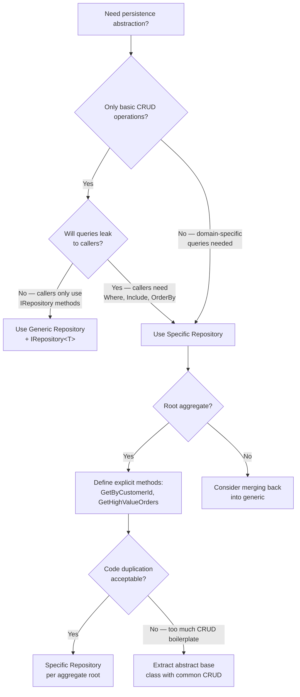

# 8.882 — Repository Pattern — Generic vs Specific

---

## 1. Overview — What Is a Repository Pattern

The **Repository pattern** mediates between the domain and data-mapping layers, acting like an in-memory collection of domain objects. Two major approaches exist:

| Dimension | Generic Repository (`IRepository<T>`) | Specific Repository (e.g. `IOrderRepository`) |
|---|---|---|
| **Scope** | All entities through one interface | One interface per aggregate root |
| **Methods** | `Add`, `GetById`, `GetAll`, `Remove` — identical shape | Domain-named methods: `GetByCustomerId`, `GetHighValueOrders` |
| **Reuse** | High — one CRUD base for every entity | Low — each repository has unique methods |
| **Expressiveness** | Poor — can't encode domain rules in method names | Rich — ubiquitous language in the interface |
| **Coupling** | Low — generic persistence abstraction | Higher — interface couples to domain concepts |

**Key trade-off**: generic minimises boilerplate but tempts callers to leak query logic; specific keeps queries encapsulated but duplicates CRUD setup.

---

## 2. Generic Repository — `IRepository<T>` Interface

```csharp
namespace Domain.Common;

public interface IRepository<T> where T : class
{
    Task<T?> GetByIdAsync(Guid id, CancellationToken ct = default);
    Task<IReadOnlyList<T>> GetAllAsync(CancellationToken ct = default);
    Task AddAsync(T entity, CancellationToken ct = default);
    Task UpdateAsync(T entity, CancellationToken ct = default);
    Task DeleteAsync(T entity, CancellationToken ct = default);
}
```

### 2.1 Generic EF Core Implementation

```csharp
namespace Infrastructure.Persistence.Repositories;

using Domain.Common;
using Microsoft.EntityFrameworkCore;
using System;
using System.Collections.Generic;
using System.Linq;
using System.Threading;
using System.Threading.Tasks;

public class GenericRepository<T> : IRepository<T>
    where T : class
{
    protected readonly DbContext _context;
    protected readonly DbSet<T> _dbSet;

    public GenericRepository(DbContext context)
    {
        _context = context ?? throw new ArgumentNullException(nameof(context));
        _dbSet = context.Set<T>();
    }

    public virtual async Task<T?> GetByIdAsync(Guid id, CancellationToken ct = default)
    {
        return await _dbSet.FindAsync(new object[] { id }, ct).ConfigureAwait(false);
    }

    public virtual async Task<IReadOnlyList<T>> GetAllAsync(CancellationToken ct = default)
    {
        return await _dbSet.AsNoTracking().ToListAsync(ct).ConfigureAwait(false);
    }

    public virtual async Task AddAsync(T entity, CancellationToken ct = default)
    {
        await _dbSet.AddAsync(entity, ct).ConfigureAwait(false);
    }

    public virtual Task UpdateAsync(T entity, CancellationToken ct = default)
    {
        _dbSet.Update(entity);
        return Task.CompletedTask;
    }

    public virtual Task DeleteAsync(T entity, CancellationToken ct = default)
    {
        _dbSet.Remove(entity);
        return Task.CompletedTask;
    }
}
```

**What happens under the hood** — EF Core translates `FindAsync` to a SQL query like:

```sql
SELECT TOP(1) [c].[Id], [c].[Name], [c].[CreatedAt]
FROM [Customers] AS [c]
WHERE [c].[Id] = @p0
```

`AsNoTracking` prevents the change tracker from materialising snapshots for read-only operations, reducing memory pressure.

### 2.2 Generic Dapper Implementation

```csharp
namespace Infrastructure.Persistence.Repositories.Dapper;

using Dapper;
using Domain.Common;
using System.Data;
using System.Text;

public class DapperGenericRepository<T> : IRepository<T>
    where T : class
{
    private readonly IDbConnection _connection;
    private readonly string _tableName;
    private readonly string _keyColumn;

    public DapperGenericRepository(IDbConnection connection,
        string tableName, string keyColumn = "Id")
    {
        _connection = connection ?? throw new ArgumentNullException(nameof(connection));
        _tableName = tableName;
        _keyColumn = keyColumn;
    }

    public async Task<T?> GetByIdAsync(Guid id, CancellationToken ct = default)
    {
        var sql = $"SELECT * FROM [{_tableName}] WHERE [{_keyColumn}] = @Id";
        var cmd = new CommandDefinition(sql, new { Id = id }, cancellationToken: ct);
        return await _connection.QuerySingleOrDefaultAsync<T>(cmd).ConfigureAwait(false);
    }

    public async Task<IReadOnlyList<T>> GetAllAsync(CancellationToken ct = default)
    {
        var sql = $"SELECT * FROM [{_tableName}]";
        var cmd = new CommandDefinition(sql, cancellationToken: ct);
        var result = await _connection.QueryAsync<T>(cmd).ConfigureAwait(false);
        return result.AsList();
    }

    public async Task AddAsync(T entity, CancellationToken ct = default)
    {
        var properties = typeof(T).GetProperties()
            .Where(p => p.Name != _keyColumn)
            .Select(p => p.Name);
        var columns = string.Join(", ", properties.Select(p => $"[{p}]"));
        var parameters = string.Join(", ", properties.Select(p => $"@{p}"));
        var sql = $"INSERT INTO [{_tableName}] ({columns}) VALUES ({parameters})";
        var cmd = new CommandDefinition(sql, entity, cancellationToken: ct);
        await _connection.ExecuteAsync(cmd).ConfigureAwait(false);
    }

    public async Task UpdateAsync(T entity, CancellationToken ct = default)
    {
        var properties = typeof(T).GetProperties()
            .Where(p => p.Name != _keyColumn)
            .Select(p => $"[{p.Name}] = @{p.Name}");
        var setClause = string.Join(", ", properties);
        var sql = $"UPDATE [{_tableName}] SET {setClause} WHERE [{_keyColumn}] = @{_keyColumn}";
        var cmd = new CommandDefinition(sql, entity, cancellationToken: ct);
        await _connection.ExecuteAsync(cmd).ConfigureAwait(false);
    }

    public async Task DeleteAsync(T entity, CancellationToken ct = default)
    {
        var keyValue = typeof(T).GetProperty(_keyColumn)?.GetValue(entity);
        var sql = $"DELETE FROM [{_tableName}] WHERE [{_keyColumn}] = @Id";
        var cmd = new CommandDefinition(sql, new { Id = keyValue }, cancellationToken: ct);
        await _connection.ExecuteAsync(cmd).ConfigureAwait(false);
    }
}
```

**Generated SQL** for `GetByIdAsync` on an `Orders` table:

```sql
SELECT * FROM [Orders] WHERE [Id] = @Id
```

Note the limitations of reflection-based mapping — it cannot handle complex property graphs, computed columns, or column name aliases without additional convention configuration.

---

## 3. Specific Repository — `IOrderRepository` Interface

```csharp
namespace Domain.Orders;

public interface IOrderRepository
{
    Task<Order?> GetByIdAsync(Guid orderId, CancellationToken ct = default);
    Task<IReadOnlyList<Order>> GetByCustomerIdAsync(Guid customerId, CancellationToken ct = default);
    Task<IReadOnlyList<Order>> GetHighValueOrdersAsync(decimal threshold, CancellationToken ct = default);
    Task<Order?> GetWithItemsAsync(Guid orderId, CancellationToken ct = default);
    Task<IReadOnlyList<Order>> GetPendingOrdersAsync(CancellationToken ct = default);
    Task AddAsync(Order order, CancellationToken ct = default);
    Task UpdateAsync(Order order, CancellationToken ct = default);
    Task DeleteAsync(Order order, CancellationToken ct = default);
}
```

### 3.1 Specific EF Core Implementation

```csharp
namespace Infrastructure.Persistence.Repositories;

using Domain.Orders;
using Microsoft.EntityFrameworkCore;

public class OrderRepository : IOrderRepository
{
    private readonly DbContext _context;
    private readonly DbSet<Order> _orders;

    public OrderRepository(DbContext context)
    {
        _context = context ?? throw new ArgumentNullException(nameof(context));
        _orders = context.Set<Order>();
    }

    public async Task<Order?> GetByIdAsync(Guid orderId, CancellationToken ct = default)
    {
        return await _orders.FindAsync(new object[] { orderId }, ct).ConfigureAwait(false);
    }

    public async Task<IReadOnlyList<Order>> GetByCustomerIdAsync(
        Guid customerId, CancellationToken ct = default)
    {
        return await _orders
            .AsNoTracking()
            .Where(o => o.CustomerId == customerId)
            .OrderByDescending(o => o.CreatedAt)
            .ToListAsync(ct)
            .ConfigureAwait(false);
    }

    public async Task<IReadOnlyList<Order>> GetHighValueOrdersAsync(
        decimal threshold, CancellationToken ct = default)
    {
        return await _orders
            .AsNoTracking()
            .Where(o => o.TotalAmount >= threshold)
            .OrderByDescending(o => o.TotalAmount)
            .ToListAsync(ct)
            .ConfigureAwait(false);
    }

    public async Task<Order?> GetWithItemsAsync(Guid orderId, CancellationToken ct = default)
    {
        return await _orders
            .Include(o => o.OrderItems)
                .ThenInclude(i => i.Product)
            .AsSplitQuery()
            .FirstOrDefaultAsync(o => o.Id == orderId, ct)
            .ConfigureAwait(false);
    }

    public async Task<IReadOnlyList<Order>> GetPendingOrdersAsync(CancellationToken ct = default)
    {
        return await _orders
            .AsNoTracking()
            .Where(o => o.Status == OrderStatus.Pending)
            .OrderBy(o => o.CreatedAt)
            .ToListAsync(ct)
            .ConfigureAwait(false);
    }

    public async Task AddAsync(Order order, CancellationToken ct = default)
    {
        await _orders.AddAsync(order, ct).ConfigureAwait(false);
    }

    public Task UpdateAsync(Order order, CancellationToken ct = default)
    {
        _orders.Update(order);
        return Task.CompletedTask;
    }

    public Task DeleteAsync(Order order, CancellationToken ct = default)
    {
        _orders.Remove(order);
        return Task.CompletedTask;
    }
}
```

**Generated SQL** for `GetHighValueOrdersAsync`:

```sql
SELECT [o].[Id], [o].[CustomerId], [o].[TotalAmount], [o].[Status], [o].[CreatedAt]
FROM [Orders] AS [o]
WHERE [o].[TotalAmount] >= @threshold
ORDER BY [o].[TotalAmount] DESC
```

For `GetWithItemsAsync` — EF Core's `AsSplitQuery` produces multiple queries to avoid Cartesian explosion:

```sql
-- Query 1: orders
SELECT [o].[Id], [o].[CustomerId], [o].[TotalAmount], [o].[Status], [o].[CreatedAt]
FROM [Orders] AS [o]
WHERE [o].[Id] = @orderId

-- Query 2: order items + product
SELECT [i].[Id], [i].[OrderId], [i].[ProductId], [i].[Quantity], [i].[UnitPrice],
       [p].[Id], [p].[Name], [p].[Price]
FROM [OrderItems] AS [i]
INNER JOIN [Products] AS [p] ON [i].[ProductId] = [p].[Id]
WHERE [i].[OrderId] = @orderId
ORDER BY [i].[OrderId]
```

### 3.2 Specific Dapper Implementation

```csharp
namespace Infrastructure.Persistence.Repositories.Dapper;

using Dapper;
using Domain.Orders;
using System.Data;

public class DapperOrderRepository : IOrderRepository
{
    private readonly IDbConnection _connection;

    public DapperOrderRepository(IDbConnection connection)
    {
        _connection = connection ?? throw new ArgumentNullException(nameof(connection));
    }

    public async Task<Order?> GetByIdAsync(Guid orderId, CancellationToken ct = default)
    {
        const string sql =
            """
            SELECT Id, CustomerId, TotalAmount, Status, CreatedAt
            FROM [Orders]
            WHERE Id = @Id
            """;
        var cmd = new CommandDefinition(sql, new { Id = orderId }, cancellationToken: ct);
        return await _connection.QuerySingleOrDefaultAsync<Order>(cmd).ConfigureAwait(false);
    }

    public async Task<IReadOnlyList<Order>> GetByCustomerIdAsync(
        Guid customerId, CancellationToken ct = default)
    {
        const string sql =
            """
            SELECT Id, CustomerId, TotalAmount, Status, CreatedAt
            FROM [Orders]
            WHERE CustomerId = @CustomerId
            ORDER BY CreatedAt DESC
            """;
        var cmd = new CommandDefinition(sql, new { CustomerId = customerId }, cancellationToken: ct);
        var result = await _connection.QueryAsync<Order>(cmd).ConfigureAwait(false);
        return result.AsList();
    }

    public async Task<IReadOnlyList<Order>> GetHighValueOrdersAsync(
        decimal threshold, CancellationToken ct = default)
    {
        const string sql =
            """
            SELECT Id, CustomerId, TotalAmount, Status, CreatedAt
            FROM [Orders]
            WHERE TotalAmount >= @Threshold
            ORDER BY TotalAmount DESC
            """;
        var cmd = new CommandDefinition(sql, new { Threshold = threshold }, cancellationToken: ct);
        var result = await _connection.QueryAsync<Order>(cmd).ConfigureAwait(false);
        return result.AsList();
    }

    public async Task<Order?> GetWithItemsAsync(Guid orderId, CancellationToken ct = default)
    {
        const string sql =
            """
            SELECT o.Id, o.CustomerId, o.TotalAmount, o.Status, o.CreatedAt,
                   i.Id, i.OrderId, i.ProductId, i.Quantity, i.UnitPrice,
                   p.Id, p.Name, p.Price
            FROM [Orders] o
            LEFT JOIN [OrderItems] i ON i.OrderId = o.Id
            LEFT JOIN [Products] p ON p.Id = i.ProductId
            WHERE o.Id = @Id
            ORDER BY i.Id
            """;
        var cmd = new CommandDefinition(sql, new { Id = orderId }, cancellationToken: ct);

        var orderDictionary = new Dictionary<Guid, Order>();

        await _connection.QueryAsync<Order, OrderItem, Product, Order>(
            sql,
            (order, item, product) =>
            {
                if (!orderDictionary.TryGetValue(order.Id, out var existing))
                {
                    existing = order;
                    existing.OrderItems = new List<OrderItem>();
                    orderDictionary.Add(existing.Id, existing);
                }
                if (item is not null)
                {
                    item.Product = product;
                    existing.OrderItems.Add(item);
                }
                return existing;
            },
            new { Id = orderId },
            splitOn: "Id,Id,Id"
        ).ConfigureAwait(false);

        return orderDictionary.Values.FirstOrDefault();
    }

    public async Task<IReadOnlyList<Order>> GetPendingOrdersAsync(CancellationToken ct = default)
    {
        const string sql =
            """
            SELECT Id, CustomerId, TotalAmount, Status, CreatedAt
            FROM [Orders]
            WHERE Status = @Status
            ORDER BY CreatedAt ASC
            """;
        var cmd = new CommandDefinition(sql, new { Status = nameof(OrderStatus.Pending) },
            cancellationToken: ct);
        var result = await _connection.QueryAsync<Order>(cmd).ConfigureAwait(false);
        return result.AsList();
    }

    // CRUD methods omitted for brevity — same pattern as generic Dapper above
    public async Task AddAsync(Order order, CancellationToken ct = default) { /* INSERT */ }
    public async Task UpdateAsync(Order order, CancellationToken ct = default) { /* UPDATE */ }
    public async Task DeleteAsync(Order order, CancellationToken ct = default) { /* DELETE */ }
}
```

The `GetWithItemsAsync` Dapper version uses multi-mapping to handle the `Order → OrderItem → Product` graph in a single round-trip:

```sql
SELECT o.Id, o.CustomerId, o.TotalAmount, o.Status, o.CreatedAt,
       i.Id, i.OrderId, i.ProductId, i.Quantity, i.UnitPrice,
       p.Id, p.Name, p.Price
FROM [Orders] o
LEFT JOIN [OrderItems] i ON i.OrderId = o.Id
LEFT JOIN [Products] p ON p.Id = i.ProductId
WHERE o.Id = @Id
ORDER BY i.Id
```

The result set repeats the order row per child row; the multi-map callback deduplicates into the aggregate root.

---

## 4. Decision Flow — Generic vs Specific



---

## 5. When to Use Which

| Scenario | Recommendation |
|---|---|
| CRUD-only entities (lookup tables, settings) | Generic — one `IRepository<T>` is enough |
| Rich aggregate roots (Order, Invoice, Customer) | Specific — domain methods tell a story |
| Team prefers Dapper over EF Core | Specific + base class — Dapper needs explicit SQL anyway |
| Rapid prototyping / early-stage app | Generic — defer specificity until query complexity grows |
| Read-modelled CQRS reads | Skip repository entirely — query direct with Dapper raw SQL |
| Write-heavy domain logic | Specific — encapsulate invariants in repository methods (e.g. `AddWithValidation`) |

---

## 6. EF Core — Specific Repository Advantages

EF Core's `IQueryable` leaks make generic repositories dangerous. Consider the difference:

### 6.1 Generic + IQueryable Leak (Anti-pattern)

```csharp
public interface IRepository<T>
{
    IQueryable<T> Query(); // LEAK — exposes IQueryable
}

public class CustomerService
{
    public async Task<IReadOnlyList<Customer>> GetVipCustomersAsync()
    {
        // Query logic lives in the service, not the repository
        return await _repository.Query()
            .Where(c => c.TotalOrders >= 100 && c.IsActive)
            .OrderByDescending(c => c.TotalOrders)
            .Take(10)
            .ToListAsync()
            .ConfigureAwait(false);
    }
}
```

**Problem**: Every service becomes a query layer. Changing storage (e.g. to a non-relational store) breaks every caller. The abstraction is a lie.

### 6.2 Specific Repository Keeps Queries Encapsulated

```csharp
public class VipCustomerReportService
{
    private readonly ICustomerRepository _customerRepo;

    public async Task<IReadOnlyList<VipCustomer>> GetReportAsync()
    {
        // No IQueryable — just a domain method
        return await _customerRepo.GetTopVipCustomersAsync(limit: 10)
            .ConfigureAwait(false);
    }
}
```

The service does not import `System.Linq`. The repository owns the query shape.

---

## 7. Dapper — Specific Repository Advantages

Dapper lacks `IQueryable`, so the leak argument is weaker. However, specific repositories shine because:

1. **SQL is explicit per method** — no generic SQL generator handles JOINs or window functions.
2. **Multi-mapping complexity** — `QueryAsync<T1,T2,T3>` overloads need the result-splitting column (`splitOn`), which is best scoped to one repository.
3. **Optimisation per query** — each method can add `WITH (NOLOCK)`, `OPTION (RECOMPILE)`, or index hints.

```csharp
public async Task<IReadOnlyList<MonthlyRevenue>> GetMonthlyRevenueAsync(
    int year, CancellationToken ct = default)
{
    const string sql =
        """
        SELECT
            DATEPART(MONTH, o.CreatedAt) AS [Month],
            SUM(o.TotalAmount) AS Revenue
        FROM [Orders] o
        WHERE o.Status NOT IN ('Cancelled', 'Refunded')
          AND YEAR(o.CreatedAt) = @Year
        GROUP BY DATEPART(MONTH, o.CreatedAt)
        ORDER BY [Month]
        """;
    var cmd = new CommandDefinition(sql, new { Year = year }, cancellationToken: ct);
    var result = await _connection.QueryAsync<MonthlyRevenue>(cmd).ConfigureAwait(false);
    return result.AsList();
}
```

This aggregation query cannot be generated generically — a specific repository method is the natural home.

---

## 8. Gotchas and Pitfalls

### 8.1 Generic Leaks Queryable
EF Core's `IRepository<T>` often exposes `IQueryable<T>` or a `Query()` method. This defeats the purpose of the repository — every consumer writes ad-hoc LINQ, making testing impossible (you cannot mock `IQueryable` provider reliably) and changes risky.

**Fix**: Either ban `IQueryable` from the interface entirely, or commit to a specific repository.

### 8.2 Generic Cannot Express Domain Queries
A generic `GetAllAsync` returns every row. You inevitably write `GetAllAsync().ContinueWith(...)` in callers, which loads the entire table into memory before filtering — a performance disaster.

```csharp
// BAD — loads ALL customers then filters in-memory
var all = await _customerRepo.GetAllAsync();
var vip = all.Where(c => c.TotalOrders >= 100);
```

**Fix**: Add pagination or predicate parameters, or switch to specific.

### 8.3 Specific Duplicates CRUD Boilerplate
Every specific repository repeats `GetByIdAsync`, `AddAsync`, `UpdateAsync`, `DeleteAsync`. For 30 aggregates that means 120 nearly identical methods.

**Fix**: Provide an abstract base class with virtual CRUD methods, then derive specific repositories that add domain queries:

```csharp
public abstract class EfCoreRepositoryBase<T, TId> : IRepository<T>
    where T : class
{
    // CRUD methods here — same as generic implementation
}

public class OrderRepository : EfCoreRepositoryBase<Order, Guid>, IOrderRepository
{
    // Only need to write the domain-specific methods!
    public async Task<IReadOnlyList<Order>> GetHighValueOrdersAsync(decimal threshold, ...)
    {
        // ...
    }
}
```

### 8.4 Mocking Fragility
Mocking a generic `IRepository<T>` for 20 entity types produces 20 mock setups. Specific repositories mock only the methods the service actually calls, reducing test noise.

### 8.5 Over-Specification
Creating a specific repository for every entity (even lookup tables like `Country`, `Currency`) is wasteful. Use a generic `IReadOnlyRepository<T>` for reference data and specific repositories only for aggregates.

---

## 9. Summary and Recommendations

| Approach | Best For | Avoid When |
|---|---|---|
| **Generic** | Lookup tables, CRUD-only entities, rapid prototyping | Rich domain logic, complex queries, testing-heavy codebase |
| **Specific + Base Class** | Aggregate roots (Order, Invoice, Customer) | Simple CRUD-only entities (use generic instead) |
| **Specific + Dapper** | High-performance paths, reporting, CQRS queries | Write-heavy domain (Dapper lacks change tracking) |

**Rule of thumb**: Start with a generic `IRepository<T>` for every aggregate, but **never** expose `IQueryable`. As soon as a service needs a non-trivial query, promote that aggregate to a specific repository. The base class keeps CRUD from duplicating.

**Hybrid architecture**:
- `IRepository<T>` (generic, no `IQueryable`) — for CRUD-only entities.
- `IOrderRepository : IRepository<Order>` — for aggregates with domain queries.
- Dapper-specific repos (no generic base) — for read-side CQRS where SQL is hand-crafted and optimised.

```csharp
// Example hybrid registration in DI
services.AddScoped(typeof(IRepository<>), typeof(GenericRepository<>));
services.AddScoped<IOrderRepository, OrderRepository>();
services.AddScoped<IReadOrderRepository, DapperReadOrderRepository>();
```

This gives you the best of both worlds: generic CRUD where it adds value, specific domain methods where they matter, and Dapper where performance counts.
